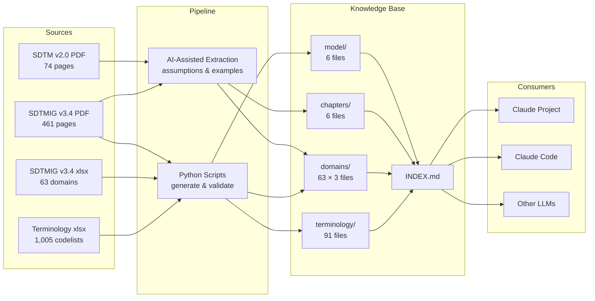

<div align="center">

<a href="https://git.io/typing-svg">
  
</a>

<p><strong>Turn unreadable PDFs into an AI-ready, instantly searchable SDTM knowledge base.</strong></p>

[](https://creativecommons.org/licenses/by/4.0/)
[]()
[]()
[]()
[]()
[]()
[]()

[English](README.md) | [中文](README_CN.md)

</div>

---

## About

CDISC SDTM standards are locked inside dense PDFs and sprawling Excel files — hard to search, hard to cross-reference, and nearly impossible for AI to use reliably.

**SDTM Pedia** converts these source documents into **293 structured Markdown files**, organized by domain, terminology, and conceptual model. The result is a knowledge base that both humans and AI can navigate instantly — no vector database required.

## Features

| Feature | Description |
|---------|-------------|
| **PDF → Markdown** | Transforms 535+ pages of SDTM PDF specifications into structured, searchable Markdown |
| **63 Domains** | Every SDTM IG v3.4 domain covered with `spec.md` + `assumptions.md` + `examples.md` |
| **37,939 Terms** | Complete CDISC Controlled Terminology — 1,005 codelists, fully indexed |
| **AI-Ready** | Designed as a knowledge base for LLMs — works directly with Claude Projects, Cursor, etc. |
| **Zero Infrastructure** | No vector database, no embedding pipeline — just files and directory structure |
| **Actively Maintained** | Ongoing iteration to improve retrieval precision and cross-referencing |

## Architecture



## Project Structure

```
sdtm-pedia/
├── knowledge_base/              # The knowledge base (293 files)
│   ├── INDEX.md                 # Master index — navigation entry point
│   ├── model/                   # SDTM v2.0 conceptual model (6 files)
│   │   ├── concepts_and_terms.md
│   │   ├── observation_classes.md
│   │   ├── special_purpose_domains.md
│   │   ├── associated_persons.md
│   │   ├── study_level_data.md
│   │   └── relationship_datasets.md
│   ├── chapters/                # SDTMIG v3.4 general chapters (6 files)
│   │   ├── ch01_introduction.md
│   │   ├── ch02_fundamentals.md
│   │   ├── ch03_submitting_data.md
│   │   ├── ch04_general_assumptions.md
│   │   ├── ch08_relationships.md
│   │   └── ch10_appendices.md
│   ├── domains/                 # 63 domains × 3 files each
│   │   ├── AE/
│   │   │   ├── spec.md          # Variable specification table
│   │   │   ├── assumptions.md   # Domain-specific business rules
│   │   │   └── examples.md      # Implementation examples with data
│   │   ├── CM/
│   │   ├── DM/
│   │   ├── LB/
│   │   └── ...                  # 63 domains total
│   ├── terminology/             # CDISC Controlled Terminology (91 files)
│   │   ├── core/                # Core codelists (42 files)
│   │   ├── questionnaires/      # Questionnaire codelists (43 files)
│   │   └── supplementary/       # Supplementary codelists (6 files)
│   ├── ROUTING.md               # Query routing index (Phase 6.1)
│   └── VARIABLE_INDEX.md        # Variable-level reverse index (Phase 6.3)
│
├── source/                      # Original CDISC source files
│   ├── SDTMIG v3.4 (no header footer).pdf
│   ├── SDTMIG_v3.4.xlsx
│   ├── SDTM_v2.0.pdf
│   └── SDTM Terminology.xlsx
│
├── ai_platforms/                # Phase 6.5 — AI platform deployment assets
│   ├── claude_projects/         # Claude Projects bundle (v2.6, 19 uploads)
│   ├── chatgpt_gpt/             # ChatGPT GPTs bundle (9 uploads)
│   ├── gemini_gems/             # Gemini Gems bundle (4 uploads)
│   ├── notebooklm/              # NotebookLM bundle (42 uploads)
│   └── release/v1.0/            # Self-contained company release (26M, 4 platforms)
│
├── .work/                       # Build workspace
│   ├── 00_planning/             # Design documents
│   ├── 01_generation/scripts/   # Python generation & validation scripts
│   ├── 02_indexing/             # PDF page index for extraction
│   ├── 03_verification/         # Verification results & reports
│   ├── 04_optimization/         # Phase 6 retrieval optimization
│   ├── 05_rag_kg/               # Phase 7 RAG + knowledge graph design
│   ├── 06_deep_verification/    # PDF→KB literal-level deep verification (in progress)
│   ├── 07_release/              # Release v1.0 plan + retrospective
│   ├── meta/                    # Work log, mappings, findings
│   └── MANIFEST.md              # File index & change chains
│
├── docs/                        # Project documentation
│   ├── PROGRESS.md              # Build progress dashboard
│   ├── TRACEABILITY.md          # Source-to-output traceability matrix
│   └── DESIGN_RAG_KG.md         # Phase 7 RAG + knowledge graph design
```

## Domain Coverage

<details>
<summary><b>Special-Purpose Domains (5)</b></summary>

| Domain | Name |
|--------|------|
| CO | Comments |
| DM | Demographics |
| SE | Subject Elements |
| SM | Subject Disease Milestones |
| SV | Subject Visits |

</details>

<details>
<summary><b>Interventions Domains (7)</b></summary>

| Domain | Name |
|--------|------|
| AG | Procedure Agents |
| CM | Concomitant/Prior Medications |
| EC | Exposure as Collected |
| EX | Exposure |
| ML | Meal Data |
| PR | Procedures |
| SU | Substance Use |

</details>

<details>
<summary><b>Events Domains (7)</b></summary>

| Domain | Name |
|--------|------|
| AE | Adverse Events |
| BE | Biospecimen Events |
| CE | Clinical Events |
| DS | Disposition |
| DV | Protocol Deviations |
| HO | Healthcare Encounters |
| MH | Medical History |

</details>

<details>
<summary><b>Findings Domains (31)</b></summary>

| Domain | Name |
|--------|------|
| BS | Biospecimen Findings |
| CP | Cell Phenotype Findings |
| CV | Cardiovascular System Findings |
| DA | Product Accountability |
| DD | Death Details |
| EG | ECG Test Results |
| FA | Findings About Events or Interventions |
| FT | Functional Tests |
| GF | Genomics Findings |
| IE | Inclusion/Exclusion Criteria Not Met |
| IS | Immunogenicity Specimen Assessments |
| LB | Laboratory Test Results |
| MB | Microbiology Specimen |
| MI | Microscopic Findings |
| MK | Musculoskeletal System Findings |
| MS | Microbiology Susceptibility |
| NV | Nervous System Findings |
| OE | Ophthalmic Examinations |
| PC | Pharmacokinetics Concentrations |
| PE | Physical Examination |
| PP | Pharmacokinetics Parameters |
| QS | Questionnaires |
| RE | Respiratory System Findings |
| RP | Reproductive System Findings |
| RS | Disease Response and Clin Classification |
| SC | Subject Characteristics |
| SR | Skin Response |
| SS | Subject Status |
| TR | Tumor/Lesion Results |
| TU | Tumor/Lesion Identification |
| UR | Urinary System Findings |
| VS | Vital Signs |

</details>

<details>
<summary><b>Trial Design Domains (7)</b></summary>

| Domain | Name |
|--------|------|
| TA | Trial Arms |
| TD | Trial Disease Assessments |
| TE | Trial Elements |
| TI | Trial Inclusion/Exclusion Criteria |
| TM | Trial Disease Milestones |
| TS | Trial Summary |
| TV | Trial Visits |

</details>

<details>
<summary><b>Relationship & Study Reference Domains (5)</b></summary>

| Domain | Name |
|--------|------|
| OI | Non-host Organism Identifiers |
| RELREC | Related Records |
| RELSPEC | Related Specimens |
| RELSUB | Related Subjects |
| SUPPQUAL | Supplemental Qualifiers |

</details>

## Quick Start

### Option A — Self-deploy on a hosted AI platform (recommended)

A turn-key release bundle for **4 platforms** (Claude Projects, ChatGPT GPTs, Gemini Gems, NotebookLM) ships at `ai_platforms/release/v1.0/`. Each platform sub-directory is self-contained: system prompt + uploads + step-by-step tutorial in 3 languages (zh/en/ja).

1. **Clone the repo**
   ```bash
   git clone https://github.com/hakupao/sdtm-pedia.git
   cd sdtm-pedia/ai_platforms/release/v1.0
   ```

2. **Pick a platform** — Read `self_deploy/README.en.md` for the decision tree (capacity, sharing, audio overview, etc.)

3. **Follow the tutorial** under `self_deploy/<platform>/tutorial.en.md` — all upload files and prompts are co-located in the same directory

4. **Verify with the demo question set** in `DEMO_QUESTIONS.md` (10 questions × 3 languages, expected answers included)

> See `USER_GUIDE.en.md` for the consumer-side overview, `KNOWN_LIMITATIONS.en.md` for caveats, and `CHANGELOG.md` for release history.

### Option B — Use with Claude Code

Point Claude Code at the `knowledge_base/` directory — it will use `INDEX.md` + `ROUTING.md` + `VARIABLE_INDEX.md` to navigate and read relevant files on demand.

```
What Required variables does AE have?
How should DM's RFSTDTC be populated?
Which codelist is SEX bound to?
```

### Option C — Use with Other LLMs

The knowledge base is plain Markdown — it works with any LLM that supports file-based context (Cursor, Windsurf, GitHub Copilot, etc.).

## Source Documents

| Document | Version | Content |
|----------|---------|---------|
| SDTM Implementation Guide | v3.4 | 461 pages — domain specs, assumptions, examples |
| SDTM (Study Data Tabulation Model) | v2.0 Final (2021-11-29) | 74 pages — conceptual model |
| SDTMIG v3.4 xlsx | — | 1,917 variables across 63 domains |
| SDTM Terminology xlsx | — | 1,005 codelists / 37,939 terms |

## Roadmap

- [x] Phase 1 — xlsx auto-generation (spec.md + terminology)
- [x] Phase 2 — PDF page indexing
- [x] Phase 3 — PDF batch extraction (assumptions + examples)
- [x] Phase 4 — Supplementary content (model + chapters)
- [x] Phase 5 — Validation & INDEX.md
- [x] Phase 6.1 — Query routing index (`knowledge_base/ROUTING.md`)
- [x] Phase 6.2 — Cross-references between domains (in `spec.md` of each domain)
- [x] Phase 6.3 — Variable-level reverse index (`knowledge_base/VARIABLE_INDEX.md`, 1,523 variables)
- [x] Phase 6.5 — Multi-platform AI deployment + Release v1.0 (4 platforms, `ai_platforms/release/v1.0/`)
- [ ] Phase 6.4 — Structured metadata (YAML/JSON) — merged into Phase 7 Step 7
- [ ] Phase 7 — RAG + knowledge graph + dataset validation (design complete, see `docs/DESIGN_RAG_KG.md`)
- [ ] Deep verification — literal-level PDF→KB atom-by-atom audit (in progress, see `.work/06_deep_verification/`)

## Disclaimer

The knowledge base content is derived from CDISC published standards. **CDISC** is a registered trademark of the Clinical Data Interchange Standards Consortium. This project is **NOT** affiliated with, endorsed by, or sponsored by CDISC.

- The original CDISC source files (PDFs/xlsx) are **NOT** included in this repository due to copyright restrictions
- This knowledge base should **NOT** be considered a substitute for official CDISC publications
- For regulatory submissions, always refer to the original CDISC standards

For the full disclaimer, see [DISCLAIMER.md](DISCLAIMER.md).

## License

This work is licensed under a [Creative Commons Attribution 4.0 International License](https://creativecommons.org/licenses/by/4.0/). This license applies only to the original structuring and formatting work — the underlying standard definitions remain the intellectual property of CDISC.

## Acknowledgements

- [CDISC](https://www.cdisc.org/) — For developing and publishing the SDTM standards
- [Claude](https://claude.ai/) — AI-assisted extraction and validation pipeline

---

<div align="center">

[](https://star-history.com/#hakupao/sdtm-pedia)

<a href="https://github.com/hakupao/sdtm-pedia/graphs/contributors">
  
</a>

<br/>

**If this project helps your SDTM work, a star would be appreciated!**

</div>

<p align="right">(<a href="#top">back to top</a>)</p>
