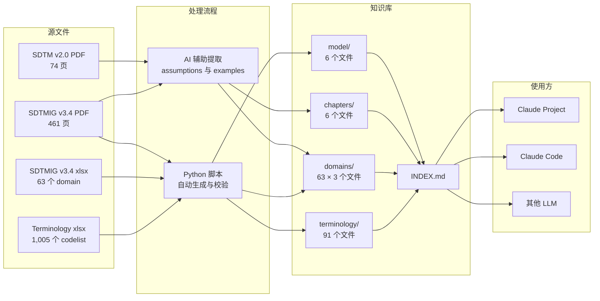

<div align="center">

<a href="https://git.io/typing-svg">
  
</a>

<p><strong>将难以检索的 PDF 规范，转化为 AI 可即时查询的 SDTM 结构化知识库。</strong></p>

[](https://creativecommons.org/licenses/by/4.0/)
[]()
[]()
[]()
[]()
[]()
[]()

[English](README.md) | [中文](README_CN.md)

</div>

---

## 关于本项目

CDISC SDTM 标准被锁在厚重的 PDF 和庞大的 Excel 文件中——难以检索、难以交叉引用，AI 更是几乎无法可靠地使用。

**SDTM Pedia** 将这些源文件转换为 **293 个结构化 Markdown 文件**，按 domain、术语和概念模型分类组织。最终产出一个人类和 AI 都能即时检索的知识库——无需向量数据库，无需额外基础设施。

> **AI 提取的知识库怎么信？** 详见 [METHODOLOGY.md](METHODOLOGY.md) — 数据来源、可追溯性、校验阶段抓到并修复的两个问题，以及任何一条答案怎么对照 PDF 自行核验。

## 核心特性

| 特性 | 说明 |
|------|------|
| **PDF → Markdown** | 将 535+ 页 SDTM PDF 规范转化为结构化、可检索的 Markdown |
| **63 个 Domain** | 完整覆盖 SDTM IG v3.4 全部 domain，每个含 `spec.md` + `assumptions.md` + `examples.md` |
| **37,939 个术语** | 完整的 CDISC Controlled Terminology——1,005 个 codelist，全部索引 |
| **AI 友好** | 专为 LLM 设计的知识库结构——可直接用于 Claude Projects、Cursor 等 |
| **零基础设施** | 无需向量数据库、无需嵌入管道——仅靠文件和目录结构即可工作 |
| **持续迭代** | 正在持续优化检索精度和交叉引用能力 |

## 架构设计



## 项目结构

```
sdtm-pedia/
├── knowledge_base/              # 知识库（293 个文件）
│   ├── INDEX.md                 # 全局索引——导航入口
│   ├── model/                   # SDTM v2.0 概念模型（6 个文件）
│   │   ├── concepts_and_terms.md
│   │   ├── observation_classes.md
│   │   ├── special_purpose_domains.md
│   │   ├── associated_persons.md
│   │   ├── study_level_data.md
│   │   └── relationship_datasets.md
│   ├── chapters/                # SDTMIG v3.4 通用章节（6 个文件）
│   │   ├── ch01_introduction.md
│   │   ├── ch02_fundamentals.md
│   │   ├── ch03_submitting_data.md
│   │   ├── ch04_general_assumptions.md
│   │   ├── ch08_relationships.md
│   │   └── ch10_appendices.md
│   ├── domains/                 # 63 个 domain × 每个 3 个文件
│   │   ├── AE/
│   │   │   ├── spec.md          # 变量规格表
│   │   │   ├── assumptions.md   # Domain 特有业务规则
│   │   │   └── examples.md      # 实现示例与数据表
│   │   ├── CM/
│   │   ├── DM/
│   │   ├── LB/
│   │   └── ...                  # 共 63 个 domain
│   ├── terminology/             # CDISC 受控术语（91 个文件）
│   │   ├── core/                # 核心 codelist（42 个文件）
│   │   ├── questionnaires/      # 问卷 codelist（43 个文件）
│   │   └── supplementary/       # 补充 codelist（6 个文件）
│   ├── ROUTING.md               # 问题路由索引（Phase 6.1）
│   └── VARIABLE_INDEX.md        # 变量级反向索引（Phase 6.3）
│
├── source/                      # CDISC 原始源文件
│   ├── SDTMIG v3.4 (no header footer).pdf
│   ├── SDTMIG_v3.4.xlsx
│   ├── SDTM_v2.0.pdf
│   └── SDTM Terminology.xlsx
│
├── ai_platforms/                # Phase 6.5 — AI 平台部署资产
│   ├── claude_projects/         # Claude Projects 部署包（v2.6, 19 上传）
│   ├── chatgpt_gpt/             # ChatGPT GPTs 部署包（9 上传）
│   ├── gemini_gems/             # Gemini Gems 部署包（4 上传）
│   ├── notebooklm/              # NotebookLM 部署包（42 上传）
│   └── release/v1.0/            # 公司发布版（自包含, 26M, 4 平台）
│
├── .work/                       # 构建工作区
│   ├── 00_planning/             # 方案设计文档
│   ├── 01_generation/scripts/   # Python 生成与校验脚本
│   ├── 02_indexing/             # PDF 页码索引
│   ├── 03_verification/         # 验证结果与报告
│   ├── 04_optimization/         # Phase 6 检索优化
│   ├── 05_rag_kg/               # Phase 7 RAG + 知识图谱设计
│   ├── 06_deep_verification/    # PDF→KB 字面级深审（进行中）
│   ├── 07_release/              # Release v1.0 计划与复盘
│   ├── meta/                    # 工作日志、映射、质量记录
│   └── MANIFEST.md              # 文件清单与变更链
│
├── docs/                        # 项目文档
│   ├── PROGRESS.md              # 构建进度看板
│   ├── TRACEABILITY.md          # 溯源矩阵
│   └── DESIGN_RAG_KG.md         # Phase 7 RAG + 知识图谱设计
```

## Domain 覆盖范围

<details>
<summary><b>特殊用途域（5 个）</b></summary>

| Domain | 名称 |
|--------|------|
| CO | Comments（注释） |
| DM | Demographics（人口统计学） |
| SE | Subject Elements（受试者阶段） |
| SM | Subject Disease Milestones（受试者疾病里程碑） |
| SV | Subject Visits（受试者访视） |

</details>

<details>
<summary><b>干预域（7 个）</b></summary>

| Domain | 名称 |
|--------|------|
| AG | Procedure Agents（手术用药） |
| CM | Concomitant/Prior Medications（合并/既往用药） |
| EC | Exposure as Collected（暴露-采集态） |
| EX | Exposure（暴露） |
| ML | Meal Data（饮食数据） |
| PR | Procedures（手术/操作） |
| SU | Substance Use（物质使用） |

</details>

<details>
<summary><b>事件域（7 个）</b></summary>

| Domain | 名称 |
|--------|------|
| AE | Adverse Events（不良事件） |
| BE | Biospecimen Events（生物标本事件） |
| CE | Clinical Events（临床事件） |
| DS | Disposition（受试者处置） |
| DV | Protocol Deviations（方案偏离） |
| HO | Healthcare Encounters（医疗接触） |
| MH | Medical History（既往病史） |

</details>

<details>
<summary><b>发现域（31 个）</b></summary>

| Domain | 名称 |
|--------|------|
| BS | Biospecimen Findings（生物标本发现） |
| CP | Cell Phenotype Findings（细胞表型发现） |
| CV | Cardiovascular System Findings（心血管系统发现） |
| DA | Product Accountability（产品清点） |
| DD | Death Details（死亡详情） |
| EG | ECG Test Results（心电图检查结果） |
| FA | Findings About Events or Interventions（事件/干预相关发现） |
| FT | Functional Tests（功能检查） |
| GF | Genomics Findings（基因组发现） |
| IE | Inclusion/Exclusion Criteria Not Met（未满足的入排标准） |
| IS | Immunogenicity Specimen Assessments（免疫原性标本评估） |
| LB | Laboratory Test Results（实验室检查结果） |
| MB | Microbiology Specimen（微生物学标本） |
| MI | Microscopic Findings（显微镜发现） |
| MK | Musculoskeletal System Findings（肌肉骨骼系统发现） |
| MS | Microbiology Susceptibility（微生物药敏） |
| NV | Nervous System Findings（神经系统发现） |
| OE | Ophthalmic Examinations（眼科检查） |
| PC | Pharmacokinetics Concentrations（药代动力学浓度） |
| PE | Physical Examination（体格检查） |
| PP | Pharmacokinetics Parameters（药代动力学参数） |
| QS | Questionnaires（问卷） |
| RE | Respiratory System Findings（呼吸系统发现） |
| RP | Reproductive System Findings（生殖系统发现） |
| RS | Disease Response and Clin Classification（疾病应答与临床分类） |
| SC | Subject Characteristics（受试者特征） |
| SR | Skin Response（皮肤反应） |
| SS | Subject Status（受试者状态） |
| TR | Tumor/Lesion Results（肿瘤/病灶结果） |
| TU | Tumor/Lesion Identification（肿瘤/病灶识别） |
| UR | Urinary System Findings（泌尿系统发现） |
| VS | Vital Signs（生命体征） |

</details>

<details>
<summary><b>试验设计域（7 个）</b></summary>

| Domain | 名称 |
|--------|------|
| TA | Trial Arms（试验组别） |
| TD | Trial Disease Assessments（试验疾病评估） |
| TE | Trial Elements（试验阶段） |
| TI | Trial Inclusion/Exclusion Criteria（试验入排标准） |
| TM | Trial Disease Milestones（试验疾病里程碑） |
| TS | Trial Summary（试验概要） |
| TV | Trial Visits（试验访视） |

</details>

<details>
<summary><b>关系与研究参考域（5 个）</b></summary>

| Domain | 名称 |
|--------|------|
| OI | Non-host Organism Identifiers（非宿主生物标识符） |
| RELREC | Related Records（关联记录） |
| RELSPEC | Related Specimens（关联标本） |
| RELSUB | Related Subjects（关联受试者） |
| SUPPQUAL | Supplemental Qualifiers（补充限定符） |

</details>

## 快速开始

### 方式 A — 在主流 AI 平台自部署（推荐）

`ai_platforms/release/v1.0/` 提供 **4 个平台**（Claude Projects / ChatGPT GPTs / Gemini Gems / NotebookLM）的开箱即用部署包。每个平台子目录自成一体：system prompt + 上传文件 + 三语教程（zh/en/ja）。

1. **克隆仓库**
   ```bash
   git clone https://github.com/hakupao/sdtm-pedia.git
   cd sdtm-pedia/ai_platforms/release/v1.0
   ```

2. **挑一个平台** — 阅读 `self_deploy/README.zh.md` 中的决策树（容量、分享方式、Audio Overview 等）

3. **跟着教程走** — `self_deploy/<平台>/tutorial.zh.md`，所需上传文件和 prompt 都在同一目录

4. **用演示题验证** — `DEMO_QUESTIONS.md` 含 10 题 × 三语 + 期望答案

> 消费者侧总览见 `USER_GUIDE.zh.md`，已知限制见 `KNOWN_LIMITATIONS.en.md`，发布历史见 `CHANGELOG.md`。

### 方式 B — 搭配 Claude Code 使用

将 Claude Code 指向 `knowledge_base/` 目录，它会通过 `INDEX.md` + `ROUTING.md` + `VARIABLE_INDEX.md` 自动导航并按需读取相关文件。

```
AE domain 有哪些 Required 变量？
DM 的 RFSTDTC 怎么填？
SEX 绑定哪个 codelist？
```

### 方式 C — 搭配其他 LLM 使用

知识库是纯 Markdown 格式，可用于任何支持文件上下文的 LLM（Cursor、Windsurf、GitHub Copilot 等）。

## 源文件

| 文档 | 版本 | 内容 |
|------|------|------|
| SDTM Implementation Guide | v3.4 | 461 页——domain 规范、假设、示例 |
| SDTM（Study Data Tabulation Model） | v2.0 Final（2021-11-29） | 74 页——概念模型 |
| SDTMIG v3.4 xlsx | — | 63 个 domain，1,917 个变量 |
| SDTM Terminology xlsx | — | 1,005 个 codelist / 37,939 个术语 |

## 路线图

- [x] Phase 1 — xlsx 自动生成（spec.md + terminology）
- [x] Phase 2 — PDF 页码索引
- [x] Phase 3 — PDF 逐批提取（assumptions + examples）
- [x] Phase 4 — 补充内容（model + chapters）
- [x] Phase 5 — 验证与 INDEX.md
- [x] Phase 6.1 — 问题路由索引（`knowledge_base/ROUTING.md`）
- [x] Phase 6.2 — Domain 交叉引用（写入各 domain 的 `spec.md` 末尾）
- [x] Phase 6.3 — 变量级反向索引（`knowledge_base/VARIABLE_INDEX.md`，1,523 个变量）
- [x] Phase 6.5 — 多平台 AI 部署 + Release v1.0（4 平台，`ai_platforms/release/v1.0/`）
- [ ] Phase 6.4 — 结构化元数据（YAML/JSON）— 已并入 Phase 7 Step 7
- [ ] Phase 7 — RAG + 知识图谱 + 数据集校验（设计完成，详见 `docs/DESIGN_RAG_KG.md`）
- [ ] Deep Verification — PDF→KB 字面级 atom 逐条审计（进行中，详见 `.work/06_deep_verification/`）

## 免责声明

知识库内容源自 CDISC 发布的标准。**CDISC** 是 Clinical Data Interchange Standards Consortium 的注册商标。本项目与 CDISC **没有**任何隶属、背书或赞助关系。

- 由于版权限制，原始 CDISC 源文件（PDF/xlsx）**未包含**在本仓库中
- 本知识库**不应**被视为 CDISC 官方出版物的替代品
- 用于监管提交时，请始终参考 CDISC 官方标准

完整免责声明请参阅 [DISCLAIMER.md](DISCLAIMER.md)。

## 许可协议

本项目采用 [知识共享署名 4.0 国际许可协议](https://creativecommons.org/licenses/by/4.0/deed.zh-hans) 进行许可。该许可仅适用于知识库的原创结构化和格式化工作——底层标准定义的知识产权仍归 CDISC 所有。

## 致谢

- [CDISC](https://www.cdisc.org/) — 制定并发布 SDTM 标准
- [Claude](https://claude.ai/) — AI 辅助提取与校验流程

---

<div align="center">

[](https://star-history.com/#hakupao/sdtm-pedia)

<a href="https://github.com/hakupao/sdtm-pedia/graphs/contributors">
  
</a>

<br/>

**如果这个项目对你的 SDTM 工作有帮助，欢迎点个 Star！**

</div>

<p align="right">(<a href="#top">back to top</a>)</p>
