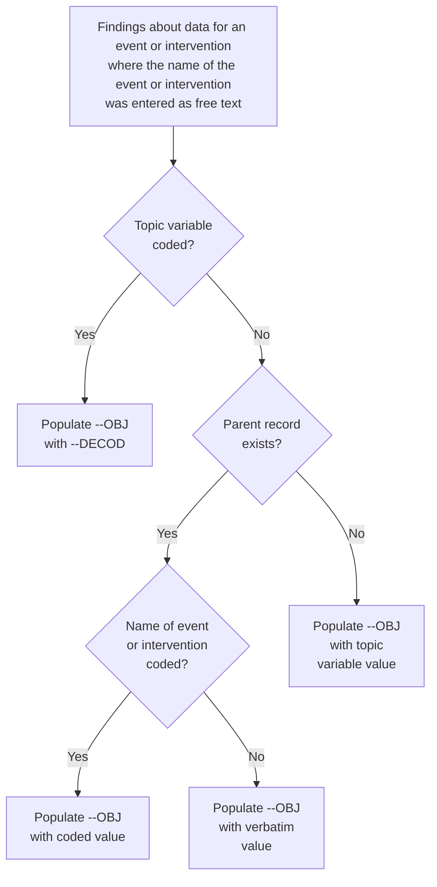
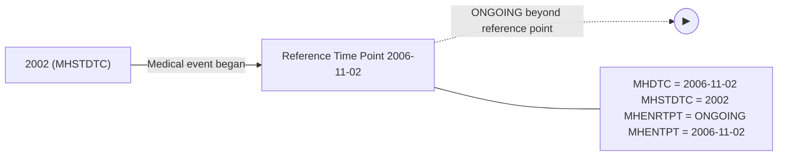
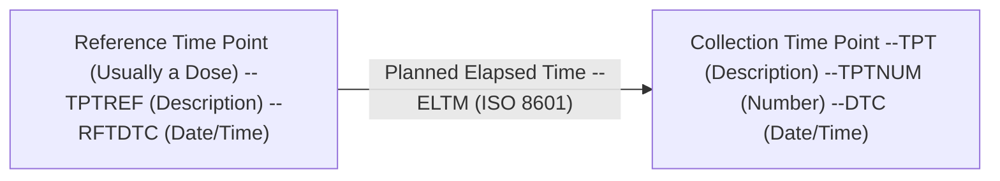
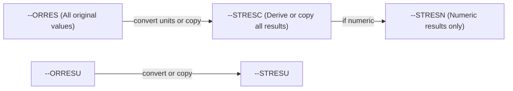

<!-- generated by scripts/compress_chapters.py (source mtime: 2026-04-16 00:35) -->

# SDTMIG v3.4 - Chapters (Compressed)

Six chapter compressions. ch04 (General Assumptions) is preserved verbatim; others are compressed by removing prose, illustrative example data tables, and legalese while retaining all Specification tables, numbered rule lists, and variable / codelist / domain-code references.

---

<!-- source: knowledge_base/chapters/ch01_introduction.md -->

# SDTMIG v3.4 — Chapter 1: Introduction

## 1.1 Purpose

SDTMIG v3.4 guides the organization, structure, and format of standard clinical trial tabulation datasets submitted to regulatory authorities. v3.4 supersedes all prior versions. Use in concert with SDTM v2.0.

## 1.2 Organization of this Document

| Section | Title | Description |
|---------|-------|-------------|
| 1 | Introduction | Overall introduction to v3.4 models; changes from prior versions |
| 2 | Fundamentals of the SDTM | Basic concepts of the SDTM; how to use SDTMIG with SDTM |
| 3 | Submitting Data in Standard Format | How to describe metadata for regulatory submissions; conformance assessment |
| 4 | Assumptions for Domain Models | Basic concepts, business rules, and assumptions before applying domain models |
| 5 | Models for Special-purpose Domains | Special-purpose domains: Demographics, Comments, Subject Visits, Subject Elements |
| 6 | Domain Models Based on the General Observation Classes | Specific metadata models based on the 3 GOC, with assumptions and examples |
| 7 | Trial Design Model Datasets | Domains for trial-level data, with assumptions and examples |
| 8 | Representing Relationships and Data | How to represent relationships between domains, datasets, and records |
| 9 | Study References | Structures for study-specific terminology used in subject data |
| 10 | Appendices | Additional background material and supplemental material |

## 1.3 Relationship to Prior CDISC Documents

All updates are backward-compatible; full diff in Appendix E. CT is updated quarterly; see Section 4.3 and the CDISC CT site.

The most significant changes since SDTMIG v3.3 include:The most significant changes since SDTMIG v3.3 include:

- Expanded the scope of the DA domain to include study products in addition to study drugs
- Grouped specimen-based lab domains (e.g., CP, GF, LB) in Sections 6.3.5.1-6.3.5.9 and added a generic specification
- Expanded the scope of the IS domain for assessments of antigen-induced humoral or cell-mediated immune response; added 3 new variables (Binding Agent, Molecule Secreted by Cells, Test Operational Objective)
- Updated the LB domain specification to include 10 new variables (Test Condition, Binding Agent, Test Operational Objective, Result Scale, Result Type, Collected Summary Result Type, Lower Limit of Detection, Method Sensitivity, Point in Time Flag, and Planned Duration)
- Decommissioned the Morphology (MO) domain
- Added Cell Phenotyping Findings (CP) and Genomics Findings (GF) domains
- Copied in Biospecimen Events (BE), Biospecimen Findings (BS), and Related Specimens (RELSPEC) from the provisional SDTMIG-PGx v1.0
- Updated QRS specifications and assumptions; introduced subsections for RS Disease Response and RS Clinical Classifications use cases
- Updated Tumor/Lesion (TU and TR) domain assumptions to describe use of indicator questions, disease recurrence conventions, and modeling of location of interest
- Expanded the scope of the SC domain to support collection over time
- Updated guidance and examples for the FA domain
- Corrected Core values for: DSDY, DSSTDY, LBSTREFC, MILOBXFL, and MIBLFL
- Updated Controlled Terminology for applicable variables across all domains, if available
- Removed Appendix C1, Trial Summary Codes

### Related Implementation Guides

| Guide | Scope |
|-------|-------|
| SDTMIG-AP | Associated Persons — data about persons who are not study subjects |
| SDTMIG-MD | Medical Devices — data about devices |
| SDTMIG-PGx | Pharmacogenomics/Genetics — largely incorporated into/superseded by SDTMIG v3.4 |

## 1.4 How to Read this Implementation Guide

Recommended reading order: SDTM -> §1-3 -> §4 Assumptions -> §5-6 -> §7 Trial Design -> §8 Relationships -> §9 Study References -> appendices (esp. Appendix C, Controlled Terminology). See also SDTMIG-AP and SDTMIG-MD.

### 1.4.1 How to Read a Domain Specification

A domain specification table includes rows for all required and expected variables and for a set of permissible variables. The permissible variables do not include all the variables that are allowed for the domain; they are a set of variables that the SDS Team considered likely to be included. The columns of the table are:

| Column | Description |
|--------|-------------|
| **Variable Name** | Standard name; variables without domain prefix are taken from SDTM directly; `--` is replaced by 2-character domain code |
| **Variable Label** | Longer name; may be same as SDTM label or customized for the domain. Sponsors should create an appropriate label if they include in a dataset an allowable variable not in the domain specification. |
| **Type** | SAS datatypes: "Num" or "Char" |
| **Controlled Terms, Codelist, or Format** | Controlled terminology references: an asterisk (*) indicates the variable may be subject to controlled terminology. Specifically, the asterisk means one of the following: (1) the controlled terminology might be of a type that would inherently be sponsor-defined; (2) the controlled terminology might be of a type that could be standardized, but for which a codelist has not yet been developed; or (3) the controlled terminology might be terminology specified in value-level metadata. Codelist references follow these conventions: (a) a hyperlinked codelist name in parentheses indicates that the variable is subject to the CDISC Controlled Terminology in that named codelist; (b) multiple hyperlinked codelist names indicate that the variable is subject to 1 or more of those named codelists from CDISC Controlled Terminology (if multiple codelists are in use for a single domain, value-level metadata indicates where each codelist is applicable); (c) a hyperlinked codelist name AND an asterisk (*) together indicate that the variable is subject to either the named CDISC Controlled Terminology codelist or to an external dictionary (the specific dictionary is identified in the metadata). The name of an external code system (e.g., MedDRA) is listed as plain text. "ISO 8601 datetime or interval" or "ISO 8601 duration" in plain text indicates that the variable values should be formatted in conformance with that standard. |
| **Role** | From the SDTM; SDTM includes the qualified variable for Variable/Synonym Qualifiers, but SDTMIG does not |
| **CDISC Notes** | Variable description, relationship to other variables, population rules, and example values. Such examples are only examples, and although they may be CDISC Controlled Terminology values, their presence in a CDISC Note should not be construed as definitive. For authoritative information on CDISC Controlled Terminology, consult the NCI website (https://www.cancer.gov/research/resources/terminology/cdisc). |
| **Core** | "Req" (Required), "Exp" (Expected), or "Perm" (Permissible) |

---

<!-- source: knowledge_base/chapters/ch02_fundamentals.md -->

# SDTMIG v3.4 — Chapter 2: Fundamentals of the SDTM

## 2.1 Observations and Variables

The SDTM is built around **observations** (rows) described by **variables** (columns); each variable has a **role**.

### Variable Roles (5 major roles)

1. **Identifier variables** — identify the study, subject, domain, and sequence number of the record
2. **Topic variables** — specify the focus of the observation (e.g., the name of a lab test)
3. **Timing variables** — describe the timing of an observation (e.g., start date and end date)
4. **Qualifier variables** — include additional illustrative text or numeric values that describe the results or additional traits
5. **Rule variables** — describe the condition to start, end, branch, or loop in the Trial Design Model

### Qualifier Variable Subclasses

| Subclass | Purpose | Examples |
|----------|---------|----------|
| **Grouping Qualifiers** | Group together a collection of observations within the same domain | --CAT, --SCAT |
| **Result Qualifiers** | Describe the specific results associated with the topic variable (Findings only) | --ORRES, --STRESC, --STRESN |
| **Synonym Qualifiers** | Specify an alternative name for a particular variable | --MODIFY, --DECOD (for --TRT/--TERM); --TEST, --LOINC (for --TESTCD) |
| **Record Qualifiers** | Define additional attributes of the observation record as a whole (rather than describing a particular variable within a record) | --REASND, AESLIFE and other SAE flags (AE domain); AGE, SEX, RACE (DM domain); --BLFL, --POS, --LOC, --SPEC, --NAM (Findings) |
| **Variable Qualifiers** | Modify or describe a specific variable within an observation; are only meaningful in the context of the variable they qualify | --ORRESU, --ORNRHI, --ORNRLO (Variable Qualifiers of --ORRES); --DOSU (Variable Qualifier of --DOSE) |

## 2.2 Datasets and Domains## 2.2 Datasets and Domains

A **domain** is a collection of logically related observations with a common topic. Each domain is represented by a single dataset.

Each domain dataset is distinguished by a unique, 2-character code (DOMAIN) used in 4 ways:
1. As the dataset name
2. As the value of the DOMAIN variable in that dataset
3. As a prefix for most variable names in that dataset
4. As a value in the RDOMAIN variable in relationship tables

All datasets are structured as flat files with rows=observations and columns=variables. Metadata live in the Define-XML document.

Data represented in SDTM datasets include:Data represented in SDTM datasets include:
- Data as originally collected or received
- Data from the protocol
- Assigned data
- Derived data

## 2.3 The General Observation Classes

Most subject-level observations should be represented according to 1 of the 3 SDTM general observation classes:

| Class | What it captures | Examples |
|-------|-----------------|----------|
| **Interventions** | Investigational, therapeutic, and other treatments administered to or used by a subject (with some actual or expected physiological effect), including treatments that are self-administered by the subject (i.e., use of alcohol, tobacco, or caffeine) | Exposure (EX), Concomitant Medications (CM), Procedures (PR) |
| **Events** | Planned protocol milestones and occurrences, conditions, or incidents independent of planned evaluations | Adverse Events (AE), Disposition (DS), Medical History (MH) |
| **Findings** | Observations from planned evaluations to address specific tests or questions, including questionnaires | Laboratory Tests (LB), Vital Signs (VS), ECG (EG) |

See §8.6.1 for GOC selection guidance; §4 for general assumptions.

## 2.4 Datasets Other than General Observation Class Domains## 2.4 Datasets Other than General Observation Class Domains

The SDTM includes 4 types of datasets other than those based on the general observation classes:

| Type | Description | Examples | Section |
|------|-------------|----------|---------|
| **Special-purpose domains** | Subject-level data not conforming to a GOC | DM, CO, SE, SV | Section 5 |
| **Trial Design Model (TDM)** | Study design information, not subject data | TA, TE | Section 7 |
| **Relationship datasets** | Describe relationships among datasets/records | RELREC, SUPP-- | Section 8 |
| **Study Reference datasets** | Study-specific terminology | DI, OI | Section 9 |

## 2.5 The SDTM Standard Domain Models

Submit only domains actually collected (or directly derived). Tabulation (SDTM) data must be traceable to any ADaM analysis dataset.

### General rules for determining which variables to include:

1. The Identifier variables **STUDYID, DOMAIN, USUBJID, and --SEQ** are required in all domains based on a general observation class
2. Any Timing variables are permissible for use in any submission dataset based on a GOC except where restricted by specific domain assumptions
3. Any additional Qualifier variables from the same GOC may be added to a domain model except where restricted
4. Sponsors may not add any variables other than those described above — use Supplemental Qualifiers (SUPP--) for non-standard variables
5. Standard variables must not be renamed or modified for novel usage
6. A Permissible variable should be used in an SDTM dataset wherever appropriate. If a study includes a data item that would be represented in a Permissible variable, then that variable must be included in the SDTM dataset, even if null
7. If a study did not include a data item that would be represented in a Permissible variable, then that variable should not be included in the SDTM dataset and should not be declared in the Define-XML document

## 2.6 Creating a New Domain

Process for creating a custom domain (must be based on 1 of the 3 GOC):

1. Confirm that none of the existing published domains will fit the need. A custom domain may only be created if the data are different in nature and do not fit into an existing published domain. Examples of distinct topics that warrant separate domains include microbiology, tumor measurements, pathology/histology, vital signs, and physical exam results.
   - Data should be grouped by topic and nature, not by collection method. --CAT, --SCAT, --METHOD, --SPEC, and --LOC can distinguish data within a domain.
   - Data that were collected on separate CRF modules or pages may fit into an existing domain (e.g., separate questionnaires into the QS domain, prior and concomitant medications in the CM domain).
2. Check the SDTM Draft Domains area of the CDISC wiki for proposed domains
3. Look for an existing, relevant domain model to serve as a prototype. Follow these steps:
   - a. Select required identifier variables (STUDYID, DOMAIN, USUBJID, --SEQ)
   - b. Include the topic variable from the identified GOC (e.g., --TESTCD for Findings)
   - c. Select relevant qualifier variables from the identified GOC. Variables belonging to other general observation classes must not be added
   - d. Select applicable timing variables
   - e. Determine the domain code (not in CDISC CT Domain Abbreviations codelist; AD, AX, AP, SQ, SA may not be used)
   - f. Apply the 2-character domain code to variable prefixes
   - g. Set variable order consistent with the SDTM
   - h. Adjust labels using title case
   - i. Ensure appropriate standard variables are properly applied
   - j. Describe the dataset in the Define-XML document
   - k. Place non-standard variables in a SUPP-- dataset

**Key rules for custom domains:**
- Do not create separate domains based on time (represent both prior and current in one domain; AE and MH are exceptions)
- Do not create "efficacy" domains — data collected for analysis must still go in standard domains
- For hierarchical data, establish domain pairs (e.g., MB/MS, PC/PP)
- Domain pairs use DOMAIN as an identifier to group parent records and enable dataset-level relationships via RELREC

## 2.7 SDTM Variables Not Allowed in the SDTMIG

### Must NEVER be used in human clinical trials (SEND-only):

| Variable | Class(es) |
|----------|-----------|
| --USCHFL | Interventions, Events, Findings |
| --METHOD | Interventions |
| --RSTIND | Interventions, Findings |
| --RSTMOD | Interventions, Findings |
| --IMPLBL | Findings |
| --RESLOC | Findings |
| --DTHREL | Findings |
| --EXCLFL | Findings |
| --REASEX | Findings |
| FETUSID | Identifiers |
| RPHASE | Timing Variables |
| RPPLDY, RPPLSTDY, RPPLENDY | Timing Variables |
| --NOMDY, --NOMLBL | Timing Variables |
| --RPDY, --RPSTDY, --RPENDY | Timing Variables |
| --DETECT | Timing Variables |

### Must NEVER be used in DM domain (SEND nonclinical only):

- SPECIES, STRAIN, SBSTRAIN, RPATHCD (use §9.2 Non-host Organism Identifiers for bacteria/virus taxonomy)

### Use with extreme caution (not fully evaluated for human clinical trials):

- --ANTREG (Findings)
- --CHRON (Findings)
- --DISTR (Findings)
- SETCD (Demographics) — additionally requires the Trial Sets domain

### May be used when appropriate:

- POOLID — additionally requires the Pool Definition dataset

Other variables defined in the SDTM are allowed for use as defined in this SDTMIG except when explicitly stated. Custom domains, created following the guidance in Section 2.6, Creating a New Domain, may utilize any appropriate qualifier variables from the selected general observation class.

---

<!-- source: knowledge_base/chapters/ch03_submitting_data.md -->

# SDTMIG v3.4 — Chapter 3: Submitting Data in Standard Format

## 3.1 Standard Metadata for Dataset Contents and Attributes

Each domain model has descriptive metadata (Define-XML) plus two shaded, non-submitted columns assisting sponsors:
- **CDISC Notes** - variable-use guidance
- **Core** - Req/Exp/Perm classification (see §4.1.5)

## 3.2 Using the CDISC Domain Models in Regulatory Submissions - Dataset Metadata

Define-XML describes each submitted dataset and its natural-key structure. Typical safety set: DM + EX, CM, AE, DS, MH, LB, VS (selection depends on protocol).

Dataset definition metadata includes: filenames, descriptions, locations, structures, class, purpose, keys.

Empty datasets should not be submitted and should not be in Define-XML.

### 3.2.1 Dataset-level Metadata

**Note:** The key variables shown in this table are examples only. A sponsor's actual key structure may be different. The order of classes and datasets in this table is not intended as a normative order of datasets in a submission.

The Dataset-level Metadata table provides examples of dataset structures:

| Dataset | Description | Class | Structure | Keys |
|---------|-------------|-------|-----------|------|
| CO | Comments | Special Purpose | One record per comment per subject | STUDYID, USUBJID, IDVAR, COREF, COOTC |
| DM | Demographics | Special Purpose | One record per subject | STUDYID, USUBJID |
| SE | Subject Elements | Special Purpose | One record per actual Element per subject | STUDYID, USUBJID, ETCD, SESTDTC |
| SM | Subject Disease Milestones | Special Purpose | One record per Disease Milestone per subject | STUDYID, USUBJID, MIDS |
| SV | Subject Visits | Special Purpose | One record per actual or planned visit per subject | STUDYID, USUBJID, SVTERM |
| AG | Procedure Agents | Interventions | One record per recorded intervention occurrence per subject | STUDYID, USUBJID, AGTRT, AGSTDTC |
| CM | Concomitant/Prior Medications | Interventions | One record per recorded intervention occurrence or constant-dosing interval per subject | STUDYID, USUBJID, CMTRT, CMSTDTC |
| EC | Exposure as Collected | Interventions | One record per protocol-specified study treatment, collected-dosing interval, per subject, per mood | STUDYID, USUBJID, ECTRT, ECSTDTC, ECMOOD |
| EX | Exposure | Interventions | One record per protocol-specified study treatment, constant-dosing interval, per subject | STUDYID, USUBJID, EXTRT, EXSTDTC |
| ML | Meal Data | Interventions | One record per food product occurrence or constant intake interval per subject | STUDYID, USUBJID, MLTRT, MLSTDTC |
| PR | Procedures | Interventions | One record per recorded procedure per occurrence per subject | STUDYID, USUBJID, PRTRT, PRSTDTC |
| SU | Substance Use | Interventions | One record per substance type per reported occurrence per subject | STUDYID, USUBJID, SUTRT, SUSTDTC |
| AE | Adverse Events | Events | One record per adverse event per subject | STUDYID, USUBJID, AEDECOD, AESTDTC |
| BE | Biospecimen Events | Events | One record per instance per biospecimen event per biospecimen identifier per subject | STUDYID, USUBJID, BEREFID, BETERM, BESTDTC |
| CE | Clinical Events | Events | One record per event per subject | STUDYID, USUBJID, CETERM, CESTDTC |
| DS | Disposition | Events | One record per disposition status or protocol milestone per subject | STUDYID, USUBJID, DSDECOD, DSSTDTC |
| DV | Protocol Deviations | Events | One record per protocol deviation per subject | STUDYID, USUBJID, DVTERM, DVSTDTC |
| HO | Healthcare Encounters | Events | One record per healthcare encounter per subject | STUDYID, USUBJID, HOTERM, HOSTDTC |
| MH | Medical History | Events | One record per medical history event per subject | STUDYID, USUBJID, MHDECOD |
| BS | Biospecimen Findings | Findings | One record per measurement per biospecimen identifier per subject | STUDYID, USUBJID, BSREFID, BSTESTCD |
| CP | Cell Phenotype Findings | Findings | One record per test per specimen per timepoint per visit per subject | STUDYID, USUBJID, CPTESTCD, CPSPEC, VISITNUM, CPTPTREF, CPTPTNUM |
| CV | Cardiovascular System Findings | Findings | One record per finding or result per time point per visit per subject | STUDYID, USUBJID, VISITNUM, CVTESTCD, CVTPTREF, CVTPTNUM |
| DA | Product Accountability | Findings | One record per product accountability finding per subject | STUDYID, USUBJID, DATESTCD, DADTC |
| DD | Death Details | Findings | One record per finding per subject | STUDYID, USUBJID, DDTESTCD, DDDTC |
| EG | ECG Test Results | Findings | One record per ECG observation per replicate per time point or one record per ECG observation per beat per visit per subject | STUDYID, USUBJID, EGTESTCD, VISITNUM, EGTPTREF, EGTPTNUM, EGREPNUM |
| FT | Functional Tests | Findings | One record per Functional Test finding per time point per visit per subject | STUDYID, USUBJID, FTTESTCD, VISITNUM, FTTPTREF, FTTPTNUM |
| GF | Genomics Findings | Findings | One record per finding per observation per biospecimen per subject | STUDYID, USUBJID, GFTESTCD, GFSPEC, VISITNUM, GFTPTREF, GFTPTNUM |
| IE | Inclusion/Exclusion Criteria Not Met | Findings | One record per inclusion/exclusion criterion not met per subject | STUDYID, USUBJID, IETESTCD |
| IS | Immunogenicity Specimen Assessments | Findings | One record per test per visit per subject | STUDYID, USUBJID, ISTESTCD, ISBDAGNT, ISSCMBDL, ISSTOPO, VISITNUM |
| LB | Laboratory Test Results | Findings | One record per lab test per time point per visit per subject | STUDYID, USUBJID, LBTESTCD, LBSPEC, VISITNUM, LBTPTREF, LBTPTNUM |
| MB | Microbiology Specimen | Findings | One record per microbiology specimen finding per time point per visit per subject | STUDYID, USUBJID, MBTESTCD, VISITNUM, MBTPTREF, MBTPTNUM |
| MI | Microscopic Findings | Findings | One record per finding per specimen per subject | STUDYID, USUBJID, MISPEC, MITESTCD |
| MK | Musculoskeletal System Findings | Findings | One record per assessment per visit per subject | STUDYID, USUBJID, VISITNUM, MKTESTCD, MKLOC, MKLAT |
| MS | Microbiology Susceptibility | Findings | One record per microbiology susceptibility test (or other organism-related finding) per organism found in MB | STUDYID, USUBJID, MSTESTCD, VISITNUM, MSTPTREF, MSTPTNUM |
| NV | Nervous System Findings | Findings | One record per finding per location per time point per visit per subject | STUDYID, USUBJID, VISITNUM, NVTPTNUM, NVLOC, NVTESTCD |
| OE | Ophthalmic Examinations | Findings | One record per ophthalmic finding per method per location, per time point per visit per subject | STUDYID, USUBJID, FOCID, OETESTCD, OETSTDTL, OEMETHOD, OELOC, OELAT, OEDIR, VISITNUM, OEDTC, OETPTREF, OETPTNUM, OEREPNUM |
| PC | Pharmacokinetics Concentrations | Findings | One record per sample characteristic or time-point concentration per reference time point or per analyte per subject | STUDYID, USUBJID, PCTESTCD, VISITNUM, PCTPTREF, PCTPTNUM |
| PE | Physical Examination | Findings | One record per body system or abnormality per visit per subject | STUDYID, USUBJID, PETESTCD, VISITNUM |
| PP | Pharmacokinetics Parameters | Findings | One record per PK parameter per time-concentration profile per modeling method per subject | STUDYID, USUBJID, PPTESTCD, PPCAT, VISITNUM, PPRFTDTC |
| QS | Questionnaires | Findings | One record per questionnaire per question per time point per visit per subject | STUDYID, USUBJID, QSCAT, QSSCAT, VISITNUM, QSTESTCD |
| RE | Respiratory System Findings | Findings | One record per finding or result per time point per visit per subject | STUDYID, USUBJID, VISITNUM, RETESTCD, RETPTNUM, REREPNUM |
| RP | Reproductive System Findings | Findings | One record per finding or result per time point per visit per subject | STUDYID, DOMAIN, USUBJID, RPTESTCD, VISITNUM |
| RS | Disease Response and Clin Classification | Findings | One record per response assessment or clinical classification assessment per time point per visit per subject per assessor per medical evaluator | STUDYID, USUBJID, RSTESTCD, VISITNUM, RSTPTREF, RSEVAL, RSPTPNUM, RSEVALID |
| SC | Subject Characteristics | Findings | One record per characteristic per visit per subject. | STUDYID, USUBJID, SCTESTCD, VISITNUM |
| SS | Subject Status | Findings | One record per status per visit per subject | STUDYID, USUBJID, SSTESTCD, VISITNUM |
| TR | Tumor/Lesion Results | Findings | One record per tumor measurement/assessment per visit per subject per assessor | STUDYID, USUBJID, TRTESTCD, TREVALID, VISITNUM |
| TU | Tumor/Lesion Identification | Findings | One record per identified tumor per subject per assessor | STUDYID, USUBJID, TUEVALID, TULNKID |
| UR | Urinary System Findings | Findings | One record per finding per location per visit per subject | STUDYID, USUBJID, VISITNUM, URTESTCD, URLOC, URLAT, URDIR |
| VS | Vital Signs | Findings | One record per vital sign measurement per time point per visit per subject | STUDYID, USUBJID, VSTESTCD, VISITNUM, VSTPTREF, VSTPTNUM |
| FA | Findings About Events or Interventions | Findings About | One record per finding, per object, per time point, per visit per subject | STUDYID, USUBJID, FATESTCD, FAOBJ, VISITNUM, FATPTREF, FATPTNUM |
| SR | Skin Response | Findings About | One record per finding, per object, per time point, per visit per subject | STUDYID, USUBJID, SRTESTCD, SROBJ, VISITNUM, SRTPTREF, SRTPTNUM |
| TA | Trial Arms | Trial Design | One record per planned Element per Arm | STUDYID, ARMCD, TAETORD |
| TD | Trial Disease Assessments | Trial Design | One record per planned constant assessment period | STUDYID, TDORDER |
| TE | Trial Elements | Trial Design | One record per planned Element | STUDYID, ETCD |
| TI | Trial Inclusion/Exclusion Criteria | Trial Design | One record per I/E criterion | STUDYID, IETESTCD |
| TM | Trial Disease Milestones | Trial Design | One record per Disease Milestone type | STUDYID, MIDSTYPE |
| TS | Trial Summary | Trial Design | One record per trial summary parameter value | STUDYID, TSPARMCD, TSSEQ |
| TV | Trial Visits | Trial Design | One record per planned Visit per Arm | STUDYID, ARM, VISIT |
| RELREC | Related Records | Relationship | One record per related record, group of records or dataset | STUDYID, RDOMAIN, USUBJID, IDVAR, IDVARVAL, RELID |
| RELSPEC | Related Specimens | Relationship | One record per specimen identifier per subject | STUDYID, USUBJID, REFID |
| RELSUB | Related Subjects | Relationship | One record per relationship per related subject per subject | STUDYID, USUBJID, RSUBJID, SREL |
| SUPP-- | Supplemental Qualifiers for [domain name] | Relationship | One record per supplemental qualifier per related parent domain record(s) | STUDYID, RDOMAIN, USUBJID, IDVAR, IDVARVAL, QNAM |
| OI | Non-host Organism Identifiers | Study Reference | One record per taxon per non-host organism | NHOID, OISEQ |

Separate Supplemental Qualifier datasets of the form supp--.xpt are required. See Section 8.4, Relating Non-standard Variable Values to a Parent Domain.
### 3.2.1.1 Primary Keys

List all natural keys that define record uniqueness, consistent with Define-XML. For GOC domains and some special-purpose domains, **--SEQ** combined with STUDYID, USUBJID, DOMAIN yields a unique record. --SEQ is normally a surrogate key; occasionally it contributes to the natural key (see §4.1.9). A SUPP-- variable may also contribute.

### 3.2.1.2 CDISC Submission Value-level Metadata

Findings use a vertical (one row per observation) structure. When one domain holds heterogeneous test codes with different attributes (e.g., VS systolic BP vs. height vs. BMI), value-level metadata in Define-XML captures per-test-code differences in type, units, role, and origin.

## 3.2.2 Conformance

Minimum conformance checklist:

1. Complete metadata structure per domain.
2. Follow SDTMIG domain models where applicable; use SDTMIG domain names + prefixes + variable names + types.
3. Follow CT and format guidance for each variable where provided.
4. Place all collected/relevant derived data in a standard / special-purpose / GOC domain.
5. Include all Req+Exp variables; populate all Req values.
6. Each record has Identifier + Timing + Topic variables.
7. Honor all CDISC Notes business rules and general + domain-specific assumptions.

---

<!-- source: knowledge_base/chapters/ch04_general_assumptions.md -->

# SDTMIG v3.4 — Chapter 4: Assumptions for Domain Models

## Overview

This section describes basic concepts, business rules, and assumptions that should be taken into consideration before applying the domain models. It covers general domain assumptions, general variable assumptions, coding and controlled terminology assumptions, actual and relative time assumptions, and other assumptions.

---

## 4.1 General Domain Assumptions

### 4.1.1 Review Study Data Tabulation Model and Implementation Guide

Review the SDTM as well as this complete implementation guide before attempting to use any of the individual domain models. The SDTM describes the general conceptual framework, including the general observation classes (Interventions, Events, Findings), special-purpose domains, trial design model datasets, relationship datasets, and study references.

### 4.1.2 Relationship to Analysis Datasets

Specific guidance on preparing analysis datasets can be found in the CDISC Analysis Data Model (ADaM) Implementation Guide and other ADaM documents, available at https://www.cdisc.org/standards/foundational/adam.

### 4.1.3 Additional Timing Variables

Additional Timing variables can be added as needed to a standard domain model based on the 3 general observation classes, except for the cases specified in Assumption 4.4.8, Date and Time Reported in a Domain Based on Findings. Timing variables can be added to special-purpose domains only where specified in the SDTMIG domain model assumptions. Timing variables cannot be added to SUPPQUAL datasets or to RELREC (described in Section 8, Representing Relationships and Data).

#### 4.1.3.1 EPOCH Variable Guidance

When EPOCH is included in a Findings class domain, it should be based on the --DTC variable, since this is the date/time of the test or, for tests performed on specimens, the date/time of specimen collection. For observations in Interventions or Events class domains, EPOCH should be based on the --STDTC variable, since this is the start of the intervention or event. A possible, though unlikely, exception would be a finding based on an interval specimen collection that started in one epoch but ended in another. --ENDTC might be a more appropriate basis for EPOCH in such a case.

Sponsors should not impute EPOCH values, but should, where possible, assign EPOCH values on the basis of CRF instructions and structure, even if EPOCH was not directly collected and date/time data was not collected with sufficient precision to permit assignment of an observation to an EPOCH on the basis of date/time data alone. If it is not possible to determine the epoch of an observation, then EPOCH should be null. Methods for assigning EPOCH values can be described in the Define-XML document.

Because EPOCH is a study-design construct, it is not applicable to interventions or events that started before the subject's participation in a study, nor to findings performed before participation in a study. For such records, EPOCH should be null. Note that a subject's participation in a study includes screening, which generally occurs before the reference start date (RFSTDTC) in the Demographics (DM) domain.

### 4.1.4 Order of the Variables

The order of variables in the Define-XML document must reflect the order of variables in the dataset. The order of variables in CDISC domain models has been chosen to facilitate the review of the models and application of the models. Variables for the 3 general observation classes must be ordered with Identifiers variables first, followed by Topic, Qualifier, and Timing variables. Within each role, variables must be ordered as shown in SDTM Sections 3.1.1, The Interventions Observation Class; 3.1.2, The Events Observation Class; 3.1.3, The Findings Observation Class; 3.1.3.1, Findings About Events or Interventions; 3.1.4, Identifiers for All Classes; and 3.1.5, Timing Variables for All Classes.

### 4.1.5 SDTM Core Designations

| Core Value | Meaning | Rule |
|------------|---------|------|
| **Req** (Required) | A Required variable is any variable that is basic to the identification of a data record (i.e., essential key variables and a topic variable) or is necessary to make the record meaningful. Required variables must always be included in the dataset and cannot be null for any record. | Must always be populated; cannot be null for any record |
| **Exp** (Expected) | Must be included in the dataset | Value should be populated when available; null values allowed when data not collected/applicable; must still include the column and add a comment in the Define-XML document to state that the study does not include the data item |
| **Perm** (Permissible) | May be included in the dataset | If a study includes a data item that would be represented in a Permissible variable, then that variable must be included (even if null) and declared in Define-XML; if a study did not collect the data, do not include the variable and do not declare it in Define-XML |

Although domain specification tables list only some of the identifier, timing, and general observation class variables listed in the SDTM, all are permissible unless specifically restricted in this implementation guide (see Section 2.7, SDTM Variables Not Allowed in the SDTMIG) or by specific domain assumptions.

- Domain assumptions that say a Permissible variable is "generally not used" do not prohibit use of the variable.
- If a study includes a data item that would be represented in a Permissible variable, then that variable must be included in the SDTM dataset, even if null. Indicate no data were available for that variable in the Define-XML document.
- If a study did not include a data item that would be represented in a Permissible variable, then that variable should not be included in the SDTM dataset and should not be declared in the Define-XML document.

### 4.1.6 Additional Guidance on Dataset Naming

SDTM datasets are normally named to be consistent with the domain code; for example, the Demographics dataset (DM) is named dm.xpt. (See the SDTM Domain Abbreviation codelist, C66734, in CDISC Controlled Terminology at https://www.cancer.gov/research/resources/terminology/cdisc for standard domain codes.) Exceptions to this rule are described in Section 4.1.7, Splitting Domains, for general observation class datasets and in Section 8, Representing Relationships and Data, for RELREC and SUPP-- datasets.

In some cases, sponsors may need to define new custom domains and may be concerned that CDISC domain codes defined in the future will conflict with those they choose to use. To eliminate any risk of a sponsor using a name that CDISC later determines to have a different meaning, domain codes beginning with the letters X, Y, and Z have been reserved for the creation of custom domains. Any letter or number may be used in the second position. Note the use of codes beginning with X, Y, or Z is optional, and not required for custom domains.

### 4.1.7 Splitting Domains

Sponsors may choose to split a domain of topically related information into physically separate datasets.

- A domain based on a general observation class may be split according to values in --CAT. When a domain is split on --CAT, --CAT must not be null.
- A Findings About (FA) domain (see Section 6.4.4, Findings About Events or Interventions) may alternatively be split based on the domain of the value in --OBJ. For example, FACM would store findings about Concomitant/Prior Medications (CM) records. See Section 6.4.2, Naming Findings About Domains, for more details.

The following rules must be adhered to when splitting a domain into separate datasets to ensure they can be appended back into 1 domain dataset:

1. The value of DOMAIN must be consistent across the separate datasets as it would have been if they had not been split (e.g., QS, FA).
2. All variables that require a domain prefix (e.g., --TESTCD, --LOC) must use the value of DOMAIN as the prefix value (e.g., QS, FA).
3. --SEQ must be unique within USUBJID for all records across all the split datasets. If there are 1000 records for a USUBJID across the separate datasets, all 1000 records need unique values for --SEQ.
4. When relationship datasets (e.g., SUPPxx, FAxx, CO, RELREC) relate back to split parent domains, IDVAR would generally be --SEQ. When IDVAR is a value other than --SEQ (e.g., --GRPID, --REFID, --SPID), care should be used to ensure that the parent records across the split datasets have unique values for the variable specified in IDVAR, so that related children records do not accidentally join back to incorrect parent records.
5. Permissible variables included in one split dataset need not be included in all split datasets.
6. For domains with 2-letter domain codes (i.e., other than SUPPxx and RELREC), split dataset names can be up to 4 characters in length. For example, if splitting by --CAT, dataset names would be the domain name plus up to 2 additional characters (e.g., QS36 for SF-36). If splitting Findings About by parent domain, then the dataset name would be the domain code, "FA", plus the 2-character domain code for parent domain code (e.g., "FACM"). The 4-character dataset-name limitation allows the use of a Supplemental Qualifier dataset associated with the split dataset.
7. Supplemental Qualifier datasets for split domains would also be split. The nomenclature would include the additional 1 to 2 characters used to identify the split dataset (e.g., SUPPQS36, SUPPFACM). The value of RDOMAIN in the SUPP-- datasets would be the 2-character domain code (e.g., QS, FA).
8. In RELREC, if a dataset-level relationship is defined for a split Findings About domain, then RDOMAIN may contain the 4-character dataset name, rather than the domain name "FA", as shown in the following example.

**relrec.xpt**

| Row | STUDYID | RDOMAIN | USUBJID | IDVAR | IDVARVAL | RELTYPE | RELID |
|-----|---------|---------|---------|-------|----------|---------|-------|
| 1 | ABC | CM | | CMSPID | | ONE | 1 |
| 2 | ABC | FACM | | FASPID | | MANY | 1 |

9. See the SDTM Implementation Guide: Associated Persons (https://www.cdisc.org/standards/foundational/sdtmig/) for the naming of split AP datasets.
10. See the SDTM Define-XML specification (https://www.cdisc.org/standards/data-exchange/define-xml) for details regarding metadata representation when a domain is split into different datasets. For additional examples, see the Metadata Submission Guideline (MSG) for SDTMIG (https://www.cdisc.org/standards/foundational/sdtmig/).

> **Note:** Submission of split SDTM domains may be subject to additional dataset-splitting conventions as defined by regulators via technical specifications and/or as negotiated with regulatory reviewers.

#### 4.1.7.1 Example of Splitting Questionnaires

QRS datasets are routinely created and reviewed for the individual QRS instrument. This example shows the QS domain data split into 3 datasets: Clinical Global Impression (QSCG), Pain Intensity (QSPI), and Satisfaction of Life Scale (QSSW). Each dataset represents a subset of the QS domain data and has only 1 value of QSCAT.

**Dataset for Clinical Global Impressions — qscg.xpt**

| Row | STUDYID | DOMAIN | USUBJID | QSSEQ | QSTESTCD | QSTEST | QSCAT | QSORRES | QSSTRESC | QSSTRESN | QSLOBXFL | VISITNUM | VISIT | VISITDY | QSDTC | QSDY |
|-----|---------|--------|---------|-------|----------|--------|-------|---------|----------|----------|----------|----------|-------|---------|-------|------|
| 1 | CDISC01 | QS | CDISC01.100008 | 1 | CGI0201 | CGI02-Severity | CGI | Moderate | 4 | 4 | | 1 | WEEK 1 | 7 | 2003-04-15 | 1 |
| 2 | CDISC01 | QS | CDISC01.100008 | 2 | CGI0201 | CGI02-Severity | CGI | Mild | 3 | 3 | | 2 | WEEK 2 | 7 | 2003-04-21 | 7 |
| 3 | CDISC01 | QS | CDISC01.100008 | 3 | CGI0202 | CGI02-Change | CGI | Minimally Improved | 3 | 3 | | 2 | WEEK 2 | 7 | 2003-04-21 | 7 |
| 4 | CDISC01 | QS | CDISC01.100008 | 4 | CGI0203 | CGI02-Improvement | CGI | A little better | 3 | 3 | | 2 | WEEK 2 | 7 | 2003-04-21 | 7 |
| 5 | CDISC01 | QS | CDISC01.100014 | 1 | CGI0201 | CGI02-Severity | CGI | Moderate | 4 | 4 | | 1 | WEEK 1 | 7 | 2003-04-15 | 1 |
| 6 | CDISC01 | QS | CDISC01.100014 | 2 | CGI0201 | CGI02-Severity | CGI | Mild | 3 | 3 | | 2 | WEEK 2 | 7 | 2003-04-21 | 7 |
| 7 | CDISC01 | QS | CDISC01.100014 | 3 | CGI0202 | CGI02-Change | CGI | Minimally Improved | 3 | 3 | | 2 | WEEK 2 | 7 | 2003-04-21 | 7 |
| 8 | CDISC01 | QS | CDISC01.100014 | 4 | CGI0203 | CGI02-Improvement | CGI | A little better | 3 | 3 | | 2 | WEEK 2 | 7 | 2003-04-21 | 7 |

**Dataset for Pain Intensity — qspi.xpt**

| Row | STUDYID | DOMAIN | USUBJID | QSSEQ | QSTESTCD | QSTEST | QSCAT | QSSCAT | QSORRES | QSORRESU | QSSTRESC | QSSTRESN | QSSTRESU | QSLOC | QSMETHOD | QSLOBXFL | VISITNUM | QSDTC | QSDY | QSEVLINT |
|-----|---------|--------|---------|-------|----------|--------|-------|--------|---------|----------|----------|----------|----------|-------|----------|----------|----------|-------|------|----------|
| 1 | CDISC01 | QS | CDISC01.100008 | 1 | PI0101 | PI01-Pain Intensity | PI | FIBROMYALGIA | WORST PAIN IMAGINABLE | | 100 | 100 | | BACK | VISUAL ANALOG SCALE (100 MM) | Y | 1 | 2003-04-15 | 1 | -PT24H |
| 2 | CDISC01 | QS | CDISC01.100008 | 2 | PI0101 | PI01-Pain Intensity | PI | FIBROMYALGIA | 50 | mm | 50 | 50 | mm | BACK | VISUAL ANALOG SCALE (100 MM) | | 2 | 2003-04-21 | 7 | -PT24H |
| 3 | CDISC01 | QS | CDISC01.100008 | 3 | PI0101 | PI01-Pain Intensity | PI | FIBROMYALGIA | 60 | mm | 60 | 60 | mm | BACK | VISUAL ANALOG SCALE (100 MM) | | 3 | 2003-04-28 | 14 | -PT24H |
| 4 | CDISC01 | QS | CDISC01.100014 | 4 | PI0101 | PI01-Pain Intensity | PI | FIBROMYALGIA | WORST PAIN IMAGINABLE | | 100 | 100 | | BACK | VISUAL ANALOG SCALE (100 MM) | Y | 1 | 2003-04-15 | 1 | -PT24H |
| 5 | CDISC01 | QS | CDISC01.100014 | 5 | PI0101 | PI01-Pain Intensity | PI | FIBROMYALGIA | 50 | mm | 50 | 50 | mm | BACK | VISUAL ANALOG SCALE (100 MM) | | 2 | 2003-04-21 | 7 | -PT24H |
| 6 | CDISC01 | QS | CDISC01.100014 | 6 | PI0101 | PI01-Pain Intensity | PI | FIBROMYALGIA | 60 | mm | 60 | 60 | mm | BACK | VISUAL ANALOG SCALE (100 MM) | | 3 | 2003-04-28 | 14 | -PT24H |

**Dataset for Satisfaction of Life Scale — qssw.xpt**

| Row | STUDYID | DOMAIN | USUBJID | QSSEQ | QSTESTCD | QSTEST | QSCAT | QSORRES | QSSTRESC | QSSTRESN | QSLOBXFL | VISITNUM | QSDTC | QSDY |
|-----|---------|--------|---------|-------|----------|--------|-------|---------|----------|----------|----------|----------|-------|------|
| 1 | CDISC01 | QS | CDISC01.100008 | 1 | SWLS01 | SWLS01-My Life is Close to Ideal | SWLS | Slightly agree | 5 | 5 | Y | 1 | 2003-04-15 | 1 |
| 2 | CDISC01 | QS | CDISC01.100008 | 2 | SWLS02 | SWLS01-My Life Conditions are Excellent | SWLS | Neither agree nor disagree | 4 | 4 | | 1 | 2003-04-15 | 1 |
| 3 | CDISC01 | QS | CDISC01.100008 | 3 | SWLS03 | SWLS01-I Am Satisfied with my Life | SWLS | Agree | 6 | 6 | | 1 | 2003-04-15 | 1 |
| 4 | CDISC01 | QS | CDISC01.100008 | 4 | SWLS04 | SWLS01-Have Gotten Important Things | SWLS | Disagree | 2 | 2 | | 1 | 2003-04-15 | 1 |
| 5 | CDISC01 | QS | CDISC01.100008 | 5 | SWLS05 | SWLS01-Live Life Over Change Nothing | SWLS | Strongly disagree | 1 | 1 | | 1 | 2003-04-15 | 1 |
| 6 | CDISC01 | QS | CDISC01.100014 | 6 | SWLS01 | SWLS01-My Life is Close to Ideal | SWLS | Slightly agree | 5 | 5 | Y | 1 | 2003-04-15 | 1 |
| 7 | CDISC01 | QS | CDISC01.100014 | 7 | SWLS02 | SWLS01-My Life Conditions are Excellent | SWLS | Neither agree nor disagree | 4 | 4 | | 1 | 2003-04-15 | 1 |
| 8 | CDISC01 | QS | CDISC01.100014 | 8 | SWLS03 | SWLS01-I Am Satisfied with my Life | SWLS | Agree | 6 | 6 | | 1 | 2003-04-15 | 1 |
| 9 | CDISC01 | QS | CDISC01.100014 | 9 | SWLS04 | SWLS01-Have Gotten Important Things | SWLS | Disagree | 2 | 2 | | 1 | 2003-04-15 | 1 |
| 10 | CDISC01 | QS | CDISC01.100014 | 10 | SWLS05 | SWLS01-Live Life Over Change Nothing | SWLS | Strongly disagree | 1 | 1 | | 1 | 2003-04-15 | 1 |

**SUPP-- Domains**

**Supplemental Qualifiers for QSCG — suppqscg.xpt**

| Row | STUDYID | RDOMAIN | USUBJID | IDVAR | IDVARVAL | QNAM | QLABEL | QVAL | QORIG | QEVAL |
|-----|---------|---------|---------|-------|----------|------|--------|------|-------|-------|
| 1 | CDISC01 | QS | CDISC01.100008 | QSCAT | CGI | QSLANG | Questionnaire Language | GERMAN | CRF | |
| 2 | CDISC01 | QS | CDISC01.100014 | QSCAT | CGI | QSLANG | Questionnaire Language | FRENCH | CRF | |

**Supplemental Qualifiers for QSPI — suppqspi.xpt**

| Row | STUDYID | RDOMAIN | USUBJID | IDVAR | IDVARVAL | QNAM | QLABEL | QVAL | QORIG | QEVAL |
|-----|---------|---------|---------|-------|----------|------|--------|------|-------|-------|
| 1 | CDISC01 | QS | CDISC01.100008 | QSTESTCD | PI0101 | QSANTXLO | Anchor Text Low | NO PAIN | CRF | |
| 2 | CDISC01 | QS | CDISC01.100008 | QSTESTCD | PI0101 | QSANTXHI | Anchor Text High | WORST PAIN IMAGINABLE | CRF | |
| 3 | CDISC01 | QS | CDISC01.100008 | QSTESTCD | PI0101 | QSANVLLO | Anchor Value Low | 0 | CRF | |
| 4 | CDISC01 | QS | CDISC01.100008 | QSTESTCD | PI0101 | QSANVLHI | Anchor Value High | 100 | CRF | |
| 5 | CDISC01 | QS | CDISC01.100008 | QSCAT | PI | QSLANG | Questionnaire Language | GERMAN | CRF | |
| 6 | CDISC01 | QS | CDISC01.100014 | QSTESTCD | PI0101 | QSANTXLO | Anchor Text Low | NO PAIN | CRF | |
| 7 | CDISC01 | QS | CDISC01.100014 | QSTESTCD | PI0101 | QSANTXHI | Anchor Text High | WORST PAIN IMAGINABLE | CRF | |
| 8 | CDISC01 | QS | CDISC01.100014 | QSTESTCD | PI0101 | QSANVLLO | Anchor Value Low | 0 | CRF | |
| 9 | CDISC01 | QS | CDISC01.100014 | QSTESTCD | PI0101 | QSANVLHI | Anchor Value High | 100 | CRF | |
| 10 | CDISC01 | QS | CDISC01.100014 | QSCAT | PI | QSLANG | Questionnaire Language | FRENCH | CRF | |

**Supplemental Qualifiers for QSSW — suppqssw.xpt**

| Row | STUDYID | RDOMAIN | USUBJID | IDVAR | IDVARVAL | QNAM | QLABEL | QVAL | QORIG | QEVAL |
|-----|---------|---------|---------|-------|----------|------|--------|------|-------|-------|
| 1 | CDISC01 | QS | CDISC01.100008 | QSCAT | SWLS | QSLANG | Questionnaire Language | GERMAN | CRF | |
| 2 | CDISC01 | QS | CDISC01.100014 | QSCAT | SWLS | QSLANG | Questionnaire Language | FRENCH | CRF | |

### 4.1.8 Origin Metadata

#### 4.1.8.1 Origin Metadata for Variables

The origin element in the Define-XML file is used to indicate where the data originated. Its purpose is to unambiguously communicate to the reviewer the origin of the data source. For example, data could be collected (on the CRF, from a vendor, or from a device), derived, or assigned; CRF data should be traceable to an annotated CRF and derived data should be traceable to some derivation algorithm. The Define-XML specification is the definitive source of allowable origin values. Additional guidance and supporting examples can be referenced using the Metadata Submission Guidelines (MSG) for SDTMIG.

#### 4.1.8.2 Origin Metadata for Records

Sponsors are cautioned to recognize that a derived origin means that all values for that variable were derived, and that collected on the CRF applies to all values as well. In some cases, both collected and derived values may be reported in the same field. For example, some records in a Findings dataset such as Questionnaires (QS) contain values collected from the CRF; other records may contain derived values, such as a total score. When both derived and collected values are reported in a variable, the origin is to be described using value-level metadata in the Define-XML document.

### 4.1.9 Assigning Natural Keys in the Metadata

Section 3.2, Using the CDISC Domain Models in Regulatory Submissions — Dataset Metadata, indicates that a sponsor should include in the metadata the variables that contribute to the natural key for a domain. In a case where a dataset includes a mix of records with different natural keys, the natural key that provides the most granularity is the one that should be provided. The following example illustrates how to do this, and include a case where a Supplemental Qualifier variable is referenced because it forms part of the natural key.

**Musculoskeletal System Findings (MK) Domain Example**

Sponsor A chooses the following natural key for the MK domain:

STUDYID, USUBJID, VISITNUM, MKTESTCD

Sponsor B collects data in such a way that the location (MKLOC and MKLAT) and method (MKMETHOD) variables need to be included in the natural key to identify a unique row. Sponsor B then defines the following natural key for the MK domain:

STUDYID, USUBJID, VISITNUM, MKTESTCD, MKLOC, MKLAT, MKMETHOD

In certain instances a Supplemental Qualifier variable (i.e., a QNAM value; see Section 8.4, Relating Non-standard Variable Values to a Parent Domain) might also contribute to the natural key of a record, and therefore needs to be referenced as part of the natural key for a domain. The important concept here is that a domain is not limited by physical structure. A domain may comprise more than 1 physical dataset (e.g., the main domain dataset and its associated Supplemental Qualifiers dataset). Supplemental Qualifier variables should be referenced in the natural key by using a 2-part name. The word QNAM must be used as the first part of the name to indicate that the contributing variable exists in a domain-specific SUPP--; the second part is the value of QNAM that ultimately becomes a column reference when the SUPPQUAL records are joined on to the main domain dataset (e.g., QNAM.XVAR when the SUPP-- record has a QNAM of "XVAR").

In this example, sponsor B might have collected data that used different imaging methods, using imaging devices with different makes and models, and using different hand positions. The sponsor considers the make and model information and hand position to be essential data that contributes to the uniqueness of the test result, and so includes a device identifier (SPDEVID) in the data and creates a Supplemental Qualifier variable for hand position (QNAM = "MKHNDPOS"). The natural key is then defined as follows:

    STUDYID, USUBJID, SPDEVID, VISITNUM, MKTESTCD, MKLOC, MKLAT, MKMETHOD,
    QNAM.MKHNDPOS

where the notation "QNAM.MKHNDPOS" means the Supplemental Qualifier whose QNAM is "MKHNDPOS". This approach becomes very useful in a Findings domain when --TESTCD values are "generic" and rely on other variables to completely describe the test. The use of generic test codes helps to create distinct lists of manageable controlled terminology for --TESTCD. In studies where multiple repetitive tests or measurements are being made, for example in a rheumatoid arthritis study where repetitive measurements of bone erosion in the hands and wrists might be made using both X-ray and MRI equipment, the generic MKTEST "Sharp/Genari Bone Erosion Score" would be used in combination with other variables to fully identify the result.

Taking just the phalanges, a sponsor might want to express the following in a test in order to make it unique:

- Left or right hand
- Phalangeal joint position (which finger, which joint)
- Rotation of the hand
- Method of measurement (x-ray or MRI)
- Machine make and model

When CDISC Controlled Terminology for a test is not available, and a sponsor creates --TEST and --TESTCD values, trying to encapsulate all information about a test within a unique value of a --TESTCD is not a recommended approach for the following reasons:

- It results in the creation of a potentially large number of test codes.
- The 8-character values of --TESTCD become less intuitively meaningful.
- Multiple test codes are essentially representing the same test or measurement simply to accommodate attributes of a test within the --TESTCD value itself (e.g., to represent a body location at which a measurement was taken).

As a result, the preferred approach would be to use a generic (or simple) test code that requires associated qualifier variables to fully express the test detail. This approach was used in creating the CDISC Controlled Terminology used in this example:

The MKTESTCD value "SGBESCR" is a generic test code, and additional information about the test is provided by separate qualifier variables. The variables that completely specify a test may include domain variables and supplemental qualifier variables. Expressing the natural key becomes very important in this situation in order to communicate the variables that contribute to the uniqueness of a test.

The following variables would be used to fully describe the test. The natural key for this domain includes both parent dataset variables and a supplemental qualifier variable that contribute to the natural key of each row and to describe the uniqueness of the test.

---

## 4.2 General Variable Assumptions

### 4.2.1 Variable-Naming Conventions

SDTM variables are named according to a set of conventions, using fragment names (see Appendix D, CDISC Variable-naming Fragments). Variables with names ending in "CD" are "short" versions of associated variables that do not include the "CD" suffix (e.g., --TESTCD is the short version of --TEST).

Values of --TESTCD must be limited to 8 characters and cannot start with a number, nor can they contain characters other than letters, numbers, or underscores. This is to avoid possible incompatibility with SAS v5 transport files. This limitation will be in effect until the use of other formats (e.g., Dataset-XML) becomes acceptable to regulatory authorities.

Because QNAM serves the same purpose as --TESTCD within supplemental qualifier datasets, values of QNAM are subject to the same restrictions as values of --TESTCD.

Values of other "CD" variables are **not** subject to the same restrictions as --TESTCD:

- ETCD (the companion to ELEMENT) and TSPARMCD (the companion to TSPARM) are limited to 8 characters and do not have the character restrictions that apply to --TESTCD. These values should be short for ease of use in programming, but it is not expected that they will need to serve as variable names.
- ARMCD is limited to 20 characters and does not have the character restrictions that apply to --TESTCD. The maximum length of ARMCD is longer than for other "short" variables to accommodate the kind of values that are likely to be needed for crossover trials. For example, if ARMCD values for a 7-period crossover were constructed using 2-character abbreviations for each treatment and separating hyphens, the length of ARMCD values would be 20. This same rule applies to the ACTARMCD variable.

Variable descriptive names (labels), up to 40 characters, should be provided as data variable labels for all variables, including Supplemental Qualifier variables.

Use of variable names (other than domain prefixes), formats, decodes, terminology, and data types for the same type of data (even for custom domains and Supplemental Qualifiers) should be consistent within and across studies within a submission.

#### 4.2.1.1 --TEST and --TESTCD Conventions (Findings)

- --TESTCD: standardized or dictionary-derived short sequence, up to 8 characters
- --TEST: full descriptive name of the test
- Both are subject to controlled terminology where available

#### 4.2.1.2 --TRT Conventions (Interventions)

- Contains the verbatim name of the treatment, drug, procedure, or therapy
- Should represent the name as reported on the CRF

#### 4.2.1.3 --TERM Conventions (Events)

- Contains the verbatim or prespecified name of the event
- Should represent the term as reported on the CRF

### 4.2.2 Two-character Domain Identifier

In order to minimize the risk of difficulty when merging/joining domains for reporting purposes, the 2-character domain identifier is used as a prefix in most variable names.

Variables in domain specification tables (see Section 5, Models for Special-purpose Domains; Section 6, Domain Models Based on the General Observation Classes; Section 7, Trial Design Model Datasets; Section 8, Representing Relationships and Data; and Section 9, Study References) already specify the complete variable names. When adding variables from the SDTM to standard domains or creating custom domains based on the general observation classes, sponsors must replace the "--" prefix in the SDTM tables of General Observation Class, Timing, and Identifier variables with the 2-character domain identifier (DOMAIN) value for that domain/dataset. The 2-character domain code is limited to A-Z for the first character, and A-Z, 0-9 for the second character. No other characters are allowed. This is for compatibility with SAS v5 transport files and with file naming requirements as part of the Electronic Common Technical Document (eCTD).

The following variables are exceptions to the philosophy that all variable names are prefixed with the domain identifier:

- Required Identifiers (STUDYID, DOMAIN, USUBJID)
- Commonly used grouping and merge keys (e.g., VISIT, VISITNUM, VISITDY)
- All Demographics (DM) domain variables other than DMDTC and DMDY
- All variables in RELREC and SUPPQUAL, and some variables in the Comments and Trial Design datasets

Required identifiers are not prefixed because they are usually used as keys when merging/joining observations. The --SEQ and the optional Identifiers --GRPID and --REFID are prefixed because they may be used as keys when relating observations across domains.

### 4.2.3 Use of "Subject" and USUBJID

"Subject" is used to generically refer to both patients and healthy volunteers in order to be consistent with the recommendation in FDA guidance. The term "subject" should be used consistently in all labels and Define-XML document comments.

To identify a subject uniquely across all studies for all applications or submissions involving the product, a unique identifier (USUBJID) should be assigned and included in all datasets.

The unique subject identifier (USUBJID) is required in all datasets containing subject-level data. USUBJID values must be unique for each trial participant (subject) across all trials in the submission. This means that no 2 or more subjects, across all trials in the submission, may have the same USUBJID. In addition, the same person who participates in multiple clinical trials (when this is known) must be assigned the same USUBJID value in all trials.

CDISC does not recommend any specific format for the values of USUBJID, only that the values need to be unique for all subjects in the submission, and across multiple submissions for the same compound. Many sponsors concatenate values for the study, site, and subject into USUBJID, but this is not a requirement. It is acceptable to use any format for USUBJID, as long as the values are unique across all subjects.

The following dm.xpt sample rows illustrate a single subject who participates in 2 studies, first in ACME01 and later in ACME14. Note that this is only one example of the possible values for USUBJID.

dm.xpt:

| Row | STUDYID | DOMAIN | USUBJID | SUBJID | SITEID | INVNAM |
|-----|---------|--------|---------|--------|--------|--------|
| 1 | ACME01 | DM | ACME01-05-001 | 001 | 05 | John Doe |

dm.xpt:

| Row | STUDYID | DOMAIN | USUBJID | SUBJID | SITEID | INVNAM |
|-----|---------|--------|---------|--------|--------|--------|
| 1 | ACME14 | DM | ACME01-05-001 | 017 | 14 | Mary Smith |

### 4.2.4 Text Case in Submitted Data

It is recommended that text data be submitted in text that is all upper case (e.g., NEGATIVE). Exceptions may include long text data (e.g., comment text) and values of --TEST in Findings datasets (which may be more readable in title case if used as labels in transposed views). Values from CDISC Controlled Terminology or external code systems (e.g., MedDRA, SNOMED) or response values for QRS instruments specified by the instrument documentation should be in the case specified by those sources, which may be mixed case. The case used in the text data must match the case used in the controlled terminology provided in the Define-XML document.

### 4.2.5 Convention for Missing Values

Missing values are represented as null. When a test is not performed, use --STAT = "NOT DONE" and --REASND for the reason. See Section 4.5.1.2 for details.

### 4.2.6 Grouping Variables and Categorization

Grouping variables are Identifiers and Qualifiers variables — such as the --CAT (Category) and --SCAT (Subcategory) — that group records in the SDTM domains/datasets and can be assigned by sponsors to categorize topic-variable values. For example, a lab record with LBTEST = "SODIUM" might have LBCAT = "CHEMISTRY" and LBSCAT = "ELECTROLYTES". Values for --CAT and --SCAT should not be redundant with the domain name or dictionary classification provided by --DECOD and --BODSYS.

#### Hierarchy of Grouping Variables

```
STUDYID
  DOMAIN
    --CAT
    --SCAT
      USUBJID
        --GRPID
        --LNKID
        --LNKGRP
```

#### How Grouping Variables Group Data

**For the subject:**

All records with the same USUBJID value are a group of records that describe that subject.

**Across subjects (records with different USUBJID values):**

1. All records with the same STUDYID value are a group of records that describe that study.
2. All records with the same DOMAIN value are a group of records that describe that domain.
3. --CAT (Category) and --SCAT (Sub-category) values further subset groups within the domain. Generally, --CAT/--SCAT values have meaning within a particular domain. However, it is possible to use the same values for --CAT/--SCAT in related domains (e.g., MH and AE). When values are used across domains, the meanings should be the same. Examples of where --CAT/--SCAT may have meaning across domains/datasets include:

   a. Cases where different domains in the same general observation class contain similar conceptual information. Adverse Events (AE), Medical History (MH), and Clinical Events (CE), for example, are conceptually the same data, the only differences being when the event started relative to the study start and whether the event is considered a regulatory-reportable adverse event in the study. Neurotoxicities collected in oncology trials both as separate Medical History CRFs (MH domain) and Adverse Event CRFs (AE domain) could both identify/collect "Paresthesia of the left arm". In both domains, the --CAT variable could have the value of "NEUROTOXICITY".

   b. Cases where multiple datasets are necessary to capture data about the same topic. Following the oncology example, the existence and start and stop date of paresthesia of the left arm may be reported as an adverse event (AE domain), whereas the severity of the event is captured at multiple visits and recorded as Findings About (FA dataset). In both cases the --CAT variable could have a value of "NEUROTOXICITY".

   c. Cases where multiple domains are necessary to capture data that were collected together and have an implicit relationship, perhaps identified in the Related Records (RELREC) special-purpose dataset. Stress-test data collection may capture the following:
      - Information about the occurrence, start, stop, and duration of the test (in the Procedures (PR) domain)
      - Vital Signs recorded during the stress test (VS domain)
      - Treatments (e.g., oxygen) administered during the stress test (in an Interventions domain)

      In such cases, the data collected during the stress tests recorded in 3 separate domains may all have --CAT/--SCAT values (STRESS TEST) that identify that data were collected during the stress test.

**Within subjects (records with the same USUBJID values):**

--GRPID values further group (subset) records within USUBJID. All records in the same domain with the same --GRPID value are a group of records within USUBJID. Unlike --CAT and --SCAT, --GRPID values are not intended to have any meaning across subjects and are usually assigned during or after data collection.

Although --SPID and --REFID are Identifier variables, they may sometimes be used as grouping variables and may also have meaning across domains.

--LNKID and --LNKGRP express values that are used to link records in separate domains. As such, these variables are often used in IDVAR in a RELREC relationship when there is a dataset-to-dataset relationship.

- --LNKID is a grouping identifier used to identify a record in one domain that is related to records in another domain, often forming a one-to-many relationship.
- --LNKGRP is a grouping identifier used to identify a group of records in one domain that is related to a record in another domain, often forming a many-to-one relationship.

#### Differences Between Grouping Variables

The primary distinctions between --CAT/--SCAT and --GRPID are:

1. --CAT/--SCAT are known (identified) about the data before it is collected.
2. --CAT/--SCAT values group data across subjects.
3. --CAT/--SCAT may have some controlled terminology.
4. --GRPID is usually assigned during or after data collection at the discretion of the sponsor.
5. --GRPID groups data only within a subject.
6. --GRPID values are sponsor-defined, and will not be subject to controlled terminology.

Therefore, data that would be the same across subjects is usually more appropriate in --CAT/--SCAT, and data that would vary across subjects is usually more appropriate in --GRPID. For example, a concomitant medication administered as part of a known combination therapy for all subjects (e.g., "Mayo Clinic Regimen") would more appropriately use --CAT/--SCAT to identify the medication as part of that regimen. Groups of medications recorded on a Serious Adverse Event (SAE) form as treatments for the SAE would more appropriately use --GRPID because groupings are likely to differ across subjects.

In domains based on the Findings general observation class, the --RESCAT variable can be used to categorize results after the fact. --CAT and --SCAT by contrast, are generally defined by the sponsor or used by the investigator at the point of collection, not after assessing the value of Findings results.

### 4.2.7 Submitting Free Text from the CRF

Sponsors often collect free-text data on a CRF to supplement a standard field. This often occurs as part of a list of choices accompanied by "Other, specify." The manner in which these data are submitted will vary based on their role.

#### 4.2.7.1 "Specify" Values for Non-Result Qualifier Variables

When free-text information is collected to supplement a standard non-result qualifier field, the free-text value should be placed in the SUPP-- dataset described in Section 8.4, Relating Non-standard Variable Values to a Parent Domain. When applicable, controlled terminology should be used for SUPP-- field names (QNAM) and their associated labels (QLABEL; see Section 8.4 and Appendix C1, Supplemental Qualifiers Name Codes).

For example, when a description of "Other Medically Important Serious Adverse Event" category is collected on a CRF, the free-text description should be stored in the SUPPAE dataset.

- AESMIE = "Y"
- SUPPAE QNAM = "AESOSP", QLABEL = "Other Medically Important SAE", QVAL = "HIGH RISK FOR ADDITIONAL THROMBOSIS"

Another example is a CRF that collects reason for dose adjustment with additional free-text description:

| Reason for Dose Adjustment (EXADJ) | Describe |
|------------------------------------|----------|
| [ ] Adverse Event                  |          |
| [ ] Insufficient Response          |          |
| [ ] Non-medical Reason             |          |

The free-text description should be stored in the SUPPEX dataset.

- EXADJ = "NONMEDICAL REASON"
- SUPPEX QNAM = "EXADJDSC", QLABEL = "Reason For Dose Adjustment Description", QVAL = "PATIENT MISUNDERSTOOD INSTRUCTIONS"

> **Note:** QNAM references the "parent" variable name with the addition of "DSC". Likewise, the label is a modification of the parent variable label.

When the CRF includes a list of values for a qualifier field that includes "Other" and the "Other" is supplemented with a "Specify" free-text field, then the manner in which the free-text "Specify" value is submitted will vary based on the sponsor's coding practice and analysis requirements.

For example, consider a CRF that collects the indication for an analgesic concomitant medication (CMINDC) using a list of prespecified values and an "Other, specify" field:

| Indication for analgesic | Options                        |
|--------------------------|--------------------------------|
|                          | [ ] Post-operative pain        |
|                          | [ ] Headache                   |
|                          | [ ] Menstrual pain             |
|                          | [ ] Myalgia                    |
|                          | [ ] Toothache                  |
|                          | [ ] Other, specify: _________  |

An investigator has selected "OTHER" and specified "Broken arm". Several options are available for submission of this data:

1. If the sponsor wishes to maintain controlled terminology for the CMINDC field and limit the terminology to the 5 prespecified choices, then the free text is placed in SUPPCM.

   - CMINDC = "OTHER"
   - SUPPCM QNAM = "CMINDOTH", QLABEL = "Other Indication", QVAL = "BROKEN ARM"

2. If the sponsor wishes to maintain controlled terminology for CMINDC but will expand the terminology based on values seen in the "Other, specify" field, then the value of CMINDC will reflect the sponsor's coding decision and SUPPCM could be used to store the verbatim text.

   - CMINDC = "FRACTURE"
   - SUPPCM QNAM = "CMINDOTH", QLABEL = "Other Indication", QVAL = "BROKEN ARM"

   Note that the sponsor might choose a different value for CMINDC (e.g., "BONE FRACTURE") depending on the sponsor's coding practice and analysis requirements.

3. If the sponsor does not require that controlled terminology be maintained and wishes for all responses to be stored in a single variable, then CMINDC will be used and SUPPCM is not required.

   - CMINDC = "BROKEN ARM"

#### 4.2.7.2 "Specify" Values for Result Qualifier Variables

When the CRF includes a list of values for a result field that includes "Other" and the "Other" is supplemented with a "Specify" free-text field, then the manner in which the free-text "Specify" value is submitted will vary based on the sponsor's coding practice and analysis requirements.

For example, consider a CRF where the sponsor requests the subject's eye color:

| Eye Color | Options                       |
|-----------|-------------------------------|
|           | [ ] Brown                     |
|           | [ ] Black                     |
|           | [ ] Blue                      |
|           | [ ] Green                     |
|           | [ ] Other, specify: _________ |

An investigator has selected "OTHER" and specified "BLUEISH GRAY". As in the preceding discussion for non-result qualifier values, the sponsor has several options for submission:

1. If the sponsor wishes to maintain controlled terminology in the standard result field and limit the terminology to the 5 prespecified choices, then the free text is placed in --ORRES and the controlled terminology in --STRESC.

   | SCTEST    | SCORRES     | SCSTRESC |
   |-----------|-------------|----------|
   | Eye Color | BLUEISH GRAY | OTHER    |

2. If the sponsor wishes to maintain controlled terminology in the standard result field, but will expand the terminology based on values seen in the "Other, specify" field, then the free text is placed in --ORRES and the value of --STRESC will reflect the sponsor's coding decision.

   | SCTEST    | SCORRES     | SCSTRESC |
   |-----------|-------------|----------|
   | Eye Color | BLUEISH GRAY | GRAY     |

3. If the sponsor does not require that controlled terminology be maintained, the verbatim value will be copied to --STRESC.

   | SCTEST    | SCORRES     | SCSTRESC     |
   |-----------|-------------|--------------|
   | Eye Color | BLUEISH GRAY | BLUEISH GRAY |

#### 4.2.7.3 "Specify" Values for Topic Variables

**Interventions**

If a list of specific treatments is provided along with "Other, Specify", --TRT should be populated with the name of the treatment found in the specified text. If the sponsor wishes to distinguish between the prespecified list of treatments and those recorded in "Other, Specify," the --PRESP variable could be used. For example:

| Indicate which of the following concomitant medications was used to treat the subject's headaches: | Options                       |
|----------------------------------------------------------------------------------------------------|-------------------------------|
|                                                                                                    | [ ] Acetaminophen             |
|                                                                                                    | [ ] Aspirin                   |
|                                                                                                    | [ ] Ibuprofen                 |
|                                                                                                    | [ ] Naproxen                  |
|                                                                                                    | [ ] Other, specify: _________ |

If ibuprofen and diclofenac were reported, the CM dataset would include the following:

| CMTRT       | CMPRESP |
|-------------|---------|
| IBUPROFEN   | Y       |
| DICLOFENAC  |         |

**Events**

"Other, Specify" for events may be handled similarly to Interventions. --TERM should be populated with the description of the event found in the specified text and --PRESP could be used to distinguish between prespecified and free-text responses.

**Findings**

"Other, Specify" for tests may be handled similarly to Interventions. --TESTCD and --TEST should be populated with the code and description of the test found in the specified text. If specific tests are not listed on the CRF and the investigator has the option of writing in tests, then the name of the test would have to be coded to ensure that all --TESTCD and --TEST values are consistent with the test controlled terminology. For example, a lab CRF collected values for hemoglobin, hematocrit, and "Other, specify". The value the investigator wrote for "Other, specify" was "Prothrombin time" with an associated result and units. The sponsor would submit the controlled terminology for this test: LBTESTCD would be "PT" and LBTEST would be "Prothrombin Time", rather than the verbatim term, "Prothrombin time" supplied by the investigator.

#### 4.2.7.4 "Specify" Values for --OBJ

As illustrated in the following figure, when findings are collected about an event or intervention, and the name of the event or intervention is collected in an "Other, specify" CRF field, the value in --OBJ variable depends on whether the Findings record has a parent record and whether the "Other, specify" value was coded. See also Section 6.4.3, Variables Unique to Findings About.

**Figure. Decision Tree for Populating --OBJ**



### 4.2.8 Multiple Values for a Variable

#### 4.2.8.1 Multiple Values for an Intervention or Event Topic Variable

If multiple values are reported for an intervention or event topic variable (e.g., --TRT in an Interventions general observation-class dataset or --TERM in an Events general observation-class dataset), it is expected that the sponsor will split the values into multiple records or otherwise resolve the multiplicity per the sponsor's data management standard operating procedures. For example, if an adverse event term of "Headache and nausea" or a concomitant medication of "Tylenol and Benadryl" is reported, sponsors will often split the original report into separate records and/or query the site for clarification. By the time of submission, datasets should be in conformance with the record structures described in the SDTMIG.

**Note:** The Disposition (DS) dataset is an exception to the general rule of splitting multiple topic values into separate records. For DS, 1 record for each disposition or protocol milestone is permitted according to the domain structure. For cases of multiple reasons for discontinuation see Section 6.2.4, Disposition, assumption 5 for additional information.

#### 4.2.8.2 Multiple Values for a Findings Result Variable

If multiple result values (--ORRES) are reported for a test in a Findings class dataset, multiple records should be submitted for that --TESTCD.

For example:
- EGTESTCD = "SPRTARRY", EGTEST = "Supraventricular Tachyarrhythmias", EGORRES = "ATRIAL FIBRILLATION"
- EGTESTCD = "SPRTARRY", EGTEST = "Supraventricular Tachyarrhythmias", EGORRES = "ATRIAL FLUTTER"

When a finding can have multiple results, the key structure for the findings dataset must be adequate to distinguish between the multiple results. See Section 4.1.9, Assigning Natural Keys in the Metadata.

#### 4.2.8.3 Multiple Values for a Non-result Qualifier Variable

The SDTM permits 1 value for each qualifier variable per record. If multiple values exist (e.g., due to a "Check all that apply" instruction on a CRF), then the value for the qualifier variable should be "MULTIPLE" and SUPP-- should be used to store the individual responses. It is recommended that the SUPP-- QNAM value reference the corresponding standard domain variable with an appended number or letter. In some cases, the standard variable name will be shortened to meet the 8-character variable name requirement, or it may be clearer to append a meaningful character string as shown in the second Adverse Events (AE) example below, where the first 3 characters of the drug name are appended. Likewise, the QLABEL value should be similar to the standard label. The values stored in QVAL should be consistent with the controlled terminology associated with the standard variable. See Section 8.4, Relating Non-standard Variable Values to a Parent Domain, for additional guidance on maintaining appropriately unique QNAM values.

**Example 1:** A rash with locations on the face, neck, and chest:

ae.xpt:

| AETERM | AELOC |
|--------|-------|
| RASH | MULTIPLE |

suppae.xpt:

| QNAM | QLABEL | QVAL |
|------|--------|------|
| AELOC1 | Location of the Reaction 1 | FACE |
| AELOC2 | Location of the Reaction 2 | NECK |
| AELOC3 | Location of the Reaction 3 | CHEST |

In some cases, values for QNAM and QLABEL more specific than these may be needed.

**Example 2:** A study with 2 study drugs (Abcicin + Xyzamin), requiring causality and action for each drug:

ae.xpt:

| AETERM | AEREL | AEACN |
|--------|-------|-------|
| RASH | MULTIPLE | MULTIPLE |

suppae.xpt:

| QNAM | QLABEL | QVAL |
|------|--------|------|
| AERELABC | Causality of Abcicin | POSSIBLY RELATED |
| AERELXYZ | Causality of Xyzamin | UNLIKELY RELATED |
| AEACNABC | Action Taken with Abcicin | DOSE REDUCED |
| AEACNXYZ | Action Taken with Xyzamin | DOSE NOT CHANGED |

In each of these examples, the use of SUPPAE should be documented in the Define-XML document and the annotated CRF. The controlled terminology used should be documented as part of value-level metadata.

If the sponsor has clearly documented that one response is of primary interest (e.g., in the CRF, protocol, or analysis plan), the standard domain variable may be populated with the primary response and SUPP-- may be used to store the secondary response(s).

**Example 3:** If Abcicin is designated as the primary study drug in the example above:

ae.xpt:

| AETERM | AEREL | AEACN |
|--------|-------|-------|
| RASH | POSSIBLY RELATED | DOSE REDUCED |

suppae.xpt:

| QNAM | QLABEL | QVAL |
|------|--------|------|
| AERELX | Causality of Xyzamin | UNLIKELY RELATED |
| AEACNX | Action Taken with Xyzamin | DOSE NOT CHANGED |

Note that in the latter case, the label for standard variables AEREL and AEACN will have no indication that they pertain to Abcicin. This association must be clearly documented in the metadata and annotated CRF.

#### 4.2.8.4 Multiple Values for a Parameter

If multiple values (--VAL) are reported for a parameter in a Trial Design or Study Reference dataset (e.g., TS, OI), multiple records should be submitted for that --PARMCD.

For example:
- TSPARMCD = "TTYPE", TSPARM = "Trial Type", TSVAL = "EFFICACY"
- TSPARMCD = "TTYPE", TSPARM = "Trial Type", TSVAL = "SAFETY"

When a parameter can have multiple values, the key structure for the dataset must be adequate to distinguish between the multiple records. See Section 4.1.9, Assigning Natural Keys in the Metadata.

### 4.2.9 Variable Lengths

When variable length is referenced in the SDTMIG, this refers to the length in bytes of ASCII character strings.

Very large transport files have become an issue for certain regulatory authorities (e.g., US FDA) to process. One of the main contributors to large file sizes has been sponsors using the maximum length of 200 for character variables. To help rectify this situation:

- The maximum SAS v5 transport file character variable length of 200 characters should not be used unless necessary.
- Sponsors should consider the nature of the data and apply reasonable, appropriate lengths to variables. For example:
  - The length of flags will always be 1.
  - --TESTCD and IDVAR will never be more than 8, so the length can always be set to 8.
  - The length for variables that use controlled terminology can be set to the length of the longest term.

---

## 4.3 Coding and Controlled Terminology Assumptions

> **Note:** Examples provided in the CDISC Notes column and domain examples are only examples and not intended to imply controlled terminology. For current CDISC Controlled Terminology, visit https://datascience.cancer.gov/resources/cancer-vocabulary/cdisc-terminology.

### 4.3.1 Controlled Terms, Codelist or Format Column

As of SDTMIG v3.3, controlled terminology is represented in the following ways:

- A single asterisk (*) when CDISC Controlled Terminology is not currently available but the SDS Team expects that sponsors may have their own controlled terminology and/or the CDISC Controlled Terminology Team may develop controlled terminology in the future
- The single applicable value for the variable DOMAIN (e.g., "PR")
- The name of a CDISC codelist, represented as a hyperlink in parentheses (e.g., "(NY)")
- A short reference to an external terminology (e.g., "MedDRA", "ISO 3166-1 alpha-3")

In addition, the Controlled Terms, Codelist or Format column has been used to indicate variables that use an ISO 8601 format.

### 4.3.2 Controlled Terminology Text Case

Terms from controlled terminology should be in the case that appears in the source codelist or code system (e.g., CDISC codelist or external code system such as MedDRA). See Section 4.2.4, Text Case in Submitted Data.

### 4.3.3 Controlled Terminology Values

The controlled terminology or a reference to it should be included in the Define-XML document wherever applicable. All values in the permissible value set for the study should be included, whether or not they are represented in submitted data. Note that a null value should not be included in the permissible value set. A null value is implied for any list of controlled terms unless the variable is "Required" (see Section 4.1.5, SDTM Core Designations).

When a domain or dataset specification includes a codelist for a variable, not every value in that codelist may have been part of planned data collection; only values that were part of planned data collection should be included in the Define-XML document. For example, --PRESP variables are associated with the NY codelist, but only the value "Y" is allowed in --PRESP variables. Future versions of the Define-XML specification are expected to include information on representing subsets of controlled terminology.

### 4.3.4 Use of Controlled Terminology and Arbitrary Number Codes

Controlled terminology or human-readable text should be used instead of arbitrary number codes in order to reduce ambiguity for submission reviewers. For example, CMDECOD would contain human-readable dictionary text rather than a numeric code. Numeric code values may be submitted as Supplemental Qualifiers if necessary.

### 4.3.5 Storing Controlled Terminology for Synonym Qualifier Variables (MedDRA and WHODrug)

#### MedDRA Coding (Events)

- For events such as adverse events and medical history, populate **--DECOD** with the dictionary's preferred term and populate **--BODSYS** with the preferred body system name
- If a dictionary is multi-axial, the value in **--BODSYS** should represent the system organ class (SOC) used for the sponsor's analysis and summary tables, which may not necessarily be the primary SOC; populate **--SOC** with the dictionary-derived primary SOC; in cases where the primary SOC was used for analysis, --BODSYS and --SOC are the same
- If MedDRA is used to code events, the intermediate levels in the MedDRA hierarchy should also be represented in the dataset; a pair of variables has been defined for each of the levels of the hierarchy other than SOC and Preferred Term (PT): one to represent the text description and the other to represent the code value associated with it
  - For example, **--LLT** should be used to represent the Lowest Level Term text description and **--LLTCD** should be used to represent the Lowest Level Term code value

#### WHODrug Coding (Interventions)

- For concomitant medications, populate **CMDECOD** with the drug's generic name and populate **CMCLAS** with the drug class used for the sponsor's analysis and summary tables
- If coding to multiple classes, follow Section 4.2.8.1 (Multiple Values for an Intervention or Event Topic Variable), or omit CMCLAS
- For concomitant medications, supplemental qualifiers may be used to represent additional coding dictionary information (e.g., a drug's ATC codes from the WHO Drug Dictionary); see Section 8.4, Relating Non-standard Variable Values to a Parent Domain

The sponsor is expected to provide the dictionary name and version used to map the terms by utilizing the Define-XML external codelist attributes.

### 4.3.6 Storing Topic Variables for General Domain Models

The topic variable for the Interventions and Events general observation-class models is often stored as verbatim text. For an Events domain, the topic variable is --TERM. For an Interventions domain, the topic variable is --TRT. For a Findings domain, the topic variable --TESTCD should use controlled terminology (e.g., "SYSBP" for systolic blood pressure). If CDISC Controlled Terminology exists, it should be used; otherwise, sponsors should define their own controlled list of terms. If the verbatim topic variable in an Interventions or Event domain is modified to facilitate coding, the modified text is stored in --MODIFY. In most cases — other than Physical Examination (PE) — the dictionary-coded text is derived into --DECOD. Because the PEORRES variable is modified instead of the topic variable for PE, the dictionary-derived text would be placed in PESTRESC.

| Domain | Original Verbatim | Modified Verbatim | Standardized Value |
|--------|-------------------|-------------------|--------------------|
| AE | AETERM | AEMODIFY | AEDECOD |
| DS | DSTERM | | DSDECOD |
| CM | CMTRT | CMMODIFY | CMDECOD |
| MH | MHTERM | MHMODIFY | MHDECOD |
| PE | PEORRES | PEMODIFY | PESTRESC |

### 4.3.7 Use of "Yes" and "No" Values

Variables where the response is "Yes" or "No" ("Y" or "N") should normally be populated for both "Y" and "N" responses. This eliminates confusion regarding whether a blank response indicates "N" or is a missing value.

However, some variables are collected or derived in a manner that allows only 1 response, such as when a single checkbox indicates "Yes". In such situations, where it is unambiguous to populate only the response of interest, it is permissible to populate only 1 value ("Y" or "N") and leave the alternate value blank. An example of when it would be acceptable to use only a value of "Y" would be for Last Observation Before Exposure Flag (--LOBXFL), where "N" is not necessary to indicate that a value is not the last observation before exposure.

> **Note:** Permissible values for variables with controlled terms of "Y" or "N" may be extended to include "U" or "NA" if it is the sponsor's practice to explicitly collect or derive values indicating "Unknown" or "Not Applicable" for that variable.

---

## 4.4 Actual and Relative Time Assumptions

Timing variables (SDTM Section 3.1.5, Timing Variables for All Classes) are an essential component of all SDTM subject-level domain datasets. In general, all domains based on the 3 general observation classes should have at least 1 timing variable. In the Events or Interventions general observation class, this could be the start date of the event or intervention. In the Findings observation class, where data are usually collected at multiple visits, at least 1 timing variable must be used.

The SDTMIG requires dates and times of day to be stored according to the international standard ISO 8601 (http://www.iso.org). ISO 8601 provides a text-based representation of dates and/or times, intervals of time, and durations of time.

### 4.4.1 Formats for Date/Time Variables

An SDTM DTC variable may include data that is represented in ISO 8601 format as a complete date/time, a partial date/time, or an incomplete date/time.

The SDTMIG template uses ISO 8601 for calendar dates and times of day, which are expressed as follows:

`YYYY-MM-DDThh:mm:ss(.n+)?(((+|-)hh:mm)|Z)?`

where:

- [YYYY] = four-digit year
- [MM] = two-digit representation of the month (01-12, 01=January, etc.)
- [DD] = two-digit day of the month (01 through 31)
- [T] = (time designator) indicates time information follows
- [hh] = two digits of hour (00 through 23) (am/pm is NOT allowed)
- [mm] = two digits of minute (00 through 59)
- [ss] = two digits of second (00 through 59)

The last two components, indicated in the format pattern with a question mark, are optional:

- [(.n+)?] = optional fractions of seconds
- [(((+|-)hh:mm)|Z)?] = optional time zone

Other characters defined for use within the ISO 8601 standard are:

- [-] (hyphen): to separate the time elements "year" from "month" and "month" from "day" and to represent missing date components
- [:] (colon): to separate the time elements "hour" from "minute" and "minute" from "second"
- [/] (solidus): to separate components in the representation of date/time intervals
- [P] (duration designator): precedes the components that represent the duration

> **Spaces are not allowed in any ISO 8601 representations.**

Key aspects of the ISO 8601 standard are as follows:

- ISO 8601 represents dates as a text string using the notation YYYY-MM-DD.
- ISO 8601 represents times as a text string using the notation hh:mm:ss(.n+)?(((+|-)hh:mm)|Z)?.
- The SDTM and the SDTMIG require use of the ISO 8601 **extended format**, which requires hyphen delimiters for date components and colon delimiters for time components. The ISO 8601 basic format, which does not require delimiters, should not be used in SDTM datasets.
- When a date is stored with a time in the same variable (as a date/time), the date is written in front of the time and the time is preceded with "T" using the notation YYYY-MM-DDThh:mm:ss (e.g., 2001-12-26T00:00:01).

Implementation of the ISO 8601 standard means that date/time variables are character/text data types. The SDTM fragment employed for date/time character variables is **DTC**.

### 4.4.2 Date/Time Precision

The concept of representing date/time precision is handled through use of the ISO 8601 standard. According to ISO 8601, precision (also referred to as "completeness" or "representations with reduced accuracy") can be inferred from the presence or absence of components in the date and/or time values. Missing components are represented by right truncation or a hyphen (for intermediate components that are missing). If the date and time values are completely missing, the SDTM date time field should be null. Every component except year is represented as 2 digits. Years are represented as 4 digits; for all other components, 1-digit numbers are always padded with a leading zero.

The following table provides examples of ISO 8601 representations of complete and truncated date/time values. Note that if no time component is represented, the [T] time designator (in addition to the missing time) must be omitted in ISO 8601 representation.

| # | Date and Time as Originally Recorded | Precision | ISO 8601 Date/Time |
|---|--------------------------------------|-----------|-------------------|
| 1 | December 15, 2003 13:14:17.123 | Date/time, including fractional seconds | 2003-12-15T13:14:17.123 |
| 2 | December 15, 2003 13:14:17 | Date/time to the nearest second | 2003-12-15T13:14:17 |
| 3 | December 15, 2003 13:14 | Unknown seconds | 2003-12-15T13:14 |
| 4 | December 15, 2003 13 | Unknown minutes and seconds | 2003-12-15T13 |
| 5 | December 15, 2003 | Unknown time | 2003-12-15 |
| 6 | December, 2003 | Unknown day and time | 2003-12 |
| 7 | 2003 | Unknown month, day, and time | 2003 |

This date and date/time model also provides for imprecise or estimated dates, such as those commonly seen in Medical History. To represent these intervals while applying the ISO 8601 standard, it is recommended that the sponsor concatenate the date/time values (using the most complete representation of the date/time known) that describe the beginning and the end of the interval of uncertainty and separate them with a solidus, as shown in the following table.

| # | Interval of Uncertainty | ISO 8601 Date/Time |
|---|------------------------|-------------------|
| 1 | Between 10:00 and 10:30 on the morning of December 15, 2003 | 2003-12-15T10:00/2003-12-15T10:30 |
| 2 | Between the first of this year (2003) until "now" (February 15, 2003) | 2003-01-01/2003-02-15 |
| 3 | Between the first and the tenth of December, 2003 | 2003-12-01/2003-12-10 |
| 4 | Sometime in the first half of 2003 | 2003-01-01/2003-06-30 |

Other uncertainty intervals may be represented by the omission of components of the date when these components are unknown or missing. ISO 8601 represents missing intermediate components through the use of a hyphen where the missing component would normally be represented. When components are omitted, the expected delimiters must still be kept in place and only a single hyphen is to be used to indicate an omitted component.

| # | Date and Time as Originally Recorded | Level of Uncertainty | ISO 8601 Date/Time |
|---|--------------------------------------|---------------------|-------------------|
| 1 | December 15, 2003 13:15:17 | Date/time to the nearest second | 2003-12-15T13:15:17 |
| 2 | December 15, 2003 ??:15 | Unknown hour with known minutes | 2003-12-15T--:15 |
| 3 | December 15, 2003 13:??:17 | Unknown minutes with known date, hours, and seconds | 2003-12-15T13:--:17 |
| 4 | The 15th of some month in 2003, time not collected | Unknown month and time with known year and day | 2003---15 |
| 5 | December 15, but can't remember the year, time not collected | Unknown year with known month and day | --12-15 |
| 6 | 7:15 of some unknown date | Unknown date with known hour and minute | -----T07:15 |

Note that row 6, where a time is reported with no date information, represents a very unusual situation. Because most data are collected as part of a visit, when only a time appears on a CRF, it is expected that the date of the visit would usually be used as the date of collection.

Using a character-based data type to implement the ISO 8601 date/time standard will ensure that the date/time information will be machine- and human-readable without the need for further manipulation, and will be platform- and software-independent.

### 4.4.3 Intervals of Time and Use of Duration for --DUR Variables

#### 4.4.3.1 Intervals of Time and Use of Duration

As defined by ISO 8601, an interval of time is the part of a time axis, limited by 2 time "instants" such as the times represented in SDTM by the variables --STDTC and --ENDTC. These variables represent the 2 instants that bound an interval of time; the duration is the quantity of time that is equal to the difference between these time points.

ISO 8601 allows an interval to be represented in multiple ways. One representation, shown below, uses 2 dates in the format:

`YYYY-MM-DDThh:mm:ss/YYYY-MM-DDThh:mm:ss`

Although this example represents the interval (by providing the start date/time and end date/time to bound the interval of time), it does not provide the value of the duration (the quantity of time).

Duration is frequently used during a review; however, the duration timing variable (--DUR) should generally be used in a domain if it was collected in lieu of a start date/time (--STDTC) and end date/time (--ENDTC). If both --STDTC and --ENDTC are collected, durations can be calculated by the difference in these 2 values, and need not be in the submission dataset.

Both duration and duration units can be provided in the single --DUR variable, in accordance with the ISO 8601 standard. The values provided in --DUR should follow 1 of the following ISO 8601 duration formats:

`PnYnMnDTnHnMnS` *- or -* `PnW`

where the letter designation is defined as:

- [P] (duration designator): precedes the alphanumeric text string that represents the duration. Note that the use of the character "P" is based on the historical use of the term "period" for duration.
- [n] represents a positive number or zero.
- [Y] is used as year designator.
- [M] is used as month designator (when before "T") or minute designator (when after "T").
- [D] is used as day designator.
- [T] is used as the date/time format separator.
- [H] is used as hour designator.
- [S] is used as second designator.
- [W] is used as week designator, preceding a data element that represents the number of calendar weeks (e.g., P6W represents 6 weeks of calendar time).

The letter "P" must precede other values in the ISO 8601 representation of duration. The "n" preceding each letter represents the number of years, months, days, hours, minutes, seconds, or the number of weeks. As with the date/time format, "T" is used to separate the date components from time components.

Note that weeks cannot be mixed with any other date/time components such as days or months in duration expressions.

As is the case with the date/time representation in --DTC, --STDTC, or --ENDTC, only the components of duration that are known or collected need to be represented. If no time component is represented, the [T] time designator must be omitted in ISO 8601 representation.

ISO 8601 also allows that the "lowest-order components" of duration being represented may be represented in decimal format. This may be useful if data are collected in formats such as "one and one-half years", "two and a half weeks", "half a week" or "quarter of an hour" and the sponsor wishes to represent this "precision" (or lack of precision) in ISO 8601 representation. This is ONLY allowed in the lowest-order (right-most) component in any ISO 8601 duration representation.

The following table provides some examples of ISO 8601-compliant representations of durations.

| Duration as originally recorded | ISO 8601 Duration |
|---------------------------------|-------------------|
| 2 years | P2Y |
| 10 weeks | P10W |
| 3 months 14 days | P3M14D |
| 3 days | P3D |
| 6 months 17 days 3 hours | P6M17DT3H |
| 14 days 2 hours 57 minutes | P14DT2H57M |
| 42 minutes 18 seconds | PT42M18S |
| One-half hour | PT0.5H |
| 5 days 12 1/4 hours | P5DT12.25H |
| 4 1/2 weeks | P4.5W |

Note that a leading zero is required with decimal values less than 1.

#### 4.4.3.2 Interval with Uncertainty

When an interval of time is an amount of time (duration) following an event whose start date/time is recorded (with some level of precision), the correct ISO 8601 usage to represent this interval is:

`YYYY-MM-DDThh:mm:ss/PnYnMnDTnHnMnS`

where the start date/time is represented before the solidus [/], the "Pn..." following the solidus represents a "duration," and the entire representation is known as an "interval." Note that this is the recommended representation of elapsed time, given a start date/time and the duration elapsed.

When an interval of time is an amount of time (duration) measured prior to an event whose start date/time is recorded (with some level of precision), the syntax is:

`PnYnMnDTnHnMnS/YYYY-MM-DDThh:mm:ss`

where the duration "Pn..." is represented before the solidus [/], the end date/time is represented following the solidus, and the entire representation is known as an "interval."

### 4.4.4 Study Day Variables

- --DY is calculated as: `--DTC - RFSTDTC` (with no day 0)
- If --DTC is on or after RFSTDTC: DY = date portion of --DTC − date portion of RFSTDTC + 1
- If --DTC is before RFSTDTC: DY = date portion of --DTC − date portion of RFSTDTC
- Partial dates should not be used to derive study day
- Study Day is not suitable for mathematical calculations (e.g., computing durations); use original date values instead

### 4.4.5 Clinical Encounters and Visits

All domains based on the 3 general observation classes should have at least 1 timing variable. For domains in the Events or Interventions observation classes, this could be the start date of the event or intervention. In the Findings observation class, where data are usually collected at multiple visits, at least 1 timing variable must be used.

For planned visits, values of VISIT, VISITNUM, and VISITDY must be those defined in the Trial Visits (TV) dataset. For planned visits:

- **VISITNUM**: numeric, used for sorting; values should wherever possible match the planned chronological order of visits. Occasionally, a protocol will define a planned visit whose timing is unpredictable (e.g., planned in response to an adverse event, a threshold test value, or a disease event), and completely chronological values of VISITNUM may not be possible in such cases.
- **VISIT**: character name of the visit from the protocol
- **VISITDY**: the planned study day **of the start of the visit** (not the actual study day; do not use --DY); for visits that may last more than 1 calendar day, VISITDY should be the planned day of the start of the visit
- There must be a **one-to-one relationship** between VISIT and VISITNUM

Sponsor practices for populating visit variables for **unplanned visits** may vary:

- VISITNUM should generally be populated, even for unplanned visits, as it is expected in many Findings domains. The easiest method of populating VISITNUM for unplanned visits is to assign the **same value (e.g., 99)** to all unplanned visits, although this method provides no differentiation between the unplanned visits and does not provide chronological sorting. Methods that provide a one-to-one relationship between values of VISITNUM, that are consistent across domains, and that assign VISITNUM values that sort chronologically require more work and must be applied after all of a subject's unplanned visits are known.
- VISIT may be left null or may be populated with a generic value (e.g., "Unscheduled") for all unplanned visits, or individual values may be assigned to different unplanned visits.
- VISITDY must **not** be populated for unplanned visits; VISITDY is, by definition, the planned study day of visit. The actual study day of an unplanned visit belongs in a --DY variable.

**Example** (lb.xpt sample rows showing how visit identifiers might be used for lab data):

| USUBJID | VISIT | VISITNUM | VISITDY | LBDY |
|---------|-------|----------|---------|------|
| 001 | Week 1 | 2 | | |
| 001 | Week 2 | 3 | 14 | 13 |
| 001 | Week 2 Unscheduled | 3.1 | | 17 |

### 4.4.6 Representing Additional Study Days

- --XSTDY and --CHSTDY may be used for study designs with multiple reference start dates (e.g., crossover studies)
- The reference date/time may use Subject Elements (SE) dataset element start date/time

### 4.4.7 Use of Relative Timing Variables

#### --STRF and --ENRF

The variables --STRF and --ENRF represent the timing of an observation relative to the sponsor-defined study reference period, when information such as "BEFORE", "PRIOR", "ONGOING", or "CONTINUING" is collected in lieu of a date and this collected information is in relation to the sponsor-defined study reference period. The sponsor-defined study reference period is the continuous period of time defined by the discrete starting point, RFSTDTC, and the discrete ending point, RFENDTC, for each subject in the Demographics (DM) dataset.

| Variable | Allowable Values | Purpose |
|----------|-----------------|---------|
| --STRF | BEFORE, DURING, DURING/AFTER, AFTER, UNKNOWN | Start relative to the sponsor-defined reference period |
| --ENRF | BEFORE, DURING, DURING/AFTER, AFTER, UNKNOWN | End relative to the sponsor-defined reference period |

**Important restriction on --ENRF:** Although "COINCIDENT" and "ONGOING" are in the STENRF codelist, they describe timing relative to a point in time rather than an interval of time, so are **not appropriate for use with --ENRF variables**. As an example, a CRF checkbox that identifies concomitant medication use that began prior to the study reference period would translate into CMSTRF = "BEFORE", if selected. Note that in this example, the information collected is with respect to the start of the concomitant medication use only, and therefore the collected data corresponds to variable CMSTRF, not CMENRF.

**Caution on mixing collected and derived values:** Sponsors are cautioned that deriving --STRF and --ENRF for analysis or reporting purposes even when dates are collected may blur the distinction between collected and derived values within the domain. Sponsors wishing to do such derivations are instead encouraged to use analysis datasets for this derived data.

#### --STRTPT, --STTPT, --ENRTPT, and --ENTPT

Although --STRF and --ENRF are useful when relative timing assessments are made coincident with the start and end of the study reference period, they may not be suitable for expressing relative timing assessments collected at other times of the study. The variables --STRTPT and --ENRTPT contain values similar to --STRF and --ENRF, but may be anchored with any timing description or date/time value expressed in the respective --STTPT and --ENTPT variables.

| Variable | Allowable Values | Purpose |
|----------|-----------------|---------|
| --STRTPT | BEFORE, COINCIDENT, AFTER, UNKNOWN | Start relative to a specific reference time point |
| --STTPT | (free text) | Description of the reference time point for --STRTPT |
| --ENRTPT | BEFORE, COINCIDENT, AFTER, ONGOING, UNKNOWN | End relative to a specific reference time point |
| --ENTPT | (free text) | Description of the reference time point for --ENRTPT |

**Restriction on --STRTPT values:** If the reference time point corresponds to the date of collection or assessment, **AFTER is not a valid value** for --STRTPT because it would represent an event after the date of collection. If the reference time point is prior to the date of collection or assessment, AFTER is valid for --STRTPT.

**Note:** "DURING" and "DURING/AFTER" are in the STENRF codelist but describe timing relative to an interval of time rather than a point in time, so are **not allowable for use with --STRTPT and --ENRTPT** variables.

**Example applications:**
- **Medical History (--STRTPT/--ENRTPT):** --STRTPT = "BEFORE", --STTPT = "INFORMED CONSENT"
- **Concomitant Medications (--STRF/--ENRF):** --STRF = "BEFORE", --ENRF = "DURING"
- **Adverse Events (--ENRTPT):** --ENRTPT = "ONGOING", --ENTPT = "DATE OF LAST DOSE"

**Example 1: Medical History**

CRF contains "Year Started" and a checkbox for "Active"; "Date of Assessment" is also collected. When "Active" is checked:
- MHDTC = date of assessment value (e.g., "2006-11-02")
- MHSTDTC = year of condition start (e.g., "2002")
- MHENRTPT = "ONGOING"
- MHENTPT = date of assessment value (e.g., "2006-11-02")


*Medical event began in 2002 and was ongoing at the reference time point of 2006-11-02. The event may or may not have ended at any time after that.*

**Example 2: Prior and Concomitant Medications**

CRF includes "Start Date" and "Stop Date", and checkboxes for "Prior" (if start date was before screening visit and unknown/uncollected) and "Continuing" (if medication had not stopped as of the final study visit). When both "Prior" and "Continuing" are checked:
- CMSTDTC is null
- CMENDTC is null
- CMSTRTPT = "BEFORE"
- CMSTTPT = screening date (e.g., "2006-10-21")
- CMENRTPT = "ONGOING"
- CMENTPT = final study visit date (e.g., "2006-11-02")

**Example 3: Adverse Events**

CRF contains "Start Date", "Stop Date", and "Outcome" checkboxes for "Continuing" and "Unknown". No assessment date or visit information was collected. When "Unknown" is checked:
- AESTDTC = start date (e.g., "2006-10-01")
- AEENDTC is null
- AEENRTPT = "UNKNOWN"
- AEENTPT = final subject contact date (e.g., "2006-11-02")

### 4.4.8 Date and Time Reported in a Domain Based on Findings

When the date/time of collection is reported in any domain, the date/time should go into the --DTC field (e.g., EGDTC for Date/Time of ECG). For any domain based on the Findings general observation class (e.g., lab tests based on a specimen), the collection date is likely to be tied to when the source of the finding was captured, not necessarily when the data were recorded. In order to ensure that the critical timing information is always represented in the same variable, the --DTC variable is used to represent the time of specimen collection.

**LB domain specific rules:**
- For **single-point blood collections or spot urine collections**: use **LBDTC** for the date/time of collection
- For **timed lab collections** (e.g., 24-hour urine collections): use **LBDTC** for the start date/time of the collection and **LBENDTC** for the end date/time of the collection

This approach allows the single-point and interval collections to use the same date/time variables consistently across all datasets for the Findings general observation class.

**Collection type and variable usage (--STDTC should not be used in Findings):**

| Collection Type | --DTC | --STDTC | --ENDTC |
|-----------------|-------|---------|---------|
| Single-point Collection | X | | |
| Interval Collection | X | | X |

**Note:** --STDTC should not be used in the Findings general observation class and is therefore blank in this table.

### 4.4.9 Use of Dates as Result Variables

Dates are generally used only as timing variables to describe the timing of an event, intervention, or collection activity, but there may be occasions when it may be preferable to model a date as a result (--ORRES) in a Findings dataset. Note that using a date as a result to a Findings question is unusual and atypical, and should be approached with caution. This situation, however, may occasionally occur when (1) a group of questions (each of which has a date response) is asked and analyzed together; or (2) the event(s) and intervention(s) in question are not medically significant (e.g., when included in questionnaires). Consider the following cases:

- Calculated due date
- Date of last day on the job
- Date of high school graduation

One approach to modeling these data would be to place the text of the question in --TEST and the response to the question (a date represented in ISO 8601 format) in --ORRES and --STRESC, as long as these date results do not contain the dates of medically significant events or interventions.

Again, use extreme caution when storing dates as the results of findings. Remember, in most cases, these dates should be timing variables associated with a record in an Intervention or Events dataset.

### 4.4.10 Representing Time Points

Time points can be represented using the time point variables --TPT, --TPTNUM, --ELTM, and the time-point anchors --TPTREF (text description) and --RFTDTC (date/time). Time-point data will usually have an associated --DTC value.

| Variable | Purpose |
|----------|---------|
| --TPT | Planned Time Point Name (e.g., "1 HOUR POST-DOSE") |
| --TPTNUM | Planned Time Point Number (for sorting) |
| --ELTM | Planned Elapsed Time from Reference (ISO 8601 duration) |
| --TPTREF | Time Point Reference description (e.g., "DOSE 1 OF TREATMENT A") |
| --RFTDTC | Date/Time of Reference Time Point |

**Note:** When time points are represented in SDTMIG domains, both --TPT and --TPTNUM must be used. Time points may or may not have an associated --TPTREF.



**Example: Vital Signs time points (30, 60, 90 minutes post-dose)**

| VSTPTNUM | VSTPT | VSELTM | VSTPTREF | VSRFTDTC | VSDTC |
|----------|-------|--------|----------|----------|-------|
| 1 | 30 MIN | PT30M | DOSE ADMINISTRATION | 2006-08-01T08:00 | 2006-08-01T08:30 |
| 2 | 60 MIN | PT1H | DOSE ADMINISTRATION | 2006-08-01T08:00 | 2006-08-01T09:01 |
| 3 | 90 MIN | PT1H30M | DOSE ADMINISTRATION | 2006-08-01T08:00 | 2006-08-01T09:32 |

> Note that VSELTM is the planned elapsed time, not the actual elapsed time. The actual elapsed time could be derived in an analysis dataset, if desired, as VSDTC−VSRFTDTC.

**Example: LB timed urine collections (pre-dose, 0-12 hours, 12-24 hours post-dose)**

| LBTPTNUM | LBTPT | LBELTM | LBTPTREF | LBRFTDTC | LBDTC |
|----------|-------|--------|----------|----------|-------|
| 1 | 15 MIN PRE-DOSE | -PT15M | DOSE ADMINISTRATION | 2006-08-01T08:00 | 2006-08-01T07:45 |
| 2 | 0-12 HOURS | PT12H | DOSE ADMINISTRATION | 2006-08-01T08:00 | 2006-08-01T20:35 |
| 3 | 12-24 HOURS | PT24H | DOSE ADMINISTRATION | 2006-08-01T08:00 | 2006-08-02T08:40 |

> Note that the value in LBELTM represents the end of the specimen collection interval.

**Scenarios where not all 3 uniqueness variables (VISITNUM, --TPTREF, --TPTNUM) are needed:**

Not all time points will require all 3 variables to provide uniqueness. In some cases a time point may be uniquely identified without the use of VISIT, or without the use of --TPTREF, or without the use of either:

1. A trial might have time points only within 1 visit, so that the contribution of VISITNUM to uniqueness is trivial. (VISITNUM would be populated, but would not contribute to uniqueness.)
2. A trial might have time points that do not relate to any visit, such as time points relative to a dose of drug self-administered by the subject at home. (Visit variables would not be included, but --TPTREF and other time point variables would be populated.)
3. A trial may have only 1 reference time point per visit, and all reference time points may be similar, so that only 1 value of --TPTREF (e.g., "DOSE") is needed. (--TPTREF would be populated, but would not contribute to uniqueness.)
4. A trial may have time points not related to a reference time point. For instance, --TPTNUM values could be used to distinguish first, second, and third repeats of a measurement scheduled without any relationship to dosing (--TPTREF and --ELTM would not be included.) In this case, where the protocol calls for repeated measurements but does not specify timing of the measurements, the --REPNUM variable could be used instead of time-point variables.

**Crossover trials with multiple doses on multiple days within each period:**

Option 1 — VISITNUM designates period; --TPTREF designates day and dose; --TPTNUM designates timing relative to reference time point:

| VISIT | VISITNUM | --TPT | --TPTNUM | --TPTREF |
|-------|----------|-------|----------|----------|
| PERIOD 1 | 3 | PRE-DOSE | 1 | DAY 1, AM DOSE |
| | | 1H | 2 | |
| | | 4H | 3 | |
| | | PRE-DOSE | 1 | DAY 1, PM DOSE |
| | | 1H | 2 | |
| | | 4H | 3 | |
| | | PRE-DOSE | 1 | DAY 5, AM DOSE |
| | | 1H | 2 | |
| | | 4H | 3 | |
| | | PRE-DOSE | 1 | DAY 5, PM DOSE |
| | | 1H | 2 | |
| | | 4H | 3 | |
| PERIOD 2 | 4 | PRE-DOSE | 1 | DAY 1, AM DOSE |
| | | 1H | 2 | |
| | | 4H | 3 | |
| | | PRE-DOSE | 1 | DAY 1, PM DOSE |
| | | 1H | 2 | |
| | | 4H | 3 | |

Option 2 — VISITNUM designates period and day within period; --TPTREF designates dose within the day; --TPTNUM designates timing relative to reference time point:

| VISIT | VISITNUM | --TPT | --TPTNUM | --TPTREF |
|-------|----------|-------|----------|----------|
| PERIOD 1, DAY 1 | 3 | PRE-DOSE | 1 | AM DOSE |
| | | 1H | 2 | |
| | | 4H | 3 | |
| | | PRE-DOSE | 1 | PM DOSE |
| | | 1H | 2 | |
| | | 4H | 3 | |
| PERIOD 1, DAY 5 | 4 | PRE-DOSE | 1 | AM DOSE |
| | | 1H | 2 | |
| | | 4H | 3 | |
| | | PRE-DOSE | 1 | PM DOSE |
| | | 1H | 2 | |
| | | 4H | 3 | |
| PERIOD 2, DAY 1 | 5 | PRE-DOSE | 1 | AM DOSE |
| | | 1H | 2 | |
| | | 4H | 3 | |
| | | PRE-DOSE | 1 | PM DOSE |
| | | 1H | 2 | |
| | | 4H | 3 | |

### 4.4.11 Disease Milestones and Disease Milestone Timing Variables

A disease milestone is an event or activity that can be anticipated in the course of a disease, but whose timing is not controlled by the study schedule. A disease milestone may be something that occurred pre-study (e.g., diagnosis of the disease under study), or something anticipated to occur during the study (e.g., an adverse event of interest). The types of disease milestones for a study are defined in the study-level Trial Disease Milestones (TM) dataset; the times at which disease milestones occurred for a particular subject are summarized in the special-purpose Subject Disease Milestones (SM) domain.

Not all studies will have disease milestones. If a study does not have disease milestones, the TM and SM domains will not be present and the disease milestone timing variables may not be included in other domains.

#### Disease Milestone Naming (MIDS)

Instances of disease milestones are given names at a subject level. The name of a disease milestone is composed of a character string that depends on the disease milestone type (MIDSTYPE in TM and SM) and, if the type of disease milestone is one that may occur multiple times, a chronological sequence number for this disease milestone among other instances of the same type for the subject. The character string used in the name of a disease milestone is usually a short form of the disease milestone type. For example, if the type of disease milestone is "EPISODE OF DISEASE UNDER STUDY", the values of MIDS for instances of this type of event could include "EPISODE1", "EPISODE2"; or "EPISODE01", "EPISODE02", and so on. The association between the longer text in MIDSTYPE and the shorter text in MIDS can be seen in SM, which includes both variables.

#### Timing Relative to a Disease Milestone (MIDS, RELMIDS, MIDSDTC)

Disease Milestones (defined in TM, recorded in SM) provide a way to anchor observations to clinically significant time points. For an observation triggered by the occurrence of a disease milestone, the relationship of the observation to the disease milestone can be represented using the disease milestone timing variables MIDS, RELMIDS, and MIDSDTC:

| Variable | Purpose |
|----------|---------|
| MIDS | Disease Milestone Instance Name (e.g., EPISODE1, EPISODE2). MIDS is the "anchor" for describing the timing of the observation relative to the disease milestone — its function is similar to --TPTREF for time points. |
| RELMIDS | Relationship to Disease Milestone Instance. Usually populated with a textual description of the temporal relationship between the observation and the disease milestone named in MIDS. Its function is similar to --ELTM, except that RELMIDS is represented as ISO 8601 duration. CT has not yet been developed for RELMIDS, but is likely to include terms such as "IMMEDIATELY BEFORE", "AT START OF", "DURING", "AT END OF", and "SHORTLY AFTER". |
| MIDSDTC | Disease Milestone Instance Date/Time. This is the --DTC for a finding, or the --STDTC for an event or intervention, and is the date recorded in SMSTDTC in the SM domain. Its function is similar to --RFTDTC for time points. |

**Special use of RELMIDS for findings about a disease milestone:** When a disease milestone is an event or intervention, some data triggered by the disease milestone may be modeled as findings about the disease milestone (i.e., FAOBJ is the disease milestone). In such cases, RELMIDS should be used to describe the temporal relationship between the disease milestone and the subject of the question being asked in the finding, rather than as describing when the question was asked:

- When the subject of the question is the disease milestone itself, RELMIDS may be populated with a value such as **"ENTIRE EVENT"** or **"ENTIRE TREATMENT"**
- When the subject of the question is a question about the occurrence of some activity or event related to the disease milestone, RELMIDS acts like an evaluation interval, describing the period of time on which the question is focused:
  - For questions about a possible cause of an event or about the indication for a treatment, RELMIDS would have a value such as "WEEK PRIOR" or "IMMEDIATELY BEFORE", or even just "BEFORE"
  - RELMIDS would be "DURING" for questions about things that may have occurred while an event or intervention disease milestone was in progress
  - For sequelae of a disease milestone, RELMIDS would have a value such as "AT DISCHARGE" or "WEEK AFTER", or simply "AFTER"

#### Use of Disease Milestone Timing Variables with Other Timing Variables

The disease milestone timing variables provide timing relative to an activity or event that has been identified, for the particular study, as a disease milestone. Their use does not preclude the use of variables that collect actual date/times or timing relative to the study schedule:

- The use of actual date/times is unaffected — disease milestone timing variables may provide timing information in cases where actual date/times are unavailable, particularly for pre-study disease milestones
- Study-day variables should be populated wherever complete actual date/times are populated, including negative study days for pre-study observations
- The timing variables EPOCH and TAETORD may be populated for on-study observations associated with disease milestones; however, pre-study disease milestones do not have an associated EPOCH or TAETORD
- Visit variables are expected in many Findings domains, but findings triggered by a disease milestone may not occur at a scheduled visit; practices for populating VISITNUM for an unscheduled visit should be followed
- The timing variables for start and end of an event or intervention relative to the study reference period (--STRF and --ENRF) or relative to a reference time point (--STRTPT and --STTPT, --ENRTPT and --ENTPT) can be used in conjunction with disease milestone variables

#### Linking and Disease Milestones

When disease milestones have been defined for a study, the MIDS variable serves to link observations associated with a disease milestone in a way similar to how VISITNUM links observations collected at a visit. If disease milestones were not defined for the study, it would be possible to link records associated with a disease milestone using RELREC, but the use of disease milestones has certain advantages over RELREC:

- RELREC indicates that there is a relationship between records or datasets, but not the nature of the relationship; records with the same MIDS value are related to the same disease milestone
- When disease milestones are defined, it is not necessary to create RELREC records to establish relationships between observations associated with a disease milestone

---

## 4.5 Other Assumptions

### 4.5.1 Original and Standardized Results

The SDTM provides a 3-level result framework for Findings:



**Key rules:**
- --ORRES: always the originally collected/reported value
- --STRESC: standardized character result; must be populated whenever --ORRES is populated (regardless of whether data values are character or numeric)
- --STRESN: numeric version of --STRESC (null when result is non-numeric)
- --ORRESU / --STRESU: original and standard units
- Values with comparison operators (e.g., >10,000, <1): place in --STRESC; --STRESN should be null

**Tests Not Done (§4.5.1.2):**
- When a test is not performed: --STAT = "NOT DONE", --REASND = reason (if explicitly collected; --REASND is populated only if a reason was explicitly collected except for QRS logically skipped items)
- --ORRES, --STRESC, --STRESN must all be null when --STAT = "NOT DONE"
- --ORRESU and --STRESU should also be null
- If CRF does not explicitly collect "Done/Not Done", do not create NOT DONE records (exception: QRS datasets)
- A sponsor has 2 options: (1) submit individual records for each test not done, or (2) submit 1 record for a group of tests that were not done
- A single record can represent a group of tests not done: --TESTCD = "--ALL", --TEST = domain description, --CAT = name of group; for example, if urinalysis tests were not done: LBTESTCD = "LBALL", LBTEST = "Laboratory Test Results", LBCAT = "URINALYSIS", LBORRES = null, LBSTAT = "NOT DONE", LBREASND (if collected) = "Subject could not void"

#### 4.5.1.3 Examples of Original and Standard Units and Test Not Done

The following examples illustrate the use of Findings results variables and are not meant as comprehensive domain examples. Certain required and expected variables are omitted (e.g., USUBJID), and the samples may represent data from more than 1 subject.

**Example 1 (lb.xpt)**

- **Row 1:** A numeric value was converted to the standard unit.
- **Row 2:** A numeric value was copied; the original unit was the standard unit so conversion was not needed.
- **Rows 3-4:** A character result was copied from LBORRES to LBSTRESC. Since this is not a numeric result, LBSTRESN is null.
- **Row 5:** A character result was converted to a standardized format.
- **Row 6:** A result of "BLQ" was collected and copied to LBSTRESC. Note that the sponsor populated both LBORRESU and LBSTRESU with standard units, but these could have been left null.
- **Row 7:** A result was derived from multiple results, so LBDRVFL = "Y". Note that the original collected data are not shown in this example.
- **Row 8:** A result for LBTEST = "HCT" is missing for visit 2, as indicated by LBSTAT = "NOT DONE"; neither LBORRES nor LBSTRESC is populated.
- **Row 9:** Tests in the category "HEMATOLOGY" were not done at visit 3, as indicated by LBTESTCD = "LBALL" and LBSTAT = "NOT DONE".
- **Row 10:** None of the tests in the LB domain were done at visit 4, as indicated by LBTESTCD = "LBALL", a null LBCAT value, and LBSTAT = "NOT DONE".
- **Row 11:** Shows a result collected as an inequality. The unit collected was the standard unit, so the result required no conversion and was copied to LBSTRESC.
- **Row 12:** Shows a result collected as an inequality. In LBSTRESC, the numeric part of LBORRES has been converted to the standard unit, and the less than (<) sign has been retained. LBSTRESN is not populated.

| Row | LBTESTCD | LBCAT | LBORRES | LBORRESU | LBSTRESC | LBSTRESN | LBSTRESU | LBSTAT | LBLOBXFL | VISITNUM | LBDTC |
|-----|----------|-------|---------|----------|----------|----------|----------|--------|----------|----------|-------|
| 1 | GLUC | CHEMISTRY | 6.0 | mg/dL | 60.0 | 60.0 | mg/L | | | 1 | 2016-02-01 |
| 2 | ALT | CHEMISTRY | 12.1 | mg/L | 12.1 | 12.1 | mg/L | | | 1 | 2016-02-01 |
| 3 | BACT | URINALYSIS | MODERATE | | MODERATE | | | | | 1 | 2016-02-01 |
| 4 | RBC | URINALYSIS | TRACE | | TRACE | | | | | 1 | 2016-02-01 |
| 5 | RBC | URINALYSIS | 2+ | | 2+ | | | | | 1 | 2016-02-01 |
| 6 | KETONES | CHEMISTRY | BLQ | mg/L | BLQ | | mg/L | | | 1 | 2016-02-15 |
| 7 | MCHC | HEMATOLOGY | | | 33.8 | 33.8 | g/dL | | | 2 | 2016-02-15 |
| 8 | HCT | HEMATOLOGY | | | | | | NOT DONE | | 2 | 2016-02-08 |
| 9 | LBALL | HEMATOLOGY | | | | | | NOT DONE | | 3 | 2016-02-29 |
| 10 | LBALL | | | | | | | NOT DONE | | 4 | 2016-02-22 |
| 11 | WBC | HEMATOLOGY | <4, 000 | 10^6/L | <4,000 | | 10^6/L | | | 6 | 2016-02-07 |
| 12 | BILI | CHEMISTRY | <0.1 | mg/dL | <1.71 | | umol/L | | | 6 | 2016-02-07 |

**Example 2 (eg.xpt)**

- **Row 1:** A numeric value was collected in standard units. Because no conversion was necessary, the result was copied into EGSTRESC and EGSTRESN.
- **Rows 2-3:** Numeric results were converted to standard units.
- **Row 4:** Character values were copied to EGSTRESC. EGSTRESN is null.
- **Row 5:** The overall interpretation of the ECG is represented as a separate test.
- **Row 6:** The result for EGTESTCD = "PRAG" was missing at visit 2, as indicated by EGSTAT = "NOT DONE"; neither EGORRES nor EGSTRESC is populated.
- **Row 7:** At visit 3, there were no ECG results, as indicated by EGTESTCD = "EGALL" and EGSTAT = "NOT DONE".

| Row | EGTESTCD | EGTEST | EGORRES | EGORRESU | EGSTRESC | EGSTRESN | EGSTRESU | EGSTAT | VISITNUM | EGDTC |
|-----|----------|--------|---------|----------|----------|----------|----------|--------|----------|-------|
| 1 | QRSAG | PR Interval, Aggregate | 0.362 | sec | 0.362 | 0.362 | sec | | 1 | 2015-03-07 |
| 2 | QTAG | QT Interval, Aggregate | 221 | msec | 0.221 | 0.221 | sec | | 1 | 2015-03-07 |
| 3 | QTCBAG | QTcB Interval, Aggregate | 412 | msec | 0.412 | 0.412 | sec | | 1 | 2015-03-07 |
| 4 | SPRTARRY | Supraventricular Tachyarrhythmias | ATRIAL FLUTTER | | ATRIAL FLUTTER | | | | 1 | 2015-03-07 |
| 5 | INTP | Interpretation | ABNORMAL | | ABNORMAL | | | | 1 | 2015-03-07 |
| 6 | PRAG | PR Interval, Aggregate | | | | | | NOT DONE | 2 | 2015-03-14 |
| 7 | EGALL | ECG Test Results | | | | | | NOT DONE | 3 | 2015-03-21 |

**Example 3 (vs.xpt)**

- **Rows 1-2:** Numeric values were converted to standard units.
- **Row 3:** A result for VSTESTCD = "HR" is missing, as indicated by VSSTAT = "NOT DONE"; neither VSORRES nor VSSTRESC is populated.
- **Rows 4-5:** Two measurements for VSTESTCD = "SYSBP" were done at visit 1.
- **Row 6:** A third measurement for VSTESTCD = "SYSBP" at visit 1 was a derived record, as indicated by VSDRVFL = "Y".
- **Row 7:** At visit 2, there were no Vital Signs results, as indicated by VSTESTCD = "VSALL" and VSSTAT = "NOT DONE".

| Row | VSTESTCD | VSORRES | VSORRESU | VSSTRESC | VSSTRESN | VSSTRESU | VSSTAT | VSDRVFL | VISITNUM | VSDTC |
|-----|----------|---------|----------|----------|----------|----------|--------|---------|----------|-------|
| 1 | HEIGHT | 60 | in | 152 | 152 | cm | | | 1 | 2016-07-18 |
| 2 | WEIGHT | 110 | LB | 50 | 50 | kg | | | 1 | 2016-07-18 |
| 3 | HR | | | | | | NOT DONE | | 1 | 2016-07-18 |
| 4 | SYSBP | 96 | mmHg | 96 | 96 | mmHg | | | 1 | 2016-07-18 |
| 5 | SYSBP | 100 | mmHg | 100 | 100 | mmHg | | | 1 | 2016-07-18 |
| 6 | SYSBP | | | 98 | 98 | mmHg | | Y | 1 | 2016-07-18 |
| 7 | VSALL | | | | | | NOT DONE | | 2 | 2016-07-25 |

### 4.5.2 Linking Multiple Observations

See Section 8, Representing Relationships and Data, for guidance on expressing relationships among multiple observations.

### 4.5.3 Text Strings that Exceed the Maximum Length for General Observation-class Domain Variables

#### 4.5.3.1 Test Name (--TEST) Greater than 40 Characters

Sponsors may have test descriptions (--TEST) longer than 40 characters in their operational database. Because the --TEST variable is meant to serve as a label for a --TESTCD when a Findings dataset is transposed to a more horizontal format, the length of --TEST is limited to 40 characters (except as noted below) to conform to the limitations of the SAS V5 transport file format. Therefore, sponsors have the choice to either insert the first 40 characters or a text string abbreviated to 40 characters in --TEST. Sponsors have the following options for including the full description for these variables in the study metadata:

- If the annotated CRF contains the full text, provide a reference to the aCRF page containing the full test description in the Define-XML document origin definition for --TEST.
- If the annotated CRF does not specify the full text, then the full text should be documented in the Define-XML document and/or other submission materials (e.g., the clinical study data reviewer's guide).

This convention should also be applied to the qualifier value label (QLABEL) in Supplemental Qualifiers (SUPP--) datasets.

**Exception — IETEST in IE and TI domains:** IETEST values in the Inclusion/Exclusion Criteria Not Met (IE) and Trial Inclusion/Exclusion Criteria (TI) domains are exceptions to the 40-character rule and are limited to 200 characters, because these are not expected to be transformed to column labels. Values of IETEST that exceed 200 characters should be described in study metadata as per the convention above.

#### 4.5.3.2 Text Strings Greater than 200 Characters in Other Variables

Some sponsors may collect data values longer than 200 characters for some variables. Because of the current requirement for the SAS V5 transport file format, it is not possible to store long text strings using only 1 variable. Therefore, the SDTMIG has defined conventions for storing long text strings using multiple variables.

For general observation-class variables and supplemental qualifiers (i.e., non-standard variables, NSVs), the conventions are as follows:

- The **first 200 characters** of text should be stored in the parent domain variable and each additional 200 characters of text should be stored in a record in the SUPP-- dataset (see Section 8.4, Relating Non-standard Variable Values to a Parent Domain)
- When splitting a text string into several records, the text should be **split between words** to improve readability
- When the text longer than 200 characters is for a supplemental qualifier, the **first QNAM should describe the NSV without any numeric suffix**
- The value for QNAMs for additional text (>200 characters) should contain a **sequential variable name formed by appending a 1-digit integer, beginning with 1**, to the original domain variable name
- The value for **QLABEL should be the original domain variable label**:
  - The reason a digit integer or suffix is not appended to the label is because the long text string represents a single value for a variable; the physical representation (SAS V5 transport file format) does not change the concept described by the label
  - This is conceptually different from when there are multiple values for a non-result qualifier variable and values are individually stored in SUPP-- (in that case, both QNAM and QLABEL must be uniquely named per Section 4.2.8.3, Multiple Values for a Non-result Qualifier Variable)
  - In cases where the standard domain variable name is already 8 characters in length, sponsors should **replace the last character with a digit** when creating values for QNAM; for example, for Other Action Taken in Adverse Events (AEACNOTH), values for QNAM for the SUPPAE records would have the values AEACNOT1, AEACNOT2, and so on

**Example 1 (mh.xpt / suppmh.xpt):** MHTERM was longer than 200 characters and required 2 supplemental qualifier variables for the text that extended beyond what could be represented in the standard variable.

mh.xpt:

| Row | STUDYID | DOMAIN | USUBJID | MHSEQ | MHTERM |
|-----|---------|--------|---------|-------|--------|
| 1 | 12345 | MH | 99-123 | 6 | 1st ~200 chars of text, split between words |

suppmh.xpt:

| Row | STUDYID | RDOMAIN | USUBJID | IDVAR | IDVARVAL | QNAM | QLABEL | QVAL | QORIG |
|-----|---------|---------|---------|-------|----------|------|--------|------|-------|
| 1 | 12345 | MH | 99-123 | MHSEQ | 6 | MHTERM1 | Reported Term for the Medical History | 2nd ~200 chars of text, split between words | CRF |
| 2 | 12345 | MH | 99-123 | MHSEQ | 6 | MHTERM2 | Reported Term for the Medical History | last 100 or more chars of text | CRF |

**Example 2 (ae.xpt / suppae.xpt):** AEACNOTH was longer than 200 characters, but required only 1 supplemental qualifier for the text that extended beyond what could be represented in the standard variable.

ae.xpt:

| Row | STUDYID | DOMAIN | USUBJID | AESEQ | AETERM | AEACNOTH |
|-----|---------|--------|---------|-------|--------|----------|
| 1 | 12345 | AE | 99-123 | 4 | HEART FAILURE | 1st ~200 characters of text, split between words |

suppae.xpt:

| Row | STUDYID | RDOMAIN | USUBJID | IDVAR | IDVARVAL | QNAM | QLABEL | QVAL | QORIG |
|-----|---------|---------|---------|-------|----------|------|--------|------|-------|
| 1 | 12345 | AE | 99-123 | AESEQ | 4 | AEACNOT1 | Other Action Taken | remaining characters of text | CRF |

**Example 3 (pr.xpt / supppr.xpt):** PRREAS was longer than 200 characters, but required only 1 supplemental qualifier to represent the remaining text.

pr.xpt:

| Row | STUDYID | DOMAIN | USUBJID | PRSEQ | PRTRT |
|-----|---------|--------|---------|-------|-------|
| 1 | 12345 | PR | 99-123 | 4 | KIDNEY TRANSPLANT |

supppr.xpt:

| Row | STUDYID | RDOMAIN | USUBJID | IDVAR | IDVARVAL | QNAM | QLABEL | QVAL | QORIG |
|-----|---------|---------|---------|-------|----------|------|--------|------|-------|
| 1 | 12345 | PR | 99-123 | PRSEQ | 4 | PRREAS | Reason | 1st ~200 characters of text, split between words | CRF |
| 2 | 12345 | PR | 99-123 | PRSEQ | 4 | PRREAS1 | Reason | remaining characters of text | CRF |

**Domain-specific conventions for text > 200 characters:**

The following domains have specialized conventions: CO (Section 5.1), IE (Section 6.3.4), TS (Section 7.4.2), and TI (Section 7.4.1).

| Convention | General Observation Class and Supplemental Qualifier Variables | CO.COVAL | TS.TSVAL | TI.IETEST and IE.IETEST |
|------------|---------------------------------------------------------------|----------|----------|------------------------|
| Storage | First 200 chars in parent domain variable; each additional 200 chars in a SUPP-- record | First 200 chars in COVAL; each additional 200 chars in a CO domain record linked to COVALn | First 200 chars in TSVAL; each additional 200 chars in a TS domain record linked to TSVALn | If text >200 chars, put meaningful text in IETEST and describe full text in study metadata |
| Split rule | Split between words to improve readability | Split between words | Split between words | Not applicable |
| Label | QLABEL should be the original domain variable label | Variable labels for COVAL1 to COVALn should be "Comment" | Variable labels for TSVAL1 to TSVALn should be "Parameter Value" | Not applicable |

### 4.5.4 Evaluators in the Interventions and Events Observation Classes

Because observations may originate from more than 1 source (e.g., investigator, independent assessor), observations recorded in the Findings class include the --EVAL qualifier. For the Interventions and Events observation classes, which do not include the --EVAL variable, all data are assumed to be attributed to the principal investigator.

The QEVAL variable can be used to describe the evaluator for any data item in a SUPP-- dataset (see Section 8.4.1, Supplemental Qualifiers -- SUPP-- Datasets), but is not required when the data are objective.

For observations that have primary and secondary evaluations of specific qualifier variables, sponsors should put data from the primary evaluation into the standard domain dataset and data from the secondary evaluation into the Supplemental Qualifier datasets (SUPP--). Within each SUPP-- record, the value for QNAM should be formed by appending a "1" to the corresponding standard domain variable name. In cases where the standard domain variable name is already 8 characters in length, sponsors should replace the last character with a "1" (incremented for each additional attribution).

**Example:** An adjudication committee evaluated an adverse event. The evaluations of the adverse event by the primary investigator were represented in the standard AE dataset. The evaluations of the adjudication committee were represented in SUPPAE. See Section 8.4, Relating Non-standard Variable Values to a Parent Domain. Note that the QNAM for the "Relationship to Non-study Treatment" supplemental qualifier is AERELNS1, rather than AERELNST1, because AERELNST is already 8 characters in length.

suppae.xpt:

| Row | STUDYID | RDOMAIN | USUBJID | IDVAR | IDVARVAL | QNAM | QLABEL | QVAL | QORIG | QEVAL |
|-----|---------|---------|---------|-------|----------|------|--------|------|-------|-------|
| 1 | 12345 | AE | 99-123 | AESEQ | 3 | AESEV1 | Severity/ Intensity | MILD | CRF | ADJUDICATION COMMITTEE |
| 2 | 12345 | AE | 99-123 | AESEQ | 3 | AEREL1 | Causality | POSSIBLY RELATED | CRF | ADJUDICATION COMMITTEE |
| 3 | 12345 | AE | 99-123 | AESEQ | 3 | AERELNS1 | Relationship to Non-study Treatment | Possibly related to aspirin use | CRF | ADJUDICATION COMMITTEE |

### 4.5.5 Clinical Significance for Findings Observation Class Data

For assessments of clinical significance when the overall interpretation is in the domain, use the --CLSIG (Clinically Significant) variable on the record that contains the overall interpretation or a particular result. For example, EGCLSIG = "Y" indicates that an ECG result of "ATRIAL FIBRILLATION" was clinically significant.

Separate from clinical significance are results of "NORMAL" or "ABNORMAL", or lab values that are out of normal range. Examples of the latter include:

- An ECG test with EGTESTCD = "INTP" (which addresses the ECG as a whole) should have a result of "NORMAL" or "ABNORMAL". A record for EGTESTCD = "INTP" may also have EGCLSIG indicating whether the result is clinically significant.
- A record for a vital signs measurement (e.g., systolic blood pressure) or a lab test (e.g., hematocrit) that contains a measurement may have a normal range and a normal range indicator. It could also have --CLSIG indicating whether the result was clinically significant.

### 4.5.6 Supplemental Reason Variables

The SDTM general observation classes include the --REASND variable to submit the reason a response is not present (a result in a findings class or an --OCCUR value in an events or interventions variable). For Events and Interventions domains where prespecified occurrences have a reason for the "Y" or "N" value of --OCCUR, the reason can be represented with the variable --REASOC.

However, sponsors sometimes collect the reason that something was done. For the Interventions general observation class, --INDC is available to represent the medical condition for which the intervention was given, and --ADJ is available to represent the reason for a dose adjustment. For the Findings general observation class, --REASPF is available to represent the reason a test was performed.

If the sponsor collects a reason for performing an activity represented in an Events domain where the topic is not a medical condition, or a reason for an intervention other than a medical indication, the reason can be represented in the SUPP-- dataset (as described in Section 8.4.1, Supplemental Qualifiers -- SUPP-- Datasets) using the supplemental qualifier with QNAM of "--REAS" listed in Appendix C1, Supplemental Qualifiers Name Codes. If multiple reasons are reported, refer to Section 4.2.8.3, Multiple Values for a Non-result Qualifier Variable.

For example, if the sponsor collected the reason for admission to a nursing home was for rehabilitation, a SUPPHO record might be populated as follows.

suppho.xpt:

| Row | STUDYID | RDOMAIN | USUBJID | IDVAR | IDVARVAL | QNAM | QLABEL | QVAL | QORIG |
|-----|---------|---------|---------|-------|----------|------|--------|------|-------|
| 1 | 12345 | HO | 99-123 | HOSEQ | 3 | HOREAS | Reason | REHABILITATION | CRF |

### 4.5.7 Presence or Absence of Prespecified Interventions and Events

Interventions (e.g., concomitant medications) and events (e.g., medical history) can generally be collected in 2 different ways, by recording either verbatim free text or the responses to a prespecified list of treatments or terms. Because the method of solicitation for information on treatments and terms may affect the frequency at which they are reported, whether they were prespecified may be of interest to reviewers.

The --PRESP variable is used to indicate whether a specific intervention (--TRT) or event (--TERM) was solicited. It has controlled terminology of "Y" (for "Yes") or a null value. It is a permissible variable, and should only be used when the topic variable values come from a prespecified list. Questions such as "Did the subject have any concomitant medications?" or "Did the subject have any medical history?" should not have records in an SDTM domain because (1) these are not valid values for the respective topic variables of CMTRT and MHTERM, and (2) records whose sole purpose is to indicate whether or not a subject had records are not meaningful.

The --OCCUR variable is used to indicate whether a prespecified intervention or event occurred or did not occur. It has controlled terminology of "Y" and "N" (for "Yes" and "No"). It is a permissible variable and may be omitted from the dataset if no topic-variable values were prespecified.

If a study collects both prespecified interventions and events as well as free-text events and interventions, the value of --OCCUR should be "Y" or "N" for all prespecified interventions and events, and null for those reported as free text.

The --STAT and --REASND variables can be used to provide information about prespecified interventions and events for which there is no response (e.g., investigator forgot to ask). As in Findings, --STAT has controlled terminology of NOT DONE.

| Situation | Value of --PRESP | Value of --OCCUR | Value of --STAT |
|-----------|-----------------|-----------------|-----------------|
| Spontaneously reported event occurred | | | |
| Prespecified event occurred | Y | Y | |
| Prespecified event did not occur | Y | N | |
| Prespecified event has no response | Y | | NOT DONE |

Collection design may prespecify specific treatments or terms or prespecify a group of treatments or terms (e.g., "Was a short-acting bronchodilator taken in the 8 hours prior to spirometry?"). When an explicit question asks about the occurrence of a group of interventions or events, the group value should be represented in --TRT or --TERM, respectively.

Refer to the standard domains in the Events and Interventions general observation classes for additional assumptions and examples.

### 4.5.8 Accounting for Long-term Follow-up

Studies often include long-term follow-up assessments to monitor a subject's condition. Use cases include studies in terminally ill populations that periodically assess survival and studies involving chronic disease that include follow-up to assess relapse. Long-term follow-up is often conducted via telephone calls rather than clinic visits. Regardless of the method of contact, the information should be stored in the appropriate topic-based domain.

Overall study conclusion in the Disposition (DS) domain occurs once all contact with the subject ceases. If a study has a clinical treatment phase followed by a long-term follow-up phase, these 2 segments of the study can be represented as separate epochs within the overall study, each with its own epoch disposition record.

The following example illustrates the recommended SDTM approach to storing these data. An oncology study encompasses 2 months of clinical treatment and assessments followed by once-monthly telephone contacts. The contacts continue until the subject dies. During the telephone contact, the investigator collects information on the subject's survival status and medication use. The answers to certain questions may trigger other data collection. For example, if the subject's survival status is "dead", then this indicates that the subject has ceased participation in the study, so a study discontinuation record would need to be created. In SDTM, the data related to these follow-up telephone contacts should be stored as follows:

1. Concomitant medications reported during the contact should be stored in the CM domain.
2. The subject's survival status should be stored in the Subject Status (SS) domain.
3. The disposition of the subject at the time of the final follow-up contact should be stored in DS. Note that overall study conclusion is the point where any contact with the subject ceases, which in this example is also the conclusion of long-term follow-up. The disposition of the subject at the conclusion of the 2-month clinical treatment phase would be stored in DS as the conclusion to that epoch. Long-term follow-up would be represented as a separate epoch. Therefore, in this example the subject could have 3 disposition records in DS, with both the follow-up epoch disposition and the overall study conclusion disposition being collected at the final telephone contact. See Section 6.2.4, Disposition, for detailed assumptions and examples.
4. If the subject's survival status is "dead", the Demographics (DM) variables DTHDTC and DTHFL must be appropriately populated.
5. The long-term follow-up phase would be represented in Trial Arms (TA), Trial Elements (TE), and Trial Visits (TV).
6. The contacts would be recorded in Subject Visits (SV) and Subject Elements (SE) consistent with the way they are represented in TV and TE.

### 4.5.9 Baseline Values

The variable --LOBXFL was introduced in SDTMIG v3.3 to address the need for a consistent definition of a value that can serve as a reference with which to compare post-treatment values. This generic definition approximates the concept of baseline and can be used to calculate post-treatment changes. In domains where --BLFL was expected, its core value was changed from expected to permissible and the variable --LOBXFL was added to contain the consistent definition, with a core value of expected. In domains where --BLFL was permissible, the variable --LOBXFL was added with a core value of permissible.

The following table shows a set of similar flag variables and their usage across the SDTM and ADaM.

| Variable | Structure Where It Is Defined | Requirement in That Structure | Definition | Intended Use |
|----------|-------------------------------|-------------------------------|------------|--------------|
| --LOBXFL | SDTM Findings | Expected or Permissible | Last non-missing value prior to RFXSTDTC (operationally derived) | Consistent pre-treatment reference value baseline for use across all studies and sponsors |
| ABLFL | ADaM BDS | Conditionally Required | Flags the record that is the source of the baseline value for a given parameter specified in the statistical analysis plan (SAP; may differ both across and within studies and datasets) | Baseline for ADaM analysis as specified in the SAP |
| --BLFL | SDTM Findings | Permissible (formerly Expected in some domains) | A baseline defined by the sponsor (could be derived in the same manner as --LOBXFL or ABLFL, but is not required to be) | Any sponsor-defined baseline use |

As shown in the table, each variable serves a specific need. The SDTM variable --LOBXFL (and/or --BLFL, if used) can be copied to ADaM for traceability and transparency, but only the ADaM variable ABLFL would be used to signify baseline for analysis. The content of --LOBXFL and ABLFL will be exactly the same when the SAP specifies that the baseline used for analysis is the last non-missing value prior to RFXSTDTC.

---

<!-- source: knowledge_base/chapters/ch08_relationships.md -->

# SDTMIG v3.4 — Chapter 8: Representing Relationships and Data

## Overview

SDTM provides these relationship mechanisms, with keys STUDYID, DOMAIN, USUBJID + IDVAR/IDVARVAL identifying record-level joins:

- **§8.1** --GRPID groups records within one subject + one domain
- **§8.2** RELREC peer record relationships (same or cross-domain)
- **§8.3** RELREC dataset-to-dataset relationships
- **§8.4** SUPP-- for non-standard variables
- **§8.5** CO for unstructured comments
- **§8.6** where data belong (GOC selection)
- **§8.7** RELSUB for subject <-> subject relationships
- **§8.8** RELSPEC for specimen lineage

Common IDVAR values: --SEQ (required in all GOC except DM; sponsor-defined), --REFID (permissible sponsor-defined identifier for specimens/ECGs), --GRPID (§8.1).

---

## 8.1 Relating Groups of Records Within a Domain Using --GRPID

--GRPID is Permissible in all GOC domains; records within a USUBJID within a single domain that share the same --GRPID value are related (e.g., medications in a combination therapy). Values are sponsor-defined; if carrying embedded meaning, must be consistent across the submission. No meaning across subjects or domains.

Using --GRPID can reduce the number of rows needed in RELREC, SUPP--, and CO to relate groups of GOC records.

### 8.1.1 --GRPID Example

In CM, two subjects each record two combination therapies with three medications each; CMGRPID groups medications within a subject (e.g., "COMBO THPY 1"). The value is meaningful only within a subject within a domain.

---

## 8.2 Relating Peer Records

RELREC describes collected relationships between records (same or cross-domain) for a subject; relationships are collected via CRF reference, checkbox, or CRF design (e.g., vital signs during exercise stress test).

A relationship is defined by adding a RELREC record for each related record and assigning a unique character RELID (identical for all related records within USUBJID). Keys: STUDYID, RDOMAIN, USUBJID, IDVAR, IDVARVAL. Single records use --SEQ in IDVAR; groups use --GRPID (more efficient, e.g., AE linked to a group of CM records).

Use RELREC for: (a) explicit relationships (e.g., CM taken because of an AE); or (b) dataset-level relationships (see §8.3).

### 8.2.1 Related Records (RELREC)

**RELREC — Description/Overview**

A dataset used to describe relationships between records for a subject within or across domains, and relationships of records across datasets.

**RELREC — Specification**

relrec.xpt, Related Records - Relationship. One record per related record, group of records or dataset, Tabulation.

| Variable | Label | Type | CT/Format | Role | CDISC Notes | Core |
|----------|-------|------|-----------|------|-------------|------|
| STUDYID | Study Identifier | Char | | Identifier | Unique study identifier. | Req |
| RDOMAIN | Related Domain Abbreviation | Char | (DOMAIN) | Identifier | Parent domain code. | Req |
| USUBJID | Unique Subject Identifier | Char | | Identifier | Parent subject. | Exp |
| IDVAR | Identifying Variable | Char | * | Identifier | Parent-identifying variable (e.g., --SEQ, --GRPID). | Req |
| IDVARVAL | Identifying Variable Value | Char | | Identifier | Value of IDVAR in the parent record. | Exp |
| RELTYPE | Relationship Type | Char | (RELTYPE) | Record Qualifier | ONE or MANY; only for dataset-to-dataset relationships (§8.3). | Exp |
| RELID | Relationship Identifier | Char | | Record Qualifier | Same RELID within USUBJID groups related records. | Req |

### 8.2.2 RELREC Dataset Examples

Typical uses: (1) relate an AE record (IDVAR=AESEQ) to peer CM/LB records via shared RELID; (2) collapse multiple related records using --GRPID in IDVAR to reduce RELREC rows; (3) dataset-to-dataset relationships use IDVAR=--LNKID (never --SEQ) with RELTYPE=ONE/MANY and null USUBJID/IDVARVAL.

Additional examples may be found in the domain examples such as Section 6.2.4, Disposition, Example 4, and all of the Pharmacokinetics examples in Section 6.3.5.9.3, Relating PP Records to PC Records.

---

## 8.3 Relating Datasets Using RELREC

RELREC can also describe dataset-to-dataset relationships (e.g., one-to-many / parent-child). Include one record per related dataset identifying the keys used to link records. Use only when the sponsor had to split information between datasets that need joint analysis. SUPP-- and CO do not need RELREC (they already carry parent keys).

### 8.3.1 RELREC Dataset Relationship Example

Dataset-to-dataset row pairs carry null USUBJID + null IDVARVAL. Example (TU ONE <-> TR MANY via --LNKID): two RELREC rows sharing RELID, IDVAR=TULNKID for TU and IDVAR=TRLNKID for TR.

IDVAR names the join key (not --SEQ, which is subject- and dataset-scoped). Typical choices: --GRPID, --SPID, --REFID, --LNKID, --LNKGRP. RELTYPE semantics:

- **ONE / ONE**: no hierarchy; at most one record per dataset per IDVAR within USUBJID.
- **ONE / MANY**: parent-child; one record in the ONE side maps to many on the MANY side (same IDVAR within USUBJID).
- **MANY / MANY**: unusual; often not a usable merge/join (e.g., §6.3.5.9.3 PP <-> PC).

---

## 8.4 Relating Non-standard Variable Values to a Parent Domain

SDTM forbids adding new variables. Non-standard variables (NSVs) are captured in separate SUPP-- datasets (one per parent domain) covering GOC domains, DM, and SV. Each SUPP-- record holds QNAM (variable name), QLABEL, QVAL, QORIG (origin; see §4.1.8), and QEVAL (evaluator role; e.g., "SPONSOR", "ADJUDICATION COMMITTEE"). See Appendix C1 for CT. SUPP-- also stores **attributions** (subjective interpretations): for objective data QEVAL is null; for subjective data QEVAL reflects the person/institution role.

STUDYID...QNAM must be unique per record. If two evaluators provide the same attribution (e.g., investigator vs. adjudicator TE flag), use distinct QNAM values (e.g., AETRTEMI, AETRTEMA). --GRPID in IDVAR may be used to relate a SUPP-- record to a group of parent records (e.g., attribution on a group of ECG measurements).

### 8.4.1 Supplemental Qualifiers (SUPP--)

supp--.xpt, Supplemental Qualifiers for [domain name] - Relationship. One record per supplemental qualifier per related parent domain record(s), Tabulation.

| Variable | Label | Type | CT/Format | Role | CDISC Notes | Core |
|----------|-------|------|-----------|------|-------------|------|
| STUDYID | Study Identifier | Char | | Identifier | Parent study identifier. | Req |
| RDOMAIN | Related Domain Abbreviation | Char | (DOMAIN) | Identifier | 2-char parent domain code. | Req |
| USUBJID | Unique Subject Identifier | Char | | Identifier | Parent record USUBJID. | Req |
| IDVAR | Identifying Variable | Char | * | Identifier | Parent-identifying variable (e.g., --SEQ, --GRPID). | Exp |
| IDVARVAL | Identifying Variable Value | Char | | Identifier | Value of IDVAR. | Exp |
| QNAM | Qualifier Variable Name | Char | * | Topic | Qualifier short name, <=8 chars, must not start with a digit, letters/digits/_ only. | Req |
| QLABEL | Qualifier Variable Label | Char | | Synonym Qualifier | Long name/label of QNAM, <=40 chars. | Req |
| QVAL | Data Value | Char | | Result Qualifier | Value of the qualifier; never null. | Req |
| QORIG | Origin | Char | | Record Qualifier | Origin of QVAL (e.g., CRF, Assigned, Derived); see §4.1.8. | Req |
| QEVAL | Evaluator | Char | (EVAL) | Record Qualifier | Role of the evaluator for subjective values (null if objective). | Exp |

### Key Rules

- SUPP-- -> parent via STUDYID, RDOMAIN, USUBJID, IDVAR/IDVARVAL. Exception: SUPP-- for DM records -- IDVAR/IDVARVAL are null (DM has one record per USUBJID).
- Every SUPP-- record must have a non-null QVAL; delete null-QVAL rows before submission.
- QVAL > 200 chars: see §4.5.3.
- CT for QNAM/QLABEL: see Appendix C1; additional QNAM values may be created per QVAL guidance.

### 8.4.2 Submitting Supplemental Qualifiers in Separate Datasets

One SUPP-- dataset per parent domain (the single SUPPQUAL approach from SDTMIG v3.1 is deprecated). Name is SUPP-- where -- is the parent domain code (e.g., suppdm.xpt, supppr.xpt). Split-domain datasets have longer names (SUPPFAMH). For SDTMIG-AP SUPP-- on FA (which would exceed length), use the SQ prefix (e.g., SQAPFAMH).

See §4.5.3 for values > 200 chars.

### 8.4.3 Examples

Typical SUPPAE rows qualify an AE (IDVAR=AESEQ, IDVARVAL=parent AESEQ) with QNAM values like AESOSP (Other Medically Important SAE, QORIG=CRF) or AETRTEM (Treatment Emergent Flag, QORIG=Derived, QEVAL=SPONSOR). SUPPQS rows may capture QSLANG per subject per questionnaire (IDVAR=QSCAT, IDVARVAL=BPI/ADAS-COG).

### 8.4.4 When Not to Use Supplemental Qualifiers

The following are examples of data that should **not** be submitted as supplemental qualifiers:

- Subject-level objective data that fit in Subject Characteristics (SC; e.g., national origin, twin type)
- Findings interpretations that belong as a new test code + result (e.g., EGTESTCD="INTP" with matching EGGRPID/EGREFID; see §4.5.5)
- Comments related to a record or records contained within a parent dataset. Although they may have been collected in the same record by the sponsor, comments should instead be captured in the CO special-purpose domain
- Data not directly related to records in a parent domain. Such records should instead be captured in either a separate general observation class domain or special-purpose domain

---

## 8.5 Relating Comments to a Parent Domain

The CO special-purpose domain (§5.1) captures free-text comments. CO uses the same keys as SUPP-- (STUDYID, RDOMAIN, USUBJID, IDVAR, IDVARVAL). STUDYID, USUBJID, and DOMAIN=CO are always populated; RDOMAIN/IDVAR/IDVARVAL follow:

1. Subject-general comment (log-style): RDOMAIN, IDVAR, IDVARVAL null.
2. Domain-scoped (not record-specific): RDOMAIN populated; IDVAR/IDVARVAL null.
3. Record-scoped: RDOMAIN + IDVAR + IDVARVAL identify the parent record(s).

Extras: CRF page/name -> COREF; Timing (VISITNUM, VISIT) may be added. --GRPID in IDVAR works as in SUPP--/RELREC but only one RDOMAIN per CO record; if a comment spans multiple domains it must be repeated.

---

## 8.6 Where Data Belong

### 8.6.1 Guidelines for Determining the General Observation Class

See §2.6 for creating new domains. Classify by the observation's content (not CRF structure):

- **Intervention**: something done to a subject expected to have a physiological effect (includes subject-administered). Measurements from a procedure are findings even if the procedure has intervention aspects (e.g., exercise stress test).
- **Event**: something that happens to a subject spontaneously. MH and CE are the usual landing places for non-AE medical events. Events data is events data regardless of whether dates were collected (e.g., MH may have no dates).
- **Finding**: measurements, tests, assessments, examinations on a subject or their specimen. Findings about an event/intervention use FA (see §6.4 and §8.6.3).

### 8.6.2 Guidelines for Forming New Domains

When existing domains do not fit, follow the procedure in Section 2.6 (Creating a New Domain).

### 8.6.3 Guidelines for Differentiating Between Interventions, Events, Findings, and Findings About Events or Interventions

FA represents findings **about** events or interventions (key use: CE vs. FA). Typical confounders:

- Events may be prespecified rather than verbatim.
- Some events are long-lasting ("conditions"); dates may be irrelevant.
- Some Events records lack dates (e.g., post-marketing AE occurrence collection).
- Properties of an event that vary over time -> findings about events, not events.
- Severity / relationship to treatment are built-in Event qualifiers (not FA).
- Sponsors choose how they define an "event" (see AE assumption 7e).

Decision table:

| Question | Interpretation |
|----------|----------------|
| Measurement with units? | Yes -> finding (possibly FA if of an event). No is inconclusive. |
| CRF per visit or log form? | Log form -> Events/Interventions (dates are start/end). Per-visit -> usually Findings. |
| What dates collected? | Start/end -> event or intervention. Assessment dates -> finding. |
| Verbatim text coded? | Yes -> Events/Interventions (topic coded). Findings results may also be coded. |
| Applies to event as a whole? | Yes -> Events record. No -> multiple FA records over time. |
| Fits QRS criteria (https://www.cdisc.org/foundational/qrs)? | Use QS/FT/RS when applicable; format (e.g., VAS) alone does not imply QRS. |

**Rule**: an Events-class record represents the event as a whole; per-event-part or time-varying observations go in FA (not in --SUPP). If a related finding/intervention fits an existing class, store it there and link via RELREC; otherwise use SUPP-- or FA per §6.4.1.

---

## 8.7 Related Subjects (RELSUB)

### Specification

| Variable | Label | Type | Core |
|----------|-------|------|------|
| STUDYID | Study Identifier | Char | Req |
| USUBJID | Unique Subject Identifier | Char | Exp |
| POOLID | Pool Identifier | Char | Perm |
| RSUBJID | Related Subject or Pool Identifier | Char | Req |
| SREL | Subject Relationship to Related Subject/Pool | Char | Req |

### Assumptions

1. RELSUB is only for relationships between two study subjects. Subject <-> non-subject use APRELSUB (SDTMIG-AP).
2. POOLID is nonclinical in origin but permitted for human trials; if submitted, POOLDEF must also be submitted.
3. If POOLID is submitted, exactly one of USUBJID or POOLID is populated per record.
4. If POOLID is not used, USUBJID is populated on every record.
5. RSUBJID must be a USUBJID that exists in DM and is populated on every record.
6. SREL should come from the CT codelist RELSUB where possible; must not be less specific than the verbatim term (e.g., do not record "brother" as "RELATIVE, FIRST DEGREE").
7. Every relationship is recorded as two directional rows (viewpoint of each subject; SREL mirrors).
8. If two subjects have multiple relationships (e.g., maternal aunt + wet nurse), each relationship is two rows.

### Example

A mother-twins hemophilia example: for a mother and two dizygotic-twin sons, RELSUB has 6 rows (3 subjects x bidirectional), with SREL values "MOTHER, BIOLOGICAL", "CHILD, BIOLOGICAL", and "TWIN, DIZYGOTIC".

---

## 8.8 Related Specimens (RELSPEC)

RELSPEC (copied from SDTMIG-PGx) represents relationships between specimens; under revision for a future SDTMIG.

### Specification

relspec.xpt, Related Specimens — Relationship. One record per specimen identifier per subject, Tabulation.

| Variable Name | Variable Label | Type | Controlled Terms, Codelist or Format | Role | CDISC Notes | Core |
|--------------|----------------|------|--------------------------------------|------|-------------|------|
| STUDYID | Study Identifier | Char | | Identifier | Unique identifier for a study. | Req |
| USUBJID | Unique Subject Identifier | Char | | Identifier | Identifier used to uniquely identify a subject across all studies for all applications or submissions involving the product. | Req |
| REFID | Specimen ID | Char | | Identifier | Specimen identifier, unique within USUBJID. | Req |
| SPEC | Specimen Type | Char | (SPECTYPE)(GENSMP) | Variable Qualifier | Defines the type of specimen used for a measurement. Examples: "SERUM", "PLASMA", "URINE", "SOFT TISSUE". | Perm |
| PARENT | Specimen Parent | Char | | Identifier | Identifies the REFID of the parent of a specimen to support tracking its genealogy. | Exp |
| LEVEL | Specimen Level | Num | | Variable Qualifier | Identifies the generation number of the sample where the collected sample is considered the first generation. | Req |

### Assumptions

1. The RELSPEC dataset is not used to manage relationships between any other datasets or domains.
2. The RELSPEC dataset is only used to maintain relationships between specimens, therefore it does not require any additional variables such as those used in RELREC.
3. There are three CDISC controlled terminology codelists that may be applicable to SPEC: SPEC (C77529), SPECTYPE (C78734), and GENSMP (C111114). Sponsors are responsible for determining the most appropriate codelist(s) for their submission.

### Example

Example: parent-child specimen lineage. LEVEL=1 with null PARENT denotes a collected sample; LEVEL>1 with non-null PARENT denotes a derived sample (e.g., SPC-001 TISSUE L1 -> SPC-001-B TISSUE L2 -> SPC-001-B-1 DNA L3). SPEC reflects the specimen type whether collected or derived.

---

<!-- source: knowledge_base/chapters/ch10_appendices.md -->

# SDTMIG v3.4 — Chapter 10: Appendices

---

## Appendix A: CDISC SDS Team

Acknowledgments list elided; see source PDF page 444.

---

## Appendix B: Glossary and Abbreviations

See also §7.1.2 and the CDISC Glossary (https://www.cdisc.org/standards/glossary).

| Abbreviation | Full Term |
|-------------|-----------|
| ADaM | CDISC Analysis Dataset Model |
| ADSL | (ADaM) Subject-level Analysis Dataset |
| ATC | Anatomic Therapeutic Chemical (code; WHO) |
| CDASH | Clinical Data Acquisition Standards Harmonization |
| CDISC | Clinical Data Interchange Standards Consortium |
| CRF | Case report form (sometimes case record form) |
| CRO | Contract research organization |
| CTCAE | Common Terminology Criteria for Adverse Events |
| Dataset | A collection of structured data in a single file |
| Define-XML | CDISC standard for transmitting metadata that describes any tabular dataset structure |
| Domain | A collection of observations with a topic-specific commonality |
| eDT | Electronic data transfer |
| FDA | (US) Food and Drug Administration |
| HL7 | Health Level 7 |
| ICH | International Conference on Harmonisation |
| ICH E2A | Clinical Safety Data Mgmt: Expedited Reporting |
| ICH E2B | Clinical Safety Data Mgmt: Case Safety Report elements |
| ICH E3 | Structure / content of clinical study reports |
| ICH E9 | Statistical principles for clinical trials |
| ISO | International Organization for Standardization |
| ISO 8601 | Date/time, interval, and duration representation (SDTM uses the extended format) |
| ISO 3166 | Country codelist; Alpha-3 uses 3-char codes |
| LOINC | Logical Observation, Identifiers, Names, and Codes |
| MedDRA | Medical Dictionary for Regulatory Activities |
| NCI | National Cancer Institute (NIH) |
| NSV | Non-standard variable |
| PRO | Patient-reported outcome |
| SAP | Statistical analysis plan |
| SDS | Submission Data Standards (team that created SDTM + SDTMIG) |
| SDTM | Study Data Tabulation Model |
| SDTMIG | SDTM Implementation Guide: Human Clinical Trials |
| SDTMIG-AP | SDTMIG: Associated Persons |
| SDTMIG-MD | SDTMIG: Medical Devices |
| SDTMIG-PGx | SDTMIG: Pharmacogenomics/Genetics |
| SEND | Standard for Exchange of Non-Clinical Data |
| SNOMED | Systematized Nomenclature of Medicine (a dictionary) |
| SOC | System organ class |
| TDM | Trial Design Model |
| WHODRUG | World Health Organization Drug Dictionary |
| XML | eXtensible Markup Language |

---

## Appendix C: Controlled Terminology

CDISC CT serves SDTM, CDASH, ADaM, SEND, and TA standards; browse packages at https://www.cdisc.org/standards/terminology/controlled-terminology and https://www.cancer.gov/research/resources/terminology/cdisc.

### Appendix C1: Supplemental Qualifiers Name Codes

An initial set of standard name codes for use in supplemental qualifiers (SUPP--) datasets:

| QNAM | QLABEL | Applicable Domains |
|------|--------|--------------------|
| AESOSP | Other Medically Important SAE | AE |
| AETRTEM | Treatment Emergent Flag | AE |
| --REAS | Reason | Intervention domains where the reason is other than a medical indication. May be used in select Event domains (e.g., Healthcare Encounters) where the topic is not a medical condition |

---

## Appendix D: CDISC Variable-naming Fragments

Use the longest fragment that fits the 8-char QNAM / --TESTCD limit; drop characters as needed while avoiding name collisions.

### Fragment Reference Table

| Keyword(s) | Fragment | | Keyword(s) | Fragment |
|-----------|----------|-|-----------|----------|
| ACTION | ACN | | INDICATOR | IND |
| ADJUSTMENT | ADJ | | INTERPRETATION | INTP |
| ANALYSIS DATASET | AD | | INTERVAL | INT |
| ASSAY | AS | | INVESTIGATOR | INV |
| BASELINE | BL | | LIFE-THREATENING | LIFE |
| BIRTH | BRTH | | LOCATION | LOC |
| BODY | BOD | | LOINC CODE | LOINC |
| CANCER | CAN | | LOWER LIMIT | LO |
| CATEGORY | CAT | | NAME | NAM |
| CHARACTER | C | | NOT DONE | ND |
| CLASS | CLAS | | NUMBER | NUM |
| CLINICAL | CL | | NUMERIC | N |
| CODE | CD | | OBJECT | OBJ |
| COMMENT | COM | | ONGOING | ONGO |
| CONCOMITANT | CON | | ORDER | ORD |
| CONDITION | CND | | ORIGIN | ORIG |
| CONGENITAL | CONG | | ORIGINAL | OR |
| DATE TIME - CHARACTER | DTC | | OTHER | OTH, O |
| DAY | DY | | OUTCOME | OUT |
| DEATH | DTH | | OVERDOSE | OD |
| DECODE | DECOD | | PARAMETER | PARM |
| DERIVED | DRV | | PATTERN | PATT |
| DESCRIPTION | DESC | | POPULATION | POP |
| DISABILITY | DISAB | | POSITION | POS |
| DOSE, DOSAGE | DOS, DOSE | | QUALIFIER | QUAL |
| DURATION | DUR | | REASON | REAS |
| ELAPSED | EL | | REFERENCE | REF, RF |
| ELEMENT | ET | | REGIMEN | RGM |
| EMERGENT | EM | | RELATED | REL, R |
| END | END, EN | | RELATIONSHIP | REL |
| ETHNICITY | ETHNIC | | RESULT | RES |
| EVALUATION | EVL | | RULE | RL |
| EVALUATOR | EVAL | | SEQUENCE | SEQ |
| EXTERNAL | X | | SERIOUS | S, SER |
| FASTING | FAST | | SEVERITY | SEV |
| FILENAME | FN | | SIGNIFICANT | SIG |
| FLAG | FL | | SPECIMEN | SPEC, SPC |
| FORMULATION, FORM | FRM | | SPONSOR | SP |
| FREQUENCY | FRQ | | STANDARD | ST, STD |
| GRADE | GR | | START | ST |
| GROUP | GRP | | STATUS | STAT |
| HOSPITALIZATION | HOSP | | NORMAL RANGE | NR |
| IDENTIFIER | ID | | SUBJECT | SUBJ |
| INDICATION | INDC | | SUBCATEGORY | SCAT |
| MEDICALLY-IMPORTANT EVENT | MIE | | SUPPLEMENTAL | SUPP |
| NON-STUDY THERAPY | NST | | |
| | | | SYSTEM | SYS |
| | | | TEXT | TXT |
| | | | TIME | TM |
| | | | TIME POINT | TPT |
| | | | TOTAL | TOT |
| | | | TOXICITY | TOX |
| | | | TRANSITION | TRANS |
| | | | TREATMENT | TRT |
| | | | UNIQUE | U |
| | | | UNIT | U |
| | | | UNPLANNED | UP |
| | | | UPPER LIMIT | HI |
| | | | VALUE | VAL |
| | | | VARIABLE | VAR |
| | | | VEHICLE | V |

---

## Appendix E: Revision History

This appendix provides an overview only of revisions since the last production version, SDTMIG v3.3; not all revisions are included.

- A Diff file with details of changes to domain specification tables is available as a member benefit on the CDISC Library Archives page in the Members Only Area of the CDISC website (https://www.cdisc.org/members-only/cdisc-library-archives), and those changes are not repeated here.
- Public review comments and their dispositions will be available upon publication of the SDTMIG.

### General Changes Throughout

- Text and examples clarified as needed
- Text updated to reflect new table names in SDTM v2.0
- Values updated to current CDISC Controlled Terminology
- ISO formats made more granular
- New variables from SDTM v2.0 added
- Domain tables replaced with sectional table of contents
- Supplemental qualifier variable names updated to include 2-character domain abbreviations
- Assumptions providing domain definitions removed (now in Description/Overview)
- Numbered lists in CDISC Notes converted to text for consistency
- Links were updated as needed
- Typographical errors were corrected

### New Domains for SDTMIG v3.4

| Domain | Description |
|--------|-------------|
| BE | Biospecimen Events |
| BS | Biospecimen Findings |
| CP | Cell Phenotyping Findings |
| GF | Genomics Findings |
| RELSPEC | Related Specimens |

### Decommissioning of MO (Morphology)

The following domain was removed:

- Morphology (MO)

When the Morphology domain was introduced in SDTMIG v3.2, the SDS Team planned to represent morphology and physiology findings in separate domains: morphology findings in the MO domain and physiology findings in separate domains by body systems. Since then, the team found that separating morphology and physiology findings was more difficult than anticipated and provided little added value. This led to the decision to expand the body system-based domains to cover both morphology and physiology findings and to deprecate MO in SDTMIG v3.4. Submissions using that later SDTMIG version would represent morphology results in the appropriate body system-based physiology/morphology domain.

For data prepared using a version of the SDTMIG that includes both the MO domain and body system-based physiology/morphology domains, morphology findings may be represented in either the MO domain or in a body-system based physiology/morphology domain. Custom body system-based domains may be used if the appropriate body system-based domain is not included in the SDTMIG version being used.

### Key Section-by-Section Changes

Detailed per-section changelog elided; consult the source CDISC diff file on https://www.cdisc.org/members-only/cdisc-library-archives.

---
