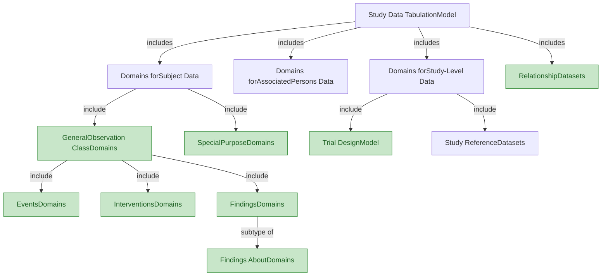
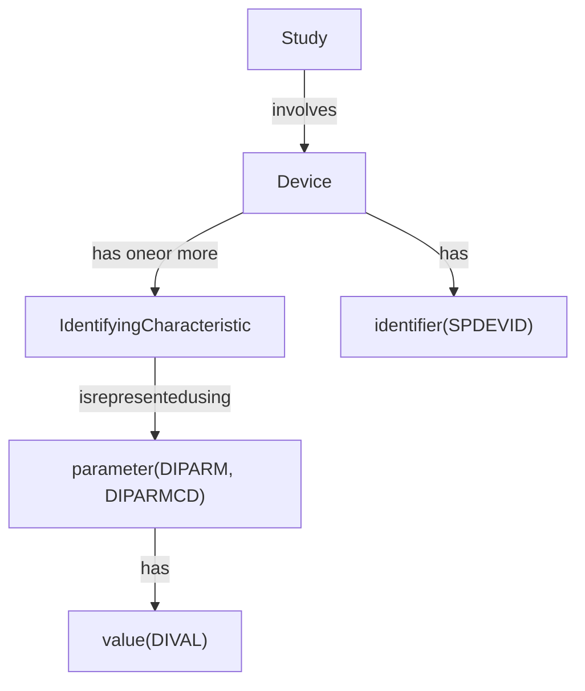
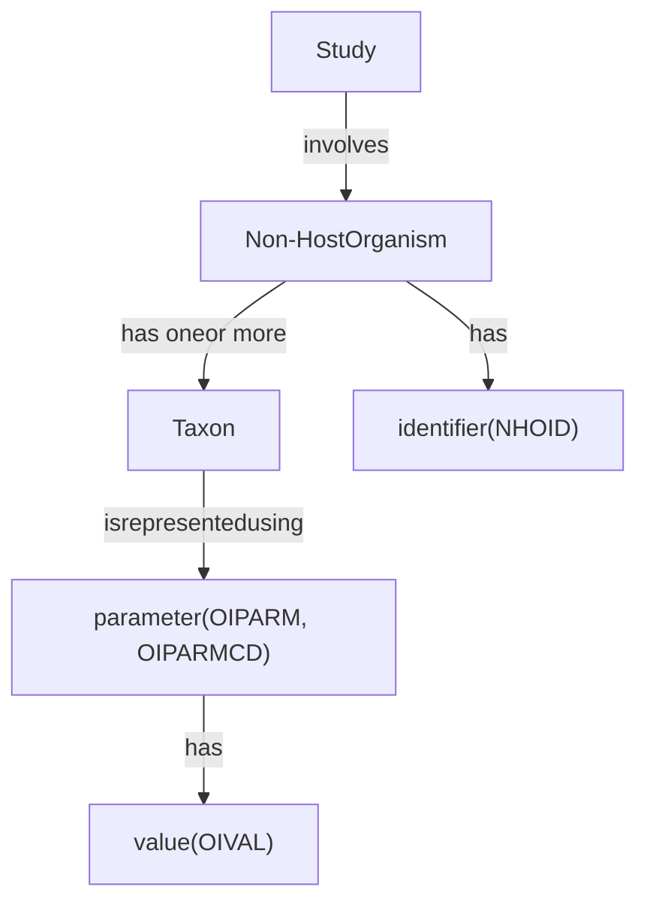

<!-- generated by scripts/merge_model.py (source mtime: 2026-04-15 06:34) -->

# SDTM v2.0 Model Reference

<!-- source: knowledge_base/model/01_concepts_and_terms.md -->
# SDTM v2.0 — Chapter 2: Model Concepts and Terms

Source: SDTM v2.0, Section 2 (Pages 8-10)

## 2.1 Model Concepts and Terms — Variables

The SDTM provides a general framework for describing the organization of information collected during human and animal studies. The model is built around the concept of **observations**, which consist of discrete pieces of information collected during a study. Observations normally correspond to rows in a dataset. A **domain** is a collection of observations on a particular topic. For example, "Subject 101 had an adverse event of mild nausea starting on study day 6" is an observation belonging to the Adverse Events domain in a clinical trial.

The primary purpose of the SDTM is to represent data about study subjects — which may be humans or animals — or medical devices. The SDTM includes a general model for representing data in 3 "general observation" classes. Within those classes, data are grouped by topic into domains, represented in separate datasets.

### Concept Map: Relationships Between SDTM Domains

> **Key:** Plain box = Group of individually specified datasets. Green filled box = Extensible set of domains based on a common model.

### Variable Roles

All datasets are structured as flat files with rows representing observations and columns representing variables; each dataset is described by metadata definitions that provide information about the variables used in the dataset. Metadata are described in the CDISC Define-XML specification.

Each observation consists of a series of named variables. Each variable, which normally corresponds to a column in a dataset, can be classified according to its **role**. A role describes the type of information conveyed by the variable about each distinct observation and how it can be used. There are variables which play different roles in different datasets. This is most common for variables which appear in both trial design datasets and general observation class datasets. For example, ARMCD is the topic variable in Trial Arms (TA), but a record qualifier in Demographics (DM) and Trial Visits (TV). Variables which appear in multiple general observation classes have the same role, although the variable qualified by a variable qualifier or synonym qualifier can be different in different general observation classes. For example, --MODIFY qualifies --TRT in interventions, --TERM in events, and --ORRES in findings.

SDTM variables can be classified into 5 major roles:

1. **Identifier variables** — identify the study, subject, domain, and sequence number of the record
2. **Topic variables** — specify the focus of the observation (e.g., the name of a lab test)
3. **Timing variables** — describe the timing of an observation (e.g., start date, end date)
4. **Qualifier variables** — include additional illustrative text or numeric values that describe the results or additional traits of the observation (e.g., units, descriptive adjectives)
5. **Rule variables** — describe conditions for starting, ending, branching, or looping in the Trial Design Model

### Qualifier Variable Subclasses

The set of Qualifier variables can be further categorized into 5 subclasses:

| Subclass | Purpose | Examples |
|----------|---------|----------|
| **Grouping Qualifiers** | Group together a collection of observations within the same domain | --CAT, --SCAT |
| **Result Qualifiers** | Describe the specific results associated with the topic variable in a Findings dataset | --ORRES, --STRESC, --STRESN |
| **Synonym Qualifiers** | Specify an alternative name for a particular variable in an observation | --MODIFY, --DECOD (for --TRT or --TERM); --TEST, --LOINC (for --TESTCD) |
| **Record Qualifiers** | Define additional attributes of the observation record as a whole | --REASND, AESLIFE, --BLFL, --POS, --LOC, --SPEC, --NAM |
| **Variable Qualifiers** | Further modify or describe a specific set of variables within an observation | --ORRESU, --ORNRHI, --ORNRLO, --DOSU (Variable Qualifier of --DOSE) |

### Domain Codes

Each study subject domain dataset is distinguished by a unique 2-character code stored in the SDTM variable DOMAIN. This code is used:
- As the value of the DOMAIN variable in that dataset
- As a prefix for most variable names in that dataset
- In the RDOMAIN variable in relationship tables

The `--` prefix in variable names (e.g., --TRT) indicates the required use of a prefix based on the 2-character domain code.

**Domain-specific variables** are for use in a limited number of designated domains based on general observation classes. The variable names include the specific domain prefix. The Usage Restrictions column of the table indicates the domains in which the variable is allowed.

All datasets for data about individuals and for data about a study include the variable DOMAIN, a code that should be used in the dataset name. Some relationship datasets include the variable RDOMAIN, to describe a relationship to a domain for data about individuals. The Comments special-purpose domain includes the variable RDOMAIN, but other special-purpose domains do not. The Device-subject Relationships dataset includes the variable DOMAIN, but other study reference datasets do not.

The SDTM is structured so that data can be represented in SAS v5 transport files, the file format accepted by the US Food and Drug Administration (FDA) and other regulatory authorities. This imposes certain restrictions on variables. The SDTM type specified in this document is either character or numeric, as these are the only types supported by SAS v5 transport files. Define-XML provides more descriptive data types (e.g., integer, float, date, datetime).

## 2.2 Table Structure

Tables in the SDTM v2.0 document include the following variable metadata:

| Column | Description |
|--------|-------------|
| **Variable Name** | The standard name (with `--` prefix for domain-prefixed variables) |
| **Variable Label** | Human-readable label for the variable |
| **Type** | SAS data type: `Char` or `Num` |
| **Format** | ISO format standard or description (e.g., "number-number") |
| **Role** | As defined in Section 2.1 (Identifier, Topic, Timing, etc.) |
| **Variable(s) Qualified** | For variables with a role of Variable Qualifier or Synonym Qualifier |
| **Usage Restrictions** | Rules for when a variable can or cannot be used |
| **Variable C-code** | NCI-EVS concept code |
| **Definition** | Published as part of CDISC Controlled Terminology through NCI-EVS |
| **Notes** | Descriptive information not covered elsewhere |
| **Examples** | Sample values or descriptions of kinds of information |

**Note:** Information on usage restrictions and examples that were in the Description column in SDTM v1.x tables have been moved to the Usage Restrictions and Examples columns. Other content previously in the Description column has been moved to the Notes column, except that definition-like information has been removed for variables which have approved definitions.

<!-- source: knowledge_base/model/02_observation_classes.md -->
# SDTM v2.0 — Chapter 3.1: The General Observation Classes

Source: SDTM v2.0, Section 3.1 (Pages 11-39)

## Overview

The majority of observations collected during a study can be divided among 3 general observation classes: Interventions, Events, and Findings. SDTM datasets that represent data about study subjects are of 2 types: general observation class datasets and special-purpose datasets.

Domains based on the general observation classes share a set of common identifier and timing variables (see Section 3.1.4, Identifiers for All Classes, and Section 3.1.5, Timing Variables for All Classes). As a general rule, any valid identifier or timing variable is permissible for use in any dataset based on a general observation class.

## 3.1.1 The Interventions Observation Class

**Structure:** One Record per Constant-dosing Interval or Intervention Episode

The Interventions Observation Class represents investigational, therapeutic, and other treatments that are administered to or used by a subject (with some actual or expected physiological effect). This includes treatments specified by the study protocol (i.e., "exposure").

### Topic and Qualifier Variables (43 variables)

| # | Variable | Label | Type | Role | Key Notes |
|---|----------|-------|------|------|-----------|
| 1 | --TRT | Name of Treatment | Char | Topic | The reported name of the intervention drug, procedure, or therapy |
| 2 | --MODIFY | Modified Treatment Name | Char | Synonym Qualifier (--TRT) | Alteration to collected value for coding purposes |
| 3 | --DECOD | Standardized Treatment Name | Char | Synonym Qualifier (--TRT) | Equivalent to WHODrug generic drug name, SNOMED term, ICD-9 |
| 4 | --MOOD | Mood | Char | Record Qualifier | State applied to a record: "SCHEDULED", "PERFORMED" |
| 5 | --CAT | Category | Char | Grouping Qualifier | Grouping or classification of the topic |
| 6 | --SCAT | Subcategory | Char | Grouping Qualifier | Further grouping; category is in --CAT |
| 7 | --PRESP | Pre-Specified | Char | Variable Qualifier (--TRT) | Values: "Y" or null. Not in nonclinical trials |
| 8 | --OCCUR | Occurrence Indicator | Char | Record Qualifier | Whether a prespecified event or intervention has occurred |
| 9 | --REASOC | Reason for Occur Value | Char | Record Qualifier | Reason the event did or did not occur |
| 10 | --STAT | Completion Status | Char | Record Qualifier | "NOT DONE" or null |
| 11 | --REASND | Reason Not Done | Char | Record Qualifier | Used with --STAT when value is "NOT DONE" |
| 12 | --CNTMOD | Contact Mode | Char | Record Qualifier | Way in which event, visit, or contact was conducted |
| 13 | --EPCHGI | Epi/Pandemic Related Change Indicator | Char | Record Qualifier | Whether intervention was changed due to epidemic or pandemic |
| 14 | --INDC | Indication | Char | Record Qualifier | Sign, symptom, or condition that is the basis for treatment initiation |
| 15 | --CLAS | Class | Char | Variable Qualifier (--TRT) | Standardized or dictionary-derived name for a grouping of drugs |
| 16 | --CLASCD | Class Code | Char | Variable Qualifier (--TRT) | Short sequence of characters to represent --CLAS |
| 17 | --DOSE | Dose | Num | Record Qualifier | Quantity of agent taken or absorbed at a single administration |
| 18 | --DOSTXT | Dose Description | Char | Record Qualifier | Textual description when --DOSE is not populated. E.g., "200-400" |
| 19 | --DOSU | Dose Units | Char | Variable Qualifier (--DOSE/--DOSTXT/--DOSTOT) | Unit of measure: "ng", "mg", "mg/kg" |
| 20 | --TDOSD | Toxic/Physiologic Dose Descr | Char | Record Qualifier | E.g., "LD50", "ED90" |
| 21 | --FTDOSD | Factor for Toxic/Physiologic Dose Descr | Num | Variable Qualifier (--TDOSD) | Multiplier for the value represented by --DOSE and --DOSU |
| 22 | --DOSFRM | Dose Form | Char | Variable Qualifier (--TRT) | "TABLET", "CAPSULE" |
| 23 | --DOSFRQ | Dosing Frequency per Interval | Char | Record Qualifier | "Q2H", "QD", "PRN" |
| 24 | --DOSTOT | Total Daily Dose | Num | Record Qualifier | Uses units in --DOSU |
| 25 | --DOSRGM | Intended Dose Regimen | Char | Record Qualifier | "TWO WEEKS ON, TWO WEEKS OFF" |
| 26 | --ROUTE | Route of Administration | Char | Record Qualifier | "ORAL", "INTRAVENOUS" |
| 27 | --LOT | Lot Number | Char | Record Qualifier | Identifier assigned by manufacturer or distributor |
| 28 | --LOC | Location of Administration | Char | Record Qualifier | "ARM" for an injection site |
| 29 | --METHOD | Method of Administration | Char | Record Qualifier | "INFUSION", "INTRAVENOUS". Not in human clinical trials; EX domain only |
| 30 | --LAT | Laterality | Char | Variable Qualifier (--LOC) | "RIGHT", "LEFT", "BILATERAL" |
| 31 | --DIR | Directionality | Char | Variable Qualifier (--LOC) | "ANTERIOR", "LOWER", "PROXIMAL" |
| 32 | --PORTOT | Portion or Totality | Char | Variable Qualifier (--LOC) | "ENTIRE", "SINGLE", "SEGMENT", "MANY" |
| 33 | --FAST | Fasting Status | Char | Record Qualifier | "Y", "N", "U", or null if not relevant |
| 34 | --PSTRG | Pharmaceutical Strength | Num | Record Qualifier | Amount of active ingredient: "50", "300" |
| 35 | --PSTRGU | Pharmaceutical Strength Units | Char | Variable Qualifier (--PSTRG) | "mg/TABLET", "mg/mL" |
| 36 | --TRTV | Treatment Vehicle | Char | Record Qualifier | Carrier or inert medium: "SALINE" |
| 37 | --VAMT | Treatment Vehicle Amount | Num | Record Qualifier | Amount of diluent; not diluent amount alone |
| 38 | --VAMTU | Treatment Vehicle Amount Units | Char | Variable Qualifier (--VAMT) | "mL", "mg" |
| 39 | --ADJ | Reason for Dose Adjustment | Char | Record Qualifier | "ADVERSE EVENT", "INSUFFICIENT RESPONSE" |
| 40 | --RSDISC | Reason for Treatment Discontinuation | Char | Record Qualifier | Reason the treatment was discontinued |
| 41 | --USCHFL | Unscheduled Flag | Char | Record Qualifier | "Y" or null. Not in human clinical trials |
| 42 | --RSTIND | Restraint Indicator | Char | Record Qualifier | Whether animal subject was restrained. Not in human clinical trials |
| 43 | --RSTMOD | Restraint Mode | Char | Record Qualifier | Physical and/or chemical restraint. Not in human clinical trials |

## 3.1.2 The Events Observation Class

**Structure:** One Record per Event

The Events Observation Class represents planned protocol milestones such as randomization and study completion, and occurrences, conditions, or incidents independent of planned study evaluations occurring during the study (e.g., adverse events) or prior to the study (e.g., medical history).

### Topic and Qualifier Variables (56 variables)

| # | Variable | Label | Type | Role | Key Notes |
|---|----------|-------|------|------|-----------|
| 1 | --TERM | Reported Term | Char | Topic | The collected name for an event observation |
| 2 | --MODIFY | Modified Reported Term | Char | Synonym Qualifier (--TERM) | Alteration to collected value for coding purposes |
| 3 | --LLT | Lowest Level Term | Char | Variable Qualifier (--TERM) | Lowest-level term from MedDRA. Not in nonclinical trials |
| 4 | --LLTCD | Lowest Level Term Code | Num | Variable Qualifier (--LLT) | Lowest-level code from MedDRA. Not in nonclinical trials |
| 5 | --DECOD | Dictionary-Derived Term | Char | Synonym Qualifier (--TERM) | Equivalent to Preferred Term ("PT" in MedDRA) |
| 6 | --EVDTYP | Medical History Event Date Type | Char | Variable Qualifier (--STDTC/--ENDTC) | "DIAGNOSIS", "SYMPTOM ONSET", "DISEASE RELAPSE". MH domain only |
| 7 | --PTCD | Preferred Term Code | Num | Variable Qualifier (--DECOD) | Preferred term code from MedDRA. Not in nonclinical trials |
| 8 | --HLT | High Level Term | Char | Variable Qualifier (--TERM) | High-level term from MedDRA. Not in nonclinical trials |
| 9 | --HLTCD | High Level Term Code | Num | Variable Qualifier (--HLT) | Not in nonclinical trials |
| 10 | --HLGT | High Level Group Term | Char | Variable Qualifier (--TERM) | Not in nonclinical trials |
| 11 | --HLGTCD | High Level Group Term Code | Num | Variable Qualifier (--HLGT) | Not in nonclinical trials |
| 12 | --CAT | Category | Char | Grouping Qualifier | Grouping or classification |
| 13 | --SCAT | Subcategory | Char | Grouping Qualifier | Further grouping; category is in --CAT |
| 14 | --PRESP | Pre-Specified | Char | Variable Qualifier (--TERM) | "Y" for prespecified events, null for spontaneously reported |
| 15 | --OCCUR | Occurrence Indicator | Char | Record Qualifier | Not in AE domain |
| 16 | --REASOC | Reason for Occur Value | Char | Record Qualifier | Not in AE domain |
| 17 | --STAT | Completion Status | Char | Record Qualifier | Not in AE domain |
| 18 | --REASND | Reason Not Done | Char | Record Qualifier | Not in AE domain |
| 19 | --BODSYS | Body System or Organ Class | Char | Record Qualifier | "GASTROINTESTINAL DISORDERS" |
| 20 | --BDSYCD | Body System or Organ Class Code | Num | Variable Qualifier (--BODSYS) | MedDRA SOC code. Not in nonclinical trials |
| 21 | --SOC | Primary System Organ Class | Char | Variable Qualifier (--TERM) | SOC from MedDRA. Not in nonclinical trials |
| 22 | --SOCCD | Primary System Organ Class Code | Num | Variable Qualifier (--SOC) | Not in nonclinical trials |
| 23 | --CNTMOD | Contact Mode | Char | Record Qualifier | "IN PERSON", "TELEPHONE", "IVRS" |
| 24 | --EPCHGI | Epi/Pandemic Related Change Indicator | Char | Record Qualifier | |
| 25 | --LOC | Location of Event | Char | Record Qualifier | "ARM" for skin rash |
| 26 | --LAT | Laterality | Char | Variable Qualifier (--LOC) | "RIGHT", "LEFT", "BILATERAL" |
| 27 | --DIR | Directionality | Char | Variable Qualifier (--LOC) | "ANTERIOR", "LOWER", "PROXIMAL" |
| 28 | --PORTOT | Portion or Totality | Char | Variable Qualifier (--LOC) | "ENTIRE", "SINGLE", "SEGMENT", "MANY" |
| 29 | --PARTY | Accountable Party | Char | Record Qualifier | Not in nonclinical trials |
| 30 | --PRTYID | Identification of Accountable Party | Char | Variable Qualifier (--PARTY) | Not in nonclinical trials |
| 31 | --SEV | Severity/Intensity | Char | Record Qualifier | "MILD", "MODERATE", "SEVERE" |
| 32 | --SER | Serious Event | Char | Record Qualifier | "Y" and "N" |
| 33 | --ACN | Action Taken with Study Treatment | Char | Record Qualifier | "DOSE INCREASED", "DOSE NOT CHANGED" |
| 34 | --ACNOTH | Other Action Taken | Char | Record Qualifier | Action unrelated to study treatment |
| 35 | --ACNDEV | Action Taken with Device | Char | Record Qualifier | AE domain only |
| 36 | --REL | Causality | Char | Record Qualifier | "NOT RELATED", "UNLIKELY RELATED", "POSSIBLY RELATED", "RELATED" |
| 37 | --RLDEV | Relationship of Event to Device | Char | Record Qualifier | "CAUSAL", "UNLIKELY" |
| 38 | --RELNST | Relationship to Non-Study Treatment | Char | Record Qualifier | "MORE LIKELY RELATED TO ASPIRIN USE" |
| 39 | --PATT | Pattern of Event | Char | Record Qualifier | "INTERMITTENT", "CONTINUOUS", "SINGLE EVENT" |
| 40 | --OUT | Outcome of Event | Char | Record Qualifier | "RECOVERED/RESOLVED", "FATAL" |
| 41 | --SCAN | Involves Cancer | Char | Record Qualifier | "Y", "N", and null. Not in nonclinical trials |
| 42 | --SCONG | Congenital Anomaly or Birth Defect | Char | Record Qualifier | "Y", "N", and null. Not in nonclinical trials |
| 43 | --SDISAB | Persist or Signif Disability/Incapacity | Char | Record Qualifier | Not in nonclinical trials |
| 44 | --SDTH | Results in Death | Char | Record Qualifier | Not in nonclinical trials |
| 45 | --SHOSP | Requires or Prolongs Hospitalization | Char | Record Qualifier | Not in nonclinical trials |
| 46 | --SLIFE | Is Life Threatening | Char | Record Qualifier | Not in nonclinical trials |
| 47 | --SOD | Occurred with Overdose | Char | Record Qualifier | Not in nonclinical trials |
| 48 | --SMIE | Other Medically Important Serious Event | Char | Record Qualifier | Not in nonclinical trials |
| 49 | --SINTV | Needs Intervention to Prevent Impairment | Char | Record Qualifier | AE domain only; for medical device-related trials |
| 50 | --UNANT | Unanticipated Adverse Device Effect | Char | Record Qualifier | AE domain only |
| 51 | --RLPRT | Rel of AE to Device-Related Procedure | Char | Record Qualifier | AE domain only. "CAUSAL", "UNLIKELY" |
| 52 | --RLPRC | Rel of AE to Non-Dev-Rel Study Activity | Char | Record Qualifier | AE domain only. "CAUSAL", "UNLIKELY" |
| 53 | --CONTRT | Concomitant or Additional Trtmnt Given | Char | Record Qualifier | "Y", "N", and null |
| 54 | --TOX | Toxicity | Char | Variable Qualifier (--TOXGR) | An NCI CTCAE Short Name |
| 55 | --TOXGR | Toxicity Grade | Char | Record Qualifier | A toxicity grade from NCI CTCAE |
| 56 | --USCHFL | Unscheduled Flag | Char | Record Qualifier | Not in human clinical trials |

## 3.1.3 The Findings Observation Class

**Structure:** One Record per Finding

The Findings Observation Class represents observations resulting from planned evaluations to address specific tests or questions such as laboratory tests, ECG testing, and questions listed on questionnaires. The Findings class also includes a subtype, Findings About, which is used to record findings related to observations in the Interventions or Events classes.

### Topic and Qualifier Variables (100 variables)

The Findings class has the largest number of variables due to the wide range of measurement types it supports. Key variable groups include:

**Topic Variables:**

| Variable | Label | Type | Role |
|----------|-------|------|------|
| --TESTCD | Short Name of Measurement, Test, or Exam | Char | Topic |
| --TEST | Name of Measurement, Test, or Exam | Char | Synonym Qualifier (--TESTCD) |

**Result Variables:**

| Variable | Label | Type | Role | Notes |
|----------|-------|------|------|-------|
| --ORRES | Result or Finding in Original Units | Char | Result Qualifier | Original collected result |
| --ORRESU | Original Units | Char | Variable Qualifier (--ORRES) | |
| --STRESC | Character Result/Finding in Std Format | Char | Result Qualifier | Standardized result |
| --STRESN | Numeric Result/Finding in Standard Units | Num | Result Qualifier | Numeric standardized result |
| --STRESU | Standard Units | Char | Variable Qualifier (--STRESC/--STRESN) | |

**Normal Range Variables:**

| Variable | Label | Notes |
|----------|-------|-------|
| --ORNRLO | Reference Range Lower Limit in Orig Unit | Original units |
| --ORNRHI | Reference Range Upper Limit in Orig Unit | Original units |
| --STNRLO | Reference Range Lower Limit-Std Units | Standard units |
| --STNRHI | Reference Range Upper Limit-Std Units | Standard units |
| --STNRC | Reference Range for Char Rslt-Std Units | Char reference range |
| --NRIND | Reference Range Indicator | "NORMAL", "HIGH", "LOW" |

**Specimen-related Variables:**

| Variable | Label | Notes |
|----------|-------|-------|
| --SPEC | Specimen Material Type | "BLOOD", "URINE", "TISSUE" |
| --SPCCND | Specimen Condition | "HEMOLYZED", "LIPEMIC" |
| --SPCUFL | Specimen Usability for the Test | "Y" or null |

**Additional Findings-specific Variables** include --LOINC, --METHOD, --ANMETH, --BLFL, --DRVFL, --LOBXFL, --FAST, --TOX, --TOXGR, --SEV, --CLSIG, --XFN, --NAM, --EVAL, --EVALID, --ACPTFL, --LNKID, --LNKGRP, and many domain-specific variables.

### Findings About (Subtype)

The Findings About observation class is a subtype of Findings used to record findings about events or interventions. It utilizes the Findings general observation class variables with the addition of the --OBJ variable. The order of the --OBJ variable among Findings qualifiers is immediately after the --TEST variable.

| Variable | Label | Type | Role | Notes |
|----------|-------|------|------|-------|
| --OBJ | Object of the Observation | Char | Record Qualifier | Used in domains modeled as Findings About Events or Findings About Interventions. Describes the event or intervention whose property is being measured in --TESTCD/--TEST. |

## 3.1.4 Identifiers for All Classes

STUDYID, DOMAIN, and --SEQ are required in all domains based on one of the 3 general observation classes. Each general class domain must also include at least 1 of the following subject identifiers: USUBJID, SPDEVID, or POOLID.

All identifier variables are allowed for any domain based on one of the 3 general observation classes, unless otherwise noted in the Usage Restrictions.

| # | Variable | Label | Type | Role | Notes |
|---|----------|-------|------|------|-------|
| 1 | STUDYID | Study Identifier | Char | Identifier | |
| 2 | DOMAIN | Domain Abbreviation | Char | Identifier | Two-character abbreviation for the domain |
| 3 | USUBJID | Unique Subject Identifier | Char | Identifier | Unique identifier for a subject across all studies for the submission |
| 4 | POOLID | Pool Identifier | Char | Identifier | Used for results that are not assignable to a specific subject |
| 5 | SPDEVID | Sponsor Device Identifier | Char | Identifier | |
| 6 | NHOID | Non-Host Organism Identifier | Char | Identifier | Sponsor-defined identifier for a non-host organism |
| 7 | FETUSID | Fetus Identifier | Char | Identifier | Not in human clinical trials |
| 8 | FOCID | Focus of Study-Specific Interest | Char | Identifier | Identification of a focus of study-specific interest |
| 9 | --SEQ | Sequence Number | Num | Identifier | Unique within STUDYID, USUBJID, and DOMAIN |
| 10 | --GRPID | Group ID | Char | Identifier | Used to tie together a block of related records |
| 11 | --REFID | Reference ID | Char | Identifier | Internal or external identifier (e.g., specimen ID, ECG ID) |
| 12 | --RECID | Invariant Record Identifier | Char | Identifier | Identifier for a record that is unique within a domain for a study and remains invariant through subsequent versions |
| 13 | --SPID | Sponsor-Defined Identifier | Char | Identifier | Sponsor-defined reference number |
| 14 | --LNKID | Link ID | Char | Identifier | Used with RELREC dataset-to-dataset linking |
| 15 | --LNKGRP | Link Group ID | Char | Identifier | Used with RELREC to link groups of records |
| 16 | --BEATNO | ECG Beat Number | Num | Identifier | EG Domain only |

## 3.1.5 Timing Variables for All Classes

The following timing variables are available for use in any domain based on one of the 3 general observation classes, except where restricted in the assumptions for the standard domain models in the implementation guides (48 variables):

### Visit and Epoch Variables

| # | Variable | Label | Type | Notes |
|---|----------|-------|------|-------|
| 1 | VISITNUM | Visit Number | Num | Numeric version of VISIT for sorting |
| 2 | VISIT | Visit Name | Char | Protocol-defined visit name |
| 3 | VISITDY | Planned Study Day of Visit | Num | Protocol-defined study day |
| 4 | TAETORD | Planned Order of Element Within Arm | Num | Value for the element within the subject's assigned arm |
| 5 | EPOCH | Epoch | Char | Time period defined in the protocol with a study-specific purpose |
| 6 | RPHASE | Repro Phase | Char | Not in human clinical trials |
| 7 | RPPLDY | Planned Repro Phase Day of Observation | Num | Not in human clinical trials |
| 8 | RPPLSTDY | Planned Repro Phase Day of Obs Start | Num | Not in human clinical trials |
| 9 | RPPLENDY | Planned Repro Phase Day of Obs End | Num | Not in human clinical trials |

### Date/Time Variables

| # | Variable | Label | Type | Format | Notes |
|---|----------|-------|------|--------|-------|
| 10 | --DTC | Date/Time of Collection | Char | ISO 8601 | Primary date/time for the observation |
| 11 | --STDTC | Start Date/Time of Observation | Char | ISO 8601 | Not in Findings class domains |
| 12 | --ENDTC | End Date/Time of Observation | Char | ISO 8601 | |

### Study Day Variables

| # | Variable | Label | Type | Notes |
|---|----------|-------|------|-------|
| 13 | --DY | Study Day of Visit/Collection/Exam | Num | Derived from --DTC and RFSTDTC |
| 14 | --STDY | Study Day of Start of Observation | Num | Not in Findings class domains |
| 15 | --ENDY | Study Day of End of Observation | Num | |
| 16 | --NOMDY | Nominal Study Day for Tabulations | Num | Not in human clinical trials |
| 17 | --NOMLBL | Label for Nominal Study Day | Char | Not in human clinical trials |
| 18 | --RPDY | Actual Repro Phase Day of Observation | Num | Not in human clinical trials |
| 19 | --RPSTDY | Actual Repro Phase Day of Obs Start | Num | Not in human clinical trials |
| 20 | --RPENDY | Actual Repro Phase Day of Obs End | Num | Not in human clinical trials |
| 21 | --XDY | Day of Obs Relative to Exposure | Num | Derived relative to RFXSTDTC |
| 22 | --XSTDY | Start Day of Obs Relative to Exposure | Num | Not in Findings class domains |
| 23 | --XENDY | End Day of Obs Relative to Exposure | Num | |
| 24 | --CHDY | Day of Obs Rel to Challenge Agent | Num | Derived relative to RFCSTDTC |
| 25 | --CHSTDY | Start Day of Obs Rel to Challenge Agent | Num | Not in Findings class domains |
| 26 | --CHENDY | End Day of Obs Rel to Challenge Agent | Num | |
| 27 | --DUR | Collected Duration | Char | ISO 8601 duration |

### Time Point Variables

| # | Variable | Label | Type | Notes |
|---|----------|-------|------|-------|
| 28 | --TPT | Planned Time Point Name | Char | Protocol-defined time point description |
| 29 | --TPTNUM | Planned Time Point Number | Num | Numeric version for sorting |
| 30 | --ELTM | Planned Elapsed Time from Time Point Ref | Char | ISO 8601 duration |
| 31 | --TPTREF | Time Point Reference | Char | Description of the reference point |
| 32 | --RFTDTC | Date/Time of Reference Time Point | Char | ISO 8601 |

### Relative Timing Variables

| # | Variable | Label | Type | Notes |
|---|----------|-------|------|-------|
| 33 | --STRF | Start Relative to Reference Period | Char | BEFORE, DURING, DURING/AFTER, AFTER, UNKNOWN |
| 34 | --ENRF | End Relative to Reference Period | Char | Same values as --STRF |
| 35 | --EVLINT | Evaluation Interval | Char | ISO 8601 duration or interval |
| 36 | --EVINTX | Evaluation Interval Text | Char | Text description when interval cannot be represented in ISO 8601 |
| 37 | --STRTPT | Start Relative to Reference Time Point | Char | BEFORE, COINCIDENT, AFTER, UNKNOWN |
| 38 | --STTPT | Start Reference Time Point | Char | Text description of start anchor |
| 39 | --ENRTPT | End Relative to Reference Time Point | Char | BEFORE, COINCIDENT, AFTER, ONGOING, UNKNOWN |
| 40 | --ENTPT | End Reference Time Point | Char | Text description of end anchor |

### Disease Milestone Variables

| # | Variable | Label | Type | Notes |
|---|----------|-------|------|-------|
| 41 | MIDS | Disease Milestone Instance Name | Char | Unique name of a disease milestone instance |
| 42 | RELMIDS | Temporal Relation to Milestone Instance | Char | How observation relates to MIDS |
| 43 | MIDSDTC | Disease Milestone Instance Date/Time | Char | Date/time of the disease milestone |

### Assessment Interval and Other Timing Variables

| # | Variable | Label | Type | Notes |
|---|----------|-------|------|-------|
| 44 | --STINT | Planned Start of Assessment Interval | Char | ISO 8601 duration |
| 45 | --ENINT | Planned End of Assessment Interval | Char | ISO 8601 duration |
| 46 | --DETECT | Time in Days to Detection | Num | Not in human clinical trials |
| 47 | --PTFL | Point in Time Flag | Char | Only in Findings class specimen-based domains |
| 48 | --PDUR | Planned Duration of Observation | Char | Only in Findings class specimen-based domains |

<!-- source: knowledge_base/model/03_special_purpose_domains.md -->
# SDTM v2.0 — Chapter 3.2: Special-purpose Domains

Source: SDTM v2.0, Section 3.2 (Pages 40-49)

## Overview

In addition to the 3 general observation classes, a submission will generally include a set of other special-purpose datasets of specific standardized structures to represent additional important information. A Demographics special-purpose domain is included with human and animal studies. Other special-purpose domains may be included.

## Demographics (DM)

**Structure:** One record per subject

The Demographics domain includes a set of essential standard variables that describe each subject in a clinical study. It is the parent domain to which all other observations are linked. The DM domain describes the essential characteristics of the study subjects, and is used by reviewers for selecting subsets of subjects for analysis. The DM domain, as with other datasets, includes identifiers, a topic variable, timing variables, and qualifiers.

### Variables (38 variables)

| # | Variable | Label | Type | Role | Notes |
|---|----------|-------|------|------|-------|
| 1 | STUDYID | Study Identifier | Char | Identifier | |
| 2 | DOMAIN | Domain Abbreviation | Char | Identifier | "DM" |
| 3 | USUBJID | Unique Subject Identifier | Char | Identifier | |
| 4 | SUBJID | Subject Identifier for the Study | Char | Topic | Subject identifier, which must be unique within the study |
| 5 | RFSTDTC | Subject Reference Start Date/Time | Char | Record Qualifier | Usually first dose date |
| 6 | RFENDTC | Subject Reference End Date/Time | Char | Record Qualifier | Usually date of last dose |
| 7 | RFXSTDTC | Date/Time of First Study Treatment | Char | Record Qualifier | |
| 8 | RFXENDTC | Date/Time of Last Study Treatment | Char | Record Qualifier | |
| 9 | RFCSTDTC | Date/Time of First Challenge Agent Admin | Char | Record Qualifier | |
| 10 | RFCENDTC | Date/Time of Last Challenge Agent Admin | Char | Record Qualifier | |
| 11 | RFICDTC | Date/Time of Informed Consent | Char | Record Qualifier | Not in nonclinical trials |
| 12 | RFPENDTC | Date/Time of End of Participation | Char | Record Qualifier | Not in nonclinical trials |
| 13 | DTHDTC | Date/Time of Death | Char | Record Qualifier | Not in nonclinical trials |
| 14 | DTHFL | Subject Death Flag | Char | Record Qualifier | "Y" or null. Not in nonclinical trials |
| 15 | SITEID | Study Site Identifier | Char | Record Qualifier | |
| 16 | INVID | Investigator Identifier | Char | Record Qualifier | Not in nonclinical trials |
| 17 | INVNAM | Investigator Name | Char | Synonym Qualifier (INVID) | Not in nonclinical trials |
| 18 | BRTHDTC | Date/Time of Birth | Char | Record Qualifier | |
| 19 | AGE | Age | Num | Record Qualifier | Numeric age at RFSTDTC |
| 20 | AGETXT | Age Text | Char | Record Qualifier | Used when exact age is unknown; e.g., "18-25" |
| 21 | AGEU | Age Units | Char | Variable Qualifier (AGE/AGETXT) | "YEARS", "MONTHS", "DAYS" |
| 22 | SEX | Sex | Char | Record Qualifier | Subject to controlled terminology |
| 23 | RACE | Race | Char | Record Qualifier | Not in nonclinical trials |
| 24 | ETHNIC | Ethnicity | Char | Record Qualifier | Not in nonclinical trials |
| 25 | SPECIES | Species | Char | Record Qualifier | **Not for human clinical trials** |
| 26 | STRAIN | Strain/Substrain | Char | Record Qualifier | **Not for human clinical trials** |
| 27 | SBSTRAIN | Strain/Substrain Details | Char | Variable Qualifier (STRAIN) | **Not for human clinical trials** |
| 28 | ARMCD | Planned Arm Code | Char | Record Qualifier | Short version of ARM |
| 29 | ARM | Description of Planned Arm | Char | Synonym Qualifier (ARMCD) | |
| 30 | ACTARMCD | Actual Arm Code | Char | Record Qualifier | Not in nonclinical trials |
| 31 | ACTARM | Description of Actual Arm | Char | Synonym Qualifier (ACTARMCD) | Not in nonclinical trials |
| 32 | ARMNRS | Reason Arm and/or Actual Arm is Null | Char | Record Qualifier | When arm assignment is not possible |
| 33 | ACTARMUD | Description of Unplanned Actual Arm | Char | Record Qualifier | |
| 34 | SETCD | Set Code | Char | Record Qualifier | Use with extreme caution |
| 35 | RPATHCD | Reproductive Pathway Code | Char | Record Qualifier | **Not for human clinical trials** |
| 36 | COUNTRY | Country | Char | Record Qualifier | ISO 3166-1 Alpha-3. Not in nonclinical trials |
| 37 | DMDTC | Date/Time of Collection | Char | Timing | |
| 38 | DMDY | Study Day of Collection | Num | Timing | |

### Key Reference Date Variables

| Variable | Description | Typical Use |
|----------|-------------|-------------|
| RFSTDTC | Subject Reference Start Date/Time | Usually first dose; basis for study day calculation |
| RFENDTC | Subject Reference End Date/Time | Usually last dose date |
| RFXSTDTC | Date/Time of First Study Treatment | First exposure to study treatment |
| RFXENDTC | Date/Time of Last Study Treatment | Last exposure to study treatment |
| RFCSTDTC | Date/Time of First Challenge Agent Admin | First exposure to challenge agent |
| RFCENDTC | Date/Time of Last Challenge Agent Admin | Last exposure to challenge agent |
| RFICDTC | Date/Time of Informed Consent | Consent date |
| RFPENDTC | Date/Time of End of Participation | Completion/withdrawal date |

## Comments (CO)

**Structure:** One record per comment per subject (or per study)

The Comments special-purpose domain is used to capture free-text comments that are not a part of normal domain data. Comments are normally supplied by a principal investigator, but might also be collected from other sources such as central reviewers. When collected, comments should be submitted in a single Comments domain, defined here.

### Variables (15 variables)

| # | Variable | Label | Type | Role |
|---|----------|-------|------|------|
| 1 | STUDYID | Study Identifier | Char | Identifier |
| 2 | DOMAIN | Domain Abbreviation | Char | Identifier |
| 3 | RDOMAIN | Related Domain Abbreviation | Char | Record Qualifier |
| 4 | USUBJID | Unique Subject Identifier | Char | Identifier |
| 5 | POOLID | Pool Identifier | Char | Identifier |
| 6 | SPDEVID | Sponsor Device Identifier | Char | Identifier |
| 7 | COSEQ | Sequence Number | Num | Identifier |
| 8 | IDVAR | Identifying Variable | Char | Record Qualifier |
| 9 | IDVARVAL | Identifying Variable Value | Char | Record Qualifier |
| 10 | COREF | Comment Reference | Char | Record Qualifier |
| 11 | COVAL | Comment | Char | Topic |
| 12 | COEVAL | Evaluator | Char | Record Qualifier |
| 13 | COEVALID | Evaluator Identifier | Char | Variable Qualifier (COEVAL) |
| 14 | CODTC | Date/Time of Comment | Char | Timing |
| 15 | CODY | Study Day of Comment | Num | Timing |

## Subject Elements (SE)

**Structure:** One record per actual Element per subject

Describes the actual Elements (blocks of time) experienced by each subject during the study. Planned elements are described in the Trial Design Model. Because actual data does not always follow the plan, the SDTM allows for descriptions of an unplanned element for subjects (SEUPDES).

### Variables (13 variables)

| # | Variable | Label | Type | Role | Notes |
|---|----------|-------|------|------|-------|
| 1 | STUDYID | Study Identifier | Char | Identifier | |
| 2 | DOMAIN | Domain Abbreviation | Char | Identifier | "SE" |
| 3 | USUBJID | Unique Subject Identifier | Char | Identifier | |
| 4 | SESEQ | Sequence Number | Num | Identifier | |
| 5 | ETCD | Element Code | Char | Topic | Code for the Element (from TE) |
| 6 | ELEMENT | Description of Element | Char | Synonym Qualifier (ETCD) | |
| 7 | TAETORD | Planned Order of Element within Arm | Num | Timing | C83438 |
| 8 | EPOCH | Epoch | Char | Timing | C71738 |
| 9 | SESTDTC | Start Date/Time of Element | Char | Timing | |
| 10 | SEENDTC | End Date/Time of Element | Char | Timing | |
| 11 | SESTDY | Study Day of Start of Element | Num | Timing | |
| 12 | SEENDY | Study Day of End of Element | Num | Timing | |
| 13 | SEUPDES | Description of Unplanned Element | Char | Synonym Qualifier (ETCD) | Used only if ETCD has a value of "UNPLAN" |

## Subject Repro Stages

**Structure:** One record per Actual Repro Stage per Subject

**Note:** Not for use with human clinical trials.

Describes the actual order of repro stages experienced by the subject, together with the start date or start date and time and end date/time for each. Planned repro stages are described in the Trial Design Model. Because actual data does not always follow the plan, the SDTM allows for descriptions of an unplanned repro stage for subjects (SJUPDES).

### Variables (10 variables)

| # | Variable | Label | Type | Role | Notes |
|---|----------|-------|------|------|-------|
| 1 | STUDYID | Study Identifier | Char | Identifier | |
| 2 | DOMAIN | Domain Abbreviation | Char | Identifier | "SJ" |
| 3 | USUBJID | Unique Subject Identifier | Char | Identifier | |
| 4 | SJSEQ | Sequence Number | Num | Identifier | Not in human clinical trials |
| 5 | RSTGCD | Repro Stage Code | Char | Topic | Not in human clinical trials |
| 6 | RSTAGE | Description of Repro Stage | Char | Synonym Qualifier (RSTGCD) | Not in human clinical trials |
| 7 | SJSTDTC | Start Date/Time of Repro Stage | Char | Timing | Not in human clinical trials |
| 8 | SJENDTC | End Date/Time of Repro Stage | Char | Timing | Not in human clinical trials |
| 9 | RPHASE | Repro Phase | Char | Timing | Not in human clinical trials |
| 10 | SJUPDES | Description of Unplanned Repro Stage | Char | Synonym Qualifier (RSTGCD) | Not in human clinical trials |

## Subject Visits (SV)

**Structure:** One record per actual or planned visit per subject

Describes the actual study visits experienced by each individual subject. Planned trial visits are described in the Trial Design Model. Because actual data does not always follow the plan, the SDTM allows for descriptions of unplanned visits for subjects (SVUPDES).

### Variables (16 variables)

| # | Variable | Label | Type | Role | Notes |
|---|----------|-------|------|------|-------|
| 1 | STUDYID | Study Identifier | Char | Identifier | |
| 2 | DOMAIN | Domain Abbreviation | Char | Identifier | "SV" |
| 3 | USUBJID | Unique Subject Identifier | Char | Identifier | |
| 4 | VISITNUM | Visit Number | Num | Topic | |
| 5 | VISIT | Visit Name | Char | Synonym Qualifier (VISITNUM) | |
| 6 | SVPRESP | Pre-Specified | Char | Variable Qualifier (VISITNUM) | |
| 7 | SVOCCUR | Occurrence | Char | Record Qualifier | |
| 8 | SVREASOC | Reason for Occurrence Value | Char | Record Qualifier | |
| 9 | SVCNTMOD | Contact Mode | Char | Record Qualifier | |
| 10 | SVEPCHGI | Epi/Pandemic Related Change Indicator | Char | Record Qualifier | |
| 11 | VISITDY | Planned Study Day of Visit | Num | Timing | |
| 12 | SVSTDTC | Start Date/Time of Visit | Char | Timing | |
| 13 | SVENDTC | End Date/Time of Visit | Char | Timing | |
| 14 | SVSTDY | Study Day of Start of Visit | Num | Timing | |
| 15 | SVENDY | Study Day of End of Visit | Num | Timing | |
| 16 | SVUPDES | Description of Unplanned Visit | Char | Record Qualifier | |

## Subject Disease Milestones (SM)

**Structure:** One record per Disease Milestone per subject

Records the disease milestones experienced by each subject (e.g., diagnosis, progression, relapse, remission).

### Variables (10 variables)

| # | Variable | Label | Type | Role | Notes |
|---|----------|-------|------|------|-------|
| 1 | STUDYID | Study Identifier | Char | Identifier | |
| 2 | DOMAIN | Domain Abbreviation | Char | Identifier | "SM" |
| 3 | USUBJID | Unique Subject Identifier | Char | Identifier | |
| 4 | SMSEQ | Sequence Number | Num | Identifier | |
| 5 | MIDS | Disease Milestone Instance Name | Char | Topic | Unique name linking to TM |
| 6 | MIDSTYPE | Disease Milestone Type | Char | Record Qualifier | From Trial Disease Milestones (TM) |
| 7 | SMSTDTC | Start Date/Time of Milestone | Char | Timing | |
| 8 | SMENDTC | End Date/Time of Milestone | Char | Timing | |
| 9 | SMSTDY | Study Day of Start of Milestone | Num | Timing | |
| 10 | SMENDY | Study Day of End of Milestone | Num | Timing | |

<!-- source: knowledge_base/model/04_associated_persons.md -->
# SDTM v2.0 — Chapter 4: Associated Persons Data

Source: SDTM v2.0, Section 4 (Page 50)

## Overview

Associated persons are individuals other than study subjects who can be associated with a study, a particular study subject, or a device used in the study. The structures of SDTM datasets that represent data about associated persons are based on the structures for data about study subjects, either general observation class structures or special-purpose domain structures. AP domains are created using SDTM variables, with the application of specific AP rules:

### AP Domain Rules

1. **Prefix convention:** AP domains use the domain code prefix `AP` followed by the relevant domain code. For example, associated persons demographics would use `APDM`.

2. **APID:** The variable APID is used as an identifier in AP domains (instead of USUBJID for subjects). APID was removed from Section 3.1.4 (Identifiers for All Classes) because APID is only allowed in AP domains. It is still listed in Section 3 as an identifier.

3. **Linking variables:**
   - **RSUBJID** — Related Subject or Pool Identifier: identifies a related subject or pool of subjects. RSUBJID may be populated with the USUBJID of the related subject or the POOLID of the related pool. RSUBJID will be null for data about associated persons who are related to the study but not to any study subjects.
   - **RDEVID** — Related Device Identifier: identifier for a related device. RDEVID will be populated with the SPDEVID of the related device.
   - **SREL** — Subject, Device, or Study Relationship: if RSUBJID is populated, describes the relationship of the associated person(s) to the subject or pool identified in RSUBJID. If RDEVID is populated, describes the relationship to the device identified in RDEVID. If RSUBJID and RDEVID are null, SREL describes the relationship to the study identified in STUDYID.

### Key Principles

- AP domains conform to the same general observation class models (Interventions, Events, Findings) used for subject data
- The same variables, roles, and controlled terminology apply
- Additional guidance for implementing AP domains is provided in the SDTM Implementation Guide: Associated Persons (SDTMIG-AP)
- AP domains are not part of the core SDTMIG for human clinical trials

### Variables Used in Associated Persons Data

The table of variables used in Associated Persons Data includes all variables from the general observation classes, with the addition of AP-specific identifiers:

| Variable | Label | Type | Role | Notes |
|----------|-------|------|------|-------|
| APID | Associated Persons Identifier | Char | Identifier | Identifier for a single associated person, a group of associated persons, or a pool of associated persons. If APID identifies a pool, POOLDEF records must exist for each associated person (see Section 6.3, Pool Definition Dataset, and Section 4, Associated Persons Data). |
| RSUBJID | Related Subject or Pool Identifier | Char | Identifier | Identifier for a related subject or pool of subjects. RSUBJID may be populated with the USUBJID of the related subject or the POOLID of the related pool. |
| RDEVID | Related Device Identifier | Char | Identifier | Identifier for a related device. RDEVID will be populated with the SPDEVID of the related device. |
| SREL | Subject, Device, or Study Relationship | Char | Identifier | If RSUBJID is populated, describes the relationship to the subject or pool. If RDEVID is populated, describes the relationship to the device. If both are null, describes the relationship to the study. |

Relationships of an associated person to study subjects may be represented in the Associated Persons Relationships dataset. When an individual has multiple collected relationships to a study subject or study subjects, those multiple relationships must be represented in that relationships dataset.

<!-- source: knowledge_base/model/05_study_level_data.md -->
# SDTM v2.0 — Chapter 5: Study-level Data

Source: SDTM v2.0, Sections 5.1-5.2 (Pages 51-63)

## Overview

The SDTM includes 2 types of study-level data: trial design data and study reference data.

---

## 5.1 Trial Design Model

The Trial Design Model (TDM) defines a standard structure for representing the planned sequence of activities and the treatment plan for the trial. These include ways to represent:

- Planned treatment arms (Section 5.1.1, Trial Arms and Trial Elements)
- Planned groups of subjects (Section 5.1.2, Trial Sets)
- Planned sequences of reproductive stages (Section 5.1.3, Trial Repro Stages and Trial Repro Paths)
- Planned schedules for activities and data collection (Section 5.1.4, Trial Planned Data Collection)
- Study eligibility criteria (Section 5.1.5, Trial Inclusion/Exclusion Criteria)
- Other aspects of a study, expressed as parameters (Section 5.1.6, Trial Summary Information)
- Characteristics of a study challenge agent (Section 5.1.7, Challenge Agent Characterization)

Many Trial Design domains define study-specific terminology, and variables and variable values from these domains are used in subject-level domains.

### Trial Elements (TE)

**Structure:** One record per planned Element

Describes the basic building blocks of a trial design — discrete periods of time during which a specific type of treatment or activity is planned. The domain is identified by the domain code "TE".

| # | Variable | Label | Type | Role |
|---|----------|-------|------|------|
| 1 | STUDYID | Study Identifier | Char | Identifier |
| 2 | DOMAIN | Domain Abbreviation | Char | Identifier |
| 3 | ETCD | Element Code | Char | Topic |
| 4 | ELEMENT | Description of Element | Char | Synonym Qualifier |
| 5 | TESTRL | Rule for Start of Element | Char | Rule |
| 6 | TEENRL | Rule for End of Element | Char | Rule |
| 7 | TEDUR | Planned Duration of Element | Char | Timing |

### Trial Arms (TA)

**Structure:** One record per planned Element per Arm

Describes each planned arm in a trial. An arm is an ordered sequence of elements; the same element may occur more than once in a given arm. This dataset allows for rules for branching and transitions.

| # | Variable | Label | Type | Role |
|---|----------|-------|------|------|
| 1 | STUDYID | Study Identifier | Char | Identifier |
| 2 | DOMAIN | Domain Abbreviation | Char | Identifier |
| 3 | ARMCD | Planned Arm Code | Char | Topic |
| 4 | ARM | Description of Planned Arm | Char | Synonym Qualifier |
| 5 | TAETORD | Planned Order of Element within Arm | Num | Timing |
| 6 | ETCD | Element Code | Char | Record Qualifier |
| 7 | ELEMENT | Description of Element | Char | Synonym Qualifier |
| 8 | TABRANCH | Branch | Char | Rule |
| 9 | TATRANS | Transition Rule | Char | Rule |
| 10 | EPOCH | Epoch | Char | Timing |

### Trial Sets (TX)

**Structure:** One record per Trial Set parameter per Trial Set

Describes sets of subjects that share common characteristics (e.g., treatment groups, pooled analysis groups).

| # | Variable | Label | Type | Role |
|---|----------|-------|------|------|
| 1 | STUDYID | Study Identifier | Char | Identifier |
| 2 | DOMAIN | Domain Abbreviation | Char | Identifier |
| 3 | SETCD | Set Code | Char | Identifier |
| 4 | SET | Set Description | Char | Synonym Qualifier (SETCD) |
| 5 | TXSEQ | Sequence Number | Num | Identifier |
| 6 | TXPARMCD | Trial Set Parameter Short Name | Char | Topic |
| 7 | TXPARM | Trial Set Parameter Name | Char | Synonym Qualifier |
| 8 | TXVAL | Parameter Value | Char | Result Qualifier |

### Trial Reproductive Stages (TT)

**Structure:** One record per Planned Repro Stage

**Note:** Not for use with human clinical trials.

Describes the unique repro stages in a study, with repro stage description, code (short name), and rules for start and end.

| # | Variable | Label | Type | Role | Notes |
|---|----------|-------|------|------|-------|
| 1 | STUDYID | Study Identifier | Char | Identifier | |
| 2 | DOMAIN | Domain Abbreviation | Char | Identifier | "TT" |
| 3 | RSTGCD | Repro Stage Code | Char | Topic | Not in human clinical trials |
| 4 | RSTAGE | Description of Repro Stage | Char | Synonym Qualifier (RSTGCD) | Not in human clinical trials |
| 5 | TTSTRL | Rule for Start of Repro Stage | Char | Rule | Not in human clinical trials |
| 6 | TTENRL | Rule for End of Repro Stage | Char | Rule | Not in human clinical trials |
| 7 | TTDUR | Planned Duration of Repro Stage | Char | Timing | Not in human clinical trials |

### Trial Reproductive Paths (TP)

**Structure:** One record per Planned Repro Stage per Repro Path

**Note:** Not for use with human clinical trials.

Describes each planned repro path in a repro study, with the ordered sequence of repro stages that comprise each repro path, as well as specification of repro phase and reference start day of the repro phase applicable to the repro stage within the repro path.

| # | Variable | Label | Type | Role | Notes |
|---|----------|-------|------|------|-------|
| 1 | STUDYID | Study Identifier | Char | Identifier | |
| 2 | DOMAIN | Domain Abbreviation | Char | Identifier | "TP" |
| 3 | RPATHCD | Planned Repro Path Code | Char | Topic | Not in human clinical trials |
| 4 | RPATH | Description of Planned Repro Path | Char | Synonym Qualifier (RPATHCD) | Not in human clinical trials |
| 5 | TPSTGORD | Order of Repro Stage within Repro Path | Num | Timing | Not in human clinical trials |
| 6 | RSTGCD | Repro Stage Code | Char | Topic | Not in human clinical trials |
| 7 | RSTAGE | Description of Repro Stage | Char | Synonym Qualifier (RSTGCD) | Not in human clinical trials |
| 8 | TPBRANCH | Branch | Char | Rule | Not in human clinical trials |
| 9 | RPHASE | Repro Phase | Char | Timing | Not in human clinical trials |
| 10 | RPRFDY | Repro Phase Start Reference Day | Num | Timing | Not in human clinical trials |

### Trial Visits (TV)

**Structure:** One record per planned Visit per Arm

Describes the visits planned in the protocol, including the planned order and number of visits in the study.

| # | Variable | Label | Type | Role |
|---|----------|-------|------|------|
| 1 | STUDYID | Study Identifier | Char | Identifier |
| 2 | DOMAIN | Domain Abbreviation | Char | Identifier |
| 3 | VISITNUM | Visit Number | Num | Topic |
| 4 | VISIT | Visit Name | Char | Synonym Qualifier |
| 5 | VISITDY | Planned Study Day of Visit | Num | Timing |
| 6 | ARMCD | Planned Arm Code | Char | Record Qualifier |
| 7 | ARM | Description of Planned Arm | Char | Synonym Qualifier |
| 8 | TVSTRL | Visit Start Rule | Char | Rule |
| 9 | TVENRL | Visit End Rule | Char | Rule |

### Trial Disease Assessments (TD)

**Structure:** One record per planned constant assessment period

Provides information on the planned protocol-specified disease assessment schedule when those disease assessments cannot be expressed using Trial Visits.

| # | Variable | Label | Type | Role |
|---|----------|-------|------|------|
| 1 | STUDYID | Study Identifier | Char | Identifier |
| 2 | DOMAIN | Domain Abbreviation | Char | Identifier |
| 3 | TDORDER | Sequence of Planned Assessment Schedule | Num | Timing |
| 4 | TDANCVAR | Anchor Variable Name | Char | Timing |
| 5 | TDSTOFF | Offset from the Anchor | Char | Timing |
| 6 | TDTGTPAI | Planned Assessment Interval | Char | Timing |
| 7 | TDMINPAI | Planned Assessment Interval Minimum | Char | Timing |
| 8 | TDMAXPAI | Planned Assessment Interval Maximum | Char | Timing |
| 9 | TDNUMRPT | Maximum Number of Actual Assessments | Num | Record Qualifier |

### Trial Disease Milestones (TM)

**Structure:** One record per Disease Milestone type

Describes the types of disease milestones that may occur in a study.

| # | Variable | Label | Type | Role |
|---|----------|-------|------|------|
| 1 | STUDYID | Study Identifier | Char | Identifier |
| 2 | DOMAIN | Domain Abbreviation | Char | Identifier |
| 3 | MIDSTYPE | Disease Milestone Type | Char | Topic |
| 4 | TMDEF | Disease Milestone Definition | Char | Variable Qualifier (MIDSTYPE) |
| 5 | TMRPT | Disease Milestone Repetition Indicator | Char | Record Qualifier |

### Trial Inclusion/Exclusion Criteria (TI)

**Structure:** One record per I/E criterion

Describes the inclusion and exclusion criteria for the trial.

| # | Variable | Label | Type | Role |
|---|----------|-------|------|------|
| 1 | STUDYID | Study Identifier | Char | Identifier |
| 2 | DOMAIN | Domain Abbreviation | Char | Identifier |
| 3 | IETESTCD | Incl/Excl Criterion Short Name | Char | Topic |
| 4 | IETEST | Incl/Excl Criterion | Char | Synonym Qualifier |
| 5 | IECAT | Incl/Excl Category | Char | Grouping Qualifier |
| 6 | IESCAT | Incl/Excl Subcategory | Char | Grouping Qualifier |
| 7 | TIRL | Criterion Evaluation Rule | Char | Rule |
| 8 | TIVERS | Protocol Criteria Versions | Char | Record Qualifier |

### Trial Summary (TS)

**Structure:** One record per trial summary parameter value

Contains summary information about the trial (e.g., trial phase, objectives, design).

| # | Variable | Label | Type | Role |
|---|----------|-------|------|------|
| 1 | STUDYID | Study Identifier | Char | Identifier |
| 2 | DOMAIN | Domain Abbreviation | Char | Identifier |
| 3 | TSSEQ | Sequence Number | Num | Identifier |
| 4 | TSGRPID | Group ID | Char | Identifier |
| 5 | TSPARMCD | Trial Summary Parameter Short Name | Char | Topic |
| 6 | TSPARM | Trial Summary Parameter Name | Char | Synonym Qualifier |
| 7 | TSVAL | Parameter Value | Char | Result Qualifier |
| 8 | TSVALNF | Parameter Null Flavor | Char | Result Qualifier |
| 9 | TSVALCD | Parameter Value Code | Char | Result Qualifier |
| 10 | TSVCDREF | Name of Reference Terminology | Char | Result Qualifier |
| 11 | TSVCDVER | Version of Reference Terminology | Char | Result Qualifier |

### Challenge Agent Characterization (AC)

**Structure:** One record per Challenge Agent Characterization Parameter Instance

The Challenge Agent Characterization dataset allows the sponsor to provide information about challenge agents used in a trial in a structured format. Each record contains a parameter (a characteristic of the challenge agent) and its value.

| # | Variable | Label | Type | Role |
|---|----------|-------|------|------|
| 1 | STUDYID | Study Identifier | Char | Identifier |
| 2 | DOMAIN | Domain Abbreviation | Char | Identifier |
| 3 | ACSEQ | Sequence Number | Num | Identifier |
| 4 | ACGRPID | Group ID | Char | Identifier |
| 5 | ACPARMCD | Challenge Agent Parameter Short Name | Char | Topic |
| 6 | ACPARM | Challenge Agent Parameter | Char | Synonym Qualifier |
| 7 | ACVAL | Parameter Value | Char | Result Qualifier |
| 8 | ACVALU | Parameter Units | Char | Variable Qualifier (ACVAL) |
| 9 | ACVALNF | Parameter Null Flavor | Char | Result Qualifier |
| 10 | ACVALCD | Parameter Value Code | Char | Result Qualifier |
| 11 | ACVCDREF | Name of the Reference Terminology | Char | Result Qualifier |
| 12 | ACVCDVER | Version of the Reference Terminology | Char | Result Qualifier |

---

## 5.2 Study References

Study Reference datasets provide structures for representing study-specific identifiers that will be used in subject data. Two such situations have been identified thus far: identifiers for devices, and identifiers for non-host organisms.

### Device Identifiers (DI)

**Structure:** One record per device attribute per device

Used to identify the devices used in a study. The parameters used for identification of a device depend on the kind of device and the need of the study to distinguish among devices.

**Concept Map: Relationships Between Device Identifier Variables**

| # | Variable | Label | Type | Role |
|---|----------|-------|------|------|
| 1 | STUDYID | Study Identifier | Char | Identifier |
| 2 | DOMAIN | Domain Abbreviation | Char | Identifier |
| 3 | SPDEVID | Sponsor Device Identifier | Char | Identifier |
| 4 | DISEQ | Sequence Number | Num | Identifier |
| 5 | DIPARMCD | Device Identifier Element Short Name | Char | Topic |
| 6 | DIPARM | Device Identifier Element Name | Char | Synonym Qualifier (DIPARMCD) |
| 7 | DIVAL | Device Identifier Element Value | Char | Result Qualifier |

### Non-host Organism Identifiers (OI)

**Structure:** One record per taxon per non-host organism

Used to represent taxonomic information for non-host organisms such as bacteria and viruses. The taxa used for identification depend on the kind of organism and the needs of the study.

**Concept Map: Relationships Between Non-host Organism Identifier Variables**

| # | Variable | Label | Type | Role |
|---|----------|-------|------|------|
| 1 | STUDYID | Study Identifier | Char | Identifier |
| 2 | DOMAIN | Domain Abbreviation | Char | Identifier |
| 3 | NHOID | Non-host Organism Identifier | Char | Identifier |
| 4 | OISEQ | Sequence Number | Num | Identifier |
| 5 | OIPARMCD | Non-Host Organism ID Element Short Name | Char | Topic |
| 6 | OIPARM | Non-Host Organism ID Element Name | Char | Synonym Qualifier (OIPARMCD) |
| 7 | OIVAL | Non-Host Organism ID Element Value | Char | Result Qualifier |

<!-- source: knowledge_base/model/06_relationship_datasets.md -->
# SDTM v2.0 — Chapter 6: Datasets for Representing Relationships

Source: SDTM v2.0, Sections 6.1-6.7 (Pages 64-69)

## Overview

There are many occasions when it is necessary or desirable to represent relationships among datasets or records. The SDTM includes the following relationship datasets:

- **Related Records Dataset** — represents 2 types of relationships: between independent records for a subject, and between records in 2 or more datasets
- **Supplemental Qualifiers Dataset** — represents dependent relationships where data cannot be represented by a standard variable
- **Pool Definition Dataset** — represents relationships between a subject and a pool of subjects
- **Related Subjects Dataset** — represents relationships between study subjects other than membership in a pool
- **Associated Persons Relationships Dataset** — represents relationships between associated person(s) and study subjects
- **Device-subject Relationships Dataset** — represents relationships between devices and study subjects
- **Related Specimens Dataset** — represents relationships between collected specimens and specimens derived from them

The implementation guides define specific details and examples for each of these relationships.

---

## 6.1 Related Records (RELREC)

**Structure:** One record per related record, group of records, or dataset

The Related Records dataset describes relationships between records within a domain, between records across domains, or between entire datasets.

### Variables (10 variables)

| # | Variable | Label | Type | Role | Notes |
|---|----------|-------|------|------|-------|
| 1 | STUDYID | Study Identifier | Char | Identifier | |
| 2 | RDOMAIN | Related Domain Abbreviation | Char | Identifier | 2-character abbreviation for the domain of the parent record(s) |
| 3 | USUBJID | Unique Subject Identifier | Char | Identifier | Null for dataset-level relationships |
| 4 | APID | Associated Persons Identifier | Char | Identifier | Identifier for a single associated person, a group, or a pool of associated persons |
| 5 | POOLID | Pool Identifier | Char | Identifier | For pooled subject data |
| 6 | SPDEVID | Sponsor Device Identifier | Char | Identifier | |
| 7 | IDVAR | Identifying Variable | Char | Identifier | Name of the identifying variable in the general-observation-class dataset that identifies the related record(s) |
| 8 | IDVARVAL | Identifying Variable Value | Char | Identifier | Value of identifying variable described in IDVAR |
| 9 | RELTYPE | Relationship Type | Char | Record Qualifier | Identifies the hierarchical level of the records in the relationship. Values should be either ONE or MANY. |
| 10 | RELID | Relationship Identifier | Char | Record Qualifier | RELID value should be unique within the ID variable (e.g., USUBJID, APID, POOLID, SPDEVID) that is the subject of the relationship |

### RELTYPE Combinations

| Source RELTYPE | Target RELTYPE | Meaning |
|---------------|----------------|---------|
| ONE | ONE | One record relates to one record |
| ONE | MANY | One record relates to many records |
| MANY | ONE | Many records relate to one record |
| MANY | MANY | Many records relate to many records |

---

## 6.2 Supplemental Qualifiers (SUPP--)

**Structure:** One record per supplemental qualifier per related parent domain record(s)

The Supplemental Qualifiers datasets provide a mechanism for including non-standard variables that cannot be accommodated in the standard domain datasets.

### Variables (13 variables)

| # | Variable | Label | Type | Role | Notes |
|---|----------|-------|------|------|-------|
| 1 | STUDYID | Study Identifier | Char | Identifier | |
| 2 | RDOMAIN | Related Domain Abbreviation | Char | Identifier | 2-character abbreviation for the domain of the parent record(s) |
| 3 | USUBJID | Unique Subject Identifier | Char | Identifier | |
| 4 | APID | Associated Persons Identifier | Char | Identifier | |
| 5 | POOLID | Pool Identifier | Char | Identifier | |
| 6 | SPDEVID | Sponsor Device Identifier | Char | Identifier | |
| 7 | IDVAR | Identifying Variable | Char | Identifier | Identifying variable in the parent dataset that identifies the related record(s) |
| 8 | IDVARVAL | Identifying Variable Value | Char | Identifier | Value of identifying variable of the parent record(s) |
| 9 | QNAM | Qualifier Variable Name | Char | Topic | 8-character name for the supplemental qualifier |
| 10 | QLABEL | Qualifier Variable Label | Char | Synonym Qualifier | Human-readable label associated with QNAM |
| 11 | QVAL | Data Value | Char | Result Qualifier | The actual data value |
| 12 | QORIG | Origin | Char | Record Qualifier | Source of the data: "CRF", "ASSIGNED", "DERIVED" |
| 13 | QEVAL | Evaluator | Char | Record Qualifier | Role of the evaluator |

### Naming Convention

Separate Supplemental Qualifier datasets of the form `supp--.xpt` are required (e.g., `suppae.xpt`, `suppcm.xpt`). The RDOMAIN variable identifies which parent domain the supplemental data belongs to.

---

## 6.3 Pool Definition (POOLDEF)

**Structure:** One record per pooled subject per pool

Defines which subjects belong to each pool (for nonclinical studies where subjects are pooled).

| # | Variable | Label | Type | Role |
|---|----------|-------|------|------|
| 1 | STUDYID | Study Identifier | Char | Identifier |
| 2 | POOLID | Pool Identifier | Char | Identifier |
| 3 | USUBJID | Unique Subject Identifier | Char | Identifier |
| 4 | APID | Associated Persons Identifier | Char | Identifier |

---

## 6.4 Related Subjects (RELSUB)

**Structure:** One record per relationship per subject

Describes relationships between subjects in a study (e.g., family relationships in genetic studies).

| # | Variable | Label | Type | Role |
|---|----------|-------|------|------|
| 1 | STUDYID | Study Identifier | Char | Identifier |
| 2 | USUBJID | Unique Subject Identifier | Char | Identifier |
| 3 | POOLID | Pool Identifier | Char | Identifier |
| 4 | RSUBJID | Related Subject or Pool Identifier | Char | Identifier |
| 5 | SREL | Subject, Device, or Study Relationship | Char | Record Qualifier |

---

## 6.5 Device-subject Relationships (DR)

**Structure:** One record per device-subject relationship

Links devices to subjects when the device is associated with a subject.

| # | Variable | Label | Type | Role |
|---|----------|-------|------|------|
| 1 | STUDYID | Study Identifier | Char | Identifier |
| 2 | DOMAIN | Domain Abbreviation | Char | Identifier |
| 3 | USUBJID | Unique Subject Identifier | Char | Identifier |
| 4 | SPDEVID | Sponsor Device Identifier | Char | Identifier |

---

## 6.6 Associated Persons Related Subjects (APRELSUB)

**Structure:** One record per associated person relationship

Links associated persons to subjects.

| # | Variable | Label | Type | Role |
|---|----------|-------|------|------|
| 1 | STUDYID | Study Identifier | Char | Identifier |
| 2 | APID | Associated Person Identifier | Char | Identifier |
| 3 | RSUBJID | Related Subject or Pool Identifier | Char | Identifier |
| 4 | RDEVID | Related Device Identifier | Char | Identifier |
| 5 | SREL | Subject, Device, or Study Relationship | Char | Record Qualifier |

---

## 6.7 Related Specimens (RELSPEC)

**Structure:** One record per specimen identifier per subject

Describes relationships between specimens, enabling representation of specimen lineage (e.g., parent specimen to derived aliquots or processed specimens).

| # | Variable | Label | Type | Role | Notes |
|---|----------|-------|------|------|-------|
| 1 | STUDYID | Study Identifier | Char | Identifier | |
| 2 | USUBJID | Unique Subject Identifier | Char | Identifier | |
| 3 | REFID | Reference ID | Char | Identifier | C82531 |
| 4 | SPEC | Specimen Type | Char | Variable Qualifier (REFID) | C70713 |
| 5 | PARENT | Specimen Parent | Char | Identifier | Identifies the REFID of the parent of a specimen to support tracking its genealogy |
| 6 | LEVEL | Specimen Level | Num | Variable Qualifier (REFID) | Identifies the generation number of the sample where the collected sample is considered the first generation |

**Note:** RELSPEC was added new in SDTM v2.0. This domain was first introduced in the provisional SDTMIG-PGx (now deprecated) and had not previously been a part of the SDTM. It was added because the domain was added to SDTMIG v3.4.

---

## Summary of Relationship Datasets

| Dataset | Code | Purpose | Subject-level? |
|---------|------|---------|----------------|
| Related Records | RELREC | Link records/datasets | Both |
| Supplemental Qualifiers | SUPP-- | Non-standard variables | Yes |
| Pool Definition | POOLDEF | Pool membership | Yes (nonclinical) |
| Related Subjects | RELSUB | Subject relationships | Yes |
| Device-subject Relationships | DR | Device-subject links | Yes |
| AP Related Subjects | APRELSUB | AP-subject links | AP |
| Related Specimens | RELSPEC | Specimen lineage | Yes |
