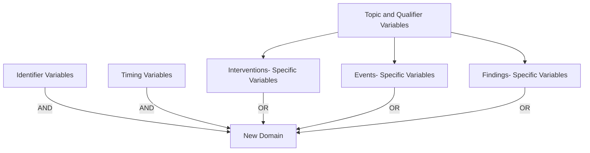
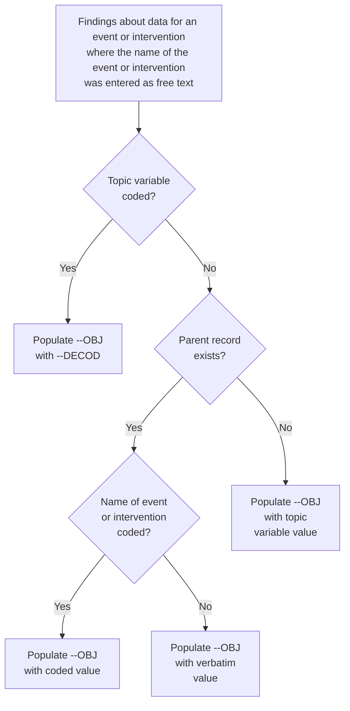
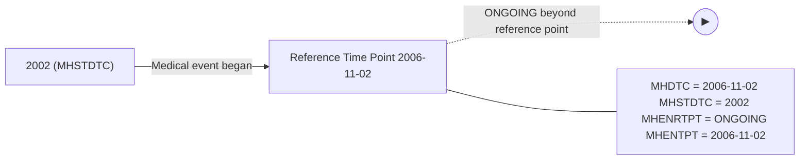
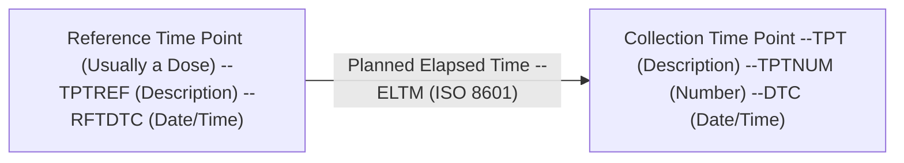
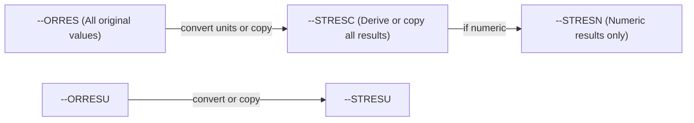
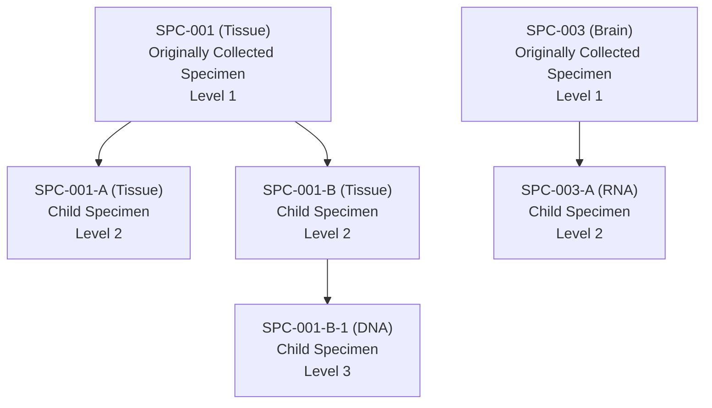
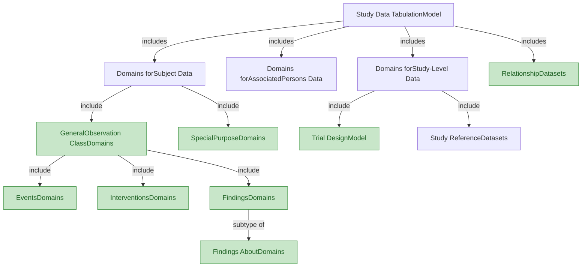
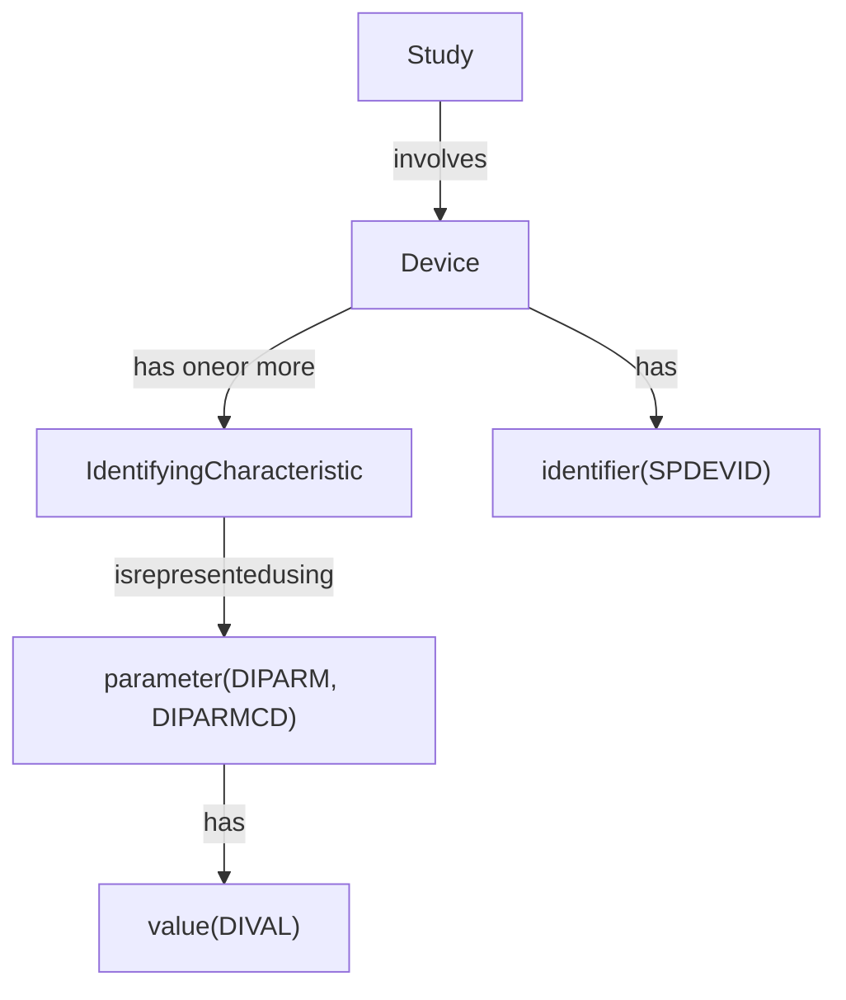
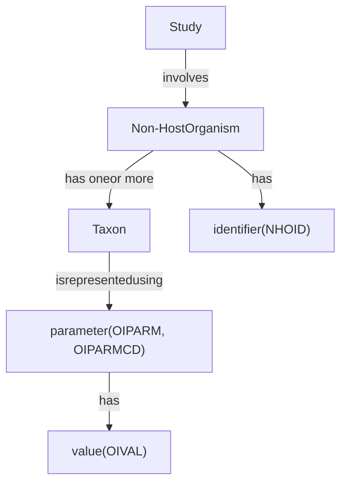

# 01 Navigation & Quick Reference (Chapters + Model + Indexes)

> Generated: 2026-04-21T02:11:47Z
> Source files: 15
> Total tokens (cl100k_base): 124,430

> Source order is preserved for traceability. `<!-- source: ... -->` comments mark each segment's origin file (relative to repo root).

---
<!-- source: knowledge_base/chapters/ch01_introduction.md -->
# SDTMIG v3.4 — Chapter 1: Introduction

Source: SDTMIG v3.4, Section 1 (Pages 7-12)

## 1.1 Purpose

The Study Data Tabulation Model Implementation Guide for Human Clinical Trials (SDTMIG) Version 3.4 has been prepared by the Submissions Data Standards (SDS) team of the Clinical Data Interchange Standards Consortium (CDISC). Like its predecessors, v3.4 is intended to guide the organization, structure, and format of standard clinical trial tabulation datasets submitted to a regulatory authority. Version 3.4 supersedes all prior versions of the SDTMIG.

The SDTMIG should be used in close concert with Version 2.0 of the CDISC Study Data Tabulation Model (SDTM), which describes the general conceptual model for representing clinical study data that is submitted to regulatory authorities and should be read prior to reading the SDTMIG. SDTMIG Version 3.4 provides specific domain models, assumptions, business rules, and examples for preparing standard tabulation datasets that are based on the SDTM.

This document is intended for companies and individuals involved in the collection, preparation, and analysis of clinical data that will be submitted to regulatory authorities.

## 1.2 Organization of this Document

| Section | Title | Description |
|---------|-------|-------------|
| 1 | Introduction | Overall introduction to v3.4 models; changes from prior versions |
| 2 | Fundamentals of the SDTM | Basic concepts of the SDTM; how to use SDTMIG with SDTM |
| 3 | Submitting Data in Standard Format | How to describe metadata for regulatory submissions; conformance assessment |
| 4 | Assumptions for Domain Models | Basic concepts, business rules, and assumptions before applying domain models |
| 5 | Models for Special-purpose Domains | Special-purpose domains: Demographics, Comments, Subject Visits, Subject Elements |
| 6 | Domain Models Based on the General Observation Classes | Specific metadata models based on the 3 GOC, with assumptions and examples |
| 7 | Trial Design Model Datasets | Domains for trial-level data, with assumptions and examples |
| 8 | Representing Relationships and Data | How to represent relationships between domains, datasets, and records |
| 9 | Study References | Structures for study-specific terminology used in subject data |
| 10 | Appendices | Additional background material and supplemental material |

## 1.3 Relationship to Prior CDISC Documents

This document, together with the SDTM, represents the most recent version of the CDISC submission data domain models. All updates are intended to be backward-compatible. A detailed list of changes between versions is provided in Appendix E, Revision History.

Version 3.1 was the first fully implementation-ready version of the CDISC submission data standards that was directly referenced by the US FDA for use in human clinical studies involving drug products. However, future improvements and enhancements will continue to be made as sponsors gain more experience submitting data in this format. Therefore, CDISC will be preparing regular updates to the implementation guide to provide corrections, clarifications, additional domain models, examples, business rules, and conventions for using the standard domain models. Because CDISC will produce further documentation for Controlled Terminology as separate publications, sponsors are encouraged to check the CDISC website (https://www.cdisc.org/standards/terminology/controlled-terminology) frequently for additional information. See Section 4.3, Coding and Controlled Terminology Assumptions, for the most up-to-date information on applying Controlled Terminology.

The most significant changes since SDTMIG v3.3 include:

- Expanded the scope of the DA domain to include study products in addition to study drugs
- Grouped specimen-based lab domains (e.g., CP, GF, LB) in Sections 6.3.5.1-6.3.5.9 and added a generic specification
- Expanded the scope of the IS domain for assessments of antigen-induced humoral or cell-mediated immune response; added 3 new variables (Binding Agent, Molecule Secreted by Cells, Test Operational Objective)
- Updated the LB domain specification to include 10 new variables (Test Condition, Binding Agent, Test Operational Objective, Result Scale, Result Type, Collected Summary Result Type, Lower Limit of Detection, Method Sensitivity, Point in Time Flag, and Planned Duration)
- Decommissioned the Morphology (MO) domain
- Added Cell Phenotyping Findings (CP) and Genomics Findings (GF) domains
- Copied in Biospecimen Events (BE), Biospecimen Findings (BS), and Related Specimens (RELSPEC) from the provisional SDTMIG-PGx v1.0
- Updated QRS specifications and assumptions; introduced subsections for RS Disease Response and RS Clinical Classifications use cases
- Updated Tumor/Lesion (TU and TR) domain assumptions to describe use of indicator questions, disease recurrence conventions, and modeling of location of interest
- Expanded the scope of the SC domain to support collection over time
- Updated guidance and examples for the FA domain
- Corrected Core values for: DSDY, DSSTDY, LBSTREFC, MILOBXFL, and MIBLFL
- Updated Controlled Terminology for applicable variables across all domains, if available
- Removed Appendix C1, Trial Summary Codes

### Related Implementation Guides

| Guide | Scope |
|-------|-------|
| SDTMIG-AP | Associated Persons — data about persons who are not study subjects |
| SDTMIG-MD | Medical Devices — data about devices |
| SDTMIG-PGx | Pharmacogenomics/Genetics — largely incorporated into/superseded by SDTMIG v3.4 |

## 1.4 How to Read this Implementation Guide

The SDTMIG is best read online, so the reader can benefit from the many hyperlinks to internal and external references.

Recommended reading order:

1. Read the SDTM to gain a general understanding of SDTM concepts
2. Read Sections 1-3 for key concepts about preparing domains and submitting data. Refer to Appendix B, Glossary and Abbreviations, as necessary
3. Read Section 4, Assumptions for Domain Models
4. Review Section 5 (Special-purpose Domains) and Section 6 (Domain Models Based on GOC), referring back to Section 4 as directed
5. Read Section 7, Trial Design Model Datasets
6. Review Section 8, Representing Relationships and Data
7. Review Section 9, Study References
8. Review the appendices as appropriate. Appendix C, Controlled Terminology, in particular, describes how CDISC Terminology is centrally managed by the CDISC Controlled Terminology Team. Efforts are made at publication time to ensure all SDTMIG domain/dataset specification tables and/or examples reflect the latest CDISC Terminology; users, however, should refer to https://www.cancer.gov/research/resources/terminology/cdisc as the authoritative source of controlled terminology, as CDISC Controlled Terminology is updated on a quarterly basis.

This implementation guide covers most data collected in human clinical trials, but separate implementation guides provide information about certain data. See the SDTMIG for Associated Persons (SDTMIG-AP) and the SDTMIG for Medical Devices (SDTMIG-MD). Historically, the SDTM Implementation Guide for Pharmacogenomics/Genetics (SDTMIG-PGx) has provided structures for pharmacogenetic/genomic data and for data about biospecimens. Much of the content of the SDTMIG-PGx has been incorporated into and/or superseded by the SDTMIG v3.4.

### 1.4.1 How to Read a Domain Specification

A domain specification table includes rows for all required and expected variables and for a set of permissible variables. The permissible variables do not include all the variables that are allowed for the domain; they are a set of variables that the SDS Team considered likely to be included. The columns of the table are:

| Column | Description |
|--------|-------------|
| **Variable Name** | Standard name; variables without domain prefix are taken from SDTM directly; `--` is replaced by 2-character domain code |
| **Variable Label** | Longer name; may be same as SDTM label or customized for the domain. Sponsors should create an appropriate label if they include in a dataset an allowable variable not in the domain specification. |
| **Type** | SAS datatypes: "Num" or "Char" |
| **Controlled Terms, Codelist, or Format** | Controlled terminology references: an asterisk (*) indicates the variable may be subject to controlled terminology. Specifically, the asterisk means one of the following: (1) the controlled terminology might be of a type that would inherently be sponsor-defined; (2) the controlled terminology might be of a type that could be standardized, but for which a codelist has not yet been developed; or (3) the controlled terminology might be terminology specified in value-level metadata. Codelist references follow these conventions: (a) a hyperlinked codelist name in parentheses indicates that the variable is subject to the CDISC Controlled Terminology in that named codelist; (b) multiple hyperlinked codelist names indicate that the variable is subject to 1 or more of those named codelists from CDISC Controlled Terminology (if multiple codelists are in use for a single domain, value-level metadata indicates where each codelist is applicable); (c) a hyperlinked codelist name AND an asterisk (*) together indicate that the variable is subject to either the named CDISC Controlled Terminology codelist or to an external dictionary (the specific dictionary is identified in the metadata). The name of an external code system (e.g., MedDRA) is listed as plain text. "ISO 8601 datetime or interval" or "ISO 8601 duration" in plain text indicates that the variable values should be formatted in conformance with that standard. |
| **Role** | From the SDTM; SDTM includes the qualified variable for Variable/Synonym Qualifiers, but SDTMIG does not |
| **CDISC Notes** | Variable description, relationship to other variables, population rules, and example values. Such examples are only examples, and although they may be CDISC Controlled Terminology values, their presence in a CDISC Note should not be construed as definitive. For authoritative information on CDISC Controlled Terminology, consult the NCI website (https://www.cancer.gov/research/resources/terminology/cdisc). |
| **Core** | "Req" (Required), "Exp" (Expected), or "Perm" (Permissible) |

## 1.5 Known Issues

### Derived Records and the use of --DRVFL

Although it is implicit in the general concept of a derived record that there is no collected result (--ORRES should be null), this is not an explicit requirement currently stated in published CDISC material. This is being evaluated for clarification in a future release.

### Use of --LNKID and --LNKGRP

The definition of --LNKID says it is "used to identify a record," and --LNKGRP says it is "used to identify a group of records." This implies:
- RELTYPE = ONE → IDVAR of --LNKID (not --LNKGRP)
- RELTYPE = MANY → IDVAR of --LNKID (not --LNKGRP)

The examples in SDTMIG v3.4 have not been systematically reviewed to implement this distinction. This will be clarified in a future release.

<!-- source: knowledge_base/chapters/ch02_fundamentals.md -->
# SDTMIG v3.4 — Chapter 2: Fundamentals of the SDTM

Source: SDTMIG v3.4, Section 2 (Pages 13-20)

## 2.1 Observations and Variables

The SDTMIG for Human Clinical Trials is based on the SDTM's general framework for organizing clinical trial information that is to be submitted to regulatory authorities. The SDTM is built around the concept of **observations** collected about subjects who participated in a clinical study. Each observation can be described by a series of variables, corresponding to a row in a dataset. Each variable can be classified according to its **role**.

### Variable Roles (5 major roles)

1. **Identifier variables** — identify the study, subject, domain, and sequence number of the record
2. **Topic variables** — specify the focus of the observation (e.g., the name of a lab test)
3. **Timing variables** — describe the timing of an observation (e.g., start date and end date)
4. **Qualifier variables** — include additional illustrative text or numeric values that describe the results or additional traits
5. **Rule variables** — describe the condition to start, end, branch, or loop in the Trial Design Model

### Qualifier Variable Subclasses

| Subclass | Purpose | Examples |
|----------|---------|----------|
| **Grouping Qualifiers** | Group together a collection of observations within the same domain | --CAT, --SCAT |
| **Result Qualifiers** | Describe the specific results associated with the topic variable (Findings only) | --ORRES, --STRESC, --STRESN |
| **Synonym Qualifiers** | Specify an alternative name for a particular variable | --MODIFY, --DECOD (for --TRT/--TERM); --TEST, --LOINC (for --TESTCD) |
| **Record Qualifiers** | Define additional attributes of the observation record as a whole (rather than describing a particular variable within a record) | --REASND, AESLIFE and other SAE flags (AE domain); AGE, SEX, RACE (DM domain); --BLFL, --POS, --LOC, --SPEC, --NAM (Findings) |
| **Variable Qualifiers** | Modify or describe a specific variable within an observation; are only meaningful in the context of the variable they qualify | --ORRESU, --ORNRHI, --ORNRLO (Variable Qualifiers of --ORRES); --DOSU (Variable Qualifier of --DOSE) |

**Example:** In the observation "Subject 101 had mild nausea starting on study day 6":
- Topic variable value = "NAUSEA"
- Identifier variable: subject identifier "101"
- Timing variable: "starting on study day 6"
- Record Qualifier: severity = "MILD"

## 2.2 Datasets and Domains

A **domain** is a collection of logically related observations with a common topic. Each domain is represented by a single dataset.

Each domain dataset is distinguished by a unique, 2-character code (DOMAIN) used in 4 ways:
1. As the dataset name
2. As the value of the DOMAIN variable in that dataset
3. As a prefix for most variable names in that dataset
4. As a value in the RDOMAIN variable in relationship tables

All datasets are structured as flat files with rows representing observations and columns representing variables. Metadata are described in a Define-XML document that is submitted with the data.

The SDTM lists only the name, label, and type of each variable, with a brief set of CDISC guidelines for its use. The domain dataset models in Section 5, Models for Special-purpose Domains, and Section 6, Domain Models Based on the General Observation Classes, provide additional information about controlled terms or format, notes on proper usage, and examples. See also Section 1.4.1, How to Read a Domain Specification.

Data represented in SDTM datasets include:
- Data as originally collected or received
- Data from the protocol
- Assigned data
- Derived data

## 2.3 The General Observation Classes

Most subject-level observations should be represented according to 1 of the 3 SDTM general observation classes:

| Class | What it captures | Examples |
|-------|-----------------|----------|
| **Interventions** | Investigational, therapeutic, and other treatments administered to or used by a subject (with some actual or expected physiological effect), including treatments that are self-administered by the subject (i.e., use of alcohol, tobacco, or caffeine) | Exposure (EX), Concomitant Medications (CM), Procedures (PR) |
| **Events** | Planned protocol milestones and occurrences, conditions, or incidents independent of planned evaluations | Adverse Events (AE), Disposition (DS), Medical History (MH) |
| **Findings** | Observations from planned evaluations to address specific tests or questions, including questionnaires | Laboratory Tests (LB), Vital Signs (VS), ECG (EG) |

In most cases, the choice of observation class can be easily determined. The majority of data (measurements or responses at specific visits or time points) will fit the Findings class.

**Additional guidance** on choosing the appropriate GOC is in Section 8.6.1, Guidelines for Determining the General Observation Class.

General assumptions for use with all domain models and custom domains based on the general observation classes are described in Section 4, Assumptions for Domain Models; specific assumptions for individual domains are included with the domain models.

## 2.4 Datasets Other than General Observation Class Domains

The SDTM includes 4 types of datasets other than those based on the general observation classes:

| Type | Description | Examples | Section |
|------|-------------|----------|---------|
| **Special-purpose domains** | Subject-level data not conforming to a GOC | DM, CO, SE, SV | Section 5 |
| **Trial Design Model (TDM)** | Study design information, not subject data | TA, TE | Section 7 |
| **Relationship datasets** | Describe relationships among datasets/records | RELREC, SUPP-- | Section 8 |
| **Study Reference datasets** | Study-specific terminology | DI, OI | Section 9 |

## 2.5 The SDTM Standard Domain Models

A sponsor should only submit domain datasets that were actually collected (or directly derived from the collected data) for a given study. Decisions on what data to collect should be based on the scientific objectives of the study, rather than the SDTM. Note that any data collected that will be submitted in an analysis (ADaM) dataset must be traceable to a source in a tabulation (SDTM) dataset.

The number of domains submitted should be based on the specific requirements of the study. The collected data for a given study may use standard domains from this and other SDTM implementation guides as well as additional custom domains based on the 3 general observation classes. A list of standard domains is provided in Section 3.2.1, Dataset-level Metadata. Refer to the Define-XML standard (available at https://www.cdisc.org/standards/data-exchange/define-xml) for additional details on how to manage no data availability. Therapeutic-area standards projects and other projects may develop proposals for additional domains. Draft versions of these domains may be made available in the CDISC wiki in the SDTM Draft Domains space.

### General rules for determining which variables to include:

1. The Identifier variables **STUDYID, DOMAIN, USUBJID, and --SEQ** are required in all domains based on a general observation class
2. Any Timing variables are permissible for use in any submission dataset based on a GOC except where restricted by specific domain assumptions
3. Any additional Qualifier variables from the same GOC may be added to a domain model except where restricted
4. Sponsors may not add any variables other than those described above — use Supplemental Qualifiers (SUPP--) for non-standard variables
5. Standard variables must not be renamed or modified for novel usage
6. A Permissible variable should be used in an SDTM dataset wherever appropriate. If a study includes a data item that would be represented in a Permissible variable, then that variable must be included in the SDTM dataset, even if null
7. If a study did not include a data item that would be represented in a Permissible variable, then that variable should not be included in the SDTM dataset and should not be declared in the Define-XML document

## 2.6 Creating a New Domain



Process for creating a custom domain (must be based on 1 of the 3 GOC):

1. Confirm that none of the existing published domains will fit the need. A custom domain may only be created if the data are different in nature and do not fit into an existing published domain. Examples of distinct topics that warrant separate domains include microbiology, tumor measurements, pathology/histology, vital signs, and physical exam results.
   - Data should be grouped by topic and nature, not by collection method. --CAT, --SCAT, --METHOD, --SPEC, and --LOC can distinguish data within a domain.
   - Data that were collected on separate CRF modules or pages may fit into an existing domain (e.g., separate questionnaires into the QS domain, prior and concomitant medications in the CM domain).
2. Check the SDTM Draft Domains area of the CDISC wiki for proposed domains
3. Look for an existing, relevant domain model to serve as a prototype. Follow these steps:
   - a. Select required identifier variables (STUDYID, DOMAIN, USUBJID, --SEQ)
   - b. Include the topic variable from the identified GOC (e.g., --TESTCD for Findings)
   - c. Select relevant qualifier variables from the identified GOC. Variables belonging to other general observation classes must not be added
   - d. Select applicable timing variables
   - e. Determine the domain code (not in CDISC CT Domain Abbreviations codelist; AD, AX, AP, SQ, SA may not be used)
   - f. Apply the 2-character domain code to variable prefixes
   - g. Set variable order consistent with the SDTM
   - h. Adjust labels using title case
   - i. Ensure appropriate standard variables are properly applied
   - j. Describe the dataset in the Define-XML document
   - k. Place non-standard variables in a SUPP-- dataset

**Key rules for custom domains:**
- Do not create separate domains based on time (represent both prior and current in one domain; AE and MH are exceptions)
- Do not create "efficacy" domains — data collected for analysis must still go in standard domains
- For hierarchical data, establish domain pairs (e.g., MB/MS, PC/PP)
- Domain pairs use DOMAIN as an identifier to group parent records and enable dataset-level relationships via RELREC

## 2.7 SDTM Variables Not Allowed in the SDTMIG

### Must NEVER be used in human clinical trials (SEND-only):

| Variable | Class(es) |
|----------|-----------|
| --USCHFL | Interventions, Events, Findings |
| --METHOD | Interventions |
| --RSTIND | Interventions, Findings |
| --RSTMOD | Interventions, Findings |
| --IMPLBL | Findings |
| --RESLOC | Findings |
| --DTHREL | Findings |
| --EXCLFL | Findings |
| --REASEX | Findings |
| FETUSID | Identifiers |
| RPHASE | Timing Variables |
| RPPLDY, RPPLSTDY, RPPLENDY | Timing Variables |
| --NOMDY, --NOMLBL | Timing Variables |
| --RPDY, --RPSTDY, --RPENDY | Timing Variables |
| --DETECT | Timing Variables |

### Must NEVER be used in DM domain (SEND nonclinical only):

See Section 9.2, Non-host Organism Identifiers, for information about representing taxonomic information for non-host organisms such as bacteria and viruses.

- SPECIES, STRAIN, SBSTRAIN, RPATHCD

### Use with extreme caution (not fully evaluated for human clinical trials):

- --ANTREG (Findings)
- --CHRON (Findings)
- --DISTR (Findings)
- SETCD (Demographics) — additionally requires the Trial Sets domain

### May be used when appropriate:

- POOLID — additionally requires the Pool Definition dataset

Other variables defined in the SDTM are allowed for use as defined in this SDTMIG except when explicitly stated. Custom domains, created following the guidance in Section 2.6, Creating a New Domain, may utilize any appropriate qualifier variables from the selected general observation class.

<!-- source: knowledge_base/chapters/ch03_submitting_data.md -->
# SDTMIG v3.4 — Chapter 3: Submitting Data in Standard Format

Source: SDTMIG v3.4, Section 3 (Pages 17-21)

## 3.1 Standard Metadata for Dataset Contents and Attributes

The SDTMIG provides standard descriptions of some of the most commonly used data domains, with metadata attributes. These include descriptive metadata attributes that should be included in a Define-XML document. In addition, the CDISC domain models include 2 shaded columns that are not sent to the FDA, but which assist sponsors:

- **CDISC Notes column** — information regarding the relevant use of each variable
- **Core column** — indicates how a variable is classified (see Section 4.1.5, SDTM Core Designations)

The domain models in Section 6, Domain Models Based on the General Observation Classes, illustrate how to apply the SDTM when creating a specific domain dataset. In particular, these models illustrate the selection of a subset of the variables offered in 1 of the general observation classes, along with applicable timing variables. The models also show how a standard variable from a general observation class should be adjusted to meet the specific content needs of a particular domain, including making the label more meaningful, specifying controlled terminology, and creating domain-specific notes and examples. Thus, the domain models not only demonstrate how to apply the model for the most common domains but also give insight on how to apply general model concepts to other domains not yet defined by CDISC.

## 3.2 Using the CDISC Domain Models in Regulatory Submissions — Dataset Metadata

The Define-XML document that accompanies a submission should also describe each dataset that is included in the submission and describe the natural key structure of each dataset. In addition, comments can also be provided where needed. Most studies will include Demographics (DM) and a set of safety domains based on the 3 general observation classes — typically including Exposure (EX), Concomitant and Prior Medications (CM), Adverse Events (AE), Disposition (DS), Medical History (MH), Laboratory Test Results (LB), and Vital Signs (VS). However, choosing which data to submit will depend on the protocol and the needs of the regulatory review division or agency.

Dataset definition metadata should include:
- Dataset filenames, descriptions, locations, structures, class, purpose, and keys

**Note:** "In the event that no records are present in a dataset (e.g., a small PK study where no subjects took concomitant medications), the empty dataset should not be submitted and should not be described in the Define-XML document."

### 3.2.1 Dataset-level Metadata

**Note:** The key variables shown in this table are examples only. A sponsor's actual key structure may be different. The order of classes and datasets in this table is not intended as a normative order of datasets in a submission.

The Dataset-level Metadata table provides examples of dataset structures:

| Dataset | Description | Class | Structure | Purpose | Keys | Location |
|---------|-------------|-------|-----------|---------|------|----------|
| CO | Comments | Special Purpose | One record per comment per subject | Tabulation | STUDYID, USUBJID, IDVAR, COREF, COOTC | co.xpt |
| DM | Demographics | Special Purpose | One record per subject | Tabulation | STUDYID, USUBJID | dm.xpt |
| SE | Subject Elements | Special Purpose | One record per actual Element per subject | Tabulation | STUDYID, USUBJID, ETCD, SESTDTC | se.xpt |
| SM | Subject Disease Milestones | Special Purpose | One record per Disease Milestone per subject | Tabulation | STUDYID, USUBJID, MIDS | sm.xpt |
| SV | Subject Visits | Special Purpose | One record per actual or planned visit per subject | Tabulation | STUDYID, USUBJID, SVTERM | sv.xpt |
| AG | Procedure Agents | Interventions | One record per recorded intervention occurrence per subject | Tabulation | STUDYID, USUBJID, AGTRT, AGSTDTC | ag.xpt |
| CM | Concomitant/Prior Medications | Interventions | One record per recorded intervention occurrence or constant-dosing interval per subject | Tabulation | STUDYID, USUBJID, CMTRT, CMSTDTC | cm.xpt |
| EC | Exposure as Collected | Interventions | One record per protocol-specified study treatment, collected-dosing interval, per subject, per mood | Tabulation | STUDYID, USUBJID, ECTRT, ECSTDTC, ECMOOD | ec.xpt |
| EX | Exposure | Interventions | One record per protocol-specified study treatment, constant-dosing interval, per subject | Tabulation | STUDYID, USUBJID, EXTRT, EXSTDTC | ex.xpt |
| ML | Meal Data | Interventions | One record per food product occurrence or constant intake interval per subject | Tabulation | STUDYID, USUBJID, MLTRT, MLSTDTC | ml.xpt |
| PR | Procedures | Interventions | One record per recorded procedure per occurrence per subject | Tabulation | STUDYID, USUBJID, PRTRT, PRSTDTC | pr.xpt |
| SU | Substance Use | Interventions | One record per substance type per reported occurrence per subject | Tabulation | STUDYID, USUBJID, SUTRT, SUSTDTC | su.xpt |
| AE | Adverse Events | Events | One record per adverse event per subject | Tabulation | STUDYID, USUBJID, AEDECOD, AESTDTC | ae.xpt |
| BE | Biospecimen Events | Events | One record per instance per biospecimen event per biospecimen identifier per subject | Tabulation | STUDYID, USUBJID, BEREFID, BETERM, BESTDTC | be.xpt |
| CE | Clinical Events | Events | One record per event per subject | Tabulation | STUDYID, USUBJID, CETERM, CESTDTC | ce.xpt |
| DS | Disposition | Events | One record per disposition status or protocol milestone per subject | Tabulation | STUDYID, USUBJID, DSDECOD, DSSTDTC | ds.xpt |
| DV | Protocol Deviations | Events | One record per protocol deviation per subject | Tabulation | STUDYID, USUBJID, DVTERM, DVSTDTC | dv.xpt |
| HO | Healthcare Encounters | Events | One record per healthcare encounter per subject | Tabulation | STUDYID, USUBJID, HOTERM, HOSTDTC | ho.xpt |
| MH | Medical History | Events | One record per medical history event per subject | Tabulation | STUDYID, USUBJID, MHDECOD | mh.xpt |
| BS | Biospecimen Findings | Findings | One record per measurement per biospecimen identifier per subject | Tabulation | STUDYID, USUBJID, BSREFID, BSTESTCD | bs.xpt |
| CP | Cell Phenotype Findings | Findings | One record per test per specimen per timepoint per visit per subject | Tabulation | STUDYID, USUBJID, CPTESTCD, CPSPEC, VISITNUM, CPTPTREF, CPTPTNUM | cp.xpt |
| CV | Cardiovascular System Findings | Findings | One record per finding or result per time point per visit per subject | Tabulation | STUDYID, USUBJID, VISITNUM, CVTESTCD, CVTPTREF, CVTPTNUM | cv.xpt |
| DA | Product Accountability | Findings | One record per product accountability finding per subject | Tabulation | STUDYID, USUBJID, DATESTCD, DADTC | da.xpt |
| DD | Death Details | Findings | One record per finding per subject | Tabulation | STUDYID, USUBJID, DDTESTCD, DDDTC | dd.xpt |
| EG | ECG Test Results | Findings | One record per ECG observation per replicate per time point or one record per ECG observation per beat per visit per subject | Tabulation | STUDYID, USUBJID, EGTESTCD, VISITNUM, EGTPTREF, EGTPTNUM, EGREPNUM | eg.xpt |
| FT | Functional Tests | Findings | One record per Functional Test finding per time point per visit per subject | Tabulation | STUDYID, USUBJID, FTTESTCD, VISITNUM, FTTPTREF, FTTPTNUM | ft.xpt |
| GF | Genomics Findings | Findings | One record per finding per observation per biospecimen per subject | Tabulation | STUDYID, USUBJID, GFTESTCD, GFSPEC, VISITNUM, GFTPTREF, GFTPTNUM | gf.xpt |
| IE | Inclusion/Exclusion Criteria Not Met | Findings | One record per inclusion/exclusion criterion not met per subject | Tabulation | STUDYID, USUBJID, IETESTCD | ie.xpt |
| IS | Immunogenicity Specimen Assessments | Findings | One record per test per visit per subject | Tabulation | STUDYID, USUBJID, ISTESTCD, ISBDAGNT, ISSCMBDL, ISSTOPO, VISITNUM | is.xpt |
| LB | Laboratory Test Results | Findings | One record per lab test per time point per visit per subject | Tabulation | STUDYID, USUBJID, LBTESTCD, LBSPEC, VISITNUM, LBTPTREF, LBTPTNUM | lb.xpt |
| MB | Microbiology Specimen | Findings | One record per microbiology specimen finding per time point per visit per subject | Tabulation | STUDYID, USUBJID, MBTESTCD, VISITNUM, MBTPTREF, MBTPTNUM | mb.xpt |
| MI | Microscopic Findings | Findings | One record per finding per specimen per subject | Tabulation | STUDYID, USUBJID, MISPEC, MITESTCD | mi.xpt |
| MK | Musculoskeletal System Findings | Findings | One record per assessment per visit per subject | Tabulation | STUDYID, USUBJID, VISITNUM, MKTESTCD, MKLOC, MKLAT | mk.xpt |
| MS | Microbiology Susceptibility | Findings | One record per microbiology susceptibility test (or other organism-related finding) per organism found in MB | Tabulation | STUDYID, USUBJID, MSTESTCD, VISITNUM, MSTPTREF, MSTPTNUM | ms.xpt |
| NV | Nervous System Findings | Findings | One record per finding per location per time point per visit per subject | Tabulation | STUDYID, USUBJID, VISITNUM, NVTPTNUM, NVLOC, NVTESTCD | nv.xpt |
| OE | Ophthalmic Examinations | Findings | One record per ophthalmic finding per method per location, per time point per visit per subject | Tabulation | STUDYID, USUBJID, FOCID, OETESTCD, OETSTDTL, OEMETHOD, OELOC, OELAT, OEDIR, VISITNUM, OEDTC, OETPTREF, OETPTNUM, OEREPNUM | oe.xpt |
| PC | Pharmacokinetics Concentrations | Findings | One record per sample characteristic or time-point concentration per reference time point or per analyte per subject | Tabulation | STUDYID, USUBJID, PCTESTCD, VISITNUM, PCTPTREF, PCTPTNUM | pc.xpt |
| PE | Physical Examination | Findings | One record per body system or abnormality per visit per subject | Tabulation | STUDYID, USUBJID, PETESTCD, VISITNUM | pe.xpt |
| PP | Pharmacokinetics Parameters | Findings | One record per PK parameter per time-concentration profile per modeling method per subject | Tabulation | STUDYID, USUBJID, PPTESTCD, PPCAT, VISITNUM, PPRFTDTC | pp.xpt |
| QS | Questionnaires | Findings | One record per questionnaire per question per time point per visit per subject | Tabulation | STUDYID, USUBJID, QSCAT, QSSCAT, VISITNUM, QSTESTCD | qs.xpt |
| RE | Respiratory System Findings | Findings | One record per finding or result per time point per visit per subject | Tabulation | STUDYID, USUBJID, VISITNUM, RETESTCD, RETPTNUM, REREPNUM | re.xpt |
| RP | Reproductive System Findings | Findings | One record per finding or result per time point per visit per subject | Tabulation | STUDYID, DOMAIN, USUBJID, RPTESTCD, VISITNUM | rp.xpt |
| RS | Disease Response and Clin Classification | Findings | One record per response assessment or clinical classification assessment per time point per visit per subject per assessor per medical evaluator | Tabulation | STUDYID, USUBJID, RSTESTCD, VISITNUM, RSTPTREF, RSEVAL, RSPTPNUM, RSEVALID | rs.xpt |
| SC | Subject Characteristics | Findings | One record per characteristic per visit per subject. | Tabulation | STUDYID, USUBJID, SCTESTCD, VISITNUM | sc.xpt |
| SS | Subject Status | Findings | One record per status per visit per subject | Tabulation | STUDYID, USUBJID, SSTESTCD, VISITNUM | ss.xpt |
| TR | Tumor/Lesion Results | Findings | One record per tumor measurement/assessment per visit per subject per assessor | Tabulation | STUDYID, USUBJID, TRTESTCD, TREVALID, VISITNUM | tr.xpt |
| TU | Tumor/Lesion Identification | Findings | One record per identified tumor per subject per assessor | Tabulation | STUDYID, USUBJID, TUEVALID, TULNKID | tu.xpt |
| UR | Urinary System Findings | Findings | One record per finding per location per visit per subject | Tabulation | STUDYID, USUBJID, VISITNUM, URTESTCD, URLOC, URLAT, URDIR | ur.xpt |
| VS | Vital Signs | Findings | One record per vital sign measurement per time point per visit per subject | Tabulation | STUDYID, USUBJID, VSTESTCD, VISITNUM, VSTPTREF, VSTPTNUM | vs.xpt |
| FA | Findings About Events or Interventions | Findings About | One record per finding, per object, per time point, per visit per subject | Tabulation | STUDYID, USUBJID, FATESTCD, FAOBJ, VISITNUM, FATPTREF, FATPTNUM | fa.xpt |
| SR | Skin Response | Findings About | One record per finding, per object, per time point, per visit per subject | Tabulation | STUDYID, USUBJID, SRTESTCD, SROBJ, VISITNUM, SRTPTREF, SRTPTNUM | sr.xpt |
| TA | Trial Arms | Trial Design | One record per planned Element per Arm | Tabulation | STUDYID, ARMCD, TAETORD | ta.xpt |
| TD | Trial Disease Assessments | Trial Design | One record per planned constant assessment period | Tabulation | STUDYID, TDORDER | td.xpt |
| TE | Trial Elements | Trial Design | One record per planned Element | Tabulation | STUDYID, ETCD | te.xpt |
| TI | Trial Inclusion/Exclusion Criteria | Trial Design | One record per I/E criterion | Tabulation | STUDYID, IETESTCD | ti.xpt |
| TM | Trial Disease Milestones | Trial Design | One record per Disease Milestone type | Tabulation | STUDYID, MIDSTYPE | tm.xpt |
| TS | Trial Summary | Trial Design | One record per trial summary parameter value | Tabulation | STUDYID, TSPARMCD, TSSEQ | ts.xpt |
| TV | Trial Visits | Trial Design | One record per planned Visit per Arm | Tabulation | STUDYID, ARM, VISIT | tv.xpt |
| RELREC | Related Records | Relationship | One record per related record, group of records or dataset | Tabulation | STUDYID, RDOMAIN, USUBJID, IDVAR, IDVARVAL, RELID | relrec.xpt |
| RELSPEC | Related Specimens | Relationship | One record per specimen identifier per subject | Tabulation | STUDYID, USUBJID, REFID | relspec.xpt |
| RELSUB | Related Subjects | Relationship | One record per relationship per related subject per subject | Tabulation | STUDYID, USUBJID, RSUBJID, SREL | relsub.xpt |
| SUPP-- | Supplemental Qualifiers for [domain name] | Relationship | One record per supplemental qualifier per related parent domain record(s) | Tabulation | STUDYID, RDOMAIN, USUBJID, IDVAR, IDVARVAL, QNAM | supp--.xpt |
| OI | Non-host Organism Identifiers | Study Reference | One record per taxon per non-host organism | Tabulation | NHOID, OISEQ | oi.xpt |

Separate Supplemental Qualifier datasets of the form supp--.xpt are required. See Section 8.4, Relating Non-standard Variable Values to a Parent Domain.

### 3.2.1.1 Primary Keys

The table in Section 3.2.1, Dataset-level Metadata, shows examples of what a sponsor might submit as variables that comprise the primary key for SDTM datasets. Because the purpose of the Keys column is to aid reviewers in understanding the structure of a dataset, sponsors should list all of the natural keys for the dataset. These keys should define uniqueness for records in a dataset, and may define a record sort order. The identified keys for each dataset should be consistent with the description of the dataset structure as described in the Define-XML document.

For all the general observation-class domains (and for some special-purpose domains), the --SEQ variable was created so that a unique record could be identified consistently across all of these domains via its use, along with STUDYID, USUBJID, and DOMAIN. In most domains, --SEQ will be a surrogate key for a set of variables that comprise the natural key. In certain instances, a supplemental qualifier (SUPP--) variable might also contribute to the natural key of a record for a particular domain. See Section 4.1.9, Assigning Natural Keys in the Metadata, for how this should be represented, and for additional information on keys.

**Definitions:**
- A **natural key** is a set of data (1 or more columns) that uniquely identifies an entity and distinguishes it from any other row in the table. The advantage of natural keys is that they exist already; one does not need to introduce a new, "unnatural" value to the data schema. One of the difficulties in choosing a natural key is that just about any natural key one can think of has the potential to change. Because they have business meaning, natural keys are effectively coupled to the business, and they may need to be reworked when business requirements change. An example of such a change in clinical trials data would be the addition of a position or location that becomes a key in a new study, but which was not collected in previous studies.
- A **surrogate key** is a single-part, artificially established identifier for a record. Surrogate key assignment is a special case of derived data, one where a portion of the primary key is derived. A surrogate key is immune to changes in business needs. In addition, the key depends on only 1 field, so it is compact. A common way of deriving surrogate key values is to assign integer values sequentially. The --SEQ variable in the SDTM datasets is an example of a surrogate key for most datasets; in some instances, however, --SEQ might be a part of a natural key as a replacement for what might have been a key (e.g., a repeat sequence number) in the sponsor's database.

### 3.2.1.2 CDISC Submission Value-level Metadata

In general, findings data models are closely related to normalized, relational data models in a vertical structure of 1 record per observation. Because general observation class data structures are fixed, sometimes information that might appear as columns in a more horizontal (denormalized) structure in presentations and reports will instead be represented as rows in an SDTM Findings structure. Because many different types of observations are all presented in the same structure, there is a need to provide additional metadata to describe expected properties that differentiate (e.g., hematology lab results from serum chemistry lab results in terms of data type, standard units, and other attributes).

**Example:** The Vital Signs (VS) data domain could contain subject records related to diastolic and systolic blood pressure, height, weight, and body mass index (BMI). These data are all submitted in the normalized SDTM Findings structure of 1 row per vital signs measurement. This means that there could be 5 records per subject (1 for each test or measurement) for a single visit or time point, with the parameter names stored in the Test Code/Name variables, and the parameter values stored in result variables. Because the unique test code/names could have different attributes (e.g., different origins, roles, definitions) there would be a need to provide value-level metadata for this information.

The value-level metadata should be provided as a separate section of the Define-XML document. For details on the CDISC Define-XML standard, see https://www.cdisc.org/standards/data-exchange/define-xml.

---

## 3.2.2 Conformance

Conformance with the SDTMIG domain models is minimally indicated by:

1. Following the complete metadata structure for data domains
2. Following SDTMIG domain models wherever applicable
3. Using SDTM-specified standard domain names and prefixes where applicable
4. Using SDTM-specified standard variable names
5. Using SDTM-specified data types for all variables
6. Following SDTM-specified controlled terminology and format guidelines for variables, when provided
7. Including all collected and relevant derived data in one of the standard domains, special-purpose datasets, or general observation class structures
8. Including all Required and Expected variables as columns in standard domains, and ensuring that all Required variables are populated
9. Ensuring that each record in a dataset includes the appropriate Identifier and Timing variables, as well as a Topic variable
10. Conforming to all business rules described in the CDISC Notes column and general and domain-specific assumptions

<!-- source: knowledge_base/chapters/ch04_general_assumptions.md -->
# SDTMIG v3.4 — Chapter 4: Assumptions for Domain Models

Source: SDTMIG v3.4, Section 4 (Pages 22-59)

## Overview

This section describes basic concepts, business rules, and assumptions that should be taken into consideration before applying the domain models. It covers general domain assumptions, general variable assumptions, coding and controlled terminology assumptions, actual and relative time assumptions, and other assumptions.

---

## 4.1 General Domain Assumptions

### 4.1.1 Review Study Data Tabulation Model and Implementation Guide

Review the SDTM as well as this complete implementation guide before attempting to use any of the individual domain models. The SDTM describes the general conceptual framework, including the general observation classes (Interventions, Events, Findings), special-purpose domains, trial design model datasets, relationship datasets, and study references.

### 4.1.2 Relationship to Analysis Datasets

Specific guidance on preparing analysis datasets can be found in the CDISC Analysis Data Model (ADaM) Implementation Guide and other ADaM documents, available at https://www.cdisc.org/standards/foundational/adam.

### 4.1.3 Additional Timing Variables

Additional Timing variables can be added as needed to a standard domain model based on the 3 general observation classes, except for the cases specified in Assumption 4.4.8, Date and Time Reported in a Domain Based on Findings. Timing variables can be added to special-purpose domains only where specified in the SDTMIG domain model assumptions. Timing variables cannot be added to SUPPQUAL datasets or to RELREC (described in Section 8, Representing Relationships and Data).

#### 4.1.3.1 EPOCH Variable Guidance

When EPOCH is included in a Findings class domain, it should be based on the --DTC variable, since this is the date/time of the test or, for tests performed on specimens, the date/time of specimen collection. For observations in Interventions or Events class domains, EPOCH should be based on the --STDTC variable, since this is the start of the intervention or event. A possible, though unlikely, exception would be a finding based on an interval specimen collection that started in one epoch but ended in another. --ENDTC might be a more appropriate basis for EPOCH in such a case.

Sponsors should not impute EPOCH values, but should, where possible, assign EPOCH values on the basis of CRF instructions and structure, even if EPOCH was not directly collected and date/time data was not collected with sufficient precision to permit assignment of an observation to an EPOCH on the basis of date/time data alone. If it is not possible to determine the epoch of an observation, then EPOCH should be null. Methods for assigning EPOCH values can be described in the Define-XML document.

Because EPOCH is a study-design construct, it is not applicable to interventions or events that started before the subject's participation in a study, nor to findings performed before participation in a study. For such records, EPOCH should be null. Note that a subject's participation in a study includes screening, which generally occurs before the reference start date (RFSTDTC) in the Demographics (DM) domain.

### 4.1.4 Order of the Variables

The order of variables in the Define-XML document must reflect the order of variables in the dataset. The order of variables in CDISC domain models has been chosen to facilitate the review of the models and application of the models. Variables for the 3 general observation classes must be ordered with Identifiers variables first, followed by Topic, Qualifier, and Timing variables. Within each role, variables must be ordered as shown in SDTM Sections 3.1.1, The Interventions Observation Class; 3.1.2, The Events Observation Class; 3.1.3, The Findings Observation Class; 3.1.3.1, Findings About Events or Interventions; 3.1.4, Identifiers for All Classes; and 3.1.5, Timing Variables for All Classes.

### 4.1.5 SDTM Core Designations

| Core Value | Meaning | Rule |
|------------|---------|------|
| **Req** (Required) | A Required variable is any variable that is basic to the identification of a data record (i.e., essential key variables and a topic variable) or is necessary to make the record meaningful. Required variables must always be included in the dataset and cannot be null for any record. | Must always be populated; cannot be null for any record |
| **Exp** (Expected) | Must be included in the dataset | Value should be populated when available; null values allowed when data not collected/applicable; must still include the column and add a comment in the Define-XML document to state that the study does not include the data item |
| **Perm** (Permissible) | May be included in the dataset | If a study includes a data item that would be represented in a Permissible variable, then that variable must be included (even if null) and declared in Define-XML; if a study did not collect the data, do not include the variable and do not declare it in Define-XML |

Although domain specification tables list only some of the identifier, timing, and general observation class variables listed in the SDTM, all are permissible unless specifically restricted in this implementation guide (see Section 2.7, SDTM Variables Not Allowed in the SDTMIG) or by specific domain assumptions.

- Domain assumptions that say a Permissible variable is "generally not used" do not prohibit use of the variable.
- If a study includes a data item that would be represented in a Permissible variable, then that variable must be included in the SDTM dataset, even if null. Indicate no data were available for that variable in the Define-XML document.
- If a study did not include a data item that would be represented in a Permissible variable, then that variable should not be included in the SDTM dataset and should not be declared in the Define-XML document.

### 4.1.6 Additional Guidance on Dataset Naming

SDTM datasets are normally named to be consistent with the domain code; for example, the Demographics dataset (DM) is named dm.xpt. (See the SDTM Domain Abbreviation codelist, C66734, in CDISC Controlled Terminology at https://www.cancer.gov/research/resources/terminology/cdisc for standard domain codes.) Exceptions to this rule are described in Section 4.1.7, Splitting Domains, for general observation class datasets and in Section 8, Representing Relationships and Data, for RELREC and SUPP-- datasets.

In some cases, sponsors may need to define new custom domains and may be concerned that CDISC domain codes defined in the future will conflict with those they choose to use. To eliminate any risk of a sponsor using a name that CDISC later determines to have a different meaning, domain codes beginning with the letters X, Y, and Z have been reserved for the creation of custom domains. Any letter or number may be used in the second position. Note the use of codes beginning with X, Y, or Z is optional, and not required for custom domains.

### 4.1.7 Splitting Domains

Sponsors may choose to split a domain of topically related information into physically separate datasets.

- A domain based on a general observation class may be split according to values in --CAT. When a domain is split on --CAT, --CAT must not be null.
- A Findings About (FA) domain (see Section 6.4.4, Findings About Events or Interventions) may alternatively be split based on the domain of the value in --OBJ. For example, FACM would store findings about Concomitant/Prior Medications (CM) records. See Section 6.4.2, Naming Findings About Domains, for more details.

The following rules must be adhered to when splitting a domain into separate datasets to ensure they can be appended back into 1 domain dataset:

1. The value of DOMAIN must be consistent across the separate datasets as it would have been if they had not been split (e.g., QS, FA).
2. All variables that require a domain prefix (e.g., --TESTCD, --LOC) must use the value of DOMAIN as the prefix value (e.g., QS, FA).
3. --SEQ must be unique within USUBJID for all records across all the split datasets. If there are 1000 records for a USUBJID across the separate datasets, all 1000 records need unique values for --SEQ.
4. When relationship datasets (e.g., SUPPxx, FAxx, CO, RELREC) relate back to split parent domains, IDVAR would generally be --SEQ. When IDVAR is a value other than --SEQ (e.g., --GRPID, --REFID, --SPID), care should be used to ensure that the parent records across the split datasets have unique values for the variable specified in IDVAR, so that related children records do not accidentally join back to incorrect parent records.
5. Permissible variables included in one split dataset need not be included in all split datasets.
6. For domains with 2-letter domain codes (i.e., other than SUPPxx and RELREC), split dataset names can be up to 4 characters in length. For example, if splitting by --CAT, dataset names would be the domain name plus up to 2 additional characters (e.g., QS36 for SF-36). If splitting Findings About by parent domain, then the dataset name would be the domain code, "FA", plus the 2-character domain code for parent domain code (e.g., "FACM"). The 4-character dataset-name limitation allows the use of a Supplemental Qualifier dataset associated with the split dataset.
7. Supplemental Qualifier datasets for split domains would also be split. The nomenclature would include the additional 1 to 2 characters used to identify the split dataset (e.g., SUPPQS36, SUPPFACM). The value of RDOMAIN in the SUPP-- datasets would be the 2-character domain code (e.g., QS, FA).
8. In RELREC, if a dataset-level relationship is defined for a split Findings About domain, then RDOMAIN may contain the 4-character dataset name, rather than the domain name "FA", as shown in the following example.

**relrec.xpt**

| Row | STUDYID | RDOMAIN | USUBJID | IDVAR | IDVARVAL | RELTYPE | RELID |
|-----|---------|---------|---------|-------|----------|---------|-------|
| 1 | ABC | CM | | CMSPID | | ONE | 1 |
| 2 | ABC | FACM | | FASPID | | MANY | 1 |

9. See the SDTM Implementation Guide: Associated Persons (https://www.cdisc.org/standards/foundational/sdtmig/) for the naming of split AP datasets.
10. See the SDTM Define-XML specification (https://www.cdisc.org/standards/data-exchange/define-xml) for details regarding metadata representation when a domain is split into different datasets. For additional examples, see the Metadata Submission Guideline (MSG) for SDTMIG (https://www.cdisc.org/standards/foundational/sdtmig/).

> **Note:** Submission of split SDTM domains may be subject to additional dataset-splitting conventions as defined by regulators via technical specifications and/or as negotiated with regulatory reviewers.

#### 4.1.7.1 Example of Splitting Questionnaires

QRS datasets are routinely created and reviewed for the individual QRS instrument. This example shows the QS domain data split into 3 datasets: Clinical Global Impression (QSCG), Pain Intensity (QSPI), and Satisfaction of Life Scale (QSSW). Each dataset represents a subset of the QS domain data and has only 1 value of QSCAT.

**Dataset for Clinical Global Impressions — qscg.xpt**

| Row | STUDYID | DOMAIN | USUBJID | QSSEQ | QSTESTCD | QSTEST | QSCAT | QSORRES | QSSTRESC | QSSTRESN | QSLOBXFL | VISITNUM | VISIT | VISITDY | QSDTC | QSDY |
|-----|---------|--------|---------|-------|----------|--------|-------|---------|----------|----------|----------|----------|-------|---------|-------|------|
| 1 | CDISC01 | QS | CDISC01.100008 | 1 | CGI0201 | CGI02-Severity | CGI | Moderate | 4 | 4 | | 1 | WEEK 1 | 7 | 2003-04-15 | 1 |
| 2 | CDISC01 | QS | CDISC01.100008 | 2 | CGI0201 | CGI02-Severity | CGI | Mild | 3 | 3 | | 2 | WEEK 2 | 7 | 2003-04-21 | 7 |
| 3 | CDISC01 | QS | CDISC01.100008 | 3 | CGI0202 | CGI02-Change | CGI | Minimally Improved | 3 | 3 | | 2 | WEEK 2 | 7 | 2003-04-21 | 7 |
| 4 | CDISC01 | QS | CDISC01.100008 | 4 | CGI0203 | CGI02-Improvement | CGI | A little better | 3 | 3 | | 2 | WEEK 2 | 7 | 2003-04-21 | 7 |
| 5 | CDISC01 | QS | CDISC01.100014 | 1 | CGI0201 | CGI02-Severity | CGI | Moderate | 4 | 4 | | 1 | WEEK 1 | 7 | 2003-04-15 | 1 |
| 6 | CDISC01 | QS | CDISC01.100014 | 2 | CGI0201 | CGI02-Severity | CGI | Mild | 3 | 3 | | 2 | WEEK 2 | 7 | 2003-04-21 | 7 |
| 7 | CDISC01 | QS | CDISC01.100014 | 3 | CGI0202 | CGI02-Change | CGI | Minimally Improved | 3 | 3 | | 2 | WEEK 2 | 7 | 2003-04-21 | 7 |
| 8 | CDISC01 | QS | CDISC01.100014 | 4 | CGI0203 | CGI02-Improvement | CGI | A little better | 3 | 3 | | 2 | WEEK 2 | 7 | 2003-04-21 | 7 |

**Dataset for Pain Intensity — qspi.xpt**

| Row | STUDYID | DOMAIN | USUBJID | QSSEQ | QSTESTCD | QSTEST | QSCAT | QSSCAT | QSORRES | QSORRESU | QSSTRESC | QSSTRESN | QSSTRESU | QSLOC | QSMETHOD | QSLOBXFL | VISITNUM | QSDTC | QSDY | QSEVLINT |
|-----|---------|--------|---------|-------|----------|--------|-------|--------|---------|----------|----------|----------|----------|-------|----------|----------|----------|-------|------|----------|
| 1 | CDISC01 | QS | CDISC01.100008 | 1 | PI0101 | PI01-Pain Intensity | PI | FIBROMYALGIA | WORST PAIN IMAGINABLE | | 100 | 100 | | BACK | VISUAL ANALOG SCALE (100 MM) | Y | 1 | 2003-04-15 | 1 | -PT24H |
| 2 | CDISC01 | QS | CDISC01.100008 | 2 | PI0101 | PI01-Pain Intensity | PI | FIBROMYALGIA | 50 | mm | 50 | 50 | mm | BACK | VISUAL ANALOG SCALE (100 MM) | | 2 | 2003-04-21 | 7 | -PT24H |
| 3 | CDISC01 | QS | CDISC01.100008 | 3 | PI0101 | PI01-Pain Intensity | PI | FIBROMYALGIA | 60 | mm | 60 | 60 | mm | BACK | VISUAL ANALOG SCALE (100 MM) | | 3 | 2003-04-28 | 14 | -PT24H |
| 4 | CDISC01 | QS | CDISC01.100014 | 4 | PI0101 | PI01-Pain Intensity | PI | FIBROMYALGIA | WORST PAIN IMAGINABLE | | 100 | 100 | | BACK | VISUAL ANALOG SCALE (100 MM) | Y | 1 | 2003-04-15 | 1 | -PT24H |
| 5 | CDISC01 | QS | CDISC01.100014 | 5 | PI0101 | PI01-Pain Intensity | PI | FIBROMYALGIA | 50 | mm | 50 | 50 | mm | BACK | VISUAL ANALOG SCALE (100 MM) | | 2 | 2003-04-21 | 7 | -PT24H |
| 6 | CDISC01 | QS | CDISC01.100014 | 6 | PI0101 | PI01-Pain Intensity | PI | FIBROMYALGIA | 60 | mm | 60 | 60 | mm | BACK | VISUAL ANALOG SCALE (100 MM) | | 3 | 2003-04-28 | 14 | -PT24H |

**Dataset for Satisfaction of Life Scale — qssw.xpt**

| Row | STUDYID | DOMAIN | USUBJID | QSSEQ | QSTESTCD | QSTEST | QSCAT | QSORRES | QSSTRESC | QSSTRESN | QSLOBXFL | VISITNUM | QSDTC | QSDY |
|-----|---------|--------|---------|-------|----------|--------|-------|---------|----------|----------|----------|----------|-------|------|
| 1 | CDISC01 | QS | CDISC01.100008 | 1 | SWLS01 | SWLS01-My Life is Close to Ideal | SWLS | Slightly agree | 5 | 5 | Y | 1 | 2003-04-15 | 1 |
| 2 | CDISC01 | QS | CDISC01.100008 | 2 | SWLS02 | SWLS01-My Life Conditions are Excellent | SWLS | Neither agree nor disagree | 4 | 4 | | 1 | 2003-04-15 | 1 |
| 3 | CDISC01 | QS | CDISC01.100008 | 3 | SWLS03 | SWLS01-I Am Satisfied with my Life | SWLS | Agree | 6 | 6 | | 1 | 2003-04-15 | 1 |
| 4 | CDISC01 | QS | CDISC01.100008 | 4 | SWLS04 | SWLS01-Have Gotten Important Things | SWLS | Disagree | 2 | 2 | | 1 | 2003-04-15 | 1 |
| 5 | CDISC01 | QS | CDISC01.100008 | 5 | SWLS05 | SWLS01-Live Life Over Change Nothing | SWLS | Strongly disagree | 1 | 1 | | 1 | 2003-04-15 | 1 |
| 6 | CDISC01 | QS | CDISC01.100014 | 6 | SWLS01 | SWLS01-My Life is Close to Ideal | SWLS | Slightly agree | 5 | 5 | Y | 1 | 2003-04-15 | 1 |
| 7 | CDISC01 | QS | CDISC01.100014 | 7 | SWLS02 | SWLS01-My Life Conditions are Excellent | SWLS | Neither agree nor disagree | 4 | 4 | | 1 | 2003-04-15 | 1 |
| 8 | CDISC01 | QS | CDISC01.100014 | 8 | SWLS03 | SWLS01-I Am Satisfied with my Life | SWLS | Agree | 6 | 6 | | 1 | 2003-04-15 | 1 |
| 9 | CDISC01 | QS | CDISC01.100014 | 9 | SWLS04 | SWLS01-Have Gotten Important Things | SWLS | Disagree | 2 | 2 | | 1 | 2003-04-15 | 1 |
| 10 | CDISC01 | QS | CDISC01.100014 | 10 | SWLS05 | SWLS01-Live Life Over Change Nothing | SWLS | Strongly disagree | 1 | 1 | | 1 | 2003-04-15 | 1 |

**SUPP-- Domains**

**Supplemental Qualifiers for QSCG — suppqscg.xpt**

| Row | STUDYID | RDOMAIN | USUBJID | IDVAR | IDVARVAL | QNAM | QLABEL | QVAL | QORIG | QEVAL |
|-----|---------|---------|---------|-------|----------|------|--------|------|-------|-------|
| 1 | CDISC01 | QS | CDISC01.100008 | QSCAT | CGI | QSLANG | Questionnaire Language | GERMAN | CRF | |
| 2 | CDISC01 | QS | CDISC01.100014 | QSCAT | CGI | QSLANG | Questionnaire Language | FRENCH | CRF | |

**Supplemental Qualifiers for QSPI — suppqspi.xpt**

| Row | STUDYID | RDOMAIN | USUBJID | IDVAR | IDVARVAL | QNAM | QLABEL | QVAL | QORIG | QEVAL |
|-----|---------|---------|---------|-------|----------|------|--------|------|-------|-------|
| 1 | CDISC01 | QS | CDISC01.100008 | QSTESTCD | PI0101 | QSANTXLO | Anchor Text Low | NO PAIN | CRF | |
| 2 | CDISC01 | QS | CDISC01.100008 | QSTESTCD | PI0101 | QSANTXHI | Anchor Text High | WORST PAIN IMAGINABLE | CRF | |
| 3 | CDISC01 | QS | CDISC01.100008 | QSTESTCD | PI0101 | QSANVLLO | Anchor Value Low | 0 | CRF | |
| 4 | CDISC01 | QS | CDISC01.100008 | QSTESTCD | PI0101 | QSANVLHI | Anchor Value High | 100 | CRF | |
| 5 | CDISC01 | QS | CDISC01.100008 | QSCAT | PI | QSLANG | Questionnaire Language | GERMAN | CRF | |
| 6 | CDISC01 | QS | CDISC01.100014 | QSTESTCD | PI0101 | QSANTXLO | Anchor Text Low | NO PAIN | CRF | |
| 7 | CDISC01 | QS | CDISC01.100014 | QSTESTCD | PI0101 | QSANTXHI | Anchor Text High | WORST PAIN IMAGINABLE | CRF | |
| 8 | CDISC01 | QS | CDISC01.100014 | QSTESTCD | PI0101 | QSANVLLO | Anchor Value Low | 0 | CRF | |
| 9 | CDISC01 | QS | CDISC01.100014 | QSTESTCD | PI0101 | QSANVLHI | Anchor Value High | 100 | CRF | |
| 10 | CDISC01 | QS | CDISC01.100014 | QSCAT | PI | QSLANG | Questionnaire Language | FRENCH | CRF | |

**Supplemental Qualifiers for QSSW — suppqssw.xpt**

| Row | STUDYID | RDOMAIN | USUBJID | IDVAR | IDVARVAL | QNAM | QLABEL | QVAL | QORIG | QEVAL |
|-----|---------|---------|---------|-------|----------|------|--------|------|-------|-------|
| 1 | CDISC01 | QS | CDISC01.100008 | QSCAT | SWLS | QSLANG | Questionnaire Language | GERMAN | CRF | |
| 2 | CDISC01 | QS | CDISC01.100014 | QSCAT | SWLS | QSLANG | Questionnaire Language | FRENCH | CRF | |

### 4.1.8 Origin Metadata

#### 4.1.8.1 Origin Metadata for Variables

The origin element in the Define-XML file is used to indicate where the data originated. Its purpose is to unambiguously communicate to the reviewer the origin of the data source. For example, data could be collected (on the CRF, from a vendor, or from a device), derived, or assigned; CRF data should be traceable to an annotated CRF and derived data should be traceable to some derivation algorithm. The Define-XML specification is the definitive source of allowable origin values. Additional guidance and supporting examples can be referenced using the Metadata Submission Guidelines (MSG) for SDTMIG.

#### 4.1.8.2 Origin Metadata for Records

Sponsors are cautioned to recognize that a derived origin means that all values for that variable were derived, and that collected on the CRF applies to all values as well. In some cases, both collected and derived values may be reported in the same field. For example, some records in a Findings dataset such as Questionnaires (QS) contain values collected from the CRF; other records may contain derived values, such as a total score. When both derived and collected values are reported in a variable, the origin is to be described using value-level metadata in the Define-XML document.

### 4.1.9 Assigning Natural Keys in the Metadata

Section 3.2, Using the CDISC Domain Models in Regulatory Submissions — Dataset Metadata, indicates that a sponsor should include in the metadata the variables that contribute to the natural key for a domain. In a case where a dataset includes a mix of records with different natural keys, the natural key that provides the most granularity is the one that should be provided. The following example illustrates how to do this, and include a case where a Supplemental Qualifier variable is referenced because it forms part of the natural key.

**Musculoskeletal System Findings (MK) Domain Example**

Sponsor A chooses the following natural key for the MK domain:

STUDYID, USUBJID, VISITNUM, MKTESTCD

Sponsor B collects data in such a way that the location (MKLOC and MKLAT) and method (MKMETHOD) variables need to be included in the natural key to identify a unique row. Sponsor B then defines the following natural key for the MK domain:

STUDYID, USUBJID, VISITNUM, MKTESTCD, MKLOC, MKLAT, MKMETHOD

In certain instances a Supplemental Qualifier variable (i.e., a QNAM value; see Section 8.4, Relating Non-standard Variable Values to a Parent Domain) might also contribute to the natural key of a record, and therefore needs to be referenced as part of the natural key for a domain. The important concept here is that a domain is not limited by physical structure. A domain may comprise more than 1 physical dataset (e.g., the main domain dataset and its associated Supplemental Qualifiers dataset). Supplemental Qualifier variables should be referenced in the natural key by using a 2-part name. The word QNAM must be used as the first part of the name to indicate that the contributing variable exists in a domain-specific SUPP--; the second part is the value of QNAM that ultimately becomes a column reference when the SUPPQUAL records are joined on to the main domain dataset (e.g., QNAM.XVAR when the SUPP-- record has a QNAM of "XVAR").

In this example, sponsor B might have collected data that used different imaging methods, using imaging devices with different makes and models, and using different hand positions. The sponsor considers the make and model information and hand position to be essential data that contributes to the uniqueness of the test result, and so includes a device identifier (SPDEVID) in the data and creates a Supplemental Qualifier variable for hand position (QNAM = "MKHNDPOS"). The natural key is then defined as follows:

    STUDYID, USUBJID, SPDEVID, VISITNUM, MKTESTCD, MKLOC, MKLAT, MKMETHOD,
    QNAM.MKHNDPOS

where the notation "QNAM.MKHNDPOS" means the Supplemental Qualifier whose QNAM is "MKHNDPOS". This approach becomes very useful in a Findings domain when --TESTCD values are "generic" and rely on other variables to completely describe the test. The use of generic test codes helps to create distinct lists of manageable controlled terminology for --TESTCD. In studies where multiple repetitive tests or measurements are being made, for example in a rheumatoid arthritis study where repetitive measurements of bone erosion in the hands and wrists might be made using both X-ray and MRI equipment, the generic MKTEST "Sharp/Genari Bone Erosion Score" would be used in combination with other variables to fully identify the result.

Taking just the phalanges, a sponsor might want to express the following in a test in order to make it unique:

- Left or right hand
- Phalangeal joint position (which finger, which joint)
- Rotation of the hand
- Method of measurement (x-ray or MRI)
- Machine make and model

When CDISC Controlled Terminology for a test is not available, and a sponsor creates --TEST and --TESTCD values, trying to encapsulate all information about a test within a unique value of a --TESTCD is not a recommended approach for the following reasons:

- It results in the creation of a potentially large number of test codes.
- The 8-character values of --TESTCD become less intuitively meaningful.
- Multiple test codes are essentially representing the same test or measurement simply to accommodate attributes of a test within the --TESTCD value itself (e.g., to represent a body location at which a measurement was taken).

As a result, the preferred approach would be to use a generic (or simple) test code that requires associated qualifier variables to fully express the test detail. This approach was used in creating the CDISC Controlled Terminology used in this example:

The MKTESTCD value "SGBESCR" is a generic test code, and additional information about the test is provided by separate qualifier variables. The variables that completely specify a test may include domain variables and supplemental qualifier variables. Expressing the natural key becomes very important in this situation in order to communicate the variables that contribute to the uniqueness of a test.

The following variables would be used to fully describe the test. The natural key for this domain includes both parent dataset variables and a supplemental qualifier variable that contribute to the natural key of each row and to describe the uniqueness of the test.

---

## 4.2 General Variable Assumptions

### 4.2.1 Variable-Naming Conventions

SDTM variables are named according to a set of conventions, using fragment names (see Appendix D, CDISC Variable-naming Fragments). Variables with names ending in "CD" are "short" versions of associated variables that do not include the "CD" suffix (e.g., --TESTCD is the short version of --TEST).

Values of --TESTCD must be limited to 8 characters and cannot start with a number, nor can they contain characters other than letters, numbers, or underscores. This is to avoid possible incompatibility with SAS v5 transport files. This limitation will be in effect until the use of other formats (e.g., Dataset-XML) becomes acceptable to regulatory authorities.

Because QNAM serves the same purpose as --TESTCD within supplemental qualifier datasets, values of QNAM are subject to the same restrictions as values of --TESTCD.

Values of other "CD" variables are **not** subject to the same restrictions as --TESTCD:

- ETCD (the companion to ELEMENT) and TSPARMCD (the companion to TSPARM) are limited to 8 characters and do not have the character restrictions that apply to --TESTCD. These values should be short for ease of use in programming, but it is not expected that they will need to serve as variable names.
- ARMCD is limited to 20 characters and does not have the character restrictions that apply to --TESTCD. The maximum length of ARMCD is longer than for other "short" variables to accommodate the kind of values that are likely to be needed for crossover trials. For example, if ARMCD values for a 7-period crossover were constructed using 2-character abbreviations for each treatment and separating hyphens, the length of ARMCD values would be 20. This same rule applies to the ACTARMCD variable.

Variable descriptive names (labels), up to 40 characters, should be provided as data variable labels for all variables, including Supplemental Qualifier variables.

Use of variable names (other than domain prefixes), formats, decodes, terminology, and data types for the same type of data (even for custom domains and Supplemental Qualifiers) should be consistent within and across studies within a submission.

#### 4.2.1.1 --TEST and --TESTCD Conventions (Findings)

- --TESTCD: standardized or dictionary-derived short sequence, up to 8 characters
- --TEST: full descriptive name of the test
- Both are subject to controlled terminology where available

#### 4.2.1.2 --TRT Conventions (Interventions)

- Contains the verbatim name of the treatment, drug, procedure, or therapy
- Should represent the name as reported on the CRF

#### 4.2.1.3 --TERM Conventions (Events)

- Contains the verbatim or prespecified name of the event
- Should represent the term as reported on the CRF

### 4.2.2 Two-character Domain Identifier

In order to minimize the risk of difficulty when merging/joining domains for reporting purposes, the 2-character domain identifier is used as a prefix in most variable names.

Variables in domain specification tables (see Section 5, Models for Special-purpose Domains; Section 6, Domain Models Based on the General Observation Classes; Section 7, Trial Design Model Datasets; Section 8, Representing Relationships and Data; and Section 9, Study References) already specify the complete variable names. When adding variables from the SDTM to standard domains or creating custom domains based on the general observation classes, sponsors must replace the "--" prefix in the SDTM tables of General Observation Class, Timing, and Identifier variables with the 2-character domain identifier (DOMAIN) value for that domain/dataset. The 2-character domain code is limited to A-Z for the first character, and A-Z, 0-9 for the second character. No other characters are allowed. This is for compatibility with SAS v5 transport files and with file naming requirements as part of the Electronic Common Technical Document (eCTD).

The following variables are exceptions to the philosophy that all variable names are prefixed with the domain identifier:

- Required Identifiers (STUDYID, DOMAIN, USUBJID)
- Commonly used grouping and merge keys (e.g., VISIT, VISITNUM, VISITDY)
- All Demographics (DM) domain variables other than DMDTC and DMDY
- All variables in RELREC and SUPPQUAL, and some variables in the Comments and Trial Design datasets

Required identifiers are not prefixed because they are usually used as keys when merging/joining observations. The --SEQ and the optional Identifiers --GRPID and --REFID are prefixed because they may be used as keys when relating observations across domains.

### 4.2.3 Use of "Subject" and USUBJID

"Subject" is used to generically refer to both patients and healthy volunteers in order to be consistent with the recommendation in FDA guidance. The term "subject" should be used consistently in all labels and Define-XML document comments.

To identify a subject uniquely across all studies for all applications or submissions involving the product, a unique identifier (USUBJID) should be assigned and included in all datasets.

The unique subject identifier (USUBJID) is required in all datasets containing subject-level data. USUBJID values must be unique for each trial participant (subject) across all trials in the submission. This means that no 2 or more subjects, across all trials in the submission, may have the same USUBJID. In addition, the same person who participates in multiple clinical trials (when this is known) must be assigned the same USUBJID value in all trials.

CDISC does not recommend any specific format for the values of USUBJID, only that the values need to be unique for all subjects in the submission, and across multiple submissions for the same compound. Many sponsors concatenate values for the study, site, and subject into USUBJID, but this is not a requirement. It is acceptable to use any format for USUBJID, as long as the values are unique across all subjects.

The following dm.xpt sample rows illustrate a single subject who participates in 2 studies, first in ACME01 and later in ACME14. Note that this is only one example of the possible values for USUBJID.

dm.xpt:

| Row | STUDYID | DOMAIN | USUBJID | SUBJID | SITEID | INVNAM |
|-----|---------|--------|---------|--------|--------|--------|
| 1 | ACME01 | DM | ACME01-05-001 | 001 | 05 | John Doe |

dm.xpt:

| Row | STUDYID | DOMAIN | USUBJID | SUBJID | SITEID | INVNAM |
|-----|---------|--------|---------|--------|--------|--------|
| 1 | ACME14 | DM | ACME01-05-001 | 017 | 14 | Mary Smith |

### 4.2.4 Text Case in Submitted Data

It is recommended that text data be submitted in text that is all upper case (e.g., NEGATIVE). Exceptions may include long text data (e.g., comment text) and values of --TEST in Findings datasets (which may be more readable in title case if used as labels in transposed views). Values from CDISC Controlled Terminology or external code systems (e.g., MedDRA, SNOMED) or response values for QRS instruments specified by the instrument documentation should be in the case specified by those sources, which may be mixed case. The case used in the text data must match the case used in the controlled terminology provided in the Define-XML document.

### 4.2.5 Convention for Missing Values

Missing values are represented as null. When a test is not performed, use --STAT = "NOT DONE" and --REASND for the reason. See Section 4.5.1.2 for details.

### 4.2.6 Grouping Variables and Categorization

Grouping variables are Identifiers and Qualifiers variables — such as the --CAT (Category) and --SCAT (Subcategory) — that group records in the SDTM domains/datasets and can be assigned by sponsors to categorize topic-variable values. For example, a lab record with LBTEST = "SODIUM" might have LBCAT = "CHEMISTRY" and LBSCAT = "ELECTROLYTES". Values for --CAT and --SCAT should not be redundant with the domain name or dictionary classification provided by --DECOD and --BODSYS.

#### Hierarchy of Grouping Variables

```
STUDYID
  DOMAIN
    --CAT
    --SCAT
      USUBJID
        --GRPID
        --LNKID
        --LNKGRP
```

#### How Grouping Variables Group Data

**For the subject:**

All records with the same USUBJID value are a group of records that describe that subject.

**Across subjects (records with different USUBJID values):**

1. All records with the same STUDYID value are a group of records that describe that study.
2. All records with the same DOMAIN value are a group of records that describe that domain.
3. --CAT (Category) and --SCAT (Sub-category) values further subset groups within the domain. Generally, --CAT/--SCAT values have meaning within a particular domain. However, it is possible to use the same values for --CAT/--SCAT in related domains (e.g., MH and AE). When values are used across domains, the meanings should be the same. Examples of where --CAT/--SCAT may have meaning across domains/datasets include:

   a. Cases where different domains in the same general observation class contain similar conceptual information. Adverse Events (AE), Medical History (MH), and Clinical Events (CE), for example, are conceptually the same data, the only differences being when the event started relative to the study start and whether the event is considered a regulatory-reportable adverse event in the study. Neurotoxicities collected in oncology trials both as separate Medical History CRFs (MH domain) and Adverse Event CRFs (AE domain) could both identify/collect "Paresthesia of the left arm". In both domains, the --CAT variable could have the value of "NEUROTOXICITY".

   b. Cases where multiple datasets are necessary to capture data about the same topic. Following the oncology example, the existence and start and stop date of paresthesia of the left arm may be reported as an adverse event (AE domain), whereas the severity of the event is captured at multiple visits and recorded as Findings About (FA dataset). In both cases the --CAT variable could have a value of "NEUROTOXICITY".

   c. Cases where multiple domains are necessary to capture data that were collected together and have an implicit relationship, perhaps identified in the Related Records (RELREC) special-purpose dataset. Stress-test data collection may capture the following:
      - Information about the occurrence, start, stop, and duration of the test (in the Procedures (PR) domain)
      - Vital Signs recorded during the stress test (VS domain)
      - Treatments (e.g., oxygen) administered during the stress test (in an Interventions domain)

      In such cases, the data collected during the stress tests recorded in 3 separate domains may all have --CAT/--SCAT values (STRESS TEST) that identify that data were collected during the stress test.

**Within subjects (records with the same USUBJID values):**

--GRPID values further group (subset) records within USUBJID. All records in the same domain with the same --GRPID value are a group of records within USUBJID. Unlike --CAT and --SCAT, --GRPID values are not intended to have any meaning across subjects and are usually assigned during or after data collection.

Although --SPID and --REFID are Identifier variables, they may sometimes be used as grouping variables and may also have meaning across domains.

--LNKID and --LNKGRP express values that are used to link records in separate domains. As such, these variables are often used in IDVAR in a RELREC relationship when there is a dataset-to-dataset relationship.

- --LNKID is a grouping identifier used to identify a record in one domain that is related to records in another domain, often forming a one-to-many relationship.
- --LNKGRP is a grouping identifier used to identify a group of records in one domain that is related to a record in another domain, often forming a many-to-one relationship.

#### Differences Between Grouping Variables

The primary distinctions between --CAT/--SCAT and --GRPID are:

1. --CAT/--SCAT are known (identified) about the data before it is collected.
2. --CAT/--SCAT values group data across subjects.
3. --CAT/--SCAT may have some controlled terminology.
4. --GRPID is usually assigned during or after data collection at the discretion of the sponsor.
5. --GRPID groups data only within a subject.
6. --GRPID values are sponsor-defined, and will not be subject to controlled terminology.

Therefore, data that would be the same across subjects is usually more appropriate in --CAT/--SCAT, and data that would vary across subjects is usually more appropriate in --GRPID. For example, a concomitant medication administered as part of a known combination therapy for all subjects (e.g., "Mayo Clinic Regimen") would more appropriately use --CAT/--SCAT to identify the medication as part of that regimen. Groups of medications recorded on a Serious Adverse Event (SAE) form as treatments for the SAE would more appropriately use --GRPID because groupings are likely to differ across subjects.

In domains based on the Findings general observation class, the --RESCAT variable can be used to categorize results after the fact. --CAT and --SCAT by contrast, are generally defined by the sponsor or used by the investigator at the point of collection, not after assessing the value of Findings results.

### 4.2.7 Submitting Free Text from the CRF

Sponsors often collect free-text data on a CRF to supplement a standard field. This often occurs as part of a list of choices accompanied by "Other, specify." The manner in which these data are submitted will vary based on their role.

#### 4.2.7.1 "Specify" Values for Non-Result Qualifier Variables

When free-text information is collected to supplement a standard non-result qualifier field, the free-text value should be placed in the SUPP-- dataset described in Section 8.4, Relating Non-standard Variable Values to a Parent Domain. When applicable, controlled terminology should be used for SUPP-- field names (QNAM) and their associated labels (QLABEL; see Section 8.4 and Appendix C1, Supplemental Qualifiers Name Codes).

For example, when a description of "Other Medically Important Serious Adverse Event" category is collected on a CRF, the free-text description should be stored in the SUPPAE dataset.

- AESMIE = "Y"
- SUPPAE QNAM = "AESOSP", QLABEL = "Other Medically Important SAE", QVAL = "HIGH RISK FOR ADDITIONAL THROMBOSIS"

Another example is a CRF that collects reason for dose adjustment with additional free-text description:

| Reason for Dose Adjustment (EXADJ) | Describe |
|------------------------------------|----------|
| [ ] Adverse Event                  |          |
| [ ] Insufficient Response          |          |
| [ ] Non-medical Reason             |          |

The free-text description should be stored in the SUPPEX dataset.

- EXADJ = "NONMEDICAL REASON"
- SUPPEX QNAM = "EXADJDSC", QLABEL = "Reason For Dose Adjustment Description", QVAL = "PATIENT MISUNDERSTOOD INSTRUCTIONS"

> **Note:** QNAM references the "parent" variable name with the addition of "DSC". Likewise, the label is a modification of the parent variable label.

When the CRF includes a list of values for a qualifier field that includes "Other" and the "Other" is supplemented with a "Specify" free-text field, then the manner in which the free-text "Specify" value is submitted will vary based on the sponsor's coding practice and analysis requirements.

For example, consider a CRF that collects the indication for an analgesic concomitant medication (CMINDC) using a list of prespecified values and an "Other, specify" field:

| Indication for analgesic | Options                        |
|--------------------------|--------------------------------|
|                          | [ ] Post-operative pain        |
|                          | [ ] Headache                   |
|                          | [ ] Menstrual pain             |
|                          | [ ] Myalgia                    |
|                          | [ ] Toothache                  |
|                          | [ ] Other, specify: _________  |

An investigator has selected "OTHER" and specified "Broken arm". Several options are available for submission of this data:

1. If the sponsor wishes to maintain controlled terminology for the CMINDC field and limit the terminology to the 5 prespecified choices, then the free text is placed in SUPPCM.

   - CMINDC = "OTHER"
   - SUPPCM QNAM = "CMINDOTH", QLABEL = "Other Indication", QVAL = "BROKEN ARM"

2. If the sponsor wishes to maintain controlled terminology for CMINDC but will expand the terminology based on values seen in the "Other, specify" field, then the value of CMINDC will reflect the sponsor's coding decision and SUPPCM could be used to store the verbatim text.

   - CMINDC = "FRACTURE"
   - SUPPCM QNAM = "CMINDOTH", QLABEL = "Other Indication", QVAL = "BROKEN ARM"

   Note that the sponsor might choose a different value for CMINDC (e.g., "BONE FRACTURE") depending on the sponsor's coding practice and analysis requirements.

3. If the sponsor does not require that controlled terminology be maintained and wishes for all responses to be stored in a single variable, then CMINDC will be used and SUPPCM is not required.

   - CMINDC = "BROKEN ARM"

#### 4.2.7.2 "Specify" Values for Result Qualifier Variables

When the CRF includes a list of values for a result field that includes "Other" and the "Other" is supplemented with a "Specify" free-text field, then the manner in which the free-text "Specify" value is submitted will vary based on the sponsor's coding practice and analysis requirements.

For example, consider a CRF where the sponsor requests the subject's eye color:

| Eye Color | Options                       |
|-----------|-------------------------------|
|           | [ ] Brown                     |
|           | [ ] Black                     |
|           | [ ] Blue                      |
|           | [ ] Green                     |
|           | [ ] Other, specify: _________ |

An investigator has selected "OTHER" and specified "BLUEISH GRAY". As in the preceding discussion for non-result qualifier values, the sponsor has several options for submission:

1. If the sponsor wishes to maintain controlled terminology in the standard result field and limit the terminology to the 5 prespecified choices, then the free text is placed in --ORRES and the controlled terminology in --STRESC.

   | SCTEST    | SCORRES     | SCSTRESC |
   |-----------|-------------|----------|
   | Eye Color | BLUEISH GRAY | OTHER    |

2. If the sponsor wishes to maintain controlled terminology in the standard result field, but will expand the terminology based on values seen in the "Other, specify" field, then the free text is placed in --ORRES and the value of --STRESC will reflect the sponsor's coding decision.

   | SCTEST    | SCORRES     | SCSTRESC |
   |-----------|-------------|----------|
   | Eye Color | BLUEISH GRAY | GRAY     |

3. If the sponsor does not require that controlled terminology be maintained, the verbatim value will be copied to --STRESC.

   | SCTEST    | SCORRES     | SCSTRESC     |
   |-----------|-------------|--------------|
   | Eye Color | BLUEISH GRAY | BLUEISH GRAY |

#### 4.2.7.3 "Specify" Values for Topic Variables

**Interventions**

If a list of specific treatments is provided along with "Other, Specify", --TRT should be populated with the name of the treatment found in the specified text. If the sponsor wishes to distinguish between the prespecified list of treatments and those recorded in "Other, Specify," the --PRESP variable could be used. For example:

| Indicate which of the following concomitant medications was used to treat the subject's headaches: | Options                       |
|----------------------------------------------------------------------------------------------------|-------------------------------|
|                                                                                                    | [ ] Acetaminophen             |
|                                                                                                    | [ ] Aspirin                   |
|                                                                                                    | [ ] Ibuprofen                 |
|                                                                                                    | [ ] Naproxen                  |
|                                                                                                    | [ ] Other, specify: _________ |

If ibuprofen and diclofenac were reported, the CM dataset would include the following:

| CMTRT       | CMPRESP |
|-------------|---------|
| IBUPROFEN   | Y       |
| DICLOFENAC  |         |

**Events**

"Other, Specify" for events may be handled similarly to Interventions. --TERM should be populated with the description of the event found in the specified text and --PRESP could be used to distinguish between prespecified and free-text responses.

**Findings**

"Other, Specify" for tests may be handled similarly to Interventions. --TESTCD and --TEST should be populated with the code and description of the test found in the specified text. If specific tests are not listed on the CRF and the investigator has the option of writing in tests, then the name of the test would have to be coded to ensure that all --TESTCD and --TEST values are consistent with the test controlled terminology. For example, a lab CRF collected values for hemoglobin, hematocrit, and "Other, specify". The value the investigator wrote for "Other, specify" was "Prothrombin time" with an associated result and units. The sponsor would submit the controlled terminology for this test: LBTESTCD would be "PT" and LBTEST would be "Prothrombin Time", rather than the verbatim term, "Prothrombin time" supplied by the investigator.

#### 4.2.7.4 "Specify" Values for --OBJ

As illustrated in the following figure, when findings are collected about an event or intervention, and the name of the event or intervention is collected in an "Other, specify" CRF field, the value in --OBJ variable depends on whether the Findings record has a parent record and whether the "Other, specify" value was coded. See also Section 6.4.3, Variables Unique to Findings About.

**Figure. Decision Tree for Populating --OBJ**



### 4.2.8 Multiple Values for a Variable

#### 4.2.8.1 Multiple Values for an Intervention or Event Topic Variable

If multiple values are reported for an intervention or event topic variable (e.g., --TRT in an Interventions general observation-class dataset or --TERM in an Events general observation-class dataset), it is expected that the sponsor will split the values into multiple records or otherwise resolve the multiplicity per the sponsor's data management standard operating procedures. For example, if an adverse event term of "Headache and nausea" or a concomitant medication of "Tylenol and Benadryl" is reported, sponsors will often split the original report into separate records and/or query the site for clarification. By the time of submission, datasets should be in conformance with the record structures described in the SDTMIG.

**Note:** The Disposition (DS) dataset is an exception to the general rule of splitting multiple topic values into separate records. For DS, 1 record for each disposition or protocol milestone is permitted according to the domain structure. For cases of multiple reasons for discontinuation see Section 6.2.4, Disposition, assumption 5 for additional information.

#### 4.2.8.2 Multiple Values for a Findings Result Variable

If multiple result values (--ORRES) are reported for a test in a Findings class dataset, multiple records should be submitted for that --TESTCD.

For example:
- EGTESTCD = "SPRTARRY", EGTEST = "Supraventricular Tachyarrhythmias", EGORRES = "ATRIAL FIBRILLATION"
- EGTESTCD = "SPRTARRY", EGTEST = "Supraventricular Tachyarrhythmias", EGORRES = "ATRIAL FLUTTER"

When a finding can have multiple results, the key structure for the findings dataset must be adequate to distinguish between the multiple results. See Section 4.1.9, Assigning Natural Keys in the Metadata.

#### 4.2.8.3 Multiple Values for a Non-result Qualifier Variable

The SDTM permits 1 value for each qualifier variable per record. If multiple values exist (e.g., due to a "Check all that apply" instruction on a CRF), then the value for the qualifier variable should be "MULTIPLE" and SUPP-- should be used to store the individual responses. It is recommended that the SUPP-- QNAM value reference the corresponding standard domain variable with an appended number or letter. In some cases, the standard variable name will be shortened to meet the 8-character variable name requirement, or it may be clearer to append a meaningful character string as shown in the second Adverse Events (AE) example below, where the first 3 characters of the drug name are appended. Likewise, the QLABEL value should be similar to the standard label. The values stored in QVAL should be consistent with the controlled terminology associated with the standard variable. See Section 8.4, Relating Non-standard Variable Values to a Parent Domain, for additional guidance on maintaining appropriately unique QNAM values.

**Example 1:** A rash with locations on the face, neck, and chest:

ae.xpt:

| AETERM | AELOC |
|--------|-------|
| RASH | MULTIPLE |

suppae.xpt:

| QNAM | QLABEL | QVAL |
|------|--------|------|
| AELOC1 | Location of the Reaction 1 | FACE |
| AELOC2 | Location of the Reaction 2 | NECK |
| AELOC3 | Location of the Reaction 3 | CHEST |

In some cases, values for QNAM and QLABEL more specific than these may be needed.

**Example 2:** A study with 2 study drugs (Abcicin + Xyzamin), requiring causality and action for each drug:

ae.xpt:

| AETERM | AEREL | AEACN |
|--------|-------|-------|
| RASH | MULTIPLE | MULTIPLE |

suppae.xpt:

| QNAM | QLABEL | QVAL |
|------|--------|------|
| AERELABC | Causality of Abcicin | POSSIBLY RELATED |
| AERELXYZ | Causality of Xyzamin | UNLIKELY RELATED |
| AEACNABC | Action Taken with Abcicin | DOSE REDUCED |
| AEACNXYZ | Action Taken with Xyzamin | DOSE NOT CHANGED |

In each of these examples, the use of SUPPAE should be documented in the Define-XML document and the annotated CRF. The controlled terminology used should be documented as part of value-level metadata.

If the sponsor has clearly documented that one response is of primary interest (e.g., in the CRF, protocol, or analysis plan), the standard domain variable may be populated with the primary response and SUPP-- may be used to store the secondary response(s).

**Example 3:** If Abcicin is designated as the primary study drug in the example above:

ae.xpt:

| AETERM | AEREL | AEACN |
|--------|-------|-------|
| RASH | POSSIBLY RELATED | DOSE REDUCED |

suppae.xpt:

| QNAM | QLABEL | QVAL |
|------|--------|------|
| AERELX | Causality of Xyzamin | UNLIKELY RELATED |
| AEACNX | Action Taken with Xyzamin | DOSE NOT CHANGED |

Note that in the latter case, the label for standard variables AEREL and AEACN will have no indication that they pertain to Abcicin. This association must be clearly documented in the metadata and annotated CRF.

#### 4.2.8.4 Multiple Values for a Parameter

If multiple values (--VAL) are reported for a parameter in a Trial Design or Study Reference dataset (e.g., TS, OI), multiple records should be submitted for that --PARMCD.

For example:
- TSPARMCD = "TTYPE", TSPARM = "Trial Type", TSVAL = "EFFICACY"
- TSPARMCD = "TTYPE", TSPARM = "Trial Type", TSVAL = "SAFETY"

When a parameter can have multiple values, the key structure for the dataset must be adequate to distinguish between the multiple records. See Section 4.1.9, Assigning Natural Keys in the Metadata.

### 4.2.9 Variable Lengths

When variable length is referenced in the SDTMIG, this refers to the length in bytes of ASCII character strings.

Very large transport files have become an issue for certain regulatory authorities (e.g., US FDA) to process. One of the main contributors to large file sizes has been sponsors using the maximum length of 200 for character variables. To help rectify this situation:

- The maximum SAS v5 transport file character variable length of 200 characters should not be used unless necessary.
- Sponsors should consider the nature of the data and apply reasonable, appropriate lengths to variables. For example:
  - The length of flags will always be 1.
  - --TESTCD and IDVAR will never be more than 8, so the length can always be set to 8.
  - The length for variables that use controlled terminology can be set to the length of the longest term.

---

## 4.3 Coding and Controlled Terminology Assumptions

> **Note:** Examples provided in the CDISC Notes column and domain examples are only examples and not intended to imply controlled terminology. For current CDISC Controlled Terminology, visit https://datascience.cancer.gov/resources/cancer-vocabulary/cdisc-terminology.

### 4.3.1 Controlled Terms, Codelist or Format Column

As of SDTMIG v3.3, controlled terminology is represented in the following ways:

- A single asterisk (*) when CDISC Controlled Terminology is not currently available but the SDS Team expects that sponsors may have their own controlled terminology and/or the CDISC Controlled Terminology Team may develop controlled terminology in the future
- The single applicable value for the variable DOMAIN (e.g., "PR")
- The name of a CDISC codelist, represented as a hyperlink in parentheses (e.g., "(NY)")
- A short reference to an external terminology (e.g., "MedDRA", "ISO 3166-1 alpha-3")

In addition, the Controlled Terms, Codelist or Format column has been used to indicate variables that use an ISO 8601 format.

### 4.3.2 Controlled Terminology Text Case

Terms from controlled terminology should be in the case that appears in the source codelist or code system (e.g., CDISC codelist or external code system such as MedDRA). See Section 4.2.4, Text Case in Submitted Data.

### 4.3.3 Controlled Terminology Values

The controlled terminology or a reference to it should be included in the Define-XML document wherever applicable. All values in the permissible value set for the study should be included, whether or not they are represented in submitted data. Note that a null value should not be included in the permissible value set. A null value is implied for any list of controlled terms unless the variable is "Required" (see Section 4.1.5, SDTM Core Designations).

When a domain or dataset specification includes a codelist for a variable, not every value in that codelist may have been part of planned data collection; only values that were part of planned data collection should be included in the Define-XML document. For example, --PRESP variables are associated with the NY codelist, but only the value "Y" is allowed in --PRESP variables. Future versions of the Define-XML specification are expected to include information on representing subsets of controlled terminology.

### 4.3.4 Use of Controlled Terminology and Arbitrary Number Codes

Controlled terminology or human-readable text should be used instead of arbitrary number codes in order to reduce ambiguity for submission reviewers. For example, CMDECOD would contain human-readable dictionary text rather than a numeric code. Numeric code values may be submitted as Supplemental Qualifiers if necessary.

### 4.3.5 Storing Controlled Terminology for Synonym Qualifier Variables (MedDRA and WHODrug)

#### MedDRA Coding (Events)

- For events such as adverse events and medical history, populate **--DECOD** with the dictionary's preferred term and populate **--BODSYS** with the preferred body system name
- If a dictionary is multi-axial, the value in **--BODSYS** should represent the system organ class (SOC) used for the sponsor's analysis and summary tables, which may not necessarily be the primary SOC; populate **--SOC** with the dictionary-derived primary SOC; in cases where the primary SOC was used for analysis, --BODSYS and --SOC are the same
- If MedDRA is used to code events, the intermediate levels in the MedDRA hierarchy should also be represented in the dataset; a pair of variables has been defined for each of the levels of the hierarchy other than SOC and Preferred Term (PT): one to represent the text description and the other to represent the code value associated with it
  - For example, **--LLT** should be used to represent the Lowest Level Term text description and **--LLTCD** should be used to represent the Lowest Level Term code value

#### WHODrug Coding (Interventions)

- For concomitant medications, populate **CMDECOD** with the drug's generic name and populate **CMCLAS** with the drug class used for the sponsor's analysis and summary tables
- If coding to multiple classes, follow Section 4.2.8.1 (Multiple Values for an Intervention or Event Topic Variable), or omit CMCLAS
- For concomitant medications, supplemental qualifiers may be used to represent additional coding dictionary information (e.g., a drug's ATC codes from the WHO Drug Dictionary); see Section 8.4, Relating Non-standard Variable Values to a Parent Domain

The sponsor is expected to provide the dictionary name and version used to map the terms by utilizing the Define-XML external codelist attributes.

### 4.3.6 Storing Topic Variables for General Domain Models

The topic variable for the Interventions and Events general observation-class models is often stored as verbatim text. For an Events domain, the topic variable is --TERM. For an Interventions domain, the topic variable is --TRT. For a Findings domain, the topic variable --TESTCD should use controlled terminology (e.g., "SYSBP" for systolic blood pressure). If CDISC Controlled Terminology exists, it should be used; otherwise, sponsors should define their own controlled list of terms. If the verbatim topic variable in an Interventions or Event domain is modified to facilitate coding, the modified text is stored in --MODIFY. In most cases — other than Physical Examination (PE) — the dictionary-coded text is derived into --DECOD. Because the PEORRES variable is modified instead of the topic variable for PE, the dictionary-derived text would be placed in PESTRESC.

| Domain | Original Verbatim | Modified Verbatim | Standardized Value |
|--------|-------------------|-------------------|--------------------|
| AE | AETERM | AEMODIFY | AEDECOD |
| DS | DSTERM | | DSDECOD |
| CM | CMTRT | CMMODIFY | CMDECOD |
| MH | MHTERM | MHMODIFY | MHDECOD |
| PE | PEORRES | PEMODIFY | PESTRESC |

### 4.3.7 Use of "Yes" and "No" Values

Variables where the response is "Yes" or "No" ("Y" or "N") should normally be populated for both "Y" and "N" responses. This eliminates confusion regarding whether a blank response indicates "N" or is a missing value.

However, some variables are collected or derived in a manner that allows only 1 response, such as when a single checkbox indicates "Yes". In such situations, where it is unambiguous to populate only the response of interest, it is permissible to populate only 1 value ("Y" or "N") and leave the alternate value blank. An example of when it would be acceptable to use only a value of "Y" would be for Last Observation Before Exposure Flag (--LOBXFL), where "N" is not necessary to indicate that a value is not the last observation before exposure.

> **Note:** Permissible values for variables with controlled terms of "Y" or "N" may be extended to include "U" or "NA" if it is the sponsor's practice to explicitly collect or derive values indicating "Unknown" or "Not Applicable" for that variable.

---

## 4.4 Actual and Relative Time Assumptions

Timing variables (SDTM Section 3.1.5, Timing Variables for All Classes) are an essential component of all SDTM subject-level domain datasets. In general, all domains based on the 3 general observation classes should have at least 1 timing variable. In the Events or Interventions general observation class, this could be the start date of the event or intervention. In the Findings observation class, where data are usually collected at multiple visits, at least 1 timing variable must be used.

The SDTMIG requires dates and times of day to be stored according to the international standard ISO 8601 (http://www.iso.org). ISO 8601 provides a text-based representation of dates and/or times, intervals of time, and durations of time.

### 4.4.1 Formats for Date/Time Variables

An SDTM DTC variable may include data that is represented in ISO 8601 format as a complete date/time, a partial date/time, or an incomplete date/time.

The SDTMIG template uses ISO 8601 for calendar dates and times of day, which are expressed as follows:

`YYYY-MM-DDThh:mm:ss(.n+)?(((+|-)hh:mm)|Z)?`

where:

- [YYYY] = four-digit year
- [MM] = two-digit representation of the month (01-12, 01=January, etc.)
- [DD] = two-digit day of the month (01 through 31)
- [T] = (time designator) indicates time information follows
- [hh] = two digits of hour (00 through 23) (am/pm is NOT allowed)
- [mm] = two digits of minute (00 through 59)
- [ss] = two digits of second (00 through 59)

The last two components, indicated in the format pattern with a question mark, are optional:

- [(.n+)?] = optional fractions of seconds
- [(((+|-)hh:mm)|Z)?] = optional time zone

Other characters defined for use within the ISO 8601 standard are:

- [-] (hyphen): to separate the time elements "year" from "month" and "month" from "day" and to represent missing date components
- [:] (colon): to separate the time elements "hour" from "minute" and "minute" from "second"
- [/] (solidus): to separate components in the representation of date/time intervals
- [P] (duration designator): precedes the components that represent the duration

> **Spaces are not allowed in any ISO 8601 representations.**

Key aspects of the ISO 8601 standard are as follows:

- ISO 8601 represents dates as a text string using the notation YYYY-MM-DD.
- ISO 8601 represents times as a text string using the notation hh:mm:ss(.n+)?(((+|-)hh:mm)|Z)?.
- The SDTM and the SDTMIG require use of the ISO 8601 **extended format**, which requires hyphen delimiters for date components and colon delimiters for time components. The ISO 8601 basic format, which does not require delimiters, should not be used in SDTM datasets.
- When a date is stored with a time in the same variable (as a date/time), the date is written in front of the time and the time is preceded with "T" using the notation YYYY-MM-DDThh:mm:ss (e.g., 2001-12-26T00:00:01).

Implementation of the ISO 8601 standard means that date/time variables are character/text data types. The SDTM fragment employed for date/time character variables is **DTC**.

### 4.4.2 Date/Time Precision

The concept of representing date/time precision is handled through use of the ISO 8601 standard. According to ISO 8601, precision (also referred to as "completeness" or "representations with reduced accuracy") can be inferred from the presence or absence of components in the date and/or time values. Missing components are represented by right truncation or a hyphen (for intermediate components that are missing). If the date and time values are completely missing, the SDTM date time field should be null. Every component except year is represented as 2 digits. Years are represented as 4 digits; for all other components, 1-digit numbers are always padded with a leading zero.

The following table provides examples of ISO 8601 representations of complete and truncated date/time values. Note that if no time component is represented, the [T] time designator (in addition to the missing time) must be omitted in ISO 8601 representation.

| # | Date and Time as Originally Recorded | Precision | ISO 8601 Date/Time |
|---|--------------------------------------|-----------|-------------------|
| 1 | December 15, 2003 13:14:17.123 | Date/time, including fractional seconds | 2003-12-15T13:14:17.123 |
| 2 | December 15, 2003 13:14:17 | Date/time to the nearest second | 2003-12-15T13:14:17 |
| 3 | December 15, 2003 13:14 | Unknown seconds | 2003-12-15T13:14 |
| 4 | December 15, 2003 13 | Unknown minutes and seconds | 2003-12-15T13 |
| 5 | December 15, 2003 | Unknown time | 2003-12-15 |
| 6 | December, 2003 | Unknown day and time | 2003-12 |
| 7 | 2003 | Unknown month, day, and time | 2003 |

This date and date/time model also provides for imprecise or estimated dates, such as those commonly seen in Medical History. To represent these intervals while applying the ISO 8601 standard, it is recommended that the sponsor concatenate the date/time values (using the most complete representation of the date/time known) that describe the beginning and the end of the interval of uncertainty and separate them with a solidus, as shown in the following table.

| # | Interval of Uncertainty | ISO 8601 Date/Time |
|---|------------------------|-------------------|
| 1 | Between 10:00 and 10:30 on the morning of December 15, 2003 | 2003-12-15T10:00/2003-12-15T10:30 |
| 2 | Between the first of this year (2003) until "now" (February 15, 2003) | 2003-01-01/2003-02-15 |
| 3 | Between the first and the tenth of December, 2003 | 2003-12-01/2003-12-10 |
| 4 | Sometime in the first half of 2003 | 2003-01-01/2003-06-30 |

Other uncertainty intervals may be represented by the omission of components of the date when these components are unknown or missing. ISO 8601 represents missing intermediate components through the use of a hyphen where the missing component would normally be represented. When components are omitted, the expected delimiters must still be kept in place and only a single hyphen is to be used to indicate an omitted component.

| # | Date and Time as Originally Recorded | Level of Uncertainty | ISO 8601 Date/Time |
|---|--------------------------------------|---------------------|-------------------|
| 1 | December 15, 2003 13:15:17 | Date/time to the nearest second | 2003-12-15T13:15:17 |
| 2 | December 15, 2003 ??:15 | Unknown hour with known minutes | 2003-12-15T--:15 |
| 3 | December 15, 2003 13:??:17 | Unknown minutes with known date, hours, and seconds | 2003-12-15T13:--:17 |
| 4 | The 15th of some month in 2003, time not collected | Unknown month and time with known year and day | 2003---15 |
| 5 | December 15, but can't remember the year, time not collected | Unknown year with known month and day | --12-15 |
| 6 | 7:15 of some unknown date | Unknown date with known hour and minute | -----T07:15 |

Note that row 6, where a time is reported with no date information, represents a very unusual situation. Because most data are collected as part of a visit, when only a time appears on a CRF, it is expected that the date of the visit would usually be used as the date of collection.

Using a character-based data type to implement the ISO 8601 date/time standard will ensure that the date/time information will be machine- and human-readable without the need for further manipulation, and will be platform- and software-independent.

### 4.4.3 Intervals of Time and Use of Duration for --DUR Variables

#### 4.4.3.1 Intervals of Time and Use of Duration

As defined by ISO 8601, an interval of time is the part of a time axis, limited by 2 time "instants" such as the times represented in SDTM by the variables --STDTC and --ENDTC. These variables represent the 2 instants that bound an interval of time; the duration is the quantity of time that is equal to the difference between these time points.

ISO 8601 allows an interval to be represented in multiple ways. One representation, shown below, uses 2 dates in the format:

`YYYY-MM-DDThh:mm:ss/YYYY-MM-DDThh:mm:ss`

Although this example represents the interval (by providing the start date/time and end date/time to bound the interval of time), it does not provide the value of the duration (the quantity of time).

Duration is frequently used during a review; however, the duration timing variable (--DUR) should generally be used in a domain if it was collected in lieu of a start date/time (--STDTC) and end date/time (--ENDTC). If both --STDTC and --ENDTC are collected, durations can be calculated by the difference in these 2 values, and need not be in the submission dataset.

Both duration and duration units can be provided in the single --DUR variable, in accordance with the ISO 8601 standard. The values provided in --DUR should follow 1 of the following ISO 8601 duration formats:

`PnYnMnDTnHnMnS` *- or -* `PnW`

where the letter designation is defined as:

- [P] (duration designator): precedes the alphanumeric text string that represents the duration. Note that the use of the character "P" is based on the historical use of the term "period" for duration.
- [n] represents a positive number or zero.
- [Y] is used as year designator.
- [M] is used as month designator (when before "T") or minute designator (when after "T").
- [D] is used as day designator.
- [T] is used as the date/time format separator.
- [H] is used as hour designator.
- [S] is used as second designator.
- [W] is used as week designator, preceding a data element that represents the number of calendar weeks (e.g., P6W represents 6 weeks of calendar time).

The letter "P" must precede other values in the ISO 8601 representation of duration. The "n" preceding each letter represents the number of years, months, days, hours, minutes, seconds, or the number of weeks. As with the date/time format, "T" is used to separate the date components from time components.

Note that weeks cannot be mixed with any other date/time components such as days or months in duration expressions.

As is the case with the date/time representation in --DTC, --STDTC, or --ENDTC, only the components of duration that are known or collected need to be represented. If no time component is represented, the [T] time designator must be omitted in ISO 8601 representation.

ISO 8601 also allows that the "lowest-order components" of duration being represented may be represented in decimal format. This may be useful if data are collected in formats such as "one and one-half years", "two and a half weeks", "half a week" or "quarter of an hour" and the sponsor wishes to represent this "precision" (or lack of precision) in ISO 8601 representation. This is ONLY allowed in the lowest-order (right-most) component in any ISO 8601 duration representation.

The following table provides some examples of ISO 8601-compliant representations of durations.

| Duration as originally recorded | ISO 8601 Duration |
|---------------------------------|-------------------|
| 2 years | P2Y |
| 10 weeks | P10W |
| 3 months 14 days | P3M14D |
| 3 days | P3D |
| 6 months 17 days 3 hours | P6M17DT3H |
| 14 days 2 hours 57 minutes | P14DT2H57M |
| 42 minutes 18 seconds | PT42M18S |
| One-half hour | PT0.5H |
| 5 days 12 1/4 hours | P5DT12.25H |
| 4 1/2 weeks | P4.5W |

Note that a leading zero is required with decimal values less than 1.

#### 4.4.3.2 Interval with Uncertainty

When an interval of time is an amount of time (duration) following an event whose start date/time is recorded (with some level of precision), the correct ISO 8601 usage to represent this interval is:

`YYYY-MM-DDThh:mm:ss/PnYnMnDTnHnMnS`

where the start date/time is represented before the solidus [/], the "Pn..." following the solidus represents a "duration," and the entire representation is known as an "interval." Note that this is the recommended representation of elapsed time, given a start date/time and the duration elapsed.

When an interval of time is an amount of time (duration) measured prior to an event whose start date/time is recorded (with some level of precision), the syntax is:

`PnYnMnDTnHnMnS/YYYY-MM-DDThh:mm:ss`

where the duration "Pn..." is represented before the solidus [/], the end date/time is represented following the solidus, and the entire representation is known as an "interval."

### 4.4.4 Study Day Variables

- --DY is calculated as: `--DTC - RFSTDTC` (with no day 0)
- If --DTC is on or after RFSTDTC: DY = date portion of --DTC − date portion of RFSTDTC + 1
- If --DTC is before RFSTDTC: DY = date portion of --DTC − date portion of RFSTDTC
- Partial dates should not be used to derive study day
- Study Day is not suitable for mathematical calculations (e.g., computing durations); use original date values instead

### 4.4.5 Clinical Encounters and Visits

All domains based on the 3 general observation classes should have at least 1 timing variable. For domains in the Events or Interventions observation classes, this could be the start date of the event or intervention. In the Findings observation class, where data are usually collected at multiple visits, at least 1 timing variable must be used.

For planned visits, values of VISIT, VISITNUM, and VISITDY must be those defined in the Trial Visits (TV) dataset. For planned visits:

- **VISITNUM**: numeric, used for sorting; values should wherever possible match the planned chronological order of visits. Occasionally, a protocol will define a planned visit whose timing is unpredictable (e.g., planned in response to an adverse event, a threshold test value, or a disease event), and completely chronological values of VISITNUM may not be possible in such cases.
- **VISIT**: character name of the visit from the protocol
- **VISITDY**: the planned study day **of the start of the visit** (not the actual study day; do not use --DY); for visits that may last more than 1 calendar day, VISITDY should be the planned day of the start of the visit
- There must be a **one-to-one relationship** between VISIT and VISITNUM

Sponsor practices for populating visit variables for **unplanned visits** may vary:

- VISITNUM should generally be populated, even for unplanned visits, as it is expected in many Findings domains. The easiest method of populating VISITNUM for unplanned visits is to assign the **same value (e.g., 99)** to all unplanned visits, although this method provides no differentiation between the unplanned visits and does not provide chronological sorting. Methods that provide a one-to-one relationship between values of VISITNUM, that are consistent across domains, and that assign VISITNUM values that sort chronologically require more work and must be applied after all of a subject's unplanned visits are known.
- VISIT may be left null or may be populated with a generic value (e.g., "Unscheduled") for all unplanned visits, or individual values may be assigned to different unplanned visits.
- VISITDY must **not** be populated for unplanned visits; VISITDY is, by definition, the planned study day of visit. The actual study day of an unplanned visit belongs in a --DY variable.

**Example** (lb.xpt sample rows showing how visit identifiers might be used for lab data):

| USUBJID | VISIT | VISITNUM | VISITDY | LBDY |
|---------|-------|----------|---------|------|
| 001 | Week 1 | 2 | | |
| 001 | Week 2 | 3 | 14 | 13 |
| 001 | Week 2 Unscheduled | 3.1 | | 17 |

### 4.4.6 Representing Additional Study Days

- --XSTDY and --CHSTDY may be used for study designs with multiple reference start dates (e.g., crossover studies)
- The reference date/time may use Subject Elements (SE) dataset element start date/time

### 4.4.7 Use of Relative Timing Variables

#### --STRF and --ENRF

The variables --STRF and --ENRF represent the timing of an observation relative to the sponsor-defined study reference period, when information such as "BEFORE", "PRIOR", "ONGOING", or "CONTINUING" is collected in lieu of a date and this collected information is in relation to the sponsor-defined study reference period. The sponsor-defined study reference period is the continuous period of time defined by the discrete starting point, RFSTDTC, and the discrete ending point, RFENDTC, for each subject in the Demographics (DM) dataset.

| Variable | Allowable Values | Purpose |
|----------|-----------------|---------|
| --STRF | BEFORE, DURING, DURING/AFTER, AFTER, UNKNOWN | Start relative to the sponsor-defined reference period |
| --ENRF | BEFORE, DURING, DURING/AFTER, AFTER, UNKNOWN | End relative to the sponsor-defined reference period |

**Important restriction on --ENRF:** Although "COINCIDENT" and "ONGOING" are in the STENRF codelist, they describe timing relative to a point in time rather than an interval of time, so are **not appropriate for use with --ENRF variables**. As an example, a CRF checkbox that identifies concomitant medication use that began prior to the study reference period would translate into CMSTRF = "BEFORE", if selected. Note that in this example, the information collected is with respect to the start of the concomitant medication use only, and therefore the collected data corresponds to variable CMSTRF, not CMENRF.

**Caution on mixing collected and derived values:** Sponsors are cautioned that deriving --STRF and --ENRF for analysis or reporting purposes even when dates are collected may blur the distinction between collected and derived values within the domain. Sponsors wishing to do such derivations are instead encouraged to use analysis datasets for this derived data.

#### --STRTPT, --STTPT, --ENRTPT, and --ENTPT

Although --STRF and --ENRF are useful when relative timing assessments are made coincident with the start and end of the study reference period, they may not be suitable for expressing relative timing assessments collected at other times of the study. The variables --STRTPT and --ENRTPT contain values similar to --STRF and --ENRF, but may be anchored with any timing description or date/time value expressed in the respective --STTPT and --ENTPT variables.

| Variable | Allowable Values | Purpose |
|----------|-----------------|---------|
| --STRTPT | BEFORE, COINCIDENT, AFTER, UNKNOWN | Start relative to a specific reference time point |
| --STTPT | (free text) | Description of the reference time point for --STRTPT |
| --ENRTPT | BEFORE, COINCIDENT, AFTER, ONGOING, UNKNOWN | End relative to a specific reference time point |
| --ENTPT | (free text) | Description of the reference time point for --ENRTPT |

**Restriction on --STRTPT values:** If the reference time point corresponds to the date of collection or assessment, **AFTER is not a valid value** for --STRTPT because it would represent an event after the date of collection. If the reference time point is prior to the date of collection or assessment, AFTER is valid for --STRTPT.

**Note:** "DURING" and "DURING/AFTER" are in the STENRF codelist but describe timing relative to an interval of time rather than a point in time, so are **not allowable for use with --STRTPT and --ENRTPT** variables.

**Example applications:**
- **Medical History (--STRTPT/--ENRTPT):** --STRTPT = "BEFORE", --STTPT = "INFORMED CONSENT"
- **Concomitant Medications (--STRF/--ENRF):** --STRF = "BEFORE", --ENRF = "DURING"
- **Adverse Events (--ENRTPT):** --ENRTPT = "ONGOING", --ENTPT = "DATE OF LAST DOSE"

**Example 1: Medical History**

CRF contains "Year Started" and a checkbox for "Active"; "Date of Assessment" is also collected. When "Active" is checked:
- MHDTC = date of assessment value (e.g., "2006-11-02")
- MHSTDTC = year of condition start (e.g., "2002")
- MHENRTPT = "ONGOING"
- MHENTPT = date of assessment value (e.g., "2006-11-02")


*Medical event began in 2002 and was ongoing at the reference time point of 2006-11-02. The event may or may not have ended at any time after that.*

**Example 2: Prior and Concomitant Medications**

CRF includes "Start Date" and "Stop Date", and checkboxes for "Prior" (if start date was before screening visit and unknown/uncollected) and "Continuing" (if medication had not stopped as of the final study visit). When both "Prior" and "Continuing" are checked:
- CMSTDTC is null
- CMENDTC is null
- CMSTRTPT = "BEFORE"
- CMSTTPT = screening date (e.g., "2006-10-21")
- CMENRTPT = "ONGOING"
- CMENTPT = final study visit date (e.g., "2006-11-02")

**Example 3: Adverse Events**

CRF contains "Start Date", "Stop Date", and "Outcome" checkboxes for "Continuing" and "Unknown". No assessment date or visit information was collected. When "Unknown" is checked:
- AESTDTC = start date (e.g., "2006-10-01")
- AEENDTC is null
- AEENRTPT = "UNKNOWN"
- AEENTPT = final subject contact date (e.g., "2006-11-02")

### 4.4.8 Date and Time Reported in a Domain Based on Findings

When the date/time of collection is reported in any domain, the date/time should go into the --DTC field (e.g., EGDTC for Date/Time of ECG). For any domain based on the Findings general observation class (e.g., lab tests based on a specimen), the collection date is likely to be tied to when the source of the finding was captured, not necessarily when the data were recorded. In order to ensure that the critical timing information is always represented in the same variable, the --DTC variable is used to represent the time of specimen collection.

**LB domain specific rules:**
- For **single-point blood collections or spot urine collections**: use **LBDTC** for the date/time of collection
- For **timed lab collections** (e.g., 24-hour urine collections): use **LBDTC** for the start date/time of the collection and **LBENDTC** for the end date/time of the collection

This approach allows the single-point and interval collections to use the same date/time variables consistently across all datasets for the Findings general observation class.

**Collection type and variable usage (--STDTC should not be used in Findings):**

| Collection Type | --DTC | --STDTC | --ENDTC |
|-----------------|-------|---------|---------|
| Single-point Collection | X | | |
| Interval Collection | X | | X |

**Note:** --STDTC should not be used in the Findings general observation class and is therefore blank in this table.

### 4.4.9 Use of Dates as Result Variables

Dates are generally used only as timing variables to describe the timing of an event, intervention, or collection activity, but there may be occasions when it may be preferable to model a date as a result (--ORRES) in a Findings dataset. Note that using a date as a result to a Findings question is unusual and atypical, and should be approached with caution. This situation, however, may occasionally occur when (1) a group of questions (each of which has a date response) is asked and analyzed together; or (2) the event(s) and intervention(s) in question are not medically significant (e.g., when included in questionnaires). Consider the following cases:

- Calculated due date
- Date of last day on the job
- Date of high school graduation

One approach to modeling these data would be to place the text of the question in --TEST and the response to the question (a date represented in ISO 8601 format) in --ORRES and --STRESC, as long as these date results do not contain the dates of medically significant events or interventions.

Again, use extreme caution when storing dates as the results of findings. Remember, in most cases, these dates should be timing variables associated with a record in an Intervention or Events dataset.

### 4.4.10 Representing Time Points

Time points can be represented using the time point variables --TPT, --TPTNUM, --ELTM, and the time-point anchors --TPTREF (text description) and --RFTDTC (date/time). Time-point data will usually have an associated --DTC value.

| Variable | Purpose |
|----------|---------|
| --TPT | Planned Time Point Name (e.g., "1 HOUR POST-DOSE") |
| --TPTNUM | Planned Time Point Number (for sorting) |
| --ELTM | Planned Elapsed Time from Reference (ISO 8601 duration) |
| --TPTREF | Time Point Reference description (e.g., "DOSE 1 OF TREATMENT A") |
| --RFTDTC | Date/Time of Reference Time Point |

**Note:** When time points are represented in SDTMIG domains, both --TPT and --TPTNUM must be used. Time points may or may not have an associated --TPTREF.



**Example: Vital Signs time points (30, 60, 90 minutes post-dose)**

| VSTPTNUM | VSTPT | VSELTM | VSTPTREF | VSRFTDTC | VSDTC |
|----------|-------|--------|----------|----------|-------|
| 1 | 30 MIN | PT30M | DOSE ADMINISTRATION | 2006-08-01T08:00 | 2006-08-01T08:30 |
| 2 | 60 MIN | PT1H | DOSE ADMINISTRATION | 2006-08-01T08:00 | 2006-08-01T09:01 |
| 3 | 90 MIN | PT1H30M | DOSE ADMINISTRATION | 2006-08-01T08:00 | 2006-08-01T09:32 |

> Note that VSELTM is the planned elapsed time, not the actual elapsed time. The actual elapsed time could be derived in an analysis dataset, if desired, as VSDTC−VSRFTDTC.

**Example: LB timed urine collections (pre-dose, 0-12 hours, 12-24 hours post-dose)**

| LBTPTNUM | LBTPT | LBELTM | LBTPTREF | LBRFTDTC | LBDTC |
|----------|-------|--------|----------|----------|-------|
| 1 | 15 MIN PRE-DOSE | -PT15M | DOSE ADMINISTRATION | 2006-08-01T08:00 | 2006-08-01T07:45 |
| 2 | 0-12 HOURS | PT12H | DOSE ADMINISTRATION | 2006-08-01T08:00 | 2006-08-01T20:35 |
| 3 | 12-24 HOURS | PT24H | DOSE ADMINISTRATION | 2006-08-01T08:00 | 2006-08-02T08:40 |

> Note that the value in LBELTM represents the end of the specimen collection interval.

**Scenarios where not all 3 uniqueness variables (VISITNUM, --TPTREF, --TPTNUM) are needed:**

Not all time points will require all 3 variables to provide uniqueness. In some cases a time point may be uniquely identified without the use of VISIT, or without the use of --TPTREF, or without the use of either:

1. A trial might have time points only within 1 visit, so that the contribution of VISITNUM to uniqueness is trivial. (VISITNUM would be populated, but would not contribute to uniqueness.)
2. A trial might have time points that do not relate to any visit, such as time points relative to a dose of drug self-administered by the subject at home. (Visit variables would not be included, but --TPTREF and other time point variables would be populated.)
3. A trial may have only 1 reference time point per visit, and all reference time points may be similar, so that only 1 value of --TPTREF (e.g., "DOSE") is needed. (--TPTREF would be populated, but would not contribute to uniqueness.)
4. A trial may have time points not related to a reference time point. For instance, --TPTNUM values could be used to distinguish first, second, and third repeats of a measurement scheduled without any relationship to dosing (--TPTREF and --ELTM would not be included.) In this case, where the protocol calls for repeated measurements but does not specify timing of the measurements, the --REPNUM variable could be used instead of time-point variables.

**Crossover trials with multiple doses on multiple days within each period:**

Option 1 — VISITNUM designates period; --TPTREF designates day and dose; --TPTNUM designates timing relative to reference time point:

| VISIT | VISITNUM | --TPT | --TPTNUM | --TPTREF |
|-------|----------|-------|----------|----------|
| PERIOD 1 | 3 | PRE-DOSE | 1 | DAY 1, AM DOSE |
| | | 1H | 2 | |
| | | 4H | 3 | |
| | | PRE-DOSE | 1 | DAY 1, PM DOSE |
| | | 1H | 2 | |
| | | 4H | 3 | |
| | | PRE-DOSE | 1 | DAY 5, AM DOSE |
| | | 1H | 2 | |
| | | 4H | 3 | |
| | | PRE-DOSE | 1 | DAY 5, PM DOSE |
| | | 1H | 2 | |
| | | 4H | 3 | |
| PERIOD 2 | 4 | PRE-DOSE | 1 | DAY 1, AM DOSE |
| | | 1H | 2 | |
| | | 4H | 3 | |
| | | PRE-DOSE | 1 | DAY 1, PM DOSE |
| | | 1H | 2 | |
| | | 4H | 3 | |

Option 2 — VISITNUM designates period and day within period; --TPTREF designates dose within the day; --TPTNUM designates timing relative to reference time point:

| VISIT | VISITNUM | --TPT | --TPTNUM | --TPTREF |
|-------|----------|-------|----------|----------|
| PERIOD 1, DAY 1 | 3 | PRE-DOSE | 1 | AM DOSE |
| | | 1H | 2 | |
| | | 4H | 3 | |
| | | PRE-DOSE | 1 | PM DOSE |
| | | 1H | 2 | |
| | | 4H | 3 | |
| PERIOD 1, DAY 5 | 4 | PRE-DOSE | 1 | AM DOSE |
| | | 1H | 2 | |
| | | 4H | 3 | |
| | | PRE-DOSE | 1 | PM DOSE |
| | | 1H | 2 | |
| | | 4H | 3 | |
| PERIOD 2, DAY 1 | 5 | PRE-DOSE | 1 | AM DOSE |
| | | 1H | 2 | |
| | | 4H | 3 | |
| | | PRE-DOSE | 1 | PM DOSE |
| | | 1H | 2 | |
| | | 4H | 3 | |

### 4.4.11 Disease Milestones and Disease Milestone Timing Variables

A disease milestone is an event or activity that can be anticipated in the course of a disease, but whose timing is not controlled by the study schedule. A disease milestone may be something that occurred pre-study (e.g., diagnosis of the disease under study), or something anticipated to occur during the study (e.g., an adverse event of interest). The types of disease milestones for a study are defined in the study-level Trial Disease Milestones (TM) dataset; the times at which disease milestones occurred for a particular subject are summarized in the special-purpose Subject Disease Milestones (SM) domain.

Not all studies will have disease milestones. If a study does not have disease milestones, the TM and SM domains will not be present and the disease milestone timing variables may not be included in other domains.

#### Disease Milestone Naming (MIDS)

Instances of disease milestones are given names at a subject level. The name of a disease milestone is composed of a character string that depends on the disease milestone type (MIDSTYPE in TM and SM) and, if the type of disease milestone is one that may occur multiple times, a chronological sequence number for this disease milestone among other instances of the same type for the subject. The character string used in the name of a disease milestone is usually a short form of the disease milestone type. For example, if the type of disease milestone is "EPISODE OF DISEASE UNDER STUDY", the values of MIDS for instances of this type of event could include "EPISODE1", "EPISODE2"; or "EPISODE01", "EPISODE02", and so on. The association between the longer text in MIDSTYPE and the shorter text in MIDS can be seen in SM, which includes both variables.

#### Timing Relative to a Disease Milestone (MIDS, RELMIDS, MIDSDTC)

Disease Milestones (defined in TM, recorded in SM) provide a way to anchor observations to clinically significant time points. For an observation triggered by the occurrence of a disease milestone, the relationship of the observation to the disease milestone can be represented using the disease milestone timing variables MIDS, RELMIDS, and MIDSDTC:

| Variable | Purpose |
|----------|---------|
| MIDS | Disease Milestone Instance Name (e.g., EPISODE1, EPISODE2). MIDS is the "anchor" for describing the timing of the observation relative to the disease milestone — its function is similar to --TPTREF for time points. |
| RELMIDS | Relationship to Disease Milestone Instance. Usually populated with a textual description of the temporal relationship between the observation and the disease milestone named in MIDS. Its function is similar to --ELTM, except that RELMIDS is represented as ISO 8601 duration. CT has not yet been developed for RELMIDS, but is likely to include terms such as "IMMEDIATELY BEFORE", "AT START OF", "DURING", "AT END OF", and "SHORTLY AFTER". |
| MIDSDTC | Disease Milestone Instance Date/Time. This is the --DTC for a finding, or the --STDTC for an event or intervention, and is the date recorded in SMSTDTC in the SM domain. Its function is similar to --RFTDTC for time points. |

**Special use of RELMIDS for findings about a disease milestone:** When a disease milestone is an event or intervention, some data triggered by the disease milestone may be modeled as findings about the disease milestone (i.e., FAOBJ is the disease milestone). In such cases, RELMIDS should be used to describe the temporal relationship between the disease milestone and the subject of the question being asked in the finding, rather than as describing when the question was asked:

- When the subject of the question is the disease milestone itself, RELMIDS may be populated with a value such as **"ENTIRE EVENT"** or **"ENTIRE TREATMENT"**
- When the subject of the question is a question about the occurrence of some activity or event related to the disease milestone, RELMIDS acts like an evaluation interval, describing the period of time on which the question is focused:
  - For questions about a possible cause of an event or about the indication for a treatment, RELMIDS would have a value such as "WEEK PRIOR" or "IMMEDIATELY BEFORE", or even just "BEFORE"
  - RELMIDS would be "DURING" for questions about things that may have occurred while an event or intervention disease milestone was in progress
  - For sequelae of a disease milestone, RELMIDS would have a value such as "AT DISCHARGE" or "WEEK AFTER", or simply "AFTER"

#### Use of Disease Milestone Timing Variables with Other Timing Variables

The disease milestone timing variables provide timing relative to an activity or event that has been identified, for the particular study, as a disease milestone. Their use does not preclude the use of variables that collect actual date/times or timing relative to the study schedule:

- The use of actual date/times is unaffected — disease milestone timing variables may provide timing information in cases where actual date/times are unavailable, particularly for pre-study disease milestones
- Study-day variables should be populated wherever complete actual date/times are populated, including negative study days for pre-study observations
- The timing variables EPOCH and TAETORD may be populated for on-study observations associated with disease milestones; however, pre-study disease milestones do not have an associated EPOCH or TAETORD
- Visit variables are expected in many Findings domains, but findings triggered by a disease milestone may not occur at a scheduled visit; practices for populating VISITNUM for an unscheduled visit should be followed
- The timing variables for start and end of an event or intervention relative to the study reference period (--STRF and --ENRF) or relative to a reference time point (--STRTPT and --STTPT, --ENRTPT and --ENTPT) can be used in conjunction with disease milestone variables

#### Linking and Disease Milestones

When disease milestones have been defined for a study, the MIDS variable serves to link observations associated with a disease milestone in a way similar to how VISITNUM links observations collected at a visit. If disease milestones were not defined for the study, it would be possible to link records associated with a disease milestone using RELREC, but the use of disease milestones has certain advantages over RELREC:

- RELREC indicates that there is a relationship between records or datasets, but not the nature of the relationship; records with the same MIDS value are related to the same disease milestone
- When disease milestones are defined, it is not necessary to create RELREC records to establish relationships between observations associated with a disease milestone

---

## 4.5 Other Assumptions

### 4.5.1 Original and Standardized Results

The SDTM provides a 3-level result framework for Findings:



**Key rules:**
- --ORRES: always the originally collected/reported value
- --STRESC: standardized character result; must be populated whenever --ORRES is populated (regardless of whether data values are character or numeric)
- --STRESN: numeric version of --STRESC (null when result is non-numeric)
- --ORRESU / --STRESU: original and standard units
- Values with comparison operators (e.g., >10,000, <1): place in --STRESC; --STRESN should be null

**Tests Not Done (§4.5.1.2):**
- When a test is not performed: --STAT = "NOT DONE", --REASND = reason (if explicitly collected; --REASND is populated only if a reason was explicitly collected except for QRS logically skipped items)
- --ORRES, --STRESC, --STRESN must all be null when --STAT = "NOT DONE"
- --ORRESU and --STRESU should also be null
- If CRF does not explicitly collect "Done/Not Done", do not create NOT DONE records (exception: QRS datasets)
- A sponsor has 2 options: (1) submit individual records for each test not done, or (2) submit 1 record for a group of tests that were not done
- A single record can represent a group of tests not done: --TESTCD = "--ALL", --TEST = domain description, --CAT = name of group; for example, if urinalysis tests were not done: LBTESTCD = "LBALL", LBTEST = "Laboratory Test Results", LBCAT = "URINALYSIS", LBORRES = null, LBSTAT = "NOT DONE", LBREASND (if collected) = "Subject could not void"

#### 4.5.1.3 Examples of Original and Standard Units and Test Not Done

The following examples illustrate the use of Findings results variables and are not meant as comprehensive domain examples. Certain required and expected variables are omitted (e.g., USUBJID), and the samples may represent data from more than 1 subject.

**Example 1 (lb.xpt)**

- **Row 1:** A numeric value was converted to the standard unit.
- **Row 2:** A numeric value was copied; the original unit was the standard unit so conversion was not needed.
- **Rows 3-4:** A character result was copied from LBORRES to LBSTRESC. Since this is not a numeric result, LBSTRESN is null.
- **Row 5:** A character result was converted to a standardized format.
- **Row 6:** A result of "BLQ" was collected and copied to LBSTRESC. Note that the sponsor populated both LBORRESU and LBSTRESU with standard units, but these could have been left null.
- **Row 7:** A result was derived from multiple results, so LBDRVFL = "Y". Note that the original collected data are not shown in this example.
- **Row 8:** A result for LBTEST = "HCT" is missing for visit 2, as indicated by LBSTAT = "NOT DONE"; neither LBORRES nor LBSTRESC is populated.
- **Row 9:** Tests in the category "HEMATOLOGY" were not done at visit 3, as indicated by LBTESTCD = "LBALL" and LBSTAT = "NOT DONE".
- **Row 10:** None of the tests in the LB domain were done at visit 4, as indicated by LBTESTCD = "LBALL", a null LBCAT value, and LBSTAT = "NOT DONE".
- **Row 11:** Shows a result collected as an inequality. The unit collected was the standard unit, so the result required no conversion and was copied to LBSTRESC.
- **Row 12:** Shows a result collected as an inequality. In LBSTRESC, the numeric part of LBORRES has been converted to the standard unit, and the less than (<) sign has been retained. LBSTRESN is not populated.

| Row | LBTESTCD | LBCAT | LBORRES | LBORRESU | LBSTRESC | LBSTRESN | LBSTRESU | LBSTAT | LBLOBXFL | VISITNUM | LBDTC |
|-----|----------|-------|---------|----------|----------|----------|----------|--------|----------|----------|-------|
| 1 | GLUC | CHEMISTRY | 6.0 | mg/dL | 60.0 | 60.0 | mg/L | | | 1 | 2016-02-01 |
| 2 | ALT | CHEMISTRY | 12.1 | mg/L | 12.1 | 12.1 | mg/L | | | 1 | 2016-02-01 |
| 3 | BACT | URINALYSIS | MODERATE | | MODERATE | | | | | 1 | 2016-02-01 |
| 4 | RBC | URINALYSIS | TRACE | | TRACE | | | | | 1 | 2016-02-01 |
| 5 | RBC | URINALYSIS | 2+ | | 2+ | | | | | 1 | 2016-02-01 |
| 6 | KETONES | CHEMISTRY | BLQ | mg/L | BLQ | | mg/L | | | 1 | 2016-02-15 |
| 7 | MCHC | HEMATOLOGY | | | 33.8 | 33.8 | g/dL | | | 2 | 2016-02-15 |
| 8 | HCT | HEMATOLOGY | | | | | | NOT DONE | | 2 | 2016-02-08 |
| 9 | LBALL | HEMATOLOGY | | | | | | NOT DONE | | 3 | 2016-02-29 |
| 10 | LBALL | | | | | | | NOT DONE | | 4 | 2016-02-22 |
| 11 | WBC | HEMATOLOGY | <4, 000 | 10^6/L | <4,000 | | 10^6/L | | | 6 | 2016-02-07 |
| 12 | BILI | CHEMISTRY | <0.1 | mg/dL | <1.71 | | umol/L | | | 6 | 2016-02-07 |

**Example 2 (eg.xpt)**

- **Row 1:** A numeric value was collected in standard units. Because no conversion was necessary, the result was copied into EGSTRESC and EGSTRESN.
- **Rows 2-3:** Numeric results were converted to standard units.
- **Row 4:** Character values were copied to EGSTRESC. EGSTRESN is null.
- **Row 5:** The overall interpretation of the ECG is represented as a separate test.
- **Row 6:** The result for EGTESTCD = "PRAG" was missing at visit 2, as indicated by EGSTAT = "NOT DONE"; neither EGORRES nor EGSTRESC is populated.
- **Row 7:** At visit 3, there were no ECG results, as indicated by EGTESTCD = "EGALL" and EGSTAT = "NOT DONE".

| Row | EGTESTCD | EGTEST | EGORRES | EGORRESU | EGSTRESC | EGSTRESN | EGSTRESU | EGSTAT | VISITNUM | EGDTC |
|-----|----------|--------|---------|----------|----------|----------|----------|--------|----------|-------|
| 1 | QRSAG | PR Interval, Aggregate | 0.362 | sec | 0.362 | 0.362 | sec | | 1 | 2015-03-07 |
| 2 | QTAG | QT Interval, Aggregate | 221 | msec | 0.221 | 0.221 | sec | | 1 | 2015-03-07 |
| 3 | QTCBAG | QTcB Interval, Aggregate | 412 | msec | 0.412 | 0.412 | sec | | 1 | 2015-03-07 |
| 4 | SPRTARRY | Supraventricular Tachyarrhythmias | ATRIAL FLUTTER | | ATRIAL FLUTTER | | | | 1 | 2015-03-07 |
| 5 | INTP | Interpretation | ABNORMAL | | ABNORMAL | | | | 1 | 2015-03-07 |
| 6 | PRAG | PR Interval, Aggregate | | | | | | NOT DONE | 2 | 2015-03-14 |
| 7 | EGALL | ECG Test Results | | | | | | NOT DONE | 3 | 2015-03-21 |

**Example 3 (vs.xpt)**

- **Rows 1-2:** Numeric values were converted to standard units.
- **Row 3:** A result for VSTESTCD = "HR" is missing, as indicated by VSSTAT = "NOT DONE"; neither VSORRES nor VSSTRESC is populated.
- **Rows 4-5:** Two measurements for VSTESTCD = "SYSBP" were done at visit 1.
- **Row 6:** A third measurement for VSTESTCD = "SYSBP" at visit 1 was a derived record, as indicated by VSDRVFL = "Y".
- **Row 7:** At visit 2, there were no Vital Signs results, as indicated by VSTESTCD = "VSALL" and VSSTAT = "NOT DONE".

| Row | VSTESTCD | VSORRES | VSORRESU | VSSTRESC | VSSTRESN | VSSTRESU | VSSTAT | VSDRVFL | VISITNUM | VSDTC |
|-----|----------|---------|----------|----------|----------|----------|--------|---------|----------|-------|
| 1 | HEIGHT | 60 | in | 152 | 152 | cm | | | 1 | 2016-07-18 |
| 2 | WEIGHT | 110 | LB | 50 | 50 | kg | | | 1 | 2016-07-18 |
| 3 | HR | | | | | | NOT DONE | | 1 | 2016-07-18 |
| 4 | SYSBP | 96 | mmHg | 96 | 96 | mmHg | | | 1 | 2016-07-18 |
| 5 | SYSBP | 100 | mmHg | 100 | 100 | mmHg | | | 1 | 2016-07-18 |
| 6 | SYSBP | | | 98 | 98 | mmHg | | Y | 1 | 2016-07-18 |
| 7 | VSALL | | | | | | NOT DONE | | 2 | 2016-07-25 |


### 4.5.2 Linking Multiple Observations

See Section 8, Representing Relationships and Data, for guidance on expressing relationships among multiple observations.

### 4.5.3 Text Strings that Exceed the Maximum Length for General Observation-class Domain Variables

#### 4.5.3.1 Test Name (--TEST) Greater than 40 Characters

Sponsors may have test descriptions (--TEST) longer than 40 characters in their operational database. Because the --TEST variable is meant to serve as a label for a --TESTCD when a Findings dataset is transposed to a more horizontal format, the length of --TEST is limited to 40 characters (except as noted below) to conform to the limitations of the SAS V5 transport file format. Therefore, sponsors have the choice to either insert the first 40 characters or a text string abbreviated to 40 characters in --TEST. Sponsors have the following options for including the full description for these variables in the study metadata:

- If the annotated CRF contains the full text, provide a reference to the aCRF page containing the full test description in the Define-XML document origin definition for --TEST.
- If the annotated CRF does not specify the full text, then the full text should be documented in the Define-XML document and/or other submission materials (e.g., the clinical study data reviewer's guide).

This convention should also be applied to the qualifier value label (QLABEL) in Supplemental Qualifiers (SUPP--) datasets.

**Exception — IETEST in IE and TI domains:** IETEST values in the Inclusion/Exclusion Criteria Not Met (IE) and Trial Inclusion/Exclusion Criteria (TI) domains are exceptions to the 40-character rule and are limited to 200 characters, because these are not expected to be transformed to column labels. Values of IETEST that exceed 200 characters should be described in study metadata as per the convention above.

#### 4.5.3.2 Text Strings Greater than 200 Characters in Other Variables

Some sponsors may collect data values longer than 200 characters for some variables. Because of the current requirement for the SAS V5 transport file format, it is not possible to store long text strings using only 1 variable. Therefore, the SDTMIG has defined conventions for storing long text strings using multiple variables.

For general observation-class variables and supplemental qualifiers (i.e., non-standard variables, NSVs), the conventions are as follows:

- The **first 200 characters** of text should be stored in the parent domain variable and each additional 200 characters of text should be stored in a record in the SUPP-- dataset (see Section 8.4, Relating Non-standard Variable Values to a Parent Domain)
- When splitting a text string into several records, the text should be **split between words** to improve readability
- When the text longer than 200 characters is for a supplemental qualifier, the **first QNAM should describe the NSV without any numeric suffix**
- The value for QNAMs for additional text (>200 characters) should contain a **sequential variable name formed by appending a 1-digit integer, beginning with 1**, to the original domain variable name
- The value for **QLABEL should be the original domain variable label**:
  - The reason a digit integer or suffix is not appended to the label is because the long text string represents a single value for a variable; the physical representation (SAS V5 transport file format) does not change the concept described by the label
  - This is conceptually different from when there are multiple values for a non-result qualifier variable and values are individually stored in SUPP-- (in that case, both QNAM and QLABEL must be uniquely named per Section 4.2.8.3, Multiple Values for a Non-result Qualifier Variable)
  - In cases where the standard domain variable name is already 8 characters in length, sponsors should **replace the last character with a digit** when creating values for QNAM; for example, for Other Action Taken in Adverse Events (AEACNOTH), values for QNAM for the SUPPAE records would have the values AEACNOT1, AEACNOT2, and so on

**Example 1 (mh.xpt / suppmh.xpt):** MHTERM was longer than 200 characters and required 2 supplemental qualifier variables for the text that extended beyond what could be represented in the standard variable.

mh.xpt:

| Row | STUDYID | DOMAIN | USUBJID | MHSEQ | MHTERM |
|-----|---------|--------|---------|-------|--------|
| 1 | 12345 | MH | 99-123 | 6 | 1st ~200 chars of text, split between words |

suppmh.xpt:

| Row | STUDYID | RDOMAIN | USUBJID | IDVAR | IDVARVAL | QNAM | QLABEL | QVAL | QORIG |
|-----|---------|---------|---------|-------|----------|------|--------|------|-------|
| 1 | 12345 | MH | 99-123 | MHSEQ | 6 | MHTERM1 | Reported Term for the Medical History | 2nd ~200 chars of text, split between words | CRF |
| 2 | 12345 | MH | 99-123 | MHSEQ | 6 | MHTERM2 | Reported Term for the Medical History | last 100 or more chars of text | CRF |

**Example 2 (ae.xpt / suppae.xpt):** AEACNOTH was longer than 200 characters, but required only 1 supplemental qualifier for the text that extended beyond what could be represented in the standard variable.

ae.xpt:

| Row | STUDYID | DOMAIN | USUBJID | AESEQ | AETERM | AEACNOTH |
|-----|---------|--------|---------|-------|--------|----------|
| 1 | 12345 | AE | 99-123 | 4 | HEART FAILURE | 1st ~200 characters of text, split between words |

suppae.xpt:

| Row | STUDYID | RDOMAIN | USUBJID | IDVAR | IDVARVAL | QNAM | QLABEL | QVAL | QORIG |
|-----|---------|---------|---------|-------|----------|------|--------|------|-------|
| 1 | 12345 | AE | 99-123 | AESEQ | 4 | AEACNOT1 | Other Action Taken | remaining characters of text | CRF |

**Example 3 (pr.xpt / supppr.xpt):** PRREAS was longer than 200 characters, but required only 1 supplemental qualifier to represent the remaining text.

pr.xpt:

| Row | STUDYID | DOMAIN | USUBJID | PRSEQ | PRTRT |
|-----|---------|--------|---------|-------|-------|
| 1 | 12345 | PR | 99-123 | 4 | KIDNEY TRANSPLANT |

supppr.xpt:

| Row | STUDYID | RDOMAIN | USUBJID | IDVAR | IDVARVAL | QNAM | QLABEL | QVAL | QORIG |
|-----|---------|---------|---------|-------|----------|------|--------|------|-------|
| 1 | 12345 | PR | 99-123 | PRSEQ | 4 | PRREAS | Reason | 1st ~200 characters of text, split between words | CRF |
| 2 | 12345 | PR | 99-123 | PRSEQ | 4 | PRREAS1 | Reason | remaining characters of text | CRF |

**Domain-specific conventions for text > 200 characters:**

The following domains have specialized conventions: CO (Section 5.1), IE (Section 6.3.4), TS (Section 7.4.2), and TI (Section 7.4.1).

| Convention | General Observation Class and Supplemental Qualifier Variables | CO.COVAL | TS.TSVAL | TI.IETEST and IE.IETEST |
|------------|---------------------------------------------------------------|----------|----------|------------------------|
| Storage | First 200 chars in parent domain variable; each additional 200 chars in a SUPP-- record | First 200 chars in COVAL; each additional 200 chars in a CO domain record linked to COVALn | First 200 chars in TSVAL; each additional 200 chars in a TS domain record linked to TSVALn | If text >200 chars, put meaningful text in IETEST and describe full text in study metadata |
| Split rule | Split between words to improve readability | Split between words | Split between words | Not applicable |
| Label | QLABEL should be the original domain variable label | Variable labels for COVAL1 to COVALn should be "Comment" | Variable labels for TSVAL1 to TSVALn should be "Parameter Value" | Not applicable |

### 4.5.4 Evaluators in the Interventions and Events Observation Classes

Because observations may originate from more than 1 source (e.g., investigator, independent assessor), observations recorded in the Findings class include the --EVAL qualifier. For the Interventions and Events observation classes, which do not include the --EVAL variable, all data are assumed to be attributed to the principal investigator.

The QEVAL variable can be used to describe the evaluator for any data item in a SUPP-- dataset (see Section 8.4.1, Supplemental Qualifiers -- SUPP-- Datasets), but is not required when the data are objective.

For observations that have primary and secondary evaluations of specific qualifier variables, sponsors should put data from the primary evaluation into the standard domain dataset and data from the secondary evaluation into the Supplemental Qualifier datasets (SUPP--). Within each SUPP-- record, the value for QNAM should be formed by appending a "1" to the corresponding standard domain variable name. In cases where the standard domain variable name is already 8 characters in length, sponsors should replace the last character with a "1" (incremented for each additional attribution).

**Example:** An adjudication committee evaluated an adverse event. The evaluations of the adverse event by the primary investigator were represented in the standard AE dataset. The evaluations of the adjudication committee were represented in SUPPAE. See Section 8.4, Relating Non-standard Variable Values to a Parent Domain. Note that the QNAM for the "Relationship to Non-study Treatment" supplemental qualifier is AERELNS1, rather than AERELNST1, because AERELNST is already 8 characters in length.

suppae.xpt:

| Row | STUDYID | RDOMAIN | USUBJID | IDVAR | IDVARVAL | QNAM | QLABEL | QVAL | QORIG | QEVAL |
|-----|---------|---------|---------|-------|----------|------|--------|------|-------|-------|
| 1 | 12345 | AE | 99-123 | AESEQ | 3 | AESEV1 | Severity/ Intensity | MILD | CRF | ADJUDICATION COMMITTEE |
| 2 | 12345 | AE | 99-123 | AESEQ | 3 | AEREL1 | Causality | POSSIBLY RELATED | CRF | ADJUDICATION COMMITTEE |
| 3 | 12345 | AE | 99-123 | AESEQ | 3 | AERELNS1 | Relationship to Non-study Treatment | Possibly related to aspirin use | CRF | ADJUDICATION COMMITTEE |

### 4.5.5 Clinical Significance for Findings Observation Class Data

For assessments of clinical significance when the overall interpretation is in the domain, use the --CLSIG (Clinically Significant) variable on the record that contains the overall interpretation or a particular result. For example, EGCLSIG = "Y" indicates that an ECG result of "ATRIAL FIBRILLATION" was clinically significant.

Separate from clinical significance are results of "NORMAL" or "ABNORMAL", or lab values that are out of normal range. Examples of the latter include:

- An ECG test with EGTESTCD = "INTP" (which addresses the ECG as a whole) should have a result of "NORMAL" or "ABNORMAL". A record for EGTESTCD = "INTP" may also have EGCLSIG indicating whether the result is clinically significant.
- A record for a vital signs measurement (e.g., systolic blood pressure) or a lab test (e.g., hematocrit) that contains a measurement may have a normal range and a normal range indicator. It could also have --CLSIG indicating whether the result was clinically significant.

### 4.5.6 Supplemental Reason Variables

The SDTM general observation classes include the --REASND variable to submit the reason a response is not present (a result in a findings class or an --OCCUR value in an events or interventions variable). For Events and Interventions domains where prespecified occurrences have a reason for the "Y" or "N" value of --OCCUR, the reason can be represented with the variable --REASOC.

However, sponsors sometimes collect the reason that something was done. For the Interventions general observation class, --INDC is available to represent the medical condition for which the intervention was given, and --ADJ is available to represent the reason for a dose adjustment. For the Findings general observation class, --REASPF is available to represent the reason a test was performed.

If the sponsor collects a reason for performing an activity represented in an Events domain where the topic is not a medical condition, or a reason for an intervention other than a medical indication, the reason can be represented in the SUPP-- dataset (as described in Section 8.4.1, Supplemental Qualifiers -- SUPP-- Datasets) using the supplemental qualifier with QNAM of "--REAS" listed in Appendix C1, Supplemental Qualifiers Name Codes. If multiple reasons are reported, refer to Section 4.2.8.3, Multiple Values for a Non-result Qualifier Variable.

For example, if the sponsor collected the reason for admission to a nursing home was for rehabilitation, a SUPPHO record might be populated as follows.

suppho.xpt:

| Row | STUDYID | RDOMAIN | USUBJID | IDVAR | IDVARVAL | QNAM | QLABEL | QVAL | QORIG |
|-----|---------|---------|---------|-------|----------|------|--------|------|-------|
| 1 | 12345 | HO | 99-123 | HOSEQ | 3 | HOREAS | Reason | REHABILITATION | CRF |

### 4.5.7 Presence or Absence of Prespecified Interventions and Events

Interventions (e.g., concomitant medications) and events (e.g., medical history) can generally be collected in 2 different ways, by recording either verbatim free text or the responses to a prespecified list of treatments or terms. Because the method of solicitation for information on treatments and terms may affect the frequency at which they are reported, whether they were prespecified may be of interest to reviewers.

The --PRESP variable is used to indicate whether a specific intervention (--TRT) or event (--TERM) was solicited. It has controlled terminology of "Y" (for "Yes") or a null value. It is a permissible variable, and should only be used when the topic variable values come from a prespecified list. Questions such as "Did the subject have any concomitant medications?" or "Did the subject have any medical history?" should not have records in an SDTM domain because (1) these are not valid values for the respective topic variables of CMTRT and MHTERM, and (2) records whose sole purpose is to indicate whether or not a subject had records are not meaningful.

The --OCCUR variable is used to indicate whether a prespecified intervention or event occurred or did not occur. It has controlled terminology of "Y" and "N" (for "Yes" and "No"). It is a permissible variable and may be omitted from the dataset if no topic-variable values were prespecified.

If a study collects both prespecified interventions and events as well as free-text events and interventions, the value of --OCCUR should be "Y" or "N" for all prespecified interventions and events, and null for those reported as free text.

The --STAT and --REASND variables can be used to provide information about prespecified interventions and events for which there is no response (e.g., investigator forgot to ask). As in Findings, --STAT has controlled terminology of NOT DONE.

| Situation | Value of --PRESP | Value of --OCCUR | Value of --STAT |
|-----------|-----------------|-----------------|-----------------|
| Spontaneously reported event occurred | | | |
| Prespecified event occurred | Y | Y | |
| Prespecified event did not occur | Y | N | |
| Prespecified event has no response | Y | | NOT DONE |

Collection design may prespecify specific treatments or terms or prespecify a group of treatments or terms (e.g., "Was a short-acting bronchodilator taken in the 8 hours prior to spirometry?"). When an explicit question asks about the occurrence of a group of interventions or events, the group value should be represented in --TRT or --TERM, respectively.

Refer to the standard domains in the Events and Interventions general observation classes for additional assumptions and examples.

### 4.5.8 Accounting for Long-term Follow-up

Studies often include long-term follow-up assessments to monitor a subject's condition. Use cases include studies in terminally ill populations that periodically assess survival and studies involving chronic disease that include follow-up to assess relapse. Long-term follow-up is often conducted via telephone calls rather than clinic visits. Regardless of the method of contact, the information should be stored in the appropriate topic-based domain.

Overall study conclusion in the Disposition (DS) domain occurs once all contact with the subject ceases. If a study has a clinical treatment phase followed by a long-term follow-up phase, these 2 segments of the study can be represented as separate epochs within the overall study, each with its own epoch disposition record.

The following example illustrates the recommended SDTM approach to storing these data. An oncology study encompasses 2 months of clinical treatment and assessments followed by once-monthly telephone contacts. The contacts continue until the subject dies. During the telephone contact, the investigator collects information on the subject's survival status and medication use. The answers to certain questions may trigger other data collection. For example, if the subject's survival status is "dead", then this indicates that the subject has ceased participation in the study, so a study discontinuation record would need to be created. In SDTM, the data related to these follow-up telephone contacts should be stored as follows:

1. Concomitant medications reported during the contact should be stored in the CM domain.
2. The subject's survival status should be stored in the Subject Status (SS) domain.
3. The disposition of the subject at the time of the final follow-up contact should be stored in DS. Note that overall study conclusion is the point where any contact with the subject ceases, which in this example is also the conclusion of long-term follow-up. The disposition of the subject at the conclusion of the 2-month clinical treatment phase would be stored in DS as the conclusion to that epoch. Long-term follow-up would be represented as a separate epoch. Therefore, in this example the subject could have 3 disposition records in DS, with both the follow-up epoch disposition and the overall study conclusion disposition being collected at the final telephone contact. See Section 6.2.4, Disposition, for detailed assumptions and examples.
4. If the subject's survival status is "dead", the Demographics (DM) variables DTHDTC and DTHFL must be appropriately populated.
5. The long-term follow-up phase would be represented in Trial Arms (TA), Trial Elements (TE), and Trial Visits (TV).
6. The contacts would be recorded in Subject Visits (SV) and Subject Elements (SE) consistent with the way they are represented in TV and TE.

### 4.5.9 Baseline Values

The variable --LOBXFL was introduced in SDTMIG v3.3 to address the need for a consistent definition of a value that can serve as a reference with which to compare post-treatment values. This generic definition approximates the concept of baseline and can be used to calculate post-treatment changes. In domains where --BLFL was expected, its core value was changed from expected to permissible and the variable --LOBXFL was added to contain the consistent definition, with a core value of expected. In domains where --BLFL was permissible, the variable --LOBXFL was added with a core value of permissible.

The following table shows a set of similar flag variables and their usage across the SDTM and ADaM.

| Variable | Structure Where It Is Defined | Requirement in That Structure | Definition | Intended Use |
|----------|-------------------------------|-------------------------------|------------|--------------|
| --LOBXFL | SDTM Findings | Expected or Permissible | Last non-missing value prior to RFXSTDTC (operationally derived) | Consistent pre-treatment reference value baseline for use across all studies and sponsors |
| ABLFL | ADaM BDS | Conditionally Required | Flags the record that is the source of the baseline value for a given parameter specified in the statistical analysis plan (SAP; may differ both across and within studies and datasets) | Baseline for ADaM analysis as specified in the SAP |
| --BLFL | SDTM Findings | Permissible (formerly Expected in some domains) | A baseline defined by the sponsor (could be derived in the same manner as --LOBXFL or ABLFL, but is not required to be) | Any sponsor-defined baseline use |

As shown in the table, each variable serves a specific need. The SDTM variable --LOBXFL (and/or --BLFL, if used) can be copied to ADaM for traceability and transparency, but only the ADaM variable ABLFL would be used to signify baseline for analysis. The content of --LOBXFL and ABLFL will be exactly the same when the SAP specifies that the baseline used for analysis is the last non-missing value prior to RFXSTDTC.

<!-- source: knowledge_base/chapters/ch08_relationships.md -->
# SDTMIG v3.4 — Chapter 8: Representing Relationships and Data

Source: SDTMIG v3.4, Section 8 (Pages 427-446)

## Overview

The defined variables of the SDTM general observation classes could restrict the ability of sponsors to represent all the data they wish to submit. Collected data that may not entirely fit includes relationships between records within a domain, records in separate domains, and sponsor-defined "variables." As a result, the SDTM has methods to represent distinct types of relationships, all of which are described in more detail in subsequent sections:

- **Section 8.1**, Relating Groups of Records Within a Domain Using the --GRPID Variable — representing a relationship between a group of records for a given subject within the same domain
- **Section 8.2**, Relating Peer Records — representing relationships between independent records (usually in separate domains) for a subject, such as a concomitant medication taken to treat an adverse event
- **Section 8.3**, Relating Datasets — representing a relationship between 2 (or more) datasets where records of 1 (or more) dataset(s) are related to record(s) in another dataset (or datasets)
- **Section 8.4**, Relating Non-standard Variable Values to a Parent Domain — the method for representing the dependent relationship where data that cannot be represented by a standard variable within DM or a GOC domain record can be related back to that record
- **Section 8.5**, Relating Comments to a Parent Domain — representing a dependent relationship between a comment in the CO domain and a parent record in other domains
- **Section 8.6**, How to Determine Where Data Belong in SDTM-Compliant Data Tabulations — the concept of related datasets and where to place additional data
- **Section 8.7**, Relating Subjects — representing collected relationships between persons, both of whom are study subjects (e.g., "MOTHER, BIOLOGICAL"; "CHILD, BIOLOGICAL"; "TWIN, DIZYGOTIC")
- **Section 8.8**, Related Specimens — a dataset used to represent relationships between specimens

All relationships make use of the standard domain identifiers STUDYID, DOMAIN, and USUBJID. In addition, the variables IDVAR and IDVARVAL are used for identifying the record-level merge/join keys. These keys are used to tie information together by linking records. The following are examples of variables that could be used in IDVAR:

- The sequence number (--SEQ) variable uniquely identifies a record for a given USUBJID within a domain. --SEQ is required in all domains except DM. Conventions for establishing and maintaining --SEQ values are sponsor-defined. Values may or may not be sequential depending on data processes and sources.
- The reference identifier (--REFID) variable can be used to capture a sponsor-defined or external identifier, such as lab-specimen identifiers and ECG identifiers. --REFID is permissible in all general observation-class domains, but is never required. Values are sponsor-defined.
- The grouping identifier (--GRPID) variable, used to link related records for a subject within a domain, is explained in Section 8.1.

---

## 8.1 Relating Groups of Records Within a Domain Using --GRPID

The optional grouping identifier variable --GRPID is Permissible in all domains that are based on the general observation classes. It is used to identify relationships between records within a USUBJID within a single domain (e.g., intervention records for a combination therapy where treatments in the combination varies from subject to subject). In such cases, the relationship is defined by assigning the same unique character value to the --GRPID variable. The values used for --GRPID can be any values the sponsor chooses; however, if the sponsor uses values with some embedded meaning (rather than arbitrary numbers), those values should be consistent across the submission to avoid confusion. It is important to note that --GRPID has no inherent meaning across subjects or across domains.

Using --GRPID in the general-observation class domains can reduce the number of records in the RELREC, SUPP--, and CO datasets, when those datasets are submitted to describe relationships/associations for records or values to a "group" of general observation class records.

### 8.1.1 --GRPID Example

The following table illustrates --GRPID used in the Concomitant Medications (CM) domain to identify a combination therapy. In this example, both subjects 1234 and 5678 have reported 2 combination therapies, each consisting of 3 separate medications. The components of a combination all have the same value for CMGRPID. This example illustrates how CMGRPID groups information only within a subject within a domain.

**Rows 1-3:** Show 3 medications taken by subject 1234. CMGRPID="COMBO THPY 1" has been used to group these medications.

**Rows 4-6:** Show 3 different medications taken by subject 1234, with CMGRPID="COMBO THPY 2".

**Rows 7-9:** Show 3 medications taken by subject 5678. CMGRPID="COMBO THPY 1" has been used to group these medications. Note that the medications with CMGRPID "COMBO THPY 1" are completely different for subjects 1234 and 5678.

**Rows 10-12:** Show 3 different medications taken by subject 5678, with CMGRPID="COMBO THPY 2". Again, the medications with "COMBO THPY 2" are completely different for subjects 1234 and 5678.

cm.xpt:

| Row | STUDYID | DOMAIN | USUBJID | CMSEQ | CMGRPID | CMTRT | CMDECOD | CMDOSE | CMDOSU | CMSTDTC | CMENDTC |
|-----|---------|--------|---------|-------|---------|-------|---------|--------|--------|---------|---------|
| 1 | 1234 | CM | 1234 | 1 | COMBO THPY 1 | Verbatim Med A | Generic Med | 100 | mg | 2004-01-17 | 2004-01-19 |
| 2 | 1234 | CM | 1234 | 2 | COMBO THPY 1 | Verbatim Med B | Generic Med | 50 | mg | 2004-01-17 | 2004-01-19 |
| 3 | 1234 | CM | 1234 | 3 | COMBO THPY 1 | Verbatim Med C | Generic Med | 200 | mg | 2004-01-17 | 2004-01-19 |
| 4 | 1234 | CM | 1234 | 4 | COMBO THPY 2 | Verbatim Med D | Generic Med | 150 | mg | 2004-01-21 | 2004-01-22 |
| 5 | 1234 | CM | 1234 | 5 | COMBO THPY 2 | Verbatim Med E | Generic Med | 100 | mg | 2004-01-21 | 2004-01-22 |
| 6 | 1234 | CM | 1234 | 6 | COMBO THPY 2 | Verbatim Med F | Generic Med | 75 | mg | 2004-01-21 | 2004-01-22 |
| 7 | 1234 | CM | 5678 | 1 | COMBO THPY 1 | Verbatim Med G | Generic Med | 37.5 | mg | 2004-03-17 | 2004-03-25 |
| 8 | 1234 | CM | 5678 | 2 | COMBO THPY 1 | Verbatim Med H | Generic Med | 60 | mg | 2004-03-17 | 2004-03-25 |
| 9 | 1234 | CM | 5678 | 3 | COMBO THPY 1 | Verbatim Med I | Generic Med I | 20 | mg | 2004-03-17 | 2004-03-25 |
| 10 | 1234 | CM | 5678 | 4 | COMBO THPY 2 | Verbatim Med J | Generic Med | 100 | mg | 2004-03-21 | 2004-03-22 |
| 11 | 1234 | CM | 5678 | 5 | COMBO THPY 2 | Verbatim Med K | Generic Med | 50 | mg | 2004-03-21 | 2004-03-22 |
| 12 | 1234 | CM | 5678 | 6 | COMBO THPY 2 | Verbatim Med L | Generic Med | 10 | mg | 2004-03-21 | 2004-03-22 |

---

## 8.2 Relating Peer Records

The Related Records (RELREC) special-purpose dataset is used to describe relationships between records for a subject (as described in this section), and relationships between datasets (as described in Section 8.3, Relating Datasets). In both cases, relationships represented in RELREC are collected relationships, either by explicit references or checkboxes on the CRF, or by design of the CRF (e.g., vital signs captured during an exercise stress test).

A relationship is defined by adding a record to RELREC for each record to be related and by assigning a unique character identifier value for the relationship. Each record in the RELREC special-purpose dataset contains keys that identify a record (or group of records) and the relationship identifier, which is stored in the RELID variable. The value of RELID is chosen by the sponsor, but must be identical for all related records within USUBJID. It is recommended that the sponsor use a standard system or naming convention for RELID (e.g., all letters, all numbers, capitalized).

Records expressing a relationship are specified using the key variables STUDYID, RDOMAIN (the domain code of the record in the relationship), and USUBJID, along with IDVAR and IDVARVAL. Single records can be related by using a unique-record-identifier variable such as --SEQ in IDVAR. Groups of records can be related by using grouping variables such as --GRPID in IDVAR. IDVARVAL would contain the value of the variable described in IDVAR. Using --GRPID can be a more efficient method of representing relationships in RELREC, such as when relating an adverse event (or events) to a group of concomitant medications taken to treat the adverse event(s).

The RELREC dataset should be used to represent either:

- explicit relationships, such as concomitant medications taken as a result of an adverse event; or
- information of a nature that necessitates using multiple datasets, as described in Section 8.3, Relating Datasets.

### 8.2.1 Related Records (RELREC)

**RELREC — Description/Overview**

A dataset used to describe relationships between records for a subject within or across domains, and relationships of records across datasets.

**RELREC — Specification**

relrec.xpt, Related Records — Relationship. One record per related record, group of records or dataset, Tabulation.

| Variable Name | Variable Label | Type | Controlled Terms, Codelist or Format | Role | CDISC Notes | Core |
|--------------|----------------|------|--------------------------------------|------|-------------|------|
| STUDYID | Study Identifier | Char | | Identifier | Unique identifier for a study. | Req |
| RDOMAIN | Related Domain Abbreviation | Char | (DOMAIN) | Identifier | Abbreviation for the domain of the parent record(s). | Req |
| USUBJID | Unique Subject Identifier | Char | | Identifier | Identifier used to uniquely identify a subject across all studies for all applications or submissions involving the product. | Exp |
| IDVAR | Identifying Variable | Char | * | Identifier | Name of the identifying variable in the general-observation-class dataset that identifies the related record(s). Examples: --SEQ, --GRPID. | Req |
| IDVARVAL | Identifying Variable Value | Char | | Identifier | Value of identifying variable described in IDVAR. If --SEQ is the variable being used to describe this record, then the value of --SEQ would be entered here. | Exp |
| RELTYPE | Relationship Type | Char | (RELTYPE) | Record Qualifier | Identifies the hierarchical level of the records in the relationship. Values should be either "ONE" or "MANY". Used only when identifying a relationship between datasets (as described in Section 8.3, Relating Datasets). | Exp |
| RELID | Relationship Identifier | Char | | Record Qualifier | Unique value within USUBJID that identifies the relationship. All records for the same USUBJID that have the same RELID are considered related/associated. RELID can be any value the sponsor chooses, and is only meaningful within the RELREC dataset to identify the related/associated domain records. | Req |

^1^ In this column, an asterisk (*) indicates that the variable may be subject to controlled terminology. CDISC/NCI codelist values are enclosed in parentheses.

### 8.2.2 RELREC Dataset Examples

**Example 1:** This example illustrates the use of the RELREC dataset to relate records stored in separate domains for USUBJID = "123456". This example represents a situation in which a single adverse event is part of 2 collected relationships, one with 2 concomitant medications and the other with 2 laboratory findings, but there is no collected relationship between the 2 laboratory findings and the 2 concomitant medications.

**Rows 1-3:** Show the representation of a relationship between an AE record and 2 concomitant medication records.

**Rows 4-6:** Show the representation of a relationship between the same AE record and 2 laboratory findings records.

relrec.xpt:

| Row | STUDYID | RDOMAIN | USUBJID | IDVAR | IDVARVAL | RELTYPE | RELID |
|-----|---------|---------|---------|-------|----------|---------|-------|
| 1 | EFC1234 | AE | 123456 | AESEQ | 5 | | 1 |
| 2 | EFC1234 | CM | 123456 | CMSEQ | 11 | | 1 |
| 3 | EFC1234 | CM | 123456 | CMSEQ | 12 | | 1 |
| 4 | EFC1234 | AE | 123456 | AESEQ | 5 | | 2 |
| 5 | EFC1234 | LB | 123456 | LBSEQ | 47 | | 2 |
| 6 | EFC1234 | LB | 123456 | LBSEQ | 48 | | 2 |

**Example 2:** Same scenario as Example 1, but in this case the way the data were collected indicated that the concomitant medications and laboratory findings were all in a single relationship to each other and the adverse event.

relrec.xpt:

| Row | STUDYID | RDOMAIN | USUBJID | IDVAR | IDVARVAL | RELTYPE | RELID |
|-----|---------|---------|---------|-------|----------|---------|-------|
| 1 | EFC1234 | AE | 123456 | AESEQ | 5 | | 1 |
| 2 | EFC1234 | CM | 123456 | CMSEQ | 11 | | 1 |
| 3 | EFC1234 | CM | 123456 | CMSEQ | 12 | | 1 |
| 4 | EFC1234 | LB | 123456 | LBSEQ | 47 | | 1 |
| 5 | EFC1234 | LB | 123456 | LBSEQ | 48 | | 1 |

**Example 3:** Same scenario as Example 2, but the sponsor grouped the 2 concomitant medications in the CM domain using CMGRPID = "COMBO 1", allowing the relationship among these 5 records to be represented with 4, rather than 5, records in the RELREC dataset.

relrec.xpt:

| Row | STUDYID | RDOMAIN | USUBJID | IDVAR | IDVARVAL | RELTYPE | RELID |
|-----|---------|---------|---------|-------|----------|---------|-------|
| 1 | EFC1234 | AE | 123456 | AESEQ | 5 | | 1 |
| 2 | EFC1234 | CM | 123456 | CMGRPID | COMBO1 | | 1 |
| 3 | EFC1234 | LB | 123456 | LBSEQ | 47 | | 1 |
| 4 | EFC1234 | LB | 123456 | LBSEQ | 48 | | 1 |

Additional examples may be found in the domain examples such as Section 6.2.4, Disposition, Example 4, and all of the Pharmacokinetics examples in Section 6.3.5.9.3, Relating PP Records to PC Records.

---

## 8.3 Relating Datasets Using RELREC

The Related Records (RELREC) special-purpose dataset can also be used to identify relationships between datasets (e.g., a one-to-many or parent-child relationship). The relationship is defined by including a single record for each related dataset that identifies the key(s) of the dataset that can be used to relate the respective records.

Relationships between datasets should only be recorded in the RELREC dataset when the sponsor has found it necessary to split information between datasets that are related, and that may need to be examined together for analysis or proper interpretation. Note that it is not necessary to use the RELREC dataset to identify associations from data in the SUPP-- datasets or the Comments (CO) dataset to their parent general-observation class dataset records or special-purpose domain records, as both these datasets include the key variable identifiers of the parent record(s) that are necessary to make the association.

### 8.3.1 RELREC Dataset Relationship Example

**Example 1:** This example illustrates RELREC records used to represent the relationship between records in 2 datasets that have a one-to-many relationship. Note that because this is a dataset-to-dataset relationship, USUBJID and IDVARVAL are null.

relrec.xpt:

| Row | STUDYID | RDOMAIN | USUBJID | IDVAR | IDVARVAL | RELTYPE | RELID |
|-----|---------|---------|---------|-------|----------|---------|-------|
| 1 | EFC1234 | TU | | TULNKID | | ONE | 1 |
| 2 | EFC1234 | TR | | TRLNKID | | MANY | 1 |

In the sponsor's operational database, these datasets may have existed as either separate datasets that were merged for analysis, or a single dataset that may have included observations from more than 1 general observation class (e.g., Events and Findings). The value in IDVAR must be the name of the key used to merge/join the 2 datasets. In this example, the --LNKID variable is used as the key to identify the related observations. The values for the --LNKID variable in the 2 datasets are sponsor-defined. Although other variables may also serve as a single merge key when the corresponding values for IDVAR are equal, --GRPID, --SPID, --REFID, --LNKID, or --LNKGRP are typically used for this purpose.

The variable RELTYPE identifies the type of relationship between the datasets. The allowable values are ONE and MANY (controlled terminology is expected). This information defines how a merge/join would be written, and what would be the result of the merge/join. The possible combinations are:

1. **ONE and ONE.** This combination indicates that there is NO hierarchical relationship between the datasets and the records in the datasets. Only 1 record from each dataset will potentially have the same value of the IDVAR within USUBJID.

2. **ONE and MANY.** This combination indicates that there IS a hierarchical (parent-child) relationship between the datasets. One record within USUBJID in the dataset identified by RELTYPE = "ONE" will potentially have the same value of the IDVAR with many (1 or more) records in the dataset identified by RELTYPE = "MANY".

3. **MANY and MANY.** This combination is unusual and challenging to manage in a merge/join, and may represent a relationship that was never intended to convey a usable merge/join, such as described in Section 6.3.5.9.3, Relating PP Records to PC Records.

Because IDVAR identifies the keys that can be used to merge/join records between the datasets, --SEQ cannot be used. --SEQ only has meaning within a subject within a dataset, not across datasets.

---

## 8.4 Relating Non-standard Variable Values to a Parent Domain

The SDTM does not allow the addition of new variables. Therefore, the Supplemental Qualifiers special-purpose dataset model is used to capture non-standard variables (NSVs) and their association to parent records in general-observation class datasets (Events, Findings, Interventions), Demographics (DM), and Subject Visits (SV). Supplemental qualifiers are represented as separate SUPP-- datasets for each dataset containing sponsor-defined variables (see Section 8.4.2, Submitting Supplemental Qualifiers in Separate Datasets).

SUPP-- represents the metadata and data for each NSV/value combination. As the name suggests, this dataset is intended to capture additional qualifiers for an observation. Data that represent separate observations should be treated as separate observations. The Supplemental Qualifiers dataset is structured similarly to the RELREC dataset, in that it uses the same set of keys to identify parent records. Each SUPP-- record also includes the name of the qualifier variable being added (QNAM), the label for the variable (QLABEL), the actual value for each instance or record (QVAL), the origin (QORIG) of the value (see Section 4.1.8, Origin Metadata), and the evaluator (QEVAL) to specify the role of the individual who assigned the value (e.g., "ADJUDICATION COMMITTEE", "SPONSOR"). Controlled terminology for certain expected values for QNAM and QLABEL is included in Appendix C1, Supplemental Qualifiers Name Codes.

SUPP-- datasets are also used to capture **attributions**. An attribution is typically an interpretation or subjective classification of 1 or more observations by a specific evaluator, such as a flag that indicates whether an observation was considered to be clinically significant. It is possible that different attributions may be necessary in some cases; SUPP-- provides a mechanism for incorporating as many attributions as are necessary. A SUPP-- dataset can contain both objective data (where values are collected or derived algorithmically) and subjective data (attributions where values are assigned by a person or committee). For objective data, the value in QEVAL will be null. For subjective data, the value in QEVAL should reflect the role of the person or institution assigning the value (e.g., "SPONSOR", "ADJUDICATION COMMITTEE").

The combined set of values for the first 6 columns (STUDYID...QNAM) should be unique for every record. That is, there should not be multiple records in a SUPP-- dataset for the same QNAM value, as it relates to IDVAR/IDVARVAL for a USUBJID in a domain. For example, if 2 individuals (e.g., the investigator and an independent adjudicator) provide a determination regarding whether an adverse event is treatment-emergent, then separate QNAM values should be used for each set of information (e.g., "AETRTEMI", "AETRTEMA"). This is necessary to ensure that reviewers can join/merge/transpose the information back with the records in the original domain without risk of losing information.

Just as use of the optional grouping identifier variable (--GRPID) can be a more efficient method of representing relationships in RELREC, it can also be used in a SUPP-- dataset to identify individual qualifier values (SUPP-- records) related to multiple general-observation class domain records that could be grouped, such as relating an attribution to a group of ECG measurements.

### 8.4.1 Supplemental Qualifiers (SUPP--)

supp--.xpt, Supplemental Qualifiers for [domain name] — Relationship. One record per supplemental qualifier per related parent domain record(s), Tabulation.

| Variable Name | Variable Label | Type | Controlled Terms, Codelist or Format | Role | CDISC Notes | Core |
|--------------|----------------|------|--------------------------------------|------|-------------|------|
| STUDYID | Study Identifier | Char | | Identifier | Study identifier of the parent record(s). | Req |
| RDOMAIN | Related Domain Abbreviation | Char | (DOMAIN) | Identifier | Two-character abbreviation for the domain of the parent record(s). | Req |
| USUBJID | Unique Subject Identifier | Char | | Identifier | Identifier used to uniquely identify a subject across all studies for all applications or submissions involving the product. This is the value of USUBJID in the parent record(s). | Req |
| IDVAR | Identifying Variable | Char | * | Identifier | Identifying variable in the dataset that identifies the related record(s). Examples: --SEQ, --GRPID. | Exp |
| IDVARVAL | Identifying Variable Value | Char | | Identifier | Value of identifying variable of the parent record(s). | Exp |
| QNAM | Qualifier Variable Name | Char | * | Topic | The short name of the qualifier variable, which is used as a column name in a domain view with data from the parent domain. The value in QNAM cannot be longer than 8 characters, nor can it start with a number (e.g., "1TEST" is not valid). QNAM cannot contain characters other than letters, numbers, or underscores. This will often be the column name in the sponsor's operational dataset. | Req |
| QLABEL | Qualifier Variable Label | Char | | Synonym Qualifier | This is the long name or label associated with QNAM. The value in QLABEL cannot be longer than 40 characters. This will often be the column label in the sponsor's original dataset. | Req |
| QVAL | Data Value | Char | | Result Qualifier | Result of, response to, or value associated with QNAM. A value for this column is required; no records can be in SUPP-- with a null value for QVAL. | Req |
| QORIG | Origin | Char | | Record Qualifier | Because QVAL can represent a mixture of collected (on a CRF), derived, or assigned items, QORIG is used to indicate the origin of this data. Examples: "CRF", "Assigned", "Derived". See Section 4.1.8, Origin Metadata. | Req |
| QEVAL | Evaluator | Char | (EVAL) | Record Qualifier | Used only for results that are subjective (e.g., assigned by a person or a group). Should be null for records that contain objectively collected or derived data. Examples: "ADJUDICATION COMMITTEE", "STATISTICIAN", "DATABASE ADMINISTRATOR", "CLINICAL COORDINATOR". | Exp |

^1^ In this column, an asterisk (*) indicates that the variable may be subject to controlled terminology. CDISC/NCI codelist values are enclosed in parentheses.

### Key Rules

- A record in a SUPP-- dataset relates back to its parent record(s) via the key identified by the STUDYID, RDOMAIN, USUBJID, and IDVAR/IDVARVAL variables. An exception is SUPP-- dataset records that are related to Demographics (DM) records, where both IDVAR and IDVARVAL will be null because STUDYID, RDOMAIN, and USUBJID are sufficient to identify the unique parent record in DM (DM has 1 record per USUBJID)
- All records in the SUPP-- datasets must have a value for QVAL. Transposing source variables with missing/null values may generate SUPP-- records with null values for QVAL, causing the SUPP-- datasets to be extremely large. When this happens, the sponsor must delete the records where QVAL is null prior to submission
- See Section 4.5.3, Text Strings that Exceed the Maximum Length for General Observation-class Domain Variables, for information on representing data values greater than 200 characters in length
- See Appendix C1, Supplemental Qualifiers Name Codes, for controlled terminology for QNAM and QLABEL for some of the most common supplemental qualifiers. Additional QNAM values may be created as needed, following the guidelines provided in the CDISC Notes for QVAL

### 8.4.2 Submitting Supplemental Qualifiers in Separate Datasets

There is a one-to-one correspondence between a domain dataset and its Supplemental Qualifier dataset. The single SUPPQUAL dataset option that was introduced in SDTMIGv3.1 was **deprecated**. The set of supplemental qualifiers for each domain is included in a separate dataset with the name SUPP-- (where "--" denotes the source domain which the supplemental qualifiers relate back to). For example, Demographics (DM) qualifiers would be submitted in suppdm.xpt. When data have been split into multiple datasets (see Section 4.1.7, Splitting Domains), longer names such as SUPPFAMH may be needed. In cases where data about associated persons have been collected, supplemental qualifiers for Findings About events or interventions for an associated person may need to be represented (see the SDTMIG for Associated Persons). A dataset name with the SUPP fragment (e.g., SUPPAPFAMH) would be too long. In this case only, the "SUPP" portion should be shortened to "SQ" (e.g., resulting in the dataset name SQAPFAMH).

See Section 4.5.3, Text Strings that Exceed the Maximum Length for General Observation-class Domain Variables, for information on representing data values greater than 200 characters in length.

### 8.4.3 Examples

These examples illustrate how a set of SUPP-- datasets could be used to relate non-standard information to a parent domain.

**Example 1:** The 2 rows of suppae.xpt add qualifying information to adverse event data (RDOMAIN = "AE"). IDVAR defines the key variable used to link this information to the AE data (AESEQ). IDVARVAL specifies the value of the key variable within the parent AE record to which the SUPPAE record applies. The remaining columns specify the supplemental variables' names (AESOSP and AETRTEM), labels, values, origin, and who made the evaluation.

suppae.xpt:

| Row | STUDYID | RDOMAIN | USUBJID | IDVAR | IDVARVAL | QNAM | QLABEL | QVAL | QORIG | QEVAL |
|-----|---------|---------|---------|-------|----------|------|--------|------|-------|-------|
| 1 | 1996001 | AE | 99-401 | AESEQ | 1 | AESOSP | Other Medically Important SAE | Spontaneous Abortion | CRF | |
| 2 | 1996001 | AE | 99-401 | AESEQ | 1 | AETRTEM | Treatment Emergent Flag | N | Derived | SPONSOR |

**Example 2:** This example illustrates how the language used for a questionnaire might be represented. The parent domain (RDOMAIN) is QS, and IDVAR is QSCAT. QNAM holds the name of the supplemental qualifier variable being defined (QSLANG). The language recorded in QVAL applies to all of the subject's records, where IDVAR (QSCAT) equals the value specified in IDVARVAL. In this case, IDVARVAL has values for 2 questionnaires — Brief Pain Inventory (BPI) and Alzheimer's Disease Assessment Scale-Cognitive Subscale (ADAS-Cog) — for 2 separate subjects. QVAL identifies the questionnaire language version (French or German) for each subject.

suppqs.xpt:

| Row | STUDYID | RDOMAIN | USUBJID | IDVAR | IDVARVAL | QNAM | QLABEL | QVAL | QORIG | QEVAL |
|-----|---------|---------|---------|-------|----------|------|--------|------|-------|-------|
| 1 | 1996001 | QS | 99-401 | QSCAT | BPI | QSLANG | Questionnaire Language | FRENCH | CRF | |
| 2 | 1996001 | QS | 99-401 | QSCAT | ADAS-COG | QSLANG | Questionnaire Language | FRENCH | CRF | |
| 3 | 1996001 | QS | 99-802 | QSCAT | BPI | QSLANG | Questionnaire Language | GERMAN | CRF | |
| 4 | 1996001 | QS | 99-802 | QSCAT | ADAS-COG | QSLANG | Questionnaire Language | GERMAN | CRF | |

Additional examples may be found in the domain examples such as Section 5.2 Demographics, Examples 3 and 4, in Section 6.3.3, ECG Test Results, Example 1, and in Section 6.3.5.6, Laboratory Test Results, Example 1.

### 8.4.4 When Not to Use Supplemental Qualifiers

The following are examples of data that should **not** be submitted as supplemental qualifiers:

- Subject-level objective data that fit in Subject Characteristics (SC; e.g., national origin, twin type)
- Findings interpretations that should be added as an additional test code and result. An example of this would be a record for electrocardiogram interpretation where EGTESTCD = "INTP", and the same EGGRPID or EGREFID value would be assigned for all records associated with that ECG (see Section 4.5.5, Clinical Significance for Findings Observation Class Data)
- Comments related to a record or records contained within a parent dataset. Although they may have been collected in the same record by the sponsor, comments should instead be captured in the CO special-purpose domain
- Data not directly related to records in a parent domain. Such records should instead be captured in either a separate general observation class domain or special-purpose domain

---

## 8.5 Relating Comments to a Parent Domain

The Comments (CO) special-purpose domain (see Section 5.1, Comments) is used to capture unstructured free-text comments. It allows for the submission of comments related to a particular domain (e.g., Adverse Events) or those collected on separate general-comment log-style pages not associated with a domain. Comments may be related to a subject, a domain for a subject, or to specific parent records in any domain. The CO special-purpose domain is structured similarly to the Supplemental Qualifiers (SUPP--) dataset, in that it uses the same set of keys (STUDYID, RDOMAIN, USUBJID, IDVAR, and IDVARVAL) to identify related records.

All comments except those collected on log-style pages not associated with a domain are considered child records of subject data captured in domains. STUDYID, USUBJID, and DOMAIN (with the value CO) must always be populated. RDOMAIN, IDVAR, and IDVARVAL should be populated as follows:

1. Comments related only to a subject in general (likely collected on a log-style CRF page/screen) would have RDOMAIN, IDVAR, IDVARVAL null, as the only key needed to identify the relationship/association to that subject is USUBJID.
2. Comments related only to a specific domain (and not to any specific records) for a subject would populate RDOMAIN with the domain code for the domain with which they are associated. IDVAR and IDVARVAL would be null.
3. Comments related to specific domain record(s) for a subject would populate the RDOMAIN, IDVAR, and IDVARVAL variables with values that identify the specific parent record(s).

For additional information collected further describing the comment relationship to a parent record(s) that cannot be represented using the relationship variables RDOMAIN, IDVAR and IDVARVAL:

1. Values (e.g., CRF page number or name) may be placed in COREF.
2. Timing variables (e.g., VISITNUM, VISIT) may be added to the CO special-purpose domain. See Section 5.1, Comments, assumption 5 for a complete list of identifier and timing variables that can be added to the CO special-purpose domain.

As with Supplemental Qualifiers (SUPP--) and Related Records (RELREC), --GRPID and other grouping variables can be used as the value in IDVAR to identify comments with relationships to multiple domain records. The limitation of this is that a single comment may only be related to a group of records in 1 domain (RDOMAIN can have only 1 value). If a single comment relates to records in multiple domains, the comment may need to be repeated in the CO special-purpose domain to facilitate the understanding of the relationships.

---

## 8.6 Where Data Belong

### 8.6.1 Guidelines for Determining the General Observation Class

Section 2.6, Creating a New Domain, discusses when to place data in an existing domain and how to create a new domain. A key part of the process of creating a new domain is determining whether an observation represents an event, an intervention, or a finding. Begin by considering the content of the information in the light of the definitions of the 3 general observation classes (see Section 2.3, The General Observation Classes), rather than by trying to deduce the class from the information's physical structure; physical structure can sometimes be misleading. For example, from a structural standpoint, one might expect events observations to include a start and stop date. However, medical history data (data about previous conditions or events) is events data regardless of whether dates were collected.

An intervention is something that is done to a subject (possibly by the subject) that is expected to have a physiological effect. This concept of intended effect makes interventions relatively easy to recognize, although there are gray areas around some testing procedures. For example, exercise stress tests are designed to produce and then measure certain physiological effects. The measurements from such a testing procedure are findings, although some aspects of the procedure might be modeled as interventions.

An event is something that happens to a subject spontaneously. Most, although not all, events data captured in clinical trials is about medical events. Because many medical events must, by regulation, be treated as adverse events, a new Events domain will be created only for events that are clearly not adverse events; the existing Medical History (MH) and Clinical Events (CE) domains are the appropriate places to store most medical events that are not adverse events. Many aspects of medical events — including tests performed to evaluate them, interventions that may have caused them, and interventions given to treat them — may be collected in clinical trials. Where to place data on assessments of events can be particularly challenging, and is discussed further in Section 8.6.3, Guidelines for Differentiating Between Interventions, Events, Findings, and Findings About Events or Interventions.

Findings general observation class data include measurements, tests, assessments, or examinations performed on a subject in the clinical trial. These may be performed on the subject as a whole (e.g., height, heart rate), or on a specimen taken from a subject (e.g., blood sample, ECG tracing, tissue sample). Sometimes the relationship between a subject and a finding is less direct; a finding may be about an event that happened to the subject or an intervention received. Findings about events and interventions are discussed further in Section 8.6.3, Guidelines for Differentiating Between Interventions, Events, Findings, and Findings About Events or Interventions.

### 8.6.2 Guidelines for Forming New Domains

When existing domains do not fit, follow the procedure in Section 2.6 (Creating a New Domain).

### 8.6.3 Guidelines for Differentiating Between Interventions, Events, Findings, and Findings About Events or Interventions

This section discusses events, findings, and findings about events. The relationship between interventions, findings, and findings about interventions would be handled similarly.

The Findings About (FA) domain was initially created to represent findings about events, but can also be used for findings about interventions. This section discusses events and findings generally, but it is particularly useful for understanding the distinction between the Clinical Events (CE) and FA domains.

There may be several sources of confusion about whether a particular piece of data belongs in an Event record or a Findings record. Although an "event" is generally perceived as something that happens spontaneously, and has a beginning and end, one should consider the following:

- Events of interest in a particular trial may be prespecified, rather than collected as free text.
- Some events may be so long-lasting that they are perceived as "conditions" rather than events, and their beginning and end dates are not of interest.
- Some variables or data items one generally expects to see in an Events record may not be present. For example, a post-marketing study might collect the occurrence of certain adverse events, but no dates.
- Properties of an event may be measured or assessed, and these are then treated as findings about events, rather than as events.
- Some assessments of events (e.g., severity, relationship to study treatment) have been built into the SDTM Events model as qualifiers, rather than being treated as findings about events.
- Sponsors may choose how they define an event. See Section 6.2.1, Adverse Events, assumption 7e.

The structure of the data being considered, although not definitive, will often help determine whether the data represent an event or a finding. The following table presents questions that may assist sponsors in deciding where data should be placed in SDTM.

| Question | Interpretation of Answers |
|----------|--------------------------|
| Is this a measurement, with units, etc.? | A "Yes" answer indicates a finding. If the measurement is of some aspect of an event, it may be represented as a finding about the event. A "No" answer is inconclusive. |
| Are the data collected in a CRF for each visit, or an overall CRF log form? | Log forms (forms that are completed over the course of the study rather than at a single visit) suggest Events or Interventions general observation class data. Dates collected are usually start and end dates of an event or intervention. Dates when the information was collected are generally not of interest and are usually not recorded by the investigator. Observations made at individual visits are usually planned findings. Data collected at an initial visit may include information about past events and interventions, as well as findings. |
| What date/times are collected? | If the dates collected are start and/or end dates, then data are probably about an event or intervention. If the dates collected are dates of assessments, then data probably represent a finding. If dates of collection are different from other dates collected, it suggests that data are historical or are about an event or intervention that happened independently of the study schedule for data collection. |
| Is verbatim text collected and then coded? | A "Yes" answer suggests that this is Events or Interventions general observation class data. However, Findings general observation class data from an examination (e.g., physical examination) that identifies abnormalities may also be coded. Note that for Events and Interventions general observation class data, the topic variable is coded, whereas for Findings general observation class data, the result is coded. |
| If this is data about an event, does it apply to the event as a whole? | A "Yes" answer suggests this is traditional Events general observation class data, and it should have a record in an Events domain. A "No" answer suggests that there are multiple time-based findings about an event, and that these data should be treated as Findings About data. |
| Does this data meet the criteria for representation in a Questionnaires, Ratings, and Scales (QRS) domain? | The criteria for QRS are available at: https://www.cdisc.org/foundational/qrs. There are many standard questionnaires and rating scales that collect information about symptoms. The fact that these data are findings about symptoms does not mean that the data should be represented in FA rather than a QRS domain (QS, FT, or RS). Data about symptoms may be collected in a format that is usually associated with questionnaires and rating scales (e.g., visual analog scale). This format alone does not mean that the data should be represented in a QRS domain. |

A record in the Events general observation class is intended to represent the event as a whole. (Note that sponsors may choose how they define the "event as a whole." See Section 6.2.1, Adverse Events, assumption 7e.) Such a record typically includes what the condition was (captured in --TERM, the topic variable) and when it happened (captured in its start and/or end dates). Other qualifier values (e.g., severity, seriousness) apply to the totality of the event.

Data that do not describe the event as a whole should not be stored in the record for that event or in a --SUPP record tied to that event. If there are multiple assessments of an event, then each should be stored in a separate FA record.

When data related to an event do not fit into one of the existing Event general observation class qualifiers, the first question to consider is whether the data represent information about the event itself, or about something (a finding or intervention) that is associated with the event.

- If the data consist of a finding or intervention that is associated with the event, it is likely that it can be stored in a relevant Findings or Intervention general observation class dataset, with the connection to the Event record being captured using RELREC. For example, if a subject had a fever of 102°F that was treated with aspirin, the fever would be stored in an AE record, the temperature could be stored in a Vital Signs record, and the aspirin could be stored in a Concomitant Medication record; RELREC might be used to link those records.
- If the data item contains information about the event, then the choices for representing it are a supplemental qualifier or in an FA record. The data should be represented as a supplemental qualifier unless circumstances rule out the use of a supplemental qualifier. If a supplemental qualifier is not appropriate, the data may be stored in FA. See Section 6.4.1, When to Use Findings About Events or Interventions.

---

## 8.7 Related Subjects (RELSUB)

### Specification

| Variable | Label | Type | Core |
|----------|-------|------|------|
| STUDYID | Study Identifier | Char | Req |
| USUBJID | Unique Subject Identifier | Char | Exp |
| POOLID | Pool Identifier | Char | Perm |
| RSUBJID | Related Subject or Pool Identifier | Char | Req |
| SREL | Subject Relationship to Related Subject/Pool | Char | Req |

### Assumptions

1. RELSUB is used to represent relationships between persons, both of whom are study subjects. A relationship between a study subject and a person who is not a study subject may not be represented in RELSUB; this may only be reported in APRELSUB. The existence of the RELSUB dataset should not affect whether relationships are collected; that should remain a decision based on the needs of the particular study.
2. The variable POOLID was developed for nonclinical studies, where assessments may be made for groups of animals, and identifiers are needed for those groups (pools). It is included here because POOLID can be used for human clinical trials, if necessary. If POOLID is submitted, the POOLDEF dataset must be submitted.
3. If POOLID is submitted, then in any record, 1 and only 1 of USUBJID and POOLID must be populated.
4. If the study does not include the use of POOLID, then USUBJID must be populated in every record.
5. RSUBJID must be a USUBJID value present in the Demographics (DM) domain. RSUBJID must be populated in every record.
6. Values of SREL should be taken from the CDISC Controlled Terminology codelist RELSUB wherever possible. However, if an appropriate term does not exist in the codelist, another term may be used. The SREL term should not be less specific than the verbatim term collected. For instance, it would be inappropriate to record a relationship using the term "RELATIVE, FIRST DEGREE" when the collected relationship was "brother".
7. Every relationship between 2 study subjects is represented in RELSUB as 2 directional representations: (1) with the first subject's identifier in USUBJID and the second subject's identifier in RSUBJID, and (2) with the second subject's identifier in USUBJID and the first subject's identifier in RSUBJID. The SREL values in the 2 records will describe the same relationship, but from the viewpoint of each subject (e.g., "MOTHER, BIOLOGICAL"; "CHILD, BIOLOGICAL").
8. All collected relationships between subjects should be recorded in RELSUB. In some cases, 2 subjects may have more than 1 relationship. For instance, a woman might be both maternal aunt and wet nurse to an infant. When there are multiple relationships between 2 subjects, each relationship will be represented by 2 records in RELSUB.

### Example

Example 1: The following data are from a hemophilia study (HEM021) in which the study subjects are a pair of fraternal (dizygotic) twins and their mother.

Some expected and required variables not needed to illustrate the example are not shown.

**Row 1:** Subject is the mother.
**Rows 2-3:** Subjects are the children.

dm.xpt:

| Row | STUDYID | DOMAIN | USUBJID | BRTHDTC | AGE | AGEU | SEX |
|-----|---------|--------|---------|---------|-----|------|-----|
| 1 | HEM021 | DM | HEM021-001 | 1941-05-16 | 60 | YEARS | F |
| 2 | HEM021 | DM | HEM021-002 | 1965-04-12 | 35 | YEARS | M |
| 3 | HEM021 | DM | HEM021-003 | 1965-04-12 | 35 | YEARS | M |

The RELSUB table is for the 3 subjects whose demography data is shown in the preceding table.

**Rows 1-2:** The relationship of the mother to the 2 children.
**Rows 3, 5:** The relationships of the children to the mother.
**Rows 4, 6:** The relationships of the children to each other.

relsub.xpt:

| Row | STUDYID | USUBJID | RSUBJID | SREL |
|-----|---------|---------|---------|------|
| 1 | HEM021 | HEM021-001 | HEM021-002 | MOTHER, BIOLOGICAL |
| 2 | HEM021 | HEM021-001 | HEM021-003 | MOTHER, BIOLOGICAL |
| 3 | HEM021 | HEM021-002 | HEM021-001 | CHILD, BIOLOGICAL |
| 4 | HEM021 | HEM021-002 | HEM021-003 | TWIN, DIZYGOTIC |
| 5 | HEM021 | HEM021-003 | HEM021-001 | CHILD, BIOLOGICAL |
| 6 | HEM021 | HEM021-003 | HEM021-002 | TWIN, DIZYGOTIC |

---

## 8.8 Related Specimens (RELSPEC)

> **Note:** BE, BS, and RELSPEC domain specifications, assumptions, and examples were copied and minimally updated from the provisional SDTMIG-PGx, published 2015-05-26. This was done in preparation for the retirement of the SDTMIG-PGx upon publication of SDTMIG v3.4. These domains are currently under extensive revision for inclusion in a future SDTMIG.

### RELSPEC — Description/Overview

A dataset used to represent relationships between specimens.

### Specification

relspec.xpt, Related Specimens — Relationship. One record per specimen identifier per subject, Tabulation.

| Variable Name | Variable Label | Type | Controlled Terms, Codelist or Format | Role | CDISC Notes | Core |
|--------------|----------------|------|--------------------------------------|------|-------------|------|
| STUDYID | Study Identifier | Char | | Identifier | Unique identifier for a study. | Req |
| USUBJID | Unique Subject Identifier | Char | | Identifier | Identifier used to uniquely identify a subject across all studies for all applications or submissions involving the product. | Req |
| REFID | Specimen ID | Char | | Identifier | Specimen identifier, unique within USUBJID. | Req |
| SPEC | Specimen Type | Char | (SPECTYPE)(GENSMP) | Variable Qualifier | Defines the type of specimen used for a measurement. Examples: "SERUM", "PLASMA", "URINE", "SOFT TISSUE". | Perm |
| PARENT | Specimen Parent | Char | | Identifier | Identifies the REFID of the parent of a specimen to support tracking its genealogy. | Exp |
| LEVEL | Specimen Level | Num | | Variable Qualifier | Identifies the generation number of the sample where the collected sample is considered the first generation. | Req |

### Assumptions

1. The RELSPEC dataset is not used to manage relationships between any other datasets or domains.
2. The RELSPEC dataset is only used to maintain relationships between specimens, therefore it does not require any additional variables such as those used in RELREC.
3. There are three CDISC controlled terminology codelists that may be applicable to SPEC: SPEC (C77529), SPECTYPE (C78734), and GENSMP (C111114). Sponsors are responsible for determining the most appropriate codelist(s) for their submission.

### Example

Example 1: This example uses the sample specimen lineage illustrated below.

**Figure. Sample Specimen Relationship**



A specimen with a LEVEL value of "1" and a blank value for PARENT indicates a collected sample. All other values represent a derived sample. SPEC reflects the specimen type for the sample regardless of whether it is collected or derived.

relspec.xpt:

| Row | STUDYID | USUBJID | REFID | SPEC | PARENT | LEVEL |
|-----|---------|---------|-------|------|--------|-------|
| 1 | ABC-123 | 001-01 | SPC-001 | TISSUE | | 1 |
| 2 | ABC-123 | 001-01 | SPC-001-A | TISSUE | SPC-001 | 2 |
| 3 | ABC-123 | 001-01 | SPC-001-B | TISSUE | SPC-001 | 2 |
| 4 | ABC-123 | 001-01 | SPC-001-B-1 | DNA | SPC-001-B | 3 |
| 5 | ABC-123 | 001-01 | SPC-003 | TISSUE | | 1 |
| 6 | ABC-123 | 001-01 | SPC-003-A | RNA | SPC-003 | 2 |

<!-- source: knowledge_base/chapters/ch10_appendices.md -->
# SDTMIG v3.4 — Chapter 10: Appendices

Source: SDTMIG v3.4, Appendices A-F (Pages 444-461)

---

## Appendix A: CDISC SDS Team

The CDISC SDS Team would like to thank the many volunteers who contributed to the development, review, and publication of SDTMIG v3.4. Additionally, this publication would not have been possible without the support of the Foundational Team Leads, Global Governance Group, Regulatory Liaisons, and CDISC.

The contributor table lists approximately 70 individuals from pharmaceutical companies (e.g., Merck, GSK, Pfizer, Bayer, Boehringer Ingelheim, AstraZeneca, Biogen, Allergan, Eli Lilly), CROs (e.g., Charles River Laboratories, IQVIA, PRA Health Sciences, Emmes), regulatory and standards bodies (NCI-EVS), technology and data vendors (Quality Data Services, Clinical Solutions Group/IQVIA, Data Standards Consulting, Transendix LLC), and independent contractors. CDISC staff coordinated the project (Dana Booth, Project Manager). A full list of names and affiliations is available in the source PDF (SDTMIG v3.4, page 444).

---

## Appendix B: Glossary and Abbreviations

The following table lists some of the abbreviations and terms are used in this document. Additional definitions can be found in the individual sections of this document (see esp. Section 7.1.2, Definitions of Trial Design Concepts) and in the CDISC Glossary (available at https://www.cdisc.org/standards/glossary).

| Abbreviation | Full Term |
|-------------|-----------|
| ADaM | CDISC Analysis Dataset Model |
| ADSL | (ADaM) Subject-level Analysis Dataset |
| ATC | Anatomic Therapeutic Chemical (code; WHO) |
| CDASH | Clinical Data Acquisition Standards Harmonization |
| CDISC | Clinical Data Interchange Standards Consortium |
| CRF | Case report form (sometimes case record form) |
| CRO | Contract research organization |
| CTCAE | Common Terminology Criteria for Adverse Events |
| Dataset | A collection of structured data in a single file |
| Define-XML | CDISC standard for transmitting metadata that describes any tabular dataset structure |
| Domain | A collection of observations with a topic-specific commonality |
| eDT | Electronic data transfer |
| FDA | (US) Food and Drug Administration |
| HL7 | Health Level 7 |
| ICH | International Conference on Harmonisation of Technical Requirements for Registration of Pharmaceuticals for Human Use |
| ICH E2A | ICH guidelines on Clinical Safety Data Management: Definitions and Standards for Expedited Reporting |
| ICH E2B | ICH guidelines on Clinical Safety Data Management: Data Elements for Transmission of Individual Cases Safety Reports |
| ICH E3 | ICH guidelines on Structure and Content of Clinical Study Reports |
| ICH E9 | ICH guidelines on Statistical Principles for Clinical Trials |
| ISO | International Organization for Standardization |
| ISO 8601 | ISO character representation of dates, date/times, intervals, and durations of time. The SDTM uses the extended format |
| ISO 3166 | ISO codelist for representing countries; the Alpha-3 codelist uses 3-character codes |
| LOINC | Logical Observation, Identifiers, Names, and Codes |
| MedDRA | Medical Dictionary for Regulatory Activities |
| NCI | National Cancer Institute (NIH) |
| NSV | Non-standard variable |
| PRO | Patient-reported outcome |
| SAP | Statistical analysis plan |
| SDS | Submission Data Standards. Also the name of the team that created the SDTM and SDTMIG |
| SDTM | Study Data Tabulation Model |
| SDTMIG | Study Data Tabulation Model Implementation Guide: Human Clinical Trials |
| SDTMIG-AP | Study Data Tabulation Model Implementation Guide: Associated Persons |
| SDTMIG-MD | Study Data Tabulation Model Implementation Guide for Medical Devices |
| SDTMIG-PGx | Study Data Tabulation Model Implementation Guide: Pharmacogenomics/Genetics |
| SEND | Standard for Exchange of Non-Clinical Data |
| SNOMED | Systematized Nomenclature of Medicine (a dictionary) |
| SOC | System organ class |
| TDM | Trial Design Model |
| WHODRUG | World Health Organization Drug Dictionary |
| XML | eXtensible Markup Language |

---

## Appendix C: Controlled Terminology

CDISC Terminology is centrally managed by the CDISC Controlled Terminology Team, supporting the terminology needs of all CDISC foundational standards (SDTM, CDASH, ADaM, SEND) and all disease/therapeutic area standards.

### Key Points

- New/modified terms have a 3-month development period with quarterly public-review comment period followed by publication release
- Visit the CDISC Controlled Terminology page (https://www.cdisc.org/standards/terminology/controlled-terminology) for the most recently published terminology packages (final or under review)
- The NCI Enterprise Vocabulary Services CDISC Terminology website (https://www.cancer.gov/research/resources/terminology/cdisc) provides access to the full list of CDISC terminology
- SDTM terminology was previously provided separately for questionnaires and other domains; as of the 2015-12-18 release, these were merged into a single publication
- Earlier versions of the SDTMIG included several appendices regarding controlled terminology. Starting with SDTMIG 3.2, Appendix C was simplified. Appendix C1 will be considered for expansion in the next version, to contain a complete list of supplemental qualifiers used in the SDTMIG

### Appendix C1: Supplemental Qualifiers Name Codes

An initial set of standard name codes for use in supplemental qualifiers (SUPP--) datasets:

| QNAM | QLABEL | Applicable Domains |
|------|--------|--------------------|
| AESOSP | Other Medically Important SAE | AE |
| AETRTEM | Treatment Emergent Flag | AE |
| --REAS | Reason | Intervention domains where the reason is other than a medical indication. May be used in select Event domains (e.g., Healthcare Encounters) where the topic is not a medical condition |

---

## Appendix D: CDISC Variable-naming Fragments

The CDISC SDS group has defined a standard list of fragments to use as a guide when naming variables in SUPP-- datasets (as QNAM) or assigning --TESTCD values.

### Rules for Using Fragments

- The general rule is to use the fragment(s) that best conveys the meaning within the 8-character limit
- The longer fragment should be used when space allows
- If the combination still exceeds 8 characters, drop characters where most appropriate (avoiding naming conflicts)

### Fragment Reference Table

| Keyword(s) | Fragment | | Keyword(s) | Fragment |
|-----------|----------|-|-----------|----------|
| ACTION | ACN | | INDICATOR | IND |
| ADJUSTMENT | ADJ | | INTERPRETATION | INTP |
| ANALYSIS DATASET | AD | | INTERVAL | INT |
| ASSAY | AS | | INVESTIGATOR | INV |
| BASELINE | BL | | LIFE-THREATENING | LIFE |
| BIRTH | BRTH | | LOCATION | LOC |
| BODY | BOD | | LOINC CODE | LOINC |
| CANCER | CAN | | LOWER LIMIT | LO |
| CATEGORY | CAT | | NAME | NAM |
| CHARACTER | C | | NOT DONE | ND |
| CLASS | CLAS | | NUMBER | NUM |
| CLINICAL | CL | | NUMERIC | N |
| CODE | CD | | OBJECT | OBJ |
| COMMENT | COM | | ONGOING | ONGO |
| CONCOMITANT | CON | | ORDER | ORD |
| CONDITION | CND | | ORIGIN | ORIG |
| CONGENITAL | CONG | | ORIGINAL | OR |
| DATE TIME - CHARACTER | DTC | | OTHER | OTH, O |
| DAY | DY | | OUTCOME | OUT |
| DEATH | DTH | | OVERDOSE | OD |
| DECODE | DECOD | | PARAMETER | PARM |
| DERIVED | DRV | | PATTERN | PATT |
| DESCRIPTION | DESC | | POPULATION | POP |
| DISABILITY | DISAB | | POSITION | POS |
| DOSE, DOSAGE | DOS, DOSE | | QUALIFIER | QUAL |
| DURATION | DUR | | REASON | REAS |
| ELAPSED | EL | | REFERENCE | REF, RF |
| ELEMENT | ET | | REGIMEN | RGM |
| EMERGENT | EM | | RELATED | REL, R |
| END | END, EN | | RELATIONSHIP | REL |
| ETHNICITY | ETHNIC | | RESULT | RES |
| EVALUATION | EVL | | RULE | RL |
| EVALUATOR | EVAL | | SEQUENCE | SEQ |
| EXTERNAL | X | | SERIOUS | S, SER |
| FASTING | FAST | | SEVERITY | SEV |
| FILENAME | FN | | SIGNIFICANT | SIG |
| FLAG | FL | | SPECIMEN | SPEC, SPC |
| FORMULATION, FORM | FRM | | SPONSOR | SP |
| FREQUENCY | FRQ | | STANDARD | ST, STD |
| GRADE | GR | | START | ST |
| GROUP | GRP | | STATUS | STAT |
| HOSPITALIZATION | HOSP | | NORMAL RANGE | NR |
| IDENTIFIER | ID | | SUBJECT | SUBJ |
| INDICATION | INDC | | SUBCATEGORY | SCAT |
| MEDICALLY-IMPORTANT EVENT | MIE | | SUPPLEMENTAL | SUPP |
| NON-STUDY THERAPY | NST | | |
| | | | SYSTEM | SYS |
| | | | TEXT | TXT |
| | | | TIME | TM |
| | | | TIME POINT | TPT |
| | | | TOTAL | TOT |
| | | | TOXICITY | TOX |
| | | | TRANSITION | TRANS |
| | | | TREATMENT | TRT |
| | | | UNIQUE | U |
| | | | UNIT | U |
| | | | UNPLANNED | UP |
| | | | UPPER LIMIT | HI |
| | | | VALUE | VAL |
| | | | VARIABLE | VAR |
| | | | VEHICLE | V |

---

## Appendix E: Revision History

This appendix provides an overview only of revisions since the last production version, SDTMIG v3.3; not all revisions are included.

- A Diff file with details of changes to domain specification tables is available as a member benefit on the CDISC Library Archives page in the Members Only Area of the CDISC website (https://www.cdisc.org/members-only/cdisc-library-archives), and those changes are not repeated here.
- Public review comments and their dispositions will be available upon publication of the SDTMIG.

### General Changes Throughout

- Text and examples clarified as needed
- Text updated to reflect new table names in SDTM v2.0
- Values updated to current CDISC Controlled Terminology
- ISO formats made more granular
- New variables from SDTM v2.0 added
- Domain tables replaced with sectional table of contents
- Supplemental qualifier variable names updated to include 2-character domain abbreviations
- Assumptions providing domain definitions removed (now in Description/Overview)
- Numbered lists in CDISC Notes converted to text for consistency
- Links were updated as needed
- Typographical errors were corrected

### New Domains for SDTMIG v3.4

| Domain | Description |
|--------|-------------|
| BE | Biospecimen Events |
| BS | Biospecimen Findings |
| CP | Cell Phenotyping Findings |
| GF | Genomics Findings |
| RELSPEC | Related Specimens |

### Decommissioning of MO (Morphology)

The following domain was removed:

- Morphology (MO)

When the Morphology domain was introduced in SDTMIG v3.2, the SDS Team planned to represent morphology and physiology findings in separate domains: morphology findings in the MO domain and physiology findings in separate domains by body systems. Since then, the team found that separating morphology and physiology findings was more difficult than anticipated and provided little added value. This led to the decision to expand the body system-based domains to cover both morphology and physiology findings and to deprecate MO in SDTMIG v3.4. Submissions using that later SDTMIG version would represent morphology results in the appropriate body system-based physiology/morphology domain.

For data prepared using a version of the SDTMIG that includes both the MO domain and body system-based physiology/morphology domains, morphology findings may be represented in either the MO domain or in a body-system based physiology/morphology domain. Custom body system-based domains may be used if the appropriate body system-based domain is not included in the SDTMIG version being used.

### Key Section-by-Section Changes

In addition to the general changes described above, the following table provides an overview of changes by section.

| Section Number | Section Name | Change(s) |
|---------------|--------------|-----------|
| **Section 1. Introduction** | | |
| 1.3 | Relationship to Prior CDISC Documents | Rather than referring to all sections with significant changes, some of the more significant changes since SDTMIG v3.3 are highlighted in a bulleted list |
| **Section 2. Fundamentals of the SDTM** | | |
| 2.1 | Observations and Variables | Revised definition for Rule Variables |
| 2.5 | The SDTM Standard Domain Models | Domain-specific versioning (introduced in SDTMIG v3.3) removed; domain version numbers removed for each domain; removed sentence referring to FDA repository; added reference to Define-XML standard for details on no data availability |
| 2.6 | Creating a New Domain | SA added to bullet 3e to reserve the domain code for CDASH; SQ also added as it occurs in the SDTMIG-AP |
| 2.7 | SDTM Variables Not Allowed in the SDTMIG | Updated based on Usage Restrictions column of Study Data Tabulation Model 2.0; Moved --METHOD (Interventions) from not-evaluated list to list of variables not to be used; updated order of list to match order within the model |
| **Section 3. Submitting Data in a Standard Format** | | |
| 3.2 | Using the CDISC Domain Models in Regulatory Submissions — Dataset Metadata | Removed paragraph about empty datasets for small PK studies per MSG v2.0 and Define-XML v2.1 standard |
| 3.2.1 | Dataset-level Metadata | Changes to SDTMIG Content Control appear in this table; new domains added and MO removed |
| 3.2.1.2 | CDISC Submission Value-level Metadata | The phrase "the SDTMIG V3.x" removed from the first sentence |
| **Section 4. Assumptions for Domain Models** | | |
| 4.1 | General Domain Assumptions | QRS Examples for splitting questionnaires updated; Origin Metadata traceability clarified |
| 4.2 | General Variable Assumptions | Added CDISC note on acceptable USUBJID formats; 4.2.6 numbering reworked; new subsection 4.2.7.4 "Specify" Values for --OBJ added; added information about ASCII characters to Section 4.2.9 |
| 4.4 | Actual and Relative Time Assumptions | Updated unknown values from U to UNKNOWN; clarified reference time point; added note that --STDTC is not used in Findings class domains; clarified use of --DRVFL |
| 4.5 | Original and Standardized Results | Clarified description of --DRVFL; two QRS exceptions added to 4.5.1.2; corrected IDVARVAL in supppr.xpt Example 3; promoted --CLSIG to SDTM variable; clarified --REASPF, --REAS, and --REASOC usage; added text for pre-specified groups of interventions or events in --TRT or --TERM |
| **Section 5. Models for Special-purpose Domains** | | |
| 5 | Models for Special-purpose Domains | All SDTMIG v3.4 metadata specifications updated to reflect ISO 8601 granularity |
| 5.1 | Comments (CO) | Assumption 2 added; VISIT, VISITNUM, and VISITDY removed from list of generally not used variables; clarity added to Assumption 1 regarding adverse events and clinical events |
| 5.2 | Demographics (DM) | Revised DM.COUNTRY CDISC Notes; Assumption 6 updated for race self-identification; updated assumption 6a to reference Racec-Ethnicc Codetable; extensive DM example updates |
| 5.3 | Subject Elements (SE) | Added SESTDY and SEENDY |
| 5.4 | Subject Disease Milestones (SM) | Updated CDISC notes for USUBJID for consistency |
| 5.5 | Subject Visits (SV) | Domain considered for moving to Events but kept as Subject Visits; now contains visits that did not occur; new variables added: SVPRESP, SVOCCUR, SVREASOC, SVCNTMOD, SVEPCHGI |
| **Section 6. Domain Models Based on the General Observation Classes** | | |
| 6.1 | Models for Interventions Domains | Roles of --DOSFRQ and --DOSRGM changed where used in the Interventions Domains to Record Qualifier for consistency with the change for the role of --DOSFRQ and --DOSRGM in the SDTM |
| 6.1.2 | Concomitant/Prior Medications (CM) | Example 5 is new |
| 6.1.3 | Exposure Domains | EX assumptions updated to note that since EX includes only treatments received, --MOOD would generally not be used in EX; ECREASOC added (promoted from supplemental qualifier to standard variable); examples updated |
| 6.1.5 | Procedures (PR) | PRSEQ's CDISC Notes updated to reflect that Sequence Number is given to ensure uniqueness of subject records within a domain; added CT reference for PRDECOD variable; more explanations provided in examples for why values in PRTRT are in mixed case |
| 6.2 | Models for Events Domains | BE Domain specification and examples copied from SDTMIG-PGx (originally published 2015-05-26), to be deprecated with publication of SDTMIG v3.4 |
| 6.2.1 | Adverse Events (AE) | New AE variables for Medical Devices added: SPDEVID, AEACNDEV, AEUNANT, AERLPRC, AERLPRT, AERLDEV, AESINTV; new Examples 5 and 6; deleted AE Assumption 2e as superseded; Assumption 6 (Actions taken) added |
| 6.2.2 | Biospecimen Events (BE) | Specification, assumptions, and examples copied from SDTMIG-PGx (published 2015-05-26); BETERM and BEDECOD updated; PF updated to GF; to be deprecated with publication of SDTMIG v3.4 |
| 6.2.3 | Clinical Events (CE) | Added permissible variable CETOXGR; added fracture events example; Examples 1 and 2 revised for clarity |
| 6.2.4 | Disposition (DS) | DSDY's Core value updated to Perm (from Exp); DSSTDY's Core value updated to Exp (from Perm); added reference to DS Codetable; updated Example 9 |
| 6.2.5 | Healthcare Encounters (HO) | Example 5 and Assumption 5 corrected to refer to Events qualifiers |
| 6.2.6 | Medical History (MH) | Example 5 added to illustrate presence of prespecified events |
| 6.2.7 | Protocol Deviations (DV) | Revised label for DVENDY to 'Study Day of End of Deviation Event'; Assumption 3 corrected to refer to Events qualifiers |
| 6.3 | Models for Findings Domains | BS Domain specification and examples copied from SDTMIG-PGx (originally published 2015-05-26), to be deprecated; assumptions and examples updated where --CLSIG is promoted to standard variable |
| 6.3.1 | Product Accountability (DA) | Renamed from "Drug Accountability" to "Product Accountability"; added permissible variables DALNKID and DALNKGRP; revised assumptions to describe broadened product accountability scope; excluded devices |
| 6.3.2 | Death Details (DD) | Added assumption 4 referencing the domain codetable |
| 6.3.3 | ECG Test Results (EG) | Added EGCLSIG as permissible variable; updated EGBEATNO role from "Variable Qualifier" to "Identifier" to align with SDTM v2.0; added Assumption 2a referencing the ECG codetable |
| 6.3.5 | Specimen-based Findings Domains | Added Section 6.3.5 to group domains (e.g., IS, LB, MB/MS, MI, PC/PP) that represent laboratory measurements, tests, or examinations performed on collected biological specimens |
| 6.3.5.1 | Generic Specimen-based Lab Findings Domain Specification | Added generic metadata specification for commonly used variables in specimen-based laboratory domains |
| 6.3.5.2 | Biospecimen Findings (BS) | Newly copied from SDTMIG-PGx with only minor corrections; Row 5 removed as well as reference to the Maycox paper |
| 6.3.5.3 | Cell Phenotype Findings (CP) | This is a new domain |
| 6.3.5.4 | Genomics Findings (GF) | New domain replacing the PF domain from the provisional SDTMIG-PGx; to be deprecated with publication of SDTMIG v3.4 |
| 6.3.5.5 | Immunogenicity Specimen Assessments (IS) | Domain definition updated; 6 new variables added: ISBDAGNT, ISMSCBCE, ISTSTOPO, ISTSTCND, ISNCNDAGT, and NHOID; replaced assumptions from SDTMIG v3.3; Examples 1 and 2 replaced; Examples 3-11 added |
| 6.3.5.6 | Laboratory Test Results (LB) | Revised LBTESTCD variable label to Lab Test or Examination Short Name; revised Core value for LBSTREFC to Perm (from Exp); added new variables: LBTSTCND, LBDAGNT, LBTSTOPO, LBRSLSCL, LBRESTYP, LBCOLSRT, LBLLOD, LBTMTHSN, LBCLSIG, LBPTFL, and LBPDUR; added permissible variables: LBSPCUFL, LBANMETH, LBORREF, LBSTREFN; LBORREF, LBSTREFC, and LBSTREFN removed because there is no clear use case; updated several assumptions; added Assumption 8; revised Examples 1-3; added Examples 4 and 5 |
| 6.4 | Findings About Events or Interventions | Added "Events or Interventions" to the FA domain name; added assumption 4a referencing the CV codetable |
| 6.4.1 | When to Use Findings About Events or Interventions | Additional explanation and examples added for each criterion; new criterion added in version that underwent first public review was removed; new "Points to Consider" section added; third and fourth bullets dropped as criterion for representing data in FA |
| 6.4.3 | Variables Unique to Findings About | Added sentence clarifying that an FA record will not necessarily have a parent record |
| 6.4.4 | Findings About Events or Interventions (FA) | Core value for FADTC changed from "Perm" to "Exp"; updated FATEST and FATESTCD CDISC Notes to reference general codelists; added assumption 4a referencing CV Code table; extensive updates to examples for clarity |
| 6.4.5 | Skin Response (SR) | Updated CDISC Notes for USUBJID; revised representation of quadrants in Example 1; Example 3 updated per CDISC CT |
| **Section 7. Trial Design Model Datasets** | | |
| 7.2 | Experimental Design (TA and TE) | Text about executable code in Section 7.2.1.1 replaced to note that a mechanism to provide machine-readable rules will become available in the future; aligned wording for Rule variables on CDISC Notes between TA and TE; dataset name in Section 7.2.2.1 example changed from "ta.xpt" to "special.xpt" |
| 7.3.1 | Trial Visits (TV) | Made VISIT required and revised VISIT CDISC Notes |
| 7.3.2 | Trial Disease Assessments (TD) | Assumption 4 inserted to clarify that start of a schedule is the start of the interval preceding the first assessment; Examples 1 and 3 diagrams updated; values of TDSTOFF corrected |
| 7.3.3 | Trial Disease Milestones (TM) | Role of TMDEF changed from "Rule" to "Variable Qualifier" for consistency with clarification of the Rule role in SDTM |
| 7.4 | Trial Eligibility and Summary (TI and TS) | Order had been flipped here for TI and TS; has now been corrected and the section numbers updated |
| 7.4.1 | Trial Inclusion/Exclusion Criteria (TI) | The section describing the proposed removal of TIRL was added |
| 7.4.2 | Trial Summary (TS) | Changed the CDISC Notes for TSSEQ to reflect that the sequence number is to ensure uniqueness within a parameter; revisions to most TS assumptions to remove references to Appendix C1 Trial Summary Codes (as this appendix was removed); TS assumptions replaced with ones that note recipients may specify requirements and terminology; reference added for the TS Codetable on the CDISC website; revised TS Assumption 17 to clarify value expectations for TSPARMCD = "INDIC"; additional assumptions revised for clarity; information added about exploratory outcome measures; Examples 1-3 revised; new Example 4 added to show use of TSGRPID for study parts and treatments |
| **Section 8. Representing Relationships and Data** | | |
| 8 | Representing Relationships and Data | Section 8.8 (Related Specimens) added due to BE, BS, and RELSPEC being copied in from SDTMIG-PGx, originally published 2015-05-26, to be deprecated with the publication of SDTMIG v3.4 |
| 8.2.2 | RELREC Dataset Examples | Introductory text updated to more clearly describe how relationships are represented in RELREC |
| 8.4.1 | Supplemental Qualifiers (SUPP--) | Updated CDISC Notes for USUBJID to include description of the variable used in other domains; updated Appendix C2 reference to Appendix C1 |
| 8.6.2 | Guidelines for Forming New Domains | Updated section references and links |
| 8.6.3 | Guidelines for Differentiating Between Interventions, Events, Findings, and Findings About Events or Interventions | "Interventions" added to section title; some changes to text to correct typos and clarify wording; second column of second row of table revised to explain what a log form is and to clarify how the data collection format may help understand the general observation class of data collected; added a row to the table to help in deciding between QS and FA for data about symptoms; reordered sentences in paragraph after the table and reiterated reference to AE structure assumption |
| 8.8 | Related Specimens (RELSPEC) | This section was added to SDTMIG v3.4 in preparation for the eventual retirement of the SDTMIG-PGx, originally published 2015-05-26, to be deprecated with the publication of SDTMIG v3.4 |
| **Section 9. Study References** | | |
| 9 | Study References | Removed "Identifiers for pharmacogenomic/genetic biomarkers" from the list; deleted Section 9.3 PB as it was part of SDTMIG-PGx (originally published 2015-05-26, to be deprecated with the publication of SDTMIG v3.4) |
| **Appendices** | | |
| Appendix A | CDISC SDS Team | The team list has been updated |
| Appendix C | Controlled Terminology | Appendix C1 Trial Summary Codes has been removed from SDTMIG v3.4; TS Assumptions were updated to reference CDISC controlled terminology, CDISC TS codetable, and recipient (regulatory agency) implementation expectations; removed --CLSIG due to promotion as a Findings variable; added --REASOC; all references to Appendix C2 in the SDTMIG were changed to Appendix C1 |
| Appendix D | CDISC Variable-naming Fragments | "V3.x dataset" was replaced with "Findings dataset" because the V3.x terminology was somewhat confusing and is being phased out |
| Appendix E | This appendix | This appendix was updated to reflect an overview of changes from SDTMIG v3.3 to SDTMIG v3.4 |

---

## Appendix F: Representations and Warranties, Limitations of Liability, and Disclaimers

### CDISC Patent Disclaimers

It is possible that implementation of and compliance with this standard may require use of subject matter covered by patent rights. By publication of this standard, no position is taken with respect to the existence or validity of any claim or of any patent rights in connection therewith. CDISC, including the CDISC Board of Directors, shall not be responsible for identifying patents for which a license may be required in order to implement this standard or for conducting inquiries into the legal validity or scope of those patents or patent claims that are brought to its attention.

### Representations and Warranties

"CDISC grants open public use of this User Guide (or Final Standards) under CDISC's copyright."

Each Participant in the development of this standard shall be deemed to represent, warrant, and covenant, at the time of a Contribution by such Participant (or by its Representative), that to the best of its knowledge and ability: (a) it holds or has the right to grant all relevant licenses to any of its Contributions in all jurisdictions or territories in which it holds relevant intellectual property rights; (b) there are no limits to the Participant's ability to make the grants, acknowledgments, and agreements herein; and (c) the Contribution does not subject any Contribution, Draft Standard, Final Standard, or implementations thereof, in whole or in part, to licensing obligations with additional restrictions or requirements inconsistent with those set forth in the CDISC Intellectual Property Policy ("the Policy"), or that would require any such Contribution, Final Standard, or implementation, in whole or in part, to be either: (i) disclosed or distributed in source code form; (ii) licensed for the purpose of making derivative works (other than as set forth in Section 4.2 of the CDISC Intellectual Property Policy); or (iii) distributed at no charge, except as set forth in Sections 3, 5.1, and 4.2 of the Policy. If a Participant has knowledge that a Contribution made by any Participant or any other party may subject any Contribution, Draft Standard, Final Standard, or implementation, in whole or in part, to one or more of the licensing obligations listed in Section 9.3, such Participant shall give prompt notice of the same to the CDISC President who shall promptly notify all Participants.

### No Other Warranties/Disclaimers

ALL PARTICIPANTS ACKNOWLEDGE THAT, EXCEPT AS PROVIDED UNDER SECTION 9.3 OF THE CDISC INTELLECTUAL PROPERTY POLICY, ALL DRAFT STANDARDS AND FINAL STANDARDS, AND ALL CONTRIBUTIONS TO FINAL STANDARDS AND DRAFT STANDARDS, ARE PROVIDED "AS IS" WITH NO WARRANTIES WHATSOEVER, WHETHER EXPRESS, IMPLIED, STATUTORY, OR OTHERWISE, AND THE PARTICIPANTS, REPRESENTATIVES, THE CDISC PRESIDENT, THE CDISC BOARD OF DIRECTORS, AND CDISC EXPRESSLY DISCLAIM ANY WARRANTY OF MERCHANTABILITY, NONINFRINGEMENT, FITNESS FOR ANY PARTICULAR OR INTENDED PURPOSE, OR ANY OTHER WARRANTY OTHERWISE ARISING OUT OF ANY PROPOSAL, FINAL STANDARDS OR DRAFT STANDARDS, OR CONTRIBUTION.

### Limitation of Liability

IN NO EVENT WILL CDISC OR ANY OF ITS CONSTITUENT PARTS (INCLUDING, BUT NOT LIMITED TO, THE CDISC BOARD OF DIRECTORS, THE CDISC PRESIDENT, CDISC STAFF, AND CDISC MEMBERS) BE LIABLE TO ANY OTHER PERSON OR ENTITY FOR ANY LOSS OF PROFITS, LOSS OF USE, DIRECT, INDIRECT, INCIDENTAL, CONSEQUENTIAL, OR SPECIAL DAMAGES, WHETHER ARISING UNDER CONTRACT, TORT, WARRANTY, OR OTHERWISE, ARISING IN ANY WAY OUT OF THIS POLICY OR ANY RELATED AGREEMENT, WHETHER OR NOT SUCH PARTY HAD ADVANCE NOTICE OF THE POSSIBILITY OF SUCH DAMAGES.

Note: The CDISC Intellectual Property Policy can be found at http://www.cdisc.org/system/files/all/article/application/pdf/cdisc_20ip_20policy_final.pdf

<!-- source: knowledge_base/model/01_concepts_and_terms.md -->
# SDTM v2.0 — Chapter 2: Model Concepts and Terms

Source: SDTM v2.0, Section 2 (Pages 8-10)

## 2.1 Model Concepts and Terms — Variables

The SDTM provides a general framework for describing the organization of information collected during human and animal studies. The model is built around the concept of **observations**, which consist of discrete pieces of information collected during a study. Observations normally correspond to rows in a dataset. A **domain** is a collection of observations on a particular topic. For example, "Subject 101 had an adverse event of mild nausea starting on study day 6" is an observation belonging to the Adverse Events domain in a clinical trial.

The primary purpose of the SDTM is to represent data about study subjects — which may be humans or animals — or medical devices. The SDTM includes a general model for representing data in 3 "general observation" classes. Within those classes, data are grouped by topic into domains, represented in separate datasets.

### Concept Map: Relationships Between SDTM Domains



> **Key:** Plain box = Group of individually specified datasets. Green filled box = Extensible set of domains based on a common model.

### Variable Roles

All datasets are structured as flat files with rows representing observations and columns representing variables; each dataset is described by metadata definitions that provide information about the variables used in the dataset. Metadata are described in the CDISC Define-XML specification.

Each observation consists of a series of named variables. Each variable, which normally corresponds to a column in a dataset, can be classified according to its **role**. A role describes the type of information conveyed by the variable about each distinct observation and how it can be used. There are variables which play different roles in different datasets. This is most common for variables which appear in both trial design datasets and general observation class datasets. For example, ARMCD is the topic variable in Trial Arms (TA), but a record qualifier in Demographics (DM) and Trial Visits (TV). Variables which appear in multiple general observation classes have the same role, although the variable qualified by a variable qualifier or synonym qualifier can be different in different general observation classes. For example, --MODIFY qualifies --TRT in interventions, --TERM in events, and --ORRES in findings.

SDTM variables can be classified into 5 major roles:

1. **Identifier variables** — identify the study, subject, domain, and sequence number of the record
2. **Topic variables** — specify the focus of the observation (e.g., the name of a lab test)
3. **Timing variables** — describe the timing of an observation (e.g., start date, end date)
4. **Qualifier variables** — include additional illustrative text or numeric values that describe the results or additional traits of the observation (e.g., units, descriptive adjectives)
5. **Rule variables** — describe conditions for starting, ending, branching, or looping in the Trial Design Model

### Qualifier Variable Subclasses

The set of Qualifier variables can be further categorized into 5 subclasses:

| Subclass | Purpose | Examples |
|----------|---------|----------|
| **Grouping Qualifiers** | Group together a collection of observations within the same domain | --CAT, --SCAT |
| **Result Qualifiers** | Describe the specific results associated with the topic variable in a Findings dataset | --ORRES, --STRESC, --STRESN |
| **Synonym Qualifiers** | Specify an alternative name for a particular variable in an observation | --MODIFY, --DECOD (for --TRT or --TERM); --TEST, --LOINC (for --TESTCD) |
| **Record Qualifiers** | Define additional attributes of the observation record as a whole | --REASND, AESLIFE, --BLFL, --POS, --LOC, --SPEC, --NAM |
| **Variable Qualifiers** | Further modify or describe a specific set of variables within an observation | --ORRESU, --ORNRHI, --ORNRLO, --DOSU (Variable Qualifier of --DOSE) |

### Domain Codes

Each study subject domain dataset is distinguished by a unique 2-character code stored in the SDTM variable DOMAIN. This code is used:
- As the value of the DOMAIN variable in that dataset
- As a prefix for most variable names in that dataset
- In the RDOMAIN variable in relationship tables

The `--` prefix in variable names (e.g., --TRT) indicates the required use of a prefix based on the 2-character domain code.

**Domain-specific variables** are for use in a limited number of designated domains based on general observation classes. The variable names include the specific domain prefix. The Usage Restrictions column of the table indicates the domains in which the variable is allowed.

All datasets for data about individuals and for data about a study include the variable DOMAIN, a code that should be used in the dataset name. Some relationship datasets include the variable RDOMAIN, to describe a relationship to a domain for data about individuals. The Comments special-purpose domain includes the variable RDOMAIN, but other special-purpose domains do not. The Device-subject Relationships dataset includes the variable DOMAIN, but other study reference datasets do not.

The SDTM is structured so that data can be represented in SAS v5 transport files, the file format accepted by the US Food and Drug Administration (FDA) and other regulatory authorities. This imposes certain restrictions on variables. The SDTM type specified in this document is either character or numeric, as these are the only types supported by SAS v5 transport files. Define-XML provides more descriptive data types (e.g., integer, float, date, datetime).

## 2.2 Table Structure

Tables in the SDTM v2.0 document include the following variable metadata:

| Column | Description |
|--------|-------------|
| **Variable Name** | The standard name (with `--` prefix for domain-prefixed variables) |
| **Variable Label** | Human-readable label for the variable |
| **Type** | SAS data type: `Char` or `Num` |
| **Format** | ISO format standard or description (e.g., "number-number") |
| **Role** | As defined in Section 2.1 (Identifier, Topic, Timing, etc.) |
| **Variable(s) Qualified** | For variables with a role of Variable Qualifier or Synonym Qualifier |
| **Usage Restrictions** | Rules for when a variable can or cannot be used |
| **Variable C-code** | NCI-EVS concept code |
| **Definition** | Published as part of CDISC Controlled Terminology through NCI-EVS |
| **Notes** | Descriptive information not covered elsewhere |
| **Examples** | Sample values or descriptions of kinds of information |

**Note:** Information on usage restrictions and examples that were in the Description column in SDTM v1.x tables have been moved to the Usage Restrictions and Examples columns. Other content previously in the Description column has been moved to the Notes column, except that definition-like information has been removed for variables which have approved definitions.

<!-- source: knowledge_base/model/02_observation_classes.md -->
# SDTM v2.0 — Chapter 3.1: The General Observation Classes

Source: SDTM v2.0, Section 3.1 (Pages 11-39)

## Overview

The majority of observations collected during a study can be divided among 3 general observation classes: Interventions, Events, and Findings. SDTM datasets that represent data about study subjects are of 2 types: general observation class datasets and special-purpose datasets.

Domains based on the general observation classes share a set of common identifier and timing variables (see Section 3.1.4, Identifiers for All Classes, and Section 3.1.5, Timing Variables for All Classes). As a general rule, any valid identifier or timing variable is permissible for use in any dataset based on a general observation class.

## 3.1.1 The Interventions Observation Class

**Structure:** One Record per Constant-dosing Interval or Intervention Episode

The Interventions Observation Class represents investigational, therapeutic, and other treatments that are administered to or used by a subject (with some actual or expected physiological effect). This includes treatments specified by the study protocol (i.e., "exposure").

### Topic and Qualifier Variables (43 variables)

| # | Variable | Label | Type | Role | Key Notes |
|---|----------|-------|------|------|-----------|
| 1 | --TRT | Name of Treatment | Char | Topic | The reported name of the intervention drug, procedure, or therapy |
| 2 | --MODIFY | Modified Treatment Name | Char | Synonym Qualifier (--TRT) | Alteration to collected value for coding purposes |
| 3 | --DECOD | Standardized Treatment Name | Char | Synonym Qualifier (--TRT) | Equivalent to WHODrug generic drug name, SNOMED term, ICD-9 |
| 4 | --MOOD | Mood | Char | Record Qualifier | State applied to a record: "SCHEDULED", "PERFORMED" |
| 5 | --CAT | Category | Char | Grouping Qualifier | Grouping or classification of the topic |
| 6 | --SCAT | Subcategory | Char | Grouping Qualifier | Further grouping; category is in --CAT |
| 7 | --PRESP | Pre-Specified | Char | Variable Qualifier (--TRT) | Values: "Y" or null. Not in nonclinical trials |
| 8 | --OCCUR | Occurrence Indicator | Char | Record Qualifier | Whether a prespecified event or intervention has occurred |
| 9 | --REASOC | Reason for Occur Value | Char | Record Qualifier | Reason the event did or did not occur |
| 10 | --STAT | Completion Status | Char | Record Qualifier | "NOT DONE" or null |
| 11 | --REASND | Reason Not Done | Char | Record Qualifier | Used with --STAT when value is "NOT DONE" |
| 12 | --CNTMOD | Contact Mode | Char | Record Qualifier | Way in which event, visit, or contact was conducted |
| 13 | --EPCHGI | Epi/Pandemic Related Change Indicator | Char | Record Qualifier | Whether intervention was changed due to epidemic or pandemic |
| 14 | --INDC | Indication | Char | Record Qualifier | Sign, symptom, or condition that is the basis for treatment initiation |
| 15 | --CLAS | Class | Char | Variable Qualifier (--TRT) | Standardized or dictionary-derived name for a grouping of drugs |
| 16 | --CLASCD | Class Code | Char | Variable Qualifier (--TRT) | Short sequence of characters to represent --CLAS |
| 17 | --DOSE | Dose | Num | Record Qualifier | Quantity of agent taken or absorbed at a single administration |
| 18 | --DOSTXT | Dose Description | Char | Record Qualifier | Textual description when --DOSE is not populated. E.g., "200-400" |
| 19 | --DOSU | Dose Units | Char | Variable Qualifier (--DOSE/--DOSTXT/--DOSTOT) | Unit of measure: "ng", "mg", "mg/kg" |
| 20 | --TDOSD | Toxic/Physiologic Dose Descr | Char | Record Qualifier | E.g., "LD50", "ED90" |
| 21 | --FTDOSD | Factor for Toxic/Physiologic Dose Descr | Num | Variable Qualifier (--TDOSD) | Multiplier for the value represented by --DOSE and --DOSU |
| 22 | --DOSFRM | Dose Form | Char | Variable Qualifier (--TRT) | "TABLET", "CAPSULE" |
| 23 | --DOSFRQ | Dosing Frequency per Interval | Char | Record Qualifier | "Q2H", "QD", "PRN" |
| 24 | --DOSTOT | Total Daily Dose | Num | Record Qualifier | Uses units in --DOSU |
| 25 | --DOSRGM | Intended Dose Regimen | Char | Record Qualifier | "TWO WEEKS ON, TWO WEEKS OFF" |
| 26 | --ROUTE | Route of Administration | Char | Record Qualifier | "ORAL", "INTRAVENOUS" |
| 27 | --LOT | Lot Number | Char | Record Qualifier | Identifier assigned by manufacturer or distributor |
| 28 | --LOC | Location of Administration | Char | Record Qualifier | "ARM" for an injection site |
| 29 | --METHOD | Method of Administration | Char | Record Qualifier | "INFUSION", "INTRAVENOUS". Not in human clinical trials; EX domain only |
| 30 | --LAT | Laterality | Char | Variable Qualifier (--LOC) | "RIGHT", "LEFT", "BILATERAL" |
| 31 | --DIR | Directionality | Char | Variable Qualifier (--LOC) | "ANTERIOR", "LOWER", "PROXIMAL" |
| 32 | --PORTOT | Portion or Totality | Char | Variable Qualifier (--LOC) | "ENTIRE", "SINGLE", "SEGMENT", "MANY" |
| 33 | --FAST | Fasting Status | Char | Record Qualifier | "Y", "N", "U", or null if not relevant |
| 34 | --PSTRG | Pharmaceutical Strength | Num | Record Qualifier | Amount of active ingredient: "50", "300" |
| 35 | --PSTRGU | Pharmaceutical Strength Units | Char | Variable Qualifier (--PSTRG) | "mg/TABLET", "mg/mL" |
| 36 | --TRTV | Treatment Vehicle | Char | Record Qualifier | Carrier or inert medium: "SALINE" |
| 37 | --VAMT | Treatment Vehicle Amount | Num | Record Qualifier | Amount of diluent; not diluent amount alone |
| 38 | --VAMTU | Treatment Vehicle Amount Units | Char | Variable Qualifier (--VAMT) | "mL", "mg" |
| 39 | --ADJ | Reason for Dose Adjustment | Char | Record Qualifier | "ADVERSE EVENT", "INSUFFICIENT RESPONSE" |
| 40 | --RSDISC | Reason for Treatment Discontinuation | Char | Record Qualifier | Reason the treatment was discontinued |
| 41 | --USCHFL | Unscheduled Flag | Char | Record Qualifier | "Y" or null. Not in human clinical trials |
| 42 | --RSTIND | Restraint Indicator | Char | Record Qualifier | Whether animal subject was restrained. Not in human clinical trials |
| 43 | --RSTMOD | Restraint Mode | Char | Record Qualifier | Physical and/or chemical restraint. Not in human clinical trials |

## 3.1.2 The Events Observation Class

**Structure:** One Record per Event

The Events Observation Class represents planned protocol milestones such as randomization and study completion, and occurrences, conditions, or incidents independent of planned study evaluations occurring during the study (e.g., adverse events) or prior to the study (e.g., medical history).

### Topic and Qualifier Variables (56 variables)

| # | Variable | Label | Type | Role | Key Notes |
|---|----------|-------|------|------|-----------|
| 1 | --TERM | Reported Term | Char | Topic | The collected name for an event observation |
| 2 | --MODIFY | Modified Reported Term | Char | Synonym Qualifier (--TERM) | Alteration to collected value for coding purposes |
| 3 | --LLT | Lowest Level Term | Char | Variable Qualifier (--TERM) | Lowest-level term from MedDRA. Not in nonclinical trials |
| 4 | --LLTCD | Lowest Level Term Code | Num | Variable Qualifier (--LLT) | Lowest-level code from MedDRA. Not in nonclinical trials |
| 5 | --DECOD | Dictionary-Derived Term | Char | Synonym Qualifier (--TERM) | Equivalent to Preferred Term ("PT" in MedDRA) |
| 6 | --EVDTYP | Medical History Event Date Type | Char | Variable Qualifier (--STDTC/--ENDTC) | "DIAGNOSIS", "SYMPTOM ONSET", "DISEASE RELAPSE". MH domain only |
| 7 | --PTCD | Preferred Term Code | Num | Variable Qualifier (--DECOD) | Preferred term code from MedDRA. Not in nonclinical trials |
| 8 | --HLT | High Level Term | Char | Variable Qualifier (--TERM) | High-level term from MedDRA. Not in nonclinical trials |
| 9 | --HLTCD | High Level Term Code | Num | Variable Qualifier (--HLT) | Not in nonclinical trials |
| 10 | --HLGT | High Level Group Term | Char | Variable Qualifier (--TERM) | Not in nonclinical trials |
| 11 | --HLGTCD | High Level Group Term Code | Num | Variable Qualifier (--HLGT) | Not in nonclinical trials |
| 12 | --CAT | Category | Char | Grouping Qualifier | Grouping or classification |
| 13 | --SCAT | Subcategory | Char | Grouping Qualifier | Further grouping; category is in --CAT |
| 14 | --PRESP | Pre-Specified | Char | Variable Qualifier (--TERM) | "Y" for prespecified events, null for spontaneously reported |
| 15 | --OCCUR | Occurrence Indicator | Char | Record Qualifier | Not in AE domain |
| 16 | --REASOC | Reason for Occur Value | Char | Record Qualifier | Not in AE domain |
| 17 | --STAT | Completion Status | Char | Record Qualifier | Not in AE domain |
| 18 | --REASND | Reason Not Done | Char | Record Qualifier | Not in AE domain |
| 19 | --BODSYS | Body System or Organ Class | Char | Record Qualifier | "GASTROINTESTINAL DISORDERS" |
| 20 | --BDSYCD | Body System or Organ Class Code | Num | Variable Qualifier (--BODSYS) | MedDRA SOC code. Not in nonclinical trials |
| 21 | --SOC | Primary System Organ Class | Char | Variable Qualifier (--TERM) | SOC from MedDRA. Not in nonclinical trials |
| 22 | --SOCCD | Primary System Organ Class Code | Num | Variable Qualifier (--SOC) | Not in nonclinical trials |
| 23 | --CNTMOD | Contact Mode | Char | Record Qualifier | "IN PERSON", "TELEPHONE", "IVRS" |
| 24 | --EPCHGI | Epi/Pandemic Related Change Indicator | Char | Record Qualifier | |
| 25 | --LOC | Location of Event | Char | Record Qualifier | "ARM" for skin rash |
| 26 | --LAT | Laterality | Char | Variable Qualifier (--LOC) | "RIGHT", "LEFT", "BILATERAL" |
| 27 | --DIR | Directionality | Char | Variable Qualifier (--LOC) | "ANTERIOR", "LOWER", "PROXIMAL" |
| 28 | --PORTOT | Portion or Totality | Char | Variable Qualifier (--LOC) | "ENTIRE", "SINGLE", "SEGMENT", "MANY" |
| 29 | --PARTY | Accountable Party | Char | Record Qualifier | Not in nonclinical trials |
| 30 | --PRTYID | Identification of Accountable Party | Char | Variable Qualifier (--PARTY) | Not in nonclinical trials |
| 31 | --SEV | Severity/Intensity | Char | Record Qualifier | "MILD", "MODERATE", "SEVERE" |
| 32 | --SER | Serious Event | Char | Record Qualifier | "Y" and "N" |
| 33 | --ACN | Action Taken with Study Treatment | Char | Record Qualifier | "DOSE INCREASED", "DOSE NOT CHANGED" |
| 34 | --ACNOTH | Other Action Taken | Char | Record Qualifier | Action unrelated to study treatment |
| 35 | --ACNDEV | Action Taken with Device | Char | Record Qualifier | AE domain only |
| 36 | --REL | Causality | Char | Record Qualifier | "NOT RELATED", "UNLIKELY RELATED", "POSSIBLY RELATED", "RELATED" |
| 37 | --RLDEV | Relationship of Event to Device | Char | Record Qualifier | "CAUSAL", "UNLIKELY" |
| 38 | --RELNST | Relationship to Non-Study Treatment | Char | Record Qualifier | "MORE LIKELY RELATED TO ASPIRIN USE" |
| 39 | --PATT | Pattern of Event | Char | Record Qualifier | "INTERMITTENT", "CONTINUOUS", "SINGLE EVENT" |
| 40 | --OUT | Outcome of Event | Char | Record Qualifier | "RECOVERED/RESOLVED", "FATAL" |
| 41 | --SCAN | Involves Cancer | Char | Record Qualifier | "Y", "N", and null. Not in nonclinical trials |
| 42 | --SCONG | Congenital Anomaly or Birth Defect | Char | Record Qualifier | "Y", "N", and null. Not in nonclinical trials |
| 43 | --SDISAB | Persist or Signif Disability/Incapacity | Char | Record Qualifier | Not in nonclinical trials |
| 44 | --SDTH | Results in Death | Char | Record Qualifier | Not in nonclinical trials |
| 45 | --SHOSP | Requires or Prolongs Hospitalization | Char | Record Qualifier | Not in nonclinical trials |
| 46 | --SLIFE | Is Life Threatening | Char | Record Qualifier | Not in nonclinical trials |
| 47 | --SOD | Occurred with Overdose | Char | Record Qualifier | Not in nonclinical trials |
| 48 | --SMIE | Other Medically Important Serious Event | Char | Record Qualifier | Not in nonclinical trials |
| 49 | --SINTV | Needs Intervention to Prevent Impairment | Char | Record Qualifier | AE domain only; for medical device-related trials |
| 50 | --UNANT | Unanticipated Adverse Device Effect | Char | Record Qualifier | AE domain only |
| 51 | --RLPRT | Rel of AE to Device-Related Procedure | Char | Record Qualifier | AE domain only. "CAUSAL", "UNLIKELY" |
| 52 | --RLPRC | Rel of AE to Non-Dev-Rel Study Activity | Char | Record Qualifier | AE domain only. "CAUSAL", "UNLIKELY" |
| 53 | --CONTRT | Concomitant or Additional Trtmnt Given | Char | Record Qualifier | "Y", "N", and null |
| 54 | --TOX | Toxicity | Char | Variable Qualifier (--TOXGR) | An NCI CTCAE Short Name |
| 55 | --TOXGR | Toxicity Grade | Char | Record Qualifier | A toxicity grade from NCI CTCAE |
| 56 | --USCHFL | Unscheduled Flag | Char | Record Qualifier | Not in human clinical trials |

## 3.1.3 The Findings Observation Class

**Structure:** One Record per Finding

The Findings Observation Class represents observations resulting from planned evaluations to address specific tests or questions such as laboratory tests, ECG testing, and questions listed on questionnaires. The Findings class also includes a subtype, Findings About, which is used to record findings related to observations in the Interventions or Events classes.

### Topic and Qualifier Variables (100 variables)

The Findings class has the largest number of variables due to the wide range of measurement types it supports. Key variable groups include:

**Topic Variables:**

| Variable | Label | Type | Role |
|----------|-------|------|------|
| --TESTCD | Short Name of Measurement, Test, or Exam | Char | Topic |
| --TEST | Name of Measurement, Test, or Exam | Char | Synonym Qualifier (--TESTCD) |

**Result Variables:**

| Variable | Label | Type | Role | Notes |
|----------|-------|------|------|-------|
| --ORRES | Result or Finding in Original Units | Char | Result Qualifier | Original collected result |
| --ORRESU | Original Units | Char | Variable Qualifier (--ORRES) | |
| --STRESC | Character Result/Finding in Std Format | Char | Result Qualifier | Standardized result |
| --STRESN | Numeric Result/Finding in Standard Units | Num | Result Qualifier | Numeric standardized result |
| --STRESU | Standard Units | Char | Variable Qualifier (--STRESC/--STRESN) | |

**Normal Range Variables:**

| Variable | Label | Notes |
|----------|-------|-------|
| --ORNRLO | Reference Range Lower Limit in Orig Unit | Original units |
| --ORNRHI | Reference Range Upper Limit in Orig Unit | Original units |
| --STNRLO | Reference Range Lower Limit-Std Units | Standard units |
| --STNRHI | Reference Range Upper Limit-Std Units | Standard units |
| --STNRC | Reference Range for Char Rslt-Std Units | Char reference range |
| --NRIND | Reference Range Indicator | "NORMAL", "HIGH", "LOW" |

**Specimen-related Variables:**

| Variable | Label | Notes |
|----------|-------|-------|
| --SPEC | Specimen Material Type | "BLOOD", "URINE", "TISSUE" |
| --SPCCND | Specimen Condition | "HEMOLYZED", "LIPEMIC" |
| --SPCUFL | Specimen Usability for the Test | "Y" or null |

**Additional Findings-specific Variables** include --LOINC, --METHOD, --ANMETH, --BLFL, --DRVFL, --LOBXFL, --FAST, --TOX, --TOXGR, --SEV, --CLSIG, --XFN, --NAM, --EVAL, --EVALID, --ACPTFL, --LNKID, --LNKGRP, and many domain-specific variables.

### Findings About (Subtype)

The Findings About observation class is a subtype of Findings used to record findings about events or interventions. It utilizes the Findings general observation class variables with the addition of the --OBJ variable. The order of the --OBJ variable among Findings qualifiers is immediately after the --TEST variable.

| Variable | Label | Type | Role | Notes |
|----------|-------|------|------|-------|
| --OBJ | Object of the Observation | Char | Record Qualifier | Used in domains modeled as Findings About Events or Findings About Interventions. Describes the event or intervention whose property is being measured in --TESTCD/--TEST. |

## 3.1.4 Identifiers for All Classes

STUDYID, DOMAIN, and --SEQ are required in all domains based on one of the 3 general observation classes. Each general class domain must also include at least 1 of the following subject identifiers: USUBJID, SPDEVID, or POOLID.

All identifier variables are allowed for any domain based on one of the 3 general observation classes, unless otherwise noted in the Usage Restrictions.

| # | Variable | Label | Type | Role | Notes |
|---|----------|-------|------|------|-------|
| 1 | STUDYID | Study Identifier | Char | Identifier | |
| 2 | DOMAIN | Domain Abbreviation | Char | Identifier | Two-character abbreviation for the domain |
| 3 | USUBJID | Unique Subject Identifier | Char | Identifier | Unique identifier for a subject across all studies for the submission |
| 4 | POOLID | Pool Identifier | Char | Identifier | Used for results that are not assignable to a specific subject |
| 5 | SPDEVID | Sponsor Device Identifier | Char | Identifier | |
| 6 | NHOID | Non-Host Organism Identifier | Char | Identifier | Sponsor-defined identifier for a non-host organism |
| 7 | FETUSID | Fetus Identifier | Char | Identifier | Not in human clinical trials |
| 8 | FOCID | Focus of Study-Specific Interest | Char | Identifier | Identification of a focus of study-specific interest |
| 9 | --SEQ | Sequence Number | Num | Identifier | Unique within STUDYID, USUBJID, and DOMAIN |
| 10 | --GRPID | Group ID | Char | Identifier | Used to tie together a block of related records |
| 11 | --REFID | Reference ID | Char | Identifier | Internal or external identifier (e.g., specimen ID, ECG ID) |
| 12 | --RECID | Invariant Record Identifier | Char | Identifier | Identifier for a record that is unique within a domain for a study and remains invariant through subsequent versions |
| 13 | --SPID | Sponsor-Defined Identifier | Char | Identifier | Sponsor-defined reference number |
| 14 | --LNKID | Link ID | Char | Identifier | Used with RELREC dataset-to-dataset linking |
| 15 | --LNKGRP | Link Group ID | Char | Identifier | Used with RELREC to link groups of records |
| 16 | --BEATNO | ECG Beat Number | Num | Identifier | EG Domain only |

## 3.1.5 Timing Variables for All Classes

The following timing variables are available for use in any domain based on one of the 3 general observation classes, except where restricted in the assumptions for the standard domain models in the implementation guides (48 variables):

### Visit and Epoch Variables

| # | Variable | Label | Type | Notes |
|---|----------|-------|------|-------|
| 1 | VISITNUM | Visit Number | Num | Numeric version of VISIT for sorting |
| 2 | VISIT | Visit Name | Char | Protocol-defined visit name |
| 3 | VISITDY | Planned Study Day of Visit | Num | Protocol-defined study day |
| 4 | TAETORD | Planned Order of Element Within Arm | Num | Value for the element within the subject's assigned arm |
| 5 | EPOCH | Epoch | Char | Time period defined in the protocol with a study-specific purpose |
| 6 | RPHASE | Repro Phase | Char | Not in human clinical trials |
| 7 | RPPLDY | Planned Repro Phase Day of Observation | Num | Not in human clinical trials |
| 8 | RPPLSTDY | Planned Repro Phase Day of Obs Start | Num | Not in human clinical trials |
| 9 | RPPLENDY | Planned Repro Phase Day of Obs End | Num | Not in human clinical trials |

### Date/Time Variables

| # | Variable | Label | Type | Format | Notes |
|---|----------|-------|------|--------|-------|
| 10 | --DTC | Date/Time of Collection | Char | ISO 8601 | Primary date/time for the observation |
| 11 | --STDTC | Start Date/Time of Observation | Char | ISO 8601 | Not in Findings class domains |
| 12 | --ENDTC | End Date/Time of Observation | Char | ISO 8601 | |

### Study Day Variables

| # | Variable | Label | Type | Notes |
|---|----------|-------|------|-------|
| 13 | --DY | Study Day of Visit/Collection/Exam | Num | Derived from --DTC and RFSTDTC |
| 14 | --STDY | Study Day of Start of Observation | Num | Not in Findings class domains |
| 15 | --ENDY | Study Day of End of Observation | Num | |
| 16 | --NOMDY | Nominal Study Day for Tabulations | Num | Not in human clinical trials |
| 17 | --NOMLBL | Label for Nominal Study Day | Char | Not in human clinical trials |
| 18 | --RPDY | Actual Repro Phase Day of Observation | Num | Not in human clinical trials |
| 19 | --RPSTDY | Actual Repro Phase Day of Obs Start | Num | Not in human clinical trials |
| 20 | --RPENDY | Actual Repro Phase Day of Obs End | Num | Not in human clinical trials |
| 21 | --XDY | Day of Obs Relative to Exposure | Num | Derived relative to RFXSTDTC |
| 22 | --XSTDY | Start Day of Obs Relative to Exposure | Num | Not in Findings class domains |
| 23 | --XENDY | End Day of Obs Relative to Exposure | Num | |
| 24 | --CHDY | Day of Obs Rel to Challenge Agent | Num | Derived relative to RFCSTDTC |
| 25 | --CHSTDY | Start Day of Obs Rel to Challenge Agent | Num | Not in Findings class domains |
| 26 | --CHENDY | End Day of Obs Rel to Challenge Agent | Num | |
| 27 | --DUR | Collected Duration | Char | ISO 8601 duration |

### Time Point Variables

| # | Variable | Label | Type | Notes |
|---|----------|-------|------|-------|
| 28 | --TPT | Planned Time Point Name | Char | Protocol-defined time point description |
| 29 | --TPTNUM | Planned Time Point Number | Num | Numeric version for sorting |
| 30 | --ELTM | Planned Elapsed Time from Time Point Ref | Char | ISO 8601 duration |
| 31 | --TPTREF | Time Point Reference | Char | Description of the reference point |
| 32 | --RFTDTC | Date/Time of Reference Time Point | Char | ISO 8601 |

### Relative Timing Variables

| # | Variable | Label | Type | Notes |
|---|----------|-------|------|-------|
| 33 | --STRF | Start Relative to Reference Period | Char | BEFORE, DURING, DURING/AFTER, AFTER, UNKNOWN |
| 34 | --ENRF | End Relative to Reference Period | Char | Same values as --STRF |
| 35 | --EVLINT | Evaluation Interval | Char | ISO 8601 duration or interval |
| 36 | --EVINTX | Evaluation Interval Text | Char | Text description when interval cannot be represented in ISO 8601 |
| 37 | --STRTPT | Start Relative to Reference Time Point | Char | BEFORE, COINCIDENT, AFTER, UNKNOWN |
| 38 | --STTPT | Start Reference Time Point | Char | Text description of start anchor |
| 39 | --ENRTPT | End Relative to Reference Time Point | Char | BEFORE, COINCIDENT, AFTER, ONGOING, UNKNOWN |
| 40 | --ENTPT | End Reference Time Point | Char | Text description of end anchor |

### Disease Milestone Variables

| # | Variable | Label | Type | Notes |
|---|----------|-------|------|-------|
| 41 | MIDS | Disease Milestone Instance Name | Char | Unique name of a disease milestone instance |
| 42 | RELMIDS | Temporal Relation to Milestone Instance | Char | How observation relates to MIDS |
| 43 | MIDSDTC | Disease Milestone Instance Date/Time | Char | Date/time of the disease milestone |

### Assessment Interval and Other Timing Variables

| # | Variable | Label | Type | Notes |
|---|----------|-------|------|-------|
| 44 | --STINT | Planned Start of Assessment Interval | Char | ISO 8601 duration |
| 45 | --ENINT | Planned End of Assessment Interval | Char | ISO 8601 duration |
| 46 | --DETECT | Time in Days to Detection | Num | Not in human clinical trials |
| 47 | --PTFL | Point in Time Flag | Char | Only in Findings class specimen-based domains |
| 48 | --PDUR | Planned Duration of Observation | Char | Only in Findings class specimen-based domains |

<!-- source: knowledge_base/model/03_special_purpose_domains.md -->
# SDTM v2.0 — Chapter 3.2: Special-purpose Domains

Source: SDTM v2.0, Section 3.2 (Pages 40-49)

## Overview

In addition to the 3 general observation classes, a submission will generally include a set of other special-purpose datasets of specific standardized structures to represent additional important information. A Demographics special-purpose domain is included with human and animal studies. Other special-purpose domains may be included.

## Demographics (DM)

**Structure:** One record per subject

The Demographics domain includes a set of essential standard variables that describe each subject in a clinical study. It is the parent domain to which all other observations are linked. The DM domain describes the essential characteristics of the study subjects, and is used by reviewers for selecting subsets of subjects for analysis. The DM domain, as with other datasets, includes identifiers, a topic variable, timing variables, and qualifiers.

### Variables (38 variables)

| # | Variable | Label | Type | Role | Notes |
|---|----------|-------|------|------|-------|
| 1 | STUDYID | Study Identifier | Char | Identifier | |
| 2 | DOMAIN | Domain Abbreviation | Char | Identifier | "DM" |
| 3 | USUBJID | Unique Subject Identifier | Char | Identifier | |
| 4 | SUBJID | Subject Identifier for the Study | Char | Topic | Subject identifier, which must be unique within the study |
| 5 | RFSTDTC | Subject Reference Start Date/Time | Char | Record Qualifier | Usually first dose date |
| 6 | RFENDTC | Subject Reference End Date/Time | Char | Record Qualifier | Usually date of last dose |
| 7 | RFXSTDTC | Date/Time of First Study Treatment | Char | Record Qualifier | |
| 8 | RFXENDTC | Date/Time of Last Study Treatment | Char | Record Qualifier | |
| 9 | RFCSTDTC | Date/Time of First Challenge Agent Admin | Char | Record Qualifier | |
| 10 | RFCENDTC | Date/Time of Last Challenge Agent Admin | Char | Record Qualifier | |
| 11 | RFICDTC | Date/Time of Informed Consent | Char | Record Qualifier | Not in nonclinical trials |
| 12 | RFPENDTC | Date/Time of End of Participation | Char | Record Qualifier | Not in nonclinical trials |
| 13 | DTHDTC | Date/Time of Death | Char | Record Qualifier | Not in nonclinical trials |
| 14 | DTHFL | Subject Death Flag | Char | Record Qualifier | "Y" or null. Not in nonclinical trials |
| 15 | SITEID | Study Site Identifier | Char | Record Qualifier | |
| 16 | INVID | Investigator Identifier | Char | Record Qualifier | Not in nonclinical trials |
| 17 | INVNAM | Investigator Name | Char | Synonym Qualifier (INVID) | Not in nonclinical trials |
| 18 | BRTHDTC | Date/Time of Birth | Char | Record Qualifier | |
| 19 | AGE | Age | Num | Record Qualifier | Numeric age at RFSTDTC |
| 20 | AGETXT | Age Text | Char | Record Qualifier | Used when exact age is unknown; e.g., "18-25" |
| 21 | AGEU | Age Units | Char | Variable Qualifier (AGE/AGETXT) | "YEARS", "MONTHS", "DAYS" |
| 22 | SEX | Sex | Char | Record Qualifier | Subject to controlled terminology |
| 23 | RACE | Race | Char | Record Qualifier | Not in nonclinical trials |
| 24 | ETHNIC | Ethnicity | Char | Record Qualifier | Not in nonclinical trials |
| 25 | SPECIES | Species | Char | Record Qualifier | **Not for human clinical trials** |
| 26 | STRAIN | Strain/Substrain | Char | Record Qualifier | **Not for human clinical trials** |
| 27 | SBSTRAIN | Strain/Substrain Details | Char | Variable Qualifier (STRAIN) | **Not for human clinical trials** |
| 28 | ARMCD | Planned Arm Code | Char | Record Qualifier | Short version of ARM |
| 29 | ARM | Description of Planned Arm | Char | Synonym Qualifier (ARMCD) | |
| 30 | ACTARMCD | Actual Arm Code | Char | Record Qualifier | Not in nonclinical trials |
| 31 | ACTARM | Description of Actual Arm | Char | Synonym Qualifier (ACTARMCD) | Not in nonclinical trials |
| 32 | ARMNRS | Reason Arm and/or Actual Arm is Null | Char | Record Qualifier | When arm assignment is not possible |
| 33 | ACTARMUD | Description of Unplanned Actual Arm | Char | Record Qualifier | |
| 34 | SETCD | Set Code | Char | Record Qualifier | Use with extreme caution |
| 35 | RPATHCD | Reproductive Pathway Code | Char | Record Qualifier | **Not for human clinical trials** |
| 36 | COUNTRY | Country | Char | Record Qualifier | ISO 3166-1 Alpha-3. Not in nonclinical trials |
| 37 | DMDTC | Date/Time of Collection | Char | Timing | |
| 38 | DMDY | Study Day of Collection | Num | Timing | |

### Key Reference Date Variables

| Variable | Description | Typical Use |
|----------|-------------|-------------|
| RFSTDTC | Subject Reference Start Date/Time | Usually first dose; basis for study day calculation |
| RFENDTC | Subject Reference End Date/Time | Usually last dose date |
| RFXSTDTC | Date/Time of First Study Treatment | First exposure to study treatment |
| RFXENDTC | Date/Time of Last Study Treatment | Last exposure to study treatment |
| RFCSTDTC | Date/Time of First Challenge Agent Admin | First exposure to challenge agent |
| RFCENDTC | Date/Time of Last Challenge Agent Admin | Last exposure to challenge agent |
| RFICDTC | Date/Time of Informed Consent | Consent date |
| RFPENDTC | Date/Time of End of Participation | Completion/withdrawal date |

## Comments (CO)

**Structure:** One record per comment per subject (or per study)

The Comments special-purpose domain is used to capture free-text comments that are not a part of normal domain data. Comments are normally supplied by a principal investigator, but might also be collected from other sources such as central reviewers. When collected, comments should be submitted in a single Comments domain, defined here.

### Variables (15 variables)

| # | Variable | Label | Type | Role |
|---|----------|-------|------|------|
| 1 | STUDYID | Study Identifier | Char | Identifier |
| 2 | DOMAIN | Domain Abbreviation | Char | Identifier |
| 3 | RDOMAIN | Related Domain Abbreviation | Char | Record Qualifier |
| 4 | USUBJID | Unique Subject Identifier | Char | Identifier |
| 5 | POOLID | Pool Identifier | Char | Identifier |
| 6 | SPDEVID | Sponsor Device Identifier | Char | Identifier |
| 7 | COSEQ | Sequence Number | Num | Identifier |
| 8 | IDVAR | Identifying Variable | Char | Record Qualifier |
| 9 | IDVARVAL | Identifying Variable Value | Char | Record Qualifier |
| 10 | COREF | Comment Reference | Char | Record Qualifier |
| 11 | COVAL | Comment | Char | Topic |
| 12 | COEVAL | Evaluator | Char | Record Qualifier |
| 13 | COEVALID | Evaluator Identifier | Char | Variable Qualifier (COEVAL) |
| 14 | CODTC | Date/Time of Comment | Char | Timing |
| 15 | CODY | Study Day of Comment | Num | Timing |

## Subject Elements (SE)

**Structure:** One record per actual Element per subject

Describes the actual Elements (blocks of time) experienced by each subject during the study. Planned elements are described in the Trial Design Model. Because actual data does not always follow the plan, the SDTM allows for descriptions of an unplanned element for subjects (SEUPDES).

### Variables (13 variables)

| # | Variable | Label | Type | Role | Notes |
|---|----------|-------|------|------|-------|
| 1 | STUDYID | Study Identifier | Char | Identifier | |
| 2 | DOMAIN | Domain Abbreviation | Char | Identifier | "SE" |
| 3 | USUBJID | Unique Subject Identifier | Char | Identifier | |
| 4 | SESEQ | Sequence Number | Num | Identifier | |
| 5 | ETCD | Element Code | Char | Topic | Code for the Element (from TE) |
| 6 | ELEMENT | Description of Element | Char | Synonym Qualifier (ETCD) | |
| 7 | TAETORD | Planned Order of Element within Arm | Num | Timing | C83438 |
| 8 | EPOCH | Epoch | Char | Timing | C71738 |
| 9 | SESTDTC | Start Date/Time of Element | Char | Timing | |
| 10 | SEENDTC | End Date/Time of Element | Char | Timing | |
| 11 | SESTDY | Study Day of Start of Element | Num | Timing | |
| 12 | SEENDY | Study Day of End of Element | Num | Timing | |
| 13 | SEUPDES | Description of Unplanned Element | Char | Synonym Qualifier (ETCD) | Used only if ETCD has a value of "UNPLAN" |

## Subject Repro Stages

**Structure:** One record per Actual Repro Stage per Subject

**Note:** Not for use with human clinical trials.

Describes the actual order of repro stages experienced by the subject, together with the start date or start date and time and end date/time for each. Planned repro stages are described in the Trial Design Model. Because actual data does not always follow the plan, the SDTM allows for descriptions of an unplanned repro stage for subjects (SJUPDES).

### Variables (10 variables)

| # | Variable | Label | Type | Role | Notes |
|---|----------|-------|------|------|-------|
| 1 | STUDYID | Study Identifier | Char | Identifier | |
| 2 | DOMAIN | Domain Abbreviation | Char | Identifier | "SJ" |
| 3 | USUBJID | Unique Subject Identifier | Char | Identifier | |
| 4 | SJSEQ | Sequence Number | Num | Identifier | Not in human clinical trials |
| 5 | RSTGCD | Repro Stage Code | Char | Topic | Not in human clinical trials |
| 6 | RSTAGE | Description of Repro Stage | Char | Synonym Qualifier (RSTGCD) | Not in human clinical trials |
| 7 | SJSTDTC | Start Date/Time of Repro Stage | Char | Timing | Not in human clinical trials |
| 8 | SJENDTC | End Date/Time of Repro Stage | Char | Timing | Not in human clinical trials |
| 9 | RPHASE | Repro Phase | Char | Timing | Not in human clinical trials |
| 10 | SJUPDES | Description of Unplanned Repro Stage | Char | Synonym Qualifier (RSTGCD) | Not in human clinical trials |

## Subject Visits (SV)

**Structure:** One record per actual or planned visit per subject

Describes the actual study visits experienced by each individual subject. Planned trial visits are described in the Trial Design Model. Because actual data does not always follow the plan, the SDTM allows for descriptions of unplanned visits for subjects (SVUPDES).

### Variables (16 variables)

| # | Variable | Label | Type | Role | Notes |
|---|----------|-------|------|------|-------|
| 1 | STUDYID | Study Identifier | Char | Identifier | |
| 2 | DOMAIN | Domain Abbreviation | Char | Identifier | "SV" |
| 3 | USUBJID | Unique Subject Identifier | Char | Identifier | |
| 4 | VISITNUM | Visit Number | Num | Topic | |
| 5 | VISIT | Visit Name | Char | Synonym Qualifier (VISITNUM) | |
| 6 | SVPRESP | Pre-Specified | Char | Variable Qualifier (VISITNUM) | |
| 7 | SVOCCUR | Occurrence | Char | Record Qualifier | |
| 8 | SVREASOC | Reason for Occurrence Value | Char | Record Qualifier | |
| 9 | SVCNTMOD | Contact Mode | Char | Record Qualifier | |
| 10 | SVEPCHGI | Epi/Pandemic Related Change Indicator | Char | Record Qualifier | |
| 11 | VISITDY | Planned Study Day of Visit | Num | Timing | |
| 12 | SVSTDTC | Start Date/Time of Visit | Char | Timing | |
| 13 | SVENDTC | End Date/Time of Visit | Char | Timing | |
| 14 | SVSTDY | Study Day of Start of Visit | Num | Timing | |
| 15 | SVENDY | Study Day of End of Visit | Num | Timing | |
| 16 | SVUPDES | Description of Unplanned Visit | Char | Record Qualifier | |

## Subject Disease Milestones (SM)

**Structure:** One record per Disease Milestone per subject

Records the disease milestones experienced by each subject (e.g., diagnosis, progression, relapse, remission).

### Variables (10 variables)

| # | Variable | Label | Type | Role | Notes |
|---|----------|-------|------|------|-------|
| 1 | STUDYID | Study Identifier | Char | Identifier | |
| 2 | DOMAIN | Domain Abbreviation | Char | Identifier | "SM" |
| 3 | USUBJID | Unique Subject Identifier | Char | Identifier | |
| 4 | SMSEQ | Sequence Number | Num | Identifier | |
| 5 | MIDS | Disease Milestone Instance Name | Char | Topic | Unique name linking to TM |
| 6 | MIDSTYPE | Disease Milestone Type | Char | Record Qualifier | From Trial Disease Milestones (TM) |
| 7 | SMSTDTC | Start Date/Time of Milestone | Char | Timing | |
| 8 | SMENDTC | End Date/Time of Milestone | Char | Timing | |
| 9 | SMSTDY | Study Day of Start of Milestone | Num | Timing | |
| 10 | SMENDY | Study Day of End of Milestone | Num | Timing | |

<!-- source: knowledge_base/model/04_associated_persons.md -->
# SDTM v2.0 — Chapter 4: Associated Persons Data

Source: SDTM v2.0, Section 4 (Page 50)

## Overview

Associated persons are individuals other than study subjects who can be associated with a study, a particular study subject, or a device used in the study. The structures of SDTM datasets that represent data about associated persons are based on the structures for data about study subjects, either general observation class structures or special-purpose domain structures. AP domains are created using SDTM variables, with the application of specific AP rules:

### AP Domain Rules

1. **Prefix convention:** AP domains use the domain code prefix `AP` followed by the relevant domain code. For example, associated persons demographics would use `APDM`.

2. **APID:** The variable APID is used as an identifier in AP domains (instead of USUBJID for subjects). APID was removed from Section 3.1.4 (Identifiers for All Classes) because APID is only allowed in AP domains. It is still listed in Section 3 as an identifier.

3. **Linking variables:**
   - **RSUBJID** — Related Subject or Pool Identifier: identifies a related subject or pool of subjects. RSUBJID may be populated with the USUBJID of the related subject or the POOLID of the related pool. RSUBJID will be null for data about associated persons who are related to the study but not to any study subjects.
   - **RDEVID** — Related Device Identifier: identifier for a related device. RDEVID will be populated with the SPDEVID of the related device.
   - **SREL** — Subject, Device, or Study Relationship: if RSUBJID is populated, describes the relationship of the associated person(s) to the subject or pool identified in RSUBJID. If RDEVID is populated, describes the relationship to the device identified in RDEVID. If RSUBJID and RDEVID are null, SREL describes the relationship to the study identified in STUDYID.

### Key Principles

- AP domains conform to the same general observation class models (Interventions, Events, Findings) used for subject data
- The same variables, roles, and controlled terminology apply
- Additional guidance for implementing AP domains is provided in the SDTM Implementation Guide: Associated Persons (SDTMIG-AP)
- AP domains are not part of the core SDTMIG for human clinical trials

### Variables Used in Associated Persons Data

The table of variables used in Associated Persons Data includes all variables from the general observation classes, with the addition of AP-specific identifiers:

| Variable | Label | Type | Role | Notes |
|----------|-------|------|------|-------|
| APID | Associated Persons Identifier | Char | Identifier | Identifier for a single associated person, a group of associated persons, or a pool of associated persons. If APID identifies a pool, POOLDEF records must exist for each associated person (see Section 6.3, Pool Definition Dataset, and Section 4, Associated Persons Data). |
| RSUBJID | Related Subject or Pool Identifier | Char | Identifier | Identifier for a related subject or pool of subjects. RSUBJID may be populated with the USUBJID of the related subject or the POOLID of the related pool. |
| RDEVID | Related Device Identifier | Char | Identifier | Identifier for a related device. RDEVID will be populated with the SPDEVID of the related device. |
| SREL | Subject, Device, or Study Relationship | Char | Identifier | If RSUBJID is populated, describes the relationship to the subject or pool. If RDEVID is populated, describes the relationship to the device. If both are null, describes the relationship to the study. |

Relationships of an associated person to study subjects may be represented in the Associated Persons Relationships dataset. When an individual has multiple collected relationships to a study subject or study subjects, those multiple relationships must be represented in that relationships dataset.

<!-- source: knowledge_base/model/05_study_level_data.md -->
# SDTM v2.0 — Chapter 5: Study-level Data

Source: SDTM v2.0, Sections 5.1-5.2 (Pages 51-63)

## Overview

The SDTM includes 2 types of study-level data: trial design data and study reference data.

---

## 5.1 Trial Design Model

The Trial Design Model (TDM) defines a standard structure for representing the planned sequence of activities and the treatment plan for the trial. These include ways to represent:

- Planned treatment arms (Section 5.1.1, Trial Arms and Trial Elements)
- Planned groups of subjects (Section 5.1.2, Trial Sets)
- Planned sequences of reproductive stages (Section 5.1.3, Trial Repro Stages and Trial Repro Paths)
- Planned schedules for activities and data collection (Section 5.1.4, Trial Planned Data Collection)
- Study eligibility criteria (Section 5.1.5, Trial Inclusion/Exclusion Criteria)
- Other aspects of a study, expressed as parameters (Section 5.1.6, Trial Summary Information)
- Characteristics of a study challenge agent (Section 5.1.7, Challenge Agent Characterization)

Many Trial Design domains define study-specific terminology, and variables and variable values from these domains are used in subject-level domains.

### Trial Elements (TE)

**Structure:** One record per planned Element

Describes the basic building blocks of a trial design — discrete periods of time during which a specific type of treatment or activity is planned. The domain is identified by the domain code "TE".

| # | Variable | Label | Type | Role |
|---|----------|-------|------|------|
| 1 | STUDYID | Study Identifier | Char | Identifier |
| 2 | DOMAIN | Domain Abbreviation | Char | Identifier |
| 3 | ETCD | Element Code | Char | Topic |
| 4 | ELEMENT | Description of Element | Char | Synonym Qualifier |
| 5 | TESTRL | Rule for Start of Element | Char | Rule |
| 6 | TEENRL | Rule for End of Element | Char | Rule |
| 7 | TEDUR | Planned Duration of Element | Char | Timing |

### Trial Arms (TA)

**Structure:** One record per planned Element per Arm

Describes each planned arm in a trial. An arm is an ordered sequence of elements; the same element may occur more than once in a given arm. This dataset allows for rules for branching and transitions.

| # | Variable | Label | Type | Role |
|---|----------|-------|------|------|
| 1 | STUDYID | Study Identifier | Char | Identifier |
| 2 | DOMAIN | Domain Abbreviation | Char | Identifier |
| 3 | ARMCD | Planned Arm Code | Char | Topic |
| 4 | ARM | Description of Planned Arm | Char | Synonym Qualifier |
| 5 | TAETORD | Planned Order of Element within Arm | Num | Timing |
| 6 | ETCD | Element Code | Char | Record Qualifier |
| 7 | ELEMENT | Description of Element | Char | Synonym Qualifier |
| 8 | TABRANCH | Branch | Char | Rule |
| 9 | TATRANS | Transition Rule | Char | Rule |
| 10 | EPOCH | Epoch | Char | Timing |

### Trial Sets (TX)

**Structure:** One record per Trial Set parameter per Trial Set

Describes sets of subjects that share common characteristics (e.g., treatment groups, pooled analysis groups).

| # | Variable | Label | Type | Role |
|---|----------|-------|------|------|
| 1 | STUDYID | Study Identifier | Char | Identifier |
| 2 | DOMAIN | Domain Abbreviation | Char | Identifier |
| 3 | SETCD | Set Code | Char | Identifier |
| 4 | SET | Set Description | Char | Synonym Qualifier (SETCD) |
| 5 | TXSEQ | Sequence Number | Num | Identifier |
| 6 | TXPARMCD | Trial Set Parameter Short Name | Char | Topic |
| 7 | TXPARM | Trial Set Parameter Name | Char | Synonym Qualifier |
| 8 | TXVAL | Parameter Value | Char | Result Qualifier |

### Trial Reproductive Stages (TT)

**Structure:** One record per Planned Repro Stage

**Note:** Not for use with human clinical trials.

Describes the unique repro stages in a study, with repro stage description, code (short name), and rules for start and end.

| # | Variable | Label | Type | Role | Notes |
|---|----------|-------|------|------|-------|
| 1 | STUDYID | Study Identifier | Char | Identifier | |
| 2 | DOMAIN | Domain Abbreviation | Char | Identifier | "TT" |
| 3 | RSTGCD | Repro Stage Code | Char | Topic | Not in human clinical trials |
| 4 | RSTAGE | Description of Repro Stage | Char | Synonym Qualifier (RSTGCD) | Not in human clinical trials |
| 5 | TTSTRL | Rule for Start of Repro Stage | Char | Rule | Not in human clinical trials |
| 6 | TTENRL | Rule for End of Repro Stage | Char | Rule | Not in human clinical trials |
| 7 | TTDUR | Planned Duration of Repro Stage | Char | Timing | Not in human clinical trials |

### Trial Reproductive Paths (TP)

**Structure:** One record per Planned Repro Stage per Repro Path

**Note:** Not for use with human clinical trials.

Describes each planned repro path in a repro study, with the ordered sequence of repro stages that comprise each repro path, as well as specification of repro phase and reference start day of the repro phase applicable to the repro stage within the repro path.

| # | Variable | Label | Type | Role | Notes |
|---|----------|-------|------|------|-------|
| 1 | STUDYID | Study Identifier | Char | Identifier | |
| 2 | DOMAIN | Domain Abbreviation | Char | Identifier | "TP" |
| 3 | RPATHCD | Planned Repro Path Code | Char | Topic | Not in human clinical trials |
| 4 | RPATH | Description of Planned Repro Path | Char | Synonym Qualifier (RPATHCD) | Not in human clinical trials |
| 5 | TPSTGORD | Order of Repro Stage within Repro Path | Num | Timing | Not in human clinical trials |
| 6 | RSTGCD | Repro Stage Code | Char | Topic | Not in human clinical trials |
| 7 | RSTAGE | Description of Repro Stage | Char | Synonym Qualifier (RSTGCD) | Not in human clinical trials |
| 8 | TPBRANCH | Branch | Char | Rule | Not in human clinical trials |
| 9 | RPHASE | Repro Phase | Char | Timing | Not in human clinical trials |
| 10 | RPRFDY | Repro Phase Start Reference Day | Num | Timing | Not in human clinical trials |

### Trial Visits (TV)

**Structure:** One record per planned Visit per Arm

Describes the visits planned in the protocol, including the planned order and number of visits in the study.

| # | Variable | Label | Type | Role |
|---|----------|-------|------|------|
| 1 | STUDYID | Study Identifier | Char | Identifier |
| 2 | DOMAIN | Domain Abbreviation | Char | Identifier |
| 3 | VISITNUM | Visit Number | Num | Topic |
| 4 | VISIT | Visit Name | Char | Synonym Qualifier |
| 5 | VISITDY | Planned Study Day of Visit | Num | Timing |
| 6 | ARMCD | Planned Arm Code | Char | Record Qualifier |
| 7 | ARM | Description of Planned Arm | Char | Synonym Qualifier |
| 8 | TVSTRL | Visit Start Rule | Char | Rule |
| 9 | TVENRL | Visit End Rule | Char | Rule |

### Trial Disease Assessments (TD)

**Structure:** One record per planned constant assessment period

Provides information on the planned protocol-specified disease assessment schedule when those disease assessments cannot be expressed using Trial Visits.

| # | Variable | Label | Type | Role |
|---|----------|-------|------|------|
| 1 | STUDYID | Study Identifier | Char | Identifier |
| 2 | DOMAIN | Domain Abbreviation | Char | Identifier |
| 3 | TDORDER | Sequence of Planned Assessment Schedule | Num | Timing |
| 4 | TDANCVAR | Anchor Variable Name | Char | Timing |
| 5 | TDSTOFF | Offset from the Anchor | Char | Timing |
| 6 | TDTGTPAI | Planned Assessment Interval | Char | Timing |
| 7 | TDMINPAI | Planned Assessment Interval Minimum | Char | Timing |
| 8 | TDMAXPAI | Planned Assessment Interval Maximum | Char | Timing |
| 9 | TDNUMRPT | Maximum Number of Actual Assessments | Num | Record Qualifier |

### Trial Disease Milestones (TM)

**Structure:** One record per Disease Milestone type

Describes the types of disease milestones that may occur in a study.

| # | Variable | Label | Type | Role |
|---|----------|-------|------|------|
| 1 | STUDYID | Study Identifier | Char | Identifier |
| 2 | DOMAIN | Domain Abbreviation | Char | Identifier |
| 3 | MIDSTYPE | Disease Milestone Type | Char | Topic |
| 4 | TMDEF | Disease Milestone Definition | Char | Variable Qualifier (MIDSTYPE) |
| 5 | TMRPT | Disease Milestone Repetition Indicator | Char | Record Qualifier |

### Trial Inclusion/Exclusion Criteria (TI)

**Structure:** One record per I/E criterion

Describes the inclusion and exclusion criteria for the trial.

| # | Variable | Label | Type | Role |
|---|----------|-------|------|------|
| 1 | STUDYID | Study Identifier | Char | Identifier |
| 2 | DOMAIN | Domain Abbreviation | Char | Identifier |
| 3 | IETESTCD | Incl/Excl Criterion Short Name | Char | Topic |
| 4 | IETEST | Incl/Excl Criterion | Char | Synonym Qualifier |
| 5 | IECAT | Incl/Excl Category | Char | Grouping Qualifier |
| 6 | IESCAT | Incl/Excl Subcategory | Char | Grouping Qualifier |
| 7 | TIRL | Criterion Evaluation Rule | Char | Rule |
| 8 | TIVERS | Protocol Criteria Versions | Char | Record Qualifier |

### Trial Summary (TS)

**Structure:** One record per trial summary parameter value

Contains summary information about the trial (e.g., trial phase, objectives, design).

| # | Variable | Label | Type | Role |
|---|----------|-------|------|------|
| 1 | STUDYID | Study Identifier | Char | Identifier |
| 2 | DOMAIN | Domain Abbreviation | Char | Identifier |
| 3 | TSSEQ | Sequence Number | Num | Identifier |
| 4 | TSGRPID | Group ID | Char | Identifier |
| 5 | TSPARMCD | Trial Summary Parameter Short Name | Char | Topic |
| 6 | TSPARM | Trial Summary Parameter Name | Char | Synonym Qualifier |
| 7 | TSVAL | Parameter Value | Char | Result Qualifier |
| 8 | TSVALNF | Parameter Null Flavor | Char | Result Qualifier |
| 9 | TSVALCD | Parameter Value Code | Char | Result Qualifier |
| 10 | TSVCDREF | Name of Reference Terminology | Char | Result Qualifier |
| 11 | TSVCDVER | Version of Reference Terminology | Char | Result Qualifier |

### Challenge Agent Characterization (AC)

**Structure:** One record per Challenge Agent Characterization Parameter Instance

The Challenge Agent Characterization dataset allows the sponsor to provide information about challenge agents used in a trial in a structured format. Each record contains a parameter (a characteristic of the challenge agent) and its value.

| # | Variable | Label | Type | Role |
|---|----------|-------|------|------|
| 1 | STUDYID | Study Identifier | Char | Identifier |
| 2 | DOMAIN | Domain Abbreviation | Char | Identifier |
| 3 | ACSEQ | Sequence Number | Num | Identifier |
| 4 | ACGRPID | Group ID | Char | Identifier |
| 5 | ACPARMCD | Challenge Agent Parameter Short Name | Char | Topic |
| 6 | ACPARM | Challenge Agent Parameter | Char | Synonym Qualifier |
| 7 | ACVAL | Parameter Value | Char | Result Qualifier |
| 8 | ACVALU | Parameter Units | Char | Variable Qualifier (ACVAL) |
| 9 | ACVALNF | Parameter Null Flavor | Char | Result Qualifier |
| 10 | ACVALCD | Parameter Value Code | Char | Result Qualifier |
| 11 | ACVCDREF | Name of the Reference Terminology | Char | Result Qualifier |
| 12 | ACVCDVER | Version of the Reference Terminology | Char | Result Qualifier |

---

## 5.2 Study References

Study Reference datasets provide structures for representing study-specific identifiers that will be used in subject data. Two such situations have been identified thus far: identifiers for devices, and identifiers for non-host organisms.

### Device Identifiers (DI)

**Structure:** One record per device attribute per device

Used to identify the devices used in a study. The parameters used for identification of a device depend on the kind of device and the need of the study to distinguish among devices.

**Concept Map: Relationships Between Device Identifier Variables**



| # | Variable | Label | Type | Role |
|---|----------|-------|------|------|
| 1 | STUDYID | Study Identifier | Char | Identifier |
| 2 | DOMAIN | Domain Abbreviation | Char | Identifier |
| 3 | SPDEVID | Sponsor Device Identifier | Char | Identifier |
| 4 | DISEQ | Sequence Number | Num | Identifier |
| 5 | DIPARMCD | Device Identifier Element Short Name | Char | Topic |
| 6 | DIPARM | Device Identifier Element Name | Char | Synonym Qualifier (DIPARMCD) |
| 7 | DIVAL | Device Identifier Element Value | Char | Result Qualifier |

### Non-host Organism Identifiers (OI)

**Structure:** One record per taxon per non-host organism

Used to represent taxonomic information for non-host organisms such as bacteria and viruses. The taxa used for identification depend on the kind of organism and the needs of the study.

**Concept Map: Relationships Between Non-host Organism Identifier Variables**



| # | Variable | Label | Type | Role |
|---|----------|-------|------|------|
| 1 | STUDYID | Study Identifier | Char | Identifier |
| 2 | DOMAIN | Domain Abbreviation | Char | Identifier |
| 3 | NHOID | Non-host Organism Identifier | Char | Identifier |
| 4 | OISEQ | Sequence Number | Num | Identifier |
| 5 | OIPARMCD | Non-Host Organism ID Element Short Name | Char | Topic |
| 6 | OIPARM | Non-Host Organism ID Element Name | Char | Synonym Qualifier (OIPARMCD) |
| 7 | OIVAL | Non-Host Organism ID Element Value | Char | Result Qualifier |

<!-- source: knowledge_base/model/06_relationship_datasets.md -->
# SDTM v2.0 — Chapter 6: Datasets for Representing Relationships

Source: SDTM v2.0, Sections 6.1-6.7 (Pages 64-69)

## Overview

There are many occasions when it is necessary or desirable to represent relationships among datasets or records. The SDTM includes the following relationship datasets:

- **Related Records Dataset** — represents 2 types of relationships: between independent records for a subject, and between records in 2 or more datasets
- **Supplemental Qualifiers Dataset** — represents dependent relationships where data cannot be represented by a standard variable
- **Pool Definition Dataset** — represents relationships between a subject and a pool of subjects
- **Related Subjects Dataset** — represents relationships between study subjects other than membership in a pool
- **Associated Persons Relationships Dataset** — represents relationships between associated person(s) and study subjects
- **Device-subject Relationships Dataset** — represents relationships between devices and study subjects
- **Related Specimens Dataset** — represents relationships between collected specimens and specimens derived from them

The implementation guides define specific details and examples for each of these relationships.

---

## 6.1 Related Records (RELREC)

**Structure:** One record per related record, group of records, or dataset

The Related Records dataset describes relationships between records within a domain, between records across domains, or between entire datasets.

### Variables (10 variables)

| # | Variable | Label | Type | Role | Notes |
|---|----------|-------|------|------|-------|
| 1 | STUDYID | Study Identifier | Char | Identifier | |
| 2 | RDOMAIN | Related Domain Abbreviation | Char | Identifier | 2-character abbreviation for the domain of the parent record(s) |
| 3 | USUBJID | Unique Subject Identifier | Char | Identifier | Null for dataset-level relationships |
| 4 | APID | Associated Persons Identifier | Char | Identifier | Identifier for a single associated person, a group, or a pool of associated persons |
| 5 | POOLID | Pool Identifier | Char | Identifier | For pooled subject data |
| 6 | SPDEVID | Sponsor Device Identifier | Char | Identifier | |
| 7 | IDVAR | Identifying Variable | Char | Identifier | Name of the identifying variable in the general-observation-class dataset that identifies the related record(s) |
| 8 | IDVARVAL | Identifying Variable Value | Char | Identifier | Value of identifying variable described in IDVAR |
| 9 | RELTYPE | Relationship Type | Char | Record Qualifier | Identifies the hierarchical level of the records in the relationship. Values should be either ONE or MANY. |
| 10 | RELID | Relationship Identifier | Char | Record Qualifier | RELID value should be unique within the ID variable (e.g., USUBJID, APID, POOLID, SPDEVID) that is the subject of the relationship |

### RELTYPE Combinations

| Source RELTYPE | Target RELTYPE | Meaning |
|---------------|----------------|---------|
| ONE | ONE | One record relates to one record |
| ONE | MANY | One record relates to many records |
| MANY | ONE | Many records relate to one record |
| MANY | MANY | Many records relate to many records |

---

## 6.2 Supplemental Qualifiers (SUPP--)

**Structure:** One record per supplemental qualifier per related parent domain record(s)

The Supplemental Qualifiers datasets provide a mechanism for including non-standard variables that cannot be accommodated in the standard domain datasets.

### Variables (13 variables)

| # | Variable | Label | Type | Role | Notes |
|---|----------|-------|------|------|-------|
| 1 | STUDYID | Study Identifier | Char | Identifier | |
| 2 | RDOMAIN | Related Domain Abbreviation | Char | Identifier | 2-character abbreviation for the domain of the parent record(s) |
| 3 | USUBJID | Unique Subject Identifier | Char | Identifier | |
| 4 | APID | Associated Persons Identifier | Char | Identifier | |
| 5 | POOLID | Pool Identifier | Char | Identifier | |
| 6 | SPDEVID | Sponsor Device Identifier | Char | Identifier | |
| 7 | IDVAR | Identifying Variable | Char | Identifier | Identifying variable in the parent dataset that identifies the related record(s) |
| 8 | IDVARVAL | Identifying Variable Value | Char | Identifier | Value of identifying variable of the parent record(s) |
| 9 | QNAM | Qualifier Variable Name | Char | Topic | 8-character name for the supplemental qualifier |
| 10 | QLABEL | Qualifier Variable Label | Char | Synonym Qualifier | Human-readable label associated with QNAM |
| 11 | QVAL | Data Value | Char | Result Qualifier | The actual data value |
| 12 | QORIG | Origin | Char | Record Qualifier | Source of the data: "CRF", "ASSIGNED", "DERIVED" |
| 13 | QEVAL | Evaluator | Char | Record Qualifier | Role of the evaluator |

### Naming Convention

Separate Supplemental Qualifier datasets of the form `supp--.xpt` are required (e.g., `suppae.xpt`, `suppcm.xpt`). The RDOMAIN variable identifies which parent domain the supplemental data belongs to.

---

## 6.3 Pool Definition (POOLDEF)

**Structure:** One record per pooled subject per pool

Defines which subjects belong to each pool (for nonclinical studies where subjects are pooled).

| # | Variable | Label | Type | Role |
|---|----------|-------|------|------|
| 1 | STUDYID | Study Identifier | Char | Identifier |
| 2 | POOLID | Pool Identifier | Char | Identifier |
| 3 | USUBJID | Unique Subject Identifier | Char | Identifier |
| 4 | APID | Associated Persons Identifier | Char | Identifier |

---

## 6.4 Related Subjects (RELSUB)

**Structure:** One record per relationship per subject

Describes relationships between subjects in a study (e.g., family relationships in genetic studies).

| # | Variable | Label | Type | Role |
|---|----------|-------|------|------|
| 1 | STUDYID | Study Identifier | Char | Identifier |
| 2 | USUBJID | Unique Subject Identifier | Char | Identifier |
| 3 | POOLID | Pool Identifier | Char | Identifier |
| 4 | RSUBJID | Related Subject or Pool Identifier | Char | Identifier |
| 5 | SREL | Subject, Device, or Study Relationship | Char | Record Qualifier |

---

## 6.5 Device-subject Relationships (DR)

**Structure:** One record per device-subject relationship

Links devices to subjects when the device is associated with a subject.

| # | Variable | Label | Type | Role |
|---|----------|-------|------|------|
| 1 | STUDYID | Study Identifier | Char | Identifier |
| 2 | DOMAIN | Domain Abbreviation | Char | Identifier |
| 3 | USUBJID | Unique Subject Identifier | Char | Identifier |
| 4 | SPDEVID | Sponsor Device Identifier | Char | Identifier |

---

## 6.6 Associated Persons Related Subjects (APRELSUB)

**Structure:** One record per associated person relationship

Links associated persons to subjects.

| # | Variable | Label | Type | Role |
|---|----------|-------|------|------|
| 1 | STUDYID | Study Identifier | Char | Identifier |
| 2 | APID | Associated Person Identifier | Char | Identifier |
| 3 | RSUBJID | Related Subject or Pool Identifier | Char | Identifier |
| 4 | RDEVID | Related Device Identifier | Char | Identifier |
| 5 | SREL | Subject, Device, or Study Relationship | Char | Record Qualifier |

---

## 6.7 Related Specimens (RELSPEC)

**Structure:** One record per specimen identifier per subject

Describes relationships between specimens, enabling representation of specimen lineage (e.g., parent specimen to derived aliquots or processed specimens).

| # | Variable | Label | Type | Role | Notes |
|---|----------|-------|------|------|-------|
| 1 | STUDYID | Study Identifier | Char | Identifier | |
| 2 | USUBJID | Unique Subject Identifier | Char | Identifier | |
| 3 | REFID | Reference ID | Char | Identifier | C82531 |
| 4 | SPEC | Specimen Type | Char | Variable Qualifier (REFID) | C70713 |
| 5 | PARENT | Specimen Parent | Char | Identifier | Identifies the REFID of the parent of a specimen to support tracking its genealogy |
| 6 | LEVEL | Specimen Level | Num | Variable Qualifier (REFID) | Identifies the generation number of the sample where the collected sample is considered the first generation |

**Note:** RELSPEC was added new in SDTM v2.0. This domain was first introduced in the provisional SDTMIG-PGx (now deprecated) and had not previously been a part of the SDTM. It was added because the domain was added to SDTMIG v3.4.

---

## Summary of Relationship Datasets

| Dataset | Code | Purpose | Subject-level? |
|---------|------|---------|----------------|
| Related Records | RELREC | Link records/datasets | Both |
| Supplemental Qualifiers | SUPP-- | Non-standard variables | Yes |
| Pool Definition | POOLDEF | Pool membership | Yes (nonclinical) |
| Related Subjects | RELSUB | Subject relationships | Yes |
| Device-subject Relationships | DR | Device-subject links | Yes |
| AP Related Subjects | APRELSUB | AP-subject links | AP |
| Related Specimens | RELSPEC | Specimen lineage | Yes |

<!-- source: knowledge_base/ROUTING.md -->
# SDTM Knowledge Base — Query Routing Guide

> AI 在回答 SDTM 相关问题时，**先读本文件确定查找路径，再读目标文件获取答案**。
> 不要猜测文件位置，按下方规则路由。

---

## 快速入口

| 需要什么 | 去哪里 |
|---------|--------|
| 按变量名查找 | [VARIABLE_INDEX.md](VARIABLE_INDEX.md) |
| 按域名查找 | [INDEX.md](INDEX.md) → domains/{DOMAIN}/ |
| 按 CT Code 查找 | [VARIABLE_INDEX.md](VARIABLE_INDEX.md) § 三、CT 交叉引用 |
| 域内交叉引用 | domains/{DOMAIN}/spec.md → 末尾 Cross References 段 |

---

## 路由规则

### 1. 变量定义类

**问法示例**: "AETERM 是什么？"、"AE 域有哪些变量？"、"USUBJID 出现在哪些域？"

```
问某个变量的定义/属性 (Label, Type, Role, Core)
  → 先查 VARIABLE_INDEX.md 定位该变量所在的域
  → 再读 domains/{DOMAIN}/spec.md 获取完整定义 (含 CDISC Notes)

问某个域有哪些变量
  → 读 domains/{DOMAIN}/spec.md（全部变量按 Order 排列）

问某个变量出现在哪些域
  → 查 VARIABLE_INDEX.md §一 (通用变量) 或 §二 (专属变量)

问某类角色的变量 (如所有 Identifier、所有 Timing)
  → 查 VARIABLE_INDEX.md（按 Role 列筛选）
  → 或读 model/02_observation_classes.md（class 级变量定义）
```

### 2. 编码/术语类

**问法示例**: "AESER 可以填什么值？"、"C66742 是什么 codelist？"、"LBTESTCD 的标准编码在哪？"

```
问某个变量的允许值/编码
  → 读 domains/{DOMAIN}/spec.md 找到该变量的 Controlled Terms 字段
  → 如果有 CT Code (如 C66742):
    → 方法 1: 查 VARIABLE_INDEX.md §三 找到 CT Code 对应的 terminology 文件
    → 方法 2: 查 spec.md 末尾 Cross References → Controlled Terminology 段（有直接链接）
  → 读对应的 terminology/ 文件获取完整值列表

问某个 CT Code 的含义和值列表
  → 查 VARIABLE_INDEX.md §三 → 找到 terminology 文件路径 → 读取

问问卷类编码 (BDI-II, ADAS-COG, HAM-D 等)
  → 读 terminology/questionnaires/ 下的文件
  → 文件较多 (43 个分片)，先在 INDEX.md § Questionnaires Terminology 确认范围

问编码规范的通用规则 (如何选择 codelist, extensible 含义)
  → 读 chapters/ch04_general_assumptions.md §4.2 (Coding and Controlled Terminology)
  → 读 chapters/ch10_appendices.md (Appendix C: Controlled Terminology)
```

### 3. 业务规则/假设类

**问法示例**: "AE 数据怎么收集？"、"EPOCH 怎么用？"、"什么时候拆分 domain？"

```
问某个域的业务规则和数据收集假设
  → 读 domains/{DOMAIN}/assumptions.md（领域专属规则）
  → 补充读 chapters/ch04_general_assumptions.md（通用规则，可能被引用）

问通用变量规则 (命名、Core、Origin、Natural Key 等)
  → 读 chapters/ch04_general_assumptions.md:
    - §4.1: 域级假设 (拆分域、命名、Core 定义、Origin metadata)
    - §4.2: 变量级假设 (编码、文本大小写、自由文本、多值处理)
    - §4.3: 观察类特定假设 (--OBJ, --CAT, result qualifiers)
    - §4.4: 时间变量 (--DTC, --DY, --DUR, EPOCH, reference time points)
    - §4.5: 其他假设

问变量角色/类型的定义 (Identifier, Topic, Qualifier 是什么)
  → 读 model/01_concepts_and_terms.md

问某个 Observation Class 的变量模板
  → 读 model/02_observation_classes.md (Interventions/Events/Findings 各自的变量列表)

问提交要求 (metadata, primary key, Define-XML)
  → 读 chapters/ch03_submitting_data.md
```

### 4. 域间关系类

**问法示例**: "AE 和 CM 怎么关联？"、"什么是 SUPPQUAL？"、"RELREC 怎么用？"

```
问两个域之间如何关联
  → 读 chapters/ch08_relationships.md（关联机制总述）
  → 读 domains/RELREC/（RELREC 变量定义 + 使用假设 + 示例）
  → 查两个域的 spec.md 末尾 Cross References → Related Domains 段

问 Supplemental Qualifier (SUPPQUAL / SUPP--)
  → 读 domains/SUPPQUAL/spec.md + assumptions.md
  → 读 chapters/ch08_relationships.md §8.4 (SUPP-- 详细规则)

问 RELREC 的用法和示例
  → 读 domains/RELREC/（spec + assumptions + examples）
  → 读 chapters/ch08_relationships.md §8.2-8.3

问标本关系 (specimen hierarchy)
  → 读 domains/RELSPEC/
  → 读 chapters/ch08_relationships.md §8.5

问受试者关系 (pooled subjects)
  → 读 domains/RELSUB/
  → 读 chapters/ch08_relationships.md §8.6
```

### 5. 实现示例类

**问法示例**: "给我看一个 AE 的数据示例"、"交叉试验的 TA 怎么建？"

```
问某个域的数据表示例
  → 读 domains/{DOMAIN}/examples.md

问试验设计示例 (并行/交叉/周期设计)
  → 读 domains/TA/examples.md（7 个完整试验设计示例，含 Mermaid 图）

问访视设计示例
  → 读 domains/TV/examples.md

问药代动力学数据示例
  → 读 domains/PC/examples.md + domains/PP/examples.md（共享数据集）
```

### 6. 概念/模型类

**问法示例**: "SDTM 的数据模型是什么？"、"怎么创建新 domain？"、"Events 和 Findings 有什么区别？"

```
问 SDTM 整体模型概念
  → 读 model/01_concepts_and_terms.md（概念总述）
  → 读 model/02_observation_classes.md（三大观察类）

问如何创建自定义 domain
  → 读 chapters/ch02_fundamentals.md（创建新域的流程和规则）
  → 读 model/02_observation_classes.md（确认适用的观察类）

问特殊用途域 (DM, CO, SE, SV, SM)
  → 读 model/03_special_purpose_domains.md

问 Associated Persons 数据
  → 读 model/04_associated_persons.md

问试验设计模型 (TE/TA/TV/TD/TM/TI/TS)
  → 读 model/05_study_level_data.md

问关系数据集模型 (RELREC/SUPP/POOLDEF/RELSUB)
  → 读 model/06_relationship_datasets.md
```

### 7. 跨域/全局查询类

**问法示例**: "哪些域用了 EPOCH？"、"Events class 包含哪些域？"、"哪些变量用了 C66742？"

```
问某个变量在哪些域中使用
  → 查 VARIABLE_INDEX.md §一 (通用变量区)

问某个 class 包含哪些域
  → 查 VARIABLE_INDEX.md §二 的域分组标题 (每个域标注了 class)
  → 或查 INDEX.md 的域列表 (按 class 分组)

问哪些变量引用了某个 CT Code
  → 查 VARIABLE_INDEX.md §三 (CT 交叉引用)

问 SDTM 版本变更/新增内容
  → 读 chapters/ch01_introduction.md §1.3 (Changes from v3.3)

问术语表/词汇定义
  → 读 chapters/ch10_appendices.md (Appendix B: Glossary)
```

---

## 多文件查询策略

当一个问题涉及多个文件时，按以下优先级读取：

1. **先定位**: VARIABLE_INDEX.md 或 INDEX.md（确定目标文件）
2. **再读主文件**: spec.md 或 assumptions.md（获取核心信息）
3. **按需补充**: Cross References 中的链接（扩展相关信息）
4. **通用规则兜底**: ch04_general_assumptions.md（如果主文件未覆盖）

**不要一次读取超过 3 个文件**。先读最可能包含答案的文件，根据其中的线索决定是否需要补充读取。

---

## 文件类型速查

| 文件类型 | 路径模式 | 内容 | 何时读 |
|---------|---------|------|--------|
| spec.md | domains/{DOMAIN}/spec.md | 变量定义表 (Order, Label, Type, CT, Role, Core, Notes) | 查变量属性 |
| assumptions.md | domains/{DOMAIN}/assumptions.md | 域专属业务规则，编号列表 | 查数据收集/处理规则 |
| examples.md | domains/{DOMAIN}/examples.md | 数据表示例 + Mermaid 图 | 查实际数据格式 |
| model/*.md | model/01-06_*.md | SDTM v2.0 概念模型 | 查模型定义/变量模板 |
| chapters/*.md | chapters/ch01-10_*.md | SDTMIG 实施指南通用章节 | 查通用规则/关系/提交 |
| terminology/*.md | terminology/{category}/*.md | CDISC 受控术语值列表 | 查编码允许值 |
| VARIABLE_INDEX.md | knowledge_base/VARIABLE_INDEX.md | 1523 变量反向索引 | 按变量名/CT Code 查找 |
| INDEX.md | knowledge_base/INDEX.md | 知识库总目录 | 初始导航 |

<!-- source: knowledge_base/INDEX.md -->
# SDTM Knowledge Base — Index

> Generated from SDTM v2.0 and SDTMIG v3.4 source documents.
> Total: **293 files** (63 domains × 3 files + 91 terminology + 6 model + 6 chapters + 1 index)

## Quick Lookup

- **问题路由** → [ROUTING.md](ROUTING.md) — 按问题类型查找应读哪些文件（AI 首选入口）
- **按变量名查询** → [VARIABLE_INDEX.md](VARIABLE_INDEX.md) — 1523 个变量的反向索引（变量→域→定义位置 + CT 交叉引用）

---

## Model (SDTM v2.0 Conceptual Model)

| File | Source | Description |
|------|--------|-------------|
| [concepts_and_terms.md](model/01_concepts_and_terms.md) | SDTM v2.0 Ch2 | Variable roles, qualifier subclasses, table structure |
| [observation_classes.md](model/02_observation_classes.md) | SDTM v2.0 Ch3.1 | Interventions (43 vars), Events (56 vars), Findings (100+ vars), Identifiers (16 vars), Timing (48 vars) |
| [special_purpose_domains.md](model/03_special_purpose_domains.md) | SDTM v2.0 Ch3.2 | DM (38 vars), CO (15 vars), SE (13 vars), SJ (10 vars), SV (16 vars), SM (10 vars) |
| [associated_persons.md](model/04_associated_persons.md) | SDTM v2.0 Ch4 | AP domain rules, APID/RSUBJID/RDEVID/SREL |
| [study_level_data.md](model/05_study_level_data.md) | SDTM v2.0 Ch5 | Trial Design (TE/TA/TX/TT/TP/TV/TD/TM/TI/TS/AC) + Study References (DI/OI) |
| [relationship_datasets.md](model/06_relationship_datasets.md) | SDTM v2.0 Ch6 | RELREC, SUPP--, POOLDEF, RELSUB, DR, APRELSUB, RELSPEC |

## Chapters (SDTMIG v3.4 Implementation Guide)

| File | Source | Description |
|------|--------|-------------|
| [ch01_introduction.md](chapters/ch01_introduction.md) | SDTMIG Ch1 | Purpose, organization, changes from v3.3, reading guide |
| [ch02_fundamentals.md](chapters/ch02_fundamentals.md) | SDTMIG Ch2 | Observations, variables, domains, GOC, creating new domains, disallowed variables |
| [ch03_submitting_data.md](chapters/ch03_submitting_data.md) | SDTMIG Ch3 | Standard metadata, dataset metadata, primary keys, value-level metadata |
| [ch04_general_assumptions.md](chapters/ch04_general_assumptions.md) | SDTMIG Ch4 | Domain/variable/coding/timing/other assumptions |
| [ch08_relationships.md](chapters/ch08_relationships.md) | SDTMIG Ch8 | GRPID, RELREC, SUPP--, comments, data placement, RELSUB, RELSPEC |
| [ch10_appendices.md](chapters/ch10_appendices.md) | SDTMIG Ch10 | Glossary, controlled terminology, QNAM codes, naming fragments, revision history |

---

## Domains (63 domains)

Each domain directory contains 3 files:
- **spec.md** — Variable specification table (from SDTMIG v3.4 xlsx)
- **assumptions.md** — Domain-specific assumptions and business rules (from SDTMIG v3.4 PDF)
- **examples.md** — Implementation examples with data tables (from SDTMIG v3.4 PDF)

### Special-purpose Domains

| Domain | Name | Class | Files |
|--------|------|-------|-------|
| [CO](domains/CO/) | Comments | Special Purpose | [spec](domains/CO/spec.md) · [assumptions](domains/CO/assumptions.md) · [examples](domains/CO/examples.md) |
| [DM](domains/DM/) | Demographics | Special Purpose | [spec](domains/DM/spec.md) · [assumptions](domains/DM/assumptions.md) · [examples](domains/DM/examples.md) |
| [SE](domains/SE/) | Subject Elements | Special Purpose | [spec](domains/SE/spec.md) · [assumptions](domains/SE/assumptions.md) · [examples](domains/SE/examples.md) |
| [SM](domains/SM/) | Subject Disease Milestones | Special Purpose | [spec](domains/SM/spec.md) · [assumptions](domains/SM/assumptions.md) · [examples](domains/SM/examples.md) |
| [SV](domains/SV/) | Subject Visits | Special Purpose | [spec](domains/SV/spec.md) · [assumptions](domains/SV/assumptions.md) · [examples](domains/SV/examples.md) |

### Interventions Domains

| Domain | Name | Files |
|--------|------|-------|
| [AG](domains/AG/) | Procedure Agents | [spec](domains/AG/spec.md) · [assumptions](domains/AG/assumptions.md) · [examples](domains/AG/examples.md) |
| [CM](domains/CM/) | Concomitant/Prior Medications | [spec](domains/CM/spec.md) · [assumptions](domains/CM/assumptions.md) · [examples](domains/CM/examples.md) |
| [EC](domains/EC/) | Exposure as Collected | [spec](domains/EC/spec.md) · [assumptions](domains/EC/assumptions.md) · [examples](domains/EC/examples.md) |
| [EX](domains/EX/) | Exposure | [spec](domains/EX/spec.md) · [assumptions](domains/EX/assumptions.md) · [examples](domains/EX/examples.md) |
| [ML](domains/ML/) | Meal Data | [spec](domains/ML/spec.md) · [assumptions](domains/ML/assumptions.md) · [examples](domains/ML/examples.md) |
| [PR](domains/PR/) | Procedures | [spec](domains/PR/spec.md) · [assumptions](domains/PR/assumptions.md) · [examples](domains/PR/examples.md) |
| [SU](domains/SU/) | Substance Use | [spec](domains/SU/spec.md) · [assumptions](domains/SU/assumptions.md) · [examples](domains/SU/examples.md) |

### Events Domains

| Domain | Name | Files |
|--------|------|-------|
| [AE](domains/AE/) | Adverse Events | [spec](domains/AE/spec.md) · [assumptions](domains/AE/assumptions.md) · [examples](domains/AE/examples.md) |
| [BE](domains/BE/) | Biospecimen Events | [spec](domains/BE/spec.md) · [assumptions](domains/BE/assumptions.md) · [examples](domains/BE/examples.md) |
| [CE](domains/CE/) | Clinical Events | [spec](domains/CE/spec.md) · [assumptions](domains/CE/assumptions.md) · [examples](domains/CE/examples.md) |
| [DS](domains/DS/) | Disposition | [spec](domains/DS/spec.md) · [assumptions](domains/DS/assumptions.md) · [examples](domains/DS/examples.md) |
| [DV](domains/DV/) | Protocol Deviations | [spec](domains/DV/spec.md) · [assumptions](domains/DV/assumptions.md) · [examples](domains/DV/examples.md) |
| [HO](domains/HO/) | Healthcare Encounters | [spec](domains/HO/spec.md) · [assumptions](domains/HO/assumptions.md) · [examples](domains/HO/examples.md) |
| [MH](domains/MH/) | Medical History | [spec](domains/MH/spec.md) · [assumptions](domains/MH/assumptions.md) · [examples](domains/MH/examples.md) |

### Findings Domains

| Domain | Name | Files |
|--------|------|-------|
| [BS](domains/BS/) | Biospecimen Findings | [spec](domains/BS/spec.md) · [assumptions](domains/BS/assumptions.md) · [examples](domains/BS/examples.md) |
| [CP](domains/CP/) | Cell Phenotype Findings | [spec](domains/CP/spec.md) · [assumptions](domains/CP/assumptions.md) · [examples](domains/CP/examples.md) |
| [CV](domains/CV/) | Cardiovascular System Findings | [spec](domains/CV/spec.md) · [assumptions](domains/CV/assumptions.md) · [examples](domains/CV/examples.md) |
| [DA](domains/DA/) | Product Accountability | [spec](domains/DA/spec.md) · [assumptions](domains/DA/assumptions.md) · [examples](domains/DA/examples.md) |
| [DD](domains/DD/) | Death Details | [spec](domains/DD/spec.md) · [assumptions](domains/DD/assumptions.md) · [examples](domains/DD/examples.md) |
| [EG](domains/EG/) | ECG Test Results | [spec](domains/EG/spec.md) · [assumptions](domains/EG/assumptions.md) · [examples](domains/EG/examples.md) |
| [FA](domains/FA/) | Findings About Events or Interventions | [spec](domains/FA/spec.md) · [assumptions](domains/FA/assumptions.md) · [examples](domains/FA/examples.md) |
| [FT](domains/FT/) | Functional Tests | [spec](domains/FT/spec.md) · [assumptions](domains/FT/assumptions.md) · [examples](domains/FT/examples.md) |
| [GF](domains/GF/) | Genomics Findings | [spec](domains/GF/spec.md) · [assumptions](domains/GF/assumptions.md) · [examples](domains/GF/examples.md) |
| [IE](domains/IE/) | Inclusion/Exclusion Criteria Not Met | [spec](domains/IE/spec.md) · [assumptions](domains/IE/assumptions.md) · [examples](domains/IE/examples.md) |
| [IS](domains/IS/) | Immunogenicity Specimen Assessments | [spec](domains/IS/spec.md) · [assumptions](domains/IS/assumptions.md) · [examples](domains/IS/examples.md) |
| [LB](domains/LB/) | Laboratory Test Results | [spec](domains/LB/spec.md) · [assumptions](domains/LB/assumptions.md) · [examples](domains/LB/examples.md) |
| [MB](domains/MB/) | Microbiology Specimen | [spec](domains/MB/spec.md) · [assumptions](domains/MB/assumptions.md) · [examples](domains/MB/examples.md) |
| [MI](domains/MI/) | Microscopic Findings | [spec](domains/MI/spec.md) · [assumptions](domains/MI/assumptions.md) · [examples](domains/MI/examples.md) |
| [MK](domains/MK/) | Musculoskeletal System Findings | [spec](domains/MK/spec.md) · [assumptions](domains/MK/assumptions.md) · [examples](domains/MK/examples.md) |
| [MS](domains/MS/) | Microbiology Susceptibility | [spec](domains/MS/spec.md) · [assumptions](domains/MS/assumptions.md) · [examples](domains/MS/examples.md) |
| [NV](domains/NV/) | Nervous System Findings | [spec](domains/NV/spec.md) · [assumptions](domains/NV/assumptions.md) · [examples](domains/NV/examples.md) |
| [OE](domains/OE/) | Ophthalmic Examinations | [spec](domains/OE/spec.md) · [assumptions](domains/OE/assumptions.md) · [examples](domains/OE/examples.md) |
| [PC](domains/PC/) | Pharmacokinetics Concentrations | [spec](domains/PC/spec.md) · [assumptions](domains/PC/assumptions.md) · [examples](domains/PC/examples.md) |
| [PE](domains/PE/) | Physical Examination | [spec](domains/PE/spec.md) · [assumptions](domains/PE/assumptions.md) · [examples](domains/PE/examples.md) |
| [PP](domains/PP/) | Pharmacokinetics Parameters | [spec](domains/PP/spec.md) · [assumptions](domains/PP/assumptions.md) · [examples](domains/PP/examples.md) |
| [QS](domains/QS/) | Questionnaires | [spec](domains/QS/spec.md) · [assumptions](domains/QS/assumptions.md) · [examples](domains/QS/examples.md) |
| [RE](domains/RE/) | Respiratory System Findings | [spec](domains/RE/spec.md) · [assumptions](domains/RE/assumptions.md) · [examples](domains/RE/examples.md) |
| [RP](domains/RP/) | Reproductive System Findings | [spec](domains/RP/spec.md) · [assumptions](domains/RP/assumptions.md) · [examples](domains/RP/examples.md) |
| [RS](domains/RS/) | Disease Response and Clin Classification | [spec](domains/RS/spec.md) · [assumptions](domains/RS/assumptions.md) · [examples](domains/RS/examples.md) |
| [SC](domains/SC/) | Subject Characteristics | [spec](domains/SC/spec.md) · [assumptions](domains/SC/assumptions.md) · [examples](domains/SC/examples.md) |
| [SR](domains/SR/) | Skin Response | [spec](domains/SR/spec.md) · [assumptions](domains/SR/assumptions.md) · [examples](domains/SR/examples.md) |
| [SS](domains/SS/) | Subject Status | [spec](domains/SS/spec.md) · [assumptions](domains/SS/assumptions.md) · [examples](domains/SS/examples.md) |
| [TR](domains/TR/) | Tumor/Lesion Results | [spec](domains/TR/spec.md) · [assumptions](domains/TR/assumptions.md) · [examples](domains/TR/examples.md) |
| [TU](domains/TU/) | Tumor/Lesion Identification | [spec](domains/TU/spec.md) · [assumptions](domains/TU/assumptions.md) · [examples](domains/TU/examples.md) |
| [UR](domains/UR/) | Urinary System Findings | [spec](domains/UR/spec.md) · [assumptions](domains/UR/assumptions.md) · [examples](domains/UR/examples.md) |
| [VS](domains/VS/) | Vital Signs | [spec](domains/VS/spec.md) · [assumptions](domains/VS/assumptions.md) · [examples](domains/VS/examples.md) |

### Trial Design Domains

| Domain | Name | Files |
|--------|------|-------|
| [TA](domains/TA/) | Trial Arms | [spec](domains/TA/spec.md) · [assumptions](domains/TA/assumptions.md) · [examples](domains/TA/examples.md) |
| [TD](domains/TD/) | Trial Disease Assessments | [spec](domains/TD/spec.md) · [assumptions](domains/TD/assumptions.md) · [examples](domains/TD/examples.md) |
| [TE](domains/TE/) | Trial Elements | [spec](domains/TE/spec.md) · [assumptions](domains/TE/assumptions.md) · [examples](domains/TE/examples.md) |
| [TI](domains/TI/) | Trial Inclusion/Exclusion Criteria | [spec](domains/TI/spec.md) · [assumptions](domains/TI/assumptions.md) · [examples](domains/TI/examples.md) |
| [TM](domains/TM/) | Trial Disease Milestones | [spec](domains/TM/spec.md) · [assumptions](domains/TM/assumptions.md) · [examples](domains/TM/examples.md) |
| [TS](domains/TS/) | Trial Summary | [spec](domains/TS/spec.md) · [assumptions](domains/TS/assumptions.md) · [examples](domains/TS/examples.md) |
| [TV](domains/TV/) | Trial Visits | [spec](domains/TV/spec.md) · [assumptions](domains/TV/assumptions.md) · [examples](domains/TV/examples.md) |

### Relationship Domains

| Domain | Name | Files |
|--------|------|-------|
| [RELREC](domains/RELREC/) | Related Records | [spec](domains/RELREC/spec.md) · [assumptions](domains/RELREC/assumptions.md) · [examples](domains/RELREC/examples.md) |
| [RELSPEC](domains/RELSPEC/) | Related Specimens | [spec](domains/RELSPEC/spec.md) · [assumptions](domains/RELSPEC/assumptions.md) · [examples](domains/RELSPEC/examples.md) |
| [RELSUB](domains/RELSUB/) | Related Subjects | [spec](domains/RELSUB/spec.md) · [assumptions](domains/RELSUB/assumptions.md) · [examples](domains/RELSUB/examples.md) |
| [SUPPQUAL](domains/SUPPQUAL/) | Supplemental Qualifiers | [spec](domains/SUPPQUAL/spec.md) · [assumptions](domains/SUPPQUAL/assumptions.md) · [examples](domains/SUPPQUAL/examples.md) |

### Study Reference Domains

| Domain | Name | Files |
|--------|------|-------|
| [OI](domains/OI/) | Non-host Organism Identifiers | [spec](domains/OI/spec.md) · [assumptions](domains/OI/assumptions.md) · [examples](domains/OI/examples.md) |

---

## Terminology (91 files)

Controlled terminology extracted from SDTM Terminology.xlsx (1,005 codelists, 37,939 terms).

### Core Terminology (42 files)

| File | Scope |
|------|-------|
| [ae.md](terminology/core/ae.md) | Adverse Events codelists |
| [cp_part1.md](terminology/core/cp_part1.md), [cp_part2.md](terminology/core/cp_part2.md) | Cell Phenotyping codelists |
| [disposition.md](terminology/core/disposition.md) | Disposition codelists |
| [dm.md](terminology/core/dm.md) | Demographics codelists |
| [eg_part1.md](terminology/core/eg_part1.md) — [eg_part3.md](terminology/core/eg_part3.md) | ECG codelists |
| [findings_about.md](terminology/core/findings_about.md) | Findings About codelists |
| [general_part1.md](terminology/core/general_part1.md) — [general_part5.md](terminology/core/general_part5.md) | General/cross-domain codelists |
| [gf.md](terminology/core/gf.md) | Genomics Findings codelists |
| [interventions.md](terminology/core/interventions.md) | Interventions codelists |
| [is_domain_part1.md](terminology/core/is_domain_part1.md), [is_domain_part2.md](terminology/core/is_domain_part2.md) | Immunogenicity codelists |
| [lb_part1.md](terminology/core/lb_part1.md) — [lb_part4.md](terminology/core/lb_part4.md) | Laboratory codelists |
| [mi.md](terminology/core/mi.md) | Microscopic Findings codelists |
| [microbiology_part1.md](terminology/core/microbiology_part1.md) — [microbiology_part3.md](terminology/core/microbiology_part3.md) | Microbiology codelists |
| [oi.md](terminology/core/oi.md) | Non-host Organism codelists |
| [oncology_part1.md](terminology/core/oncology_part1.md), [oncology_part2.md](terminology/core/oncology_part2.md) | Oncology (TU/TR/RS) codelists |
| [other_part1.md](terminology/core/other_part1.md) — [other_part5.md](terminology/core/other_part5.md) | Other domain codelists (CV, MK, NV, OE, PE, RE, RP, SC, SR, SS, UR) |
| [pk_part1.md](terminology/core/pk_part1.md) — [pk_part4.md](terminology/core/pk_part4.md) | Pharmacokinetics codelists |
| [qs_part1.md](terminology/core/qs_part1.md) | Questionnaires core codelists |
| [special_purpose.md](terminology/core/special_purpose.md) | Special-purpose domain codelists |
| [trial_design.md](terminology/core/trial_design.md) | Trial Design codelists |
| [vs.md](terminology/core/vs.md) | Vital Signs codelists |

### Questionnaires Terminology (43 files)

Files: [questionnaires_part1.md](terminology/questionnaires/questionnaires_part1.md) — [questionnaires_part43.md](terminology/questionnaires/questionnaires_part43.md)

670 questionnaire-specific codelists covering instruments such as BDI-II, ADAS-COG, HAM-D, BPI, EORTC, SF-36, UPDRS, and hundreds more.

### Supplementary Terminology (6 files)

Files: [supplementary_part1.md](terminology/supplementary/supplementary_part1.md) — [supplementary_part6.md](terminology/supplementary/supplementary_part6.md)

188 supplementary codelists for specialized use cases.

---

## Source Documents

| Document | Version | Pages |
|----------|---------|-------|
| SDTM (Study Data Tabulation Model) | v2.0 Final (2021-11-29) | 74 |
| SDTMIG (Implementation Guide) | v3.4 | 461 |
| SDTMIG v3.4 xlsx | — | 63 domain specifications |
| SDTM Terminology xlsx | — | 1,005 codelists / 37,939 terms |

<!-- source: knowledge_base/VARIABLE_INDEX.md -->
# SDTM Variable Index

> 自动生成，勿手动编辑 | 生成日期: 2026-04-16
> 唯一变量数: 1523 | 条目总数: 1917 | 覆盖域: 63

## 使用说明

查询变量时，在本文件搜索变量名即可找到它出现在哪些 domain、属于什么角色/类型/核心程度。

- **通用变量**（出现在 2+ 个域）：表头标注出现域数，域列表用逗号分隔
- **领域专属变量**（仅 1 个域）：按域分组，直接标注所属域
- **CT 交叉引用**：按 CDISC Controlled Terminology Code 分组，列出所有引用该 CT 的变量

---

## 一、通用变量（出现在 2+ 个域，共 24 个）

| 变量名 | 域数 | 出现的域 | Label | Type | Role | Core |
|--------|------|---------|-------|------|------|------|
| STUDYID | 63 | 所有域 | Study Identifier | Char | Identifier | Req |
| DOMAIN | 59 | 除 RELREC, RELSPEC, RELSUB, SUPPQUAL 外所有域 | Domain Abbreviation | Char | Identifier | Req |
| USUBJID | 55 | 除 OI, TA, TD, TE, TI, TM, TS, TV 外所有域 | Unique Subject Identifier | Char | Identifier | Req* |
| EPOCH | 44 | AE, AG, CE, CM, CP, CV, DA, DS, DV, EC, EG, EX, FA, FT, HO, IE, IS, LB, MB, MH, MI, MK, ML, MS, NV, OE, PC, PE, PP, PR, QS, RE, RP, RS, SC, SE, SR, SS, SU, TA, TR, TU, UR, VS | Epoch | Char | Timing | Perm* |
| TAETORD | 43 | AE, AG, CE, CM, CP, CV, DA, DV, EC, EG, EX, FA, FT, HO, IE, IS, LB, MB, MH, MI, MK, ML, MS, NV, OE, PC, PE, PP, PR, QS, RE, RP, RS, SC, SE, SR, SS, SU, TA, TR, TU, UR, VS | Planned Order of Element within Arm | Num | Timing | Perm* |
| VISIT | 36 | AG, BE, BS, CP, CV, DA, EG, FA, FT, GF, IE, IS, LB, MB, MI, MK, ML, MS, NV, OE, PC, PE, PR, QS, RE, RP, RS, SC, SR, SS, SV, TR, TU, TV, UR, VS | Visit Name | Char | Timing* | Perm* |
| VISITDY | 36 | AG, BE, BS, CP, CV, DA, EG, FA, FT, GF, IE, IS, LB, MB, MI, MK, ML, MS, NV, OE, PC, PE, PR, QS, RE, RP, RS, SC, SR, SS, SV, TR, TU, TV, UR, VS | Planned Study Day of Visit | Num | Timing | Perm |
| VISITNUM | 36 | AG, BE, BS, CP, CV, DA, EG, FA, FT, GF, IE, IS, LB, MB, MI, MK, ML, MS, NV, OE, PC, PE, PR, QS, RE, RP, RS, SC, SR, SS, SV, TR, TU, TV, UR, VS | Visit Number | Num | Timing* | Exp* |
| SPDEVID | 6 | AE, BE, BS, EG, GF, RE | Sponsor Device Identifier | Char | Identifier | Perm |
| NHOID | 4 | GF, IS, MS, OI | Non-Host Organism Identifier | Char | Identifier | Perm* |
| ARM | 3 | DM, TA, TV | Description of Planned Arm | Char | Synonym Qualifier | Exp* |
| ARMCD | 3 | DM, TA, TV | Planned Arm Code | Char | Record Qualifier* | Exp* |
| ELEMENT | 3 | SE, TA, TE | Description of Element | Char | Synonym Qualifier | Perm* |
| ETCD | 3 | SE, TA, TE | Element Code | Char | Topic* | Req |
| FOCID | 3 | MB, NV, OE | Focus of Study-Specific Interest | Char | Identifier | Perm |
| IDVAR | 3 | CO, RELREC, SUPPQUAL | Identifying Variable | Char | Record Qualifier* | Perm* |
| IDVARVAL | 3 | CO, RELREC, SUPPQUAL | Identifying Variable Value | Char | Record Qualifier* | Exp* |
| RDOMAIN | 3 | CO, RELREC, SUPPQUAL | Related Domain Abbreviation | Char | Record Qualifier* | Req* |
| IECAT | 2 | IE, TI | Inclusion/Exclusion Category | Char | Grouping Qualifier | Req |
| IESCAT | 2 | IE, TI | Inclusion/Exclusion Subcategory | Char | Grouping Qualifier | Perm |
| IETEST | 2 | IE, TI | Inclusion/Exclusion Criterion | Char | Synonym Qualifier | Req |
| IETESTCD | 2 | IE, TI | Inclusion/Exclusion Criterion Short Name | Char | Topic | Req |
| MIDS | 2 | ML, SM | Disease Milestone Instance Name | Char | Timing* | Perm* |
| MIDSTYPE | 2 | SM, TM | Disease Milestone Type | Char | Record Qualifier* | Req |

> \* Core 值后带星号表示该变量在不同域中 Core 不完全一致，以最常见值显示。

---

## 二、领域专属变量（仅 1 个域，共 1499 个），按域分组

### AE — Adverse Events (Events)

| 变量名 | Label | Type | Role | Core | CT |
|--------|-------|------|------|------|----|
| AESEQ | Sequence Number | Num | Identifier | Req | — |
| AEGRPID | Group ID | Char | Identifier | Perm | — |
| AEREFID | Reference ID | Char | Identifier | Perm | — |
| AESPID | Sponsor-Defined Identifier | Char | Identifier | Perm | — |
| AETERM | Reported Term for the Adverse Event | Char | Topic | Req | — |
| AEMODIFY | Modified Reported Term | Char | Synonym Qualifier | Perm | — |
| AELLT | Lowest Level Term | Char | Variable Qualifier | Exp | MedDRA |
| AELLTCD | Lowest Level Term Code | Num | Variable Qualifier | Exp | MedDRA |
| AEDECOD | Dictionary-Derived Term | Char | Synonym Qualifier | Req | MedDRA |
| AEPTCD | Preferred Term Code | Num | Variable Qualifier | Exp | MedDRA |
| AEHLT | High Level Term | Char | Variable Qualifier | Exp | MedDRA |
| AEHLTCD | High Level Term Code | Num | Variable Qualifier | Exp | MedDRA |
| AEHLGT | High Level Group Term | Char | Variable Qualifier | Exp | MedDRA |
| AEHLGTCD | High Level Group Term Code | Num | Variable Qualifier | Exp | MedDRA |
| AECAT | Category for Adverse Event | Char | Grouping Qualifier | Perm | — |
| AESCAT | Subcategory for Adverse Event | Char | Grouping Qualifier | Perm | — |
| AEPRESP | Pre-Specified Adverse Event | Char | Variable Qualifier | Perm | C66742 |
| AEBODSYS | Body System or Organ Class | Char | Record Qualifier | Exp | — |
| AEBDSYCD | Body System or Organ Class Code | Num | Variable Qualifier | Exp | MedDRA |
| AESOC | Primary System Organ Class | Char | Variable Qualifier | Exp | MedDRA |
| AESOCCD | Primary System Organ Class Code | Num | Variable Qualifier | Exp | MedDRA |
| AELOC | Location of Event | Char | Record Qualifier | Perm | C74456 |
| AESEV | Severity/Intensity | Char | Record Qualifier | Perm | C66769 |
| AESER | Serious Event | Char | Record Qualifier | Exp | C66742 |
| AEACN | Action Taken with Study Treatment | Char | Record Qualifier | Exp | C66767 |
| AEACNOTH | Other Action Taken | Char | Record Qualifier | Perm | — |
| AEACNDEV | Action Taken with Device | Char | Record Qualifier | Perm | C111110 |
| AEREL | Causality | Char | Record Qualifier | Exp | — |
| AERLDEV | Relationship of Event to Device | Char | Record Qualifier | Perm | — |
| AERELNST | Relationship to Non-Study Treatment | Char | Record Qualifier | Perm | — |
| AEPATT | Pattern of Adverse Event | Char | Record Qualifier | Perm | — |
| AEOUT | Outcome of Adverse Event | Char | Record Qualifier | Perm | C66768 |
| AESCAN | Involves Cancer | Char | Record Qualifier | Perm | C66742 |
| AESCONG | Congenital Anomaly or Birth Defect | Char | Record Qualifier | Perm | C66742 |
| AESDISAB | Persist or Signif Disability/Incapacity | Char | Record Qualifier | Perm | C66742 |
| AESDTH | Results in Death | Char | Record Qualifier | Perm | C66742 |
| AESHOSP | Requires or Prolongs Hospitalization | Char | Record Qualifier | Perm | C66742 |
| AESLIFE | Is Life Threatening | Char | Record Qualifier | Perm | C66742 |
| AESOD | Occurred with Overdose | Char | Record Qualifier | Perm | C66742 |
| AESMIE | Other Medically Important Serious Event | Char | Record Qualifier | Perm | C66742 |
| AESINTV | Needs Intervention to Prevent Impairment | Char | Record Qualifier | Perm | C66742 |
| AEUNANT | Unanticipated Adverse Device Effect | Char | Record Qualifier | Perm | C66742 |
| AERLPRT | Rel of AE to Non-Dev-Rel Study Activity | Char | Record Qualifier | Perm | — |
| AERLPRC | Rel of AE to Device-Related Procedure | Char | Record Qualifier | Perm | — |
| AECONTRT | Concomitant or Additional Trtmnt Given | Char | Record Qualifier | Perm | C66742 |
| AETOXGR | Standard Toxicity Grade | Char | Record Qualifier | Perm | — |
| AESTDTC | Start Date/Time of Adverse Event | Char | Timing | Exp | ISO 8601 datetime or interval |
| AEENDTC | End Date/Time of Adverse Event | Char | Timing | Exp | ISO 8601 datetime or interval |
| AESTDY | Study Day of Start of Adverse Event | Num | Timing | Perm | — |
| AEENDY | Study Day of End of Adverse Event | Num | Timing | Perm | — |
| AEDUR | Duration of Adverse Event | Char | Timing | Perm | ISO 8601 duration |
| AEENRF | End Relative to Reference Period | Char | Timing | Perm | C66728 |
| AEENRTPT | End Relative to Reference Time Point | Char | Timing | Perm | C66728 |
| AEENTPT | End Reference Time Point | Char | Timing | Perm | — |

### AG — Procedure Agents (Interventions)

| 变量名 | Label | Type | Role | Core | CT |
|--------|-------|------|------|------|----|
| AGSEQ | Sequence Number | Num | Identifier | Req | — |
| AGGRPID | Group ID | Char | Identifier | Perm | — |
| AGSPID | Sponsor-Defined Identifier | Char | Identifier | Perm | — |
| AGLNKID | Link ID | Char | Identifier | Perm | — |
| AGLNKGRP | Link Group ID | Char | Identifier | Perm | — |
| AGTRT | Reported Agent Name | Char | Topic | Req | — |
| AGMODIFY | Modified Reported Name | Char | Synonym Qualifier | Perm | — |
| AGDECOD | Standardized Agent Name | Char | Synonym Qualifier | Perm | — |
| AGCAT | Category for Agent | Char | Grouping Qualifier | Perm | — |
| AGSCAT | Subcategory for Agent | Char | Grouping Qualifier | Perm | — |
| AGPRESP | AG Pre-Specified | Char | Variable Qualifier | Perm | C66742 |
| AGOCCUR | AG Occurrence | Char | Record Qualifier | Perm | C66742 |
| AGSTAT | Completion Status | Char | Record Qualifier | Perm | C66789 |
| AGREASND | Reason Procedure Agent Not Collected | Char | Record Qualifier | Perm | — |
| AGCLAS | Agent Class | Char | Variable Qualifier | Perm | — |
| AGCLASCD | Agent Class Code | Char | Variable Qualifier | Perm | — |
| AGDOSE | Dose per Administration | Num | Record Qualifier | Perm | — |
| AGDOSTXT | Dose Description | Char | Record Qualifier | Perm | — |
| AGDOSU | Dose Units | Char | Variable Qualifier | Perm | C71620 |
| AGDOSFRM | Dose Form | Char | Variable Qualifier | Perm | C66726 |
| AGDOSFRQ | Dosing Frequency per Interval | Char | Record Qualifier | Perm | C71113 |
| AGROUTE | Route of Administration | Char | Variable Qualifier | Perm | C66729 |
| AGSTDTC | Start Date/Time of Agent | Char | Timing | Perm | ISO 8601 datetime or interval |
| AGENDTC | End Date/Time of Agent | Char | Timing | Perm | ISO 8601 datetime or interval |
| AGSTDY | Study Day of Start of Agent | Num | Timing | Perm | — |
| AGENDY | Study Day of End of Agent | Num | Timing | Perm | — |
| AGDUR | Duration of Agent | Char | Timing | Perm | ISO 8601 duration |
| AGSTRF | Start Relative to Reference Period | Char | Timing | Perm | C66728 |
| AGENRF | End Relative to Reference Period | Char | Timing | Perm | C66728 |
| AGSTRTPT | Start Relative to Reference Time Point | Char | Timing | Perm | C66728 |
| AGSTTPT | Start Reference Time Point | Char | Timing | Perm | — |
| AGENRTPT | End Relative to Reference Time Point | Char | Timing | Perm | C66728 |
| AGENTPT | End Reference Time Point | Char | Timing | Perm | — |

### BE — Biospecimen Events (Events)

| 变量名 | Label | Type | Role | Core | CT |
|--------|-------|------|------|------|----|
| BESEQ | Sequence Number | Num | Identifier | Req | — |
| BEGRPID | Group ID | Char | Identifier | Perm | — |
| BEREFID | Reference ID | Char | Identifier | Exp | — |
| BESPID | Sponsor-Defined Identifier | Char | Identifier | Perm | — |
| BETERM | Reported Term for the Biospecimen Event | Char | Topic | Req | — |
| BEMODIFY | Modified Reported Term | Char | Synonym Qualifier | Perm | — |
| BEDECOD | Dictionary-Derived Term | Char | Synonym Qualifier | Perm | C124297 |
| BECAT | Category for Biospecimen Event | Char | Grouping Qualifier | Perm | — |
| BESCAT | Subcategory for Biospecimen Event | Char | Grouping Qualifier | Perm | — |
| BELOC | Anatomical Location of Event | Char | Record Qualifier | Perm | C74456 |
| BEPARTY | Accountable Party | Char | Record Qualifier | Perm | — |
| BEPRTYID | Identification of Accountable Party | Char | Record Qualifier | Perm | — |
| BEDTC | Date/Time of Specimen Collection | Char | Timing | Exp | ISO 8601 datetime or interval |
| BESTDTC | Start Date/Time of Biospecimen Event | Char | Timing | Exp | ISO 8601 datetime or interval |
| BEENDTC | End Date/Time of Biospecimen Event | Char | Timing | Exp | ISO 8601 datetime or interval |
| BESTDY | Study Day of Start of Biospecimen Event | Num | Timing | Perm | — |
| BEENDY | Study Day of End of Biospecimen Event | Num | Timing | Perm | — |
| BEDUR | Duration of Biospecimen Event | Char | Timing | Perm | ISO 8601 duration |

### BS — Biospecimen Findings (Findings)

| 变量名 | Label | Type | Role | Core | CT |
|--------|-------|------|------|------|----|
| BSSEQ | Sequence Number | Num | Identifier | Req | — |
| BSGRPID | Group ID | Char | Identifier | Perm | — |
| BSREFID | Reference ID | Char | Identifier | Exp | — |
| BSSPID | Sponsor-Defined Identifier | Char | Identifier | Perm | — |
| BSTESTCD | Biospecimen Test Short Name | Char | Topic | Req | C124300 |
| BSTEST | Biospecimen Test Name | Char | Synonym Qualifier | Req | C124299 |
| BSCAT | Category for Biospecimen Test | Char | Grouping Qualifier | Exp | — |
| BSSCAT | Subcategory for Biospecimen Test | Char | Grouping Qualifier | Perm | — |
| BSORRES | Result or Finding in Original Units | Char | Result Qualifier | Exp | — |
| BSORRESU | Original Units | Char | Variable Qualifier | Exp | C71620 |
| BSSTRESC | Character Result/Finding in Std Format | Char | Result Qualifier | Exp | — |
| BSSTRESN | Numeric Result/Finding in Standard Units | Num | Result Qualifier | Exp | — |
| BSSTRESU | Standard Units | Char | Variable Qualifier | Exp | C71620 |
| BSSTAT | Completion Status | Char | Record Qualifier | Perm | C66789 |
| BSREASND | Reason Test Not Done | Char | Record Qualifier | Perm | — |
| BSNAM | Vendor Name | Char | Record Qualifier | Perm | — |
| BSSPEC | Specimen Type | Char | Record Qualifier | Perm | C78734; C111114 |
| BSANTREG | Anatomical Region of Specimen | Char | Variable Qualifier | Perm | — |
| BSSPCCND | Specimen Condition | Char | Record Qualifier | Perm | C78733 |
| BSMETHOD | Method of Test or Examination | Char | Record Qualifier | Perm | C85492 |
| BSBLFL | Baseline Flag | Char | Record Qualifier | Perm | C66742 |
| BSDTC | Date/Time of Specimen Collection | Char | Timing | Exp | ISO 8601 datetime or interval |
| BSDY | Study Day of Specimen Collection | Num | Timing | Perm | — |
| BSTPT | Planned Time Point Name | Char | Timing | Perm | — |
| BSTPTNUM | Planned Time Point Number | Num | Timing | Perm | — |
| BSELTM | Planned Elapsed Time from Time Point Ref | Char | Timing | Perm | ISO 8601 duration |
| BSTPTREF | Time Point Reference | Char | Timing | Perm | — |
| BSRFTDTC | Date/Time of Reference Time Point | Char | Timing | Perm | ISO 8601 datetime or interval |

### CE — Clinical Events (Events)

| 变量名 | Label | Type | Role | Core | CT |
|--------|-------|------|------|------|----|
| CESEQ | Sequence Number | Num | Identifier | Req | — |
| CEGRPID | Group ID | Char | Identifier | Perm | — |
| CEREFID | Reference ID | Char | Identifier | Perm | — |
| CESPID | Sponsor-Defined Identifier | Char | Identifier | Perm | — |
| CETERM | Reported Term for the Clinical Event | Char | Topic | Req | — |
| CEDECOD | Dictionary-Derived Term | Char | Synonym Qualifier | Perm | — |
| CECAT | Category for the Clinical Event | Char | Grouping Qualifier | Perm | — |
| CESCAT | Subcategory for the Clinical Event | Char | Grouping Qualifier | Perm | — |
| CEPRESP | Clinical Event Pre-specified | Char | Variable Qualifier | Perm | C66742 |
| CEOCCUR | Clinical Event Occurrence | Char | Record Qualifier | Perm | C66742 |
| CESTAT | Completion Status | Char | Record Qualifier | Perm | C66789 |
| CEREASND | Reason Clinical Event Not Collected | Char | Record Qualifier | Perm | — |
| CEBODSYS | Body System or Organ Class | Char | Record Qualifier | Perm | — |
| CESEV | Severity/Intensity | Char | Record Qualifier | Perm | C165643 |
| CETOXGR | Standard Toxicity Grade | Char | Record Qualifier | Perm | — |
| CEDTC | Date/Time of Event Collection | Char | Timing | Perm | ISO 8601 datetime or interval |
| CESTDTC | Start Date/Time of Clinical Event | Char | Timing | Perm | ISO 8601 datetime or interval |
| CEENDTC | End Date/Time of Clinical Event | Char | Timing | Perm | ISO 8601 datetime or interval |
| CEDY | Study Day of Event Collection | Num | Timing | Perm | — |
| CESTDY | Study Day of Start of Event | Num | Timing | Perm | — |
| CEENDY | Study Day of End of Event | Num | Timing | Perm | — |
| CESTRF | Start Relative to Reference Period | Char | Timing | Perm | C66728 |
| CEENRF | End Relative to Reference Period | Char | Timing | Perm | C66728 |
| CESTRTPT | Start Relative to Reference Time Point | Char | Timing | Perm | C66728 |
| CESTTPT | Start Reference Time Point | Char | Timing | Perm | — |
| CEENRTPT | End Relative to Reference Time Point | Char | Timing | Perm | C66728 |
| CEENTPT | End Reference Time Point | Char | Timing | Perm | — |

### CM — Concomitant/Prior Medications (Interventions)

| 变量名 | Label | Type | Role | Core | CT |
|--------|-------|------|------|------|----|
| CMSEQ | Sequence Number | Num | Identifier | Req | — |
| CMGRPID | Group ID | Char | Identifier | Perm | — |
| CMSPID | Sponsor-Defined Identifier | Char | Identifier | Perm | — |
| CMTRT | Reported Name of Drug, Med, or Therapy | Char | Topic | Req | — |
| CMMODIFY | Modified Reported Name | Char | Synonym Qualifier | Perm | — |
| CMDECOD | Standardized Medication Name | Char | Synonym Qualifier | Perm | — |
| CMCAT | Category for Medication | Char | Grouping Qualifier | Perm | — |
| CMSCAT | Subcategory for Medication | Char | Grouping Qualifier | Perm | — |
| CMPRESP | CM Pre-specified | Char | Variable Qualifier | Perm | C66742 |
| CMOCCUR | CM Occurrence | Char | Record Qualifier | Perm | C66742 |
| CMSTAT | Completion Status | Char | Record Qualifier | Perm | C66789 |
| CMREASND | Reason Medication Not Collected | Char | Record Qualifier | Perm | — |
| CMINDC | Indication | Char | Record Qualifier | Perm | — |
| CMCLAS | Medication Class | Char | Variable Qualifier | Perm | — |
| CMCLASCD | Medication Class Code | Char | Variable Qualifier | Perm | — |
| CMDOSE | Dose per Administration | Num | Record Qualifier | Perm | — |
| CMDOSTXT | Dose Description | Char | Record Qualifier | Perm | — |
| CMDOSU | Dose Units | Char | Variable Qualifier | Perm | C71620 |
| CMDOSFRM | Dose Form | Char | Variable Qualifier | Perm | C66726 |
| CMDOSFRQ | Dosing Frequency per Interval | Char | Record Qualifier | Perm | C71113 |
| CMDOSTOT | Total Daily Dose | Num | Record Qualifier | Perm | — |
| CMDOSRGM | Intended Dose Regimen | Char | Record Qualifier | Perm | — |
| CMROUTE | Route of Administration | Char | Variable Qualifier | Perm | C66729 |
| CMADJ | Reason for Dose Adjustment | Char | Record Qualifier | Perm | — |
| CMRSDISC | Reason the Intervention Was Discontinued | Char | Record Qualifier | Perm | — |
| CMSTDTC | Start Date/Time of Medication | Char | Timing | Perm | ISO 8601 datetime or interval |
| CMENDTC | End Date/Time of Medication | Char | Timing | Perm | ISO 8601 datetime or interval |
| CMSTDY | Study Day of Start of Medication | Num | Timing | Perm | — |
| CMENDY | Study Day of End of Medication | Num | Timing | Perm | — |
| CMDUR | Duration | Char | Timing | Perm | ISO 8601 duration |
| CMSTRF | Start Relative to Reference Period | Char | Timing | Perm | C66728 |
| CMENRF | End Relative to Reference Period | Char | Timing | Perm | C66728 |
| CMSTRTPT | Start Relative to Reference Time Point | Char | Timing | Perm | C66728 |
| CMSTTPT | Start Reference Time Point | Char | Timing | Perm | — |
| CMENRTPT | End Relative to Reference Time Point | Char | Timing | Perm | C66728 |
| CMENTPT | End Reference Time Point | Char | Timing | Perm | — |

### CO — Comments (Special-Purpose)

| 变量名 | Label | Type | Role | Core | CT |
|--------|-------|------|------|------|----|
| COSEQ | Sequence Number | Num | Identifier | Req | — |
| COREF | Comment Reference | Char | Record Qualifier | Perm | — |
| COVAL | Comment | Char | Topic | Req | — |
| COEVAL | Evaluator | Char | Record Qualifier | Perm | C78735 |
| COEVALID | Evaluator Identifier | Char | Record Qualifier | Perm | C96777 |
| CODTC | Date/Time of Comment | Char | Timing | Perm | ISO 8601 datetime or interval |
| CODY | Study Day of Comment | Num | Timing | Perm | — |

### CP — Cell Phenotype Findings (Findings)

| 变量名 | Label | Type | Role | Core | CT |
|--------|-------|------|------|------|----|
| CPSEQ | Sequence Number | Num | Identifier | Req | — |
| CPGRPID | Group ID | Char | Identifier | Perm | — |
| CPREFID | Reference ID | Char | Identifier | Perm | — |
| CPSPID | Sponsor-Defined Identifier | Char | Identifier | Perm | — |
| CPLNKID | Link ID | Char | Identifier | Perm | — |
| CPLNKGRP | Link Group ID | Char | Identifier | Perm | — |
| CPTESTCD | Test or Examination Short Name | Char | Topic | Req | C181173 |
| CPTEST | Name of Measurement, Test or Examination | Char | Synonym Qualifier | Req | C181174 |
| CPSBMRKS | Sublineage Marker String | Char | Variable Qualifier | Perm | — |
| CPCELSTA | Cell State | Char | Variable Qualifier | Perm | C181172 |
| CPCSMRKS | Cell State Marker String | Char | Variable Qualifier | Perm | — |
| CPTSTCND | Test Condition | Char | Variable Qualifier | Perm | C181175 |
| CPCNDAGT | Test Condition Agent | Char | Record Qualifier | Perm | — |
| CPBDAGNT | Binding Agent | Char | Record Qualifier | Perm | — |
| CPABCLID | Antibody Clone Identifier | Char | Record Qualifier | Perm | — |
| CPMRKSTR | Marker String | Char | Record Qualifier | Exp | — |
| CPGATE | Gate | Char | Record Qualifier | Perm | — |
| CPGATDEF | Gate Definition | Char | Record Qualifier | Perm | — |
| CPSPTSTD | Sponsor Test Description | Char | Record Qualifier | Perm | — |
| CPCAT | Category | Char | Grouping Qualifier | Perm | C181171 |
| CPSCAT | Subcategory | Char | Grouping Qualifier | Perm | — |
| CPTSTPNL | Test Panel | Char | Grouping Qualifier | Perm | — |
| CPORRES | Result or Finding in Original Units | Char | Result Qualifier | Exp | — |
| CPORRESU | Original Units | Char | Variable Qualifier | Perm | C71620 |
| CPRESSCL | Result Scale | Char | Record Qualifier | Perm | C177910 |
| CPRESTYP | Result Type | Char | Record Qualifier | Perm | C179588 |
| CPCOLSRT | Collected Summary Result Type | Char | Record Qualifier | Perm | C177908 |
| CPORNRLO | Reference Range Lower Limit in Orig Unit | Char | Variable Qualifier | Perm | — |
| CPORNRHI | Reference Range Upper Limit in Orig Unit | Char | Variable Qualifier | Perm | — |
| CPSTRESC | Result or Finding in Standard Format | Char | Result Qualifier | Exp | — |
| CPSTRESN | Numeric Result/Finding in Standard Units | Num | Result Qualifier | Perm | — |
| CPSTRESU | Standard Units | Char | Variable Qualifier | Perm | C71620 |
| CPSTNRLO | Reference Range Lower Limit-Std Units | Num | Variable Qualifier | Perm | — |
| CPSTNRHI | Reference Range Upper Limit-Std Units | Num | Variable Qualifier | Perm | — |
| CPNRIND | Reference Range Indicator | Char | Variable Qualifier | Perm | C78736 |
| CPSTAT | Completion Status | Char | Record Qualifier | Perm | C66789 |
| CPREASND | Reason Not Done | Char | Record Qualifier | Perm | — |
| CPNAM | Vendor Name | Char | Record Qualifier | Perm | — |
| CPLOINC | LOINC Code | Char | Synonym Qualifier | Perm | LOINC |
| CPSPEC | Specimen Type | Char | Record Qualifier | Perm | C78734 |
| CPSPCCND | Specimen Condition | Char | Record Qualifier | Perm | C78733 |
| CPMETHOD | Method of Test or Examination | Char | Record Qualifier | Perm | C85492 |
| CPANMETH | Analysis Method | Char | Record Qualifier | Perm | — |
| CPLOBXFL | Last Observation Before Exposure Flag | Char | Record Qualifier | Perm | C66742 |
| CPBLFL | Baseline Flag | Char | Record Qualifier | Perm | C66742 |
| CPDRVFL | Derived Flag | Char | Record Qualifier | Perm | C66742 |
| CPCLSIG | Clinically Significant, Collected | Char | Record Qualifier | Perm | C66742 |
| CPDTC | Date/Time of Collection | Char | Timing | Exp | ISO 8601 datetime or interval |
| CPDY | Study Day of Visit/Collection/Exam | Num | Timing | Perm | — |
| CPTPT | Planned Time Point Name | Char | Timing | Perm | — |
| CPTPTNUM | Planned Time Point Number | Num | Timing | Perm | — |
| CPELTM | Planned Elapsed Time from Time Point Ref | Char | Timing | Perm | ISO 8601 duration |
| CPTPTREF | Time Point Reference | Char | Timing | Perm | — |
| CPRFTDTC | Date/Time of Reference Time Point | Char | Timing | Perm | ISO 8601 datetime or interval |

### CV — Cardiovascular System Findings (Findings)

| 变量名 | Label | Type | Role | Core | CT |
|--------|-------|------|------|------|----|
| CVSEQ | Sequence Number | Num | Identifier | Req | — |
| CVGRPID | Group ID | Char | Identifier | Perm | — |
| CVREFID | Reference ID | Char | Identifier | Perm | — |
| CVSPID | Sponsor-Defined Identifier | Char | Identifier | Perm | — |
| CVLNKID | Link ID | Char | Identifier | Perm | — |
| CVLNKGRP | Link Group | Char | Identifier | Perm | — |
| CVTESTCD | Short Name of Cardiovascular Test | Char | Topic | Req | C101847 |
| CVTEST | Name of Cardiovascular Test | Char | Synonym Qualifier | Req | C101846 |
| CVCAT | Category for Cardiovascular Test | Char | Grouping Qualifier | Perm | — |
| CVSCAT | Subcategory for Cardiovascular Test | Char | Grouping Qualifier | Perm | — |
| CVPOS | Position of Subject During Observation | Char | Record Qualifier | Perm | C71148 |
| CVORRES | Result or Finding in Original Units | Char | Result Qualifier | Exp | — |
| CVORRESU | Original Units | Char | Variable Qualifier | Perm | C71620 |
| CVSTRESC | Character Result/Finding in Std Format | Char | Result Qualifier | Exp | — |
| CVSTRESN | Numeric Result/Finding in Standard Units | Num | Result Qualifier | Perm | — |
| CVSTRESU | Standard Units | Char | Variable Qualifier | Perm | C71620 |
| CVSTAT | Completion Status | Char | Record Qualifier | Perm | C66789 |
| CVREASND | Reason Not Done | Char | Record Qualifier | Perm | — |
| CVLOC | Location Used for the Measurement | Char | Record Qualifier | Perm | C74456 |
| CVLAT | Laterality | Char | Variable Qualifier | Perm | C99073 |
| CVDIR | Directionality | Char | Variable Qualifier | Perm | C99074 |
| CVMETHOD | Method of Test or Examination | Char | Record Qualifier | Perm | C85492 |
| CVLOBXFL | Last Observation Before Exposure Flag | Char | Record Qualifier | Exp | C66742 |
| CVBLFL | Baseline Flag | Char | Record Qualifier | Perm | C66742 |
| CVDRVFL | Derived Flag | Char | Record Qualifier | Perm | C66742 |
| CVEVAL | Evaluator | Char | Record Qualifier | Perm | C78735 |
| CVEVALID | Evaluator Identifier | Char | Variable Qualifier | Perm | C96777 |
| CVDTC | Date/Time of Test | Char | Timing | Exp | ISO 8601 datetime or interval |
| CVDY | Study Day of Visit/Collection/Exam | Num | Timing | Perm | — |
| CVTPT | Planned Time Point Name | Char | Timing | Perm | — |
| CVTPTNUM | Planned Time Point Number | Num | Timing | Perm | — |
| CVELTM | Planned Elapsed Time from Time Point Ref | Char | Timing | Perm | ISO 8601 duration |
| CVTPTREF | Time Point Reference | Char | Timing | Perm | — |
| CVRFTDTC | Date/Time of Reference Time Point | Char | Timing | Perm | ISO 8601 datetime or interval |

### DA — Product Accountability (Findings)

| 变量名 | Label | Type | Role | Core | CT |
|--------|-------|------|------|------|----|
| DASEQ | Sequence Number | Num | Identifier | Req | — |
| DAGRPID | Group ID | Char | Identifier | Perm | — |
| DAREFID | Reference ID | Char | Identifier | Perm | — |
| DASPID | Sponsor-Defined Identifier | Char | Identifier | Perm | — |
| DALNKID | Link ID | Char | Identifier | Perm | — |
| DALNKGRP | Link Group ID | Char | Identifier | Perm | — |
| DATESTCD | Short Name of Accountability Assessment | Char | Topic | Req | C78732 |
| DATEST | Name of Accountability Assessment | Char | Synonym Qualifier | Req | C78731 |
| DACAT | Category | Char | Grouping Qualifier | Perm | — |
| DASCAT | Subcategory | Char | Grouping Qualifier | Perm | — |
| DAORRES | Result or Finding in Original Units | Char | Result Qualifier | Exp | — |
| DAORRESU | Original Units | Char | Variable Qualifier | Perm | C71620 |
| DASTRESC | Result or Finding in Standard Format | Char | Result Qualifier | Exp | — |
| DASTRESN | Numeric Result/Finding in Standard Units | Num | Result Qualifier | Perm | — |
| DASTRESU | Standard Units | Char | Variable Qualifier | Perm | C71620 |
| DASTAT | Completion Status | Char | Record Qualifier | Perm | C66789 |
| DAREASND | Reason Not Done | Char | Record Qualifier | Perm | — |
| DADTC | Date/Time of Collection | Char | Timing | Exp | ISO 8601 datetime or interval |
| DADY | Study Day of Visit/Collection/Exam | Num | Timing | Perm | — |

### DD — Death Details (Findings)

| 变量名 | Label | Type | Role | Core | CT |
|--------|-------|------|------|------|----|
| DDSEQ | Sequence Number | Num | Identifier | Req | — |
| DDTESTCD | Death Detail Assessment Short Name | Char | Topic | Req | C116108 |
| DDTEST | Death Detail Assessment Name | Char | Synonym Qualifier | Req | C116107 |
| DDORRES | Result or Finding as Collected | Char | Result Qualifier | Exp | — |
| DDSTRESC | Character Result/Finding in Std Format | Char | Result Qualifier | Exp | — |
| DDRESCAT | Result Category | Char | Variable Qualifier | Perm | — |
| DDEVAL | Evaluator | Char | Record Qualifier | Perm | C78735 |
| DDDTC | Date/Time of Collection | Char | Timing | Exp | ISO 8601 datetime or interval |
| DDDY | Study Day of Collection | Num | Timing | Perm | — |

### DM — Demographics (Special-Purpose)

| 变量名 | Label | Type | Role | Core | CT |
|--------|-------|------|------|------|----|
| SUBJID | Subject Identifier for the Study | Char | Topic | Req | — |
| RFSTDTC | Subject Reference Start Date/Time | DateTime | Record Qualifier | Exp | ISO 8601 datetime or interval |
| RFENDTC | Subject Reference End Date/Time | DateTime | Record Qualifier | Exp | ISO 8601 datetime or interval |
| RFXSTDTC | Date/Time of First Study Treatment | Char | Record Qualifier | Exp | ISO 8601 datetime or interval |
| RFXENDTC | Date/Time of Last Study Treatment | Char | Record Qualifier | Exp | ISO 8601 datetime or interval |
| RFCSTDTC | Date/Time of First Challenge Agent Admin | Char | Record Qualifier | Perm | ISO 8601 datetime or interval |
| RFCENDTC | Date/Time of Last Challenge Agent Admin | Char | Record Qualifier | Perm | ISO 8601 datetime or interval |
| RFICDTC | Date/Time of Informed Consent | Char | Record Qualifier | Exp | ISO 8601 datetime or interval |
| RFPENDTC | Date/Time of End of Participation | Char | Record Qualifier | Exp | ISO 8601 datetime or interval |
| DTHDTC | Date/Time of Death | Char | Record Qualifier | Exp | ISO 8601 datetime or interval |
| DTHFL | Subject Death Flag | Char | Record Qualifier | Exp | C66742 |
| SITEID | Study Site Identifier | Char | Record Qualifier | Req | — |
| INVID | Investigator Identifier | Char | Record Qualifier | Perm | — |
| INVNAM | Investigator Name | Char | Synonym Qualifier | Perm | — |
| BRTHDTC | Date/Time of Birth | Char | Record Qualifier | Perm | ISO 8601 datetime or interval |
| AGE | Age | Num | Record Qualifier | Exp | — |
| AGEU | Age Units | Char | Variable Qualifier | Exp | C66781 |
| SEX | Sex | Char | Record Qualifier | Req | C66731 |
| RACE | Race | Char | Record Qualifier | Exp | C74457 |
| ETHNIC | Ethnicity | Char | Record Qualifier | Perm | C66790 |
| ACTARMCD | Actual Arm Code | Char | Record Qualifier | Exp | — |
| ACTARM | Description of Actual Arm | Char | Synonym Qualifier | Exp | — |
| ARMNRS | Reason Arm and/or Actual Arm is Null | Char | Record Qualifier | Exp | C142179 |
| ACTARMUD | Description of Unplanned Actual Arm | Char | Record Qualifier | Exp | — |
| COUNTRY | Country | Char | Record Qualifier | Req | — |
| DMDTC | Date/Time of Collection | Char | Timing | Perm | ISO 8601 datetime or interval |
| DMDY | Study Day of Collection | Num | Timing | Perm | — |

### DS — Disposition (Events)

| 变量名 | Label | Type | Role | Core | CT |
|--------|-------|------|------|------|----|
| DSSEQ | Sequence Number | Num | Identifier | Req | — |
| DSGRPID | Group ID | Char | Identifier | Perm | — |
| DSREFID | Reference ID | Char | Identifier | Perm | — |
| DSSPID | Sponsor-Defined Identifier | Char | Identifier | Perm | — |
| DSTERM | Reported Term for the Disposition Event | Char | Topic | Req | — |
| DSDECOD | Standardized Disposition Term | Char | Synonym Qualifier | Req | C66727; C114118; C150811 |
| DSCAT | Category for Disposition Event | Char | Grouping Qualifier | Exp | C74558 |
| DSSCAT | Subcategory for Disposition Event | Char | Grouping Qualifier | Perm | C170443 |
| DSDTC | Date/Time of Collection | Char | Timing | Perm | ISO 8601 datetime or interval |
| DSSTDTC | Start Date/Time of Disposition Event | Char | Timing | Exp | ISO 8601 datetime or interval |
| DSDY | Study Day of Collection | Num | Timing | Perm | — |
| DSSTDY | Study Day of Start of Disposition Event | Num | Timing | Exp | — |

### DV — Protocol Deviations (Events)

| 变量名 | Label | Type | Role | Core | CT |
|--------|-------|------|------|------|----|
| DVSEQ | Sequence Number | Num | Identifier | Req | — |
| DVREFID | Reference ID | Char | Identifier | Perm | — |
| DVSPID | Sponsor-Defined Identifier | Char | Identifier | Perm | — |
| DVTERM | Protocol Deviation Term | Char | Topic | Req | — |
| DVDECOD | Protocol Deviation Coded Term | Char | Synonym Qualifier | Perm | — |
| DVCAT | Category for Protocol Deviation | Char | Grouping Qualifier | Perm | — |
| DVSCAT | Subcategory for Protocol Deviation | Char | Grouping Qualifier | Perm | — |
| DVSTDTC | Start Date/Time of Deviation | Char | Timing | Perm | ISO 8601 datetime or interval |
| DVENDTC | End Date/Time of Deviation | Char | Timing | Perm | ISO 8601 datetime or interval |
| DVSTDY | Study Day of Start of Deviation Event | Num | Timing | Perm | — |
| DVENDY | Study Day of End of Deviation Event | Num | Timing | Perm | — |

### EC — Exposure as Collected (Interventions)

| 变量名 | Label | Type | Role | Core | CT |
|--------|-------|------|------|------|----|
| ECSEQ | Sequence Number | Num | Identifier | Req | — |
| ECGRPID | Group ID | Char | Identifier | Perm | — |
| ECREFID | Reference ID | Char | Identifier | Perm | — |
| ECSPID | Sponsor-Defined Identifier | Char | Identifier | Perm | — |
| ECLNKID | Link ID | Char | Identifier | Perm | — |
| ECLNKGRP | Link Group ID | Char | Identifier | Perm | — |
| ECTRT | Name of Treatment | Char | Topic | Req | — |
| ECMOOD | Mood | Char | Record Qualifier | Perm | C125923 |
| ECCAT | Category of Treatment | Char | Grouping Qualifier | Perm | — |
| ECSCAT | Subcategory of Treatment | Char | Grouping Qualifier | Perm | — |
| ECPRESP | Pre-Specified | Char | Variable Qualifier | Perm | C66742 |
| ECOCCUR | Occurrence | Char | Record Qualifier | Perm | C66742 |
| ECREASOC | Reason for Occur Value | Char | Record Qualifier | Perm | — |
| ECDOSE | Dose | Num | Record Qualifier | Exp | — |
| ECDOSTXT | Dose Description | Char | Record Qualifier | Perm | — |
| ECDOSU | Dose Units | Char | Variable Qualifier | Exp | C71620 |
| ECDOSFRM | Dose Form | Char | Variable Qualifier | Exp | C66726 |
| ECDOSFRQ | Dosing Frequency per Interval | Char | Record Qualifier | Perm | C71113 |
| ECDOSTOT | Total Daily Dose | Num | Record Qualifier | Perm | — |
| ECDOSRGM | Intended Dose Regimen | Char | Record Qualifier | Perm | — |
| ECROUTE | Route of Administration | Char | Variable Qualifier | Perm | C66729 |
| ECLOT | Lot Number | Char | Record Qualifier | Perm | — |
| ECLOC | Location of Dose Administration | Char | Record Qualifier | Perm | C74456 |
| ECLAT | Laterality | Char | Variable Qualifier | Perm | C99073 |
| ECDIR | Directionality | Char | Variable Qualifier | Perm | C99074 |
| ECPORTOT | Portion or Totality | Char | Variable Qualifier | Perm | C99075 |
| ECFAST | Fasting Status | Char | Record Qualifier | Perm | C66742 |
| ECPSTRG | Pharmaceutical Strength | Num | Record Qualifier | Perm | — |
| ECPSTRGU | Pharmaceutical Strength Units | Char | Variable Qualifier | Perm | C71620 |
| ECADJ | Reason for Dose Adjustment | Char | Record Qualifier | Perm | — |
| ECSTDTC | Start Date/Time of Treatment | Char | Timing | Exp | ISO 8601 datetime or interval |
| ECENDTC | End Date/Time of Treatment | Char | Timing | Exp | ISO 8601 datetime or interval |
| ECSTDY | Study Day of Start of Treatment | Num | Timing | Perm | — |
| ECENDY | Study Day of End of Treatment | Num | Timing | Perm | — |
| ECDUR | Duration of Treatment | Char | Timing | Perm | ISO 8601 duration |
| ECTPT | Planned Time Point Name | Char | Timing | Perm | — |
| ECTPTNUM | Planned Time Point Number | Num | Timing | Perm | — |
| ECELTM | Planned Elapsed Time from Time Point Ref | Char | Timing | Perm | ISO 8601 duration |
| ECTPTREF | Time Point Reference | Char | Timing | Perm | — |
| ECRFTDTC | Date/Time of Reference Time Point | Char | Timing | Perm | ISO 8601 datetime or interval |

### EG — ECG Test Results (Findings)

| 变量名 | Label | Type | Role | Core | CT |
|--------|-------|------|------|------|----|
| EGSEQ | Sequence Number | Num | Identifier | Req | — |
| EGGRPID | Group ID | Char | Identifier | Perm | — |
| EGREFID | ECG Reference ID | Char | Identifier | Perm | — |
| EGSPID | Sponsor-Defined Identifier | Char | Identifier | Perm | — |
| EGBEATNO | ECG Beat Number | Num | Identifier | Perm | — |
| EGTESTCD | ECG Test or Examination Short Name | Char | Topic | Req | C71153; C120523 |
| EGTEST | ECG Test or Examination Name | Char | Synonym Qualifier | Req | C71152; C120524 |
| EGCAT | Category for ECG | Char | Grouping Qualifier | Perm | — |
| EGSCAT | Subcategory for ECG | Char | Grouping Qualifier | Perm | — |
| EGPOS | ECG Position of Subject | Char | Record Qualifier | Perm | C71148 |
| EGORRES | Result or Finding in Original Units | Char | Result Qualifier | Exp | — |
| EGORRESU | Original Units | Char | Variable Qualifier | Perm | C71620 |
| EGSTRESC | Character Result/Finding in Std Format | Char | Result Qualifier | Exp | C71150; C120522; C101834 |
| EGSTRESN | Numeric Result/Finding in Standard Units | Num | Result Qualifier | Perm | — |
| EGSTRESU | Standard Units | Char | Variable Qualifier | Perm | C71620 |
| EGSTAT | Completion Status | Char | Record Qualifier | Perm | C66789 |
| EGREASND | Reason ECG Not Done | Char | Record Qualifier | Perm | — |
| EGXFN | ECG External File Path | Char | Record Qualifier | Perm | — |
| EGNAM | Vendor Name | Char | Record Qualifier | Perm | — |
| EGMETHOD | Method of Test or Examination | Char | Record Qualifier | Perm | C71151 |
| EGLEAD | Lead Location Used for Measurement | Char | Record Qualifier | Perm | C90013 |
| EGLOBXFL | Last Observation Before Exposure Flag | Char | Record Qualifier | Exp | C66742 |
| EGBLFL | Baseline Flag | Char | Record Qualifier | Perm | C66742 |
| EGDRVFL | Derived Flag | Char | Record Qualifier | Perm | C66742 |
| EGEVAL | Evaluator | Char | Record Qualifier | Perm | C78735 |
| EGEVALID | Evaluator Identifier | Char | Variable Qualifier | Perm | C96777 |
| EGCLSIG | Clinically Significant, Collected | Char | Record Qualifier | Perm | C66742 |
| EGREPNUM | Repetition Number | Num | Record Qualifier | Perm | — |
| EGDTC | Date/Time of ECG | Char | Timing | Exp | ISO 8601 datetime or interval |
| EGDY | Study Day of ECG | Num | Timing | Perm | — |
| EGTPT | Planned Time Point Name | Char | Timing | Perm | — |
| EGTPTNUM | Planned Time Point Number | Num | Timing | Perm | — |
| EGELTM | Planned Elapsed Time from Time Point Ref | Char | Timing | Perm | ISO 8601 duration |
| EGTPTREF | Time Point Reference | Char | Timing | Perm | — |
| EGRFTDTC | Date/Time of Reference Time Point | Char | Timing | Perm | ISO 8601 datetime or interval |

### EX — Exposure (Interventions)

| 变量名 | Label | Type | Role | Core | CT |
|--------|-------|------|------|------|----|
| EXSEQ | Sequence Number | Num | Identifier | Req | — |
| EXGRPID | Group ID | Char | Identifier | Perm | — |
| EXREFID | Reference ID | Char | Identifier | Perm | — |
| EXSPID | Sponsor-Defined Identifier | Char | Identifier | Perm | — |
| EXLNKID | Link ID | Char | Identifier | Perm | — |
| EXLNKGRP | Link Group ID | Char | Identifier | Perm | — |
| EXTRT | Name of Treatment | Char | Topic | Req | — |
| EXCAT | Category of Treatment | Char | Grouping Qualifier | Perm | — |
| EXSCAT | Subcategory of Treatment | Char | Grouping Qualifier | Perm | — |
| EXDOSE | Dose | Num | Record Qualifier | Exp | — |
| EXDOSTXT | Dose Description | Char | Record Qualifier | Perm | — |
| EXDOSU | Dose Units | Char | Variable Qualifier | Exp | C71620 |
| EXDOSFRM | Dose Form | Char | Variable Qualifier | Exp | C66726 |
| EXDOSFRQ | Dosing Frequency per Interval | Char | Record Qualifier | Perm | C71113 |
| EXDOSRGM | Intended Dose Regimen | Char | Record Qualifier | Perm | — |
| EXROUTE | Route of Administration | Char | Variable Qualifier | Perm | C66729 |
| EXLOT | Lot Number | Char | Record Qualifier | Perm | — |
| EXLOC | Location of Dose Administration | Char | Record Qualifier | Perm | C74456 |
| EXLAT | Laterality | Char | Variable Qualifier | Perm | C99073 |
| EXDIR | Directionality | Char | Variable Qualifier | Perm | C99074 |
| EXFAST | Fasting Status | Char | Record Qualifier | Perm | C66742 |
| EXADJ | Reason for Dose Adjustment | Char | Record Qualifier | Perm | — |
| EXSTDTC | Start Date/Time of Treatment | Char | Timing | Exp | ISO 8601 datetime or interval |
| EXENDTC | End Date/Time of Treatment | Char | Timing | Exp | ISO 8601 datetime or interval |
| EXSTDY | Study Day of Start of Treatment | Num | Timing | Perm | — |
| EXENDY | Study Day of End of Treatment | Num | Timing | Perm | — |
| EXDUR | Duration of Treatment | Char | Timing | Perm | ISO 8601 duration |
| EXTPT | Planned Time Point Name | Char | Timing | Perm | — |
| EXTPTNUM | Planned Time Point Number | Num | Timing | Perm | — |
| EXELTM | Planned Elapsed Time from Time Point Ref | Char | Timing | Perm | ISO 8601 duration |
| EXTPTREF | Time Point Reference | Char | Timing | Perm | — |
| EXRFTDTC | Date/Time of Reference Time Point | Char | Timing | Perm | ISO 8601 datetime or interval |

### FA — Findings About Events or Interventions (Findings About)

| 变量名 | Label | Type | Role | Core | CT |
|--------|-------|------|------|------|----|
| FASEQ | Sequence Number | Num | Identifier | Req | — |
| FAGRPID | Group ID | Char | Identifier | Perm | — |
| FASPID | Sponsor-Defined Identifier | Char | Identifier | Perm | — |
| FATESTCD | Findings About Test Short Name | Char | Topic | Req | C101832 |
| FATEST | Findings About Test Name | Char | Synonym Qualifier | Req | C101833 |
| FAOBJ | Object of the Observation | Char | Record Qualifier | Req | — |
| FACAT | Category for Findings About | Char | Grouping Qualifier | Perm | — |
| FASCAT | Subcategory for Findings About | Char | Grouping Qualifier | Perm | — |
| FAORRES | Result or Finding in Original Units | Char | Result Qualifier | Exp | — |
| FAORRESU | Original Units | Char | Variable Qualifier | Perm | C71620 |
| FASTRESC | Character Result/Finding in Std Format | Char | Result Qualifier | Exp | — |
| FASTRESN | Numeric Result/Finding in Standard Units | Num | Result Qualifier | Perm | — |
| FASTRESU | Standard Units | Char | Variable Qualifier | Perm | C71620 |
| FASTAT | Completion Status | Char | Record Qualifier | Perm | C66789 |
| FAREASND | Reason Not Performed | Char | Record Qualifier | Perm | — |
| FALOC | Location of the Finding About | Char | Record Qualifier | Perm | C74456 |
| FALAT | Laterality | Char | Variable Qualifier | Perm | C99073 |
| FALOBXFL | Last Observation Before Exposure Flag | Char | Record Qualifier | Perm | C66742 |
| FABLFL | Baseline Flag | Char | Record Qualifier | Perm | C66742 |
| FAEVAL | Evaluator | Char | Record Qualifier | Perm | C78735 |
| FADTC | Date/Time of Collection | Char | Timing | Exp | ISO 8601 datetime or interval |
| FADY | Study Day of Collection | Num | Timing | Perm | — |

### FT — Functional Tests (Findings)

| 变量名 | Label | Type | Role | Core | CT |
|--------|-------|------|------|------|----|
| FTSEQ | Sequence Number | Num | Identifier | Req | — |
| FTGRPID | Group ID | Char | Identifier | Perm | — |
| FTREFID | Reference ID | Char | Identifier | Perm | — |
| FTSPID | Sponsor-Defined Identifier | Char | Identifier | Perm | — |
| FTTESTCD | Short Name of Test | Char | Topic | Req | — |
| FTTEST | Name of Test | Char | Synonym Qualifier | Req | — |
| FTCAT | Category | Char | Grouping Qualifier | Req | C115304 |
| FTSCAT | Subcategory | Char | Grouping Qualifier | Perm | — |
| FTPOS | Position of Subject During Observation | Char | Record Qualifier | Perm | C71148 |
| FTORRES | Result or Finding in Original Units | Char | Result Qualifier | Exp | — |
| FTORRESU | Original Units | Char | Variable Qualifier | Perm | C71620 |
| FTSTRESC | Result or Finding in Standard Format | Char | Result Qualifier | Exp | — |
| FTSTRESN | Numeric Result/Finding in Standard Units | Num | Result Qualifier | Perm | — |
| FTSTRESU | Standard Units | Char | Variable Qualifier | Perm | C71620 |
| FTSTAT | Completion Status | Char | Record Qualifier | Perm | C66789 |
| FTREASND | Reason Not Done | Char | Record Qualifier | Perm | — |
| FTXFN | External File Path | Char | Record Qualifier | Perm | — |
| FTNAM | Vendor Name | Char | Record Qualifier | Perm | — |
| FTMETHOD | Method of Test or Examination | Char | Record Qualifier | Perm | C158113 |
| FTLOBXFL | Last Observation Before Exposure Flag | Char | Record Qualifier | Exp | C66742 |
| FTBLFL | Baseline Flag | Char | Record Qualifier | Perm | C66742 |
| FTDRVFL | Derived Flag | Char | Record Qualifier | Perm | C66742 |
| FTREPNUM | Repetition Number | Num | Record Qualifier | Perm | — |
| FTDTC | Date/Time of Test | Char | Timing | Exp | ISO 8601 datetime or interval |
| FTDY | Study Day of Test | Num | Timing | Perm | — |
| FTTPT | Planned Time Point Name | Char | Timing | Perm | — |
| FTTPTNUM | Planned Time Point Number | Num | Timing | Perm | — |
| FTELTM | Planned Elapsed Time from Time Point Ref | Char | Timing | Perm | ISO 8601 duration |
| FTTPTREF | Time Point Reference | Char | Timing | Perm | — |
| FTRFTDTC | Date/Time of Reference Time Point | Char | Timing | Perm | ISO 8601 datetime or interval |

### GF — Genomics Findings (Findings)

| 变量名 | Label | Type | Role | Core | CT |
|--------|-------|------|------|------|----|
| GFSEQ | Sequence Number | Num | Identifier | Req | — |
| GFGRPID | Group ID | Char | Identifier | Perm | — |
| GFREFID | Reference ID | Char | Identifier | Exp | — |
| GFSPID | Sponsor-Defined Identifier | Char | Identifier | Perm | — |
| GFLNKID | Link ID | Char | Identifier | Perm | — |
| GFLNKGRP | Link Group ID | Char | Identifier | Perm | — |
| GFTESTCD | Short Name of Genomic Measurement | Char | Topic | Req | C181178 |
| GFTEST | Name of Genomic Measurement | Char | Synonym Qualifier | Req | C181179 |
| GFTSTDTL | Measurement, Test, or Examination Detail | Char | Variable Qualifier | Perm | C181180 |
| GFCAT | Category for Genomic Finding | Char | Grouping Qualifier | Perm | — |
| GFSCAT | Subcategory for Genomic Finding | Char | Grouping Qualifier | Perm | — |
| GFORRES | Result or Finding in Original Units | Char | Result Qualifier | Exp | — |
| GFORRESU | Original Units | Char | Variable Qualifier | Perm | C71620 |
| GFORREF | Reference Result in Original Units | Char | Variable Qualifier | Perm | — |
| GFSTRESC | Result or Finding in Standard Format | Char | Result Qualifier | Exp | — |
| GFSTRESN | Numeric Result/Finding in Standard Units | Num | Result Qualifier | Perm | — |
| GFSTRESU | Standard Units | Char | Variable Qualifier | Perm | C71620 |
| GFSTREFC | Reference Result in Standard Format | Char | Variable Qualifier | Perm | — |
| GFSTREFN | Numeric Reference Result in Std Units | Num | Variable Qualifier | Perm | — |
| GFRESCAT | Result Category | Char | Variable Qualifier | Perm | — |
| GFINHERT | Inheritability | Char | Variable Qualifier | Perm | C181177 |
| GFGENREF | Genome Reference | Char | Variable Qualifier | Perm | — |
| GFCHROM | Chromosome Identifier | Char | Variable Qualifier | Perm | — |
| GFSYM | Genomic Symbol | Char | Variable Qualifier | Perm | — |
| GFSYMTYP | Genomic Symbol Type | Char | Variable Qualifier | Perm | C181176 |
| GFGENLOC | Genetic Location | Char | Variable Qualifier | Perm | — |
| GFGENSR | Genetic Sub-Region | Char | Variable Qualifier | Perm | — |
| GFSEQID | Sequence Identifier | Char | Variable Qualifier | Perm | — |
| GFPVRID | Published Variant Identifier | Char | Variable Qualifier | Perm | — |
| GFCOPYID | Copy Identifier | Char | Variable Qualifier | Perm | — |
| GFSTAT | Completion Status | Char | Record Qualifier | Perm | C66789 |
| GFREASND | Reason Test Not Done | Char | Record Qualifier | Perm | — |
| GFXFN | External File Path | Char | Record Qualifier | Perm | — |
| GFNAM | Laboratory/Vendor Name | Char | Record Qualifier | Perm | — |
| GFSPEC | Specimen Material Type | Char | Record Qualifier | Perm | C111114 |
| GFMETHOD | Method of Test or Examination | Char | Record Qualifier | Exp | C85492 |
| GFRUNID | Run ID | Char | Record Qualifier | Perm | — |
| GFANMETH | Analysis Method | Char | Record Qualifier | Perm | C181181 |
| GFBLFL | Baseline Flag | Char | Record Qualifier | Perm | C66742 |
| GFDRVFL | Derived Flag | Char | Record Qualifier | Perm | C66742 |
| GFLLOQ | Lower Limit of Quantitation | Num | Variable Qualifier | Perm | — |
| GFREPNUM | Repetition Number | Num | Record Qualifier | Perm | — |
| GFDTC | Date/Time of Specimen Collection | Char | Timing | Exp | ISO 8601 datetime or interval |
| GFDY | Study Day of Specimen Collection | Num | Timing | Perm | — |
| GFTPT | Planned Time Point Name | Char | Timing | Perm | — |
| GFTPTNUM | Planned Time Point Number | Num | Timing | Perm | — |
| GFELTM | Planned Elapsed Time from Time Point Ref | Char | Timing | Perm | ISO 8601 duration |
| GFTPTREF | Time Point Reference | Char | Timing | Perm | — |
| GFRFTDTC | Date/Time of Reference Time Point | Char | Timing | Perm | ISO 8601 datetime or interval |

### HO — Healthcare Encounters (Events)

| 变量名 | Label | Type | Role | Core | CT |
|--------|-------|------|------|------|----|
| HOSEQ | Sequence Number | Num | Identifier | Req | — |
| HOGRPID | Group ID | Char | Identifier | Perm | — |
| HOREFID | Reference ID | Char | Identifier | Perm | — |
| HOSPID | Sponsor-Defined Identifier | Char | Identifier | Perm | — |
| HOTERM | Healthcare Encounter Term | Char | Topic | Req | — |
| HODECOD | Dictionary-Derived Term | Char | Synonym Qualifier | Perm | C171444 |
| HOCAT | Category for Healthcare Encounter | Char | Grouping Qualifier | Perm | — |
| HOSCAT | Subcategory for Healthcare Encounter | Char | Grouping Qualifier | Perm | — |
| HOPRESP | Pre-Specified Healthcare Encounter | Char | Variable Qualifier | Perm | C66742 |
| HOOCCUR | Healthcare Encounter Occurrence | Char | Record Qualifier | Perm | C66742 |
| HOSTAT | Completion Status | Char | Record Qualifier | Perm | C66789 |
| HOREASND | Reason Healthcare Encounter Not Done | Char | Record Qualifier | Perm | — |
| HODTC | Date/Time of Event Collection | Char | Timing | Perm | ISO 8601 datetime or interval |
| HOSTDTC | Start Date/Time of Healthcare Encounter | Char | Timing | Exp | ISO 8601 datetime or interval |
| HOENDTC | End Date/Time of Healthcare Encounter | Char | Timing | Perm | ISO 8601 datetime or interval |
| HODY | Study Day of Event Collection | Num | Timing | Perm | — |
| HOSTDY | Study Day of Start of Encounter | Num | Timing | Perm | — |
| HOENDY | Study Day of End of Healthcare Encounter | Num | Timing | Perm | — |
| HODUR | Duration of Healthcare Encounter | Char | Timing | Perm | ISO 8601 duration |
| HOSTRTPT | Start Relative to Reference Time Point | Char | Timing | Perm | C66728 |
| HOSTTPT | Start Reference Time Point | Char | Timing | Perm | — |
| HOENRTPT | End Relative to Reference Time Point | Char | Timing | Perm | C66728 |
| HOENTPT | End Reference Time Point | Char | Timing | Perm | — |

### IE — Inclusion/Exclusion Criteria Not Met (Findings)

| 变量名 | Label | Type | Role | Core | CT |
|--------|-------|------|------|------|----|
| IESEQ | Sequence Number | Num | Identifier | Req | — |
| IESPID | Sponsor-Defined Identifier | Char | Identifier | Perm | — |
| IEORRES | I/E Criterion Original Result | Char | Result Qualifier | Req | C66742 |
| IESTRESC | I/E Criterion Result in Std Format | Char | Result Qualifier | Req | C66742 |
| IEDTC | Date/Time of Collection | Char | Timing | Perm | ISO 8601 datetime or interval |
| IEDY | Study Day of Collection | Num | Timing | Perm | — |

### IS — Immunogenicity Specimen Assessments (Findings)

| 变量名 | Label | Type | Role | Core | CT |
|--------|-------|------|------|------|----|
| ISSEQ | Sequence Number | Num | Identifier | Req | — |
| ISGRPID | Group ID | Char | Identifier | Perm | — |
| ISREFID | Reference ID | Char | Identifier | Perm | — |
| ISSPID | Sponsor-Defined Identifier | Char | Identifier | Perm | — |
| ISTESTCD | Immunogenicity Test/Exam Short Name | Char | Topic | Req | C120525 |
| ISTEST | Immunogenicity Test or Examination Name | Char | Synonym Qualifier | Req | C120526 |
| ISTSTCND | Test Condition | Char | Variable Qualifier | Perm | C181175 |
| ISCNDAGT | Test Condition Agent | Char | Record Qualifier | Perm | — |
| ISBDAGNT | Binding Agent | Char | Variable Qualifier | Perm | C85491; C181169 |
| ISTSTOPO | Test Operational Objective | Char | Variable Qualifier | Perm | C181170 |
| ISMSCBCE | Molecule Secreted by Cells | Char | Variable Qualifier | Perm | — |
| ISTSTDTL | Test Detail | Char | Variable Qualifier | Perm | — |
| ISCAT | Category for Immunogenicity Test | Char | Grouping Qualifier | Perm | — |
| ISSCAT | Subcategory for Immunogenicity Test | Char | Grouping Qualifier | Perm | — |
| ISORRES | Results or Findings in Original Units | Char | Result Qualifier | Exp | — |
| ISORRESU | Original Units | Char | Variable Qualifier | Exp | C71620 |
| ISORNRLO | Reference Range Lower Limit in Orig Unit | Char | Variable Qualifier | Exp | — |
| ISORNRHI | Reference Range Upper Limit in Orig Unit | Char | Variable Qualifier | Exp | — |
| ISSTRESC | Character Result/Finding in Std Format | Char | Result Qualifier | Exp | — |
| ISSTRESN | Numeric Results/Findings in Std. Units | Num | Result Qualifier | Exp | — |
| ISSTRESU | Standard Units | Char | Variable Qualifier | Exp | C71620 |
| ISSTNRLO | Reference Range Lower Limit-Std Units | Num | Variable Qualifier | Exp | — |
| ISSTNRHI | Reference Range Upper Limit-Std Units | Num | Variable Qualifier | Exp | — |
| ISSTNRC | Reference Range for Char Rslt-Std Units | Char | Variable Qualifier | Perm | — |
| ISNRIND | Reference Range Indicator | Char | Variable Qualifier | Exp | C78736 |
| ISSTAT | Completion Status | Char | Record Qualifier | Perm | C66789 |
| ISREASND | Reason Not Done | Char | Record Qualifier | Perm | — |
| ISNAM | Vendor Name | Char | Record Qualifier | Perm | — |
| ISSPEC | Specimen Type | Char | Record Qualifier | Perm | C78734 |
| ISSPCCND | Specimen Condition | Char | Record Qualifier | Perm | C78733 |
| ISSPCUFL | Specimen Usability for the Test | Char | Record Qualifier | Perm | C66742 |
| ISMETHOD | Method of Test or Examination | Char | Record Qualifier | Perm | C85492 |
| ISLOBXFL | Last Observation Before Exposure Flag | Char | Record Qualifier | Perm | C66742 |
| ISBLFL | Baseline Flag | Char | Record Qualifier | Perm | C66742 |
| ISDRVFL | Derived Flag | Char | Record Qualifier | Perm | C66742 |
| ISLLOQ | Lower Limit of Quantitation | Num | Variable Qualifier | Exp | — |
| ISDTC | Date/Time of Collection | Char | Timing | Exp | ISO 8601 datetime or interval |
| ISENDTC | End Date/Time of Specimen Collection | Char | Timing | Perm | ISO 8601 datetime or interval |
| ISDY | Study Day of Visit/Collection/Exam | Num | Timing | Perm | — |
| ISENDY | Study Day of End of Specimen Collection | Num | Timing | Perm | — |
| ISTPT | Planned Time Point Name | Char | Timing | Perm | — |
| ISTPTNUM | Planned Time Point Number | Num | Timing | Perm | — |
| ISELTM | Planned Elapsed Time from Time Point Ref | Char | Timing | Perm | ISO 8601 duration |
| ISTPTREF | Time Point Reference | Char | Timing | Perm | — |
| ISRFTDTC | Date/Time of Reference Time Point | Char | Timing | Perm | ISO 8601 datetime or interval |

### LB — Laboratory Test Results (Findings)

| 变量名 | Label | Type | Role | Core | CT |
|--------|-------|------|------|------|----|
| LBSEQ | Sequence Number | Num | Identifier | Req | — |
| LBGRPID | Group ID | Char | Identifier | Perm | — |
| LBREFID | Specimen ID | Char | Identifier | Perm | — |
| LBSPID | Sponsor-Defined Identifier | Char | Identifier | Perm | — |
| LBTESTCD | Lab Test or Examination Short Name | Char | Topic | Req | C65047 |
| LBTEST | Lab Test or Examination Name | Char | Synonym Qualifier | Req | C67154 |
| LBTSTCND | Test Condition | Char | Variable Qualifier | Perm | C181175 |
| LBBDAGNT | Binding Agent | Char | Variable Qualifier | Perm | — |
| LBTSTOPO | Test Operational Objective | Char | Variable Qualifier | Perm | C181170 |
| LBCAT | Category for Lab Test | Char | Grouping Qualifier | Exp | — |
| LBSCAT | Subcategory for Lab Test | Char | Grouping Qualifier | Perm | — |
| LBORRES | Result or Finding in Original Units | Char | Result Qualifier | Exp | — |
| LBORRESU | Original Units | Char | Variable Qualifier | Exp | C71620 |
| LBRESSCL | Result Scale | Char | Record Qualifier | Perm | C177910 |
| LBRESTYP | Result Type | Char | Record Qualifier | Perm | C179588 |
| LBCOLSRT | Collected Summary Result Type | Char | Record Qualifier | Perm | C177908 |
| LBORNRLO | Reference Range Lower Limit in Orig Unit | Char | Variable Qualifier | Exp | — |
| LBORNRHI | Reference Range Upper Limit in Orig Unit | Char | Variable Qualifier | Exp | — |
| LBLLOD | Lower Limit of Detection | Char | Variable Qualifier | Perm | — |
| LBSTRESC | Character Result/Finding in Std Format | Char | Result Qualifier | Exp | C102580 |
| LBSTRESN | Numeric Result/Finding in Standard Units | Num | Result Qualifier | Exp | — |
| LBSTRESU | Standard Units | Char | Variable Qualifier | Exp | C71620 |
| LBSTNRLO | Reference Range Lower Limit-Std Units | Num | Variable Qualifier | Exp | — |
| LBSTNRHI | Reference Range Upper Limit-Std Units | Num | Variable Qualifier | Exp | — |
| LBSTNRC | Reference Range for Char Rslt-Std Units | Char | Variable Qualifier | Perm | — |
| LBNRIND | Reference Range Indicator | Char | Variable Qualifier | Exp | C78736 |
| LBSTAT | Completion Status | Char | Record Qualifier | Perm | C66789 |
| LBREASND | Reason Test Not Done | Char | Record Qualifier | Perm | — |
| LBNAM | Vendor Name | Char | Record Qualifier | Perm | — |
| LBLOINC | LOINC Code | Char | Synonym Qualifier | Perm | LOINC |
| LBSPEC | Specimen Type | Char | Record Qualifier | Perm | C78734 |
| LBSPCCND | Specimen Condition | Char | Record Qualifier | Perm | C78733 |
| LBSPCUFL | Specimen Usability for the Test | Char | Record Qualifier | Perm | C66742 |
| LBMETHOD | Method of Test or Examination | Char | Record Qualifier | Perm | C85492 |
| LBANMETH | Analysis Method | Char | Record Qualifier | Perm | C160922 |
| LBTMTHSN | Test Method Sensitivity | Char | Record Qualifier | Perm | C179589 |
| LBLOBXFL | Last Observation Before Exposure Flag | Char | Record Qualifier | Exp | C66742 |
| LBBLFL | Baseline Flag | Char | Record Qualifier | Perm | C66742 |
| LBFAST | Fasting Status | Char | Record Qualifier | Perm | C66742 |
| LBDRVFL | Derived Flag | Char | Record Qualifier | Perm | C66742 |
| LBTOX | Toxicity | Char | Variable Qualifier | Perm | — |
| LBTOXGR | Standard Toxicity Grade | Char | Record Qualifier | Perm | — |
| LBCLSIG | Clinically Significant, Collected | Char | Record Qualifier | Perm | C66742 |
| LBDTC | Date/Time of Specimen Collection | Char | Timing | Exp | ISO 8601 datetime or interval |
| LBENDTC | End Date/Time of Specimen Collection | Char | Timing | Perm | ISO 8601 datetime or interval |
| LBDY | Study Day of Specimen Collection | Num | Timing | Perm | — |
| LBENDY | Study Day of End of Observation | Num | Timing | Perm | — |
| LBTPT | Planned Time Point Name | Char | Timing | Perm | — |
| LBTPTNUM | Planned Time Point Number | Num | Timing | Perm | — |
| LBELTM | Planned Elapsed Time from Time Point Ref | Char | Timing | Perm | ISO 8601 duration |
| LBTPTREF | Time Point Reference | Char | Timing | Perm | — |
| LBRFTDTC | Date/Time of Reference Time Point | Char | Timing | Perm | ISO 8601 datetime or interval |
| LBPTFL | Point in Time Flag | Char | Timing | Perm | C66742 |
| LBPDUR | Planned Duration | Char | Timing | Perm | ISO 8601 duration |

### MB — Microbiology Specimen (Findings)

| 变量名 | Label | Type | Role | Core | CT |
|--------|-------|------|------|------|----|
| MBSEQ | Sequence Number | Num | Identifier | Req | — |
| MBGRPID | Group ID | Char | Identifier | Perm | — |
| MBREFID | Reference ID | Char | Identifier | Perm | — |
| MBSPID | Sponsor-Defined Identifier | Char | Identifier | Perm | — |
| MBLNKID | Link ID | Char | Identifier | Perm | — |
| MBLNKGRP | Link Group ID | Char | Identifier | Perm | — |
| MBTESTCD | Microbiology Test or Finding Short Name | Char | Topic | Req | C120527 |
| MBTEST | Microbiology Test or Finding Name | Char | Synonym Qualifier | Req | C120528 |
| MBTSTDTL | Measurement, Test or Examination Detail | Char | Variable Qualifier | Perm | C174225 |
| MBCAT | Category | Char | Grouping Qualifier | Perm | — |
| MBSCAT | Subcategory | Char | Grouping Qualifier | Perm | — |
| MBORRES | Result or Finding in Original Units | Char | Result Qualifier | Exp | — |
| MBORRESU | Original Units | Char | Variable Qualifier | Perm | C71620 |
| MBSTRESC | Result or Finding in Standard Format | Char | Result Qualifier | Exp | — |
| MBSTRESN | Numeric Result/Finding in Standard Units | Num | Result Qualifier | Perm | — |
| MBSTRESU | Standard Units | Char | Variable Qualifier | Perm | C71620 |
| MBRESCAT | Result Category | Char | Variable Qualifier | Perm | — |
| MBSTAT | Completion Status | Char | Record Qualifier | Perm | C66789 |
| MBREASND | Reason Not Done | Char | Record Qualifier | Perm | — |
| MBNAM | Laboratory/Vendor Name | Char | Record Qualifier | Perm | — |
| MBLOINC | LOINC Code | Char | Synonym Qualifier | Perm | — |
| MBSPEC | Specimen Material Type | Char | Record Qualifier | Perm | C78734 |
| MBSPCCND | Specimen Condition | Char | Record Qualifier | Perm | C78733 |
| MBLOC | Specimen Collection Location | Char | Record Qualifier | Perm | C74456 |
| MBLAT | Laterality | Char | Variable Qualifier | Perm | C99073 |
| MBDIR | Directionality | Char | Variable Qualifier | Perm | C99074 |
| MBMETHOD | Method of Test or Examination | Char | Record Qualifier | Exp | C85492 |
| MBLOBXFL | Last Observation Before Exposure Flag | Char | Record Qualifier | Perm | C66742 |
| MBBLFL | Baseline Flag | Char | Record Qualifier | Perm | C66742 |
| MBFAST | Fasting Status | Char | Record Qualifier | Perm | C66742 |
| MBDRVFL | Derived Flag | Char | Record Qualifier | Perm | C66742 |
| MBDTC | Date/Time of Collection | Char | Timing | Exp | ISO 8601 datetime or interval |
| MBDY | Study Day of Visit/Collection/Exam | Num | Timing | Perm | — |
| MBTPT | Planned Time Point Name | Char | Timing | Perm | — |
| MBTPTNUM | Planned Time Point Number | Num | Timing | Perm | — |
| MBELTM | Planned Elapsed Time from Time Point Ref | Char | Timing | Perm | ISO 8601 duration |
| MBTPTREF | Time Point Reference | Char | Timing | Perm | — |
| MBRFTDTC | Date/Time of Reference Time Point | Char | Timing | Perm | ISO 8601 datetime or interval |

### MH — Medical History (Events)

| 变量名 | Label | Type | Role | Core | CT |
|--------|-------|------|------|------|----|
| MHSEQ | Sequence Number | Num | Identifier | Req | — |
| MHGRPID | Group ID | Char | Identifier | Perm | — |
| MHREFID | Reference ID | Char | Identifier | Perm | — |
| MHSPID | Sponsor-Defined Identifier | Char | Identifier | Perm | — |
| MHTERM | Reported Term for the Medical History | Char | Topic | Req | — |
| MHMODIFY | Modified Reported Term | Char | Synonym Qualifier | Perm | — |
| MHDECOD | Dictionary-Derived Term | Char | Synonym Qualifier | Perm | — |
| MHEVDTYP | Medical History Event Date Type | Char | Variable Qualifier | Perm | C124301 |
| MHCAT | Category for Medical History | Char | Grouping Qualifier | Perm | — |
| MHSCAT | Subcategory for Medical History | Char | Grouping Qualifier | Perm | — |
| MHPRESP | Medical History Event Pre-Specified | Char | Variable Qualifier | Perm | C66742 |
| MHOCCUR | Medical History Occurrence | Char | Record Qualifier | Perm | C66742 |
| MHSTAT | Completion Status | Char | Record Qualifier | Perm | C66789 |
| MHREASND | Reason Medical History Not Collected | Char | Record Qualifier | Perm | — |
| MHBODSYS | Body System or Organ Class | Char | Record Qualifier | Perm | — |
| MHDTC | Date/Time of History Collection | Char | Timing | Perm | ISO 8601 datetime or interval |
| MHSTDTC | Start Date/Time of Medical History Event | Char | Timing | Perm | ISO 8601 datetime or interval |
| MHENDTC | End Date/Time of Medical History Event | Char | Timing | Perm | ISO 8601 datetime or interval |
| MHDY | Study Day of History Collection | Num | Timing | Perm | — |
| MHENRF | End Relative to Reference Period | Char | Timing | Perm | C66728 |
| MHENRTPT | End Relative to Reference Time Point | Char | Timing | Perm | C66728 |
| MHENTPT | End Reference Time Point | Char | Timing | Perm | — |

### MI — Microscopic Findings (Findings)

| 变量名 | Label | Type | Role | Core | CT |
|--------|-------|------|------|------|----|
| MISEQ | Sequence Number | Num | Identifier | Req | — |
| MIGRPID | Group ID | Char | Identifier | Perm | — |
| MIREFID | Reference ID | Char | Identifier | Perm | — |
| MISPID | Sponsor-Defined Identifier | Char | Identifier | Perm | — |
| MITESTCD | Microscopic Examination Short Name | Char | Topic | Req | C132263 |
| MITEST | Microscopic Examination Name | Char | Synonym Qualifier | Req | C132262 |
| MITSTDTL | Microscopic Examination Detail | Char | Record Qualifier | Perm | C125922 |
| MICAT | Category for Microscopic Finding | Char | Grouping Qualifier | Perm | — |
| MISCAT | Subcategory for Microscopic Finding | Char | Grouping Qualifier | Perm | — |
| MIORRES | Result or Finding in Original Units | Char | Result Qualifier | Exp | — |
| MIORRESU | Original Units | Char | Variable Qualifier | Perm | C71620 |
| MISTRESC | Character Result/Finding in Std Format | Char | Result Qualifier | Exp | — |
| MISTRESN | Numeric Result/Finding in Standard Units | Num | Result Qualifier | Perm | — |
| MISTRESU | Standard Units | Char | Variable Qualifier | Perm | C71620 |
| MIRESCAT | Result Category | Char | Variable Qualifier | Perm | — |
| MISTAT | Completion Status | Char | Record Qualifier | Perm | C66789 |
| MIREASND | Reason Not Done | Char | Record Qualifier | Perm | — |
| MINAM | Laboratory/Vendor Name | Char | Record Qualifier | Perm | — |
| MISPEC | Specimen Material Type | Char | Record Qualifier | Req | C78734 |
| MISPCCND | Specimen Condition | Char | Record Qualifier | Exp | C78733 |
| MILOC | Specimen Collection Location | Char | Record Qualifier | Perm | C74456 |
| MILAT | Specimen Laterality within Subject | Char | Variable Qualifier | Perm | C99073 |
| MIDIR | Specimen Directionality within Subject | Char | Variable Qualifier | Perm | C99074 |
| MIMETHOD | Method of Test or Examination | Char | Record Qualifier | Perm | C85492 |
| MILOBXFL | Last Observation Before Exposure Flag | Char | Record Qualifier | Exp | C66742 |
| MIBLFL | Baseline Flag | Char | Record Qualifier | Perm | C66742 |
| MIEVAL | Evaluator | Char | Record Qualifier | Perm | C78735 |
| MIDTC | Date/Time of Specimen Collection | Char | Timing | Exp | ISO 8601 datetime or interval |
| MIDY | Study Day of Specimen Collection | Num | Timing | Perm | — |

### MK — Musculoskeletal System Findings (Findings)

| 变量名 | Label | Type | Role | Core | CT |
|--------|-------|------|------|------|----|
| MKSEQ | Sequence Number | Num | Identifier | Req | — |
| MKGRPID | Group ID | Char | Identifier | Perm | — |
| MKREFID | Reference ID | Char | Identifier | Perm | — |
| MKSPID | Sponsor-Defined Identifier | Char | Identifier | Perm | — |
| MKLNKID | Link ID | Char | Identifier | Perm | — |
| MKLNKGRP | Link Group ID | Char | Identifier | Perm | — |
| MKTESTCD | Short Name of Musculoskeletal Test | Char | Topic | Req | C127269 |
| MKTEST | Name of Musculoskeletal Test | Char | Synonym Qualifier | Req | C127270 |
| MKCAT | Category for Musculoskeletal Test | Char | Grouping Qualifier | Perm | — |
| MKSCAT | Subcategory for Musculoskeletal Test | Char | Grouping Qualifier | Perm | — |
| MKPOS | Position of Subject | Char | Record Qualifier | Perm | C71148 |
| MKORRES | Result or Finding in Original Units | Char | Result Qualifier | Exp | — |
| MKORRESU | Original Units | Char | Variable Qualifier | Perm | C71620 |
| MKSTRESC | Character Result/Finding in Std Format | Char | Result Qualifier | Exp | — |
| MKSTRESN | Numeric Result/Finding in Standard Units | Num | Result Qualifier | Perm | — |
| MKSTRESU | Standard Units | Char | Variable Qualifier | Perm | C71620 |
| MKSTAT | Completion Status | Char | Record Qualifier | Perm | C66789 |
| MKREASND | Reason Not Done | Char | Record Qualifier | Perm | — |
| MKLOC | Location Used for the Measurement | Char | Record Qualifier | Exp | C74456 |
| MKLAT | Laterality | Char | Variable Qualifier | Perm | C99073 |
| MKDIR | Directionality | Char | Variable Qualifier | Perm | C99074 |
| MKMETHOD | Method of Test or Examination | Char | Record Qualifier | Perm | C85492 |
| MKLOBXFL | Last Observation Before Exposure Flag | Char | Record Qualifier | Exp | C66742 |
| MKBLFL | Baseline Flag | Char | Record Qualifier | Perm | C66742 |
| MKDRVFL | Derived Flag | Char | Record Qualifier | Perm | C66742 |
| MKEVAL | Evaluator | Char | Record Qualifier | Perm | C78735 |
| MKEVALID | Evaluator Identifier | Char | Variable Qualifier | Perm | C96777 |
| MKDTC | Date/Time of Collection | Char | Timing | Exp | ISO 8601 datetime or interval |
| MKDY | Study Day of Visit/Collection/Exam | Num | Timing | Perm | — |
| MKTPT | Planned Time Point Name | Char | Timing | Perm | — |
| MKTPTNUM | Planned Time Point Number | Num | Timing | Perm | — |
| MKELTM | Planned Elapsed Time from Time Point Ref | Char | Timing | Perm | ISO 8601 duration |
| MKTPTREF | Time Point Reference | Char | Timing | Perm | — |
| MKRFTDTC | Date/Time of Reference Time Point | Char | Timing | Perm | ISO 8601 datetime or interval |

### ML — Meal Data (Interventions)

| 变量名 | Label | Type | Role | Core | CT |
|--------|-------|------|------|------|----|
| MLSEQ | Sequence Number | Num | Identifier | Req | — |
| MLGRPID | Group ID | Char | Identifier | Perm | — |
| MLSPID | Sponsor-Defined Identifier | Char | Identifier | Perm | — |
| MLTRT | Name of Meal | Char | Topic | Req | — |
| MLCAT | Category for Meal | Char | Grouping Qualifier | Perm | — |
| MLSCAT | Subcategory for Meal | Char | Grouping Qualifier | Perm | — |
| MLPRESP | ML Pre-specified | Char | Variable Qualifier | Perm | C66742 |
| MLOCCUR | ML Occurrence | Char | Record Qualifier | Perm | C66742 |
| MLSTAT | Completion Status | Char | Record Qualifier | Perm | C66789 |
| MLREASND | Reason Meal Not Collected | Char | Record Qualifier | Perm | — |
| MLDOSE | Dose | Num | Record Qualifier | Perm | — |
| MLDOSTXT | Dose Description | Char | Record Qualifier | Perm | — |
| MLDOSU | Dose Units | Char | Variable Qualifier | Perm | C71620 |
| MLDOSFRM | Dose Form | Char | Variable Qualifier | Perm | C66726 |
| MLDTC | Date/Time of Collection | Char | Timing | Perm | ISO 8601 datetime or interval |
| MLSTDTC | Start Date/Time of Meal | Char | Timing | Perm | ISO 8601 datetime or interval |
| MLENDTC | End Date/Time of Meal | Char | Timing | Perm | ISO 8601 datetime or interval |
| MLDY | Study Day of Visit/Collection/Exam | Num | Timing | Perm | — |
| MLSTDY | Study Day of Start of Meal | Num | Timing | Perm | — |
| MLENDY | Study Day of End of Meal | Num | Timing | Perm | — |
| MLDUR | Duration of Meal | Char | Timing | Perm | ISO 8601 duration |
| MLTPT | Planned Time Point Name | Char | Timing | Perm | — |
| MLTPTNUM | Planned Time Point Number | Num | Timing | Perm | — |
| MLELTM | Planned Elapsed Time from Time Point Ref | Char | Timing | Perm | ISO 8601 duration |
| MLTPTREF | Time Point Reference | Char | Timing | Perm | — |
| MLRFTDTC | Date/Time of Reference Time Point | Char | Timing | Perm | ISO 8601 datetime or interval |
| RELMIDS | Temporal Relation to Milestone Instance | Char | Timing | Perm | — |
| MIDSDTC | Disease Milestone Instance Date/Time | Char | Timing | Perm | ISO 8601 datetime or interval |

### MS — Microbiology Susceptibility (Findings)

| 变量名 | Label | Type | Role | Core | CT |
|--------|-------|------|------|------|----|
| MSSEQ | Sequence Number | Num | Identifier | Req | — |
| MSGRPID | Group ID | Char | Identifier | Perm | — |
| MSREFID | Reference ID | Char | Identifier | Perm | — |
| MSSPID | Sponsor-Defined Identifier | Char | Identifier | Perm | — |
| MSLNKID | Link ID | Char | Identifier | Perm | — |
| MSTESTCD | Short Name of Assessment | Char | Topic | Req | C128688 |
| MSTEST | Name of Assessment | Char | Synonym Qualifier | Req | C128687 |
| MSAGENT | Agent Name | Char | Variable Qualifier | Exp | — |
| MSCONC | Agent Concentration | Num | Variable Qualifier | Perm | — |
| MSCONCU | Agent Concentration Units | Char | Variable Qualifier | Perm | C71620 |
| MSTSTDTL | Measurement, Test or Examination Detail | Char | Variable Qualifier | Perm | — |
| MSCAT | Category | Char | Grouping Qualifier | Perm | — |
| MSSCAT | Subcategory | Char | Grouping Qualifier | Perm | — |
| MSORRES | Result or Finding in Original Units | Char | Result Qualifier | Exp | — |
| MSORRESU | Original Units | Char | Variable Qualifier | Perm | C71620 |
| MSSTRESC | Result or Finding in Standard Format | Char | Result Qualifier | Exp | — |
| MSSTRESN | Numeric Result/Finding in Standard Units | Num | Result Qualifier | Perm | — |
| MSSTRESU | Standard Units | Char | Variable Qualifier | Perm | C71620 |
| MSNRIND | Normal/Reference Range Indicator | Char | Variable Qualifier | Perm | C78736 |
| MSRESCAT | Result Category | Char | Variable Qualifier | Perm | C85495 |
| MSSTAT | Completion Status | Char | Record Qualifier | Perm | C66789 |
| MSREASND | Reason Not Done | Char | Record Qualifier | Perm | — |
| MSXFN | External File Path | Char | Record Qualifier | Perm | — |
| MSNAM | Laboratory/Vendor Name | Char | Record Qualifier | Perm | — |
| MSLOINC | LOINC Code | Char | Synonym Qualifier | Perm | — |
| MSSPEC | Specimen Material Type | Char | Record Qualifier | Perm | C78734 |
| MSSPCCND | Specimen Condition | Char | Record Qualifier | Perm | C78733 |
| MSLOC | Location Used for the Measurement | Char | Record Qualifier | Perm | C74456 |
| MSLAT | Laterality | Char | Variable Qualifier | Perm | C99073 |
| MSDIR | Directionality | Char | Variable Qualifier | Perm | C99074 |
| MSMETHOD | Method of Test or Examination | Char | Record Qualifier | Perm | C85492 |
| MSANMETH | Analysis Method | Char | Record Qualifier | Perm | — |
| MSLOBXFL | Last Observation Before Exposure Flag | Char | Record Qualifier | Perm | C66742 |
| MSBLFL | Baseline Flag | Char | Record Qualifier | Perm | C66742 |
| MSFAST | Fasting Status | Char | Record Qualifier | Perm | C66742 |
| MSDRVFL | Derived Flag | Char | Record Qualifier | Perm | C66742 |
| MSEVAL | Evaluator | Char | Record Qualifier | Perm | C78735 |
| MSEVALID | Evaluator Identifier | Char | Variable Qualifier | Perm | C96777 |
| MSACPTFL | Accepted Record Flag | Char | Record Qualifier | Perm | C66742 |
| MSLLOQ | Lower Limit of Quantitation | Num | Variable Qualifier | Perm | — |
| MSULOQ | Upper Limit of Quantitation | Num | Variable Qualifier | Perm | — |
| MSREPNUM | Repetition Number | Num | Record Qualifier | Perm | — |
| MSDTC | Date/Time of Collection | Char | Timing | Perm | ISO 8601 datetime or interval |
| MSDY | Study Day of Visit/Collection/Exam | Num | Timing | Perm | — |
| MSDUR | Duration | Char | Timing | Perm | ISO 8601 duration |
| MSTPT | Planned Time Point Name | Char | Timing | Perm | — |
| MSTPTNUM | Planned Time Point Number | Num | Timing | Perm | — |
| MSELTM | Planned Elapsed Time from Time Point Ref | Char | Timing | Perm | ISO 8601 duration |
| MSTPTREF | Time Point Reference | Char | Timing | Perm | — |
| MSRFTDTC | Date/Time of Reference Time Point | Char | Timing | Perm | ISO 8601 datetime or interval |
| MSEVLINT | Evaluation Interval | Char | Timing | Perm | ISO 8601 duration or interval |
| MSEVINTX | Evaluation Interval Text | Char | Timing | Perm | — |

### NV — Nervous System Findings (Findings)

| 变量名 | Label | Type | Role | Core | CT |
|--------|-------|------|------|------|----|
| NVSEQ | Sequence Number | Num | Identifier | Req | — |
| NVGRPID | Group ID | Char | Identifier | Perm | — |
| NVREFID | Reference ID | Char | Identifier | Perm | — |
| NVSPID | Sponsor-Defined Identifier | Char | Identifier | Perm | — |
| NVLNKID | Link ID | Char | Identifier | Perm | — |
| NVLNKGRP | Link Group | Char | Identifier | Perm | — |
| NVTESTCD | Short Name of Nervous System Test | Char | Topic | Req | C116104 |
| NVTEST | Name of Nervous System Test | Char | Synonym Qualifier | Req | C116103 |
| NVCAT | Category for Nervous System Test | Char | Grouping Qualifier | Perm | — |
| NVSCAT | Subcategory for Nervous System Test | Char | Grouping Qualifier | Perm | — |
| NVORRES | Result or Finding in Original Units | Char | Result Qualifier | Exp | — |
| NVORRESU | Original Units | Char | Variable Qualifier | Perm | C71620 |
| NVSTRESC | Character Result/Finding in Std Format | Char | Result Qualifier | Exp | — |
| NVSTRESN | Numeric Result/Finding in Standard Units | Num | Result Qualifier | Perm | — |
| NVSTRESU | Standard Units | Char | Variable Qualifier | Perm | C71620 |
| NVSTAT | Completion Status | Char | Record Qualifier | Perm | C66789 |
| NVREASND | Reason Not Done | Char | Record Qualifier | Perm | — |
| NVLOC | Location Used for the Measurement | Char | Record Qualifier | Perm | C74456 |
| NVLAT | Laterality | Char | Variable Qualifier | Perm | C99073 |
| NVDIR | Directionality | Char | Variable Qualifier | Perm | C99074 |
| NVMETHOD | Method of Test or Examination | Char | Record Qualifier | Perm | C85492 |
| NVLOBXFL | Last Observation Before Exposure Flag | Char | Record Qualifier | Perm | C66742 |
| NVBLFL | Baseline Flag | Char | Record Qualifier | Perm | C66742 |
| NVDRVFL | Derived Flag | Char | Record Qualifier | Perm | C66742 |
| NVEVAL | Evaluator | Char | Record Qualifier | Perm | C78735 |
| NVEVALID | Evaluator Identifier | Char | Variable Qualifier | Perm | C96777 |
| NVDTC | Date/Time of Collection | Char | Timing | Exp | ISO 8601 datetime or interval |
| NVDY | Study Day of Visit/Collection/Exam | Num | Timing | Perm | — |
| NVTPT | Planned Time Point Name | Char | Timing | Perm | — |
| NVTPTNUM | Planned Time Point Number | Num | Timing | Perm | — |
| NVELTM | Planned Elapsed Time from Time Point Ref | Char | Timing | Perm | ISO 8601 duration |
| NVTPTREF | Time Point Reference | Char | Timing | Perm | — |
| NVRFTDTC | Date/Time of Reference Time Point | Char | Timing | Perm | ISO 8601 datetime or interval |

### OE — Ophthalmic Examinations (Findings)

| 变量名 | Label | Type | Role | Core | CT |
|--------|-------|------|------|------|----|
| OESEQ | Sequence Number | Num | Identifier | Req | — |
| OEGRPID | Group ID | Char | Identifier | Perm | — |
| OELNKID | Link ID | Char | Identifier | Perm | — |
| OELNKGRP | Link Group | Char | Identifier | Perm | — |
| OETESTCD | Short Name of Ophthalmic Test or Exam | Char | Topic | Req | C117743 |
| OETEST | Name of Ophthalmic Test or Exam | Char | Synonym Qualifier | Req | C117742 |
| OETSTDTL | Ophthalmic Test or Exam Detail | Char | Variable Qualifier | Perm | — |
| OECAT | Category for Ophthalmic Test or Exam | Char | Grouping Qualifier | Perm | — |
| OESCAT | Subcategory for Ophthalmic Test or Exam | Char | Grouping Qualifier | Perm | — |
| OEORRES | Result or Finding in Original Units | Char | Result Qualifier | Exp | — |
| OEORRESU | Original Units | Char | Variable Qualifier | Exp | C71620 |
| OEORNRLO | Normal Range Lower Limit-Original Units | Char | Variable Qualifier | Perm | — |
| OEORNRHI | Normal Range Upper Limit-Original Units | Char | Variable Qualifier | Perm | — |
| OESTRESC | Character Result/Finding in Std Format | Char | Result Qualifier | Exp | — |
| OESTRESN | Numeric Result/Finding in Standard Units | Num | Result Qualifier | Exp | — |
| OESTRESU | Standard Units | Char | Variable Qualifier | Exp | C71620 |
| OESTNRLO | Normal Range Lower Limit-Standard Units | Num | Variable Qualifier | Perm | — |
| OESTNRHI | Normal Range Upper Limit-Standard Units | Num | Variable Qualifier | Perm | — |
| OESTNRC | Normal Range for Character Results | Char | Variable Qualifier | Perm | — |
| OENRIND | Normal/Reference Range Indicator | Char | Variable Qualifier | Perm | C78736 |
| OERESCAT | Result Category | Char | Variable Qualifier | Perm | — |
| OESTAT | Completion Status | Char | Record Qualifier | Perm | C66789 |
| OEREASND | Reason Not Done | Char | Record Qualifier | Perm | — |
| OEXFN | External File Path | Char | Record Qualifier | Perm | — |
| OELOC | Location Used for the Measurement | Char | Record Qualifier | Exp | C74456 |
| OELAT | Laterality | Char | Variable Qualifier | Exp | C99073 |
| OEDIR | Directionality | Char | Variable Qualifier | Perm | C99074 |
| OEPORTOT | Portion or Totality | Char | Variable Qualifier | Perm | C99075 |
| OEMETHOD | Method of Test or Examination | Char | Record Qualifier | Exp | C85492 |
| OELOBXFL | Last Observation Before Exposure Flag | Char | Record Qualifier | Exp | C66742 |
| OEBLFL | Baseline Flag | Char | Record Qualifier | Perm | C66742 |
| OEDRVFL | Derived Flag | Char | Record Qualifier | Perm | C66742 |
| OEEVAL | Evaluator | Char | Record Qualifier | Perm | C78735 |
| OEEVALID | Evaluator Identifier | Char | Variable Qualifier | Perm | C96777 |
| OEACPTFL | Accepted Record Flag | Char | Record Qualifier | Perm | C66742 |
| OEREPNUM | Repetition Number | Num | Record Qualifier | Perm | — |
| OEDTC | Date/Time of Collection | Char | Timing | Exp | ISO 8601 datetime or interval |
| OEDY | Study Day of Visit/Collection/Exam | Num | Timing | Exp | — |
| OETPT | Planned Time Point Name | Char | Timing | Perm | — |
| OETPTNUM | Planned Time Point Number | Num | Timing | Perm | — |
| OEELTM | Planned Elapsed Time from Time Point Ref | Char | Timing | Perm | ISO 8601 duration |
| OETPTREF | Time Point Reference | Char | Timing | Perm | — |
| OERFTDTC | Date/Time of Reference Time Point | Char | Timing | Perm | ISO 8601 datetime or interval |

### OI — Non-host Organism Identifiers (Study Reference)

| 变量名 | Label | Type | Role | Core | CT |
|--------|-------|------|------|------|----|
| OISEQ | Sequence Number | Num | Identifier | Req | — |
| OIPARMCD | Non-host Organism ID Element Short Name | Char | Topic | Req | C179591 |
| OIPARM | Non-host Organism ID Element Name | Char | Synonym Qualifier | Req | C179590 |
| OIVAL | Non-host Organism ID Element Value | Char | Result Qualifier | Req | — |

### PC — Pharmacokinetics Concentrations (Findings)

| 变量名 | Label | Type | Role | Core | CT |
|--------|-------|------|------|------|----|
| PCSEQ | Sequence Number | Num | Identifier | Req | — |
| PCGRPID | Group ID | Char | Identifier | Perm | — |
| PCREFID | Reference ID | Char | Identifier | Perm | — |
| PCSPID | Sponsor-Defined Identifier | Char | Identifier | Perm | — |
| PCTESTCD | Pharmacokinetic Test Short Name | Char | Topic | Req | — |
| PCTEST | Pharmacokinetic Test Name | Char | Synonym Qualifier | Req | — |
| PCCAT | Test Category | Char | Grouping Qualifier | Perm | — |
| PCSCAT | Test Subcategory | Char | Grouping Qualifier | Perm | — |
| PCORRES | Result or Finding in Original Units | Char | Result Qualifier | Exp | — |
| PCORRESU | Original Units | Char | Variable Qualifier | Exp | C85494 |
| PCSTRESC | Character Result/Finding in Std Format | Char | Result Qualifier | Exp | — |
| PCSTRESN | Numeric Result/Finding in Standard Units | Num | Result Qualifier | Exp | — |
| PCSTRESU | Standard Units | Char | Variable Qualifier | Exp | C85494 |
| PCSTAT | Completion Status | Char | Record Qualifier | Perm | C66789 |
| PCREASND | Reason Test Not Done | Char | Record Qualifier | Perm | — |
| PCNAM | Vendor Name | Char | Record Qualifier | Exp | — |
| PCSPEC | Specimen Material Type | Char | Record Qualifier | Exp | C78734 |
| PCSPCCND | Specimen Condition | Char | Record Qualifier | Perm | C78733 |
| PCMETHOD | Method of Test or Examination | Char | Record Qualifier | Perm | C85492 |
| PCFAST | Fasting Status | Char | Record Qualifier | Perm | C66742 |
| PCDRVFL | Derived Flag | Char | Record Qualifier | Perm | C66742 |
| PCLLOQ | Lower Limit of Quantitation | Num | Variable Qualifier | Exp | — |
| PCULOQ | Upper Limit of Quantitation | Num | Variable Qualifier | Perm | — |
| PCDTC | Date/Time of Specimen Collection | Char | Timing | Exp | ISO 8601 datetime or interval |
| PCENDTC | End Date/Time of Specimen Collection | Char | Timing | Perm | ISO 8601 datetime or interval |
| PCDY | Actual Study Day of Specimen Collection | Num | Timing | Perm | — |
| PCENDY | Study Day of End of Observation | Num | Timing | Perm | — |
| PCTPT | Planned Time Point Name | Char | Timing | Perm | — |
| PCTPTNUM | Planned Time Point Number | Num | Timing | Perm | — |
| PCELTM | Planned Elapsed Time from Time Point Ref | Char | Timing | Perm | ISO 8601 duration |
| PCTPTREF | Time Point Reference | Char | Timing | Perm | — |
| PCRFTDTC | Date/Time of Reference Point | Char | Timing | Perm | ISO 8601 datetime or interval |
| PCEVLINT | Evaluation Interval | Char | Timing | Perm | ISO 8601 duration or interval |

### PE — Physical Examination (Findings)

| 变量名 | Label | Type | Role | Core | CT |
|--------|-------|------|------|------|----|
| PESEQ | Sequence Number | Num | Identifier | Req | — |
| PEGRPID | Group ID | Char | Identifier | Perm | — |
| PESPID | Sponsor-Defined Identifier | Char | Identifier | Perm | — |
| PETESTCD | Body System Examined Short Name | Char | Topic | Req | — |
| PETEST | Body System Examined | Char | Synonym Qualifier | Req | — |
| PEMODIFY | Modified Reported Term | Char | Synonym Qualifier | Perm | — |
| PECAT | Category for Examination | Char | Grouping Qualifier | Perm | — |
| PESCAT | Subcategory for Examination | Char | Grouping Qualifier | Perm | — |
| PEBODSYS | Body System or Organ Class | Char | Record Qualifier | Perm | — |
| PEORRES | Verbatim Examination Finding | Char | Result Qualifier | Exp | — |
| PEORRESU | Original Units | Char | Variable Qualifier | Perm | C71620 |
| PESTRESC | Character Result/Finding in Std Format | Char | Result Qualifier | Exp | — |
| PESTAT | Completion Status | Char | Record Qualifier | Perm | C66789 |
| PEREASND | Reason Not Examined | Char | Record Qualifier | Perm | — |
| PELOC | Location of Physical Exam Finding | Char | Record Qualifier | Perm | C74456 |
| PELAT | Laterality | Char | Variable Qualifier | Perm | C99073 |
| PEMETHOD | Method of Test or Examination | Char | Record Qualifier | Perm | C85492 |
| PELOBXFL | Last Observation Before Exposure Flag | Char | Record Qualifier | Perm | C66742 |
| PEBLFL | Baseline Flag | Char | Record Qualifier | Perm | C66742 |
| PEEVAL | Evaluator | Char | Record Qualifier | Perm | C78735 |
| PEDTC | Date/Time of Examination | Char | Timing | Exp | ISO 8601 datetime or interval |
| PEDY | Study Day of Examination | Num | Timing | Perm | — |

### PP — Pharmacokinetics Parameters (Findings)

| 变量名 | Label | Type | Role | Core | CT |
|--------|-------|------|------|------|----|
| PPSEQ | Sequence Number | Num | Identifier | Req | — |
| PPGRPID | Group ID | Char | Identifier | Perm | — |
| PPTESTCD | Parameter Short Name | Char | Topic | Req | C85839 |
| PPTEST | Parameter Name | Char | Synonym Qualifier | Req | C85493 |
| PPCAT | Parameter Category | Char | Grouping Qualifier | Exp | — |
| PPSCAT | Parameter Subcategory | Char | Grouping Qualifier | Perm | — |
| PPORRES | Result or Finding in Original Units | Char | Result Qualifier | Exp | — |
| PPORRESU | Original Units | Char | Variable Qualifier | Exp | C85494; C128684; C128683; C128685; C128686 |
| PPSTRESC | Character Result/Finding in Std Format | Char | Result Qualifier | Exp | — |
| PPSTRESN | Numeric Result/Finding in Standard Units | Num | Result Qualifier | Exp | — |
| PPSTRESU | Standard Units | Char | Variable Qualifier | Exp | C85494; C128684; C128683; C128685; C128686 |
| PPSTAT | Completion Status | Char | Record Qualifier | Perm | C66789 |
| PPREASND | Reason Parameter Not Calculated | Char | Record Qualifier | Perm | — |
| PPSPEC | Specimen Material Type | Char | Record Qualifier | Exp | C78734 |
| PPANMETH | Analysis Method | Char | Record Qualifier | Perm | C172330 |
| PPDTC | Date/Time of Parameter Calculations | Char | Timing | Perm | ISO 8601 datetime or interval |
| PPDY | Study Day of Parameter Calculations | Num | Timing | Perm | — |
| PPTPTREF | Time Point Reference | Char | Timing | Perm | — |
| PPRFTDTC | Date/Time of Reference Point | Char | Timing | Exp | ISO 8601 datetime or interval |
| PPSTINT | Planned Start of Assessment Interval | Char | Timing | Perm | ISO 8601 duration |
| PPENINT | Planned End of Assessment Interval | Char | Timing | Perm | ISO 8601 duration |

### PR — Procedures (Interventions)

| 变量名 | Label | Type | Role | Core | CT |
|--------|-------|------|------|------|----|
| PRSEQ | Sequence Number | Num | Identifier | Req | — |
| PRGRPID | Group ID | Char | Identifier | Perm | — |
| PRSPID | Sponsor-Defined Identifier | Char | Identifier | Perm | — |
| PRLNKID | Link ID | Char | Identifier | Perm | — |
| PRLNKGRP | Link Group ID | Char | Identifier | Perm | — |
| PRTRT | Reported Name of Procedure | Char | Topic | Req | — |
| PRDECOD | Standardized Procedure Name | Char | Synonym Qualifier | Perm | C101858 |
| PRCAT | Category | Char | Grouping Qualifier | Perm | — |
| PRSCAT | Subcategory | Char | Grouping Qualifier | Perm | — |
| PRPRESP | Pre-specified | Char | Variable Qualifier | Perm | C66742 |
| PROCCUR | Occurrence | Char | Record Qualifier | Perm | C66742 |
| PRINDC | Indication | Char | Record Qualifier | Perm | — |
| PRDOSE | Dose | Num | Record Qualifier | Perm | — |
| PRDOSTXT | Dose Description | Char | Record Qualifier | Perm | — |
| PRDOSU | Dose Units | Char | Variable Qualifier | Perm | C71620 |
| PRDOSFRM | Dose Form | Char | Variable Qualifier | Perm | C66726 |
| PRDOSFRQ | Dosing Frequency per Interval | Char | Record Qualifier | Perm | C71113 |
| PRDOSRGM | Intended Dose Regimen | Char | Record Qualifier | Perm | — |
| PRROUTE | Route of Administration | Char | Variable Qualifier | Perm | C66729 |
| PRLOC | Location of Procedure | Char | Record Qualifier | Perm | C74456 |
| PRLAT | Laterality | Char | Variable Qualifier | Perm | C99073 |
| PRDIR | Directionality | Char | Variable Qualifier | Perm | C99074 |
| PRPORTOT | Portion or Totality | Char | Variable Qualifier | Perm | C99075 |
| PRSTDTC | Start Date/Time of Procedure | Char | Timing | Exp | ISO 8601 datetime or interval |
| PRENDTC | End Date/Time of Procedure | Char | Timing | Perm | ISO 8601 datetime or interval |
| PRSTDY | Study Day of Start of Procedure | Num | Timing | Perm | — |
| PRENDY | Study Day of End of Procedure | Num | Timing | Perm | — |
| PRDUR | Duration of Procedure | Char | Timing | Perm | ISO 8601 duration |
| PRTPT | Planned Time Point Name | Char | Timing | Perm | — |
| PRTPTNUM | Planned Time Point Number | Num | Timing | Perm | — |
| PRELTM | Planned Elapsed Time from Time Point Ref | Char | Timing | Perm | ISO 8601 duration |
| PRTPTREF | Time Point Reference | Char | Timing | Perm | — |
| PRRFTDTC | Date/Time of Reference Time Point | Char | Timing | Perm | ISO 8601 datetime or interval |
| PRSTRTPT | Start Relative to Reference Time Point | Char | Timing | Perm | C66728 |
| PRSTTPT | Start Reference Time Point | Char | Timing | Perm | — |
| PRENRTPT | End Relative to Reference Time Point | Char | Timing | Perm | C66728 |
| PRENTPT | End Reference Time Point | Char | Timing | Perm | — |

### QS — Questionnaires (Findings)

| 变量名 | Label | Type | Role | Core | CT |
|--------|-------|------|------|------|----|
| QSSEQ | Sequence Number | Num | Identifier | Req | — |
| QSGRPID | Group ID | Char | Identifier | Perm | — |
| QSSPID | Sponsor-Defined Identifier | Char | Identifier | Perm | — |
| QSTESTCD | Question Short Name | Char | Topic | Req | — |
| QSTEST | Question Name | Char | Synonym Qualifier | Req | — |
| QSCAT | Category of Question | Char | Grouping Qualifier | Req | C100129 |
| QSSCAT | Subcategory for Question | Char | Grouping Qualifier | Perm | — |
| QSORRES | Finding in Original Units | Char | Result Qualifier | Exp | — |
| QSORRESU | Original Units | Char | Variable Qualifier | Perm | C71620 |
| QSSTRESC | Character Result/Finding in Std Format | Char | Result Qualifier | Exp | — |
| QSSTRESN | Numeric Finding in Standard Units | Num | Result Qualifier | Perm | — |
| QSSTRESU | Standard Units | Char | Variable Qualifier | Perm | C71620 |
| QSSTAT | Completion Status | Char | Record Qualifier | Perm | C66789 |
| QSREASND | Reason Not Performed | Char | Record Qualifier | Perm | — |
| QSMETHOD | Method of Test or Examination | Char | Record Qualifier | Perm | C158113 |
| QSLOBXFL | Last Observation Before Exposure Flag | Char | Record Qualifier | Exp | C66742 |
| QSBLFL | Baseline Flag | Char | Record Qualifier | Perm | C66742 |
| QSDRVFL | Derived Flag | Char | Record Qualifier | Perm | C66742 |
| QSDTC | Date/Time of Finding | Char | Timing | Exp | ISO 8601 datetime or interval |
| QSDY | Study Day of Finding | Num | Timing | Perm | — |
| QSTPT | Planned Time Point Name | Char | Timing | Perm | — |
| QSTPTNUM | Planned Time Point Number | Num | Timing | Perm | — |
| QSELTM | Planned Elapsed Time from Time Point Ref | Char | Timing | Perm | ISO 8601 duration |
| QSTPTREF | Time Point Reference | Char | Timing | Perm | — |
| QSRFTDTC | Date/Time of Reference Time Point | Char | Timing | Perm | ISO 8601 datetime or interval |
| QSEVLINT | Evaluation Interval | Char | Timing | Perm | ISO 8601 duration or interval |
| QSEVINTX | Evaluation Interval Text | Char | Timing | Perm | — |

### RE — Respiratory System Findings (Findings)

| 变量名 | Label | Type | Role | Core | CT |
|--------|-------|------|------|------|----|
| RESEQ | Sequence Number | Num | Identifier | Req | — |
| REGRPID | Group ID | Char | Identifier | Perm | — |
| REREFID | Reference ID | Char | Identifier | Perm | — |
| RESPID | Sponsor-Defined Identifier | Char | Identifier | Perm | — |
| RELNKID | Link ID | Char | Identifier | Perm | — |
| RELNKGRP | Link Group | Char | Identifier | Perm | — |
| RETESTCD | Short Name of Respiratory Test | Char | Topic | Req | C111106 |
| RETEST | Name of Respiratory Test | Char | Synonym Qualifier | Req | C111107 |
| RECAT | Category for Respiratory Test | Char | Grouping Qualifier | Perm | — |
| RESCAT | Subcategory for Respiratory Test | Char | Grouping Qualifier | Perm | — |
| REPOS | Position of Subject During Observation | Char | Record Qualifier | Perm | C71148 |
| REORRES | Result or Finding in Original Units | Char | Result Qualifier | Exp | — |
| REORRESU | Original Units | Char | Variable Qualifier | Perm | C71620 |
| REORREF | Reference Result in Original Units | Char | Variable Qualifier | Perm | — |
| RESTRESC | Character Result/Finding in Std Format | Char | Result Qualifier | Exp | — |
| RESTRESN | Numeric Result/Finding in Standard Units | Num | Result Qualifier | Perm | — |
| RESTRESU | Standard Units | Char | Variable Qualifier | Perm | C71620 |
| RESTREFC | Character Reference Result | Char | Variable Qualifier | Perm | — |
| RESTREFN | Numeric Reference Result in Std Units | Num | Variable Qualifier | Perm | — |
| RESTAT | Completion Status | Char | Record Qualifier | Perm | C66789 |
| REREASND | Reason Not Done | Char | Record Qualifier | Perm | — |
| RELOC | Location Used for the Measurement | Char | Record Qualifier | Perm | C74456 |
| RELAT | Laterality | Char | Variable Qualifier | Perm | C99073 |
| REDIR | Directionality | Char | Variable Qualifier | Perm | C99074 |
| REMETHOD | Method of Test or Examination | Char | Record Qualifier | Perm | C85492 |
| RELOBXFL | Last Observation Before Exposure Flag | Char | Record Qualifier | Exp | C66742 |
| REBLFL | Baseline Flag | Char | Record Qualifier | Perm | C66742 |
| REDRVFL | Derived Flag | Char | Record Qualifier | Perm | C66742 |
| REEVAL | Evaluator | Char | Record Qualifier | Perm | C78735 |
| REEVALID | Evaluator Identifier | Char | Variable Qualifier | Perm | C96777 |
| REREPNUM | Repetition Number | Num | Record Qualifier | Perm | — |
| REDTC | Date/Time of Collection | Char | Timing | Exp | ISO 8601 datetime or interval |
| REDY | Study Day of Visit/Collection/Exam | Num | Timing | Perm | — |
| RETPT | Planned Time Point Name | Char | Timing | Perm | — |
| RETPTNUM | Planned Time Point Number | Num | Timing | Perm | — |
| REELTM | Planned Elapsed Time from Time Point Ref | Char | Timing | Perm | ISO 8601 duration |
| RETPTREF | Time Point Reference | Char | Timing | Perm | — |
| RERFTDTC | Date/Time of Reference Time Point | Char | Timing | Perm | ISO 8601 datetime or interval |

### RELREC — Related Records (Relationship)

| 变量名 | Label | Type | Role | Core | CT |
|--------|-------|------|------|------|----|
| RELTYPE | Relationship Type | Char | Record Qualifier | Exp | C78737 |
| RELID | Relationship Identifier | Char | Record Qualifier | Req | — |

### RELSPEC — Related Specimens (Relationship)

| 变量名 | Label | Type | Role | Core | CT |
|--------|-------|------|------|------|----|
| REFID | Specimen ID | Char | Identifier | Req | — |
| SPEC | Specimen Type | Char | Variable Qualifier | Perm | C78734; C111114 |
| PARENT | Specimen Parent | Char | Identifier | Exp | — |
| LEVEL | Specimen Level | Num | Variable Qualifier | Req | — |

### RELSUB — Related Subjects (Relationship)

| 变量名 | Label | Type | Role | Core | CT |
|--------|-------|------|------|------|----|
| POOLID | Pool Identifier | Char | Identifier | Perm | — |
| RSUBJID | Related Subject or Pool Identifier | Char | Identifier | Req | — |
| SREL | Subject Relationship | Char | Record Qualifier | Req | C100130 |

### RP — Reproductive System Findings (Findings)

| 变量名 | Label | Type | Role | Core | CT |
|--------|-------|------|------|------|----|
| RPSEQ | Sequence Number | Num | Identifier | Req | — |
| RPGRPID | Group ID | Char | Identifier | Perm | — |
| RPREFID | Reference ID | Char | Identifier | Perm | — |
| RPSPID | Sponsor-Defined Identifier | Char | Identifier | Perm | — |
| RPLNKID | Link ID | Char | Identifier | Perm | — |
| RPLNKGRP | Link Group ID | Char | Identifier | Perm | — |
| RPTESTCD | Short Name of Reproductive Test | Char | Topic | Req | C106479 |
| RPTEST | Name of Reproductive Test | Char | Synonym Qualifier | Req | C106478 |
| RPCAT | Category for Reproductive Test | Char | Grouping Qualifier | Perm | — |
| RPSCAT | Subcategory for Reproductive Test | Char | Grouping Qualifier | Perm | — |
| RPORRES | Result or Finding in Original Units | Char | Result Qualifier | Exp | — |
| RPORRESU | Original Units | Char | Variable Qualifier | Perm | C71620 |
| RPSTRESC | Character Result/Finding in Std Format | Char | Result Qualifier | Exp | — |
| RPSTRESN | Numeric Result/Finding in Standard Units | Num | Result Qualifier | Perm | — |
| RPSTRESU | Standard Units | Char | Variable Qualifier | Perm | C71620 |
| RPSTAT | Completion Status | Char | Record Qualifier | Perm | C66789 |
| RPREASND | Reason Not Done | Char | Record Qualifier | Perm | — |
| RPLOBXFL | Last Observation Before Exposure Flag | Char | Record Qualifier | Perm | C66742 |
| RPBLFL | Baseline Flag | Char | Record Qualifier | Perm | C66742 |
| RPDRVFL | Derived Flag | Char | Record Qualifier | Perm | C66742 |
| RPDTC | Date/Time of Collection | Char | Timing | Exp | ISO 8601 datetime or interval |
| RPDY | Study Day of Visit/Collection/Exam | Num | Timing | Perm | — |
| RPDUR | Duration | Char | Timing | Perm | ISO 8601 duration |
| RPTPT | Planned Time Point Name | Char | Timing | Perm | — |
| RPTPTNUM | Planned Time Point Number | Num | Timing | Perm | — |
| RPELTM | Planned Elapsed Time from Time Point Ref | Char | Timing | Perm | ISO 8601 duration |
| RPTPTREF | Time Point Reference | Char | Timing | Perm | — |
| RPRFTDTC | Date/Time of Reference Time Point | Char | Timing | Perm | ISO 8601 datetime or interval |

### RS — Disease Response and Clin Classification (Findings)

| 变量名 | Label | Type | Role | Core | CT |
|--------|-------|------|------|------|----|
| RSSEQ | Sequence Number | Num | Identifier | Req | — |
| RSGRPID | Group ID | Char | Identifier | Perm | — |
| RSREFID | Reference ID | Char | Identifier | Perm | — |
| RSSPID | Sponsor-Defined Identifier | Char | Identifier | Perm | — |
| RSLNKID | Link ID | Char | Identifier | Perm | — |
| RSLNKGRP | Link Group ID | Char | Identifier | Perm | — |
| RSTESTCD | Assessment Short Name | Char | Topic | Req | C96782 |
| RSTEST | Assessment Name | Char | Synonym Qualifier | Req | C96781 |
| RSCAT | Category for Assessment | Char | Grouping Qualifier | Exp | C124298; C118971 |
| RSSCAT | Subcategory | Char | Grouping Qualifier | Perm | — |
| RSORRES | Result or Finding in Original Units | Char | Result Qualifier | Exp | — |
| RSORRESU | Original Units | Char | Variable Qualifier | Perm | C71620 |
| RSSTRESC | Character Result/Finding in Std Format | Char | Result Qualifier | Exp | C96785 |
| RSSTRESN | Numeric Result/Finding in Standard Units | Num | Result Qualifier | Perm | — |
| RSSTRESU | Standard Units | Char | Variable Qualifier | Perm | C71620 |
| RSSTAT | Completion Status | Char | Record Qualifier | Perm | C66789 |
| RSREASND | Reason Not Done | Char | Record Qualifier | Perm | — |
| RSNAM | Vendor Name | Char | Record Qualifier | Perm | — |
| RSMETHOD | Method of Test or Examination | Char | Record Qualifier | Perm | C158113 |
| RSLOBXFL | Last Observation Before Exposure Flag | Char | Record Qualifier | Perm | C66742 |
| RSBLFL | Baseline Flag | Char | Record Qualifier | Perm | C66742 |
| RSDRVFL | Derived Flag | Char | Record Qualifier | Perm | C66742 |
| RSEVAL | Evaluator | Char | Record Qualifier | Perm | C78735 |
| RSEVALID | Evaluator Identifier | Char | Variable Qualifier | Perm | C96777 |
| RSACPTFL | Accepted Record Flag | Char | Record Qualifier | Perm | C66742 |
| RSDTC | Date/Time of Assessment | Char | Timing | Exp | ISO 8601 datetime or interval |
| RSDY | Study Day of Assessment | Num | Timing | Perm | — |
| RSTPT | Planned Time Point Name | Char | Timing | Perm | — |
| RSTPTNUM | Planned Time Point Number | Num | Timing | Perm | — |
| RSELTM | Planned Elapsed Time from Time Point Ref | Char | Timing | Perm | ISO 8601 duration |
| RSTPTREF | Time Point Reference | Char | Timing | Perm | — |
| RSRFTDTC | Date/Time of Reference Time Point | Char | Timing | Perm | ISO 8601 datetime or interval |
| RSEVLINT | Evaluation Interval | Char | Timing | Perm | ISO 8601 duration or interval |
| RSEVINTX | Evaluation Interval Text | Char | Timing | Perm | — |
| RSSTRTPT | Start Relative to Reference Time Point | Char | Timing | Perm | C66728 |
| RSSTTPT | Start Reference Time Point | Char | Timing | Perm | — |
| RSENRTPT | End Relative to Reference Time Point | Char | Timing | Perm | C66728 |
| RSENTPT | End Reference Time Point | Char | Timing | Perm | — |

### SC — Subject Characteristics (Findings)

| 变量名 | Label | Type | Role | Core | CT |
|--------|-------|------|------|------|----|
| SCSEQ | Sequence Number | Num | Identifier | Req | — |
| SCGRPID | Group ID | Char | Identifier | Perm | — |
| SCSPID | Sponsor-Defined Identifier | Char | Identifier | Perm | — |
| SCTESTCD | Subject Characteristic Short Name | Char | Topic | Req | C74559 |
| SCTEST | Subject Characteristic | Char | Synonym Qualifier | Req | C103330 |
| SCCAT | Category for Subject Characteristic | Char | Grouping Qualifier | Perm | — |
| SCSCAT | Subcategory for Subject Characteristic | Char | Grouping Qualifier | Perm | — |
| SCORRES | Result or Finding in Original Units | Char | Result Qualifier | Exp | — |
| SCORRESU | Original Units | Char | Variable Qualifier | Perm | C71620 |
| SCSTRESC | Character Result/Finding in Std Format | Char | Result Qualifier | Exp | — |
| SCSTRESN | Numeric Result/Finding in Standard Units | Num | Result Qualifier | Perm | — |
| SCSTRESU | Standard Units | Char | Variable Qualifier | Perm | C71620 |
| SCSTAT | Completion Status | Char | Record Qualifier | Perm | C66789 |
| SCREASND | Reason Not Performed | Char | Record Qualifier | Perm | — |
| SCDTC | Date/Time of Collection | Char | Timing | Perm | ISO 8601 datetime or interval |
| SCDY | Study Day of Examination | Num | Timing | Perm | — |

### SE — Subject Elements (Special-Purpose)

| 变量名 | Label | Type | Role | Core | CT |
|--------|-------|------|------|------|----|
| SESEQ | Sequence Number | Num | Identifier | Req | — |
| SESTDTC | Start Date/Time of Element | Char | Timing | Req | ISO 8601 datetime or interval |
| SEENDTC | End Date/Time of Element | Char | Timing | Exp | ISO 8601 datetime or interval |
| SESTDY | Study Day of Start of Element | Num | Timing | Perm | — |
| SEENDY | Study Day of End of Element | Num | Timing | Perm | — |
| SEUPDES | Description of Unplanned Element | Char | Synonym Qualifier | Perm | — |

### SM — Subject Disease Milestones (Special-Purpose)

| 变量名 | Label | Type | Role | Core | CT |
|--------|-------|------|------|------|----|
| SMSEQ | Sequence Number | Num | Identifier | Req | — |
| SMSTDTC | Start Date/Time of Milestone | Char | Timing | Exp | ISO 8601 datetime or interval |
| SMENDTC | End Date/Time of Milestone | Char | Timing | Exp | ISO 8601 datetime or interval |
| SMSTDY | Study Day of Start of Milestone | Num | Timing | Exp | — |
| SMENDY | Study Day of End of Milestone | Num | Timing | Exp | — |

### SR — Skin Response (Findings About)

| 变量名 | Label | Type | Role | Core | CT |
|--------|-------|------|------|------|----|
| SRSEQ | Sequence Number | Num | Identifier | Req | — |
| SRGRPID | Group ID | Char | Identifier | Perm | — |
| SRREFID | Reference ID | Char | Identifier | Perm | — |
| SRSPID | Sponsor-Defined Identifier | Char | Identifier | Perm | — |
| SRTESTCD | Skin Response Test or Exam Short Name | Char | Topic | Req | C112024 |
| SRTEST | Skin Response Test or Examination Name | Char | Synonym Qualifier | Req | C112023 |
| SROBJ | Object of the Observation | Char | Record Qualifier | Req | — |
| SRCAT | Category for Test | Char | Grouping Qualifier | Perm | — |
| SRSCAT | Subcategory for Test | Char | Grouping Qualifier | Perm | — |
| SRORRES | Results or Findings in Original Units | Char | Result Qualifier | Exp | — |
| SRORRESU | Original Units | Char | Variable Qualifier | Exp | C71620 |
| SRSTRESC | Character Result/Finding in Std Format | Char | Result Qualifier | Exp | — |
| SRSTRESN | Numeric Results/Findings in Std. Units | Num | Result Qualifier | Exp | — |
| SRSTRESU | Standard Units | Char | Variable Qualifier | Exp | C71620 |
| SRSTAT | Completion Status | Char | Record Qualifier | Perm | C66789 |
| SRREASND | Reason Not Done | Char | Record Qualifier | Perm | — |
| SRNAM | Vendor Name | Char | Record Qualifier | Perm | — |
| SRSPEC | Specimen Type | Char | Record Qualifier | Perm | C78734 |
| SRLOC | Location Used for Measurement | Char | Record Qualifier | Perm | C74456 |
| SRLAT | Laterality | Char | Variable Qualifier | Perm | C99073 |
| SRMETHOD | Method of Test or Examination | Char | Record Qualifier | Perm | C85492 |
| SRLOBXFL | Last Observation Before Exposure Flag | Char | Record Qualifier | Perm | C66742 |
| SRBLFL | Baseline Flag | Char | Record Qualifier | Perm | C66742 |
| SREVAL | Evaluator | Char | Record Qualifier | Perm | C78735 |
| SRDTC | Date/Time of Collection | Char | Timing | Exp | ISO 8601 datetime or interval |
| SRDY | Study Day of Visit/Collection/Exam | Num | Timing | Perm | — |
| SRTPT | Planned Time Point Name | Char | Timing | Perm | — |
| SRTPTNUM | Planned Time Point Number | Num | Timing | Perm | — |
| SRELTM | Planned Elapsed Time from Time Point Ref | Char | Timing | Perm | ISO 8601 duration |
| SRTPTREF | Time Point Reference | Char | Timing | Perm | — |
| SRRFTDTC | Date/Time of Reference Time Point | Char | Timing | Perm | ISO 8601 datetime or interval |

### SS — Subject Status (Findings)

| 变量名 | Label | Type | Role | Core | CT |
|--------|-------|------|------|------|----|
| SSSEQ | Sequence Number | Num | Identifier | Req | — |
| SSGRPID | Group ID | Char | Identifier | Perm | — |
| SSSPID | Sponsor-Defined Identifier | Char | Identifier | Perm | — |
| SSTESTCD | Status Short Name | Char | Topic | Req | C124305 |
| SSTEST | Status Name | Char | Synonym Qualifier | Req | C124306 |
| SSCAT | Category for Assessment | Char | Grouping Qualifier | Perm | — |
| SSSCAT | Subcategory for Assessment | Char | Grouping Qualifier | Perm | — |
| SSORRES | Result or Finding Original Result | Char | Result Qualifier | Exp | — |
| SSSTRESC | Character Result/Finding in Std Format | Char | Result Qualifier | Exp | C124304 |
| SSSTAT | Completion Status | Char | Record Qualifier | Perm | C66789 |
| SSREASND | Reason Assessment Not Performed | Char | Record Qualifier | Perm | — |
| SSEVAL | Evaluator | Char | Record Qualifier | Perm | C78735 |
| SSDTC | Date/Time of Assessment | Char | Timing | Exp | ISO 8601 datetime or interval |
| SSDY | Study Day of Assessment | Num | Timing | Perm | — |

### SU — Substance Use (Interventions)

| 变量名 | Label | Type | Role | Core | CT |
|--------|-------|------|------|------|----|
| SUSEQ | Sequence Number | Num | Identifier | Req | — |
| SUGRPID | Group ID | Char | Identifier | Perm | — |
| SUSPID | Sponsor-Defined Identifier | Char | Identifier | Perm | — |
| SUTRT | Reported Name of Substance | Char | Topic | Req | — |
| SUMODIFY | Modified Substance Name | Char | Synonym Qualifier | Perm | — |
| SUDECOD | Standardized Substance Name | Char | Synonym Qualifier | Perm | — |
| SUCAT | Category for Substance Use | Char | Grouping Qualifier | Perm | — |
| SUSCAT | Subcategory for Substance Use | Char | Grouping Qualifier | Perm | — |
| SUPRESP | SU Pre-Specified | Char | Variable Qualifier | Perm | C66742 |
| SUOCCUR | SU Occurrence | Char | Record Qualifier | Perm | C66742 |
| SUSTAT | Completion Status | Char | Record Qualifier | Perm | C66789 |
| SUREASND | Reason Substance Use Not Collected | Char | Record Qualifier | Perm | — |
| SUCLAS | Substance Use Class | Char | Variable Qualifier | Perm | — |
| SUCLASCD | Substance Use Class Code | Char | Variable Qualifier | Perm | — |
| SUDOSE | Substance Use Consumption | Num | Record Qualifier | Perm | — |
| SUDOSTXT | Substance Use Consumption Text | Char | Record Qualifier | Perm | — |
| SUDOSU | Consumption Units | Char | Variable Qualifier | Perm | C71620 |
| SUDOSFRM | Dose Form | Char | Variable Qualifier | Perm | C66726 |
| SUDOSFRQ | Use Frequency Per Interval | Char | Variable Qualifier | Perm | C71113 |
| SUDOSTOT | Total Daily Consumption | Num | Record Qualifier | Perm | — |
| SUROUTE | Route of Administration | Char | Variable Qualifier | Perm | C66729 |
| SUSTDTC | Start Date/Time of Substance Use | Char | Timing | Perm | ISO 8601 datetime or interval |
| SUENDTC | End Date/Time of Substance Use | Char | Timing | Perm | ISO 8601 datetime or interval |
| SUSTDY | Study Day of Start of Substance Use | Num | Timing | Perm | — |
| SUENDY | Study Day of End of Substance Use | Num | Timing | Perm | — |
| SUDUR | Duration of Substance Use | Char | Timing | Perm | ISO 8601 duration |
| SUSTRF | Start Relative to Reference Period | Char | Timing | Perm | C66728 |
| SUENRF | End Relative to Reference Period | Char | Timing | Perm | C66728 |
| SUSTRTPT | Start Relative to Reference Time Point | Char | Timing | Perm | C66728 |
| SUSTTPT | Start Reference Time Point | Char | Timing | Perm | — |
| SUENRTPT | End Relative to Reference Time Point | Char | Timing | Perm | C66728 |
| SUENTPT | End Reference Time Point | Char | Timing | Perm | — |

### SUPPQUAL — Supplemental Qualifiers for [domain name] (Relationship)

| 变量名 | Label | Type | Role | Core | CT |
|--------|-------|------|------|------|----|
| QNAM | Qualifier Variable Name | Char | Topic | Req | — |
| QLABEL | Qualifier Variable Label | Char | Synonym Qualifier | Req | — |
| QVAL | Data Value | Char | Result Qualifier | Req | — |
| QORIG | Origin | Char | Record Qualifier | Req | — |
| QEVAL | Evaluator | Char | Record Qualifier | Exp | C78735 |

### SV — Subject Visits (Special-Purpose)

| 变量名 | Label | Type | Role | Core | CT |
|--------|-------|------|------|------|----|
| SVPRESP | Pre-specified | Char | Variable Qualifier | Exp | C66742 |
| SVOCCUR | Occurrence | Char | Record Qualifier | Exp | C66742 |
| SVREASOC | Reason for Occur Value | Char | Record Qualifier | Perm | — |
| SVCNTMOD | Contact Mode | Char | Record Qualifier | Perm | C171445 |
| SVEPCHGI | Epi/Pandemic Related Change Indicator | Char | Record Qualifier | Perm | C66742 |
| SVSTDTC | Start Date/Time of Observation | Char | Timing | Exp | ISO 8601 datetime or interval |
| SVENDTC | End Date/Time of Observation | Char | Timing | Exp | ISO 8601 datetime or interval |
| SVSTDY | Study Day of Start of Observation | Num | Timing | Perm | — |
| SVENDY | Study Day of End of Observation | Num | Timing | Perm | — |
| SVUPDES | Description of Unplanned Visit | Char | Record Qualifier | Perm | — |

### TA — Trial Arms (Trial Design)

| 变量名 | Label | Type | Role | Core | CT |
|--------|-------|------|------|------|----|
| TABRANCH | Branch | Char | Rule | Exp | — |
| TATRANS | Transition Rule | Char | Rule | Exp | — |

### TD — Trial Disease Assessments (Trial Design)

| 变量名 | Label | Type | Role | Core | CT |
|--------|-------|------|------|------|----|
| TDORDER | Sequence of Planned Assessment Schedule | Num | Timing | Req | — |
| TDANCVAR | Anchor Variable Name | Char | Timing | Req | — |
| TDSTOFF | Offset from the Anchor | Char | Timing | Req | ISO 8601 duration |
| TDTGTPAI | Planned Assessment Interval | Char | Timing | Req | ISO 8601 duration |
| TDMINPAI | Planned Assessment Interval Minimum | Char | Timing | Req | ISO 8601 duration |
| TDMAXPAI | Planned Assessment Interval Maximum | Char | Timing | Req | ISO 8601 duration |
| TDNUMRPT | Maximum Number of Actual Assessments | Num | Record Qualifier | Req | — |

### TE — Trial Elements (Trial Design)

| 变量名 | Label | Type | Role | Core | CT |
|--------|-------|------|------|------|----|
| TESTRL | Rule for Start of Element | Char | Rule | Req | — |
| TEENRL | Rule for End of Element | Char | Rule | Perm | — |
| TEDUR | Planned Duration of Element | Char | Timing | Perm | ISO 8601 duration |

### TI — Trial Inclusion/Exclusion Criteria (Trial Design)

| 变量名 | Label | Type | Role | Core | CT |
|--------|-------|------|------|------|----|
| TIRL | Inclusion/Exclusion Criterion Rule | Char | Rule | Perm | — |
| TIVERS | Protocol Criteria Versions | Char | Record Qualifier | Perm | — |

### TM — Trial Disease Milestones (Trial Design)

| 变量名 | Label | Type | Role | Core | CT |
|--------|-------|------|------|------|----|
| TMDEF | Disease Milestone Definition | Char | Variable Qualifier | Req | — |
| TMRPT | Disease Milestone Repetition Indicator | Char | Record Qualifier | Req | C66742 |

### TR — Tumor/Lesion Results (Findings)

| 变量名 | Label | Type | Role | Core | CT |
|--------|-------|------|------|------|----|
| TRSEQ | Sequence Number | Num | Identifier | Req | — |
| TRGRPID | Group ID | Char | Identifier | Perm | — |
| TRREFID | Reference ID | Char | Identifier | Perm | — |
| TRSPID | Sponsor-Defined Identifier | Char | Identifier | Perm | — |
| TRLNKID | Link ID | Char | Identifier | Exp | — |
| TRLNKGRP | Link Group | Char | Identifier | Perm | — |
| TRTESTCD | Tumor/Lesion Assessment Short Name | Char | Topic | Req | C96779 |
| TRTEST | Tumor/Lesion Assessment Test Name | Char | Synonym Qualifier | Req | C96778 |
| TRORRES | Result or Finding in Original Units | Char | Result Qualifier | Exp | — |
| TRORRESU | Original Units | Char | Variable Qualifier | Exp | C71620 |
| TRSTRESC | Character Result/Finding in Std Format | Char | Result Qualifier | Exp | C124309 |
| TRSTRESN | Numeric Result/Finding in Standard Units | Num | Result Qualifier | Exp | — |
| TRSTRESU | Standard Units | Char | Variable Qualifier | Exp | C71620 |
| TRSTAT | Completion Status | Char | Record Qualifier | Perm | C66789 |
| TRREASND | Reason Not Done | Char | Record Qualifier | Perm | — |
| TRNAM | Laboratory/Vendor Name | Char | Record Qualifier | Perm | — |
| TRMETHOD | Method Used to Identify the Tumor/Lesion | Char | Record Qualifier | Exp | C85492 |
| TRLOBXFL | Last Observation Before Exposure Flag | Char | Record Qualifier | Exp | C66742 |
| TRBLFL | Baseline Flag | Char | Record Qualifier | Perm | C66742 |
| TREVAL | Evaluator | Char | Record Qualifier | Exp | C78735 |
| TREVALID | Evaluator Identifier | Char | Variable Qualifier | Perm | C96777 |
| TRACPTFL | Accepted Record Flag | Char | Record Qualifier | Perm | C66742 |
| TRDTC | Date/Time of Tumor/Lesion Measurement | Char | Timing | Exp | ISO 8601 datetime or interval |
| TRDY | Study Day of Tumor/Lesion Measurement | Num | Timing | Perm | — |

### TS — Trial Summary (Trial Design)

| 变量名 | Label | Type | Role | Core | CT |
|--------|-------|------|------|------|----|
| TSSEQ | Sequence Number | Num | Identifier | Req | — |
| TSGRPID | Group ID | Char | Identifier | Perm | — |
| TSPARMCD | Trial Summary Parameter Short Name | Char | Topic | Req | C66738 |
| TSPARM | Trial Summary Parameter | Char | Synonym Qualifier | Req | C67152 |
| TSVAL | Parameter Value | Char | Result Qualifier | Exp | — |
| TSVALNF | Parameter Value Null Flavor | Char | Result Qualifier | Perm | ISO 21090 NullFlavor |
| TSVALCD | Parameter Value Code | Char | Result Qualifier | Exp | — |
| TSVCDREF | Name of the Reference Terminology | Char | Result Qualifier | Exp | C66788 |
| TSVCDVER | Version of the Reference Terminology | Char | Result Qualifier | Exp | — |

### TU — Tumor/Lesion Identification (Findings)

| 变量名 | Label | Type | Role | Core | CT |
|--------|-------|------|------|------|----|
| TUSEQ | Sequence Number | Num | Identifier | Req | — |
| TUGRPID | Group ID | Char | Identifier | Perm | — |
| TUREFID | Reference ID | Char | Identifier | Perm | — |
| TUSPID | Sponsor-Defined Identifier | Char | Identifier | Perm | — |
| TULNKID | Link ID | Char | Identifier | Exp | — |
| TULNKGRP | Link Group ID | Char | Identifier | Perm | — |
| TUTESTCD | Tumor/Lesion ID Short Name | Char | Topic | Req | C96784 |
| TUTEST | Tumor/Lesion ID Test Name | Char | Synonym Qualifier | Req | C96783 |
| TUORRES | Tumor/Lesion ID Result | Char | Result Qualifier | Exp | — |
| TUSTRESC | Tumor/Lesion ID Result Std. Format | Char | Result Qualifier | Exp | C123650 |
| TUNAM | Laboratory/Vendor Name | Char | Record Qualifier | Perm | — |
| TULOC | Location of the Tumor/Lesion | Char | Record Qualifier | Exp | C74456 |
| TULAT | Laterality | Char | Variable Qualifier | Perm | C99073 |
| TUDIR | Directionality | Char | Variable Qualifier | Perm | C99074 |
| TUPORTOT | Portion or Totality | Char | Variable Qualifier | Perm | C99075 |
| TUMETHOD | Method of Identification | Char | Record Qualifier | Exp | C85492 |
| TULOBXFL | Last Observation Before Exposure Flag | Char | Record Qualifier | Exp | C66742 |
| TUBLFL | Baseline Flag | Char | Record Qualifier | Perm | C66742 |
| TUEVAL | Evaluator | Char | Record Qualifier | Exp | C78735 |
| TUEVALID | Evaluator Identifier | Char | Variable Qualifier | Perm | C96777 |
| TUACPTFL | Accepted Record Flag | Char | Record Qualifier | Perm | C66742 |
| TUDTC | Date/Time of Tumor/Lesion Identification | Char | Timing | Exp | ISO 8601 datetime or interval |
| TUDY | Study Day of Tumor/Lesion Identification | Num | Timing | Perm | — |

### TV — Trial Visits (Trial Design)

| 变量名 | Label | Type | Role | Core | CT |
|--------|-------|------|------|------|----|
| TVSTRL | Visit Start Rule | Char | Rule | Req | — |
| TVENRL | Visit End Rule | Char | Rule | Perm | — |

### UR — Urinary System Findings (Findings)

| 变量名 | Label | Type | Role | Core | CT |
|--------|-------|------|------|------|----|
| URSEQ | Sequence Number | Num | Identifier | Req | — |
| URGRPID | Group ID | Char | Identifier | Perm | — |
| URREFID | Reference ID | Char | Identifier | Perm | — |
| URSPID | Sponsor-Defined Identifier | Char | Identifier | Perm | — |
| URLNKID | Link ID | Char | Identifier | Perm | — |
| URLNKGRP | Link Group ID | Char | Identifier | Perm | — |
| URTESTCD | Short Name of Urinary Test | Char | Topic | Req | C129942 |
| URTEST | Name of Urinary Test | Char | Synonym Qualifier | Req | C129941 |
| URTSTDTL | Urinary Test Detail | Char | Variable Qualifier | Perm | — |
| URCAT | Category for Urinary Test | Char | Grouping Qualifier | Perm | — |
| URSCAT | Subcategory for Urinary Test | Char | Grouping Qualifier | Perm | — |
| URORRES | Result or Finding in Original Units | Char | Result Qualifier | Exp | — |
| URORRESU | Original Units | Char | Variable Qualifier | Perm | C71620 |
| URSTRESC | Character Result/Finding in Std Format | Char | Result Qualifier | Exp | — |
| URSTRESN | Numeric Result/Finding in Standard Units | Num | Result Qualifier | Perm | — |
| URSTRESU | Standard Units | Char | Variable Qualifier | Perm | C71620 |
| URRESCAT | Result Category | Char | Variable Qualifier | Perm | — |
| URSTAT | Completion Status | Char | Record Qualifier | Perm | C66789 |
| URREASND | Reason Not Done | Char | Record Qualifier | Perm | — |
| URLOC | Location Used for the Measurement | Char | Record Qualifier | Perm | C74456 |
| URLAT | Laterality | Char | Variable Qualifier | Perm | C99073 |
| URDIR | Directionality | Char | Variable Qualifier | Perm | C99074 |
| URMETHOD | Method of Test or Examination | Char | Record Qualifier | Perm | C85492 |
| URLOBXFL | Last Observation Before Exposure Flag | Char | Record Qualifier | Exp | C66742 |
| URBLFL | Baseline Flag | Char | Record Qualifier | Perm | C66742 |
| URDRVFL | Derived Flag | Char | Record Qualifier | Perm | C66742 |
| UREVAL | Evaluator | Char | Record Qualifier | Perm | C78735 |
| UREVALID | Evaluator Identifier | Char | Variable Qualifier | Perm | C96777 |
| URDTC | Date/Time of Collection | Char | Timing | Exp | ISO 8601 datetime or interval |
| URDY | Study Day of Visit/Collection/Exam | Num | Timing | Perm | — |
| URTPT | Planned Time Point Name | Char | Timing | Perm | — |
| URTPTNUM | Planned Time Point Number | Num | Timing | Perm | — |
| URELTM | Planned Elapsed Time from Time Point Ref | Char | Timing | Perm | ISO 8601 duration |
| URTPTREF | Time Point Reference | Char | Timing | Perm | — |
| URRFTDTC | Date/Time of Reference Time Point | Char | Timing | Perm | ISO 8601 datetime or interval |

### VS — Vital Signs (Findings)

| 变量名 | Label | Type | Role | Core | CT |
|--------|-------|------|------|------|----|
| VSSEQ | Sequence Number | Num | Identifier | Req | — |
| VSGRPID | Group ID | Char | Identifier | Perm | — |
| VSSPID | Sponsor-Defined Identifier | Char | Identifier | Perm | — |
| VSTESTCD | Vital Signs Test Short Name | Char | Topic | Req | C66741 |
| VSTEST | Vital Signs Test Name | Char | Synonym Qualifier | Req | C67153 |
| VSCAT | Category for Vital Signs | Char | Grouping Qualifier | Perm | — |
| VSSCAT | Subcategory for Vital Signs | Char | Grouping Qualifier | Perm | — |
| VSPOS | Vital Signs Position of Subject | Char | Record Qualifier | Perm | C71148 |
| VSORRES | Result or Finding in Original Units | Char | Result Qualifier | Exp | — |
| VSORRESU | Original Units | Char | Variable Qualifier | Exp | C66770 |
| VSSTRESC | Character Result/Finding in Std Format | Char | Result Qualifier | Exp | — |
| VSSTRESN | Numeric Result/Finding in Standard Units | Num | Result Qualifier | Exp | — |
| VSSTRESU | Standard Units | Char | Variable Qualifier | Exp | C66770 |
| VSSTAT | Completion Status | Char | Record Qualifier | Perm | C66789 |
| VSREASND | Reason Not Performed | Char | Record Qualifier | Perm | — |
| VSLOC | Location of Vital Signs Measurement | Char | Record Qualifier | Perm | C74456 |
| VSLAT | Laterality | Char | Result Qualifier | Perm | C99073 |
| VSLOBXFL | Last Observation Before Exposure Flag | Char | Record Qualifier | Exp | C66742 |
| VSBLFL | Baseline Flag | Char | Record Qualifier | Perm | C66742 |
| VSDRVFL | Derived Flag | Char | Record Qualifier | Perm | C66742 |
| VSTOX | Toxicity | Char | Variable Qualifier | Perm | — |
| VSTOXGR | Standard Toxicity Grade | Char | Record Qualifier | Perm | — |
| VSCLSIG | Clinically Significant, Collected | Char | Record Qualifier | Perm | C66742 |
| VSDTC | Date/Time of Measurements | Char | Timing | Exp | ISO 8601 datetime or interval |
| VSDY | Study Day of Vital Signs | Num | Timing | Perm | — |
| VSTPT | Planned Time Point Name | Char | Timing | Perm | — |
| VSTPTNUM | Planned Time Point Number | Num | Timing | Perm | — |
| VSELTM | Planned Elapsed Time from Time Point Ref | Char | Timing | Perm | ISO 8601 duration |
| VSTPTREF | Time Point Reference | Char | Timing | Perm | — |
| VSRFTDTC | Date/Time of Reference Time Point | Char | Timing | Perm | ISO 8601 datetime or interval |

---

## 三、CDISC Controlled Terminology 交叉引用（共 135 个 CT Code）

| CT Code | 引用数 | 引用此 CT 的变量 (域.变量名) |
|---------|--------|---------------------------|
| C100129 | 1 | QS.QSCAT |
| C100130 | 1 | RELSUB.SREL |
| C101832 | 1 | FA.FATESTCD |
| C101833 | 1 | FA.FATEST |
| C101846 | 1 | CV.CVTEST |
| C101847 | 1 | CV.CVTESTCD |
| C101858 | 1 | PR.PRDECOD |
| C102580 | 1 | LB.LBSTRESC |
| C103330 | 1 | SC.SCTEST |
| C106478 | 1 | RP.RPTEST |
| C106479 | 1 | RP.RPTESTCD |
| C111106 | 1 | RE.RETESTCD |
| C111107 | 1 | RE.RETEST |
| C111110 | 1 | AE.AEACNDEV |
| C111114 | 1 | GF.GFSPEC |
| C112023 | 1 | SR.SRTEST |
| C112024 | 1 | SR.SRTESTCD |
| C115304 | 1 | FT.FTCAT |
| C116103 | 1 | NV.NVTEST |
| C116104 | 1 | NV.NVTESTCD |
| C116107 | 1 | DD.DDTEST |
| C116108 | 1 | DD.DDTESTCD |
| C117742 | 1 | OE.OETEST |
| C117743 | 1 | OE.OETESTCD |
| C119013 | 1 | OE.FOCID |
| C120525 | 1 | IS.ISTESTCD |
| C120526 | 1 | IS.ISTEST |
| C120527 | 1 | MB.MBTESTCD |
| C120528 | 1 | MB.MBTEST |
| C123650 | 1 | TU.TUSTRESC |
| C124297 | 1 | BE.BEDECOD |
| C124298 | 1 | RS.RSCAT |
| C124299 | 1 | BS.BSTEST |
| C124300 | 1 | BS.BSTESTCD |
| C124301 | 1 | MH.MHEVDTYP |
| C124304 | 1 | SS.SSSTRESC |
| C124305 | 1 | SS.SSTESTCD |
| C124306 | 1 | SS.SSTEST |
| C124309 | 1 | TR.TRSTRESC |
| C125922 | 1 | MI.MITSTDTL |
| C125923 | 1 | EC.ECMOOD |
| C127269 | 1 | MK.MKTESTCD |
| C127270 | 1 | MK.MKTEST |
| C128687 | 1 | MS.MSTEST |
| C128688 | 1 | MS.MSTESTCD |
| C129941 | 1 | UR.URTEST |
| C129942 | 1 | UR.URTESTCD |
| C132262 | 1 | MI.MITEST |
| C132263 | 1 | MI.MITESTCD |
| C142179 | 1 | DM.ARMNRS |
| C158113 | 3 | FT.FTMETHOD, QS.QSMETHOD, RS.RSMETHOD |
| C160922 | 1 | LB.LBANMETH |
| C165643 | 1 | CE.CESEV |
| C170443 | 1 | DS.DSSCAT |
| C171444 | 1 | HO.HODECOD |
| C171445 | 1 | SV.SVCNTMOD |
| C172330 | 1 | PP.PPANMETH |
| C174225 | 1 | MB.MBTSTDTL |
| C177908 | 2 | CP.CPCOLSRT, LB.LBCOLSRT |
| C177910 | 2 | CP.CPRESSCL, LB.LBRESSCL |
| C179588 | 2 | CP.CPRESTYP, LB.LBRESTYP |
| C179589 | 1 | LB.LBTMTHSN |
| C179590 | 1 | OI.OIPARM |
| C179591 | 1 | OI.OIPARMCD |
| C181170 | 2 | IS.ISTSTOPO, LB.LBTSTOPO |
| C181171 | 1 | CP.CPCAT |
| C181172 | 1 | CP.CPCELSTA |
| C181173 | 1 | CP.CPTESTCD |
| C181174 | 1 | CP.CPTEST |
| C181175 | 3 | CP.CPTSTCND, IS.ISTSTCND, LB.LBTSTCND |
| C181176 | 1 | GF.GFSYMTYP |
| C181177 | 1 | GF.GFINHERT |
| C181178 | 1 | GF.GFTESTCD |
| C181179 | 1 | GF.GFTEST |
| C181180 | 1 | GF.GFTSTDTL |
| C181181 | 1 | GF.GFANMETH |
| C65047 | 1 | LB.LBTESTCD |
| C66726 | 7 | AG.AGDOSFRM, CM.CMDOSFRM, EC.ECDOSFRM, EX.EXDOSFRM, ML.MLDOSFRM, PR.PRDOSFRM, SU.SUDOSFRM |
| C66727 | 1 | DS.DSDECOD |
| C66728 | 26 | AE.AEENRF, AE.AEENRTPT, AG.AGENRF, AG.AGENRTPT, AG.AGSTRF, AG.AGSTRTPT, CE.CEENRF, CE.CEENRTPT, CE.CESTRF, CE.CESTRTPT, CM.CMENRF, CM.CMENRTPT, CM.CMSTRF, CM.CMSTRTPT, HO.HOENRTPT ... (共 26 个) |
| C66729 | 6 | AG.AGROUTE, CM.CMROUTE, EC.ECROUTE, EX.EXROUTE, PR.PRROUTE, SU.SUROUTE |
| C66731 | 1 | DM.SEX |
| C66734 | 3 | CO.RDOMAIN, RELREC.RDOMAIN, SUPPQUAL.RDOMAIN |
| C66738 | 1 | TS.TSPARMCD |
| C66741 | 1 | VS.VSTESTCD |
| C66742 | 123 | AE.AECONTRT, AE.AEPRESP, AE.AESCAN, AE.AESCONG, AE.AESDISAB, AE.AESDTH, AE.AESER, AE.AESHOSP, AE.AESINTV, AE.AESLIFE, AE.AESMIE, AE.AESOD, AE.AEUNANT, AG.AGOCCUR, AG.AGPRESP ... (共 123 个) |
| C66767 | 1 | AE.AEACN |
| C66768 | 1 | AE.AEOUT |
| C66769 | 1 | AE.AESEV |
| C66770 | 2 | VS.VSORRESU, VS.VSSTRESU |
| C66781 | 1 | DM.AGEU |
| C66788 | 1 | TS.TSVCDREF |
| C66789 | 36 | AG.AGSTAT, BS.BSSTAT, CE.CESTAT, CM.CMSTAT, CP.CPSTAT, CV.CVSTAT, DA.DASTAT, EG.EGSTAT, FA.FASTAT, FT.FTSTAT, GF.GFSTAT, HO.HOSTAT, IS.ISSTAT, LB.LBSTAT, MB.MBSTAT ... (共 36 个) |
| C66790 | 1 | DM.ETHNIC |
| C66797 | 2 | IE.IECAT, TI.IECAT |
| C67152 | 1 | TS.TSPARM |
| C67153 | 1 | VS.VSTEST |
| C67154 | 1 | LB.LBTEST |
| C71113 | 6 | AG.AGDOSFRQ, CM.CMDOSFRQ, EC.ECDOSFRQ, EX.EXDOSFRQ, PR.PRDOSFRQ, SU.SUDOSFRQ |
| C71148 | 6 | CV.CVPOS, EG.EGPOS, FT.FTPOS, MK.MKPOS, RE.REPOS, VS.VSPOS |
| C71150 | 1 | EG.EGSTRESC |
| C71151 | 1 | EG.EGMETHOD |
| C71152 | 1 | EG.EGTEST |
| C71153 | 1 | EG.EGTESTCD |
| C71620 | 58 | AG.AGDOSU, BS.BSORRESU, BS.BSSTRESU, CM.CMDOSU, CP.CPORRESU, CP.CPSTRESU, CV.CVORRESU, CV.CVSTRESU, DA.DAORRESU, DA.DASTRESU, EC.ECDOSU, EC.ECPSTRGU, EG.EGORRESU, EG.EGSTRESU, EX.EXDOSU ... (共 58 个) |
| C74456 | 19 | AE.AELOC, BE.BELOC, CV.CVLOC, EC.ECLOC, EX.EXLOC, FA.FALOC, MB.MBLOC, MI.MILOC, MK.MKLOC, MS.MSLOC, NV.NVLOC, OE.OELOC, PE.PELOC, PR.PRLOC, RE.RELOC ... (共 19 个) |
| C74457 | 1 | DM.RACE |
| C74558 | 1 | DS.DSCAT |
| C74559 | 1 | SC.SCTESTCD |
| C78731 | 1 | DA.DATEST |
| C78732 | 1 | DA.DATESTCD |
| C78733 | 8 | BS.BSSPCCND, CP.CPSPCCND, IS.ISSPCCND, LB.LBSPCCND, MB.MBSPCCND, MI.MISPCCND, MS.MSSPCCND, PC.PCSPCCND |
| C78734 | 11 | BS.BSSPEC, CP.CPSPEC, IS.ISSPEC, LB.LBSPEC, MB.MBSPEC, MI.MISPEC, MS.MSSPEC, PC.PCSPEC, PP.PPSPEC, RELSPEC.SPEC, SR.SRSPEC |
| C78735 | 19 | CO.COEVAL, CV.CVEVAL, DD.DDEVAL, EG.EGEVAL, FA.FAEVAL, MI.MIEVAL, MK.MKEVAL, MS.MSEVAL, NV.NVEVAL, OE.OEEVAL, PE.PEEVAL, RE.REEVAL, RS.RSEVAL, SR.SREVAL, SS.SSEVAL ... (共 19 个) |
| C78736 | 5 | CP.CPNRIND, IS.ISNRIND, LB.LBNRIND, MS.MSNRIND, OE.OENRIND |
| C78737 | 1 | RELREC.RELTYPE |
| C85491 | 1 | IS.ISBDAGNT |
| C85492 | 19 | BS.BSMETHOD, CP.CPMETHOD, CV.CVMETHOD, GF.GFMETHOD, IS.ISMETHOD, LB.LBMETHOD, MB.MBMETHOD, MI.MIMETHOD, MK.MKMETHOD, MS.MSMETHOD, NV.NVMETHOD, OE.OEMETHOD, PC.PCMETHOD, PE.PEMETHOD, RE.REMETHOD ... (共 19 个) |
| C85493 | 1 | PP.PPTEST |
| C85494 | 4 | PC.PCORRESU, PC.PCSTRESU, PP.PPORRESU, PP.PPSTRESU |
| C85495 | 1 | MS.MSRESCAT |
| C85839 | 1 | PP.PPTESTCD |
| C90013 | 1 | EG.EGLEAD |
| C96777 | 12 | CO.COEVALID, CV.CVEVALID, EG.EGEVALID, MK.MKEVALID, MS.MSEVALID, NV.NVEVALID, OE.OEEVALID, RE.REEVALID, RS.RSEVALID, TR.TREVALID, TU.TUEVALID, UR.UREVALID |
| C96778 | 1 | TR.TRTEST |
| C96779 | 1 | TR.TRTESTCD |
| C96781 | 1 | RS.RSTEST |
| C96782 | 1 | RS.RSTESTCD |
| C96783 | 1 | TU.TUTEST |
| C96784 | 1 | TU.TUTESTCD |
| C96785 | 1 | RS.RSSTRESC |
| C99073 | 17 | CV.CVLAT, EC.ECLAT, EX.EXLAT, FA.FALAT, MB.MBLAT, MI.MILAT, MK.MKLAT, MS.MSLAT, NV.NVLAT, OE.OELAT, PE.PELAT, PR.PRLAT, RE.RELAT, SR.SRLAT, TU.TULAT ... (共 17 个) |
| C99074 | 13 | CV.CVDIR, EC.ECDIR, EX.EXDIR, MB.MBDIR, MI.MIDIR, MK.MKDIR, MS.MSDIR, NV.NVDIR, OE.OEDIR, PR.PRDIR, RE.REDIR, TU.TUDIR, UR.URDIR |
| C99075 | 4 | EC.ECPORTOT, OE.OEPORTOT, PR.PRPORTOT, TU.TUPORTOT |
| C99079 | 44 | AE.EPOCH, AG.EPOCH, CE.EPOCH, CM.EPOCH, CP.EPOCH, CV.EPOCH, DA.EPOCH, DS.EPOCH, DV.EPOCH, EC.EPOCH, EG.EPOCH, EX.EPOCH, FA.EPOCH, FT.EPOCH, HO.EPOCH ... (共 44 个) |

