# 03 Domain Knowledge (Assumptions + Examples, 63 domains)

> Generated: 2026-04-20T09:38:53Z
> Source files: 126
> Total tokens (cl100k_base): 275,233

> Source order is preserved for traceability. `<!-- source: ... -->` comments mark each segment's origin file (relative to repo root).

---
<!-- source: knowledge_base/domains/AE/assumptions.md -->
# AE — Assumptions

1. The Adverse Events dataset includes clinical data describing "any untoward medical occurrence in a patient or clinical investigation subject administered a pharmaceutical product and which does not necessarily have to have a causal relationship with this treatment" (ICH E2A). In consultation with regulatory authorities, sponsors may extend or limit the scope of adverse event collection (e.g., collecting pre-treatment events related to trial conduct, not collecting events that are assessed as efficacy endpoints). The events included in the AE dataset should be consistent with the protocol requirements. Adverse events may be captured either as free text or via a prespecified list of terms.

2. **AE description and coding**
   a. AETERM captures the verbatim term collected for the event. It is the topic variable for the AE dataset. AETERM is a required variable and must have a value.
   b. AEMODIFY is a permissible variable and should be included if the sponsor's procedure permits modification of a verbatim term for coding. The variable should be populated as per the sponsor's procedures.
   c. AEDECOD is the preferred term derived by the sponsor from the coding dictionary. It is a required variable and must have a value. It is expected that the reported term (AETERM) will be coded using a standard dictionary such as MedDRA. The sponsor is expected to provide the dictionary name and version used to map the terms utilizing the external codelist element in the Define-XML document.
   d. AEBODSYS is the system organ class (SOC) from the coding dictionary associated with the adverse event by the sponsor. This value may differ from the primary SOC designated in the coding dictionary's standard hierarchy. It is expected that this variable will be populated.

3. **Additional categorization and grouping**
   a. AECAT and AESCAT should not be redundant with the domain code or dictionary classification provided by AEDECOD and AEBODSYS (i.e., they should provide a different means of defining or classifying AE records). AECAT and AESCAT are intended for categorizations that are defined in advance. For example, a sponsor may have a CRF page for AEs of special interest and another page for all other AEs. AECAT and AESCAT should not be used for after-the-fact categorizations such as "clinically significant." In cases where a category of AEs of special interest resembles a part of the dictionary hierarchy (e.g., "CARDIAC EVENTS"), the categorization represented by AECAT and AESCAT may differ from the categorization derived from the coding dictionary.
   b. AEGRPID may be used to link (or associate) different records together to form a block of related records at the subject level within the AE domain, see Section 4.2.6, Grouping Variables and Categorization.

4. **Prespecified terms; presence or absence of events**
   a. Adverse events are generally collected in 2 different ways, either by recording free text or using a prespecified list of terms. In the latter case, the solicitation of information on specific adverse events may affect the frequency at which they are reported; therefore, the fact that a specific adverse event was solicited may be of interest to reviewers. An AEPRESP value of "Y" is used to indicate that the event in AETERM was prespecified on the CRF.
   b. If it is important to know which adverse events from a prespecified list were not reported as well as those that did occur, these data should be submitted in a Findings class dataset such as Findings About Events and Interventions (see Section 6.4, Findings About Events or Interventions). A record should be included in that Findings dataset for each prespecified adverse-event term. Records for adverse events that actually occurred should also exist in the AE dataset with AEPRESP set to "Y."
   c. If a study collects both prespecified adverse events and free-text events, the value of AEPRESP should be "Y" for all prespecified events and null for events reported as free text. AEPRESP is a permissible field and may be omitted from the dataset if all adverse events were collected as free text.
   d. When adverse events are collected with the recording of free text, a record may be entered into the sponsor's data management system to indicate "no adverse events" for a specific subject. For these subjects, do not include a record in the AE submission dataset to indicate that there were no events. Records should be included in the submission AE dataset only for adverse events that have actually occurred.

5. **Timing variables**
   a. Relative timing assessment "Ongoing" is common in the collection of AE information. AEENRF may be used when this relative timing assessment is made coincident with the end of the study reference period for the subject represented in the Demographics (DM) dataset (RFENDTC). AEENRTPT with AEENTPT may be used when "Ongoing" is relative to another date (e.g., the final safety follow-up visit date). See Section 4.4.7, Use of Relative Timing Variables.
   b. Additional timing variables (e.g., AEDTC) may be used when appropriate.

6. **Actions taken**
   a. AECONTRT is a Y/N variable. If the non-study treatment is collected, the name and other information about the treatment should be represented in the appropriate Interventions domain—usually Concomitant/Prior Medications (CM) or Procedures (PR)—and linked to the AE record with RELREC.
   b. Actions other than concomitant treatments are recorded in:
      - AEACN, only for actions taken with study treatment
      - AEACNDEV, for actions with a device
      - AEACNOTH, for actions that do not involve treatment or a device

7. **Other qualifier variables**
   a. If categories of serious events are collected secondarily to a leading question the values of the variables that capture reasons an event is considered serious (e.g., AESCAN, AESCONG) may be null. For example, if "Serious?" is answered "No", the values for these variables may be null. However, if "Serious?" is answered "Yes", at least one of them will have a "Y" response. Others may be "N" or null, according to the sponsor's convention.

      **CRF: AE Seriousness Classification**

      | Serious? | [ ] Yes  [ ] No |
      |----------|-----------------|
      | If yes, check all that apply: | [ ] Fatal  [ ] Life-threatening  [ ] Inpatient hospitalization or prolongation of existing hospitalization  [ ] Persistent or significant disability/incapacity  [ ] Congenital anomaly/birth defect  [ ] Other medically important serious event |

      On the other hand, if the CRF is structured so that a response is collected for each seriousness category, all category variables (e.g., AESDTH, AESHOSP) would be populated and AESER would be derived.
   b. The serious categories "Involves cancer" (AESCAN) and "Occurred with overdose" (AESOD) are not part of the ICH definition of a serious adverse event, but these categories are available for use in studies conducted under guidelines that existed prior to the FDA's adoption of the ICH definition.
   c. When a description of "Other Medically Important Serious Adverse Events" category is collected on a CRF, sponsors should place the description in the SUPPAE dataset using the standard supplemental qualifier name code AEOSOSP as described in Section 8.4, Relating Non-Standard Variables Values to a Parent Domain, and in Appendix C1, Supplemental Qualifiers Name Codes.
   d. In studies using toxicity grade according to a standard toxicity scale such as the Common Terminology Criteria for Adverse Events v3.0 (CTCAE), published by the National Cancer Institute (NCI; available at https://ctep.cancer.gov/protocoldevelopment/), AETOXGR should be used instead of AESEV. In most cases, either AESEV or AETOXGR is populated but not both. There may be cases when a sponsor may need to populate both variables. The sponsor is expected to provide the dictionary name and version used to map the terms utilizing the external codelist element in the Define-XML document.
   e. The structure of the AE domain is 1 record per adverse event per subject. It is the sponsor's responsibility to define an event. This definition may vary based on the sponsor's requirements for characterizing and reporting product safety and is usually described in the protocol. For example, the sponsor may submit 1 record that covers an adverse event from start to finish. Alternatively, if there is a need to evaluate AEs at a more granular level, a sponsor may submit a new record when severity, causality, or seriousness changes or worsens. By submitting these individual records, the sponsor indicates that each is considered to represent a different event. The submission dataset structure may differ from the structure at the time of collection. For example, a sponsor might collect data at each visit in order to meet operational needs, but submit records that summarize the event and contain the highest level of severity, causality, seriousness, and so on. Examples of dataset structure include:
      i. One record per adverse event per subject for each unique event. Multiple adverse event records reported by the investigator are submitted as summary records "collapsed" to the highest level of severity, causality, seriousness, and the final outcome.
      ii. One record per adverse event per subject. Changes over time in severity, causality, or seriousness are submitted as separate events. Alternatively, these changes may be submitted in a separate dataset based on the Findings About Events and Interventions model (see Section 6.4, Findings About Events or Interventions).
      iii. Other approaches may also be reasonable as long as they meet the sponsor's safety evaluation requirements and each submitted record represents a unique event. The domain-level metadata (see Section 3.2, Using the CDISC Domain Models in Regulatory Submissions – Dataset Metadata) should clarify the structure of the dataset.

8. Use of EPOCH and TAETORD: When EPOCH is included in the AE domain, it should be the epoch of the start of the adverse event. In other words, it should be based on AESTDTC, rather than AEENDTC. The computational method for EPOCH in the Define-XML document should describe any assumptions made to handle cases where an adverse event starts on the same day that a subject starts an epoch, if AESTDTC and SESTDTC are not captured with enough precision to determine the epoch of the onset of the adverse event unambiguously. Similarly, if TAETORD is included in the AE domain, it should be the value for the start of the adverse event, and the computational method in the Define-XML document should describe any assumptions.

9. Any additional identifier variables may be added to the AE domain.

10. The following qualifiers would not be used in AE: --OCCUR, --STAT, and--REASND. They are the only qualifiers from the SDTM Events class not in the AE domain. They are not permitted because the AE domain contains only records for adverse events that actually occurred. See Assumption 4b for information on how to deal with negative responses or missing responses to probing questions for prespecified adverse events.

11. Variable order in the domain should follow the rules as described in Section 4.1.4, Order of the Variables, and the order described in Section 1.1, Purpose.

12. The addition of AELLT, AELLTCD, AEPTCD, AEHLT, AEHLTCD, AEHLGT, AEHLGTCD, AEBDSYCD, AESOC, and AESOCD is applicable to submissions coded in MedDRA only. Data items are not expected for non-MedDRA coding.

<!-- source: knowledge_base/domains/AE/examples.md -->
# AE — Examples

## Example 1

This example illustrates data from an AE CRF that collected AE terms as free text. AEs were coded using MedDRA, and the sponsor's procedures include the possibility of modifying the reported term to aid in coding. The CRF was structured so that seriousness category variables (e.g., AESDTH, AESHOSP) were checked only when AESER is answered "Y." In this study, the study reference period started at the start of study treatment. Three AEs were reported for this subject.

**Rows 1-2:** Show examples of modifying the reported term for coding purposes, with the modified term in AEMODIFY. These adverse events were not serious, so the seriousness criteria variables are null. Note that for the event in row 2, AESTDY = "1". Day 1 was the day treatment started; the AE start and end times, as well as dates, were collected to allow comparison of the AE timing to the start of treatment.

**Row 3:** Shows an example of the overall seriousness question AESER answered with "Y" and the relevant corresponding seriousness category variables (AESHOSP and AESLIFE) answered "Y". The other seriousness category variables are left blank. This row also shows AEENRF being populated because the AE was marked as "Continuing" as of the end of the study reference period for the subject (see Section 4.4.7, Use of Relative Timing Variables).

**ae.xpt**

| Row | STUDYID | DOMAIN | USUBJID | AESEQ | AETERM | AEMODIFY | AEDECOD | AEBODSYS | AESEV | AESER | AEACN | AEREL | AEOUT | AESCONG | AESDISAB | AESDTH | AESHOSP | AESLIFE | AESMIE | EPOCH | AESTDTC | AEENDTC | AESTDY | AEENDY | AEENRF |
|-----|---------|--------|---------|-------|--------|----------|---------|----------|-------|-------|-------|-------|-------|---------|----------|--------|---------|---------|--------|-------|---------|---------|--------|--------|--------|
| 1 | ABC123 | AE | 123101 | 1 | POUNDING HEADACHE | Headache | Headache | Nervous system disorders | SEVERE | N | | NOT APPLICABLE | DEFINITELY NOT RELATED | RECOVERED/RESOLVED | | | | | | SCREENING | 2005-10-12 | 2005-10-12 | -1 | -1 | |
| 2 | ABC123 | AE | 123101 | 2 | BACK PAIN FOR 5 HOURS | Back pain | Back pain | Musculoskeletal and connective tissue disorders | MODERATE | N | DOSE REDUCED | RELATED | PROBABLY RELATED | RECOVERED/RESOLVED | | | | | | TREATMENT | 2005-10-13T13:05 | 2005-10-13T19:00 | 1 | 1 | |
| 3 | ABC123 | AE | 123101 | 3 | PULMONARY EMBOLISM | | Pulmonary embolism | Vascular disorders | MODERATE | Y | DOSE REDUCED | PROBABLY NOT RELATED | RECOVERING/RESOLVING | | | | Y | Y | | TREATMENT | 2005-10-21 | | 9 | | AFTER TREATMENT |

## Example 2

In this example, a CRF module included at several visits asked whether nausea, vomiting, or diarrhea occurred. The responses to the probing questions "Yes", "No", or "Not Done" were represented in the Findings About (FA) domain (see Section 6.4, Findings About Events and Interventions). If "Yes", the investigator was instructed to complete the AE CRF. In the AE dataset, data on AEs solicited by prespecification on the CRF have an AEPRESP value of "Y". For AEs solicited by a general question, AEPRESP is null. RELREC may be used to relate AE records and FA records.

**Rows 1-2:** Show that nausea and vomiting were prespecified on a CRF, as indicated by AEPRESP = "Y". The subject did not experience diarrhea, so no record for that term exists in the AE dataset.

**Row 3:** Shows an example of an AE (headache) that was not prespecified on a CRF, as indicated by a null value for AEPRESP.

**ae.xpt**

| Row | STUDYID | DOMAIN | USUBJID | AESEQ | AETERM | AEDECOD | AEPRESP | AEBODSYS | AESEV | AESER | AEACN | AEREL | AEOUT | EPOCH | AESTDTC | AEENDTC | AESTDY | AEENDY |
|-----|---------|--------|---------|-------|--------|---------|---------|----------|-------|-------|-------|-------|-------|-------|---------|---------|--------|--------|
| 1 | ABC123 | AE | 123101 | 1 | NAUSEA | Nausea | Y | Gastrointestinal disorders | SEVERE | N | DOSE REDUCED | RELATED | RECOVERED/RESOLVED | TREATMENT | 2005-10-12 | 2005-10-13 | 2 | 3 |
| 2 | ABC123 | AE | 123101 | 2 | VOMITING | Vomiting | Y | Gastrointestinal disorders | MODERATE | N | DOSE REDUCED | RELATED | RECOVERED/RESOLVED | TREATMENT | 2005-10-13T13:05 | 2005-10-13T19:00 | 3 | 3 |
| 3 | ABC123 | AE | 123101 | 3 | HEADACHE | Headache | | Nervous system disorders | MILD | N | DOSE NOT CHANGED | POSSIBLY RELATED | RECOVERED/RESOLVED | TREATMENT | 2005-10-21 | | 11 | 11 |

## Example 3

In this example, a CRF module that asked whether or not nausea, vomiting, or diarrhea occurred was included in the study only once. In the context of this study, the conditions that occurred were reportable as adverse events. No additional data about these events was collected. No other AE information was collected via general questions. The responses to the probing questions "Yes", "No", or "Not Done" were represented in the FA domain (see Section 6.4, Findings About Events and Interventions). This is an example of unusually sparse AE data collection; the AE dataset is populated with the term and the flag indicating that it was prespecified, but timing information is limited to the date of collection, and other expected qualifiers are not available. RELREC may be used to relate AE records and FA records.

The subject shown in this example experienced nausea and vomiting. The subject did not experience diarrhea, so no record for that term exists in the AE dataset.

**ae.xpt**

| Row | STUDYID | DOMAIN | USUBJID | AESEQ | AETERM | AEDECOD | AEPRESP | AEBODSYS | AESER | AEDTC | AESTDY |
|-----|---------|--------|---------|-------|--------|---------|---------|----------|-------|-------|--------|
| 1 | ABC123 | AE | 123101 | 1 | NAUSEA | Nausea | Y | Gastrointestinal disorders | | 2005-10-29 | 19 |
| 2 | ABC123 | AE | 123101 | 2 | VOMITING | Vomiting | Y | Gastrointestinal disorders | | 2005-10-29 | 19 |

## Example 4

In this example, the investigator was instructed to create a new AE record each time the severity of an adverse event changed. The sponsor used AEGRPID to identify the group of records related to a single event for a subject.

**Row 1:** Shows an adverse event of nausea, for which severity was moderate.

**Rows 2-4:** Show AEGRPID used to group records related to a single event of "VOMITING".

**Rows 5-6:** Show AEGRPID used to group records related to a single event of "DIARRHEA".

**ae.xpt**

| Row | STUDYID | DOMAIN | USUBJID | AESEQ | AEGRPID | AETERM | AEBODSYS | AESEV | AESER | AEACN | AEREL | AESTDTC | AEENDTC |
|-----|---------|--------|---------|-------|---------|--------|----------|-------|-------|-------|-------|---------|---------|
| 1 | ABC123 | AE | 123101 | 1 | | NAUSEA | Gastrointestinal disorders | MODERATE | N | DOSE NOT CHANGED | RELATED | 2005-10-13 | 2005-10-14 |
| 2 | ABC123 | AE | 123101 | 2 | 1 | VOMITING | Gastrointestinal disorders | MILD | N | DOSE NOT CHANGED | POSSIBLY RELATED | 2005-10-14 | 2005-10-15 |
| 3 | ABC123 | AE | 123101 | 3 | 1 | VOMITING | Gastrointestinal disorders | SEVERE | N | DOSE NOT CHANGED | POSSIBLY RELATED | 2005-10-16 | 2005-10-17 |
| 4 | ABC123 | AE | 123101 | 4 | 1 | VOMITING | Gastrointestinal disorders | MILD | N | DOSE NOT CHANGED | POSSIBLY RELATED | 2005-10-17 | 2005-10-20 |
| 5 | ABC123 | AE | 123101 | 5 | 2 | DIARRHEA | Gastrointestinal disorders | SEVERE | N | DOSE NOT CHANGED | POSSIBLY RELATED | 2005-10-16 | 2005-10-17 |
| 6 | ABC123 | AE | 123101 | 6 | 2 | DIARRHEA | Gastrointestinal disorders | MODERATE | N | DOSE NOT CHANGED | POSSIBLY RELATED | 2005-10-17 | 2005-10-21 |

## Example 5

This study was evaluating artificial hip joints made of a novel material. The protocol specified that only 1 hip could be replaced in a subject, and that subjects should be encouraged to begin walking within 2 days after surgery. This subject was walking on day 5 and tripped and sprained her left ankle. A few days later, she developed an infection in the hip bone adjacent to the implant. The implant was removed and replaced by a different product. She never regained full use of her hip, and was left with a limp. This example shows the use of the device-related variables indicating if the AE was related to the procedure that implanted the device rather than the device itself (AERLPRC), or if it was related to some other procedure or activity required by the protocol (AERLPRT). These are used to determine if the AE was an unanticipated serious device event, a designation required by some regulatory authorities. Device Identifiers (DI) and other related device domains have not been modeled here; for more information about device domains, see the SDTMIG-MD (https://www.cdisc.org/standards/foundational/medical-devices).

**Row 1:** Shows an AE of "Twisted left ankle". The location and laterality are specified as it may be important to know if it occurred on the same or opposite side of the body.

**Row 2:** Shows an AE of "Osteomyelitis right hip". The location and laterality is specified and it is considered a serious adverse event. The device was removed as the AE was probably related to the device.

**ae.xpt**

| Row | STUDYID | DOMAIN | USUBJID | SPDEVID | AESEQ | AESPID | AETERM | AEDECOD | AELOC | AELAT | AESER | AESEV | AEACNDEV | AERELDEV | AERLPRC | AEREL | AEOUT | AESCONG | AESDISAB | AESDTH | AESHOSP | AESLIFE | AESMIE | AEUNANT | AERLPRT | AESTDTC | AEENDTC | AESTDY | AEENDY |
|-----|---------|--------|---------|---------|-------|--------|--------|---------|-------|-------|-------|-------|----------|----------|---------|-------|-------|---------|----------|--------|---------|---------|--------|---------|---------|---------|---------|--------|--------|
| 1 | T992 | AE | 002 | HipX22 | 1 | AE0099 | Twisted left ankle | ANKLE JOINT SPRAIN | | LEFT | N | MILD | NONE | NOT RELATED | RECOVERED/RESOLVED | N | N | N | N | N | N | Y | | 2015-04-14 | 2015-04-16 | 10 | |
| 2 | T992 | AE | 002 | HipX22 | 2 | AE0033 | Osteomyelitis right hip | OSTEOMYELITIS | HIP | RIGHT | Y | MODERATE | REMOVED | PROBABLE | RECOVERING/RESOLVING | N | Y | N | Y | Y | N | N | | 2015-05-01 | | 15 | 25 |

## Example 6

This study was testing an implanted cardiac pacemaker that was paired with a transmitting sensor that was attached to the participant's skin. The sensor picked up transmitted measurements from the pacemaker and relayed them to a cell network and then to the subject's and investigator's smart phones. The devices were the focus of the study. The DI domain and other related device domains have not been modeled here; for further information about the device domains, see the SDTMIG-MD.

**Row 1:** Shows the use of the variables for the relationship of the device to the AE (AERLDEV), and the action taken with the device as a result of the AE (AEACNDEV). The sponsor has chosen to use the ISO 14155 controlled terminology for Relationship of AE to Device. The sensor attachment to the skin caused some skin irritation, which was considered to be caused by the device; the action taken was to reposition the device, and the subject recovered.

**Row 2:** Shows an adverse event of infection at the sensor site. In the Microbiology Specimen (MB) domain (not shown), a record shows that the infection was caused by a microbe with partial resistance to common antibiotics, and so the subject was hospitalized to receive intravenous treatment. The event was considered to be probably related to the device, and was serious. The seriousness criteria included hospitalization, and the device-specific criterion of requiring intervention to prevent progression to life-threatening or fatal conditions (AESINTV).

**ae.xpt**

| Row | STUDYID | DOMAIN | USUBJID | SPDEVID | AESEQ | AESPID | AETERM | AEDECOD | AESER | AESEV | AEACNDEV | AERLDEV | AEOUT | AESCONG | AESDISAB | AESDTH | AESHOSP | AESLIFE | AESMIE | AESINTV | AESTDTC | AEENDTC | AESTDY | AEENDY |
|-----|---------|--------|---------|---------|-------|--------|--------|---------|-------|-------|----------|---------|-------|---------|----------|--------|---------|---------|--------|---------|---------|---------|--------|--------|
| 1 | 1001 | AE | 001 | Sensor123 | 1 | AE0049 | Skin redness | ERYTHEMA | N | MILD | SENSOR REPLACED AND REPOSITIONED | CAUSAL RELATIONSHIP | RECOVERED/RESOLVED | N | N | N | N | N | N | | 2013-09-07 | 2013-09-07 | 23 | 25 |
| 2 | 1001 | AE | 001 | Sensor123 | 2 | AE0049 | Infection at sensor site | INFECTION | Y | MODERATE | SENSOR REPLACED AND REPOSITIONED | PROBABLE | RECOVERED/RESOLVED | N | N | N | Y | N | N | Y | 2014-10-24 | 2014-11-27 | 78 | 113 |

<!-- source: knowledge_base/domains/AG/assumptions.md -->
# AG — Assumptions

1. Purpose of the domain: Some tests involve administration of substances, and it has been unclear in which domain these should be represented.
   a. The Concomitant/Prior Medications (CM) domain seemed particularly inappropriate when the substance was one that would never be given as a medication. Even substances that are medications are not being used as such when they are given as part of a testing procedure.
   b. The Exposure (EX) domain also seemed inappropriate; although the testing procedure might be part of the study plan, these data would not be used or analyzed in the same way as data about study treatments. The AG domain was created to fill this gap.
   c. The AG domain has advantages over the Procedures (PR) domain for this purpose. It allows recording of multiple substance administrations for a single testing procedure. It also separates data about substance administrations from data about procedures that do not involve substance administration.
   d. Information about the conduct of the procedure with which the procedure agent administration was associated, if collected, should be represented in the PR domain.

2. Examples and structure
   a. Examples of agents administered as part of a procedure include a short-acting bronchodilator administered as part of a reversibility assessment and contrast agents or radio-labeled substances used in imaging studies.
   b. The structure of the AG domain is 1 record per agent intervention episode, or prespecified agent assessment per subject. It is the sponsor's responsibility to define an intervention episode. This definition may vary based on the sponsor's requirements for review and analysis.

3. AG description and coding
   a. AGTRT captures the name of the agent and it is the topic variable. It is a required variable and must have a value. AGTRT should include only the agent name, and should not include dosage, formulation, or other qualifying information. For example, "ALBUTEROL 2 PUFF" is not a valid value for AGTRT. This example should be expressed as AGTRT = "ALBUTEROL", AGDOSE = "2", AGDOSU = "PUFF", and AGDOSFRM = "AEROSOL".
   b. AGMODIFY should be included if the sponsor's procedure permits modification of a verbatim term for coding.
   c. AGDECOD is the standardized agent term derived by the sponsor from the coding dictionary. It is possible that the reported term (AGTRT) or the modified term (AGMODIFY) can be coded using a standard dictionary. In such cases, sponsors are expected to provide the dictionary name and version used to map the terms utilizing the external codelist element in the Define-XML document.

4. Prespecified terms; presence or absence of procedure agents
   a. AGPRESP is used to indicate whether an agent was prespecified.
   b. AGOCCUR is used to indicate whether a prespecified agent was used. A value of "Y" indicates that the agent was used and "N" indicates that it was not.
   c. If an agent was not prespecified, the value of AGOCCUR should be null. AGPRESP and AGOCCUR are permissible fields and may be omitted from the dataset if all agents were collected as free text. Values of AGOCCUR may also be null for prespecified agents if no Y/N response was collected; in this case, AGSTAT = "NOT DONE", and AGREASND could be used to describe the reason the answer was missing.

5. Any identifier variables, timing variables, or interventions general observation-class qualifiers may be added to the AG domain.
   a. However, --INDC, although allowed, would not generally be used because substance administrations represented in AG are given as part of a testing procedure rather than with therapeutic intent.
   b. The variables --DOSTOT and --DOSRGM, although allowed, would generally not be used because procedure agents are likely to be recorded at the level of single administrations.

<!-- source: knowledge_base/domains/AG/examples.md -->
# AG — Examples

## Example 1

This example captures data about the allergen administered to the subject as part of a bronchial allergen challenge (BAC) test. Prior to the BAC, the subject had a skin-prick allergen test to help identify the allergen to be used for the BAC test. The skin-prick test identified grass as the allergen to be used in the BAC test. Data from the allergen skin test are not shown, but the CRF for the BAC includes collection of the allergen chosen for use in the BAC. A predetermined set of ascending doses of the chosen allergen was used in the screening BAC test. The results of the screening BAC are not shown, but would be represented in the Respiratory System Findings (RE) domain.

**Row 1:** The first dose given in the BAC was saline.

**Rows 2-4:** Three successively higher doses of grass allergen were given.

**ag.xpt**

| Row | STUDYID | DOMAIN | USUBJID | AGSEQ | AGTRT | AGPRESP | AGOCCUR | AGDOSE | AGDOSU | AGROUTE | VISIT | AGENDTC |
|-----|---------|--------|---------|-------|-------|---------|---------|--------|--------|---------|-------|---------|
| 1 | XYZ | AG | XYZ-001-001 | 1 | SALINE | Y | Y | 0 | SQ-u/mL | RESPIRATORY (INHALATION) | SCREENING | 2010-11-07T10:56:00 |
| 2 | XYZ | AG | XYZ-001-001 | 2 | GRASS | Y | Y | 250 | SQ-u/mL | RESPIRATORY (INHALATION) | SCREENING | 2010-11-07T11:19:00 |
| 3 | XYZ | AG | XYZ-001-001 | 3 | GRASS | Y | Y | 1000 | SQ-u/mL | RESPIRATORY (INHALATION) | SCREENING | 2010-11-07T11:43:00 |
| 4 | XYZ | AG | XYZ-001-001 | 4 | GRASS | Y | Y | 2000 | SQ-u/mL | RESPIRATORY (INHALATION) | SCREENING | 2010-11-07T12:06:00 |

## Example 2

In this example, first there was a check that the subject had not taken a short-acting bronchodilator in the previous 4 hours (Concomitant/Prior Medications (CM) domain). Then the procedure agent (AG domain) was given as part of a reversibility assessment. Spirometry measurements (RE domain) were obtained before and after agent administration. An identifier was assigned to the reversibility test and this identifier was used to be link data across the multiple SDTM domains in which the data are represented.

The question as to whether a short-acting bronchodilator was administered in the 4 hours prior to the reversibility assessment is represented in the CM domain because this prior administration would have been for therapeutic effect, not as part of the procedure. The question asked was about the administration of any short-acting bronchodilator, rather than a specific medication, so both CMTRT and CMCAT are populated with "SHORT-ACTING BRONCHODILATOR", which describes a group of medications. The CMSPID value RV1 was used to indicate that this question was associated with the reversibility test.

**cm.xpt**

| Row | STUDYID | DOMAIN | USUBJID | CMSEQ | CMSPID | CMTRT | CMCAT | CMPRESP | CMOCCUR | CMEVLINT |
|-----|---------|--------|---------|-------|--------|-------|-------|---------|---------|----------|
| 1 | XYZ | CM | XYZ-001-001 | 1 | RV1 | SHORT-ACTING BRONCHODILATOR | SHORT-ACTING BRONCHODILATOR | Y | N | -PT4H |

The administration of albuterol as part of the reversibility procedure is represented in the AG domain. The AGSPID value RV1 was used to indicate that this administration was associated with the reversibility test.

**ag.xpt**

| Row | STUDYID | DOMAIN | USUBJID | AGSEQ | AGSPID | AGTRT | AGPRESP | AGOCCUR | AGDOSE | AGDOSU | AGDOSFRM | AGDOSFRQ | AGROUTE | VISIT | AGSTDTC |
|-----|---------|--------|---------|-------|--------|-------|---------|---------|--------|--------|----------|----------|---------|-------|---------|
| 1 | XYZ | AG | XYZ-001-001 | 1 | RV1 | ALBUTEROL | Y | Y | 2 | PUFF | AEROSOL | ONCE | RESPIRATORY (INHALATION) | VISIT 2 | 2013-06-18T10:05 |

The sponsor populated REGRPID with RV1 to indicate that these pulmonary function tests were associated with the reversibility test. The spirometer used in the testing is identified in SPDEVID. See the SDTM-MD (available at https://www.cdisc.org/standards/foundational/medical-devices-sdtmig/) for information about representing device-related information.

**Row 1:** Shows the results for the pre-bronchodilator FEV1 test performed as part of a reversibility assessment. The timing reference variables RETPT, RETPTNUM, REELTM, RETPTREF, and RERFTDTC show that this test was performed 5 minutes before the bronchodilator challenge.

**Row 2:** Shows the results for FEV1 test performed 20 minutes after the bronchodilator challenge.

**Row 3:** Because the percentage reversibility was collected on the CRF, it is included in the SDTM dataset.

**re.xpt**

| Row | STUDYID | DOMAIN | USUBJID | SPDEVID | RESEQ | REGRPID | RETESTCD | RETEST | REORRES | REORRESU | RESTRESC | RESTRESN | RESTRESU | VISIT | REDTC | RETPT | RETPTNUM | REELTM | RETPTREF | RERFTDTC |
|-----|---------|--------|---------|---------|-------|---------|----------|--------|---------|----------|----------|----------|----------|-------|-------|-------|----------|--------|----------|----------|
| 1 | XYZ | RE | XYZ-001-001 | ABC001 | 1 | RV1 | FEV1 | Forced Expiratory Volume in 1 Second | 2.43 | L | 2.43 | 2.43 | L | VISIT 2 | 2013-06-18T10:00 | PRE-BRONCHODILATOR ADMINISTRATION | 1 | -PT5M | BRONCHODILATOR ADMINISTRATION | 2013-06-18T10:05 |
| 2 | XYZ | RE | XYZ-001-001 | ABC001 | 2 | RV1 | FEV1 | Forced Expiratory Volume in 1 Second | 2.77 | L | 2.77 | 2.77 | L | VISIT 2 | 2013-06-18T10:00 | POST-BRONCHODILATOR ADMINISTRATION | 2 | PT20M | BRONCHODILATOR ADMINISTRATION | 2013-06-18T10:05 |
| 3 | XYZ | RE | XYZ-001-001 | ABC001 | 3 | RV1 | PTCREV | Percentage Reversibility | 13.99 | % | 13.99 | 13.99 | % | VISIT 2 | 2013-06-18T10:00 | | | | BRONCHODILATOR ADMINISTRATION | 2013-06-18T10:05 |

The identifier for the device used in the test was established in the Device Identifier (DI) domain.

**di.xpt**

| Row | STUDYID | DOMAIN | SPDEVID | DISEQ | DIPARMCD | DIPARM | DIVAL |
|-----|---------|--------|---------|-------|----------|--------|-------|
| 1 | XYZ | DI | ABC001 | 1 | TYPE | Device Type | SPIROMETER |

The relationship of the test agent to the spirometry measurements obtained before and after its administration and to the prior occurrence of short acting bronchodilator administration is recorded by means of a relationship in RELREC.

**relrec.xpt**

| Row | STUDYID | RDOMAIN | USUBJID | IDVAR | IDVARVAL | RELTYPE | RELID |
|-----|---------|---------|---------|-------|----------|---------|-------|
| 1 | XYZ | AG | XYZ-001-001 | AGSPID | RV1 | | 1 |
| 2 | XYZ | RE | XYZ-001-001 | REGRPID | RV1 | | 1 |
| 3 | XYZ | CM | XYZ-001-001 | CMSPID | RV1 | | 1 |

<!-- source: knowledge_base/domains/BE/assumptions.md -->
# BE — Assumptions

1. The BE domain contains data about actions taken that affect or may affect a specimen, such as specimen collection, freezing and thawing, aliquoting, and transportation. This domain is intended to be applicable to any specimen tracking data, regardless of the reason for specimen collection.

2. The value in BEREFID identifies the specimen most affected by the event. For aliquoting, this would be the child specimen(s) created by the event, rather than the parent specimen. BEREFID should not contain any identifiers other than specimen IDs.

3. BELOC holds the relevant anatomic location of the subject, so it should only be populated when the subject participates in and is directly affected by the event given in BETERM.

4. BEPARTY and BEPRTYID together identify the individual or organization that takes responsibility for the biospecimen as a result of the action in BETERM. For example, if BETERM is COLLECTED, BEPARTY would be a general term defining the type of responsible party, such as SITE, and BEPRTYID would contain the site identifier, such as 02. If BEPARTY is sufficient to uniquely identify the party (such as SPONSOR in a single-sponsor study), then BEPRTYID may be null.

5. Usually BEPARTY and BEPRTYID refer to who has possession of the biospecimen after the action in BETERM. In the cases where a biospecimen is lost or destroyed for example, BEPARTY and BEPRTYID may be null.

6. Timing variables:
   a. BESTDTC and BEENDTC hold the start and end date/times for the event given in BETERM. If the end date/time is the same as the start date/time for the event, then BEENDTC is null.
   b. Unlike other Events domains, BEDTC does not hold the date/time of data collection. Instead, it holds the date/time of specimen collection, in alignment with the use of --DTC for specimen-related findings. BEDTC values for extracted or otherwise derived specimens are copied from that of the parent specimen.
   c. VISITNUM, VISIT, and VISITDY values for all records refer to the visit in which the originally collected specimen was collected.

7. The following variables generally would not be used in BE: dictionary coding variables (--LLT, --LLTCD, --PTCD, --HLT, --HLTCD, --HLGT, --HLGTCD), AE-specific variables (--SEV, --SER, --ACN, --ACNOTH, --ACNDEV, --REL, --RELNST, --PATT, --OUT, --SCAN, --SCONG, --SDISAB, --SDTH, --SHOSP, --SLIFE, --SOD, --SMIE, --CONTRT), toxicity variables (--TOX, --TOXGR).

<!-- source: knowledge_base/domains/BE/examples.md -->
# BE — Examples

## Example 1

In this example, a specimen is collected, flash frozen, thawed, and shipped to another location.

Some tests are very sensitive to specimen handling processes such as flash freezing or time spent in transit. Therefore, it is important to record when the processes were started and completed. Such information is recorded in the BE domain.

**Row 1:** Shows specimen collection. The value in SPDEVID for this row identifies the vessel into which the specimen is collected.

**Rows 2-4:** Show the start and end date/times of flash freezing, storing while frozen, and thawing. The value in SPDEVID for row 3 identifies the freezer in which the specimen is stored.

**Row 5:** Records the transportation of a biospecimen. Because there is only one ABC Lab, BEPRTYID is null. The value in SPDEVID for this row identifies the shipping container.

**be.xpt**

| Row | STUDYID | DOMAIN | USUBJID | SPDEVID | BESEQ | BEREFID | BETERM | BEDECOD | BEPARTY | BEPRTYID | BECAT | BELOC | VISITNUM | VISIT | BEDTC | BESTDTC | BEENDTC |
|-----|---------|--------|---------|---------|-------|---------|--------|---------|---------|----------|-------|-------|----------|-------|-------|---------|---------|
| 1 | ABC134 | BE | 43871 | TS409871 | 1 | 1148.267 | Collecting | COLLECTING | SITE | 01 | COLLECTION | BRAIN | 1 | BASELINE | 2005-03-20 | 2005-03-20T15:07 | |
| 2 | ABC134 | BE | 43871 | | 2 | 1148.267 | Flash Freezing | FLASH FREEZING | SITE | 01 | PREPARATION | | 1 | BASELINE | 2005-03-20 | 2005-03-20T15:07 | 2005-03-20T15:09 |
| 3 | ABC134 | BE | 43871 | 309827 | 3 | 1148.267 | Storing | STORING | SITE | 01 | STORING | | 1 | BASELINE | 2005-03-20 | 2005-03-20T15:09 | 2005-03-21T10:29 |
| 4 | ABC134 | BE | 43871 | | 4 | 1148.267 | Thawing | THAWING | SITE | 01 | PREPARATION | | 1 | BASELINE | 2005-03-20 | 2005-03-21T10:29 | 2005-03-21T10:36 |
| 5 | ABC134 | BE | 43871 | LN43871 | 5 | 1148.267 | Shipping | SHIPPING | ABC LAB | | TRANSPORT | | 1 | BASELINE | 2005-03-20 | 2005-03-21T11:00 | 2005-03-21T15:00 |

**suppbe.xpt**

| Row | STUDYID | RDOMAIN | USUBJID | IDVAR | IDVARVAL | QNAM | QLABEL | QVAL | QORIG | QEVAL |
|-----|---------|---------|---------|-------|----------|------|--------|------|-------|-------|
| 1 | ABC134 | BE | 43871 | BEREFID | 1148.267 | BESPEC | Specimen Type | TISSUE | CRF | |

Findings related to specimen handling processes are stored in the Biospecimen (BS) domain. These processes can be important to maintain the integrity of the specimens used in genetic variation and gene expression testing. Depending on how a study is designed, there might be very specific specimen handling specifications contained in the protocol for all labs to follow. Other protocols may let the labs determine the processes to follow. This example illustrates the latter approach.

**Row 1:** Shows the volume of the biospecimen.

**Rows 2-3:** Show the flash freeze temperature and material, associated via RELREC with BE row 2.

**bs.xpt**

| Row | STUDYID | DOMAIN | USUBJID | BSSEQ | BSGRPID | BSREFID | BSTESTCD | BSTEST | BSCAT | BSORRES | BSORRESU | BSSTRESC | BSSTRESN | BSSTRESU | BSSPEC | BSANTREG | VISITNUM | BSDTC |
|-----|---------|--------|---------|-------|---------|---------|----------|--------|-------|---------|----------|----------|----------|----------|--------|----------|----------|-------|
| 1 | ABC134 | BS | 43871 | 1 | | 1148.267 | VOLUME | Volume | SPECIMEN MEASUREMENT | 2 | cm3 | 2 | | cm3 | BRAIN | CEREBRAL AQUEDUCT | 1 | 2005-03-20 |
| 2 | ABC134 | BS | 43871 | 2 | 267FF | 1148.267 | TEMP | Temperature | SPECIMEN HANDLING | -80 | C | -80 | -80 | C | BRAIN | CEREBRAL AQUEDUCT | 1 | 2005-03-20 |
| 3 | ABC134 | BS | 43871 | 3 | 267FF | 1148.267 | FFRZMAT | Flash Freeze Material | SPECIMEN HANDLING | DRY ICE/ISOPROPANOL | | DRY ICE/ISOPROPANOL | | | BRAIN | CEREBRAL AQUEDUCT | 1 | 2005-03-20 |

The Device Identifiers (DI) dataset (required with the use of SPDEVID) is not shown in this example. RELREC relates the records in BE and BS to each other.

**Rows 1-2:** Tie the specimen's volume to its collection, when the measurement was made.

**Rows 3-4:** Tie the temperature to which the specimen was flash frozen to the event of its occurrence.

**relrec.xpt**

| Row | STUDYID | RDOMAIN | USUBJID | IDVAR | IDVARVAL | RELTYPE | RELID |
|-----|---------|---------|---------|-------|----------|---------|-------|
| 1 | ABC134 | BE | 43871 | BESEQ | 1 | | 1 |
| 2 | ABC134 | BS | 43871 | BSSEQ | 1 | | 1 |
| 3 | ABC134 | BE | 43871 | BESEQ | 2 | | 2 |
| 4 | ABC134 | BS | 43871 | BSGRPID | 267FF | | 2 |

## Example 2

Cell-free RNA, which can be obtained from plasma, may be useful for some tumor-specific cancer detection, but has poor integrity. In this example, a blood sample was drawn, centrifuged to get plasma, and stored in a pretreated container before being shipped to the lab. The lab then extracted and purified RNA from the plasma, divided the RNA into 3 aliquots, and sequenced 1 aliquot immediately while freezing and storing the other 2 for later use.

**Row 1:** Shows the collection of the blood sample.

**Row 2:** Shows the extraction of the plasma via centrifuge. BESPDEVID holds the identifier for the container into which the plasma is placed. (Not shown: any preservatives with which the container comes pretreated, which would be stored in the Device Properties (DO) domain.)

**Row 3:** Shows the transportation of the plasma from the site to the lab.

**Row 4:** Shows the extraction of the RNA, which includes purification and quality control testing to make sure the sample is of a high enough quality to be viable. BESPDEVID holds the identifier for the purification kit.

**Rows 5-7:** Show the aliquoting of the RNA.

**Row 8:** Shows the sequencing of the first RNA aliquot. (Not shown: results from sequencing, which would be stored in the Pharmacogenomics Findings (PF) domain.)

**Rows 9-10:** Show the freezing of the second and third RNA aliquots.

**be.xpt**

| Row | STUDYID | DOMAIN | USUBJID | SPDEVID | BESEQ | BEREFID | BETERM | BEDECOD | BEPARTY | BEPRTYID | BECAT | VISITNUM | BEDTC | BESTDTC | BEENDTC |
|-----|---------|--------|---------|---------|-------|---------|--------|---------|---------|----------|-------|----------|-------|---------|---------|
| 1 | 3441271 | BE | MU-298 | | 1 | 298B1 | Collecting | COLLECTING | SITE | 05 | COLLECTION | 2 | 2010-04-01T11:50 | 2010-04-01T11:50 | |
| 2 | 3441271 | BE | MU-298 | 293USHE8 | 2 | 298B1-1 | Extracting | EXTRACTING | SITE | 05 | EXTRACTION | 2 | 2010-04-01T11:50 | 2010-04-01T12:10 | |
| 3 | 3441271 | BE | MU-298 | | 3 | 298B1-1 | Shipping | SHIPPING | ABC LAB | | TRANSPORT | 2 | 2010-04-01T11:50 | 2010-04-01T15:00 | 2010-04-02T8:00 |
| 4 | 3441271 | BE | MU-298 | PURKIT | 4 | 298R1-1R0 | Extracting | EXTRACTING | ABC LAB | | EXTRACTION | 2 | 2010-04-01T11:50 | 2010-04-02T9:00 | 2010-04-05T13:50 |
| 5 | 3441271 | BE | MU-298 | | 5 | 298R1-1R1 | Aliquoting | ALIQUOTING | ABC LAB | | PREPARATION | 2 | 2010-04-01T11:50 | 2010-04-05T13:50 | |
| 6 | 3441271 | BE | MU-298 | | 6 | 298R1-1R2 | Aliquoting | ALIQUOTING | ABC LAB | | PREPARATION | 2 | 2010-04-01T11:50 | 2010-04-05T13:50 | |
| 7 | 3441271 | BE | MU-298 | | 7 | 298R1-1R3 | Aliquoted | ALIQUOTING | ABC LAB | | PREPARATION | 2 | 2010-04-01T11:50 | 2010-04-05T13:50 | |
| 8 | 3441271 | BE | MU-298 | | 8 | 298R1-1R1 | Sequenced | SEQUENCING | ABC LAB | | PREPARATION | 2 | 2010-04-01T11:50 | 2010-04-05T13:50 | 2010-04-06T10:30 |
| 9 | 3441271 | BE | MU-298 | | 9 | 298R1-1R2 | Frozen | FREEZING | ABC LAB | | PREPARATION | 2 | 2010-04-01T11:50 | 2010-04-05T13:50 | |
| 10 | 3441271 | BE | MU-298 | | 10 | 298R1-1R3 | Frozen | FREEZING | ABC LAB | | PREPARATION | 2 | 2010-04-01T11:50 | 2010-04-05T13:50 | |

The specimen type is given in a supplemental qualifier that mimics the standard findings variable --SPEC, and draws from the 2 codelists (GENSMP and SPECTYPE) for its values, depending on whether or not the biospecimen is a sample of the subject's genetic material.

**Rows 1-2:** Give the specimen types for the first 2 specimens as blood and plasma, respectively. These values come from the SPECTYPE codelist.

**Rows 3-6:** Give the specimen type for all subsequent specimens as RNA. "RNA" is one of the terms in the GENSMP codelist.

**suppbe.xpt**

| Row | STUDYID | RDOMAIN | USUBJID | IDVAR | IDVARVAL | QNAM | QLABEL | QVAL | QORIG | QEVAL |
|-----|---------|---------|---------|-------|----------|------|--------|------|-------|-------|
| 1 | 3441271 | BE | MU-298 | BEREFID | 298B1 | BESPEC | Specimen Type | BLOOD | CRF | |
| 2 | 3441271 | BE | MU-298 | BEREFID | 298B1-1 | BESPEC | Specimen Type | PLASMA | CRF | |
| 3 | 3441271 | BE | MU-298 | BEREFID | 298R1-1R0 | BESPEC | Specimen Type | RNA | Collected | |
| 4 | 3441271 | BE | MU-298 | BEREFID | 298R1-1R1 | BESPEC | Specimen Type | RNA | Collected | |
| 5 | 3441271 | BE | MU-298 | BEREFID | 298R1-1R2 | BESPEC | Specimen Type | RNA | Collected | |
| 6 | 3441271 | BE | MU-298 | BEREFID | 298R1-1R3 | BESPEC | Specimen Type | RNA | Collected | |

**Row 1:** Shows the volume of the blood sample.

**Row 2:** Shows the volume of the plasma sample.

**Rows 3-4:** Show the volume and purity (integrity) of the RNA sample.

**Rows 5-7:** Show the volumes of the RNA aliquots.

**bs.xpt**

| Row | STUDYID | DOMAIN | USUBJID | BSSEQ | BSREFID | BSTESTCD | BSTEST | BSCAT | BSORRES | BSORRESU | BSSTRESC | BSSTRESN | BSSTRESU | BSSPEC | VISITNUM | BSDTC |
|-----|---------|--------|---------|-------|---------|----------|--------|-------|---------|----------|----------|----------|----------|--------|----------|-------|
| 1 | 3441271 | BS | MU-298 | 1 | 298B1 | VOLUME | Volume | SPECIMEN MEASUREMENT | 12 | mL | 6 | 6 | mL | BLOOD | 2 | 2010-04-01T11:50 |
| 2 | 3441271 | BS | MU-298 | 2 | 298B1-1 | VOLUME | Volume | SPECIMEN MEASUREMENT | 7 | mL | 6 | 6 | mL | PLASMA | 2 | 2010-04-01T11:50 |
| 3 | 3441271 | BS | MU-298 | 3 | 298R1-1R0 | VOLUME | Volume | SPECIMEN MEASUREMENT | 6 | mL | 6 | 6 | mL | RNA | 2 | 2010-04-01T11:50 |
| 4 | 3441271 | BS | MU-298 | 4 | 298R1-1R0 | RIN | RNA Integrity Number | QUALITY CONTROL | 9.3 | | 9.3 | 9.3 | | RNA | 2 | 2010-04-01T11:50 |
| 5 | 3441271 | BS | MU-298 | 5 | 298R1-1R1 | VOLUME | Volume | SPECIMEN MEASUREMENT | 2 | mL | 2 | 2 | mL | RNA | 2 | 2010-04-01T11:50 |
| 6 | 3441271 | BS | MU-298 | 6 | 298R1-1R2 | VOLUME | Volume | SPECIMEN MEASUREMENT | 2 | mL | 2 | 2 | mL | RNA | 2 | 2010-04-01T11:50 |
| 7 | 3441271 | BS | MU-298 | 7 | 298R1-1R3 | VOLUME | Volume | SPECIMEN MEASUREMENT | 2 | mL | 2 | 2 | mL | RNA | 2 | 2010-04-01T11:50 |

The results from the sequencing procedure are stored in the PF domain, which is not shown in this example. See GF datasets for examples of GF datasets.

The RELSPEC dataset preserves the specimen hierarchy.

**relspec.xpt**

| Row | STUDYID | USUBJID | REFID | SPEC | PARENT | LEVEL |
|-----|---------|---------|-------|------|--------|-------|
| 1 | 3441271 | MU-298 | 298B1 | BLOOD | 298B1 | 1 |
| 2 | 3441271 | MU-298 | 298B1-1 | PLASMA | 298B1 | 2 |
| 3 | 3441271 | MU-298 | 298R1-1R0 | RNA | 298B1-1 | 3 |
| 4 | 3441271 | MU-298 | 298R1-1R1 | RNA | 298R1-1R0 | 4 |
| 5 | 3441271 | MU-298 | 298R1-1R2 | RNA | 298R1-1R0 | 4 |
| 6 | 3441271 | MU-298 | 298R1-1R3 | RNA | 298R1-1R0 | 4 |

The relationship between BE and BS is often many-to-many because any given biospecimen may have multiple findings about it and may undergo multiple events.

**relrec.xpt**

| Row | STUDYID | RDOMAIN | USUBJID | IDVAR | IDVARVAL | RELTYPE | RELID |
|-----|---------|---------|---------|-------|----------|---------|-------|
| 1 | 3441271 | BE | | BEREFID | | MANY | 1 |
| 2 | 3441271 | BS | | BSREFID | | MANY | 1 |
| 3 | 3441271 | BE | MU-298 | BESEQ | 8 | | 2 |
| 4 | 3441271 | GF | MU-298 | GFSEQ | 1 | | 2 |
| 5 | 3441271 | GF | MU-298 | GFSEQ | 2 | | 2 |
| 6 | 3441271 | GF | MU-298 | GFSEQ | 3 | | 2 |

**References**

1. Tsui NB, Ng EK, Lo YM. Molecular analysis of circulating RNA in plasma. Methods Mol Biol. 2006;336:123-134. doi:10.1385/1-59745-074-X:123
2. Cerkovnik P, Perhavec A, Zgajnar J, Novakovic S. Optimization of an RNA isolation procedure from plasma samples. Int J Mol Med. 2007;20(3):293-300. doi:10.3892/ijmm.20.3.293

<!-- source: knowledge_base/domains/BS/assumptions.md -->
# BS — Assumptions

1. The BS domain is used to store findings related to specimen handling and specimen characteristics such as type, amount, or size. BS is not restricted to PGx-related specimens.

2. For biospecimens of genetic material, BSSPEC values are drawn from the GENSMP (C111114) codelist.

3. Non-genetic BSSPEC values are drawn from the SPEC (C77529) codelist, which is part of the SEND terminology listing. BSANTREG is used to further define BSSPEC when it is desirable to identify a specific region within an organ.

4. To adapt BS for use with the SDTMIG, use the SPECTYPE (C78734) codelist in BSSPEC, add --LOC, --LAT, --DIR, and --PORTOT as applicable, and remove BSANTREG. Values that would otherwise have gone in BSANTREG may be placed in a supplemental qualifier that is almost identical to that variable, but which further qualifies BSLOC instead of BSSPEC.

5. The following variables generally would not be used in BS: --POS, --ORNLO, --ORNHI, --STNRLO, --STNRHI, --STNRC, --NRIND, --LEAD, --CSTATE, --ACPTFL, --FAST, --TOX, --TOXGR, --SEV, --DTHREL.

<!-- source: knowledge_base/domains/BS/examples.md -->
# BS — Examples

## Example 1

This example shows data about RNA integrity. The data collected focus on the quality of the RNA sample being collected. It has been shown that improper storage or isolation methods might compromise the usability of a sample.

**Rows 1-2:** The A260/A280 and A260/A230 ratios are used to determine the purity of the RNA sample. Any ratios outside of the accepted values may indicate contamination with protein or reagents used during the extraction process.

**Row 3:** The amounts of both 28S and 18S ribosomal RNA are measured and then a ratio is calculated. Because values in --TESTCD cannot begin with a number, the test code has been prefixed with an "I" for integrity.

**Row 4:** The RNA integrity number is a quality measurement calculated using a special algorithm and used to determine the usability of the RNA sample.

**bs.xpt**

| Row | STUDYID | DOMAIN | USUBJID | BSSEQ | BSREFID | BSTESTCD | BSTEST | BSCAT | BSORRES | BSSTRESC | BSSTRESN | BSXFN | BSNAM | BSSPEC | BSMETHOD | BSRUNID | VISIT | VISITNUM | VISITDY | BSDTC |
|-----|---------|--------|---------|-------|---------|----------|--------|-------|---------|----------|----------|-------|-------|--------|----------|---------|-------|----------|---------|-------|
| 1 | A12345 | BS | 43871 | 1 | 1148.26704 | A260/A230 | A260/A230 | QUALITY CONTROL | 2.05 | 2.05 | 2.05 | 2.16.090.1.135764.3.4.7280912 | Deluxe Central Labs | rRNA | SPECTROPHOTOMETRY | 1000450001 | Baseline | 1 | 1 | 2005-03-21T11:28:17 |
| 2 | A12345 | BS | 43871 | 2 | 1148.26704 | A260/A280 | A260/A280 | QUALITY CONTROL | 2 | 2 | 2 | 2.16.090.1.135764.3.4.7280912 | Deluxe Central Labs | rRNA | SPECTROPHOTOMETRY | 1000450001 | Baseline | 1 | 1 | 2005-03-21T11:28:17 |
| 3 | A12345 | BS | 43871 | 3 | 1148.26704 | 28S/18S | 28S/18S | QUALITY CONTROL | 1.2 | 1.2 | 1.2 | 2.16.090.1.135764.3.4.7280912 | Deluxe Central Labs | rRNA | ELECTROPHORESIS | 1000450001 | Baseline | 1 | 1 | 2005-03-21T11:28:17 |
| 4 | A12345 | BS | 43871 | 4 | 1148.26704 | RIN | RNA INTEGRITY NUMBER | QUALITY CONTROL | 9.5 | 9.5 | 9.5 | 2.16.090.1.135764.3.4.7280912 | Deluxe Central Labs | rRNA | ELECTROPHORESIS | 1000450001 | Baseline | 1 | 1 | 2005-03-21T11:28:17 |

<!-- source: knowledge_base/domains/CE/assumptions.md -->
# CE — Assumptions

1. The determination of events to be considered clinical events versus adverse events should be done carefully and with reference to regulatory guidelines or consultation with a regulatory review division. Events of clinical interest as defined by the protocol that are not considered AEs should be reflected as CEs.
   a. Events considered to be clinical events may include episodes of symptoms of the disease under study (often known as "signs and symptoms"), or events that do not constitute adverse events in themselves, though they might lead to the identification of an adverse event. For example, in a study of an investigational treatment for migraine headaches, migraine headaches may not be considered to be adverse events per protocol. The occurrence of migraines or associated signs and symptoms might be reported in CE.
   b. In vaccine trials, certain adverse events may be considered to be signs or symptoms and accordingly determined to be clinical events. If any event is considered serious, then the serious variable (--SER) and the serious adverse event flags (--SCAN, --SCONG, --SDISAB, --SDTH, --SHOSP, --SLIFE, --SOD, --SMIE) would be required in the CE domain.
   c. Other studies might track the occurrence of specific events as efficacy endpoints. For example, in a study of an investigational treatment for prevention of ischemic stroke, all occurrences of TIA, stroke, and death might be captured as clinical events and assessed as to whether they meet endpoint criteria. Note that other information about these events may be reported in other datasets. For example, the event leading to death would also be reported as a reason for study discontinuation in the Disposition (DS) domain.

2. CEOCCUR and CEPRESP are used together to indicate whether the event in CETERM was prespecified and whether it occurred. CEPRESP can be used to separate records that correspond to probing questions for prespecified events from those that represent spontaneously reported events, whereas CEOCCUR contains the responses to such questions. The following table shows how these variables are populated in various situations.

   | Situation | Value of CEPRESP | Value of CEOCCUR | Value of CESTAT |
   |-----------|-----------------|-----------------|----------------|
   | Spontaneously reported event occurrence | | | |
   | Prespecified event occurred | Y | Y | |
   | Prespecified event did not occur | Y | N | |
   | Prespecified event has no response | Y | | NOT DONE |

3. The collection of write-in events on a CE CRF should be considered with caution. Sponsors must ensure that all adverse events are recorded in the AE domain.

4. Any identifier variable may be added to the CE domain.

5. Timing variables
   a. Relative timing assessments "Prior" or "Ongoing" are common in the collection of CE information. CESTRF or CEENRF may be used when this timing assessment is relative to the study reference period for the subject represented in the Demographics (DM) dataset (RFENDTC). CESTRTPT with CESTTPT and/or CEENRTPT with CEENTPT may be used when "Prior" or "Ongoing" are relative to specific dates other than the start and end of the study reference period. See Section 4.4.7, Use of Relative Timing Variables.
   b. Additional timing variables may be used when appropriate.

6. The clinical events domain is based on the Events general observation class and thus can use any variables in the Events class, including those found in the AE domain specification table.

<!-- source: knowledge_base/domains/CE/examples.md -->
# CE — Examples

## Example 1

In this example, data were collected about prespecified events that, in the context of this study, were not reportable as AEs. The data were collected in a log independent of visits, rather than in visit-based CRF modules, so visit and date of collection (CEDTC) data were not collected.

**CRF: CE Example 1 — Prespecified Clinical Events**

Record start dates of any of the following signs that occurred during the study.

| Clinical Sign | Did it occur? | Start Date of First Episode |
|---------------|--------------|---------------------------|
| Rash | ( ) No  ( ) Yes | ___ / ___ / ___ |
| Wheezing | ( ) No  ( ) Yes | ___ / ___ / ___ |
| Edema | ( ) No  ( ) Yes | ___ / ___ / ___ |
| Conjunctivitis | ( ) No  ( ) Yes | ___ / ___ / ___ |

**Rows 1-3:** Show 3 symptoms which occurred and their start dates.

**Row 4:** Shows that conjunctivitis did not occur. Because there was no event, there is no start date.

**ce.xpt**

| Row | STUDYID | DOMAIN | USUBJID | CESEQ | CETERM | CEPRESP | CEOCCUR | CESTDTC |
|-----|---------|--------|---------|-------|--------|---------|---------|---------|
| 1 | ABC123 | CE | 123 | 1 | Rash | Y | Y | 2006-05-03 |
| 2 | ABC123 | CE | 123 | 2 | Wheezing | Y | Y | 2006-05-03 |
| 3 | ABC123 | CE | 123 | 3 | Edema | Y | Y | 2006-05-03 |
| 4 | ABC123 | CE | 123 | 4 | Conjunctivitis | Y | N | |

## Example 2

In this example, the CRF included both questions about prespecified clinical events (events not reportable as AEs in the context of this study) and places for specifying additional clinical events. No explicit evaluation interval is given, but the implicit time frame for the question is "during the study." Although this example CRF shows only 1 row for each symptom, if a symptom occurred more than once, data would be collected for each time it occurred.

These data are about the event as a whole, so they are represented in the CE domain.

In this example, the use of "Other, Specify" for clinical events is likely to require manual review of the data, to be sure that none of the write-in terms should have been reported as adverse events based on the sponsor's criteria for this study.

**CRF: CE Example 2 — Clinical Events with Severity**

| Event | | Date Started | Date Ended | Severity |
|-------|---|-------------|-----------|----------|
| Nausea | ( ) Yes  ( ) No | ___ / ___ / ___ (dd/mmm/yyyy) | ___ / ___ / ___ (dd/mmm/yyyy) | ( ) Mild  ( ) Moderate  ( ) Severe |
| Vomit | ( ) Yes  ( ) No | ___ / ___ / ___ (dd/mmm/yyyy) | ___ / ___ / ___ (dd/mmm/yyyy) | ( ) Mild  ( ) Moderate  ( ) Severe |
| Diarrhea | ( ) Yes  ( ) No | ___ / ___ / ___ (dd/mmm/yyyy) | ___ / ___ / ___ (dd/mmm/yyyy) | ( ) Mild  ( ) Moderate  ( ) Severe |
| Other, Specify: ___ | | ___ / ___ / ___ (dd/mmm/yyyy) | ___ / ___ / ___ (dd/mmm/yyyy) | ( ) Mild  ( ) Moderate  ( ) Severe |

**Rows 1-2:** Show records for 2 instances of the prespecified clinical event, nausea. The CEPRESP value of "Y" indicates that there was a probing question; the response to the probe (CEOCCUR) was "Yes". CEPRESP and CEOCCUR are included in both records for "Nausea". The record includes additional data about the event.

**Row 3:** Shows a record for the prespecified clinical event, vomit. The CEPRESP value of "Y" indicates that there was a probing question; the response to the question (CEOCCUR) was "No". Because there was no event, severity and start and end dates are null.

**Row 4:** Shows a record for the prespecified clinical event, diarrhea. The value "Y" for CEPRESP indicates it was prespecified. The CESTAT value of NOT DONE indicates that the probing question was not asked or that there was no answer.

**Row 5:** Shows a record for a write-in clinical event recorded in the "Other, Specify" space. Because this event was not prespecified, CEPRESP and CEOCCUR are null. See Section 4.2.7.3, "Specify" Values for Topic Variables, for further information on populating the topic variable when "Other, Specify" is used on the CRF.

**ce.xpt**

| Row | STUDYID | DOMAIN | USUBJID | CESEQ | CETERM | CEDECOD | CEPRESP | CEOCCUR | CESTAT | CESEV | CESTDTC | CEENDTC |
|-----|---------|--------|---------|-------|--------|---------|---------|---------|--------|-------|---------|---------|
| 1 | ABC123 | CE | 123 | 1 | NAUSEA | Nausea | Y | Y | | MODERATE | 2005-10-12 | |
| 2 | ABC123 | CE | 123 | 2 | NAUSEA | Nausea | Y | Y | | MODERATE | 2005-10-14 | 2005-10-15 |
| 3 | ABC123 | CE | 123 | 3 | VOMIT | Vomiting | Y | N | | | | |
| 4 | ABC123 | CE | 123 | 4 | DIARRHEA | Diarrhoea | Y | | NOT DONE | | | |
| 5 | ABC123 | CE | 123 | 5 | SEVERE HEAD PAIN | Headache | | | | SEVERE | 2005-10-09 | 2005-10-11 |

## Example 3

In this study, a prior fracture in the previous 5 years was a requirement for study entry. Details about bone-fracture events were collected about pre-study fractures in the previous 5 years, and about any fracture events that occurred during the study.

**CRF: CE Example 3 — Bone Fracture Assessment**

| Question | Response Options |
|----------|-----------------|
| Which fracture? | ( ) Pre-study fracture, reference number ___  ( ) On-study fracture, reference number ___ |
| Date of collection | -- / --- / -- |
| Date of fracture | -- / --- / -- |
| How did fracture occur? | ( ) Pathologic  ( ) Fall  ( ) Other trauma  ( ) Unknown |
| What was the location of the fracture? | ___ |
| What was the laterality? | ( ) Left  ( ) Right  ( ) Not applicable |
| Were therapeutic measures required? | ( ) Yes  ( ) No  ( ) Unknown |
| If therapeutic measures were required, select all that apply. | [ ] Casting/immobilization  [ ] Traction  [ ] Surgery |
| Were there any complications of the fracture? | ( ) Yes  ( ) No  ( ) Unknown |
| If there were complications, select all that apply. | [ ] Infection of fracture site  [ ] Improper healing requiring bone reset  [ ] Soft tissue damage, specify location ___ |

The collected data do not meet criteria for representation in FA. Data about the most recent pre-study fracture were represented in the Medical History (MH) domain, and data about fractures during the study were represented in the CE domain.

The supplemental qualifier MHCAUSE or CECAUSE (depending on domain) was used to represent the response to the question, "How did the fracture occur?"

The supplemental qualifier MHCPLIND or CECPLIND (depending on domain) was used to represent the response to the question, "Were there any complications of the fracture?"

The codelist used for AECONTRT (NY) was used for MHCONTRT and CECONTRT.

**Row 1:** The subject had only 1 fracture in the last 5 years. This fracture required treatment (MHCONTRT = "Y").

**Row 2:** This subject had a complication (see supplemental qualifier MHCPLIND in suppmh.xpt dataset), which was represented as a separate medical history event. MHGRPID was used to group this with the fracture for which it was a complication. No separate start date for this complication was collected, so MHSTDTC is blank.

**mh.xpt**

| Row | STUDYID | DOMAIN | USUBJID | MHSEQ | MHGRPID | MHSPID | MHTERM | MHCAT | MHSCAT | MHPRESP | MHOCCUR | MHLOC | MHLAT | MHCONTRT | MHDTC | MHSTDTC | MHEVLINT |
|-----|---------|--------|---------|-------|---------|--------|--------|-------|--------|---------|---------|-------|-------|----------|-------|---------|----------|
| 1 | ABC | MH | ABC-US-701-002 | 1 | 1 | MH1 | Fracture | FRACTURE-RELATED EVENTS | | Y | Y | RIB 3 | RIGHT | Y | 2006-05-13 | 2005-08-18 | -P5Y |
| 2 | ABC | MH | ABC-US-701-002 | 2 | 1 | | Soft Tissue Damage | FRACTURE-RELATED EVENTS | COMPLICATIONS | Y | Y | LUNG | | | 2006-05-13 | | |

The cause of the fracture and whether there were complications were represented as supplemental qualifiers.

**suppmh.xpt**

| Row | STUDYID | RDOMAIN | USUBJID | IDVAR | IDVARVAL | QNAM | QLABEL | QVAL | QORIG | QEVAL |
|-----|---------|---------|---------|-------|----------|------|--------|------|-------|-------|
| 1 | ABC | MH | 001-001 | MHSEQ | 1 | MHCAUSE | Cause of Event | OTHER TRAUMA | CRF | |
| 2 | ABC | MH | 001-001 | MHSEQ | 1 | MHCPLIND | Complications Indicator | Y | CRF | |

The subject had 2 on-study fractures.

**Row 1:** Shows the subject's first on-study fracture. Although it healed normally (as indicated by the lack of complications, supplemental qualifier CECPLIND = "N"), it required additional treatment, as indicated by CECONTRT = "Y".

**Rows 2-3:** Show the subject's second fracture and its associated complication. The 2 events were linked using CEGRPID.

**ce.xpt**

| Row | STUDYID | DOMAIN | USUBJID | CESEQ | CEGRPID | CESPID | CETERM | CECAT | CESCAT | CEPRESP | CEOCCUR | CELOC | CELAT | CECONTRT | CEDTC | CESTDTC |
|-----|---------|--------|---------|-------|---------|--------|--------|-------|--------|---------|---------|-------|-------|----------|-------|---------|
| 1 | ABC | CE | ABC-US-701-002 | 1 | | CE1 | Fracture | FRACTURE-RELATED EVENTS | | Y | Y | HUMERUS | RIGHT | Y | 2006-07-09 | 2006-07-03 |
| 2 | ABC | CE | ABC-US-701-002 | 2 | 1 | CE2 | Fracture | FRACTURE-RELATED EVENTS | | Y | Y | FIBULA | LEFT | N | 2006-10-23 | 2006-10-15 |
| 3 | ABC | CE | ABC-US-701-002 | 3 | 1 | CE3 | Infection of fracture site | FRACTURE-RELATED EVENTS | COMPLICATIONS | Y | Y | | | | 2006-10-23 | |

The causes of the fractures and whether there were complications were represented as supplemental qualifiers.

**suppce.xpt**

| Row | STUDYID | RDOMAIN | USUBJID | IDVAR | IDVARVAL | QNAM | QLABEL | QVAL | QORIG | QEVAL |
|-----|---------|---------|---------|-------|----------|------|--------|------|-------|-------|
| 1 | ABC | CE | 001-001 | CESEQ | 1 | CECAUSE | Cause of Event | FALL | CRF | |
| 2 | ABC | CE | 001-001 | CESEQ | 1 | CECPLIND | Complications Indicator | N | CRF | |
| 3 | ABC | CE | 001-001 | CESEQ | 2 | CECAUSE | Cause of Event | OTHER TRAUMA | CRF | |
| 4 | ABC | CE | 001-001 | CESEQ | 2 | CECPLIND | Complications Indicator | Y | CRF | |

The therapeutic measures in this example were procedures represented in the Procedures (PR) domain. PRSTDTC is an expected variable, so it is included in the dataset, although it was not collected in this study.

**Row 1:** The subject's pre-study fracture required one of the prespecified therapeutic procedures. The sponsor populated PRSPID with the value in MHSPID for the fracture. PRDTC is populated with the date on which medical history was collected, which also appeared in MHDTC.

**Rows 2-3:** The subject's first on-study fracture required 2 of the prespecified therapeutic procedures. For these procedures, PRSPID was populated with a CESPID value. PRDTC is the same as CEDTC for the associated fracture.

**pr.xpt**

| Row | STUDYID | DOMAIN | USUBJID | PRSEQ | PRSPID | PRTRT | PRCAT | PRPRESP | PROCCUR | PRDTC | PRSTDTC |
|-----|---------|--------|---------|-------|--------|-------|-------|---------|---------|-------|---------|
| 1 | ABC | PR | ABC-US-701-002 | 1 | MH1 | Casting/Immobilization | FRACTURE TREATMENTS | Y | Y | 2006-05-13 | |
| 2 | ABC | PR | ABC-US-701-002 | 2 | CE1 | Surgery | FRACTURE TREATMENTS | Y | Y | 2006-07-09 | |
| 3 | ABC | PR | ABC-US-701-002 | 3 | CE1 | Traction | FRACTURE TREATMENTS | Y | Y | 2006-07-09 | |

The therapeutic measures are linked to the fracture events in the RELREC dataset. The sponsor anticipated the need to link procedures either to an MH record or a CE record, so included domain prefixes in the values of MHSPID and CESPID and used those in populating PRSPID.

**Rows 1-2:** Show the dataset-to-dataset relationship between MH and PR records.

**Rows 3-4:** Show the relationship between CE and PR records.

**relrec.xpt**

| Row | STUDYID | RDOMAIN | USUBJID | IDVAR | IDVARVAL | RELTYPE | RELID |
|-----|---------|---------|---------|-------|----------|---------|-------|
| 1 | ABC | MH | | MHSPID | | ONE | 1 |
| 2 | ABC | PR | | PRSPID | | MANY | 1 |
| 3 | ABC | CE | | CESPID | | ONE | 2 |
| 4 | ABC | PR | | PRSPID | | MANY | 2 |

<!-- source: knowledge_base/domains/CM/assumptions.md -->
# CM — Assumptions

1. The structure of the CM domain is 1 record per medication intervention episode, constant-dosing interval, or prespecified medication assessment per subject. It is the sponsor's responsibility to define an intervention episode. This definition may vary based on the sponsor's requirements for review and analysis. The submission dataset structure may differ from the structure used for collection. One common approach is to submit a new record when there is a change in the dosing regimen. Another approach is to collapse all records for a medication to a summary level with either a dose range or the highest dose level. Other approaches may also be reasonable as long as they meet the sponsor's evaluation requirements.

2. CM description and coding
   a. CMTRT is the topic variable and captures the name of the concomitant medication/therapy or the prespecified term used to collect information about the occurrence of any of a group of medications and/or therapies. It is a required variable and must have a value. CMTRT only includes the medication/therapy name and does not include dosage, formulation, or other qualifying information. For example, "ASPIRIN 100MG TABLET" is not a valid value for CMTRT. This example should be expressed as CMTRT= "ASPIRIN", CMDOSE= "100", CMDOSU= "MG", and CMDOSFRM= "TABLET". When referring to a prespecified group of medications/therapies, CMTRT contains the description of the group used to solicit the occurrence response.
   b. CMMODIFY should be included if the sponsor's procedure permits modification of a verbatim term for coding.
   c. CMDECOD is the standardized medication/therapy term derived by the sponsor from the coding dictionary. It is expected that the reported term (CMTRT) or the modified term (CMMODIFY) will be coded using a standard dictionary. The sponsor is expected to provide the dictionary name and version used to map the terms utilizing the external codelist element in the Define-XML document. If an intervention term does not have a decode value in the dictionary, then CMDECOD will be left blank.
   d. When CMDECOD values from the WHODrug Dictionary are longer than 200 characters, split the values at semicolons rather than spaces when implementing guidance in Section 4.5.3.2, Text Strings Greater than 200 Characters.

3. Prespecified terms; presence or absence of concomitant medications
   a. Information on concomitant medications is generally collected in 2 different ways, either by recording free text or using a prespecified list of terms. Because the solicitation of information on specific concomitant medications may affect the frequency at which they are reported, the fact that a specific medication was solicited may be of interest to reviewers. CMPRESP and CMOCCUR are used together to indicate the intervention in CMTRT was prespecified and whether it occurred, respectively.
   b. CMOCCUR is used to indicate whether a prespecified medication was used. A value of "Y" indicates that the medication was used and "N" indicates that it was not.
   c. If a medication was not prespecified, the value of CMOCCUR should be null. CMPRESP and CMOCCUR are permissible fields and may be omitted from the dataset if all medications were collected as free text. Values of CMOCCUR may also be null for prespecified medications if no Y/N response was collected; in such cases, CMSTAT = "NOT DONE", and CMREASND could be used to describe the reason the answer was missing.

4. Variables for timing relative to a time point
   a. CMSTRTPT, CMSTTPT, CMENRTPT, and CMENTPT may be populated as necessary to indicate when a medication was used relative to specified time points. For example, assume a subject uses birth control medication. The subject has used the same medication for many years and continues to do so. The date the subject began using the medication (or at least a partial date) would be stored in CMSTDTC. CMENDTC is null because the end date is unknown/has not yet happened. This fact can be recorded by setting CMENTPT = "2007-04-30" (the date the assessment was made) and CMENRTPT = "ONGOING".

5. Although any identifier, timing variables, or interventions general observation-class qualifiers may be added to the CM domain, the following qualifiers would generally not be used: --MOOD, --LOT.

<!-- source: knowledge_base/domains/CM/examples.md -->
# CM — Examples

## Example 1

Sponsors collect the timing of concomitant medication use with varying specificity, depending on the pattern of use; the type, purpose, and importance of the medication; and the needs of the study. It is often unnecessary to record every unique instance of medication use, since the same information can be conveyed with start and end dates and frequency of use. If appropriate, medications taken as needed (intermittently or sporadically over a time period) may be reported with a start and end date and a frequency of "PRN".

The example below shows 3 subjects who took the same medication on the same day.

**Rows 1-6:** For subject ABC-0001, each instance of aspirin use was recorded separately, and the frequency in each record is (CMDOSFRQ) is "ONCE".

**Rows 7-9:** For subject ABC-0002, frequency was once a day ("QD") in the first and third records (where CMSEQ is "1" and "3"), but twice a day in the second record (CMSEQ = "2").

**Row 10:** Records for subject ABC-0003 are collapsed into a single entry that spans the relevant time period, with a frequency of "PRN". This is shown as an example only, not as a recommendation. This approach assumes that knowing exactly when aspirin was used is not important for evaluating safety and efficacy in this study.

**cm.xpt**

| Row | STUDYID | DOMAIN | USUBJID | CMSEQ | CMTRT | CMDOSE | CMDOSU | CMDOSFRQ | CMSTDTC | CMENDTC |
|-----|---------|--------|---------|-------|-------|--------|--------|----------|---------|---------|
| 1 | ABC | CM | ABC-0001 | 1 | ASPIRIN | 100 | mg | ONCE | 2004-01-01 | 2004-01-01 |
| 2 | ABC | CM | ABC-0001 | 2 | ASPIRIN | 100 | mg | ONCE | 2004-01-02 | 2004-01-02 |
| 3 | ABC | CM | ABC-0001 | 3 | ASPIRIN | 100 | mg | ONCE | 2004-01-03 | 2004-01-03 |
| 4 | ABC | CM | ABC-0001 | 4 | ASPIRIN | 100 | mg | ONCE | 2004-01-07 | 2004-01-07 |
| 5 | ABC | CM | ABC-0001 | 5 | ASPIRIN | 100 | mg | ONCE | 2004-01-07 | 2004-01-07 |
| 6 | ABC | CM | ABC-0001 | 6 | ASPIRIN | 100 | mg | ONCE | 2004-01-09 | 2004-01-09 |
| 7 | ABC | CM | ABC-0002 | 1 | ASPIRIN | 100 | mg | QD | 2004-01-01 | 2004-01-03 |
| 8 | ABC | CM | ABC-0002 | 2 | ASPIRIN | 100 | mg | BID | 2004-01-07 | 2004-01-07 |
| 9 | ABC | CM | ABC-0002 | 3 | ASPIRIN | 100 | mg | QD | 2004-01-09 | 2004-01-09 |
| 10 | ABC | CM | ABC-0003 | 1 | ASPIRIN | 100 | mg | PRN | 2004-01-01 | 2004-01-09 |

## Example 2

In this example study, it was of particular interest whether subjects use any anticonvulsant medications. The medication history, dosing, and so on was not of interest; the study only asked for the anticonvulsants to which subjects were exposed.

**cm.xpt**

| Row | STUDYID | DOMAIN | USUBJID | CMSEQ | CMTRT | CMCAT |
|-----|---------|--------|---------|-------|-------|-------|
| 1 | ABC123 | CM | 1 | 1 | LITHIUM | ANTI-CONVULSANT |
| 2 | ABC123 | CM | 1 | 2 | VPA | ANTI-CONVULSANT |

## Example 3

Sponsors often are interested in whether subjects are exposed to specific concomitant medications, and collect this information using a checklist. This example is for a study that had a particular interest in the antidepressant medications that subjects used. For the study's purposes, absence is just as important as presence of a medication. This can be clearly shown using CMOCCUR.

In this example, CMPRESP shows that the subjects were specifically asked if they use any of 3 antidepressants (Zoloft, Prozac, and Paxil). The value of CMOCCUR indicates the response to the prespecified medication question. CMSTAT indicates whether the response was missing for a prespecified medication, and CMREASND shows the reason for missing response. The medication details (e.g., dose, frequency) were not of interest in this study.

**Row 1:** Medication use was solicited and the medication was taken.

**Row 2:** Medication use was solicited and the medication was not taken.

**Row 3:** Medication use was solicited, but data were not collected. The reason for the lack of a response was collected and is represented in CMREASND.

**cm.xpt**

| Row | STUDYID | DOMAIN | USUBJID | CMSEQ | CMTRT | CMPRESP | CMOCCUR | CMSTAT | CMREASND |
|-----|---------|--------|---------|-------|-------|---------|---------|--------|----------|
| 1 | ABC123 | CM | 1 | 1 | ZOLOFT | Y | Y | | |
| 2 | ABC123 | CM | 1 | 2 | PROZAC | Y | N | | |
| 3 | ABC123 | CM | 1 | 3 | PAXIL | Y | | NOT DONE | Didn't ask due to interruption |

## Example 4

In this hepatitis C study, collection of data on prior treatments included reason for discontinuation. Because hepatitis C is usually treated with a combinations of medications, CMGRPID was used to group records into regimens.

**Rows 1-3:** This subject's treatment consisted of the 3 medications grouped by means of CMGRPID = "1". The subject completed the scheduled treatment.

**Rows 4-6:** Another subject received the same set of 3 medications. The medications for this subject are also grouped using CMGRPID = "1". Note, however, that the fact that the same CMGRPID value has been used for the same set of medications for subjects "ABC123-765" and "ABC123-899" is coincidence; CMGRPID groups records only within a subject. This subject stopped the regimen due to side effects.

**cm.xpt**

| Row | STUDYID | DOMAIN | USUBJID | CMSEQ | CMGRPID | CMTRT | CMCAT | CMDOSFRM | CMROUTE | CMRSDISC |
|-----|---------|--------|---------|-------|---------|-------|-------|----------|---------|----------|
| 1 | ABC123 | CM | ABC123-765 | 1 | 1 | PEGINTRON | HCV TREATMENT | INJECTION | SUBCUTANEOUS | COMPLETED SCHEDULED TREATMENT |
| 2 | ABC123 | CM | ABC123-765 | 2 | 1 | RIBAVIRIN | HCV TREATMENT | TABLET | ORAL | COMPLETED SCHEDULED TREATMENT |
| 3 | ABC123 | CM | ABC123-765 | 3 | 1 | BOCEPREVIR | HCV TREATMENT | TABLET | ORAL | COMPLETED SCHEDULED TREATMENT |
| 4 | ABC123 | CM | ABC123-899 | 1 | 1 | PEGINTRON | HCV TREATMENT | INJECTION | SUBCUTANEOUS | TOXICITY/INTOLERANCE |
| 5 | ABC123 | CM | ABC123-899 | 2 | 1 | RIBAVIRIN | HCV TREATMENT | TABLET | ORAL | TOXICITY/INTOLERANCE |
| 6 | ABC123 | CM | ABC123-899 | 3 | 1 | BOCEPREVIR | HCV TREATMENT | TABLET | ORAL | TOXICITY/INTOLERANCE |

## Example 5

In this rheumatoid arthritis (RA) study, the sponsor collected medications using the category "Prior RA Medications", then collected information on whether the subject had received certain medication classes, represented as subcategories. If a subject did receive medications in a subcategory, information about those medications was collected. This example shows data for 2 subjects who received prior RA medications. It includes data only about their prior disease-modifying antirheumatic drugs (DMARDs); information about other kinds of prior RA medications is not included.

**Row 1:** Shows that subject 101 received prior RA medications. The values of CMTRT and CMCAT are the same, indicating that this record represents the response to a question about a category of medications, rather than an individual medication.

**Row 2:** Shows that subject 101 did not receive prior DMARDs. The values in CMTRT and CMSCAT are the same, indicating that this record represents the response to a question about a group of medications, rather than an individual medication.

**Row 3:** Shows that subject 102 received prior RA medications.

**Row 4:** Shows that subject 102 received prior DMARDs.

**Rows 5-6:** Show 2 prior DMARDS received by subject 102, one ending before the date of data collection, and the other ongoing at that time. These medications were not prespecified, so CMPRESP is null.

**cm.xpt**

| Row | STUDYID | DOMAIN | USUBJID | CMSEQ | CMTRT | CMCAT | CMSCAT | CMPRESP | CMOCCUR | CMINDC | CMDTC | CMDY | CMENRTPT | CMENTPT |
|-----|---------|--------|---------|-------|-------|-------|--------|---------|---------|--------|-------|------|----------|---------|
| 1 | ABC123 | CM | 101 | 1 | PRIOR RA MEDICATIONS | PRIOR RA MEDICATIONS | | Y | Y | RHEUMATOID ARTHRITIS | 2020-02-02 | -1 | | |
| 2 | ABC123 | CM | 101 | 2 | PRIOR DMARDS | PRIOR RA MEDICATIONS | PRIOR DMARDS | Y | N | RHEUMATOID ARTHRITIS | 2020-02-02 | -1 | | |
| 3 | ABC123 | CM | 102 | 1 | PRIOR RA MEDICATIONS | PRIOR RA MEDICATIONS | | Y | Y | RHEUMATOID ARTHRITIS | 2020-01-25 | -3 | | |
| 4 | ABC123 | CM | 102 | 2 | PRIOR DMARDS | PRIOR RA MEDICATIONS | PRIOR DMARDS | Y | Y | RHEUMATOID ARTHRITIS | 2020-01-25 | -3 | | |
| 5 | ABC123 | CM | 102 | 3 | SULFASALAZINE | PRIOR RA MEDICATIONS | PRIOR DMARDS | | | RHEUMATOID ARTHRITIS | 2020-01-25 | -3 | BEFORE | 2020-01-25 |
| 6 | ABC123 | CM | 102 | 4 | METHOTREXATE | PRIOR RA MEDICATIONS | PRIOR DMARDS | | | RHEUMATOID ARTHRITIS | 2020-01-25 | -3 | ONGOING | 2020-01-25 |

<!-- source: knowledge_base/domains/CO/assumptions.md -->
# CO — Assumptions

1. The Comments special-purpose domain provides a solution for submitting free-text comments related to data in 1 or more SDTM domains (as described in Section 8.5, Relating Comments to a Parent Domain) or collected on a separate CRF page dedicated to comments. Comments are generally not responses to specific questions; instead, comments usually consist of voluntary free-text or unsolicited observations.

2. Although the structure for the Comments domain in the SDTM is "One record per comment", USUBJID is required in the comments domain for human clinical trials, so the structure of the Comments domain in the SDTMIG is "One record per comment per subject."

3. The CO dataset accommodates 3 sources of comments:
   a. Those unrelated to a specific domain or parent record(s), in which case the values of the variables RDOMAIN, IDVAR, and IDVARVAL are null. CODTC should be populated if captured. See Example 1, row 1.
   b. Those related to a domain but not to specific parent record(s), in which case the value of the variable RDOMAIN is set to the DOMAIN code of the parent domain and the variables IDVAR and IDVARVAL are null. CODTC should be populated if captured. See Example 1, row 2.
   c. Those related to a specific parent record or group of parent records, in which case the value of the variable RDOMAIN is set to the DOMAIN code of the parent record(s) and the variables IDVAR and IDVARVAL are populated with the key variable name and value of the parent record(s). Assumptions for populating IDVAR and IDVARVAL are further described in Section 8.5, Relating Comments to a Parent Domain. CODTC should be null because the timing of the parent record(s) is inherited by the comment record. See Example 1, rows 3-5.

4. When the comment text is longer than 200 characters, the first 200 characters of the comment will be in COVAL, the next 200 in COVAL1, and additional text stored as needed to COVALn. See Example 1, rows 3-4. Additional information about how to relate comments to parent SDTM records is provided in Section 8.5, Relating Comments to a Parent Domain.

5. The variable COREF may be null unless it is used to identify the source of the comment. See Example 1, rows 1 and 5.

6. Identifier variables and Timing variables may be added to the CO domain, but the following qualifiers would generally not be used in CO: --GRPID, --REFID, --SPID, TAETORD, --TPT, --TPTNUM, --ELTM, --TPTREF, --RFTDTC.

<!-- source: knowledge_base/domains/CO/examples.md -->
# CO — Examples

## Example 1

**Row 1:** Shows a comment collected on a separate comments page. Since it was unrelated to any specific domain or record, RDOMAIN, IDVAR, and IDVARVAL are null.

**Row 2:** Shows a comment that was collected on the bottom of the PE page for Visit 7, without any indication of specific records it applied to. Since the comment related to a specific domain, RDOMAIN is populated. Since it was related to a specific visit, VISIT, COREF is "VISIT 7". However, since it does not relate to a specific record, IDVAR and IDVARVAL are null.

**Row 3:** Shows a comment related to a single AE record having its AESEQ=7.

**Row 4:** Shows a comment related to multiple EX records with EXGRPID = "COMBO1".

**Row 5:** Shows a comment related to multiple VS records with VSGRPID = "VS2".

**Row 6:** Shows one option for representing a comment collected on a visit-specific comments page not associated with a particular domain. In this case, the comment is linked to the Subject Visit record in SV (RDOMAIN = "SV") and IDVAR and IDVARVAL are populated link the comment to the particular visit.

**Row 7:** Shows a second option for representing a comment associated only with a visit. In this case, COREF is used to show that the comment is related to the particular visit.

**Row 8:** Shows a third option for representing a comment associated only with a visit. In this case, the VISITNUM variable was populated to indicate that the comment was associated with a particular visit.

**co.xpt**

| Row | STUDYID | DOMAIN | RDOMAIN | USUBJID | COSEQ | IDVAR | IDVARVAL | COREF | COVAL | COVAL1 | COVAL2 | COEVAL | VISITNUM | CODTC |
|-----|---------|--------|---------|---------|-------|-------|----------|-------|-------|--------|--------|--------|----------|-------|
| 1 | 1234 | CO | | AB-99 | 1 | | | | Comment text | | | PRINCIPAL INVESTIGATOR | | 2003-11-08 |
| 2 | 1234 | CO | PE | AB-99 | 2 | | | VISIT 7 | Comment text | | | PRINCIPAL INVESTIGATOR | | 2004-01-14 |
| 3 | 1234 | CO | AE | AB-99 | 3 | AESEQ | 7 | PAGE 650 | First 200 characters | Next 200 characters | Remaining text | PRINCIPAL INVESTIGATOR | | |
| 4 | 1234 | CO | EX | AB-99 | 4 | EXGRPID | COMBO1 | PAGE 320-355 | First 200 characters | | Remaining text | PRINCIPAL INVESTIGATOR | | |
| 5 | 1234 | CO | VS | AB-99 | 5 | VSGRPID | VS2 | | Comment text | | | PRINCIPAL INVESTIGATOR | | |
| 6 | 1234 | CO | SV | AB-99 | 6 | VISITNUM | 4 | | Comment Text | | | PRINCIPAL INVESTIGATOR | | |
| 7 | 1234 | CO | | AB-99 | 7 | | | VISIT 4 | Comment Text | | | PRINCIPAL INVESTIGATOR | | |
| 8 | 1234 | CO | | AB-99 | 8 | | | | Comment Text | | | PRINCIPAL INVESTIGATOR | 4 | |

<!-- source: knowledge_base/domains/CP/assumptions.md -->
# CP — Assumptions

1. The Cell Phenotype domain captures cell phenotyping and related data based on cell expression markers and other indicators (e.g., stains/dyes) in disseminated tissue specimens and cell suspensions.

2. The CP domain is only used for tests which include a phenotyping component that relies on using cell markers to identify a specific population of cells (e.g., quantitative cell phenotyping), or on which the test is conducted (e.g., quantitative single marker expression, target/receptor occupancy). For example, a test which measures gamma-interferon expression in helper T lymphocytes defined as the CD45+CD3+CD4+CD8- population is an appropriate test for including in CP, whereas a test which measures gamma interferon secretion in an undefined "PBMC" (peripheral blood mononuclear cell) population is not appropriate.

3. A value which is calculated and reported by a lab according to its procedures is considered collected rather than derived; the Derived Flag (CPDRVFL) should be null for these results.

4. CPCELSTA is used in conjunction with CPCSMRKS. When CPCELSTA is populated, CPCSMRKS must also be populated. Conversely, when CPCSMRKS is populated, CPCELSTA must be populated.

5. The combination of values in CPTEST, CPSBMRKS, CPCELSTA, and CPCSMRKS are used to uniquely identify a test. When 1 or more of the variables CPSBMRKS, CPCELSTA, or CPCSMRKS are populated, the Test Name (CPTEST) must be populated with the test name variant containing the "Sub" suffix to indicate that the finding/result pertains to a subpopulation of the cell type named in CPTEST.

6. Populating the CPTEST and CPMRKSTR variables: The general structure of CPTEST and CPMRKSTR depends on the use case (e.g., immunophenotyping, quantitative marker expression, target/receptor occupancy), which is generally conveyed by the CPCAT and/or CPSCAT value(s). Currently, CP supports the following use cases for which guidance on CPTEST and CPMRKSTR values are given:
   a. Immunophenotyping
      i. CPTEST is populated with the name of the cell type being measured, not with the set of markers used to define the cell type.
      ii. It is expected that CPMRKSTR is populated, and that it contains the entire set of markers used to define the test, including those that are also present in CPSBMRKS and/or CPCSMRKS.
      iii. Marker strings follow, as closely as possible, formatting recommendations presented in assumption 8.
   b. Quantitative single-marker expression
      i. CPTEST begins with the identity of the marker (e.g., CD99), followed by the word "Expression" (e.g., "CD99 Expression").
      ii. It is expected that CPMRKSTR is populated, and that it starts by identifying the marker being quantified (e.g. "CD99"). This is followed by a delimiter (described below) and then the entire marker string used to define the cell population on which the marker is measured, including the marker being quantified, since it also defines the cell population.
      iii. The general form of the delimiter used to separate the marker being quantified from the cell population on which it is measured is "<space>xxxx<space>", where "xxxx" represents a character string used as delimiting text. It is recommended that the delimiting text is the abbreviation for the unit of measure used to report the level of expression of the quantified marker (e.g., "MESF", "MdFI"). An example which follows this guidance is: CPTEST = "CD99 Expression" and CPMRKSTR = "CD99 MESF CD45+CD3-CD19+CD99+", where "MESF" is the text delimiter and is followed by the entire marker string defining the cell population on which CD99 was measured, which includes the CD99 marker itself.
      iv. Marker strings follow, as closely as possible, formatting recommendations presented in assumption 8.
   c. Other use cases (e.g., target/receptor occupancy), refer to the examples section and to published Controlled Terminology supporting CP. In the case of target/receptor occupancy a more generalized test value is populated into CPTEST (e.g., "Total Bound") and the identity of the target/receptor is included in another variable, such as CPBNDAGT and/or CPTSTPNL (refer to examples). CDISC will continue to develop examples for other use cases as they are identified and modeled.

7. Specifying viability:
   a. Because the majority of cell phenotyping tests of interest are for viable cells, the word "Viable" is not generally included in the test name (CPTEST) and usually does not need to be explicitly stated in CPCELSTA. Because populating CPCELSTA and CSMRKS with viability information necessitates appending the "Sub" suffix to the value in CPTEST (assumption 5), it is recommended that CPCELSTA and CPCSMRKS generally not be used unless a selective viability stain was included in the test in order to differentiate the record for viable cells from record(s) for cells in a different vital state. For example, when viable cells are being compared to apoptotic and/or non-viable cells, it is necessary to differentiate those records using CPCELSTA and CPCSMRKS. In such cases where CPCELSTA and CPCSMRKS are populated, the "Sub" suffix is appended to the value in CPTEST (assumption 5).
   b. Viability marker(s) used to define a test are included in the full marker string in CPMRKSTR regardless of whether the viability status is stated explicitly in CPCELSTA. Moreover, if viability is explicitly stated in CPGATE, marker(s) used to designate viability are included in CPGATDEF. For example, if the value in CPGATE is "Lymphocytes, Viable" and 7AAD- was used to define the viable state, 7AAD- is included in CPGATDEF, in addition to being included in the complete marker string in CPMRKSTR.

8. Recommended formatting of marker string variables CPMRKSTR, CPSBMRKS, and CPCSMRKS: The marker string variables provide critical information for defining a test. Although there are no current plans to control their values through CDISC Controlled Terminology codelists, adherence to the following formatting guidelines helps to preclude ambiguities that can lead to uncertainty in uniquely understanding a test and its associated result.
   a. Marker strings do not contain delimiting characters (e.g., ",", space, "/", ")") to separate individual markers within the string, nor do they contain punctuation (e.g., hyphens) within individual markers, as these can be confused with symbols used to designate levels of expression and/or make it difficult to distinguish between the individual markers that comprise the string. For example, although the scientific literature often uses "HLA-DR", this is represented in CP marker strings as "HLADR".
   b. Forward slash "/" is only used to separate the portion of the marker string defining a numerator from the portion defining a denominator.
   c. When referring to a marker using the cluster of differentiation (CD) designation, "CD" should be included as part of the marker reference. For example, a marker string for helper T lymphocytes comprising CD45, CD3, CD4, and CD8 markers would be "CD45+CD3+CD4+CD8-" (rather than "45+3+4+8-").
   d. The order of markers within a string is consistent across similar tests, generally proceeding in the order that defines the cell hierarchy from highest to lowest, followed by additional non-lineage-defining markers, and ending with cell state and viability markers. This order maintains alignment with how a test is identified using the ordered combination of CPTEST, CPSMRKS, and CPCELSTA. For example, a test for proliferating viable activated central memory helper T-lymphocytes would be operationally defined in CPMRKSTR as similar to "CD45+CD3+CD19-CD4+CD8-CD197+CD45RA-CD278+Ki67+7AAD-", where the order of markers in the string is "CD45" (leukocyte), "CD3+CD19-" (T lymphocyte), "CD4+CD8-" (helper), "CD197+CD45RA-" (central memory), "CD278+" (activated), Ki67+ (proliferating), 7AAD- (viable). Corresponding to this marker-based definition of the test, and using the appropriate Controlled Terminology terms, CPTEST is "TLym Help Cen Mem Sub", CPCELSTA is "ACTIVATED; PROLIFERATING", and CPCSMRKS is "CD278+Ki67+". If the sponsor also chose to include the viability status as a cell state in addition to the activation and proliferative states, CPCELSTA would be similar to "ACTIVATED; PROLIFERATING; VIABLE" and the corresponding CPCSMRKS value would be "CD278+Ki67+7AAD-". In this example, the named cell population in CPTEST has not been further divided into an unnamed sublineage based on additional sublineage markers; therefore, CPSBMRKS is null.
   e. Forward (FSC) and Side (SSC) light scatter: These parameters are generally used to perform initial gating to exclude debris non-singlets and are often reapplied to differentiate cell subpopulations in the "inclusion" gate. However, FSC and SSC are often not included in marker string definitions as it is generally taken for granted that they were used. In contrast, they are usually included in a descriptions of a gating strategy, and would generally be included in CPGATDEF when the full gating strategy is shown. Labs/sponsors may choose whether to include FSC and SSC parameters in CPMRKSTR. It is recommended to include them when they are needed to differentiate one test from another. For example, because there is no universal expression marker specific for lymphocytes, FSC and SSC are used to define the lymphocyte subpopulation within a CD45+ leukocyte population. A test of "Lymphocytes/Leukocytes" defined only in terms of CD45 expression would not make sense as it would be "CD45+/CD45+". In this case, it makes sense to define lymphocytes as "CD45+SSClo" so that the value in CPMRKSTR is "CD45+SSClo/CD45+".
   f. Indicating the expression level of individual markers included in a marker string: A variety of formats are used in the scientific literature for indicating the level of expression of a marker on or within a cell. For example, after identifying a marker such as CD4, its level of expression might be represented as 1 of the following:
      i. neg, min, or - to denote the absence or minimal expression (e.g., CD4neg, CD4min, CD4-)
      ii. pos or + to denote that the marker is expressed (e.g., CD4pos, CD4+)
      iii. high, hi, or ++ to denote that the marker is expressed at a very high level relative to simply being "positive" (e.g., CD4high, CD4hi, CD4++)
      iv. other formats (e.g., -/low, -/lo, low, lo, mid, -/+, +++)
   g. Because categories for expression levels are subjective in the sense that they are relative to one another, various formats often overlap, which can create ambiguities. Some degree of consistency in formats used to represent relative expression levels is warranted to mitigate ambiguity, at least to the extent that relative expression levels used to define cell lineages/sublineages are similar across studies and laboratories in order to enable comparisons. Five designations are recommended for use in SDTM datasets:
      i. "-" (the marker is not expressed; at times, the use of "-lo" may be justified to indicate that the marker is either not expressed or is present in a negligible amount)
      ii. "lo" (the marker is expressed at a low level)
      iii. "mid" (the marker is expressed somewhere between a low and "normal" positive level for that cell type)
      iv. "+" (the marker is expressed at a normal positive level for that cell type)
      v. "hi" (the marker is expressed at a distinctly higher level than in cells that are "+", such that they are distinguishable from the "+" population and define their own subpopulation)
      vi. Although these designations are expected to be useful in the majority of cases, it is recognized that designations not listed here may be more appropriate in some cases. The data provider must determine the best way to designate an expression level suited to the purpose of the test, while striving to mitigate ambiguities resulting from lack of consistency of use.
   h. Explicitly indicating the cellular sublocation for a marker: In most cases, the location of a marker on or within a cell is not necessary; however, there are situations in which a marker can be expressed in more than a single cellular compartment and there is a need for the test to distinguish between marker expression in one compartment versus another. To accommodate this, using a lowercase letter in front of the marker is recommended. The cell sublocations are usually related to the cell surface (plasma membrane), cytoplasm, and nucleus. Use m, c, or n in front of the marker to denote "membrane", "cytoplasm", and "nucleus", respectively. An example of a marker often associated with a need to indicate cell location is CD152 (CTLA4), where cytoplasmic expression may define a test to distinguish it from whole cell expression. In this case, "cCD152" is used to denote that it is the cytoplasmic expression of CD152 that is measured for the test.

9. CPNRIND can be added to indicate where a result falls with respect to a reference range defined by CPORNRLO and CPORNRHI (e.g., "HIGH", "LOW").

10. The variable CPORRESU uses the UNIT codelist. This means that sponsors should be submitting a term from the CDISC Submission Value column in the published Controlled Terminology maintained for CDISC by NCI EVS. When sponsors have units that are not in this column, they should first check to see if their unit is mathematically synonymous with an existing unit and submit their lab values using that unit. If this is not the case, then a request for a new term (see https://ncitermform.nci.nih.gov/) should be submitted.

<!-- source: knowledge_base/domains/CP/examples.md -->
# CP — Examples

The CP domain includes use of several new qualifier variables. The primary intent of the following examples is to demonstrate the appropriate use of these new variables based on a selection of use cases for which they would ordinarily be included in a well-structured CP dataset. Secondarily, the examples illustrate standardized formatting concepts for variables that are not associated with a formal Controlled Terminology codelist. Although not controlled, the standardized formatting of content for these variables significantly aids understanding of the test and associated data, making data review and comparisons much easier. To make the examples as easy to understand as possible, many of the other SDTM variables that would normally be included in the dataset and which are already familiar to the reader have not been included.

The following new SDTM variables are included in the examples: CPSBMRKS (Sublineage Marker String), CPCELSTA (Cell State), CPCSMRKS (Cell State Marker String), CPTSTCND (Test Condition), CPCNDAGT (Test Condition Agent), CPBDAGNT (Binding Agent), CPABCLID (Antibody Clone Identifier), CPMRKSTR (Marker String), CPGATE (Gate Name), CPGATDEF (Gate Definition), CPSPTSTD (Sponsor Test Description), CPTSTPNL (Test Panel), CPRESSCL (Result Scale), CPRESTYP (Result Type), and CPCOLSRT (Collected Summary Result Type). The proper use of each of these variables is illustrated in 1 or more of the examples, based on the identified use case.

## Example 1

Example 1a illustrates use of the CPMRKSTR variable for an assay panel that enumerates several of the major named cell subpopulations of leukocytes. For most cases involving simple phenotyping, and when used in accordance with CP domain guidance, the CPMRKSTR variable is sufficient for providing the marker information needed to fully describe a test. As such, CPMRKSTR is the only new CP test qualifier variable having a Core designation of "Expected". In such a case, the sponsor may determine whether to include other permissible CP test qualifier variables, based on the needs of the data recipient. This example presents records that might typically be reported for a panel of tests quantifying T-cell, B-cell, monocyte, and natural killer (NK) cell populations, and for subtyping T-cells. In this example, the sponsor determined that none of the permissible CP test qualifier variables were needed to accurately comprehend or distinguish among tests in the dataset, so chose to include only the CPMRKSTR (complete markers string) information.

Example 1b, in addition to including the expected CPMRKSTR variable, introduces 2 additional variables: CPGATE and CPGATDEF. These variables convey gating information used in data collection and/or analyses, and are often needed to fully understand a test. Typically, either the full gating strategy or the penultimate gate is identified. Because different gating strategies for the same test can yield somewhat different test results, the CPGATE and CPGATDEF variables provide the means for transmitting this information at the test (i.e., record) level.

### Example 1a

**Rows 1-3:** The total leukocyte population is determined using positive expression of the CD45 marker as the operational definition of the test (CD45+ in the CPMRKSTR variable). The total leukocyte count is reported because it contains the value used as the denominator in several subsequent tests for leukocyte subpopulations. Row 2 contains the total lymphocyte count which, in addition to CD45, used Forward (FSC) and Side (SSC) Light Scatter properties to define the lymphocyte subpopulation of leukocytes. Row 3 shows the proportion of lymphocytes as a percentage of total leukocytes. Note that the value in CPMRKSTR used a forward slash ("/") to separate the numerator marker string from the denominator marker string.

**Rows 4-5:** The B-lymphocyte lineage of lymphocytes is determined using a set of lineage-specific markers in addition to the CD45 leukocyte marker, to define the subpopulation both in terms of positive (i.e., CD19+) and negative (i.e., CD3-, CD14-, and CD56-) marker expression.

**Rows 6-7:** The T-lymphocyte lineage of lymphocytes is determined using a set of lineage-specific markers in addition to the CD45 leukocyte marker, to define the subpopulation both in terms of positive (i.e., CD3+) and negative (i.e., CD19-, CD14-, and CD56-) marker expression.

**Rows 8-11:** The T-lymphocyte lineage is divided further into T helper and T cytotoxic sublineages. Using CPMRKSTR, the numerator is the marker string used to define the T helper subpopulation (as shown in row 8) or the T cytotoxic subpopulation (as shown in row 10), and the denominator consists of the marker string used to define the total T-lymphocyte population (as shown in row 6). A forward slash "/" is used to separate the numerator from denominator.

**Rows 12-13:** The monocyte lineage of leukocytes is determined using a set of lineage-specific markers in addition to the CD45 leukocyte marker, to define the subpopulation both in terms of positive (i.e., CD14+) and negative (i.e., CD3-, CD19-, and CD56-) marker expression.

**Rows 14-15:** The NK cell lineage of leukocytes is determined using a set of lineage-specific markers in addition to the CD45 leukocyte marker, to define the subpopulation both in terms of positive (i.e., CD56+) and negative (i.e., CD3-, CD19-, and CD14-) marker expression.

**Row 16:** The ratio of T helper to T cytotoxic lymphocytes is calculated from the T helper (CD4+) cell count in row 8 and the T cytotoxic (CD8+) cell count in row 10 and a unit of measure is not included because it is not reported by the lab for this type of test.

**cp.xpt**

| Row | STUDYID | DOMAIN | USUBJID | CPSEQ | CPTESTCD | CPTEST | CPMRKSTR | CPCAT | CPORRES | CPORRESU | CPSTRESC | CPSTRESN | CPRESU | CPRESSCL | CPRESTYP | CPSPEC | CPMETHOD | CPDTC |
|-----|---------|--------|---------|-------|----------|--------|----------|-------|---------|----------|----------|----------|--------|----------|----------|--------|----------|-------|
| 1 | ABCD | CP | ABCD-001-001 | 1 | WBC | Leukocytes | CD45+ | IMMUNOPHENOTYPING | 6630 | 10^6/L | 6630 | 6630 | 10^6/L | QUANTITATIVE | NUMBER CONCENTRATION | BLOOD | FLOW CYTOMETRY | 2021-08-16T04:20 |
| 2 | ABCD | CP | ABCD-001-001 | 2 | LYM | Lymphocytes | CD45+FSC SSC | IMMUNOPHENOTYPING | 1710 | 10^6/L | 1710 | 1710 | 10^6/L | QUANTITATIVE | NUMBER CONCENTRATION | BLOOD | FLOW CYTOMETRY | 2021-08-16T04:20 |
| 3 | ABCD | CP | ABCD-001-001 | 3 | LYMLE | Lymphocytes/Leukocytes | CD45+FSC SSC/CD45+ | IMMUNOPHENOTYPING | 25.8 | % | 25.8 | 25.8 | | QUANTITATIVE | NUMBER FRACTION | BLOOD | FLOW CYTOMETRY | 2021-08-16T04:20 |
| 4 | ABCD | CP | ABCD-001-001 | 4 | BLYCE | B-Lymphocytes | CD45+CD3-CD19+CD14-CD56- | IMMUNOPHENOTYPING | 104 | 10^6/L | 104 | 104 | 10^6/L | QUANTITATIVE | NUMBER CONCENTRATION | BLOOD | FLOW CYTOMETRY | 2021-08-16T04:20 |
| 5 | ABCD | CP | ABCD-001-001 | 5 | BLYCELY | B-Lymphocytes/Lymphocytes | CD45+CD3-CD19+CD14-CD56-/CD45+FSC SSC | IMMUNOPHENOTYPING | 6.1 | % | 6.1 | 6.1 | | QUANTITATIVE | NUMBER FRACTION | BLOOD | FLOW CYTOMETRY | 2021-08-16T04:20 |
| 6 | ABCD | CP | ABCD-001-001 | 6 | TLYCE | T-Lymphocytes | CD45+CD3+CD19-CD14-CD56- | IMMUNOPHENOTYPING | 1108 | 10^6/L | 1108 | 1108 | 10^6/L | QUANTITATIVE | NUMBER CONCENTRATION | BLOOD | FLOW CYTOMETRY | 2021-08-16T04:20 |
| 7 | ABCD | CP | ABCD-001-001 | 7 | TLYLY | TLym/Lym | CD45+CD3+CD19-CD14-CD56-/CD45+FSC SSC | IMMUNOPHENOTYPING | 64.8 | % | 64.8 | 64.8 | | QUANTITATIVE | NUMBER FRACTION | BLOOD | FLOW CYTOMETRY | 2021-08-16T04:20 |
| 8 | ABCD | CP | ABCD-001-001 | 8 | TLYH | TLym Help | CD45+CD3+CD4+CD8-/CD45+CD3+CD19-CD14-CD56- | IMMUNOPHENOTYPING | 425 | 10^6/L | 425 | 425 | 10^6/L | QUANTITATIVE | NUMBER CONCENTRATION | BLOOD | FLOW CYTOMETRY | 2021-08-16T04:20 |
| 9 | ABCD | CP | ABCD-001-001 | 9 | TLYHTLY | TLym Help/TLym | CD45+CD3+CD19+CD4+CD8-/CD45+CD3+CD19-CD14-CD56- | IMMUNOPHENOTYPING | 38.4 | % | 38.4 | 38.4 | | QUANTITATIVE | NUMBER FRACTION | BLOOD | FLOW CYTOMETRY | 2021-08-16T04:20 |
| 10 | ABCD | CP | ABCD-001-001 | 10 | TLC | TLym Cytx | CD45+CD3+CD4-CD8+ | IMMUNOPHENOTYPING | 682 | 10^6/L | 682 | 682 | | QUANTITATIVE | NUMBER CONCENTRATION | BLOOD | FLOW CYTOMETRY | 2021-08-16T04:20 |
| 11 | ABCD | CP | ABCD-001-001 | 11 | TLYCTLY | TLym Cytx/TLym | CD45+CD3+CD4-CD8+/CD45+CD3+CD19-CD14-CD56- | IMMUNOPHENOTYPING | 61.6 | % | 61.6 | 61.6 | | QUANTITATIVE | NUMBER FRACTION | BLOOD | FLOW CYTOMETRY | 2021-08-16T04:20 |
| 12 | ABCD | CP | ABCD-001-001 | 12 | MONO | Monocytes | CD45+CD3-CD19-CD14+CD56- | IMMUNOPHENOTYPING | 613 | 10^6/L | 613 | 613 | | QUANTITATIVE | NUMBER CONCENTRATION | BLOOD | FLOW CYTOMETRY | 2021-08-16T04:20 |
| 13 | ABCD | CP | ABCD-001-001 | 13 | MONOCLE | Monocytes/Leukocytes | CD45+CD3-CD19-CD14+CD56-/FSC SSC/CD45+ | IMMUNOPHENOTYPING | 9.3 | % | 9.3 | 9.3 | | QUANTITATIVE | NUMBER FRACTION | BLOOD | FLOW CYTOMETRY | 2021-08-16T04:20 |
| 14 | ABCD | CP | ABCD-001-001 | 14 | NKCE | Natural Killer Cells | CD45+CD3-CD19-CD14-CD56+FSC SSC | IMMUNOPHENOTYPING | 230 | 10^6/L | 230 | 230 | | QUANTITATIVE | NUMBER CONCENTRATION | BLOOD | FLOW CYTOMETRY | 2021-08-16T04:20 |
| 15 | ABCD | CP | ABCD-001-001 | 15 | NKLE | NK Cells/Leuk | CD45+CD3-CD19-CD14-CD56+FSC SSC/CD45+ | IMMUNOPHENOTYPING | 3.5 | % | 3.5 | 3.5 | | QUANTITATIVE | NUMBER FRACTION | BLOOD | FLOW CYTOMETRY | 2021-08-16T04:20 |
| 16 | ABCD | CP | ABCD-001-001 | 16 | TLYHTLYC | TLym Help/TLym Cytx | CD45+CD3+CD4+CD8-/CD45+CD3+CD4-CD8+ | IMMUNOPHENOTYPING | 0.62 | | 0.62 | 0.62 | | QUANTITATIVE | RATIO | BLOOD | FLOW CYTOMETRY | 2021-08-16T04:20 |

### Example 1b

**Row 1:** The total leukocyte count is reported for a whole blood specimen in which the CD45 marker is used to identify the leukocyte population. FSC and SSC are used to exclude debris and non-singlets from data collection events.

**Rows 2-3:** The total lymphocyte subpopulation of leukocytes is reported in row 2 as an absolute cell count, and in row 3 as a percentage of leukocytes. In these cases, FSC and SSC were used as subgates to isolate the lymphocyte lineage within the leukocyte (CD45+) population. Because FSC and SSC (in addition to the CD45 leukocyte marker) are used to define the lymphocyte lineage, they are included in CPMRKSTR.

**Row 4:** Illustrates an alternative way a sponsor chose to construct the value of CPMRKSTR using the gate name in CPGATE (operationally defined in CPGATDEF) as the denominator.

**cp.xpt**

| Row | STUDYID | DOMAIN | USUBJID | CPSEQ | CPTESTCD | CPTEST | CPMRKSTR | CPGATE | CPGATDEF | CPCAT | CPORRES | CPORRESU | CPSTRESC | CPSTRESN | CPRESU | CPRESSCL | CPRESTYP | CPMETHOD | CPSPEC | CPDTC |
|-----|---------|--------|---------|-------|----------|--------|----------|--------|----------|-------|---------|----------|----------|----------|--------|----------|----------|----------|--------|-------|
| 1 | ABCD | CP | ABCD-001-001 | 1 | WBC | Leukocytes | CD45+ | FSC SSC | IMMUNOPHENOTYPING | 6630 | 10^6/L | 6630 | 6630 | 10^6/L | QUANTITATIVE | NUMBER CONCENTRATION | FLOW CYTOMETRY | BLOOD | 2021-08-16T04:20 |
| 2 | ABCD | CP | ABCD-001-001 | 2 | LYM | Lymphocytes | CD45+FSC SSC | LEUK | CD45+ | IMMUNOPHENOTYPING | 1710 | 10^6/L | 1710 | 1710 | 10^6/L | QUANTITATIVE | NUMBER CONCENTRATION | FLOW CYTOMETRY | BLOOD | 2021-08-16T04:20 |
| 3 | ABCD | CP | ABCD-001-001 | 3 | LYMLE | Lymphocytes/Leukocytes | CD45+FSC SSC/CD45+ | | | IMMUNOPHENOTYPING | 25.8 | % | 25.8 | 25.8 | | QUANTITATIVE | NUMBER FRACTION | FLOW CYTOMETRY | BLOOD | 2021-08-16T04:20 |
| 4 | ABCD | CP | ABCD-001-001 | 4 | LYM | Lymphocytes | CD45+FSC SSC | LEUK | CD45+ | IMMUNOPHENOTYPING | 1710 | 10^6/L | 1710 | 1710 | 10^6/L | QUANTITATIVE | NUMBER CONCENTRATION | FLOW CYTOMETRY | BLOOD | 2021-08-16T04:20 |

## Example 2

This example shows data from a lymphocyte apoptosis assay and how the new permissible variables CPCELSTA and CPCSMRKS are used to indicate the biological state of the cell population measured in the test (e.g., viable, apoptotic, activated, exhausted, senescent, proliferating). Although in most cases only viable cells are measured in a test, making it unnecessary to specifically indicate their viability status in the test, there are other situations (e.g., when the ratio of viable to non-viable cells is of particular interest) when each cell state needs to be explicitly indicated in order to differentiate the tests. The principles illustrated in the example using CPCELSTA and CPCSMRKS variables also apply to more complex tests when the biological state of the cell population is considered to be integral to the test.

**Rows 1-2:** Forward light scatter (FSC) and side scatter (SSC) are almost always applied as the first gating parameters to distinguish singlets and viable cells from doublets and debris. In row 1, a lymphocyte (LYM) count is reported which does not explicitly provide viability information. Nevertheless, it is generally assumed that FSC SSC gating is applied to exclude doublets, debris, and dead cells. Secondary FSC and SSC gating is then used to distinguish the lymphocyte population from other CD45+ leukocytes. In contrast, row 2 explicitly calls out cell viability based on the use of viability marker 7AAD-. This is indicated in the Marker String (CPMRKSTR) and Gate Definition (CPGATDEF) variables. In addition, the term "VIABLE" is included in the gate (CPGATE).

**Rows 3-4:** Illustrate using CPCELSTA and CPCSMRKS to provide (1) the cell state descriptor in CPCELSTA, and (2) the markers used to define the cell state in CPCSMRKS. These variables further define CPTEST to be a subset of cells named in CPTEST; therefore the suffix "Sub" is appended to the value in CPTEST. In this example, the sponsor is interested in contrasting viable cells with those in the process of dying (non-viable), so each population is reported and the records differentiated using CPCELSTA and CPCSMRKS.

**Rows 5-6:** Illustrate using CPCELSTA and CPCSMRKS for the apoptotic lymphocyte subpopulation, both as a cell count (row 5) and as a percentage of total lymphocytes (row 6). The apoptotic cell state in CPCELSTA is defined as cells that are ANXV+ in CPCSMRKS. As in rows 3 and 4, the suffix "Sub" is added to the value of CPTEST to indicate it is a subpopulation of lymphocytes (i.e., apoptotic, being defined).

**Rows 7-8:** Illustrate using CPTEST, CPCELSTA, and CPCSMRKS variables to present findings when the cell population has more than a single cell state of interest (e.g., both viable and apoptotic). In this case, viability marker 7AAD is used in combination with apoptosis marker ANXV.

**Rows 9-11:** Illustrate a need to pre-coordinate information into the test name when the test incorporates results from two or more records (e.g., a ratio) in which key component(s) of the test are split across multiple variables. In the example, rows 9 and 10 use the CPCELSTA variable to indicate that the measured lymphocyte subpopulation includes only viable cells (row 9) or dying (non-viable cells, row 10). The ratio of viable to nonviable lymphocytes in row 11 is calculated using data from rows 9 and 10.

*(Due to extreme table width, the cp.xpt table for this example contains columns: Row, STUDYID, DOMAIN, USUBJID, CPSEQ, CPGRPID, CPTESTCD, CPTEST, CPSBMRKS, CPCELSTA, CPCSMRKS, CPGATE, CPGATDEF, CPCAT, CPORRES, CPORRESU, CPSTRESC, CPSTRESN, CPRESU, CPRESSCL, CPRESTYP, CPMETHOD, CPSPEC, CPDTC — with 11 rows of data.)*

## Example 3

This example shows data from a monocyte subset assay to highlight the use of new CP domain variables to capture cell sublineage information in CPSBMRKS, CPCELSTA and CPCSMRKS, and to illustrate how CPTEST is qualified by the context of those variables.

CPTEST is used to identify named cell populations (i.e., those cell types assigned names established by the scientific community). However, simply naming a cell type in CPTEST is often not sufficient for identifying or distinguishing among further subpopulations within that named population. In those cases, CPTEST alone does not contain the full complement of information needed to accurately define a test. 3 new variables that qualify CPTEST have been added to the CP domain specification for use when needed. Two of the variables, CPCELSTA and CPCSMRKS, support identifying a cell state, and the third variable, CPSBMRKS, supports identifying additional markers needed to subdivide the named population in CPTEST into further sublineages.

**Rows 1-3:** Show use of CPCELSTA and CPCSMRKS to further subset the named cell population in CPTEST. In row 1, the total monocyte population, based on expression of CD14, is measured without any further subsetting. Rows 2 and 3 show that the monocyte population is further subdivided, based on the cell state, into "proliferating" and "non-proliferating" subpopulations as indicated by CPCELSTA value. The value "Monocytes" in CPTEST for these rows is appended with "Sub" to "Monocytes Sub" to indicate that the second record pertains to a subpopulation of monocytes (i.e., proliferating or non-proliferating). CPCSMRKS is used to indicate that positive expression of the Ki67 marker (i.e., Ki67+) is used to identify the proliferating subpopulation and cells that do not express the Ki67 marker (i.e., Ki67-) is used to identify the non-proliferating subpopulation.

**Rows 4-5:** Show the proliferating (from row 2) and non-proliferating (from row 3) monocyte subpopulations expressed as a percentage of total monocytes (from row 1).

**Row 6:** Shows the ratio of the proliferating monocyte subpopulation to the non-proliferating monocyte subpopulation.

**Rows 7-9:** Show use of CPSBMRKS to further subset the named cell population in CPTEST into sublineages based on expression of additional markers CDxx and CDyy.

**Rows 10-11:** Show the monocyte sublineages defined in rows 8-9 expressed as a percentage of total monocytes (row 7).

**Row 12:** Demonstrates how CPSBMRKS, CPCELSTA, and CPCSMRKS work in combination with CPTEST to further define cell subpopulations based on any additional sublineage and cell state markers. The model allows for many combinations of values using these variables, thereby providing the flexibility to precisely specify a test. In all cases, the full complement of markers used for a test are populated into the CPMRKSTR variable.

*(Due to extreme table width, the cp.xpt table for this example contains 12 rows of data with columns including CPSBMRKS, CPCELSTA, CPCSMRKS, CPGRPID, and other standard CP variables.)*

## Example 4

This example shows data from a CCR5 cytotoxic T helper assay where test condition, stimulating agent, and replicate information is included to illustrate use of CPTSTCND, CPCNDAGT, CPREPNUM, and CPCOLSRT.

**Rows 1-3:** Illustrate how the test condition (CPTSTCND), replicates (REPNUM) and collected summary result type (CPCOLSRT) are used for a test system involving unstimulated CCR5+ cytotoxic T-lymphocytes. The two replicates and mean of the unstimulated condition are reported.

**Rows 4-6:** Illustrate the association between CPTSTCND, which identifies the condition applied to the assay system at runtime, and CPCNDAGT, which identifies the agent (if appropriate) used to impose the condition. CPREPNUM and CPCOLSRT are used as described for rows 1-3.

**Row 7:** Shows the record for the ratio of the stimulated to unstimulated populations based on mean results (i.e., records with CPCOLSRT = "MEAN"). The CPANMETH variable is populated with the formula used to calculate the result.

*(cp.xpt table contains 7 rows with columns including CPTSTCND, CPCNDAGT, CPREPNUM, CPCOLSRT, CPANMETH.)*

## Example 5

This example shows data from a B-lymphocyte activation assay with single-marker quantitation of a cell state marker using the formatting guidance for CPTEST and CPMRKSTR. It also demonstrates the use of CPGATE and CPGATDEF for reporting a full gating strategy and for reporting the total number of events counted within a gate.

**Rows 1-3:** Incorporates both standard proportion analysis and single marker expression for a cell state marker in the B lymphocyte assay using CPGRPID to group the related record. In accordance with CP guidance for quantitative single marker expression, row 3 contains the marker being measured followed by "Expression". CPMRKSTR uses the recommended format of listing the marker being measured first, followed by the unit in which expression was quantified (median fluorescence intensity, MdFI in the example), and lastly by the complete marker string of the cell population on which expression was measured. GATE and GATEDEF show the gating strategy so it is clear which gate was used to make the quantitative measurement of expression.

**Rows 4-8:** Show a set of tests similar to those in rows 1-3, except that the marker being quantified is more narrowly restricted to a subpopulation of B lymphocytes (i.e., naive B cells), which are identified using a richer set of markers. The sponsor chose, in row 6, to include the total number of events counted in the final gate to document that the data are reliable based on a sample size sufficient to reduce error to an appropriate level (e.g. 2-sigma).

*(cp.xpt table contains 8 rows with columns including CPGATE, CPGATDEF, and detailed marker string information.)*

## Example 6

This example shows use of CPSPTSTD for the lab/sponsor to describe a test in detail using internal data repository/dictionary nomenclature which has been developed for the test. The example uses a complex dendritic cell (DC) assay panel to illustrate information appropriate for this variable.

**Rows 1-6:** Illustrate how the sponsor uses CPSPTSTD to combine details of a test into a single variable to align with the lab/sponsor data repository or dictionary and to aid understanding of the test. Rows 1-4 introduce CPSPTSTD using simple tests for dendritic cells to set the stage for the more complex tests shown in rows 5-6.

**Rows 7-10:** Illustrate how CPSPTSTD might preface the name of a cell population with cell state marker(s) (e.g., CD83+ in rows 7-8) in addition to non-cell state, non-sublineage marker(s).

**Rows 11-14:** Same as rows 7-10, except here the cell state activation marker for the CD303+ pDC cell subset and the single marker expression measurement is CD80.

**Rows 15-18:** Illustrate how CPSPTSTD might preface the name of a cell population with cell sublineage marker(s) (e.g., CD40+ in rows 15-16) in addition to non-cell state, non-sublineage marker(s).

**Rows 19-32:** No new concepts are introduced in these rows, but they are additional illustrations of using CPSBMRKS, CPCELSTA, CPCSMRKR and CPSPTSTD for a subset of pDC in which CD123+ is a marker of interest which is neither a cell sublineage nor cell state marker. These rows are included to reinforce the principles illustrated in rows 1-18.

*(cp.xpt table contains 32 rows with extensive use of CPSPTSTD and marker string variables.)*

## Example 7

This example shows data from a monocyte target occupancy assay for which a cell surface marker of interest is bound to its specific protein or ligand (identified in CPBDAGNT) upon sample collection. In addition, three different ways for populating CPGATE and CPGATDEF are shown in the example.

Principles related to cell phenotyping are often used to measure the extent of binding between two molecules of interest (e.g., ligand-receptor or protein-protein interactions). Substances involved in the binding interaction can represent naturally occurring, pathological (i.e., disease-related), or therapeutic intervention processes. Quantification of these types of interactions is often used: (1) to aid in diagnosis and/or tracking disease progression; (2) to determine whether a therapy operating through a binding mechanism works as intended at selected doses; and (3) to assess whether potential off-target interactions, particularly those associated with undesirable side effects or safety risks, are likely to be a concern.

**Row 1:** The sponsor chose to submit only the final calculated result for target occupancy as reported by the lab, i.e., records used for the calculation were not submitted. The CPMRKSTR variable includes markers identifying the cell population (CD45+CD14+) and the target of interest (CDxx) on which occupancy was measured. CPGATE contains the name of the gate used to virtually isolate the cell population of interest and CPGATDEF contains the gate definition or gating strategy.

**Row 2:** Same as row 1 except that the sponsor chose to use CPGATE and CPGATDEF to report information for the final gate rather than the penultimate gate.

**Row 3:** The target of interest is also a marker needed to identify the named portion of the cell population on which the occupancy was measured. For example, proinflammatory monocytes are distinguished from monocytes based on additional marker expression criteria as CD16+HLADRhi.

*(cp.xpt table contains 3 rows with columns including CPBDAGNT, CPGATE, CPGATDEF.)*

## Example 8

This example is a use case for data from a receptor occupancy study based on a direct cell-binding assay method to illustrate the use of several new variables.

In the example, target engagement is assessed by measuring the extent to which a cell-associated target protein (the hypothetical cell marker CDxx) is occupied by a therapeutic antibody (CDxx antibody) intended to interact with it. The assay uses a labeled detection antibody to the therapeutic antibody to measure the proportion of the target bound by the therapeutic antibody in an unaltered specimen (numerator), as compared to the total amount of target available for binding (denominator). The total target available for binding is assessed by saturating the specimen with the therapeutic antibody before measuring the labeled detection antibody.

**Rows 1-3:** Illustrate how the test name (CPTEST), marker string (CPMRKSTR), binding agent (CPBDAGNT), replicates (CPREPNUM), and summary result type (CPCOLSRT) are populated for data from an assay used to assess target engagement by measuring the occupancy of the CDxx cell-associated target protein expressed on cytotoxic T-lymphocytes (defined as CD45+CD3+CD8+CDxx+). In this direct assay, CPBDAGNT identifies the CDxx antibody (therapeutic antibody) as the target-bound substance of interest. Two replicate determinations and the mean of CDxx bound in the unaltered specimen are indicated using CPREPNUM and CPCOLSRT.

**Rows 4-6:** CPTEST, CPBDAGNT, REPNUM, and CPCOLSRT are used the same manner as they are in rows 1-3, except that CPTSTCND is now also used to indicate that the assay was conducted under a saturating condition of CDxx antibody by adding an excess of this therapeutic antibody to the assay system.

**Rows 7-8:** Show values for background (i.e. non-specific) binding of the labeled detection antibody to the CDxx-expressing cells of interest by using an isotype control belonging to the same immunoglobulin class/subclass as the therapeutic antibody.

**Rows 9-11:** Rows 9 and 10 show values for specific binding of the therapeutic antibody (CDxx antibody) in the unaltered (native) specimen (Row 9) and the specimen to which excess CDxx antibody was added (saturated assay condition) (Row 10). Specific binding was determined by subtracting the appropriate background measured in Rows 7 and 8 from the mean target bound (Row 3) and mean target total (Row 6). Row 11 shows the final result for CDxx antibody occupancy on the CDxx target protein as the quotient of the specific binding in the native specimen (Row 9) to the specific binding measuring the total CDxx available for binding (Row 10).

*(cp.xpt table contains 11 rows with columns including CPBDAGNT, CPTSTCND, CPREPNUM, CPCOLSRT.)*

## Example 9

This example shows data from a monocyte receptor occupancy indirect detection assay for a target of interest relying upon externally applied assay conditions and several binding agents to measure the parameters reported.

Under certain circumstances, assessment of changes to free or unoccupied receptor (target) binding over the time-course of drug therapy or use of an indirect assay format may be more appropriate than direct detection of a binding agent (e.g., drug, small molecule ligand, protein) to obtain information on the extent of target engagement. Indirect assays of this sort rely on measuring remaining free (unbound) binding site using a labeled competitive detection probe (e.g., antibody or other ligand) that binds to the remaining available sites on the target; that is, those sites not already occupied by treating with the therapeutic. (Occupancy of the target by the therapeutic agent is then calculated as the difference between the total number of binding sites and the number of free binding sites detected by the probe.)

Sponsors may choose to report a single test for the final calculated occupancy, such as shown in row 1, or may elect to include results for the entire set of tests conducted which were then used to calculate the final occupancy result, such as shown in rows 2 through 14.

**Row 1:** The sponsor chose to submit only the final calculated result for target occupancy as reported by the lab; the data used in the calculation were not submitted. CPMRKSTR includes markers identifying the cell population (CD45+CD14+) and the target of interest (CD99) on which occupancy was measured. CPGATE contains the name of the gate used to virtually isolate the cell population of interest and CPGATDEF contains the gate definition.

*(cp.xpt table contains 14 rows illustrating indirect receptor occupancy detection with multiple binding agents, assay conditions, and calculated results.)*

<!-- source: knowledge_base/domains/CV/assumptions.md -->
# CV — Assumptions

1. The Cardiovascular System Findings domain is used to represent results and findings of cardiovascular diagnostic procedures. Information about the conduct of the procedure(s), if collected, is submitted in the Procedures (PR) domain.

2. Any Identifiers, Timing variables, or Findings general observation class qualifiers may be added to the CV domain, but the following qualifiers would generally not be used: --MODIFY, --BODSYS, --FAST, --ORNRLO, --ORNRHI, --TNRLO, --STNRHI, and --LOINC.

<!-- source: knowledge_base/domains/CV/examples.md -->
# CV — Examples

## Example 1

This example shows various findings related to the aortic artery, along with evaluation for the presence or absence of abdominal aortic aneurysms. The suprarenal, infrarenal, and thoracic sections of the aorta were examined for aneurysms. This level of anatomical location detail can be found in CVLOC. The records in rows 1 to 3 are related assessments regarding an aneurysm in the thoracic aorta and are grouped together using the CVGRPID variable.

**cv.xpt**

| Row | STUDYID | DOMAIN | USUBJID | CVSEQ | CVGRPID | CVTESTCD | CVTEST | CVORRES | CVSTRESC | CVLOC | CVMETHOD | VISITNUM | VISIT | CVDTC |
|-----|---------|--------|---------|-------|---------|----------|--------|---------|----------|-------|----------|----------|-------|-------|
| 1 | ABC123 | CV | 002-2004 | 1 | 2 | ANEURIND | Aneurysm Indicator | Y | Y | THORACIC AORTA | TRANSTHORACIC ECHOCARDIOGRAPHY | 2 | BASELINE | 2015-06-09T14:20 |
| 2 | ABC123 | CV | 002-2004 | 2 | 2 | DISECIND | Dissection Indicator | Y | Y | THORACIC AORTA | TRANSTHORACIC ECHOCARDIOGRAPHY | 2 | BASELINE | 2015-06-09T14:20 |
| 3 | ABC123 | CV | 002-2004 | 3 | 2 | STANFADC | Stanford AoD Classification | CLASS A | CLASS A | THORACIC AORTA | TRANSTHORACIC ECHOCARDIOGRAPHY | 2 | BASELINE | 2015-06-09T14:20 |
| 4 | ABC123 | CV | 002-2004 | 4 | | ANEURIND | Aneurysm Indicator | N | N | SUPRARENAL AORTA | TRANSTHORACIC ECHOCARDIOGRAPHY | 2 | BASELINE | 2015-06-09T14:20 |
| 5 | ABC123 | CV | 002-2004 | 5 | | ANEURIND | Aneurysm Indicator | N | N | INFRARENAL AORTA | TRANSTHORACIC ECHOCARDIOGRAPHY | 2 | BASELINE | 2015-06-09T14:20 |

## Example 2

In this example CVTEST represents the structure of the aortic valve evaluated during a transthoracic echocardiography procedure.

**cv.xpt**

| Row | STUDYID | DOMAIN | USUBJID | CVSEQ | CVTESTCD | CVTEST | CVCAT | CVORRES | CVORRESU | CVSTRESC | CVSTRESN | CVSTRESU | CVLOC | CVMETHOD | VISITNUM | VISIT | CVDTC |
|-----|---------|--------|---------|-------|----------|--------|-------|---------|----------|----------|----------|----------|-------|----------|----------|-------|-------|
| 1 | ABC123 | CV | 1001 | 1 | NCVALTYP | Native Cardiac Valve Structure Without Intervention Type | VALVULAR STRUCTURE, COMMON | NATIVE, WITHOUT INTERVENTION | | NATIVE, WITHOUT INTERVENTION | | | AORTIC VALVE | TRANSTHORACIC ECHOCARDIOGRAPHY | 5 | MONTH 2 | 2015-08-05T11:15 |
| 2 | ABC123 | CV | 1001 | 2 | SIZE | Size | VALVULAR STRUCTURE, COMMON | REDUCED | | REDUCED | | | AORTIC VALVE ANNULUS | TRANSTHORACIC ECHOCARDIOGRAPHY | 5 | MONTH 2 | 2015-08-05T11:15 |
| 3 | ABC123 | CV | 1001 | 3 | MNDIAEVS | Minor Axis Cross-sec Diameter, EVS | VALVULAR STRUCTURE, COMMON | 2.18 | cm | 2.18 | 2.18 | cm | AORTIC VALVE ANNULUS | TRANSTHORACIC ECHOCARDIOGRAPHY | 5 | MONTH 2 | 2015-08-05T11:15 |
| 4 | ABC123 | CV | 1001 | 4 | MJDIAEVS | Major Axis Cross-sec Diameter, EVS | VALVULAR STRUCTURE, COMMON | 2.48 | cm | 2.48 | 2.48 | cm | AORTIC VALVE ANNULUS | TRANSTHORACIC ECHOCARDIOGRAPHY | 5 | MONTH 2 | 2015-08-05T11:15 |
| 5 | ABC123 | CV | 1001 | 5 | MNDIAEVD | Minor Axis Cross-sec Diameter, EVD | VALVULAR STRUCTURE, COMMON | 1.92 | cm | 1.92 | 1.92 | cm | AORTIC VALVE ANNULUS | TRANSTHORACIC ECHOCARDIOGRAPHY | 5 | MONTH 2 | 2015-08-05T11:15 |
| 6 | ABC123 | CV | 1001 | 6 | MJDIAEVD | Major Axis Cross-sec Diameter, EVD | VALVULAR STRUCTURE, COMMON | 2.58 | cm | 2.58 | 2.58 | cm | AORTIC VALVE ANNULUS | TRANSTHORACIC ECHOCARDIOGRAPHY | 5 | MONTH 2 | 2015-08-05T11:15 |
| 7 | ABC123 | CV | 1001 | 7 | MNDIAMVS | Minor Axis Cross-sec Diameter, MVS | VALVULAR STRUCTURE, COMMON | 2.11 | cm | 2.11 | 2.11 | cm | AORTIC VALVE ANNULUS | TRANSTHORACIC ECHOCARDIOGRAPHY | 5 | MONTH 2 | 2015-08-05T11:15 |
| 8 | ABC123 | CV | 1001 | 8 | MJDIAMVS | Major Axis Cross-sec Diameter, MVS | VALVULAR STRUCTURE, COMMON | 2.39 | cm | 2.39 | 2.39 | cm | AORTIC VALVE ANNULUS | TRANSTHORACIC ECHOCARDIOGRAPHY | 5 | MONTH 2 | 2015-08-05T11:15 |

<!-- source: knowledge_base/domains/DA/assumptions.md -->
# DA — Assumptions

1. This domain records the amount of study product transferred to or from the study subject.
   a. Transfers of devices are not represented in this domain, but in the Device Tracking and Disposition (DT) domain. See the SDTMIG for Medical Devices (available at https://www.cdisc.org/standards/foundational/medical-devices-sdtmig/).
   b. For drugs, transfers are usually recorded using the tests "Dispensed Amount" and "Returned Amount".
   c. Test terminology for other products may be different; for example, for nutrition, the tests might be "Prepared Amount" and "Unused Amount".

2. DACAT may be used to differentiate transfers of different groups of products (e.g., rescue medications vs. investigational medications).

3. DAREFID and DASPID are both available for capturing label information.

4. The following qualifiers would not generally be used in DA: --MODIFY, --POS, --BODSYS, --ORNRLO, --ORNRHI, --STNRLO, --STNRHI, --STNRC, --NRIND, --RESCAT, --XFN, --NAM, --LOINC, --SPEC, --SPCCND, --METHOD, --BLFL, --FAST, --DRVRL, --TOX, --TOXGR, --SEV.

<!-- source: knowledge_base/domains/DA/examples.md -->
# DA — Examples

## Example 1

This example shows drug accounting for a study with 2 study medications and one rescue medication, all of which were measured in tablets. The sponsor chose to add EPOCH from the list of timing variables and to use DASPID and DAREFID for code numbers that appeared on the label.

**da.xpt**

| Row | STUDYID | DOMAIN | USUBJID | DASEQ | DAREFID | DASPID | DATESTCD | DATEST | DACAT | DASCAT | DAORRES | DAORRESU | DASTRESC | DASTRESN | DASTRESU | VISITNUM | EPOCH | DADTC |
|-----|---------|--------|---------|-------|---------|--------|----------|--------|-------|--------|---------|----------|----------|----------|----------|----------|-------|-------|
| 1 | ABC | DA | ABC-01001 | 1 | XBYCC-E990A | A375827 | DISPAMT | Dispensed Amount | Study Medication | Bottle A | 30 | TABLET | 30 | 30 | TABLET | 1 | Study Med Period 1 | 2004-06-15 |
| 2 | ABC | DA | ABC-01001 | 2 | XBYCC-E990A | A375827 | RETAMT | Returned Amount | Study Medication | Bottle A | 5 | TABLET | 5 | 5 | TABLET | 2 | Study Med Period 1 | 2004-07-15 |
| 3 | ABC | DA | ABC-01001 | 3 | XBYCC-E990B | A227588 | DISPAMT | Dispensed Amount | Study Medication | Bottle B | 15 | TABLET | 15 | 15 | TABLET | 1 | Study Med Period 1 | 2004-06-15 |
| 4 | ABC | DA | ABC-01001 | 4 | XBYCC-E990B | A227588 | RETAMT | Returned Amount | Study Medication | Bottle B | 0 | TABLET | 0 | 0 | TABLET | 2 | Study Med Period 1 | 2004-07-15 |
| 5 | ABC | DA | ABC-01001 | 5 | | | DISPAMT | Dispensed Amount | Rescue Medication | | | 10 | TABLET | 10 | TABLET | 1 | | 2004-06-15 |
| 6 | ABC | DA | ABC-01001 | 6 | | | RETAMT | Returned Amount | Rescue Medication | | | 10 | TABLET | 10 | TABLET | 2 | | 2004-07-15 |

## Example 2

In this study, drug containers, rather than their contents, were being accounted for and the sponsor did not track returns. In this case, the purpose of accountability tracking is to verify that the containers dispensed were consistent with the randomization. The sponsor chose to use DASPID to record the identifying number of the container dispensed.

**da.xpt**

| Row | STUDYID | DOMAIN | USUBJID | DASEQ | DASPID | DATESTCD | DATEST | DACAT | DASCAT | DAORRES | DAORRESU | DASTRESC | DASTRESN | DASTRESU | VISITNUM | DADTC |
|-----|---------|--------|---------|-------|--------|----------|--------|-------|--------|---------|----------|----------|----------|----------|----------|-------|
| 1 | ABC | DA | ABC-01001 | 1 | AB001 | DISPAMT | Dispensed Amount | Study Medication | Drug A | 1 | CONTAINER | 1 | 1 | CONTAINER | 1 | 2004-06-15 |
| 2 | ABC | DA | ABC-01001 | 2 | AB002 | DISPAMT | Dispensed Amount | Study Medication | Drug B | 1 | CONTAINER | 1 | 1 | CONTAINER | 1 | 2004-06-15 |

## Example 3

This example shows, for a nutrition study, the volume of infant feeding formula prepared and the volume remaining after feeding.

**Rows 1-2:** Show the volume of formula prepared and the volume of formula left after feeding for the first feed of the diary (day 1).

**Rows 3-4:** Show the volume of formula prepared and the volume of formula left after feeding for the second feed of the diary (day 1).

**Rows 5-6:** Show the volume of formula prepared and the volume of formula left after feeding for the third feed of the diary (day 2).

**da.xpt**

| Row | STUDYID | DOMAIN | USUBJID | DASEQ | DAGRPID | DASPID | DATESTCD | DATEST | DACAT | DAORRES | DAORRESU | DASTRESC | DASTRESN | DASTRESU | DADTC | DADY |
|-----|---------|--------|---------|-------|---------|--------|----------|--------|-------|---------|----------|----------|----------|----------|-------|------|
| 1 | ABC | DA | 101 | 1 | 1 | 1 | PREPAMT | Prepared Amount | Study Product | 100 | mL | 100 | 100 | mL | 2017-05-19 | 1 |
| 2 | ABC | DA | 101 | 2 | 1 | 1 | REMAMT | Remaining Amount | Study Product | 15 | mL | 15 | 15 | mL | 2017-05-19 | 1 |
| 3 | ABC | DA | 101 | 3 | 2 | 2 | PREPAMT | Prepared Amount | Study Product | 100 | mL | 100 | 100 | mL | 2017-05-19 | 1 |
| 4 | ABC | DA | 101 | 4 | 2 | 2 | REMAMT | Remaining Amount | Study Product | 25 | mL | 25 | 25 | mL | 2017-05-19 | 1 |
| 5 | ABC | DA | 101 | 5 | 3 | 1 | PREPAMT | Prepared Amount | Study Product | 100 | mL | 100 | 100 | mL | 2017-05-20 | 2 |
| 6 | ABC | DA | 101 | 6 | 3 | 1 | REMAMT | Remaining Amount | Study Product | 10 | mL | 10 | 10 | mL | 2017-05-20 | 2 |

<!-- source: knowledge_base/domains/DD/assumptions.md -->
# DD — Assumptions

1. There may be more than 1 cause of death. If so, these may be separated into primary and secondary causes and/or other appropriate designations. DD may also include other details about the death, such as where the death occurred and whether it was witnessed.

2. Death details are typically collected on designated CRF pages. The DD domain is not intended to collate data that are collected in standard variables in other domains, such as AE.AEOUT (Outcome of Adverse Event), AE.AESDTH (Results in Death) or DS.DSTERM (Reported Term for the Disposition Event). Data from other domains that relates to the death can be linked to DD using RELREC.

3. This domain is not intended to include data obtained from autopsy. An autopsy is a procedure from which there will usually be findings. Autopsy information should be handled as per recommendations in the Procedures (PR) domain.

4. There are separate codelists for DD tests and responses. Associations between the DD tests and response codelists are described in the DD codeable (available at https://www.cdisc.org/standards/terminology/controlled-terminology).

5. Any identifiers, timing variables, or findings general observation-class qualifiers may be added to the DD domain, but the following qualifiers would not generally be used: --MODIFY, --POS, --BODSYS, --ORNRLO, --ORNRHI, --STNRLO, --STNRHI, --STNRC, --NRIND, --NAM, --LOINC, --SPEC, --SPCCND, --LOBXFL, --BLFL, --FAST, --DRVFL, --TOX, --TOXGR, --SEV.

<!-- source: knowledge_base/domains/DD/examples.md -->
# DD — Examples

## Example 1

This example shows the primary cause of death for 3 subjects. The CRF also collected the location of the subject's death and a secondary cause of death.

**Rows 1-2:** Show the primary cause of death and location of death for a subject. DDDTC is the date of assessment.

**Rows 3-4:** Show records for primary cause of death and location of death for another subject for whom the information was not known.

**Rows 5-7:** Show primary and secondary cause of death and location of death for a third subject.

**dd.xpt**

| Row | STUDYID | DOMAIN | USUBJID | DDSEQ | DDTESTCD | DDTEST | DDORRES | DDSTRESC | DDDTC |
|-----|---------|--------|---------|-------|----------|--------|---------|----------|-------|
| 1 | ABC123 | DD | ABC12301001 | 1 | PRCDTH | Primary Cause of Death | SUDDEN CARDIAC DEATH | SUDDEN CARDIAC DEATH | 2011-01-12 |
| 2 | ABC123 | DD | ABC12301001 | 2 | LOCDTH | Location of Death | HOME | HOME | 2011-01-12 |
| 3 | ABC123 | DD | ABC12301002 | 1 | PRCDTH | Primary Cause of Death | UNKNOWN | UNKNOWN | 2011-03-15 |
| 4 | ABC123 | DD | ABC12301002 | 2 | LOCDTH | Location of Death | UNKNOWN | UNKNOWN | 2011-03-15 |
| 5 | ABC123 | DD | ABC12301023 | 1 | PRCDTH | Primary Cause of Death | CARDIAC ARRHYTHMIA | CARDIAC ARRHYTHMIA | 2011-09-09 |
| 6 | ABC123 | DD | ABC12301023 | 2 | SECDTH | Secondary Cause of Death | CHF | CONGESTIVE HEART FAILURE | 2011-09-09 |
| 7 | ABC123 | DD | ABC12301023 | 3 | LOCDTH | Location of Death | MEMORIAL HOSPITAL | HOSPITAL | 2011-09-09 |

## Example 2

This example illustrates how the DD, Disposition (DS), and AE data for a subject were linked using RELREC. Note that each of these domains serves a different purpose, even though the information is related. This subject had a fatal adverse event, represented in the AE domain.

**ae.xpt**

| Row | STUDYID | DOMAIN | USUBJID | AESEQ | AETERM | AESTDTC | AEENDTC | AEDECOD | AEBODSYS | AEOUT | AESER | AESDTH |
|-----|---------|--------|---------|-------|--------|---------|---------|---------|----------|-------|-------|--------|
| 1 | ABC123 | AE | ABC12301001 | 6 | SUDDEN CARDIAC DEATH | 2011-01-10 | 2011-01-10 | SUDDEN CARDIAC DEATH | CARDIOVASCULAR SYSTEM | FATAL | Y | Y |

The primary cause of death was collected and is represented in DD. In this case, the result for primary cause of death is the same as the term in the AE record.

**dd.xpt**

| Row | STUDYID | DOMAIN | USUBJID | DDSEQ | DDTESTCD | DDTEST | DDORRES | DDSTRESC | DDDTC |
|-----|---------|--------|---------|-------|----------|--------|---------|----------|-------|
| 1 | ABC123 | DD | ABC12301001 | 1 | PRCDTH | Primary Cause of Death | SUDDEN CARDIAC DEATH | SUDDEN CARDIAC DEATH | 2011-01-12 |

The subject's death is also represented in the DS domain as the reason for withdrawal from the study.

**Rows 1-2:** Show typical protocol milestones and disposition events.

**Row 3:** Shows the date the death event occurred (DSSTDTC) and was recorded (DSDTC).

**ds.xpt**

| Row | STUDYID | DOMAIN | USUBJID | DSSEQ | DSTERM | DSDECOD | DSCAT | DSDTC | DSSTDTC |
|-----|---------|--------|---------|-------|--------|---------|-------|-------|---------|
| 1 | ABC123 | DS | ABC12301001 | 1 | INFORMED CONSENT OBTAINED | INFORMED CONSENT OBTAINED | PROTOCOL MILESTONE | 2011-01-02 | 2011-01-02 |
| 2 | ABC123 | DS | ABC12301001 | 2 | RANDOMIZED | RANDOMIZED | PROTOCOL MILESTONE | 2011-01-03 | 2011-01-03 |
| 3 | ABC123 | DS | ABC12301001 | 3 | SUDDEN CARDIAC DEATH | DEATH | DISPOSITION EVENT | 2011-01-10 | 2011-01-10 |

The relationship between the DS, AE, and DD records that reflect the subject's death is represented in RELREC.

**relrec.xpt**

| Row | STUDYID | RDOMAIN | USUBJID | IDVAR | IDVARVAL | RELTYPE | RELID |
|-----|---------|---------|---------|-------|----------|---------|-------|
| 1 | ABC123 | DS | ABC12301001 | DSSEQ | 3 | | 1 |
| 2 | ABC123 | AE | ABC12301001 | AESEQ | 6 | | 1 |
| 3 | ABC123 | DD | ABC12301001 | DDSEQ | 1 | | 1 |

<!-- source: knowledge_base/domains/DM/assumptions.md -->
# DM — Assumptions

1. Investigator and site identification: Companies use different methods to distinguish sites and investigators. CDISC assumes that SITEID will always be present, with INVID and INVNAM used as necessary. This should be done consistently and the meaning of the variable made clear in the Define-XML document.

2. Every subject in a study must have a subject identifier (SUBJID). In some cases a subject may participate in more than 1 study. To identify a subject uniquely across all studies for all applications or submissions involving the product, a unique identifier (USUBJID) must be included in all datasets. Subjects occasionally change sites during the course of a clinical trial. Sponsors must decide how to populate variables such as USUBJID, SUBJID and SITEID based on their operational and analysis needs, but only 1 DM record should be submitted for each subject. The Supplemental Qualifiers dataset may be used if appropriate to provide additional information.

3. Concerns for subject privacy suggest caution regarding the collection of variables like BRTHDTC. This variable is included in the Demographics model in the event that a sponsor intends to submit it; however, sponsors should follow regulatory guidelines and guidance as appropriate.

4. With the exception of trials that use multistage processes to assign subjects to arms as described below, ARM and ACTARM must be populated with ARM values from the Trial Arms (TA) dataset and ARMCD and ACTARMCD must be populated with ARMCD values from the TA dataset or be null. The ARM and ARMCD values in the TA dataset have a one-to-one relationship, and that one-to-one relationship must be preserved in the values used to populate ARM and ARMCD in DM, and to populate the values of ACTARM and ACTARMCD in DM.
   a. Rules for the arm-related variables:
      i. If ARMCD is null, then ARM must be null and ARMNRS must be populated with the reason ARMCD is null.
      ii. If ACTARMCD is null, then ACTARM must be null and ARMNRS must be populated with the reason ACTARMCD is null. Both ARMCD and ACTARMCD will be null for subjects who were not assigned to treatment. The same reason will provide the reason that both are null.
      iii. ARMNRS may not be populated if both ARMCD and ACTARMCD are populated. ARMCD and ACTARMCD will be populated if the subject was assigned to an arm and received treatment consistent with 1 of the arms in the TA dataset. If ARMCD and ACTARMCD are not the same, that is sufficient to explain the situation; ARMNRS should not be populated.
      iv. If ARMNRS is populated with "UNPLANNED TREATMENT", ACTARMUD should be populated with a description of the unplanned treatment received.
   b. Multistage assignment to treatment: Some trials use a multistage process for assigning a subject to an arm (see Section 7.2.1, Trial Arms, Example Trial 3). In such a case, best practice is to create ARMCD values composed of codes representing the results of the multiple stages of the treatment assignment process. If a subject is partially assigned, then truncated codes representing the stages completed can be used in ARMCD, and similar truncated codes can be used in ACTARMCD. The descriptions used to populate ARM and ACTARM should be similarly truncated, and the one-to-one relationship between these truncated codes should be maintained for all affected subjects in the trial. Example 3 below provides an example of this situation; see also Section 5.3, Subject Elements, Example 2. Note that this use of values not in the TA dataset is allowable only for trials with multistage assignment to arms and to subjects in those trials who do not complete all stages of the assignment.
   c. Examples illustrating the arm-related variables
      i. Example 1 below shows how to handle a subject who was a screen failure and was never treated.
      ii. The Subject Elements (SE) dataset records the series of elements a subject passed through in the course of a trial, and these determine the value of ACTARMCD. The following examples include sample data for both datasets to illustrate this relationship.
         1. Example 2 below shows how subjects who started the trial but were never assigned to an arm would be handled.
         2. Section 5.3, Subject Elements, Example 1 illustrates a situation for a subject who received a treatment that was not the one to which they were assigned.
         3. Section 5.3, Subject Elements, Example 2 illustrates a situation in which a subject received a set of treatments different from that for any of the planned arms.

5. Study population flags should not be included in SDTM data. The standard supplemental qualifiers included in previous versions of the SDTMIG (COMPLT, FULLSET, ITT, PPROT, SAFETY) should not be used. Note: The ADaM Subject-level Analysis Dataset (ADSL) specifies standard variable names for the most common populations and requires the inclusion of these flags when necessary for analysis; consult the ADaMIG for more information about these variables.

6. Submission of multiple race responses should be represented in the Demographics (DM) domain and Supplemental Qualifiers (SUPPDM) dataset as described in Section 4.2.8.3, Multiple Values for a Non-result Qualifier Variable. If multiple races are collected, then the value of RACE should be "MULTIPLE" and the additional information will be included in the Supplemental Qualifiers dataset. Controlled terminology for RACE should be used in both DM and SUPPDM so that consistent values are available for summaries regardless of whether the data are found in a column or row. If multiple races were collected and 1 was designated as primary, RACE in DM should be the primary race and additional races should be reported in SUPPDM. When additional free-text information is reported about subject's race using "Other, Specify", sponsors should refer to Section 4.2.7.1, "Specify" Values for Non-Result Qualifier Variables. If race was collected via an "Other, Specify" field and the sponsor chooses not to map the value as described in the current FDA guidance (see CDISC Notes for RACE in the domain specification), then the value of RACE should be "OTHER". For subjects who refuse to provide or do not know their race information, the value of RACE could be "UNKNOWN". See DM Example 4, DM Example 5, DM Example 6, and DM Example 7.
   a. The Racec-Ethnicc Codetable (available at https://www.cdisc.org/standards/terminology/controlled-terminology) represents associations between collected race values and published race Controlled Terminology, as well as collected ethnicity values and published ethnicity Controlled Terminology.

7. RFSTDTC, RFENDTC, RFXSTDTC, RFXENDTC, RFCSTDTC, RFCENDTC, RFICDTC, RFPENDTC, DTHDTC, and BRTHDTC represent date/time values, but they are considered to have a record qualifier role in DM. They are not considered to be timing variables because they are not intended for use in the general observation classes.

8. Additional permissible identifier, qualifier, and timing variables:
   a. Only the following timing variables are permissible and may be added as appropriate: VISITNUM, VISIT, VISITDY. The record qualifier DMXFN (External File Name) is the only additional qualifier variable that may be added, which is adopted from the Findings general observation class, may also be used to refer to an external file, such as a patient narrative.
   b. The order of these additional variables within the domain should follow the rules as described in Section 4.1.4, Order of the Variables, and the order described in Section 4.2, General Variable Assumptions.

9. As described in Section 4.1.4, Order of the Variables, RFSTDTC is used to calculate study day variables. RFSTDTC is usually defined as the date/time when a subject was first exposed to study drug. This definition applies for most interventional studies, when the start of treatment is the natural and preferred starting point for study day variables and thus the logical value for RFSTDTC. In such studies, when data are submitted for subjects who are ineligible for treatment (e.g., screen failures with ARMNRS = "SCREEN FAILURE"), subjects who were enrolled but not assigned to an arm (e.g., ARMNRS = "NOT ASSIGNED"), or subjects who were randomized but not treated (e.g., ARMNRS = "NOT TREATED"), RFSTDTC will be null. For studies with designs that include a substantial portion of subjects who are not expected to be treated, a different protocol milestone may be chosen as the starting point for study day variables. Some examples include non-interventional or observational studies, studies with a no-treatment arm, and studies where there is a delay between randomization and treatment.

10. The DM domain contains several pairs of reference period variables: RFSTDTC and RFENDTC, RFXSTDTC and RFXENDTC, RFCSTDTC and RFCENDTC, and RFICDTC and RFPENDTC. There are 4 sets of reference variables to accommodate distinct reference-period definitions and there are instances when the values of the variables may be exactly the same, particularly with RFSTDTC-RFENDTC and RFXSTDTC-RFXENDTC.
    a. RFSTDTC and RFENDTC: This pair of variables is sponsor-defined, but usually represents the date/time of first and last study exposure. However, there are certain study designs where the start of the reference period is defined differently, such as studies that have a washout period before randomization or have a medical procedure required during screening (e.g., biopsy). In these cases, RFSTDTC may be the enrollment date, which is prior to first dose. Because study day values are calculated using RFSTDTC, in this case study days would not be based on the date of first dose.
    b. RFXSTDTC and RFXENDTC: This pair of variables defines a consistent reference period for all interventional studies and is not open to customization. RFXSTDTC and RFXENDTC always represent the date/time of first and last study exposure. The study reference period often duplicates the reference period defined in RFSTDTC and RFENDTC, but not always. Therefore, this pair of variables is important as they guarantee that a reviewer will always be able to reference the first and last study exposure reference period. RFXSTDTC should be the same as SESTDTC for the first treatment element described in the SE dataset. RFXENDTC may often be the same as the SEENDTC for the last treatment element described in the SE dataset.
    c. RFCSTDTC and RFCENDTC: This pair of variables is used only when the study uses a protocol-specified challenge agent to induce a condition that the investigational treatment is intended to cure, mitigate, treat, or prevent. RFCSTDTC and RFCENDTC always represent the date/time of first and last exposure to the challenge agent.
    d. RFICDTC and RFPENDTC: The definitions of this pair of variables are consistent in every study in which they are used: They represent the entire period of a subject's involvement in a study, from providing informed consent through the last participation event or activity. There may be times when this period coincides with other reference periods but that is unusual. An example of when these periods might coincide with the study reference period, RFSTDTC to RFENDTC, might be an observational trial where no study intervention is administered. RFICDTC should correspond to the date of the informed consent protocol milestone in Disposition (DS), if that protocol milestone is documented in DS. In the event that there are multiple informed consents, this will be the date of the first. RFPENDTC will be the last date of participation for a subject for data included in a submission. This should be the last date of any record for the subject in the database at the time it is locked for submission. As such, it may not be the last date of participation in the study if the submission includes interim data.

<!-- source: knowledge_base/domains/DM/examples.md -->
# DM — Examples

## Example 1

**dm.xpt**

| Row | STUDYID | DOMAIN | USUBJID | SUBJID | RFSTDTC | RFENDTC | RFXSTDTC | RFXENDTC | RFICDTC | RFPENDTC | SITEID | INVNAM | BRTHDTC | AGE | AGEU | SEX | RACE | ETHNIC | ARMCD | ARM | ACTARMCD | ACTARM | ARMNRS | ACTARMUD | COUNTRY |
|-----|---------|--------|---------|--------|---------|---------|----------|----------|---------|----------|--------|--------|---------|-----|------|-----|------|--------|-------|-----|----------|--------|--------|----------|---------|
| 1 | ABC123 | DM | ABC12301001 | 01001 | 2006-01-12 | 2006-03-10 | 2006-01-12 | 2006-03-10 | 2006-01-03 | 2006-04-01 | 01 | JOHNSON, M | 1948-12-13 | 57 | YEARS | M | WHITE | HISPANIC OR LATINO | A | Drug A | A | Drug A | | | USA |
| 2 | ABC123 | DM | ABC12301002 | 01002 | 2006-01-15 | 2006-02-28 | 2006-01-15 | 2006-02-28 | 2006-01-04 | 2006-03-26 | 01 | JOHNSON, M | 1955-03-22 | 50 | YEARS | M | WHITE | NOT HISPANIC OR LATINO | P | Placebo | P | Placebo | | | USA |
| 3 | ABC123 | DM | ABC12301003 | 01003 | 2006-01-16 | 2006-03-19 | 2006-01-18 | 2006-03-19 | 2006-01-02 | 2006-03-19 | 01 | JOHNSON, M | 1938-01-19 | 68 | YEARS | F | BLACK OR AFRICAN AMERICAN | NOT HISPANIC OR LATINO | P | Placebo | P | Placebo | | | USA |
| 4 | ABC123 | DM | ABC12301004 | 01004 | | | | | 2006-01-07 | 2006-01-08 | 01 | JOHNSON, M | 1941-07-02 | | M | ASIAN | NOT HISPANIC OR LATINO | | | | | SCREEN FAILURE | | USA |
| 5 | ABC123 | DM | ABC12302001 | 02001 | 2006-02-02 | 2006-03-31 | 2006-02-02 | 2006-03-31 | 2006-01-15 | 2006-04-12 | 02 | GONZALEZ, E | 1950-06-23 | 55 | YEARS | F | AMERICAN INDIAN OR ALASKA NATIVE | NOT HISPANIC OR LATINO | P | Placebo | P | Placebo | | | USA |
| 6 | ABC123 | DM | ABC12302002 | 02002 | 2006-02-03 | 2006-04-05 | 2006-02-03 | 2006-04-05 | 2006-01-10 | 2006-04-25 | 02 | GONZALEZ, E | 1956-05-05 | 49 | YEARS | F | NATIVE HAWAIIAN OR OTHER PACIFIC ISLANDERS | NOT HISPANIC OR LATINO | A | Drug A | A | Drug A | | | USA |

## Example 2

This example Demographics dataset does not include all the DM required and expected variables, only those that illustrate the variables that represent arm information. The following example illustrates values of ARMCD for subjects in Example Trial 1, described in Section 7.2.1, Trial Arms. This study included 2 elements, screen and run-in, before subjects were randomized to treatment. For this study, the sponsor submitted data on all subjects, including screen-failure subjects.

**Row 1:** Subject 001 was randomized to arm "Drug A". As shown in the SE dataset, this subject completed the "Drug A" element, so their actual arm was also "Drug A".

**Row 2:** Subject 002 was randomized to arm "Drug B". As shown in the SE dataset, their actual arm was consistent with their randomization.

**Row 3:** Subject 003 was a screen failure, so they were not assigned to an arm or treated. The arm actual arm variables are null, and ARMNRS="SCREEN FAILURE".

**Row 4:** Subject 004 withdrew during the run-in element. Like subject 003, they were not assigned to an arm or treated. However, they were not considered a screen failure, and ARMNRS="NOT ASSIGNED".

**Row 5:** Subject 005 was randomized but dropped out before being treated. Thus, the actual arm variables are not populated and ARMNRS="ASSIGNED, NOT TREATED".

**dm.xpt**

| Row | STUDYID | DOMAIN | USUBJID | ARMCD | ARM | ACTARMCD | ACTARM | ARMNRS | ACTARMUD |
|-----|---------|--------|---------|-------|-----|----------|--------|--------|----------|
| 1 | ABC | DM | 001 | A | Drug A | A | Drug A | | |
| 2 | ABC | DM | 002 | B | Drug B | B | Drug B | | |
| 3 | ABC | DM | 003 | | | | | SCREEN FAILURE | |
| 4 | ABC | DM | 004 | | | | | NOT ASSIGNED | |
| 5 | ABC | DM | 005 | A | Drug A | | | ASSIGNED, NOT TREATED | |

**Rows 1-3:** Subject 001 completed all the elements for arm A.

**Rows 4-6:** Subject 002 completed all the elements for arm B.

**Row 7:** Subject 003 was a screen failure, who participated only in the "Screen" element.

**Rows 8-9:** Subject 004 withdrew during the "Run-in" element, before they could be randomized.

**Rows 10-11:** Subject 005 withdrew after they were randomized, but did not start treatment.

**se.xpt**

| Row | STUDYID | DOMAIN | USUBJID | SESEQ | ETCD | ELEMENT | SESTDTC | SEENDTC |
|-----|---------|--------|---------|-------|------|---------|---------|---------|
| 1 | ABC | SE | 001 | 1 | SCRN | Screen | 2006-06-01 | 2006-06-07 |
| 2 | ABC | SE | 001 | 2 | RI | Run-In | 2006-06-07 | 2006-06-21 |
| 3 | ABC | SE | 001 | 3 | A | Drug A | 2006-06-21 | 2006-07-05 |
| 4 | ABC | SE | 002 | 1 | SCRN | Screen | 2006-05-03 | 2006-05-10 |
| 5 | ABC | SE | 002 | 2 | RI | Run-In | 2006-05-10 | 2006-05-24 |
| 6 | ABC | SE | 002 | 3 | B | Drug B | 2006-05-24 | 2006-06-07 |
| 7 | ABC | SE | 003 | 1 | SCRN | Screen | 2006-06-27 | 2006-06-30 |
| 8 | ABC | SE | 004 | 1 | SCRN | Screen | 2006-05-14 | 2006-05-21 |
| 9 | ABC | SE | 004 | 2 | RI | Run-In | 2006-05-21 | 2006-05-26 |
| 10 | ABC | SE | 005 | 1 | SCRN | Screen | 2006-05-14 | 2006-05-21 |
| 11 | ABC | SE | 005 | 2 | RI | Run-In | 2006-05-21 | 2006-05-26 |

## Example 3

**Row 1:** Subject 001 was randomized to drug A. At the end of the double-blind treatment epoch, they were assigned to open label A; thus, their ARMCD is "AA". They received the treatment to which they were assigned, so ACTRMCD is also "AA".

**Row 2:** Subject 002 was randomized to drug A. They were lost to follow-up during the double-blind treatment epoch, so never reached the open label epoch, when they would have been assigned to either drug A or the rescue element. Their ARMCD is "A". This case illustrates the exception to the rule that ARMCD, ARM, ACTARMCD, and ACTARM must be populated with values from the TA dataset.

**Row 3:** Subject "003" was randomized to drug A, but received drug B. At the end of the double-blind treatment epoch, they were assigned to rescue treatment. ARMCD shows the result of their assignments, "AR"; ACTARMCD shows their actual treatment, "BR".

**dm.xpt**

| Row | STUDYID | DOMAIN | USUBJID | ARMCD | ARM | ACTARMCD | ACTARM | ARMNRS | ACTARMUD |
|-----|---------|--------|---------|-------|-----|----------|--------|--------|----------|
| 1 | DEF | DM | 001 | AA | A-OPEN A | AA | A-OPEN A | | |
| 2 | DEF | DM | 002 | A | A | A | A | | |
| 3 | DEF | DM | 003 | AR | A-RESCUE | BR | B-RESCUE | | |

The following example illustrates values of ARMCD for subjects in Example Trial 3, described in Section 7.2.1, Trial Arms.

**Rows 1-3:** Show that the subject passed through all 3 elements for the AA arm.

**Rows 4-5:** Show the 2 elements ("Screen" and "Treatment A") the subject passed through.

**Rows 6-8:** Show that the subject passed through the 3 elements associated with the "B-Rescue" arm.

**se.xpt**

| Row | STUDYID | DOMAIN | USUBJID | SESEQ | ETCD | ELEMENT | SESTDTC | SEENDTC |
|-----|---------|--------|---------|-------|------|---------|---------|---------|
| 1 | DEF | SE | 001 | 1 | SCRN | Screen | 2006-01-07 | 2006-01-12 |
| 2 | DEF | SE | 001 | 2 | DBA | Treatment A | 2006-01-12 | 2006-04-10 |
| 3 | DEF | SE | 001 | 3 | OA | Open Drug A | 2006-04-10 | 2006-07-05 |
| 4 | DEF | SE | 002 | 1 | SCRN | Screen | 2006-02-03 | 2006-02-10 |
| 5 | DEF | SE | 002 | 2 | DBA | Treatment A | 2006-02-10 | 2006-03-24 |
| 6 | DEF | SE | 003 | 1 | SCRN | Screen | 2006-02-22 | 2006-03-01 |
| 7 | DEF | SE | 003 | 2 | DBB | Treatment B | 2006-03-01 | 2006-06-27 |
| 8 | DEF | SE | 003 | 3 | RSC | Rescue | 2006-06-27 | 2006-09-24 |

## Example 4

The CRF in this example is annotated to show the CDASH variable name and the target SDTMIG variable. Data that are collected using the same variable name as defined in the SDTMIG are in RED. If the CDASHIG variable differs from the one defined in the SDTMIG, the CDASHIG variable is in GREY.

See the CDASH Model and Implementation Guide for additional information: https://www.cdisc.org/standards/foundational/cdash.

This example shows multiple race categories and subcategories. Only a subset of options is shown for this instrument due to space constraints.

**Demographics Sample aCRF for Race with Additional Granularity**

> Variable annotation: CDASHIG variables (RACE01–RACE07, CRACE01–CRACE21) in grey; SDTMIG target variable (RACE) in red.

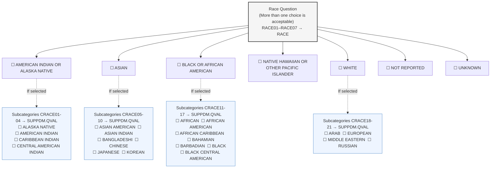

The CRF presents 7 race questions (RACE01-RACE07) with checkbox options:
- RACE01: AMERICAN INDIAN OR ALASKA NATIVE
- RACE02: ASIAN
- RACE03: BLACK OR AFRICAN AMERICAN
- RACE04: NATIVE HAWAIIAN OR OTHER PACIFIC ISLANDER
- RACE05: WHITE
- RACE06: NOT REPORTED
- RACE07: UNKNOWN

If the study participant answered AMERICAN INDIAN OR ALASKA NATIVE, subcategories (CRACE01-CRACE04) from the RACEC codelist are presented: ALASKA NATIVE, AMERICAN INDIAN, CARIBBEAN INDIAN, CENTRAL AMERICAN INDIAN.

If the study participant answered ASIAN, subcategories (CRACE05-CRACE10) are presented: ASIAN AMERICAN, ASIAN INDIAN, BANGLADESHI, CHINESE, JAPANESE, KOREAN.

If the study participant answered BLACK OR AFRICAN AMERICAN, subcategories (CRACE11-CRACE17) are presented: AFRICAN, AFRICAN AMERICAN, AFRICAN CARIBBEAN, BAHAMIAN, BARBADIAN, BLACK, BLACK CENTRAL AMERICAN.

If the study participant answered WHITE, subcategories (CRACE18-CRACE21) are presented: ARAB, EUROPEAN, MIDDLE EASTERN, RUSSIAN.

**CRF Metadata**

| CDASH Variable | Order | Question Text | Prompt | CRF Completion Instructions | Type | SDTMIG Target Variable | SDTM Target Mapping | Controlled Terminology Code List Name | Permissible Values | Pre-specified Value | Query Display | List Style | Hidden |
|---|---|---|---|---|---|---|---|---|---|---|---|---|---|
| RACE01 | 1 | Which of the following racial designations best describes you? (More than one choice is acceptable.) | Race | Study participants should self-report race, with race being asked about after ethnicity. | Text | RACE | | (RACE) | AMERICAN INDIAN OR ALASKA NATIVE | | | checkbox | |
| RACE02 | 2 | (same) | Race | (same) | Text | RACE | | (RACE) | ASIAN | | | checkbox | |
| RACE03 | 3 | (same) | Race | (same) | Text | RACE | | (RACE) | BLACK OR AFRICAN AMERICAN | | | checkbox | |
| RACE04 | 4 | (same) | Race | (same) | Text | RACE | | (RACE) | NATIVE HAWAIIAN OR OTHER PACIFIC ISLANDER | | | checkbox | |
| RACE05 | 5 | (same) | Race | (same) | Text | RACE | | (RACE) | WHITE | | | checkbox | |
| RACE06 | 6 | (same) | Race | (same) | Text | RACE | | (RACE) | NOT REPORTED | | | checkbox | |
| RACE07 | 7 | (same) | Race | (same) | Text | RACE | | (RACE) | UNKNOWN | | | checkbox | |
| CRACE01-CRACE04 | 10 | (same) | Race | Select each value that applies if the subject answered "AMERICAN INDIAN OR ALASKA NATIVE". Check all that apply. | Text | SUPPDM.QVAL | For each value that applies, SUPPDM.QVAL where SUPPDM.QNAM ="CRACEn" and SUPPDM.QLABEL = "Collected Race n" where n is the choice value. | (RACEC) | ALASKA NATIVE; AMERICAN INDIAN; CARIBBEAN INDIAN; CENTRAL AMERICAN INDIAN | | | checkbox | |
| CRACE05-CRACE10 | 11 | (same) | Race | Select each value that applies if the subject answered "ASIAN". Check all that apply. | Text | SUPPDM.QVAL | For each value that applies, SUPPDM.QVAL where SUPPDM.QNAM ="CRACEn" and SUPPDM.QLABEL = "Collected Race n" where n is the choice value. | (RACEC) | ASIAN AMERICAN; ASIAN INDIAN; BANGLADESHI; CHINESE; JAPANESE; KOREAN | | | checkbox | CRACE05-CRACE10 |
| CRACE11-CRACE17 | 12 | (same) | Race | Select each value that applies if the subject answered "BLACK OR AFRICAN AMERICAN". Check all that apply. | Text | SUPPDM.QVAL | For each value that applies, SUPPDM.QVAL where SUPPDM.QNAM ="CRACEn" and SUPPDM.QLABEL = "Collected Race n" where n is the choice value. | (RACEC) | AFRICAN; AFRICAN AMERICAN; AFRICAN CARIBBEAN; BAHAMIAN; BARBADIAN; BLACK; BLACK CENTRAL AMERICAN | | | checkbox | |
| CRACE18-CRACE21 | 13 | (same) | Race | Select each value that applies if the subject answered "WHITE". Check all that apply. | Text | SUPPDM.QVAL | For each value that applies, SUPPDM.QVAL where SUPPDM.QNAM ="CRACEn" and SUPPDM.QLABEL = "Collected Race n" where n is the choice value. | (RACEC) | ARAB; EUROPEAN; MIDDLE EASTERN; RUSSIAN | | | checkbox | |

The value of RACE is used to represent the high-level racial designation as a single collected value per CDISC Controlled Terminology in dm.xpt. When more than 1 choice is selected, the value is represented with "MULTIPLE" as shown in this example. **Note:** Only those variables relevant to this example are shown.

**Row 1:** Shows that USUBJID ABC789-010-045 designated 1 race, "WHITE", as the value that best describes their race.

**Row 2:** Shows that USUBJID ABC789-010-046 designated 1 race, "ASIAN", as the value that best describes their race.

**Row 3:** Shows that USUBJID ABC789-010-047 designated multiple races as the values that best describe their race. "MULTIPLE" is assigned in RACE.

**dm.xpt**

| Row | STUDYID | DOMAIN | USUBJID | SUBJID | RACE |
|-----|---------|--------|---------|--------|------|
| 1 | ABC789 | DM | ABC789-010-045 | 010-045 | WHITE |
| 2 | ABC789 | DM | ABC789-010-046 | 010-046 | ASIAN |
| 3 | ABC789 | DM | ABC789-010-047 | 010-047 | MULTIPLE |

When a subject selects multiple race values, as USUBJID ABC789-010-047 did, the values selected are represented in SUPPDM. Collected race, which is the specific race subcategory (or subcategories) selected by each subject, is represented in SUPPDM to ensure subject self-identification and/or country-specific requirements are available for reference. CDASH recommended QNAM-QLABEL values have been provided.

**Rows 1, 2:** Show that USUBJID ABC789-010-047 selected 2 RACE values, "ASIAN" and "WHITE". CDASH recommended QNAM-QLABEL values have been provided.

**Rows 3-5:** Show that USUBJID ABC789-010-047 selected 3 collected race (CRACE) values, "CHINESE", "KOREAN", and "RUSSIAN". CDASH recommended QNAM-QLABEL values have been provided.

**suppdm.xpt**

| Row | STUDYID | RDOMAIN | USUBJID | IDVAR | IDVARVAL | QNAM | QLABEL | QVAL | QORIG | QEVAL |
|-----|---------|---------|---------|-------|----------|------|--------|------|-------|-------|
| 1 | ABC789 | DM | ABC789-010-047 | | | RACE2 | Race 2 | ASIAN | CRF | |
| 2 | ABC789 | DM | ABC789-010-047 | | | RACE5 | Race 5 | WHITE | CRF | |
| 3 | ABC789 | DM | ABC789-010-047 | | | CRACE8 | Collected Race 8 | CHINESE | CRF | |
| 4 | ABC789 | DM | ABC789-010-047 | | | CRACE10 | Collected Race 10 | KOREAN | CRF | |
| 5 | ABC789 | DM | ABC789-010-047 | | | CRACE21 | Collected Race 21 | RUSSIAN | CRF | |

## Example 5

This example shows different Chinese regional ethnicity subcategorizations (majority and minority).

**CRF Mock Example**

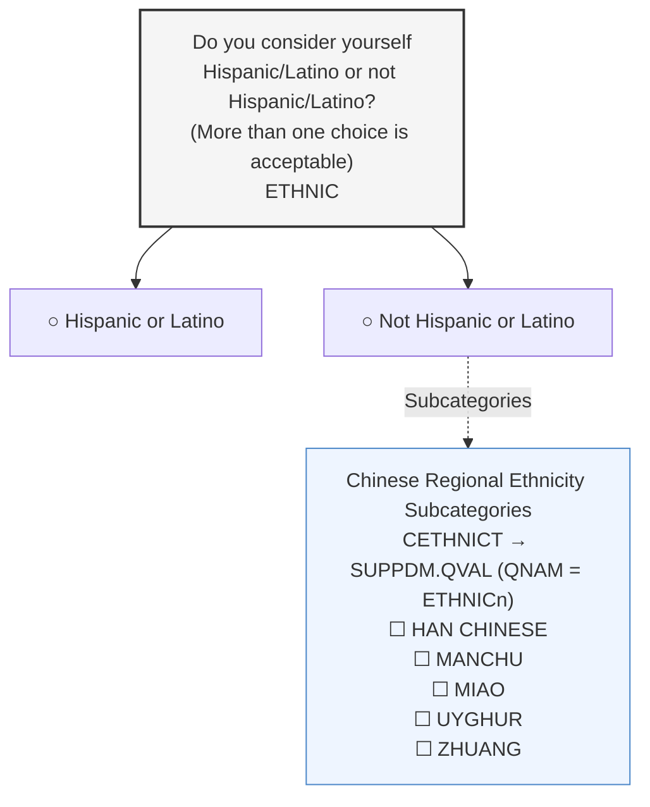

The CRF collects ETHNIC (Hispanic or Latino / Not Hispanic or Latino) with subcategories for Chinese regional ethnicity: HAN CHINESE, MANCHU, MIAO, UYGHUR, ZHUANG.

In this CRF example, subcategorizations of ethnicity are made available.

RACE is identified as "ASIAN" and ETHNIC as "NOT HISPANIC OR LATINO".

**dm.xpt**

| Row | STUDYID | DOMAIN | USUBJID | SUBJID | AGE | AGEU | SEX | RACE | ETHNIC |
|-----|---------|--------|---------|--------|-----|------|-----|------|--------|
| 1 | ABC789 | DM | ABC789-010-045 | 010-045 | 20 | YEARS | M | ASIAN | NOT HISPANIC OR LATINO |
| 2 | ABC789 | DM | ABC789-010-047 | 010-047 | 24 | YEARS | F | ASIAN | NOT HISPANIC OR LATINO |

**Row 1:** Ethnicity subcategorization of subject self-identification being "HAN CHINESE". CDASH recommended QNAM-QLABEL values have been provided.

**Rows 2-3:** Ethnicity subcategorization of subject self-identification being "MIAO" and "ZHUANG". CDASH recommended QNAM-QLABEL values have been provided.

**suppdm.xpt**

| Row | STUDYID | RDOMAIN | USUBJID | IDVAR | IDVARVAL | QNAM | QLABEL | QVAL | QORIG | QEVAL |
|-----|---------|---------|---------|-------|----------|------|--------|------|-------|-------|
| 1 | ABC789 | DM | ABC789-010-045 | | | ETHNIC1 | Collected Ethnicity 1 | HAN CHINESE | CRF | |
| 2 | ABC789 | DM | ABC789-010-047 | | | ETHNIC1 | Collected Ethnicity 1 | MIAO | CRF | |
| 3 | ABC789 | DM | ABC789-010-047 | | | ETHNIC2 | Collected Ethnicity 2 | ZHUANG | CRF | |

## Example 6

The CRF in this example is annotated to show the CDASH variable name and the target SDTMIG variable. Data that are collected using the same variable name as defined in the SDTMIG are in RED. If the CDASHIG variable differs from the one defined in the SDTMIG, the CDASHIG variable is in GREY.

See the CDASH Model and Implementation Guide for additional information: https://www.cdisc.org/standards/foundational/cdash.

This example shows race categories and subcategories. Only a subset of options are shown for this instrument due to space constraints. For a complete aCRF example see the CDASHIG v2.1, Section 7.3.

**Demographics Sample aCRF for Race with Additional Granularity**

> Variable annotation: CDASHIG variables (RACE01–RACE07, CRACE05–CRACE17) in grey; SDTMIG target variable (RACE) in red.

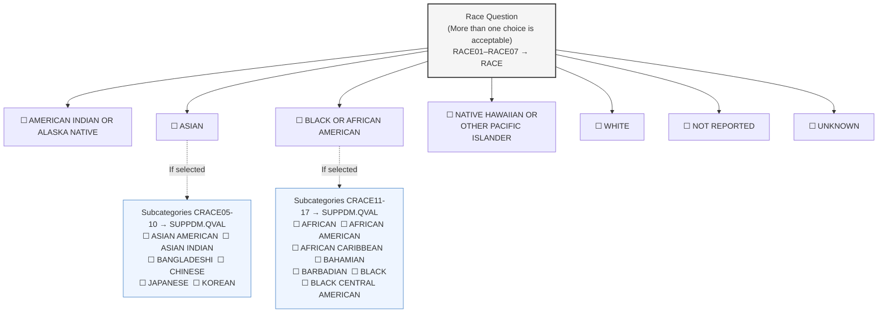

The CRF presents 7 race questions (RACE01-RACE07) with the same structure as Example 4, plus subcategory questions for ASIAN (CRACE05-CRACE10), BLACK OR AFRICAN AMERICAN (CRACE11-CRACE17), and other categories.

**CRF Metadata**

| CDASH Variable | Order | Question Text | Prompt | CRF Completion Instructions | Type | SDTMIG Target Variable | SDTM Target Mapping | Controlled Terminology Code List Name | Permissible Values | Pre-specified Value | Query Display | List Style | Hidden |
|---|---|---|---|---|---|---|---|---|---|---|---|---|---|
| RACE01 | 3 | Which of the following racial designations best describes you? (More than one choice is acceptable.) | Race | Study participants should self-report race, with race being asked about after ethnicity. | Text | RACE | | (RACE) | AMERICAN INDIAN OR ALASKA NATIVE | | | checkbox | |
| RACE02 | 4 | (same) | Race | (same) | Text | RACE | | (RACE) | ASIAN | | | checkbox | |
| RACE03 | 5 | (same) | Race | (same) | Text | RACE | | (RACE) | BLACK OR AFRICAN AMERICAN | | | checkbox | |
| RACE04 | 6 | (same) | Race | (same) | Text | RACE | | (RACE) | NATIVE HAWAIIAN OR OTHER PACIFIC ISLANDER | | | checkbox | |
| RACE05 | 7 | (same) | Race | (same) | Text | RACE | | (RACE) | WHITE | | | checkbox | |
| RACE06 | 8 | (same) | Race | (same) | Text | RACE | | (RACE) | NOT REPORTED | | | checkbox | |
| RACE07 | 9 | (same) | Race | (same) | Text | RACE | | (RACE) | UNKNOWN | | | checkbox | |
| CRACE05-CRACE10 | 11 | (same) | Race | Select each value that applies if the subject answered "ASIAN". Check all that apply. | Text | SUPPDM.QVAL | For each value that applies, SUPPDM.QVAL where SUPPDM.QNAM ="CRACEn" and SUPPDM.QLABEL = "Collected Race n" where n is the choice value. | (RACEC) | ASIAN AMERICAN; ASIAN INDIAN; BANGLADESHI; CHINESE; JAPANESE; KOREAN | | | checkbox | |
| CRACE11-CRACE17 | 12 | (same) | Race | Select each value that applies if the subject answered "BLACK OR AFRICAN AMERICAN". Check all that apply. | Text | SUPPDM.QVAL | For each value that applies, SUPPDM.QVAL where SUPPDM.QNAM ="CRACEn" and SUPPDM.QLABEL = "Collected Race n" where n is the choice value. | (RACEC) | AFRICAN; AFRICAN AMERICAN; AFRICAN CARIBBEAN; BAHAMIAN; BARBADIAN; BLACK; BLACK CENTRAL AMERICAN | | | checkbox | |

The value of RACE is used to represent the high-level racial designation as a single collected value per CDISC Controlled Terminology in dm.xpt. In this example, subjects chose to select 1 high-level racial designation.

**Note:** Only those variables relevant to this example are shown.

**Row 1:** Shows that USUBJID ABC789-010-001 designated 1 race, "ASIAN", as the value that best describes their race.

**Row 2:** Shows that USUBJID ABC789-010-002 designated 1 race, "BLACK OR AFRICAN AMERICAN", as the value that best describes their race.

**Row 3:** Shows that USUBJID ABC789-010-003 designated 1 race, "BLACK OR AFRICAN AMERICAN", as the value that best describes their race.

**dm.xpt**

| Row | STUDYID | DOMAIN | USUBJID | SUBJID | RACE |
|-----|---------|--------|---------|--------|------|
| 1 | ABC789 | DM | ABC789-010-001 | 010-001 | ASIAN |
| 2 | ABC789 | DM | ABC789-010-002 | 010-002 | BLACK OR AFRICAN AMERICAN |
| 3 | ABC789 | DM | ABC789-010-003 | 010-003 | BLACK OR AFRICAN AMERICAN |

Collected race, which is the specific race subcategory for each subject, is represented in SUPPDM to ensure subject self-identification and/or country-specific requirements are available for reference. In this example, each subject selected 1 race and 1 race subcategory. CDASH recommended QNAM-QLABEL values have been provided.

**Row 1:** Shows USUBJID ABC789-010-001 selected "JAPANESE" as the specific ASIAN race collected.

**Row 2:** Shows USUBJID ABC789-010-002 selected "AFRICAN AMERICAN" as the specific BLACK OR AFRICAN AMERICAN race collected.

**Row 3:** Shows USUBJID ABC789-010-003 selected "BLACK" as the specific BLACK OR AFRICAN AMERICAN race collected.

**suppdm.xpt**

| Row | STUDYID | RDOMAIN | USUBJID | IDVAR | IDVARVAL | QNAM | QLABEL | QVAL | QORIG | QEVAL |
|-----|---------|---------|---------|-------|----------|------|--------|------|-------|-------|
| 1 | ABC789 | DM | ABC789-010-001 | | | CRACE3 | Collected Race 3 | JAPANESE | CRF | |
| 2 | ABC789 | DM | ABC789-010-002 | | | CRACE5 | Collected Race 5 | AFRICAN AMERICAN | CRF | |
| 3 | ABC789 | DM | ABC789-010-003 | | | CRACE8 | Collected Race 8 | BLACK | CRF | |

## Example 7

**CRF Mock Example**

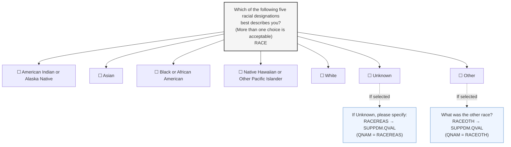

The CRF presents 5 racial designations plus "Unknown" and "Other" options:
- American Indian or Alaska Native
- Asian
- Black or African American
- Native Hawaiian or Other Pacific Islander
- White
- Unknown
- Other

Additional fields: "What was the other race?" (RACEOTH → SUPPDM.QVAL where SUPPDM.QNAM = "RACEOTH") and "If Unknown, please specify:" (RACEREAS → SUPPDM.QVAL where SUPPDM.QNAM = "RACEREAS").

**Rows 1-2:** Subjects self-identify to 1 of the first 5 race options on the CRF form.

**Row 3:** Subject did not self-identify to 1 of the existing race options and selected "Other". RACE was populated with "OTHER" in this case.

**Row 4:** Subject could not self-identify to any of the race options including identification of an "Other". RACE was populated with "UNKNOWN" in this case.

**Note:** Not all DM variables are shown.

**dm.xpt**

| Row | STUDYID | DOMAIN | USUBJID | SUBJID | AGE | AGEU | SEX | RACE | ETHNIC |
|-----|---------|--------|---------|--------|-----|------|-----|------|--------|
| 1 | ABC789 | DM | ABC789-010-045 | 010-045 | 20 | YEARS | M | WHITE | HISPANIC OR LATINO |
| 2 | ABC789 | DM | ABC789-010-046 | 010-046 | 21 | YEARS | F | ASIAN | NOT HISPANIC OR LATINO |
| 3 | ABC789 | DM | ABC789-010-047 | 010-047 | 24 | YEARS | F | OTHER | HISPANIC OR LATINO |
| 4 | ABC789 | DM | ABC789-010-048 | 010-048 | 33 | YEARS | M | UNKNOWN | HISPANIC OR LATINO |

**Row 1:** Sponsor allowed for an "Other" option to be collected, where its specify details are in SUPPDM.

**Row 2:** Sponsor allowed for an "Unknown" option to be collected, where its reason is collected in SUPPDM.

**Note:** Recommended QNAM-QLABEL values have been provided.

**suppdm.xpt**

| Row | STUDYID | RDOMAIN | USUBJID | IDVAR | IDVARVAL | QNAM | QLABEL | QVAL | QORIG | QEVAL |
|-----|---------|---------|---------|-------|----------|------|--------|------|-------|-------|
| 1 | ABC789 | DM | ABC789-010-047 | | | RACEOTH | Race, Other | BRAZILIAN | CRF | |
| 2 | ABC789 | DM | ABC789-010-048 | | | RACEREAS | Race, Reason Details | REFUGEE - DO NOT KNOW MY RACE | CRF | |

<!-- source: knowledge_base/domains/DS/assumptions.md -->
# DS — Assumptions

1. The Disposition (DS) dataset provides an accounting for all subjects who entered the study and may include protocol milestones, such as randomization, as well as the subject's completion status or reason for discontinuation for the entire study or each phase or segment of the study, including screening and post-treatment follow-up. Sponsors may choose which disposition events and milestones to submit for a study. See ICH E3, Section 10.1, for information about disposition events.

2. **Categorization**
   a. DSCAT is used to distinguish between disposition events, protocol milestones, and other events. The controlled terminology for DSCAT consists of "DISPOSITION EVENT", "PROTOCOL MILESTONE", and "OTHER EVENT".
   b. An event with DSCAT = "DISPOSITION EVENT" describes either disposition of study participation or of a study treatment. It describes whether a subject completed study participation or a study treatment and, if not, the reason they did not complete it. Dispositions may be described for each epoch (e.g., screening, initial treatment, washout, cross-over treatment, follow-up) or for the study as a whole. If disposition events for both study participation and study treatment(s) are to be represented, then DSCAT provides this distinction. For records with DSCAT = "DISPOSITION EVENT",
      i. DSSCAT = "STUDY PARTICIPATION" is used to represent disposition of study participation.
      ii. DSSCAT = "STUDY TREATMENT" is used when a study has only a single treatment.
      iii. If a study has multiple treatments, then DSSCAT should name the individual treatment.
   c. DSSCAT may be used when DSCAT = "PROTOCOL MILESTONE" or "OTHER EVENT", but would be subject to additional CDISC Controlled Terminology.
   d. An event with DSCAT = "PROTOCOL MILESTONE" is a protocol-specified, point-in-time event. Common protocol milestones include "INFORMED CONSENT OBTAINED" and "RANDOMIZED." DSSCAT may be used for subcategories of protocol milestones.
   e. An event with DSCAT = "OTHER EVENT" is another important event that occurred during a trial, but was not driven by protocol requirements and was not captured in another Events or Interventions class dataset. "TREATMENT UNBLINDED" is an example of an event that would be represented with DSCAT = "OTHER EVENT".
   f. Associations between DSCAT and some DSDECOD codelist values are described in the DS Codetable (available at https://www.cdisc.org/standards/terminology/controlled-terminology).

3. **DS description and coding**
   a. DSDECOD values are drawn from controlled terminology. The controlled terminology depends on the value of DSCAT.
   b. When DSCAT = "DISPOSITION EVENT" DSTERM contains either "COMPLETED" or, if the subject did not complete, specific verbatim information about the reason for non-completion.
      i. When DSTERM = "COMPLETED", DSDECOD is the term "COMPLETED" from the Controlled Terminology codelist NCOMPLT.
      ii. When DSTERM contains verbatim text, DSDECOD will use the extensible Controlled Terminology Codelist NCOMPLT. For example, DSTERM = "Subject moved" might be coded to DSDECOD = "LOST TO FOLLOW-UP".
   c. When DSCAT = "PROTOCOL MILESTONE", DSTERM contains the verbatim (as collected) and/or standardized text, DSDECOD will use the extensible Controlled Terminology codelist PROTMLST.
   d. When DSCAT = "OTHER EVENT", DSTERM and DSDECOD uses sponsor terminology.
      i. If a reason for the event was collected, the reason for the event is in DSTERM and the DSDECOD is a term from sponsor terminology. For example, if treatment was unblinded due to investigator error, this might be represented in a record with DSTERM = "INVESTIGATOR ERROR" and DSDECOD = "TREATMENT UNBLINDED".
      ii. If no reason was collected, then DSTERM should be populated with the value in DSDECOD.

4. **Timing variables**
   a. DSSTDTC is expected and is used for the date/time of the disposition event. Events represented in the DS domain do not have end dates; disposition events do not span an interval, but rather occur at a single date/time (e.g., randomization date, disposition of study participation or study treatment).
   b. DSSTDTC documents the date/time that a protocol milestone, disposition event, or other event occurred. For an event with DSCAT = "DISPOSITION EVENT" where DSTERM is not "COMPLETED", the reason for non-completion may be related to an observation reported in another dataset. DSSTDTC is the date/time that the Epoch was completed and is not necessarily the same as the date/time, start date/time, or end date/time of the observation that led to discontinuation.

      For example, a subject reported severe vertigo on June 1, 2006 (AESTDTC). After ruling out other possible causes, the investigator decided to discontinue study treatment on June 6, 2006 (DSSTDTC). The subject reported that the vertigo had resolved on June 8, 2006 (AEENDTC).
   c. EPOCH may be included as a timing variable as in other general observation-class domains. In DS, EPOCH is based on DSSTDTC. The values of EPOCH are drawn from the Trial Arms (TA) dataset (see Section 7.2.1, Trial Arms).

5. Reasons for termination: ICH E3 Section 10.1 indicates that "the specific reason for discontinuation" should be presented, and that summaries should be grouped by treatment and by major reason." The CDISC SDS Team interprets this guidance as requiring 1 standardized disposition term (DSDECOD) per disposition event. If multiple reasons are reported, the sponsor should identify a primary reason and use that to populate DSTERM and DSDECOD. Additional reasons should be submitted in SUPPDS.

   For example, in a case where DSTERM = "SEVERE NAUSEA" and DSDECOD = "ADVERSE EVENT", the supplemental qualifiers dataset might include records with

   SUPPDS QNAM = "DSTERM1", SUPPDS QLABEL = "Reported Term for Disposition Event 1", and SUPPDS QVAL = "SUBJECT REFUSED FURTHER TREATMENT"

   SUPPDS QNAM = "DSDECOD1", SUPPDS QLABEL = "Standardized Disposition Term 1", and SUPPDS QVAL = "WITHDREW CONSENT"

6. Any identifier variables, timing variables, or Events general observation-class qualifiers may be added to the DS domain, but the following Qualifiers would generally not be used: --PRESP, --OCCUR, --STAT, --REASND, --BODSYS, --LOC, --SEV, --SER, --ACN, --ACNOTH, --REL, --RELNST, --PATT, --OUT, --SCAN, --SCONG, --SDISAB, --SDTH, --SHOSP, --SLIFE, --SOD, --SMIE, --CONTRT, --TOXGR.

<!-- source: knowledge_base/domains/DS/examples.md -->
# DS — Examples

## Example 1

In this example, disposition of study participation was collected for each epoch of a trial. Disposition of study participation is indicated by DSCAT = "DISPOSITION EVENT". EPOCH was taken from the CRF, which asked about completion of each epoch of the study. Data about disposition of study treatment was not collected, but the sponsor populated DSSCAT with "STUDY PARTICIPATION" to emphasize that these represent disposition of study participation.

Data were also collected about several protocol milestones represented with DSCAT = "PROTOCOL MILESTONE".

**Rows 1, 2, 6, 8, 9, 12, 13, 17, 18:** Show records for protocol milestones. DSTERM and DSDECOD are populated with the same value, the name of the milestone. Note that for randomization events, EPOCH = "SCREENING", because randomization occurred before the start of treatment, during the screening epoch.

**Rows 3-5:** Show 3 records for a subject who completed 3 stages of the study ("SCREENING", "TREATMENT", "FOLLOW-UP").

**Row 7:** Shows disposition of a subject who was a screen failure. The verbatim reason the subject was a screen failure is represented in DSTERM. Because the subject did not complete the screening epoch, DSDECOD is not "COMPLETED" but another appropriate controlled term, "PROTOCOL VIOLATION". The date of discontinuation is in DSSTDTC. The protocol deviation event itself would be represented in the DV dataset.

**Rows 10-11:** Show disposition of a subject who completed the screening stage but did not complete the treatment stage. For completed epochs, both DSTERM and DSDECOD are "COMPLETED". For epochs that were not completed, the verbatim reason for the treatment epoch is in DSTERM, while the value from controlled terminology is in DSDECOD.

**Rows 14-16:** Show disposition of a subject who completed treatment, but did not complete follow-up. Note that for final disposition event, the date of collection of the event information, DSDTC, was different from the date of the disposition event (the subject's death), DSSTDTC.

**Rows 19-21:** Show disposition of a subject who discontinued the treatment epoch due to an adverse event, but who went on to complete the follow-up phase of the trial.

**ds.xpt**

| Row | STUDYID | DOMAIN | USUBJID | DSSEQ | DSTERM | DSDECOD | DSCAT | DSSCAT | EPOCH | DSDTC | DSSTDTC |
|-----|---------|--------|---------|-------|--------|---------|-------|--------|-------|-------|---------|
| 1 | ABC123 | DS | 123101 | 1 | INFORMED CONSENT OBTAINED | INFORMED CONSENT OBTAINED | PROTOCOL MILESTONE | | SCREENING | 2003-09-21 | 2003-09-21 |
| 2 | ABC123 | DS | 123101 | 2 | RANDOMIZED | RANDOMIZED | PROTOCOL MILESTONE | | SCREENING | 2003-09-30 | 2003-09-30 |
| 3 | ABC123 | DS | 123101 | 3 | COMPLETED | COMPLETED | DISPOSITION EVENT | STUDY PARTICIPATION | SCREENING | 2003-09-30 | 2003-09-29 |
| 4 | ABC123 | DS | 123101 | 4 | COMPLETED | COMPLETED | DISPOSITION EVENT | STUDY PARTICIPATION | TREATMENT | 2003-10-31 | 2003-10-15 |
| 5 | ABC123 | DS | 123101 | 5 | COMPLETED | COMPLETED | DISPOSITION EVENT | STUDY PARTICIPATION | FOLLOW-UP | 2003-11-15 | 2003-11-21 |
| 6 | ABC123 | DS | 123102 | 1 | INFORMED CONSENT OBTAINED | INFORMED CONSENT OBTAINED | PROTOCOL MILESTONE | | SCREENING | 2003-11-21 | 2003-11-21 |
| 7 | ABC123 | DS | 123102 | 2 | SUBJECT DENIED MRI PROCEDURE | PROTOCOL VIOLATION | DISPOSITION EVENT | STUDY PARTICIPATION | SCREENING | 2003-11-22 | 2003-11-22 |
| 8 | ABC123 | DS | 123103 | 1 | INFORMED CONSENT OBTAINED | INFORMED CONSENT OBTAINED | PROTOCOL MILESTONE | | SCREENING | 2003-09-15 | 2003-09-15 |
| 9 | ABC123 | DS | 123103 | 2 | RANDOMIZED | RANDOMIZED | PROTOCOL MILESTONE | | SCREENING | 2003-09-30 | 2003-09-30 |
| 10 | ABC123 | DS | 123103 | 3 | COMPLETED | COMPLETED | DISPOSITION EVENT | STUDY PARTICIPATION | SCREENING | 2003-09-30 | 2003-09-30 |
| 11 | ABC123 | DS | 123103 | 4 | SUBJECT MOVED | LOST TO FOLLOW-UP | DISPOSITION EVENT | STUDY PARTICIPATION | TREATMENT | 2003-10-31 | 2003-10-20 |
| 12 | ABC123 | DS | 123104 | 1 | INFORMED CONSENT OBTAINED | INFORMED CONSENT OBTAINED | PROTOCOL MILESTONE | | SCREENING | 2003-09-15 | 2003-09-15 |
| 13 | ABC123 | DS | 123104 | 2 | RANDOMIZED | RANDOMIZED | PROTOCOL MILESTONE | | SCREENING | 2003-09-30 | 2003-09-30 |
| 14 | ABC123 | DS | 123104 | 3 | COMPLETED | COMPLETED | DISPOSITION EVENT | STUDY PARTICIPATION | SCREENING | 2003-09-30 | 2003-09-30 |
| 15 | ABC123 | DS | 123104 | 4 | COMPLETED | COMPLETED | DISPOSITION EVENT | STUDY PARTICIPATION | TREATMENT | 2003-10-15 | 2003-10-15 |
| 16 | ABC123 | DS | 123104 | 5 | AUTOMOBILE ACCIDENT | DEATH | DISPOSITION EVENT | STUDY PARTICIPATION | FOLLOW-UP | 2003-10-31 | 2003-10-31 |
| 17 | ABC123 | DS | 123105 | 1 | INFORMED CONSENT OBTAINED | INFORMED CONSENT OBTAINED | PROTOCOL MILESTONE | | SCREENING | 2003-09-28 | 2003-09-28 |
| 18 | ABC123 | DS | 123105 | 2 | RANDOMIZED | RANDOMIZED | PROTOCOL MILESTONE | | SCREENING | 2003-10-02 | 2003-10-02 |
| 19 | ABC123 | DS | 123105 | 3 | COMPLETED | COMPLETED | DISPOSITION EVENT | STUDY PARTICIPATION | SCREENING | 2003-10-02 | 2003-10-02 |
| 20 | ABC123 | DS | 123105 | 4 | ANEMIA | ADVERSE EVENT | DISPOSITION EVENT | STUDY PARTICIPATION | TREATMENT | 2003-10-17 | 2003-10-17 |
| 21 | ABC123 | DS | 123105 | 5 | COMPLETED | COMPLETED | DISPOSITION EVENT | STUDY PARTICIPATION | FOLLOW-UP | 2003-11-02 | 2003-11-02 |

## Example 2

In this example, the sponsor has chosen to simply submit whether or not subjects completed the study, so there is only 1 record per subject. The sponsor did not collect disposition of treatment and did not include DSSCAT. EPOCH was populated as a timing variable, and represents the epoch during which the subject discontinued.

**Row 1:** Subject 456101 completed the study. EPOCH = "FOLLOW-UP", which was the last epoch in the design of this study.

**Rows 2-3:** Subjects 456102 and 456103 discontinued. Both discontinued participation during the treatment epoch.

**ds.xpt**

| Row | STUDYID | DOMAIN | USUBJID | DSSEQ | DSTERM | DSDECOD | DSCAT | EPOCH | DSSTDTC |
|-----|---------|--------|---------|-------|--------|---------|-------|-------|---------|
| 1 | ABC456 | DS | 456101 | 1 | COMPLETED | COMPLETED | DISPOSITION EVENT | FOLLOW-UP | 2003-09-21 |
| 2 | ABC456 | DS | 456102 | 1 | SUBJECT TAKING STUDY MED ERRATICALLY | PROTOCOL VIOLATION | DISPOSITION EVENT | TREATMENT | 2003-09-29 |
| 3 | ABC456 | DS | 456103 | 1 | LOST TO FOLLOW-UP | LOST TO FOLLOW-UP | DISPOSITION EVENT | TREATMENT | 2003-10-15 |

## Example 3

In this study, disposition of study participation was collected for the treatment and follow-up epochs. For these records, the value in EPOCH was taken from the CRF. Data on screen failures were not submitted for this study, so all submitted subjects completed screening; the sponsor chose not to collect data on disposition of the screening epoch.

Data on protocol milestones were not collected, but data were collected if a subject's treatment was unblinded. For these records, EPOCH represents the epoch during which the blind was broken.

**Rows 1, 2:** Subject 789101 completed the treatment and follow-up phases.

**Rows 3, 5:** Subject 789102 did not complete the treatment phase but did complete the follow-up phase.

**Row 4:** Subject 789102's treatment was unblinded. The date of the unblinding is represented in DSSTDTC. Maintaining the blind as per protocol was not considered to be an "event" because there was no change in the subject's state.

**ds.xpt**

| Row | STUDYID | DOMAIN | USUBJID | DSSEQ | DSTERM | DSDECOD | DSCAT | EPOCH | DSSTDTC |
|-----|---------|--------|---------|-------|--------|---------|-------|-------|---------|
| 1 | ABC789 | DS | 789101 | 1 | COMPLETED | COMPLETED | DISPOSITION EVENT | TREATMENT | 2004-09-12 |
| 2 | ABC789 | DS | 789101 | 2 | COMPLETED | COMPLETED | DISPOSITION EVENT | FOLLOW-UP | 2004-12-20 |
| 3 | ABC789 | DS | 789102 | 1 | SKIN RASH | ADVERSE EVENT | DISPOSITION EVENT | TREATMENT | 2004-09-30 |
| 4 | ABC789 | DS | 789102 | 2 | SUBJECT HAD SEVERE RASH | TREATMENT UNBLINDED | OTHER EVENT | TREATMENT | 2004-10-01 |
| 5 | ABC789 | DS | 789102 | 3 | COMPLETED | COMPLETED | DISPOSITION EVENT | FOLLOW-UP | 2004-12-28 |

## Example 4

In this example, the CRF included collection of an AE number when study participation was incomplete due to an adverse event. The relationship between the DS record and AE record is represented in a RELREC dataset.

The DS domain represents the end of the subject's participation in the study, due to their death from heart failure. In this case, the disposition was collected (DSDTC) on the same day that death occurred and the subject's study participation ended. (DSDTDTC).

**ds.xpt**

| Row | STUDYID | DOMAIN | USUBJID | DSSEQ | DSTERM | DSDECOD | DSCAT | EPOCH | DSDTC | DSSTDTC |
|-----|---------|--------|---------|-------|--------|---------|-------|-------|-------|---------|
| 1 | ABC123 | DS | 123102 | 1 | Heart Failure | DEATH | DISPOSITION EVENT | TREATMENT | 2003-09-29 | 2003-09-29 |

The heart failure is represented as an adverse event. In order to save space, only 2 of the MedDRA coding variables for the adverse event have been included.

**ae.xpt**

| Row | STUDYID | DOMAIN | USUBJID | AESEQ | AETERM | AESTDTC | AEENDTC | AEDECOD | AESOC | AESEV | AESER | AEACN | AEREL | AEOUT | AESCONG | AESDISAB | AESDTH | AESHOSP | AESLIFE | AESOD | AESMIE |
|-----|---------|--------|---------|-------|--------|---------|---------|---------|-------|-------|-------|-------|-------|-------|---------|----------|--------|---------|---------|-------|--------|
| 1 | ABC123 | AE | 123102 | 1 | Heart Failure | 2003-09-28 | 2003-09-29 | HEART FAILURE | CARDIOVASCULAR SYSTEM | SEVERE | Y | NOT APPLICABLE | DEFINITELY NOT RELATED | FATAL | N | N | Y | N | N | N |

The relationship between the DS and AE records is represented in RELREC.

**relrec.xpt**

| Row | STUDYID | RDOMAIN | USUBJID | IDVAR | IDVARVAL | RELTYPE | RELID |
|-----|---------|---------|---------|-------|----------|---------|-------|
| 1 | ABC123 | DS | 123102 | DSSEQ | 1 | | 1 |
| 2 | ABC123 | AE | 123102 | AESEQ | 1 | | 1 |

The subject's DM record is not shown, but included DTHFL = "Y" and the date of death.

## Example 5

This below represents a multidrug (isoniazid and levofloxacin) investigational treatment trial for multidrug-resistant tuberculosis (MDR-TB). The protocol allows for a subject to discontinue levofloxacin and continue single treatment of isoniazid throughout the remainder of the study. Disposition of study participation and disposition of each drug was collected. Whether a record with DSCAT = "DISPOSITION EVENT" represents disposition of the subject's participation in the study or disposition of a study treatment is represented in DSSCAT. In this example, disposition of the study and of each drug a subject received for each of the study's 2 treatment epochs.

**Row 1:** Indicates that the physician, per protocol, removed levofloxacin treatment due to high-level positive cultures. This record represents the treatment discontinuation for levofloxacin, for the first treatment epoch. Note that because this subject did not receive levofloxacin during the second treatment epoch, there is no record for DSSCAT = "LEVOFLOXACIN" with EPOCH = "TREATMENT 2".

**Rows 2, 4:** Represent the treatment continuation and completion for isoniazid each treatment epoch.

**Rows 3, 5:** Represent the study disposition for each treatment epoch, as indicated by DSSCAT = "STUDY PARTICIPATION".

**ds.xpt**

| Row | STUDYID | DOMAIN | USUBJID | DSSEQ | DSTERM | DSDECOD | DSCAT | DSSCAT | EPOCH | DSSTDTC |
|-----|---------|--------|---------|-------|--------|---------|-------|--------|-------|---------|
| 1 | XXX | DS | XXX-767-001 | 1 | PERSISTENT HIGH-LEVEL POSITIVE CULTURES. PER PROTOCOL, LEVOFLOXACIN REMOVAL RECOMMENDED | PHYSICIAN DECISION | DISPOSITION EVENT | LEVOFLOXACIN | TREATMENT 1 | 2016-02-15 |
| 2 | XXX | DS | XXX-767-001 | 2 | COMPLETED | COMPLETED | DISPOSITION EVENT | ISONIAZID | TREATMENT 1 | 2016-02-15 |
| 3 | XXX | DS | XXX-767-001 | 3 | COMPLETED | COMPLETED | DISPOSITION EVENT | STUDY PARTICIPATION | TREATMENT 1 | 2016-02-25 |
| 4 | XXX | DS | XXX-767-001 | 4 | COMPLETED | COMPLETED | DISPOSITION EVENT | ISONIAZID | TREATMENT 2 | 2016-03-14 |
| 5 | XXX | DS | XXX-767-001 | 5 | COMPLETED | COMPLETED | DISPOSITION EVENT | STUDY PARTICIPATION | TREATMENT 2 | 2016-03-24 |

## Example 6

This example is for a study of a multidrug (isoniazid and levofloxacin) investigational treatment for MDR-TB. The protocol allowed a subject to discontinue levofloxacin and continue single treatment of isoniazid throughout the remainder of the study. Disposition of study participation and of each study treatment was collected. For records of disposition of the subject's participation in the study DSSCAT = "STUDY PARTICIPATION", whereas for records of disposition of a study treatment DSSCAT is the name of the treatment.

**Row 1:** Represents the final treatment disposition for levofloxacin, as indicated by DSSCAT = "LEVOFLOXACIN". The physician removed levofloxacin treatment due to high-level positive cultures, as allowed by the protocol.

**Row 2:** Represents the final treatment completion of isoniazid within the trial, which is indicated by DSSCAT = "ISONIAZID".

**Row 3:** Represents the final study completion within the trial, which is indicated by DSSCAT = "STUDY PARTICIPATION".

**ds.xpt**

| Row | STUDYID | DOMAIN | USUBJID | DSSEQ | DSTERM | DSDECOD | DSCAT | DSSCAT | EPOCH | DSSTDTC |
|-----|---------|--------|---------|-------|--------|---------|-------|--------|-------|---------|
| 1 | XXX | DS | XXX-767-001 | 1 | PERSISTENT HIGH-LEVEL POSITIVE CULTURES. PER PROTOCOL, LEVOFLOXACIN REMOVAL RECOMMENDED | PHYSICIAN DECISION | DISPOSITION EVENT | LEVOFLOXACIN | TREATMENT 1 | 2016-02-15 |
| 2 | XXX | DS | XXX-767-001 | 2 | COMPLETED | COMPLETED | DISPOSITION EVENT | ISONIAZID | TREATMENT 2 | 2016-03-14 |
| 3 | XXX | DS | XXX-767-001 | 3 | COMPLETED | COMPLETED | DISPOSITION EVENT | STUDY PARTICIPATION | TREATMENT 2 | 2016-03-24 |

## Example 7

This is an example of a trial with a single investigative treatment. The sponsor used the generic DSSCAT value "STUDY TREATMENT" rather than the name of the treatment. This subject discontinued both treatment and study participation due to an adverse event.

**Rows 1, 3:** Represent the disposition of treatment for each treatment epoch, as indicated by DSSCAT = "STUDY TREATMENT".

**Rows 2, 4:** Represent the disposition of study participation continuation for each treatment epoch, as indicated by DSSCAT = "STUDY PARTICIPATION".

**ds.xpt**

| Row | STUDYID | DOMAIN | USUBJID | DSSEQ | DSTERM | DSDECOD | DSCAT | DSSCAT | EPOCH | DSSTDTC |
|-----|---------|--------|---------|-------|--------|---------|-------|--------|-------|---------|
| 1 | XXX | DS | XXX-767-001 | 1 | COMPLETED | COMPLETED | DISPOSITION EVENT | STUDY TREATMENT | TREATMENT 1 | 2016-02-15 |
| 2 | XXX | DS | XXX-767-001 | 2 | COMPLETED | COMPLETED | DISPOSITION EVENT | STUDY PARTICIPATION | TREATMENT 1 | 2016-02-15 |
| 3 | XXX | DS | XXX-767-001 | 3 | SKIN RASH | ADVERSE EVENT | DISPOSITION EVENT | STUDY TREATMENT | TREATMENT 2 | 2016-03-14 |
| 4 | XXX | DS | XXX-767-001 | 4 | SKIN RASH | ADVERSE EVENT | DISPOSITION EVENT | STUDY PARTICIPATION | TREATMENT 2 | 2016-03-14 |

## Example 8

This example represents data for an ongoing blinded study in which each subject received 2 treatments, identified by the sponsor as "BLINDED DRUG A" and "BLINDED DRUG B". Disposition of study participation and of each of the 2 blinded treatments was collected for each of the 2 treatment epochs in the study. The subject in this example completed study participation and both treatments for both treatment epochs.

**Rows 1, 2, 4, 5:** Represent the disposition of the blinded treatments for each of the 2 treatment epochs, indicated by DSSCAT = "BLINDED DRUG A" and DSSCAT = "BLINDED DRUG B".

**Rows 3, 6:** Represent the disposition of study participation for each of the 2 treatment epochs, as indicated by DSSCAT = "STUDY PARTICIPATION".

**ds.xpt**

| Row | STUDYID | DOMAIN | USUBJID | DSSEQ | DSTERM | DSDECOD | DSCAT | DSSCAT | EPOCH | DSSTDTC |
|-----|---------|--------|---------|-------|--------|---------|-------|--------|-------|---------|
| 1 | XXX | DS | XXX-767-001 | 1 | COMPLETED | COMPLETED | DISPOSITION EVENT | BLINDED DRUG A | TREATMENT 1 | 2016-02-15 |
| 2 | XXX | DS | XXX-767-001 | 2 | COMPLETED | COMPLETED | DISPOSITION EVENT | BLINDED DRUG B | TREATMENT 1 | 2016-02-15 |
| 3 | XXX | DS | XXX-767-001 | 3 | COMPLETED | COMPLETED | DISPOSITION EVENT | STUDY PARTICIPATION | TREATMENT 1 | 2016-02-25 |
| 4 | XXX | DS | XXX-767-001 | 4 | COMPLETED | COMPLETED | DISPOSITION EVENT | BLINDED DRUG A | TREATMENT 2 | 2016-03-14 |
| 5 | XXX | DS | XXX-767-001 | 5 | COMPLETED | COMPLETED | DISPOSITION EVENT | BLINDED DRUG B | TREATMENT 2 | 2016-03-14 |
| 6 | XXX | DS | XXX-767-001 | 6 | COMPLETED | COMPLETED | DISPOSITION EVENT | STUDY PARTICIPATION | TREATMENT 2 | 2016-03-24 |

## Example 9

This example is for a study in which multiple informed consents were collected. DSTERM is populated with a full description of the informed consent. DSDECOD is populated with the standardized value "INFORMED CONSENT OBTAINED" from the Protocol Milestone (PROTMLST) codelist. For all informed consent records, DSCAT = "PROTOCOL MILESTONE". The sponsor chose to include the EPOCH timing variable, to indicate the epoch during which each protocol milestone occurred.

**Row 1:** Shows the obtaining of the initial study informed consent.

**Row 2:** Shows randomization, another event with DSCAT = "PROTOCOL MILESTONE".

**Rows 3-5:** Show 3 additional informed consents obtained during the trial.

**ds.xpt**

| Row | STUDYID | DOMAIN | USUBJID | DSSEQ | DSTERM | DSDECOD | DSCAT | EPOCH | DSSTDTC |
|-----|---------|--------|---------|-------|--------|---------|-------|-------|---------|
| 1 | XXX | DS | XXX-767-001 | 1 | INFORMED CONSENT FOR STUDY ENROLLMENT OBTAINED | INFORMED CONSENT OBTAINED | PROTOCOL MILESTONE | SCREENING | 2016-02-22 |
| 2 | XXX | DS | XXX-767-001 | 2 | RANDOMIZED | RANDOMIZED | PROTOCOL MILESTONE | SCREENING | 2016-02-26 |
| 3 | XXX | DS | XXX-767-001 | 3 | INFORMED CONSENT FOR AMENDMENT ONE OBTAINED | INFORMED CONSENT OBTAINED | PROTOCOL MILESTONE | TREATMENT 1 | 2016-04-10 |
| 4 | XXX | DS | XXX-767-001 | 4 | INFORMED CONSENT FOR PHARMACOGENETIC RESEARCH OBTAINED | INFORMED CONSENT OBTAINED | PROTOCOL MILESTONE | TREATMENT 2 | 2016-06-08 |
| 5 | XXX | DS | XXX-767-001 | 5 | INFORMED CONSENT FOR PK SUB-STUDY OBTAINED | INFORMED CONSENT OBTAINED | PROTOCOL MILESTONE | TREATMENT 2 | 2016-06-23 |

## Example 10

The example represents data for 2 subjects who participated in a study with multiple treatment periods. During the first treatment period, subjects were randomized to drug 1 or drug 2. The second treatment phase added the investigational drug to drug 1 and drug 2. Disposition of study drugs and study participation was collected at the end of each epoch. DSSCAT was used to distinguish between disposition of study drugs vs. study participation. The supporting Demographics (DM), Exposure (EX), Trial Elements (TE), Trial Arms (TA), and Subject Elements (SE) datasets have been provided for additional context. Not all records are shown in the supporting example datasets.

The elements used in the TA dataset are defined in the TE dataset.

**Row 1:** Shows the screening element.

**Rows 2, 3:** Show the elements for treatment (either "DRUG1" or "DRUG2"). These appear in the first treatment epoch in the TA dataset.

**Rows 4, 5:** Show the elements for treatment (either "DG1INDG" or "DG2INDG"). These appear in the second treatment epoch in the TA dataset.

**Row 6:** Shows the follow-up element.

**te.xpt**

| Row | STUDYID | DOMAIN | ETCD | ELEMENT | TESTRL | TEENRL | TEDUR |
|-----|---------|--------|------|---------|--------|--------|-------|
| 1 | XYZ | TE | SCRN | Screen | Informed Consent | 1 week after start of Element | P7D |
| 2 | XYZ | TE | DRUG1 | Drug 1 | First dose of Drug 1 | 4 weeks after start of Element | P28D |
| 3 | XYZ | TE | DRUG2 | Drug 2 | First dose of Drug 2 | 4 weeks after start of Element | P28D |
| 4 | XYZ | TE | DG1INDG | Drug 1 + Investigation Drug | First dose of Investigational Drug, where Investigational Drug is given with Drug 1 | 1 week after start of Element | P7D |
| 5 | XYZ | TE | DG2INDG | Drug 2 + Investigation Drug | First dose of Investigational Drug, where Investigational Drug is given with Drug 2 | 1 week after start of Element | P7D |
| 6 | XYZ | TE | FU | Follow-up | One day after last administration of study drug | | |

The TA dataset describes the design of the study.

**Rows 1, 5:** Screening portion of the trial arm.

**Rows 2, 6:** Represents the planned initial treatment arm of either "DRUG1" or "DRUG2".

**Rows 3, 7:** Represents the planned second treatment arm of either "DG1INDG" or "DG2INDG".

**Rows 4, 8:** Follow-up portion of the trial arm.

**ta.xpt**

| Row | STUDYID | DOMAIN | ARMCD | ARM | TAETORD | ETCD | ELEMENT | TABRANCH | TATRANS | EPOCH |
|-----|---------|--------|-------|-----|---------|------|---------|----------|---------|-------|
| 1 | XYZ | TA | DG1INDG | Drug-1+Investigation-Drug | 1 | SCRN | Screen | Randomized to DG1INDG | | SCREENING |
| 2 | XYZ | TA | DG1INDG | Drug-1+Investigation-Drug | 2 | DRUG1 | Drug-1 | | | TREATMENT 1 |
| 3 | XYZ | TA | DG1INDG | Drug-1+Investigation-Drug | 3 | DG1INDG | Drug 1 + Investigation Drug | | | TREATMENT 2 |
| 4 | XYZ | TA | DG1INDG | Drug-1+Investigation-Drug | 4 | FU | Follow-up | | | FOLLOW-UP |
| 5 | XYZ | TA | DG2INDG | Drug-2+Investigation-Drug | 1 | SCRN | Screen | Randomized to DG2INDG | | SCREENING |
| 6 | XYZ | TA | DG2INDG | Drug-2+Investigation-Drug | 2 | DRUG2 | Drug-2 | | | TREATMENT 1 |
| 7 | XYZ | TA | DG2INDG | Drug-2+Investigation-Drug | 3 | DG2INDG | Drug 2 + Investigation Drug | | | TREATMENT 2 |
| 8 | XYZ | TA | DG2INDG | Drug-2+Investigation-Drug | 4 | FU | Follow-up | | | FOLLOW-UP |

The DM dataset includes the arm to which the subjects were randomized, and the dates of informed consent, start of study treatment, end of study treatment, and end of study participation.

**dm.xpt**

| Row | STUDYID | DOMAIN | USUBJID | SUBJID | RFXSTDTC | RFXENDTC | RFICDTC | RFPENDTC | SITEID | INVNAM | ARMCD | ARM | ACTARMCD | ACTARM | ARMNRS | ACTARMUD |
|-----|---------|--------|---------|--------|----------|----------|---------|----------|--------|--------|-------|-----|----------|--------|--------|----------|
| 1 | XYZ | DM | XYZ-767-001 | 001 | 2016-02-14 | 2016-04-19 | 2016-02-02 | 2016-04-24 | 01 | ADAMS, M | DG1INDG | Drug-1+Investigation-Drug | DG1INDG | Drug-1+Investigation-Drug | | |
| 3 | XYZ | DM | XYZ-767-002 | 002 | 2016-02-21 | 2016-04-24 | 2016-02-04 | 2016-04-29 | 01 | ADAMS, M | DG2INDG | Drug-2+Investigation-Drug | DG2INDG | Drug-2+Investigation-Drug | | |

The EX dataset shows the administration of study treatments.

**ex.xpt**

| Row | STUDYID | DOMAIN | USUBJID | EXSEQ | EXTRT | EXDOSE | EXDOSU | EPOCH | EXSTDTC | EXENDTC |
|-----|---------|--------|---------|-------|-------|--------|--------|-------|---------|---------|
| 1 | XYZ | EX | XYZ-767-001 | 1 | Drug 1 | 500 | mg | TREATMENT 1 | 2016-02-14 | 2016-03-13 |
| 2 | XYZ | EX | XYZ-767-001 | 2 | Drug 1 | 500 | mg | TREATMENT 2 | 2016-03-14 | 2016-04-19 |
| 3 | XYZ | EX | XYZ-767-001 | 3 | Investigational Drug | 1000 | mg | TREATMENT 2 | 2016-03-14 | 2016-04-19 |
| 4 | XYZ | EX | XYZ-767-002 | 1 | Drug 2 | 500 | mg | TREATMENT 1 | 2016-02-21 | 2016-03-23 |
| 5 | XYZ | EX | XYZ-767-002 | 2 | Drug 2 | 500 | mg | TREATMENT 2 | 2016-03-24 | 2016-04-24 |
| 6 | XYZ | EX | XYZ-767-002 | 3 | Investigational Drug | 1000 | mg | TREATMENT 2 | 2016-03-24 | 2016-04-24 |

The SE dataset shows the dates for the elements for each subject.

**Rows 1, 5:** Represent the subjects' actual screening elements.

**Rows 2, 6:** Represent the subjects' actual first treatment epochs. The 2 subjects were in different elements in the first treatment epoch.

**Rows 3, 7:** Represent the subjects' actual second treatment epochs.

**Rows 4, 8:** Represent the subjects' actual follow-up elements.

**se.xpt**

| Row | STUDYID | DOMAIN | USUBJID | SDSEQ | ETCD | SESTDTC | SEENDTC | TAETORD | EPOCH |
|-----|---------|--------|---------|-------|------|---------|---------|---------|-------|
| 1 | XYZ | SE | XYZ-767-001 | 1 | SCREEN | 2016-02-02 | 2016-02-14 | 1 | SCREENING |
| 2 | XYZ | SE | XYZ-767-001 | 2 | DRUG1 | 2016-02-14 | 2016-03-14 | 2 | TREATMENT 1 |
| 3 | XYZ | SE | XYZ-767-001 | 3 | DG1INDG | 2016-03-14 | 2016-04-24 | 3 | TREATMENT 2 |
| 4 | XYZ | SE | XYZ-767-001 | 4 | FU | 2016-04-19 | 2016-04-29 | 4 | FOLLOW-UP |
| 5 | XYZ | SE | XYZ-767-002 | 1 | SCREEN | 2016-02-21 | 2016-03-23 | 1 | SCREENING |
| 6 | XYZ | SE | XYZ-767-002 | 2 | DRUG2 | 2016-03-23 | 2016-03-24 | 2 | TREATMENT 1 |
| 7 | XYZ | SE | XYZ-767-002 | 3 | DG2INDG | 2016-03-24 | 2016-04-29 | 3 | TREATMENT 2 |
| 8 | XYZ | SE | XYZ-767-002 | 4 | FU | 2016-04-24 | 2016-04-29 | 4 | FOLLOW-UP |

The DS dataset shows the disposition events and protocol milestones for each subject.

**Rows 1, 8:** Show randomization to either DRUG 1 or DRUG 2 in the study.

**Rows 2, 9:** Represent the completion of the screening phase of the study. Note that although a form describing disposition of the screening epoch does not end until treatment starts, the screening epoch does not end until treatment starts.

**Rows 3, 5, 10, 12:** Represent the completion of drug for each EPOCH, where DSSCAT has the name of the drug(s). The DSSTDTC is the end date of study treatment for the epoch.

**Rows 4, 6, 11, 13:** Represent the completion of study participation for each epoch, where DSSCAT has the name of "STUDY PARTICIPATION". The DSSTDTC is the end date of study participation for the epoch. There was a 1-day evaluation post-treatment.

**Rows 7, 14:** Represent the completion of study participation follow-up epoch, where DSSCAT has the name of "STUDY PARTICIPATION". The DSSTDTC is the end date of study participation for the epoch.

**ds.xpt**

| Row | STUDYID | DOMAIN | USUBJID | DSSEQ | DSTERM | DSDECOD | DSCAT | DSSCAT | EPOCH | DSSTDTC |
|-----|---------|--------|---------|-------|--------|---------|-------|--------|-------|---------|
| 1 | XYZ | DS | XYZ-767-001 | 1 | RANDOMIZED | RANDOMIZED | PROTOCOL MILESTONE | | SCREENING | 2016-02-13 |
| 2 | XYZ | DS | XYZ-767-001 | 2 | COMPLETED | COMPLETED | DISPOSITION EVENT | STUDY PARTICIPATION | SCREENING | 2016-03-13 |
| 3 | XYZ | DS | XYZ-767-001 | 3 | COMPLETED | COMPLETED | DISPOSITION EVENT | DRUG1 | TREATMENT 1 | 2016-03-14 |
| 4 | XYZ | DS | XYZ-767-001 | 4 | COMPLETED | COMPLETED | DISPOSITION EVENT | STUDY PARTICIPATION | TREATMENT 1 | 2016-03-19 |
| 5 | XYZ | DS | XYZ-767-001 | 5 | COMPLETED | COMPLETED | DISPOSITION EVENT | DG1INDG | TREATMENT 2 | 2016-04-20 |
| 6 | XYZ | DS | XYZ-767-001 | 6 | COMPLETED | COMPLETED | DISPOSITION EVENT | STUDY PARTICIPATION | TREATMENT 2 | 2016-04-20 |
| 7 | XYZ | DS | XYZ-767-001 | 7 | COMPLETED | COMPLETED | DISPOSITION EVENT | STUDY PARTICIPATION | FOLLOW-UP | 2016-04-24 |
| 8 | XYZ | DS | XYZ-767-002 | 1 | RANDOMIZED | RANDOMIZED | PROTOCOL MILESTONE | | SCREENING | 2016-02-20 |
| 9 | XYZ | DS | XYZ-767-002 | 2 | COMPLETED | COMPLETED | DISPOSITION EVENT | STUDY PARTICIPATION | SCREENING | 2016-03-23 |
| 10 | XYZ | DS | XYZ-767-002 | 3 | COMPLETED | COMPLETED | DISPOSITION EVENT | DRUG2 | TREATMENT 1 | 2016-03-23 |
| 11 | XYZ | DS | XYZ-767-002 | 4 | COMPLETED | COMPLETED | DISPOSITION EVENT | STUDY PARTICIPATION | TREATMENT 1 | 2016-03-24 |
| 12 | XYZ | DS | XYZ-767-002 | 5 | COMPLETED | COMPLETED | DISPOSITION EVENT | DG2INDG | TREATMENT 2 | 2016-04-25 |
| 13 | XYZ | DS | XYZ-767-002 | 6 | COMPLETED | COMPLETED | DISPOSITION EVENT | STUDY PARTICIPATION | TREATMENT 2 | 2016-04-25 |
| 14 | XYZ | DS | XYZ-767-002 | 7 | COMPLETED | COMPLETED | DISPOSITION EVENT | STUDY PARTICIPATION | FOLLOW-UP | 2016-04-29 |

## Example 11

The study in this example had 4 cycles of treatment within the treatment epoch, and each cycle was represented as an element. Although it is not a general requirement that each cycle is represented as a distinct element, doing so was important for this study. The study compared a current standard treatment with drugs A, B, and C. The protocol allowed for drug doses to be reduced under specified criteria. For drug C, these dose modifications could include dropping the drug. When drug C is dropped, the subject may transition to treatment with drugs A and B or to follow-up.

The TE dataset shows the elements of the trial.

**te.xpt**

| Row | STUDYID | DOMAIN | ETCD | ELEMENT | TESTRL | TEENRL | TEDUR |
|-----|---------|--------|------|---------|--------|--------|-------|
| 1 | DS10 | TE | SCRN | Screen | Informed Consent | Screening assessments are complete, up to 2 weeks after start of Element | |
| 2 | DS10 | TE | AB | Trt AB | First dose of treatment Element, where treatment is AB | 4 weeks after start of Element | P4W |
| 3 | DS10 | TE | ABC | Trt ABC | First dose of treatment Element, where treatment is AB+C | 4 weeks after start of Element | P4W |
| 4 | DS10 | TE | FU | Follow-up | Four weeks after start of last treatment element | Death, withdrawal of consent, or loss to follow-up. | |

The TA dataset shows the trial design. The sponsor chose to number elements starting with zero for the screening element. For the AB arm, TAETORD values are not chronological for this arm such that elements with TAETORD values of "2" or "5" would be during "Cycle 2", elements with TAETORD values of "3" or "6" would be during "Cycle 3", and elements with TAETORD values of "4" or "7" would be during "Cycle 4".

This example shows data for a subject who was randomized to treatment ABC. Treatment with drugs A and B was stopped after cycle 2 due to toxicity associated with drug C. The subject died during follow-up.

**ta.xpt**

| Row | STUDYID | DOMAIN | ARMCD | ARM | TAETORD | ETCD | ELEMENT | TABRANCH | TATRANS | EPOCH |
|-----|---------|--------|-------|-----|---------|------|---------|----------|---------|-------|
| 1 | DS10 | TA | AB | AB | 0 | SCRN | Screen | Randomized to AB | | SCREENING |
| 2 | DS10 | TA | AB | AB | 1 | AB | Trt AB | | If disease progression, go to follow-up epoch. | TREATMENT |
| 3 | DS10 | TA | AB | AB | 2 | AB | Trt AB | | If disease progression, go to follow-up epoch. | TREATMENT |
| 4 | DS10 | TA | AB | AB | 3 | AB | Trt AB | | If disease progression, go to follow-up epoch. | TREATMENT |
| 5 | DS10 | TA | AB | AB | 4 | AB | Trt AB | | | TREATMENT |
| 6 | DS10 | TA | AB | AB | 5 | FU | Follow-up | | | FOLLOW-UP |
| 7 | DS10 | TA | ABC | ABC | 0 | SCRN | Screen | Randomized to ABC | | SCREENING |
| 8 | DS10 | TA | ABC | ABC | 1 | ABC | Trt ABC | | If disease progression, go to follow-up epoch. If drug C is dropped, go to element with TAETORD = "5". | TREATMENT |
| 9 | DS10 | TA | ABC | ABC | 2 | ABC | Trt ABC | | If disease progression, go to follow-up epoch. If drug C is dropped, go to element with TAETORD = "5". | TREATMENT |
| 10 | DS10 | TA | ABC | ABC | 3 | ABC | Trt ABC | | If disease progression, go to follow-up epoch. If drug C is dropped, go to element with TAETORD = "5". | TREATMENT |
| 11 | DS10 | TA | ABC | ABC | 4 | ABC | Trt ABC | | Go to follow-up epoch. | TREATMENT |
| 12 | DS10 | TA | ABC | ABC | 5 | AB | Trt AB | | | TREATMENT |
| 13 | DS10 | TA | ABC | ABC | 6 | AB | Trt AB | | | TREATMENT |
| 14 | DS10 | TA | ABC | ABC | 7 | AB | Trt AB | | | TREATMENT |
| 15 | DS10 | TA | ABC | ABC | 8 | FU | Follow-up | | | FOLLOW-UP |

The SE dataset records the elements this subject experienced.

**Rows 1-4:** The subject participated in the screening epoch and 3 elements of the treatment epoch.

**Row 5:** The subject's fifth element was not "ABC" or "AB", as would have been expected if they received all 4 cycles of therapy, but "FU".

**se.xpt**

| Row | STUDYID | DOMAIN | USUBJID | SESEQ | ETCD | SESTDTC | SEENDTC | SEUPDES | TAETORD | EPOCH |
|-----|---------|--------|---------|-------|------|---------|---------|---------|---------|-------|
| 1 | DS10 | SE | 101 | 1 | SCRN | 2015-01-21 | 2015-02-01 | 0 | | SCREENING |
| 2 | DS10 | SE | 101 | 2 | ABC | 2015-02-01 | 2015-03-01 | 1 | | TREATMENT |
| 3 | DS10 | SE | 101 | 3 | ABC | 2015-03-01 | 2015-03-29 | 2 | | TREATMENT |
| 4 | DS10 | SE | 101 | 4 | AB | 2015-03-29 | 2015-04-26 | 6 | | TREATMENT |
| 5 | DS10 | SE | 101 | 5 | FU | 2015-04-26 | 2015-09-19 | 8 | | FOLLOW-UP |

In this study, disposition of each treatment was collected, and disposition of study participation was collected for each epoch of the trial. The date of disposition for study treatment was defined as the date of the last dose of that treatment.

**Rows 1-2:** Show that informed consent was obtained and randomization occurred during the screening epoch.

**Row 3:** Shows disposition of study participation for screening epoch. The subject completed this epoch.

**Row 4:** Shows that drug C was ended during the second cycle (TAETORD = "2") of the treatment epoch. The subject did not complete treatment, due to disease progression. The date of disposition of the treatment epoch, DSSTDTC, is the date the subject started the follow-up element. For this study, that was defined as 4 weeks after the start of the last treatment element. This means that although the subject's last dose of treatment was "2015-04-14", the end of the treatment period was later, on "2015-04-26", when the subject started the follow-up treatment.

**Row 5:** Shows that drugs A and B were ended on the same day during the third cycle (TAETORD = "6") of the treatment epoch.

**Row 6:** Shows disposition of study participation in the treatment epoch.

**Row 7:** Shows disposition of study participation in the follow-up epoch. The subject died.

**ds.xpt**

| Row | STUDYID | DOMAIN | USUBJID | DSSEQ | DSTERM | DSDECOD | DSCAT | DSSCAT | TAETORD | EPOCH | DSSTDTC |
|-----|---------|--------|---------|-------|--------|---------|-------|--------|---------|-------|---------|
| 1 | DS10 | DS | 101 | 1 | INFORMED CONSENT OBTAINED | INFORMED CONSENT OBTAINED | PROTOCOL MILESTONE | | 1 | SCREENING | 2015-01-21 |
| 2 | DS10 | DS | 101 | 2 | RANDOMIZED | RANDOMIZED | PROTOCOL MILESTONE | | 1 | SCREENING | 2015-02-01 |
| 3 | DS10 | DS | 101 | 3 | COMPLETED | COMPLETED | DISPOSITION EVENT | STUDY PARTICIPATION | 1 | SCREENING | 2015-02-01 |
| 4 | DS10 | DS | 101 | 4 | Toxicity | ADVERSE EVENT | DISPOSITION EVENT | DRUG C | 2 | TREATMENT | 2015-03-06 |
| 5 | DS10 | DS | 101 | 5 | Disease progression | PROGRESSIVE DISEASE | DISPOSITION EVENT | DRUGS A & B | 6 | TREATMENT | 2015-04-14 |
| 6 | DS10 | DS | 101 | 6 | Disease progression | PROGRESSIVE DISEASE | DISPOSITION EVENT | STUDY PARTICIPATION | 6 | TREATMENT | 2015-04-26 |
| 7 | DS10 | DS | 101 | 7 | Death due to cancer | DEATH | DISPOSITION EVENT | STUDY PARTICIPATION | 8 | FOLLOW-UP | 2015-09-19 |

<!-- source: knowledge_base/domains/DV/assumptions.md -->
# DV — Assumptions

1. The DV domain is an Events model for collected protocol deviations and not for derived protocol deviations that are more likely to be part of analysis. Events typically include what the event was, captured in --TERM (the topic variable), and when it happened (captured in its start and/or end dates). The intent of the domain model is to capture protocol deviations that occurred during the course of the study (see ICH E3, Section 10.2[1]). Usually these are deviations that occur after the subject has been randomized or received the first treatment.

2. This domain should not be used to collect entry-criteria information. Violated inclusion/exclusion criteria are stored in IE. The Deviations domain is for more general deviation data. A protocol may indicate that violating an inclusion/exclusion criterion during the course of the study (after first dose) is a protocol violation. In this case, this information would go into DV.

3. Any identifier variables, timing variables, or Events general observation-class qualifiers may be added to the DV domain, but the following qualifiers would generally not be used: --PRESP, --OCCUR, --STAT, --REASND, --BODSYS, --LOC, --SEV, --SER, --ACN, --ACNOTH, --REL, --RELNST, --PATT, --OUT, --SCAN, --SCONG, --SDISAB, --SDTH, --SHOSP, --SLIFE, --SOD, --SMIE, --CONTRT, --TOXGR.

<!-- source: knowledge_base/domains/DV/examples.md -->
# DV — Examples

## Example 1

This is an example of data that was collected on a protocol-deviations CRF. The DVDECOD column is for controlled terminology, whereas the DVTERM is free text.

**Rows 1, 3:** Show examples of a TREATMENT DEVIATION type of protocol deviation.

**Row 2:** Shows an example of a deviation due to the subject taking a prohibited concomitant medication.

**Row 4:** Shows an example of a medication that should not be taken during the study.

**dv.xpt**

| Row | STUDYID | DOMAIN | USUBJID | DVSEQ | DVTERM | DVDECOD | EPOCH | DVSTDTC |
|-----|---------|--------|---------|-------|--------|---------|-------|---------|
| 1 | ABC123 | DV | 123101 | 1 | IVRS PROCESS DEVIATION - NO DOSE CALL PERFORMED | TREATMENT DEVIATION | TREATMENT | 2003-09-21 |
| 2 | ABC123 | DV | 123103 | 1 | DRUG XXX ADMINISTERED DURING STUDY TREATMENT PERIOD | EXCLUDED CONCOMITANT MEDICATION | TREATMENT | 2003-10-30 |
| 3 | ABC123 | DV | 123103 | 2 | VISIT 3 DOSE <15 MG | TREATMENT DEVIATION | TREATMENT | 2003-10-30 |
| 4 | ABC123 | DV | 123104 | 1 | TOOK ASPIRIN | PROHIBITED MEDS | TREATMENT | 2003-11-30 |

**References**

1. European Medicines Agency. ICH E3: Structure and Content of Clinical Study Reports. European Medicines Agency; 1996. Accessed February 22, 2021. https://www.ema.europa.eu/en/ich-e3-content-clinical-study-reports

<!-- source: knowledge_base/domains/EC/assumptions.md -->
# EC — Assumptions

1. The EC domain model reflects protocol-specified study treatment administrations, as collected.
   a. EC should be used in all cases where collected exposure information cannot or should not be directly represented in the Exposure (EX) domain. For example, administrations collected in tablets when the protocol-specified unit is mg, or administrations collected in mL when the protocol-specified unit is mg/kg. Product accountability details (e.g., amount dispensed, amount returned) are represented in the DA domain, not in EC.
   b. Collected exposure data are in most cases represented in a combination of 1 or more of EC, DA, or Findings About Events or Interventions (FA) domains. If the entire EC dataset is an exact duplicate of the entire EX dataset, then EC is optional and at the sponsor's discretion.
   c. Collected exposure log data points descriptive of administrations typically reflect amounts at the product-level (e.g., number of tablets, number of mL).

2. Treatment description (ECTRT) is sponsor-defined and should reflect how the protocol-specified study treatment is known or referred to in data collection. In an open-label study, ECTRT should store the treatment name. In a masked study, if treatment is collected and known as tablet A to the subject or administrator, then ECTRT = "TABLET A". If, in a masked study, the treatment is not known by a synonym and the data are to be exchanged between sponsors, partners, and/or regulatory agency(s), then assign ECTRT the value of "MASKED".

3. ECMOOD is permissible; when implemented, it must be populated for all records.
   a. Values of ECMOOD, to date include:
      i. "SCHEDULED" (for collected subject-level intended dose records)
      ii. "PERFORMED" (for collected subject-level actual dose records)
   b. Qualifier variables should be populated with equal granularity across scheduled and performed records when known. For example, if ECDOSU and ECDOSFRQ are known at scheduling and administration, then the variables would be populated on both records. If ECLOC is determined at the time of administration, then it would be populated on the Performed record only.
   c. Appropriate timing variable(s) should be populated. Note: Details on Scheduled records may describe timing at a higher level than Performed records.
   d. ECOCCUR is generally not applicable for Scheduled records.
   e. An activity may be rescheduled or modified multiple times before being performed. Representation of Scheduled records is dependent on the collected, available data. If each rescheduled or modified activity is collected, then multiple Scheduled records may be represented. If only the final scheduled activity is collected, then it would be the only Scheduled record represented.

4. Doses not taken, not given, or missed
   a. The record qualifier --OCCUR, with value of "N", is available in domains based on the Interventions and Events General Observation Classes as the standard way to represent whether an intervention or event did not happen. In the EC domain, ECOCCUR value of "N" indicates a dose was not taken, not given, or missed. For example, if zero tablets are taken within a timeframe or zero mL is infused at a visit, then ECOCCUR = "N" is the standard representation of the collected doses not taken, not given, or missed. Dose amount variables (e.g., ECDOSE, ECDOSTXT) must not be set to zero (0) as an alternative method for indicating doses not taken, not given, or missed.
   b. The population of qualifier variables (e.g., grouping, record) and additional timing variables (e.g., date of collection, visit, time point) for records representing information collected about doses not taken, not given, or missed should be populated with equal granularity as administered records, when known and/or applicable. Qualifiers that indicate dose amount (e.g., ECDOSE, ECDOSTXT) may be populated with positive (non-zero) values in cases where the sponsor feels it is necessary and/or appropriate to represent specific dose amounts not taken, not given, or missed.
   c. If a reason why a dose was not given is collected, it is represented in ECREASOC, the reason why ECOCCUR = "N".

5. Timing variables
   a. Timing variables in the EC domain should reflect administrations by the intervals they were collected (e.g., constant-dosing intervals, visits, targeted dates like first dose, last dose).
   b. For administrations considered given at a point in time (e.g., oral tablet, pre-filled syringe injection), where only an administration date/time is collected, ECSTDTC should be copied to ECENDTC.

6. The degree of summarization of records from EC to EX is sponsor-defined to support study purpose and analysis. When the relationship between EC and EX records can be described in RELREC, then it should be defined. EX derivations must be described in the Define-XML document.

7. Additional interventions qualifiers
   a. --DOSTOT is under evaluation for potential deprecation and replacement with a mechanism to describe total dose over any interval of time (e.g., day, week, month). Sponsors considering ECDOSTOT may want to consider using other dose amount variables (ECDOSE or ECDOSTXT) in combination with frequency (ECDOSFRQ) and timing variables to represent the data.
   b. Any identifier variables, timing variables, or findings general observation-class qualifiers may be added to the EC domain, but the following qualifiers would generally not be used: --STAT and --REASND.

<!-- source: knowledge_base/domains/EC/examples.md -->
# EC — Examples

Note: Examples for EX and EC are shared in Section 6.1.3.3 of the SDTMIG. See also [EX Examples](../EX/examples.md).

## Example 1

This is an example of a double-blind study comparing drug X extended release (ER; 2 500-mg tablets once daily) vs. drug Z (2 250-mg tablets once daily). Per example CRFs, subject ABC1001 took 2 tablets from 2011-01-14 to 2011-01-28 and subject ABC2001 took 2 tablets within the same timeframe but missed dosing on 2011-01-24.

Upon unmasking, it became known that subject ABC1001 received drug X and Subject ABC2001 received drug Z. The EC dataset shows the administrations of study treatment as collected.

**Rows 1-2, 4:** Show treatments administered.

**Row 3:** Shows that the zero for Number of Tablets Taken Daily on the CRF was represented as ECOCCUR = "N". The reason this treatment did not occur is represented in ECREASOC.

**ec.xpt**

| Row | STUDYID | DOMAIN | USUBJID | ECSEQ | ECLNKID | ECTRT | ECPRESP | ECOCCUR | ECREASOC | ECDOSE | ECDOSU | ECDOSFRQ | EPOCH | ECSTDTC | ECENDTC | ECSTDY | ECENDY |
|-----|---------|--------|---------|-------|---------|-------|---------|---------|----------|--------|--------|----------|-------|---------|---------|--------|--------|
| 1 | ABC | EC | ABC1001 | 1 | A2-20110114 | BOTTLE A | Y | Y | | 2 | TABLET | QD | TREATMENT | 2011-01-14 | 2011-01-28 | 1 | 15 |
| 2 | ABC | EC | ABC2001 | 1 | A2-20110114 | BOTTLE A | Y | Y | | 2 | TABLET | QD | TREATMENT | 2011-01-14 | 2011-01-23 | 1 | 10 |
| 3 | ABC | EC | ABC2001 | 2 | A0-20110124 | BOTTLE A | Y | N | PATIENT MISTAKE | | TABLET | QD | TREATMENT | 2011-01-24 | 2011-01-24 | 11 | 11 |
| 4 | ABC | EC | ABC2001 | 3 | A2-20110125 | BOTTLE A | Y | Y | | 2 | TABLET | QD | TREATMENT | 2011-01-25 | 2011-01-28 | 12 | 15 |

## Example 2

This example shows data from an open-label study. A subject received drug X as a 20 mg/mL solution administered across 3 injection sites to deliver a total dose of 3 mg/kg. The subject's weight was 100 kg.

The collected administration amounts, in mL, and their locations are represented in the EC dataset.

**ec.xpt**

| Row | STUDYID | DOMAIN | USUBJID | ECSEQ | ECSPID | ECLNKID | ECTRT | ECPRESP | ECOCCUR | ECDOSE | ECDOSU | ECDOSFRM | ECDOSFRQ | ECROUTE | ECLOC | ECLAT | VISIT | EPOCH | ECSTDTC | ECENDTC | ECSTDY | ECENDY |
|-----|---------|--------|---------|-------|--------|---------|-------|---------|---------|--------|--------|----------|----------|---------|-------|-------|-------|-------|---------|---------|--------|--------|
| 1 | ABC | EC | ABC3001 | 1 | INJ1 | V3 | DRUG X | Y | Y | 5 | mL | INJECTION | ONCE | SUBCUTANEOUS | ABDOMINAL CAVITY | LEFT | VISIT 3 | TREATMENT | 2009-05-10 | 2009-05-10 | 21 | 21 |
| 2 | ABC | EC | ABC3001 | 2 | INJ2 | V3 | DRUG X | Y | Y | 5 | mL | INJECTION | ONCE | SUBCUTANEOUS | ABDOMINAL CAVITY | CENTER | VISIT 3 | TREATMENT | 2009-05-10 | 2009-05-10 | 21 | 21 |
| 3 | ABC | EC | ABC3001 | 3 | INJ3 | V3 | DRUG X | Y | Y | 5 | mL | INJECTION | ONCE | SUBCUTANEOUS | ABDOMINAL CAVITY | RIGHT | VISIT 3 | TREATMENT | 2009-05-10 | 2009-05-10 | 21 | 21 |

## Example 3

The study in this example was a double-blind study comparing 10, 20, and 30 mg of Drug X once daily vs. placebo. Study treatment was given as 1 tablet each from bottles A, B, and C taken together once daily.

The EC dataset shows administrations as collected, in tablets.

**ec.xpt**

| Row | STUDYID | DOMAIN | USUBJID | ECSEQ | ECTRT | ECPRESP | ECOCCUR | ECDOSE | ECDOSU | ECDOSFRQ | EPOCH | ECSTDTC | ECENDTC | ECSTDY | ECENDY |
|-----|---------|--------|---------|-------|-------|---------|---------|--------|--------|----------|-------|---------|---------|--------|--------|
| 1 | ABC | EC | ABC4001 | 1 | BOTTLE A | Y | Y | 1 | TABLET | QD | TREATMENT | 2011-01-14 | 2011-01-28 | 1 | 15 |
| 2 | ABC | EC | ABC4001 | 2 | BOTTLE C | Y | Y | 1 | TABLET | QD | TREATMENT | 2011-01-14 | 2011-01-28 | 1 | 15 |
| 3 | ABC | EC | ABC4001 | 3 | BOTTLE B | Y | Y | 1 | TABLET | QD | TREATMENT | 2011-01-14 | 2011-01-20 | 1 | 7 |
| 4 | ABC | EC | ABC4001 | 4 | BOTTLE B | Y | N | | TABLET | QD | TREATMENT | 2011-01-21 | 2011-01-21 | 8 | 8 |
| 5 | ABC | EC | ABC4001 | 5 | BOTTLE B | Y | Y | 2 | TABLET | QD | TREATMENT | 2011-01-22 | 2011-01-22 | 9 | 9 |
| 6 | ABC | EC | ABC4001 | 6 | BOTTLE B | Y | Y | 1 | TABLET | QD | TREATMENT | 2011-01-23 | 2011-01-28 | 10 | 15 |

## Example 5

This is an example of a double-blind study design comparing 10 and 20 mg of drug X vs. placebo taken daily, morning and evening, for a week.

The EC dataset shows the administrations as collected. The time-point variables ECTPT and ECTPTNUM were used to describe the time of day of administration.

**ec.xpt**

| Row | STUDYID | DOMAIN | USUBJID | ECSEQ | ECLNKID | ECTRT | ECPRESP | ECOCCUR | ECDOSE | ECDOSU | ECDOSFRQ | EPOCH | ECSTDTC | ECENDTC | ECSTDY | ECENDY | ECTPT | ECTPTNUM |
|-----|---------|--------|---------|-------|---------|-------|---------|---------|--------|--------|----------|-------|---------|---------|--------|--------|-------|----------|
| 1 | ABC | EC | ABC5001 | 1 | 20120101-20120108-AM | BOTTLE A | Y | Y | 1 | TABLET | QD | TREATMENT | 2012-01-01 | 2012-01-08 | 1 | 8 | AM | 1 |
| 2 | ABC | EC | ABC5001 | 2 | 20120101-20120108-PM | BOTTLE B | Y | Y | 1 | TABLET | QD | TREATMENT | 2012-01-01 | 2012-01-08 | 1 | 8 | PM | 2 |
| 3 | ABC | EC | ABC5002 | 1 | 20120201-20120208-AM | BOTTLE A | Y | Y | 1 | TABLET | QD | TREATMENT | 2012-02-01 | 2012-02-08 | 1 | 8 | AM | 1 |
| 4 | ABC | EC | ABC5002 | 2 | 20120201-20120208-PM | BOTTLE B | Y | Y | 1 | TABLET | QD | TREATMENT | 2012-02-01 | 2012-02-08 | 1 | 8 | PM | 2 |
| 5 | ABC | EC | ABC5003 | 1 | 20120301-20120308-AM | BOTTLE A | Y | Y | 1 | TABLET | QD | TREATMENT | 2012-03-01 | 2012-03-08 | 1 | 8 | AM | 1 |
| 6 | ABC | EC | ABC5003 | 2 | 20120301-20120308-PM | BOTTLE B | Y | Y | 1 | TABLET | QD | TREATMENT | 2012-03-01 | 2012-03-08 | 1 | 8 | PM | 2 |

## Example 6

The study in this example was a single-crossover study comparing once-daily oral administration of drug A 20 mg capsules with drug B 30 mg coated tablets. The study drug was taken for 3 consecutive mornings, 30 minutes prior to a standardized breakfast. There was a 6-day washout period between treatments.

The EC dataset shows administrations as collected.

**Rows 1-12:** Unblinding revealed that subject 56789001 received placebo-coated tablets during the first treatment epoch and placebo capsules during the second treatment epoch.

**Rows 13-24:** Unblinding revealed that subject 56789003 received placebo capsules during the first treatment epoch and placebo-coated tablets during the second treatment epoch.

**ec.xpt**

| Row | STUDYID | DOMAIN | USUBJID | ECSEQ | ECTRT | ECPRESP | ECOCCUR | ECDOSE | ECDOSU | ECDOSFRM | ECDOSFRQ | ECROUTE | EPOCH | ECSTDTC | ECENDTC | ECSTDY | ECENDY | ECTPT | ECELTM | ECTPTREF |
|-----|---------|--------|---------|-------|-------|---------|---------|--------|--------|----------|----------|---------|-------|---------|---------|--------|--------|-------|--------|----------|
| 1 | 56789 | EC | 56789001 | 1 | BOTTLE 1 | Y | Y | 1 | CAPSULE | CAPSULE | QD | ORAL | TREATMENT 1 | 2002-07-01T07:30 | 2002-07-01T07:30 | 1 | 1 | 30 MINUTES PRIOR | -PT30M | STD BREAKFAST |
| 2 | 56789 | EC | 56789001 | 2 | BOTTLE 2 | Y | Y | 1 | TABLET, COATED | CAPSULE | QD | ORAL | TREATMENT 1 | 2002-07-01T07:30 | 2002-07-01T07:30 | 1 | 1 | 30 MINUTES PRIOR | -PT30M | STD BREAKFAST |
| 3-12 | ... | EC | 56789001 | 3-12 | BOTTLE 1/2 | Y | Y | 1 | ... | ... | QD | ORAL | TREATMENT 1/2 | ... | ... | ... | ... | 30 MINUTES PRIOR | -PT30M | STD BREAKFAST |
| 13 | 56789 | EC | 56789003 | 1 | BOTTLE 1 | Y | Y | 1 | CAPSULE | CAPSULE | QD | ORAL | TREATMENT 1 | 2002-07-03T07:30 | 2002-07-03T07:30 | 1 | 1 | 30 MINUTES PRIOR | -PT30M | STD BREAKFAST |
| 14-24 | ... | EC | 56789003 | 2-12 | BOTTLE 1/2 | Y | Y | 1 | ... | ... | QD | ORAL | TREATMENT 1/2 | ... | ... | ... | ... | 30 MINUTES PRIOR | -PT30M | STD BREAKFAST |

See [EX Examples](../EX/examples.md) Example 6 for the complete EC and EX datasets.

## Example 7

The study in this example involved weekly infusions of drug Z 10 mg/kg. If a subject experienced a dose-limiting toxicity (DLT), the intended dose could be reduced to 7.5 mg/kg.

The EC dataset shows both intended and actual doses of Drug Z, as collected.

**Rows 1, 3, 5:** Show the collected intended dose levels (mg/kg) and ECMOOD is "SCHEDULED".

**Rows 2, 4:** Show the collected actual administration amounts (mL) and ECMOOD is "PERFORMED".

**Row 6:** Shows a dose that was not given. ECREASOC shows the reason that ECOCCUR = "N", and ECDOSE is null.

**ec.xpt**

| Row | STUDYID | DOMAIN | USUBJID | ECSEQ | ECLNKID | ECLNKGRP | ECTRT | ECMOOD | ECPRESP | ECOCCUR | ECREASOC | ECDOSE | ECDOSU | ECPSTRG | ECPSTRGU | ECADJ | EPOCH | VISITNUM | VISIT | ECSTDTC | ECENDTC | ECSTDY | ECENDY |
|-----|---------|--------|---------|-------|---------|----------|-------|--------|---------|---------|----------|--------|--------|---------|----------|-------|-------|----------|-------|---------|---------|--------|--------|
| 1 | ABC123 | EC | ABC123-0201 | 1 | | V1 | DRUG Z | SCHEDULED | | | | 10 | mg/kg | | | | VISIT TREATMENT | 1 | VISIT 1 | 2009-02-13 | 2009-02-13 | 1 | 1 |
| 2 | ABC123 | EC | ABC123-0201 | 2 | 20090213T1000 | V1 | DRUG Z | PERFORMED | Y | Y | | 99 | mL | 5.5 | mg/mL | | VISIT TREATMENT | 1 | VISIT 1 | 2009-02-13T10:00 | 2009-02-13T10:45 | 1 | 1 |
| 3 | ABC123 | EC | ABC123-0201 | 3 | | V2 | DRUG Z | SCHEDULED | | | | 7.5 | mg/kg | | | Dose limiting toxicity | VISIT TREATMENT | 2 | VISIT 2 | 2009-02-20 | 2009-02-20 | 8 | 8 |
| 4 | ABC123 | EC | ABC123-0201 | 4 | 20090220T1100 | V2 | DRUG Z | PERFORMED | Y | Y | | 35 | mL | 4.12 | mg/mL | | VISIT TREATMENT | 2 | VISIT 2 | 2009-02-20T11:00 | 2009-02-20T11:20 | 8 | 8 |
| 5 | ABC123 | EC | ABC123-0201 | 5 | | V3 | DRUG Z | SCHEDULED | | | | 7.5 | mg/kg | | | | VISIT TREATMENT | 3 | VISIT 3 | 2009-02-27 | 2009-02-27 | 15 | 15 |
| 6 | ABC123 | EC | ABC123-0201 | 6 | 20090227 | V3 | DRUG Z | PERFORMED | Y | N | PERSONAL REASON | | mL | 4.12 | mg/mL | | VISIT TREATMENT | 3 | VISIT 3 | 2009-02-27 | 2009-02-27 | 15 | 15 |

## Example 8

In this example, a 100 mg tablet is scheduled to be taken daily. Start and end of dosing were collected, along with deviations from the planned daily dosing.

The EC dataset shows administrations as collected.

**Row 1:** Shows the overall dosing interval from first dose date to last dose date.

**Row 2:** Shows the missed dose on 2012-01-15, which falls within the overall dosing interval.

**Row 3:** Shows a doubled dose on 2012-01-16, which also falls within the overall dosing interval.

**ec.xpt**

| Row | STUDYID | DOMAIN | USUBJID | ECSEQ | ECTRT | ECCAT | ECPRESP | ECOCCUR | ECDOSE | ECDOSU | ECDOSFRQ | EPOCH | ECSTDTC | ECENDTC | ECSTDY | ECENDY |
|-----|---------|--------|---------|-------|-------|-------|---------|---------|--------|--------|----------|-------|---------|---------|--------|--------|
| 1 | ABC | EC | ABC7001 | 1 | BOTTLE A | FIRST TO LAST DOSE INTERVAL | Y | Y | 1 | TABLET | QD | TREATMENT | 2012-01-13 | 2012-01-20 | 1 | 8 |
| 2 | ABC | EC | ABC7001 | 2 | BOTTLE A | EXCEPTION DOSE | Y | N | | TABLET | QD | TREATMENT | 2012-01-15 | 2012-01-15 | 3 | 3 |
| 3 | ABC | EC | ABC7001 | 3 | BOTTLE A | EXCEPTION DOSE | Y | Y | 2 | TABLET | QD | TREATMENT | 2012-01-16 | 2012-01-16 | 4 | 4 |

<!-- source: knowledge_base/domains/EG/assumptions.md -->
# EG — Assumptions

1. EGREFID is intended to store an identifier (e.g., UUID) for the associated ECG tracing. EGXFN is intended to store the name of and path to the electrocardiogram (ECG) waveform file when it is submitted.

2. There are separate codelists for tests and results based on regular 10-second ECGs and for tests and results based on Holter monitoring.
   a. Associations between some ECG abnormality tests and response codelists are described in the ECG codetable (available at https://www.cdisc.org/standards/terminology/controlled-terminology).

3. For non-individual ECG beat data and for aggregate ECG parameter results (e.g., "QT interval", "RR", "PR", "QRS"), EGREFID is populated for all unique ECGs, so that submitted SDTM data can be matched to the actual ECGs stored in the ECG warehouse. Therefore, this variable is expected for these types of records.

4. For individual-beat parameter results, waveform data will not be stored in the warehouse, so there will be no associated identifier for these beats.

5. The method for QT interval correction is specified in the test name by controlled terminology: EGTESTCD = "QTCFAG" and EGTEST = "QTcF Interval, Aggregate" is used for Fridericia's formula; EGTESTCD = "QTCBAG" and EGTEST = "QTcB Interval, Aggregate", is used for Bazett's formula.

6. EGBEATNO is used to differentiate between beats in beat-to-beat records.

7. EGREPNUM is used to differentiate between multiple repetitions of a test within a given time frame.

8. EGNRIND can be added to indicate where a result falls with respect to reference range defined by EGORNRLO and EGORNRHI. Examples: "HIGH", "LOW". Clinical significance would be represented as described in Section 4.5.5, Clinical Significance for Findings Observation Class Data, in EGCLSIG (see also EG Example 1).

9. When "QTcF Interval, Aggregate" or "QTcB Interval, Aggregate" is derived by the sponsor, the derived flag (EGDRVFL) is set to "Y". However, when the "QTcF Interval, Aggregate" or "QTcB Interval, Aggregate" is received from a central provider or vendor, the value would go into EGORRES and EGDRVFL would be null (see Section 4.1.8.1, Origin Metadata for Variables).

10. If this domain is used in conjunction with the ECG QT Correction Model Data (QT) domain:
    a. For each QT correction method used in the study, values of EGTESTCD and EGTEST are assigned at the study level.
    b. The sponsor should assign values for EGTESTCD/EGTEST appropriately with clear documentation on what each test code represents. For example, if the protocol calls for computing the top two best fit models, the sponsor could choose to name the top best fit model QTCIAG1 and the second best fit model QTCIAG2, in rank order.

11. Any identifiers, timing variables, or findings general observation-class qualifiers may be added to the EG domain, but the following qualifiers would not generally be used: --MODIFY, --BODSYS, --SPEC, --SPCCND, --FAST, --SEV. It is recommended that --LOINC not be used.

<!-- source: knowledge_base/domains/EG/examples.md -->
# EG — Examples

## Example 1

This example shows ECG measurements and other findings from one ECG for one subject. EGCAT has been used to group tests.

**Row 1:** Shows a measurement of ventricular rate. This result was assessed as not clinically significant (EGCLSIG = "N").

**Row 2:** Shows a measurement of PR interval. This result was assessed as clinically significant (EGCLSIG = "Y").

**Rows 2-4:** These interval measurements were collected in seconds. However, in this submission, the standard unit for these tests was milliseconds, so the results have been converted in EGSTRESC and EGSTRESN.

**Rows 5-6:** Show "QTcB Interval, Aggregate" and "QTcF Interval, Aggregate". These results were derived by the sponsor, as indicated by the "Y" in the EGDRVFL column. Note that EGORRES is null for these derived records.

**Rows 7-10:** Show results from tests looking for certain kinds of abnormalities, which have been grouped using EGCAT = "FINDINGS".

**Row 11:** Shows a technical problem represented as the result of the test "Technical Quality". Results of this test can be important to the overall understanding of an ECG, but are not truly findings or interpretations about the subject's heart function.

**Row 12:** Shows the result of the TEST "Interpretation" (i.e., the interpretation of the ECG strip as a whole), which for this ECG was "ABNORMAL".

**eg.xpt**

| Row | STUDYID | DOMAIN | USUBJID | EGSEQ | EGREFID | EGTESTCD | EGTEST | EGCAT | EGPOS | EGORRES | EGORRESU | EGSTRESC | EGSTRESN | EGSTRESU | EGXFN | EGNAM | EGCLSIG | EGDRVFL | VISITNUM | VISIT | EGDTC | EGDY |
|-----|---------|--------|---------|-------|---------|----------|--------|-------|-------|---------|----------|----------|----------|----------|-------|-------|---------|---------|----------|-------|-------|------|
| 1 | XYZ | EG | XYZ-US-701-002 | 1 | 334PT89 | EGHRMN | ECG Mean Heart Rate | MEASUREMENT | SUPINE | 62 | beats/min | 62 | 62 | beats/min | PQW43787B-07.xml | Test | N | | 1 | Screening | 2003-04-36 | -36 |
| 2 | XYZ | EG | XYZ-US-701-002 | 2 | 334PT89 | PRAG | PR Interval, Aggregate | INTERVAL | SUPINE | 0.15 | sec | 150 | 150 | msec | PQW43787B-07.xml | Test | Y | | 1 | Screening | 2003-04-36 | -36 |
| 3 | XYZ | EG | XYZ-US-701-002 | 3 | 334PT89 | QRSAG | QRS Duration, Aggregate | INTERVAL | SUPINE | 0.103 | sec | 103 | 103 | msec | PQW43787B-07.xml | Test | | | 1 | Screening | 2003-04-36 | -36 |
| 4 | XYZ | EG | XYZ-US-701-002 | 4 | 334PT89 | QTAG | QT Interval, Aggregate | INTERVAL | SUPINE | 0.406 | sec | 406 | 406 | msec | PQW43787B-07.xml | Test | | | 1 | Screening | 2003-04-36 | -36 |
| 5 | XYZ | EG | XYZ-US-701-002 | 5 | 334PT89 | QTCBAG | QTcB Interval, Aggregate | INTERVAL | SUPINE | | | 469 | 469 | msec | PQW43787B-07.xml | Test | Y | | 1 | Screening | 2003-04-36 | -36 |
| 6 | XYZ | EG | XYZ-US-701-002 | 6 | 334PT89 | QTCFAG | QTcF Interval, Aggregate | INTERVAL | SUPINE | | | 448 | 448 | msec | PQW43787B-07.xml | Test | Y | | 1 | Screening | 2003-04-36 | -36 |
| 7 | XYZ | EG | XYZ-US-701-002 | 7 | 334PT89 | SPRATRY | Supraventricular Tachyarrhythmias | FINDING | SUPINE | ATRIAL FIBRILLATION | | ATRIAL FIBRILLATION | | | PQW43787B-07.xml | Lab | | | 1 | Screening | 15T11:58 | -36 |
| 8 | XYZ | EG | XYZ-US-701-002 | 8 | 334PT89 | SPRATRY | Supraventricular Tachyarrhythmias | FINDING | SUPINE | ATRIAL FLUTTER | | ATRIAL FLUTTER | | | PQW43787B-07.xml | Lab | | | 1 | Screening | 15T11:58 | -36 |
| 9 | XYZ | EG | XYZ-US-701-002 | 9 | 334PT89 | STSTWUN | ST Segment, T wave, and U wave Changes: nonspecific or Enlargement | FINDING | SUPINE | PROLONGED QT | | PROLONGED QT | | | PQW43787B-07.xml | Lab | | | 1 | Screening | 15T11:58 | -36 |
| 10 | XYZ | EG | XYZ-US-701-002 | 10 | 334PT89 | CHPTEN2 | Chamber Hypertrophy or Enlargement | FINDING | SUPINE | LEFT VENTRICULAR HYPERTROPHY | | LEFT VENTRICULAR HYPERTROPHY | | | PQW43787B-07.xml | Lab | | | 1 | Screening | 15T11:58 | -36 |
| 11 | XYZ | EG | XYZ-US-701-002 | 11 | 334PT89 | TECHQUAL | Technical Quality | FINDING | SUPINE | OTHER/INCORRECT ELECTRODE PLACEMENT | | OTHER/INCORRECT ELECTRODE PLACEMENT | | | PQW43787B-07.xml | Lab | | | 1 | Screening | 15T11:58 | -36 |
| 12 | XYZ | EG | XYZ-US-701-002 | 12 | 334PT89 | INTP | Interpretation | | SUPINE | ABNORMAL | | ABNORMAL | | | | | | | 1 | Screening | 15T11:58 | -36 |

## Example 2

This example shows ECG results where only the overall assessment was collected. Results are for one subject across multiple visits. In addition, the ECG interpretation was provided by the investigator and, when necessary, by a cardiologist. EGGRPID is used to group the overall assessments collected on each ECG.

**Rows 1-3:** Show interpretations performed by the principal investigation on three different occasions. The ECG at Visit "SCREEN 2" has been flagged as the last observation before start of study treatment.

**Rows 4-5:** Show interpretations of the same ECG by both the investigator and a cardiologist. EGGRPID has been used to group these two records to emphasize their relationship.

**eg.xpt**

| Row | STUDYID | DOMAIN | USUBJID | EGSEQ | EGGRPID | EGTESTCD | EGTEST | EGPOS | EGORRES | EGSTRESC | EGLOBXFL | EGEVAL | VISITNUM | VISIT | VISITDY | EGDTC | EGDY |
|-----|---------|--------|---------|-------|---------|----------|--------|-------|---------|----------|----------|--------|----------|-------|---------|-------|------|
| 1 | ABC | EG | ABC-99-CA-456 | 1 | | INTP | Interpretation | SUPINE | NORMAL | NORMAL | | PRINCIPAL INVESTIGATOR | 1 | SCREEN 1 | -2 | 2003-11-26 | -2 |
| 2 | ABC | EG | ABC-99-CA-456 | 2 | | INTP | Interpretation | SUPINE | NORMAL | NORMAL | Y | PRINCIPAL INVESTIGATOR | 2 | SCREEN II | -1 | 2003-11-27 | -1 |
| 3 | ABC | EG | ABC-99-CA-456 | 3 | | INTP | Interpretation | SUPINE | ABNORMAL | ABNORMAL | | PRINCIPAL INVESTIGATOR | 3 | DAY 10 | 10 | 2003-12-07T09:02 | 10 |
| 4 | ABC | EG | ABC-99-CA-456 | 4 | Comp 1 | INTP | Interpretation | SUPINE | ABNORMAL | ABNORMAL | | PRINCIPAL INVESTIGATOR | 4 | DAY 15 | 15 | 2003-12-12 | 15 |
| 5 | ABC | EG | ABC-99-CA-456 | 5 | Comp 1 | INTP | Interpretation | SUPINE | ABNORMAL | ABNORMAL | | CARDIOLOGIST | 4 | DAY 15 | 15 | 2003-12-12 | 15 |

## Example 3

This example shows 10-second ECG replicates extracted from a continuous recording. The example shows one subject's extracted 10-second ECG replicate results. Three replicates were extracted for planned time points "1 HR" and "2 HR"; EGREPNUM is used to identify the replicates. Summary mean measurements are reported for the 10 seconds of extracted data for each replicate. EGDTC is the date/time of the first individual beat in the extracted 10-second ECG. In order to save space, some permissible variables (EGREFID, VISITDY, EGTPTNUM, EGTPTREF, EGRFTDTC) have been omitted, as marked by ellipses.

**eg.xpt**

| Row | STUDYID | DOMAIN | USUBJID | EGSEQ | ... | EGTESTCD | EGTEST | EGCAT | EGPOS | EGORRES | EGORRESU | EGSTRESC | EGSTRESN | EGSTRESU | EGMETHOD | EGLEAD | EGLOBXFL | VISITNUM | VISIT | EGDTC | EGTPT | ... | EGREPNUM |
|-----|---------|--------|---------|-------|-----|----------|--------|-------|-------|---------|----------|----------|----------|----------|----------|--------|----------|----------|-------|-------|-------|-----|----------|
| 1 | STUDY01 | EG | 2324-P0001 | 1 | ... | PRAG | PR Interval, Aggregate | INTERVAL | SUPINE | 176 | msec | 176 | 176 | msec | 12 LEAD STANDARD | LEAD II | | 2 | VISIT 2 | 2014-03-22T10:00:21 | 1 HR | ... | 1 |
| 2 | STUDY01 | EG | 2324-P0001 | 2 | ... | RRAG | RR Interval, Aggregate | INTERVAL | SUPINE | 658 | msec | 658 | 658 | msec | 12 LEAD STANDARD | LEAD II | | 2 | VISIT 2 | 2014-03-22T10:00:21 | 1 HR | ... | 1 |
| 3 | STUDY01 | EG | 2324-P0001 | 3 | ... | QRSAG | QRS Duration, Aggregate | INTERVAL | SUPINE | 97 | msec | 97 | 97 | msec | 12 LEAD STANDARD | LEAD II | | 2 | VISIT 2 | 2014-03-22T10:00:21 | 1 HR | ... | 1 |
| 4 | STUDY01 | EG | 2324-P0001 | 4 | ... | QTAG | QT Interval, Aggregate | INTERVAL | SUPINE | 440 | msec | 440 | 440 | msec | 12 LEAD STANDARD | LEAD II | | 2 | VISIT 2 | 2014-03-22T10:00:21 | 1 HR | ... | 1 |
| 5 | STUDY01 | EG | 2324-P0001 | 5 | ... | PRAG | PR Interval, Aggregate | INTERVAL | SUPINE | 176 | msec | 176 | 176 | msec | 12 LEAD STANDARD | LEAD II | | 2 | VISIT 2 | 2014-03-22T10:01:35 | 1 HR | ... | 2 |
| 6 | STUDY01 | EG | 2324-P0001 | 6 | ... | RRAG | RR Interval, Aggregate | INTERVAL | SUPINE | 679 | msec | 679 | 679 | msec | 12 LEAD STANDARD | LEAD II | | 2 | VISIT 2 | 2014-03-22T10:01:35 | 1 HR | ... | 2 |
| 7 | STUDY01 | EG | 2324-P0001 | 7 | ... | QRSAG | QRS Duration, Aggregate | INTERVAL | SUPINE | 95 | msec | 95 | 95 | msec | 12 LEAD STANDARD | LEAD II | | 2 | VISIT 2 | 2014-03-22T10:01:35 | 1 HR | ... | 2 |
| 8 | STUDY01 | EG | 2324-P0001 | 8 | ... | QTAG | QT Interval, Aggregate | INTERVAL | SUPINE | 389 | msec | 389 | 389 | msec | 12 LEAD STANDARD | LEAD II | | 2 | VISIT 2 | 2014-03-22T10:01:35 | 1 HR | ... | 2 |
| 9 | STUDY01 | EG | 2324-P0001 | 9 | ... | PRAG | PR Interval, Aggregate | INTERVAL | SUPINE | 169 | msec | 169 | 169 | msec | 12 LEAD STANDARD | LEAD II | | 2 | VISIT 2 | 2014-03-22T10:02:14 | 1 HR | ... | 3 |
| 10 | STUDY01 | EG | 2324-P0001 | 10 | ... | RRAG | RR Interval, Aggregate | INTERVAL | SUPINE | 661 | msec | 661 | 661 | msec | 12 LEAD STANDARD | LEAD II | | 2 | VISIT 2 | 2014-03-22T10:02:14 | 1 HR | ... | 3 |
| 11 | STUDY01 | EG | 2324-P0001 | 11 | ... | QRSAG | QRS Duration, Aggregate | INTERVAL | SUPINE | 90 | msec | 90 | 90 | msec | 12 LEAD STANDARD | LEAD II | | 2 | VISIT 2 | 2014-03-22T10:02:14 | 1 HR | ... | 3 |
| 12 | STUDY01 | EG | 2324-P0001 | 12 | ... | QTAG | QT Interval, Aggregate | INTERVAL | SUPINE | 377 | msec | 377 | 377 | msec | 12 LEAD STANDARD | LEAD II | | 2 | VISIT 2 | 2014-03-22T10:02:14 | 1 HR | ... | 3 |
| 13 | STUDY01 | EG | 2324-P0001 | 13 | ... | PRAG | PR Interval, Aggregate | INTERVAL | SUPINE | 176 | msec | 176 | 176 | msec | 12 LEAD STANDARD | LEAD II | | 2 | VISIT 2 | 2014-03-22T11:00:21 | 2 HR | ... | 1 |
| 14 | STUDY01 | EG | 2324-P0001 | 14 | ... | RRAG | RR Interval, Aggregate | INTERVAL | SUPINE | 771 | msec | 771 | 771 | msec | 12 LEAD STANDARD | LEAD II | | 2 | VISIT 2 | 2014-03-22T11:00:21 | 2 HR | ... | 1 |
| 15 | STUDY01 | EG | 2324-P0001 | 15 | ... | QRSAG | QRS Duration, Aggregate | INTERVAL | SUPINE | 100 | msec | 100 | 100 | msec | 12 LEAD STANDARD | LEAD II | | 2 | VISIT 2 | 2014-03-22T11:00:21 | 2 HR | ... | 1 |
| 16 | STUDY01 | EG | 2324-P0001 | 16 | ... | QTAG | QT Interval, Aggregate | INTERVAL | SUPINE | 379 | msec | 379 | 379 | msec | 12 LEAD STANDARD | LEAD II | | 2 | VISIT 2 | 2014-03-22T11:00:21 | 2 HR | ... | 1 |
| 17 | STUDY01 | EG | 2324-P0001 | 17 | ... | PRAG | PR Interval, Aggregate | INTERVAL | SUPINE | 179 | msec | 179 | 179 | msec | 12 LEAD STANDARD | LEAD II | | 2 | VISIT 2 | 2014-03-22T11:01:31 | 2 HR | ... | 2 |
| 18 | STUDY01 | EG | 2324-P0001 | 18 | ... | RRAG | RR Interval, Aggregate | INTERVAL | SUPINE | 749 | msec | 749 | 749 | msec | 12 LEAD STANDARD | LEAD II | | 2 | VISIT 2 | 2014-03-22T11:01:31 | 2 HR | ... | 2 |
| 19 | STUDY01 | EG | 2324-P0001 | 19 | ... | QRSAG | QRS Duration, Aggregate | INTERVAL | SUPINE | 103 | msec | 103 | 103 | msec | 12 LEAD STANDARD | LEAD II | | 2 | VISIT 2 | 2014-03-22T11:01:31 | 2 HR | ... | 2 |
| 20 | STUDY01 | EG | 2324-P0001 | 20 | ... | QTAG | QT Interval, Aggregate | INTERVAL | SUPINE | 402 | msec | 402 | 402 | msec | 12 LEAD STANDARD | LEAD II | | 2 | VISIT 2 | 2014-03-22T11:01:31 | 2 HR | ... | 2 |
| 21 | STUDY01 | EG | 2324-P0001 | 21 | ... | PRAG | PR Interval, Aggregate | INTERVAL | SUPINE | 175 | msec | 175 | 175 | msec | 12 LEAD STANDARD | LEAD II | | 2 | VISIT 2 | 2014-03-22T11:02:40 | 2 HR | ... | 3 |
| 22 | STUDY01 | EG | 2324-P0001 | 22 | ... | RRAG | RR Interval, Aggregate | INTERVAL | SUPINE | 771 | msec | 771 | 771 | msec | 12 LEAD STANDARD | LEAD II | | 2 | VISIT 2 | 2014-03-22T11:02:40 | 2 HR | ... | 3 |
| 23 | STUDY01 | EG | 2324-P0001 | 23 | ... | QRSAG | QRS Duration, Aggregate | INTERVAL | SUPINE | 98 | msec | 98 | 98 | msec | 12 LEAD STANDARD | LEAD II | | 2 | VISIT 2 | 2014-03-22T11:02:40 | 2 HR | ... | 3 |
| 24 | STUDY01 | EG | 2324-P0001 | 24 | ... | QTAG | QT Interval, Aggregate | INTERVAL | SUPINE | 356 | msec | 356 | 356 | msec | 12 LEAD STANDARD | LEAD II | | 2 | VISIT 2 | 2014-03-22T11:02:40 | 2 HR | ... | 3 |

## Example 4

The example shows one subject's continuous beat-to-beat EG results. Only 3 beats are shown, but there could be measurements for, as an example, 101,000 complexes in 24 hours. The actual number of complexes in 24 hours can be variable and depends on average heart rate. The results are mapped to the EG domain using EGBEATNO. If there is no result to be reported, then the row would not be included.

**Rows 1-2:** Show the first beat recorded. The first beat was considered to be the beat for which the recording contained a complete P-wave. It was assigned EGBEATNO = "1". There is no RR measurement for this beat because RR is measured as the duration (time) between the peak of the R-wave in the reported single beat and peak of the R-wave in the preceding single beat, and the partial recording that preceded EGBEATNO = "1" did not contain an R-wave. EGDTC was the date/time of the individual beat.

**Rows 3-5:** EGBEATNO = "2" had an RR measurement, since the R-wave of the preceding beat (EGBEATNO = "1") was recorded.

**Rows 6-8:** There is a 1-hour gap between beats 2 and 3 due to electrical interference or other artifacts that prevented measurements from being recorded. Note that EGBEATNO = "3" does have an RR measurement because the partial beat preceding EGBEATNO = "3" contained an R-wave.

**eg.xpt**

| Row | STUDYID | DOMAIN | USUBJID | EGSEQ | EGBEATNO | EGTESTCD | EGTEST | EGCAT | EGPOS | EGORRES | EGORRESU | EGSTRESC | EGSTRESN | EGSTRESU | EGMETHOD | EGLEAD | EGLOBXFL | VISITNUM | VISIT | VISITDY | EGDTC |
|-----|---------|--------|---------|-------|----------|----------|--------|-------|-------|---------|----------|----------|----------|----------|----------|--------|----------|----------|-------|---------|-------|
| 1 | STUDY01 | EG | 2324-P0001 | 1 | 1 | PRSB | PR Interval, Single Beat | INTERVAL | SUPINE | 176 | msec | 176 | 176 | msec | 12 LEAD STANDARD | LEAD II | | 1 | SCREENING | -7 | 2014-02-11T14:32:12.3 |
| 2 | STUDY01 | EG | 2324-P0001 | 2 | 1 | QRSSB | QRS Duration, Single Beat | INTERVAL | SUPINE | 97 | msec | 97 | 97 | msec | 12 LEAD STANDARD | LEAD II | | 1 | SCREENING | -7 | 2014-02-11T14:32:12.3 |
| 3 | STUDY01 | EG | 2324-P0001 | 3 | 2 | PRSB | PR Interval, Single Beat | INTERVAL | SUPINE | 176 | msec | 176 | 176 | msec | 12 LEAD STANDARD | LEAD II | | 1 | SCREENING | -7 | 2014-02-11T14:32:12.3 |
| 4 | STUDY01 | EG | 2324-P0001 | 4 | 2 | RRSM | RR Interval, Single Measurement | INTERVAL | SUPINE | 679 | msec | 679 | 679 | msec | 12 LEAD STANDARD | LEAD II | | 1 | SCREENING | -7 | 2014-02-11T14:32:13.3 |
| 5 | STUDY01 | EG | 2324-P0001 | 5 | 2 | QRSSB | QRS Duration, Single Beat | INTERVAL | SUPINE | 95 | msec | 95 | 95 | msec | 12 LEAD STANDARD | LEAD II | | 1 | SCREENING | -7 | 2014-02-11T14:32:13.3 |
| 6 | STUDY01 | EG | 2324-P0001 | 6 | 3 | PRSB | PR Interval, Single Beat | INTERVAL | SUPINE | 169 | msec | 169 | 169 | msec | 12 LEAD STANDARD | LEAD II | | 1 | SCREENING | -7 | 2014-02-11T15:32:13.3 |
| 7 | STUDY01 | EG | 2324-P0001 | 7 | 3 | RRSM | RR Interval, Single Measurement | INTERVAL | SUPINE | 661 | msec | 661 | 661 | msec | 12 LEAD STANDARD | LEAD II | | 1 | SCREENING | -7 | 2014-02-11T15:32:14.2 |
| 8 | STUDY01 | EG | 2324-P0001 | 8 | 3 | QRSSB | QRS Duration, Single Beat | INTERVAL | SUPINE | 90 | msec | 90 | 90 | msec | 12 LEAD STANDARD | LEAD II | | 1 | SCREENING | -7 | 2014-02-11T15:32:14.2 |

<!-- source: knowledge_base/domains/EX/assumptions.md -->
# EX — Assumptions

1. EX structure and use
   a. Examples of treatments represented in the EX domain include but are not limited to placebo, active comparators, and investigational products. Treatments that are not protocol-specified should be represented in the Concomitant/Prior Medications (CM) or another Interventions domain as appropriate.
   b. The EX domain is recognized in most cases as a derived dataset where EXDOSU reflects the protocol-specified unit per study treatment. Collected data points (e.g., number of tablets, total volume infused) along with additional inputs (e.g., randomization file, concentration, dosage strength, product accountability) are used to derive records in the EX domain.
   c. The EX domain is required for all studies that include protocol-specified study treatment. Exposure records may be directly or indirectly determined; metadata should describe how the records were derived. Common methods for determining exposure (from most direct to least direct) include the following:
      i. Derived from actual observation of the administration of drug by the investigator
      ii. Derived from automated dispensing device that records administrations
      iii. Derived from subject recall
      iv. Derived from product accountability data
      v. Derived from the protocol. When a study is still masked and protocol-specified study treatment doses cannot yet be reflected in the protocol-specified unit due to blinding requirements, then the EX domain is not expected to be populated.
   d. The EX domain should contain 1 record per constant-dosing interval per subject. Sponsors define the constant-dosing interval, which may include any period of time that can be described in terms of a known treatment given at a consistent dose, frequency, infusion rate, and so on. For example, for a study with once-a-week administration of a standard dose for 6 weeks, exposure may be represented as:
      i. a single record per subject, spanning the entire 6-week treatment phase, if information about each dose is not collected; or
      ii. up to 6 records (1 for each weekly administration), if the sponsor monitors each treatment administration.

2. Exposure treatment description
   a. EXTRT captures the name of the protocol-specified study treatment and is the topic variable. It is a required variable and must have a value. EXTRT must include only the treatment name and must not include dosage, formulation, or other qualifying information. For example, "ASPIRIN 100MG TABLET" is not a valid value for EXTRT. This example should be expressed as EXTRT = "ASPIRIN", EXDOSE = "100", EXDOSU = "mg", and EXDOSFRM = "TABLET".
   b. Doses of placebo should be represented by EXTRT = "PLACEBO" and EXDOSE = "0" (indicating 0 mg of active ingredient was taken or administered).

3. Categorization and grouping
   a. EXCAT and EXSCAT may be used when appropriate to categorize treatments into categories and subcategories. For example, if a study contains several active comparator medications, EXCAT may be set to "ACTIVE COMPARATOR". Such categorization may not be useful in all studies, so these variables are permissible.

4. Timing variables
   a. The timing of exposure to study treatment is captured by the start/end date and start/end time of each constant-dosing interval. If the subject is only exposed to study medication within a clinical encounter (e.g., if an injection is administered at the clinic), VISITNUM may be added to the domain as an additional timing variable. VISITDY and VISIT would then also be permissible qualifiers. However, if the beginning and end of a constant-dosing interval is not confined within the time limits of a clinical encounter (e.g., if a subject takes pills at home), then it is not appropriate to include VISITNUM in the EX domain. This is because EX is designed to capture the timing of exposure to treatment, not the timing of dispensing treatment. Further, VISITNUM should not be used to indicate that treatment began at a particular visit and continued for a period of time. The SDTM does not have any provision for recording "start visit" and "end visit" of exposure.
   b. For administrations considered given at a point in time (e.g., oral tablet, pre-filled syringe injection), where only an administration date/time is collected, EXSTDTC should be copied to EXENDTC as the standard representation.

5. Collected exposure data points are to be represented in the Exposure as Collected (EC) domain. When the relationship between EC and EX records can be described in RELREC, then it should be defined. EX derivations must be described in the Define-XML document.

6. Additional interventions qualifiers
   a. EX contains medications received; the inclusion of administrations not taken, not given, or missed is under evaluation. Because EX includes only treatments received, --MOOD would generally not be used in EX.
   b. --DOSTOT is under evaluation for potential deprecation and replacement with a mechanism to describe total dose over any interval of time (e.g., day, week, month). Sponsors considering use of EXDOSTOT may want to consider using other dose-amount variables (EXDOSE or EXDOSTXT) in combination with frequency (EXDOSFRQ) and timing variables to represent the data.
   c. When the EC domain is implemented in conjunction with the EX domain, EXVAMT and EXVAMTU would not be used in EX; collected values instead would be represented in ECDOSE and ECDOSU (and ECVAMT and ECVAMTU as needed).
   d. Any identifier variables, timing variables, or findings general observation-class qualifiers may be added to the EX domain, but the following qualifiers would generally not be used: --PRESP, --OCCUR, --STAT, and --REASND.

<!-- source: knowledge_base/domains/EX/examples.md -->
# EX — Examples

Note: Examples for EX and EC are shared in Section 6.1.3.3 of the SDTMIG. See also [EC Examples](../EC/examples.md).

## Example 1

This is an example of a double-blind study comparing drug X extended release (ER; 2 500-mg tablets once daily) vs. drug Z (2 250-mg tablets once daily). Per example CRFs, subject ABC1001 took 2 tablets from 2011-01-14 to 2011-01-28 and subject ABC2001 took 2 tablets within the same timeframe but missed dosing on 2011-01-24.

**CRF:**

**Subject: ABC1001**

| Bottle | Number of Tablets Taken Daily | Reason for Variation | Start Date | End Date |
|--------|-------------------------------|----------------------|------------|----------|
| A | 2 | | 2011-01-14 | 2011-01-28 |

**Subject: ABC2001**

| Bottle | Number of Tablets Taken Daily | Reason for Variation | Start Date | End Date |
|--------|-------------------------------|----------------------|------------|----------|
| A | 2 | | 2011-01-14 | 2011-01-23 |
| A | 0 | Patient mistake | 2011-01-24 | 2011-01-24 |
| A | 2 | | 2011-01-25 | 2011-01-28 |

Upon unmasking, it became known that subject ABC1001 received drug X and Subject ABC2001 received drug Z. The EC dataset shows the administrations of study treatment as collected.

**Rows 1-2, 4:** Show treatments administered.

**Row 3:** Shows that the zero for Number of Tablets Taken Daily on the CRF was represented as ECOCCUR = "N". The reason this treatment did not occur is represented in ECREASOC.

**ec.xpt**

| Row | STUDYID | DOMAIN | USUBJID | ECSEQ | ECLNKID | ECTRT | ECPRESP | ECOCCUR | ECREASOC | ECDOSE | ECDOSU | ECDOSFRQ | EPOCH | ECSTDTC | ECENDTC | ECSTDY | ECENDY |
|-----|---------|--------|---------|-------|---------|-------|---------|---------|----------|--------|--------|----------|-------|---------|---------|--------|--------|
| 1 | ABC | EC | ABC1001 | 1 | A2-20110114 | BOTTLE A | Y | Y | | 2 | TABLET | QD | TREATMENT | 2011-01-14 | 2011-01-28 | 1 | 15 |
| 2 | ABC | EC | ABC2001 | 1 | A2-20110114 | BOTTLE A | Y | Y | | 2 | TABLET | QD | TREATMENT | 2011-01-14 | 2011-01-23 | 1 | 10 |
| 3 | ABC | EC | ABC2001 | 2 | A0-20110124 | BOTTLE A | Y | N | PATIENT MISTAKE | | TABLET | QD | TREATMENT | 2011-01-24 | 2011-01-24 | 11 | 11 |
| 4 | ABC | EC | ABC2001 | 3 | A2-20110125 | BOTTLE A | Y | Y | | 2 | TABLET | QD | TREATMENT | 2011-01-25 | 2011-01-28 | 12 | 15 |

The EX dataset shows the unmasked administrations. Two tablets from bottle A became 1000 mg of drug X extended release for subject ABC1001, but 500 mg of drug Z for subject ABC2001. Note that there is no record in the EX dataset for non-occurrence of study treatment. The non-occurrence of study drug for subject ABC2001 is reflected in the gap in time between the 2 EX records.

**ex.xpt**

| Row | STUDYID | DOMAIN | USUBJID | EXSEQ | EXLNKID | EXTRT | EXDOSE | EXDOSU | EXDOSFRM | EXDOSFRQ | EXROUTE | EPOCH | EXSTDTC | EXENDTC | EXSTDY | EXENDY |
|-----|---------|--------|---------|-------|---------|-------|--------|--------|----------|----------|---------|-------|---------|---------|--------|--------|
| 1 | ABC | EX | ABC1001 | 1 | A2-20110114 | DRUG X | 1000 | mg | TABLET, EXTENDED RELEASE | QD | ORAL | TREATMENT | 2011-01-14 | 2011-01-28 | 1 | 15 |
| 2 | ABC | EX | ABC2001 | 1 | A2-20110114 | DRUG Z | 500 | mg | TABLET | QD | ORAL | TREATMENT | 2011-01-14 | 2011-01-23 | 1 | 10 |
| 3 | ABC | EX | ABC2001 | 2 | A2-20110125 | DRUG Z | 500 | mg | TABLET | QD | ORAL | TREATMENT | 2011-01-25 | 2011-01-28 | 12 | 15 |

The relrec.xpt example reflects a one-to-one dataset-level relationship between EC and EX using --LNKID.

**relrec.xpt**

| Row | STUDYID | RDOMAIN | USUBJID | IDVAR | IDVARVAL | RELTYPE | RELID |
|-----|---------|---------|---------|-------|----------|---------|-------|
| 1 | ABC | EC | | ECLNKID | | ONE | 1 |
| 2 | ABC | EX | | EXLNKID | | ONE | 1 |

## Example 2

This example shows data from an open-label study. A subject received drug X as a 20 mg/mL solution administered across 3 injection sites to deliver a total dose of 3 mg/kg. The subject's weight was 100 kg.

**CRF:**

| | |
|---|---|
| Visit | 3 |
| Date | 2009-05-10 |
| **Injection 1** | |
| Volume Given (mL) | 5 |
| Location | ABDOMEN |
| Side | LEFT |
| **Injection 2** | |
| Volume Given (mL) | 5 |
| Location | ABDOMEN |
| Side | CENTER |
| **Injection 3** | |
| Volume Given (mL) | 5 |
| Location | ABDOMEN |
| Side | RIGHT |

The collected administration amounts, in mL, and their locations are represented in the EC dataset.

**ec.xpt**

| Row | STUDYID | DOMAIN | USUBJID | ECSEQ | ECSPID | ECLNKID | ECTRT | ECPRESP | ECOCCUR | ECDOSE | ECDOSU | ECDOSFRM | ECDOSFRQ | ECROUTE | ECLOC | ECLAT | VISIT | EPOCH | ECSTDTC | ECENDTC | ECSTDY | ECENDY |
|-----|---------|--------|---------|-------|--------|---------|-------|---------|---------|--------|--------|----------|----------|---------|-------|-------|-------|-------|---------|---------|--------|--------|
| 1 | ABC | EC | ABC3001 | 1 | INJ1 | V3 | DRUG X | Y | Y | 5 | mL | INJECTION | ONCE | SUBCUTANEOUS | ABDOMINAL CAVITY | LEFT | VISIT 3 | TREATMENT | 2009-05-10 | 2009-05-10 | 21 | 21 |
| 2 | ABC | EC | ABC3001 | 2 | INJ2 | V3 | DRUG X | Y | Y | 5 | mL | INJECTION | ONCE | SUBCUTANEOUS | ABDOMINAL CAVITY | CENTER | VISIT 3 | TREATMENT | 2009-05-10 | 2009-05-10 | 21 | 21 |
| 3 | ABC | EC | ABC3001 | 3 | INJ3 | V3 | DRUG X | Y | Y | 5 | mL | INJECTION | ONCE | SUBCUTANEOUS | ABDOMINAL CAVITY | RIGHT | VISIT 3 | TREATMENT | 2009-05-10 | 2009-05-10 | 21 | 21 |

The sponsor considered the 3 injections to constitute a single administration, so the EX dataset shows the total dose given in the protocol-specified unit, mg/kg. EXLOC = "ABDOMEN" is included because the location was common to all injections, but EXLAT was not included. If the sponsor had chosen to represent laterality in the EX record, this would have been handled as described in Section 4.2.8.3, Multiple Values for a Non-result Qualifier Variable.

**ex.xpt**

| Row | STUDYID | DOMAIN | USUBJID | EXSEQ | EXSPID | EXLNKID | EXTRT | EXDOSE | EXDOSU | EXDOSFRM | EXDOSFRQ | EXROUTE | EXLOC | VISITNUM | VISIT | EPOCH | EXSTDTC | EXENDTC | EXSTDY | EXENDY |
|-----|---------|--------|---------|-------|--------|---------|-------|--------|--------|----------|----------|---------|-------|----------|-------|-------|---------|---------|--------|--------|
| 1 | ABC | EX | ABC3001 | 1 | | V3 | DRUG X | 3 | mg/kg | INJECTION | ONCE | SUBCUTANEOUS | ABDOMEN | 3 | VISIT 3 | TREATMENT | 2009-05-10 | 2009-05-10 | 21 | 21 |

The relrec.xpt example reflects a many-to-one dataset-level relationship between EC and EX using --LNKID.

**relrec.xpt**

| Row | STUDYID | RDOMAIN | USUBJID | IDVAR | IDVARVAL | RELTYPE | RELID |
|-----|---------|---------|---------|-------|----------|---------|-------|
| 1 | ABC | EC | | ECLNKID | | MANY | 1 |
| 2 | ABC | EX | | EXLNKID | | ONE | 1 |

## Example 3

The study in this example was a double-blind study comparing 10, 20, and 30 mg of Drug X once daily vs. placebo. Study treatment was given as 1 tablet each from bottles A, B, and C taken together once daily. The subject in this example took:

- 1 tablet from bottles A, B and C from 2011-01-14 to 2011-01-20
- 0 tablets from bottle B on 2011-01-21, then 2 tablets on 2011-01-22
- 1 tablet from bottles A and C on 2011-01-21 and 2011-01-22
- 1 tablet from bottles A, B and C from 2011-01-23 to 2011-01-28

The EC dataset shows administrations as collected, in tablets.

**ec.xpt**

| Row | STUDYID | DOMAIN | USUBJID | ECSEQ | ECTRT | ECPRESP | ECOCCUR | ECDOSE | ECDOSU | ECDOSFRQ | EPOCH | ECSTDTC | ECENDTC | ECSTDY | ECENDY |
|-----|---------|--------|---------|-------|-------|---------|---------|--------|--------|----------|-------|---------|---------|--------|--------|
| 1 | ABC | EC | ABC4001 | 1 | BOTTLE A | Y | Y | 1 | TABLET | QD | TREATMENT | 2011-01-14 | 2011-01-28 | 1 | 15 |
| 2 | ABC | EC | ABC4001 | 2 | BOTTLE C | Y | Y | 1 | TABLET | QD | TREATMENT | 2011-01-14 | 2011-01-28 | 1 | 15 |
| 3 | ABC | EC | ABC4001 | 3 | BOTTLE B | Y | Y | 1 | TABLET | QD | TREATMENT | 2011-01-14 | 2011-01-20 | 1 | 7 |
| 4 | ABC | EC | ABC4001 | 4 | BOTTLE B | Y | N | | TABLET | QD | TREATMENT | 2011-01-21 | 2011-01-21 | 8 | 8 |
| 5 | ABC | EC | ABC4001 | 5 | BOTTLE B | Y | Y | 2 | TABLET | QD | TREATMENT | 2011-01-22 | 2011-01-22 | 9 | 9 |
| 6 | ABC | EC | ABC4001 | 6 | BOTTLE B | Y | Y | 1 | TABLET | QD | TREATMENT | 2011-01-23 | 2011-01-28 | 10 | 15 |

Upon unmasking, it became known that the subject was randomized to drug X 20 mg and that:

- Bottle A contained 10 mg/tablet
- Bottle B contained 10 mg/tablet
- Bottle C contained placebo (i.e., 0 mg of active ingredient/tablet)

The EX dataset shows the doses administered in the protocol-specified unit (mg). The sponsor considered an administration to consist of the total amount for bottles A, B, and C. The derivation of EX records from multiple EC records should be shown in the Define-XML document.

**ex.xpt**

| Row | STUDYID | DOMAIN | USUBJID | EXSEQ | EXTRT | EXDOSE | EXDOSU | EXDOSFRM | EXDOSFRQ | EXROUTE | EPOCH | EXSTDTC | EXENDTC | EXSTDY | EXENDY |
|-----|---------|--------|---------|-------|-------|--------|--------|----------|----------|---------|-------|---------|---------|--------|--------|
| 1 | ABC | EX | ABC4001 | 1 | DRUG X | 20 | mg | TABLET | QD | ORAL | TREATMENT | 2011-01-14 | 2011-01-20 | 1 | 7 |
| 2 | ABC | EX | ABC4001 | 2 | DRUG X | 10 | mg | TABLET | QD | ORAL | TREATMENT | 2011-01-21 | 2011-01-21 | 8 | 8 |
| 3 | ABC | EX | ABC4001 | 3 | DRUG X | 30 | mg | TABLET | QD | ORAL | TREATMENT | 2011-01-22 | 2011-01-22 | 9 | 9 |
| 4 | ABC | EX | ABC4001 | 4 | DRUG X | 20 | mg | TABLET | QD | ORAL | TREATMENT | 2011-01-23 | 2011-01-28 | 10 | 15 |

## Example 4

The study in this example was an open-label study examining the tolerability of different doses of drug A. The study drug was taken orally, daily for 3 months. Dose adjustments were allowed as needed in response to tolerability or efficacy issues.

The EX dataset shows administrations collected in the protocol-specified unit, mg. No EC dataset was needed because the open-label administrations were collected in the protocol-specified unit; EC would be an exact duplicate of the entire EX domain.

**ex.xpt**

| Row | STUDYID | DOMAIN | USUBJID | EXSEQ | EXTRT | EXDOSE | EXDOSU | EXDOSFRM | EXDOSFRQ | EXROUTE | EXADJ | EPOCH | EXSTDTC | EXENDTC |
|-----|---------|--------|---------|-------|-------|--------|--------|----------|----------|---------|-------|-------|---------|---------|
| 1 | 37841 | EX | 37841001 | 1 | DRUG A | 20 | mg | TABLET | QD | ORAL | | TREATMENT | 2002-07-01 | 2002-10-01 |
| 2 | 37841 | EX | 37841002 | 1 | DRUG A | 20 | mg | TABLET | QD | ORAL | | TREATMENT | 2002-04-02 | 2002-04-21 |
| 3 | 37841 | EX | 37841002 | 2 | DRUG A | 15 | mg | TABLET | QD | ORAL | Reduced due to toxicity | TREATMENT | 2002-04-22 | 2002-07-01 |
| 4 | 37841 | EX | 37841003 | 1 | DRUG A | 20 | mg | TABLET | QD | ORAL | | TREATMENT | 2002-05-09 | 2002-06-01 |
| 5 | 37841 | EX | 37841003 | 2 | DRUG A | 25 | mg | TABLET | QD | ORAL | Increased due to suboptimal efficacy | TREATMENT | 2002-06-02 | 2002-07-01 |
| 6 | 37841 | EX | 37841003 | 3 | DRUG A | 30 | mg | TABLET | QD | ORAL | Increased due to suboptimal efficacy | TREATMENT | 2002-07-02 | 2002-08-01 |

## Example 5

This is an example of a double-blind study design comparing 10 and 20 mg of drug X vs. placebo taken daily, morning and evening, for a week.

**CRF:**

**Subject ABC5001**

| Bottle | Time Point | Number of Tablets Taken | Start Date | End Date |
|--------|------------|-------------------------|------------|----------|
| A | AM | 1 | 2012-01-01 | 2012-01-08 |
| B | PM | 1 | 2012-01-01 | 2012-01-08 |

**Subject ABC5002**

| Bottle | Time Point | Number of Tablets Taken | Start Date | End Date |
|--------|------------|-------------------------|------------|----------|
| A | AM | 1 | 2012-02-01 | 2012-02-08 |
| B | PM | 1 | 2012-02-01 | 2012-02-08 |

**Subject ABC5003**

| Bottle | Time Point | Number of Tablets Taken | Start Date | End Date |
|--------|------------|-------------------------|------------|----------|
| A | AM | 1 | 2012-03-01 | 2012-03-08 |
| B | PM | 1 | 2012-03-01 | 2012-03-08 |

The EC dataset shows the administrations as collected. The time-point variables ECTPT and ECTPTNUM were used to describe the time of day of administration. This use of time-point variables is novel, representing data about multiple time points, 1 on each day of administration, rather than data for a single time point.

**ec.xpt**

| Row | STUDYID | DOMAIN | USUBJID | ECSEQ | ECLNKID | ECTRT | ECPRESP | ECOCCUR | ECDOSE | ECDOSU | ECDOSFRQ | EPOCH | ECSTDTC | ECENDTC | ECSTDY | ECENDY | ECTPT | ECTPTNUM |
|-----|---------|--------|---------|-------|---------|-------|---------|---------|--------|--------|----------|-------|---------|---------|--------|--------|-------|----------|
| 1 | ABC | EC | ABC5001 | 1 | 20120101-20120108-AM | BOTTLE A | Y | Y | 1 | TABLET | QD | TREATMENT | 2012-01-01 | 2012-01-08 | 1 | 8 | AM | 1 |
| 2 | ABC | EC | ABC5001 | 2 | 20120101-20120108-PM | BOTTLE B | Y | Y | 1 | TABLET | QD | TREATMENT | 2012-01-01 | 2012-01-08 | 1 | 8 | PM | 2 |
| 3 | ABC | EC | ABC5002 | 1 | 20120201-20120208-AM | BOTTLE A | Y | Y | 1 | TABLET | QD | TREATMENT | 2012-02-01 | 2012-02-08 | 1 | 8 | AM | 1 |
| 4 | ABC | EC | ABC5002 | 2 | 20120201-20120208-PM | BOTTLE B | Y | Y | 1 | TABLET | QD | TREATMENT | 2012-02-01 | 2012-02-08 | 1 | 8 | PM | 2 |
| 5 | ABC | EC | ABC5003 | 1 | 20120301-20120308-AM | BOTTLE A | Y | Y | 1 | TABLET | QD | TREATMENT | 2012-03-01 | 2012-03-08 | 1 | 8 | AM | 1 |
| 6 | ABC | EC | ABC5003 | 2 | 20120301-20120308-PM | BOTTLE B | Y | Y | 1 | TABLET | QD | TREATMENT | 2012-03-01 | 2012-03-08 | 1 | 8 | PM | 2 |

The EX dataset shows the unmasked administrations in the protocol-specified unit, mg. Amount of placebo was represented as 0 mg. The sponsor chose to represent the administrations at the time-point level.

**Rows 1-2:** Show administrations for a subject who was randomized to the 20 mg drug X arm.

**Rows 3-4:** Show administrations for a subject who was randomized to the 10 mg drug X arm.

**Rows 5-6:** Show administrations for a subject who was randomized to the placebo arm.

**ex.xpt**

| Row | STUDYID | DOMAIN | USUBJID | EXSEQ | EXLNKID | EXTRT | EXDOSE | EXDOSU | EXDOSFRM | EXDOSFRQ | EXROUTE | EPOCH | EXSTDTC | EXENDTC | EXSTDY | EXENDY | EXTPT | EXTPTNUM |
|-----|---------|--------|---------|-------|---------|-------|--------|--------|----------|----------|---------|-------|---------|---------|--------|--------|-------|----------|
| 1 | ABC | EX | ABC5001 | 1 | 20120101-20120108-AM | DRUG X | 10 | mg | TABLET | QD | ORAL | TREATMENT | 2012-01-01 | 2012-01-08 | 1 | 8 | AM | 1 |
| 2 | ABC | EX | ABC5001 | 2 | 20120101-20120108-PM | DRUG X | 10 | mg | TABLET | QD | ORAL | TREATMENT | 2012-01-01 | 2012-01-08 | 1 | 8 | PM | 2 |
| 3 | ABC | EX | ABC5002 | 1 | 20120201-20120208-AM | DRUG X | 10 | mg | TABLET | QD | ORAL | TREATMENT | 2012-02-01 | 2012-02-08 | 1 | 8 | AM | 1 |
| 4 | ABC | EX | ABC5002 | 2 | 20120201-20120208-PM | PLACEBO | 0 | mg | TABLET | QD | ORAL | TREATMENT | 2012-02-01 | 2012-02-08 | 1 | 8 | PM | 2 |
| 5 | ABC | EX | ABC5003 | 1 | 20120301-20120308-AM | PLACEBO | 0 | mg | TABLET | QD | ORAL | TREATMENT | 2012-03-01 | 2012-03-08 | 1 | 8 | AM | 1 |
| 6 | ABC | EX | ABC5003 | 2 | 20120301-20120308-PM | PLACEBO | 0 | mg | TABLET | QD | ORAL | TREATMENT | 2012-03-01 | 2012-03-08 | 1 | 8 | PM | 2 |

The relrec.xpt example reflects a one-to-one dataset-level relationship between EC and EX using --LNKID.

**relrec.xpt**

| Row | STUDYID | RDOMAIN | USUBJID | IDVAR | IDVARVAL | RELTYPE | RELID |
|-----|---------|---------|---------|-------|----------|---------|-------|
| 1 | ABC | EC | | ECLNKID | | ONE | 1 |
| 2 | ABC | EX | | EXLNKID | | ONE | 1 |

## Example 6

The study in this example was a single-crossover study comparing once-daily oral administration of drug A 20 mg capsules with drug B 30 mg coated tablets. The study drug was taken for 3 consecutive mornings, 30 minutes prior to a standardized breakfast. There was a 6-day washout period between treatments.

**CRF:**

**Subject 56789001**

| | Period 1 | | | | | Period 2 | | | | |
|---|---|---|---|---|---|---|---|---|---|---|
| Day | Bottle 1 # of capsules | Bottle 2 # of tablets | Start Date/Time | End Date/Time | Day | Bottle 1 # of capsules | Bottle 2 # of tablets | Start Date/Time | End Date/Time |
| 1 | 1 | 1 | 2002-07-01T07:30 | 2002-07-01T07:30 | 1 | 1 | 1 | 2002-07-09T07:30 | 2002-07-09T07:30 |
| 2 | 1 | 1 | 2002-07-02T07:30 | 2002-07-02T07:30 | 2 | 1 | 1 | 2002-07-10T07:30 | 2002-07-10T07:30 |
| 3 | 1 | 1 | 2002-07-03T07:32 | 2002-07-03T07:32 | 3 | 1 | 1 | 2002-07-11T07:34 | 2002-07-11T07:34 |

**Subject 56789003**

| | Period 1 | | | | | Period 2 | | | | |
|---|---|---|---|---|---|---|---|---|---|---|
| Day | Bottle 1 # of capsules | Bottle 2 # of tablets | Start Date/Time | End Date/Time | Day | Bottle 1 # of capsules | Bottle 2 # of tablets | Start Date/Time | End Date/Time |
| 1 | 1 | 1 | 2002-07-03T07:30 | 2002-07-03T07:30 | 1 | 1 | 1 | 2002-07-11T07:30 | 2002-07-11T07:30 |
| 2 | 1 | 1 | 2002-07-04T07:24 | 2002-07-04T07:24 | 2 | 1 | 1 | 2002-07-12T07:43 | 2002-07-12T07:43 |
| 3 | 1 | 1 | 2002-07-05T07:24 | 2002-07-05T07:24 | 3 | 1 | 1 | 2002-07-13T07:38 | 2002-07-13T07:38 |

The EC dataset shows administrations as collected.

**Rows 1-12:** Unblinding revealed that subject 56789001 received placebo-coated tablets during the first treatment epoch and placebo capsules during the second treatment epoch.

**Rows 13-24:** Unblinding revealed that subject 56789003 received placebo capsules during the first treatment epoch and placebo-coated tablets during the second treatment epoch.

**ec.xpt**

| Row | STUDYID | DOMAIN | USUBJID | ECSEQ | ECTRT | ECPRESP | ECOCCUR | ECDOSE | ECDOSU | ECDOSFRM | ECDOSFRQ | ECROUTE | EPOCH | ECSTDTC | ECENDTC | ECSTDY | ECENDY | ECTPT | ECELTM | ECTPTREF |
|-----|---------|--------|---------|-------|-------|---------|---------|--------|--------|----------|----------|---------|-------|---------|---------|--------|--------|-------|--------|----------|
| 1 | 56789 | EC | 56789001 | 1 | BOTTLE 1 | Y | Y | 1 | CAPSULE | CAPSULE | QD | ORAL | TREATMENT 1 | 2002-07-01T07:30 | 2002-07-01T07:30 | 1 | 1 | 30 MINUTES PRIOR | -PT30M | STD BREAKFAST |
| 2 | 56789 | EC | 56789001 | 2 | BOTTLE 2 | Y | Y | 1 | TABLET, COATED | CAPSULE | QD | ORAL | TREATMENT 1 | 2002-07-01T07:30 | 2002-07-01T07:30 | 1 | 1 | 30 MINUTES PRIOR | -PT30M | STD BREAKFAST |
| 3 | 56789 | EC | 56789001 | 3 | BOTTLE 1 | Y | Y | 1 | CAPSULE | CAPSULE | QD | ORAL | TREATMENT 1 | 2002-07-02T07:30 | 2002-07-02T07:30 | 2 | 2 | 30 MINUTES PRIOR | -PT30M | STD BREAKFAST |
| 4 | 56789 | EC | 56789001 | 4 | BOTTLE 2 | Y | Y | 1 | TABLET, COATED | CAPSULE | QD | ORAL | TREATMENT 1 | 2002-07-02T07:30 | 2002-07-02T07:30 | 2 | 2 | 30 MINUTES PRIOR | -PT30M | STD BREAKFAST |
| 5 | 56789 | EC | 56789001 | 5 | BOTTLE 1 | Y | Y | 1 | CAPSULE | CAPSULE | QD | ORAL | TREATMENT 1 | 2002-07-03T07:32 | 2002-07-03T07:32 | 3 | 3 | 30 MINUTES PRIOR | -PT30M | STD BREAKFAST |
| 6 | 56789 | EC | 56789001 | 6 | BOTTLE 2 | Y | Y | 1 | TABLET, COATED | CAPSULE | QD | ORAL | TREATMENT 1 | 2002-07-03T07:32 | 2002-07-03T07:32 | 3 | 3 | 30 MINUTES PRIOR | -PT30M | STD BREAKFAST |
| 7 | 56789 | EC | 56789001 | 7 | BOTTLE 1 | Y | Y | 1 | CAPSULE | CAPSULE | QD | ORAL | TREATMENT 2 | 2002-07-09T07:30 | 2002-07-09T07:30 | 9 | 9 | 30 MINUTES PRIOR | -PT30M | STD BREAKFAST |
| 8 | 56789 | EC | 56789001 | 8 | BOTTLE 2 | Y | Y | 1 | TABLET, COATED | CAPSULE | QD | ORAL | TREATMENT 2 | 2002-07-09T07:30 | 2002-07-09T07:30 | 9 | 9 | 30 MINUTES PRIOR | -PT30M | STD BREAKFAST |
| 9 | 56789 | EC | 56789001 | 9 | BOTTLE 1 | Y | Y | 1 | CAPSULE | CAPSULE | QD | ORAL | TREATMENT 2 | 2002-07-10T07:30 | 2002-07-10T07:30 | 10 | 10 | 30 MINUTES PRIOR | -PT30M | STD BREAKFAST |
| 10 | 56789 | EC | 56789001 | 10 | BOTTLE 2 | Y | Y | 1 | TABLET, COATED | CAPSULE | QD | ORAL | TREATMENT 2 | 2002-07-10T07:30 | 2002-07-10T07:30 | 10 | 10 | 30 MINUTES PRIOR | -PT30M | STD BREAKFAST |
| 11 | 56789 | EC | 56789001 | 11 | BOTTLE 1 | Y | Y | 1 | CAPSULE | CAPSULE | QD | ORAL | TREATMENT 2 | 2002-07-11T07:34 | 2002-07-11T07:34 | 11 | 11 | 30 MINUTES PRIOR | -PT30M | STD BREAKFAST |
| 12 | 56789 | EC | 56789001 | 12 | BOTTLE 2 | Y | Y | 1 | TABLET, COATED | CAPSULE | QD | ORAL | TREATMENT 2 | 2002-07-11T07:34 | 2002-07-11T07:34 | 11 | 11 | 30 MINUTES PRIOR | -PT30M | STD BREAKFAST |
| 13 | 56789 | EC | 56789003 | 1 | BOTTLE 1 | Y | Y | 1 | CAPSULE | CAPSULE | QD | ORAL | TREATMENT 1 | 2002-07-03T07:30 | 2002-07-03T07:30 | 1 | 1 | 30 MINUTES PRIOR | -PT30M | STD BREAKFAST |
| 14 | 56789 | EC | 56789003 | 2 | BOTTLE 2 | Y | Y | 1 | TABLET, COATED | CAPSULE | QD | ORAL | TREATMENT 1 | 2002-07-03T07:30 | 2002-07-03T07:30 | 1 | 1 | 30 MINUTES PRIOR | -PT30M | STD BREAKFAST |
| 15 | 56789 | EC | 56789003 | 3 | BOTTLE 1 | Y | Y | 1 | CAPSULE | CAPSULE | QD | ORAL | TREATMENT 1 | 2002-07-04T07:24 | 2002-07-04T07:24 | 2 | 2 | 30 MINUTES PRIOR | -PT30M | STD BREAKFAST |
| 16 | 56789 | EC | 56789003 | 4 | BOTTLE 2 | Y | Y | 1 | TABLET, COATED | CAPSULE | QD | ORAL | TREATMENT 1 | 2002-07-04T07:24 | 2002-07-04T07:24 | 2 | 2 | 30 MINUTES PRIOR | -PT30M | STD BREAKFAST |
| 17 | 56789 | EC | 56789003 | 5 | BOTTLE 1 | Y | Y | 1 | CAPSULE | CAPSULE | QD | ORAL | TREATMENT 1 | 2002-07-05T07:24 | 2002-07-05T07:24 | 3 | 3 | 30 MINUTES PRIOR | -PT30M | STD BREAKFAST |
| 18 | 56789 | EC | 56789003 | 6 | BOTTLE 2 | Y | Y | 1 | TABLET, COATED | CAPSULE | QD | ORAL | TREATMENT 1 | 2002-07-05T07:24 | 2002-07-05T07:24 | 3 | 3 | 30 MINUTES PRIOR | -PT30M | STD BREAKFAST |
| 19 | 56789 | EC | 56789003 | 7 | BOTTLE 1 | Y | Y | 1 | CAPSULE | CAPSULE | QD | ORAL | TREATMENT 2 | 2002-07-11T07:30 | 2002-07-11T07:30 | 9 | 9 | 30 MINUTES PRIOR | -PT30M | STD BREAKFAST |
| 20 | 56789 | EC | 56789003 | 8 | BOTTLE 2 | Y | Y | 1 | TABLET, COATED | CAPSULE | QD | ORAL | TREATMENT 2 | 2002-07-11T07:30 | 2002-07-11T07:30 | 9 | 9 | 30 MINUTES PRIOR | -PT30M | STD BREAKFAST |
| 21 | 56789 | EC | 56789003 | 9 | BOTTLE 1 | Y | Y | 1 | CAPSULE | CAPSULE | QD | ORAL | TREATMENT 2 | 2002-07-12T07:43 | 2002-07-12T07:43 | 10 | 10 | 30 MINUTES PRIOR | -PT30M | STD BREAKFAST |
| 22 | 56789 | EC | 56789003 | 10 | BOTTLE 2 | Y | Y | 1 | TABLET, COATED | CAPSULE | QD | ORAL | TREATMENT 2 | 2002-07-12T07:43 | 2002-07-12T07:43 | 10 | 10 | 30 MINUTES PRIOR | -PT30M | STD BREAKFAST |
| 23 | 56789 | EC | 56789003 | 11 | BOTTLE 1 | Y | Y | 1 | CAPSULE | CAPSULE | QD | ORAL | TREATMENT 2 | 2002-07-13T07:38 | 2002-07-13T07:38 | 11 | 11 | 30 MINUTES PRIOR | -PT30M | STD BREAKFAST |
| 24 | 56789 | EC | 56789003 | 12 | BOTTLE 2 | Y | Y | 1 | TABLET, COATED | CAPSULE | QD | ORAL | TREATMENT 2 | 2002-07-13T07:38 | 2002-07-13T07:38 | 11 | 11 | 30 MINUTES PRIOR | -PT30M | STD BREAKFAST |

The EX dataset shows the unblinded administrations.

**ex.xpt**

| Row | STUDYID | DOMAIN | USUBJID | EXSEQ | EXTRT | EXDOSE | EXDOSU | EXDOSFRM | EXDOSFRQ | EXROUTE | EPOCH | EXSTDTC | EXENDTC | EXSTDY | EXENDY | EXTPT | EXTPTREF |
|-----|---------|--------|---------|-------|-------|--------|--------|----------|----------|---------|-------|---------|---------|--------|--------|-------|----------|
| 1 | 56789 | EX | 56789001 | 1 | DRUG A | 20 | mg | CAPSULE | QD | ORAL | TREATMENT 1 | 2002-07-01 | 2002-07-03 | 1 | 3 | 30 MINUTES PRIOR | STD BREAKFAST |
| 2 | 56789 | EX | 56789001 | 2 | PLACEBO | 0 | mg | TABLET, COATED | QD | ORAL | TREATMENT 1 | 2002-07-01 | 2002-07-03 | 1 | 3 | 30 MINUTES PRIOR | STD BREAKFAST |
| 3 | 56789 | EX | 56789001 | 3 | DRUG B | 30 | mg | TABLET, COATED | QD | ORAL | TREATMENT 2 | 2002-07-09 | 2002-07-11 | 9 | 11 | 30 MINUTES PRIOR | STD BREAKFAST |
| 4 | 56789 | EX | 56789001 | 4 | PLACEBO | 0 | mg | CAPSULE | QD | ORAL | TREATMENT 2 | 2002-07-09 | 2002-07-11 | 9 | 11 | 30 MINUTES PRIOR | STD BREAKFAST |
| 5 | 56789 | EX | 56789003 | 1 | PLACEBO | 0 | mg | CAPSULE | QD | ORAL | TREATMENT 1 | 2002-07-03 | 2002-07-05 | 1 | 3 | 30 MINUTES PRIOR | STD BREAKFAST |
| 6 | 56789 | EX | 56789003 | 2 | DRUG B | 30 | mg | TABLET, COATED | QD | ORAL | TREATMENT 1 | 2002-07-03 | 2002-07-05 | 1 | 3 | 30 MINUTES PRIOR | STD BREAKFAST |
| 7 | 56789 | EX | 56789003 | 3 | DRUG A | 20 | mg | CAPSULE | QD | ORAL | TREATMENT 2 | 2002-07-11 | 2002-07-13 | 9 | 11 | 30 MINUTES PRIOR | STD BREAKFAST |
| 8 | 56789 | EX | 56789003 | 4 | PLACEBO | 0 | mg | TABLET, COATED | QD | ORAL | TREATMENT 2 | 2002-07-11 | 2002-07-13 | 9 | 11 | 30 MINUTES PRIOR | STD BREAKFAST |

## Example 7

The study in this example involved weekly infusions of drug Z 10 mg/kg. If a subject experienced a dose-limiting toxicity (DLT), the intended dose could be reduced to 7.5 mg/kg. The example CRF below was for subject ABC123-0201, who weighed 55 kg. The CRF shows that:

- The subject's first administration of drug Z was on 2009-02-13; the intended dose was 10 mg/kg, but the actual amount given was 99 mL at 5.5 mg/mL, so the actual dose was 9.9 mg/kg.
- The subject's second administration of drug Z occurred on 2009-02-20; the intended dose was reduced to 7.5 mg/kg due to dose-limiting toxicity, and the infusion was stopped early due to an injection site reaction. However, the actual amount given was 35 mL at a concentration of 4.12 mg/mL, so the calculated actual dose was 2.6 mg/kg.
- The subject's third administration was intended to occur on 2009-02-27; the intended dose was 7.5 mg/kg but, due to a personal reason, the administration did not occur.

**CRF:**

**Subject ABC123-0201**

| | Visit 1 | Visit 2 | Visit 3 |
|---|---|---|---|
| Intended Dose | 10 mg/kg | 10 mg/kg / 7.5 mg/kg | 10 mg/kg / 7.5 mg/kg |
| Reason for Dose Adjustment | | Dose-limiting toxicity | Dose-limiting toxicity |
| Dose Administered | Yes | Yes | Yes |
| Date | 13-FEB-2009 | 20-FEB-2009 | 27-FEB-2009 |
| Start Time (24 hour clock) | 10:00 | 11:00 | |
| End Time (24 hour clock) | 10:45 | 11:20 | |
| Amount (mL) | 99 mL | 35 mL | 0 mL |
| Concentration | 5.5 mg/mL | 4.12 mg/mL | 4.12 mg/mL |
| If dose was adjusted, what was the reason | | Injection site reaction | Injection site reaction / Personal reason |

The EC dataset shows both intended and actual doses of Drug Z, as collected.

**Rows 1, 3, 5:** Show the collected intended dose levels (mg/kg) and ECMOOD is "SCHEDULED". Scheduled dose is represented in mg/mL.

**Rows 2, 4:** Show the collected actual administration amounts (mL) and ECMOOD is "PERFORMED". Actual doses are represented using dose in mL and concentration (pharmaceutical strength) in mg/mL.

**Row 6:** Shows a dose that was not given. ECREASOC shows the reason that ECOCCUR = "N", and ECDOSE is null.

**ec.xpt**

| Row | STUDYID | DOMAIN | USUBJID | ECSEQ | ECLNKID | ECLNKGRP | ECTRT | ECMOOD | ECPRESP | ECOCCUR | ECREASOC | ECDOSE | ECDOSU | ECPSTRG | ECPSTRGU | ECADJ | EPOCH | VISITNUM | VISIT | ECSTDTC | ECENDTC | ECSTDY | ECENDY |
|-----|---------|--------|---------|-------|---------|----------|-------|--------|---------|---------|----------|--------|--------|---------|----------|-------|-------|----------|-------|---------|---------|--------|--------|
| 1 | ABC123 | EC | ABC123-0201 | 1 | | V1 | DRUG Z | SCHEDULED | | | | 10 | mg/kg | | | | VISIT TREATMENT | 1 | VISIT 1 | 2009-02-13 | 2009-02-13 | 1 | 1 |
| 2 | ABC123 | EC | ABC123-0201 | 2 | 20090213 | V1 | DRUG Z | PERFORMED | Y | Y | | 99 | mL | 5.5 | mg/mL | | VISIT TREATMENT | 1 | VISIT 1 | 2009-02-13T10:00 | 2009-02-13T10:45 | 1 | 1 |
| 3 | ABC123 | EC | ABC123-0201 | 3 | | V2 | DRUG Z | SCHEDULED | | | | 7.5 | mg/kg | | | Dose limiting toxicity | VISIT TREATMENT | 2 | VISIT 2 | 2009-02-20 | 2009-02-20 | 8 | 8 |
| 4 | ABC123 | EC | ABC123-0201 | 4 | 20090220 | V2 | DRUG Z | PERFORMED | Y | Y | | 35 | mL | 4.12 | mg/mL | | VISIT TREATMENT | 2 | VISIT 2 | 2009-02-20T11:00 | 2009-02-20T11:20 | 8 | 8 |
| 5 | ABC123 | EC | ABC123-0201 | 5 | | V3 | DRUG Z | SCHEDULED | | | | 7.5 | mg/kg | | | | VISIT TREATMENT | 3 | VISIT 3 | 2009-02-27 | 2009-02-27 | 15 | 15 |
| 6 | ABC123 | EC | ABC123-0201 | 6 | 20090227 | V3 | DRUG Z | PERFORMED | Y | N | PERSONAL REASON | | mL | 4.12 | mg/mL | | VISIT TREATMENT | 3 | VISIT 3 | 2009-02-27 | 2009-02-27 | 15 | 15 |

The EX dataset shows the administrations in protocol-specified unit (mg/kg). There is no record for the intended third dose that was not given. Intended doses in EC (records with ECMOOD = "SCHEDULED") can be compared with actual doses in EX.

**Row 1:** Shows the subject's first dose.

**Row 2:** Shows the subject's second dose. The collected explanation for the adjusted dose amount administered at visit 2 is in EXADJ.

**ex.xpt**

| Row | STUDYID | DOMAIN | USUBJID | EXSEQ | EXLNKID | EXLNKGRP | EXTRT | EXDOSE | EXDOSU | EXDOSFRM | EXDOSFRQ | EXROUTE | EXADJ | VISITNUM | VISIT | EPOCH | EXSTDTC | EXENDTC | EXSTDY | EXENDY |
|-----|---------|--------|---------|-------|---------|----------|-------|--------|--------|----------|----------|---------|-------|----------|-------|-------|---------|---------|--------|--------|
| 1 | ABC123 | EX | ABC123-0201 | 1 | 20090213T1000 | V1 | DRUG Z | 9.9 | mg/kg | SOLUTION | CONTINUOUS | INTRAVENOUS | | 1 | VISIT 1 | TREATMENT | 2009-02-13T10:00 | 2009-02-13T10:00 | 1 | 1 |
| 2 | ABC123 | EX | ABC123-0201 | 2 | 20090220T1100 | V2 | DRUG Z | 2.6 | mg/kg | SOLUTION | CONTINUOUS | INTRAVENOUS | Injection site reaction | 2 | VISIT 2 | TREATMENT | 2009-02-20T11:00 | 2009-02-20T11:00 | 8 | 8 |

To complete this example the relevant records from the Vital Signs domain are represented below, to show the collected weight of the subject which was used for the dosing calculations.

**vs.xpt**

| Row | STUDYID | DOMAIN | USUBJID | VSSEQ | VSLNKID | VSLNKGRP | VSTESTCD | VSTEST | VSORRES | VSORRESU | VSSTRESC | VSSTRESN | VSSTRESU | VSLOBXFL | VISITNUM | VISIT | VSDTC | EPOCH |
|-----|---------|--------|---------|-------|---------|----------|----------|--------|---------|----------|----------|----------|----------|----------|----------|-------|-------|-------|
| 1 | ABC123 | VS | ABC123-0201 | 1 | 20090213T1000 | V1 | WEIGHT | Weight | 55 | kg | 55 | 55 | kg | Y | 1 | VISIT 1 | 2009-02-13 | TREATMENT |
| 2 | ABC123 | VS | ABC123-0201 | 2 | 20090220T1100 | V2 | WEIGHT | Weight | 55 | kg | 55 | 55 | kg | | 2 | VISIT 2 | 2009-02-20 | TREATMENT |

The RELREC dataset represents relationships between EC, EX, and VS.

**Rows 1-3:** Represent the one-to-one-to-one relationship between "PERFORMED" records in EC, records in EX, and records in VS using --LNKID.

**Rows 4-6:** Represent the many-to-one-to-one relationship between many records in EC (both "SCHEDULED" and "PERFORMED"), one record in EX, and one record in VS (for each visit), using --LNKGRP.

**relrec.xpt**

| Row | STUDYID | RDOMAIN | USUBJID | IDVAR | IDVARVAL | RELTYPE | RELID |
|-----|---------|---------|---------|-------|----------|---------|-------|
| 1 | ABC123 | EC | | ECLNKID | | ONE | 1 |
| 2 | ABC123 | EX | | EXLNKID | | ONE | 1 |
| 3 | ABC123 | VS | | VSLNKID | | ONE | 1 |
| 4 | ABC123 | EC | | ECLNKGRP | | MANY | 2 |
| 5 | ABC123 | EX | | EXLNKGRP | | ONE | 2 |
| 6 | ABC123 | VS | | VSLNKGRP | | ONE | 2 |

## Example 8

In this example, a 100 mg tablet is scheduled to be taken daily. Start and end of dosing were collected, along with deviations from the planned daily dosing. Note: This method of data collection design is not consistent with current CDASH standards.

**CRF:**

| First Dose Date | Last Dose Date |
|-----------------|----------------|
| 2012-01-13 | 2012-01-20 |

| Date | Number of Doses Daily If/When Deviated from Plan |
|------|--------------------------------------------------|
| 2012-01-15 | 0 |
| 2012-01-16 | 2 |

The EC dataset shows administrations as collected.

**Row 1:** Shows the overall dosing interval from first dose date to last dose date.

**Row 2:** Shows the missed dose on 2012-01-15, which falls within the overall dosing interval.

**Row 3:** Shows a doubled dose on 2012-01-16, which also falls within the overall dosing interval.

**ec.xpt**

| Row | STUDYID | DOMAIN | USUBJID | ECSEQ | ECTRT | ECCAT | ECPRESP | ECOCCUR | ECDOSE | ECDOSU | ECDOSFRQ | EPOCH | ECSTDTC | ECENDTC | ECSTDY | ECENDY |
|-----|---------|--------|---------|-------|-------|-------|---------|---------|--------|--------|----------|-------|---------|---------|--------|--------|
| 1 | ABC | EC | ABC7001 | 1 | BOTTLE A | FIRST TO LAST DOSE INTERVAL | Y | Y | 1 | TABLET | QD | TREATMENT | 2012-01-13 | 2012-01-20 | 1 | 8 |
| 2 | ABC | EC | ABC7001 | 2 | BOTTLE A | EXCEPTION DOSE | Y | N | | TABLET | QD | TREATMENT | 2012-01-15 | 2012-01-15 | 3 | 3 |
| 3 | ABC | EC | ABC7001 | 3 | BOTTLE A | EXCEPTION DOSE | Y | Y | 2 | TABLET | QD | TREATMENT | 2012-01-16 | 2012-01-16 | 4 | 4 |

The EX dataset shows the unmasked treatment for this subject, "DRUG X", and represents dosing in nonoverlapping intervals of time. There is no EX record for the missed dose, but the missed dose is reflected in a gap between dates in the EX records.

**Row 1:** Shows the administration from first dose date to the day before the missed dose.

**Row 2:** Shows the doubled dose.

**Row 3:** Shows the remaining administrations to the last dose date.

**ex.xpt**

| Row | STUDYID | DOMAIN | USUBJID | EXSEQ | EXTRT | EXDOSE | EXDOSU | EXDOSFRM | EXDOSFRQ | EXROUTE | EPOCH | EXSTDTC | EXENDTC | EXSTDY | EXENDY |
|-----|---------|--------|---------|-------|-------|--------|--------|----------|----------|---------|-------|---------|---------|--------|--------|
| 1 | ABC | EX | ABC7001 | 1 | DRUG X | 100 | mg | TABLET | QD | ORAL | TREATMENT | 2012-01-13 | 2012-01-14 | 1 | 2 |
| 2 | ABC | EX | ABC7001 | 2 | DRUG X | 200 | mg | TABLET | QD | ORAL | TREATMENT | 2012-01-16 | 2012-01-16 | 4 | 4 |
| 3 | ABC | EX | ABC7001 | 3 | DRUG X | 100 | mg | TABLET | QD | ORAL | TREATMENT | 2012-01-17 | 2012-01-20 | 5 | 8 |

<!-- source: knowledge_base/domains/FA/assumptions.md -->
# FA — Assumptions

1. The Findings About domain shares all qualities and conventions of findings observations.

2. See Section 6.4.1, When to Use Findings About Events or Interventions; and Section 8.6.3, Guidelines for Differentiating Between Interventions, Events, Findings, and Findings About Events or Interventions; for guidance on deciding between the use of the FA domain and other SDTM structures.

3. See Section 6.4.2, Naming Findings About Domains, for advice on splitting the FA domain.

4. Some variables in the events and interventions domains (e.g., OCCUR, SEV, TOXGR) represent findings about the whole of the event or intervention. When FA is used to represent findings about a part of the event or intervention (i.e., the assessment has different timing from the event as a whole), the FATEST and FATESTCD values should be the same as the variable name and variable label in the corresponding event or intervention domain. See Section 6.4.3, Variables Unique to Findings About.
   a. Associations between some findings about cardiovascular interventions or events and their response codelists are described in the CV codetable, available at https://www.cdisc.org/standards/terminology/controlled-terminology.

5. When data collection establishes a relationship between FA records and an events or interventions record, the relationship should be represented in RELREC.
   a. The FAOBJ variable alone is not sufficient to establish a relationship, because an events or interventions dataset may have multiple records for the same topic (e.g., --TERM or --DECOD, --TRT or --DECOD).

6. Any Identifier variables, Timing variables, or Findings general observation-class qualifiers may be added to the FA domain, but the following qualifiers should generally not be used: --BODSYS, --MODIFY, --SEV, --TOXGR.

<!-- source: knowledge_base/domains/FA/examples.md -->
# FA — Examples

## Example 1

The following example CRF collects severity and symptoms data at multiple time points about a migraine event, relative to dosing.

In this example trial, migraines and symptoms associated with migraines were considered clinical events rather than reportable adverse events. The migraine, its sponsor identifier (i.e., the "Migraine Reference Number" on the CRF), and its start date were represented in a CE record.

**ce.xpt**

| Row | STUDYID | DOMAIN | USUBJID | CESEQ | CESPID | CETERM | CEDECOD | CESTDTC |
|-----|---------|--------|---------|-------|--------|--------|---------|---------|
| 1 | ABC | CE | ABC-123 | 1 | 90567 | Migraine | Migraine | 2007-05-16T10:30 |

The time the migraine medication was taken was recorded in the Exposure (EX) domain. This date also serves as the reference time point for the symptom assessments.

**ex.xpt**

| Row | STUDYID | DOMAIN | USUBJID | EXSEQ | EXSPID | EXTRT | EXDOSE | EXDOSU | EXDOSFRM | EXDOSFRQ | EXROUTE | EPOCH | EXSTDTC | EXENDTC |
|-----|---------|--------|---------|-------|--------|-------|--------|--------|----------|----------|---------|-------|---------|---------|
| 1 | ABC | EX | ABC-123 | 1 | 4 | CURALL | 50 | mg | TABLET | ONCE | ORAL | TREATMENT | 2007-05-16T11:05 | 2007-05-16T11:05 |

The remaining data on the CRF were "snapshots" taken at 3 time points; in accordance with Section 6.4.1, When to Use Findings About Events or Interventions, criterion 1, these were represented as findings about events. The FACAT value "MIGRAINE SYMPTOMS" was used to represent the fact that these data were collected in a CRF module called "Migraine Symptoms Diary."

**Rows 1, 6, 11:** Severity of the migraine was represented with FATESTCD="SEV". This FATESTCD value is derived from the events class variable name --SEV, and represents the same assessment as CESEV, except that this assessment is at a point in time rather than for the event as a whole.
**Rows 2-5, 7-10, 12-15:** The presence of symptoms associated with migraine was represented with the name of the symptom in FAOBJ, as the data collected is about the occurrence of a particular symptom. The test code value "OCCUR" is derived from the events class variable name --OCCUR, but is an assessment at a point in time, rather than about the event as a whole. The relationship of these symptoms to migraine is represented in FACAT, which indicates that these data were collected in the Migraine Symptoms Diary.

**face.xpt**

| Row | STUDYID | DOMAIN | USUBJID | FASEQ | FASPID | FATESTCD | FATEST | FAOBJ | FACAT | FAORRES | FASTRESC | FADTC | FATPT | FATPTNUM | FAELTM | FATPTREF |
|-----|---------|--------|---------|-------|--------|----------|--------|-------|-------|---------|----------|-------|-------|----------|--------|----------|
| 1 | ABC | FA | ABC-123 | 1 | 90567 | SEV | Severity/Intensity | Migraine | MIGRAINE SYMPTOMS | SEVERE | SEVERE | 2007-05-16 | 5M PRE-DOSE | 1 | -PT5M | DOSING |
| 2 | ABC | FA | ABC-123 | 2 | 90567 | OCCUR | Occurrence Indicator | Sensitivity To Light | MIGRAINE SYMPTOMS | Y | Y | 2007-05-16 | 5M PRE-DOSE | 1 | -PT5M | DOSING |
| 3 | ABC | FA | ABC-123 | 3 | 90567 | OCCUR | Occurrence Indicator | Sensitivity To Sound | MIGRAINE SYMPTOMS | N | N | 2007-05-16 | 5M PRE-DOSE | 1 | -PT5M | DOSING |
| 4 | ABC | FA | ABC-123 | 4 | 90567 | OCCUR | Occurrence Indicator | Nausea | MIGRAINE SYMPTOMS | Y | Y | 2007-05-16 | 5M PRE-DOSE | 1 | -PT5M | DOSING |
| 5 | ABC | FA | ABC-123 | 5 | 90567 | OCCUR | Occurrence Indicator | Aura | MIGRAINE SYMPTOMS | Y | Y | 2007-05-16 | 5M PRE-DOSE | 1 | -PT5M | DOSING |
| 6 | ABC | FA | ABC-123 | 6 | 90567 | SEV | Severity/Intensity | Migraine | MIGRAINE SYMPTOMS | MODERATE | MODERATE | 2007-05-16 | 30M POST-DOSE | 2 | PT30M | DOSING |
| 7 | ABC | FA | ABC-123 | 7 | 90567 | OCCUR | Occurrence Indicator | Sensitivity To Light | MIGRAINE SYMPTOMS | Y | Y | 2007-05-16 | 30M POST-DOSE | 2 | PT30M | DOSING |
| 8 | ABC | FA | ABC-123 | 8 | 90567 | OCCUR | Occurrence Indicator | Sensitivity To Sound | MIGRAINE SYMPTOMS | N | N | 2007-05-16 | 30M POST-DOSE | 2 | PT30M | DOSING |
| 9 | ABC | FA | ABC-123 | 9 | 90567 | OCCUR | Occurrence Indicator | Nausea | MIGRAINE SYMPTOMS | N | N | 2007-05-16 | 30M POST-DOSE | 2 | PT30M | DOSING |
| 10 | ABC | FA | ABC-123 | 10 | 90567 | OCCUR | Occurrence Indicator | Aura | MIGRAINE SYMPTOMS | Y | Y | 2007-05-16 | 30M POST-DOSE | 2 | PT30M | DOSING |
| 11 | ABC | FA | ABC-123 | 11 | 90567 | SEV | Severity/Intensity | Migraine | MIGRAINE SYMPTOMS | MILD | MILD | 2007-05-16 | 90M POST-DOSE | 3 | PT90M | DOSING |
| 12 | ABC | FA | ABC-123 | 12 | 90567 | OCCUR | Occurrence Indicator | Sensitivity To Light | MIGRAINE SYMPTOMS | N | N | 2007-05-16 | 90M POST-DOSE | 3 | PT90M | DOSING |
| 13 | ABC | FA | ABC-123 | 13 | 90567 | OCCUR | Occurrence Indicator | Sensitivity To Sound | MIGRAINE SYMPTOMS | N | N | 2007-05-16 | 90M POST-DOSE | 3 | PT90M | DOSING |
| 14 | ABC | FA | ABC-123 | 14 | 90567 | OCCUR | Occurrence Indicator | Nausea | MIGRAINE SYMPTOMS | N | N | 2007-05-16 | 90M POST-DOSE | 3 | PT90M | DOSING |
| 15 | ABC | FA | ABC-123 | 15 | 90567 | OCCUR | Occurrence Indicator | Aura | MIGRAINE SYMPTOMS | N | N | 2007-05-16 | 90M POST-DOSE | 3 | PT90M | DOSING |

A dataset-level relationship in RELREC is based on the sponsor ID (--SPID) value, which was populated with a system-generated identifier unique to each iteration of this form.

**relrec.xpt**

| Row | STUDYID | RDOMAIN | USUBJID | IDVAR | IDVARVAL | RELTYPE | RELID |
|-----|---------|---------|---------|-------|----------|---------|-------|
| 1 | ABC | CE | | CESPID | | ONE | 1 |
| 2 | ABC | FA | | FASPID | | MANY | 1 |

## Example 2

This CRF collects details about injection site rash events at each visit, until resolved.

In this scenario, the injection site rash event was considered a reportable adverse event; therefore, the rash itself was represented in the AE domain. The rash assessment form collects a reference number for the AE, represented in AESPID. Certain required or expected variables have been omitted from the example dataset in consideration of space and clarity.

Additional data about the rash were collected at visits 3 and 4, which occurred 2 days and 9 days after the start of the rash. These data were represented in an FA dataset because they were not about the event as a whole (see Section 6.4.1, When to Use Findings About Events or Interventions, criterion 1). In addition, the measurement of the rash requires multiple variables (value and unit) for its representation and the numbers of various kinds of lesions within the rash are a set of similar assessments of the event (see Section 6.4.1, When to Use Findings About Events or Interventions, criterion 2).

**ae.xpt**

| Row | STUDYID | DOMAIN | USUBJID | AESEQ | AESPID | AETERM | AEBODSYS | AELOC | AELAT | AESEV | AESER | AEACN | AESTDTC |
|-----|---------|--------|---------|-------|--------|--------|----------|-------|-------|-------|-------|-------|---------|
| 1 | XYZ | AE | XYZ-789 | 47869 | 5 | Injection site rash | General disorders and administration site conditions | ARM | LEFT | MILD | N | NOT APPLICABLE | 2007-05-10 |

**faae.xpt**

| Row | STUDYID | DOMAIN | USUBJID | FASEQ | FASPID | FATESTCD | FATEST | FAOBJ | FAORRES | FAORRESU | FASTRESC | FASTRESU | VISITNUM | FADTC |
|-----|---------|--------|---------|-------|--------|----------|--------|-------|---------|----------|----------|----------|----------|-------|
| 1 | XYZ | FA | XYZ-789 | 123451 | 5 | LDIAM | Longest Diameter | Injection Site Rash | 2.5 | IN | 2.5 | IN | 3 | 2007-05-12 |
| 2 | XYZ | FA | XYZ-789 | 123452 | 5 | MACRNG | Number of Macules Range | Injection Site Rash | 26 to 100 | | 26 to 100 | | 3 | 2007-05-12 |
| 3 | XYZ | FA | XYZ-789 | 123453 | 5 | FAPRNG | Number of Papules Range | Injection Site Rash | 1 to 25 | | 1 to 25 | | 3 | 2007-05-12 |
| 4 | XYZ | FA | XYZ-789 | 123454 | 5 | VESRNG | Number of Vesicles Range | Injection Site Rash | 0 | | 0 | | 3 | 2007-05-12 |
| 5 | XYZ | FA | XYZ-789 | 123455 | 5 | PUSRNG | Number of Pustules Range | Injection Site Rash | 0 | | 0 | | 3 | 2007-05-12 |
| 6 | XYZ | FA | XYZ-789 | 123456 | 5 | SCBRNG | Number of Scabs Range | Injection Site Rash | 0 | | 0 | | 3 | 2007-05-12 |
| 7 | XYZ | FA | XYZ-789 | 123457 | 5 | SCRRNG | Number of Scars Range | Injection Site Rash | 0 | | 0 | | 3 | 2007-05-12 |
| 8 | XYZ | FA | XYZ-789 | 123459 | 5 | LDIAM | Longest Diameter | Injection Site Rash | 1 | IN | 1 | IN | 4 | 2007-05-19 |
| 9 | XYZ | FA | XYZ-789 | 123460 | 5 | MACRNG | Number of Macules Range | Injection Site Rash | 1 to 25 | | 1 to 25 | | 4 | 2007-05-19 |
| 10 | XYZ | FA | XYZ-789 | 123461 | 5 | FAPRNG | Number of Papules Range | Injection Site Rash | 1 to 25 | | 1 to 25 | | 4 | 2007-05-19 |
| 11 | XYZ | FA | XYZ-789 | 123462 | 5 | VESRNG | Number of Vesicles Range | Injection Site Rash | 0 | | 0 | | 4 | 2007-05-19 |
| 12 | XYZ | FA | XYZ-789 | 123463 | 5 | PUSRNG | Number of Pustules Range | Injection Site Rash | 0 | | 0 | | 4 | 2007-05-19 |
| 13 | XYZ | FA | XYZ-789 | 123464 | 5 | SCBRNG | Number of Scabs Range | Injection Site Rash | 0 | | 0 | | 4 | 2007-05-19 |
| 14 | XYZ | FA | XYZ-789 | 123465 | 5 | SCRRNG | Number of Scars Range | Injection Site Rash | 0 | | 0 | | 4 | 2007-05-19 |

The FA records were linked to the parent CE record via the AE reference number, which was used to populate both AESPID and FASPID.

**relrec.xpt**

| Row | STUDYID | RDOMAIN | USUBJID | IDVAR | IDVARVAL | RELTYPE | RELID |
|-----|---------|---------|---------|-------|----------|---------|-------|
| 1 | XYZ | AE | | AESPID | | ONE | 23 |
| 2 | XYZ | FA | | FASPID | | MANY | 23 |

## Example 3

This CRF collects information about rheumatoid arthritis. In this scenario, rheumatoid arthritis is a prerequisite for participation in an osteoporosis trial and was not collected as a Medical History (MH) event.

In this study, data were collected only at baseline. Because the occurrence and severity apply to the symptoms as a whole, they are represented in the MH domain. Note that the average duration of early morning stiffness cannot be represented in MHDUR because MHDUR would be the duration of the entire event, rather than the average of daily durations.

**Row 1:** Because the CRF specifically collected date of diagnosis for rheumatoid arthritis, MHEVDTYP is populated with DIAGNOSIS to indicate that the date in MHSTDTC is the date of diagnosis.
**Rows 2-6:** No start or end dates were collected for the symptoms, so the variable MHEVDTYP is not relevant for those records. MHEVDTYP is used only to specify the aspect of the event used to determine start and/or end dates.

**mh.xpt**

| Row | STUDYID | DOMAIN | USUBJID | MHSEQ | MHTERM | MHDECOD | MHEVDTYP | MHCAT | MHSCAT | MHPRESP | MHOCCUR | MHSEV | MHDTC | MHSTDTC | MHEVLINT |
|-----|---------|--------|---------|-------|--------|---------|----------|-------|--------|---------|---------|-------|-------|---------|----------|
| 1 | ABC | MH | 001-001 | 1 | RHEUMATOID ARTHRITIS | Rheumatoid arthritis | DIAGNOSIS | RHEUMATOID ARTHRITIS HISTORY | | Y | Y | | | 2003 | -P6M |
| 2 | ABC | MH | 001-001 | 2 | JOINT STIFFNESS | Joint stiffness | | RHEUMATOID ARTHRITIS HISTORY | SYMPTOMS | Y | Y | SEVERE | 2006-08-13 | | -P6M |
| 3 | ABC | MH | 001-001 | 3 | JOINT SWELLING | Joint swelling | | RHEUMATOID ARTHRITIS HISTORY | SYMPTOMS | Y | Y | MODERATE | 2006-08-13 | | -P6M |
| 4 | ABC | MH | 001-001 | 4 | JOINT PAIN | Arthralgia | | RHEUMATOID ARTHRITIS HISTORY | SYMPTOMS | Y | Y | MODERATE | 2006-08-13 | | -P6M |
| 5 | ABC | MH | 001-001 | 5 | MALAISE | Malaise | | RHEUMATOID ARTHRITIS HISTORY | SYMPTOMS | Y | Y | MILD | 2006-08-13 | | -P6M |
| 6 | ABC | MH | 001-001 | 6 | EARLY MORNING STIFFNESS | Stiffness | | RHEUMATOID ARTHRITIS HISTORY | SYMPTOMS | Y | | | 2006-08-13 | | -P6M |

The average duration of early morning stiffness would be represented in ISO 8601 duration format as a supplemental qualifier.

**suppmh.xpt**

| Row | STUDYID | RDOMAIN | USUBJID | IDVAR | IDVARVAL | QNAM | QLABEL | QVAL | QORIG | QEVAL |
|-----|---------|---------|---------|-------|----------|------|--------|------|-------|-------|
| 1 | ABC | MH | 001-001 | MHSEQ | 6 | MHAVDDUR | Average Daily Duration | PT1H30M | CRF | |

## Example 4

In this example, the occurrence of prespecified adverse events was solicited at every visit and the visit date was used as the date of collection. The data collected meet criterion 3 in Section 6.4.1, When to Use Findings About Events or Interventions; that is, data that indicate the occurrence of prespecified AEs.

**Rows 1, 4:** "Headache" was reported at both visits.
**Rows 2, 5:** "Respiratory infection" was not present at either visit.
**Row 3:** The investigator did not ask the subject about the occurrence of nausea. This was represented by FASTAT="NOT DONE".
**Row 6:** "Nausea" was reported at visit 3.

**faae.xpt**

| Row | STUDYID | DOMAIN | USUBJID | FASEQ | FATESTCD | FATEST | FAOBJ | FAORRES | FASTRESC | FASTAT | VISITNUM | VISIT | FADTC | FAEVINTX |
|-----|---------|--------|---------|-------|----------|--------|-------|---------|----------|--------|----------|-------|-------|----------|
| 1 | ABC101 | FA | 1234 | 1 | OCCUR | Occurrence Indicator | Headache | Y | Y | | 2 | VISIT 2 | 2005-10-01 | SINCE LAST VISIT |
| 2 | ABC101 | FA | 1234 | 2 | OCCUR | Occurrence Indicator | Respiratory Infection | N | N | | 2 | VISIT 2 | 2005-10-01 | SINCE LAST VISIT |
| 3 | ABC101 | FA | 1234 | 3 | OCCUR | Occurrence Indicator | Nausea | | | NOT DONE | 2 | VISIT 2 | 2005-10-01 | SINCE LAST VISIT |
| 4 | ABC101 | FA | 1234 | 4 | OCCUR | Occurrence Indicator | Headache | Y | Y | | 3 | VISIT 3 | 2005-10-10 | SINCE LAST VISIT |
| 5 | ABC101 | FA | 1234 | 5 | OCCUR | Occurrence Indicator | Respiratory Infection | N | N | | 3 | VISIT 3 | 2005-10-10 | SINCE LAST VISIT |
| 6 | ABC101 | FA | 1234 | 6 | OCCUR | Occurrence Indicator | Nausea | Y | Y | | 3 | VISIT 3 | 2005-10-10 | SINCE LAST VISIT |

For each prespecified adverse event for which FAORRES = "Y", the adverse event has a record in the AE domain with AEPRESP = "Y". No relationship was collected to link the FAAE record for the occurrence indicator test with the AE entries, so no RELREC was created.

Note that not all AE expected variables are included in the following example.

**ae.xpt**

| Row | STUDYID | DOMAIN | USUBJID | AESEQ | AETERM | AEDECOD | AEPRESP | AEBODSYS | AESEV | AEACN | AESTDTC | AEENDTC |
|-----|---------|--------|---------|-------|--------|---------|---------|----------|-------|-------|---------|---------|
| 1 | ABC101 | AE | 1234 | 1 | Headache | Headache | Y | Nervous system disorders | MILD | NONE | 2005-09-30 | 2005-10-03 |
| 2 | ABC101 | AE | 1234 | 2 | Nausea | Nausea | Y | Gastrointestinal disorders | MODERATE | NONE | 2005-10-08 | 2005-10-09 |

**Row 1:** Comparison of this AE record with the FA dataset records for "Headache" shows that there are 2 records with FAOBJ="Headache". FAORRES="Y" indicates that this AE record is associated with both FA records, because this headache started before visit 2 and ended between visits 2 and 3.

**Row 2:** Comparison of this AE record with the FA dataset shows that this AE started and ended in the time between visits 2 and 3, and is consistent with the FA response for FAOBJ="Nausea" for visit 3.

## Example 5

In this example, data about prespecified symptoms of the disease under study were collected on a daily basis. Although the date of the assessment was captured in the CRF header (not shown), start and end timing of the prespecified symptoms was not.

The collected data were represented in FA because they meet criterion 1 in Section 6.4.1, When to Use Findings About Events or Interventions, that is, data that do not describe an event or intervention as a whole. In addition, the volume of vomit data met criterion 2 data ("about" an event or intervention), having qualifiers that can be represented in Findings variables (e.g., units, method).

This SDTM example represents data from 2 visits for 1 subject. FAEVINTX indicates that assessments were for the previous 24 hours.

**Rows 1-4:** Show the results for the vomiting tests at visit 1. Because the number of episodes was recorded as ">10", this is represented in FASTRESC but not in FASTRESN.
**Rows 5-7:** Show the results for the diarrhea tests at visit 1.
**Rows 8-10:** Show the results for the nausea tests at visit 1.
**Row 11:** Shows that vomiting did not occur in the 24 hours before visit 2; thus, volume, number of episodes, and severity were not applicable.
**Rows 12-14:** Show the results for the diarrhea tests at visit 2.
**Row 15:** Indicates that the occurrence of nausea was not assessed at visit 2.

**face.xpt**

| Row | STUDYID | DOMAIN | USUBJID | FASEQ | FATESTCD | FATEST | FAOBJ | FACAT | FAORRES | FAORRESU | FASTRESC | FASTRESN | FASTRESU | FASTAT | VISITNUM | VISIT | FADTC | FAEVLINT |
|-----|---------|--------|---------|-------|----------|--------|-------|-------|---------|----------|----------|----------|----------|--------|----------|-------|-------|----------|
| 1 | XYZ | FA | XYZ-701-002 | 1 | OCCUR | Occurrence Indicator | Vomiting | GERD SYMPTOMS | Y | | Y | | | | 1 | VISIT 1 | 2006-02-02 | -PT24H |
| 2 | XYZ | FA | XYZ-701-002 | 2 | VOL | Volume | Vomiting | GERD SYMPTOMS | 250 | mL | 250 | 250 | mL | | 1 | VISIT 1 | 2006-02-02 | -PT24H |
| 3 | XYZ | FA | XYZ-701-002 | 3 | NUMEPISO | Number of Episodes | Vomiting | GERD SYMPTOMS | >10 | | >10 | | | | 1 | VISIT 1 | 2006-02-02 | -PT24H |
| 4 | XYZ | FA | XYZ-701-002 | 4 | SEV | Severity/Intensity | Vomiting | GERD SYMPTOMS | SEVERE | | SEVERE | | | | 1 | VISIT 1 | 2006-02-02 | -PT24H |
| 5 | XYZ | FA | XYZ-701-002 | 5 | OCCUR | Occurrence Indicator | Diarrhea | GERD SYMPTOMS | Y | | Y | | | | 1 | VISIT 1 | 2006-02-02 | -PT24H |
| 6 | XYZ | FA | XYZ-701-002 | 6 | NUMEPISO | Number of Episodes | Diarrhea | GERD SYMPTOMS | 2 | | 2 | 2 | | | 1 | VISIT 1 | 2006-02-02 | -PT24H |
| 7 | XYZ | FA | XYZ-701-002 | 7 | SEV | Severity/Intensity | Diarrhea | GERD SYMPTOMS | SEVERE | | SEVERE | | | | 1 | VISIT 1 | 2006-02-02 | -PT24H |
| 8 | XYZ | FA | XYZ-701-002 | 8 | OCCUR | Occurrence Indicator | Nausea | GERD SYMPTOMS | Y | | Y | | | | 1 | VISIT 1 | 2006-02-02 | -PT24H |
| 9 | XYZ | FA | XYZ-701-002 | 9 | NUMEPISO | Number of Episodes | Nausea | GERD SYMPTOMS | 1 | | 1 | 1 | | | 1 | VISIT 1 | 2006-02-02 | -PT24H |
| 10 | XYZ | FA | XYZ-701-002 | 10 | SEV | Severity/Intensity | Nausea | GERD SYMPTOMS | MODERATE | | MODERATE | | | | 1 | VISIT 1 | 2006-02-02 | -PT24H |
| 11 | XYZ | FA | XYZ-701-002 | 11 | OCCUR | Occurrence Indicator | Vomiting | GERD SYMPTOMS | N | | N | | | | 2 | VISIT 2 | 2006-02-03 | -PT24H |
| 12 | XYZ | FA | XYZ-701-002 | 12 | OCCUR | Occurrence Indicator | Diarrhea | GERD SYMPTOMS | Y | | Y | | | | 2 | VISIT 2 | 2006-02-03 | -PT24H |
| 13 | XYZ | FA | XYZ-701-002 | 13 | NUMEPISO | Number of Episodes | Diarrhea | GERD SYMPTOMS | 1 | | 1 | 1 | | | 2 | VISIT 2 | 2006-02-03 | -PT24H |
| 14 | XYZ | FA | XYZ-701-002 | 14 | SEV | Severity/Intensity | Diarrhea | GERD SYMPTOMS | SEVERE | | SEVERE | | | | 2 | VISIT 2 | 2006-02-03 | -PT24H |
| 15 | XYZ | FA | XYZ-701-002 | 15 | OCCUR | Occurrence Indicator | Nausea | GERD SYMPTOMS | | | | | | NOT DONE | 2 | VISIT 2 | 2006-02-03 | -PT24H |

## Example 6

In this example, the sponsor's definition of "event" meant that 1 record would be created for each adverse event, covering it from start to finish (see Section 6.2.1, Adverse Events, assumption 6.4). The AE module also collected information about severity at each visit.

An electronic data collection instrument would probably be constructed as 2 related modules:
- A module for the adverse event, where a record would be entered for each event
- A module for the severity assessment, where a record would be entered for each assessment

*Note: The FA Example 6 CRF shows severity assessed at Visits 2-6 for up to 3 concurrent AEs per subject. The data collected about severity at each visit represents snapshots or slices of the AE over time, meeting criterion 1 for When to Use Findings About Events or Interventions.*

AE collection started after visit 1, so the first severity data was collected at visit 2.

The collected data met criterion 1 in Section 6.4.1, When to Use Findings About Events or Interventions, for data that do not describe an event or intervention as a whole.

In this example, the sponsor populated AESEV with the maximum severity over the course of the event. This was not directly collected, but rather determined from the weekly maximum severity assessments collected on the CRF. For clarity, only selected variables in the AE dataset are shown here.

**ae.xpt**

| Row | DOMAIN | USUBJID | AESEQ | AESPID | AETERM | AEDECOD | AESEV | AESTDTC | AEENDTC |
|-----|--------|---------|-------|--------|--------|---------|-------|---------|---------|
| 1 | AE | 123 | 1 | 1 | Morning queasiness | Nausea | MODERATE | 2006-02-01 | 2006-02-23 |
| 2 | AE | 123 | 2 | 2 | Watery stools | Diarrhea | MILD | 2006-02-01 | 2006-02-15 |

The values in FAOBJ are the values from AEDECOD, which were assigned during coding, rather than directly collected. The values in FASPID are the AE identifiers from AESPID. FAEVINTX indicates that the evaluation was for the period since the last visit.

**Rows 1-4:** Show severity data collected at the 4 visits that occurred between the start and end of the AE "Morning queasiness". FAOBJ=NAUSEA, which is the value of AEDECOD in the associated AE record.

**Rows 5-6:** Show severity data collected at the 2 visits that occurred between the start and end of the AE "Watery stools." FAOBJ=DIARRHEA, which is the value of AEDECOD in the associated AE record.

**faae.xpt**

| Row | STUDYID | DOMAIN | USUBJID | FASEQ | FASPID | FATESTCD | FATEST | FAOBJ | FAORRES | FACOLSRT | VISITNUM | VISIT | FADTC | FAEVINTX |
|-----|---------|--------|---------|-------|--------|----------|--------|-------|---------|----------|----------|-------|-------|----------|
| 1 | XYZ | FA | XYZ-US-701-002 | 1 | 1 | SEV | Severity/Intensity | Nausea | MILD | MAXIMUM | 2 | VISIT 2 | 2006-02-02 | SINCE LAST VISIT |
| 2 | XYZ | FA | XYZ-US-701-002 | 2 | 1 | SEV | Severity/Intensity | Nausea | MODERATE | MAXIMUM | 3 | VISIT 3 | 2006-02-09 | SINCE LAST VISIT |
| 3 | XYZ | FA | XYZ-US-701-002 | 3 | 1 | SEV | Severity/Intensity | Nausea | MODERATE | MAXIMUM | 4 | VISIT 4 | 2006-02-16 | SINCE LAST VISIT |
| 4 | XYZ | FA | XYZ-US-701-002 | 4 | 1 | SEV | Severity/Intensity | Nausea | MILD | MAXIMUM | 5 | VISIT 5 | 2006-02-23 | SINCE LAST VISIT |
| 5 | XYZ | FA | XYZ-US-701-002 | 5 | 2 | SEV | Severity/Intensity | Diarrhea | MILD | MAXIMUM | 2 | VISIT 2 | 2006-02-02 | SINCE LAST VISIT |
| 6 | XYZ | FA | XYZ-US-701-002 | 6 | 2 | SEV | Severity/Intensity | Diarrhea | MILD | MAXIMUM | 3 | VISIT 3 | 2006-02-09 | SINCE LAST VISIT |

Because the AE identifier (AESPID) was included in the FA dataset, AE and FA data can be related with a dataset-to-dataset relationship.

**relrec.xpt**

| Row | STUDYID | RDOMAIN | USUBJID | IDVAR | IDVARVAL | RELTYPE | RELID |
|-----|---------|---------|---------|-------|----------|---------|-------|
| 1 | ABC | AE | | AESPID | | ONE | 1 |
| 2 | ABC | FA | | FASPID | | MANY | 1 |

<!-- source: knowledge_base/domains/FT/assumptions.md -->
# FT — Assumptions

The following assumptions are unique to the FT domain:

1. A functional test is not a subjective assessment of how the subject generally performs a task, but rather an objective measurement of the performance of the task by the subject in a specific instance.

2. Functional tests have documented methods for administration and analysis and require a subject to perform specific activities that are evaluated and recorded. Most often, functional tests are direct quantitative measurements. Examples of functional tests include the Timed 25-Foot Walk, 9-Hole Peg Test, and the Hauser Ambulation Index.

## QRS Shared Assumptions

The following assumptions are common to the FT and QS domains as well as the Clinical Classifications use case of the RS domain (not the Disease Response use case of RS):

1. The name of a QRS instrument is described under the variable --CAT in the relevant QRS domain (i.e., FT, QS, RS), and may be either abbreviations or longer names. For example, "ADAS-COG", "BPI SHORT FORM", and "APACHE II" are all --CATs which are shortened names for the instruments they represent, whereas "4 STAIR ASCEND" is the FTCAT for the instrument of the same name. Sponsors should always reference CDISC Controlled Terminology.
   a. The QRS Naming Rules for --CAT, --TEST, and --TESTCD and the list of QRS instruments that have published CDISC Controlled Terminology with NCI/EVS are available at: https://www.cdisc.org/standards/terminology/controlled-terminology.
   b. Refer to the following CDISC Controlled Terminology codelists for QRS instrument --CAT terminology:
      i. Category of Clinical Classification
      ii. Category of Functional Test
      iii. Category of Questionnaire
   c. QRS --TESTCD/--TEST terminology codelists are listed separately by instrument name.

2. Names of subcategories for groups of items/questions are described under the --SCAT variable.
   a. --SCAT values are not included in the CDISC Controlled Terminology system but rather controlled as described in the QRS supplements in which they are used.

3. There are cases where QRS CRFs do not include numeric "standardized responses" assigned to text responses (e.g., mild, moderate, severe being 1, 2, 3). It is clearly in everyone's best interest to include the numeric "standardized responses" in the SDTMIG QRS dataset. This is only done when the numeric "standardized responses" are documented in the QRS CRF instructions, a user manual, a website specific to the QRS instrument, or another reference document that provides a clear explanation and rationale for providing them in the SDTMIG QRS dataset.

4. Sponsors should always consult published QRS supplements for guidance on submitting derived information in a SDTMIG QRS domain. Derived variable results in QRS are usually considered captured data. If sponsors operationally derive variable results, then the derived records that are submitted in a QRS domain should be flagged by --DRVFL.
   a. The following rules apply for "total"-type scores in QRS datasets.
      i. QRS subtotal, total, etc. scores listed on the CRF are considered captured data and are included in the instrument's controlled terminology.
      ii. QRS subtotal, total, etc. scores not listed on the CRF but documented in an associated instrument manual or reference paper are considered captured data and are included in the instrument's controlled terminology.
      iii. QRS subtotal, total, etc. scores not listed on the CRF, but known to be included in eData by sponsors are considered as captured data, are included in the instrument's controlled terminology. The QRS instrument's CT is considered extensible for this case and the subtotal or total score should be requested to be added.
         1. Any imputations/calculations done to numeric "standardized responses" to produce the total score via transforming numeric "standardized responses" in any way would be done as ADaM derivations.
   b. The QRS instrument subtotal or total score, which is the sum of the numeric responses for an instrument, is populated in --ORRES, --STRESC, and --STRESN. It is considered a captured subtotal or total score without any knowledge of the sponsor-data management processes related to the score.
      i. If operationally derived by the sponsor, it is the sponsor's responsibility to set the --DRVFL flag based on their eCRF process to derive subtotal and total scores. An investigator-derived score written on a CRF will be considered a captured score and not flagged. When subtotal and total scores are derived by the sponsor, the derived flag (--DRVFL) is set to "Y". However, when the subtotal and total scores are received from a central provider or vendor, the value would go into --ORRES and --DRVFL would be null (see Section 4.1.8.1, Origin Metadata for Variables).

5. The variable --REPNUM variable is populated when there are multiple repeats of the same question. When records are related to the first trial of the question, the variable --REPNUM should be set to "1". When records are related to the second trial of the same question, --REPNUM should be set to "2", and so forth.

6. The actual version number of an instrument is represented in the --CAT value as designated by the QRS Terminology Team. If it is determined that this is not the case for an instrument:
   a. Notify the QRS Terminology Team that the instrument has a specific or multiple version numbers. This team will assist in providing a resolution on how the situation will be handled.
   b. Consider the use of the --GRPID variable to indicate the instrument's version number prior to a decision by the QRS Terminology Team.
   c. The sponsor is expected to provide information about the version used for each QRS instrument in the metadata (using the Comments column in the Define-XML document). This could be provided as value-level metadata for --CAT.
   d. The sponsor is expected to provide information about the scoring rules in the metadata.

7. If the variable --TEST is represented with verbatim text >40 characters, represent the abbreviated meaningful text in --TEST within 40 characters and describe the full text of the item in the study metadata. If the verbatim item response (e.g., --QSORRES) is >200 characters, represent the abbreviated meaningful text in QSORRES within the 200 characters and describe the full text in the study metadata; see Section 4 of the QRS supplement. See Section 4.5.3, Text Strings that Exceed the Maximum Length for General Observation-class Domain Variables, for further information.
   a. The instrument's annotated CRF can also be used as a reference for the full text in both of these situations.

8. --EVAL and --EVALID must not be used to model QRS data in SDTM. These variables have had various interpretations on QRS CRFs and were used to represent a multitude of evaluator information about QRS instruments. This has made it more difficult for users of SDTM QRS data to interpret this data and more difficult to pool data for analyses. If needed, supplemental qualifiers may be used to represent this data. Updated information on a proposed solution to this issue will be posted on the CDISC QRS webpage (https://www.cdisc.org/standards/foundational/qrs).

9. All standard QRS supplement development is coordinated with the CDISC SDS QRS Subteam as the governing body. The process involves drafting the controlled terminology and defining instrument-specific standardized values for qualifier, timing, and result variables to populate the SDTMIG FT, QS, and RS domains. These supplements are developed based on user demand and therapeutic area standards development needs. Sponsors should always consult the CDISC website to review the terminology and supplements prior to modeling any QRS instrument.
   a. Sponsors may participate and/or request the development of additional QRS supplements and terminology through the CDISC SDS QRS subteam and the Controlled Terminology QRS subteam.
      i. Once generated, the QRS supplement is posted on the CDISC website (https://www.cdisc.org/standards/foundational/qrs).
      ii. Sponsors should always consult the published QRS supplements for guidance on submitting derived information in SDTMIG-based domains.

10. Any identifiers, timing variables, or findings general observation class qualifiers may be added to a QRS domain, but the following qualifiers would generally not be used: --POS, --BODSYS, --ORNRLO, --ORNRHI, --STNRLO, --STNRHI, --STNRC, --NRIND, --XFN, --LOINC, --SPEC, --SPCCND, --LOC, --FAST, --TOX, --TOXGR, --SEV.

<!-- source: knowledge_base/domains/FT/examples.md -->
# FT — Examples

CDISC publishes supplements for individual functional tests (at https://www.cdisc.org/standards/foundational/qrs). Additional FT examples can be found in supplements on that webpage.

## Example 1

**6-Minute Walk Test (SIX MINUTE WALK)**

The example represents the distance (in meters) that were walked at each minute of the 6-Minute Walk Test. The assistive device the subject used during the test is represented in the SUPPFT dataset.

**ft.xpt**

| Row | STUDYID | DOMAIN | USUBJID | FTSEQ | FTGRPID | FTTESTCD | FTTEST | FTCAT | FTORRES | FTORRESU | FTSTRESC | FTSTRESN | FTSTRESU | FTBLFL | VISITNUM | FTDTC |
|-----|---------|--------|---------|-------|---------|----------|--------|-------|---------|----------|----------|----------|----------|--------|----------|-------|
| 1 | STUDYX | FT | MS01-01 | 1 | 1 | SIXMW101 | SIXMW1-Distance at 1 Minute | SIX MINUTE WALK | 101 | m | 101 | 101 | m | Y | 1 | 2014-03-10 |
| 2 | STUDYX | FT | MS01-01 | 2 | 1 | SIXMW102 | SIXMW1-Distance at 2 Minutes | SIX MINUTE WALK | 201 | m | 201 | 201 | m | Y | 1 | 2014-03-10 |
| 3 | STUDYX | FT | MS01-01 | 3 | 1 | SIXMW103 | SIXMW1-Distance at 3 Minutes | SIX MINUTE WALK | 299 | m | 299 | 299 | m | Y | 1 | 2014-03-10 |
| 4 | STUDYX | FT | MS01-01 | 4 | 1 | SIXMW104 | SIXMW1-Distance at 4 Minutes | SIX MINUTE WALK | 396 | m | 396 | 396 | m | Y | 1 | 2014-03-10 |
| 5 | STUDYX | FT | MS01-01 | 5 | 1 | SIXMW105 | SIXMW1-Distance at 5 Minutes | SIX MINUTE WALK | 493 | m | 493 | 493 | m | Y | 1 | 2014-03-10 |
| 6 | STUDYX | FT | MS01-01 | 6 | 1 | SIXMW106 | SIXMW1-Distance at 6 Minutes | SIX MINUTE WALK | 597 | m | 597 | 597 | m | Y | 1 | 2014-03-10 |

The suppft.xpt dataset represents that the subject used a cane while performing the 6 Minute Walk Test. In this example, FTGRPID is used to link this SUPPFT record to the 6 result records in FT. FTGRPID groups the FT records together by FTCAT and VISITNUM for an USUBJID.

**suppft.xpt**

| Row | STUDYID | RDOMAIN | USUBJID | IDVAR | IDVARVAL | QNAM | QLABEL | QVAL | QORIG | QEVAL |
|-----|---------|---------|---------|-------|----------|------|--------|------|-------|-------|
| 1 | STUDYX | FT | MS01-01 | FTGRPID | 1 | FTASSTDV | Assistance Device | CANE | CRF | INVESTIGATOR |

<!-- source: knowledge_base/domains/GF/assumptions.md -->
# GF — Assumptions

1. The Genomics Findings domain is used to represent findings related to the structure, function, evolution, mapping, and editing of subject and non-host organism genomic material of interest. This domain includes but is not limited to assessments and results for genetic variation and transcription, and summary measures derived from these assessments. The GF domain is used for findings from characteristics assessed from nucleic acids and may include subsequent inferences and/or predictions about related proteins/amino acids. However, direct assessments of proteins (e.g., assessments of amino acids) are out of scope for this domain.

2. Regarding genetic testing on non-host organisms (including but not limited to bacteria, viruses, and parasites), the following additional assumptions apply:
   a. Tests that give genetic results (e.g., expressed in terms of genetic variation, specific sequence information) on non-host organisms that have been identified in subject samples should be represented in GF. To distinguish these findings from subject genetic data, the variable NHOID must be populated to identify the non-host organism as the focus of the record (see Section 9.2, Non-host Organism Identifiers, assumption 2 for more information).
   b. If the purpose of the test is to detect or determine the identity of a viable, non-host organism or infectious agent in a subject sample, data should be represented in the Microbiology Specimen (MB) domain.
   c. Tests that are used to determine the resistance/susceptibility of a non-host organism to a drug on a genetic basis should be represented in the Microbiology Susceptibility (MS) domain.
   d. If the test provides both genetic data and susceptibility/resistance data, genetic data should be represented in GF and the susceptibility/resistance data should be represented in the MS domain (See Section 6.3.5.7.2, Microbiology Susceptibility, assumption 1b for more information).

3. The platform used to detect the finding may be represented in SPDEVID. Attributes used in conjunction with a platform (e.g., assay panel, reagents) may be represented in the Device Identifiers (DI) domain and other associated device domains. See the SDTM Implementation Guide for Medical Devices (SDTMIG-MD) for further information about SPDEVID and the device domains.

4. Values populated in GFCAT and GFSCAT are sponsor-defined and there is no CDISC Controlled Terminology for these variables.

5. Genomic symbols are represented in GFSYM.
   a. GFTESTCD and GFTEST should not include genomic names or symbols, including but not limited to official gene symbols.
   b. For human genetic data, standard nomenclature populated in variable GFSYM must be obtained from the genomic symbol list maintained in the HUGO Gene Nomenclature Committee (HGNC) database (www.genenames.org).

6. When populating GFGENSR, caution should be exercised for annotations of loci where more than 1 annotation applies. In such cases, the source of the annotation should be captured and documented in Define-XML. In addition, the value populated in GFGENSR may be dependent on the precision of the value populated in GFSEQID.

7. Values populated in GFGENREF, GFSEQID, and GFPVRID should reflect the level of granularity collected (e.g., version, build, patch, release) to support interpretation of the reported result.

8. GFMETHOD lists wet lab techniques for the execution of genomics or genetic testing. Methods related to specimen processing or reagents are not represented in GFMETHOD.

9. The following variables generally would not be used in GF: --POS, --BODSYS, --ORNRLO, ORNRHI, --STNRLO, --STNRHI, --STNRC, --NRIND, --CHRON, --DISTR, --ANTREG, --LOC, --LAT, --DIR, --PORTOT, --LEAD, --CSTATE, --SPCCND, --FAST, --TOX, --TOXGR, --SEV.

<!-- source: knowledge_base/domains/GF/examples.md -->
# GF — Examples

## Example 1

This example shows findings from an assessment of single nucleotide and copy number variation generated from biocomputational analysis with wet laboratory methodology targeted genome sequencing. Findings from this assessment show variation from DNA extracted from an individual's tumor tissue. As the DNA specimen was extracted from tumor tissue, the inheritability of the variation is considered to be somatic.

**Row 1:** Shows the predicted amino acid change due to the single nucleotide variant.

**Row 2:** Shows the predicted coding sequence change due to the single nucleotide variant.

**Row 3:** Shows the classification of the variant impact given the predicted amino acid change.

**Row 4:** Shows the number of times the locus specified in variables GFCHROM and GFGENLOC was observed.

**Row 5:** Shows the percent variant read depth to total read depth.

**Row 6:** Shows the number of copies of the gene of interest within the genome of the tumor cell.

**Row 7:** Shows the number of altered exons within the gene of interest in the genome of the tumor cell.

**Row 8:** Shows the ratio of the copy number of the gene of interest in the tumor cell to the reference number of copies.

**Row 9:** Shows the interpretation of the copy number of the gene of interest within the genome of the tumor cell.

**gf.xpt**

| Row | STUDYID | DOMAIN | USUBJID | GFSEQ | GFREFID | GFTESTCD | GFTEST | GFTSTDTL | GFORRES | GFSTRESC | GFSTREFN | GFSTRESU | GFINHERTG | GFGENREF | GFCHROM | GFSYM | GFSYMTYP | GFGENLOC | GFGENSR | GFSEQID | GFPVRID | GFCOPYID | GFNAM | GFSPEC | GFMETHOD | GFRUNID | VISITNUM | VISIT | VISITDY | GFDTC | GFDY |
|-----|---------|--------|---------|-------|---------|----------|--------|----------|---------|----------|----------|----------|-----------|----------|---------|-------|----------|----------|---------|---------|---------|----------|-------|--------|----------|---------|----------|-------|---------|-------|------|
| 1 | ABC-123 | GF | 123101 | 1 | | SNV | Single Nucleotide Variation | PREDICTED AMINO ACID CHANGE | p.Val600Glu | | | | SOMATIC | | 7 | BRAF | Gene with Protein Product | Exon 15 | | ENSG00000157764 | rs121913227 | | ACME Labs | DNA | REAL TIME POLYMERASE CHAIN REACTION | | 1 | Screening | -25 | | |
| 2 | ABC-123 | GF | 123101 | 2 | | SNV | Single Nucleotide Variation | PREDICTED CODING SEQUENCE CHANGE | c.1799T>A | | | | SOMATIC | GRCh38.p13 | 7 | BRAF | Gene with Protein Product | 140753336 | Exon 15 | ENSG00000157764 | rs121913227 | | ACME Labs | DNA | REAL TIME POLYMERASE CHAIN REACTION | | 1 | Screening | -25 | | |
| 3 | ABC-123 | GF | 123101 | 3 | | SNV | Single Nucleotide Variation | VARIANT CLASSIFICATION | Pathogenic | | | | SOMATIC | | 7 | BRAF | Gene with Protein Product | Exon 15 | | ENSG00000157764 | rs121913227 | | ACME Labs | DNA | REAL TIME POLYMERASE CHAIN REACTION | | 1 | Screening | -25 | | |
| 4 | ABC-123 | GF | 123101 | 4 | | SNV | Single Nucleotide Variation | LOCUS COUNT | | | 200 | | SOMATIC | GRCh38.p13 | 7 | BRAF | Gene with Protein Product | 140753336 | Exon 15 | ENSG00000157764 | rs121913227 | | ACME Labs | DNA | REAL TIME POLYMERASE CHAIN REACTION | | 1 | Screening | -25 | | |
| 5 | ABC-123 | GF | 123101 | 5 | | SNV | Single Nucleotide Variation | PERCENT VARIANT READ DEPTH | | | 50 | % | SOMATIC | GRCh38.p13 | 7 | BRAF | Gene with Protein Product | 140753336 | Exon 15 | ENSG00000157764 | rs121913227 | | ACME Labs | DNA | REAL TIME POLYMERASE CHAIN REACTION | | 1 | Screening | -25 | | |
| 6 | ABC-123 | GF | 123101 | 6 | | CNV | Copy Number Variation | COPY NUMBER | | | 5 | | SOMATIC | | 7 | BRAF | Gene with Protein Product | | | ENSG00000157764 | | | ACME Labs | DNA | REAL TIME POLYMERASE CHAIN REACTION | | 1 | Screening | -25 | | |
| 7 | ABC-123 | GF | 123101 | 7 | | CNV | Copy Number Variation | EXON COPY NUMBER ALTERATION | | | 3 | | SOMATIC | | 7 | BRAF | Gene with Protein Product | | | ENSG00000157764 | | | ACME Labs | DNA | REAL TIME POLYMERASE CHAIN REACTION | | 1 | Screening | -25 | | |
| 8 | ABC-123 | GF | 123101 | 8 | | CNV | Copy Number Variation | COPY NUMBER RATIO | | | 2.5 | | SOMATIC | | 7 | BRAF | Gene with Protein Product | | | ENSG00000157764 | | | ACME Labs | DNA | REAL TIME POLYMERASE CHAIN REACTION | | 1 | Screening | -25 | | |
| 9 | ABC-123 | GF | 123101 | 9 | | CNV | Copy Number Variation | INTERPRETATION | AMPLIFICATION | | | | SOMATIC | | 7 | BRAF | Gene with Protein Product | | | ENSG00000157764 | | | ACME Labs | DNA | REAL TIME POLYMERASE CHAIN REACTION | | 1 | Screening | -25 | | |

Identifying information for the gene panel used to generate the result is in the DI domain. The gene panel is represented in SDTM, as the panel used as part of the wet laboratory methodology may change and affects interpretation of the result. The platform in which the gene panel was used is not represented, because it does not provide additional context for the result.

**di.xpt**

| Row | STUDYID | DOMAIN | SPDEVID | DISEQ | DIPARMCD | DIPARM | DIVAL |
|-----|---------|--------|---------|-------|----------|--------|-------|
| 1 | ABC-123 | DI | ACME GenePanel 500 | 1 | DEVTYPE | Device Type | Gene Panel |
| 2 | ABC-123 | DI | ACME GenePanel 500 | 2 | MANUF | Manufacturer | ACME |

## Example 2

This example shows findings from an assessment of a known single nucleotide variant in gene ABCG2 using wet laboratory methodology real-time polymerase chain reaction. Findings from this assessment show the genotypes from DNA extracted from the blood of 3 individuals, each with a different genotype at the genetic locus of interest. Because the DNA specimen was extracted from normal blood, the inheritability of the variation is considered to be in the germline.

**Row 1:** Shows a subject genotype which is homozygous for the variant nucleotide in the reference sequence.

**Row 2:** Shows a subject genotype which is heterozygous for the nucleotide in the reference sequence.

**Row 3:** Shows a subject genotype which is homozygous for the nucleotide in the reference sequence.

**gf.xpt**

| Row | STUDYID | DOMAIN | USUBJID | GFSEQ | GFREFID | GFTESTCD | GFTEST | GFTSTDTL | GFORRES | GFSTRESC | GFSTREFN | GFINHERTG | GFGENREF | GFCHROM | GFSYM | GFGENLOC | GFGENSR | GFSEQID | GFPVRID | GFNAM | GFSPEC | GFMETHOD | VISITNUM | VISIT | VISITDY | GFDTC | GFDY |
|-----|---------|--------|---------|-------|---------|----------|--------|----------|---------|----------|----------|-----------|----------|---------|-------|----------|---------|---------|---------|-------|--------|----------|----------|-------|---------|-------|------|
| 1 | C12345 | GF | C12345-001 | 1 | NA01001 | SNV | Single Nucleotide Variation | GENOTYPE | G/G | G/G | | GERMLINE | GRCh38.p13 | 4 | ABCG2 | | 4.88131177 | ENSG00000118777 | rs2231142 | ACME Labs | DNA | REAL TIME POLYMERASE CHAIN REACTION | 1 | SCREENING | -1 | | -25 |
| 2 | C12345 | GF | C12345-002 | 1 | NA01001 | SNV | Single Nucleotide Variation | GENOTYPE | G/G | G/G | | GERMLINE | | | ABCG2 | | 4.88131177 | ENSG00000118777 | rs2231142 | ACME Labs | DNA | REAL TIME POLYMERASE CHAIN REACTION | 1 | SCREENING | -1 | | -25 |
| 3 | C12345 | GF | C12345-003 | 1 | NA01001 | SNV | Single Nucleotide Variation | GENOTYPE | G/G | G/G | | GERMLINE | GRCh38.p13 | 4 | ABCG2 | GENE WITH PROTEIN PRODUCT | 4.88131177 | ENSG00000118777 | rs2231142 | ACME Labs | DNA | REAL TIME POLYMERASE CHAIN REACTION | 1 | SCREENING | -1 | 2020-06-3 | -3 |

## Example 3

This example shows transcription levels of genes ACTB and GAPDH and summarized scores from the transcription levels. Transcription levels and scores were determined using biocomputational analysis with wet laboratory methodology targeted transcriptome sequencing. Specific formulas used in biocomputational analyses to generate normalized and summarized score results are respresented when applicable.

**Rows 1, 7:** Show the number of fragments counted corresponding to the indicated gene.

**Rows 2-4, 8-10:** Show normalized transcription levels based on the normalization methods noted in variable GFANMETH and the raw fragment count reported in rows 1 and 7.

**Rows 5, 11:** Show the percentile rank of the indicated gene among those genes reported in the indicated panel.

**Rows 6, 12:** Show the predicted expression status of the indicated gene based on a threshold established by the assay.

**Rows 13-14:** Show normalized transcription levels based on the normalization methods noted in variable GFANMETH and the raw fragment count reported in rows 1 and 7.

**Rows 15-16:** Show gene signature scores from summarization of genetic data based on the methods noted in variable GFANMETH.

**gf.xpt**

| Row | STUDYID | DOMAIN | USUBJID | SPDEVID | GFSEQ | GFGRPID | GFREFID | GFSPID | GFTESTCD | GFTEST | GFTSTDTL | GFORRES | GFORRESU | GFSTRESC | GFSTRESN | GFSTRESU | GFGENREF | GFCHROM | GFSYM | GFSYMTYP | GFSEQID | GFXFN | GFNAM | GFSPEC | GFMETHOD | GFANMETH | VISITNUM | VISIT | VISITDY | GFDTC | GFDY |
|-----|---------|--------|---------|---------|-------|---------|---------|--------|----------|--------|----------|---------|----------|----------|----------|----------|----------|---------|-------|----------|---------|-------|-------|--------|----------|----------|----------|-------|---------|-------|------|
| 1 | ABC-123 | GF | 123101 | ACME GenePanel 250 | 1 | 1 | ABU3908A52 | AH749754 | TRNSCPTN | Transcription | FRAGMENT COUNT | 36 | | 36 | 36 | | hs37d5 | 7 | ACTB | GENE WITH PROTEIN PRODUCT | ENST00000646664.1 | AH749754.fastq.gz | ACME | RNA | TARGETED TRANSCRIPTOME SEQUENCING | | 1 | VISIT 1 | 1 | 2018-09-04 | 2 |
| 2 | ABC-123 | GF | 123101 | ACME GenePanel 250 | 2 | 1 | ABU3908A52 | AH749754 | TRNSCPTN | Transcription | NORMALIZED LEVEL | 0.5679 | /MBP | 0.5679 | 0.5679 | /MBP | hs37d5 | 7 | ACTB | GENE WITH PROTEIN PRODUCT | ENST00000646664.1 | AH749754.fastq.gz | ACME | RNA | TARGETED TRANSCRIPTOME SEQUENCING | FRAGMENTS PER KILOBASE MILLION FORMULA | 1 | VISIT 1 | 1 | 2018-09-04 | 2 |
| 3 | ABC-123 | GF | 123101 | ACME GenePanel 250 | 3 | 1 | ABU3908A52 | AH749754 | TRNSCPTN | Transcription | NORMALIZED LEVEL | 1.0523 | /10^6 | 1.0523 | 1.0523 | /10^6 | hs37d5 | 7 | ACTB | GENE WITH PROTEIN PRODUCT | ENST00000646664.1 | AH749754.fastq.gz | ACME | RNA | TARGETED TRANSCRIPTOME SEQUENCING | COUNTS PER MILLION FORMULA | 1 | VISIT 1 | 1 | 2018-09-04 | 2 |
| 4 | ABC-123 | GF | 123101 | ACME GenePanel 250 | 4 | 1 | ABU3908A52 | AH749754 | TRNSCPTN | Transcription | NORMALIZED LEVEL | 1.9935 | /MBP | 1.9935 | 1.9935 | /MBP | hs37d5 | 7 | ACTB | GENE WITH PROTEIN PRODUCT | ENST00000646664.1 | AH749754.fastq.gz | ACME | RNA | TARGETED TRANSCRIPTOME SEQUENCING | TRANSCRIPTS PER MILLION FORMULA | 1 | VISIT 1 | 1 | 2018-09-04 | 2 |
| 5 | ABC-123 | GF | 123101 | ACME GenePanel 250 | 5 | 1 | ABU3908A52 | AH749754 | TRNSCPTN | Transcription | PERCENTILE RANK | 0.37 | % | 0.37 | 0.37 | % | hs37d5 | 7 | ACTB | GENE WITH PROTEIN PRODUCT | ENST00000646664.1 | AH749754.fastq.gz | ACME | RNA | TARGETED TRANSCRIPTOME SEQUENCING | | 1 | VISIT 1 | 1 | 2018-09-04 | 2 |
| 6 | ABC-123 | GF | 123101 | ACME GenePanel 250 | 6 | 1 | ABU3908A52 | AH749754 | TRNSCPTN | Transcription | GENETIC TRANSCRIPTION INDICATOR | no | | no | | | hs37d5 | 7 | ACTB | GENE WITH PROTEIN PRODUCT | ENST00000646664.1 | AH749754.fastq.gz | ACME | RNA | TARGETED TRANSCRIPTOME SEQUENCING | | 1 | VISIT 1 | 1 | 2018-09-04 | 2 |
| 7 | ABC-123 | GF | 123101 | ACME GenePanel 250 | 7 | 2 | ABU3908A52 | AH749754 | TRNSCPTN | Transcription | FRAGMENT COUNT | 23658 | | 23658 | 23658 | | hs37d5 | 12 | GAPDH | GENE WITH PROTEIN PRODUCT | ENST00000396861.5 | AH749754.fastq.gz | ACME | RNA | TARGETED TRANSCRIPTOME SEQUENCING | | 1 | VISIT 1 | 1 | 2018-09-18 | 2 |
| 8 | ABC-123 | GF | 123101 | ACME GenePanel 250 | 8 | 2 | ABU3908A52 | AH749754 | TRNSCPTN | Transcription | NORMALIZED LEVEL | 148.6268 | /MBP | 148.6268 | 148.6268 | /MBP | hs37d5 | 12 | GAPDH | GENE WITH PROTEIN PRODUCT | ENST00000396861.5 | AH749754.fastq.gz | ACME | RNA | TARGETED TRANSCRIPTOME SEQUENCING | FRAGMENTS PER KILOBASE MILLION FORMULA | 1 | VISIT 1 | 1 | 2018-09-18 | 2 |
| 9 | ABC-123 | GF | 123101 | ACME GenePanel 250 | 9 | 2 | ABU3908A52 | AH749754 | TRNSCPTN | Transcription | NORMALIZED LEVEL | 691.5607 | /10^6 | 691.5607 | 691.5607 | /10^6 | hs37d5 | 12 | GAPDH | GENE WITH PROTEIN PRODUCT | ENST00000396861.5 | AH749754.fastq.gz | ACME | RNA | TARGETED TRANSCRIPTOME SEQUENCING | COUNTS PER MILLION FORMULA | 1 | VISIT 1 | 1 | 2018-09-18 | 2 |
| 10 | ABC-123 | GF | 123101 | ACME GenePanel 250 | 10 | 2 | ABU3908A52 | AH749754 | TRNSCPTN | Transcription | NORMALIZED LEVEL | 521.716 | /MBP | 521.716 | 521.716 | /MBP | hs37d5 | 12 | GAPDH | GENE WITH PROTEIN PRODUCT | ENST00000396861.5 | AH749754.fastq.gz | ACME | RNA | TARGETED TRANSCRIPTOME SEQUENCING | TRANSCRIPTS PER MILLION FORMULA | 1 | VISIT 1 | 1 | 2018-09-18 | 2 |
| 11 | ABC-123 | GF | 123101 | ACME GenePanel 250 | 11 | 2 | ABU3908A52 | AH749754 | TRNSCPTN | Transcription | PERCENTILE RANK | 0.99 | % | 0.99 | 0.99 | % | hs37d5 | 12 | GAPDH | GENE WITH PROTEIN PRODUCT | ENST00000396861.5 | AH749754.fastq.gz | ACME | RNA | TARGETED TRANSCRIPTOME SEQUENCING | | 1 | VISIT 1 | 1 | 2018-09-18 | 2 |
| 12 | ABC-123 | GF | 123101 | ACME GenePanel 250 | 12 | 2 | ABU3908A52 | AH749754 | TRNSCPTN | Transcription | GENETIC TRANSCRIPTION INDICATOR | yes | | yes | | | hs37d5 | 12 | GAPDH | GENE WITH PROTEIN PRODUCT | ENST00000396861.5 | AH749754.fastq.gz | ACME | RNA | TARGETED TRANSCRIPTOME SEQUENCING | | 1 | VISIT 1 | 1 | 2018-09-18 | 2 |
| 13 | ABC-123 | GF | 123101 | ACME GenePanel 250 | 13 | 1 | ABC1234567 | AP483910 | TRNSCPTN | Transcription | NORMALIZED LEVEL | -0.056299177 | | -0.056299177 | -0.056299177 | | GRCh38.p12 | | ACTB | GENE WITH PROTEIN PRODUCT | NM_001101.5 | | ACME | RNA | TARGETED TRANSCRIPTOME SEQUENCING | DIFFERENCES OF LOG2 INTENSITIES FORMULA | 1 | VISIT 1 | 1 | 2018-09-18 | 2 |
| 14 | ABC-123 | GF | 123101 | ACME GenePanel 250 | 14 | 1 | ABC1234567 | AP483910 | TRNSCPTN | Transcription | NORMALIZED LEVEL | -0.046787999 | | -0.046787999 | -0.046787999 | | GRCh38.p12 | | GAPDH | GENE WITH PROTEIN PRODUCT | NM_001256799.3 | | ACME | RNA | TARGETED TRANSCRIPTOME SEQUENCING | DIFFERENCES OF LOG2 INTENSITIES FORMULA | 1 | VISIT 1 | 1 | 2018-09-18 | 2 |
| 15 | ABC-123 | GF | 123101 | ACME GenePanel 250 | 15 | 2 | ABC1234567 | AP483910 | GENESIG | Gene Signature | GENETIC TRANSCRIPTION INTERPRETATION | LOW | | LOW | | | GRCh38.p12 | | ACTB | GENE WITH PROTEIN PRODUCT | NM_001101.5 | | ACME | RNA | TARGETED TRANSCRIPTOME SEQUENCING | IFN-1 GENE SIGNATURE | 1 | VISIT 1 | 1 | 2018-09-18 | 2 |
| 16 | ABC-123 | GF | 123101 | ACME GenePanel 250 | 16 | 3 | ABC1234567 | AP483910 | GENESIG | Gene Signature | SCORE | -1.126819661 | | -1.126819661 | -1.126819661 | | GRCh38.p12 | | ACTB | GENE WITH PROTEIN PRODUCT | NM_001101.5 | | ACME | RNA | TARGETED TRANSCRIPTOME SEQUENCING | IFN-1 GENE SIGNATURE | 1 | VISIT 1 | 1 | 2018-09-18 | 2 |

Identifying information for the gene panel used to generate the result is in the DI domain. The gene panel is represented in SDTM, as the panel used as part of the wet laboratory methodology may change and affects interpretation of the result. The platform in which the gene panel was used is not represented, because it does not provide additional context for the result.

The DI example shows the device type and manufacturer for the device identified as ACME GenePanel 250.

**di.xpt**

| Row | STUDYID | DOMAIN | SPDEVID | DISEQ | DIPARMCD | DIPARM | DIVAL |
|-----|---------|--------|---------|-------|----------|--------|-------|
| 1 | ABC-123 | DI | ACME GenePanel 250 | 1 | DEVTYPE | Device Type | Gene Panel |
| 2 | ABC-123 | DI | ACME GenePanel 250 | 2 | MANUF | Manufacturer | ACME |

## Example 4

This example shows findings from an assessment of microsatellite instability for genetic subregions that are known to be unstable. DNA extracted from tumor tissue is amplified and the resulting amplicons are resolved using wet laboratory methodology capillary electrophoresis.

**Row 1:** Shows the summarized interpretation of overall microsatellite instability.

**Rows 2-6:** Show whether microsatellite instability is detected in the genetic subregions indicated.

**gf.xpt**

| Row | STUDYID | DOMAIN | USUBJID | GFSEQ | GFREFID | GFTESTCD | GFTEST | GFTSTDTL | GFORRES | GFSTRESC | GFXFN | GFNAM | GFSPEC | GFMETHOD | GFRUNID | VISITNUM | VISIT | VISITDY | GFDTC | GFDY |
|-----|---------|--------|---------|-------|---------|----------|--------|----------|---------|----------|-------|-------|--------|----------|---------|----------|-------|---------|-------|------|
| 1 | ABC123 | GF | 123101 | 1 | 4401470-2-6 | MICRISTB | Microsatellite Instability | MSI-Stable | MSI-Stable | | ACME Laboratories | DNA | CAPILLARY ELECTROPHORESIS | MS-D10418 | 1 | VISIT 1 | 1 | 2020-02-04 | -2 |
| 2 | ABC123 | GF | 123101 | 2 | 4401470-2-6 | MICRISTB | Microsatellite Instability | DETECTION | Not Detected | Not Detected | BAT-25 | msi_abc_gf.csv | ACME Laboratories | DNA | CAPILLARY ELECTROPHORESIS | MS-D10418 | 1 | VISIT 1 | 1 | 2020-02-04 | -2 |
| 3 | ABC123 | GF | 123101 | 3 | 4401470-2-6 | MICRISTB | Microsatellite Instability | DETECTION | Not Detected | Not Detected | BAT-26 | msi_abc_gf.csv | ACME Laboratories | DNA | CAPILLARY ELECTROPHORESIS | MS-D10418 | 1 | VISIT 1 | 1 | 2020-02-04 | -2 |
| 4 | ABC123 | GF | 123101 | 4 | 4401470-2-6 | MICRISTB | Microsatellite Instability | DETECTION | Not Detected | Not Detected | MONO-27 | msi_abc_gf.csv | ACME Laboratories | DNA | CAPILLARY ELECTROPHORESIS | MS-D10418 | 1 | VISIT 1 | 1 | 2020-02-04 | -2 |
| 5 | ABC123 | GF | 123101 | 5 | 4401470-2-6 | MICRISTB | Microsatellite Instability | DETECTION | Not Detected | Not Detected | NR-21 | msi_abc_gf.csv | ACME Laboratories | DNA | CAPILLARY ELECTROPHORESIS | MS-D10418 | 1 | VISIT 1 | 1 | 2020-02-04 | -2 |
| 6 | ABC123 | GF | 123101 | 6 | 4401470-2-6 | MICRISTB | Microsatellite Instability | DETECTION | Not Detected | Not Detected | NR-24 | msi_abc_gf.csv | ACME Laboratories | DNA | CAPILLARY ELECTROPHORESIS | MS-D10418 | 1 | VISIT 1 | 1 | 2020-02-04 | -2 |

## Example 5

This example includes 3 datasets (i.e., MB and MS in addition to GF). The purpose of this 3-part example is to illustrate how these domains are appropriately used in cases where the concepts in each domain are very closely related. Specifically, the example demonstrates the use of these domains by following a subject through a hypothetical scenario of influenza diagnosis, genetic evaluation of the virus, and interpretation of drug susceptibility resulting from genetic testing.

Tests that diagnose or identify the presence of an infectious agent in a subject sample are represented in the MB domain, regardless of the methodology used. In this example, the subject was diagnosed with influenza A H3N2 via a nucleic acid amplification test (NAAT) at the baseline visit. MBTEST = "Microbial Organism Identification" because the assay does not specifically test for the presence of 1 organism or subtype to the exclusion of all others.

**mb.xpt**

| Row | STUDYID | DOMAIN | USUBJID | MBSEQ | MBREFID | MBTESTCD | MBTEST | MBORRES | MBSTRESC | MBSPEC | MBLOC | MBMETHOD | VISITNUM | VISIT | MBDTC |
|-----|---------|--------|---------|-------|---------|----------|--------|---------|----------|--------|-------|----------|----------|-------|-------|
| 1 | INFLU122 | MB | INF01-01 | 1 | INFLU0101.1 | MCORGIDN | Microbial Organism Identification | INFLUENZA A VIRUS SUBTYPE | INFLUENZA A VIRUS SUBTYPE H3N2 | MUCUS | NOSTRIL | NUCLEIC ACID AMPLIFICATION TEST | 1 | BASELINE | 2020-06-11 |

Next, a series of virus samples extracted from the subject underwent targeted single nucleotide polymorphism (SNP) testing to determine the feasibility of using the neuraminidase inhibitor oseltamivir to treat the infection (i.e., drug susceptibility testing). Findings from this testing provide both genetic data in the form of the genotype identified and the susceptibility/resistance data as inferred phenotype. Genotypic findings are represented in the GF domain, and inferred susceptibility/resistance in MS.

GFLNKID serves as the link between this dataset and the MS dataset which follows.

**Row 1:** Shows the result of a targeted test to detect a single nucleotide polymorphism in the influenza neuraminidase gene known to confer resistance to the drug oseltamivir. The result (R292R) indicates that the amino acid residue R (arginine) at position 292 remains unchanged at the baseline visit.

**Rows 2-3:** Show the results of the same targeted test at the day 2 and day 5 visits. The results (R292K) show that a mutation has occurred at position 292 from the amino acid R (arginine) to the amino acid K (lysine).

**gf.xpt**

| Row | STUDYID | DOMAIN | USUBJID | GFSEQ | GFREFID | NHOID | GFLNKID | GFTESTCD | GFTEST | GFTSTDTL | GFORRES | GFSTRESC | GFSYM | GFGENLOC | GFSEQID | GFSPEC | GFMETHOD | VISITNUM | VISIT | GFDTC |
|-----|---------|--------|---------|-------|---------|-------|---------|----------|--------|----------|---------|----------|-------|----------|---------|--------|----------|----------|-------|-------|
| 1 | INFLU122 | GF | INF01-01 | 1 | INFLU0101.1 | INFLUENZA A H3N2 | GF-MS-01 | SNV | Single Nucleotide Variation | PREDICTED AMINO ACID CHANGE | R292R | R292R | NA | 292 | U43427 | RNA | | 1 | BASELINE | 2020-06-11 |
| 2 | INFLU122 | GF | INF01-01 | 2 | INFLU0102 | INFLUENZA A H3N2 | GF-MS-02 | SNV | Single Nucleotide Variation | PREDICTED AMINO ACID CHANGE | R292K | R292K | NA | 292 | U43427 | RNA | | 2 | DAY 2 | 2020-06-12 |
| 3 | INFLU122 | GF | INF01-01 | 3 | INFLU0103 | INFLUENZA A H3N2 | GF-MS-03 | SNV | Single Nucleotide Variation | PREDICTED AMINO ACID CHANGE | R292K | R292K | NA | 292 | U43427 | RNA | | 3 | DAY 5 | 2020-06-15 |

The susceptibility data stemming from this genetic testing above are represented in MS (see Section 6.3.5.7.2, Microbiology Susceptibility, assumption 1b). GFLINKID matches MSLNKID to connect the records in GF with the corresponding conclusion regarding susceptibility in MS. As above, NHOID is used to indicate that influenza A H3N2 is the focus of these records. MSAGENT represents the drug to which the results of susceptible or resistant pertain.

**Row 1:** Shows the influenza extracted from the subject at the baseline visit is susceptible to oseltamivir.

**Rows 2-3:** Show the influenza extracted from the subject at the day 2 and day 5 visits is resistant to oseltamivir.

**ms.xpt**

| Row | STUDYID | DOMAIN | USUBJID | MSSEQ | MSREFID | NHOID | MSLNKID | MSTESTCD | MSTEST | MSAGENT | MSORRES | MSSTRESC | MSMETHOD | VISITNUM | VISIT | MSDTC |
|-----|---------|--------|---------|-------|---------|-------|---------|----------|--------|---------|---------|----------|----------|----------|-------|-------|
| 1 | INFLU122 | MS | INF01-01 | 1 | INFLU0101.1 | INFLUENZA A H3N2 | GF-MS-01 | MICROSUS | Microbial Susceptibility | OSELTAMIVIR | SUSCEPTIBLE | SUSCEPTIBLE | | 1 | BASELINE | 2020-06-11 |
| 2 | INFLU122 | MS | INF01-01 | 2 | INFLU0102 | INFLUENZA A H3N2 | GF-MS-02 | MICROSUS | Microbial Susceptibility | OSELTAMIVIR | RESISTANT | RESISTANT | | 2 | DAY 2 | 2020-06-12 |
| 3 | INFLU122 | MS | INF01-01 | 3 | INFLU0103 | INFLUENZA A H3N2 | GF-MS-03 | MICROSUS | Microbial Susceptibility | OSELTAMIVIR | RESISTANT | RESISTANT | | 3 | DAY 5 | 2020-06-15 |

The relrec dataset example shows the relationship between the genetic assessment in GF and the resistance/susceptibility data in MS.

**relrec.xpt**

| Row | STUDYID | RDOMAIN | USUBJID | IDVAR | IDVARVAL | RELTYPE | RELID |
|-----|---------|---------|---------|-------|----------|---------|-------|
| 1 | PS001 | GF | | GFLNKID | | ONE | 1 |
| 2 | PS001 | MS | | MSLNKID | | ONE | 1 |

<!-- source: knowledge_base/domains/HO/assumptions.md -->
# HO — Assumptions

1. The Healthcare Encounters (HO) dataset includes inpatient and outpatient healthcare events (e.g., hospitalizations, nursing home stays, rehabilitation facility stays, ambulatory surgery).

2. Values of HOTERM typically describe the location or place of the healthcare encounter (e.g., "HOSPITAL" rather than "HOSPITALIZATION"). HOSTDTC should represent the start or admission date and HOENDTC the end or discharge date.

3. Data collected about healthcare encounters may include the reason for the encounter. The following supplemental qualifiers may be appropriate for representing such data:
   a. The supplemental qualifier with QNAM = "HOINDC" would be used to represent the indication/medical condition for the encounter (e.g., stroke). Note that --INDC is an Interventions class variable, so is not a standard variable for HO, which is an Events class domain.
   b. The supplemental qualifier with QNAM = "HOREAS" would be used to represent a reason for the encounter other than a medical condition (e.g., annual checkup).

4. If collected data includes the name of the provider or the facility where the encounter took place, this may be represented using the supplemental qualifier with QNAM = "HONAM". Note that --NAM is a Findings class variable, so is not a standard variable for HO, which is an Events class domain.

5. Any identifier variables, timing variables, or Events general observation-class qualifiers may be added to the HO domain, but the following Qualifiers would generally not be used: --SER, --ACN, --ACNOTH, --REL, --RELNST, --SCAN, --SCONG, --SDISAB, --SDTH, --SHOSP, --SLIFE, --SOD, --SMIE, --BODSYS, --LOC, --SEV, --TOX, --TOXGR, --PATT, --CONTRT.

<!-- source: knowledge_base/domains/HO/examples.md -->
# HO — Examples

## Example 1

In this example, a healthcare encounter CRF collects verbatim descriptions of the encounter.

**Rows 1-2:** Subject ABC123101 was hospitalized and then moved to a nursing home.

**Rows 3-5:** Subject ABC123102 was in a hospital in the general ward and then in the intensive care unit. This same subject was transferred to a rehabilitation facility.

**Rows 6-7:** Subject ABC123103 has 2 hospitalization records.

**Row 8:** Subject ABC123104 was seen in the cardiac catheterization laboratory.

**Rows 9-12:** Subject ABC123105 and subject ABC123106 were each seen in the cardiac catheterization laboratory and then transferred to another hospital.

**ho.xpt**

| Row | STUDYID | DOMAIN | USUBJID | HOSEQ | HOTERM | EPOCH | HOSTDTC | HOENDTC | HODUR |
|-----|---------|--------|---------|-------|--------|-------|---------|---------|-------|
| 1 | ABC | HO | ABC123101 | 1 | HOSPITAL | TREATMENT | 2011-06-08 | 2011-06-13 | |
| 2 | ABC | HO | ABC123101 | 2 | NURSING HOME | TREATMENT | | | P6D |
| 3 | ABC | HO | ABC123102 | 1 | GENERAL WARD | TREATMENT | 2011-08-06 | 2011-08-08 | |
| 4 | ABC | HO | ABC123102 | 2 | INTENSIVE CARE | TREATMENT | 2011-08-08 | 2011-08-15 | |
| 5 | ABC | HO | ABC123102 | 3 | REHABILITATION FACILITY | TREATMENT | 2011-08-15 | 2011-08-20 | |
| 6 | ABC | HO | ABC123103 | 1 | HOSPITAL | TREATMENT | 2011-09-09 | 2011-09-11 | |
| 7 | ABC | HO | ABC123103 | 2 | HOSPITAL | TREATMENT | 2011-09-11 | 2011-09-15 | |
| 8 | ABC | HO | ABC123104 | 1 | CARDIAC CATHETERIZATION LABORATORY | TREATMENT | 2011-10-10 | 2011-10-10 | |
| 9 | ABC | HO | ABC123105 | 1 | CARDIAC CATHETERIZATION LABORATORY | TREATMENT | 2011-10-11 | 2011-10-11 | |
| 10 | ABC | HO | ABC123105 | 2 | HOSPITAL | TREATMENT | 2011-10-11 | 2011-10-15 | |
| 11 | ABC | HO | ABC123106 | 1 | CARDIAC CATHETERIZATION LABORATORY | FOLLOW-UP | 2011-11-07 | 2011-11-07 | |
| 12 | ABC | HO | ABC123106 | 2 | HOSPITAL | FOLLOW-UP | 2011-11-07 | 2011-11-09 | |

**Row 1:** For the first encounter recorded for subject ABC123101, the indication/medical condition for hospitalization was recorded.

**Row 2:** For the second encounter recorded for subject ABC123101, the reason for admission to a nursing home was for rehabilitation.

**Rows 3-4:** For the 2 encounters recorded for subject ABC123103, the names of the facilities were recorded.

**Row 5:** For the first encounter recorded for subject ABC123105, the indication/medical condition for the hospitalization was recorded.

**Row 6:** For the second encounter recorded for subject ABC123105, the name of the hospital was recorded.

**suppho.xpt**

| Row | STUDYID | RDOMAIN | USUBJID | IDVAR | IDVARVAL | QNAM | QLABEL | QVAL | QORIG | QEVAL |
|-----|---------|---------|---------|-------|----------|------|--------|------|-------|-------|
| 1 | ABC | HO | ABC123101 | HOSEQ | 1 | HOINDC | Indication | CONGESTIVE HEART FAILURE | CRF | |
| 2 | ABC | HO | ABC123101 | HOSEQ | 2 | HOREAS | Reason | REHABILITATION | CRF | |
| 3 | ABC | HO | ABC123103 | HOSEQ | 1 | HONAM | Provider Name | GENERAL HOSPITAL | CRF | |
| 4 | ABC | HO | ABC123103 | HOSEQ | 2 | HONAM | Provider Name | EMERSON HOSPITAL | CRF | |
| 5 | ABC | HO | ABC123105 | HOSEQ | 1 | HOINDC | Indication | ATRIAL FIBRILLATION | CRF | |
| 6 | ABC | HO | ABC123105 | HOSEQ | 2 | HONAM | Provider Name | ROOSEVELT HOSPITAL | CRF | |

## Example 2

In this example, the dates of an initial hospitalization are collected as well as the date/time of ICU stay. Subsequent to discharge from the initial hospitalization, follow-up healthcare encounters, including admission to a rehabilitation facility, visits with healthcare providers, and home nursing visits were collected. Repeat hospitalizations are categorized separately.

**ho.xpt**

| Row | STUDYID | DOMAIN | USUBJID | HOSEQ | HOTERM | HOCAT | HOSTDTC | HOENDTC | HOENRTPT | HOENTPT |
|-----|---------|--------|---------|-------|--------|-------|---------|---------|----------|---------|
| 1 | ABC | HO | ABC123101 | 1 | HOSPITAL | INITIAL HOSPITALIZATION | 2011-06-08 | 2011-06-12 | | |
| 2 | ABC | HO | ABC123101 | 2 | ICU | INITIAL HOSPITALIZATION | 2011-06-08T11:00 | 2011-06-09T14:30 | | |
| 3 | ABC | HO | ABC123101 | 3 | REHABILITATION FACILITY | FOLLOW-UP CARE | 2011-06-12 | 2011-06-22 | | |
| 4 | ABC | HO | ABC123101 | 4 | CARDIOLOGY UNIT | FOLLOW-UP CARE | 2011-06-25 | 2011-06-25 | | |
| 5 | ABC | HO | ABC123101 | 5 | OUTPATIENT PHYSICAL THERAPY | FOLLOW-UP CARE | 2011-06-27 | 2011-06-27 | | |
| 6 | ABC | HO | ABC123101 | 6 | OUTPATIENT PHYSICAL THERAPY | FOLLOW-UP CARE | 2011-07-12 | 2011-07-12 | | |
| 7 | ABC | HO | ABC123101 | 7 | HOSPITAL | REPEAT HOSPITALIZATION | 2011-07-23 | 2011-07-24 | | |
| 8 | ABC | HO | ABC123102 | 1 | HOSPITAL | INITIAL HOSPITALIZATION | 2011-06-19 | 2011-07-02 | | |
| 9 | ABC | HO | ABC123102 | 2 | ICU | INITIAL HOSPITALIZATION | 2011-06-19T22:00 | 2011-06-23T09:30 | | |
| 10 | ABC | HO | ABC123102 | 3 | ICU | INITIAL HOSPITALIZATION | 2011-06-25T17:00 | 2011-06-29T19:30 | | |
| 11 | ABC | HO | ABC123102 | 4 | SKILLED NURSING FACILITY | FOLLOW-UP CARE | 2011-07-02 | | ONGOING | END OF STUDY |

The indication/medical condition for subject ABC123101's repeat hospitalization was represented as a supplemental qualifier.

**suppho.xpt**

| Row | STUDYID | RDOMAIN | USUBJID | IDVAR | IDVARVAL | QNAM | QLABEL | QVAL | QORIG | QEVAL |
|-----|---------|---------|---------|-------|----------|------|--------|------|-------|-------|
| 1 | ABC | HO | ABC123101 | HOSEQ | 7 | HOINDC | Indication | STROKE | CRF | |

<!-- source: knowledge_base/domains/IE/assumptions.md -->
# IE — Assumptions

1. The intent of the IE domain model is to collect responses to only those criteria that the subject did not meet, and not the responses to all criteria. For the complete list of inclusion/exclusion criteria, see Section 7.4.1, Trial Inclusion/Exclusion Criteria.

2. This domain should be used to document the exceptions to inclusion or exclusion criteria at the time that eligibility for study entry is determined (e.g., at the end of a run-in period or immediately before randomization). This domain should not be used to collect protocol deviations/violations incurred during the course of the study, typically after randomization or start of study medication. See Section 6.2.7, Protocol Deviations, for the model that is used to submit protocol deviations/violations.

3. IETEST is to be used only for the verbatim description of the inclusion or exclusion criteria. If the text is no more than 200 characters, it goes in IETEST; if the text is more than 200 characters, put meaningful text in IETEST and describe the full text in the study metadata. See Section 4.5.3.1, Test Name (--TEST) Greater than 40 Characters, for further information.

4. The following qualifiers would generally not be used in IE: --MODIFY, --POS, --BODSYS, --ORRESU, --ORNRLO, --ORNRHI, --STRESN, --STRESU, --STNRLO, --STNRHI, --STNRC, --NRIND, --RESCAT, --XFN, --NAM, --LOINC, --SPEC, --SPCCND, --LOC, --METHOD, --BLFL, --LOBXFL, --FAST, --DRVFL, --TOX, --TOXGR, --SEV, --STAT.

<!-- source: knowledge_base/domains/IE/examples.md -->
# IE — Examples

## Example 1

This example shows records for 3 subjects who failed to meet all inclusion/exclusion criteria but who were included in the study.

**Rows 1-2:** Show data for a subject with 2 inclusion/exclusion exceptions.

**Rows 3-4:** Show data for 2 other subjects, both of whom failed the same inclusion criterion.

**ie.xpt**

| Row | STUDYID | DOMAIN | USUBJID | IESEQ | IESPID | IETESTCD | IETEST | IECAT | IEORRES | IESTRESC | VISITNUM | VISIT | VISITDY | IEDTC | IEDY |
|-----|---------|--------|---------|-------|--------|----------|--------|-------|---------|----------|----------|-------|---------|-------|------|
| 1 | XYZ | IE | XYZ-0007 | 1 | 17 | EXCL17 | Ventricular Rate | EXCLUSION | Y | Y | 1 | WEEK -8 | -56 | 1999-01-10 | -58 |
| 2 | XYZ | IE | XYZ-0007 | 2 | 3 | INCL03 | Acceptable mammogram from local radiologist? | INCLUSION | N | N | 1 | WEEK -8 | -56 | 1999-01-10 | -58 |
| 3 | XYZ | IE | XYZ-0047 | 1 | 3 | INCL03 | Acceptable mammogram from local radiologist? | INCLUSION | N | N | 1 | WEEK -8 | -56 | 1999-01-12 | -56 |
| 4 | XYZ | IE | XYZ-0096 | 1 | 3 | INCL03 | Acceptable mammogram from local radiologist? | INCLUSION | N | N | 1 | WEEK -8 | -56 | 1999-01-13 | -55 |

<!-- source: knowledge_base/domains/IS/assumptions.md -->
# IS — Assumptions

1. The Immunogenicity Specimen Assessments (IS) domain holds assessments that describe whether a therapy (e.g., biologic, drug, vaccine) provoked/caused/induced an immune response in a subject. The response can be either positive or negative. For example, a vaccine is expected to induce a beneficial immune response, whereas a cellular therapy (e.g., erythropoiesis-stimulating agents) may cause an adverse immune response.

2. The IS domain also holds assessments that describe whether an allergen, microorganism, or endogenous molecule provoked/caused/induced an immune response in a subject, such as a subject's antibody reaction (autoantibodies) against auto/self-antigens for autoimmune studies or antibody production in response to allergens in allergy tests. Expected outputs can be positive or negative, present or absent for the antibody of interest, as well as quantification of the antibody. Assessments pertaining to antibodies produced in response to microbial infection will also be represented in the IS domain.

3. Assessments about all other types of "induced" humoral (antibody) immune response in a subject (e.g., antibodies against human leukocyte antigen (HLA) proteins) will also be represented in the IS domain.

4. Certain types of cellular immune responses will also be modeled in IS using non-flow cytometry techniques (see example 6). Flow cytometry data should be modeled in the Cell Phenotype Findings (CP) domain, section 6.3.5.3.

5. An exception is made to the class of antigen/antibody (Ag/Ab) combination assays. Microbial antigen/antibody (Ag/Ab) combination tests should be represented in the Microbiology Specimen (MB) domain. An example is fourth-generation HIV Ag/Ab combination tests, which are commonly seen as HIV identification or detection assays rather than tests that provide additional details on and characterization of a subject's immunological responses. The outputs of these assays can be expected as reactive, non-reactive, or indeterminate. Whereas some tests generate separate outputs for antigen and antibody, others just indicate "reactive" when either or both are detected. Output is generally based on relative light units, where a result of "reactive" typically requires the signal to cutoff ratio to be greater than 1.

6. Measurements of cytokines, chemokines, and complement proteins should be represented in the Laboratory Test Results (LB) domain.

7. The IS domain variable ISBDAGNT (Binding Agent) is currently supported by 2 Controlled Terminology codelists: Microorganism (MICROORG) and Binding Agent for Immunogenicity Tests (ISBDAGT). Controlled Terminology Rules for Immunogenicity Tests describes how and when to use each codelist (see https://www.cdisc.org/standards/terminology/controlled-terminology).
   a. For antidrug antibody (ADA) tests, the ISBDAGNT variable is used to represent the free-text description of the name/identity of the therapy the antidrug antibody targets. CDISC does not control study therapy names (e.g., drugs, biologics). For ADA tests as a part of regulatory agency submissions, the proprietary binding study therapy name(s) should be considered as extended values of the ISBDAGT codelist when represented in Define-XML.
   b. For mixed-allergens panel tests, submission values represented in the ISBDAGNT variable should follow this format: "XXX, Multiple" (e.g., Dairy Mix Antigens, Multiple; Animal Mix Antigens, Multiple; use the plural form for the word "antigen" if needed). Should the sponsor wish to specify the individual antigens in a mixed antigen panel (e.g., ISBDAGNT = "Animal Mix Antigens, Multiple"), put the names of the specific antigens in Suppqual (e.g., Cat, Dog, Cow, Horse; see example 11).

8. The IS domain variable ISTSTOPO (Test Operational Objective) is supported by a nonextensible Controlled Terminology codelist containing the values SCREEN, CONFIRM, and QUANTIFY.

9. For vaccine studies, in order to distinguish collected data between study vaccine-induced immunogenicity and immunogenicity findings unrelated to the study vaccine (i.e., immunity as a result of natural infection or previous vaccination), the following ISCAT and ISSCAT values are recommended (see example 5):
   a. For immunological data pertaining to the study vaccine, ISCAT = STUDY VACCINE-RELATED IMMUNOGENICITY.
   b. For immunological data collected during the vaccine trial but which are not assessments about the study vaccine, ISCAT = NON-STUDY-RELATED IMMUNOGENICITY.
   c. For assessments measuring the induced-antibody response, ISSCAT = HUMORAL IMMUNITY.
   d. For assessments measuring the induced-cellular response, ISSCAT = CELLULAR IMMUNITY.

10. Any Identifier variables, Timing variables, or Findings general observation class qualifiers may be added to the IS domain.

<!-- source: knowledge_base/domains/IS/examples.md -->
# IS — Examples

## Example 1

This example shows data from tiered testing of antidrug antibody (ADA).

Tiered testing scheme for ADA evaluation generally includes the following steps: screening, confirmatory, and "characterization" of the antidrug antibody. In tier 1, all evaluable samples are run in a screening assay. Samples that are positive for ADA in the screen assay are then analyzed in a confirmatory assay (tier 2). The samples that are positive for ADA in both the screen and confirmatory tiers of testing are further tested in tier 3; this frequently includes analysis of antibody titer and neutralizing activity. In order to illustrate the distinctive differences between the 3 tiers of ADA testing, the standard variable ISTSTOPO is used to represent the controlled values SCREEN, CONFIRM, and QUANTIFY. These values help to describe the operational objective or the reason behind each testing step/tier, and also to provide uniqueness to each row of record. The study drug AZ-007, which induces the subject's production of, and is the target of the antidrug antibody, is represented by the variable ISBDAGNT. ISGRPID is used in this example to show that the records are related to each other; in this particular case, tests are done in a tiered, sequential manner from screen to confirm to quantification of the detected antidrug antibody.

Lastly, antibody titer is often defined as the reciprocal of the lowest dilution of a sample generating a signal that is above the assay cut-point. Alternatively, the titer is defined as the reciprocal of the dilution of a sample generating a signal that is equivalent to the assay cut-point, calculated by an interpolation formula provided in an assay specific bioanalytical method.

**Row 1:** Shows the screening of the presence of ADA to drug AZ-007.
**Row 2:** Shows the confirmation of the previously detected ADA to drug AZ-007.
**Row 3:** Shows the measurement of titer of the ADA from the screen and confirmatory steps.

**is.xpt**

| Row | STUDYID | DOMAIN | USUBJID | ISSEQ | ISREFID | ISGRPID | ISTESTCD | ISTEST | ISBDAGNT | ISTSTOPO | ISCAT | ISSCAT | ISORRES | ISORRESU | ISSTRESC | ISSTRESN | ISSTRESU | ISSPEC | ISMETHOD | VISITNUM | VISIT | ISDTC |
|-----|---------|--------|---------|-------|---------|---------|----------|--------|----------|----------|-------|--------|---------|----------|----------|----------|----------|--------|----------|----------|-------|-------|
| 1 | ABC | IS | ABC-002 | 1 | V555 | 1 | ADA_BAB | Binding Antidrug Antibody | DRUG AZ-007 | SCREEN | ANTIDRUG ANTIBODIES | HUMORAL IMMUNITY | POSITIVE | | POSITIVE | | | SERUM | ELECTROCHEMILUMINESCENCE IMMUNOASSAY | 1 | VISIT 1 | 2017-07-27 |
| 2 | ABC | IS | ABC-002 | 2 | V555 | 1 | ADA_BAB | Binding Antidrug Antibody | DRUG AZ-007 | CONFIRM | ANTIDRUG ANTIBODIES | HUMORAL IMMUNITY | POSITIVE | | POSITIVE | | | SERUM | ELECTROCHEMILUMINESCENCE IMMUNOASSAY | 1 | VISIT 1 | 2017-07-27 |
| 3 | ABC | IS | ABC-002 | 3 | V555 | 1 | ADA_BAB | Binding Antidrug Antibody | DRUG AZ-007 | QUANTIFY | ANTIDRUG ANTIBODIES | HUMORAL IMMUNITY | 50 | titer | 50 | 50 | titer | SERUM | ELECTROCHEMILUMINESCENCE IMMUNOASSAY | 1 | VISIT 1 | 2017-07-27 |

## Example 2

This example shows data from various subtypes of ADA tests.

Although most ADAs do not inhibit the pharmacodynamic activity of a drug, neutralizing antidrug antibodies (NAbs) can inhibit drug activity soon after a drug is administered. Most ADAs (those that are not classified as NAbs) can lower the drug's systemic exposure by increasing the rate of drug clearance, resulting in a clinically similar outcome to that of NAbs (i.e., reduced clinical efficacy).

In this example, the administered drug is an analogue of an endogenous protein. The example data include ADA reactions against both the administered drug and the endogenous protein. Both the study drug and the endogenous protein are represented by the standard variable ISBDAGNT, which qualifies ISTEST. The variable ISTSTOPO, is also used in this dataset to describe the purpose of each testing step, and provides uniqueness among similar records. ISGRPID is used to show which records are related in this dataset.

Note that, in this example, even though only confirmatory records are reported and shown, it is assumed that the screening step has also been performed.

**Rows 1-2:** Show the confirmation and quantification of binding ADA to coagulation factor VIII analogue drug. A binding antidrug antibody is an antibody that binds to a drug.
**Rows 3-4:** Show the confirmation and quantification of the neutralizing binding ADA to coagulation factor VIII analogue drug. A neutralizing binding antidrug antibody is a type of ADA that binds to the functional portion of a drug, leading to diminished or negated pharmacological activity. The neutralizing ADAs are a subset of the total ADAs.
**Rows 5-6:** Show the confirmation and quantification of the cross-reactive binding ADA to the endogenous coagulation factor VIII. A cross-reactive binding antidrug antibody is a type of ADA that binds to endogenous molecules, also a subset of the total ADAs.
**Rows 7-8:** Show the confirmation and quantification of the neutralizing cross-reactive binding ADA to the endogenous coagulation factor VIII. Neutralizing cross-reactive binding antidrug antibodies are a type of ADA that bind to endogenous molecules, leading to diminished or negated function; in some cases, they may also bind and negate the function of the study drug. They are a subset of the total ADAs.

**is.xpt**

| Row | STUDYID | DOMAIN | USUBJID | ISSEQ | ISREFID | ISGRPID | ISTESTCD | ISTEST | ISBDAGNT | ISTSTOPO | ISCAT | ISSCAT | ISORRES | ISORRESU | ISSTRESC | ISSTRESN | ISSTRESU | ISSPEC | ISMETHOD | VISITNUM | VISIT | ISDTC |
|-----|---------|--------|---------|-------|---------|---------|----------|--------|----------|----------|-------|--------|---------|----------|----------|----------|----------|--------|----------|----------|-------|-------|
| 1 | ABC | IS | ABC-001 | 1 | A42839 | 1 | ADA_BAB | Binding Antidrug Antibody | COAGULATION FACTOR VIII ANALOGUE DRUG | CONFIRM | ANTIDRUG ANTIBODIES | HUMORAL IMMUNITY | POSITIVE | | POSITIVE | | | SERUM | ELECTROCHEMILUMINESCENCE IMMUNOASSAY | 1 | VISIT 1 | 2017-07-27 |
| 2 | ABC | IS | ABC-001 | 2 | A42839 | 1 | ADA_BAB | Binding Antidrug Antibody | COAGULATION FACTOR VIII ANALOGUE DRUG | QUANTIFY | ANTIDRUG ANTIBODIES | HUMORAL IMMUNITY | 30 | titer | 30 | 30 | titer | SERUM | ELECTROCHEMILUMINESCENCE IMMUNOASSAY | 1 | VISIT 1 | 2017-07-27 |
| 3 | ABC | IS | ABC-001 | 3 | A42839 | 2 | ADA_NAB | Neutralizing Binding Antidrug Antibody | COAGULATION FACTOR VIII ANALOGUE DRUG | CONFIRM | ANTIDRUG ANTIBODIES | HUMORAL IMMUNITY | POSITIVE | | POSITIVE | | | SERUM | HEMAGGLUTINATION INHIBITION ASSAY | 1 | VISIT 1 | 2017-07-27 |
| 4 | ABC | IS | ABC-001 | 4 | A42839 | 2 | ADA_NAB | Neutralizing Binding Antidrug Antibody | COAGULATION FACTOR VIII ANALOGUE DRUG | QUANTIFY | ANTIDRUG ANTIBODIES | HUMORAL IMMUNITY | 60 | titer | 60 | 60 | titer | SERUM | HEMAGGLUTINATION INHIBITION ASSAY | 1 | VISIT 1 | 2017-07-27 |
| 5 | ABC | IS | ABC-001 | 5 | A42839 | 3 | ADA_X | Cross-Reactive Binding Antidrug Antibody | ENDOGENOUS COAGULATION FACTOR VIII | CONFIRM | ANTIDRUG ANTIBODIES | HUMORAL IMMUNITY | POSITIVE | | POSITIVE | | | SERUM | ELECTROCHEMILUMINESCENCE IMMUNOASSAY | 1 | VISIT 1 | 2017-07-27 |
| 6 | ABC | IS | ABC-001 | 6 | A42839 | 3 | ADA_X | Cross-Reactive Binding Antidrug Antibody | ENDOGENOUS COAGULATION FACTOR VIII | QUANTIFY | ANTIDRUG ANTIBODIES | HUMORAL IMMUNITY | 90 | titer | 90 | 90 | titer | SERUM | ELECTROCHEMILUMINESCENCE IMMUNOASSAY | 1 | VISIT 1 | 2017-07-27 |
| 7 | ABC | IS | ABC-001 | 7 | A42839 | 3 | ADA_NX | Neutralize Cross-React Bind Antidrug Ab | ENDOGENOUS COAGULATION FACTOR VIII | CONFIRM | ANTIDRUG ANTIBODIES | HUMORAL IMMUNITY | POSITIVE | | POSITIVE | | | SERUM | HEMAGGLUTINATION INHIBITION ASSAY | 1 | VISIT 1 | 2017-07-27 |
| 8 | ABC | IS | ABC-001 | 8 | A42839 | 4 | ADA_NX | Neutralize Cross-React Bind Antidrug Ab | ENDOGENOUS COAGULATION FACTOR VIII | QUANTIFY | ANTIDRUG ANTIBODIES | HUMORAL IMMUNITY | 150 | titer | 150 | 150 | titer | SERUM | HEMAGGLUTINATION INHIBITION ASSAY | 1 | VISIT 1 | 2017-07-27 |

## Example 3

This example shows data about ADA reaction against drug components.

This example shows the production of ADA in response to both the prodrug and its active metabolite. A prodrug is a compound that, after administration, is metabolized into a pharmacologically active drug. Note that, in this example, even though only confirmatory records are reported and shown, it is assumed that the screening step has also been performed.

**Rows 1-2:** Show the confirmation and quantification of the ADA against prodrug A.
**Rows 3-4:** Show the confirmation and quantification of the ADA against the active metabolite of prodrug A.

**is.xpt**

| Row | STUDYID | DOMAIN | USUBJID | ISSEQ | ISREFID | ISGRPID | ISTESTCD | ISTEST | ISBDAGNT | ISTSTOPO | ISCAT | ISSCAT | ISORRES | ISORRESU | ISSTRESC | ISSTRESN | ISSTRESU | ISSPEC | ISMETHOD | VISITNUM | VISIT | ISDTC |
|-----|---------|--------|---------|-------|---------|---------|----------|--------|----------|----------|-------|--------|---------|----------|----------|----------|----------|--------|----------|----------|-------|-------|
| 1 | ABC | IS | ABC-004 | 1 | J123 | 1 | ADA_BAB | Binding Antidrug Antibody | PRODRUG A | CONFIRM | ANTIDRUG ANTIBODIES | HUMORAL IMMUNITY | POSITIVE | | POSITIVE | | | SERUM | ELECTROCHEMILUMINESCENCE IMMUNOASSAY | 1 | VISIT 1 | 2017-07-27 |
| 2 | ABC | IS | ABC-004 | 2 | J123 | 1 | ADA_BAB | Binding Antidrug Antibody | PRODRUG A | QUANTIFY | ANTIDRUG ANTIBODIES | HUMORAL IMMUNITY | 30 | titer | 30 | 30 | titer | SERUM | ELECTROCHEMILUMINESCENCE IMMUNOASSAY | 1 | VISIT 1 | 2017-07-27 |
| 3 | ABC | IS | ABC-004 | 3 | J123 | 2 | ADA_BAB | Binding Antidrug Antibody | PRODRUG A ACTIVE METABOLITE | CONFIRM | ANTIDRUG ANTIBODIES | HUMORAL IMMUNITY | POSITIVE | | POSITIVE | | | SERUM | ELECTROCHEMILUMINESCENCE IMMUNOASSAY | 1 | VISIT 1 | 2017-07-27 |
| 4 | ABC | IS | ABC-004 | 4 | J123 | 2 | ADA_BAB | Binding Antidrug Antibody | PRODRUG A ACTIVE METABOLITE | QUANTIFY | ANTIDRUG ANTIBODIES | HUMORAL IMMUNITY | 60 | titer | 60 | 60 | titer | SERUM | ELECTROCHEMILUMINESCENCE IMMUNOASSAY | 1 | VISIT 1 | 2017-07-27 |

## Example 4

This example shows data about ADA reaction against multiple epitopes of a drug molecule.

This example shows the production of ADA in response to the study biologic drug, peginterferon beta-1a; its active metabolite, active interferon beta 1a; and its immunogenic epitope, PEG epitope of peginterferon beta-1a. An immunogenic epitope of a biologic drug is a particular segment within the drug that is recognized by the immune system, specifically by antibodies, B cells, or T cells. This immunogenic epitope portion of the biologic drug is capable of inducing the production of and therefore the binding of ADAs.

This example also shows when tiered testing stops at the screening step (interferon beta1a assay) and goes straight to neutralizing antidrug antibody testing. Although this is unusual, it illustrates the flexibility of the fields ISTEST, ISBDAGNT, and ISTSTOPO to incorporate multiple options.

**Row 1:** Shows the presence of ADA against the active metabolite of peginterferon beta-1a, active interferon beta 1a, in subject ABC-007.
**Rows 2-3:** Show the screening and confirmation of ADA against the PEG epitope of peginterferon beta-1a in subject ABC-007.
**Rows 4-5:** Show the screen and quantification of neutralizing ADA against the whole molecule peginterferon beta-1a in subject ABC-007.
**Row 6:** Shows the absence of ADA against the active metabolite of peginterferon beta 1a, active interferon beta 1a portion, in subject ABC-008.
**Rows 7-9:** Show the screening, confirmation, and quantification of ADA against the PEG epitope of peginterferon beta-1a, in subject ABC-008.

**is.xpt**

| Row | STUDYID | DOMAIN | USUBJID | ISSEQ | ISREFID | ISGRPID | ISTESTCD | ISTEST | ISBDAGNT | ISTSTOPO | ISCAT | ISSCAT | ISORRES | ISORRESU | ISSTRESC | ISSTRESN | ISSTRESU | ISSPEC | ISMETHOD | VISITNUM | VISIT | ISDTC |
|-----|---------|--------|---------|-------|---------|---------|----------|--------|----------|----------|-------|--------|---------|----------|----------|----------|----------|--------|----------|----------|-------|-------|
| 1 | ABC | IS | ABC-007 | 1 | A1 | | ADA_BAB | Binding Antidrug Antibody | ACTIVE INTERFERON BETA 1A | SCREEN | ANTIDRUG ANTIBODIES | HUMORAL IMMUNITY | POSITIVE | | POSITIVE | | | SERUM | IMMUNOASSAY | 1 | VISIT 1 | 2017-07-27 |
| 2 | ABC | IS | ABC-007 | 2 | A1 | | ADA_BAB | Binding Antidrug Antibody | PEG EPITOPE OF PEGINTERFERON BETA1A | SCREEN | ANTIDRUG ANTIBODIES | HUMORAL IMMUNITY | POSITIVE | | POSITIVE | | | SERUM | ELISA | 1 | VISIT 1 | 2017-07-27 |
| 3 | ABC | IS | ABC-007 | 3 | A1 | | ADA_BAB | Binding Antidrug Antibody | PEG EPITOPE OF PEGINTERFERON BETA1A | CONFIRM | ANTIDRUG ANTIBODIES | HUMORAL IMMUNITY | NEGATIVE | | NEGATIVE | | | SERUM | ELISA | 1 | VISIT 1 | 2017-07-27 |
| 4 | ABC | IS | ABC-007 | 4 | A1 | | ADA_NAB | Neutralizing Binding Antidrug Antibody | PEGINTERFERON BETA1A | SCREEN | ANTIDRUG ANTIBODIES | HUMORAL IMMUNITY | POSITIVE | | POSITIVE | | | SERUM | REPORTER GENE IMMUNOASSAY | 1 | VISIT 1 | 2017-07-27 |
| 5 | ABC | IS | ABC-007 | 5 | A1 | | ADA_NAB | Neutralizing Binding Antidrug Antibody | PEGINTERFERON BETA1A | QUANTIFY | ANTIDRUG ANTIBODIES | HUMORAL IMMUNITY | 4.7 | titer | 4.7 | 4.7 | titer | SERUM | REPORTER GENE IMMUNOASSAY | 1 | VISIT 1 | 2017-07-27 |
| 6 | ABC | IS | ABC-008 | 6 | V4 | | ADA_BAB | Binding Antidrug Antibody | ACTIVE INTERFERON BETA 1A | SCREEN | ANTIDRUG ANTIBODIES | HUMORAL IMMUNITY | NEGATIVE | | NEGATIVE | | | SERUM | IMMUNOASSAY | 1 | VISIT 1 | 2017-08-27 |
| 7 | ABC | IS | ABC-008 | 7 | V4 | | ADA_BAB | Binding Antidrug Antibody | PEG EPITOPE OF PEGINTERFERON BETA1A | SCREEN | ANTIDRUG ANTIBODIES | HUMORAL IMMUNITY | POSITIVE | | POSITIVE | | | SERUM | ELISA | 1 | VISIT 1 | 2017-08-27 |
| 8 | ABC | IS | ABC-008 | 8 | V4 | | ADA_BAB | Binding Antidrug Antibody | PEG EPITOPE OF PEGINTERFERON BETA1A | CONFIRM | ANTIDRUG ANTIBODIES | HUMORAL IMMUNITY | POSITIVE | | POSITIVE | | | SERUM | ELISA | 1 | VISIT 1 | 2017-08-27 |
| 9 | ABC | IS | ABC-008 | 9 | V4 | | ADA_BAB | Binding Antidrug Antibody | PEG EPITOPE OF PEGINTERFERON BETA1A | QUANTIFY | ANTIDRUG ANTIBODIES | HUMORAL IMMUNITY | 40 | titer | 40 | 40 | titer | SERUM | ELISA | 1 | VISIT 1 | 2017-08-27 |

## Example 5

This example illustrates how to represent both study vaccine-induced humoral (antibody) immunity, and immunogenicity responses not related to the study vaccine but which are also important for collection, specifically in vaccine trials.

In this case, the subject was administered with a human respiratory syncytial virus (RSV) vaccine and his protective antibody production against the major component of the study vaccine, RSV-protein B, was assessed. Detection and quantification of the anti-RSV-protein B antibody data from baseline to post-vaccination were collected and are represented below. At baseline, antibody against RSV-protein Z was detected in the same subject, which suggests either natural infection by or previous vaccination with RSV-protein B at the time of assessment. Even though immunity against RSV-protein B was not the interest of the RSV vaccine study, immunological data pertaining to RSV-protein B was collected for the subject.

This example illustrates the use of the CDISC-recommended ISCAT values "STUDY VACCINE-RELATED IMMUNOGENICITY" and "NON-STUDY-RELATED IMMUNOGENICITY" to distinguish between study vaccine-induced immunogenicity and immunogenicity findings unrelated to the study vaccine data collected during a vaccine study. ISCAT = "NON-STUDY-RELATED IMMUNOGENICITY" was developed to explicitly and purposefully indicate whether an observed immunity toward an antigen was not related to the study vaccine but rather was a result of natural infection or previous vaccination. Oftentimes, it is simply impossible to tell whether the antibody found in a subject is due to a natural infection or previous vaccination (or both) — yet this immunogenicity, unrelated to the study vaccine, is important for collection and assessment at the screening phase of the trial.

In this example, immune responses against RSV-protein Z were measured during the study. Because protein Z is not inserted into the vaccine vector, any immune response detected toward protein Z was not related to the study vaccine, although important for assessment and collected per the study protocol. In order to show that RSV-protein Z-induced antibody production was unrelated to the immunity solicited by the study vaccine RSV-protein B (ISCAT = "STUDY VACCINE-RELATED IMMUNOGENICITY"), the ISCAT for rows 3 and 4 is "NON-STUDY-RELATED IMMUNOGENICITY" (note: protein Z and protein B are examples, refer to controlled terminology for standard terms associated with ISBDAGNT).

**Rows 1-2:** Show the screening and quantification of microbial-induced immunoglobulin G (IgG) antibody against the RSV-protein B at baseline, prior to the administration of the study vaccine. ISBDAGNT="HUMAN RESPIRATORY SYNCYTIAL VIRUS-PROTEIN B" is the immunogenic target in the study vaccine that could potentially stimulate the production of antibodies. Note: ISCAT="STUDY VACCINE-RELATED IMMUNOGENICITY", even though at this point the study vaccine has not been administered to the subject; this is done prospectively to enable the grouping of baseline and treatment measurements.
**Rows 3-4:** Show the screening and quantification of microbial-induced IgG antibody against the RSV-protein Z at baseline. Note: Because RSV-protein Z is not the immunogenic target of interest in this vaccine study, ISCAT is populated with the value "NON-STUDY-RELATED IMMUNOGENICITY".
**Rows 5-7:** Show the titer of microbial-induced IgG antibody against the RSV-protein B, post-vaccination at visits 1, 2, and 3. These 3 records show the antibody titers had increased post-vaccination, presumably due to the stimulation from the RSV study vaccine. ISCAT is populated with the value "STUDY VACCINE-RELATED IMMUNOGENICITY".

**is.xpt**

| Row | STUDYID | DOMAIN | USUBJID | ISSEQ | ISREFID | ISTESTCD | ISTEST | ISBDAGNT | ISTSTOPO | ISCAT | ISSCAT | ISORRES | ISORRESU | ISSTRESC | ISSTRESN | ISSTRESU | ISSPEC | ISMETHOD | VISITNUM | VISIT | ISDTC |
|-----|---------|--------|---------|-------|---------|----------|--------|----------|----------|-------|--------|---------|----------|----------|----------|----------|--------|----------|----------|-------|-------|
| 1 | RSV1230 | IS | RSV1230-011 | 1 | 13668 | MBIGSAB | IgG Antibody | HUMAN RESPIRATORY SYNCYTIAL VIRUS-PROTEIN B | SCREEN | STUDY VACCINE-RELATED IMMUNOGENICITY | HUMORAL IMMUNITY | POSITIVE | | POSITIVE | | | SERUM | IMMUNOASSAY | 1 | BASELINE | 2017-05-27 |
| 2 | RSV1230 | IS | RSV1230-011 | 2 | 13668 | MBIGSAB | IgG Antibody | HUMAN RESPIRATORY SYNCYTIAL VIRUS-PROTEIN B | QUANTIFY | STUDY VACCINE-RELATED IMMUNOGENICITY | HUMORAL IMMUNITY | 1:24 | titer | NA | | | SERUM | IMMUNOASSAY | 1 | BASELINE | 2017-05-27 |
| 3 | RSV1230 | IS | RSV1230-011 | 3 | 13668 | MBIGSAB | IgG Antibody | HUMAN RESPIRATORY SYNCYTIAL VIRUS-PROTEIN Z | SCREEN | NON-STUDY-RELATED IMMUNOGENICITY | HUMORAL IMMUNITY | POSITIVE | | POSITIVE | | | SERUM | IMMUNOASSAY | 1 | BASELINE | 2017-05-27 |
| 4 | RSV1230 | IS | RSV1230-011 | 4 | 13668 | MBIGSAB | IgG Antibody | HUMAN RESPIRATORY SYNCYTIAL VIRUS-PROTEIN Z | QUANTIFY | NON-STUDY-RELATED IMMUNOGENICITY | HUMORAL IMMUNITY | 1:50 | titer | NA | | | SERUM | IMMUNOASSAY | 1 | BASELINE | 2017-05-27 |
| 5 | RSV1230 | IS | RSV1230-011 | 5 | 13668 | MBIGSAB | IgG Antibody | HUMAN RESPIRATORY SYNCYTIAL VIRUS-PROTEIN B | QUANTIFY | STUDY VACCINE-RELATED IMMUNOGENICITY | HUMORAL IMMUNITY | 1:100 | titer | NA | | | SERUM | IMMUNOASSAY | 2 | VISIT 1 | 2017-07-27 |
| 6 | RSV1230 | IS | RSV1230-011 | 6 | 13668 | MBIGSAB | IgG Antibody | HUMAN RESPIRATORY SYNCYTIAL VIRUS-PROTEIN B | QUANTIFY | STUDY VACCINE-RELATED IMMUNOGENICITY | HUMORAL IMMUNITY | 1:250 | titer | NA | | | SERUM | IMMUNOASSAY | 3 | VISIT 2 | 2017-08-27 |
| 7 | RSV1230 | IS | RSV1230-011 | 7 | 13668 | MBIGSAB | IgG Antibody | HUMAN RESPIRATORY SYNCYTIAL VIRUS-PROTEIN B | QUANTIFY | STUDY VACCINE-RELATED IMMUNOGENICITY | HUMORAL IMMUNITY | 1:500 | titer | NA | | | SERUM | IMMUNOASSAY | 4 | VISIT 3 | 2017-09-27 |

Thus far, all the IS tests illustrated are measurements of concentrations of a substance (e.g., antibody titer). However, some immunogenicity tests are actual counts of immune cells that secrete a particular substance. These tests are described by the combination of ISTEST (Immunogenicity Test or Examination Name) and ISMSCBCE (Molecule Secreted by Cells), where ISTEST identifies the type of cells that secrete a specific substance (e.g., antibody-secreting cells, cytokine-secreting cells) and ISMSCBCE names the substance (e.g., IgG antibody, interferon-gamma). The following 2 examples introduce the IS domain-specific variable, ISMSCBCE, and illustrate its use with ISTEST to represent a complete immunological analyte of interest.

## Example 6

This example shows data about the assessment of antibody-secreting cells (ASCs).

Traditional methods such as enzyme-linked immunosorbent assay (ELISA) that monitor humoral immune responses after immunization or infection typically only quantify specific antibody titers in serum. These methods do not provide any information about the actual number and location of the immune cells that secrete these antibodies or cytokines.

The enzyme-linked immunospot (ELISpot) assay is a method to detect and quantify analyte-secreting T or B cells. During ELISpot testing, a colored precipitate forms and appears as spots at the sites of analyte localization (analytes typically are cytokines or antibodies), with each individual spot representing an individual analyte-secreting cell. The spots can be counted with an automated ELISpot reader system or manually, using a stereomicroscope. This example shows how to represent the quantification of ASCs as the number of spots per million peripheral blood mononuclear cells (PBMC) as determined by B-cell ELISpot from a vaccine trial.

The IS domain-specific variable ISMSCBCE introduced in this example allows flexibility in data representation and post-coordination of the various secreted antibody types and their respective ASCs. This approach liberates the ISTEST variable from having to house precoordinated and thus hyperspecific values crafted based on secretion and cell types.

**Row 1:** Shows the total number of IgG ASCs from a subject's blood sample. In this case, ISTEST="Antibody-secreting Cells"; the entity secreted by the cells in ISTEST is represented by the variable ISMSCBCE (i.e. IGG antibody non-specific to any antigen).
**Row 2:** Shows the number of H1-specific IgG ASCs from the same blood sample. In this case, ISTEST="Antibody-secreting Cells"; the entity secreted by the cells in ISTEST is in ISMSCBCE (i.e. IgG antibody specific to H1 antigen).
**Row 3:** Shows the number of H3-specific IgG ASCs from the same subject's blood sample. In this case, ISTEST="Antibody-secreting Cells"; the entity secreted by the cells in ISTEST is in ISMSCBCE (i.e. IgG antibody specific to H3 antigen).

**is.xpt**

| Row | STUDYID | DOMAIN | USUBJID | ISSEQ | ISREFID | ISTESTCD | ISTEST | ISMSCBCE | ISCAT | ISSCAT | ISORRES | ISORRESU | ISSTRESC | ISSTRESN | ISSTRESU | ISSPEC | ISMETHOD | ISDTC |
|-----|---------|--------|---------|-------|---------|----------|--------|----------|-------|--------|---------|----------|----------|----------|----------|--------|----------|-------|
| 1 | INFLA456 | IS | INF02-01 | 1 | SAMPLBC001 | ABSCCL | Antibody-secreting Cells | IGG ANTIBODY | STUDY VACCINE-RELATED IMMUNOGENICITY | HUMORAL IMMUNITY | 2019 | SFC/10^6 PBMC | 2019 | 2019 | SFC/10^6 PBMC | PERIPHERAL BLOOD MONONUCLEAR CELL | ELISPOT | 2011-06-08 |
| 2 | INFLA456 | IS | INF02-01 | 2 | SAMPLBC001 | ABSCCL | Antibody-secreting Cells | INFLUENZA H1-SPECIFIC IGG ANTIBODY | STUDY VACCINE-RELATED IMMUNOGENICITY | HUMORAL IMMUNITY | 626 | SFC/10^6 PBMC | 626 | 626 | SFC/10^6 PBMC | PERIPHERAL BLOOD MONONUCLEAR CELL | ELISPOT | 2011-06-08 |
| 3 | INFLA456 | IS | INF02-01 | 3 | SAMPLBC001 | ABSCCL | Antibody-secreting Cells | INFLUENZA H3-SPECIFIC IGG ANTIBODY | STUDY VACCINE-RELATED IMMUNOGENICITY | HUMORAL IMMUNITY | 592 | SFC/10^6 PBMC | 592 | 592 | SFC/10^6 PBMC | PERIPHERAL BLOOD MONONUCLEAR CELL | ELISPOT | 2011-06-08 |

## Example 7

This example shows data from the in vitro assessment and quantification of cytokine-secreting immune cells, expressed in number of spot-forming cells (SFC) per million peripheral blood mononuclear cells (PBMC) as determined by T-cell ELISpot from a vaccine trial.

Through vaccination, it is expected that cytokine secretion in immune cells is boosted whenever immune cells encounter the same virus and/or the previously exposed viral antigens. By increasing this cytokine secretion, immune cells aid in the host defense and protection against (re-)infections. In vaccine trials, this can be measured by isolating immune cells (e.g., PBMCs) from subjects at multiple time points during the course of the trial and restimulating them with the virus or its viral antigens in vitro.

In this example, PBMCs were isolated from a subject participating in a vaccine study for RSV and restimulated in vitro with either a RSV-antigen or without a stimulating agent. At baseline (i.e., before vaccination), the RSV antigen-stimulated PBMCs produced minimal number of interferon gamma, as expressed in interferon gamma-secreting cells quantified in the number of SFC/10^6 PBMC (row 2), as compared to no stimulation (row 1). Three weeks after vaccination, RSV-antigen stimulated PBMCs (row 4) showed significant increase in the number of interferon-gamma secreting cells compared to no stimulation (row 3) or baseline values (rows 1 and 2). This suggests immunological memory of the immune cells after encountering the same microorganism or its antigens, and the switch of cell state from resting to active.

**Rows 1-2:** Show the measurement of interferon gamma (ISMSCBCE) cytokine-secreting cells (ISTEST) at baseline either with no stimulation (row 1) or stimulated with the RSV-antigen (row 2) in ISCNDAGT.
**Rows 3-4:** Show the measurement of interferon gamma (ISMSCBCE) cytokine-secreting cells (ISTEST) 3 weeks after vaccination and restimulation in vitro with the RSV-antigen (row 4) in ISCNDAGT and no stimulation (row 3), respectively.

**is.xpt**

| Row | STUDYID | DOMAIN | USUBJID | ISSEQ | ISREFID | ISTESTCD | ISTEST | ISMSCBCE | ISTCND | ISCNDAGT | ISCAT | ISSCAT | ISORRES | ISORRESU | ISSTRESC | ISSTRESN | ISSTRESU | ISSPEC | ISMETHOD | VISITNUM | VISIT | ISDTC |
|-----|---------|--------|---------|-------|---------|----------|--------|----------|--------|----------|-------|--------|---------|----------|----------|----------|----------|--------|----------|----------|-------|-------|
| 1 | RSV1230 | IS | RSV1230-011 | 1 | 13668 | CYKSCCL | Cytokine-secreting Cells | INTERFERON GAMMA | WITHOUT STIMULATING AGENT | | STUDY VACCINE-RELATED IMMUNOGENICITY | CELLULAR IMMUNITY | 5.1 | SFC/10^6 PBMC | 5.1 | 5.1 | SFC/10^6 PBMC | PERIPHERAL BLOOD MONONUCLEAR CELL | ELISPOT | 1 | BASELINE | 2017-05-27 |
| 2 | RSV1230 | IS | RSV1230-011 | 2 | 13668 | CYKSCCL | Cytokine-secreting Cells | INTERFERON GAMMA | WITH STIMULATING AGENT | RSV-EPITOPE B | STUDY VACCINE-RELATED IMMUNOGENICITY | CELLULAR IMMUNITY | 10.5 | SFC/10^6 PBMC | 10.5 | 10.5 | SFC/10^6 PBMC | PERIPHERAL BLOOD MONONUCLEAR CELL | ELISPOT | 1 | BASELINE | 2017-05-27 |
| 3 | RSV1230 | IS | RSV1230-011 | 3 | 13668 | CYKSCCL | Cytokine-secreting Cells | INTERFERON GAMMA | WITHOUT STIMULATING AGENT | | STUDY VACCINE-RELATED IMMUNOGENICITY | CELLULAR IMMUNITY | 60.8 | SFC/10^6 PBMC | 60.8 | 60.8 | SFC/10^6 PBMC | PERIPHERAL BLOOD MONONUCLEAR CELL | ELISPOT | 2 | VISIT 1 | 2017-06-27 |
| 4 | RSV1230 | IS | RSV1230-011 | 4 | 13668 | CYKSCCL | Cytokine-secreting Cells | INTERFERON GAMMA | WITH STIMULATING AGENT | RSV-EPITOPE B | STUDY VACCINE-RELATED IMMUNOGENICITY | CELLULAR IMMUNITY | 260.5 | SFC/10^6 PBMC | 260.5 | 260.5 | SFC/10^6 PBMC | PERIPHERAL BLOOD MONONUCLEAR CELL | ELISPOT | 2 | VISIT 1 | 2017-06-27 |

## Example 8

In vaccine studies, microneutralization assays are commonly used in assays to quantify viral-specific neutralizing antibodies in a subject's specimen that can block viral infection in vitro, and therefore provide a measure of vaccine efficacy. A neutralizing antibody is an antibody that binds to, blocks, and prevents non-self agents from infecting cells.

When immunizing a subject with a vaccine, the hope is that the vaccine will induce antiviral and humoral-protective antibody responses in the subject; with an effective vaccine, the quantity of virus-specific antibodies that are able to block viral infection are increased. To test the efficacy of a vaccine, a microneutralization test is performed by adding a vaccinated subject's serum and the virus of study interest to cell cultures in vitro. If neutralizing antibodies are present in the subject's serum post-vaccination, those antibodies will bind to, block, and prevent the virus from infecting cells in the culture plates. The neutralization titer is the specific dilution of the antibody that blocks viral infection of the cells. The 50% neutralization titer (also known as NT50), in the context of microneutralization assays, is defined as the antiviral antibody titer that blocks 50% of viral infection of the cells. **Note:** Some users may represent the 50% neutralization titer as "IC50 titer" or other test descriptors. CDISC recommends mapping all such values in the ISTSTDTL variable.

NHOID is populated with respiratory syncytial virus because this microorganism is the subject of the vaccine efficacy test.

NHOID, defined by the Non-host Organism Identifiers (OI) domain, should be used to map microorganisms that have been either experimentally determined in the course of a study or are previously known (e.g., lab strains used as reference in the study). In other words, NHOID is used when the study subject is the microorganism, and when the microorganism is present in the testing sample. In vaccine efficacy studies, a subject's post-immunization sera is often incubated with a microbial strain of interest, where the functional capacities of the vaccine-induced antibodies are measured through whether the antibodies can effectively stop (from infection), neutralize, and kill the study microorganism of interest, in vitro. Examples of such tests include microneutralization, hemagglutination inhibition, and opsonophagocytic-killing assays. These are tests that measure the direct effect of the antimicrobial antibodies on the microorganism; therefore, said microorganism is the study subject and should be mapped to NHOID.

This example uses data from the same RSV vaccine study, where the subject is being vaccinated with a viral vector containing RSV. The subject is tested before (baseline) and after vaccination (visits 1 and 2) to investigate whether the anti-RSV antibodies present in the subject's serum also have the ability to neutralize RSV infection in vitro.

**is.xpt**

| Row | STUDYID | DOMAIN | USUBJID | NHOID | ISSEQ | ISREFID | ISTESTCD | ISTEST | ISBDAGNT | ISTSTDTL | ISCAT | ISSCAT | ISORRES | ISORRESU | ISSTRESC | ISSTRESN | ISSTRESU | ISSPEC | ISMETHOD | VISITNUM | VISIT | ISDTC |
|-----|---------|--------|---------|-------|-------|---------|----------|--------|----------|----------|-------|--------|---------|----------|----------|----------|----------|--------|----------|----------|-------|-------|
| 1 | RSV1230 | IS | RSV1230-011 | RESPIRATORY SYNCYTIAL VIRUS | 1 | 13668 | MBNAB | Neutralizing Microbial-induced Antibody | RESPIRATORY SYNCYTIAL VIRUS | NEUTRALIZING TITER 50% | STUDY VACCINE-RELATED IMMUNOGENICITY | HUMORAL IMMUNITY | 1:40 | | 40 | 40 | titer | SERUM | MICRONEUTRALIZATION ASSAY | 1 | BASELINE | 2017-05-27 |
| 2 | RSV1230 | IS | RSV1230-011 | RESPIRATORY SYNCYTIAL VIRUS | 2 | 13668 | MBNAB | Neutralizing Microbial-induced Antibody | RESPIRATORY SYNCYTIAL VIRUS | NEUTRALIZING TITER 50% | STUDY VACCINE-RELATED IMMUNOGENICITY | HUMORAL IMMUNITY | 1:80 | | 80 | 80 | titer | SERUM | MICRONEUTRALIZATION ASSAY | 2 | VISIT 1 | 2017-07-27 |
| 3 | RSV1230 | IS | RSV1230-011 | RESPIRATORY SYNCYTIAL VIRUS | 3 | 13668 | MBNAB | Neutralizing Microbial-induced Antibody | RESPIRATORY SYNCYTIAL VIRUS | NEUTRALIZING TITER 50% | STUDY VACCINE-RELATED IMMUNOGENICITY | HUMORAL IMMUNITY | 1:200 | | 200 | 200 | titer | SERUM | MICRONEUTRALIZATION ASSAY | 3 | VISIT 2 | 2017-09-27 |

## Example 9

In vaccine trials, the OPK assay is used as a correlate for immunoprotectivity against antigens, by measuring the functional capacities of vaccine-induced antibodies.

Typically, this test is performed by incubating a subject's post-immunization sera with the bacterial strain of interest, phagocytes, and complement proteins. If antibacterial, functional antibodies are present in the serum, those antibodies will bind to the bacteria together with complement proteins. This subsequently targets the bacteria for opsonization, the ingestion and destruction of invading non-self agents by phagocytes. With vaccination, the quantity of bacterial-specific, functional antibodies are increased, leading to a decreased number of viable bacterial cells in the presence of phagocytes, functional antibodies, and complement. The assay read-out is expressed in by the opsonization index, which is calculated using linear interpolation of the serum dilution containing functional antibody killing the desired percentage (usually 50%) of the bacteria, using a specified algorithm.

NHOID is populated with Staphylococcus aureus 04-02981 because this strain of S. aureus is the subject of the vaccine efficacy test.

NHOID, defined by the Non-host Organism Identifiers (OI) domain, should be used to map microorganisms that have been either experimentally determined in the course of a study or are previously known (e.g., lab strains used as reference in the study). In other words, NHOID is used when the study subject is the microorganism, and when the microorganism is present in the testing sample. In vaccine efficacy studies, a subject's post-immunization sera is often incubated with a microbial strain of interest, where the functional capacities of the vaccine-induced antibodies are measured through whether the antibodies can effectively stop (from infection), neutralize, and kill the study microorganism of interest, in vitro. Examples of such tests include microneutralization, hemagglutination inhibition, and opsonophagocytic-killing assays. These are tests that measure the direct effect of the antimicrobial antibodies on the microorganism; therefore, said microorganism is the study subject and should be mapped to NHOID.

In this vaccine-study example, the subject is vaccinated with a vector containing S. aureus-epitope X (note: epitope X is an example, refer to controlled terminology for standard terms associated with ISBDAGNT). The subject is tested before (baseline) and after vaccination (visits 1 and 2) to investigate whether the vaccine-induced functional antibodies drive efficient complement deposition and subsequent opsonophagocytic killing of S. aureus, in vitro. The assay read-out is expressed by the opsonization index (ISTSTDTL), which is a unit-less test.

**is.xpt**

| Row | STUDYID | DOMAIN | USUBJID | NHOID | ISSEQ | ISREFID | ISTESTCD | ISTEST | ISBDAGNT | ISTSTDTL | ISCAT | ISSCAT | ISORRES | ISSTRESC | ISSTRESN | ISSPEC | ISMETHOD | VISITNUM | VISIT | ISDTC |
|-----|---------|--------|---------|-------|-------|---------|----------|--------|----------|----------|-------|--------|---------|----------|----------|--------|----------|----------|-------|-------|
| 1 | SAU1230 | IS | SAU1230-011 | STAPHYLOCOCCUS AUREUS 04-02981 | 1 | 13668 | MBFAB | Functional Microbial-induced Antibody | STAPHYLOCOCCUS AUREUS-EPITOPE X | OPSONIZATION INDEX | STUDY VACCINE-RELATED IMMUNOGENICITY | HUMORAL IMMUNITY | 100 | 100 | 100 | SERUM | OPSONOPHAGOCYTIC KILLING ASSAY | 1 | BASELINE | 2017-05-27 |
| 2 | SAU1230 | IS | SAU1230-011 | STAPHYLOCOCCUS AUREUS 04-02981 | 2 | 13668 | MBFAB | Functional Microbial-induced Antibody | STAPHYLOCOCCUS AUREUS-EPITOPE X | OPSONIZATION INDEX | STUDY VACCINE-RELATED IMMUNOGENICITY | HUMORAL IMMUNITY | 1000 | 1000 | 1000 | SERUM | OPSONOPHAGOCYTIC KILLING ASSAY | 2 | VISIT 1 | 2017-07-27 |
| 3 | SAU1230 | IS | SAU1230-011 | STAPHYLOCOCCUS AUREUS 04-02981 | 3 | 13668 | MBFAB | Functional Microbial-induced Antibody | STAPHYLOCOCCUS AUREUS-EPITOPE X | OPSONIZATION INDEX | STUDY VACCINE-RELATED IMMUNOGENICITY | HUMORAL IMMUNITY | 5000 | 5000 | 5000 | SERUM | OPSONOPHAGOCYTIC KILLING ASSAY | 3 | VISIT 2 | 2017-09-27 |

## Example 10

This example shows how to present data from an autoimmune disease study, specifically how to represent information from disease-specific autoantibody tests.

Sjogren's syndrome (SS) is a systemic autoimmune disease characterized by dry eyes and dry mouth. Diagnosis of SS is generally based on the detection of antinuclear antibodies (ANAs), that is, anti-Ro (SS-A) and anti-La (SS-B) antibodies.

**Rows 1-5:** Show the screening (row 1) and quantification (rows 2, 4) of ANAs. Rows 2 and 3 are grouped together using ISGRPID="1a"; this means the titer result in row 2 is specifically related to the particular nuclear staining pattern (i.e., speckled) finding in row 3. The speckled pattern of ANA is typically indicative of SS, systemic lupus, and mixed connective tissue disease. Rows 4 and 5 are grouped together using ISGRPID="1b"; this means the titer result in row 4 is specifically related to the nuclear staining pattern (i.e., nucleolar) finding in row 5. Rows 1 to 5 are grouped together with values starting with the number "1", indicating that these records are related. The antinuclear antibodies test is post-coordinated using ISGRPID and represented by both ISTEST="Autoantibody" and ISBDAGNT="NUCLEAR AUTOANTIGENS".
**Rows 6-11:** Show the screening and quantification of the various SS-specific autoantibodies. SS autoantigens are represented by the ISBDAGNT variable, whereas the ISTEST="Autoantibody".

**is.xpt**

| Row | STUDYID | DOMAIN | USUBJID | ISSEQ | ISREFID | ISGRPID | ISTESTCD | ISTEST | ISBDAGNT | ISTSTDTL | ISTSTOPO | ISORRES | ISORRESU | ISSTRESC | ISSTRESN | ISSTRESU | ISSPEC | ISMETHOD | VISITNUM | VISIT | ISDTC |
|-----|---------|--------|---------|-------|---------|---------|----------|--------|----------|----------|----------|---------|----------|----------|----------|----------|--------|----------|----------|-------|-------|
| 1 | XYZ | IS | XYZ1234 | 1 | 19283746 | 1 | ATAB | Autoantibody | NUCLEAR AUTOANTIGENS | | SCREEN | POSITIVE | | POSITIVE | | | SERUM | FLUORESCENT IMMUNOASSAY | 1 | SCREENING | 2018-06-20 |
| 2 | XYZ | IS | XYZ1234 | 2 | 19283746 | 1a | ATAB | Autoantibody | NUCLEAR AUTOANTIGENS | | QUANTIFY | 1:340 | | 340 | 340 | titer | SERUM | FLUORESCENT IMMUNOASSAY | 1 | SCREENING | 2018-06-20 |
| 3 | XYZ | IS | XYZ1234 | 3 | 19283746 | 1a | ATAB | Autoantibody | NUCLEAR AUTOANTIGENS | STAINING PATTERN | | SPECKLED PATTERN | | SPECKLED PATTERN | | | SERUM | FLUORESCENT IMMUNOASSAY | 1 | SCREENING | 2018-06-20 |
| 4 | XYZ | IS | XYZ1234 | 4 | 19283746 | 1b | ATAB | Autoantibody | NUCLEAR AUTOANTIGENS | | QUANTIFY | 1:170 | | 170 | 170 | titer | SERUM | FLUORESCENT IMMUNOASSAY | 1 | SCREENING | 2018-06-20 |
| 5 | XYZ | IS | XYZ1234 | 5 | 19283746 | 1b | ATAB | Autoantibody | NUCLEAR AUTOANTIGENS | STAINING PATTERN | | NUCLEOLAR PATTERN | | NUCLEOLAR PATTERN | | | SERUM | FLUORESCENT IMMUNOASSAY | 1 | SCREENING | 2018-06-20 |
| 6 | XYZ | IS | XYZ1234 | 6 | 19283746 | 2 | ATAB | Autoantibody | SJOGRENS SS-A60 ANTIGEN | | SCREEN | POSITIVE | | POSITIVE | | | SERUM | MULTIPLEXED BEAD BASED IMMUNOASSAY | 1 | SCREENING | 2018-06-20 |
| 7 | XYZ | IS | XYZ1234 | 7 | 19283746 | 2 | ATAB | Autoantibody | SJOGRENS SS-A60 ANTIGEN | | QUANTIFY | 181 | U/mL | 181 | 181 | U/mL | SERUM | MULTIPLEXED BEAD BASED IMMUNOASSAY | 1 | SCREENING | 2018-06-20 |
| 8 | XYZ | IS | XYZ1234 | 8 | 19283746 | 3 | ATAB | Autoantibody | SJOGRENS SS-A52 ANTIGEN | | SCREEN | POSITIVE | | POSITIVE | | | SERUM | MULTIPLEXED BEAD BASED IMMUNOASSAY | 1 | SCREENING | 2018-06-20 |
| 9 | XYZ | IS | XYZ1234 | 9 | 19283746 | 3 | ATAB | Autoantibody | SJOGRENS SS-A52 ANTIGEN | | QUANTIFY | 51 | U/mL | 51 | 51 | U/mL | SERUM | MULTIPLEXED BEAD BASED IMMUNOASSAY | 1 | SCREENING | 2018-06-20 |
| 10 | XYZ | IS | XYZ1234 | 10 | 19283746 | 4 | ATAB | Autoantibody | SJOGRENS SS-B ANTIGEN | | SCREEN | POSITIVE | | POSITIVE | | | SERUM | MULTIPLEXED BEAD BASED IMMUNOASSAY | 1 | SCREENING | 2018-06-20 |
| 11 | XYZ | IS | XYZ1234 | 11 | 19283746 | 4 | ATAB | Autoantibody | SJOGRENS SS-B ANTIGEN | | QUANTIFY | 169 | U/mL | 169 | 169 | U/mL | SERUM | MULTIPLEXED BEAD BASED IMMUNOASSAY | 1 | SCREENING | 2018-06-20 |

## Example 11

This example shows how to represent data from various allergy tests, specifically data from a mixed animal allergens test.

**Row 1:** Shows the detection of immunoglobulin E (IgE) antibody against multiple animal allergens. ISBDAGNT is used to house the generic but controlled value "ANIMAL MIX ANTIGENS, MULTIPLE".
**Rows 2-3:** Show the amount of IgE antibody against dog dander and its RAST classification score.
**Rows 4-5:** Show the amount of IgE antibody against cat dander and its RAST classification score.
**Rows 6-7:** Show the amount of IgE antibody against horse dander and its RAST classification score.
**Rows 8-9:** Show the amount of IgE antibody against cow dander and its RAST classification score.

**is.xpt**

| Row | STUDYID | DOMAIN | USUBJID | ISSEQ | ISREFID | ISTESTCD | ISTEST | ISBDAGNT | ISTSTDTL | ISORRES | ISORRESU | ISSTRESC | ISSTRESN | ISSTRESU | ISSPEC | ISMETHOD | VISITNUM | VISIT | ISDTC |
|-----|---------|--------|---------|-------|---------|----------|--------|----------|----------|---------|----------|----------|----------|----------|--------|----------|----------|-------|-------|
| 1 | XYZ | IS | XYZ1234 | 1 | 12453333 | ARIGEAB | Allergen-induced IgE Antibody | ANIMAL MIX ANTIGENS, MULTIPLE | | POSITIVE | | POSITIVE | | | SERUM | RIA | 1 | SCREENING | 2018-06-20 |
| 2 | XYZ | IS | XYZ1234 | 2 | 12456666 | ARIGEAB | Allergen-induced IgE Antibody | DOG DANDER ANTIGEN | | 0.12 | U/mL | 0.12 | 0.12 | U/mL | SERUM | RIA | 1 | SCREENING | 2018-06-20 |
| 3 | XYZ | IS | XYZ1234 | 3 | 12456666 | ARIGEAB | Allergen-induced IgE Antibody | DOG DANDER ANTIGEN | RAST SCORE | 0 | | 0 | 0 | | SERUM | RIA | 1 | SCREENING | 2018-06-20 |
| 4 | XYZ | IS | XYZ1234 | 4 | 12456666 | ARIGEAB | Allergen-induced IgE Antibody | CAT DANDER ANTIGEN | | 0.19 | U/mL | 0.19 | 0.19 | U/mL | SERUM | RIA | 1 | SCREENING | 2018-06-20 |
| 5 | XYZ | IS | XYZ1234 | 5 | 12456666 | ARIGEAB | Allergen-induced IgE Antibody | CAT DANDER ANTIGEN | RAST SCORE | 0 | | 0 | 0 | | SERUM | RIA | 1 | SCREENING | 2018-06-20 |
| 6 | XYZ | IS | XYZ1234 | 6 | 12456666 | ARIGEAB | Allergen-induced IgE Antibody | HORSE DANDER ANTIGEN | | 44 | U/mL | 44 | 44 | U/mL | SERUM | RIA | 1 | SCREENING | 2018-06-20 |
| 7 | XYZ | IS | XYZ1234 | 7 | 12456666 | ARIGEAB | Allergen-induced IgE Antibody | HORSE DANDER ANTIGEN | RAST SCORE | 4 | | 4 | 4 | | SERUM | RIA | 1 | SCREENING | 2018-06-20 |
| 8 | XYZ | IS | XYZ1234 | 8 | 12456666 | ARIGEAB | Allergen-induced IgE Antibody | COW DANDER ANTIGEN | | 120 | U/mL | 120 | 120 | U/mL | SERUM | RIA | 1 | SCREENING | 2018-06-20 |
| 9 | XYZ | IS | XYZ1234 | 9 | 12456666 | ARIGEAB | Allergen-induced IgE Antibody | COW DANDER ANTIGEN | RAST SCORE | 6 | | 6 | 6 | | SERUM | RIA | 1 | SCREENING | 2018-06-20 |

The SUPPIS dataset shows the specific and individual animal allergens within the animal mixed antigens panel test.

**suppis.xpt**

| Row | STUDYID | DOMAIN | USUBJID | IDVAR | IDVARVAL | QNAM | QLABEL | QVAL | QORIG | QEVAL |
|-----|---------|--------|---------|-------|----------|------|--------|------|-------|-------|
| 1 | XYZ | IS | XYZ1234 | ISBDAGNT | 1 | ISMIXCOP | Mixture Component | DOG | CRF | |
| 2 | XYZ | IS | XYZ1234 | ISBDAGNT | 1 | ISMIXCOP | Mixture Component | CAT | CRF | |
| 3 | XYZ | IS | XYZ1234 | ISBDAGNT | 1 | ISMIXCOP | Mixture Component | HORSE | CRF | |
| 4 | XYZ | IS | XYZ1234 | ISBDAGNT | 1 | ISMIXCOP | Mixture Component | COW | CRF | |

Alternatively, instead of reporting the specific components of a mixed allergen panel, regional allergen mixes may also be reported by the specific regions/areas where they are predominant, as shown in the SUPPIS dataset below.

**suppis.xpt**

| Row | STUDYID | DOMAIN | USUBJID | IDVAR | IDVARVAL | QNAM | QLABEL | QVAL | QORIG | QEVAL |
|-----|---------|--------|---------|-------|----------|------|--------|------|-------|-------|
| 1 | XYZ | IS | XYZ1234 | ISBDAGNT | 1 | ISALGREG | Allergen Mixture Region | CENTRAL CA, AREA 14 | CRF | |

<!-- source: knowledge_base/domains/LB/assumptions.md -->
# LB — Assumptions

1. This domain captures laboratory data collected on the CRF or received from a central provider or vendor.

2. For lab tests that do not have continuous numeric results (e.g., urine protein as measured by dipstick, descriptive tests such as urine color), LBSTNRC could be populated either with normal range values that are a range of character values for an ordinal scale (e.g., "NEGATIVE to TRACE") or a delimited set of values that are considered to be normal (e.g., "YELLOW", "AMBER"). LBORNRLO, LBORNRHI, LBSTNRLO, and LBSTNRHI should be null for these types of tests.

3. LBNRIND can be added to indicate where a result falls with respect to reference range defined by LBORNRLO and LBORNRHI. Examples: "HIGH", "LOW". If toxicity grading is available, values would be represented in the variables LBTOX and LBTOXGR. Clinical significance would be represented as described in Section 4.5.5, Clinical Significance for Findings Observation Class Data, in LBCLSIG (see also LB Example 1).

4. For lab tests where the specimen is collected over time (e.g., 24-hour urine collection), the start date/time of the collection goes into LBDTC and the end date/time of collection goes into LBENDTC. See Section 4.4.8, Date and Time Reported in a Domain Based on Findings.

5. Any Identifiers, Timing variables, or Findings general observation class qualifiers may be added to the LB domain, but the following qualifiers would not generally be used: --BODSYS, --SEV.

6. A value derived by a central lab according to its procedures is considered collected rather than derived. See Section 4.1.8.1, Origin Metadata for Variables.

7. The variable LBORRESU uses the UNIT codelist. This means that sponsors should be submitting a term from the CDISC Submission Value column in the published Controlled Terminology List that is maintained for CDISC by NCI EVS. When sponsors have units that are not in this column, they should first check to see if their unit is mathematically synonymous with an existing/published unit from the UNIT codelist and submit their lab values using the published CDISC submission value. Example: "g/L" and "mg/mL" are mathematically synonymous, but only "g/L" is the submission value in the CDISC Unit codelist. If this is not the case, the unit must be added as a codelist extensible value in the Define.xml, and a new-term request must be submitted.
   a. CDISC Controlled Terminology Rules for Lab and Unit are available at https://www.cdisc.org/standards/terminology/controlled-terminology.

8. The LBLOINC variable contains a code from the Logical Observation Identifiers Names and Codes (LOINC) database that identifies a specific laboratory test. The LOINC to LB Mapping Codetable, available at https://www.cdisc.org/standards/terminology/controlled-terminology, may be used to identify appropriate CDISC CT values for a test with a particular LOINC code. In addition to LBTEST, LBSPEC, LBMETHOD, and LBORRESU, the aspects of a test that are associated with a LOINC code may be represented in the variables LBTPT, LBANMETH, LBTSTCND, LBBDAGNT, LBTSTOPO, LBRESSCL, LBRESTYP, LBCOLSRT, LBLLOD, LBPTFL, and LBPDUR. These additional variables are only required to be populated when necessary to provide a semantically meaningful distinction between records with different LBLOINC values.

<!-- source: knowledge_base/domains/LB/examples.md -->
# LB — Examples

## Example 1

This example illustrates the use of previously published LB domain variables and introduces several new variables that were added to SDTMv2.0, including LBTSTCND, LBRESSCL, LBRESTYP, LBCOLSRT, LBLLOD, LBTMTHSN, LBPTFL, and LBPDUR. These variables, in part, aid in harmonization to LOINC.

**Row 1:** Shows a value collected in 1 unit, but converted to selected standard unit. See Section 4.5.1, Original and Standardized Results of Findings and Tests Not Done, for additional examples for the population of result qualifiers. The result was evaluated by the investigator and determined to be not clinically significant.
**Rows 2-3:** Show 2 records for alkaline phosphatase done at the same visit, a day apart. LBPTFL is set to "Y" for both rows because each result is based on a sample from a single point in time.
**Rows 4-5:** Show 2 derived records (mean of records 2 and 3 and maximum value of records 2 and 3) grouped by a common LBGRPID value. The derived result in row 4 is described as a mean (LBCOLSRT="MEAN, ARITHMETIC"), but LBDRVFL is missing because the mean result was provided by the vendor. The derived result in row 5 was derived by the sponsor, and so is flagged as derived (LBDRVFL="Y"); LBCOLSRT is not populated because the result is not a collected summary result. For both derived results, the sponsor chose to populate LBRESSCL, LBRESTYP, LBSPEC, and LBFAST consistent with the 2 individual alkaline phosphatase records but did not populate LBLOINC or LBPTFL because neither derived record represented a single point in time. The sponsor chose to populate LBDTC with the first of the 2 specimen collection dates.
**Row 6:** Shows use of LBTMTHSN to represent "HIGH SENSITIVITY" for the high-sensitivity C-reactive protein (hs-CRP) test.
**Rows 7, 10:** Show use of LBTSTCND. For the cryoglobulin test, 1-day cold incubation is noted; for the platelet aggregation test, collagen induced is noted.
**Row 8:** Shows use of LBLLOD for a prostate-specific antigen test.
**Row 9:** Shows use of LBPDUR to represent the planned duration of "PT24H" for collection of urine samples for the protein test. LBPTFL is set to indicate that this test was not conducted at a single point in time.
**Rows 12-13:** Show a suggested use of the LBSCAT variable. LBSCAT could be used to further classify types of tests within a laboratory panel (e.g., "DIFFERENTIAL"). The LYMLE result was evaluated by the investigator and determined to be not clinically significant.
**Row 15:** Shows the proper use of the LBSTAT variable to indicate "NOT DONE", where a reason was collected when a test was not done. LBRESSCL, LBRESTYP, LBLOINC, LBSPEC, LBMETHOD, and LBPTFL are populated to describe the properties of the test that was not done.
**Row 16:** Shows measuring of the subject's cholesterol. The normal range for this test is <200 mg/dL. Note that although in this example the sponsor has decided to make LBSTNRHI="199", other sponsors may choose a different value.
**Row 17:** Shows use of LBPTFL set to "Y" to indicate that the test used a sample taken at a single point in time.
**Row 18:** Shows use of LBSTNRC for urine protein that is not reported as a continuous numeric result. The result was evaluated by the investigator and determined to be not clinically significant.

**lb.xpt**

*Note: The LB Example 1 table contains 18 rows and over 30 columns including STUDYID, DOMAIN, USUBJID, LBSEQ, LBGRPID, LBTESTCD, LBTEST, LBCAT, LBSCAT, LBORRES, LBORRESU, LBORNRLO, LBORNRHI, LBSTRESC, LBSTRESN, LBSTRESU, LBSTNRLO, LBSTNRHI, LBSTNRC, LBNRIND, LBSTAT, LBREASND, LBNAM, LBLOINC, LBSPEC, LBMETHOD, LBBLFL, LBFAST, LBDRVFL, LBTOX, LBTOXGR, LBCLSIG, LBRESSCL, LBRESTYP, LBCOLSRT, LBLLOD, LBTMTHSN, LBTSTCND, LBPTFL, LBPDUR, VISITNUM, VISIT, LBDTC, LBENDTC. Representative test types include Albumin, Alkaline Phosphatase (with derived mean/max), C-Reactive Protein (high sensitivity), Cryoglobulin, Prostate Specific Antigen, Protein (24h urine), Platelet Aggregation, WBC, Lymphocytes, Monocytes, Neutrophils, Cholesterol, and Urine Protein.*

## Example 2

This example illustrates the use of timing variables for pre- and post-dose timed urine collections.

**Row 1:** Shows an example of a pre-dose urine collection interval (from 4 hours prior to dosing until 15 minutes prior to dosing) with a negative value for LBELTM that reflects the end of the interval in reference to the fixed reference LBTPTREF, the date of which is recorded in LBRFDTC.
**Rows 2-3:** Show an example of post-dose urine collection intervals with values for LBELTM that reflect the end of the intervals in reference to the fixed reference LBTPTREF, the date of which is recorded in LBRFDTC.

**lb.xpt**

| Row | STUDYID | DOMAIN | USUBJID | LBSEQ | LBTESTCD | LBTEST | LBCAT | LBORRES | LBORRESU | LBSTRESC | LBSTRESN | LBSTRESU | LBSPEC | LBMETHOD | LBBLFL | LBDRVFL | LBLOINC | LBPTFL | LBPDUR | LBTPT | LBTPTNUM | LBTPTREF | LBRFDTC | LBELTM | VISITNUM | VISIT | LBDTC | LBENDTC |
|-----|---------|--------|---------|-------|----------|--------|-------|---------|----------|----------|----------|----------|--------|----------|--------|---------|---------|--------|--------|-------|----------|----------|---------|--------|----------|-------|-------|---------|
| 1 | ABC | LB | ABC-001-001 | 1 | CREAT | Creatinine Concentration | | 0.563 | g | 5.63 | 5.63 | g/L | URINE | | Y | | 2161-7 | | PT4H | -15 min pre-dose | 1 | PREVIOUS DOSE | 2000-02-01 | -PT15M | 1 | VISIT 1 | 2000-02-01T04:00 | 2000-02-01T07:45 |
| 2 | ABC | LB | ABC-001-001 | 2 | CREAT | Creatinine Concentration | | 0.879 | g | 8.79 | 8.79 | g/L | URINE | | | | 2161-7 | | PT12H | 12 h post-dose | 2 | PREVIOUS DOSE | 2000-02-01 | PT12H | 1 | VISIT 1 | 2000-02-01T08:00 | 2000-02-01T20:00 |
| 3 | ABC | LB | ABC-001-001 | 3 | CREAT | Creatinine Concentration | | 0.541 | g | 5.41 | 5.41 | g/L | URINE | | | | 2161-7 | | PT24H | 24 h post-dose | 3 | PREVIOUS DOSE | 2000-02-01 | PT24H | 1 | VISIT 1 | 2000-02-01T20:00 | 2000-02-02T08:00 |

## Example 3

This example illustrates the use of LBSTAT and LBREASND when there is no data value reported in LBORRES.

**Row 1:** Shows a pregnancy test with an original result of "-" (negative sign) standardized to the text value "NEGATIVE" in LBSTRESC.
**Row 2:** Shows a pregnancy test that was not performed because the subject was male. The sponsor felt it was necessary to include a record documenting the reason why the test was not performed, rather than simply not including a record.

**lb.xpt**

| Row | STUDYID | DOMAIN | USUBJID | LBSEQ | LBTESTCD | LBTEST | LBCAT | LBORRES | LBORRESU | LBSTRESC | LBSTRESN | LBSTRESU | LBNRIND | LBSTAT | LBREASND | LBLOINC | LBSPEC | LBMETHOD | VISITNUM | VISIT | LBDTC | LBPTFL |
|-----|---------|--------|---------|-------|----------|--------|-------|---------|----------|----------|----------|----------|---------|--------|----------|---------|--------|----------|----------|-------|-------|--------|
| 1 | ABC | LB | ABC-001-001 | 1 | HCG | Choriogonadotropin Beta | | - | | NEGATIVE | | | | | | 2106-3 | URINE | | 1 | BASELINE | 1999-06-09T10:00 | Y |
| 2 | ABC | LB | ABC-001-002 | 1 | HCG | Choriogonadotropin Beta | | | | | | | | NOT DONE | NOT APPLICABLE (SUBJECT MALE) | 2106-3 | URINE | | 1 | BASELINE | 1999-06-09T10:00 | Y |

## Example 4

This example illustrates the use of the LBTSTOPO variable to identify the tests that screen, confirm, and quantify the presence of a substance.

**Row 1:** Shows cannabinoids are screened.
**Row 2:** Shows the previously detected cannabinoids are further confirmed in the subject.
**Row 3:** Shows the quantification of the cannabinoids.

**lb.xpt**

| Row | STUDYID | DOMAIN | USUBJID | LBGRPID | LBSEQ | LBTESTCD | LBTEST | LBTSTOPO | LBCAT | LBORRES | LBORRESU | LBSTRESC | LBSTRESN | LBSTRESU | LBLOINC | LBSPEC | LBMETHOD | LBLOBXFL | LBDTC | VISITNUM | VISIT |
|-----|---------|--------|---------|---------|-------|----------|--------|----------|-------|---------|----------|----------|----------|----------|---------|--------|----------|----------|-------|----------|-------|
| 1 | ABC | LB | ABC-001-001 | 1 | 1 | CANNAB | Cannabinoids | SCREEN | DRUG TOXICITY | POSITIVE | | POSITIVE | | | 19287-2 | URINE | KINETIC MICROPARTICLE IMMUNOASSAY | Y | 2013-02-16 | 1 | Week 1 |
| 2 | ABC | LB | ABC-001-001 | 1 | 2 | CANNAB | Cannabinoids | CONFIRM | DRUG TOXICITY | POSITIVE | | POSITIVE | | | 19289-8 | URINE | MASS SPECTROMETRY | Y | 2013-02-16 | 1 | Week 1 |
| 3 | ABC | LB | ABC-001-001 | 1 | 3 | CANNAB | Cannabinoids | QUANTIFY | DRUG TOXICITY | 271 | ug/L | 271 | 271 | ug/L | 42860-7 | URINE | GC/MS | | 2013-02-16 | 1 | Week 1 |

## Example 5

This example illustrates the use of the LBBDAGNT variable for a single binding agent. **Note:** More complex use cases may require additional concepts for complete modeling. In this simple target engagement assessment, the target protein analytes interact with the binding agent. The use of the word "free" in the descriptions of rows 2 and 4 does not refer to the naturally occurring hepatocyte growth factor receptors or epidermal growth factor receptors, but rather to the receptors not bound to the binding agent. Representing the binding agent shows that what is being measured is the portion of the target receptors not bound to the binding agent, not the concentration of the receptors at their natural state.

**Row 1:** Shows the total of HGFR, both soluble and bound, to the target "ABC-8675309".
**Row 2:** Shows the amount of free HGFR not bound to the target "ABC-8675309" (i.e., a measure of the soluble analyte not bound to the target).
**Row 3:** Shows the total amount of EGFR, both soluble and bound, to the target "ABC-8675309".
**Row 4:** Shows the amount of free EGFR not bound to the target "ABC-8675309" (i.e., a measure of the soluble analyte not bound to the target).

**lb.xpt**

| Row | STUDYID | DOMAIN | USUBJID | LBSEQ | LBTESTCD | LBTEST | LBBDAGNT | LBCAT | LBORRES | LBORRESU | LBSTRESC | LBSTRESN | LBSTRESU | LBSPEC | LBMETHOD | LBDTC | VISITNUM | VISIT |
|-----|---------|--------|---------|-------|----------|--------|----------|-------|---------|----------|----------|----------|----------|--------|----------|-------|----------|-------|
| 1 | ABC | LB | ABC-123456 | 1 | HGFR | Hepatocyte Growth Factor Receptor | ABC-8675309 | TARGET ENGAGEMENT | 35 | ng/mL | 35 | 35 | ng/mL | SERUM | ELISA | 2017-07-05 | 2 | WEEK 2 |
| 2 | ABC | LB | ABC-123456 | 2 | HGFRFR | Hepatocyte Growth Factor Receptor, Free | ABC-8675309 | TARGET ENGAGEMENT | 10 | ng/mL | 10 | 10 | ng/mL | SERUM | ELISA | 2017-07-05 | 2 | WEEK 2 |
| 3 | ABC | LB | ABC-123456 | 3 | EGFR | Epidermal Growth Factor Receptor | ABC-8675309 | TARGET ENGAGEMENT | 100 | ng/mL | 100 | 100 | ng/mL | SERUM | ELISA | 2017-07-05 | 2 | WEEK 2 |
| 4 | ABC | LB | ABC-123456 | 4 | EGFRFR | Epidermal Growth Factor Receptor, Free | ABC-8675309 | TARGET ENGAGEMENT | 20 | ng/mL | 20 | 20 | ng/mL | SERUM | ELISA | 2017-07-05 | 2 | WEEK 2 |

<!-- source: knowledge_base/domains/MB/assumptions.md -->
# MB — Assumptions

1. Representation of findings in the Microbiology Specimen domain should be handled as follows:
   a. In cases of tests that target an organism, group of organisms, or antigen for identification, MBTEST equals the name of the organism/antigen targeted by the identification assay, and
      i. MBTSTDTL should be "DETECTION".
      ii. The result should generally be "PRESENT"/"ABSENT", "POSITIVE"/"NEGATIVE", or "INDETERMINATE". However, there may be cases where a test differentiates between 2 or more similar organisms, in which case it would be appropriate for the result to be the name of the organism detected. For example, a test may look for influenza A or influenza B antigen. In this case, MBTEST would be "Influenza A/B Antigen"; the result could be "INFLUENZA A ANTIGEN", "INFLUENZA B ANTIGEN", or "INFLUENZA A/B ANTIGEN".
   b. For non-targeted identification of organisms (i.e., tests that have the ability to identify a range of organisms without specifically targeting any), the value for MBTESTCD/MBTEST should be "MCORGIDN"/"Microbial Organism Identification", and the result should be the name of the organism or group of organisms found to be present (e.g., "INFLUENZA A VIRUS SUBTYPE H1N1"; "CLONORCHIS SINENSIS"). In this scenario MBORRES is populated with values from the Microorganism Codelist (C85491).
   c. Culture characteristics covers concepts such as growth/no growth, colony quantification measures, colony color, colony morphology, and so on. **Note that this does not include drug susceptibility testing, which is represented in the Microbiology Susceptibility (MS) domain.**
      i. MBTESTCD/MBTEST should be the name of the organism or group of organisms being characterized.
      ii. MBTSTDTL should be the name of the characteristic being described (e.g., "COLONY COUNT", "VIRAL LOAD").
      iii. MBGRPID should be used to group characteristic records with the identification record of the organism to which the characteristics apply.
      iv. CDISC Controlled Terminology Rules for Microbiology (MB/MS) domains are available at https://www.cdisc.org/standards/terminology/controlled-terminology.

2. MBDTC represents the date the specimen was collected.

3. If the specimen was cultured, the start and end date of culture are represented in the Biospecimen Events (BE) domain in BESTDTC and BEENDTC respectively. The variable --REFID represents the sample ID as originally assigned in the BE domain. See BE domain assumptions in the SDTMIG v3.4, section 6.2.2, for guidelines on assigning --REFID values to samples and subsamples.
   a. Culture dates can be connected to the MB record via MBREFID and BEREFID.
   b. If the same sample is associated with many biospecimen events and tests, users may need to make use of additional linking variables such as --LNKID.

4. The variable NHOID is not allowed for use in the MB domain. Any additional Identifiers, Timing variables, or Findings general observation class qualifiers may be added to the MB domain, but the following variables would not generally be used: --MODIFY, --BODSYS, --FAST, --TOX, --TOXGR, --SEV.

<!-- source: knowledge_base/domains/MB/examples.md -->
# MB — Examples

*Note: MB and MS share a combined examples section (6.3.5.7.3 Microbiology Specimen/Microbiology Susceptibility Examples). MB-specific data tables are shown here; see also MS examples for susceptibility data from the same studies.*

## Example 1

In this example, both a central and a local lab (MBNAM) independently identified Enterococcus faecalis (MBORRES) in a fluid specimen (MBSPEC) taken from the skin (MBLOC) of a subject at visit 1. The method used by both labs was a solid microbial culture (MBMETHOD). Because the culture was not targeted to encourage the growth of a specific organism, MBTESTCD/MBTEST = "MCORGIDN"/"Microbial Organism Identification" and MBORRES represents the name of the organism identified.

After E. faecalis was identified in the subject sample, drug susceptibility testing was performed at each of the labs using both the sponsor's investigational drug and amoxicillin. Because an identified organism is the subject of the test, the NHOID variable is populated with "ENTEROCOCCUS FAECALIS". Between the 2 labs (MSNAM), a total of 3 susceptibility testing methods were used: epsilometer, disk diffusion, and macro broth dilution (MSMETHOD). Epsilometer and disk diffusion both use agar diffusion methods, in which an agar plate is inoculated with the microorganism of interest and either a strip (epsilometer) or discs (disk diffusion) containing various concentrations of the drug are placed on the agar plate. The epsilometer test method provides both a minimum inhibitory concentration (MSTESTCD = "MIC"), the lowest concentration of a drug that inhibits the growth of a microorganism, and a qualitative interpretation (MSTESTCD = "MICROSUS"). The quantitative and qualitative results are grouped together using MSGRPID. The disk diffusion test method provides the diameter of the zone of inhibition (MSTESTCD = "DIAZOINH") and a qualitative interpretation such as susceptible, intermediate, or resistant (MSTESTCD = "MICROSUS"). The third method, macro broth dilution, was used to test the specimen at a predefined drug concentration of each of the drugs. When the drug and amount are a predefined part of the test, the variable MSAGENT is populated with the name of the drug being used in the susceptibility test. The variables MSCONC and MSCONCU represent the concentration and units of the drug being used.

**mb.xpt**

| Row | STUDYID | DOMAIN | USUBJID | MBSEQ | MBREFID | MBLNKID | MBTESTCD | MBTEST | MBTSTDTL | MBORRES | MBSTRESC | MBSPEC | MBLOC | MBMETHOD | MBNAM | VISITNUM | VISIT | MBDTC |
|-----|---------|--------|---------|-------|---------|---------|----------|--------|----------|---------|----------|--------|-------|----------|-------|----------|-------|-------|
| 1 | ABC | MB | ABC-001-002 | 1 | SPEC01 | | MCORGIDN | Microbial Organism Identification | DETECTION | PRESENT | PRESENT | FLUID | SKIN | MICROBIAL CULTURE, SOLID | CENTRAL LAB ABC | 1 | VISIT 1 | 2005-06-19T08:00 |
| 2 | ABC | MB | ABC-001-002 | 2 | SPEC01 | | MCORGIDN | Microbial Organism Identification | DETECTION | PRESENT | PRESENT | FLUID | SKIN | MICROBIAL CULTURE, SOLID | LOCAL LAB XYZ | 1 | VISIT 1 | 2005-06-19T08:00 |

Although not expected, the sponsor decided to connect the identification records in MB to the records in MS using the variables MBLNKID and MSLNKGRP.

**relrec.xpt**

| Row | STUDYID | RDOMAIN | USUBJID | IDVAR | IDVARVAL | RELTYPE | RELID |
|-----|---------|---------|---------|-------|----------|---------|-------|
| 1 | ABC | MB | | MBLNKID | | ONE | A |
| 2 | ABC | MS | | MSLNKGRP | | MANY | A |

## Example 2

In this example, a sputum sample, collected from the subject at 3 visits over the course of 15 days, was tested for the presence of infectious organisms. The 2 organisms identified were also tested for susceptibility to both penicillin and the sponsor's study drug (MSAGENT). The example shows that the 2 infecting organisms were cleared over the course of the 3 visits.

Specimen collection was represented in the Biospecimen Events (BE) domain.

**be.xpt**

| Row | STUDYID | DOMAIN | USUBJID | BESEQ | BEREFID | BETERM | BEDTC |
|-----|---------|--------|---------|-------|---------|--------|-------|
| 1 | ABC | BE | ABC-01-001 | 1 | SP01 | Collecting | 2005-06-19T08:00 |
| 2 | ABC | BE | ABC-01-001 | 2 | SP02 | Collecting | 2005-06-26T08:00 |
| 3 | ABC | BE | ABC-01-001 | 3 | SP03 | Collecting | 2005-07-01T08:00 |

The SUPPBE table is used to represent 2 non-standard variables of BE.

**Rows 1-3:** Show that all 3 samples (IDVARVAL where IDVAR="BEREFID") were sputum, as indicated by QVAL where QNAM="BESPEC" and QLABEL="Specimen Type".
**Rows 4-6:** Show that all 3 sputum samples were collected via expectoration, as indicated by QVAL where QNAM="Specimen Collection Method". QVAL is populated using the CDISC Controlled Terminology codelist, "Specimen Collection Method".

**suppbe.xpt**

| Row | STUDYID | RDOMAIN | USUBJID | IDVAR | IDVARVAL | QNAM | QLABEL | QVAL | QORIG |
|-----|---------|---------|---------|-------|----------|------|--------|------|-------|
| 1 | ABC | BE | ABC-01-101 | BEREFID | SP01 | BESPEC | Specimen Type | SPUTUM | CRF |
| 2 | ABC | BE | ABC-01-101 | BEREFID | SP02 | BESPEC | Specimen Type | SPUTUM | CRF |
| 3 | ABC | BE | ABC-01-101 | BEREFID | SP03 | BESPEC | Specimen Type | SPUTUM | CRF |
| 4 | ABC | BE | ABC-01-101 | BEREFID | SP01 | BECLMETH | Specimen Collection Method | EXPECTORATION | CRF |
| 5 | ABC | BE | ABC-01-101 | BEREFID | SP02 | BECLMETH | Specimen Collection Method | EXPECTORATION | CRF |
| 6 | ABC | BE | ABC-01-101 | BEREFID | SP03 | BECLMETH | Specimen Collection Method | EXPECTORATION | CRF |

**Rows 1-2:** Show that a gram stain was used on a subject sputum sample to identify the presence of gram negative cocci (row 1) and to quantify the bacteria (row 2). MBORRES in row 2 represents an ordinal result (MBRSLSCL = "Ord"), such as from a published quantification scale. This value decodes to "FEW" as shown in MBSTRESC. The quantification scale used is represented as Supplemental Qualifiers of MB.
**Rows 3-4:** Show that the same gram-stained sample was used to identify and quantify the presence of gram negative rods.
**Rows 5-6:** Show that microbial culture of the same sample was used at the same visit to identify the presence of two organisms, "STREPTOCOCCUS PNEUMONIAE" and "KLEBSIELLA PNEUMONIAE" (MBORRES).
**Row 7:** Shows that microbial culture of a subsequent sample at a later visit indicated only the presence of "KLEBSIELLA PNEUMONIAE" (MBORRES).
**Row 8:** Shows that microbial culture of a third subject sample at the third visit indicated "NO GROWTH" (MBORRES) of any organisms.

**mb.xpt**

| Row | STUDYID | DOMAIN | USUBJID | MBSEQ | MBREFID | MBTESTCD | MBTEST | MBTSTDTL | MBORRES | MBRSLSCL | MBSTRESC | MBSPEC | MBLOC | MBMETHOD | VISITNUM | VISIT | MBDTC |
|-----|---------|--------|---------|-------|---------|----------|--------|----------|---------|----------|----------|--------|-------|----------|----------|-------|-------|
| 1 | ABC | MB | ABC-001-001 | 1 | SP01 | GMNCOC | Gram Negative Cocci | DETECTION | PRESENT | Ord | PRESENT | LUNG | | GRAM STAIN | 1 | VISIT 1 | 2005-06-19T08:00 |
| 2 | ABC | MB | ABC-001-001 | 2 | SP01 | GMNCOC | Gram Negative Cocci | CELL COUNT | 2+ | Ord | FEW | LUNG | | GRAM STAIN | 1 | VISIT 1 | 2005-06-19T08:00 |
| 3 | ABC | MB | ABC-001-001 | 3 | SP01 | GMNROD | Gram Negative Rods | DETECTION | PRESENT | Ord | PRESENT | LUNG | | GRAM STAIN | 1 | VISIT 1 | 2005-06-19T08:00 |
| 4 | ABC | MB | ABC-001-001 | 4 | SP01 | GMNROD | Gram Negative Rods | CELL COUNT | 2+ | Ord | FEW | LUNG | | GRAM STAIN | 1 | VISIT 1 | 2005-06-19T08:00 |
| 5 | ABC | MB | ABC-001-001 | 5 | SP01 | MCORGIDN | Microbial Organism Identification | | STREPTOCOCCUS PNEUMONIAE | Nom | STREPTOCOCCUS PNEUMONIAE | LUNG | | MICROBIAL CULTURE, SOLID | 1 | VISIT 1 | 2005-06-19T08:00 |
| 6 | ABC | MB | ABC-001-001 | 6 | SP01 | MCORGIDN | Microbial Organism Identification | | KLEBSIELLA PNEUMONIAE | Nom | KLEBSIELLA PNEUMONIAE | LUNG | | MICROBIAL CULTURE, SOLID | 1 | VISIT 1 | 2005-06-19T08:00 |
| 7 | ABC | MB | ABC-001-001 | 7 | SP02 | MCORGIDN | Microbial Organism Identification | | KLEBSIELLA PNEUMONIAE | Nom | KLEBSIELLA PNEUMONIAE | LUNG | | MICROBIAL CULTURE, SOLID | 2 | VISIT 2 | 2005-06-26T08:00 |
| 8 | ABC | MB | ABC-001-001 | 8 | SP03 | MCORGIDN | Microbial Organism Identification | | NO GROWTH | Nom | NO GROWTH | LUNG | | MICROBIAL CULTURE, SOLID | 3 | VISIT 3 | 2005-07-06T08:00 |

**suppmb.xpt**

| Row | STUDYID | RDOMAIN | USUBJID | IDVAR | IDVARVAL | QNAM | QLABEL | QVAL | QORIG |
|-----|---------|---------|---------|-------|----------|------|--------|------|-------|
| 1 | ABC | MB | ABC-01-101 | MBSEQ | 2 | MBQSCAL | Quantification Scale | CDC semi-quantitative score for gram staining | CRF |

## Example 3

This example shows the microorganisms detected from a gastric aspirate specimen from a child with suspected tuberculosis (TB). In this example, gastric lavage is only performed once. Three records in the MB domain store detection records for 2 levels of detection: acid-fast bacilli, and Mycobacterium tuberculosis (Mtb). Characteristics from a culture on solid media that support the presumptive detection of Mtb are also represented in MB. The susceptibility results from both the nucleic acid amplification test (NAAT) and the solid culture are represented in the MS domain.

Specimen processing events included sample collection, preparation, and culturing; these events are represented in the BE domain. For TB studies, each sample needs a separate identifier to link it to further actions or characteristics of the sample. Therefore, each aliquot is assigned a unique BEREFID value that can be traced to the BEREFID value assigned to the collected "parent" sample. BEREFID is also used to connect the BE and Biospecimen Findings (BS) domains (via BSREFID), as well as any results obtained from the sample that are in the MB or MS domains (via MBREFID and MSREFID). If the same sample is used in many domains, the use of --REFID may result in a potentially undesirable many-to-many merge; users may need to make use of additional linking variables such as --LNKID and --LNKGRP. Information about the BE and BS domains including the specification tables, assumptions, and examples can be found in Sections 6.2.2 and 6.3.5.2 of this document.

In the BE, BS, MB, and MS domains, --DTC represents the date of sample collection. --LNKID and --LNKGRP are used to link culture start and stop dates (BE) with culture results in MB and MS. MBGRPID is used to connect the detection record in MB with the corresponding culture characteristics shown in rows 5-7.

**Row 1:** Shows the event of specimen collection. This is the genesis of the sample identified by BEREFID="100"; therefore, BEDTC and BESTDTC are the same. The specimen collection setting, collection method, and specimen type are represented using supplemental qualifiers. Even though the variable Specimen Type is available for use in Findings domains, it is not available for use in Events domains and thus it is represented as supplemental qualifier.

**Rows 2-6:** Show that the sample was aliquoted (i.e., smaller subsamples were portioned out from the parent sample) and each separate aliquot assigned a unique BEREFID. In such cases, BEREFID is an incremented decimal value with the original sample's BEREFID (when BECAT="COLLECTION") as the base number. (This is not an explicit requirement, but makes tracking the samples easier.) The definitive link between parent-child samples is defined by the PARENT variable shown in the RELSPEC dataset.

**Rows 7-9:** Show that 3 of the aliquots (100.3, 100.4, and 100.5) were cultured for detection (row 7) and tested for drug susceptibility (rows 8 and 9). The inoculation and read dates of a culture should be represented in BESTDTC and BEENDTC, respectively. These dates can be linked to the culture results in MB and MS using BELNKID, MBLNKGRP, and MSLNKID.

**Row 10:** Shows that sample 100.1 was concentrated.

**be.xpt**

| Row | STUDYID | DOMAIN | USUBJID | BESEQ | BEREFID | BELNKID | BETERM | BECAT | BEDTC | BESTDTC | BEENDTC |
|-----|---------|--------|---------|-------|---------|---------|--------|-------|-------|---------|---------|
| 1 | ABC | BE | ABC-01-101 | 1 | 100 | | Collecting | COLLECTION | 2011-01-17T06:00 | 2011-01-17T05:00 | |
| 2 | ABC | BE | ABC-01-101 | 2 | 100.1 | | Aliquoting | PREPARATION | 2011-01-17T06:00 | 2011-01-17T09:00 | |
| 3 | ABC | BE | ABC-01-101 | 3 | 100.2 | | Aliquoting | PREPARATION | 2011-01-17T06:00 | 2011-01-17T09:00 | |
| 4 | ABC | BE | ABC-01-101 | 4 | 100.3 | | Aliquoting | PREPARATION | 2011-01-17T06:00 | 2011-01-17T09:00 | |
| 5 | ABC | BE | ABC-01-101 | 5 | 100.4 | | Aliquoting | PREPARATION | 2011-01-17T06:00 | 2011-01-17T09:00 | |
| 6 | ABC | BE | ABC-01-101 | 6 | 100.5 | | Aliquoting | PREPARATION | 2011-01-17T06:00 | 2011-01-17T09:00 | |
| 7 | ABC | BE | ABC-01-101 | 7 | 100.3 | 1 | Culturing | CULTURE | 2011-01-17T06:00 | 2011-01-17T09:30 | 2011-02-02T09:00 |
| 8 | ABC | BE | ABC-01-101 | 8 | 100.4 | 2 | Culturing | CULTURE | 2011-01-17T06:00 | 2011-02-21T10:00 | 2011-02-21T09:00 |
| 9 | ABC | BE | ABC-01-101 | 9 | 100.5 | 3 | Culturing | CULTURE | 2011-01-17T06:00 | 2011-02-02T10:00 | 2011-02-22T09:00 |
| 10 | ABC | BE | ABC-01-101 | 10 | 100.1 | | Concentrating | PREPARATION | 2011-01-17T06:00 | 2011-01-17T09:15 | |

The RELSPEC table shows the relationship of the parent sample to its aliquots. The LEVEL variable indicates that the sample has been subsampled. The original parent sample is always LEVEL="1". An aliquot of the sample would be LEVEL="2". If the aliquot was further split, that subsample would be LEVEL="3".

**relspec.xpt**

| Row | STUDYID | USUBJID | REFID | SPEC | PARENT | LEVEL |
|-----|---------|---------|-------|------|--------|-------|
| 1 | ABC | ABC-01-101 | 100 | LAVAGE FLUID | | 1 |
| 2 | ABC | ABC-01-101 | 100.1 | LAVAGE FLUID | 100 | 2 |
| 3 | ABC | ABC-01-101 | 100.2 | LAVAGE FLUID | 100 | 2 |
| 4 | ABC | ABC-01-101 | 100.3 | LAVAGE FLUID | 100 | 2 |
| 5 | ABC | ABC-01-101 | 100.4 | LAVAGE FLUID | 100 | 2 |
| 6 | ABC | ABC-01-101 | 100.5 | LAVAGE FLUID | 100 | 2 |

Findings data captured about the specimen during collection, preparation, and handling are represented in the BS domain.

**Row 1:** Shows the total volume of lavage fluid collected during the gastric lavage by using the same values for BSREFID and BEREFID. This is the parent (collected) sample from which further aliquots were generated.
**Rows 2-6:** Show the volume of each aliquot created.

**bs.xpt**

| Row | STUDYID | DOMAIN | USUBJID | BSSEQ | BSREFID | BSTESTCD | BSTEST | BSORRES | BSORRESU | BSSTRESC | BSSTRESN | BSSTRESU | BSSPEC | BSLOC | BSDTC |
|-----|---------|--------|---------|-------|---------|----------|--------|---------|----------|----------|----------|----------|--------|-------|-------|
| 1 | ABC | BS | ABC-01-101 | 1 | 100 | VOLUME | Volume | 20 | mL | 20 | 20 | mL | LAVAGE FLUID | STOMACH | 2011-01-17T06:00 |
| 2 | ABC | BS | ABC-01-101 | 2 | 100.1 | VOLUME | Volume | 4 | mL | 4 | 4 | mL | LAVAGE FLUID | STOMACH | 2011-01-17T06:00 |
| 3 | ABC | BS | ABC-01-101 | 3 | 100.2 | VOLUME | Volume | 4 | mL | 4 | 4 | mL | LAVAGE FLUID | STOMACH | 2011-01-17T06:00 |
| 4 | ABC | BS | ABC-01-101 | 4 | 100.3 | VOLUME | Volume | 4 | mL | 4 | 4 | mL | LAVAGE FLUID | STOMACH | 2011-01-17T06:00 |
| 5 | ABC | BS | ABC-01-101 | 5 | 100.4 | VOLUME | Volume | 4 | mL | 4 | 4 | mL | LAVAGE FLUID | STOMACH | 2011-01-17T06:00 |
| 6 | ABC | BS | ABC-01-101 | 6 | 100.5 | VOLUME | Volume | 4 | mL | 4 | 4 | mL | LAVAGE FLUID | STOMACH | 2011-01-17T06:00 |

Results from detection tests performed on samples are represented in the MB domain. The sputum sample was aliquoted 5 times. Three of these aliquots underwent detection testing using 3 separate tests: 1 for acid-fast bacillus (AFB), 1 for M. tuberculosis complex, and 1 for M. tuberculosis. MBTESTCD/MBTEST represents the organism being investigated, MBMETHOD represents the testing method, and MBREFID represents which aliquot was tested. The variable MBTSTDTL is used to provide further description of the test performed in producing the MB result. In addition to detection, MBTSTDTL can be used to represent specific attributes (e.g., quantifiable and semi-quantifiable results of the culture) as well as qualitative details about the culture (e.g., colony color, morphology).

**Row 1:** Shows a test targeting the presence or absence of AFB using a stain. The MBSPCND shows that the sample used in the test was concentrated. MBGRPID can be used to connect the detection record with the corresponding AFB quantification results shown in row 2.
**Row 2:** Shows a categorical result for an AFB test using a stain. MBORRES contains a result based on a CDC AFB quantification scale. The name of the scale used is represented as a supplemental qualifier. MBREFID indicates which aliquot the procedure was performed upon and MBGRPID is used to connect the AFB quantification record to the detection record in row 1.
**Row 3:** Shows a test targeting the presence or absence of M. tuberculosis complex using a genotyping method. Details about the assay can be found in the Device Identifiers (DI) domain. The value in SPDEVID links the genotype result to the assay information in the DI domain. The microbial detection certainty is represented as a supplemental qualifier. Because genotyping was used, the detection is considered to be definitive.
**Row 4:** Shows a test targeting the presence or absence of M. tuberculosis performed on a solid culture. The medium type and microbial detection certainty are represented as supplemental qualifier. Because genotyping was not used, the detection is considered to be presumptive. The culture start and stop dates are represented in BE and are connected to the culture results via BELNKID and MBLNKGRP. MBGRPID is used to connect the detection record in MB with the corresponding culture characteristics shown in rows 5-7.
**Row 5:** Shows a colony-forming unit (CFU) count from a solid culture. The MBORRES value represents the actual colony count from this plate. However, the sample that was spread on this plate represented a 100-fold dilution from the original subject sample. This information is represented in the Dilution Factor supplemental qualifier (MBDILFCT), whose value = 10^-2 (1/100th). In order to enable more straightforward pooling of CFU data, a simple integer result (14700) is used in MBSTRESC/N, and MBSTRESU="CFU/mL". The medium type for the solid culture is also represented as a supplemental qualifier.
**Row 6:** Shows the standardized colony count category based on a CDC M. tuberculosis colony quantification scale. The quantification scale used and the medium type for the solid culture are represented as supplemental qualifiers.

**mb.xpt**

| Row | STUDYID | DOMAIN | USUBJID | SPDEVID | MBSEQ | MBGRPID | MBREFID | MBLNKGRP | MBTESTCD | MBTEST | MBTSTDTL | MBORRES | MBRSLSCL | MBSTRESC | MBSTRESN | MBSTRESU | MBSPCND | MBSPEC | MBLOC | MBMETHOD | VISITNUM | VISIT | MBDTC |
|-----|---------|--------|---------|---------|-------|---------|---------|----------|----------|--------|----------|---------|----------|----------|----------|----------|---------|--------|-------|----------|----------|-------|-------|
| 1 | ABC | MB | ABC-01-101 | | 1 | 1 | 100.1 | | AFB | Acid-Fast Bacilli | DETECTION | PRESENT | Ord | PRESENT | | | CONCENTRATED | LAVAGE FLUID | STOMACH | ZIEHL-NEELSEN ACID FAST STAIN | 1 | WEEK 1 | 2011-01-17T06:00 |
| 2 | ABC | MB | ABC-01-101 | | 2 | 1 | 100.1 | | AFB | Acid-Fast Bacilli | CELL COUNT | 3+ | Ord | 3+ | | | CONCENTRATED | LAVAGE FLUID | STOMACH | ZIEHL-NEELSEN ACID FAST STAIN | 1 | WEEK 1 | 2011-01-17T06:00 |
| 3 | ABC | MB | ABC-01-101 | ABC765 | 3 | | 100.2 | | MTBCMPLX | Mycobacterium Tuberculosis Complex | DETECTION | PRESENT | Ord | PRESENT | | | | LAVAGE FLUID | STOMACH | NUCLEIC ACID AMPLIFICATION TEST | 1 | WEEK 1 | 2011-01-17T06:00 |
| 4 | ABC | MB | ABC-01-101 | | 4 | 2 | 100.3 | 1 | MTB | Mycobacterium Tuberculosis | DETECTION | PRESENT | Ord | PRESENT | | | | LAVAGE FLUID | STOMACH | MICROBIAL CULTURE, SOLID | 1 | WEEK 1 | 2011-01-17T06:00 |
| 5 | ABC | MB | ABC-01-101 | | 5 | 2 | 100.3 | 1 | MTB | Mycobacterium Tuberculosis | COLONY COUNT | 147 | | CFU | 14700 | CFU/mL | | LAVAGE FLUID | STOMACH | MICROBIAL CULTURE, SOLID | 1 | WEEK 1 | 2011-01-17T06:00 |
| 6 | ABC | MB | ABC-01-101 | | 6 | 2 | 100.3 | 1 | MTB | Mycobacterium Tuberculosis | COLONY COUNT | 2+ | Ord | 2+ | | | | LAVAGE FLUID | STOMACH | MICROBIAL CULTURE, SOLID | 1 | WEEK 1 | 2011-01-17T06:00 |

**suppmb.xpt**

| Row | STUDYID | RDOMAIN | USUBJID | IDVAR | IDVARVAL | QNAM | QLABEL | QVAL | QORIG |
|-----|---------|---------|---------|-------|----------|------|--------|------|-------|
| 1 | ABC | MB | ABC-01-101 | MBSEQ | 2 | MBQSCAL | Quantification Scale | Smear Quantitation: Centers for Disease Control Method for Carbol Fuchsin Staining (1000X) | Collected |
| 2 | ABC | MB | ABC-01-101 | MBSEQ | 3 | MBMICERT | Microbial Identification Certainty | DEFINITIVE | Collected |
| 3 | ABC | MB | ABC-01-101 | MBSEQ | 4 | MBMICERT | Microbial Identification Certainty | PRESUMPTIVE | Collected |
| 4 | ABC | MB | ABC-01-101 | MBREFID | 100.3 | MBMEDTYP | Medium Type | MIDDLEBROOK 7H10 AGAR | Collected |
| 5 | ABC | MB | ABC-01-101 | MBSEQ | 5 | MBDILFCT | Dilution Factor | 10^-2 | Collected |
| 6 | ABC | MB | ABC-01-101 | MBSEQ | 6 | MBQSCAL | Quantification Scale | Solid Media Result: Centers for Disease Control (CDC) Quantification Scale | Collected |

<!-- source: knowledge_base/domains/MH/assumptions.md -->
# MH — Assumptions

1. Prior treatments, including prior medications and procedures, should be submitted in an appropriate dataset from the Interventions class (e.g., Concomitant/Prior Medications (CM) or Procedures (PR)).

2. **MH description and coding**
   a. MHTERM is the topic variable and captures the verbatim term collected for the condition or event or the prespecified term used to collect information about the occurrence of any of a group of conditions or events. MHTERM is a required variable and must have a value.
   b. MHMODIFY is a permissible variable and should be included if the sponsor's procedure permits modification of a verbatim term for coding. The variable should be populated as per the sponsor's procedures; null values are permitted.
   c. If the sponsor codes the reported term (MHTERM) using a standard dictionary, then MHDECOD will be populated with the preferred term derived from the dictionary. The sponsor is expected to provide the dictionary name and version used to map the terms utilizing the external codelist element in the Define-XML document.
   d. MHBODSYS is the system organ class (SOC) from the coding dictionary associated with the adverse event by the sponsor. This value may differ from the primary SOC designated in the coding dictionary's standard hierarchy. It is expected that this variable will be populated.
   e. If a CRF collects medical history by prespecified body systems and the sponsor also codes reported terms using a standard dictionary, then MHDECOD and MHBODSYS are populated using the standard dictionary. MHCAT and MHSCAT should be used for the prespecified body systems.

3. **Additional categorization and grouping**
   a. MHCAT and MHSCAT may be populated with the sponsor's predefined categorization of medical history events, which are often prespecified on the CRF. Note that even if the sponsor uses the body system terminology from the standard dictionary, MHBODSYS and MHCAT may differ; MHBODSYS is derived from the coding system, whereas MHCAT is effectively assigned when the investigator records a condition under the prespecified category.
      i. This categorization should not group all records (within the MH domain) into one generic group such as "Medical Medical History" or "General Medical History" because this is redundant information with the domain code. If no smaller categorization can be applied, then it is not necessary to include or populate this variable.
      ii. Examples of MHCAT could include "General Medical History" (see above assumption; if "General Medical History" is an MHCAT value, then there should be other MHCAT values), "Allergy Medical History," and "Reproductive Medical History".
   b. MHGRPID may be used to link (or associate) different records together to form a block of related records at the subject level within the MH domain. It should not be used in place of MHCAT or MHSCAT, which are used to group data across subjects. For example, if a group of syndromes reported for a subject were related to a particular disease, then the MHGRPID variable could be populated with the appropriate text.

4. **Prespecified terms; presence or absence of events**
   a. Information on medical history is generally collected in 2 different ways, either by recording free text or using a prespecified list of terms. The solicitation of information on specific medical history events may affect the frequency at which they are reported; therefore, the fact that a specific medical history event was solicited may be of interest to reviewers. MHPRESP and MHOCCUR are used together to indicate whether the condition in MHTERM was prespecified and whether it occurred. A value of "Y" in MHPRESP indicates that the term was prespecified.
   b. MHOCCUR is used to indicate whether a prespecified medical condition occurred; a value of "Y" indicates that the event occurred and "N" indicates that it did not.
   c. If a medical history event was reported using free text, the values of MHPRESP and MHOCCUR should be null. MHPRESP and MHOCCUR are permissible fields and may be omitted from the dataset if all medical history events were collected as free text.
   d. MHSTAT and MHREASND provide information about prespecified medical history questions for which no response was collected. MHSTAT and MHREASND are permissible fields and may be omitted from the dataset if all medications were collected as free text or if all prespecified conditions had responses in MHOCCUR.

      | Situation | MHPRESP | MHOCCUR | MHSTAT |
      |-----------|---------|---------|--------|
      | Spontaneously reported event occurred | | | |
      | Pre-specified event occurred | Y | Y | |
      | Pre-specified event did not occur | Y | N | |
      | Pre-specified event has no response | Y | | NOT DONE |

   e. When medical history events are collected with the recording of free text, a record may be entered into the data management system to indicate "no medical history" for a specific subject or prespecified body system category (e.g., gastrointestinal). For these subjects or categories within subject, do not include a record in the MH dataset to indicate that there were no events.

5. **Timing variables**
   a. Relative timing assessments such as "Ongoing" or "Active" are common in the collection of MH information. MHENRF may be used when this relative timing assessment is coincident with the start of the study reference period for the subject represented in the Demographics (DM) dataset (RFSTDTC). MHENRTPT and MHENTPT may be used when "Ongoing" is relative to another date such as the screening visit date. See the examples in this section and in Section 4.4.7, Use of Relative Timing Variables.
   b. Additional timing variables (e.g., MHSTRF) may be used when appropriate.

6. **MH event date type**
   a. MHEVDTYP is a domain-specific variable that can be used to indicate the aspect of the event that is represented in the event start and/or end date/times (MHSTDTC and/or MHENDTC). If a start date and/or end date is collected without further specification of what constitutes the start or end of the event, then MHEVDTYP is not needed. However, when data collection specifies how the start or end date is to be reported, MHEVDTYP can be used to provide this information. For example, when collecting the date of diagnosis, it would be used to populate MHSTDTC; MHEVDTYP would be populated with "DIAGNOSIS". If MHEVDTYP is not needed for any collected data, it need not be included in the dataset. If MHEVDTYP is included in the dataset, it should be populated only when the data collection specifies the aspect of the event that is to be used to populate the start and/or end date; otherwise, it should be null.
   b. When data collected about an event includes 2 different dates that could be considered the start or end of an event, then an MH record will be created for each. For example, if data collection included both a date of onset of symptoms and a date of diagnosis, there would be 2 records for the event, one with MHSTDTC the date of onset of symptoms and MHEVDTYP = "SYMPTOMS" and a second with MHSTDTC the date of diagnosis and MHENDTYP = "DIAGNOSIS". In such a case, it is recommended that the 2 records be linked by means such as a common value of MHSPID or MHGRPID.

> **Note:** PDF 原文此处写的是 MHENDTYP，但根据 assumption 6a 的定义、MH spec 变量表以及所有 MH/SM/FA examples 中的用法，该变量名应为 MHEVDTYP。MHENDTYP 不是 SDTM 标准变量，疑为 PDF 原文笔误。

7. Any identifiers, timing variables, or Events general observation-class qualifiers may be added to the MH domain, but the following Qualifiers would generally not be used: --SER, --ACN, --ACNOTH, --REL, --RELNST, --OUT, --SCAN, --SCONG, --SDISAB, --SDTH, --SHOSP, --SLIFE, --SOD, --SMIE.

<!-- source: knowledge_base/domains/MH/examples.md -->
# MH — Examples

## Example 1

In this example, a General Medical History CRF collected verbatim descriptions of conditions and events by body system (e.g., endocrine, metabolic), did not collect start date, but asked whether or not the condition was ongoing at the time of the visit. Another CRF page was used for cardiac history events. This page asked for date of onset of symptoms and date of diagnosis, but did not include the ongoing question.

**Rows 1-3:** MHCAT indicates that these data were collected on the General Medical History CRF, and MHSCAT displays the body systems specified on the CRF. The reported events were coded using a standard dictionary. MHDECOD and MHBODSYS display the preferred term and body system assigned through the coding process. MHENRTPT was populated based on the response to the "Ongoing at Study Start" question on the General Medical History CRF. MHENTPT displays the reference date for MHENRTPT, that is, the date the information was collected. If "Yes" was specified for Ongoing, MHENRTPT = "ONGOING"; if "No" was checked, MHENRTPT = "BEFORE". See Section 4.4.7, Use of Relative Timing Variables, for further guidance.

**Rows 4-5:** MHCAT indicates that these data were collected on the Cardiac Medical History CRF. MHSTDTC was populated with the date and time at which the event occurred. Because 2 kinds of start date were collected for congestive heart failure, there are 2 records for this event, with start dates with MHEVDTYP = "SYMPTOM ONSET" and MHEVDTYP = "DIAGNOSIS". The sponsor grouped these 2 records using the MHGRPID value "CHF".

**mh.xpt**

| Row | STUDYID | DOMAIN | USUBJID | MHSEQ | MHGRPID | MHTERM | MHDECOD | MHCAT | MHSCAT | MHBODSYS | MHSTDTC | MHENRTPT | MHENTPT |
|-----|---------|--------|---------|-------|---------|--------|---------|-------|--------|----------|---------|----------|---------|
| 1 | ABC123 | MH | 123101 | 1 | | ASTHMA | Asthma | GENERAL MEDICAL HISTORY | RESPIRATORY | Respiratory system disorders | 2004-09-18 | ONGOING | |
| 2 | ABC123 | MH | 123101 | 2 | | FREQUENT HEADACHES | Headache | GENERAL MEDICAL HISTORY | CNS | Central and peripheral nervous system disorders | 2004-09-18 | ONGOING | |
| 3 | ABC123 | MH | 123101 | 3 | | BROKEN LEG | Bone fracture | GENERAL MEDICAL HISTORY | OTHER | Musculoskeletal system disorders | 2004-09-18 | BEFORE | |
| 4 | ABC123 | MH | 123101 | 4 | CHF | CONGESTIVE HEART FAILURE | Cardiac failure congestive | CARDIAC MEDICAL HISTORY | | Cardiac disorders | 2004-09-17 | | |
| 5 | ABC123 | MH | 123101 | 5 | CHF | CONGESTIVE HEART FAILURE | Cardiac failure congestive | CARDIAC MEDICAL HISTORY | | Cardiac disorders | 2004-09-19 | | |

## Example 2

In this example, data from 3 CRF modules related to medical history were collected:

- A General Medical History CRF collected descriptions of conditions and events by body system (e.g., endocrine, metabolic) and asked whether the conditions were ongoing at study start. The reported events were coded using a standard dictionary.
- A second CRF collected stroke history. Terms were selected from a list of terms taken from the standard dictionary.
- A third CRF asked whether the subject had any of a list of 4 specific risk factors.

In all of the records shown below, MHCAT is populated with the CRF module (general medical history, stroke history, or risk factors) through which the data were collected. MHPRESP and MHOCCUR were populated only when the term was prespecified, in keeping with MH assumption 4.

**Rows 1-3:** Show records from the General Medical History CRF. MHSCAT displays the body systems specified on the CRF. The coded terms are represented in MHDECOD. MHENRF has been populated based on the response to the "Ongoing at Study Start" question on the CRF. If "Yes" was specified, MHENRF = "DURING/AFTER"; if "No" was checked, MHENRF = "BEFORE". See Section 4.4.7, Use of Relative Timing Variables, for further guidance.

**Row 4:** Shows the record from the Stroke History CRF. MHSTDTC was populated with the date and time at which the event occurred.

**Rows 5-8:** Show records from the Risk Factors CRF. MHPRESP values of "Y" indicate that each risk factor was prespecified on the CRF. MHOCCUR is populated with "Y" or "N", corresponding to the CRF response to the questions for the 4 prespecified risk factors. The terms used to describe these risk factors were chosen to have associated codes in the standard dictionary.

**mh.xpt**

| Row | STUDYID | DOMAIN | USUBJID | MHSEQ | MHTERM | MHDECOD | MHCAT | MHSCAT | MHBODSYS | MHPRESP | MHOCCUR | MHSTDTC | MHENRF |
|-----|---------|--------|---------|-------|--------|---------|-------|--------|----------|---------|---------|---------|--------|
| 1 | ABC123 | MH | 123101 | 1 | ASTHMA | Asthma | GENERAL MEDICAL HISTORY | RESPIRATORY | Respiratory system disorders | | | | DURING/AFTER |
| 2 | ABC123 | MH | 123101 | 2 | FREQUENT HEADACHES | Headache | GENERAL MEDICAL HISTORY | CNS | Central and peripheral nervous system disorders | | | | DURING/AFTER |
| 3 | ABC123 | MH | 123101 | 3 | BROKEN LEG | Bone fracture | GENERAL MEDICAL HISTORY | OTHER | Musculoskeletal system disorders | | | | BEFORE |
| 4 | ABC123 | MH | 123101 | 4 | ISCHEMIC STROKE | Ischaemic Stroke | STROKE HISTORY | | | | | 2004-09-17T07:30 | |
| 5 | ABC123 | MH | 123101 | 5 | DIABETES | Diabetes mellitus | RISK FACTORS | | | Y | Y | | |
| 6 | ABC123 | MH | 123101 | 6 | HYPERCHOLESTEROLEMIA | Hypercholesterolemia | RISK FACTORS | | | Y | Y | | |
| 7 | ABC123 | MH | 123101 | 7 | HYPERTENSION | Hypertension | RISK FACTORS | | | Y | Y | | |
| 8 | ABC123 | MH | 123101 | 8 | TIA | Transient ischaemic attack | RISK FACTORS | | | Y | N | | |

## Example 3

This is an example of a medical history CRF where the history of specific (prespecified) conditions is solicited. The conditions were not coded using a standard dictionary. The data were collected as part of the screening visit.

**Rows 1-9:** MHPRESP = "Y" indicates that these conditions were specifically queried. Presence or absence of the condition is represented in MHOCCUR.

**Row 10:** There was also a specific question about asthma, as indicated by MHPRESP = "Y", but this question was not asked. Because the question was not asked, MHOCCUR is null and MHSTAT = "NOT DONE". In this case, a reason for the absence of a response was collected, and this is represented in MHREASND.

**mh.xpt**

| Row | STUDYID | DOMAIN | USUBJID | MHSEQ | MHTERM | MHDECOD | MHPRESP | MHOCCUR | MHSTAT | MHREASND | VISITNUM | VISIT | MHDTC | MHDY |
|-----|---------|--------|---------|-------|--------|---------|---------|---------|--------|----------|----------|-------|-------|------|
| 1 | ABC123 | MH | 101002 | 1 | HISTORY OF EARLY CORONARY ARTERY DISEASE (<55 YEARS OF AGE) | Coronary Artery Disease | Y | N | | | 1 | SCREEN | 2006-04-22 | -5 |
| 2 | ABC123 | MH | 101002 | 2 | CONGESTIVE HEART FAILURE | Congestive Heart Failure | Y | N | | | 1 | SCREEN | 2006-04-22 | -5 |
| 3 | ABC123 | MH | 101002 | 3 | PERIPHERAL VASCULAR DISEASE | Peripheral Vascular Disease | Y | N | | | 1 | SCREEN | 2006-04-22 | -5 |
| 4 | ABC123 | MH | 101002 | 4 | TRANSIENT ISCHEMIC ATTACK | Transient Ischemic Attack | Y | Y | | 1 | | SCREEN | 2006-04-22 | -5 |
| 5 | ABC123 | MH | 101002 | 5 | ASTHMA | Asthma | Y | Y | | | 1 | SCREEN | 2006-04-22 | -5 |
| 6 | ABC123 | MH | 101003 | 1 | HISTORY OF EARLY CORONARY ARTERY DISEASE (<55 YEARS OF AGE) | Coronary Artery Disease | Y | Y | | | 1 | SCREEN | 2006-05-03 | -3 |
| 7 | ABC123 | MH | 101003 | 2 | CONGESTIVE HEART FAILURE | Congestive Heart Failure | Y | N | | | 1 | SCREEN | 2006-05-03 | -3 |
| 8 | ABC123 | MH | 101003 | 3 | PERIPHERAL VASCULAR DISEASE | Peripheral Vascular Disease | Y | N | | | 1 | SCREEN | 2006-05-03 | -3 |
| 9 | ABC123 | MH | 101003 | 4 | TRANSIENT ISCHEMIC ATTACK | Transient Ischemic Attack | Y | N | | | 1 | SCREEN | 2006-05-03 | -3 |
| 10 | ABC123 | MH | 101003 | 5 | ASTHMA | Asthma | Y | | NOT DONE | FORGOT TO ASK | 1 | SCREEN | 2006-05-03 | -3 |

## Example 4

This diabetes study included subjects with both type 1 diabetes and type 2 diabetes. Data collection included which kind of diabetes the subject had and the date of diagnosis of the condition.

**Rows 1-2:** Show that subject XYZ-001-001 had type 1 diabetes, and did not have type 2 diabetes. The start date in row 1 is the date of diagnosis, as indicated by MHEVDTYP="DIAGNOSIS". Because this subject did not have type 2 diabetes, no start date for type 2 diabetes was collected, so MHEVDTYP in row 2 is blank.

**Rows 3-4:** Show that subject XYZ-001-002 had type 2 diabetes, and did not have type 1 diabetes. The start date in row 4 is the date of diagnosis, as indicated by MHEVDTYP="DIAGNOSIS".

**mh.xpt**

| Row | STUDYID | DOMAIN | USUBJID | MHSEQ | MHTERM | MHDECOD | MHEVDTYP | MHCAT | MHPRESP | MHOCCUR | MHDTC | MHSTDTC |
|-----|---------|--------|---------|-------|--------|---------|----------|-------|---------|---------|-------|---------|
| 1 | XYZ | MH | XYZ-001-001 | 1 | TYPE 1 DIABETES MELLITUS | Type 1 diabetes mellitus | DIAGNOSIS | DIABETES | Y | | 2010-09-26 | 2010-03-25 |
| 2 | XYZ | MH | XYZ-001-001 | 2 | TYPE 2 DIABETES MELLITUS | Type 2 diabetes mellitus | | DIABETES | Y | N | 2010-09-26 | |
| 3 | XYZ | MH | XYZ-001-002 | 1 | TYPE 1 DIABETES MELLITUS | Type 1 diabetes mellitus | | DIABETES | Y | N | 2010-10-26 | |
| 4 | XYZ | MH | XYZ-001-002 | 2 | TYPE 2 DIABETES MELLITUS | Type 2 diabetes mellitus | DIAGNOSIS | DIABETES | Y | | 2010-10-26 | 2010-04-25 |

## Example 5

This example shows data from a study in which data were collected about whether subjects had had any respiratory infections in the prior 6 months and, if they had, collected data on those respiratory infections. The example shows data for 2 subjects.

**Row 1:** Shows that subject 203 had no respiratory infections during the evaluation interval (the prior 6 months). The same value ("Respiratory Infections") in both MHTERM and MHCAT indicates that the occurrence question was about a group of medical conditions rather than a specific single medical condition.

**Row 2:** Shows that subject 204 did have at least 1 respiratory infection during the evaluation interval.

**Row 3:** Shows that subject 204 had a common cold during the evaluation interval. They did not provide an end date, but indicated that the infection had ended.

**Row 4:** Shows that subject 204 had bronchitis during the evaluation interval, and that an end date for the infection was provided.

**mh.xpt**

| Row | STUDYID | DOMAIN | USUBJID | MHSEQ | MHTERM | MHCAT | MHPRESP | MHOCCUR | MHDTC | MHENDTC | MHDY | MHEVLINT | MHENRTPT | MHENTPT |
|-----|---------|--------|---------|-------|--------|-------|---------|---------|-------|---------|------|----------|----------|---------|
| 1 | XYZ234 | MH | 203 | 1 | RESPIRATORY INFECTIONS | RESPIRATORY INFECTIONS | Y | N | 2019-11-02 | | -2 | -P6M | | |
| 2 | XYZ234 | MH | 204 | 1 | RESPIRATORY INFECTIONS | RESPIRATORY INFECTIONS | Y | Y | 2019-12-08 | | -1 | -P6M | | |
| 3 | XYZ234 | MH | 204 | 2 | COMMON COLD | RESPIRATORY INFECTIONS | | | 2019-12-08 | | -1 | -P6M | BEFORE | 2019-12-08 |
| 4 | XYZ234 | MH | 204 | 3 | BRONCHITIS | RESPIRATORY INFECTIONS | | | 2019-12-08 | 2019-10-20 | -1 | -P6M | BEFORE | 2019-12-08 |

<!-- source: knowledge_base/domains/MI/assumptions.md -->
# MI — Assumptions

1. This domain holds findings resulting from the microscopic examination of tissue samples. These examinations are performed on a specimen, usually one that has been prepared with some type of stain. Some examinations of cells in fluid specimens (e.g., blood, urine) are classified as lab tests and should be stored in the Laboratory Test Results (LB) domain. Biomarkers assessed by histologic or histopathological examination (by employing cytochemical/immunocytochemical stains) are stored in the MI domain.

2. When biomarker results are represented in MI, MITESTCD reflects the biomarker of interest (e.g., "BRCA1", "HER2", "TTF1"), and MITSTDTL further qualifies the record. MITSTDTL is used to represent details descriptive of staining results (e.g., "H SCORE TOTAL SCORE", "STAINING INTENSITY", "PERCENT POSITIVE CELL").

3. Any Identifiers, Timing variables, or Findings general observation class qualifiers may be added to the MI domain, but the following qualifiers would generally not be used: --POS, --MODIFY, --ORNRLO, --ORNRHI, --STNRLO, --STNRHI, --STNRC, --NRIND, --LEAD, --CSTATE, --BLFL, --FAST, --DRVFL, --LLOQ, --ULOQ.

<!-- source: knowledge_base/domains/MI/examples.md -->
# MI — Examples

## Example 1

Immunohistochemistry (IHC) is a method that involves treating tissue with a stain that adheres to very specific substances. IHC is the method most commonly used to assess the amount of HER2 receptor protein on the surface of the cancer cells. A cell with too many receptors receives too many growth signals. In this study, IHC assessment of HER2 in samples of breast cancer tissue yielded staining intensity on a scale of 0 to 3+. Staining intensity values of 0 to 1+ were categorized as negative; values of 2+ and 3+ were categorized as positive.

**Row 1:** Shows a subject with a receptor protein stain intensity value of "0", categorized in MIRESCAT as "NEGATIVE".
**Row 2:** Shows a subject with a receptor protein stain intensity value of "2+", categorized in MIRESCAT as "POSITIVE".

**mi.xpt**

| Row | STUDYID | DOMAIN | USUBJID | MISEQ | MITESTCD | MITEST | MITSTDTL | MIORRES | MISTRESC | MIRESCAT | MISPEC | MILOC | MIMETHOD | VISIT | MIDTC |
|-----|---------|--------|---------|-------|----------|--------|----------|---------|----------|----------|--------|-------|----------|-------|-------|
| 1 | ABC | MI | ABC-1001 | 1 | HER2 | Human Epidermal Growth Factor Receptor 2 | STAINING INTENSITY | 0 | 0 | NEGATIVE | TISSUE | BREAST | IHC | SCREENING | 2001-06-15 |
| 2 | ABC | MI | ABC-2002 | 1 | HER2 | Human Epidermal Growth Factor Receptor 2 | STAINING INTENSITY | 2+ | 2+ | POSITIVE | TISSUE | BREAST | IHC | SCREENING | 2001-06-15 |

## Example 2

In this study, IHC for estrogen receptor protein expression in a tissue was reported using the Allred scoring system. The proportion positive score was assessed as the percentage of tumor cells that stained positive on a scale from 0 to 5. Staining intensity was assessed as none, weak, intermediate, or strong, and scored from 0 to 3, respectively. The total score is the sum of the proportion positive and stain intensity scores.

**Row 1:** Shows the Allred proportion positive score.
**Row 2:** Shows the staining intensity, which was assessed as "Strong". The score associated with an intensity of "STRONG" is in MISTRESC and MISTRESN.
**Row 3:** The total score is a represented in a derived record, so MIORRES is null.

**mi.xpt**

| Row | STUDYID | DOMAIN | USUBJID | MISEQ | MIGRPID | MITESTCD | MITEST | MITSTDTL | MIORRES | MISTRESC | MISTRESN | MISPEC | MILOC | MIMETHOD | MIDRVFL | VISIT | MIDTC |
|-----|---------|--------|---------|-------|---------|----------|--------|----------|---------|----------|----------|--------|-------|----------|---------|-------|-------|
| 1 | ABC | MI | ABC-1001 | 1 | 1 | ESTRCPT | Estrogen Receptor | ALLRED PROPORTION POSITIVE SCORE | 3 | 3 | 3 | TISSUE | BREAST | IHC | | SCREENING | 2001-06-15 |
| 2 | ABC | MI | ABC-1001 | 2 | 1 | ESTRCPT | Estrogen Receptor | ALLRED STAINING INTENSITY SCORE | STRONG | 3 | 3 | TISSUE | BREAST | IHC | | SCREENING | 2001-06-15 |
| 3 | ABC | MI | ABC-1001 | 3 | 1 | ESTRCPT | Estrogen Receptor | ALLRED TOTAL SCORE | | 6 | 6 | TISSUE | BREAST | IHC | Y | SCREENING | 2001-06-15 |

These IHC staining results were all for the cell nucleus, represented using a supplemental qualifier for subcellular location.

**suppmi.xpt**

| Row | STUDYID | RDOMAIN | USUBJID | IDVAR | IDVARVAL | QNAM | QLABEL | QVAL | QORIG | QEVAL |
|-----|---------|---------|---------|-------|----------|------|--------|------|-------|-------|
| 1 | ABC | MI | ABC-1001 | MIGRPID | 1 | MISCELOC | Subcellular Location | NUCLEUS | CRF | |

## Example 3

In this study, IHC staining for NK2 homeobox 1 (NKX2-1; also known as thyroid transcription factor 1) was reported at a detailed level. Staining intensity of individual cells was assessed on a semi-quantitative scale ranging from 0 to 3+, and the percentage of tumor cells at each staining intensity level was reported. These results were used to calculate the H-score, which ranges from 0 to 300.

**Rows 1-4:** Show the percentage of cells at each H-Score staining intensity.
**Row 5:** Shows the H-score derived from the percentages. This is a derived record, so MIORRES is blank.

**mi.xpt**

| Row | STUDYID | DOMAIN | USUBJID | MISEQ | MIGRPID | MITESTCD | MITEST | MITSTDTL | MIORRES | MIORRESU | MISTRESC | MISTRESN | MISTRESU | MISPEC | MILOC | MIMETHOD | MIDRVFL | VISIT | MIDTC |
|-----|---------|--------|---------|-------|---------|----------|--------|----------|---------|----------|----------|----------|----------|--------|-------|----------|---------|-------|-------|
| 1 | ABC | MI | ABC-1001 | 1 | 1 | NKX2_1 | NK2 Homeobox 1 | H SCORE STAINING INTENSITY 0 | 25 | % | 25 | 25 | % | TISSUE | LUNG | IHC | | SCREENING | 2001-06-15 |
| 2 | ABC | MI | ABC-1001 | 2 | 1 | NKX2_1 | NK2 Homeobox 1 | H SCORE STAINING INTENSITY 1+ | 40 | % | 40 | 40 | % | TISSUE | LUNG | IHC | | SCREENING | 2001-06-15 |
| 3 | ABC | MI | ABC-1001 | 3 | 1 | NKX2_1 | NK2 Homeobox 1 | H SCORE STAINING INTENSITY 2+ | 35 | % | 35 | 35 | % | TISSUE | LUNG | IHC | | SCREENING | 2001-06-15 |
| 4 | ABC | MI | ABC-1001 | 4 | 1 | NKX2_1 | NK2 Homeobox 1 | H SCORE STAINING INTENSITY 3+ | 0 | % | 0 | 0 | % | TISSUE | LUNG | IHC | | SCREENING | 2001-06-15 |
| 5 | ABC | MI | ABC-1001 | 5 | 1 | NKX2_1 | NK2 Homeobox 1 | H SCORE TOTAL SCORE | | | 110 | 110 | | TISSUE | LUNG | IHC | Y | SCREENING | 2001-06-15 |

These IHC staining results were all for the cell cytoplasm, represented using a supplemental qualifier for subcellular location.

**suppmi.xpt**

| Row | STUDYID | RDOMAIN | USUBJID | IDVAR | IDVARVAL | QNAM | QLABEL | QVAL | QORIG | QEVAL |
|-----|---------|---------|---------|-------|----------|------|--------|------|-------|-------|
| 1 | ABC | MI | ABC-1001 | MIGRPID | 1 | MISCELOC | Subcellular Location | CYTOPLASM | CRF | |

<!-- source: knowledge_base/domains/MK/assumptions.md -->
# MK — Assumptions

1. The Musculoskeletal System Findings domain should not be used for oncology data related to the musculoskeletal system (e.g., bone lesions). Such data should be placed in the appropriate oncology domains: Tumor/Lesion Identification (TU), Tumor/Lesion Results (TR), and/or Disease Response and Clinical Classification (RS).

2. Musculoskeletal assessment examples that may have results represented in the MK domain include the following: morphology/physiology observations (e.g., swollen/tender joint count, limb movement, strength/grip measurements).

3. Any Identifiers, Timing variables, or Findings general observation class qualifiers may be added to the MK domain, but the following qualifiers would generally not be used: --MODIFY, --BODSYS, --LOINC, --TOX, --TOXGR, --FAST, --ORNRLO, --ORNRHI, --STNRLO, --STNRHI, --ORREF, --STREFC, --STREFN.

<!-- source: knowledge_base/domains/MK/examples.md -->
# MK — Examples

## Example 1

This example illustrates data collected for the swollen/tender joint count assessment, specifically the 68-joint count.

After determining whether each joint is swollen or tender, the assessor will add up the number of "Yes" responses for swollen joints and tender joints to obtain a total count for each. Total counts were not collected on the CRF since they were to be derived in ADaM datasets. Data collection included a field for marking a joint not evaluable when that joint met a condition (e.g., infection of the overlying tissue or skin, grossly edematous, fused), which precluded joint assessment, as specified by the protocol and the protocol-related joint assessor training. A field for the reason that a joint was not evaluable was not needed. Note that there was a field for marking a joint assessment as not done; this was to be used if the joint assessor overlooked or missed a joint while performing the joint assessment.

The data collected are represented in the MK domain. Each joint location is specified in MKLOC with laterality ("RIGHT" or "LEFT") in MKLAT. Because the evaluation includes a large number of joints that would result in many records, only a subset of the data collected is shown below.

**Rows 1-8, 11-12, 15-16:** Show the occurrence of tenderness or swelling (MKORRES/MKSTRESC="Y", "N") at specific joint locations, represented in MKLOC, on the right and left sides (MKLAT) of the body.
**Rows 9-10:** Show that the assessments for tenderness and swelling of the acromioclavicular joint (see MKLOC) on the right side of the body was not performed (MKSTAT="NOT DONE"), but a specific reason was not collected on the CRF.
**Rows 13-14:** Show that the assessments for tenderness and swelling of the shoulder joint (see MKLOC) on the right side of the body was not performed (MKSTAT="NOT DONE") because it was not evaluable (MKREASND="JOINT NOT EVALUABLE").

**mk.xpt**

| Row | STUDYID | DOMAIN | USUBJID | MKSEQ | MKTESTCD | MKTEST | MKORRES | MKSTRESC | MKSTRESN | MKSTAT | MKREASND | MKLOC | MKLAT | MKMETHOD | VISITNUM | VISIT | MKDTC |
|-----|---------|--------|---------|-------|----------|--------|---------|----------|----------|--------|----------|-------|-------|----------|----------|-------|-------|
| 1 | DEF | MK | DEF-138 | 1 | TNDRIND | Tenderness Indicator | Y | Y | | | | TEMPOROMANDIBULAR JOINT | RIGHT | PHYSICAL EXAMINATION | 2 | WEEK 4 | 2012-09-30 |
| 2 | DEF | MK | DEF-138 | 2 | SWLLIND | Swollen Indicator | Y | Y | | | | TEMPOROMANDIBULAR JOINT | RIGHT | PHYSICAL EXAMINATION | 2 | WEEK 4 | 2012-09-30 |
| 3 | DEF | MK | DEF-138 | 3 | TNDRIND | Tenderness Indicator | N | N | | | | TEMPOROMANDIBULAR JOINT | LEFT | PHYSICAL EXAMINATION | 2 | WEEK 4 | 2012-09-30 |
| 4 | DEF | MK | DEF-138 | 4 | SWLLIND | Swollen Indicator | N | N | | | | TEMPOROMANDIBULAR JOINT | LEFT | PHYSICAL EXAMINATION | 2 | WEEK 4 | 2012-09-30 |
| 5 | DEF | MK | DEF-138 | 5 | TNDRIND | Tenderness Indicator | Y | Y | | | | STERNOCLAVICULAR JOINT | RIGHT | PHYSICAL EXAMINATION | 2 | WEEK 4 | 2012-09-30 |
| 6 | DEF | MK | DEF-138 | 6 | SWLLIND | Swollen Indicator | N | N | | | | STERNOCLAVICULAR JOINT | RIGHT | PHYSICAL EXAMINATION | 2 | WEEK 4 | 2012-09-30 |
| 7 | DEF | MK | DEF-138 | 7 | TNDRIND | Tenderness Indicator | Y | Y | | | | STERNOCLAVICULAR JOINT | LEFT | PHYSICAL EXAMINATION | 2 | WEEK 4 | 2012-09-30 |
| 8 | DEF | MK | DEF-138 | 8 | SWLLIND | Swollen Indicator | Y | Y | | | | STERNOCLAVICULAR JOINT | LEFT | PHYSICAL EXAMINATION | 2 | WEEK 4 | 2012-09-30 |
| 9 | DEF | MK | DEF-138 | 9 | TNDRIND | Tenderness Indicator | | | | NOT DONE | | ACROMIOCLAVICULAR JOINT | RIGHT | PHYSICAL EXAMINATION | 2 | WEEK 4 | 2012-09-30 |
| 10 | DEF | MK | DEF-138 | 10 | SWLLIND | Swollen Indicator | | | | NOT DONE | | ACROMIOCLAVICULAR JOINT | RIGHT | PHYSICAL EXAMINATION | 2 | WEEK 4 | 2012-09-30 |
| 11 | DEF | MK | DEF-138 | 11 | TNDRIND | Tenderness Indicator | Y | Y | | | | ACROMIOCLAVICULAR JOINT | LEFT | PHYSICAL EXAMINATION | 2 | WEEK 4 | 2012-09-30 |
| 12 | DEF | MK | DEF-138 | 12 | SWLLIND | Swollen Indicator | Y | Y | | | | ACROMIOCLAVICULAR JOINT | LEFT | PHYSICAL EXAMINATION | 2 | WEEK 4 | 2012-09-30 |
| 13 | DEF | MK | DEF-138 | 13 | TNDRIND | Tenderness Indicator | | | | NOT DONE | JOINT NOT EVALUABLE | SHOULDER JOINT | RIGHT | PHYSICAL EXAMINATION | 2 | WEEK 4 | 2012-09-30 |
| 14 | DEF | MK | DEF-138 | 14 | SWLLIND | Swollen Indicator | | | | NOT DONE | JOINT NOT EVALUABLE | SHOULDER JOINT | RIGHT | PHYSICAL EXAMINATION | 2 | WEEK 4 | 2012-09-30 |
| 15 | DEF | MK | DEF-138 | 15 | TNDRIND | Tenderness Indicator | N | N | | | | SHOULDER JOINT | LEFT | PHYSICAL EXAMINATION | 2 | WEEK 4 | 2012-09-30 |
| 16 | DEF | MK | DEF-138 | 16 | SWLLIND | Swollen Indicator | Y | Y | | | | SHOULDER JOINT | LEFT | PHYSICAL EXAMINATION | 2 | WEEK 4 | 2012-09-30 |

## Example 2

This example illustrates the collection of scores for the joint space-narrowing assessment.

There are 2 scoring methods that may be used to evaluate the joints via a radiographic image: Sharp/Genant and Sharp/van der Heijde. In this evaluation of radiographs for joint narrowing, each joint was graded. If the joint was not assessed, a reason why it was not assessed was provided.

The data collected are represented in the MK domain. In this example, the evaluation was done by a trained evaluator (MKEVAL = "INDEPENDENT ASSESSOR") from an x-ray using the Sharp/Genant method. Each image was assessed by 2 readers of the same role; in this example, MKEVALID is populated with "READER 1" because these assessments were performed by the first reader. The scoring method used for the assessment is precoordinated into MKTESTCD and MKTEST. Each joint location is specified in MKLOC with laterality ("RIGHT" or "LEFT") in MKLAT. Because the evaluation includes a large number of joints that would result in many records, only a subset of the data collected is shown here. The total score for the assessment was not collected, so is not represented in this dataset; it was to be derived in an ADaM dataset.

**Rows 1-2, 4-5, 7-8, 10-11, 13-16:** Show the text description of each joint space-narrowing score in MKORRES and the corresponding numeric score in MKSTRESC/MKSTRESN.
**Rows 3, 6, 9, 12:** Show data collected for joints that were not assessed (MKSTAT="NOT DONE"), with the reason collected on the CRF represented in MKREASND.

**mk.xpt**

| Row | STUDYID | DOMAIN | USUBJID | MKSEQ | MKTESTCD | MKTEST | MKORRES | MKSTRESC | MKSTRESN | MKSTAT | MKREASND | MKLOC | MKLAT | MKMETHOD | MKEVAL | MKEVALID | VISITNUM | VISIT | MKDTC |
|-----|---------|--------|---------|-------|----------|--------|---------|----------|----------|--------|----------|-------|-------|----------|--------|----------|----------|-------|-------|
| 1 | XYZ | MK | XYZ-002 | 1 | SGJSNSCR | Sharp/Genant JSN Score | MODERATE; 51-75% LOSS OF JOINT SPACE | 2 | 2 | | | INTERPHALANGEAL JOINT 1 | RIGHT | X-RAY | INDEPENDENT ASSESSOR | READER 1 | 4 | WEEK 12 | 2013-08-12 |
| 2 | XYZ | MK | XYZ-002 | 2 | SGJSNSCR | Sharp/Genant JSN Score | MODERATE-SEVERE; 51-75% LOSS OF JOINT SPACE | 2.5 | 2.5 | | | INTERPHALANGEAL JOINT 1 | LEFT | X-RAY | INDEPENDENT ASSESSOR | READER 1 | 4 | WEEK 12 | 2013-08-12 |
| 3 | XYZ | MK | XYZ-002 | 3 | SGJSNSCR | Sharp/Genant JSN Score | | | | NOT DONE | AMPUTATION/MISSING ANATOMY/JOINT REPLACEMENT/ SURGICAL ALTERATION | PROXIMAL INTERPHALANGEAL JOINT 2 | RIGHT | X-RAY | INDEPENDENT ASSESSOR | READER 1 | 4 | WEEK 12 | 2013-08-12 |
| 4 | XYZ | MK | XYZ-002 | 4 | SGJSNSCR | Sharp/Genant JSN Score | SEVERE; PARTIAL OR EQUIVOCAL ANKYLOSIS | 3.5 | 3.5 | | | INTERPHALANGEAL JOINT 2 OF THE HAND | LEFT | X-RAY | INDEPENDENT ASSESSOR | READER 1 | 4 | WEEK 12 | 2013-08-12 |
| 5 | XYZ | MK | XYZ-002 | 5 | SGJSNSCR | Sharp/Genant JSN Score | MODERATE; 51-75% LOSS OF JOINT SPACE | 2 | 2 | | | PROXIMAL INTERPHALANGEAL JOINT 3 | RIGHT | X-RAY | INDEPENDENT ASSESSOR | READER 1 | 4 | WEEK 12 | 2013-08-12 |
| 6 | XYZ | MK | XYZ-002 | 6 | SGJSNSCR | Sharp/Genant JSN Score | | | | NOT DONE | INADEQUATE IMAGE QUALITY | PROXIMAL INTERPHALANGEAL JOINT 3 | LEFT | X-RAY | INDEPENDENT ASSESSOR | READER 1 | 4 | WEEK 12 | 2013-08-12 |
| 7 | XYZ | MK | XYZ-002 | 7 | SGJSNSCR | Sharp/Genant JSN Score | MODERATE-SEVERE; 76-95% LOSS OF JOINT SPACE | 2.5 | 2.5 | | | METACARPOPHALANGEAL JOINT 1 | RIGHT | X-RAY | INDEPENDENT ASSESSOR | READER 1 | 4 | WEEK 12 | 2013-08-12 |
| 8 | XYZ | MK | XYZ-002 | 8 | SGJSNSCR | Sharp/Genant JSN Score | SEVERE; PARTIAL OR EQUIVOCAL ANKYLOSIS | 3.5 | 3.5 | | | METACARPOPHALANGEAL JOINT 1 | LEFT | X-RAY | INDEPENDENT ASSESSOR | READER 1 | 4 | WEEK 12 | 2013-08-12 |
| 9 | XYZ | MK | XYZ-002 | 9 | SGJSNSCR | Sharp/Genant JSN Score | | | | NOT DONE | INADEQUATE IMAGE QUALITY | METACARPOPHALANGEAL JOINT 2 | RIGHT | X-RAY | INDEPENDENT ASSESSOR | READER 1 | 4 | WEEK 12 | 2013-08-12 |
| 10 | XYZ | MK | XYZ-002 | 10 | SGJSNSCR | Sharp/Genant JSN Score | MILD-MODERATE; 26-50% LOSS OF JOINT SPACE | 1.5 | 1.5 | | | METACARPOPHALANGEAL JOINT 2 | LEFT | X-RAY | INDEPENDENT ASSESSOR | READER 1 | 4 | WEEK 12 | 2013-08-12 |
| 11 | XYZ | MK | XYZ-002 | 11 | SGJSNSCR | Sharp/Genant JSN Score | NORMAL | 0 | 0 | | | METACARPOPHALANGEAL JOINT 3 | RIGHT | X-RAY | INDEPENDENT ASSESSOR | READER 1 | 4 | WEEK 12 | 2013-08-12 |
| 12 | XYZ | MK | XYZ-002 | 12 | SGJSNSCR | Sharp/Genant JSN Score | | | | NOT DONE | AMPUTATION/MISSING ANATOMY/JOINT REPLACEMENT/SURGICAL ALTERATION | METACARPOPHALANGEAL JOINT 3 | LEFT | X-RAY | INDEPENDENT ASSESSOR | READER 1 | 4 | WEEK 12 | 2013-08-12 |
| 13 | XYZ | MK | XYZ-002 | 13 | SGJSNSCR | Sharp/Genant JSN Score | SEVERE; LOSS OF JOINT SPACE, DISLOCATION, EROSION | 3 | 3 | | | METACARPOPHALANGEAL JOINT 4 | RIGHT | X-RAY | INDEPENDENT ASSESSOR | READER 1 | 4 | WEEK 12 | 2013-08-12 |
| 14 | XYZ | MK | XYZ-002 | 14 | SGJSNSCR | Sharp/Genant JSN Score | SEVERE; PARTIAL OR EQUIVOCAL ANKYLOSIS | 3.5 | 3.5 | | | METACARPOPHALANGEAL JOINT 4 | LEFT | X-RAY | INDEPENDENT ASSESSOR | READER 1 | 4 | WEEK 12 | 2013-08-12 |
| 15 | XYZ | MK | XYZ-002 | 15 | SGJSNSCR | Sharp/Genant JSN Score | QUESTIONABLE | 0.5 | 0.5 | | | METACARPOPHALANGEAL JOINT 5 | RIGHT | X-RAY | INDEPENDENT ASSESSOR | READER 1 | 4 | WEEK 12 | 2013-08-12 |
| 16 | XYZ | MK | XYZ-002 | 16 | SGJSNSCR | Sharp/Genant JSN Score | NORMAL | 0 | 0 | | | METACARPOPHALANGEAL JOINT 5 | LEFT | X-RAY | INDEPENDENT ASSESSOR | READER 1 | 4 | WEEK 12 | 2013-08-12 |

<!-- source: knowledge_base/domains/ML/assumptions.md -->
# ML — Assumptions

1. The ML domain is used to represent consumption of any food or nutritional item that would not be represented in the exposure domains (EC/EX), Concomitant/Prior Medications (CM), Procedure Agents (AG), or Substance Use (SU). Examples of nutritional items that would be represented in other domains include:
   a. Investigational nutritional products (represented in EC/EX)
   b. Food or drink used to treat hypoglycemic events (represented in CM)
   c. Glucose given as part of a glucose tolerance test (represented in AG)
   d. Caffeinated drinks (represented in SU)

   The nutritional items represented in ML may be prospectively defined within a protocol, collected retrospectively as potential precipitants of clinical events, and/or to describe nutritional intake.

2. Additional timing variables
   a. Any additional timing variables may be added to this domain.
   b. Consumption of a food product is considered to occur over an interval of time (as opposed to a point in time). If start and end date/times are collected, they should be represented in MLSTDTC and MLENDTC, respectively. If only a start date/time is collected, it should not be copied to MLENDTC.

3. Any identifier variables, timing variables, or findings general observation-class qualifiers may be added to the ML domain, but the following qualifiers would generally not be used: --MOOD, --LOT, --LOC, --LAT, --DIR, --PORTOT.

<!-- source: knowledge_base/domains/ML/examples.md -->
# ML — Examples

## Example 1

This example shows meal data collected in an effort to understand the causes of 2 different kinds of events.

- Data was collected about the last meal before each hypoglycemic event
- Data was collected about the occurrence of prespecified foods prior to a suspected event of drug-induced liver injury (DILI).

**CRF: Meal Log CRF**

Record the last type of meal/food consumption prior to the hypoglycemic event:

| Type | | | If Nutritional Drink, Volume (ounces) | Start Date | Start Time | Event ID |
|------|---|---|---------------------------------------|------------|------------|----------|
| [X] Snack | [ ] Nutritional drink | [ ] Meal | | 2015 Jun 03 | 14:15 | CE001 |
| [ ] Snack | [X] Nutritional drink | [ ] Meal | 8 oz | 2015 Sep 03 | 8:30 | CE002 |
| [ ] Snack | [ ] Nutritional drink | [X] Meal | | 2015 Dec 31 | 19:00 | CE003 |
| Click here to add a row: **ADD ROW** | | | | | | |

**CRF: DILI Meal CRF**

If suspected DILI, did you consume any of the following in the past week?

| Type | Occurrence | | If yes, Date |
|------|------------|---|-------------|
| Wild mushrooms | [X] Yes | [ ] No | 2015 DEC 24 |
| Ackee fruit | [ ] Yes | [X] No | |
| Cycad seeds | [ ] Yes | [X] No | |

Note that in this example MLENDTC is null. Because no end date was collected, the meal was represented as a point-in-time event, as described in Assumption 2b.

**Rows 1-3:** Show the last meal data for 3 hypoglycemic events.

**Rows 4-6:** Show the meal data collected relative to the suspected DILI.

**ml.xpt**

| Row | STUDYID | DOMAIN | USUBJID | MLSEQ | MLTRT | MLCAT | MLPRESP | MLOCCUR | MLDOSE | MLDOSU | MLDTC | MLSTDTC | MLENDTC | MLEVLINT | RELMIDS | MIDS | MIDSDTC |
|-----|---------|--------|---------|-------|-------|-------|---------|---------|--------|--------|-------|---------|---------|----------|---------|------|---------|
| 1 | XYZ | ML | XYZ-001-001 | 1 | SNACK | HYPOGLYCEMIA EVALUATION | Y | Y | | | | 2015-06-03T14:15 | | | LAST MEAL PRIOR TO | HYPO1 | 2015-06-03T19:20 |
| 2 | XYZ | ML | XYZ-001-001 | 2 | NUTRITIONAL DRINK | HYPOGLYCEMIA EVALUATION | Y | Y | 8 | oz | | 2015-09-03T08:30 | | | LAST MEAL PRIOR TO | HYPO2 | 2015-09-03T17:00 |
| 3 | XYZ | ML | XYZ-001-001 | 3 | MEAL | HYPOGLYCEMIA EVALUATION | Y | Y | | | | 2015-12-31T19:00 | | | LAST MEAL PRIOR TO | HYPO3 | 2016-01-01T10:30 |
| 4 | XYZ | ML | XYZ-001-001 | 4 | WILD MUSHROOMS | DILI EVALUATION | Y | Y | | | 2015-12-27 | 2015-12-24 | | -P1W | | | |
| 5 | XYZ | ML | XYZ-001-001 | 5 | ACKEE FRUIT | DILI EVALUATION | Y | N | | | 2015-12-27 | | | -P1W | | | |
| 6 | XYZ | ML | XYZ-001-001 | 6 | CYCAD SEEDS | DILI EVALUATION | Y | N | | | 2015-12-27 | | | -P1W | | | |

## Example 2

This example describes a study that examines the effect of physical modifications in a cafeteria on selection/consumption among school students.

| Group | Arms | Details |
|-------|------|---------|
| 1 | Control | Students received standard meals in a standard cafeteria environment. |
| 2 | Experimental: choice architecture | Students were exposed to modifications to the physical environment in the cafeteria to "nudge" students towards healthier choices. Physical modifications included: placing vegetables at the beginning of the lunch line; placing fruits in attractive bowls, trays lined with appealing fabric, and fruit options next to cash registers; promoting fruits and vegetables with prominently displayed signage and images; placing white milk selection more predominantly than chocolate milk (e.g., white milk displayed in front of chocolate milk). |

Food-card data was collected over a 7-month period by students receiving a school meal 1 day per week. Students who brought a lunch from home or those not eating lunch in the cafeteria on a study day were excluded.

The dataset below shows the food-card data collected for the first 3 weeks for a subject.

**ml.xpt**

| Row | STUDYID | DOMAIN | USUBJID | MLSEQ | MLTRT | VISITNUM | VISIT | MLSTDTC |
|-----|---------|--------|---------|-------|-------|----------|-------|---------|
| 1 | ABC123 | ML | ABC123-001 | 1 | FRUIT ROLLUP | 1 | WEEK 1 | 2015-09-09 |
| 2 | ABC123 | ML | ABC123-001 | 2 | WHITE MILK | 1 | WEEK 1 | 2015-09-09 |
| 3 | ABC123 | ML | ABC123-001 | 3 | PEANUT BUTTER SANDWICH | 1 | WEEK 1 | 2015-09-09 |
| 4 | ABC123 | ML | ABC123-001 | 4 | BANANA | 2 | WEEK 2 | 2015-09-17 |
| 5 | ABC123 | ML | ABC123-001 | 5 | CHOCOLATE MILK | 2 | WEEK 2 | 2015-09-17 |
| 6 | ABC123 | ML | ABC123-001 | 6 | PIZZA | 2 | WEEK 2 | 2015-09-17 |
| 7 | ABC123 | ML | ABC123-001 | 7 | APPLE | 3 | WEEK 3 | 2015-09-22 |
| 8 | ABC123 | ML | ABC123-001 | 8 | WHITE MILK | 3 | WEEK 3 | 2015-09-22 |
| 9 | ABC123 | ML | ABC123-001 | 9 | SALAD | 3 | WEEK 3 | 2015-09-22 |

<!-- source: knowledge_base/domains/MS/assumptions.md -->
# MS — Assumptions

1. Microbiology Susceptibility testing includes testing of the following types:
   a. Phenotypic drug susceptibility testing (qualitative), which may involve determining susceptibility/resistance (qualitative) at a predefined concentration of drug, or determining a specific dose (quantitative) at which a drug inhibits organism growth or some other process associated with virulence.
      i. For studies using qualitative testing methods, MSAGENT, MSCONC, and MSCONCU are used to represent the predefined drug, concentration, and units, respectively. Results are represented with values such as "SUSCEPTIBLE" or "RESISTANT".
      ii. For studies using quantitative testing methods, MSAGENT is used to represent the drug being tested; MSCONC and MSCONCU are not used. The concentration at which growth is inhibited is the result in these cases (MSORRES, MSSTRESC/MSSTRESN), with units being represented in MSORRESU/MSSTRESU.
      iii. As in 1.a.ii, MSAGENT should be populated with the drug whose action would be affected by the genetic marker being assessed via the genotypic test. MSCONC and MSCONCU are null in these records.
   b. Genetic tests that provide results in terms of susceptible/resistant only (e.g., nucleic acid amplification tests (NAAT)). Genotypic tests that provide results in terms of specific changes to nucleotides, codons, or amino acids of genes/gene products associated with resistance should be represented in the Genomic Findings (GF) domain, as that domain structure contains the variables necessary to accommodate data of this type. If a test provides both mutation data and susceptibility data, the mutation results should be represented in GF and the susceptibility information should be represented in MS. In these cases, the GF records should be linked via RELREC to susceptibility records in MS.
   c. CDISC Controlled Terminology Rules for Microbiology (MB/MS) domains are available at https://www.cdisc.org/standards/terminology/controlled-terminology.

2. MSDTC represents the date the specimen was collected.

3. If the specimen was cultured, the start and end date of culture are represented in the Biospecimen Events (BE) domain in BESTDTC and BEENDTC respectively. --REFID represents the sample ID as originally assigned in the BE domain. See BE domain assumptions in the SDTMIG v3.4, Section 6.2.2, for guidelines on assigning --REFID values to samples and subsamples.
   a. Culture dates can be connected to the MS record via MSREFID and BEREFID.
   b. If the same sample is associated with many biospecimen events and tests, users may need to make use of additional linking variables such as --LNKID.

4. NHOID is a sponsor-defined, intuitive name of the non-host organism being tested. It should only be populated with values representing what is known about the identity of the organism before the results of the test are determined. It should therefore never be used as a qualifier of result.

5. Any Identifiers, Timing variables, or Findings general observation class qualifiers may be added to the MS domain, but the following variables would not generally be used: --MODIFY, --BODSYS, --TOX, --TOXGR --SEV.

<!-- source: knowledge_base/domains/MS/examples.md -->
# MS — Examples

*Note: MB and MS share a combined examples section (6.3.5.7.3 Microbiology Specimen/Microbiology Susceptibility Examples). MS-specific data tables are shown here; see also MB examples for organism identification data from the same studies.*

## Example 1

This example shows susceptibility testing results following organism identification. After E. faecalis was identified in the subject sample (see MB Example 1), drug susceptibility testing was performed at each of the labs using both the sponsor's investigational drug and amoxicillin.

**Rows 1-4:** Show the minimum inhibitory concentration and the interpretation result reported from Central Lab ABC from a sample that was tested for susceptibility to the sponsor drug and amoxicillin, using an epsilometer test method.
**Rows 5-6:** Show that Local Lab XYZ found that the sample was susceptible to the sponsor drug at a concentration of 0.5 ug/dL and resistant to amoxicillin at a concentration of 0.5 ug/dL.
**Rows 7-10:** Show the diameter of the zone of inhibition and the interpretation result reported from Local Lab XYZ from a sample that was tested for susceptibility to the sponsor drug and amoxicillin using a disk diffusion test method.

**ms.xpt**

| Row | STUDYID | DOMAIN | USUBJID | NHOID | MSGRPID | MSSEQ | MSREFID | MSLNKGRP | MSTESTCD | MSTEST | MSAGENT | MSCONC | MSCONCU | MSORRES | MSORRESU | MSSTRESC | MSSTRESN | MSSTRESU | MSNAM | MSMETHOD | MSDTC |
|-----|---------|--------|---------|-------|---------|-------|---------|----------|----------|--------|---------|--------|---------|---------|----------|----------|----------|----------|-------|----------|-------|
| 1 | ABC | MS | ABC-001-002 | ENTEROCOCCUS FAECALIS | 1 | 1 | SPEC01 | | MIC | Minimum Inhibitory Concentration | Sponsor Drug | 0.25 | ug/dL | 0.25 | ug/dL | | | | CENTRAL LAB ABC | EPSILOMETER | 2005-06-19T08:00 |
| 2 | ABC | MS | ABC-001-002 | ENTEROCOCCUS FAECALIS | 1 | 2 | SPEC01 | | MICROSUS | Microbial Susceptibility | Sponsor Drug | | | SUSCEPTIBLE | | SUSCEPTIBLE | | | CENTRAL LAB ABC | EPSILOMETER | 2005-06-19T08:00 |
| 3 | ABC | MS | ABC-001-002 | ENTEROCOCCUS FAECALIS | 2 | 3 | SPEC01 | | MIC | Minimum Inhibitory Concentration | Amoxicillin | 1 | ug/dL | 1 | ug/dL | | | | CENTRAL LAB ABC | EPSILOMETER | 2005-06-19T08:00 |
| 4 | ABC | MS | ABC-001-002 | ENTEROCOCCUS FAECALIS | 2 | 4 | SPEC01 | | MICROSUS | Microbial Susceptibility | Amoxicillin | | | RESISTANT | | RESISTANT | | | CENTRAL LAB ABC | EPSILOMETER | 2005-06-19T08:00 |
| 5 | ABC | MS | ABC-001-002 | ENTEROCOCCUS FAECALIS | | 5 | SPEC01 | 2 | MICROSUS | Microbial Susceptibility | Sponsor Drug | 0.5 | ug/dL | SUSCEPTIBLE | | SUSCEPTIBLE | | | LOCAL LAB XYZ | MACRO BROTH DILUTION | 2005-06-19T08:00 |
| 6 | ABC | MS | ABC-001-002 | ENTEROCOCCUS FAECALIS | | 6 | SPEC01 | 2 | MICROSUS | Microbial Susceptibility | Amoxicillin | 0.5 | ug/dL | RESISTANT | | RESISTANT | | | LOCAL LAB XYZ | MACRO BROTH DILUTION | 2005-06-19T08:00 |
| 7 | ABC | MS | ABC-001-002 | ENTEROCOCCUS FAECALIS | 3 | 7 | SPEC01 | 2 | DIAZOINH | Diameter of the Zone of Inhibition | Sponsor Drug | | | 23 | mm | 23 | 23 | mm | LOCAL LAB XYZ | DISK DIFFUSION | 2005-06-19T08:00 |
| 8 | ABC | MS | ABC-001-002 | ENTEROCOCCUS FAECALIS | 3 | 8 | SPEC01 | 2 | MICROSUS | Microbial Susceptibility | Sponsor Drug | | | SUSCEPTIBLE | | SUSCEPTIBLE | | | LOCAL LAB XYZ | DISK DIFFUSION | 2005-06-19T08:00 |
| 9 | ABC | MS | ABC-001-002 | ENTEROCOCCUS FAECALIS | 4 | 9 | SPEC01 | 2 | DIAZOINH | Diameter of the Zone of Inhibition | Amoxicillin | | | 25 | mm | 25 | 25 | mm | LOCAL LAB XYZ | DISK DIFFUSION | 2005-06-19T08:00 |
| 10 | ABC | MS | ABC-001-002 | ENTEROCOCCUS FAECALIS | 4 | 10 | SPEC01 | 2 | MICROSUS | Microbial Susceptibility | Amoxicillin | | | RESISTANT | | RESISTANT | | | LOCAL LAB XYZ | DISK DIFFUSION | 2005-06-19T08:00 |

## Example 2

Susceptibility testing results from the sputum multi-visit study (see MB Example 2).

**Rows 1-2:** Show that the sponsor drug (MSAGENT) was tested against "STREPTOCOCCUS PNEUMONIAE" (NHOID) from subject sample SP01 and that the drug has a minimum inhibitory concentration (MSTESTCD/MSTEST) of 0.004 mg/L (row 1). This led to the conclusion that this organism is susceptible to that drug (row 2).
**Rows 3-4:** Show that penicillin was tested against the same organism from the same sample and found to have a minimum inhibitory concentration of 0.023 mg/L (row 3). This led to the conclusion that "STREPTOCOCCUS PNEUMONIAE" is resistant to penicillin (row 4).
**Rows 5-8:** Similar to rows 1-4, the sponsor drug (rows 5-6) and penicillin (rows 7-8) were tested against "KLEBSIELLA PNEUMONIAE" from an additional sample at a later time point. Results from these tests indicated that the organism was susceptible to sponsor drug, yet had intermediate resistance to penicillin.
**Rows 9-10:** A test against "KLEBSIELLA PNEUMONIAE" from an additional sample at a later time point showed little change in the minimum inhibitory concentration of penicillin, and that the organism is still classified as having intermediate resistance to penicillin.

**ms.xpt**

| Row | STUDYID | DOMAIN | USUBJID | NHOID | MSGRPID | MSSEQ | MSREFID | MSTESTCD | MSTEST | MSAGENT | MSORRES | MSORRESU | MSSTRESC | MSSTRESN | MSSTRESU | MSNAM | MSMETHOD | VISITNUM | VISIT | MSDTC |
|-----|---------|--------|---------|-------|---------|-------|---------|----------|--------|---------|---------|----------|----------|----------|----------|-------|----------|----------|-------|-------|
| 1 | ABC | MS | ABC-001-001 | STREPTOCOCCUS PNEUMONIAE | | 1 | SP01 | MIC | Minimum Inhibitory Concentration | Sponsor Drug | 0.004 | mg/L | 0.004 | 0.004 | mg/L | | EPSILOMETER | 1 | VISIT 1 | 2005-06-19T08:00 |
| 2 | ABC | MS | ABC-001-001 | STREPTOCOCCUS PNEUMONIAE | | 2 | SP01 | MICROSUS | Microbial Susceptibility | Sponsor Drug | SUSCEPTIBLE | | SUSCEPTIBLE | | | | EPSILOMETER | 1 | VISIT 1 | 2005-06-19T08:00 |
| 3 | ABC | MS | ABC-001-001 | STREPTOCOCCUS PNEUMONIAE | | 3 | SP01 | MIC | Minimum Inhibitory Concentration | Penicillin | 0.125 | mg/L | 0.125 | 0.125 | mg/L | | EPSILOMETER | 1 | VISIT 1 | 2005-06-19T08:00 |
| 4 | ABC | MS | ABC-001-001 | STREPTOCOCCUS PNEUMONIAE | | 4 | SP01 | MICROSUS | Microbial Susceptibility | Penicillin | RESISTANT | | RESISTANT | | | | EPSILOMETER | 1 | VISIT 1 | 2005-06-19T08:00 |
| 5 | ABC | MS | ABC-001-001 | KLEBSIELLA PNEUMONIAE | | 5 | SP02 | MIC | Minimum Inhibitory Concentration | Sponsor Drug | 0.19 | mg/L | 0.19 | 0.19 | mg/L | | EPSILOMETER | 2 | VISIT 2 | 2005-06-26T08:00 |
| 6 | ABC | MS | ABC-001-001 | KLEBSIELLA PNEUMONIAE | | 6 | SP02 | MICROSUS | Microbial Susceptibility | Sponsor Drug | SUSCEPTIBLE | | SUSCEPTIBLE | | | | EPSILOMETER | 2 | VISIT 2 | 2005-06-26T08:00 |
| 7 | ABC | MS | ABC-001-001 | KLEBSIELLA PNEUMONIAE | | 7 | SP02 | MIC | Minimum Inhibitory Concentration | Penicillin | 4.9 | mg/L | 4.9 | 4.9 | mg/L | | EPSILOMETER | 2 | VISIT 2 | 2005-06-26T08:00 |
| 8 | ABC | MS | ABC-001-001 | KLEBSIELLA PNEUMONIAE | | 8 | SP02 | MICROSUS | Microbial Susceptibility | Penicillin | SUSCEPTIBLE | | SUSCEPTIBLE | | | | EPSILOMETER | 2 | VISIT 2 | 2005-06-26T08:00 |
| 9 | ABC | MS | ABC-001-001 | KLEBSIELLA PNEUMONIAE | | 9 | SP03 | MIC | Minimum Inhibitory Concentration | Penicillin | 4.8 | mg/L | 4.8 | 4.8 | mg/L | | EPSILOMETER | 3 | VISIT 3 | 2005-07-01T08:00 |
| 10 | ABC | MS | ABC-001-001 | KLEBSIELLA PNEUMONIAE | | 10 | SP03 | MICROSUS | Microbial Susceptibility | Penicillin | SUSCEPTIBLE | | SUSCEPTIBLE | | | | EPSILOMETER | 3 | VISIT 3 | 2005-07-01T08:00 |

## Example 3

Results from drug susceptibility tests performed on samples from the gastric TB study (see MB Example 3) are represented in the MS domain. This includes all phenotypic tests (where the drug is added directly to a culture medium) and genotypic tests (when the result is given as susceptible or resistant). In this example, the variable NHOID (Non-host Organism Identifier) is populated with the name of the organism that is the subject of the test.

**Rows 1-2:** Show phenotypic testing results on 2 separate culture plates: 1 with medium containing rifampicin (row 1) and 1 with medium containing isoniazid (row 2). MSAGENT is populated with the name of the drug being used in the susceptibility test. The variables MSCONC and MSCONCU represent the concentration and units of the drug being used. The culture start and stop dates are represented in BE and can be linked to MS by BELNKID and MSLNKID.
**Rows 3-4:** Show genotypic susceptibility testing results on the same aliquot from a NAAT that looks for mutations that confer resistance to 2 drugs. MSAGENT should be populated with the name of the drug whose action is affected by the mutation being tested for. However, because the drug is not used in the test, MSCONC and MSCONCU should be null. These results are represented in MS because the only result given is in terms of resistant/susceptible; no genetic results are reported.

**ms.xpt**

| Row | STUDYID | DOMAIN | USUBJID | SPDEVID | NHOID | MSSEQ | MSREFID | MSLNKID | MSTESTCD | MSTEST | MSAGENT | MSCONC | MSCONCU | MSORRES | MSSTRESC | MSSPEC | MSLOC | MSMETHOD | MSDTC |
|-----|---------|--------|---------|---------|-------|-------|---------|---------|----------|--------|---------|--------|---------|---------|----------|--------|-------|----------|-------|
| 1 | ABC | MS | ABC-01-101 | | MYCOBACTERIUM TUBERCULOSIS | 1 | 100.4 | 2 | MICROSUS | Microbial Susceptibility | Rifampicin | 1 | ug/mL | RESISTANT | RESISTANT | LAVAGE FLUID | STOMACH | ANTIBIOTIC AGAR SCREEN | 2011-01-17T06:00 |
| 2 | ABC | MS | ABC-01-101 | | MYCOBACTERIUM TUBERCULOSIS | 2 | 100.5 | 3 | MICROSUS | Microbial Susceptibility | Isoniazid | 0.2 | ug/mL | SUSCEPTIBLE | SUSCEPTIBLE | LAVAGE FLUID | STOMACH | ANTIBIOTIC AGAR SCREEN | 2011-01-17T06:00 |
| 3 | ABC | MS | ABC-01-101 | ABC765 | MYCOBACTERIUM TUBERCULOSIS | 3 | 100.2 | | MICROSUS | Microbial Susceptibility | Rifampicin | | | RESISTANT | RESISTANT | LAVAGE FLUID | STOMACH | NUCLEIC ACID AMPLIFICATION TEST | 2011-01-17T06:00 |
| 4 | ABC | MS | ABC-01-101 | ABC765 | MYCOBACTERIUM TUBERCULOSIS | 4 | 100.2 | | MICROSUS | Microbial Susceptibility | Isoniazid | | | SUSCEPTIBLE | SUSCEPTIBLE | LAVAGE FLUID | STOMACH | NUCLEIC ACID AMPLIFICATION TEST | 2011-01-17T06:00 |

**suppms.xpt**

| Row | STUDYID | RDOMAIN | USUBJID | IDVAR | IDVARVAL | QNAM | QLABEL | QVAL | QORIG |
|-----|---------|---------|---------|-------|----------|------|--------|------|-------|
| 1 | ABC | MS | ABC-01-101 | MBREFID | 100.4 | MSMEDTYPE | Medium Type | LOWENSTEIN-JENSEN | Collected |
| 2 | ABC | MS | ABC-01-101 | MBREFID | 100.5 | MSMEDTYPE | Medium Type | LOWENSTEIN-JENSEN | Collected |

<!-- source: knowledge_base/domains/NV/assumptions.md -->
# NV — Assumptions

1. Methods of assessment for nervous system findings may include nerve conduction studies, electroencephalogram (EEG), electromyography (EMG), and imaging.

2. Any Identifiers, Timing variables, or Findings general observation class qualifiers may be added to the NV domain, but the following qualifiers would not generally be used: --MODIFY, --BODSYS, --LOINC, --TOX, --TOXGR.

<!-- source: knowledge_base/domains/NV/examples.md -->
# NV — Examples

## Example 1

This example demonstrates the SDTM-based modeling of nervous system information collected and generated from separate positron emission tomography (PET) or PET/computed tomography (PET/CT) procedures.

For this study, measures for standard uptake value ratios (SUVRs) were taken from 3 PET or PET/CT scans. SPDEVID shows the scanner used. NVLNKID can be used to link to the imaging procedure record in the Procedures domain (PRLNKID), as well as to the tracer administration record in the Procedure Agents domain (AGLNKID). AGLNKID would be used to determine which tracer uptake is being measured (SUVR), and therefore to which biomarker the findings pertain. NVDTC corresponds to the date of the PET or PET/CT procedure from which these results were obtained.

**Rows 1-2:** Show the SUVR findings based on a PET/CT scan for a subject.
**Rows 3-4:** Show the SUVR findings based on a PET/CT scan for a subject.
**Rows 5-6:** Show the SUVR findings based on a fluorodeoxyglucose (FDG)-PET scan for a subject.

**nv.xpt**

| Row | STUDYID | DOMAIN | USUBJID | SPDEVID | NVSEQ | NVREFID | NVLNKID | NVTESTCD | NVTEST | NVORRES | NVORRESU | NVSTRESC | NVSTRESN | NVSTRESU | NVLOC | NVDIR | NVMETHOD | VISITNUM | NVDTC |
|-----|---------|--------|---------|---------|-------|---------|---------|----------|--------|---------|----------|----------|----------|----------|-------|-------|----------|----------|-------|
| 1 | ABC123 | NV | AD01-101 | 22 | 1 | 1236 | 03 | SUVR | Standard Uptake Value Ratio | 0.95 | RATIO | 0.95 | 0.95 | RATIO | PRECUNEUS | | PET/CT SCAN | 1 | 2012-05-22 |
| 2 | ABC123 | NV | AD01-101 | 22 | 2 | 1236 | 03 | SUVR | Standard Uptake Value Ratio | 1.17 | RATIO | 1.17 | 1.17 | RATIO | CINGULATE CORTEX | POSTERIOR | PET/CT SCAN | 1 | 2012-05-22 |
| 3 | ABC123 | NV | AD01-102 | 22 | 1 | 1237 | 04 | SUVR | Standard Uptake Value Ratio | 1.21 | RATIO | 1.21 | 1.21 | RATIO | PRECUNEUS | | PET/CT SCAN | 1 | 2012-05-22 |
| 4 | ABC123 | NV | AD01-102 | 22 | 2 | 1237 | 04 | SUVR | Standard Uptake Value Ratio | 1.78 | RATIO | 1.78 | 1.78 | RATIO | CINGULATE CORTEX | POSTERIOR | PET/CT SCAN | 1 | 2012-05-22 |
| 5 | ABC123 | NV | AD01-103 | 44 | 1 | 1238 | 05 | SUVR | Standard Uptake Value Ratio | 1.52 | RATIO | 1.52 | 1.52 | RATIO | PRECUNEUS | | FDGPET | 1 | 2012-05-22 |
| 6 | ABC123 | NV | AD01-103 | 44 | 2 | 1238 | 05 | SUVR | Standard Uptake Value Ratio | 1.63 | RATIO | 1.63 | 1.63 | RATIO | CINGULATE CORTEX | POSTERIOR | FDGPET | 1 | 2012-05-22 |

The reference region used for the SUVR tests shown is represented in a supplemental qualifiers dataset.

**suppnv.xpt**

| Row | STUDYID | RDOMAIN | USUBJID | IDVAR | IDVARVAL | QNAM | QLABEL | QVAL |
|-----|---------|---------|---------|-------|----------|------|--------|------|
| 1 | ABC123 | NV | AD01-101 | NVSEQ | 1 | REFREG | Reference Region | CEREBELLUM |
| 2 | ABC123 | NV | AD01-101 | NVSEQ | 2 | REFREG | Reference Region | CEREBELLUM |
| 3 | ABC123 | NV | AD01-102 | NVSEQ | 1 | REFREG | Reference Region | CEREBELLUM |
| 4 | ABC123 | NV | AD01-102 | NVSEQ | 2 | REFREG | Reference Region | CEREBELLUM |
| 5 | ABC123 | NV | AD01-103 | NVSEQ | 1 | REFREG | Reference Region | PONS |
| 6 | ABC123 | NV | AD01-103 | NVSEQ | 2 | REFREG | Reference Region | PONS |

The RELREC table displays the dataset relationship that links procedure to multiple NV domain records — specifically how an individual AG administration record related to a scan is linked to multiple NV domain records. The RELREC table uses --LNKID to relate the PR and AG domains to each other and to NV, and --REFID to relate NV and Device in Use (DU).

In this example, the sponsor has maintained 2 sets of reference identifiers (REFID values) for the specific purpose of being able to relate records across multiple domains. Because the SDTMIG-MD advocates the use of --REFID to link a group of settings to the results obtained from the reading or interpretation of the test (see SDTMIG-MD, Device-in-Use (DU) domain assumptions), --LNKID has been used to establish the relationships between the procedure, the substance administered during the procedure, and the results obtained from the procedure. --LNKID is unique for each procedure for each subject, so datasets may be related to each other as a whole.

**Rows 1-2:** Show the relationship between the scan, represented in PR, and the radiolabel tracer used, represented in AG. There is only 1 tracer administration for each scan, and only 1 scan for each tracer administration, so the relationship is one-to-one.
**Rows 3-4:** Show the relationship between the scan, represented in PR, and the SUVR results obtained from the scan, represented in NV. Each scan yields 2 results, so the relationship is one-to-many.
**Rows 5-6:** Show the relationship between the radiolabel tracer used and the SUVR results for each scan. This relationship may seem indirect, but it is not: The choice of radiolabel has the potential to affect the results obtained. Because the relationship between PR and AG is one-to-one and the relationship between PR and NV is one-to-many, the relationship between AG and NV must be one-to-many.
**Rows 7-8:** Show the relationship between the SUVR results and the specific settings for the device used for each scan. There is more than 1 result from each scan, and more than 1 setting for each scan, so the relationship is many-to-many. This relationship is unusual and challenging to manage in a join/merge, and only represents the concept of this relationship.

**relrec.xpt**

| Row | STUDYID | RDOMAIN | USUBJID | IDVAR | IDVARVAL | RELTYPE | RELID |
|-----|---------|---------|---------|-------|----------|---------|-------|
| 1 | ABC123 | PR | | PRLNKID | | ONE | 6 |
| 2 | ABC123 | AG | | AGLNKID | | ONE | 6 |
| 3 | ABC123 | PR | | PRLNKID | | ONE | 7 |
| 4 | ABC123 | NV | | NVLNKID | | MANY | 7 |
| 5 | ABC123 | AG | | AGLNKID | | ONE | 8 |
| 6 | ABC123 | NV | | NVLNKID | | MANY | 8 |
| 7 | ABC123 | NV | | NVLNKID | | MANY | 9 |
| 8 | ABC123 | DU | | DULNKID | | MANY | 9 |

## Example 2

This example shows how to represent components of a pattern-reversal visual evoked-potential (VEP) test elicited by checkerboard stimuli for a subject with optic neuritis. VEPs are detected via an EEG using leads that are placed on the back of the subject's head. It is important to note that the nature of VEP testing is such that NVMETHOD should be equal to "EEG", and that NVCAT should be equal to "VISUAL EVOKED POTENTIAL". Several latencies from each eye — including N75, P100, and N145, as well as the P100 peak-to-peak amplitude (75-100) — are collected and should be represented in NVTESTCD/NVTEST. Details about the VEP equipment including the checkerboard size should be represented in the appropriate device domains. To interpret, each VEP component is compared against normative values established by the laboratory using healthy controls.

In this example, a VEP component is considered abnormal if it falls outside of 3 standard deviations from the normative lab mean. These low and high values are stored in NVORNRLO and NVORNRHI, respectively, and the interpretation of each VEP component is represented in NVNRIND. In addition to interpreting each VEP component as normal or abnormal, the overall test for each eye may have an interpretation. In this scenario, NVTESTCD/NVTEST should be equal to "INTP" (Interpretation) and NVORRES should represent whether the overall test in each eye is normal or abnormal. NVGRPID links the each VEP component to the overall interpretation.

The NV domain should be used to represent the VEP latencies, P100 peak-to-peak amplitude, and their interpretations. SPDEVID allows the results to be related to both the VEP testing device and the checkerboard size.

**Rows 1-4:** Show the VEP measurements for the right eye.
**Row 5:** Shows that when all the components of right eye VEP are considered together (NVGRPID=1), the overall test is interpreted as abnormal.
**Rows 6-9:** Show the VEP measurements for the left eye.
**Row 10:** Shows that when all the components of left eye VEP are considered together (NVGRPID=2), the overall test is interpreted as abnormal.

**nv.xpt**

| Row | STUDYID | DOMAIN | USUBJID | SPDEVID | FOCID | NVSEQ | NVGRPID | NVTESTCD | NVTEST | NVCAT | NVORRES | NVORRESU | NVSTRESC | NVSTRESN | NVSTRESU | NVORNRLO | NVORNRHI | NVNRIND | NVLOC | NVLAT | NVMETHOD | VISITNUM | NVDTC |
|-----|---------|--------|---------|---------|-------|-------|---------|----------|--------|-------|---------|----------|----------|----------|----------|----------|----------|---------|-------|-------|----------|----------|-------|
| 1 | MS123 | NV | MS01-01 | 123 | OD | 1 | 1 | N75LAT | N75 Latency | VISUAL EVOKED POTENTIAL | 79.8 | msec | 79.8 | 79.8 | msec | 54.68 | 94 | NORMAL | EYE | RIGHT | EEG | 1 | 2013-02-08 |
| 2 | MS123 | NV | MS01-01 | 123 | OD | 2 | 1 | P100LAT | P100 Latency | VISUAL EVOKED POTENTIAL | 129 | msec | 129 | 129 | msec | 76.75 | 113.71 | ABNORMAL | EYE | RIGHT | EEG | 1 | 2013-02-08 |
| 3 | MS123 | NV | MS01-01 | 123 | OD | 3 | 1 | N145LAT | N145 Latency | VISUAL EVOKED POTENTIAL | 181 | msec | 181 | 181 | msec | 114.27 | 156.03 | ABNORMAL | EYE | RIGHT | EEG | 1 | 2013-02-08 |
| 4 | MS123 | NV | MS01-01 | 123 | OD | 4 | 1 | P100AMP | P100 Amplitude | VISUAL EVOKED POTENTIAL | 5.02 | uV | 5.02 | 5.02 | uV | 5.26 | 12.64 | ABNORMAL | EYE | RIGHT | EEG | 1 | 2013-02-08 |
| 5 | MS123 | NV | MS01-01 | 123 | OD | 5 | 1 | INTP | Interpretation | VISUAL EVOKED POTENTIAL | ABNORMAL | | ABNORMAL | | | | | | EYE | RIGHT | EEG | 1 | 2013-02-08 |
| 6 | MS123 | NV | MS01-01 | 123 | OS | 6 | 2 | N75LAT | N75 Latency | VISUAL EVOKED POTENTIAL | 83.8 | msec | 83.8 | 83.8 | msec | 54.42 | 95.1 | NORMAL | EYE | LEFT | EEG | 1 | 2013-02-08 |
| 7 | MS123 | NV | MS01-01 | 123 | OS | 7 | 2 | P100LAT | P100 Latency | VISUAL EVOKED POTENTIAL | 126 | msec | 126 | 126 | msec | 76.9 | 115.78 | ABNORMAL | EYE | LEFT | EEG | 1 | 2013-02-08 |
| 8 | MS123 | NV | MS01-01 | 123 | OS | 8 | 2 | N145LAT | N145 Latency | VISUAL EVOKED POTENTIAL | 160 | msec | 160 | 160 | msec | 115.65 | 157.65 | ABNORMAL | EYE | LEFT | EEG | 1 | 2013-02-08 |
| 9 | MS123 | NV | MS01-01 | 123 | OS | 9 | 2 | P100AMP | P100 Amplitude | VISUAL EVOKED POTENTIAL | 4.37 | uV | 4.37 | 4.37 | uV | 4.78 | 12.7 | ABNORMAL | EYE | LEFT | EEG | 1 | 2013-02-08 |
| 10 | MS123 | NV | MS01-01 | 123 | OS | 10 | 2 | INTP | Interpretation | VISUAL EVOKED POTENTIAL | ABNORMAL | | ABNORMAL | | | | | | EYE | LEFT | EEG | 1 | 2013-02-08 |

Information about the VEP device is not shown. Identifying information would be represented using the DI domain, and any properties of the device that may change between assessments would be represented in the DO and DU domains. See the SDTMIG-MD for examples of these domains.

<!-- source: knowledge_base/domains/OE/assumptions.md -->
# OE — Assumptions

1. In ophthalmic studies, the eyes are usually sites of treatment. It is appropriate to identify sites using the variable FOCID. When FOCID is used to identify the eyes, it is recommended that the values "OD" (oculus dexter, right eye), "OS" (oculus sinister, left eye), and "OU" (oculus uterque, both eyes) be used in FOCID. These terms are the exclusively preferred terms used by the ophthalmology community as abbreviations for the expanded Latin terms, and are included in the nonextensible CDISC Ophthalmic Focus of Study Specific Interest (OEFOCUS) codelist.

2. In any study that uses FOCID, FOCID would be included in records in any subject-level domain representing findings, interventions, or events (e.g., Adverse Events) related to the eyes. Whether or not FOCID is used in a study, --LOC and --LAT should be populated in records related to the eyes. The value in OELOC may be "EYE" but may also be a part of the eye (e.g., "RETINA", "CORNEA").

3. Any Identifiers, Timing variables, or Findings general observation class qualifiers may be added to the OE domain, but the following qualifiers would not generally be used: --MODIFY, --NSPCES, --POS, --BODSYS, --ORREF, --STREFC, --STREFN, --CHRON, --DISTR, --ANTREG, --LEAD, --FAST, --TOX, --TOXGR, --LLOQ, --ULOQ.

<!-- source: knowledge_base/domains/OE/examples.md -->
# OE — Examples

## Example 1

This example shows a general anterior segment examination performed on each eye at 1 visit, with the purpose of evaluating general abnormalities.

**Rows 1-2:** Represent an overall interpretation (i.e., normal/abnormal) finding from the anterior segment examination, using OETESTCD="INTP". OELOC indicates that the assessor examined the lens and OELAT indicates which lens was examined.
**Row 3:** Represents an abnormality observed during the anterior segment examination of the right eye. OEDIR="MULTIPLE" and indicates multiple directionality values are applicable. OELOC, OELAT, and the multiple OEDIR values specify the location of the abnormality represented in OEORRES and OESTRESC. This observed abnormality (i.e., red spot visible) was determined to be clinically significant (OECLSIG="Y").

**oe.xpt**

| Row | STUDYID | DOMAIN | USUBJID | FOCID | OESEQ | OETESTCD | OETEST | OEORRES | OESTRESC | OELOC | OELAT | OEDIR | OEMETHOD | OEEVAL | OECLSIG | VISITNUM | VISIT | OEDTC |
|-----|---------|--------|---------|-------|-------|----------|--------|---------|----------|-------|-------|-------|----------|--------|---------|----------|-------|-------|
| 1 | XXX | OE | XXX-450-110 | OS | 1 | INTP | Interpretation | NORMAL | NORMAL | LENS | LEFT | | SLIT LAMP BIOMICROSCOPY | INVESTIGATOR | | 1 | SCREENING | 2012-03-20 |
| 2 | XXX | OE | XXX-450-110 | OD | 2 | INTP | Interpretation | ABNORMAL | ABNORMAL | LENS | RIGHT | | SLIT LAMP BIOMICROSCOPY | INVESTIGATOR | | 1 | SCREENING | 2012-03-20 |
| 3 | XXX | OE | XXX-450-110 | OD | 3 | OEEXAM | Ophthalmic Examination | RED SPOT VISIBLE | RED SPOT VISIBLE | CONJUNCTIVA | RIGHT | MULTIPLE | SLIT LAMP BIOMICROSCOPY | INVESTIGATOR | Y | 1 | SCREENING | 2012-03-20 |

The supplemental qualifier dataset represents the multiple directionality values, further describing the anatomical location where the abnormality was observed.

**suppoe.xpt**

| Row | STUDYID | RDOMAIN | USUBJID | IDVAR | IDVARVAL | QNAM | QLABEL | QVAL |
|-----|---------|---------|---------|-------|----------|------|--------|------|
| 1 | XXX | OE | XXX-450-110 | OESEQ | 3 | OEDIRT | Directionality 1 | SUPERIOR |
| 2 | XXX | OE | XXX-450-110 | OESEQ | 3 | OEDIR2 | Directionality 2 | TEMPORAL |

## Example 2

This example shows:
- Different assessments, from the front to the back of the eye, for 1 subject at 1 visit
- The use of the supplemental qualifier non-standard variable (NSV) OEEDILST (Eye Dilation Status)

The test for iris color is in the OE domain because in this use case, the medication is likely to change the result over the course of the study. Otherwise, iris color should be represented in the Subject Characteristics (SC) domain (see Section 6.3.10, Subject Characteristics).

**Rows 1-2:** Show assessments of the color of the iris (OELOC="IRIS") for the right and left eyes, respectively.
**Rows 3-4:** Show assessments of the status of the lens (OELOC="LENS") for the right and left eyes, respectively. This status assessment is to determine whether the lens of the eye is the natural lens (OEORRES="PHAKIC") or a replacement (OEORRES="PSEUDOPHAKIC").
**Rows 5-6:** Show assessments looking for the presence of hyperemia (increased blood flow). The fact that OELOC="CONJUNCTIVA" even for the left eye, where hyperemia was absent, suggests that this examination was specifically an examination of the conjunctiva. Hyperemia was identified in the right eye and was judged to be clinically significant.
**Rows 7-8:** Show measurements of the cup-to-disc ratio for the right and left eyes, respectively.

**oe.xpt**

| Row | STUDYID | DOMAIN | USUBJID | FOCID | OESEQ | OETESTCD | OETEST | OEORRES | OEORRESU | OESTRESC | OESTRESN | OESTRESU | OELOC | OELAT | OEMETHOD | OEEVAL | OECLSIG | VISITNUM | VISIT | OEDTC |
|-----|---------|--------|---------|-------|-------|----------|--------|---------|----------|----------|----------|----------|-------|-------|----------|--------|---------|----------|-------|-------|
| 1 | XXX | OE | XXX-450-120 | OD | 1 | COLOR | Color | BLUE | | BLUE | | | IRIS | RIGHT | SLIT LAMP BIOMICROSCOPY | INVESTIGATOR | | 1 | SCREENING | 2012-04-20 |
| 2 | XXX | OE | XXX-450-120 | OS | 2 | COLOR | Color | BLUE | | BLUE | | | IRIS | LEFT | SLIT LAMP BIOMICROSCOPY | INVESTIGATOR | | 1 | SCREENING | 2012-04-20 |
| 3 | XXX | OE | XXX-450-120 | OD | 3 | LENSSTAT | Lens Status | PHAKIC | | PHAKIC | | | LENS | RIGHT | SLIT LAMP BIOMICROSCOPY | INVESTIGATOR | | 1 | SCREENING | 2012-04-20 |
| 4 | XXX | OE | XXX-450-120 | OS | 4 | LENSSTAT | Lens Status | PSEUDOPHAKIC | | PSEUDOPHAKIC | | | LENS | LEFT | SLIT LAMP BIOMICROSCOPY | INVESTIGATOR | | 1 | SCREENING | 2012-04-20 |
| 5 | XXX | OE | XXX-450-120 | OD | 5 | HYPERMIA | Hyperemia | PRESENT | | PRESENT | | | CONJUNCTIVA | RIGHT | OPHTHALMOSCOPY | INVESTIGATOR | Y | 1 | SCREENING | 2012-04-20 |
| 6 | XXX | OE | XXX-450-120 | OS | 6 | HYPERMIA | Hyperemia | ABSENT | | ABSENT | | | CONJUNCTIVA | LEFT | OPHTHALMOSCOPY | INVESTIGATOR | | 1 | SCREENING | 2012-04-20 |
| 7 | XXX | OE | XXX-450-120 | OD | 7 | CUPDISC | Cup-to-Disc Ratio | 0.5 | RATIO | 0.5 | 0.5 | RATIO | OPTIC DISC | RIGHT | OPHTHALMOSCOPY | INVESTIGATOR | | 1 | SCREENING | 2012-04-20 |
| 8 | XXX | OE | XXX-450-120 | OS | 8 | CUPDISC | Cup-to-Disc Ratio | 0.6 | RATIO | 0.6 | 0.6 | RATIO | OPTIC DISC | LEFT | OPHTHALMOSCOPY | INVESTIGATOR | | 1 | SCREENING | 2012-04-20 |

The suppoe.xpt dataset represents the testing condition (i.e., dilated eyes) qualifying the cup-to-disc ratio tests.

**suppoe.xpt**

| Row | STUDYID | RDOMAIN | USUBJID | IDVAR | IDVARVAL | QNAM | QLABEL | QVAL |
|-----|---------|---------|---------|-------|----------|------|--------|------|
| 1 | XXX | OE | XXX-450-120 | OESEQ | 7 | OEEDILST | Eye Dilation Status | DILATED |
| 2 | XXX | OE | XXX-450-120 | OESEQ | 8 | OEEDILST | Eye Dilation Status | DILATED |

## Example 3

This example shows:
- Partial results of the macula examination performed by the site investigator, as well as results provided by an independent assessor, for 1 visit
- The use of the NSV EVLDTC
- The use of the Procedures (PR) domain to represent the optical coherence tomography (OCT) procedure details, with specific device characteristics in the DI domain
- The relationship between the OE and PR domains in the RELREC dataset

**Rows 1-2:** Represent the assessments performed by the investigator. OECLSIG represents the investigator's assessment of clinical significance. OEDTC represents the ophthalmoscopy exam date.
**Rows 3-6:** Represent the assessments performed by an independent assessor. OEDTC represents the OCT image date.

**oe.xpt**

| Row | STUDYID | DOMAIN | USUBJID | FOCID | OESEQ | OELNKID | OETESTCD | OETEST | OEORRES | OEORRESU | OESTRESC | OESTRESN | OESTRESU | OELOC | OELAT | OEMETHOD | OEEVAL | OECLSIG | VISITNUM | VISIT | OEDTC |
|-----|---------|--------|---------|-------|-------|---------|----------|--------|---------|----------|----------|----------|----------|-------|-------|----------|--------|---------|----------|-------|-------|
| 1 | XYZ | OE | XYZ-100-001 | OS | 1 | | EDEMA | Edema | PRESENT | | PRESENT | | | MACULA | LEFT | OPHTHALMOSCOPY | INVESTIGATOR | N | 1 | SCREENING | 2012-04-25 |
| 2 | XYZ | OE | XYZ-100-001 | OD | 2 | | EDEMA | Edema | ABSENT | | ABSENT | | | MACULA | LEFT | OPHTHALMOSCOPY | INVESTIGATOR | | 1 | SCREENING | 2012-04-25 |
| 3 | XYZ | OE | XYZ-100-001 | OS | 3 | 1 | EDEMA | Edema | PRESENT | | PRESENT | | | MACULA | LEFT | OPTICAL COHERENCE TOMOGRAPHY | INDEPENDENT ASSESSOR | | 1 | SCREENING | 2012-04-25 |
| 4 | XYZ | OE | XYZ-100-001 | OD | 4 | 2 | EDEMA | Edema | ABSENT | | ABSENT | | | MACULA | RIGHT | OPTICAL COHERENCE TOMOGRAPHY | INDEPENDENT ASSESSOR | | 1 | SCREENING | 2012-04-25 |
| 5 | XYZ | OE | XYZ-100-001 | OS | 5 | 1 | THICK | Thickness | 1030 | um | 1030 | 1030 | um | MACULA | LEFT | OPTICAL COHERENCE TOMOGRAPHY | INDEPENDENT ASSESSOR | | 1 | SCREENING | 2012-04-25 |
| 6 | XYZ | OE | XYZ-100-001 | OD | 6 | 2 | THICK | Thickness | 1005 | um | 1005 | 1005 | um | MACULA | RIGHT | OPTICAL COHERENCE TOMOGRAPHY | INDEPENDENT ASSESSOR | | 1 | SCREENING | 2012-04-25 |

The suppoe.xpt dataset represents the date the independent assessor performed the evaluation of the OCT image.

**suppoe.xpt**

| Row | STUDYID | RDOMAIN | USUBJID | IDVAR | IDVARVAL | QNAM | QLABEL | QVAL |
|-----|---------|---------|---------|-------|----------|------|--------|------|
| 1 | XYZ | OE | XYZ-100-001 | OELNKID | 1 | OEEVLDTC | Evaluation Date | 2012-04-30 |
| 2 | XYZ | OE | XYZ-100-001 | OELNKID | 2 | OEEVLDTC | Evaluation Date | 2012-04-30 |

**Rows 1-4:** Represent OCT procedures performed at screening and visit 1 on the right and left eyes. SPDEVID identifies the device used in performing these tests.
**Row 5:** Indicates that an OCT procedure was not performed at visit 2. The reason the procedure was not performed was collected and is represented in PRREASOC.

**pr.xpt**

| Row | STUDYID | DOMAIN | USUBJID | FOCID | SPDEVID | PRSEQ | PRLNKID | PRTRT | PRPRESP | PROCCUR | PRREASOC | PRLOC | PRLAT | PRSTDTC | VISITNUM | VISIT |
|-----|---------|--------|---------|-------|---------|-------|---------|-------|---------|---------|----------|-------|-------|---------|----------|-------|
| 1 | XYZ | PR | XYZ-100-001 | OS | 100 | 1 | 1 | OCT | Y | Y | | EYE | LEFT | 2012-04-25T09:30:00 | 1 | SCREENING |
| 2 | XYZ | PR | XYZ-100-001 | OD | 100 | 2 | 2 | OCT | Y | Y | | EYE | RIGHT | 2012-04-25T10:10:00 | 1 | SCREENING |
| 3 | XYZ | PR | XYZ-100-001 | OS | 100 | 3 | 3 | OCT | Y | Y | | EYE | LEFT | 2012-05-25T08:30:00 | 2 | VISIT 1 |
| 4 | XYZ | PR | XYZ-100-001 | OD | 100 | 4 | 4 | OCT | Y | Y | | EYE | RIGHT | 2012-05-25T08:30:00 | 2 | VISIT 1 |
| 5 | XYZ | PR | XYZ-100-001 | OU | | 5 | | OCT | Y | N | PATIENT WAS SICK FOR SEVERAL WEEKS | | | | 3 | VISIT 2 |

Identifying information for the device with SPDEVID = "100" included in the PR domain is represented in the Device Identifiers (DI) domain.

**di.xpt**

| Row | STUDYID | DOMAIN | SPDEVID | DISEQ | DIPARMCD | DIPARM | DIVAL |
|-----|---------|--------|---------|-------|----------|--------|-------|
| 1 | XYZ | DI | 100 | 1 | TYPE | Device Type | OCT |
| 2 | XYZ | DI | 100 | 2 | MANUF | Manufacturer | ZEISS |
| 3 | XYZ | DI | 100 | 3 | MODEL | Model | CIRRUS |
| 4 | XYZ | DI | 100 | 4 | SERIAL | Serial Number | yyyyyy |

The many-to-one relationship between records in the PR and OE domains is described in RELREC.

**relrec.xpt**

| Row | STUDYID | RDOMAIN | USUBJID | IDVAR | IDVARVAL | RELTYPE | RELID |
|-----|---------|---------|---------|-------|----------|---------|-------|
| 1 | XYZ | PR | | PRLNKID | | ONE | 13 |
| 2 | XYZ | OE | | OELNKID | | MANY | 13 |

## Example 4

This example shows:
- A CRF that collects subject's comfort of a lubricant eye drop for keratoconjunctivitis sicca (dry eye) on a numeric scale (i.e., 1 to 10, with 1 meaning most comfortable and 10 meaning most uncomfortable)
- The use of the NSV OERESCRT, to describe the numeric scale
- A subject who experienced an adverse event on the eye. The FOCID variable is included in the AE domain to allow the grouping of all ophthalmic observations.

**Row 1:** Represents the subject's assessment of ocular comfort in the right eye, upon instillation of a lubricant eye drop for dry eye.
**Row 2:** Represents the subject's assessment of ocular comfort in the right eye, 1 minute post-instillation of a lubricant eye drop for dry eye.
**Row 3:** Represents the subject's assessment of ocular comfort in the left eye, upon instillation of a lubricant eye drop for dry eye.
**Row 4:** Represents the subject's assessment of ocular comfort in the left eye, 1 minute post-instillation of a lubricant eye drop for dry eye.

**oe.xpt**

| Row | STUDYID | DOMAIN | USUBJID | FOCID | OESEQ | OETESTCD | OETEST | OECAT | OEORRES | OESTRESC | OESTRESN | OELOC | OELAT | OEMETHOD | OEEVAL | VISITNUM | VISIT | OEDTC | OETPT | OETPTNUM |
|-----|---------|--------|---------|-------|-------|----------|--------|-------|---------|----------|----------|-------|-------|----------|--------|----------|-------|-------|-------|----------|
| 1 | XYZ | OE | XYZ-100-0001 | OD | 1 | EYDCOMGR | Eye Drop Comfort Grade | OCULAR COMFORT | 1 | 1 | 1 | EYE | RIGHT | VISUAL ANALOG SCALE | STUDY SUBJECT | 1 | VISIT 1 | 2011-02-11T09:00 | UPON INSTILLATION | 1 |
| 2 | XYZ | OE | XYZ-100-0001 | OD | 2 | EYDCOMGR | Eye Drop Comfort Grade | OCULAR COMFORT | 10 | 10 | 10 | EYE | RIGHT | VISUAL ANALOG SCALE | STUDY SUBJECT | 1 | VISIT 1 | 2011-02-11T09:01 | 1 MINUTE POST-INSTILLATION | 2 |
| 3 | XYZ | OE | XYZ-100-0001 | OS | 1 | EYDCOMGR | Eye Drop Comfort Grade | OCULAR COMFORT | 1 | 1 | 1 | EYE | LEFT | VISUAL ANALOG SCALE | STUDY SUBJECT | 1 | VISIT 1 | 2011-05-01T09:00 | UPON INSTILLATION | 1 |
| 4 | XYZ | OE | XYZ-100-0001 | OS | 2 | EYDCOMGR | Eye Drop Comfort Grade | OCULAR COMFORT | 10 | 10 | 10 | EYE | LEFT | VISUAL ANALOG SCALE | STUDY SUBJECT | 1 | VISIT 1 | 2011-05-01T09:01 | 1 MINUTE POST-INSTILLATION | 2 |

The suppoe.xpt dataset represents the scale used for the ocular comfort rating.

**suppoe.xpt**

| Row | STUDYID | RDOMAIN | USUBJID | IDVAR | IDVARVAL | QNAM | QLABEL | QVAL |
|-----|---------|---------|---------|-------|----------|------|--------|------|
| 1 | XYZ | OE | XYZ-100-0001 | OECAT | OCULAR COMFORT | OERESCRT | Rating Scale | 10-point VAS (1=Best, 10=Worst) |

<!-- source: knowledge_base/domains/OI/assumptions.md -->
# OI — Assumptions

A special-purpose domain containing information that identifies levels of taxonomic nomenclature of microbes or parasites that have been either experimentally determined in the course of a study or are previously known, as in the case of lab strains used as reference in the study.

The biological classification of a non-host organism typically stops at the taxonomic rank of "species." Scientific taxonomic nomenclature below the rank of species is not clearly defined, lacks a globally accepted standard terminology, and is frequently organism-dependent. Therefore, the OI domain addresses organism taxonomy with a series of parameters that name the taxa appropriate to the organism and the granularity with which the organism has been identified in the particular study.

1. Non-host organisms include viruses and organisms such as pathogens or parasites, but also non-pathogenic organisms such as normal intestinal flora. Non-host organism identifiers are not to be used for host species identification (e.g., for animals used in preclinical studies), nor should they be used to represent other, non-taxonomy characteristics of non-host species (e.g., drug susceptibility, growth rates).

2. NHOID is sponsor-defined, with the following constraints:
    a. A unique NHOID must represent a unique identity as represented in its combination of OIPARMCD/OIVAL pairs. If 2 organisms share the same first 2 levels of taxonomy with regard to OIPARMCD/OIVAL, but 1 is identified to a third level and the other is not, they should be assigned 2 unique NHOIDs.
    b. Study sponsors should populate NHOID with intuitive name values based on either
        i. the name of the organism as reported by a lab or specified by the investigator, or
        ii. published references/databases where applicable and appropriate (e.g., when reference strain H77 is used in a HCV study, NHOID for this strain should be populated with "H77" or "HCV1a-H77").

3. NHOID can be used in any domain where observations about these organisms are being represented, allowing end users to determine what is known about the organism's identity by merging on NHOID, or by otherwise referring to the OI domain.

4. OIPARMCD and OIPARM must represent parameters for the identification of non-host organisms with regard to nomenclature only.
    a. Mostly, this will represent taxonomic ranks (i.e., species) as well as commonly used grouping terms (taxa that are not officially ranked, e.g., subtype, group, strain).
    b. They may also include other nomenclature terms that are less widely known but are used frequently for organism identification in a specific field of study (e.g., spoligotype in tuberculosis).
    c. They should be listed in the OI dataset in hierarchical order of least to most specific with increasing OISEQ values.

5. Variables not listed in the OI domain specification table should not be used in OI data sets.

<!-- source: knowledge_base/domains/OI/examples.md -->
# OI — Examples

## Example 1

This example shows taxonomic identifiers for human immunodeficiency virus (HIV) and hepatitis C virus (HCV). NHOID is a unique non-host organism ID used to link findings on that organism in other datasets with details about its identification in OI. OIPARM shows the name of the individual taxa identified and OIVAL shows the experimentally determined values of those taxa.

**Rows 1-4:** Show the taxonomy for the HIV organism given the NHOID of HIV1MC. This virus has been identified as HIV-1, Group M, Subtype C.

**Rows 5-8:** Show the taxonomy for the HIV organism given the NHOID of HIV1MB, which was used as a reference. This virus has been identified as HIV-1, Group M, Subtype B.

**Rows 9-11:** Show the taxonomy for the HCV organism given the NHOID of HCV2C. This virus has been identified as HCV 2c.

**Rows 12-14:** Show the taxonomy for the HCV organism given the NHOID of H77. This virus is a known reference strain of HCV 1a.

**oi.xpt**

| Row | STUDYID | DOMAIN | NHOID | OISEQ | OIPARMCD | OIPARM | OIVAL |
|-----|---------|--------|-------|-------|----------|--------|-------|
| 1 | STUDY123 | OI | HIV1MC | 1 | SPCIES | Species | HIV |
| 2 | STUDY123 | OI | HIV1MC | 2 | TYPE | Type | 1 |
| 3 | STUDY123 | OI | HIV1MC | 3 | GROUP | Group | M |
| 4 | STUDY123 | OI | HIV1MC | 4 | SUBTYP | Subtype | C |
| 5 | STUDY123 | OI | HIV1MB | 1 | SPCIES | Species | HIV |
| 6 | STUDY123 | OI | HIV1MB | 2 | TYPE | Type | 1 |
| 7 | STUDY123 | OI | HIV1MB | 3 | GROUP | Group | M |
| 8 | STUDY123 | OI | HIV1MB | 4 | SUBTYP | Subtype | B |
| 9 | STUDY123 | OI | HCV2C | 1 | SPCIES | Species | HCV |
| 10 | STUDY123 | OI | HCV2C | 2 | GENTYP | Genotype | 2 |
| 11 | STUDY123 | OI | HCV2C | 3 | SUBTYP | Subtype | C |
| 12 | STUDY123 | OI | H77 | 1 | SPCIES | Species | HCV |
| 13 | STUDY123 | OI | H77 | 2 | GENTYP | Genotype | 1 |
| 14 | STUDY123 | OI | H77 | 3 | SUBTYP | Subtype | A |

<!-- source: knowledge_base/domains/PC/assumptions.md -->
# PC — Assumptions

1. This domain can be used to represent specimen properties (e.g., volume, pH) in addition to drug and metabolite concentration measurements.

2. CDISC Controlled Terminology Rules for Pharmacokinetics are available at https://www.cdisc.org/standards/terminology/controlled-terminology.

3. Any Identifiers, Timing variables, or Findings general observation class qualifiers may be added to the PC domain, but the following Qualifiers would not generally be used: --BODSYS, --SEV.

<!-- source: knowledge_base/domains/PC/examples.md -->
# PC — Examples

*Note: PC and PP share a combined examples section (6.3.5.9.3 Relating PP Records to PC Records). The PC concentration data table is shown here; see also PP examples for the derived pharmacokinetic parameters and the 4 RELREC methods for relating PC to PP.*

Due to space limitations, not all expected or permissible findings variables are included in the example for this domain.

## Example 1

This example shows concentration data for drug A and a metabolite of drug A from plasma and from urine samples collected pre-dose and after dosing on study days 1 and 11.

PCTPTREF is a text value of the description of a "zero" time (e.g., time of dosing). It should be meaningful. If there are multiple PK profiles being generated, the zero time for each will be different (e.g., a different dose such as first dose, second dose) and, as a result, values for PCTPTREF must be different. In this example, such values for PCTPTREF are required to make values of PCTPTNUM and PCTPT unique (see Section 4.4.10, Representing Time Points).

**Rows 1-2:** Show day 1 pre-dose drug and metabolite concentrations in plasma and urine.
**Rows 3-4:** Show day 1 pre-dose drug and metabolite concentrations in urine. Urine specimens may be collected over an interval; both PCDTC and PCENDTC have been populated with the same value to indicate that these specimens were collected at a point in time rather than over an interval.
**Rows 5-6:** Show specimen properties (VOLUME and PH) for the day 1 pre-dose urine specimens. These have a PCCAT value of "SPECIMEN PROPERTY".
**Rows 7-12:** Show day 1 post-dose drug and metabolite concentrations in plasma.
**Rows 13-16:** Show day 11 drug and metabolite concentrations in plasma.
**Rows 17-20:** Show day 11 drug and metabolite concentrations in urine specimens collected over an interval. The elapsed times for urine samples are calculated as the elapsed time (from the reference time point, PCTPTREF) to the end of the specimen collection interval. Elapsed time values that are the same for urine and plasma samples have been assigned the same value for PCTPT. For the urine samples, the value in PCEVLINT describes the planned evaluation (or collection) interval relative to the time point. The actual evaluation interval can be determined by subtracting PCDTC from PCENDTC.
**Rows 21-30:** Show additional drug and metabolite concentrations and specimen properties related to the day 11 dose.

**pc.xpt**

| Row | STUDYID | DOMAIN | USUBJID | PCSEQ | PCGRPID | PCREFID | PCTESTCD | PCTEST | PCCAT | PCORRES | PCORRESU | PCSTRESC | PCSTRESN | PCSTRESU | PCSPEC | PCBLFL | PCLLOQ | PCSTAT | PCDTC | PCENDTC | PCDY | PCTPT | PCTPTNUM | PCTPTREF | PCRFDTC | PCELTM | PCEVLINT |
|-----|---------|--------|---------|-------|---------|---------|----------|--------|-------|---------|----------|----------|----------|----------|--------|--------|--------|--------|-------|---------|------|-------|----------|----------|---------|--------|---------|
| 1 | ABC-123 | PC | 1235154 | 1 | DRUGA_DAY1 | 625154 | DRUGX | Drug A | ANALYTE | 0.10 | ng/mL | 0.10 | 0.10 | ng/mL | PLASMA | Y | 0.10 | | 2001-02-25 | | 1 | Pre-dose | -1 | Day 1 Dose | 2001-02-25T08:00 | PT0M | |
| 2 | ABC-123 | PC | 1235154 | 2 | DRUGA_DAY1 | 625154 | DRUGXM | Drug A Metabolite | ANALYTE | BLQ | ng/mL | BLQ | | ng/mL | PLASMA | Y | 0.10 | | 2001-02-25 | | 1 | Pre-dose | -1 | Day 1 Dose | 2001-02-25T08:00 | PT0M | |
| 3 | ABC-123 | PC | 1235154 | 3 | DRUGA_DAY1 | 625154 | DRUGX | Drug A | ANALYTE | 0.10 | ng/mL | 0.10 | 0.10 | ng/mL | URINE | Y | 0.10 | | 2001-02-25 | 2001-02-25 | 1 | Pre-dose | -1 | Day 1 Dose | 2001-02-25T08:00 | PT0M | |
| 4 | ABC-123 | PC | 1235154 | 4 | DRUGA_DAY1 | 625154 | DRUGXM | Drug A Metabolite | ANALYTE | BLQ | ng/mL | BLQ | | ng/mL | URINE | Y | 0.10 | | 2001-02-25 | 2001-02-25 | 1 | Pre-dose | -1 | Day 1 Dose | 2001-02-25T08:00 | PT0M | |
| 5 | ABC-123 | PC | 1235154 | 5 | DRUGA_DAY1 | 625154 | VOLUME | Volume | SPECIMEN PROPERTY | 363 | mL | 363 | 363 | mL | URINE | | | | 2001-02-25 | 2001-02-25 | 1 | Pre-dose | -1 | Day 1 Dose | 2001-02-25T08:00 | PT0M | |
| 6 | ABC-123 | PC | 1235154 | 6 | DRUGA_DAY1 | 625154 | PH | PH | SPECIMEN PROPERTY | | | | | | URINE | | | | 2001-02-25 | 2001-02-25 | 1 | Pre-dose | -1 | Day 1 Dose | 2001-02-25T08:00 | PT0M | |
| 7 | ABC-123 | PC | 1235154 | 7 | DRUGA_DAY1 | 625154 | DRUGX | Drug A | ANALYTE | 0.74 | ng/mL | 0.74 | 0.74 | ng/mL | PLASMA | | 0.10 | | 2001-02-25 | | 1 | 5 min post | 0.083 | Day 1 Dose | 2001-02-25T08:00 | PT5M | |
| 8 | ABC-123 | PC | 1235154 | 8 | DRUGA_DAY1 | 625154 | DRUGXM | Drug A Metabolite | ANALYTE | BLQ | ng/mL | BLQ | | ng/mL | PLASMA | | 0.10 | | 2001-02-25 | | 1 | 5 min post | 0.083 | Day 1 Dose | 2001-02-25T08:00 | PT5M | |
| 9 | ABC-123 | PC | 1235154 | 9 | DRUGA_DAY1 | 625154 | DRUGX | Drug A | ANALYTE | 6.92 | ng/mL | 6.92 | 6.92 | ng/mL | PLASMA | | 0.10 | | 2001-02-25 | | 1 | 25 min post | 0.417 | Day 1 Dose | 2001-02-25T08:00 | PT25M | |
| 10 | ABC-123 | PC | 1235154 | 10 | DRUGA_DAY1 | 625154 | DRUGXM | Drug A Metabolite | ANALYTE | 1.86 | ng/mL | 1.86 | 1.86 | ng/mL | PLASMA | | 0.10 | | 2001-02-25 | | 1 | 25 min post | 0.417 | Day 1 Dose | 2001-02-25T08:00 | PT25M | |
| 11 | ABC-123 | PC | 1235154 | 11 | DRUGA_DAY1 | 625154 | DRUGX | Drug A | ANALYTE | 5.19 | ng/mL | 5.19 | 5.19 | ng/mL | PLASMA | | 0.10 | | 2001-02-25 | | 1 | 75 min post | 1.25 | Day 1 Dose | 2001-02-25T08:00 | PT75M | |
| 12 | ABC-123 | PC | 1235154 | 12 | DRUGA_DAY1 | 625154 | DRUGXM | Drug A Metabolite | ANALYTE | 6.10 | ng/mL | 6.10 | 6.10 | ng/mL | PLASMA | | 0.10 | | 2001-02-25 | | 1 | 75 min post | 1.25 | Day 1 Dose | 2001-02-25T08:00 | PT75M | |
| 13 | ABC-123 | PC | 1235154 | 13 | DRUGA_DAY11 | 625154 | DRUGX | Drug A | ANALYTE | 1.75 | ng/mL | 1.75 | 1.75 | ng/mL | PLASMA | | 0.10 | | 2001-03-07 | | 11 | 100 min post | 1.667 | Day 11 Dose | 2001-03-07T08:00 | PT100M | |
| 14 | ABC-123 | PC | 1235154 | 14 | DRUGA_DAY11 | 625154 | DRUGXM | Drug A Metabolite | ANALYTE | 1.18 | ng/mL | 1.18 | 1.18 | ng/mL | PLASMA | | 0.10 | | 2001-03-07 | | 11 | 100 min post | 1.667 | Day 11 Dose | 2001-03-07T08:00 | PT100M | |
| 15 | ABC-123 | PC | 1235154 | 15 | DRUGA_DAY11 | 625154 | DRUGX | Drug A | ANALYTE | 265 | ng/mL | 265 | 265 | ng/mL | PLASMA | | 0.10 | | 2001-03-07 | | 11 | 2h post | 2 | Day 11 Dose | 2001-03-07T08:00 | PT2H | |
| 16 | ABC-123 | PC | 1235154 | 16 | DRUGA_DAY11 | 625154 | DRUGXM | Drug A Metabolite | ANALYTE | 7.1 | ng/mL | 7.1 | 7.1 | ng/mL | PLASMA | | 0.10 | | 2001-03-07 | | 11 | 2h post | 2 | Day 11 Dose | 2001-03-07T08:00 | PT2H | |
| 17 | ABC-123 | PC | 1235154 | 17 | DRUGA_DAY11 | 625154 | DRUGX | Drug A | ANALYTE | 380 | ng/mL | 380 | 380 | ng/mL | URINE | | 0.10 | | 2001-03-07 | 2001-03-07 | 11 | 12h post | 12 | Day 11 Dose | 2001-03-07T08:00 | PT12H | -PT12H |
| 18 | ABC-123 | PC | 1235154 | 18 | DRUGA_DAY11 | 625154 | DRUGXM | Drug A Metabolite | ANALYTE | 380 | ng/mL | 380 | 380 | ng/mL | URINE | | 0.10 | | 2001-03-07 | 2001-03-07 | 11 | 12h post | 12 | Day 11 Dose | 2001-03-07T08:00 | PT12H | -PT12H |
| 19 | ABC-123 | PC | 1235154 | 19 | DRUGA_DAY11 | 625154 | VOLUME | Volume | SPECIMEN PROPERTY | 606 | mL | 606 | 606 | mL | URINE | | | | 2001-03-07 | 2001-03-07 | 11 | 12h post | 12 | Day 11 Dose | 2001-03-07T08:00 | PT12H | -PT12H |
| 20 | ABC-123 | PC | 1235154 | 20 | DRUGA_DAY11 | 625154 | PH | PH | SPECIMEN PROPERTY | 6.1 | | 6.1 | 6.1 | | URINE | | | | 2001-03-07 | 2001-03-07 | 11 | 12h post | 12 | Day 11 Dose | 2001-03-07T08:00 | PT12H | -PT12H |
| 21 | ABC-123 | PC | 1235154 | 21 | DRUGA_DAY11 | 625154 | DRUGX | Drug A | ANALYTE | 2.4 | ng/mL | 2.4 | 2.4 | ng/mL | URINE | | 0.10 | | 2001-03-07 | 2001-03-18 | 11 | 24h post | 24 | Day 11 Dose | 2001-03-07T08:00 | PT24H | -PT12H |
| 22 | ABC-123 | PC | 1235154 | 22 | DRUGA_DAY11 | 625154 | DRUGXM | Drug A Metabolite | ANALYTE | 2.4 | ng/mL | 2.4 | 2.4 | ng/mL | URINE | | 0.10 | | 2001-03-07 | 2001-03-18 | 11 | 24h post | 24 | Day 11 Dose | 2001-03-07T08:00 | PT24H | -PT12H |
| 23 | ABC-123 | PC | 1235154 | 23 | DRUGA_DAY11 | 625154 | VOLUME | Volume | SPECIMEN PROPERTY | 406 | mL | 406 | 406 | mL | URINE | | | | 2001-03-07 | 2001-03-18 | 11 | 24h post | 24 | Day 11 Dose | 2001-03-07T08:00 | PT24H | -PT12H |
| 24 | ABC-123 | PC | 1235154 | 24 | DRUGA_DAY11 | 625154 | PH | PH | SPECIMEN PROPERTY | | | | | | URINE | | | | 2001-03-07 | 2001-03-18 | 11 | 24h post | 24 | Day 11 Dose | 2001-03-07T08:00 | PT24H | -PT12H |
| 25 | ABC-123 | PC | 1235154 | 25 | DRUGA_DAY11 | 625154 | DRUGX | Drug A | ANALYTE | 0.73 | ng/mL | 0.73 | 0.73 | ng/mL | PLASMA | | 0.10 | | 2001-03-17 | | 11 | 24h post | 24 | Day 11 Dose | 2001-03-07T08:00 | PT24H | |
| 26 | ABC-123 | PC | 1235154 | 26 | DRUGA_DAY11 | 625154 | DRUGXM | Drug A Metabolite | ANALYTE | 0.80 | ng/mL | 0.80 | 0.80 | ng/mL | PLASMA | | 0.10 | | 2001-03-17 | | 11 | 24h post | 24 | Day 11 Dose | 2001-03-07T08:00 | PT24H | |
| 27 | ABC-123 | PC | 1235154 | 27 | DRUGA_DAY11 | 625154 | DRUGX | Drug A | ANALYTE | | ng/mL | | | ng/mL | PLASMA | | 0.10 | NOT DONE | 2001-03-18 | | 11 | 36h post | 36 | Day 11 Dose | 2001-03-07T08:00 | PT36H | |
| 28 | ABC-123 | PC | 1235154 | 28 | DRUGA_DAY11 | 625154 | DRUGXM | Drug A Metabolite | ANALYTE | | ng/mL | | | ng/mL | PLASMA | | 0.10 | NOT DONE | 2001-03-18 | | 11 | 36h post | 36 | Day 11 Dose | 2001-03-07T08:00 | PT36H | |
| 29 | ABC-123 | PC | 1235154 | 29 | DRUGA_DAY11 | 625154 | DRUGX | Drug A | ANALYTE | 5.1 | | | | | PLASMA | | | | 2001-03-07 | | 11 | Pre-dose | -1 | Day 11 Dose | 2001-03-07T08:00 | PT0M | |
| 30 | ABC-123 | PC | 1235154 | 30 | DRUGA_DAY11 | 625154 | DRUGXM | Drug A Metabolite | ANALYTE | | | | | | PLASMA | | | | 2001-03-07 | | 11 | Pre-dose | -1 | Day 11 Dose | 2001-03-07T08:00 | PT0M | |
| 31 | ABC-123 | PC | 1235154 | 31 | DRUGA_DAY11 | 625154 | DRUGX | Drug A | ANALYTE | 6.28 | ng/mL | 6.28 | 6.28 | ng/mL | PLASMA | | 0.10 | | 2001-03-07 | | 11 | 5 min post | 0.083 | Day 11 Dose | 2001-03-07T08:00 | PT5M | |
| 32 | ABC-123 | PC | 1235154 | 32 | DRUGA_DAY11 | 625154 | DRUGXM | Drug A Metabolite | ANALYTE | 0.81 | ng/mL | 0.81 | 0.81 | ng/mL | PLASMA | | 0.10 | | 2001-03-07 | | 11 | 5 min post | 0.083 | Day 11 Dose | 2001-03-07T08:00 | PT5M | |

## Relating PC and PP — Overview

Sponsors must document the concentrations used to calculate each parameter. This may be done in analysis dataset metadata or by documenting relationships between records in the Pharmacokinetics Parameters (PP) and Pharmacokinetics Concentrations (PC) datasets in a RELREC dataset (see Section 8.2, Relating Peer Records, and Section 8.3, Relating Datasets).

### PC-PP Relating Datasets

If all time-point concentrations in PC are used to calculate all parameters for all subjects, then the relationship between the 2 datasets can be documented as shown in this table:

**relrec.xpt**

| Row | STUDYID | RDOMAIN | USUBJID | IDVAR | IDVARVAL | RELTYPE | RELID |
|-----|---------|---------|---------|-------|----------|---------|-------|
| 1 | ABC-123 | PC | | PCGRPID | | MANY | A |
| 2 | ABC-123 | PP | | PPGRPID | | MANY | A |

Note that the reference time point and the analyte are part of the natural key (see Section 3.2.1.1, Primary Keys) for both datasets. In this relationship, --GRPID is a surrogate key, and must be populated so that each combination of analyte and reference time point has a separate value of --GRPID.

### PC-PP Relating Records

This section illustrates 4 methods for representing relationships between PC and PP records under 4 different circumstances. All these examples are based on the same PC and PP data for 1 drug (i.e., drug X).

The different methods for representing relationships are based on which linking variables are used in RELREC:
- **Method A** (many to many, using PCGRPID and PPGRPID)
- **Method B** (one to many, using PCSEQ and PPGRPID)
- **Method C** (many to one, using PCGRPID and PPSEQ)
- **Method D** (one to one, using PCSEQ and PPSEQ)

The different examples illustrate situations in which different subsets of the pharmacokinetic concentration data were used in calculating the pharmacokinetic parameters. As in the example above, --GRPID values must take into account all the combinations of analytes and reference time points; both are part of the natural key for both datasets. For each example, PCGRPID and PPGRPID were used to group related records within each respective dataset. The exclusion of some concentration values from the calculation of some parameters affects the values of PCGRPID and PPGRPID for the different situations. To conserve space, the PC and PP domains appear only once, but with 4 --GRPID columns, 1 for each of the example situations.

Note that a submission dataset would contain only 1 --GRPID column with a set of values such as those shown in 1 of the 4 columns in the PC and PP datasets.

### Shared PC Dataset for All Examples

**pc.xpt**

| Row | STUDYID | DOMAIN | USUBJID | PCSEQ | PCGRPID (Example 1) | PCGRPID (Example 2) | PCGRPID (Example 3) | PCGRPID (Example 4) | PCTESTCD | PCTEST | PCCAT | PCORRES | PCORRESU | PCSTRESC | PCSTRESN | PCSTRESU | PCSPEC | PCBLFL | PCLLOQ | PCSTAT | VISITNUM | VISIT | VISITDY | PCDTC | PCENDTC | PCDY | PCTPT | PCTPTNUM | PCTPTREF | PCRFDTC | PCELTM | PCEVLINT |
|-----|---------|--------|---------|-------|---------------------|---------------------|---------------------|---------------------|----------|--------|-------|---------|----------|----------|----------|----------|--------|--------|--------|--------|----------|-------|---------|-------|---------|------|-------|----------|----------|---------|--------|---------|
| 1 | ABC-123 | PC | ABC-123-0001 | 1 | DY1_DRGX | DY1_DRGX | DY1_DRGX_A | DY1DRGX_A | STUDYDRUG | STUDYDRUG | ANALYTE | q | | | | | PLASMA | | 0.10 | | 1 | Day 1 | 1 | 2001-02-01 | | 1 | Pre-dose | -1 | Day 1 Dose | 2001-02-01T08:35 | PT0M | |
| 2 | ABC-123 | PC | ABC-123-0001 | 2 | DY1_DRGX | DY1_DRGX | DY1_DRGX_A | DY1DRGX_A | STUDYDRUG | STUDYDRUG | ANALYTE | 5 | ng/mL | 5 | 5 | ng/mL | PLASMA | | 0.10 | | 1 | Day 1 | 1 | 2001-02-01 | | 1 | 5 min post | 0.083 | Day 1 Dose | 2001-02-01T08:35 | PT5M | |
| 3 | ABC-123 | PC | ABC-123-0001 | 3 | DY1_DRGX | DY1_DRGX | DY1_DRGX_A | DY1DRGX_A | STUDYDRUG | STUDYDRUG | ANALYTE | 38 | ng/mL | 38 | 38 | ng/mL | PLASMA | | 0.10 | | 1 | Day 1 | 1 | 2001-02-01 | | 1 | 30 min post | 0.5 | Day 1 Dose | 2001-02-01T08:35 | PT30M | |
| 4 | ABC-123 | PC | ABC-123-0001 | 4 | DY1_DRGX | DY1_DRGX | DY1_DRGX_A | DY1DRGX_A | STUDYDRUG | STUDYDRUG | ANALYTE | 38 | ng/mL | 38 | 38 | ng/mL | PLASMA | | 0.10 | | 1 | Day 1 | 1 | 2001-02-01 | | 1 | 1h post | 1 | Day 1 Dose | 2001-02-01T08:35 | PT1H | |
| 5 | ABC-123 | PC | ABC-123-0001 | 5 | DY1_DRGX | DY1_DRGX | DY1_DRGX_A | DY1DRGX_C | STUDYDRUG | STUDYDRUG | ANALYTE | 30 | ng/mL | 30 | 30 | ng/mL | PLASMA | | 0.10 | | 1 | Day 1 | 1 | 2001-02-01 | | 1 | 2h post | 2 | Day 1 Dose | 2001-02-01T08:35 | PT2H | |
| 6 | ABC-123 | PC | ABC-123-0001 | 6 | DY1_DRGX | DY1_DRGX | DY1_DRGX_A | DY1DRGX_B | STUDYDRUG | STUDYDRUG | ANALYTE | 22 | ng/mL | 22 | 22 | ng/mL | PLASMA | | 0.10 | | 1 | Day 1 | 1 | 2001-02-01 | | 1 | 3h post | 3 | Day 1 Dose | 2001-02-01T08:35 | PT3H | |
| 7 | ABC-123 | PC | ABC-123-0001 | 7 | DY1_DRGX | DY1_DRGX | DY1_DRGX_A | DY1DRGX_A | STUDYDRUG | STUDYDRUG | ANALYTE | 16 | ng/mL | 16 | 16 | ng/mL | PLASMA | | 0.10 | | 1 | Day 1 | 1 | 2001-02-01 | | 1 | 4h post | 4 | Day 1 Dose | 2001-02-01T08:35 | PT4H | |
| 8 | ABC-123 | PC | ABC-123-0001 | 8 | DY1_DRGX | EXCLUDE | DY1_DRGX_B | DY1DRGX_A | STUDYDRUG | STUDYDRUG | ANALYTE | 12 | ng/mL | 12 | 12 | ng/mL | PLASMA | | 0.10 | | 1 | Day 1 | 1 | 2001-02-01 | | 1 | 6h post | 6 | Day 1 Dose | 2001-02-01T08:35 | PT6H | |
| 9 | ABC-123 | PC | ABC-123-0001 | 9 | DY1_DRGX | EXCLUDE | DY1_DRGX_B | DY1DRGX_A | STUDYDRUG | STUDYDRUG | ANALYTE | 9 | ng/mL | 9 | 9 | ng/mL | PLASMA | | 0.10 | | 1 | Day 1 | 1 | 2001-02-01 | | 1 | 8h post | 8 | Day 1 Dose | 2001-02-01T08:35 | PT8H | |
| 10 | ABC-123 | PC | ABC-123-0001 | 10 | DY1_DRGX | DY1_DRGX | DY1_DRGX_A | DY1DRGX_A | STUDYDRUG | STUDYDRUG | ANALYTE | 6 | ng/mL | 6 | 6 | ng/mL | PLASMA | | 0.10 | | 1 | Day 1 | 1 | 2001-02-01 | | 1 | 10h post | 10 | Day 1 Dose | 2001-02-01T08:35 | PT10H | |
| 11 | ABC-123 | PC | ABC-123-0001 | 11 | DY1_DRGX | DY1_DRGX | DY1_DRGX_A | DY1DRGX_A | STUDYDRUG | STUDYDRUG | ANALYTE | 4 | ng/mL | 4 | 4 | ng/mL | PLASMA | | 0.10 | | 1 | Day 1 | 1 | 2001-02-01 | | 1 | 12h post | 12 | Day 1 Dose | 2001-02-01T08:35 | PT12H | |
| 12 | ABC-123 | PC | ABC-123-0001 | 12 | DY1_DRGX | DY1_DRGX | DY1_DRGX_A | DY1DRGX_D | STUDYDRUG | STUDYDRUG | ANALYTE | 3 | ng/mL | 3 | 3 | ng/mL | PLASMA | | 0.10 | | 1 | Day 1 | 1 | 2001-02-01 | | 1 | 15h post | 15 | Day 1 Dose | 2001-02-01T08:35 | PT15H | |
| 13 | ABC-123 | PC | ABC-123-0001 | 13 | DY8_DRGX | DY8_DRGX | DY8_DRGX | DY8DRGX | STUDYDRUG | STUDYDRUG | ANALYTE | q | | | | | PLASMA | | 0.10 | | 8 | Day 8 | 8 | 2001-02-08 | | 8 | Pre-dose | -1 | Day 8 Dose | 2001-02-08T08:35 | PT0M | |
| 14 | ABC-123 | PC | ABC-123-0001 | 14 | DY8_DRGX | DY8_DRGX | DY8_DRGX | DY8DRGX | STUDYDRUG | STUDYDRUG | ANALYTE | 6 | ng/mL | 6 | 6 | ng/mL | PLASMA | | 0.10 | | 8 | Day 8 | 8 | 2001-02-08 | | 8 | 5 min post | 0.083 | Day 8 Dose | 2001-02-08T08:35 | PT5M | |
| 15 | ABC-123 | PC | ABC-123-0001 | 15 | DY8_DRGX | DY8_DRGX | DY8_DRGX | DY8DRGX | STUDYDRUG | STUDYDRUG | ANALYTE | 40 | ng/mL | 40 | 40 | ng/mL | PLASMA | | 0.10 | | 8 | Day 8 | 8 | 2001-02-08 | | 8 | 30 min post | 0.5 | Day 8 Dose | 2001-02-08T08:35 | PT30M | |
| 16 | ABC-123 | PC | ABC-123-0001 | 16 | DY8_DRGX | DY8_DRGX | DY8_DRGX | DY8DRGX | STUDYDRUG | STUDYDRUG | ANALYTE | 40 | ng/mL | 40 | 40 | ng/mL | PLASMA | | 0.10 | | 8 | Day 8 | 8 | 2001-02-08 | | 8 | 1h post | 1 | Day 8 Dose | 2001-02-08T08:35 | PT1H | |
| 17 | ABC-123 | PC | ABC-123-0001 | 17 | DY8_DRGX | DY8_DRGX | DY8_DRGX | DY8DRGX | STUDYDRUG | STUDYDRUG | ANALYTE | 32 | ng/mL | 32 | 32 | ng/mL | PLASMA | | 0.10 | | 8 | Day 8 | 8 | 2001-02-08 | | 8 | 2h post | 2 | Day 8 Dose | 2001-02-08T08:35 | PT2H | |
| 18 | ABC-123 | PC | ABC-123-0001 | 18 | DY8_DRGX | DY8_DRGX | DY8_DRGX | DY8DRGX | STUDYDRUG | STUDYDRUG | ANALYTE | 22 | ng/mL | 22 | 22 | ng/mL | PLASMA | | 0.10 | | 8 | Day 8 | 8 | 2001-02-08 | | 8 | 3h post | 3 | Day 8 Dose | 2001-02-08T08:35 | PT3H | |
| 19 | ABC-123 | PC | ABC-123-0001 | 19 | DY8_DRGX | DY8_DRGX | DY8_DRGX | DY8DRGX | STUDYDRUG | STUDYDRUG | ANALYTE | 16 | ng/mL | 16 | 16 | ng/mL | PLASMA | | 0.10 | | 8 | Day 8 | 8 | 2001-02-08 | | 8 | 4h post | 4 | Day 8 Dose | 2001-02-08T08:35 | PT4H | |
| 20 | ABC-123 | PC | ABC-123-0001 | 20 | DY8_DRGX | DY8_DRGX | DY8_DRGX | DY8DRGX | STUDYDRUG | STUDYDRUG | ANALYTE | 12 | ng/mL | 12 | 12 | ng/mL | PLASMA | | 0.10 | | 8 | Day 8 | 8 | 2001-02-08 | | 8 | 6h post | 6 | Day 8 Dose | 2001-02-08T08:35 | PT6H | |
| 21 | ABC-123 | PC | ABC-123-0001 | 21 | DY8_DRGX | DY8_DRGX | DY8_DRGX | DY8DRGX | STUDYDRUG | STUDYDRUG | ANALYTE | 9 | ng/mL | 9 | 9 | ng/mL | PLASMA | | 0.10 | | 8 | Day 8 | 8 | 2001-02-08 | | 8 | 8h post | 8 | Day 8 Dose | 2001-02-08T08:35 | PT8H | |
| 22 | ABC-123 | PC | ABC-123-0001 | 22 | DY8_DRGX | DY8_DRGX | DY8_DRGX | DY8DRGX | STUDYDRUG | STUDYDRUG | ANALYTE | 6 | ng/mL | 6 | 6 | ng/mL | PLASMA | | 0.10 | | 8 | Day 8 | 8 | 2001-02-08 | | 8 | 10h post | 10 | Day 8 Dose | 2001-02-08T08:35 | PT10H | |
| 23 | ABC-123 | PC | ABC-123-0001 | 23 | DY8_DRGX | DY8_DRGX | DY8_DRGX | DY8DRGX | STUDYDRUG | STUDYDRUG | ANALYTE | 4 | ng/mL | 4 | 4 | ng/mL | PLASMA | | 0.10 | | 8 | Day 8 | 8 | 2001-02-08 | | 8 | 12h post | 12 | Day 8 Dose | 2001-02-08T08:35 | PT12H | |
| 24 | ABC-123 | PC | ABC-123-0001 | 24 | DY8_DRGX | DY8_DRGX | DY8_DRGX | DY8DRGX | STUDYDRUG | STUDYDRUG | ANALYTE | 3 | ng/mL | 3 | 3 | ng/mL | PLASMA | | 0.10 | | 8 | Day 8 | 8 | 2001-02-08 | | 8 | 15h post | 15 | Day 8 Dose | 2001-02-08T08:35 | PT15H | |

### Example 1 (All PC records used)

All PC records used to calculate all pharmacokinetic parameters.

This example uses --GRPID values in the PCGRPID (Example 1) and PPGRPID (Example 1) columns.

**Method A (Many to Many, Using PCGRPID and PPGRPID)**

**Rows 1-2:** The relationship with RELID "1" includes all PC records with PCGRPID = "DY1_DRGX" and all PP records with PPGRPID = "DY1DRGX".
**Rows 3-4:** The relationship with RELID "2" includes all PC records with GRPID = "DY8_DRGX" and all PP records with GRPID = "DY8DRGX".

**relrec.xpt**

| Row | STUDYID | RDOMAIN | USUBJID | IDVAR | IDVARVAL | RELTYPE | RELID |
|-----|---------|---------|---------|-------|----------|---------|-------|
| 1 | ABC-123 | PC | ABC-123-0001 | PCGRPID | DY1_DRGX | | 1 |
| 2 | ABC-123 | PP | ABC-123-0001 | PPGRPID | DY1DRGX | | 1 |
| 3 | ABC-123 | PC | ABC-123-0001 | PPGRPID | DY8_DRGX | | 2 |
| 4 | ABC-123 | PP | ABC-123-0001 | PPGRPID | DY8DRGX | | 2 |

**Method B (One to Many, Using PCSEQ and PPGRPID)**

**Rows 1-13:** The relationship with RELID "1" includes the individual PC records with PCSEQ values "1" to "12" and all PP records with PPGRPID = "DY1DRGX".
**Rows 14-26:** The relationship with RELID "2" includes the individual PC records with PCSEQ values "13" to "24" and all PP records with PPGRPID = "DY8DRGX".

**relrec.xpt**

| Row | STUDYID | RDOMAIN | USUBJID | IDVAR | IDVARVAL | RELTYPE | RELID |
|-----|---------|---------|---------|-------|----------|---------|-------|
| 1 | ABC-123 | PC | ABC-123-0001 | PCSEQ | 1 | | 1 |
| 2 | ABC-123 | PC | ABC-123-0001 | PCSEQ | 2 | | 1 |
| 3 | ABC-123 | PC | ABC-123-0001 | PCSEQ | 3 | | 1 |
| 4 | ABC-123 | PC | ABC-123-0001 | PCSEQ | 4 | | 1 |
| 5 | ABC-123 | PC | ABC-123-0001 | PCSEQ | 5 | | 1 |
| 6 | ABC-123 | PC | ABC-123-0001 | PCSEQ | 6 | | 1 |
| 7 | ABC-123 | PC | ABC-123-0001 | PCSEQ | 7 | | 1 |
| 8 | ABC-123 | PC | ABC-123-0001 | PCSEQ | 8 | | 1 |
| 9 | ABC-123 | PC | ABC-123-0001 | PCSEQ | 9 | | 1 |
| 10 | ABC-123 | PC | ABC-123-0001 | PCSEQ | 10 | | 1 |
| 11 | ABC-123 | PC | ABC-123-0001 | PCSEQ | 11 | | 1 |
| 12 | ABC-123 | PC | ABC-123-0001 | PCSEQ | 12 | | 1 |
| 13 | ABC-123 | PP | ABC-123-0001 | PPGRPID | DY1DRGX | | 1 |
| 14 | ABC-123 | PC | ABC-123-0001 | PCSEQ | 13 | | 2 |
| 15 | ABC-123 | PC | ABC-123-0001 | PCSEQ | 14 | | 2 |
| 16 | ABC-123 | PC | ABC-123-0001 | PCSEQ | 15 | | 2 |
| 17 | ABC-123 | PC | ABC-123-0001 | PCSEQ | 16 | | 2 |
| 18 | ABC-123 | PC | ABC-123-0001 | PCSEQ | 17 | | 2 |
| 19 | ABC-123 | PC | ABC-123-0001 | PCSEQ | 18 | | 2 |
| 20 | ABC-123 | PC | ABC-123-0001 | PCSEQ | 19 | | 2 |
| 21 | ABC-123 | PC | ABC-123-0001 | PCSEQ | 20 | | 2 |
| 22 | ABC-123 | PC | ABC-123-0001 | PCSEQ | 21 | | 2 |
| 23 | ABC-123 | PC | ABC-123-0001 | PCSEQ | 22 | | 2 |
| 24 | ABC-123 | PC | ABC-123-0001 | PCSEQ | 23 | | 2 |
| 25 | ABC-123 | PC | ABC-123-0001 | PCSEQ | 24 | | 2 |
| 26 | ABC-123 | PP | ABC-123-0001 | PPGRPID | DY8DRGX | | 2 |

**Method C (Many to One, Using PCGRPID and PPSEQ)**

**Rows 1-8:** The relationship with RELID "1" includes all PC records with a PCGRPID = "DY1_DRGX" and PP records with PPSEQ values "1" through "7".
**Rows 9-16:** The relationship with RELID "2" includes all PC records with a PCGRPID = "DY8_DRGX" and PP records with PPSEQ values "8" through "14".

**relrec.xpt**

| Row | STUDYID | RDOMAIN | USUBJID | IDVAR | IDVARVAL | RELTYPE | RELID |
|-----|---------|---------|---------|-------|----------|---------|-------|
| 1 | ABC-123 | PC | ABC-123-0001 | PCGRPID | DY1_DRGX | | 1 |
| 2 | ABC-123 | PP | ABC-123-0001 | PPSEQ | 1 | | 1 |
| 3 | ABC-123 | PP | ABC-123-0001 | PPSEQ | 2 | | 1 |
| 4 | ABC-123 | PP | ABC-123-0001 | PPSEQ | 3 | | 1 |
| 5 | ABC-123 | PP | ABC-123-0001 | PPSEQ | 4 | | 1 |
| 6 | ABC-123 | PP | ABC-123-0001 | PPSEQ | 5 | | 1 |
| 7 | ABC-123 | PP | ABC-123-0001 | PPSEQ | 6 | | 1 |
| 8 | ABC-123 | PP | ABC-123-0001 | PPSEQ | 7 | | 1 |
| 9 | ABC-123 | PC | ABC-123-0001 | PCGRPID | DY8_DRGX | | 2 |
| 10 | ABC-123 | PP | ABC-123-0001 | PPSEQ | 8 | | 2 |
| 11 | ABC-123 | PP | ABC-123-0001 | PPSEQ | 9 | | 2 |
| 12 | ABC-123 | PP | ABC-123-0001 | PPSEQ | 10 | | 2 |
| 13 | ABC-123 | PP | ABC-123-0001 | PPSEQ | 11 | | 2 |
| 14 | ABC-123 | PP | ABC-123-0001 | PPSEQ | 12 | | 2 |
| 15 | ABC-123 | PP | ABC-123-0001 | PPSEQ | 13 | | 2 |
| 16 | ABC-123 | PP | ABC-123-0001 | PPSEQ | 14 | | 2 |

**Method D (One to One, Using PCSEQ and PPSEQ)**

**Rows 1-19:** The relationship with RELID "1" includes individual PC records with PCSEQ values "1" through "12" and PP records with PPSEQ values "1" through "7".
**Rows 20-38:** The relationship with RELID "2" includes individual PC records with PCSEQ values "13" through "24" and PP records with PPSEQ values "8" through "14".

**relrec.xpt**

| Row | STUDYID | RDOMAIN | USUBJID | IDVAR | IDVARVAL | RELTYPE | RELID |
|-----|---------|---------|---------|-------|----------|---------|-------|
| 1 | ABC-123 | PC | ABC-123-0001 | PCSEQ | 1 | | 1 |
| 2 | ABC-123 | PC | ABC-123-0001 | PCSEQ | 2 | | 1 |
| 3 | ABC-123 | PC | ABC-123-0001 | PCSEQ | 3 | | 1 |
| 4 | ABC-123 | PC | ABC-123-0001 | PCSEQ | 4 | | 1 |
| 5 | ABC-123 | PC | ABC-123-0001 | PCSEQ | 5 | | 1 |
| 6 | ABC-123 | PC | ABC-123-0001 | PCSEQ | 6 | | 1 |
| 7 | ABC-123 | PC | ABC-123-0001 | PCSEQ | 7 | | 1 |
| 8 | ABC-123 | PC | ABC-123-0001 | PCSEQ | 8 | | 1 |
| 9 | ABC-123 | PC | ABC-123-0001 | PCSEQ | 9 | | 1 |
| 10 | ABC-123 | PC | ABC-123-0001 | PCSEQ | 10 | | 1 |
| 11 | ABC-123 | PC | ABC-123-0001 | PCSEQ | 11 | | 1 |
| 12 | ABC-123 | PC | ABC-123-0001 | PCSEQ | 12 | | 1 |
| 13 | ABC-123 | PP | ABC-123-0001 | PPSEQ | 1 | | 1 |
| 14 | ABC-123 | PP | ABC-123-0001 | PPSEQ | 2 | | 1 |
| 15 | ABC-123 | PP | ABC-123-0001 | PPSEQ | 3 | | 1 |
| 16 | ABC-123 | PP | ABC-123-0001 | PPSEQ | 4 | | 1 |
| 17 | ABC-123 | PP | ABC-123-0001 | PPSEQ | 5 | | 1 |
| 18 | ABC-123 | PP | ABC-123-0001 | PPSEQ | 6 | | 1 |
| 19 | ABC-123 | PP | ABC-123-0001 | PPSEQ | 7 | | 1 |
| 20 | ABC-123 | PC | ABC-123-0001 | PCSEQ | 13 | | 2 |
| 21 | ABC-123 | PC | ABC-123-0001 | PCSEQ | 14 | | 2 |
| 22 | ABC-123 | PC | ABC-123-0001 | PCSEQ | 15 | | 2 |
| 23 | ABC-123 | PC | ABC-123-0001 | PCSEQ | 16 | | 2 |
| 24 | ABC-123 | PC | ABC-123-0001 | PCSEQ | 17 | | 2 |
| 25 | ABC-123 | PC | ABC-123-0001 | PCSEQ | 18 | | 2 |
| 26 | ABC-123 | PC | ABC-123-0001 | PCSEQ | 19 | | 2 |
| 27 | ABC-123 | PC | ABC-123-0001 | PCSEQ | 20 | | 2 |
| 28 | ABC-123 | PC | ABC-123-0001 | PCSEQ | 21 | | 2 |
| 29 | ABC-123 | PC | ABC-123-0001 | PCSEQ | 22 | | 2 |
| 30 | ABC-123 | PC | ABC-123-0001 | PCSEQ | 23 | | 2 |
| 31 | ABC-123 | PC | ABC-123-0001 | PCSEQ | 24 | | 2 |
| 32 | ABC-123 | PP | ABC-123-0001 | PPSEQ | 8 | | 2 |
| 33 | ABC-123 | PP | ABC-123-0001 | PPSEQ | 9 | | 2 |
| 34 | ABC-123 | PP | ABC-123-0001 | PPSEQ | 10 | | 2 |
| 35 | ABC-123 | PP | ABC-123-0001 | PPSEQ | 11 | | 2 |
| 36 | ABC-123 | PP | ABC-123-0001 | PPSEQ | 12 | | 2 |
| 37 | ABC-123 | PP | ABC-123-0001 | PPSEQ | 13 | | 2 |
| 38 | ABC-123 | PP | ABC-123-0001 | PPSEQ | 14 | | 2 |

### Example 2 (Some PC records excluded)

Only some records in PC were used to calculate all pharmacokinetic parameters; time points 8 and 9 on day 1 were not used for any pharmacokinetic parameters.

This example uses --GRPID values in the PCGRPID (Example 2) and PPGRPID (Example 2) columns. Note that for the 2 excluded PC records, PCGRPID = "EXCLUDE"; for other PC records, PCGRPID = "DY1_DRGX".

All pharmacokinetic concentrations for day 8 were used to calculate all pharmacokinetic parameters. Because day 8 relationships are the same as in Example 1, they are not included here.

**Method A (Many to Many, Using PCGRPID and PPGRPID)**

The relationship with RELID "1" includes PC records with PCGRPID = "DY1_DRGX" and all PP records with PPGRPID = "DY1DRGX". PC records with PCGRPID = "EXCLUDE" are not included in this relationship.

**relrec.xpt**

| Row | STUDYID | RDOMAIN | USUBJID | IDVAR | IDVARVAL | RELTYPE | RELID |
|-----|---------|---------|---------|-------|----------|---------|-------|
| 1 | ABC-123 | PC | ABC-123-0001 | PCGRPID | DY1_DRGX | | 1 |
| 2 | ABC-123 | PP | ABC-123-0001 | PPGRPID | DY1DRGX | | 1 |

**Method B (One to Many, Using PCSEQ and PPGRPID)**

The relationship with RELID "1" includes individual PC records with PCSEQ values "1" through "7" and "10" through "12", and all the PP records with PPGRPID = "DY1DRGX".

**relrec.xpt**

| Row | STUDYID | RDOMAIN | USUBJID | IDVAR | IDVARVAL | RELTYPE | RELID |
|-----|---------|---------|---------|-------|----------|---------|-------|
| 1 | ABC-123 | PC | ABC-123-0001 | PCSEQ | 1 | | 1 |
| 2 | ABC-123 | PC | ABC-123-0001 | PCSEQ | 2 | | 1 |
| 3 | ABC-123 | PC | ABC-123-0001 | PCSEQ | 3 | | 1 |
| 4 | ABC-123 | PC | ABC-123-0001 | PCSEQ | 4 | | 1 |
| 5 | ABC-123 | PC | ABC-123-0001 | PCSEQ | 5 | | 1 |
| 6 | ABC-123 | PC | ABC-123-0001 | PCSEQ | 6 | | 1 |
| 7 | ABC-123 | PC | ABC-123-0001 | PCSEQ | 7 | | 1 |
| 8 | ABC-123 | PC | ABC-123-0001 | PCSEQ | 10 | | 1 |
| 9 | ABC-123 | PC | ABC-123-0001 | PCSEQ | 12 | | 1 |
| 10 | ABC-123 | PC | ABC-123-0001 | PCSEQ | 12 | | 1 |
| 11 | ABC-123 | PP | ABC-123-0001 | PPGRPID | DY1DRGX | | 1 |

**Method C (Many to One, Using PCGRPID and PPSEQ)**

The relationship with RELID "1" includes all PC records with PCGRPID = "DY1_DRGX" and individual PP records with PPSEQ values "1" through "7".

**relrec.xpt**

| Row | STUDYID | RDOMAIN | USUBJID | IDVAR | IDVARVAL | RELTYPE | RELID |
|-----|---------|---------|---------|-------|----------|---------|-------|
| 1 | ABC-123 | PC | ABC-123-0001 | PCGRPID | DY1_DRGX | | 1 |
| 2 | ABC-123 | PP | ABC-123-0001 | PPSEQ | 1 | | 1 |
| 3 | ABC-123 | PP | ABC-123-0001 | PPSEQ | 2 | | 1 |
| 4 | ABC-123 | PP | ABC-123-0001 | PPSEQ | 3 | | 1 |
| 5 | ABC-123 | PP | ABC-123-0001 | PPSEQ | 4 | | 1 |
| 6 | ABC-123 | PP | ABC-123-0001 | PPSEQ | 5 | | 1 |
| 7 | ABC-123 | PP | ABC-123-0001 | PPSEQ | 6 | | 1 |
| 8 | ABC-123 | PP | ABC-123-0001 | PPSEQ | 7 | | 1 |

**Method D (One to One, Using PCSEQ and PPSEQ)**

The relationship with RELID "1" includes individual PC records with PCSEQ values "1" through "7" and "10" through "12" and individual PP records with PPSEQ values "1" through "7".

**relrec.xpt**

| Row | STUDYID | RDOMAIN | USUBJID | IDVAR | IDVARVAL | RELTYPE | RELID |
|-----|---------|---------|---------|-------|----------|---------|-------|
| 1 | ABC-123 | PC | ABC-123-0001 | PCSEQ | 1 | | 1 |
| 2 | ABC-123 | PC | ABC-123-0001 | PCSEQ | 2 | | 1 |
| 3 | ABC-123 | PC | ABC-123-0001 | PCSEQ | 3 | | 1 |
| 4 | ABC-123 | PC | ABC-123-0001 | PCSEQ | 4 | | 1 |
| 5 | ABC-123 | PC | ABC-123-0001 | PCSEQ | 5 | | 1 |
| 6 | ABC-123 | PC | ABC-123-0001 | PCSEQ | 6 | | 1 |
| 7 | ABC-123 | PC | ABC-123-0001 | PCSEQ | 7 | | 1 |
| 8 | ABC-123 | PC | ABC-123-0001 | PCSEQ | 10 | | 1 |
| 9 | ABC-123 | PC | ABC-123-0001 | PCSEQ | 11 | | 1 |
| 10 | ABC-123 | PC | ABC-123-0001 | PCSEQ | 12 | | 1 |
| 11 | ABC-123 | PP | ABC-123-0001 | PPSEQ | 1 | | 1 |
| 12 | ABC-123 | PP | ABC-123-0001 | PPSEQ | 2 | | 1 |
| 13 | ABC-123 | PP | ABC-123-0001 | PPSEQ | 3 | | 1 |
| 14 | ABC-123 | PP | ABC-123-0001 | PPSEQ | 4 | | 1 |
| 15 | ABC-123 | PP | ABC-123-0001 | PPSEQ | 5 | | 1 |
| 16 | ABC-123 | PP | ABC-123-0001 | PPSEQ | 6 | | 1 |
| 17 | ABC-123 | PP | ABC-123-0001 | PPSEQ | 7 | | 1 |

### Example 3 (Inconsistent PC usage across parameters)

Only some records in PC were used to calculate some parameters; time points 8 and 9 on day 1 were not used for half-life calculations, but were used for other parameters.

This example uses --GRPID values in the PCGRPID (Example 3) and PPGRPID (Example 3) columns. Note that the 2 excluded PC records have PCGRPID = "DY1_DRGX_B"; the other PC records have PCGRPID = "DY1_DRGX_A". Note also that the PP records for half-life calculations have PPGRPID = "DY1DRGX_HALF", whereas the other PP records have PPGRPID = "DY1DRGX_A".

All pharmacokinetic concentrations for day 8 were used to calculate all pharmacokinetic parameters. Because day 8 relationships are the same as in Example 1, they are not included here.

**Method A (Many to Many, Using PCGRPID and PPGRPID)**

**Rows 1-3:** The relationship with RELID "1" includes all PC records with PCGRPID = "DY1_DRGX_A", all PC records with PCGRPID = "DY1_DRGX_B" (which in this case is all the PP records for Day 1) and all PP records with PPGRPID = "DY1DRGX_A".
**Rows 4-6:** The relationship with RELID "2" includes only PC records with PCGRPID = "DY1_DRGX_A" and all PP records with PPGRPID = "DY1DRGX_HALF".

**relrec.xpt**

| Row | STUDYID | RDOMAIN | USUBJID | IDVAR | IDVARVAL | RELTYPE | RELID |
|-----|---------|---------|---------|-------|----------|---------|-------|
| 1 | ABC-123 | PC | ABC-123-0001 | PCGRPID | DY1_DRGX_A | | 1 |
| 2 | ABC-123 | PC | ABC-123-0001 | PCGRPID | DY1_DRGX_B | | 1 |
| 3 | ABC-123 | PP | ABC-123-0001 | PPGRPID | DY1DRGX_A | | 1 |
| 4 | ABC-123 | PC | ABC-123-0001 | PCGRPID | DY1_DRGX_A | | 2 |
| 5 | ABC-123 | PP | ABC-123-0001 | PPGRPID | DY1DRGX_HALF | | 2 |

**Method B (One to Many, Using PCSEQ and PPGRPID)**

**Rows 1-13:** The relationship with RELID "1" includes PP records with PCSEQ values "1" through "12" and PP records with PPGRPID = "DY1DRGX_A".
**Rows 14-24:** The relationship with RELID "2" includes PC records with PCSEQ values "1" through "7" and "10" through "12" and PP records with PPGRPID = "DY1DRGX_HALF".

**relrec.xpt**

| Row | STUDYID | RDOMAIN | USUBJID | IDVAR | IDVARVAL | RELTYPE | RELID |
|-----|---------|---------|---------|-------|----------|---------|-------|
| 1 | ABC-123 | PC | ABC-123-0001 | PCSEQ | 1 | | 1 |
| 2 | ABC-123 | PC | ABC-123-0001 | PCSEQ | 2 | | 1 |
| 3 | ABC-123 | PC | ABC-123-0001 | PCSEQ | 3 | | 1 |
| 4 | ABC-123 | PC | ABC-123-0001 | PCSEQ | 4 | | 1 |
| 5 | ABC-123 | PC | ABC-123-0001 | PCSEQ | 5 | | 1 |
| 6 | ABC-123 | PC | ABC-123-0001 | PCSEQ | 6 | | 1 |
| 7 | ABC-123 | PC | ABC-123-0001 | PCSEQ | 7 | | 1 |
| 8 | ABC-123 | PC | ABC-123-0001 | PCSEQ | 8 | | 1 |
| 9 | ABC-123 | PC | ABC-123-0001 | PCSEQ | 9 | | 1 |
| 10 | ABC-123 | PC | ABC-123-0001 | PCSEQ | 10 | | 1 |
| 11 | ABC-123 | PC | ABC-123-0001 | PCSEQ | 11 | | 1 |
| 12 | ABC-123 | PC | ABC-123-0001 | PCSEQ | 12 | | 1 |
| 13 | ABC-123 | PP | ABC-123-0001 | PPGRPID | DY1DRGX_A | | 1 |
| 14 | ABC-123 | PC | ABC-123-0001 | PCSEQ | 1 | | 2 |
| 15 | ABC-123 | PC | ABC-123-0001 | PCSEQ | 2 | | 2 |
| 16 | ABC-123 | PC | ABC-123-0001 | PCSEQ | 3 | | 2 |
| 17 | ABC-123 | PC | ABC-123-0001 | PCSEQ | 4 | | 2 |
| 18 | ABC-123 | PC | ABC-123-0001 | PCSEQ | 5 | | 2 |
| 19 | ABC-123 | PC | ABC-123-0001 | PCSEQ | 6 | | 2 |
| 20 | ABC-123 | PC | ABC-123-0001 | PCSEQ | 7 | | 2 |
| 21 | ABC-123 | PC | ABC-123-0001 | PCSEQ | 10 | | 2 |
| 22 | ABC-123 | PC | ABC-123-0001 | PCSEQ | 11 | | 2 |
| 23 | ABC-123 | PC | ABC-123-0001 | PCSEQ | 12 | | 2 |
| 24 | ABC-123 | PP | ABC-123-0001 | PPGRPID | DY1DRGX_HALF | | 2 |

**Method C (Many to One, Using PCGRPID and PPSEQ)**

**Rows 1-7:** The relationship with RELID "1" includes all PP records with PPGRPID values "DY1_DRGX_A" and "DY1_DRGX_B" and PP records with PPSEQ values "1" through "3", "6" and "7".
**Rows 8-10:** The relationship with RELID "2" includes all PP records with PPGRPID value "DY1_DRGX_A" and PP records with PPSEQ values "4" and "5".

**relrec.xpt**

| Row | STUDYID | RDOMAIN | USUBJID | IDVAR | IDVARVAL | RELTYPE | RELID |
|-----|---------|---------|---------|-------|----------|---------|-------|
| 1 | ABC-123 | PC | ABC-123-0001 | PCGRPID | DY1_DRGX_A | | 1 |
| 2 | ABC-123 | PC | ABC-123-0001 | PCGRPID | DY1_DRGX_B | | 1 |
| 3 | ABC-123 | PP | ABC-123-0001 | PPSEQ | 1 | | 1 |
| 4 | ABC-123 | PP | ABC-123-0001 | PPSEQ | 2 | | 1 |
| 5 | ABC-123 | PP | ABC-123-0001 | PPSEQ | 3 | | 1 |
| 6 | ABC-123 | PP | ABC-123-0001 | PPSEQ | 6 | | 1 |
| 7 | ABC-123 | PP | ABC-123-0001 | PPSEQ | 7 | | 1 |
| 8 | ABC-123 | PC | ABC-123-0001 | PCGRPID | DY1_DRGX_A | | 2 |
| 9 | ABC-123 | PP | ABC-123-0001 | PPSEQ | 4 | | 2 |
| 10 | ABC-123 | PP | ABC-123-0001 | PPSEQ | 5 | | 2 |

**Method D (One to One, Using PCSEQ and PPSEQ)**

**Rows 1-17:** The relationship with RELID "1" includes PC records with PCSEQ values of "1" through "12" and PP records with PPSEQ values "1" through "3", "6" and "7".
**Rows 18-29:** The relationship with RELID "2" includes PC records with PCSEQ values of "1" through "7" and "10" through "12" and PP records with PPSEQ values "4" and "5".

**relrec.xpt**

| Row | STUDYID | RDOMAIN | USUBJID | IDVAR | IDVARVAL | RELTYPE | RELID |
|-----|---------|---------|---------|-------|----------|---------|-------|
| 1 | ABC-123 | PC | ABC-123-0001 | PCSEQ | 1 | | 1 |
| 2 | ABC-123 | PC | ABC-123-0001 | PCSEQ | 2 | | 1 |
| 3 | ABC-123 | PC | ABC-123-0001 | PCSEQ | 3 | | 1 |
| 4 | ABC-123 | PC | ABC-123-0001 | PCSEQ | 4 | | 1 |
| 5 | ABC-123 | PC | ABC-123-0001 | PCSEQ | 5 | | 1 |
| 6 | ABC-123 | PC | ABC-123-0001 | PCSEQ | 6 | | 1 |
| 7 | ABC-123 | PC | ABC-123-0001 | PCSEQ | 7 | | 1 |
| 8 | ABC-123 | PC | ABC-123-0001 | PCSEQ | 8 | | 1 |
| 9 | ABC-123 | PC | ABC-123-0001 | PCSEQ | 9 | | 1 |
| 10 | ABC-123 | PC | ABC-123-0001 | PCSEQ | 10 | | 1 |
| 11 | ABC-123 | PC | ABC-123-0001 | PCSEQ | 11 | | 1 |
| 12 | ABC-123 | PC | ABC-123-0001 | PCSEQ | 12 | | 1 |
| 13 | ABC-123 | PP | ABC-123-0001 | PPSEQ | 1 | | 1 |
| 14 | ABC-123 | PP | ABC-123-0001 | PPSEQ | 2 | | 1 |
| 15 | ABC-123 | PP | ABC-123-0001 | PPSEQ | 3 | | 1 |
| 16 | ABC-123 | PP | ABC-123-0001 | PPSEQ | 6 | | 1 |
| 17 | ABC-123 | PP | ABC-123-0001 | PPSEQ | 7 | | 1 |
| 18 | ABC-123 | PC | ABC-123-0001 | PCSEQ | 1 | | 2 |
| 19 | ABC-123 | PC | ABC-123-0001 | PCSEQ | 2 | | 2 |
| 20 | ABC-123 | PC | ABC-123-0001 | PCSEQ | 3 | | 2 |
| 21 | ABC-123 | PC | ABC-123-0001 | PCSEQ | 4 | | 2 |
| 22 | ABC-123 | PC | ABC-123-0001 | PCSEQ | 5 | | 2 |
| 23 | ABC-123 | PC | ABC-123-0001 | PCSEQ | 6 | | 2 |
| 24 | ABC-123 | PC | ABC-123-0001 | PCSEQ | 7 | | 2 |
| 25 | ABC-123 | PC | ABC-123-0001 | PCSEQ | 10 | | 2 |
| 26 | ABC-123 | PC | ABC-123-0001 | PCSEQ | 11 | | 2 |
| 27 | ABC-123 | PC | ABC-123-0001 | PCSEQ | 12 | | 2 |
| 28 | ABC-123 | PP | ABC-123-0001 | PPSEQ | 4 | | 2 |
| 29 | ABC-123 | PP | ABC-123-0001 | PPSEQ | 5 | | 2 |

### Example 4 (Complex exclusions)

Only some records in PC were used to calculate parameters; time point 5 was excluded from Tmax, time point 6 from Cmax, and time points 11 and 12 from AUC.

This example uses --GRPID values in the PCGRPID (Example 4) and PPGRPID (Example 4) columns. Note that 4 values of PCGRPID and 4 values of PPGRPID were used.

Because of the complexity of this example, only methods A and D are illustrated.

**Method A (Many to Many, Using PCGRPID and PPGRPID)**

**Rows 1-4:** The relationship with RELID "1" includes PC records with PCGRPID values "DY1DRGX_A", "DY1DRGX_C", and "DY1DRGX_D" and the one PP record with PPGRPID = "TMAX".
**Rows 5-8:** The relationship with RELID "2" includes PC records with PCGRPID values "DY1DRGX_A", "DY1DRGX_B", and "DY1DRGX_D" and the one PP record with PPGRPID = "CMAX".
**Rows 9-12:** The relationship with RELID "3" includes PC records with PCGRPID values "DY1DRGX_A", "DY1DRGX_B", and "DY1DRGX_C" and the one PP record with PPGRPID = "AUC".
**Rows 13-17:** The relationship with RELID "4" includes all PC records with PCGRPID values "DY1DRGX_A", "DY1DRGX_B", "DY1DRGX_C", and "DY1DRGX_D" (in this case, all PC records) and all PP records with PPGRPID = "OTHER".

**relrec.xpt**

| Row | STUDYID | RDOMAIN | USUBJID | IDVAR | IDVARVAL | RELTYPE | RELID |
|-----|---------|---------|---------|-------|----------|---------|-------|
| 1 | ABC-123 | PP | ABC-123-0001 | PPGRPID | TMAX | | 1 |
| 2 | ABC-123 | PC | ABC-123-0001 | PCGRPID | DY1DRGX_A | | 1 |
| 3 | ABC-123 | PC | ABC-123-0001 | PCGRPID | DY1DRGX_C | | 1 |
| 4 | ABC-123 | PC | ABC-123-0001 | PCGRPID | DY1DRGX_D | | 1 |
| 5 | ABC-123 | PP | ABC-123-0001 | PPGRPID | CMAX | | 2 |
| 6 | ABC-123 | PC | ABC-123-0001 | PCGRPID | DY1DRGX_A | | 2 |
| 7 | ABC-123 | PC | ABC-123-0001 | PCGRPID | DY1DRGX_B | | 2 |
| 8 | ABC-123 | PC | ABC-123-0001 | PCGRPID | DY1DRGX_D | | 2 |
| 9 | ABC-123 | PP | ABC-123-0001 | PPGRPID | AUC | | 3 |
| 10 | ABC-123 | PC | ABC-123-0001 | PCGRPID | DY1DRGX_A | | 3 |
| 11 | ABC-123 | PC | ABC-123-0001 | PCGRPID | DY1DRGX_B | | 3 |
| 12 | ABC-123 | PC | ABC-123-0001 | PCGRPID | DY1DRGX_C | | 3 |
| 13 | ABC-123 | PP | ABC-123-0001 | PPGRPID | OTHER | | 4 |
| 14 | ABC-123 | PC | ABC-123-0001 | PCGRPID | DY1DRGX_A | | 4 |
| 15 | ABC-123 | PC | ABC-123-0001 | PCGRPID | DY1DRGX_B | | 4 |
| 16 | ABC-123 | PC | ABC-123-0001 | PCGRPID | DY1DRGX_C | | 4 |
| 17 | ABC-123 | PC | ABC-123-0001 | PCGRPID | DY1DRGX_D | | 4 |

Note that in the RELREC table for method A, the single records in rows 1, 5, 7, and 9, represented by their PPGRPID values, could have been referenced by their PPSEQ values; both identify the records sufficiently.

At least 2 other hybrid approaches would also be acceptable:
- Using PPSEQ values; use PCGRPID values wherever possible
- Using PPGRPID values wherever possible; use PCSEQ values

Method D uses only PCSEQ and PPSEQ values.

**Method D (One to One, Using PCSEQ and PPSEQ)**

**Rows 1-12:** The relationship with RELID "1" includes PC records with PCSEQ values "1" through "4" and "6" through "12" and PP records with PPSEQ = "1".
**Rows 13-24:** The relationship with RELID "2" includes PC records with PCSEQ values "1" through "5" and "7" through "12" and PP records with PPSEQ = "2".
**Rows 24-35:** The relationship with RELID "3" includes PC records with PCSEQ values "1" through "10" and PP records with PPSEQ = "3".
**Rows 36-51:** The relationship with RELID "4" includes PC records with PCSEQ values "1" through "12" and PP records with PPSEQ values "4" through "7".

**relrec.xpt**

| Row | STUDYID | RDOMAIN | USUBJID | IDVAR | IDVARVAL | RELTYPE | RELID |
|-----|---------|---------|---------|-------|----------|---------|-------|
| 1 | ABC-123 | PC | ABC-123-0001 | PCSEQ | 1 | | 1 |
| 2 | ABC-123 | PC | ABC-123-0001 | PCSEQ | 2 | | 1 |
| 3 | ABC-123 | PC | ABC-123-0001 | PCSEQ | 3 | | 1 |
| 4 | ABC-123 | PC | ABC-123-0001 | PCSEQ | 4 | | 1 |
| 5 | ABC-123 | PC | ABC-123-0001 | PCSEQ | 6 | | 1 |
| 6 | ABC-123 | PC | ABC-123-0001 | PCSEQ | 7 | | 1 |
| 7 | ABC-123 | PC | ABC-123-0001 | PCSEQ | 8 | | 1 |
| 8 | ABC-123 | PC | ABC-123-0001 | PCSEQ | 9 | | 1 |
| 9 | ABC-123 | PC | ABC-123-0001 | PCSEQ | 10 | | 1 |
| 10 | ABC-123 | PC | ABC-123-0001 | PCSEQ | 11 | | 1 |
| 11 | ABC-123 | PC | ABC-123-0001 | PCSEQ | 12 | | 1 |
| 12 | ABC-123 | PP | ABC-123-0001 | PPSEQ | 1 | | 1 |
| 13 | ABC-123 | PC | ABC-123-0001 | PCSEQ | 1 | | 2 |
| 14 | ABC-123 | PC | ABC-123-0001 | PCSEQ | 2 | | 2 |
| 15 | ABC-123 | PC | ABC-123-0001 | PCSEQ | 3 | | 2 |
| 16 | ABC-123 | PC | ABC-123-0001 | PCSEQ | 4 | | 2 |
| 17 | ABC-123 | PC | ABC-123-0001 | PCSEQ | 5 | | 2 |
| 18 | ABC-123 | PC | ABC-123-0001 | PCSEQ | 7 | | 2 |
| 19 | ABC-123 | PC | ABC-123-0001 | PCSEQ | 8 | | 2 |
| 20 | ABC-123 | PC | ABC-123-0001 | PCSEQ | 9 | | 2 |
| 21 | ABC-123 | PC | ABC-123-0001 | PCSEQ | 10 | | 2 |
| 22 | ABC-123 | PC | ABC-123-0001 | PCSEQ | 11 | | 2 |
| 23 | ABC-123 | PC | ABC-123-0001 | PCSEQ | 12 | | 2 |
| 24 | ABC-123 | PP | ABC-123-0001 | PPSEQ | 2 | | 2 |
| 25 | ABC-123 | PC | ABC-123-0001 | PCSEQ | 1 | | 3 |
| 26 | ABC-123 | PC | ABC-123-0001 | PCSEQ | 2 | | 3 |
| 27 | ABC-123 | PC | ABC-123-0001 | PCSEQ | 3 | | 3 |
| 28 | ABC-123 | PC | ABC-123-0001 | PCSEQ | 4 | | 3 |
| 29 | ABC-123 | PC | ABC-123-0001 | PCSEQ | 5 | | 3 |
| 30 | ABC-123 | PC | ABC-123-0001 | PCSEQ | 6 | | 3 |
| 31 | ABC-123 | PC | ABC-123-0001 | PCSEQ | 7 | | 3 |
| 32 | ABC-123 | PC | ABC-123-0001 | PCSEQ | 8 | | 3 |
| 33 | ABC-123 | PC | ABC-123-0001 | PCSEQ | 9 | | 3 |
| 34 | ABC-123 | PC | ABC-123-0001 | PCSEQ | 10 | | 3 |
| 35 | ABC-123 | PP | ABC-123-0001 | PPSEQ | 3 | | 3 |
| 36 | ABC-123 | PC | ABC-123-0001 | PCSEQ | 1 | | 4 |
| 37 | ABC-123 | PC | ABC-123-0001 | PCSEQ | 2 | | 4 |
| 38 | ABC-123 | PC | ABC-123-0001 | PCSEQ | 3 | | 4 |
| 39 | ABC-123 | PC | ABC-123-0001 | PCSEQ | 4 | | 4 |
| 40 | ABC-123 | PC | ABC-123-0001 | PCSEQ | 5 | | 4 |
| 41 | ABC-123 | PC | ABC-123-0001 | PCSEQ | 6 | | 4 |
| 42 | ABC-123 | PC | ABC-123-0001 | PCSEQ | 7 | | 4 |
| 43 | ABC-123 | PC | ABC-123-0001 | PCSEQ | 8 | | 4 |
| 44 | ABC-123 | PC | ABC-123-0001 | PCSEQ | 9 | | 4 |
| 45 | ABC-123 | PC | ABC-123-0001 | PCSEQ | 10 | | 4 |
| 46 | ABC-123 | PC | ABC-123-0001 | PCSEQ | 11 | | 4 |
| 47 | ABC-123 | PC | ABC-123-0001 | PCSEQ | 12 | | 4 |
| 48 | ABC-123 | PP | ABC-123-0001 | PPSEQ | 4 | | 4 |
| 49 | ABC-123 | PP | ABC-123-0001 | PPSEQ | 5 | | 4 |
| 50 | ABC-123 | PP | ABC-123-0001 | PPSEQ | 6 | | 4 |
| 51 | ABC-123 | PP | ABC-123-0001 | PPSEQ | 7 | | 4 |

## PC-PP Conclusions

Relating the datasets (as described in Section 8, Representing Relationships and Data) is the simplest method; however, all time-point concentrations in PC must be used to calculate all parameters for all subjects. If datasets cannot be related, then individual subject records must be related. In either case, the values of PCGRPID and PPGRPID must take into account multiple analytes and multiple reference time points, if they exist.

Method A is clearly the most efficient in terms of having the least number of RELREC records, but it does require the assignment of --GRPID values (which are optional) in both the PC and PP datasets. Method D, in contrast, does not require the assignment of --GRPID values, relying instead on the required --SEQ values in both datasets to relate the records. Although Method D results in the largest number of RELREC records compared to the other methods, it may be the easiest to implement consistently across the range of complexities shown in the examples. Two additional methods, methods B and C, are also shown for Examples 1-3. They represent hybrid approaches, using --GRPID values in only 1 dataset (PP and PC, respectively) and --SEQ values for the other. These methods are best suited for sponsors who want to minimize the number of RELREC records while not having to assign --GRPID values in both domains. Methods B and C would not be ideal, however, if one expected complex scenarios as shown in Example 4.

## PC-PP — Suggestions for Implementing RELREC in the Submission of PK Data

Determine which of the scenarios best reflects how PP data are related to PC data. Questions that should be considered include:

1. Do all parameters for each PK profile use all concentrations for all subjects? If so, create a PPGRPID value for all PP records and a PCGRPID value for all PC records for each profile for each subject, analyte, and reference time point. Decide whether to relate datasets or records. If choosing the latter, create records in RELREC for each PCGRPID value and each PPGRPID value (method A). Use RELID to show which PCGRPID and PPGRPID records are related. Consider RELREC methods B, C, and D as applicable.

2. Do all parameters use the same concentrations, although maybe not all of them (Example 2)? If so, create a single PPGRPID value for all PP records, and 2 PCGRPID values for the PC records: a PCGRPID value for ones that were used and a PCGRPID value for those that were not used. Create records in RELREC for each PCGRPID value and each PPGRPID value (method A). Use RELID to show which PCGRPID and PPGRPID records are related. Consider RELREC methods B, C, and D as applicable.

3. Do any parameters use the same concentrations, but not as consistently as shown in Examples 1 and 2? If so, refer to Example 3. Assign a GRPID value to the PP records that use the same concentrations. More than 1 PPGRPID value may be necessary. Assign as many PCGRPID values in the PC domain as needed to group these records. Create records in RELREC for each PCGRPID value and each PPGRPID value (method A). Use RELID to show which PCGRPID and PPGRPID records are related. Consider RELREC methods B, C, and D as applicable.

4. If none of the above applies, or the data become difficult to group, then start with Example 4, and decide which RELREC method would be easiest to implement and represent.

<!-- source: knowledge_base/domains/PE/assumptions.md -->
# PE — Assumptions

1. PE findings reflect the presence or absence of physical signs of disease or abnormality observed during a general physical examination. Multiple body systems are assessed during a physical examination, often starting at the head and ending at the toes, where the body is evaluated by inspection, palpation (feeling with the hands), percussion (tapping with fingers), and auscultation (listening). The examination often includes macro assessments (e.g., normal/abnormal) of appearance, general health, behavior, and body system review from head to toe.
   a. Evaluation of targeted body systems (e.g., cardiovascular, ophthalmic, reproductive) as part of therapeutic specific assessments should be represented in the appropriate body system domain (e.g., CV, OE, RP, respectively).
   b. See CDASHIG Section 8.3.11, PE - Physical Examination (available at https://www.cdisc.org/standards/foundational/cdash/), for additional collection guidance.

2. Abnormalities observed during a physical examination may be encoded. When collected/reported as a PE finding, the verbatim value is represented in PEORRES and the encoded value in PESTRESC. When collected/reported as medical history or an adverse event, the verbatim value is represented in MHTERM or AETERM and the encoded value is represented in MHDECOD or AEDECOD, respectively.

3. Any Identifiers, Timing variables, or Findings general observation class qualifiers may be added to the PE domain, but the following qualifiers would generally not be used: --XFN, --NAM, --LOINC, --FAST, --TOX, --TOXGR.

<!-- source: knowledge_base/domains/PE/examples.md -->
# PE — Examples

## Example 1

This example shows data for 1 subject collected at 1 visit. The data come from a general physical examination.

**Rows 1-2, 6:** Show how PESTRESC is populated if result is "NORMAL".
**Rows 3-5:** Show how PESPID is used to show the sponsor-defined identifier, which in this case is the CRF sequence number used for identifying abnormalities within a body system. Additionally, the abnormalities were encoded; PESTRESC represents the MedDRA Preferred Term and PEBODSYS represents the MedDRA system organ class.

**pe.xpt**

| Row | STUDYID | DOMAIN | USUBJID | PESEQ | PESPID | PETESTCD | PETEST | PELOC | PELAT | PEBODSYS | PEORRES | PESTRESC | VISITNUM | VISIT | VISITDY | PEDTC | PEDY |
|-----|---------|--------|---------|-------|--------|----------|--------|-------|-------|----------|---------|----------|----------|-------|---------|-------|------|
| 1 | ABC | PE | ABC-001-001 | 1 | | HEAD | Head | | | | NORMAL | NORMAL | -1 | BASELINE | -1 | 1999-06-06 | -3 |
| 2 | ABC | PE | ABC-001-001 | 2 | | ENT | Ear/Nose/Throat | | | | NORMAL | NORMAL | -1 | BASELINE | -1 | 1999-06-06 | -3 |
| 3 | ABC | PE | ABC-001-001 | 3 | 1 | SKIN | Skin | FACE | | Skin and subcutaneous tissue disorder | ACNE | Acne | -1 | BASELINE | -1 | 1999-06-06 | -3 |
| 4 | ABC | PE | ABC-001-001 | 4 | 2 | SKIN | Skin | HANDS | | Skin and subcutaneous tissue disorder | DERMATITIS | Dermatitis | -1 | BASELINE | -1 | 1999-06-06 | -3 |
| 5 | ABC | PE | ABC-001-001 | 5 | 3 | SKIN | Skin | ARM | LEFT | Skin and subcutaneous tissue disorder | SKIN RASH | Rash | -1 | BASELINE | -1 | 1999-06-06 | -3 |
| 6 | ABC | PE | ABC-001-001 | 6 | | HEART | Heart | | | | NORMAL | NORMAL | -1 | BASELINE | -1 | 1999-06-06 | -3 |

<!-- source: knowledge_base/domains/PP/assumptions.md -->
# PP — Assumptions

1. Pharmacokinetics Parameters is a derived dataset, and may be produced from an analysis dataset with a different structure. As a result, some sponsors may need to normalize their analysis dataset in order for it to fit into the SDTM-based PP domain.

2. Information pertaining to all parameters (e.g., number of exponents, model weighting) should be submitted in the SUPPPP dataset.

3. There are separate codelists used for PPORRESU/PPSTRESU where the choice depends on whether the value of the pharmacokinetic parameter is normalized.
   a. Codelist "PKUNIT" is used for non-normalized parameters.
   b. Codelists "PKUDMG" and "PKUDUG" are used when parameters are normalized by dose amount in milligrams or micrograms, respectively.
   c. Codelists "PKUWG" and "PKUWKG" are used when parameters are normalized by weight in grams or kilograms, respectively.

4. Multiple subset codelists were created for the unique unit expressions of the same concept across codelists. This approach allows study-context appropriate use of unit values for pharmacokinetics (PK) analysis subtypes. Controlled Terminology Rules for PK are available at https://www.cdisc.org/standards/terminology/controlled-terminology.

5. Any Identifiers, Timing variables, or Findings general observation class qualifiers may be added to the PP domain, but the following qualifiers would not generally be used: --BODSYS, --SEV.

<!-- source: knowledge_base/domains/PP/examples.md -->
# PP — Examples

*Note: PC and PP share a combined examples section (6.3.5.9.3 Relating PP Records to PC Records). The PP parameter data tables are shown here; see also PC examples for the concentration data and detailed RELREC method descriptions.*

Due to space limitations, not all expected or permissible findings variables are included in the example for this domain.

## Example 1

This example shows PK parameters calculated from time-concentration profiles for the parent drug and 1 metabolite in plasma and urine for one subject. Note that PPRFDTC is populated in order to link the PP records to the respective PC records. In this example, PPSPEC is null for observed total clearance (PPTESTCD = "CLO") records because it is calculated from multiple specimen sources (i.e., plasma and urine).

**Rows 1-12:** Show parameters for day 1.
**Rows 13-24:** Show parameters for day 11.

**pp.xpt**

| Row | STUDYID | DOMAIN | USUBJID | PPSEQ | PPGRPID | PPTESTCD | PPTEST | PPCAT | PPORRES | PPORRESU | PPSTRESC | PPSTRESN | PPSTRESU | PPSPEC | VISITNUM | VISIT | PPDTC | PPRFDTC |
|-----|---------|--------|---------|-------|---------|----------|--------|-------|---------|----------|----------|----------|----------|--------|----------|-------|-------|---------|
| 1 | ABC-123 | PP | ABC-123-001 | 1 | DRUGA_DAY1 | TMAX | Time of CMAX | DRUG A PARENT | 0.65 | h | 0.65 | 0.65 | h | PLASMA | 1 | DAY 1 | 2001-02-25 | 2001-02-25T08:00 |
| 2 | ABC-123 | PP | ABC-123-001 | 2 | DRUGA_DAY1 | CMAX | Max Conc | DRUG A PARENT | 6.92 | ng/mL | 6.92 | 6.92 | ng/mL | PLASMA | 1 | DAY 1 | 2001-02-25 | 2001-02-25T08:00 |
| 3 | ABC-123 | PP | ABC-123-001 | 3 | DRUGA_DAY1 | AUCALL | AUC All | DRUG A PARENT | 45.5 | h*ng/mL | 45.5 | 45.5 | h*ng/mL | PLASMA | 1 | DAY 1 | 2001-02-25 | 2001-02-25T08:00 |
| 4 | ABC-123 | PP | ABC-123-001 | 4 | DRUGA_DAY1 | AUCINT | AUC from T1 to T2 | DRUG A PARENT | 43.6 | h*ng/mL | 43.6 | 43.6 | h*ng/mL | PLASMA | 1 | DAY 1 | 2001-02-25 | 2001-02-25T08:00 |
| 5 | ABC-123 | PP | ABC-123-001 | 5 | DRUGA_DAY1 | LAMZHL | Half-Life Lambda z | DRUG A PARENT | 7.74 | h | 7.74 | 7.74 | h | PLASMA | 1 | DAY 1 | 2001-02-25 | 2001-02-25T08:00 |
| 6 | ABC-123 | PP | ABC-123-001 | 6 | DRUGA_DAY1 | VZFO | Vz Obs by F | DRUG A PARENT | 256 | L | 256000 | 256 | L | PLASMA | 1 | DAY 1 | 2001-02-25 | 2001-02-25T08:00 |
| 7 | ABC-123 | PP | ABC-123-001 | 7 | DRUGA_DAY1 | CLFO | Total CL Obs by F | DRUG A PARENT | 20.2 | L/hr | 20200 | 20.2 | L/h | PLASMA | 1 | DAY 1 | 2001-02-25 | 2001-02-25T08:00 |
| 8 | ABC-123 | PP | ABC-123-001 | 8 | DRUGAM_DAY1 | TMAX | Time of CMAX | DRUG A METABOLITE | 0.74 | h | 0.74 | 0.74 | h | PLASMA | 1 | DAY 1 | 2001-02-25 | 2001-02-25T08:00 |
| 9 | ABC-123 | PP | ABC-123-001 | 9 | DRUGAM_DAY1 | CMAX | Max Conc | DRUG A METABOLITE | 12.37 | ng/mL | 12.37 | 12.37 | ng/mL | PLASMA | 1 | DAY 1 | 2001-02-25 | 2001-02-25T08:00 |
| 10 | ABC-123 | PP | ABC-123-001 | 10 | DRUGAM_DAY1 | AUCALL | AUC All | DRUG A METABOLITE | 127.35 | h*ng/mL | 127.35 | 127.35 | h*ng/mL | PLASMA | 1 | DAY 1 | 2001-02-25 | 2001-02-25T08:00 |
| 11 | ABC-123 | PP | ABC-123-001 | 11 | DRUGAM_DAY1 | CLO | Total CL Obs | DRUG A METABOLITE | | | | | | | 1 | DAY 1 | 2001-02-25 | 2001-02-25T08:00 |
| 12 | ABC-123 | PP | ABC-123-001 | 12 | DRUGAM_DAY1 | LAMZHL | Half-Life Lambda z | DRUG A METABOLITE | 0.84 | h | 0.84 | 0.84 | h | PLASMA | 1 | DAY 1 | 2001-02-25 | 2001-02-25T08:00 |
| 13 | ABC-123 | PP | ABC-123-001 | 13 | DRUGA_DAY11 | TMAX | Time of CMAX | DRUG A PARENT | 1.01 | h | 1.01 | 1.01 | h | PLASMA | 2 | DAY 11 | 2001-03-07 | 2001-03-07T08:00 |
| 14 | ABC-123 | PP | ABC-123-001 | 14 | DRUGA_DAY11 | CMAX | Max Conc | DRUG A PARENT | 6.51 | ng/mL | 6.51 | 6.51 | ng/mL | PLASMA | 2 | DAY 11 | 2001-03-07 | 2001-03-07T08:00 |
| 15 | ABC-123 | PP | ABC-123-001 | 15 | DRUGA_DAY11 | AUCALL | AUC All | DRUG A PARENT | 34.2 | h*ng/mL | 34.2 | 34.2 | h*ng/mL | PLASMA | 2 | DAY 11 | 2001-03-07 | 2001-03-07T08:00 |
| 16 | ABC-123 | PP | ABC-123-001 | 16 | DRUGA_DAY11 | AUCINT | AUC from T1 to T2 | DRUG A PARENT | 35.6 | h*ng/mL | 35.6 | 35.6 | h*ng/mL | PLASMA | 2 | DAY 11 | 2001-03-07 | 2001-03-07T08:00 |
| 17 | ABC-123 | PP | ABC-123-001 | 17 | DRUGA_DAY11 | LAMZHL | Half-Life Lambda z | DRUG A PARENT | 7.6 | h | 7.6 | 7.6 | h | PLASMA | 2 | DAY 11 | 2001-03-07 | 2001-03-07T08:00 |
| 18 | ABC-123 | PP | ABC-123-001 | 18 | DRUGA_DAY11 | VZFO | Vz Obs by F | DRUG A PARENT | 283 | L | 283 | 283 | L | PLASMA | 2 | DAY 11 | 2001-03-07 | 2001-03-07T08:00 |
| 19 | ABC-123 | PP | ABC-123-001 | 19 | DRUGA_DAY11 | CLFO | Total CL Obs by F | DRUG A PARENT | 28.1 | L/h | 28.1 | 28.1 | L/h | PLASMA | 2 | DAY 11 | 2001-03-07 | 2001-03-07T08:00 |
| 20 | ABC-123 | PP | ABC-123-001 | 20 | DRUGAM_DAY11 | TMAX | Time of CMAX | DRUG A METABOLITE | 0.77 | h | 0.77 | 0.77 | h | PLASMA | 2 | DAY 11 | 2001-03-07 | 2001-03-07T08:00 |
| 21 | ABC-123 | PP | ABC-123-001 | 21 | DRUGAM_DAY11 | CMAX | Max Conc | DRUG A METABOLITE | 11.25 | ng/mL | 11.25 | 11.25 | ng/mL | PLASMA | 2 | DAY 11 | 2001-03-07 | 2001-03-07T08:00 |
| 22 | ABC-123 | PP | ABC-123-001 | 22 | DRUGAM_DAY11 | AUCALL | AUC All | DRUG A METABOLITE | 144.50 | h*ng/mL | 144.50 | 144.50 | h*ng/mL | PLASMA | 2 | DAY 11 | 2001-03-07 | 2001-03-07T08:00 |
| 23 | ABC-123 | PP | ABC-123-001 | 23 | DRUGAM_DAY11 | CLO | Total CL Obs | DRUG A METABOLITE | | | | | | | 2 | DAY 11 | 2001-03-07 | 2001-03-07T08:00 |
| 24 | ABC-123 | PP | ABC-123-001 | 24 | DRUGAM_DAY11 | LAMZHL | Half-Life Lambda z | DRUG A METABOLITE | 0.88 | h | 0.88 | 0.88 | h | PLASMA | 2 | DAY 11 | 2001-03-07 | 2001-03-07T08:00 |

The SUPPPP dataset example shows the specific condition under which the PK analysis was performed.

**supppp.xpt**

| Row | STUDYID | RDOMAIN | USUBJID | IDVAR | IDVARVAL | QNAM | QLABEL | QVAL | QORIG | QEVAL |
|-----|---------|---------|---------|-------|----------|------|--------|------|-------|-------|
| 1 | ABC-123 | PP | 123-1001 | PPSEQ | 1 | PKCOND | Condition of PK Analysis | MULTIPLE DOSE, STEADY STATE | Collected | |
| 2 | ABC-123 | PP | 123-1001 | PPSEQ | 2 | PKCOND | Condition of PK Analysis | MULTIPLE DOSE, STEADY STATE | Collected | |
| 3 | ABC-123 | PP | 123-1001 | PPSEQ | 3 | PKCOND | Condition of PK Analysis | MULTIPLE DOSE, STEADY STATE | Collected | |
| 4 | ABC-123 | PP | 123-1001 | PPSEQ | 4 | PKCOND | Condition of PK Analysis | MULTIPLE DOSE, STEADY STATE | Collected | |
| 5 | ABC-123 | PP | 123-1001 | PPSEQ | 5 | PKCOND | Condition of PK Analysis | MULTIPLE DOSE, STEADY STATE | Collected | |
| 6 | ABC-123 | PP | 123-1001 | PPSEQ | 6 | PKCOND | Condition of PK Analysis | MULTIPLE DOSE, STEADY STATE | Collected | |
| 7 | ABC-123 | PP | 123-1001 | PPSEQ | 7 | PKCOND | Condition of PK Analysis | SINGLE DOSE | Collected | |

## Example 2

This example shows various AUCs calculated using sponsor-defined formulas or the linear-log trapezoidal method.

**Rows 1-3:** Show the "AUC from T1 to T2" measurements for Drug Parent (row 1), Drug Metabolite 1 (row 2) and Drug Metabolite 2 (row 3). These parameters are calculated using the LIN-LOG TRAPEZOIDAL METHOD which is in PPANMETH.
**Row 4:** Shows the "Ratio AUC" measurement of Drug Metabolite 1 to Drug Parent. Instead of pre-coordinating "Ratio AUC of Drug Metabolite 1 to Drug Parent" all into the PPTEST, PPANMETH is used to describe the numerator (Drug Metabolite 1) and the denominator (Drug Parent) values that contribute to the Ratio AUC calculation in PPTEST. This post-coordination approach liberates the PPTEST variable from having to house hyper-specific, pre-coordinated PK parameter values.
**Row 5:** Shows the "Ratio AUC" measurement of Drug Metabolite 2 to Drug Metabolite 1. Note the PPTEST is Ratio AUC, whereas DRUG METABOLITE 2 TO METABOLITE 1 is in PPANMETH.
**Rows 6-7:** Show AUC Infinity Obs and AUC Infinity Pred for the DRUG PARENT. Both are calculated using the LIN-LOG TRAPEZOIDAL METHOD which is in PPANMETH.

**pp.xpt**

| Row | STUDYID | DOMAIN | USUBJID | PPSEQ | PPRFID | PPTESTCD | PPTEST | PPCAT | PPSCAT | PPORRES | PPORRESU | PPSTRESC | PPSTRESN | PPSTRESU | PPSPEC | PPANMETH | PPFAST | PPNOMDY | PPRFDTC |
|-----|---------|--------|---------|-------|--------|----------|--------|-------|--------|---------|----------|----------|----------|----------|--------|----------|--------|---------|---------|
| 1 | ABC-123 | PP | 123-1001 | 1 | B2222 | AUCINT | AUC from T1 to T2 | DRUG PARENT | NCA | 154.1 | h*ng/L | 154.1 | 154.1 | h*ng/L | PLASMA | LIN-LOG TRAPEZOIDAL METHOD | Y | 1 | 2001-02-01T12:00 |
| 2 | ABC-123 | PP | 123-1001 | 2 | B2222 | AUCINT | AUC from T1 to T2 | DRUG METABOLITE 1 | NCA | 144.5 | h*ng/L | 144.5 | 144.5 | h*ng/L | PLASMA | LIN-LOG TRAPEZOIDAL METHOD | Y | 1 | 2001-02-01T12:00 |
| 3 | ABC-123 | PP | 123-1001 | 3 | B2222 | AUCINT | AUC from T1 to T2 | DRUG METABOLITE 2 | NCA | 294.7 | h*ng/L | 294.7 | 294.7 | h*ng/L | PLASMA | LIN-LOG TRAPEZOIDAL METHOD | Y | 1 | 2001-02-01T12:00 |
| 4 | ABC-123 | PP | 123-1001 | 4 | B2222 | RAAUC | Ratio AUC | DRUG METABOLITE 1 | NCA | 1.07 | | 1.07 | 1.07 | | PLASMA | DRUG METABOLITE 1 TO DRUG PARENT | Y | 1 | 2001-02-01T12:00 |
| 5 | ABC-123 | PP | 123-1001 | 5 | B2222 | RAAUC | Ratio AUC | DRUG METABOLITE 2 | NCA | 0.52 | | 0.52 | 0.52 | | PLASMA | DRUG METABOLITE 2 TO METABOLITE 1 | Y | 1 | 2001-02-01T12:00 |
| 6 | ABC-123 | PP | 123-1001 | 6 | B2222 | AUCIFO | AUC Infinity Obs | DRUG PARENT | NCA | 520 | h*ng/L | 520 | 520 | h*ng/L | PLASMA | LIN-LOG TRAPEZOIDAL METHOD | Y | 1 | 2001-02-01T12:00 |
| 7 | ABC-123 | PP | 123-1001 | 7 | B2222 | AUCIFP | AUC Infinity Pred | DRUG PARENT | NCA | 510 | h*ng/L | 510 | 510 | h*ng/L | PLASMA | LIN-LOG TRAPEZOIDAL METHOD | Y | 1 | 2001-02-01T12:00 |

## Example 3

This example shows the use of PPSTINT and PPENINT to describe the AUC segments for the test code "AUCINT", the area under the curve from time T1 to time T2. Time T1 is represented in PPSTINT as the elapsed time since PPRFDTC and time T2 is represented in PPENINT as the elapsed time since PPRFDTC.

**Rows 1-7:** Show parameters for day 1.
**Rows 8-14:** Show parameters for day 14.

**pp.xpt**

| Row | STUDYID | DOMAIN | USUBJID | PPSEQ | PPGRPID | PPTESTCD | PPTEST | PPCAT | PPORRES | PPORRESU | PPSTRESC | PPSTRESN | PPSTRESU | PPSPEC | VISITNUM | VISIT | PPDTC | PPRFDTC | PPSTINT | PPENINT |
|-----|---------|--------|---------|-------|---------|----------|--------|-------|---------|----------|----------|----------|----------|--------|----------|-------|-------|---------|---------|---------|
| 1 | ABC-123 | PP | ABC-123-001 | 1 | DRUGA_DAY1 | TMAX | Time of CMAX | DRUG A PARENT | 0.65 | h | 0.65 | 0.65 | h | PLASMA | 1 | DAY 1 | 2001-02-25 | 2001-02-25T08:00 | | |
| 2 | ABC-123 | PP | ABC-123-001 | 2 | DRUGA_DAY1 | CMAX | Max Conc | DRUG A PARENT | 6.92 | ng/mL | 6.92 | 6.92 | ng/mL | PLASMA | 1 | DAY 1 | 2001-02-25 | 2001-02-25T08:00 | | |
| 3 | ABC-123 | PP | ABC-123-001 | 3 | DRUGA_DAY1 | AUCALL | AUC All | DRUG A PARENT | 45.5 | h*ng/mL | 45.5 | 45.5 | h*ng/mL | PLASMA | 1 | DAY 1 | 2001-02-25 | 2001-02-25T08:00 | | |
| 4 | ABC-123 | PP | ABC-123-001 | 4 | DRUGA_DAY1 | AUCINT | AUC from T1 to T2 | DRUG A PARENT | 43.6 | h*ng/mL | 43.6 | 43.6 | h*ng/mL | PLASMA | 1 | DAY 1 | 2001-02-25 | 2001-02-25T08:00 | PT0M | PT24H |
| 5 | ABC-123 | PP | ABC-123-001 | 5 | DRUGA_DAY1 | LAMZHL | Half-Life Lambda z | DRUG A PARENT | 7.74 | h | 7.74 | 7.74 | h | PLASMA | 1 | DAY 1 | 2001-02-25 | 2001-02-25T08:00 | | |
| 6 | ABC-123 | PP | ABC-123-001 | 6 | DRUGA_DAY1 | VZFO | Vz Obs by F | DRUG A PARENT | 256 | L | 256000 | 256 | L | PLASMA | 1 | DAY 1 | 2001-02-25 | 2001-02-25T08:00 | | |
| 7 | ABC-123 | PP | ABC-123-001 | 7 | DRUGA_DAY1 | CLFO | Total CL Obs by F | DRUG A PARENT | 20.2 | L/h | 20200 | 20.2 | L/h | PLASMA | 1 | DAY 1 | 2001-02-25 | 2001-02-25T08:00 | | |
| 8 | ABC-123 | PP | ABC-123-001 | 15 | DRUGA_DAY14 | TMAX | Time of CMAX | DRUG A PARENT | 0.65 | h | 0.65 | 0.65 | h | PLASMA | 2 | DAY 14 | 2001-02-25 | 2001-02-25T08:00 | | |
| 9 | ABC-123 | PP | ABC-123-001 | 16 | DRUGA_DAY14 | CMAX | Max Conc | DRUG A PARENT | 6.51 | ng/mL | 6.51 | 6.51 | ng/mL | PLASMA | 2 | DAY 14 | 2001-02-25 | 2001-02-25T08:00 | | |
| 10 | ABC-123 | PP | ABC-123-001 | 17 | DRUGA_DAY14 | AUCALL | AUC All | DRUG A PARENT | 34.2 | h*ng/mL | 34.2 | 34.2 | h*ng/mL | PLASMA | 2 | DAY 14 | 2001-02-25 | 2001-02-25T08:00 | | |
| 11 | ABC-123 | PP | ABC-123-001 | 18 | DRUGA_DAY14 | AUCINT | AUC from T1 to T2 | DRUG A PARENT | 35.6 | h*ng/mL | 35.6 | 35.6 | h*ng/mL | PLASMA | 2 | DAY 14 | 2001-02-25 | 2001-02-25T08:00 | PT0M | PT24H |
| 12 | ABC-123 | PP | ABC-123-001 | 19 | DRUGA_DAY14 | AUCINT | AUC from T1 to T2 | DRUG A PARENT | 38.4 | h*ng/mL | 38.4 | 38.4 | h*ng/mL | PLASMA | 2 | DAY 14 | 2001-02-25 | 2001-02-25T08:00 | PT0M | PT48H |
| 13 | ABC-123 | PP | ABC-123-001 | 20 | DRUGA_DAY14 | AUCINT | AUC from T1 to T2 | DRUG A PARENT | 2.78 | h*ng/mL | 2.78 | 2.78 | h*ng/mL | PLASMA | 2 | DAY 14 | 2001-02-25 | 2001-02-25T08:00 | PT24H | PT48H |
| 14 | ABC-123 | PP | ABC-123-001 | 21 | DRUGA_DAY14 | LAMZHL | Half-Life Lambda z | DRUG A PARENT | 7.6 | h | 7.6 | 7.6 | h | PLASMA | 2 | DAY 14 | 2001-02-25 | 2001-02-25T08:00 | | |
| 15 | ABC-123 | PP | ABC-123-001 | 22 | DRUGA_DAY14 | VZFO | Vz Obs by F | DRUG A PARENT | 283 | L | 283 | 283 | L | PLASMA | 2 | DAY 14 | 2001-02-25 | 2001-02-25T08:00 | | |
| 16 | ABC-123 | PP | ABC-123-001 | 23 | DRUGA_DAY14 | CLFO | Total CL Obs by F | DRUG A PARENT | 28.1 | L/h | 28.1 | 28.1 | L/h | PLASMA | 2 | DAY 14 | 2001-02-25 | 2001-02-25T08:00 | | |

## Shared PP Dataset for RELREC Examples

The shared PP dataset contains 12 rows showing PK parameters (TMAX, CMAX, AUCALL, LAMZHL, VZO, CLO) for Drug X (STUDYDRUG analyte) across Day 1 and Day 8, with 4 PPGRPID columns showing the grouping values for the 4 RELREC method examples described in the PC examples section.

**pp.xpt**

| Row | STUDYID | DOMAIN | USUBJID | PPSEQ | PPGRPID (Example 1) | PPGRPID (Example 2) | PPGRPID (Example 3) | PPGRPID (Example 4) | PPTESTCD | PPTEST | PPCAT | PPORRES | PPORRESU | PPSTRESC | PPSTRESN | PPSTRESU | PPSPEC | PPNOMDY | PPRFDTC |
|-----|---------|--------|---------|-------|---------------------|---------------------|---------------------|---------------------|----------|--------|-------|---------|----------|----------|----------|----------|--------|---------|---------|
| 1 | ABC-123 | PP | ABC-123-0001 | 1 | DY1DRGX | DY1DRGX | DY1DRGX_A | TMAX | TMAX | Time of CMAX | DRUG X | 1.87 | h | 1.87 | 1.87 | h | PLASMA | 1 | 2001-02-01T08:35 |
| 2 | ABC-123 | PP | ABC-123-0001 | 2 | DY1DRGX | DY1DRGX | DY1DRGX_A | CMAX | CMAX | Max Conc | DRUG X | 44.5 | ng/mL | 44.5 | 44.5 | ng/mL | PLASMA | 1 | 2001-02-01T08:35 |
| 3 | ABC-123 | PP | ABC-123-0001 | 3 | DY1DRGX | DY1DRGX | DY1DRGX_A | AUC | AUCALL | AUC All | DRUG X | 294.7 | h*ug/mL | 294.7 | 294.7 | h*ug/mL | PLASMA | 1 | 2001-02-01T08:35 |
| 4 | ABC-123 | PP | ABC-123-0001 | 5 | DY1DRGX | DY1DRGX | DY1DRGX_HALF | OTHER | LAMZHL | Half-Life Lambda z | DRUG X | 4.69 | h | 4.69 | 4.69 | h | PLASMA | 1 | 2001-02-01T08:35 |
| 5 | ABC-123 | PP | ABC-123-0001 | 6 | DY1DRGX | DY1DRGX | DY1DRGX_A | OTHER | VZO | Vz Obs | DRUG X | 10.9 | L | 10.9 | 10.9 | L | PLASMA | 1 | 2001-02-01T08:35 |
| 6 | ABC-123 | PP | ABC-123-0001 | 7 | DY1DRGX | DY1DRGX | DY1DRGX_A | OTHER | CLO | Total CL Obs | DRUG X | 1.68 | L/h | 1.68 | 1.68 | L/h | PLASMA | 1 | 2001-02-01T08:35 |
| 7 | ABC-123 | PP | ABC-123-0001 | 8 | DY8DRGX | DY8DRGX | DY8DRGX | DY8DRGX | TMAX | Time of CMAX | DRUG X | 1.91 | h | 1.91 | 1.91 | h | PLASMA | 8 | 2001-02-08T08:35 |
| 8 | ABC-123 | PP | ABC-123-0001 | 9 | DY8DRGX | DY8DRGX | DY8DRGX | DY8DRGX | CMAX | Max Conc | DRUG X | 46.0 | ng/mL | 46.0 | 46.0 | ng/mL | PLASMA | 8 | 2001-02-08T08:35 |
| 9 | ABC-123 | PP | ABC-123-0001 | 10 | DY8DRGX | DY8DRGX | DY8DRGX | DY8DRGX | AUCALL | AUC All | DRUG X | 289.0 | h*ug/mL | 289.0 | 289.0 | h*ug/mL | PLASMA | 8 | 2001-02-08T08:35 |
| 10 | ABC-123 | PP | ABC-123-0001 | 12 | DY8DRGX | DY8DRGX | DY8DRGX | DY8DRGX | LAMZHL | Half-Life Lambda z | DRUG X | 4.50 | h | 4.50 | 4.50 | h | PLASMA | 8 | 2001-02-08T08:35 |
| 11 | ABC-123 | PP | ABC-123-0001 | 13 | DY8DRGX | DY8DRGX | DY8DRGX | DY8DRGX | VZO | Vz Obs | DRUG X | 10.7 | L | 10.7 | 10.7 | L | PLASMA | 8 | 2001-02-08T08:35 |
| 12 | ABC-123 | PP | ABC-123-0001 | 14 | DY8DRGX | DY8DRGX | DY8DRGX | DY8DRGX | CLO | Total CL Obs | DRUG X | 1.75 | L/h | 1.75 | 1.75 | L/h | PLASMA | 8 | 2001-02-08T08:35 |

*See PC examples for the full description of RELREC Methods A through D and their corresponding relrec.xpt tables.*

<!-- source: knowledge_base/domains/PR/assumptions.md -->
# PR — Assumptions

1. Some examples of procedures, by type, include the following:
   a. Disease screening (e.g., mammogram, pap smear)
   b. Endoscopic examinations (e.g., arthroscopy, diagnostic colonoscopy, therapeutic colonoscopy, diagnostic laparoscopy, therapeutic laparoscopy)
   c. Diagnostic tests (e.g., amniocentesis, biopsy, catheterization, cutaneous oximetry, finger stick, fluorophotometry, imaging techniques (e.g., DXA scan, CT scan, MRI), phlebotomy, pulmonary function test, skin test, stress test, tympanometry)
   d. Therapeutic procedures (e.g., ablation therapy, catheterization, cryotherapy, mechanical ventilation, phototherapy, radiation therapy/radiotherapy, thermotherapy)
   e. Surgical procedures (e.g., curative surgery, diagnostic surgery, palliative surgery, therapeutic surgery, prophylactic surgery, resection, stenting, hysterectomy, tubal ligation, implantation)

   The Procedures domain is based on the Interventions observation class. The extent of physiological effect may range from observable to microscopic. Regardless of the extent of effect or whether it is collected in the study, all collected procedures are represented in this domain. The protocol design should specify whether procedure information will be collected. Measurements obtained from procedures are to be represented in their respective Findings domain(s). For example, a biopsy may be performed to obtain a tissue sample that is then evaluated histopathologically. In this case, details of the biopsy procedure can be represented in the PR domain and the histopathology findings in the Microscopic Findings (MI) domain. Describing the relationship between PR and MI records (in RELREC) in this example is dependent on whether the relationship is collected, either explicitly or implicitly.

2. In the Findings Observation Class, the test method is represented in the --METHOD variable (e.g., electrophoresis, gram stain, polymerase chain reaction). At times, the test method overlaps with diagnostic/therapeutic procedures (e.g., ultrasound, MRI, x-ray) in-scope for the PR domain. The following is recommended: If timing (start, end or duration) or an indicator populating PROCCUR, PRSTAT, or PRREASND is collected, then a PR record should be created. If only the findings from a procedure are collected, then --METHOD in the Findings domain(s) may be sufficient to reflect the procedure and a related PR record is optional. It is at the sponsor's discretion whether to represent the procedure as both a test method (--METHOD) and related PR record.

3. PRINDC is used to represent a medical indication, a medical condition which makes a treatment advisable. The reason for a procedure may be something other than a medical indication. For example, an x-ray might be taken to determine whether a fracture was present. Reasons other than medical indications should be represented using the supplemental qualifier PRREAS (see Appendix C1, Supplemental Qualifiers Name Codes).

4. Any identifier variables, timing variables, or interventions general observation-class qualifiers may be added to the PR domain, but the following qualifiers would generally not be used: --MOOD, --LOT.

<!-- source: knowledge_base/domains/PR/examples.md -->
# PR — Examples

## Example 1

A procedures log CRF may collect verbatim values (procedure names) and dates performed. This example shows a subject who had 5 procedures collected and represented in the PR domain. In this study, the sponsor chose to consider verbatim text in PRTRT as long text represented in mixed case. See Section 4.2.4, Text Case in Submitted Data.

**pr.xpt**

| Row | STUDYID | DOMAIN | USUBJID | PRSEQ | PRTRT | PRSTDTC | PRENDTC |
|-----|---------|--------|---------|-------|-------|---------|---------|
| 1 | XYZ | PR | XYZ789-002 | 1 | Wisdom Teeth Extraction | 2010-06-08 | 2010-06-08 |
| 2 | XYZ | PR | XYZ789-002 | 2 | Reset Broken Arm | 2010-08-06 | 2010-08-06 |
| 3 | XYZ | PR | XYZ789-002 | 3 | Prostate Examination | 2010-12-12 | 2010-12-12 |
| 4 | XYZ | PR | XYZ789-002 | 4 | Endoscopy | 2010-12-12 | 2010-12-12 |
| 5 | XYZ | PR | XYZ789-002 | 5 | Heart Transplant | 2011-08-29 | 2011-08-29 |

## Example 2

This example shows data from a 24-hour Holter monitor, an ambulatory electrocardiography device that records a continuous electrocardiographic rhythm pattern.

The start and end of the Holter monitoring procedure are represented in the PR domain.

**pr.xpt**

| Row | STUDYID | DOMAIN | USUBJID | PRSEQ | PRLNKID | PRTRT | PRDECOD | PRPRESP | PROCCUR | PRSTDTC | PRENDTC |
|-----|---------|--------|---------|-------|---------|-------|---------|---------|---------|---------|---------|
| 1 | ABC123 | PR | ABC123-001 | 1 | 20110101_20110102 | 24-HOUR HOLTER MONITOR | HOLTER CONTINUOUS ECG RECORDING | Y | Y | 2011-01-01T08:00 | 2011-01-02T09:45 |

The heart rate findings from the procedure are represented in the ECG Test Results (EG) domain.

**eg.xpt**

| Row | STUDYID | DOMAIN | USUBJID | EGSEQ | EGLNKID | EGTESTCD | EGTEST | EGORRES | EGORRESU | EGMETHOD | EGDTC | EGENDTC |
|-----|---------|--------|---------|-------|---------|----------|--------|---------|----------|----------|-------|---------|
| 1 | ABC123 | EG | ABC123-001 | 1 | 20110101_20110102 | EGHRMIN | ECG Minimum Heart Rate | 70 | beats/min | HOLTER CONTINUOUS ECG RECORDING | 2011-01-01T08:00 | 2011-01-02T09:45 |
| 2 | ABC123 | EG | ABC123-001 | 2 | 20110101_20110102 | EGHRMAX | ECG Maximum Heart Rate | 100 | beats/min | HOLTER CONTINUOUS ECG RECORDING | 2011-01-01T08:00 | 2011-01-02T09:45 |
| 3 | ABC123 | EG | ABC123-001 | 3 | 20110101_20110102 | EGHRMEAN | ECG Mean Heart Rate | 75 | beats/min | HOLTER CONTINUOUS ECG RECORDING | 2011-01-01T08:00 | 2011-01-02T09:45 |

The relrec.xpt reflects a one-to-many dataset-level relationship between PR and EG using --LNKID.

**relrec.xpt**

| Row | STUDYID | RDOMAIN | USUBJID | IDVAR | IDVARVAL | RELTYPE | RELID |
|-----|---------|---------|---------|-------|----------|---------|-------|
| 1 | ABC123 | PR | | PRLNKID | | ONE | 1 |
| 2 | ABC123 | EG | | EGLNKID | | MANY | 1 |

## Example 3

This example shows data for 3 subjects who had on-study radiotherapy. Dose, dose unit, location, and timing are represented. In this study, the sponsor chose to consider verbatim text in PRTRT as long text represented in mixed case. See Section 4.2.4, Text Case in Submitted Data.

**pr.xpt**

| Row | STUDYID | DOMAIN | USUBJID | PRSEQ | PRTRT | PRDOSE | PRDOSU | PRLOC | PRLAT | PRSTDTC | PRENDTC |
|-----|---------|--------|---------|-------|-------|--------|--------|-------|-------|---------|---------|
| 1 | ABC123 | PR | ABC123-1001 | 1 | External beam radiation therapy | 70 | Gy | BREAST | RIGHT | 2011-06-01 | 2011-06-25 |
| 2 | ABC123 | PR | ABC123-2002 | 1 | Brachytherapy | 25 | Gy | PROSTATE | | 2011-07-15 | 2011-07-15 |
| 3 | ABC123 | PR | ABC123-3003 | 1 | Radiotherapy | 300 | cGy | BONE | | 2011-08-19 | 2011-08-22 |

<!-- source: knowledge_base/domains/QS/assumptions.md -->
# QS — Assumptions

There are no additional QS-specific assumptions; all are included in the QRS Shared Assumptions.

## QRS Shared Assumptions

The following assumptions are common to the FT and QS domains as well as the Clinical Classifications use case of the RS domain (not the Disease Response use case of RS):

1. The name of a QRS instrument is described under the variable --CAT in the relevant QRS domain (i.e., FT, QS, RS), and may be either abbreviations or longer names. For example, "ADAS-COG", "BPI SHORT FORM", and "APACHE II" are all --CATs which are shortened names for the instruments they represent, whereas "4 STAIR ASCEND" is the FTCAT for the instrument of the same name. Sponsors should always reference CDISC Controlled Terminology.
   a. The QRS Naming Rules for --CAT, --TEST, and --TESTCD and the list of QRS instruments that have published CDISC Controlled Terminology with NCI/EVS are available at: https://www.cdisc.org/standards/terminology/controlled-terminology.
   b. Refer to the following CDISC Controlled Terminology codelists for QRS instrument --CAT terminology:
      i. Category of Clinical Classification
      ii. Category of Functional Test
      iii. Category of Questionnaire
   c. QRS --TESTCD/--TEST terminology codelists are listed separately by instrument name.

2. Names of subcategories for groups of items/questions are described under the --SCAT variable.
   a. --SCAT values are not included in the CDISC Controlled Terminology system but rather controlled as described in the QRS supplements in which they are used.

3. There are cases where QRS CRFs do not include numeric "standardized responses" assigned to text responses (e.g., mild, moderate, severe being 1, 2, 3). It is clearly in everyone's best interest to include the numeric "standardized responses" in the SDTMIG QRS dataset. This is only done when the numeric "standardized responses" are documented in the QRS CRF instructions, a user manual, a website specific to the QRS instrument, or another reference document that provides a clear explanation and rationale for providing them in the SDTMIG QRS dataset.

4. Sponsors should always consult published QRS supplements for guidance on submitting derived information in a SDTMIG QRS domain. Derived variable results in QRS are usually considered captured data. If sponsors operationally derive variable results, then the derived records that are submitted in a QRS domain should be flagged by --DRVFL.
   a. The following rules apply for "total"-type scores in QRS datasets.
      i. QRS subtotal, total, etc. scores listed on the CRF are considered captured data and are included in the instrument's controlled terminology.
      ii. QRS subtotal, total, etc. scores not listed on the CRF but documented in an associated instrument manual or reference paper are considered captured data and are included in the instrument's controlled terminology.
      iii. QRS subtotal, total, etc. scores not listed on the CRF, but known to be included in eData by sponsors are considered as captured data, are included in the instrument's controlled terminology. The QRS instrument's CT is considered extensible for this case and the subtotal or total score should be requested to be added.
         1. Any imputations/calculations done to numeric "standardized responses" to produce the total score via transforming numeric "standardized responses" in any way would be done as ADaM derivations.
   b. The QRS instrument subtotal or total score, which is the sum of the numeric responses for an instrument, is populated in --ORRES, --STRESC, and --STRESN. It is considered a captured subtotal or total score without any knowledge of the sponsor-data management processes related to the score.
      i. If operationally derived by the sponsor, it is the sponsor's responsibility to set the --DRVFL flag based on their eCRF process to derive subtotal and total scores. An investigator-derived score written on a CRF will be considered a captured score and not flagged. When subtotal and total scores are derived by the sponsor, the derived flag (--DRVFL) is set to "Y". However, when the subtotal and total scores are received from a central provider or vendor, the value would go into --ORRES and --DRVFL would be null (see Section 4.1.8.1, Origin Metadata for Variables).

5. The variable --REPNUM variable is populated when there are multiple repeats of the same question. When records are related to the first trial of the question, the variable --REPNUM should be set to "1". When records are related to the second trial of the same question, --REPNUM should be set to "2", and so forth.

6. The actual version number of an instrument is represented in the --CAT value as designated by the QRS Terminology Team. If it is determined that this is not the case for an instrument:
   a. Notify the QRS Terminology Team that the instrument has a specific or multiple version numbers. This team will assist in providing a resolution on how the situation will be handled.
   b. Consider the use of the --GRPID variable to indicate the instrument's version number prior to a decision by the QRS Terminology Team.
   c. The sponsor is expected to provide information about the version used for each QRS instrument in the metadata (using the Comments column in the Define-XML document). This could be provided as value-level metadata for --CAT.
   d. The sponsor is expected to provide information about the scoring rules in the metadata.

7. If the variable --TEST is represented with verbatim text >40 characters, represent the abbreviated meaningful text in --TEST within 40 characters and describe the full text of the item in the study metadata. If the verbatim item response (e.g., --QSORRES) is >200 characters, represent the abbreviated meaningful text in QSORRES within the 200 characters and describe the full text in the study metadata; see Section 4 of the QRS supplement. See Section 4.5.3, Text Strings that Exceed the Maximum Length for General Observation-class Domain Variables, for further information.
   a. The instrument's annotated CRF can also be used as a reference for the full text in both of these situations.

8. --EVAL and --EVALID must not be used to model QRS data in SDTM. These variables have had various interpretations on QRS CRFs and were used to represent a multitude of evaluator information about QRS instruments. This has made it more difficult for users of SDTM QRS data to interpret this data and more difficult to pool data for analyses. If needed, supplemental qualifiers may be used to represent this data. Updated information on a proposed solution to this issue will be posted on the CDISC QRS webpage (https://www.cdisc.org/standards/foundational/qrs).

9. All standard QRS supplement development is coordinated with the CDISC SDS QRS Subteam as the governing body. The process involves drafting the controlled terminology and defining instrument-specific standardized values for qualifier, timing, and result variables to populate the SDTMIG FT, QS, and RS domains. These supplements are developed based on user demand and therapeutic area standards development needs. Sponsors should always consult the CDISC website to review the terminology and supplements prior to modeling any QRS instrument.
   a. Sponsors may participate and/or request the development of additional QRS supplements and terminology through the CDISC SDS QRS subteam and the Controlled Terminology QRS subteam.
      i. Once generated, the QRS supplement is posted on the CDISC website (https://www.cdisc.org/standards/foundational/qrs).
      ii. Sponsors should always consult the published QRS supplements for guidance on submitting derived information in SDTMIG-based domains.

10. Any identifiers, timing variables, or findings general observation class qualifiers may be added to a QRS domain, but the following qualifiers would generally not be used: --POS, --BODSYS, --ORNRLO, --ORNRHI, --STNRLO, --STNRHI, --STNRC, --NRIND, --XFN, --LOINC, --SPEC, --SPCCND, --LOC, --FAST, --TOX, --TOXGR, --SEV.

<!-- source: knowledge_base/domains/QS/examples.md -->
# QS — Examples

CDISC publishes supplements for individual questionnaires (at https://www.cdisc.org/standards/foundational/qrs). Additional QS examples can be found in supplements on that webpage.

## Example 1

**Satisfaction With Life Scale (SWLS)**

The example represents the items from the SWLS instrument.

**qs.xpt**

| Row | STUDYID | DOMAIN | USUBJID | QSSEQ | QSTESTCD | QSTEST | QSCAT | QSORRES | QSSTRESC | QSSTRESN | QSLOBXFL | VISITNUM | QSDTC | QSDY |
|-----|---------|--------|---------|-------|----------|--------|-------|---------|----------|----------|----------|----------|-------|------|
| 1 | CDISC01 | QS | CDISC01.100008 | 1 | SWLS0101 | SWLS01-My Life is Close to Ideal | SWLS | Slightly agree | 5 | 5 | Y | 1 | 2003-04-15 | 1 |
| 2 | CDISC01 | QS | CDISC01.100008 | 2 | SWLS0102 | SWLS01-My Life Conditions are Excellent | SWLS | Neither agree nor disagree | 4 | 4 | Y | 1 | 2003-04-15 | 1 |
| 3 | CDISC01 | QS | CDISC01.100008 | 3 | SWLS0103 | SWLS01-I Am Satisfied with My Life | SWLS | Agree | 6 | 6 | Y | 1 | 2003-04-15 | 1 |
| 4 | CDISC01 | QS | CDISC01.100008 | 4 | SWLS0104 | SWLS01-Have Gotten Important Things | SWLS | Disagree | 2 | 2 | Y | 1 | 2003-04-15 | 1 |
| 5 | CDISC01 | QS | CDISC01.100008 | 5 | SWLS0105 | SWLS01-Live Life Over Change | SWLS | Strongly disagree | 1 | 1 | Y | 1 | 2003-04-15 | 1 |
| 6 | CDISC01 | QS | CDISC01.100014 | 6 | SWLS0101 | SWLS01-My Life is Close to Ideal | SWLS | Slightly agree | 5 | 5 | Y | 1 | 2003-04-15 | 1 |
| 7 | CDISC01 | QS | CDISC01.100014 | 7 | SWLS0102 | SWLS01-My Life Conditions are Excellent | SWLS | Neither agree nor disagree | 4 | 4 | Y | 1 | 2003-04-15 | 1 |
| 8 | CDISC01 | QS | CDISC01.100014 | 8 | SWLS0103 | SWLS01-I Am Satisfied with My Life | SWLS | Agree | 6 | 6 | Y | 1 | 2003-04-15 | 1 |
| 9 | CDISC01 | QS | CDISC01.100014 | 9 | SWLS0104 | SWLS01-Have Gotten Important Things | SWLS | Disagree | 2 | 2 | Y | 1 | 2003-04-15 | 1 |
| 10 | CDISC01 | QS | CDISC01.100014 | 10 | SWLS0105 | SWLS01-Live Life Over Change | SWLS | Strongly disagree | 1 | 1 | Y | 1 | 2003-04-15 | 1 |

<!-- source: knowledge_base/domains/RE/assumptions.md -->
# RE — Assumptions

1. The Respiratory System Findings domain is used to represent the results/findings of respiratory diagnostic procedures (e.g., spirometry). Information about the conduct of the procedure(s), if collected, should be submitted in the Procedures (PR) domain.

2. Many respiratory assessments require the use of a device. When data about the device used for an assessment or additional information about its use in the assessment are collected, SPDEVID should be included in the record. See the SDTMIG for Medical Devices (SDTMIG-MD, available at https://www.cdisc.org/standards/foundational/medical-devices-sdtmig/) for further information about SPDEVID and the Device domains.

3. Any Identifier, Timing variables, or Findings general observation class qualifiers may be added to the RE domain, but the following qualifiers would generally not be used: --MODIFY, --BODSYS, and --FAST.

<!-- source: knowledge_base/domains/RE/examples.md -->
# RE — Examples

## Example 1

This example shows results from several spirometry tests using either a spirometer or a peak flow meter. When spirometry tests are performed, the subject usually makes several efforts, each of which produces results, but only the best result for each test is used in analyses. In this study, the sponsor collected only the best results. The Device Identifiers (DI) domain was submitted for device identification, and the Device in Use (DU) domain was submitted to provide information about the use of the device.

Because the original and standardized units of measure are identical in this example, RESTRESC, RESTRESN, RESTRESU, and RESTREFN are not shown. Instead, an ellipsis marks their place in the dataset. Spirometry test values are compared to a predicted value, rather than a normal range. Predicted values are represented in REORREF.

**Rows 1-2:** Show the results for the spirometry tests FEV1 and FVC, with the predicted values in REORREF. The spirometer used in the tests is identified by the SPDEVID.
**Rows 3-4:** Show the results for FEV1 and FVC as percentages of the predicted values. This result is output by the spirometer device, not derived by the sponsor. REORREF is null as there are no reference results for percent predicted tests.
**Row 5:** Shows the results of the PEF test with the predicted values in REORREF. These results were obtained with a different device, a peak flow meter, identified by the SPDEVID.

**re.xpt**

| Row | STUDYID | DOMAIN | USUBJID | SPDEVID | RESEQ | RETESTCD | RETEST | REORRES | REORRESU | REORREF | ... | VISITNUM | VISIT | REDTC |
|-----|---------|--------|---------|---------|-------|----------|--------|---------|----------|---------|-----|----------|-------|-------|
| 1 | XYZ | RE | XYZ-001-001 | ABC001 | 1 | FEV1 | Forced Expiratory Volume in 1 Second | 2.73 | L | 3.37 | ... | 2 | VISIT 2 | 2013-06-30 |
| 2 | XYZ | RE | XYZ-001-001 | ABC001 | 2 | FVC | Forced Vital Capacity | 3.91 | L | 3.86 | ... | 2 | VISIT 2 | 2013-06-30 |
| 3 | XYZ | RE | XYZ-001-001 | ABC001 | 3 | FEV1PP | Percent Predicted FEV1 | 81 | % | | ... | 2 | VISIT 2 | 2013-06-30 |
| 4 | XYZ | RE | XYZ-001-001 | ABC001 | 4 | FVCPP | Percent Predicted Forced Vital Capacity | 101.3 | % | | ... | 2 | VISIT 2 | 2013-06-30 |
| 5 | XYZ | RE | XYZ-001-001 | DEF999 | 5 | PEF | Peak Expiratory Flow | 6.11 | L/s | 7.33 | ... | 4 | VISIT 4 | 2013-07-17 |

The DI domain provides the information needed to distinguish among devices used in the study. In this example, the only parameter needed to establish identifiers was the device type.

**di.xpt**

| Row | STUDYID | DOMAIN | SPDEVID | DISEQ | DIPARMCD | DIPARM | DIVAL |
|-----|---------|--------|---------|-------|----------|--------|-------|
| 1 | XYZ | DI | ABC001 | 1 | DEVTYPE | Device Type | SPIROMETER |
| 2 | XYZ | DI | DEF999 | 1 | DEVTYPE | Device Type | PEAK FLOW METER |

The DU domain shows settings used on the devices with identifier "ABC001". The device was set to use the NHANES III reference equation. Because this setting was the same for all uses of the device for all subjects, USUBJID is null.

**du.xpt**

| Row | STUDYID | DOMAIN | USUBJID | SPDEVID | DUSEQ | DUTESTCD | DUTEST | DUORRES |
|-----|---------|--------|---------|---------|-------|----------|--------|---------|
| 1 | XYZ | DU | | ABC001 | 1 | SPIREFEQ | Spirometric Reference Equation | NATIONAL HEALTH NUTRITION EXAMINATION SURVEY (NHANES) III |

## Example 2

In this example, a subject made 4 attempts at the FEV1 pulmonary function test, and data about all attempts were collected. It is standard practice for multiple attempts to be made, and for the best result to be used in analyses. In this example, the spirometry report included an indicator of which was the best result. The spirometry report also included an indicator that 1 of the attempts was considered to have produced an inadequate result, with the reasons the result was considered inadequate.

**Rows 1-3:** Show individual test results for FEV1 as measured by spirometry.
**Row 4:** Shows an individual test result for FEV1 as measured by spirometry. Note that this result is much less than the others.

**re.xpt**

| Row | STUDYID | DOMAIN | USUBJID | SPDEVID | RESEQ | RETESTCD | RETEST | REORRES | REORRESU | RESTRESN | RESTRESU | REREPNUM | VISITNUM | VISIT | REDTC |
|-----|---------|--------|---------|---------|-------|----------|--------|---------|----------|----------|----------|----------|----------|-------|-------|
| 1 | XYZ | RE | XYZ-001-001 | ABC001 | 1 | FEV1 | Forced Expiratory Volume in 1 Second | 1.94 | L | 1.94 | L | 1 | 2 | VISIT 2 | 2013-04-23 |
| 2 | XYZ | RE | XYZ-001-001 | ABC001 | 2 | FEV1 | Forced Expiratory Volume in 1 Second | 1.88 | L | 1.88 | L | 2 | 2 | VISIT 2 | 2013-04-23 |
| 3 | XYZ | RE | XYZ-001-001 | ABC001 | 3 | FEV1 | Forced Expiratory Volume in 1 Second | 1.88 | L | 1.88 | L | 3 | 2 | VISIT 2 | 2013-04-23 |
| 4 | XYZ | RE | XYZ-001-001 | ABC001 | 4 | FEV1 | Forced Expiratory Volume in 1 Second | 1.57 | L | 1.57 | L | 4 | 2 | VISIT 2 | 2013-04-23 |

Supplemental qualifiers were used to indicate which was the best result and to provide information on the attempt that was considered to produce inadequate results.

**Row 1:** Shows the record with RESEQ="1" was the best test result, indicated by BRESFL="Y".
**Rows 2-4:** The presence of a flag, IRESFL, indicates that the data were inadequate. The 2 reasons why this was the case are represented by QNAM="IRREA1" and "IREEA2".

**suppre.xpt**

| Row | STUDYID | RDOMAIN | USUBJID | IDVAR | IDVARVAL | QNAM | QLABEL | QVAL | QORIG | QEVAL |
|-----|---------|---------|---------|-------|----------|------|--------|------|-------|-------|
| 1 | XYZ | RE | XYZ-001-001 | RESEQ | 1 | REBRESFL | Best Result Flag | Y | CRF | |
| 2 | XYZ | RE | XYZ-001-001 | RESEQ | 4 | REIRESFL | Inadequate Results Flag | Y | CRF | |
| 3 | XYZ | RE | XYZ-001-001 | RESEQ | 4 | REIRREA1 | Inadequate Result Reason 1 | COUGHING WAS DETECTED IN THE FIRST PART OF THE EXPIRATION | CRF | |
| 4 | XYZ | RE | XYZ-001-001 | RESEQ | 4 | REIRREA2 | Inadequate Result Reason 2 | FEV1 REPEATABILITY IS UNACCEPTABLE | CRF | |

DI was used to represent the device type that was used to perform for the pulmonary function tests.

**di.xpt**

| Row | STUDYID | DOMAIN | SPDEVID | DISEQ | DIPARMCD | DIPARM | DIVAL |
|-----|---------|--------|---------|-------|----------|--------|-------|
| 1 | XYZ | DI | ABC001 | 1 | DEVTYPE | Device Type | SPIROMETER |

<!-- source: knowledge_base/domains/RELREC/assumptions.md -->
# RELREC — Assumptions

The Related Records (RELREC) special-purpose dataset is used to describe relationships between records for a subject (relating peer records) and relationships between datasets (relating datasets). In both cases, relationships represented in RELREC are collected relationships, either by explicit references or checkboxes on the CRF, or by design of the CRF (e.g., vital signs captured during an exercise stress test).

A relationship is defined by adding a record to RELREC for each record to be related and by assigning a unique character identifier value for the relationship. Each record in the RELREC special-purpose dataset contains keys that identify a record (or group of records) and the relationship identifier, which is stored in the RELID variable. The value of RELID is chosen by the sponsor, but must be identical for all related records within USUBJID. It is recommended that the sponsor use a standard system or naming convention for RELID (e.g., all letters, all numbers, capitalized).

## Relating Peer Records

Records expressing a relationship are specified using the key variables STUDYID, RDOMAIN (the domain code of the record in the relationship), and USUBJID, along with IDVAR and IDVARVAL. Single records can be related by using a unique-record-identifier variable such as --SEQ in IDVAR. Groups of records can be related by using grouping variables such as --GRPID in IDVAR. IDVARVAL would contain the value of the variable described in IDVAR. Using --GRPID can be a more efficient method of representing relationships in RELREC, such as when relating an adverse event (or events) to a group of concomitant medications taken to treat the adverse event(s).

The RELREC dataset should be used to represent either:
- explicit relationships, such as concomitant medications taken as a result of an adverse event; or
- information of a nature that necessitates using multiple datasets, as described in Section 8.3, Relating Datasets.

The following are examples of variables that could be used in IDVAR:
- The sequence number (--SEQ) variable uniquely identifies a record for a given USUBJID within a domain. The variable --SEQ is required in all domains except DM.
- The reference identifier (--REFID) variable can be used to capture a sponsor-defined or external identifier. Some examples are lab-specimen identifiers and ECG identifiers. --REFID is permissible in all general observation-class domains, but is never required. Values for --REFID are sponsor-defined.
- The grouping identifier (--GRPID) variable, used to link related records for a subject within a domain, is explained in Section 8.1, Relating Groups of Records Within a --GRPID Variable.

## Relating Datasets

The Related Records (RELREC) special-purpose dataset can also be used to identify relationships between datasets (e.g., a one-to-many or parent-child relationship). The relationship is defined by including a single record for each related dataset that identifies the key(s) of the dataset that can be used to relate the respective records.

Relationships between datasets should only be recorded in the RELREC dataset when the sponsor has found it necessary to split information between datasets that are related, and that may need to be examined together for analysis or proper interpretation. Note that it is not necessary to use the RELREC dataset to identify associations from data in the SUPP-- datasets or the Comments (CO) dataset to their parent general-observation class dataset records or special-purpose domain records, as both these datasets include the key variable identifiers of the parent record(s) that are necessary to make the association.

The variable RELTYPE identifies the type of relationship between the datasets. The allowable values are ONE and MANY (controlled terminology is expected). This information defines how a merge/join would be written, and what would be the result of the merge/join. The possible combinations are:

1. **ONE and ONE.** This combination indicates that there is **NO** hierarchical relationship between the datasets and the records in the datasets. Only 1 record from each dataset will potentially have the same value of the IDVAR within USUBJID.

2. **ONE and MANY.** This combination indicates that there **IS** a hierarchical (parent-child) relationship between the datasets. One record within USUBJID in the dataset identified by RELTYPE = "ONE" will potentially have the same value of the IDVAR with many (1 or more) records in the dataset identified by RELTYPE = "MANY".

3. **MANY and MANY.** This combination is unusual and challenging to manage in a merge/join, and may represent a relationship that was never intended to convey a usable merge/join, such as described in Section 6.3.5.9.3, Relating PP Records to PC Records.

<!-- source: knowledge_base/domains/RELREC/examples.md -->
# RELREC — Examples

## Peer Record Examples

### Example 1

This example illustrates the use of the RELREC dataset to relate records stored in separate domains for USUBJID = "123456". This example represents a situation in which a single adverse event is part of 2 collected relationships, one with 2 concomitant medications and the other with 2 laboratory findings, but there is no collected relationship between the 2 laboratory findings and the 2 concomitant medications.

**Rows 1-3:** Show the representation of a relationship between an AE record and 2 concomitant medication records.

**Rows 4-6:** Show the representation of a relationship between the same AE record and 2 laboratory findings records.

**relrec.xpt**

| Row | STUDYID | RDOMAIN | USUBJID | IDVAR | IDVARVAL | RELTYPE | RELID |
|-----|---------|---------|---------|-------|----------|---------|-------|
| 1 | EFC1234 | AE | 123456 | AESEQ | 5 | | 1 |
| 2 | EFC1234 | CM | 123456 | CMSEQ | 11 | | 1 |
| 3 | EFC1234 | CM | 123456 | CMSEQ | 12 | | 1 |
| 4 | EFC1234 | AE | 123456 | AESEQ | 5 | | 2 |
| 5 | EFC1234 | LB | 123456 | LBSEQ | 47 | | 2 |
| 6 | EFC1234 | LB | 123456 | LBSEQ | 48 | | 2 |

### Example 2

Example 2 is the same scenario as Example 1. In this case, however, the way the data were collected indicated that the concomitant medications and laboratory findings were all in a single relationship to each other and the adverse event.

**relrec.xpt**

| Row | STUDYID | RDOMAIN | USUBJID | IDVAR | IDVARVAL | RELTYPE | RELID |
|-----|---------|---------|---------|-------|----------|---------|-------|
| 1 | EFC1234 | AE | 123456 | AESEQ | 5 | | 1 |
| 2 | EFC1234 | CM | 123456 | CMSEQ | 11 | | 1 |
| 3 | EFC1234 | CM | 123456 | CMSEQ | 12 | | 1 |
| 4 | EFC1234 | LB | 123456 | LBSEQ | 47 | | 1 |
| 5 | EFC1234 | LB | 123456 | LBSEQ | 48 | | 1 |

### Example 3

Example 3 is the same scenario as Example 2. However, the sponsor grouped the 2 concomitant medications in the CM domain using CMGRPID = "COMBO 1", allowing the relationship among these 5 records to be represented with 4, rather than 5, records in the RELREC dataset.

**relrec.xpt**

| Row | STUDYID | RDOMAIN | USUBJID | IDVAR | IDVARVAL | RELTYPE | RELID |
|-----|---------|---------|---------|-------|----------|---------|-------|
| 1 | EFC1234 | AE | 123456 | AESEQ | 5 | | 1 |
| 2 | EFC1234 | CM | 123456 | CMGRPID | COMBO1 | | 1 |
| 3 | EFC1234 | LB | 123456 | LBSEQ | 47 | | 1 |
| 4 | EFC1234 | LB | 123456 | LBSEQ | 48 | | 1 |

Additional examples may be found in the domain examples such as Section 6.2.4, Disposition, Example 4, and all of the Pharmacokinetics examples in Section 6.3.5.9.3, Relating PP Records to PC Records.

## Dataset Relationship Example

### Example 1

This example illustrates RELREC records used to represent the relationship between records in 2 datasets that have a one-to-many relationship. Note that because this is a dataset-to-dataset relationship, USUBJID and IDVARVAL are null.

**relrec.xpt**

| Row | STUDYID | RDOMAIN | USUBJID | IDVAR | IDVARVAL | RELTYPE | RELID |
|-----|---------|---------|---------|-------|----------|---------|-------|
| 1 | EFC1234 | TU | | TULNKID | | ONE | 1 |
| 2 | EFC1234 | TR | | TRLNKID | | MANY | 1 |

In the sponsor's operational database, these datasets may have existed as either separate datasets that were merged for analysis, or a single dataset that may have included observations from more than 1 general observation class (e.g., Events and Findings). The value in IDVAR must be the name of the key used to merge/join the 2 datasets. In this example, the --LNKID variable is used as the key to identify the related observations. The values for the --LNKID variable in the 2 datasets are sponsor-defined. Although other variables may also serve as a single merge key when the corresponding values for IDVAR are equal, --GRPID, --SPID, --REFID, --LNKID, or --LNKGRP are typically used for this purpose.

<!-- source: knowledge_base/domains/RELSPEC/assumptions.md -->
# RELSPEC — Assumptions

BE, BS, and RELSPEC domain specifications, assumptions, and examples were copied and minimally updated from the provisional SDTMIG-PGx, published 2015-05-26. This was done in preparation for the retirement of the SDTMIG-PGx upon publication of SDTMIG v3.4. These domains are currently under extensive revision for inclusion in a future SDTMIG.

A dataset used to represent relationships between specimens.

1. The RELSPEC dataset is not used to manage relationships between any other datasets or domains.

2. The RELSPEC dataset is only used to maintain relationships between specimens, therefore it does not require any additional variables such as those used in RELREC.

3. There are three CDISC controlled terminology codelists that may be applicable to SPEC: SPEC (C77529), SPECTYPE (C78734), and GENSMP (C111114). Sponsors are responsible for determining the most appropriate codelist(s) for their submission.

<!-- source: knowledge_base/domains/RELSPEC/examples.md -->
# RELSPEC — Examples

## Example 1

This example uses the sample specimen lineage illustrated below.

**Specimen Relationship Diagram:**

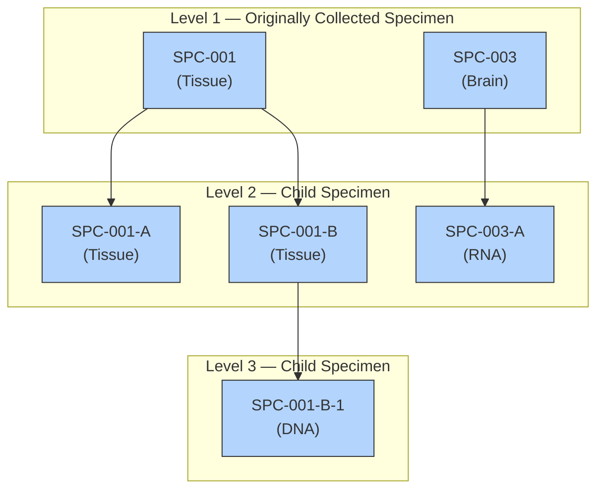

A specimen with a LEVEL value of "1" and a blank value for PARENT indicates a collected sample. All other values represent a derived sample. SPEC reflects the specimen type for the sample regardless of whether it is collected or derived.

**relspec.xpt**

| Row | STUDYID | USUBJID | REFID | SPEC | PARENT | LEVEL |
|-----|---------|---------|-------|------|--------|-------|
| 1 | ABC-123 | 001-01 | SPC-001 | TISSUE | | 1 |
| 2 | ABC-123 | 001-01 | SPC-001-A | TISSUE | SPC-001 | 2 |
| 3 | ABC-123 | 001-01 | SPC-001-B | TISSUE | SPC-001 | 2 |
| 4 | ABC-123 | 001-01 | SPC-001-B-1 | DNA | SPC-001-B | 3 |
| 5 | ABC-123 | 001-01 | SPC-003 | TISSUE | | 1 |
| 6 | ABC-123 | 001-01 | SPC-003-A | RNA | SPC-003 | 2 |

<!-- source: knowledge_base/domains/RELSUB/assumptions.md -->
# RELSUB — Assumptions

A dataset used to represent relationships between study subjects.

Some studies include subjects who are related to each other, and in some cases it is important to record those relationships. A study in which pregnant women are treated and both the mother and her child(ren) are study subjects is the most common case in which relationships between subjects are collected. There are also studies of genetically based diseases where subjects who are related to each other are enrolled, and the relationships between subjects are recorded.

1. RELSUB is used to represent relationships between persons, both of whom are study subjects. A relationship between a study subject and a person who is not a study subject may not be represented in RELSUB; this may only be reported in APRELSUB. The existence of the RELSUB dataset should not affect whether relationships are collected; that should remain a decision based on the needs of the particular study.

2. The variable POOLID was developed for nonclinical studies, where assessments may be made for groups of animals, and identifiers are needed for those groups (pools). It is included here because POOLID can be used for human clinical trials, if necessary. If POOLID is submitted, the POOLDEF dataset must be submitted.

3. If POOLID is submitted, then in any record, 1 and only 1 of USUBJID and POOLID must be populated.

4. If a study does not include the use of POOLID, then USUBJID must be populated in every record.

5. RSUBJID must be a USUBJID value present in the Demographics (DM) domain. RSUBJID must be populated in every record.

6. Values of SREL should be taken from the CDISC Controlled Terminology codelist RELSUB wherever possible. However, if an appropriate term does not exist in the codelist, another term may be used. The SREL term should not be less specific than the verbatim term collected. For instance, it would be inappropriate to record a relationship using the term "RELATIVE, FIRST DEGREE" when the collected relationship was "brother".

7. Every relationship between 2 study subjects is represented in RELSUB as 2 directional relationships: (1) with the first subject's identifier in USUBJID and the second subject's identifier in RSUBJID, and (2) with the second subject's identifier in USUBJID and the first subject's identifier in RSUBJID. The SREL values in the 2 records will describe the same relationship, but from the viewpoint of each subject (e.g., "MOTHER, BIOLOGICAL"; "CHILD, BIOLOGICAL").

8. All collected relationships between subjects should be recorded in RELSUB. In some cases, 2 subjects may have more than 1 relationship. For instance, a woman might be both maternal aunt and wet nurse to an infant. When there are multiple relationships between 2 subjects, each relationship will be represented by 2 records in RELSUB.

<!-- source: knowledge_base/domains/RELSUB/examples.md -->
# RELSUB — Examples

## Example 1

The following data are from a hemophilia study (HEM021) in which the study subjects are a pair of fraternal (dizygotic) twins and their mother.

Some expected and required variables not needed to illustrate the example are not shown.

**Row 1:** Subject is the mother.

**Rows 2-3:** Subjects are the children.

**dm.xpt**

| Row | STUDYID | DOMAIN | USUBJID | BRTHDTC | AGE | AGEU | SEX |
|-----|---------|--------|---------|---------|-----|------|-----|
| 1 | HEM021 | DM | HEM021-001 | 1941-05-16 | 60 | YEARS | F |
| 2 | HEM021 | DM | HEM021-002 | 1965-04-12 | 35 | YEARS | M |
| 3 | HEM021 | DM | HEM021-003 | 1965-04-12 | 35 | YEARS | M |

The RELSUB table is for the 3 subjects whose demography data is shown in the preceding table.

**Rows 1-2:** The relationships of the mother to the 2 children.

**Rows 3, 5:** The relationships of the children to the mother.

**Rows 4, 6:** The relationships of the children to each other.

**relsub.xpt**

| Row | STUDYID | USUBJID | RSUBJID | SREL |
|-----|---------|---------|---------|------|
| 1 | HEM021 | HEM021-001 | HEM021-002 | MOTHER, BIOLOGICAL |
| 2 | HEM021 | HEM021-001 | HEM021-003 | MOTHER, BIOLOGICAL |
| 3 | HEM021 | HEM021-002 | HEM021-001 | CHILD, BIOLOGICAL |
| 4 | HEM021 | HEM021-002 | HEM021-003 | TWIN, DIZYGOTIC |
| 5 | HEM021 | HEM021-003 | HEM021-001 | CHILD, BIOLOGICAL |
| 6 | HEM021 | HEM021-003 | HEM021-002 | TWIN, DIZYGOTIC |

<!-- source: knowledge_base/domains/RP/assumptions.md -->
# RP — Assumptions

1. Reproductive System Findings domain contains information regarding a subject's reproductive ability and reproductive history (e.g., number of previous pregnancies, number of births, pregnant during the study).

2. Information on medications related to reproduction (e.g., contraceptives, fertility treatments) should be included in the Concomitant/Prior Medications (CM) domain; see Section 6.1.2.

3. There are separate codelists for RP tests, responses, and units.
   a. Associations between RP tests and response codelists are described in the RP Codetable, available at https://www.cdisc.org/standards/terminology/controlled-terminology.

4. Any Identifiers, Timing variables, or Findings general observation class qualifiers may be added to the RP domain, but the following qualifiers would not generally be used: --MODIFY, --BODSYS, --LOINC, --SPCCND, --FAST, --TOX, --TOXGR, --SEV.

<!-- source: knowledge_base/domains/RP/examples.md -->
# RP — Examples

## Example 1

This example represents reproductive system findings at the screening visit, visit 1, and visit 2 for 2 subjects.

**rp.xpt**

| Row | STUDYID | DOMAIN | USUBJID | RPSEQ | RPTESTCD | RPTEST | RPORRES | RPORRESU | RPSTRESC | RPSTRESN | RPSTRESU | RPDUR | RPBLFL | VISITNUM | VISIT | VISITDY | RPDTC | RPDY |
|-----|---------|--------|---------|-------|----------|--------|---------|----------|----------|----------|----------|-------|--------|----------|-------|---------|-------|------|
| 1 | STUDYX | RP | 2324-P0001 | 1 | SPABORTN | Number of Spontaneous Abortions | 1 | | 1 | 1 | | | Y | 1 | SCREENING | 1 | 2008-03-09 | -10 |
| 2 | STUDYX | RP | 2324-P0001 | 2 | BRTHLVN | Number of Live Births | 2 | | 2 | 2 | | | Y | 1 | SCREENING | 1 | 2008-03-09 | -10 |
| 3 | STUDYX | RP | 2324-P0001 | 3 | PREGNN | Number of Pregnancies | 3 | | 3 | 3 | | | Y | 1 | SCREENING | 1 | 2008-03-09 | -10 |
| 4 | STUDYX | RP | 2324-P0001 | 4 | MENOSTAT | Menopause Status | Pre-Menopause | | Pre-Menopause | | | | Y | 1 | SCREENING | 1 | 2008-03-09 | -10 |
| 5 | STUDYX | RP | 2324-P0001 | 5 | MENARAGE | Menarche Age | 10 | YEARS | 10 | 10 | YEARS | | Y | 1 | SCREENING | 1 | 2008-03-09 | -10 |
| 6 | STUDYX | RP | 2324-P0001 | 6 | BCMETHOD | Birth Control Method | FOAM OR OTHER SPERMICIDES | | FOAM OR OTHER SPERMICIDES | | | P3Y | Y | 1 | SCREENING | 1 | 2008-03-09 | -10 |
| 7 | STUDYX | RP | 2324-P0001 | 7 | CHILDPOT | Childbearing Potential | Y | | Y | | | | Y | 1 | SCREENING | 1 | 2008-03-09 | -10 |
| 8 | STUDYX | RP | 2324-P0001 | 8 | CHILDPOT | Childbearing Potential | Y | | Y | | | | | 2 | Day 1 | 1 | 2008-03-19 | 1 |
| 9 | STUDYX | RP | 2324-P0001 | 9 | PREGST | Pregnant During the Study | N | | N | | | | | 2 | Day 1 | 1 | 2008-03-19 | 1 |
| 10 | STUDYX | RP | 2324-P0001 | 10 | CHILDPOT | Childbearing Potential | Y | | Y | | | | | 3 | Day 29 | 29 | 2008-04-16 | 29 |
| 11 | STUDYX | RP | 2324-P0001 | 11 | PREGST | Pregnant During the Study | N | | N | | | | | 3 | Day 29 | 29 | 2008-04-29 | 29 |
| 12 | STUDYX | RP | 2324-P0002 | 1 | INABORTN | Number of Induced Abortions | 0 | | 0 | 0 | | | Y | 1 | SCREENING | 1 | 2009-03-10 | -10 |
| 13 | STUDYX | RP | 2324-P0002 | 2 | BRTHLVN | Number of Live Births | 1 | | 1 | 1 | | | Y | 1 | SCREENING | 1 | 2009-03-10 | -10 |
| 14 | STUDYX | RP | 2324-P0002 | 3 | PREGNN | Number of Pregnancies | 1 | | 1 | 1 | | | Y | 1 | SCREENING | 1 | 2009-03-09 | -10 |
| 15 | STUDYX | RP | 2324-P0002 | 4 | MENOSTAT | Menopause Status | MENOPAUSE | | MENOPAUSE | | | | Y | 1 | SCREENING | 1 | 2009-03-09 | -10 |
| 16 | STUDYX | RP | 2324-P0002 | 5 | MENOAGE | Menopause Age | 55 | YEARS | 55 | 55 | YEARS | | Y | 1 | SCREENING | 1 | 2009-03-10 | -10 |
| 17 | STUDYX | RP | 2324-P0002 | 6 | MENARAGE | Menarche Age | 11 | YEARS | 11 | 11 | YEARS | | Y | 1 | SCREENING | 1 | 2009-03-10 | -10 |
| 18 | STUDYX | RP | 2324-P0002 | 7 | BCMETHOD | Birth Control Method | DIAPHRAGM | | DIAPHRAGM | | | P3Y | Y | 1 | SCREENING | 1 | 2009-03-10 | -10 |
| 19 | STUDYX | RP | 2324-P0002 | 8 | CHILDPOT | Childbearing Potential | N | | N | | | | Y | 1 | SCREENING | 1 | 2009-03-10 | -10 |
| 20 | STUDYX | RP | 2324-P0002 | 9 | CHILDPOT | Childbearing Potential | N | | N | | | | | 2 | Day 1 | 1 | 2009-03-19 | 1 |
| 21 | STUDYX | RP | 2324-P0002 | 10 | CHILDPOT | Childbearing Potential | N | | N | | | | | 3 | Day 29 | 29 | 2009-04-16 | 29 |

<!-- source: knowledge_base/domains/RS/assumptions.md -->
# RS — Assumptions

## RS — Disease Response Use Case Assumptions

The following assumptions are unique to the RS domain disease response use case:

1. RSCAT is used to group a set of assessments based on a disease response criterion (published or protocol-defined). One of the codelists for RSCAT is ONCRSCAT. The ONCRSCAT codelist contains controlled terminology for oncology disease response assessments.

2. Oncology response criteria assess the change in tumor burden, an important feature of the clinical evaluation of cancer therapeutics: Both tumor shrinkage (objective response) and disease progression are useful endpoints in cancer clinical trials. The RS domain is applicable for representing responses to assessment criteria such as RECIST[1] or Lugano classification.[2] The SDTM domain examples provided reference RECIST. Disease Response supplements will be developed as 1 supplement per response criterion and will contain criterion-specific guidance and examples.
   a. CDISC submission values and definitions in the ONCRSRR codelist have been developed to facilitate reuse by keeping the definitions focused on the meaning of the result rather than on relating them to a specific published criterion or a particular tumor type. CDISC submission values and definitions are intended to apply across multiple tumor types, imaging modalities, therapeutic agents, and published criterion. This means that there may be cases where the appropriate ONCRSRR CDISC submission value may not exactly match the term used in the published criterion. It is expected that clinicians should use the precise criterion definitions outlined in the individual papers to assign the appropriate response according to the CDISC submission values.
   b. The terms "response" and "remission" are commonly used to describe functionally synonymous terms. "Response" is used in CDISC submission values based on the following agreement: FDA, CDISC, NCI-EVS, and select academic experts came to consensus that because the words "response" (used in solid tumors as an indicator of a favorable change in tumor burden) and "remission" (used in non-solid tumors) were functionally synonymous, 2 distinct terms were not required to be added to the ONCRSRR codelist. Instead, "remission" has been added as a synonym in all instances where "response" is used in a CDISC submission value, for response values used in both solid and non-solid tumors. The FDA expects a single CDISC submission value to be submitted for both solid and non-solid tumors.
   c. Refer to the Controlled Terminology Rules for Oncology for more information (available at https://www.cdisc.org/standards/terminology/controlled-terminology).
   d. RSTESTCD/RSTEST values for this domain are published as Controlled Terminology. For some RSTESTCD/RSTEST values, CDISC CT includes codelists for use with RSORRES. The associations between the test values and results are in the Oncology codetable, available at https://www.cdisc.org/standards/terminology/controlled-terminology.

3. The RS domain disease response criteria use case may include records derived by the investigator or with a data collection tool, but not sponsor-derived records. Sponsor-derived records and results should be provided in an analysis dataset (ADaM).
   a. For disease response criteria, the BEST Response assessment records are included in the RS domain only when provided by the investigator or an independent assessor (i.e., Best responses that are derived by the sponsor for the analysis are not included in the RS domain).

4. The RSLNKGRP variable is used to provide a link between the records in a findings domain (e.g., Tumor/Lesion Results, TR; Laboratory Test Results, LB) that contribute to a record in the RS domain. Records should exist in the RELREC dataset to support this relationship. A RELREC relationship could also be defined using RSLNKID when a response evaluation or clinical classification measure relates back to another source dataset (e.g., tumor assessment in TR). The domain in which data that contribute to an assessment of response reside should not affect whether a link to the RS record through a RELREC relationship is created. For example, a set of oncology response criteria might require lab results in the LB domain, not only tumor results in the TR domain.

5. When using the RS domain to represent response evaluation or clinical classification instruments that incorporate data from other domains:
   a. Whenever possible, all source data must be represented in the topic-based domain(s) to which they pertain. For example, if a lab test value is collected and then scored for a response evaluation, the lab test value must be recorded in the LB domain using the rules that apply to that domain and the tests being represented.
   b. In the oncology setting, the response to therapy would often be determined, at least in part, from data in the TR domain. Data from other sources (in other SDTM domains) might also be used in an assessment of response (e.g., lab test results, assessments of symptoms).
   c. Oncology response assessments sometimes include symptomatic deterioration. Symptomatic deterioration may be considered as non-radiologic evidence of progressive disease. Symptomatic deterioration is recorded in RS with RSTEST = "Symptomatic Deterioration" and the standardized response (e.g., "PD") in RSSTRESC.
   d. In all cases, RSSTRESC should be populated as indicated in controlled terminology.

6. Best response, duration of response, or the progression to prior therapies and follow-up therapies may be represented in the RS domain.
   a. The record in RS may be related and linked to record(s) in Concomitant/Prior Medications (CM) using CMLNKGRP and RSLNKGRP. Likewise, the link to Procedures (PR; e.g., radiotherapy, surgery) would be made using PRLNKGRP.
   b. If the criteria used to determine the response is unknown or not collected, this is represented as RSCAT = "UNSPECIFIED".

7. The evaluator identifier variable (RSEVALID) can be used in conjunction with RSEVAL to provide additional detail of who is providing the assessment. For example, RSEVAL = "INDEPENDENT ASSESSOR" and RSEVALID = "RADIOLOGIST 1" may further qualify the RSEVALID variable. RSEVALID may be subject to controlled terminology but may also represent free text values depending on the use case. When used with disease response data, RSEVALID is subject to MEDEVAL controlled terminology.

8. In cases where an independent assessor identifies one of multiple assessments/measurements to be the accepted one, the accepted record flag variable (RSACPTFL) identifies records that have been determined to be the accepted assessments/measurements by an independent assessor. This flag would be provided by an independent assessor when multiple assessors (e.g., "RADIOLOGIST 1", "RADIOLOGIST 2", "ADJUDICATOR") provide assessments or evaluations at the same time point or for an overall evaluation.
   a. RSACPTFL should not be derived by the sponsor. If a derivation is needed to make the record selection, then this derivation should be done in the analysis dataset (ADaM).

9. Disease recurrence can be represented in the RS domain using RSTEST = "Disease Recurrence Indicator" to indicate that there was an assessment of whether there was disease recurrence. The RSCAT = "PROTOCOL DEFINED RESPONSE CRITERIA" can be used to indicate that the response assessment of disease recurrence was based on protocol-specified criteria rather than published response criteria.

10. When a disease response result is based on multiple procedures/scans/images/physical exams performed on different dates, RSDTC may be derived.

11. Any Identifiers, Timing variables, or Findings general observation class qualifiers may be added to the RS domain, but the following qualifiers would not generally be used: --POS, --BODSYS, --ORNRLO, --ORNRHI, --STNRLO, --STNRHI, --STNRC, --NRIND, --XFN, --LOINC, --SPEC, --SPCCND, --FAST, --TOX, --TOXGR, --SEV.

## RS — Clinical Classifications Use Case Assumptions

The following assumptions are unique to the RS domain clinical classifications use case:

1. Clinical classifications are named instruments whose output is an ordinal or categorical score that serves as a surrogate for or ranking of disease status or other physiological or biological status.
   a. Clinical classifications may be based solely on objective data from clinical records, or they may involve a clinical judgment or interpretation of directly observable signs, behaviors, or other physical manifestations related to a condition or subject status. These physical manifestations may be findings (e.g., lab results, vital signs, clinical events) that are typically represented in other SDTM domains.

2. RSCAT is used to group a set of assessments based on a clinical classification. One of the codelists for RSCAT is CCCAT. The CCCAT codelist contains CDISC Controlled Terminology for clinical classifications instruments.

3. When using the RS domain to represent a clinical classification instrument that incorporates data from other domains:
   a. Whenever possible, all source data must be represented in the topic-based domain(s) to which they pertain. For example, if a lab test value is collected and then scored for a response evaluation or clinical classification instrument, the lab test value must be recorded in the LB domain using the rules that apply to that domain and the tests being represented.
   b. If the source value is directly collected on the clinical classification instrument, then the values from the source record may be transcribed to the corresponding RS record, with RSORRES and RSORRESU populated to agree with the units shown on the clinical classification instrument, which may be different from the sponsor's usual practice for original and standard units.
   c. If a clinical classification uses a source value by comparing it to a range (e.g., "2-5", ">3"), then the source value will exist only in the source domain; the range is represented in the corresponding RS record in RSORRES and RSORRESU.
   d. In all cases, RSSTRESC/RSSTRESN should be populated with the assigned ordinal score as indicated on the instrument.

## QRS Shared Assumptions

The QRS Shared Assumptions (see FT assumptions) also apply to the Clinical Classifications use case of the RS domain, but not the Disease Response use case.

<!-- source: knowledge_base/domains/RS/examples.md -->
# RS — Examples

## RS — Examples - Disease Response

The following are examples for oncology response criteria.

### Example 1

This example shows response assessments determined from the TR domain based on RECIST 1.1 criteria and also shows a case where progressive disease due to symptomatic deterioration was determined based on a clinical assessment by the investigator.

**Rows 1-3:** Show the target response, non-target response, and the overall response by the investigator using RECIST 1.1 at the week 6 visit.
**Rows 4-7:** Show the target response and non-target response by the investigator using RECIST 1.1, as well as the determination of symptomatic determination (pleural effusion) and overall response using protocol-defined response criteria, at the week 12 visit.

**rs.xpt**

| Row | STUDYID | DOMAIN | USUBJID | RSSEQ | RSLNKGRP | RSTESTCD | RSTEST | RSCAT | RSORRES | RSSTRESC | RSEVAL | VISITNUM | VISIT | RSDTC | RSDY |
|-----|---------|--------|---------|-------|----------|----------|--------|-------|---------|----------|--------|----------|-------|-------|------|
| 1 | ABC | RS | 44444 | 1 | | TRGRESP | Target Response | RECIST 1.1 | PR | PR | INVESTIGATOR | 40 | WEEK 6 | 2010-02-18 | 46 |
| 2 | ABC | RS | 44444 | 2 | | NTRGRESP | Non-target Response | RECIST 1.1 | SD | SD | INVESTIGATOR | 40 | WEEK 6 | 2010-02-18 | 46 |
| 3 | ABC | RS | 44444 | 3 | A2 | OVRLRESP | Overall Response | RECIST 1.1 | PR | PR | INVESTIGATOR | 40 | WEEK 6 | 2010-02-18 | 46 |
| 4 | ABC | RS | 44444 | 4 | | TRGRESP | Target Response | RECIST 1.1 | NE | NE | INVESTIGATOR | 60 | WEEK 12 | 2010-04-02 | 88 |
| 5 | ABC | RS | 44444 | 5 | | NTRGRESP | Non-target Response | RECIST 1.1 | NE | NE | INVESTIGATOR | 60 | WEEK 12 | 2010-04-02 | 88 |
| 6 | ABC | RS | 44444 | 6 | | SYMPTDTR | Symptomatic Deterioration | PROTOCOL DEFINED RESPONSE CRITERIA | Pleural Effusion | PD | INVESTIGATOR | 60 | WEEK 12 | 2010-04-02 | 88 |
| 7 | ABC | RS | 44444 | 7 | A3 | OVRLRESP | Overall Response | PROTOCOL DEFINED RESPONSE CRITERIA | PD | PD | INVESTIGATOR | 60 | WEEK 12 | 2010-04-02 | 88 |

### Example 2

This example shows response assessments determined from the TR domain based on RECIST 1.1 criteria and also shows a confirmation of an equivocal new lesion progression.

**Rows 1-4:** Show the target response, non-target response, and the overall response by the independent assessor Radiologist 1 using RECIST 1.1 at the week 6 visit. At this week 6 visit, an equivocal new lesion was identified.
**Rows 5-8:** Show the target response, non-target response, and the overall response by the independent assessor Radiologist 1 using RECIST 1.1 at the week 12 visit. At this week 12 visit, the new lesion was determined to be unequivocally a new lesion.

**rs.xpt**

| Row | STUDYID | DOMAIN | USUBJID | RSSEQ | RSLNKGRP | RSTESTCD | RSTEST | RSCAT | RSORRES | RSSTRESC | RSNAM | RSEVAL | RSEVALID | RSACPTFL | VISITNUM | VISIT | RSDTC | RSDY |
|-----|---------|--------|---------|-------|----------|----------|--------|-------|---------|----------|-------|--------|----------|----------|----------|-------|-------|------|
| 1 | ABC | RS | 55555 | 1 | | TRGRESP | Target Response | RECIST 1.1 | PR | PR | ACE IMAGING | INDEPENDENT ASSESSOR | RADIOLOGIST 1 | Y | 40 | WEEK 6 | 2010-02-18 | 46 |
| 2 | ABC | RS | 55555 | 2 | | NTRGRESP | Non-target Response | RECIST 1.1 | CR | CR | ACE IMAGING | INDEPENDENT ASSESSOR | RADIOLOGIST 1 | Y | 40 | WEEK 6 | 2010-02-18 | 46 |
| 3 | ABC | RS | 55555 | 3 | | NEWLPROG | New Lesion Progression | RECIST 1.1 | EQUIVOCAL | EQUIVOCAL | ACE IMAGING | INDEPENDENT ASSESSOR | RADIOLOGIST 1 | Y | 40 | WEEK 6 | 2010-02-18 | 46 |
| 4 | ABC | RS | 55555 | 4 | A2 | OVRLRESP | Overall Response | RECIST 1.1 | PR | PR | ACE IMAGING | INDEPENDENT ASSESSOR | RADIOLOGIST 1 | Y | 40 | WEEK 6 | 2010-02-18 | 46 |
| 5 | ABC | RS | 55555 | 5 | | TRGRESP | Target Response | RECIST 1.1 | PD | PD | ACE IMAGING | INDEPENDENT ASSESSOR | RADIOLOGIST 1 | Y | 60 | WEEK 12 | 2010-04-02 | 88 |
| 6 | ABC | RS | 55555 | 6 | | NTRGRESP | Non-target Response | RECIST 1.1 | CR | CR | ACE IMAGING | INDEPENDENT ASSESSOR | RADIOLOGIST 1 | Y | 60 | WEEK 12 | 2010-04-02 | 88 |
| 7 | ABC | RS | 55555 | 7 | | NEWLPROG | New Lesion Progression | RECIST 1.1 | UNEQUIVOCAL | UNEQUIVOCAL | ACE IMAGING | INDEPENDENT ASSESSOR | RADIOLOGIST 1 | Y | 60 | WEEK 12 | 2010-04-02 | 88 |
| 8 | ABC | RS | 55555 | 8 | A3 | OVRLRESP | Overall Response | RECIST 1.1 | PD | PD | ACE IMAGING | INDEPENDENT ASSESSOR | RADIOLOGIST 1 | Y | 60 | WEEK 12 | 2010-04-02 | 88 |

### Example 3

This example shows best response and the overall response of progression to prior therapies and follow-up therapies.

**Row 1:** Shows disease progression on or after a prior chemotherapy regimen. The date of progression is represented in RSDTC. RSENTPT and RSENRTPT represent that the disease progression was prior to screening. RSCAT = "UNSPECIFIED" indicates that the criteria used to determine the disease progression was unknown or not collected. RSPLNKGRP = "CM1" is used to link this record in RS to the prior chemotherapy in CM where the CMLNKGRP = "CM1".
**Row 2:** Shows best response to prior chemotherapy regimen. The date of best response is represented in RSDTC. RSENTPT and RSENRTPT represent that the best response was prior to screening. RSCAT = "UNSPECIFIED" indicates that the criteria used to determine the best response was unknown or not collected. RSPLNKGRP = "CM2" is used to link this record in RS to the prior chemotherapy in CM where the CMLNKGRP = "CM2".
**Row 3:** Shows best response to prior radiotherapy. The date of best response is represented in RSDTC. RSENTPT and RSENRTPT represent that the best response was prior to screening. RSCAT = "UNSPECIFIED" indicates that the criteria used to determine the best response was unknown or not collected. RSPLNKGRP = "PR2" is used to link this record in RS to the prior radiotherapy in PR where the PRLNKGRP = "PR2".
**Rows 4-5:** Show best response and progression to a follow-up anti-cancer therapy. The date of best response and date of progression are represented in RSDTC. RSSTTPT and RSSTRTPT represent that the best response and progression were after study treatment discontinuation. RSCAT = "UNSPECIFIED" indicates that the criteria used to determine the best response and progression was unknown or not collected. RSPLNKGRP = "CM3" is used to link this record in RS to the prior chemotherapy in CM where the CMLNKGRP = "CM3".

**rs.xpt**

| Row | STUDYID | DOMAIN | USUBJID | RSSEQ | RSLNKGRP | RSTESTCD | RSTEST | RSCAT | RSORRES | RSORRESU | RSSTRESC | RSSTRESN | RSSTRESU | RSEVAL | VISITNUM | VISIT | RSDTC | RSDY | RSSTRTPT | RSSTTPT | RSENRTPT | RSENTPT |
|-----|---------|--------|---------|-------|----------|----------|--------|-------|---------|----------|----------|----------|----------|--------|----------|-------|-------|------|----------|---------|----------|---------|
| 1 | ABC | RS | 55555 | 1 | CM1 | OVRLRESP | Overall Response | UNSPECIFIED | PD | | PD | | | INVESTIGATOR | 10 | SCREEN | 2015-02-18 | -32 | | | BEFORE | SCREEN |
| 2 | ABC | RS | 66666 | 2 | CM2 | BESTRESP | Best Response | UNSPECIFIED | SD | | SD | | | INVESTIGATOR | 10 | SCREEN | | | | | BEFORE | SCREEN |
| 3 | ABC | RS | 66666 | 3 | PR2 | BESTRESP | Best Response | UNSPECIFIED | MINIMAL RESPONSE | | MINIMAL RESPONSE | | | INVESTIGATOR | 10 | SCREEN | | | | | BEFORE | SCREEN |
| 4 | ABC | RS | 77777 | 4 | CM3 | BESTRESP | Best Response | UNSPECIFIED | SD | | SD | | | INVESTIGATOR | 240 | FOLLOW-UP MONTH 6 | 2015-04-02 | 520 | AFTER | STUDY TREATMENT DISCONTINUATION | | |
| 5 | ABC | RS | 77777 | 5 | CM3 | OVRLRESP | Overall Response | UNSPECIFIED | PD | | PD | | | INVESTIGATOR | 260 | FOLLOW-UP MONTH 8 | 2015-06-01 | 581 | AFTER | STUDY TREATMENT DISCONTINUATION | | |

## RS — Examples - Clinical Classifications

The following example is for a clinical classification. For additional RS examples, see the CDISC-published supplements for individual clinical classifications, at https://www.cdisc.org/standards/foundational/qrs.

### Example 1

**Glasgow Coma Scale NINDS Version (GCS NINDS VERSION)**

The rs.xpt dataset represents the items from the GCS NINDS VERSION instrument.

**rs.xpt**

| Row | STUDYID | DOMAIN | USUBJID | RSSEQ | RSTESTCD | RSTEST | RSCAT | RSORRES | RSSTRESC | RSSTRESN | RSLOBXFL | VISITNUM | RSDTC |
|-----|---------|--------|---------|-------|----------|--------|-------|---------|----------|----------|----------|----------|-------|
| 1 | STUDYX | RS | P0001 | 1 | GCS0101 | GCS01-Best Eye Response | GCS NINDS VERSION | No eye opening | 1 | 1 | Y | 1 | 2012-11-16 |
| 2 | STUDYX | RS | P0001 | 2 | GCS0102 | GCS01-Motor Response | GCS NINDS VERSION | Abnormal extension | 2 | 2 | Y | 1 | 2012-11-16 |
| 3 | STUDYX | RS | P0001 | 3 | GCS0103 | GCS01-Verbal Response | GCS NINDS VERSION | Incomprehensible sound | 2 | 2 | Y | 1 | 2012-11-16 |
| 4 | STUDYX | RS | P0001 | 4 | GCS0104 | GCS01-Total Score | GCS NINDS VERSION | 5 | 5 | 5 | Y | 1 | 2012-11-16 |
| 5 | STUDYX | RS | P0001 | 5 | GCS0105A | GCS01-Confounder: GCS Accurate | GCS NINDS VERSION | CHECKED | CHECKED | | Y | 1 | 2012-11-16 |
| 6 | STUDYX | RS | P0001 | 6 | GCS0105B | GCS01-Confounder: Paralytic | GCS NINDS VERSION | CHECKED | CHECKED | | Y | 1 | 2012-11-16 |
| 7 | STUDYX | RS | P0001 | 7 | GCS0105C | GCS01-Confounder: Alcohol/Drug of Abuse | GCS NINDS VERSION | NOT CHECKED | NOT CHECKED | | Y | 1 | 2012-11-16 |
| 8 | STUDYX | RS | P0001 | 8 | GCS0105D | GCS01-Confounder: C-Spine Injury | GCS NINDS VERSION | NOT CHECKED | NOT CHECKED | | Y | 1 | 2012-11-16 |
| 9 | STUDYX | RS | P0001 | 9 | GCS0105E | GCS01-Confounder: Hypoxia/Hypotension | GCS NINDS VERSION | NOT CHECKED | NOT CHECKED | | Y | 1 | 2012-11-16 |
| 10 | STUDYX | RS | P0001 | 10 | GCS0105F | GCS01-Confounder: Hypothermia | GCS NINDS VERSION | NOT CHECKED | NOT CHECKED | | Y | 1 | 2012-11-16 |
| 11 | STUDYX | RS | P0001 | 11 | GCS0105G | GCS01-Confounder: Sedation | GCS NINDS VERSION | NOT CHECKED | NOT CHECKED | | Y | 1 | 2012-11-16 |
| 12 | STUDYX | RS | P0001 | 12 | GCS0105H | GCS01-Confounder: Unknown | GCS NINDS VERSION | NOT CHECKED | NOT CHECKED | | Y | 1 | 2012-11-16 |

### References

1. Eisenhauer EA, Therasse P, Bogaerts J, et al. New response evaluation criteria in solid tumours: revised RECIST guideline (version 1.1). Eur J Cancer. 2009;45(2):228-247. doi:10.1016/j.ejca.2008.10.026
2. Cheson BD, Fisher RI, Barrington SF, et al. Recommendations for initial evaluation, staging, and response assessment of Hodgkin and non-Hodgkin lymphoma: the Lugano classification. J Clin Oncol. 2014;32(27):3059-3068. doi:10.1200/JCO.2013.54.8800

<!-- source: knowledge_base/domains/SC/assumptions.md -->
# SC — Assumptions

1. The structure of subject characteristics is based on the Findings general observation class and is an extension of the demographics data, including socioeconomic or other broad characteristics. The structure for demographic data is fixed and includes date of birth, age, sex, race, ethnicity, and country. Subject characteristics may be collected periodically over time. Some examples of subject characteristics include education level, marital status, and national origin.

2. Associations between some subject characteristic tests and response codelists are described in the SC Codetable, available at https://www.cdisc.org/standards/terminology/controlled-terminology.

3. Any Identifiers, Timing variables, or Findings general observation class qualifiers may be added to the SC domain, but the following qualifiers would generally not be used in SC: --MODIFY, --POS, --BODSYS, --ORNRLO, --ORNRHI, --STNRLO, --STNRHI, --STNRC, --NRIND, --RESCAT, --XFN, --NAM, --LOINC, --SPEC, --SPCCND, --BLFL, --LOBXFL, --FAST, --DRVFL, --TOX, --TOXGR, --SEV.

<!-- source: knowledge_base/domains/SC/examples.md -->
# SC — Examples

## Example 1

This example shows data collected once per subject that does not fit into the Demographics (DM) domain. For this example, national origin and marital status were collected.

**sc.xpt**

| Row | STUDYID | DOMAIN | USUBJID | SCSEQ | SCTESTCD | SCTEST | SCORRES | SCSTRESC | SCDTC |
|-----|---------|--------|---------|-------|----------|--------|---------|----------|-------|
| 1 | ABC | SC | ABC-001-001 | 1 | NATORIG | National Origin | UNITED STATES | USA | 1999-06-19 |
| 2 | ABC | SC | ABC-001-001 | 2 | MARISTAT | Marital Status | DIVORCED | DIVORCED | 1999-06-19 |
| 3 | ABC | SC | ABC-001-002 | 1 | NATORIG | National Origin | CANADA | CAN | 1999-03-19 |
| 4 | ABC | SC | ABC-001-002 | 2 | MARISTAT | Marital Status | MARRIED | MARRIED | 1999-03-19 |
| 5 | ABC | SC | ABC-001-003 | 1 | NATORIG | National Origin | USA | USA | 1999-05-03 |
| 6 | ABC | SC | ABC-001-003 | 2 | MARISTAT | Marital Status | NEVER MARRIED | NEVER MARRIED | 1999-05-03 |
| 7 | ABC | SC | ABC-001-201 | 1 | NATORIG | National Origin | JAPAN | JPN | 1999-06-14 |
| 8 | ABC | SC | ABC-002-001 | 2 | MARISTAT | Marital Status | WIDOWED | WIDOWED | 1999-06-14 |

## Example 2

In this example, only infants were study subjects. However, with the possible exception of USUBJID values, the example would be unchanged for a study in which mothers were study subjects. If these data were collected for an infant who was an associated person, they would be represented in the APSC domain and the dataset would include APID, RSUBJID, and SREL, rather than USUBJID.

Although there is a test for gestational age in the CDISC Controlled Terminology for Reproductive Findings, gestational age is an attribute of the fetus or infant, and is not a finding about their reproductive system; in this example, gestational age is represented in the Subject Characteristics (SC) domain. The structure of the SC domain formerly was 1 record per characteristic (test) per subject, but with this version of the SDTMIG the structure has changed to allow multiple records per test. This example shows multiple estimates of gestational age for the same subject. Not all of the values of METHOD shown in this example are currently in the METHOD codelist.

Gestational age is often expressed (and sometimes collected) in weeks and days. SDTM does not support the recording of an individual finding result with mixed units (e.g., "20 weeks and 5 days"), so the gestational age would be converted to days for representation in SDTM.

**sc.xpt**

| Row | STUDYID | DOMAIN | USUBJID | SCSEQ | SCTESTCD | SCTEST | SCCAT | SCORRES | SCORESU | SCSTRESC | SCSTRESN | SCSTRESU | SCMETHOD | VISITNUM | SCDTC | SCDY |
|-----|---------|--------|---------|-------|----------|--------|-------|---------|---------|----------|----------|----------|----------|----------|-------|------|
| 1 | ABC-123 | SC | 101 | 1 | EGESTAGE | Estimated Gestational Age | PREGNANCY-RELATED FINDINGS | 100 | DAYS | 100 | 100 | DAYS | MENSTRUAL HISTORY | 10 | 2017-03-02 | 196 |
| 2 | ABC-123 | SC | 101 | 2 | EGESTAGE | Estimated Gestational Age | PREGNANCY-RELATED FINDINGS | 135 | DAYS | 135 | 135 | DAYS | ULTRASOUND | 11 | 2017-04-01 | 226 |
| 3 | ABC-123 | SC | 101 | 3 | EGESTAGE | Estimated Gestational Age | PREGNANCY-RELATED FINDINGS | 265 | DAYS | 265 | 265 | DAYS | BALLARD | 13.1 | 2017-06-10 | 297 |

## Example 3

This example shows data from a multi-year study in which marital status and whether the subject was a student were collected annually.

**sc.xpt**

| Row | STUDYID | DOMAIN | USUBJID | SCSEQ | SCTESTCD | SCTEST | SCORRES | SCSTRESC | SCDTC | SCDY |
|-----|---------|--------|---------|-------|----------|--------|---------|----------|-------|------|
| 1 | ABC123 | SC | 305 | 1 | MARISTAT | Marital Status | NEVER MARRIED | NEVER MARRIED | 2012-01-14 | -2 |
| 2 | ABC123 | SC | 305 | 2 | STDNTIND | Student Indicator | Y | Y | 2012-01-14 | -2 |
| 3 | ABC123 | SC | 305 | 3 | MARISTAT | Marital Status | DOMESTIC PARTNER | DOMESTIC PARTNER | 2013-01-22 | 374 |
| 4 | ABC123 | SC | 305 | 4 | STDNTIND | Student Indicator | Y | Y | 2013-01-22 | 374 |
| 5 | ABC123 | SC | 305 | 5 | MARISTAT | Marital Status | MARRIED | MARRIED | 2014-01-16 | 734 |
| 6 | ABC123 | SC | 305 | 6 | STDNTIND | Student Indicator | N | N | 2014-01-16 | 734 |

<!-- source: knowledge_base/domains/SE/assumptions.md -->
# SE — Assumptions

Submission of the SE dataset is strongly recommended, as it provides information needed by reviewers to place observations in context within the study. As noted in the SE - Description/Overview, the TE and TA datasets should also be submitted, as these define the design and the terms referenced by the SE dataset.

The SE domain allows the submission of data on the timing of the trial elements a subject actually passed through in their participation in the trial. Section 7.2.2, Trial Elements, and Section 7.2.1, Trial Arms, provide additional information on these datasets, which define a trial's planned elements and describe the planned sequences of elements for the arms of the trial.

1. For any particular subject, the dates in the SE table are the dates when the transition events identified in the TE table occurred. Judgment may be needed to match actual events in a subject's experience with the definitions of transition events (i.e., events that mark the start of new elements) in the TE table; actual events may vary from the plan. For instance, in a single-dose pharmacokinetics (PK) study, the transition events might correspond to study drug doses of 5 and 10 mg. If a subject actually received a dose of 7 mg when they were scheduled to receive 5 mg, a decision will have to be made on how to represent this in the SE domain.

2. If the date/time of a transition element was not collected directly, the method used to infer the element start date/time should be explained in the Comments column of the Define-XML document.

3. Judgment will also have to be used in deciding how to represent a subject's experience if an element does not proceed or end as planned. For instance, the plan might identify a trial element that is to start with the first of a series of 5 daily doses and end after 1 week, when the subject transitions to the next treatment element. If the subject actually started the next treatment epoch (see Section 7.1, Introduction to Trial Design Model Datasets, and Section 7.1.2, Definitions of Trial Design Concepts) after 4 weeks, the sponsor would have to decide whether to represent this as an abnormally long element, or as a normal element plus an unplanned non-treatment element.

4. If the sponsor decides that the subject's experience for a particular period of time cannot be represented with one of the planned elements, then that period of time should be represented as an unplanned element. The value of ETCD for an unplanned element is "UNPLAN" and SEUPDES should be populated with a description of the unplanned element.

5. The values of SESTDTC provide the chronological order of the actual subject elements. SESEQ should be assigned to be consistent with the chronological order. Note that the requirement that SESEQ be consistent with chronological order is more stringent than in most other domains, where --SEQ values need only be unique within subject.

6. When TAETORD is included in the SE domain, it represents the planned order of an element in an arm. This should not be confused with the actual order of the elements, which will be represented by their chronological order and SESEQ. TAETORD will not be populated for subject elements that are not planned for the arm to which the subject was assigned. Thus, TAETORD will not be populated for any element with an ETCD value of "UNPLAN". TAETORD also will not be populated if a subject passed through an element that, although defined in the TE dataset, was out of place for the arm to which the subject was assigned. For example, if a subject in a parallel study of drug A vs. drug B was assigned to receive drug A but received drug B instead, then TAETORD would be left blank for the SE record for their drug B element. If a subject was assigned to receive the sequence of elements A, B, C, D, and instead received A, D, B, C, then the sponsor would have to decide for which of these SE records TAETORD should be populated. The rationale for this decision should be documented in the Comments column of the Define-XML document.

7. For subjects who follow the planned sequence of elements for the arm to which they were assigned, the values of EPOCH in the SE domain will match those associated with the elements for the subject's arm in the TA dataset. The sponsor will have to decide what value, if any, of EPOCH to assign SE records for unplanned elements and in other cases where the subject's actual elements deviate from the plan. The sponsor's methods for such decisions should be documented in the Define-XML document, in the row for EPOCH in the SE dataset table.

8. Because there are, by definition, no gaps between elements, the value of SEENDTC for one element will always be the same as the value of SESTDTC for the next element.

9. Note that SESTDTC is required, although --STDTC is not required in any other subject-level dataset. The purpose of the dataset is to record the elements a subject actually passed through. If it is known that a subject passed through a particular element, then there must be some information (perhaps imprecise) on when it started. Thus, SESTDTC may not be null, although some records may not have all the components (e.g., year, month, day, hour, minute) of the date/time value collected.

10. The following identifier variables are permissible and may be added as appropriate: --GRPID, --REFID, --SPID.

11. Care should be taken in adding additional timing variables:
    a. The purpose of --DTC and --DY is to record the date and study day on which data was collected. Elements are generally "derived" in the sense that they are a secondary use of data collected elsewhere; it is not generally useful to know when those date/times were recorded.
    b. --DUR could be added only if the duration of an element was collected, not derived.
    c. It would be inappropriate to add the variables that support time points (--TPT, --TPTNUM, --ELTM, --TPTREF, and --RFTDTC), because the topic of this dataset is elements.

<!-- source: knowledge_base/domains/SE/examples.md -->
# SE — Examples

STUDYID and DOMAIN, which are required in the SE and Demographics (DM) domains, have not been included in the following examples, to improve readability.

## Example 1

This example shows data for 2 subjects for a crossover trial with 4 epochs.

**Row 1:** The record for the SCREEN element for subject 789. Note that only the date of the start of the SCREEN element was collected, whereas for the end of the element (which corresponds to the start of IV dosing) both date and time were collected.

**Row 2:** The record for the IV element for subject 789. The IV element started with the start of IV dosing and ended with the start of oral dosing, and full date/times were collected for both.

**Row 3:** The record for the ORAL element for subject 789. Only the date, and not the time, of the start of follow-up was collected.

**Row 4:** The FOLLOWUP element for subject 789 started and ended on the same day. Presumably, the element had a positive duration, but no times were collected.

**Rows 5-8:** Subject 790 was treated incorrectly. This subject entered the IV element before the ORAL element, although the planned order of elements for this subject was ORAL, then IV. The sponsor has assigned EPOCH values for this subject according to the actual order of elements, rather than the planned order. Per Assumption 6, TAETORD is missing for the elements that were out of order. The correct order of elements is the subject's ARMCD, shown in the DM dataset.

**Rows 9-10:** Subject 791 was screened, randomized to the IV-ORAL arm, and received the IV treatment, but did not return to the unit for the treatment epoch or follow-up.

**se.xpt**

| Row | USUBJID | SESEQ | ETCD | SESTDTC | SEENDTC | SEUPDES | TAETORD | EPOCH |
|-----|---------|-------|------|---------|---------|---------|---------|-------|
| 1 | 789 | 1 | SCREEN | 2006-06-01 | 2006-06-03T10:32 | | 1 | SCREENING |
| 2 | 789 | 2 | IV | 2006-06-03T10:32 | 2006-06-10T09:47 | | 2 | TREATMENT 1 |
| 3 | 789 | 3 | ORAL | 2006-06-10T09:47 | 2006-06-17 | | 3 | TREATMENT 2 |
| 4 | 789 | 4 | FOLLOWUP | 2006-06-17 | 2006-06-17 | | 4 | FOLLOW-UP |
| 5 | 790 | 1 | SCREEN | 2006-06-01 | 2006-06-03T10:14 | | 1 | SCREENING |
| 6 | 790 | 2 | IV | 2006-06-03T10:14 | 2006-06-10T10:32 | | | TREATMENT 1 |
| 7 | 790 | 3 | ORAL | 2006-06-10T10:32 | 2006-06-17 | | | TREATMENT 2 |
| 8 | 790 | 4 | FOLLOWUP | 2006-06-17 | 2006-06-17 | | 4 | FOLLOW-UP |
| 9 | 791 | 1 | SCREEN | 2006-06-01 | 2006-06-03T10:17 | | 1 | SCREENING |
| 10 | 791 | 2 | IV | 2006-06-03T10:17 | 2006-06-07 | | 2 | TREATMENT 1 |

**Row 1:** Subject 789 was assigned to the IV-ORAL arm and was treated accordingly.

**Row 2:** Subject 790 was assigned to the ORAL-IV arm, but their actual treatment was IV, then oral.

**Row 3:** Subject 791 was assigned to the IV-ORAL arm, received the first of the 2 planned treatment elements, and were following the assigned treatment when they withdrew early. The actual arm variables are populated with the values for the arm to which subject 791 was assigned.

**dm.xpt**

| Row | USUBJID | SUBJID | RFSTDTC | RFENDTC | SITEID | INVNAM | BRTHDTC | AGE | AGEU | SEX | RACE | ETHNIC | ARMCD | ARM | ACTARMCD | ACTARM | ARMNRS | ACTARMUD | COUNTRY |
|-----|---------|--------|---------|---------|--------|--------|---------|-----|------|-----|------|--------|-------|-----|----------|--------|--------|----------|---------|
| 1 | 789 | 001 | 2006-06-03 | 2006-06-17 | 01 | SMITH, J | 1948-12-13 | 57 | YEARS | M | WHITE | HISPANIC OR LATINO | IO | IV-ORAL | IO | IV-ORAL | | | USA |
| 2 | 790 | 002 | 2006-06-03 | 2006-06-17 | 01 | SMITH, J | 1955-03-22 | 51 | YEARS | M | WHITE | NOT HISPANIC OR LATINO | OI | ORAL-IV | IO | IV-ORAL | | | USA |
| 3 | 791 | 003 | 2006-06-03 | 2006-06-07 | 01 | SMITH, J | 1956-07-17 | 49 | YEARS | M | WHITE | NOT HISPANIC OR LATINO | IO | IV-ORAL | IO | IV-ORAL | | | USA |

## Example 2

The following data represent 2 subjects enrolled in a trial in which assignment to an arm occurs in 2 stages.

See Section 7.2.1, Trial Arms, Example Trial 3. In this trial, subjects were randomized at the beginning of the blinded treatment epoch, then assigned to treatment for the open treatment epoch according to their response to treatment in the blinded treatment epoch. See Section 5.2, Demographics, for other examples of ARM and ARMCD values for this trial.

In this trial, start of dosing was recorded as dates without times, so SESTDTC values include only dates. Epochs could not be assigned to observations that occurred on epoch transition dates on the basis of the SE dataset alone, so the sponsor's algorithms for dealing with this ambiguity were documented in the Define-XML document.

**Rows 1-2:** Show data for a subject who completed only 2 elements of the trial.

**Rows 3-6:** Show data for a subject who completed the trial, but received the wrong drug for the last 2 weeks of the double-blind treatment period. This has been represented by treating the period when the subject received the wrong drug as an unplanned element. Note that TAETORD, which represents the planned order of elements within an arm, has not been populated for this unplanned element. Even though this element was unplanned, the sponsor assigned a value of BLINDED TREATMENT to EPOCH.

**se.xpt**

| Row | USUBJID | SESEQ | ETCD | SESTDTC | SEENDTC | SEUPDES | TAETORD | EPOCH |
|-----|---------|-------|------|---------|---------|---------|---------|-------|
| 1 | 123 | 1 | SCRN | 2006-06-01 | 2006-06-03 | | 1 | SCREENING |
| 2 | 123 | 2 | DBA | 2006-06-03 | 2006-06-10 | | 2 | BLINDED TREATMENT |
| 3 | 456 | 1 | SCRN | 2006-05-01 | 2006-05-03 | | 1 | SCREENING |
| 4 | 456 | 2 | DBA | 2006-05-03 | 2006-05-31 | | 2 | BLINDED TREATMENT |
| 5 | 456 | 3 | UNPLAN | 2006-05-31 | 2006-06-13 | Drug B dispensed in error | | BLINDED TREATMENT |
| 6 | 456 | 4 | RSC | 2006-06-13 | 2006-07-30 | | 3 | OPEN LABEL TREATMENT |

**Row 1:** Shows the record for a subject who was randomized to blinded treatment A, but withdrew from the trial before the open treatment epoch and did not have a second treatment assignment. They were thus incompletely assigned to an arm. The code used to represent this incomplete assignment, "A", is not in the TA table for this trial design, but is the first part of the codes for the 2 arms to which subject 123 could have been assigned ("AR" or "AO").

**Row 2:** Shows the record for a subject who was randomized to blinded treatment A, but was erroneously treated with drug B for part of the blinded treatment epoch. ARM and ARMCD for this subject reflect the planned treatment and are not affected by the fact that treatment deviated from plan. The sponsor decided that the subject's treatment, which consisted partly of drug A and partly of drug B, did not match any planned arm, so ACTARMCD and ACTARM were left null. ARMNRS was populated with "UNPLANNED TREATMENT" and the way in which this treatment was unplanned was described in ACTARMUD.

**dm.xpt**

| Row | USUBJID | SUBJID | RFSTDTC | RFENDTC | SITEID | INVNAM | BRTHDTC | AGE | AGEU | SEX | RACE | ETHNIC | ARMCD | ARM | ACTARMCD | ACTARM | ARMNRS | ACTARMUD | COUNTRY |
|-----|---------|--------|---------|---------|--------|--------|---------|-----|------|-----|------|--------|-------|-----|----------|--------|--------|----------|---------|
| 1 | 123 | 012 | 2006-06-03 | 2006-06-10 | 01 | JONES, D | 1943-12-08 | 62 | YEARS | M | ASIAN | HISPANIC OR LATINO | A | A | A | A | | | USA |
| 2 | 456 | 103 | 2006-05-03 | 2006-07-30 | 01 | JONES, D | 1950-05-15 | 55 | YEARS | F | WHITE | NOT HISPANIC OR LATINO | AR | A-Rescue | | | UNPLANNED TREATMENT | Drug B dispensed for part of Drug A element | USA |

<!-- source: knowledge_base/domains/SM/assumptions.md -->
# SM — Assumptions

1. Disease milestones are observations or activities whose timings are of interest in the study. The types of disease milestones are defined at the study level in the TM dataset. The purpose of the SM dataset is to provide a summary timeline of the milestones for a particular subject.

2. The name of the disease milestone is recorded in MIDS.
   a. For disease milestones that can occur only once (TMRPT = "N"), the value of MIDS may be the value in MIDSTYPE or may an abbreviated version.
   b. For types of disease milestones that can occur multiple times, MIDS will usually be an abbreviated version of MIDSTYPE and will always end with a sequence number. Sequence numbers should start with 1 and indicate the chronological order of the instances of this type of disease milestone.

3. The timing variables SMSTDTC and SMENDTC hold start and end date/times of data collected for the disease milestone(s) for each subject. SMSTDY and SMENDY represent the corresponding study day variables.
   a. The start date/time of the disease milestone is the critical date/time, and must be populated. If the disease milestone is an event, then the meaning of "start date" for the event may need to be defined.
   b. The start study day will not be populated if the start date/time includes only a year or only a year and month.
   c. The end date/time for the disease milestone is less important than the start date/time. It will not be populated if the disease milestone is a finding without an end date/time or if it is an event or intervention for which an end date/time has not yet occurred or was not collected.
   d. The end study day will not be populated if the end date/time includes only a year or only a year and month.

<!-- source: knowledge_base/domains/SM/examples.md -->
# SM — Examples

## Example 1

In this study, the disease milestones of interest were initial diagnosis and hypoglycemic events, as shown in Section 7.3.3, Trial Disease Milestones, Example 1.

**Row 1:** Shows that subject 001's initial diagnosis of diabetes occurred in October 2005. Because this is a partial date, SMDY is not populated. No end date/time was recorded for this milestone.

**Rows 2-3:** Show that subject 001 had 2 hypoglycemic events. In this case, only start date/times have been collected. Because these date/times include full dates, SMSTDY has been populated in each case.

**Row 4:** Shows that subject 002's initial diagnosis of diabetes occurred on May 15, 2010. Because a full date was collected, the study day of this disease milestone was populated. Diagnosis was pre-study, so the study day of the disease milestone is negative. No hypoglycemic events were recorded for this subject.

**sm.xpt**

| Row | STUDYID | DOMAIN | USUBJID | SMSEQ | MIDS | MIDSTYPE | SMSTDTC | SMENDTC | SMSTDY | SMENDY |
|-----|---------|--------|---------|-------|------|----------|---------|---------|--------|--------|
| 1 | XYZ | SM | 001 | 1 | DIAG | DIAGNOSIS | 2005-10 | | | |
| 2 | XYZ | SM | 001 | 2 | HYPO1 | HYPOGLYCEMIC EVENT | 2013-09-01T11:00 | | 25 | |
| 3 | XYZ | SM | 001 | 3 | HYPO2 | HYPOGLYCEMIC EVENT | 2013-09-24T6:48 | | 50 | |
| 4 | XYZ | SM | 002 | 1 | DIAG | DIAGNOSIS | 2010-05-15 | | -1046 | |

Information in SM is taken from records in other domains. In this study, diagnosis was represented in the Medical History (MH) domain, and hypoglycemic events were represented in the Clinical Events (CE) domain.

The MH records for diabetes (MHEVDTYP = "DIAGNOSIS") are the records which represent the disease milestones for the defined MIDSTYPE of "DIAGNOSIS", so these records include the MIDS variable with the value "DIAG". Because these are records for disease milestones rather than associated records, the variables RELMIDS and MIDSDTC are not needed.

**mh.xpt**

| Row | STUDYID | DOMAIN | USUBJID | MHSEQ | MHTERM | MHDECOD | MHEVDTYP | MHPRESP | MHOCCUR | MHDTC | MHSTDTC | MHENDTC | MHDY | MIDS |
|-----|---------|--------|---------|-------|--------|---------|----------|---------|---------|-------|---------|---------|------|------|
| 1 | XYZ | MH | 001 | 1 | TYPE 2 DIABETES | Type 2 diabetes mellitus | DIAGNOSIS | Y | Y | 2013-08-06 | 2005-10 | | | DIAG |
| 2 | XYZ | MH | 002 | 1 | TYPE 2 DIABETES | Type 2 diabetes mellitus | DIAGNOSIS | Y | Y | 2013-08-06 | 2010-05-15 | | 1 | DIAG |

In this study, information about hypoglycemic events was collected in a separate CRF module, and CE records recorded in this module were represented with CECAT = "HYPOGLYCEMIC EVENT". Each CE record for a hypoglycemic event is a disease milestone, and records for a study have distinct values of MIDS.

**ce.xpt**

| Row | STUDYID | DOMAIN | USUBJID | CESEQ | CETERM | CEDECOD | CECAT | CEPRESP | CEOCCUR | CESTDTC | CEENDTC | MIDS |
|-----|---------|--------|---------|-------|--------|---------|-------|---------|---------|---------|---------|------|
| 1 | XYZ | CE | 001 | 1 | HYPOGLYCEMIC EVENT | Hypoglycaemia | HYPOGLYCEMIC EVENT | Y | Y | 2013-09-01T11:00 | 2013-09-01T12:30 | HYPO1 |
| 2 | XYZ | CE | 001 | 2 | HYPOGLYCEMIC EVENT | Hypoglycaemia | HYPOGLYCEMIC EVENT | Y | Y | 2013-09-24T6:48 | 2013-09-24T10:00 | HYPO2 |

<!-- source: knowledge_base/domains/SR/assumptions.md -->
# SR — Assumptions

1. The Skin Response (SR) domain is used to represent findings about an intervention, but it has its own domain code, SR, rather than the domain code FA.

2. This domain is intended specifically for tests of the immune response to substances that are intended to provoke such a response (e.g., allergens used in allergy testing). SR is not intended for other injection-site reactions, including reactogenicity events that may follow a vaccine administration.

3. Because a subject is typically exposed to many test materials at the same time, SROBJ is needed to represent the test material for each response record. The method of assessment could be a skin-prick test, a skin-scratch test, or other method of introducing the challenge substance into the skin.

4. Any Identifier variables, Timing variables, or Findings general observation class qualifiers may be added to the SR domain, but the following qualifiers would not generally be used: --POS, --BODSYS, --ORNRLO, --ORNRHI, --STNRLO, --STNRHI, --STNRC, --NRIND, --RESCAT, --XFN, --LOINC, --SPCCND, --FAST, --TOX, --TOXGR, --SEV.

<!-- source: knowledge_base/domains/SR/examples.md -->
# SR — Examples

## Example 1

In this example, the subject is dosed with increasing concentrations of Johnson grass IgE.

**Rows 1-4:** Show responses associated with the administration of a histamine control.
**Rows 5-8:** Show responses associated with the administration of Johnson grass IgE. These records describe the dose response to different concentrations of Johnson grass IgE antigen, as reflected in SROBJ.

All rows show a specific location on the back (e.g., SITE1), represented in FOCID.

**sr.xpt**

| Row | STUDYID | DOMAIN | USUBJID | FOCID | SRSEQ | SRTESTCD | SRTEST | SROBJ | SRORRES | SRORRESU | SRSTRESC | SRSTRESN | SRSTRESU | SRLOC | VISITNUM | VISIT |
|-----|---------|--------|---------|-------|-------|----------|--------|-------|---------|----------|----------|----------|----------|-------|----------|-------|
| 1 | SPI-001 | SR | SPI-001-11035 | SITE1 | 1 | FLRMDIAM | Flare Mean Diameter | Histamine Control 10 mg/mL | 5 | mm | 5 | 5 | mm | BACK | 1 | VISIT 1 |
| 2 | SPI-001 | SR | SPI-001-11035 | SITE2 | 2 | FLRMDIAM | Flare Mean Diameter | Histamine Control 10 mg/mL | 4 | mm | 4 | 4 | mm | BACK | 1 | VISIT 1 |
| 3 | SPI-001 | SR | SPI-001-11035 | SITE3 | 3 | FLRMDIAM | Flare Mean Diameter | Histamine Control 10 mg/mL | 5 | mm | 5 | 5 | mm | BACK | 1 | VISIT 1 |
| 4 | SPI-001 | SR | SPI-001-11035 | SITE4 | 4 | FLRMDIAM | Flare Mean Diameter | Histamine Control 10 mg/mL | 5 | mm | 5 | 5 | mm | BACK | 1 | VISIT 1 |
| 5 | SPI-001 | SR | SPI-001-11035 | SITE5 | 5 | FLRMDIAM | Flare Mean Diameter | Johnson Grass 0.05 BAU/mL | 10 | mm | 10 | 10 | mm | BACK | 1 | VISIT 1 |
| 6 | SPI-001 | SR | SPI-001-11035 | SITE6 | 6 | FLRMDIAM | Flare Mean Diameter | Johnson Grass 0.10 BAU/mL | 11 | mm | 11 | 11 | mm | BACK | 1 | VISIT 1 |
| 7 | SPI-001 | SR | SPI-001-11035 | SITE7 | 7 | FLRMDIAM | Flare Mean Diameter | Johnson Grass 0.15 BAU/mL | 20 | mm | 20 | 20 | mm | BACK | 1 | VISIT 1 |
| 8 | SPI-001 | SR | SPI-001-11035 | SITE8 | 8 | FLRMDIAM | Flare Mean Diameter | Johnson Grass 0.20 BAU/mL | 30 | mm | 30 | 30 | mm | BACK | 1 | VISIT 1 |

## Example 2

In this example, the study product dose, Dog Epi IgG, was administered at increasing concentrations. The size of the wheal is being measured (reaction to Dog Epi IgG) to evaluate the efficacy of the Dog Epi IgG extract versus a negative control (NC) and a positive control (PC) in the testing of allergenic extracts. While SROBJ is populated with information about the substance administered, full details regarding the study product would be submitted in the Exposure (EX) dataset. The relationship between SR records and EX records would be represented using RELREC.

**Rows 1-6:** Show the response (description and reaction grade) to the study product at a series of different dose levels, the latter reflected in SROBJ. The descriptions of SRORRES values are correlated to a grade, and the grade values are stored in SRSTRESC.
**Rows 7-12:** Show the results of wheal diameter measurements in response to the study product at a series of different dose levels.

**sr.xpt**

| Row | STUDYID | DOMAIN | USUBJID | SRSEQ | SRSPID | SRTESTCD | SRTEST | SROBJ | SRORRES | SRORRESU | SRSTRESC | SRSTRESN | SRSTRESU | SRLOC | VISITNUM | VISIT |
|-----|---------|--------|---------|-------|--------|----------|--------|-------|---------|----------|----------|----------|----------|-------|----------|-------|
| 1 | CC-001 | SR | CC-001-101 | 1 | 1 | REACTGR | Reaction Grade | Dog Epi 0 mg | NEGATIVE | | NEGATIVE | | | FOREARM | 1 | WEEK 1 |
| 2 | CC-001 | SR | CC-001-101 | 2 | 2 | REACTGR | Reaction Grade | Dog Epi 0.1 mg | NEGATIVE | | NEGATIVE | | | FOREARM | 1 | WEEK 1 |
| 3 | CC-001 | SR | CC-001-101 | 3 | 3 | REACTGR | Reaction Grade | Dog Epi 0.5 mg | ERYTHEMA, INFILTRATION, POSSIBLY DISCRETE PAPULES | | 1+ | | | FOREARM | 1 | WEEK 1 |
| 4 | CC-001 | SR | CC-001-101 | 4 | 4 | REACTGR | Reaction Grade | Dog Epi 1 mg | ERYTHEMA, INFILTRATION, PAPULES, VESICLES | | 2+ | | | FOREARM | 1 | WEEK 1 |
| 5 | CC-001 | SR | CC-001-101 | 5 | 5 | REACTGR | Reaction Grade | Dog Epi 1.5 mg | ERYTHEMA, INFILTRATION, PAPULES, VESICLES | | 2+ | | | FOREARM | 1 | WEEK 1 |
| 6 | CC-001 | SR | CC-001-101 | 6 | 6 | REACTGR | Reaction Grade | Dog Epi 2 mg | ERYTHEMA, INFILTRATION, PAPULES, COALESCING VESICLES | | 3+ | | | FOREARM | 1 | WEEK 1 |
| 7 | CC-001 | SR | CC-001-101 | 7 | 7 | FLRMDIAM | Flare Mean Diameter | Dog Epi 0 mg | 5 | mm | 5 | 5 | mm | FOREARM | 1 | WEEK 1 |
| 8 | CC-001 | SR | CC-001-101 | 8 | 8 | FLRMDIAM | Flare Mean Diameter | Dog Epi 0.1 mg | 10 | mm | 10 | 10 | mm | FOREARM | 1 | WEEK 1 |
| 9 | CC-001 | SR | CC-001-101 | 9 | 9 | FLRMDIAM | Flare Mean Diameter | Dog Epi 0.5 mg | 22 | mm | 22 | 22 | mm | FOREARM | 1 | WEEK 1 |
| 10 | CC-001 | SR | CC-001-101 | 10 | 10 | FLRMDIAM | Flare Mean Diameter | Dog Epi 1 mg | 100 | mm | 100 | 100 | mm | FOREARM | 1 | WEEK 1 |
| 11 | CC-001 | SR | CC-001-101 | 11 | 11 | FLRMDIAM | Flare Mean Diameter | Dog Epi 1.5 mg | 1 | mm | 1 | 1 | mm | FOREARM | 1 | WEEK 1 |
| 12 | CC-001 | SR | CC-001-101 | 12 | 12 | FLRMDIAM | Flare Mean Diameter | Dog Epi 2 mg | 8 | mm | 8 | 8 | mm | FOREARM | 1 | WEEK 1 |

**ex.xpt**

| Row | STUDYID | DOMAIN | USUBJID | EXSPID | EXTRT | EXDOSE | EXDOSEU | EXROUTE | EXLOC |
|-----|---------|--------|---------|--------|-------|--------|---------|---------|-------|
| 1 | CC-001 | EX | 101 | 1 | Dog Epi IgG | 0 | mg | CUTANEOUS | FOREARM |
| 2 | CC-001 | EX | 101 | 2 | Dog Epi IgG | 0.1 | mg | CUTANEOUS | FOREARM |
| 3 | CC-001 | EX | 101 | 3 | Dog Epi IgG | 0.5 | mg | CUTANEOUS | FOREARM |
| 4 | CC-001 | EX | 101 | 4 | Dog Epi IgG | 1 | mg | CUTANEOUS | FOREARM |
| 5 | CC-001 | EX | 101 | 5 | Dog Epi IgG | 1.5 | mg | CUTANEOUS | FOREARM |
| 6 | CC-001 | EX | 101 | 6 | Dog Epi IgG | 2 | mg | CUTANEOUS | FOREARM |

The relationships between SR and EX records are represented at the record level in RELREC.

**relrec.xpt**

| Row | STUDYID | RDOMAIN | USUBJID | IDVAR | IDVARVAL | RELTYPE | RELID |
|-----|---------|---------|---------|-------|----------|---------|-------|
| 1 | CC-001 | SR | CC-001-101 | SRSPID | 1 | | R1 |
| 2 | CC-001 | EX | CC-001-101 | EXSPID | 1 | | R1 |
| 3 | CC-001 | SR | CC-001-101 | SRSPID | 7 | | R1 |
| 4 | CC-001 | SR | CC-001-101 | SRSPID | 2 | | R2 |
| 5 | CC-001 | EX | CC-001-101 | EXSPID | 2 | | R2 |
| 6 | CC-001 | SR | CC-001-101 | SRSPID | 8 | | R2 |
| 7 | CC-001 | SR | CC-001-101 | SRSPID | 3 | | R3 |
| 8 | CC-001 | EX | CC-001-101 | EXSPID | 3 | | R3 |
| 9 | CC-001 | SR | CC-001-101 | SRSPID | 9 | | R3 |
| 10 | CC-001 | SR | CC-001-101 | SRSPID | 4 | | R4 |
| 11 | CC-001 | SR | CC-001-101 | SRSPID | 10 | | R4 |
| 12 | CC-001 | EX | CC-001-101 | EXSPID | 4 | | R4 |
| 13 | CC-001 | SR | CC-001-101 | SRSPID | 5 | | R5 |
| 14 | CC-001 | SR | CC-001-101 | SRSPID | 11 | | R5 |
| 15 | CC-001 | EX | CC-001-101 | EXSPID | 5 | | R5 |
| 16 | CC-001 | SR | CC-001-101 | SRSPID | 6 | | R6 |
| 17 | CC-001 | SR | CC-001-101 | SRSPID | 12 | | R6 |
| 18 | CC-001 | EX | CC-001-101 | EXSPID | 6 | | R6 |

## Example 3

This example shows the results from a tuberculin purified protein derivative (PPD) skin test administered using the Mantoux technique. The subject was given an intradermal injection of standard PPD (i.e., PPD-S) in the left forearm at visit 1; see the Procedure Agents (AG) record below. At visit 2, the induration diameter and presence of blistering were recorded. Because the tuberculin PPD skin test cannot be interpreted using the induration diameter and blistering alone (e.g., risk for being infected with TB must also be considered), the interpretation of the skin test resides in its own row. Time point variables show that the planned time for reading the test was 48 hours after Mantoux administration. However, a comparison of datetime values in SRDTC and SRRFTDTC shows that in this case the test was read at 53 hours and 56 minutes after Mantoux administration.

**Row 1:** Shows the longest diameter in millimeters of the induration after receiving an intradermal injection of 0.1 mL containing 5TU of PPD-S in the left forearm.
**Row 2:** Shows the presence of blistering at the tuberculin PPD skin test site.
**Row 3:** Shows the interpretation of the tuberculin PPD skin test. SRGRPID is used to tie together the results to the interpretation.

**sr.xpt**

| Row | STUDYID | DOMAIN | USUBJID | SRSEQ | SRGRPID | SRTESTCD | SRTEST | SROBJ | SRORRES | SRORRESU | SRSTRESC | SRSTRESN | SRSTRESU | SRLOC | SRLAT | SRMETHOD | VISITNUM | VISIT | EPOCH | SRDTC | SRTPT | SRELTM | SRTPTREF | SRRFTDTC |
|-----|---------|--------|---------|-------|---------|----------|--------|-------|---------|----------|----------|----------|----------|-------|-------|----------|----------|-------|-------|-------|-------|--------|----------|----------|
| 1 | ABC | SR | ABC-001 | 1 | 1 | DRLDOM | Induration Longest Diameter | Tuberculin PPD-S | 16 | mm | 16 | 16 | mm | FOREARM | LEFT | RULER | 2 | VISIT 2 | OPEN LABEL TREATMENT | 2011-01-19T14:26 | 48 H | PT48H | MANTOUX ADMINISTRATION | 2011-01-17T08:30:00 |
| 2 | ABC | SR | ABC-001 | 2 | 1 | BLISTIND | Blistering Indicator | Tuberculin PPD-S | Y | | Y | | | FOREARM | LEFT | | 2 | VISIT 2 | OPEN LABEL TREATMENT | 2011-01-19T14:26 | 48 H | PT48H | MANTOUX ADMINISTRATION | 2011-01-17T08:30:00 |
| 3 | ABC | SR | ABC-001 | 3 | 1 | INTP | Interpretation | Tuberculin PPD-S | POSITIVE | | POSITIVE | | | | | | 2 | VISIT 2 | OPEN LABEL TREATMENT | 2011-01-19T14:26 | 48 H | PT48H | MANTOUX ADMINISTRATION | 2011-01-17T08:30:00 |

The tuberculin PPD skin test administration was represented in the AG domain.

**ag.xpt**

| Row | STUDYID | DOMAIN | USUBJID | AGSEQ | AGTRT | AGDOSE | AGDOSU | AGVAMT | AGVAMTU | VISITNUM | VISIT | EPOCH | AGSTDTC |
|-----|---------|--------|---------|-------|-------|--------|--------|--------|---------|----------|-------|-------|---------|
| 1 | ABC | AG | ABC-001 | 1 | tuberculin PPD-S | 5 | tuberculin unit | 0.1 | mL | 1 | VISIT 1 | OPEN LABEL TREATMENT | 2011-01-17T08:30:00 |

Relationships between SR and AG records were shown in RELREC.

**relrec.xpt**

| Row | STUDYID | RDOMAIN | USUBJID | IDVAR | IDVARVAL | RELTYPE | RELID |
|-----|---------|---------|---------|-------|----------|---------|-------|
| 1 | ABC | SR | ABC-001 | SRGRPID | 1 | | R1 |
| 2 | ABC | AG | ABC-001 | AGSEQ | 1 | | R1 |

<!-- source: knowledge_base/domains/SS/assumptions.md -->
# SS — Assumptions

1. Details about the circumstances of a subject's status are stored in the appropriate separate domain(s), even when collection is triggered by the response to the status assessment. For example, if a subject's survival status is "DEAD", the date of death must be stored in DM and within a final disposition record in DS. Only the status collection date, the status question, and the status response are stored in SS.

2. RELREC may be used to link assessments in SS with data in other domains that were collected as a result of the subject's status assessment.

3. There are separate codelists for SS tests and responses.
   a. Associations between the SS tests and response codelists are described in the SS Codetable, available at https://www.cdisc.org/standards/terminology/controlled-terminology.

4. Any Identifiers, Timing variables, or Findings general observation class qualifiers may be added to the SS domain, but the following qualifiers would generally not be used: --MODIFY, --POS, --BODSYS, --ORRESU, --ORNRLO, --ORNRHI, --STRESN, --STRESU, --STNRLO, --STNRHI, --STNRC, --NRIND, --RESCAT, --XFN, --NAM, --LOINC, --SPEC, --SPCCND, --LOC, --METHOD, --BLFL, --FAST, --DRVFL, --TOX, --TOXGR, --SEV.

<!-- source: knowledge_base/domains/SS/examples.md -->
# SS — Examples

No dataset examples are provided for the SS domain in the SDTMIG v3.4.

<!-- source: knowledge_base/domains/SU/assumptions.md -->
# SU — Assumptions

1. Substance use information may be independent of planned study evaluations, or may be a key outcome (e.g., planned evaluation) of a clinical trial.
   a. In many clinical trials, detailed substance use information as provided for in the domain model above may not be required (e.g., the only information collected may be a response to the question "Have you ever smoked tobacco?"); in such cases, many of the qualifier variables would not be submitted.
   b. SU may contain responses to questions about use of prespecified substances as well as records of substance use collected as free text.

2. SU description and coding
   a. SUTRT captures the verbatim or the prespecified text collected for the substance. It is the topic variable for the SU dataset. SUTRT is a required variable and must have a value.
   b. SUMODIFY is a permissible variable and should be included if coding is performed and the sponsor's procedure permits modification of a verbatim substance use term for coding. The modified term is listed in SUMODIFY. The variable may be populated as per the sponsor's procedures.
   c. SUDECOD is the preferred term derived by the sponsor from the coding dictionary if coding is performed. It is a permissible variable. Where deemed necessary by the sponsor, the verbatim term (SUTRT) should be coded using a standard dictionary such as WHO Drug. The sponsor is expected to provide the dictionary name and version used to map the terms utilizing the external codelist element in the Define-XML document.

3. Additional categorization and grouping
   a. SUCAT and SUSCAT should not be redundant with the domain code or dictionary classification provided by SUDECOD, or with SUTRT. That is, they should provide a different means of defining or classifying SU records. For example, a sponsor may be interested in identifying all substances that the investigator feels might represent opium use, and to collect such use on a separate CRF page. This categorization might differ from the categorization derived from the coding dictionary.
   b. SUGRPID may be used to link (or associate) different records together to form a block of related records within SU at the subject level (see Section 4.2.6, Grouping Variables and Categorization). It should not be used in place of SUCAT or SUSCAT.

4. Timing variables
   a. SUSTDTC and SUENDTC may be populated as required.
   b. If substance use information is collected more than once within the CRF (indicating that the data are visit-based) then VISITNUM would be added to the domain as an additional timing variable. VISITDY and VISIT would then be permissible variables.

5. Any additional qualifiers from the Interventions class may be added to the SU domain, but the following qualifiers would generally not be used: --MOOD, --LOT.

<!-- source: knowledge_base/domains/SU/examples.md -->
# SU — Examples

## Example 1

This example illustrates how typical SU data could be populated. Here, the CRF collected:

- Smoking data
   - Smoking status of "previous", "current", or "never"
   - If a current or past smoker, number of packs per day
   - If a former smoker, the year the subject quit
- Current caffeine use
   - What caffeine drinks subjects consumed today
   - How many cups today

SUCAT allows the records to be grouped into smoking-related data and caffeine-related data. In this example, the treatments are prespecified on the CRF page, so SUTRT does not require a standardized SUDECOD equivalent.

**Not shown:** A subject who never smoked does not have a tobacco record. Alternatively, a row for the subject could have been included with SUOCCUR = "N" and null dosing and timing fields; the interpretation would be the same. A subject who did not drink any caffeinated drinks on the day of the assessment does not have any caffeine records. A subject who never smoked and did not drink caffeinated drinks on the day of the assessment does not appear in the dataset.

**Row 1:** Subject 1234005 is a 2-pack/day current smoker. "Current" implies that smoking started sometime before the time the question was asked (SUSTTPT = "2006-01-01", SUSTRTPT = "BEFORE") and had not ended as of that date (SUENTPT = "2006-01-01", SUENRTPT = "ONGOING"). See Section 4.4.7, Use of Relative Timing Variables for the use of these variables. Both the beginning and ending reference time points for this question are the date of the assessment.

**Row 2:** Subject 1234005 drank 3 cups of coffee on the day of the assessment.

**Row 3:** Subject 1234006 is a former smoker. The date this subject began smoking is unknown, but it was sometime before the assessment date; this is shown by the values of SUSTTPT and SUSTRTPT. The end date of smoking was collected, so SUENTPT and SUENRTPT are not populated. Instead, the end date is in SUENDTC.

**Row 4:** Subject 1234006 drank tea on the day of the assessment.

**Row 5:** Subject 1234006 drank coffee on the day of the assessment.

**Row 6:** Subject 1234007 had missing data for the smoking questions; this is indicated by SUSTAT = "NOT DONE". The reason is in SUREASND.

**Row 7:** Subject 1234007 also had missing data for all of the caffeine questions.

**su.xpt**

| Row | STUDYID | DOMAIN | USUBJID | SUSEQ | SUTRT | SUCAT | SUSTAT | SUREASND | SUDOSE | SUDOSU | SUDOSFRQ | SUSTDTC | SUENDTC | SUSTTPT | SUSTRTPT | SUENTPT | SUENRTPT |
|-----|---------|--------|---------|-------|-------|-------|--------|----------|--------|--------|----------|---------|---------|---------|----------|---------|----------|
| 1 | 1234 | SU | 1234005 | 1 | CIGARETTES | TOBACCO | | | 2 | PACK | QD | | | 2006-01-01 | BEFORE | 2006-01-01 | ONGOING |
| 2 | 1234 | SU | 1234005 | 2 | COFFEE | CAFFEINE | | | 3 | CUP | QD | 2006-01-01 | 2006-01-01 | | | | |
| 3 | 1234 | SU | 1234006 | 1 | CIGARETTES | TOBACCO | | | 1 | PACK | QD | | 2003 | 2006-03-15 | BEFORE | | |
| 4 | 1234 | SU | 1234006 | 2 | TEA | CAFFEINE | | | 1 | CUP | QD | 2006-03-15 | 2006-03-15 | | | | |
| 5 | 1234 | SU | 1234006 | 3 | COFFEE | CAFFEINE | | | 2 | CUP | QD | 2006-03-15 | 2006-03-15 | | | | |
| 6 | 1234 | SU | 1234007 | 1 | CIGARETTES | TOBACCO | NOT DONE | Subject left office before CRF was completed | | | | | | | | | |
| 7 | 1234 | SU | 1234007 | 2 | CAFFEINE | CAFFEINE | NOT DONE | Subject left office before CRF was completed | | | | | | | | | |

<!-- source: knowledge_base/domains/SUPPQUAL/assumptions.md -->
# SUPPQUAL — Assumptions

The SDTM does not allow the addition of new variables. Therefore, the Supplemental Qualifiers special-purpose dataset model is used to capture non-standard variables (NSVs) and their association to parent records in general-observation class datasets (Events, Findings, Interventions), Demographics (DM), and Subject Visits (SV). Supplemental qualifiers are represented as separate SUPP-- datasets for each dataset containing sponsor-defined variables (see Section 8.4.2, Submitting Supplemental Qualifiers in Separate Datasets).

SUPP-- represents the metadata and data for each NSV/value combination. As the name suggests, this dataset is intended to capture additional qualifiers for an observation. Data that represent separate observations should be treated as separate observations. The Supplemental Qualifiers dataset is structured similarly to the RELREC dataset, in that it uses the same set of keys to identify parent records. Each SUPP-- record also includes the name of the qualifier variable being added (QNAM), the label for the variable (QLABEL), the actual value for each instance or record (QVAL), the origin (QORIG) of the value (see Section 4.1.8, Origin Metadata), and the evaluator (QEVAL) to specify the role of the individual who assigned the value (e.g., "ADJUDICATION COMMITTEE", "SPONSOR"). Controlled terminology for certain expected values for QNAM and QLABEL is included in Appendix C1, Supplemental Qualifiers Name Codes.

SUPP-- datasets are also used to capture attributions. An attribution is typically an interpretation or subjective classification of 1 or more observations by a specific evaluator, such as a flag that indicates whether an observation was considered to be clinically significant. It is possible that different attributions may be necessary in some cases; SUPP-- provides a mechanism for incorporating as many attributions as are necessary. A SUPP-- dataset can contain both objective data (where values are collected or derived algorithmically) and subjective data (attributions where values are assigned by a person or committee). For objective data, the value in QEVAL will be null. For subjective data, the value in QEVAL should reflect the role of the person or institution assigning the value (e.g., "SPONSOR", "ADJUDICATION COMMITTEE").

The combined set of values for the first 6 columns (STUDYID...QNAM) should be unique for every record. That is, there should not be multiple records in a SUPP-- dataset for the same QNAM value, as it relates to IDVAR/IDVARVAL for a USUBJID in a domain. For example, if 2 individuals (e.g., the investigator and an independent adjudicator) provide a determination regarding whether an adverse event is treatment-emergent, then separate QNAM values should be used for each set of information (e.g., "AETRTEMI", "AETRTEMA"). This is necessary to ensure that reviewers can join/merge/transpose the information back with the records in the original domain without risk of losing information.

A record in a SUPP-- dataset relates back to its parent record(s) via the key identified by the STUDYID, RDOMAIN, USUBJID, and IDVAR/IDVARVAL variables. An exception is SUPP-- dataset records that are related to Demographics (DM) records, where both IDVAR and IDVARVAL will be null because the key variables STUDYID, RDOMAIN, and USUBJID are sufficient to identify the unique parent record in DM (DM has 1 record per USUBJID).

All records in the SUPP-- datasets must have a value for QVAL. Transposing source variables with missing/null values may generate SUPP-- records with null values for QVAL, causing the SUPP-- datasets to be extremely large. When this happens, the sponsor must delete the records where QVAL is null prior to submission.

## Submitting Supplemental Qualifiers in Separate Datasets

There is a one-to-one correspondence between a domain dataset and its Supplemental Qualifier dataset. The single SUPPQUAL dataset option that was introduced in SDTMIG v3.1 was deprecated. The set of supplemental qualifiers for each domain is included in a separate dataset with the name SUPP-- (where "--" denotes the source domain which the supplemental qualifiers relate back to). For example, Demographics (DM) qualifiers would be submitted in suppdm.xpt. When data have been split into multiple datasets (see Section 4.1.7, Splitting Domains), longer names such as SUPPFAMH may be needed.

## When Not to Use Supplemental Qualifiers

The following are examples of data that should **not** be submitted as supplemental qualifiers:

- Subject-level objective data that fit in Subject Characteristics (SC; e.g., national origin, twin type)
- Findings interpretations that should be added as an additional test code and result. An example of this would be a record for electrocardiogram interpretation where EGTESTCD = "INTP", and the same EGGRPID or EGREFID value would be assigned for all records associated with that ECG (see Section 4.5.5, Clinical Significance for Findings Observation Class Data).
- Comments related to a record or records contained within a parent domain. Although they may have been collected in the same record by the sponsor, comments should instead be captured in the CO special-purpose domain.
- Data not directly related to records in a parent domain. Such records should instead be captured in either a separate general observation class domain or special-purpose domain.

<!-- source: knowledge_base/domains/SUPPQUAL/examples.md -->
# SUPPQUAL — Examples

These examples illustrate how a set of SUPP-- datasets could be used to relate non-standard information to a parent domain.

## Example 1

The 2 rows of suppae.xpt add qualifying information to adverse event data (RDOMAIN = "AE"). IDVAR defines the key variable used to link this information to the AE data (AESEQ). IDVARVAL specifies the value of the key variable within the parent AE record to which the SUPPAE record applies. The remaining columns specify the supplemental variables' names (AEOSP and AETRTEM), labels, values, origin, and who made the evaluation.

**suppae.xpt**

| Row | STUDYID | RDOMAIN | USUBJID | IDVAR | IDVARVAL | QNAM | QLABEL | QVAL | QORIG | QEVAL |
|-----|---------|---------|---------|-------|----------|------|--------|------|-------|-------|
| 1 | 1996001 | AE | 99-401 | AESEQ | 1 | AEOSP | Clinically Medically Important SAE | Spontaneous Abortion | CRF | |
| 2 | 1996001 | AE | 99-401 | AESEQ | 1 | AETRTEMA | Treatment Emergent Flag | N | Derived | SPONSOR |

## Example 2

This example illustrates how the language used for a questionnaire might be represented. The parent domain (RDOMAIN) is QS, and IDVAR is QSCAT. QNAM holds the name of the supplemental qualifier variable being defined (QSLANG). The language recorded in QVAL applies to all of the subject's records, where IDVAR (QSCAT) equals the value specified in IDVARVAL. In this case, IDVARVAL has values for 2 questionnaires—Brief Pain Inventory (BPI) and Alzheimer's Disease Assessment Scale-Cognitive Subscale (ADAS-COG)—for 2 separate subjects. QVAL identifies the questionnaire language version (French or German) for each subject.

**suppqs.xpt**

| Row | STUDYID | RDOMAIN | USUBJID | IDVAR | IDVARVAL | QNAM | QLABEL | QVAL | QORIG | QEVAL |
|-----|---------|---------|---------|-------|----------|------|--------|------|-------|-------|
| 1 | 1996001 | QS | 99-401 | QSCAT | BPI | QSLANG | Questionnaire Language | FRENCH | CRF | |
| 2 | 1996001 | QS | 99-401 | QSCAT | ADAS-COG | QSLANG | Questionnaire Language | FRENCH | CRF | |
| 3 | 1996001 | QS | 99-802 | QSCAT | BPI | QSLANG | Questionnaire Language | GERMAN | CRF | |
| 4 | 1996001 | QS | 99-802 | QSCAT | ADAS-COG | QSLANG | Questionnaire Language | GERMAN | CRF | |

Additional examples may be found in the domain examples such as Section 5.2, Demographics, Examples 3 and 4, in Section 6.3.3, ECG Test Results, Example 1, and in Section 6.3.5.6, Laboratory Test Results, Example 1.

<!-- source: knowledge_base/domains/SV/assumptions.md -->
# SV — Assumptions

1. The Subject Visits domain allows the submission of data on the timing of the trial visits for a subject, including both those visits they actually passed through in their participation in the trial and those visits that did not occur. Refer to Section 7.3.1, Trial Visits (TV), as the TV dataset defines the planned visits for the trial.

2. Subjects can have 1 and only 1 record per VISITNUM.

3. Subjects who screen fail, withdraw, die, or otherwise discontinue study participation will not have records for planned visits subsequent to their final disposition event.

4. Planned and unplanned visits with a subject, whether or not they are physical visits to the investigational site, are represented in this domain.
   a. SVPRESP = "Y" identifies rows for planned visits.
   b. For planned visits, SVOCCUR indicates whether the visit occurred.
   c. For unplanned visits, SVPRESP and SVOCCUR are null.
   d. See Section 4.5.7, Presence or Absence of Prespecified Interventions and Events, for more information on the use of --PRESP and --OCCUR.

5. The identification of an actual visit with a planned visit sometimes calls for judgment. In general, data collection forms are prepared for particular visits, and the fact that data was collected on a form labeled with a planned visit is sufficient to make the association. Occasionally, the association will not be so clear, and the sponsor will need to make decisions about how to label actual visits. The sponsor's rules for making such decisions should be documented in the Define-XML document.

6. Records for unplanned visits should be included in the SV dataset. For unplanned visits, SVUPDES can be populated with a description of the reason for the unplanned visit. Some judgment may be required to determine what constitutes an unplanned visit. When data are collected outside a planned visit, that act of collecting data may or may not be described as a "visit." The encounter should generally be treated as a visit if data from the encounter are included in any domain for which VISITNUM is included; a record with a missing value for VISITNUM is generally less useful than a record with VISITNUM populated. If the occasion is considered a visit, its date/times must be included in the SV table and a value of VISITNUM must be assigned. Refer to Section 4.4.5, Clinical Encounters and Visits, for information on the population of visit variables for unplanned visits.

7. The variable SVCNTMOD is used to record the way in which the visit was conducted. For example, for visits to a clinic, SVCNTMOD = "IN PERSON", visits conducted remotely might have values such as "TELEPHONE", "REMOTE AUDIO VIDEO", or "IVRS". If there are multiple contact modes, refer to Section 4.2.8.3, Multiple Values for a Non-result Qualifier Variable.

8. The planned study day of visit variable (VISITDY) should not be populated for unplanned visits.

9. If SVSTDY is included, it is the actual study day corresponding to SVSTDTC. In studies for which VISITDY has been populated, it may be desirable to populate SVSTDY, as this will facilitate the comparison of planned (VISITDY) and actual (SVSTDY) study days for the start of a visit.

10. If SVENDY is included, it is the actual day corresponding to SVENDTC.

11. For many studies, all visits are assumed to occur within 1 calendar day, and only 1 date is collected for the visit. In such a case, the values for SVENDTC duplicate values in SVSTDTC. However, if the data for a visit is actually collected over several physical visits and/or over several days, then SVSTDTC and SVENDTC should reflect this fact. Note that it is fairly common for screening data to be collected over several days, but for the data to be treated as belonging to a single planned screening visit, even in studies for which all other visits are single-day visits.

12. Differentiating between planned and unplanned visits may be challenging if unplanned assessments (e.g., repeat labs) are performed during the time period of a planned visit.

13. Algorithms for populating SVSTDTC and SVENDTC from the dates of assessments performed at a visit may be particularly challenging for screening visits, since baseline values collected at a screening visit are sometimes historical data from tests performed before the subject started screening for the trial. Therefore dates prior to informed consent are not part of the determination of SVSTDTC.

14. The following Identifier variables are permissible and may be added as appropriate: --SEQ, --GRPID, --REFID, and --SPID.

15. Care should be taken in adding additional timing variables:
    a. If TAETORD and/or EPOCH are added, then the values must be those at the start of the visit.
    b. The purpose of --DTC and --DY in other domains with start and end dates (Event and Intervention Domains) is to record the date on which data was collected. For a visit that occurred, it is not necessary to submit the date on which information about the visit was collected. When SVPRESP = "Y" and SVOCCUR = "N", --DTC and --DY are available for use to represent the date on which it was recorded that the visit did not take place.
    c. --DUR could be added if the duration of a visit was collected.
    d. It would be inappropriate to add the variables that support time points (--TPT, --TPTNUM, --ELTM, --TPTREF, and --RFTDTC), because the topic of this dataset is visits.
    e. --STRF and --ENRF could be used to say whether a visit started and ended before, during, or after the study reference period, although this seems unnecessary.
    f. --STRTPT, --STTPT, --ENRTPT, and --ENTPT could be used to say that a visit started or ended before or after particular dates, although this seems unnecessary.

16. SVOCCUR = "N" records are only to be created for planned visits that were expected to occur before the end of the subject's participation.

<!-- source: knowledge_base/domains/SV/examples.md -->
# SV — Examples

## Example 1

This example shows the planned visit schedule for a study, along with disposition and study events data for 3 subjects. For this study, data on screen failures were submitted. The study was disrupted by the COVID-19 pandemic after many subjects had completed the study.

This is the planned schedule of visits for the study in this example.

**Row 1:** The activities for the SCREEN visit may occur over up to 7 days.

**Row 2:** The day 1 visit is planned to start before the start of treatment and end after the start of treatment.

**Rows 3-7:** These visits are scheduled relative to the start of the treatment epoch.

**Row 8:** The follow-up visit is generally scheduled relative to the start of the treatment epoch, but may occur earlier if treatment is stopped early.

**tv.xpt**

| Row | STUDYID | DOMAIN | VISITNUM | VISIT | VISITDY | TVSTRL | TVENRL |
|-----|---------|--------|----------|-------|---------|--------|--------|
| 1 | 123456 | TV | 1 | SCREEN | | Start of Screening Epoch | Up to 7 days after start of the Screening Epoch |
| 2 | 123456 | TV | 2 | DAY 1 | 1 | On the day of, but before, the end of the Screen Epoch | On the day of, but after, the start of the Treatment Epoch |
| 3 | 123456 | TV | 3 | WEEK 1 | 8 | 1 week after the start of the Treatment Epoch | |
| 4 | 123456 | TV | 4 | WEEK 2 | 15 | 2 weeks after the start of the Treatment Epoch | |
| 5 | 123456 | TV | 5 | WEEK 4 | 29 | 4 weeks after the start of the Treatment Epoch | |
| 6 | 123456 | TV | 6 | WEEK 6 | 43 | 6 weeks after the start of the Treatment Epoch | |
| 7 | 123456 | TV | 7 | WEEK 8 | 57 | 8 weeks after the start of the Treatment Epoch | |
| 8 | 123456 | TV | 8 | FOLLOW-UP | | The earlier of 14 days after the last dose of treatment and 10 weeks after the start of the Treatment Epoch | At Trial Exit |

This table shows the disposition records for the subjects in this example.

**Row 1:** Shows informed consent for subject 37.

**Row 2:** Shows the subject 37 was discontinued due to screen failure. Note that because the subject did not start treatment, DSSTDY is not populated in their records.

**Row 3:** Shows informed consent for subject 85.

**Row 4:** Shows that subject 85 completed the study.

**Row 5:** Shows informed consent for subject 101.

**Row 6:** Shows that subject 101 chose to withdraw early.

**ds.xpt**

| Row | STUDYID | DOMAIN | USUBJID | DSSEQ | DSTERM | DSDECOD | DSCAT | DSSCAT | EPOCH | DSDTC | DSSTDTC | DSSTDY |
|-----|---------|--------|---------|-------|--------|---------|-------|--------|-------|-------|---------|--------|
| 1 | 123456 | DS | 37 | 1 | INFORMED CONSENT OBTAINED | INFORMED CONSENT OBTAINED | PROTOCOL MILESTONE | | SCREENING | 2019-09-10 | 2019-09-10 | |
| 2 | 123456 | DS | 37 | 2 | SCREEN FAILURE | SCREEN FAILURE | DISPOSITION EVENT | STUDY PARTICIPATION | SCREENING | 2019-09-16 | 2019-09-16 | |
| 3 | 123456 | DS | 85 | 1 | INFORMED CONSENT OBTAINED | INFORMED CONSENT OBTAINED | PROTOCOL MILESTONE | | SCREENING | 2019-12-13 | 2019-12-13 | -6 |
| 4 | 123456 | DS | 85 | 2 | COMPLETED | COMPLETED | DISPOSITION EVENT | STUDY PARTICIPATION | TREATMENT | 2020-02-27 | 2020-02-27 | 72 |
| 5 | 123456 | DS | 101 | 1 | INFORMED CONSENT OBTAINED | INFORMED CONSENT OBTAINED | PROTOCOL MILESTONE | | SCREENING | 2020-02-13 | 2020-02-13 | -6 |
| 6 | 123456 | DS | 101 | 2 | WITHDRAWAL BY SUBJECT | WITHDRAWAL BY SUBJECT | DISPOSITION EVENT | STUDY PARTICIPATION | TREATMENT | 2020-03-16 | 2020-03-16 | 28 |

Because the study in this example was disrupted by an epidemic, the permissible variable SVEPCHGI (Epi/Pandemic Related Change Indicator) was included in the SV dataset. As originally planned, visits were to be conducted in person, but pandemic disruption included conducting some visits remotely. When the change to a remote visit was a change due to the pandemic, SVEPCHGI = "Y".

**Row 1:** Shows that screening data for subject 37 was collected during a period of 4 days. This subject is shown as a screen failure in ds.xpt and therefore would have a null DM.RFSTDTC, hence the study day values in SVSTDY and SVENDY, which are based on the sponsor-defined reference start date, are null.

**Rows 2-3:** Show normal completion of the first 2 visits for subject 85.

**Row 4:** Shows that for subject 85, the visit called "WEEK 1" did not occur; the reason it did not occur is represented in SVREASOC.

**Rows 5-9:** Normal completion of remaining visits for subject 85.

**Row 10:** Data for the screening visit was gathered over the course of six days. For this and subsequent visits, SVPRESP = "Y" indicates that a visit was planned and SVOCCUR = "Y" indicates that the visit occurred.

**Row 11:** The visit called "DAY 1" started and ended as planned, on Day 1.

**Row 12:** The visit scheduled for Day 8 occurred one day early, on Day 7.

**Row 13:** The visit called "WEEK 2" did not occur due to clinic closure. SVOCCUR = "N" and SVREASOC contains the reason the visit did not occur.

**Row 14:** Shows an unscheduled visit. SVUPDES provides the information that this visit dealt with evaluation of an adverse event. Since this visit was not planned, VISITDY was not populated, SVPRESP and SVOCCUR are both null. VISITNUM is populated as required, but the sponsor chose not to populate VISIT. Data collected at this encounter may be in a Findings domain such as EG, LB, or VS, in which VISITNUM is treated as an important timing variable. This visit was over remote audio video due to having an adverse event during a pandemic.

**Row 15:** This subject had their last visit, a follow-up visit on study day 26, eight days after the unscheduled visit.

**sv.xpt**

| Row | STUDYID | DOMAIN | USUBJID | VISITNUM | VISIT | SVPRESP | SVOCCUR | SVREASOC | SVCNTMOD | SVEPCHGI | VISITDY | SVSTDTC | SVENDTC | SVSTDY | SVENDY | SVUPDES |
|-----|---------|--------|---------|----------|-------|---------|---------|----------|----------|----------|---------|---------|---------|--------|--------|---------|
| 1 | 123456 | SV | 37 | 1 | SCREEN | Y | Y | | IN PERSON | | | 2019-09-10 | 2019-09-16 | | | |
| 2 | 123456 | SV | 85 | 1 | SCREEN | Y | Y | | IN PERSON | | | 2019-12-13 | 2019-12-18 | -6 | -1 | |
| 3 | 123456 | SV | 85 | 2 | DAY 1 | Y | Y | | IN PERSON | | 1 | 2019-12-19 | 2019-12-19 | 1 | 1 | |
| 4 | 123456 | SV | 85 | 3 | WEEK 1 | Y | N | SUBJECT LACKED TRANSPORTATION | | | 8 | | | | | |
| 5 | 123456 | SV | 85 | 4 | WEEK 2 | Y | Y | | IN PERSON | | 15 | 2020-01-02 | 2020-01-02 | 15 | 15 | |
| 6 | 123456 | SV | 85 | 5 | WEEK 4 | Y | Y | | IN PERSON | | 29 | 2020-01-16 | 2020-01-16 | 30 | 30 | |
| 7 | 123456 | SV | 85 | 6 | WEEK 6 | Y | Y | | IN PERSON | | 43 | 2020-01-30 | 2020-01-30 | 43 | 43 | |
| 8 | 123456 | SV | 85 | 7 | WEEK 8 | Y | Y | | IN PERSON | | 57 | 2020-02-13 | 2020-02-13 | 57 | 57 | |
| 9 | 123456 | SV | 85 | 8 | FOLLOW-UP | Y | Y | | IN PERSON | | | 2020-02-27 | 2020-02-27 | 72 | 72 | |
| 10 | 123456 | SV | 101 | 1 | SCREEN | Y | Y | | IN PERSON | | | 2020-02-13 | 2020-02-18 | -6 | -1 | |
| 11 | 123456 | SV | 101 | 2 | DAY 1 | Y | Y | | IN PERSON | | 1 | 2020-02-19 | 2020-02-19 | 1 | 1 | |
| 12 | 123456 | SV | 101 | 3 | WEEK 1 | Y | Y | | IN PERSON | | 8 | 2020-02-25 | 2020-02-25 | 7 | 7 | |
| 13 | 123456 | SV | 101 | 4 | WEEK 2 | Y | N | CLINIC CLOSED DUE TO BAD WEATHER | | | 15 | | | | | |
| 14 | 123456 | SV | 101 | 4.1 | | | | | REMOTE AUDIO VIDEO | Y | | 2020-03-07 | 2020-03-07 | 18 | 18 | EVALUATION OF AE |
| 15 | 123456 | SV | 101 | 8 | FOLLOW-UP | Y | Y | | TELEPHONE CALL | Y | | 2020-03-16 | 2020-03-16 | 26 | 26 | |

<!-- source: knowledge_base/domains/TA/assumptions.md -->
# TA — Assumptions

The TA and TE datasets are interrelated, and they provide the building blocks for the development of subject-level treatment information (see Sections 5.2, Demographics (DM), and 5.3, Subject Elements (SE), for the subject's actual study treatment information).

1. TAETORD is an integer. In general, the value of TAETORD is 1 for the first element in each arm, 2 for the second element in each arm, and so on. Occasionally, it may be convenient to skip some values (see Example Trial 6). Although the values of TAETORD need not always be sequential, their order must always be the correct order for the elements in the arm path.

2. Elements in different arms with the same value of TAETORD may or may not be at the same time, depending on the design of the trial. The example trials illustrate a variety of possible situations. The same element may occur more than once within an arm.

3. TABRANCH describes the outcome of a branch decision point in the trial design for subjects in the arm. A branch decision point takes place between epochs, and is associated with the element that ends at the decision point. For instance, if subjects are assigned to an arm where they receive treatment A through a randomization at the end of element X, the value of TABRANCH for element X would be "Randomized to A."

4. Branch decision points may be based on decision processes other than randomizations (e.g., clinical evaluations of disease response, subject choice).

5. There is usually some gap in time between the performance of a randomization and the start of randomized treatment. However, in many trials this gap in time is small and it is highly unlikely that subjects will leave the trial between randomization and treatment. In these circumstances, the trial does not need to be modeled with this time period between randomization and start of treatment as a separate element.

6. Some trials include multiple paths that are closely enough related so that they are all considered to belong to 1 arm. In general, this set of paths will include a "complete" path along with shorter paths that skip some elements. The sequence of elements represented in the trial arms should be the complete, longest path. TATRANS describes the decision points that may lead to a shortened path within the arm.

7. If an element does not end with a decision that could lead to a shortened path within the arm, then TATRANS will be blank. If there is such a decision, TATRANS will be in a form like, "If condition X is true, then go to epoch Y" or "If condition X is true, then go to element with TAETORD = 'Z'".

8. EPOCH is not strictly necessary for describing the sequence of elements in an arm path, but it is the conceptual basis for comparisons between arms and also provides a useful way to talk about what is happening in a blinded trial while it is blinded. During periods of blinded treatment, blinded participants will not know which arm and element a subject is in, but EPOCH should provide a description of the time period that does not depend on knowing arm.

9. EPOCH should be assigned in such a way that elements from different arms with the same value of EPOCH are "comparable" in some sense. The degree of similarity of epochs across arms varies considerably in different trials, as illustrated in the examples.

10. EPOCH values for multiple similar epochs:
    a. When a study design includes multiple epochs with the same purpose (e.g., multiple similar treatment epochs), it is recommended that the EPOCH values be terms from controlled terminology, but with numbers appended. For example, multiple treatment epochs could be represented using "TREATMENT 1", "TREATMENT 2", and so on. Because the codelist is extensible, this convention allows multiple similar epochs to be represented without adding numbered terms to the CDISC Controlled Terminology for epoch. The inclusion of multiple numbered terms in the EPOCH codelist is not considered to add value.
    b. Note that the controlled terminology does include some more granular terms for distinguishing between epochs that differ in ways other than mere order, and these terms should be used where applicable, as they are more informative. For example, when "BLINDED TREATMENT" and "OPEN LABEL TREATMENT" are applicable, those terms would be preferred over "TREATMENT 1" and "TREATMENT 2".

11. Note that study cells are not explicitly defined in the TA dataset. A set of records with a common value of both ARMCD and EPOCH constitute the description of a study cell. Transition rules within this set of records are also part of the description of the study cell.

12. EPOCH may be used as a timing variable in other datasets, such as Exposure (EX) and Disposition (DS), and values of EPOCH must be different for different epochs. For instance, in a crossover trial with 3 treatment epochs, each must be given a distinct name; all 3 cannot be called "TREATMENT".

<!-- source: knowledge_base/domains/TA/examples.md -->
# TA — Examples

The core of the Trial Design Model is the TA dataset. For each arm of the trial, the TA dataset contains 1 record for each occurrence of an element in the path of the arm.

Although the TA dataset has 1 record for each trial element traversed by subjects assigned to an arm, it is generally more useful to work out the overall design of the trial at the study cell level first, then to work out the elements within each study cell, and finally to develop the definitions of the elements that are contained in the Trial Elements (TE) table.

This section uses example trials of increasing complexity to illustrate the concepts of trial design. For each example trial, the process of working out the TA table is illustrated by means of a series of diagrams and tables, including:

- A diagram showing the branching structure of the trial in a "study schema" format
- A diagram that shows the "prospective" view of the trial (i.e., the view of those participating in the trial), with epochs and elements
- A diagram that shows the "retrospective" view of the trial (i.e., the view of the analyst reporting on the trial), arm-centered showing elements within each study cell
- If the trial is blinded, a diagram showing the trial as it appears to a blinded participant
- A trial design matrix, an alternative format showing arms and epochs with study cells
- The TA dataset

Example 1 should be reviewed before reading other examples, as it explains the conventions used for all diagrams and tables in the examples.

## Example 1

A simple parallel trial with 3 arms (Placebo, Drug A, Drug B), 3 epochs (Screening, Run-In, Treatment). Each study cell contains exactly 1 element. Randomization occurs at the end of the Run-In element.

**Study Schema**

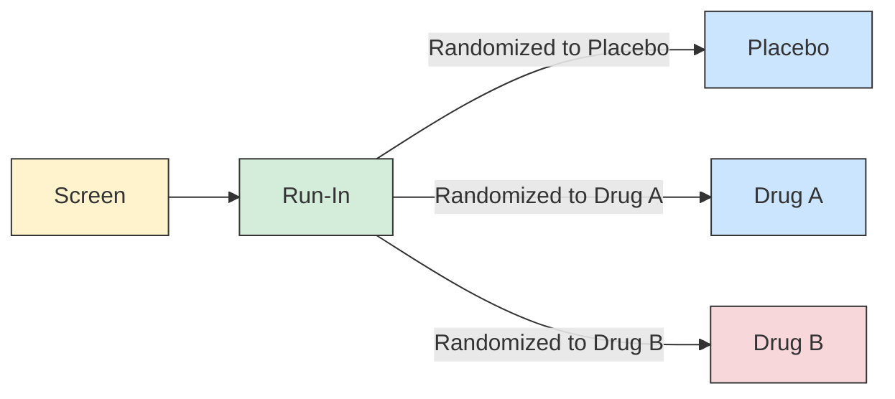

**Prospective View**

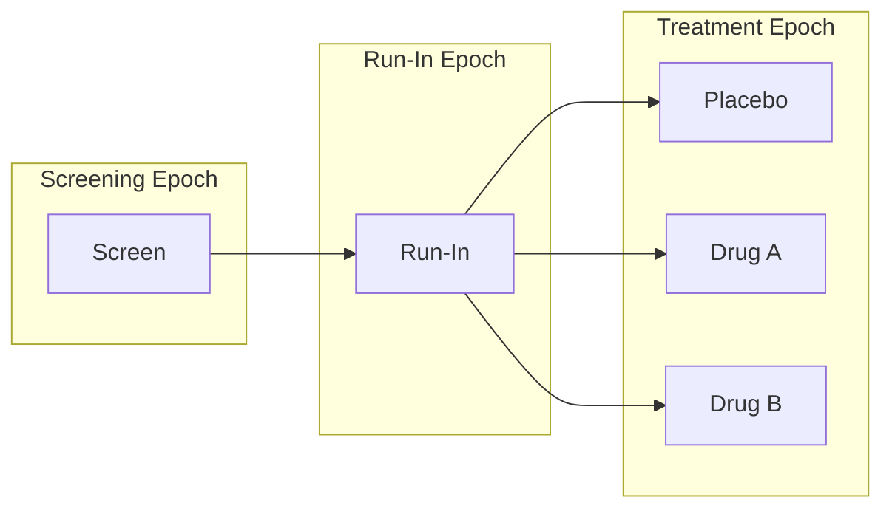

**Retrospective View**

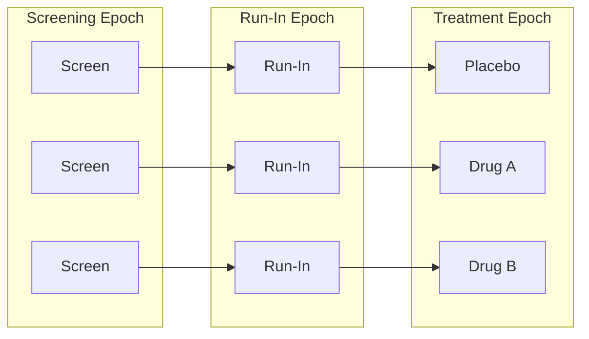

**Blinded View**

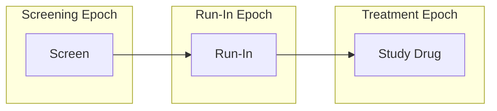

**Trial Design Matrix**

|  | Screen | Run-in | Treatment |
|---|---|---|---|
| **Placebo** | Screen | Run-in | PLACEBO |
| **A** | Screen | Run-in | DRUG A |
| **B** | Screen | Run-in | DRUG B |

**ta.xpt**

| Row | STUDYID | DOMAIN | ARMCD | ARM | TAETORD | ETCD | ELEMENT | TABRANCH | TATRANS | EPOCH |
|-----|---------|--------|-------|-----|---------|------|---------|----------|---------|-------|
| 1 | EX1 | TA | P | Placebo | 1 | SCRN | Screen | | | SCREENING |
| 2 | EX1 | TA | P | Placebo | 2 | RI | Run-In | Randomized to Placebo | | RUN-IN |
| 3 | EX1 | TA | P | Placebo | 3 | P | Placebo | | | TREATMENT |
| 4 | EX1 | TA | A | A | 1 | SCRN | Screen | | | SCREENING |
| 5 | EX1 | TA | A | A | 2 | RI | Run-In | Randomized to Drug A | | RUN-IN |
| 6 | EX1 | TA | A | A | 3 | A | Drug A | | | TREATMENT |
| 7 | EX1 | TA | B | B | 1 | SCRN | Screen | | | SCREENING |
| 8 | EX1 | TA | B | B | 2 | RI | Run-In | Randomized to Drug B | | RUN-IN |
| 9 | EX1 | TA | B | B | 3 | B | Drug B | | | TREATMENT |

## Example 2

A crossover trial comparing 3 treatments (Placebo, 5 mg, 10 mg) with 7 epochs: Screening, 3 Treatment Epochs with 3 Rest (washout) Epochs between them, and a Follow-up Epoch. Each arm represents a different order of treatments.

**Study Schema**

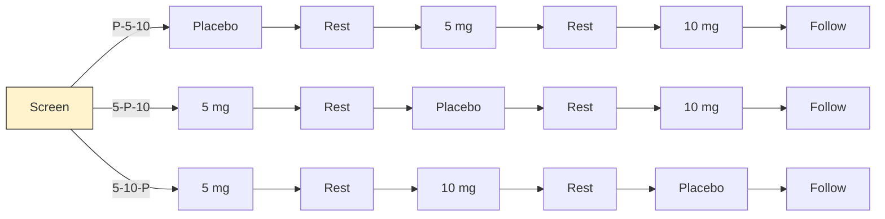

**Prospective View**

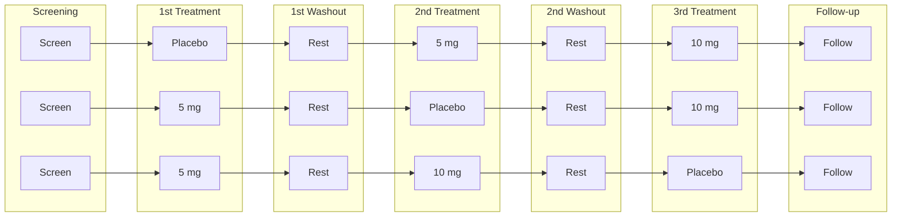

**Retrospective View**

Same structure as the Prospective View (one-to-one relationship between epochs and elements in each arm for this crossover design). Arm labels: P-L-H, L-P-H, L-H-P.

**Blinded View**

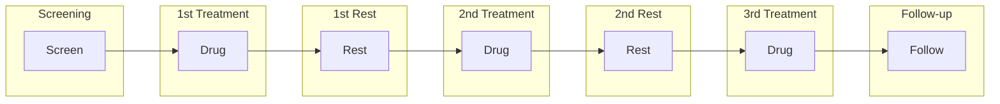

**Trial Design Matrix**

|  | Screen | First Treatment | First Rest | Second Treatment | Second Rest | Third Treatment | Follow-up |
|---|---|---|---|---|---|---|---|
| **P-5-10** | Screen | Placebo | Rest | 5 mg | Rest | 10 mg | Follow-up |
| **5-P-10** | Screen | 5 mg | Rest | Placebo | Rest | 10 mg | Follow-up |
| **5-10-P** | Screen | 5 mg | Rest | 10 mg | Rest | Placebo | Follow-up |

**ta.xpt**

| Row | STUDYID | DOMAIN | ARMCD | ARM | TAETORD | ETCD | ELEMENT | TABRANCH | TATRANS | EPOCH |
|-----|---------|--------|-------|-----|---------|------|---------|----------|---------|-------|
| 1 | EX2 | TA | P-5-10 | Placebo-5mg-10mg | 1 | SCRN | Screen | Randomized to Placebo - 5 mg - 10 mg | | SCREENING |
| 2 | EX2 | TA | P-5-10 | Placebo-5mg-10mg | 2 | P | Placebo | | | TREATMENT 1 |
| 3 | EX2 | TA | P-5-10 | Placebo-5mg-10mg | 3 | REST | Rest | | | WASHOUT 1 |
| 4 | EX2 | TA | P-5-10 | Placebo-5mg-10mg | 4 | 5 | 5 mg | | | TREATMENT 2 |
| 5 | EX2 | TA | P-5-10 | Placebo-5mg-10mg | 5 | REST | Rest | | | WASHOUT 2 |
| 6 | EX2 | TA | P-5-10 | Placebo-5mg-10mg | 6 | 10 | 10 mg | | | TREATMENT 3 |
| 7 | EX2 | TA | P-5-10 | Placebo-5mg-10mg | 7 | FU | Follow-up | | | FOLLOW-UP |
| 8 | EX2 | TA | 5-P-10 | 5mg-Placebo-10mg | 1 | SCRN | Screen | Randomized to 5 mg - Placebo - 10 mg | | SCREENING |
| 9 | EX2 | TA | 5-P-10 | 5mg-Placebo-10mg | 2 | 5 | 5 mg | | | TREATMENT 1 |
| 10 | EX2 | TA | 5-P-10 | 5mg-Placebo-10mg | 3 | REST | Rest | | | WASHOUT 1 |
| 11 | EX2 | TA | 5-P-10 | 5mg-Placebo-10mg | 4 | P | Placebo | | | TREATMENT 2 |
| 12 | EX2 | TA | 5-P-10 | 5mg-Placebo-10mg | 5 | REST | Rest | | | WASHOUT 2 |
| 13 | EX2 | TA | 5-P-10 | 5mg-Placebo-10mg | 6 | 10 | 10 mg | | | TREATMENT 3 |
| 14 | EX2 | TA | 5-P-10 | 5mg-Placebo-10mg | 7 | FU | Follow-up | | | FOLLOW-UP |
| 15 | EX2 | TA | 5-10-P | 5mg-10mg-Placebo | 1 | SCRN | Screen | Randomized to 5 mg - 10 mg - Placebo | | SCREENING |
| 16 | EX2 | TA | 5-10-P | 5mg-10mg-Placebo | 2 | 5 | 5 mg | | | TREATMENT 1 |
| 17 | EX2 | TA | 5-10-P | 5mg-10mg-Placebo | 3 | REST | Rest | | | WASHOUT 1 |
| 18 | EX2 | TA | 5-10-P | 5mg-10mg-Placebo | 4 | 10 | 10 mg | | | TREATMENT 2 |
| 19 | EX2 | TA | 5-10-P | 5mg-10mg-Placebo | 5 | REST | Rest | | | WASHOUT 2 |
| 20 | EX2 | TA | 5-10-P | 5mg-10mg-Placebo | 6 | P | Placebo | | | TREATMENT 3 |
| 21 | EX2 | TA | 5-10-P | 5mg-10mg-Placebo | 7 | FU | Follow-up | | | FOLLOW-UP |

## Example 3

A trial with multiple branches: randomization at screening plus response evaluation after blinded treatment. This results in 4 arms (A-Open A, A-Rescue, B-Open A, B-Rescue). TABRANCH is populated for 2 records in each arm reflecting the 2 branch points.

**Study Schema**

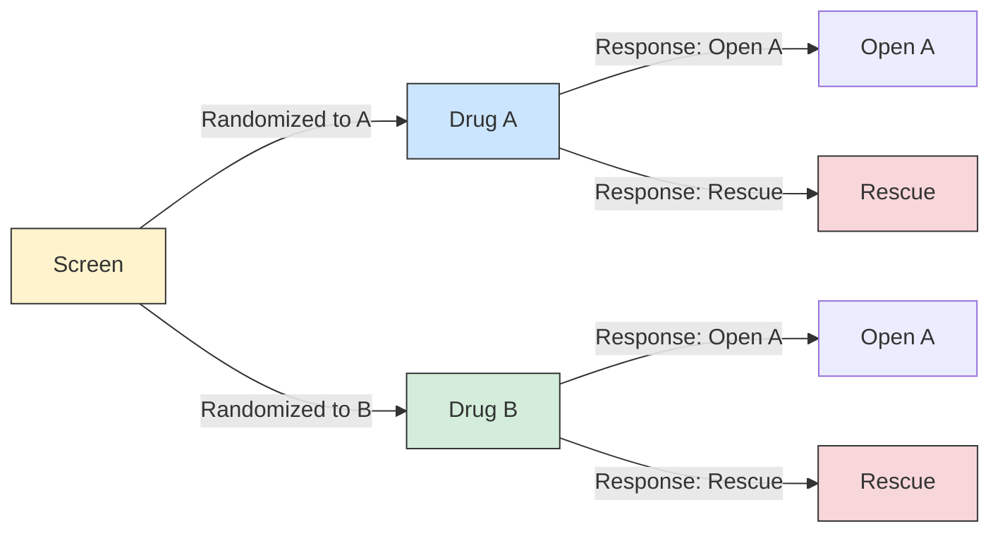

**Prospective View**

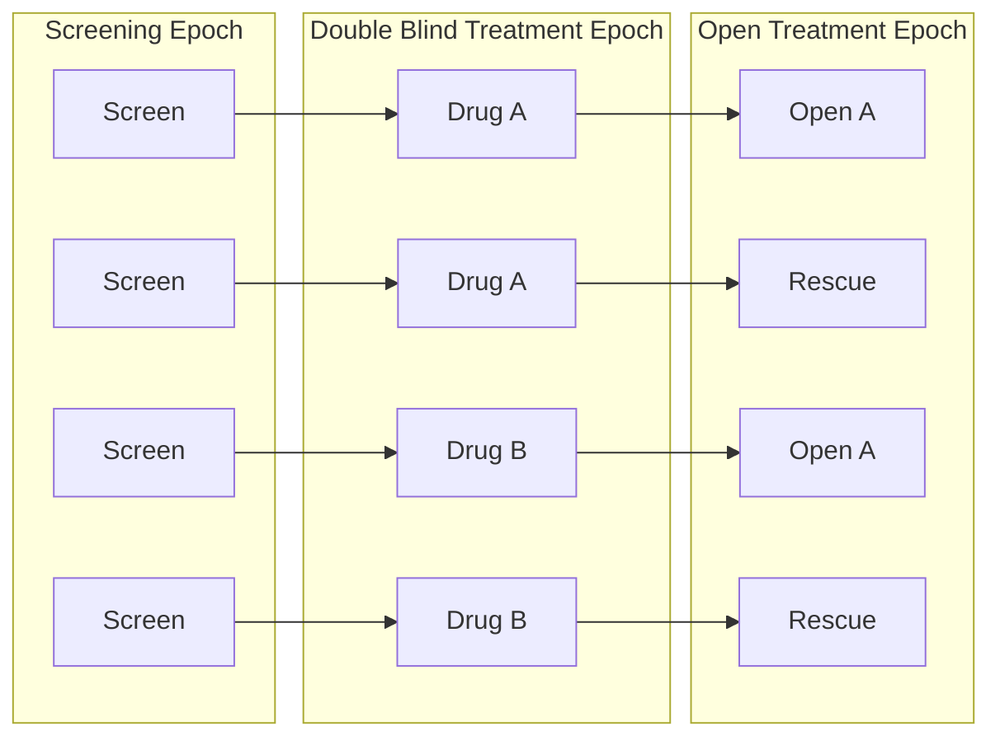

**Retrospective View**

Same epoch structure as Prospective View. 4 arms: A-Open (Screen→Drug A→Open A), A-Rescue (Screen→Drug A→Rescue), B-Open (Screen→Drug B→Open A), B-Rescue (Screen→Drug B→Rescue).

**Blinded View**

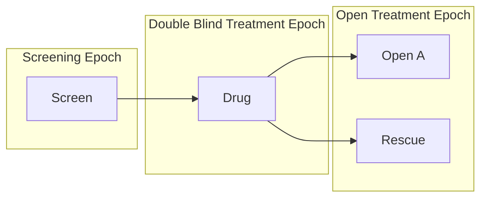

**Trial Design Matrix**

|  | Screen | Double Blind | Open Label |
|---|---|---|---|
| **A-Open A** | Screen | Treatment A | Open Drug A |
| **A-Rescue** | Screen | Treatment A | Rescue |
| **B-Open A** | Screen | Treatment B | Open Drug A |
| **B-Rescue** | Screen | Treatment B | Rescue |

**ta.xpt**

| Row | STUDYID | DOMAIN | ARMCD | ARM | TAETORD | ETCD | ELEMENT | TABRANCH | TATRANS | EPOCH |
|-----|---------|--------|-------|-----|---------|------|---------|----------|---------|-------|
| 1 | EX3 | TA | AA | A-Open A | 1 | SCRN | Screen | Randomized to Treatment A | | SCREENING |
| 2 | EX3 | TA | AA | A-Open A | 2 | DBA | Treatment A | Assigned to Open Drug A on basis of response evaluation | | BLINDED TREATMENT |
| 3 | EX3 | TA | AA | A-Open A | 3 | OA | Open Drug A | | | OPEN LABEL TREATMENT |
| 4 | EX3 | TA | AR | A-Rescue | 1 | SCRN | Screen | Randomized to Treatment A | | SCREENING |
| 5 | EX3 | TA | AR | A-Rescue | 2 | DBA | Treatment A | Assigned to Rescue on basis of response evaluation | | BLINDED TREATMENT |
| 6 | EX3 | TA | AR | A-Rescue | 3 | RSC | Rescue | | | OPEN LABEL TREATMENT |
| 7 | EX3 | TA | BA | B-Open A | 1 | SCRN | Screen | Randomized to Treatment B | | SCREENING |
| 8 | EX3 | TA | BA | B-Open A | 2 | DBB | Treatment B | Assigned to Open Drug A on basis of response evaluation | | BLINDED TREATMENT |
| 9 | EX3 | TA | BA | B-Open A | 3 | OA | Open Drug A | | | OPEN LABEL TREATMENT |
| 10 | EX3 | TA | BR | B-Rescue | 1 | SCRN | Screen | Randomized to Treatment B | | SCREENING |
| 11 | EX3 | TA | BR | B-Rescue | 2 | DBB | Treatment B | Assigned to Rescue on basis of response evaluation | | BLINDED TREATMENT |
| 12 | EX3 | TA | BR | B-Rescue | 3 | RSC | Rescue | | | OPEN LABEL TREATMENT |

## Example 4

A cyclical chemotherapy oncology trial with repeating treatment/rest elements until disease progression. 2 arms (Drug A, Drug B), 3 epochs (Screening, Treatment, Follow-Up). The TATRANS variable represents the "repeat until disease progression" skip-forward rule.

Maximum of 4 cycles assumed in this example.

**Study Schema**

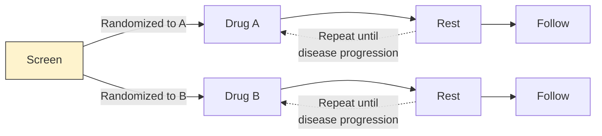

**Prospective View**

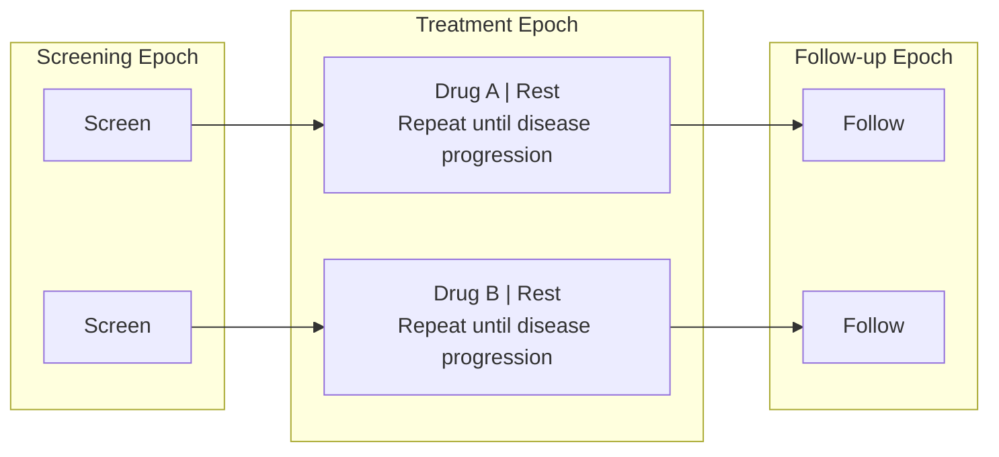

**Retrospective View**

Same epoch structure as the Prospective View: 2 arms (Drug A, Drug B), each cycling through Treatment Epoch until disease progression, then entering Follow-up.

**Retrospective View with Explicit Repeats**

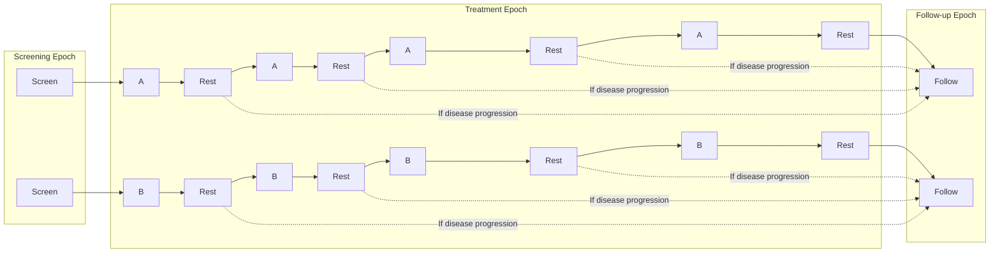

**Blinded View**

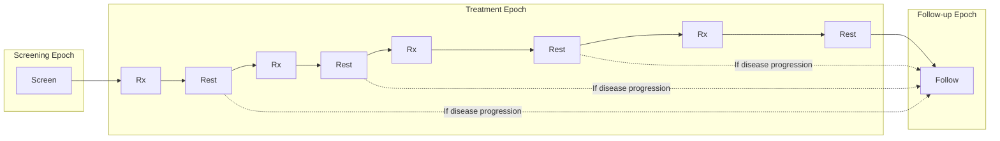

**Trial Design Matrix**

|  | Screen | Treatment | | | | | | | | Follow-up |
|---|---|---|---|---|---|---|---|---|---|---|
| **A** | Screen | Trt A | Rest | Trt A | Rest | Trt A | Rest | Trt A | Rest | Follow-up |
| **B** | Screen | Trt B | Rest | Trt B | Rest | Trt B | Rest | Trt B | Rest | Follow-up |

**ta.xpt**

| Row | STUDYID | DOMAIN | ARMCD | ARM | TAETORD | ETCD | ELEMENT | TABRANCH | TATRANS | EPOCH |
|-----|---------|--------|-------|-----|---------|------|---------|----------|---------|-------|
| 1 | EX4 | TA | A | A | 1 | SCRN | Screen | Randomized to A | | SCREENING |
| 2 | EX4 | TA | A | A | 2 | A | Trt A | | | TREATMENT |
| 3 | EX4 | TA | A | A | 3 | REST | Rest | | If disease progression, go to Follow-up Epoch | TREATMENT |
| 4 | EX4 | TA | A | A | 4 | A | Trt A | | | TREATMENT |
| 5 | EX4 | TA | A | A | 5 | REST | Rest | | If disease progression, go to Follow-up Epoch | TREATMENT |
| 6 | EX4 | TA | A | A | 6 | A | Trt A | | | TREATMENT |
| 7 | EX4 | TA | A | A | 7 | REST | Rest | | If disease progression, go to Follow-up Epoch | TREATMENT |
| 8 | EX4 | TA | A | A | 8 | A | Trt A | | | TREATMENT |
| 9 | EX4 | TA | A | A | 9 | REST | Rest | | | TREATMENT |
| 10 | EX4 | TA | A | A | 10 | FU | Follow-up | | | FOLLOW-UP |
| 11 | EX4 | TA | B | B | 1 | SCRN | Screen | Randomized to B | | SCREENING |
| 12 | EX4 | TA | B | B | 2 | B | Trt B | | | TREATMENT |
| 13 | EX4 | TA | B | B | 3 | REST | Rest | | If disease progression, go to Follow-up Epoch | TREATMENT |
| 14 | EX4 | TA | B | B | 4 | B | Trt B | | | TREATMENT |
| 15 | EX4 | TA | B | B | 5 | REST | Rest | | If disease progression, go to Follow-up Epoch | TREATMENT |
| 16 | EX4 | TA | B | B | 6 | B | Trt B | | | TREATMENT |
| 17 | EX4 | TA | B | B | 7 | REST | Rest | | If disease progression, go to Follow-up Epoch | TREATMENT |
| 18 | EX4 | TA | B | B | 8 | B | Trt B | | | TREATMENT |
| 19 | EX4 | TA | B | B | 9 | REST | Rest | | | TREATMENT |
| 20 | EX4 | TA | B | B | 10 | FU | Follow-up | | | FOLLOW-UP |

## Example 5

Similar to Example 4, but treatment A has longer duration than treatment B, so the trial cannot be blinded. Maximum of 3 cycles assumed. Different rest elements (RESTA, RESTB) are used for the 2 arms since cycle lengths differ.

**Study Schema**

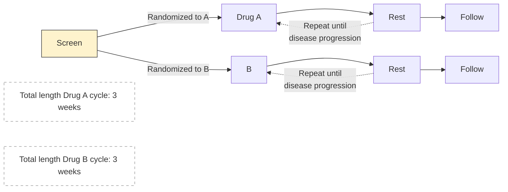

**Retrospective View**

```mermaid
graph LR
    subgraph SE["Screening Epoch"]
        s1[Screen]
        s2[Screen]
    end
    subgraph TE["Treatment Epoch"]
        da["Drug A | Rest A<br/>Repeat until disease progression"]
        db["B | Rest B<br/>Repeat until disease progression"]
    end
    subgraph FU["Follow-up Epoch"]
        f1[Follow]
        f2[Follow]
    end
    s1 --> da --> f1
    s2 --> db --> f2
```

**Trial Design Matrix**

|  | Screen | Treatment | | | | | | Follow-up |
|---|---|---|---|---|---|---|---|---|
| **A** | Screen | Trt A | Rest A | Trt A | Rest A | Trt A | Rest A | Follow-up |
| **B** | Screen | Trt B | Rest B | Trt B | Rest B | Trt B | Rest B | Follow-up |

**ta.xpt**

| Row | STUDYID | DOMAIN | ARMCD | ARM | TAETORD | ETCD | ELEMENT | TABRANCH | TATRANS | EPOCH |
|-----|---------|--------|-------|-----|---------|------|---------|----------|---------|-------|
| 1 | EX5 | TA | A | A | 1 | SCRN | Screen | Randomized to A | | SCREENING |
| 2 | EX5 | TA | A | A | 2 | A | Trt A | | | TREATMENT |
| 3 | EX5 | TA | A | A | 3 | RESTA | Rest A | | If disease progression, go to Follow-up Epoch | TREATMENT |
| 4 | EX5 | TA | A | A | 4 | A | Trt A | | | TREATMENT |
| 5 | EX5 | TA | A | A | 5 | RESTA | Rest A | | If disease progression, go to Follow-up Epoch | TREATMENT |
| 6 | EX5 | TA | A | A | 6 | A | Trt A | | | TREATMENT |
| 7 | EX5 | TA | A | A | 7 | RESTA | Rest A | | | TREATMENT |
| 8 | EX5 | TA | A | A | 8 | FU | Follow-up | | | FOLLOW-UP |
| 9 | EX5 | TA | B | B | 1 | SCRN | Screen | Randomized to B | | SCREENING |
| 10 | EX5 | TA | B | B | 2 | B | Trt B | | | TREATMENT |
| 11 | EX5 | TA | B | B | 3 | RESTB | Rest B | | If disease progression, go to Follow-up Epoch | TREATMENT |
| 12 | EX5 | TA | B | B | 4 | B | Trt B | | | TREATMENT |
| 13 | EX5 | TA | B | B | 5 | RESTB | Rest B | | If disease progression, go to Follow-up Epoch | TREATMENT |
| 14 | EX5 | TA | B | B | 6 | B | Trt B | | | TREATMENT |
| 15 | EX5 | TA | B | B | 7 | RESTB | Rest B | | | TREATMENT |
| 16 | EX5 | TA | B | B | 8 | FU | Follow-up | | | FOLLOW-UP |

## Example 6

An oncology trial with cycles of different lengths: Drug A in 3-week cycles (longer treatment, short rest), Drug B in 4-week cycles (short treatment, long rest). Maximum 4 cycles of Drug A, 3 cycles of Drug B.

Because the treatment epoch for arm A has more elements than arm B, TAETORD is 10 for the follow-up element in arm A, but 8 for follow-up in arm B. Gaps in TAETORD values are acceptable.

**Study Schema**

```mermaid
graph LR
    S[Screen]
    S -->|"Randomized to A"| DA[Drug A] --> RA[Rest] --> FA[Follow]
    S -->|"Randomized to B"| DB[B] --> RB[Rest] --> FB[Follow]
    RA -.->|"Repeat until<br/>disease progression"| DA
    RB -.->|"Repeat until<br/>disease progression"| DB
    note1["Total length Drug A cycle: 3 weeks"]
    note2["Total length Drug B cycle: 4 weeks"]
    style S fill:#fef3cd,stroke:#333
    style note1 fill:#fff,stroke:#999,stroke-dasharray:5 5
    style note2 fill:#fff,stroke:#999,stroke-dasharray:5 5
```

**Retrospective View**

```mermaid
graph LR
    subgraph SE["Screening Epoch"]
        s1[Screen]
        s2[Screen]
    end
    subgraph TE["Treatment Epoch"]
        da["Drug A | Rest A<br/>Repeat until disease progression<br/>(3-week cycles)"]
        db["B | Rest B<br/>Repeat until disease progression<br/>(4-week cycles)"]
    end
    subgraph FU["Follow-up Epoch"]
        f1[Follow]
        f2[Follow]
    end
    s1 --> da --> f1
    s2 --> db --> f2
```

**Trial Design Matrix**

|  | Screen | Treatment | | | | | | | | Follow-up |
|---|---|---|---|---|---|---|---|---|---|---|
| **A** | Screen | Trt A | Rest A | Trt A | Rest A | Trt A | Rest A | Trt A | Rest A | Follow-up |
| **B** | Screen | Trt B | Rest B | Trt B | Rest B | Trt B | Rest B | | | Follow-up |

**ta.xpt**

| Row | STUDYID | DOMAIN | ARMCD | ARM | TAETORD | ETCD | ELEMENT | TABRANCH | TATRANS | EPOCH |
|-----|---------|--------|-------|-----|---------|------|---------|----------|---------|-------|
| 1 | EX6 | TA | A | A | 1 | SCRN | Screen | Randomized to A | | SCREENING |
| 2 | EX6 | TA | A | A | 2 | A | Trt A | | | TREATMENT |
| 3 | EX6 | TA | A | A | 3 | RESTA | Rest A | | If disease progression, go to Follow-up Epoch | TREATMENT |
| 4 | EX6 | TA | A | A | 4 | A | Trt A | | | TREATMENT |
| 5 | EX6 | TA | A | A | 5 | RESTA | Rest A | | If disease progression, go to Follow-up Epoch | TREATMENT |
| 6 | EX6 | TA | A | A | 6 | A | Trt A | | | TREATMENT |
| 7 | EX6 | TA | A | A | 7 | RESTA | Rest A | | If disease progression, go to Follow-up Epoch | TREATMENT |
| 8 | EX6 | TA | A | A | 8 | A | Trt A | | | TREATMENT |
| 9 | EX6 | TA | A | A | 9 | RESTA | Rest A | | | TREATMENT |
| 10 | EX6 | TA | A | A | 10 | FU | Follow-up | | | FOLLOW-UP |
| 11 | EX6 | TA | B | B | 1 | SCRN | Screen | Randomized to B | | SCREENING |
| 12 | EX6 | TA | B | B | 2 | B | Trt B | | | TREATMENT |
| 13 | EX6 | TA | B | B | 3 | RESTB | Rest B | | If disease progression, go to Follow-up Epoch | TREATMENT |
| 14 | EX6 | TA | B | B | 4 | B | Trt B | | | TREATMENT |
| 15 | EX6 | TA | B | B | 5 | RESTB | Rest B | | If disease progression, go to Follow-up Epoch | TREATMENT |
| 16 | EX6 | TA | B | B | 6 | B | Trt B | | | TREATMENT |
| 17 | EX6 | TA | B | B | 7 | RESTB | Rest B | | | TREATMENT |
| 18 | EX6 | TA | B | B | 8 | FU | Follow-up | | | FOLLOW-UP |

## Example 7

Example Trial 7, RTOG 93-09, involves treatment of lung cancer with chemotherapy and radiotherapy, with or without surgery. This is a complex 2-arm trial (CR = Chemotherapy and Radiation; CRS = Chemotherapy, Radiation, and Surgery) with 4 epochs (Screening, Induction Treatment, Continuation Treatment, Follow-up) and major "skip forward" arrows for disease progression.

Both the induction and additional chemotherapy are given in 2 cycles. The second induction cycle is different for the 2 arms, since radiation therapy for those assigned to the non-surgery arm includes a "boost" which those assigned to the surgery arm do not receive.

**Study Schema (2-arm model)**

```mermaid
graph LR
    S[Screen]
    S -->|"Randomized to CR"| ICR1["Initial<br/>Chemo+RT"] --> CRNS["Chemo+RT<br/>(non-Surgery)"]
    CRNS --> C1[Chemo] --> C2[Chemo] --> FU1[Follow-up]
    CRNS -.->|"If progression"| FU1

    S -->|"Randomized to CRS"| ICR2["Initial<br/>Chemo+RT"] --> CRS["Chemo+RT<br/>(Surgery)"]
    CRS --> R3["3-5w Rest"] --> SURG[Surgery] --> R4["4-6w Rest"] --> C3[Chemo] --> C4[Chemo] --> FU2[Follow-up]
    CRS -.->|"If progression"| FU2
    CRS -.->|"Not eligible<br/>for surgery"| C3

    style S fill:#fef3cd,stroke:#333
    style SURG fill:#f8d7da,stroke:#333
```

**Prospective View**

```mermaid
graph LR
    subgraph SE["Screen Epoch"]
        s1[Screen]
        s2[Screen]
    end
    subgraph IE["Induction Treatment Epoch"]
        cr1["Chemo+Rad"] --> cr2["Chemo+Rad*"]
        cs1["Chemo+Rad"] --> cs2["Chemo+Rad**"]
    end
    subgraph CE["Continuation Treatment Epoch"]
        cb["Chemo+Boost"] --> cc1[Chemo]
        r3["3-5w Rest"] --> sg[Surgery] --> r4["4-6w Rest"] --> cc3[Chemo] --> cc4[Chemo]
    end
    subgraph FE["Follow-up Epoch"]
        f1[FU]
        f2[FU]
    end
    s1 --> cr1
    cr2 --> cb
    cc1 --> f1
    s2 --> cs1
    cs2 --> r3
    cc4 --> f2
    cr2 -.->|"If progression"| f1
    cs2 -.->|"If progression"| f2
    cs2 -.->|"Not eligible for surgery"| cc3
```

> *Disease evaluation earlier, **Disease evaluation later

**Retrospective View**

Same epoch structure as the Prospective View. The elements in the Continuation Treatment Epoch for the CR arm do not fill the space compared to the CRS arm, reflecting different treatment durations between the 2 arms.

**Trial Design Matrix**

|  | Screen | Induction | Continuation | | | | Follow-up |
|---|---|---|---|---|---|---|---|
| **CR** | Screen | Initial Chemo + RT | Chemo + RT (non-Surgery) | Chemo | Chemo | | Off Treatment Follow-up |
| **CRS** | Screen | Initial Chemo + RT | Chemo + RT (Surgery) | 3-5 w Rest | Surgery | 4-6 w Rest | Chemo | Chemo | Off Treatment Follow-up |

**ta.xpt**

| Row | STUDYID | DOMAIN | ARMCD | ARM | TAETORD | ETCD | ELEMENT | TABRANCH | TATRANS | EPOCH |
|-----|---------|--------|-------|-----|---------|------|---------|----------|---------|-------|
| 1 | EX7 | TA | 1 | CR | 1 | SCRN | Screen | Randomized to CR | | SCREENING |
| 2 | EX7 | TA | 1 | CR | 2 | ICR | Initial Chemo + RT | | | INDUCTION TREATMENT |
| 3 | EX7 | TA | 1 | CR | 3 | CRNS | Chemo+RT (non-Surgery) | | If progression, skip to Follow-up. | INDUCTION TREATMENT |
| 4 | EX7 | TA | 1 | CR | 4 | C | Chemo | | | CONTINUATION TREATMENT |
| 5 | EX7 | TA | 1 | CR | 5 | C | Chemo | | | CONTINUATION TREATMENT |
| 6 | EX7 | TA | 1 | CR | 6 | FU | Off Treatment Follow-up | | | FOLLOW-UP |
| 7 | EX7 | TA | 2 | CRS | 1 | SCRN | Screen | Randomized to CRS | | SCREENING |
| 8 | EX7 | TA | 2 | CRS | 2 | ICR | Initial Chemo + RT | | | INDUCTION TREATMENT |
| 9 | EX7 | TA | 2 | CRS | 3 | CRS | Chemo+RT (Surgery) | | If progression, skip to Follow-up. If no progression, but subject is ineligible for or does not consent to surgery, skip to Chemo. | INDUCTION TREATMENT |
| 10 | EX7 | TA | 2 | CRS | 4 | R3 | 3-5 week rest | | | CONTINUATION TREATMENT |
| 11 | EX7 | TA | 2 | CRS | 5 | SURG | Surgery | | | CONTINUATION TREATMENT |
| 12 | EX7 | TA | 2 | CRS | 6 | R4 | 4-6 week rest | | | CONTINUATION TREATMENT |
| 13 | EX7 | TA | 2 | CRS | 7 | C | Chemo | | | CONTINUATION TREATMENT |
| 14 | EX7 | TA | 2 | CRS | 8 | C | Chemo | | | CONTINUATION TREATMENT |
| 15 | EX7 | TA | 2 | CRS | 9 | FU | Off Treatment Follow-up | | | FOLLOW-UP |

## Trial Arms Issues

### Distinguishing Between Branches and Transitions

Both the Branch and Transition columns contain rules, but the 2 columns represent 2 different types of rules. **Branch rules** represent forks in the trial flowchart, giving rise to separate arms. The rule underlying a branch appears in multiple records, once for each "fork" of the branch. **Transition rules** are used for choices within an arm. The value for TATRANS does contain a choice (an "if" clause). In Example Trial 4, subjects who receive 1, 2, 3, or 4 cycles of treatment A are all considered to belong to arm A.

### Subjects Not Assigned to an Arm

Some trial subjects may drop out of the study before they reach all of the branch points in the trial design. In the Demographics (DM) domain, the values of ARM and ARMCD must be supplied for such subjects, but the special values used for these subjects should not be included in the Trial Arms (TA) dataset; only complete arm paths should be described in the TA dataset. See DM Example 3 for how to represent ARM and ARMCD values for such trials.

### Defining Epochs

The series of examples for the TA dataset provides a variety of scenarios and guidance about how to assign epoch in those scenarios. In general, assigning epochs for blinded trials is easier than for unblinded trials. The blinded view of the trial will generally make the possible choices clear. For unblinded trials, the comparisons that will be made between arms can guide the definition of epochs.

### Rule Variables

The Branch and Transition columns shown in the example tables are variables with a Role of "Rule." The values of a Rule variable describe conditions under which something is planned to happen. At the moment, values of Rule variables are text. At some point in the future, it is expected that a mechanism to provide machine-readable rules will become available. Other Rule variables are present in the Trial Elements (TE) and Trial Visits (TV) datasets.

<!-- source: knowledge_base/domains/TD/assumptions.md -->
# TD — Assumptions

The purpose of the Trial Disease Assessments (TD) domain is to provide information on planned scheduling of disease assessments when the scheduling of disease assessments is not necessarily tied to the scheduling of visits. In oncology studies, good compliance with the disease-assessment schedule is essential to reduce the risk of "assessment time bias." The TD domain makes possible an evaluation of assessment time bias from the SDTM, in particular for studies with progression-free survival (PFS) endpoints. TD has limited utility in oncology and was developed specifically with RECIST in mind and where an assessment-time bias analysis is appropriate. It is understood that extending this approach to Cheson and other criteria may not be appropriate or may pose difficulties. It is also understood that this approach may not be necessary in non-oncology studies, although it is available for use if appropriate.

1. The purpose of the Trial Disease Assessments (TD) domain is to provide information on planned scheduling of disease assessments when the scheduling of disease assessments is not necessarily tied to the scheduling of visits. In oncology studies, good compliance with the disease-assessment schedule is essential to reduce the risk of "assessment time bias." The TD domain makes possible an evaluation of assessment time bias from the SDTM, in particular for studies with progression-free survival (PFS) endpoints.

2. A planned schedule of assessments will have a defined start point; the TDANCVAR variable is used to identify the variable in the ADaM subject-level dataset (ADSL) that holds the "anchor" date. By default, the anchor variable for the first pattern is ANCH1DT. An anchor date must be provided for each pattern of assessments, and each anchor variable must exist in ADSL. TDANCVAR is therefore a Required variable. Anchor date variable names should adhere to ADaM variable naming conventions (e.g., ANCH1DT, ANCH2DT). One anchor date may be used to anchor more than 1 pattern of disease assessments. When that is the case, the appropriate offset for the start of a subsequent pattern, represented as an ISO 8601 duration value, should be provided in the TDSTOFF variable.

3. The TDSTOFF variable is used in conjunction with the anchor date value (from the anchor date variable identified in TDANCVAR). If the pattern of disease assessments does not start exactly on a date collected on the CRF, this variable will represent the offset between the anchor date value and the start date of the pattern of disease assessments. This may be a positive or zero interval value represented in an ISO 8601 format.

4. A pattern of assessments consists of a series of intervals of equal duration, each followed by an assessment. Thus, the first assessment in a pattern is planned to occur at the anchor date (given by the variable named in TDANCVAR) plus the offset (TDSTOFF) plus the target assessment interval (TDTGTPAI). A baseline evaluation is usually not preceded by an interval, and would therefore not be considered part of an assessment pattern.

5. This domain should not be created when the disease assessment schedule may vary for individual subjects (e.g., when completion of the first phase of a study is event-driven).

<!-- source: knowledge_base/domains/TD/examples.md -->
# TD — Examples

## Example 1

**Timeline Diagram — Example 1: Three sequential assessment schedules from a single anchor**

```mermaid
graph LR
    ANCH1DT(["ANCH1DT(anchor)"])

    subgraph S1["Schedule 1 — every 8 weeks (weeks 8–48)"]
        W8[/"▲ Wk 8"/]
        W16[/"▲ Wk 16"/]
        W24[/"▲ Wk 24"/]
        W32[/"▲ Wk 32"/]
        W40[/"▲ Wk 40"/]
        W48[/"▲ Wk 48"/]
    end

    subgraph S2["Schedule 2 — every 12 weeks (weeks 60–96)"]
        W60[/"▲ Wk 60"/]
        W72[/"▲ Wk 72"/]
        W84[/"▲ Wk 84"/]
        W96[/"▲ Wk 96"/]
    end

    subgraph S3["Schedule 3 — every 24 weeks (week 120 onward)"]
        W120[/"▲ Wk 120"/]
        W144[/"▲ Wk 144"/]
        ETC(["... et cetera, untildisease progression or death"])
    end

    ANCH1DT --> W8 --> W16 --> W24 --> W32 --> W40 --> W48
    W48 --> W60 --> W72 --> W84 --> W96
    W96 --> W120 --> W144 --> ETC
```

This example shows a study where the disease assessment schedule changes over the course of the study. In this example, there are 3 distinct disease-assessment schedule patterns. A single anchor date variable (TDANCVAR) provides the anchor date for each pattern. The offset variable (TDSTOFF), used in conjunction with the anchor date variable, provides the start point of each pattern of assessments.

- The first disease-assessment schedule pattern starts at the reference start date (identified in the ADSL ANCH1DT variable) and repeats every 8 weeks for a total of 6 repeated assessments (i.e., week 8, week 16, week 24, week 32, week 40, week 48). Note that there is an upper and lower limit around the planned disease assessment target where the first assessment (8 weeks) could occur as early as day 53 and as late as week 9. This upper and lower limit (-3 days, +1 week) would be applied to all assessments during that pattern.

- The second disease assessment schedule starts from week 48 and repeats every 12 weeks for a total of 4 repeats (i.e., week 60, week 72, week 84, week 96), with respective upper and lower limits of -1 week and +1 week.

- The third disease assessment schedule starts from week 96 and repeats every 24 weeks (week 120, week 144, and so on), with respective upper and lower limits of -1 week and +1 week, for an indefinite length of time. The preceding schematic shows that, for the third pattern, assessments will occur until disease progression; this therefore leaves the pattern open-ended. However, when data is included in an analysis, the total number of repeats can be identified and the highest number of repeat assessments for any subject in that pattern must be recorded in the TDNUMRPT variable on the final pattern record.

**td.xpt**

| Row | STUDYID | DOMAIN | TDORDER | TDANCVAR | TDSTOFF | TDTGTPAI | TDMINPAI | TDMAXPAI | TDNUMRPT |
|-----|---------|--------|---------|----------|---------|----------|----------|----------|----------|
| 1 | ABC123 | TD | 1 | ANCH1DT | P0D | P8W | P53D | P9W | 6 |
| 2 | ABC123 | TD | 2 | ANCH1DT | P48W | P12W | P11W | P13W | 4 |
| 3 | ABC123 | TD | 3 | ANCH1DT | P96W | P24W | P23W | P25W | 12 |

## Example 2

**Timeline Diagram — Example 2: Two periods with separate anchor dates (crossover study)**

```mermaid
graph LR
    subgraph P1["Period 1"]
        ANCH1DT(["ANCH1DT(anchor)"])
        subgraph S1["Schedule 1 — every 8 weeks"]
            A8[/"▲ Wk 8"/]
            A16[/"▲ Wk 16"/]
            A24[/"▲ Wk 24"/]
            A32[/"▲ Wk 32"/]
            A40[/"▲ Wk 40"/]
            A48[/"▲ Wk 48"/]
            A56[/"▲ Wk 56"/]
            ETC1(["... et cetera, untildisease progression or death"])
        end
        ANCH1DT --> A8 --> A16 --> A24 --> A32 --> A40 --> A48 --> A56 --> ETC1
    end

    subgraph P2["Period 2"]
        ANCH2DT(["ANCH2DT(anchor)"])
        subgraph S2["Schedule 2 — every 8 weeks"]
            B8[/"▲ +8 wks"/]
            B16[/"▲ +16 wks"/]
            B24[/"▲ +24 wks"/]
            B32[/"▲ +32 wks"/]
            ETC2(["... et cetera, untildisease progression or death"])
        end
        ANCH2DT --> B8 --> B16 --> B24 --> B32 --> ETC2
    end
```

This example shows a crossover study, where subjects are given the period 1 treatment according to the first disease-assessment schedule until disease progression, then there is a rest period of 28 days prior to the start of the period 2 treatment (i.e., re-baseline for period 2). The subjects are then given the period 2 treatment according to the second disease assessment schedule until disease progression. This example also shows how two different reference/anchor dates can be used.

- The Rest element is not represented as a row in the TD dataset, since no disease assessments occur during the Rest. Note that although the Rest epoch in this example is not important for TD, it is important that it is represented in other trial design datasets.

**Row 1:** Shows the disease assessment schedule for the first treatment period. The diagram above shows that this schedule repeats until disease progression. After the trial ended, the maximum number of repeats in this schedule was determined to be 6, so that is the value in TDNUMRPT for this schedule.

**Row 2:** Shows the disease assessment schedule for the second period. The pattern starts on the date identified in the ADSL variable ANCH2DT and repeats every 8 weeks with respective upper and lower limits of -1 week and +1 week. The maximum number of repeats that occurred on this schedule was 4.

**td.xpt**

| Row | STUDYID | DOMAIN | TDORDER | TDANCVAR | TDSTOFF | TDTGTPAI | TDMINPAI | TDMAXPAI | TDNUMRPT |
|-----|---------|--------|---------|----------|---------|----------|----------|----------|----------|
| 1 | ABC123 | TD | 1 | ANCH1DT | P0D | P8W | P53D | P9W | 6 |
| 2 | ABC123 | TD | 2 | ANCH2DT | P0D | P8W | P53D | P9W | 4 |

## Example 3

**Timeline Diagram — Example 3: Double Blind Treatment (two schedules) + Extension Treatment**

```mermaid
graph LR
    subgraph DBT["Double Blind Treatment (Standard vs. Experimental Treatment)"]
        ANCH1DT(["ANCH1DT(anchor)"])
        subgraph S1["Schedule 1 — every 8 weeks (weeks 8–48)"]
            C8[/"▲ Wk 8"/]
            C16[/"▲ Wk 16"/]
            C24[/"▲ Wk 24"/]
            C32[/"▲ Wk 32"/]
            C40[/"▲ Wk 40"/]
            C48[/"▲ Wk 48"/]
        end
        subgraph S2["Schedule 2 — every 12 weeks (week 60 onward)"]
            C60[/"▲ Wk 60"/]
            C72[/"▲ Wk 72"/]
            C84[/"▲ Wk 84"/]
            C96[/"▲ Wk 96"/]
            C108[/"▲ Wk 108"/]
            C120[/"▲ Wk 120"/]
            C132[/"▲ Wk 132"/]
            C144[/"▲ Wk 144"/]
            ETC1(["... et cetera, untildisease progression or death"])
        end
        ANCH1DT --> C8 --> C16 --> C24 --> C32 --> C40 --> C48
        C48 --> C60 --> C72 --> C84 --> C96 --> C108 --> C120 --> C132 --> C144 --> ETC1
    end

    subgraph EXT["Extension Treatment"]
        ANCH2DT(["ANCH2DT(anchor)"])
        subgraph S3["Schedule 3 — every 12 weeks"]
            D12[/"▲ +12 wks"/]
            D24[/"▲ +24 wks"/]
            D36[/"▲ +36 wks"/]
            D48[/"▲ +48 wks"/]
            ETC2(["... et cetera, untildisease progression or death"])
        end
        ANCH2DT --> D12 --> D24 --> D36 --> D48 --> ETC2
    end
```

This example shows a study where subjects are randomized to standard treatment or an experimental treatment. The subjects who are randomized to standard treatment are given the option to receive experimental treatment after they end the standard treatment (e.g., due to disease progression on standard treatment). In the randomized treatment epoch, the disease assessment schedule changes over the course of the study. At the start of the extension treatment epoch, subjects are re-baselined, i.e., an extension baseline disease assessment is performed and the disease assessment schedule is restarted.

In this example, there are 3 distinct disease-assessment schedule patterns:

- The first disease-assessment schedule pattern starts at the reference start date (identified in the ADSL ANCH1DT variable) and repeats every 8 weeks for a total of 6 repeats (i.e., week 8, week 16, week 24, week 32, week 40, week 48), with respective upper and lower limits of -3 days and +1 week.

- The second disease assessment schedule starts from week 48 and repeats every 12 weeks (week 60, week 72, etc.), with respective upper and lower limits of -1 week and +1 week, for an indefinite length of time. The preceding schematic shows that, for the second pattern, assessments will occur until disease progression; this therefore leaves the pattern open-ended.

- The third disease assessment schedule starts at the extension reference start date (identified in the ADSL ANCH2DT variable) from week 96 and repeats every 12 weeks (week 120, week 144, etc.), with respective upper and lower limits of -1 week and +1 week, for an indefinite length of time.

For open-ended patterns, the total number of repeats can be identified when the data analysis is performed; the highest number of repeat assessments for any subject in that pattern must be recorded in the TDNUMRPT variable on the final pattern record.

**td.xpt**

| Row | STUDYID | DOMAIN | TDORDER | TDANCVAR | TDSTOFF | TDTGTPAI | TDMINPAI | TDMAXPAI | TDNUMRPT |
|-----|---------|--------|---------|----------|---------|----------|----------|----------|----------|
| 1 | ABC123 | TD | 1 | ANCH1DT | P0D | P8W | P53D | P9W | 6 |
| 2 | ABC123 | TD | 2 | ANCH1DT | P48W | P12W | P11W | P13W | 17 |
| 3 | ABC123 | TD | 3 | ANCH2DT | P0D | P12W | P11W | P13W | 17 |

<!-- source: knowledge_base/domains/TE/assumptions.md -->
# TE — Assumptions

The Trial Elements (TE) dataset contains the definitions of the elements that appear in the Trial Arms (TA) dataset. An element may appear multiple times in the TA table because it appears either (1) in multiple arms, (2) multiple times within an arm, or (3) both. However, an element will appear only once in the TE table.

Each row in the TE dataset may be thought of as representing a "unique element" in the same sense of "unique" as a CRF template page for a collecting certain type of data referred to as "unique page."

An element is a building block for creating study cells, and an arm is composed of study cells. Trial elements represent an interval of time that serves a purpose in the trial and are associated with certain activities affecting the subject. "Week 2 to week 4" is not a valid trial element.

1. There are no gaps between elements. The instant one element ends, the next element begins. A subject spends no time "between" elements.

2. The ELEMENT (Description of the Element) variable usually indicates the treatment being administered during an element, or, if no treatment is being administered, the other activities that are the purpose of this period of time (e.g., "Screening", "Follow-up", "Washout"). In some cases, this time period may be quite passive (e.g., "Rest"; "Wait, for disease episode").

3. The TESTRL (Rule for Start of Element) variable identifies the event that marks the transition into this element. For elements that involve treatment, this is the start of treatment.

4. For elements that do not involve treatment, TESTRL can be more difficult to define. For washout and follow-up elements, which always follow treatment elements, the start of the element may be defined relative to the end of a preceding treatment. For example, a washout period might be defined as starting 24 or 48 hours after the last dose of drug for the preceding treatment element or epoch. This definition is not totally independent of the TA dataset, because it relies on knowing where in the trial design the element is used, and that it always follows a treatment element. Defining a clear starting point for the start of a non-treatment element that always follows another non-treatment element can be particularly difficult. The transition may be defined by a decision-making activity such as enrollment or randomization.

5. TESTRL for a treatment element may be thought of as "active" whereas the start rule for a non-treatment element—particularly a follow-up or washout element—may be "passive." The start of a treatment element will not occur until a dose is given, no matter how long that dose is delayed. Once the last dose is given, the start of a subsequent non-treatment element is inevitable, as long as another dose is not given.

6. Note that the date/time of the event described in TESTRL will be used to populate the date/times in the Subject Elements (SE) dataset, so the date/time of the event should be captured in the CRF.

7. Specifying TESTRL for an element that serves the first element of an arm in the TA dataset involves defining the start of the trial. In the examples in this document, obtaining informed consent has been used as "Trial Entry."

8. TESTRL should be expressed without referring to arm. If the element appears in more than 1 arm in the TA dataset, then the element description (ELEMENT) **must not** refer to any arms.

9. TESTRL should be expressed without referring to epoch. If the element appears in more than 1 epoch in the TA dataset, then the Element description (ELEMENT) **must not** refer to any epochs.

10. For a blinded trial, it is useful to describe TESTRL in terms that separate the properties of the event that are visible to blinded participants from the properties that are visible only to those who are unblinded. For treatment elements in blinded trials, wording such as the following is suitable: "First dose of study drug for a treatment epoch, where study drug is X."

11. Element end rules are rather different from element start rules. The actual end of one element is the beginning of the next element. Thus, the element end rule does not give the conditions under which an element does end, but the conditions under which it should end or is planned to end.

12. At least 1 of TEENRL and TEDUR must be populated. Both may be populated.

13. TEENRL describes the circumstances under which a subject should leave this element. Element end rules may depend on a variety of conditions. For instance, a typical criterion for ending a rest element between oncology chemotherapy-treatment element would be, "15 days after start of element and WBC counts have recovered." The TA dataset, not the TE dataset, describes where the subject moves next, so TEENRL must be expressed without referring to arm.

14. TEDUR serves the same purpose as TEENRL for the special (but very common) case of an element with a fixed duration. TEDUR is expressed in ISO 8601 format. For example, a TEDUR value of P6W is equivalent to a TEENRL of "6 weeks after the start of the element."

15. Note that elements that have different start and end rules are different elements and must have different values of ELEMENT and ETCD. For instance, elements that involve the same treatment but have different durations are different elements. The same applies to non-treatment elements.

<!-- source: knowledge_base/domains/TE/examples.md -->
# TE — Examples

Both of the trials in TA Examples 1 and 2 (see Section 7.2.1, Trial Arms) are assumed to have fixed-duration elements. The wording in TESTRL is intended to separate the description of the event that starts the element into the part that would be visible to a blinded participant in the trial (e.g., "First dose of a treatment epoch") from the part that is revealed when the study is unblinded (e.g., "where dose is 5 mg"). Care must be taken in choosing these descriptions to be sure that they are arm- and epoch-neutral.

## Example 1

This example shows the TE dataset for TA Example Trial 1.

**te.xpt**

| Row | STUDYID | DOMAIN | ETCD | ELEMENT | TESTRL | TEENRL | TEDUR |
|-----|---------|--------|------|---------|--------|--------|-------|
| 1 | EX1 | TE | SCRN | Screen | Informed consent | 1 week after start of Element | P7D |
| 2 | EX1 | TE | RI | Run-In | Eligibility confirmed | 2 weeks after start of Element | P14D |
| 3 | EX1 | TE | P | Placebo | First dose of study drug, where drug is placebo | 2 weeks after start of Element | P14D |
| 4 | EX1 | TE | A | Drug A | First dose of study drug, where drug is Drug A | 2 weeks after start of Element | P14D |
| 5 | EX1 | TE | B | Drug B | First dose of study drug, where drug is Drug B | 2 weeks after start of Element | P14D |

## Example 2

This example shows the TE dataset for TA Example Trial 2.

**te.xpt**

| Row | STUDYID | DOMAIN | ETCD | ELEMENT | TESTRL | TEENRL | TEDUR |
|-----|---------|--------|------|---------|--------|--------|-------|
| 1 | EX2 | TE | SCRN | Screen | Informed consent | 2 weeks after start of Element | P14D |
| 2 | EX2 | TE | P | Placebo | First dose of a treatment Epoch, where dose is placebo | 2 weeks after start of Element | P14D |
| 3 | EX2 | TE | 5 | 5 mg | First dose of a treatment Epoch, where dose is 5 mg drug | 2 weeks after start of Element | P14D |
| 4 | EX2 | TE | 10 | 10 mg | First dose of a treatment Epoch, where dose is 10 mg drug | 2 weeks after start of Element | P14D |
| 5 | EX2 | TE | REST | Rest | 48 hrs after last dose of preceding treatment Epoch | 1 week after start of Element | P7D |
| 6 | EX2 | TE | FU | Follow-up | 48 hrs after last dose of third treatment Epoch | 3 weeks after start of Element | P21D |

## Example 3

The TE dataset for TA Example Trial 4 illustrates element end rules for elements that are not all of fixed duration. The screen element in this study can be up to 2 weeks long, but because it may end earlier it is not of fixed duration. The rest element has a variable length, depending on how quickly WBC recovers. Note that the start rules for the A and B elements have been written to be suitable for a blinded study.

**te.xpt**

| Row | STUDYID | DOMAIN | ETCD | ELEMENT | TESTRL | TEENRL | TEDUR |
|-----|---------|--------|------|---------|--------|--------|-------|
| 1 | EX4 | TE | SCRN | Screen | Informed Consent | Screening assessments are complete, up to 2 weeks after start of Element | |
| 2 | EX4 | TE | A | Trt A | First dose of treatment Element, where drug is Treatment A | 5 days after start of Element | P5D |
| 3 | EX4 | TE | B | Trt B | First dose of treatment Element, where drug is Treatment B | 5 days after start of Element | P5D |
| 4 | EX4 | TE | REST | Rest | Last dose of previous treatment cycle + 24 hrs | At least 16 days after start of Element and WBC recovered | |
| 5 | EX4 | TE | FU | Follow-up | Decision not to treat further | 4 weeks | P28D |

## Trial Elements Issues

### Granularity of Trial Elements

Deciding how finely to divide trial time when identifying trial elements is a matter of judgment, as illustrated by the following examples:

1. TA Example Trial 2 was represented using 3 treatment epochs separated by 2 washout epochs and followed by a follow-up epoch. This might have been modeled using 3 treatment epochs that included both the 2-week treatment period and the 1-week rest period. Because the first week after the third treatment period would be included in the third treatment epoch, the follow-up epoch would then have a duration of 2 weeks.

2. In TA Example Trials 4, 5, and 6, separate treatment and rest elements were identified. However, the combination of treatment and rest could be represented as a single element.

3. A trial might include a dose titration, with subjects receiving increasing doses on a weekly basis until certain conditions are met. The trial design could be modeled in any of the following ways:
    a. Using several 1-week elements at specific doses, followed by an element of variable length at the chosen dose
    b. As a titration element of variable length followed by a constant dosing element of variable length
    c. One element with dosing determined by titration

### Distinguishing Elements, Study Cells, and Epochs

It is easy to confuse elements, which are reusable trial building blocks, with study cells (which contain the elements for a particular epoch and Arm) and with epochs (which are time periods for the trial as a whole). In part, this is because many trials have epochs for which the same element appears in all arms, and in the trial design matrix for many trials, there are columns (Epochs) in which all the study cells have the same contents. It is also natural to use the same name (e.g., screen, follow-up) for both such an epoch and the single element that appears within it.

### Transitions Between Elements

The transition between one element and the next can be thought of as a 3-step process:

| Step | Step question | How step question is answered by information in the TA datasets |
|------|---|---|
| 1 | Should the subject leave the current element? | The criteria for ending the current element are in TEENRL in the TE dataset. |
| 2 | Which element should the subject enter next? | If there is a branch at this point in the trial, evaluate criteria described in TABRANCH (e.g., randomization results) in the TA dataset. Otherwise, if TATRANS in the TA dataset is populated in this arm at this point, follow those instructions. Otherwise, move to the next element in this arm as specified by TAETORD in the TA dataset. |
| 3 | What does the subject do to enter the next element? | The action or event that marks the start of the next element is specified in TESTRL in the TE dataset. |

Note that the subject is not "in limbo" during this process. The subject remains in the current element until step 3, at which point the subject transitions to the new element. There are no gaps between elements.

<!-- source: knowledge_base/domains/TI/assumptions.md -->
# TI — Assumptions

The variable TIRL was included in the Trial Inclusion/Exclusion Criteria (TI) domain in anticipation of developing a way to represent eligibility criteria in a computer-executable manner. However, such a method has not been developed, and it is not clear that an SDTM dataset would be the best place to represent such a computer-executable representation.

TI contains all the inclusion and exclusion criteria for the trial, and thus provides information that may not be present in the subject-level data on inclusion and exclusion criteria. The IE domain (described in Section 6.3.4, Inclusion/Exclusion Criteria Not Met) contains records only for inclusion and exclusion criteria that subjects did not meet.

1. If inclusion/exclusion criteria were amended during the trial, then each complete set of criteria must be included in the TI domain. TIVERS is used to distinguish between the versions.

2. Protocol version numbers should be used to identify criteria versions, although there may be more versions of the protocol than versions of the inclusion/exclusion criteria. For example, a protocol might have versions 1, 2, 3, and 4, but if the inclusion/exclusion criteria in version 1 were unchanged through versions 2 and 3, and changed only in version 4, then there would be 2 sets of inclusion/exclusion criteria in TI: one for version 1 and one for version 4.

3. Individual criteria do not have versions. If a criterion changes, it should be treated as a new criterion, with a new value for IETESTCD. If criteria have been numbered and values of IETESTCD are generally of the form INCL00n or EXCL00n, and new versions of a criterion have not been given new numbers, separate values of IETESTCD might be created by appending letters (e.g., INCL003A, INCL003B).

4. IETEST contains the text of the inclusion/exclusion criterion. However, because entry criteria are rules, the variable TIRL has been included in anticipation of the development of computer-executable rules.

5. If a criterion text is <200 characters, it goes in IETEST; if the text is >200 characters, put meaningful text in IETEST and describe the full text in the study metadata. See Section 4.5.3.1, Test Name (--TEST) Greater than 40 Characters, for further information.

<!-- source: knowledge_base/domains/TI/examples.md -->
# TI — Examples

## Example 1

This example shows records for a trial with 2 versions of inclusion/exclusion criteria.

**Rows 1-3:** Show the 2 inclusion criteria and 1 exclusion criterion for version 1 of the protocol.

**Rows 4-6:** Show the inclusion/exclusion criteria for version 2.2 of the protocol, which changed the minimum age for entry from 21 to 18.

**ti.xpt**

| Row | STUDYID | DOMAIN | IETESTCD | IETEST | IECAT | TIVERS |
|-----|---------|--------|----------|--------|-------|--------|
| 1 | XYZ | TI | INCL01 | Has disease under study | INCLUSION | 1 |
| 2 | XYZ | TI | INCL02 | Age 21 or greater | INCLUSION | 1 |
| 3 | XYZ | TI | EXCL01 | Pregnant or lactating | EXCLUSION | 1 |
| 4 | XYZ | TI | INCL01 | Has disease under study | INCLUSION | 2.2 |
| 5 | XYZ | TI | INCL02A | Age 18 or greater | INCLUSION | 2.2 |
| 6 | XYZ | TI | EXCL01 | Pregnant or lactating | EXCLUSION | 2.2 |

<!-- source: knowledge_base/domains/TM/assumptions.md -->
# TM — Assumptions

A trial design domain that is used to describe disease milestones, which are observations or activities anticipated to occur in the course of the disease under study, and which trigger the collection of data.

1. Disease milestones may be things that would be expected to happen before the study, or things that are anticipated to happen during the study. The occurrence of disease milestones for particular subjects are represented in the Subject Disease Milestones (SM) dataset.

2. The Trial Disease Milestones (TM) dataset contains a record for each type of disease milestone. The disease milestone is defined in TMDEF.

<!-- source: knowledge_base/domains/TM/examples.md -->
# TM — Examples

## Example 1

In this diabetes study, initial diagnosis of diabetes and the hypoglycemic events that occur during the trial have been identified as disease milestones of interest.

**Row 1:** Shows that the initial diagnosis is given the MIDSTYPE of "DIAGNOSIS" and is defined in TMDEF. It is not repeating (occurs only once).

**Row 2:** Shows that hypoglycemic events are given the MIDSTYPE of "HYPOGLYCEMIC EVENT", and a definition in TMDEF. (For an actual study, the definition would be expected to include a particular threshold level, rather than the text "threshold level" used in this example.) A subject may experience multiple hypoglycemic events, as indicated by TMRPT = "Y".

**tm.xpt**

| Row | STUDYID | DOMAIN | MIDSTYPE | TMDEF | TMRPT |
|-----|---------|--------|----------|-------|-------|
| 1 | XYZ | TM | DIAGNOSIS | Initial diagnosis of diabetes, the first time a physician told the subject they had diabetes | N |
| 2 | XYZ | TM | HYPOGLYCEMIC EVENT | Hypoglycemic Event, the occurrence of a glucose level below (threshold level) | Y |

<!-- source: knowledge_base/domains/TR/assumptions.md -->
# TR — Assumptions

A findings domain that represents quantitative measurements and/or qualitative assessments of the tumors, lesions, or locations of interest identified in the Tumor/Lesion Identification (TU) domain. The TR domain represents quantitative measurements and/or qualitative assessments of the tumors, lesions, or locations of interest (e.g., tumors, cardiovascular culprit lesions, organs, bone marrow, other sites of disease such as lymph nodes) identified in the Tumor/Lesion Identification (TU) domain. These measurements or qualitative assessments may be recorded at baseline and then at each subsequent assessment to support response evaluations. A typical record in the TR domain contains the following information: a unique tumor/lesion/location of interest ID value, test and result, method used, role of the individual making the assessment, and timing information.

Clinically accepted evaluation criteria expect that a tumor/lesion/location of interest identified by the ID is the same tumor/lesion/location of interest at each subsequent assessment. The TR domain does not include anatomical location information on each measurement/assessment record, because this would duplicate information represented in TU. The multi-domain approach to representing oncology assessment data was developed largely to reduce duplication of stored information.

1. TRLNKID is used to relate records in the TR domain to an identification record in TU domain. The organization of data across the TU and TR domains requires a RELREC relationship to link the related data rows. A dataset-to-dataset link would be the most appropriate linking mechanism. Utilizing 1 of the existing ID variables is not possible, because --GRPID, --REFID, and --SPID may be used for other purposes, per the SDTM. The --LNKID variable is used for values that support a RELREC dataset-to-dataset relationship and to provide a unique code for each identified tumor/lesion/location of interest.

2. TRLNKGRP is used to relate records in the TR domain to a response assessment record in the RS domain. The organization of data across the TR and RS domains requires a RELREC relationship to link the related data rows. A dataset-to-dataset link would be the most appropriate linking mechanism. Utilizing 1 of the existing ID variables is not possible because --GRPID, --REFID, and --SPID may be used for other purposes, per the SDTM. The --LNKGRP variable is used for values that support a RELREC dataset-to-dataset relationship and to provide a unique code for each response and associated tumor/lesion measurements/assessments.

3. TRTESTCD/TRTEST values for this domain are published as Controlled Terminology. For some TRTESTCD/TRTEST values, CDISC CT includes codelists for use with TRORRES. The associations between the test values and results are in the Oncology codetable, which, along with the Controlled Terminology Rules for Oncology, is available at https://www.cdisc.org/standards/terminology/controlled-terminology. The sponsor should not derive results for any test (e.g., percent change from nadir in sum of diameter) if the result was not collected. Tests would be included in the domain only if those data points have been collected on a CRF, presented by the CRF collection system, or supplied by an external assessor as part of an electronic data transfer. It is not intended that the sponsor would create derived records to supply those values in the TR domain. Derived records/results (outside the CRF) should be provided in the analysis dataset (ADaM).

4. In order to support data value standardization it is sometimes appropriate to standardize an original result value in TRORRES to a standardized result value in TRSTRESC and TRSTRESN. For example, in the published RECIST criteria, a standardized value of 5 mm is used in the calculation to determine response when a tumor is "too small to measure." The original or collected value "TOO SMALL TO MEASURE" should be represented in the TRORRES variable and the standardized value should be represented in the TRSTRESC and TRSTRESN variables. The information should be represented on a single row of data showing the standardization between the original result, TRORRES, and the standard results, TRSTRESC/TRSTRESN, as follows:

    | TRLNKID | TRTESTCD | TRTEST | TRORRES | TRORRESU | TRSTRESC | TRSTRESN | TRSTRESN |
    |---------|----------|--------|---------|----------|----------|----------|----------|
    | T01 | DIAMETER | Diameter | TOO SMALL TO MEASURE | mm | 5 | 5 | mm |

    **Note:** This is an exception to SDTMIG general variable rule 4.1.5.1, Original and Standardized Results of Findings and Tests Not Done.

5. The acceptance flag variable (TRACPTFL) identifies those records that have been determined to be the accepted assessments/measurements by an independent assessor. This flag would be provided by an independent assessor and when multiple assessors (e.g., "RADIOLOGIST 1", "RADIOLOGIST 2", "ADJUDICATOR") provide assessments or evaluations at the same time point or an overall evaluation. This flag should not be used by a sponsor for any other purpose. It is not expected that the TRACPTFL flag would be populated by the sponsor; instead, that type of record selection should be handled in the analysis dataset (ADaM).

6. The evaluator-specified variable (TREVALID) is used in conjunction with TREVAL to provide additional detail of who is providing measurements or assessments (e.g., TREVAL = "INDEPENDENT ASSESSOR", TREVALID = "RADIOLOGIST 1"). The TREVALID variable is subject to controlled terminology. **Note:** TREVAL must also be populated when TREVALID is populated.

7. When additional data are collected about a procedure (e.g., imaging procedure) from which tumor/lesion results are determined, the data about the procedure is stored in the PR domain and the link between the tumor/lesion results and the procedure should be recorded using RELREC.

8. Any Identifiers, Timing variables, or Findings general observation class qualifiers may be added to the TR domain, but the following qualifiers would not generally be used: --POS, --BODSYS, --ORNRLO, --ORNRHI, --STNRLO, --STNRHI, --STNRC, --NRIND, --XFN, --LOINC, --SPEC, --SPCCND, --FAST, --TOX, --TOXGR, --SEV.

<!-- source: knowledge_base/domains/TR/examples.md -->
# TR — Examples

Note: TU and TR share examples. See also [TU Examples](../TU/examples.md).

## Example 2 (continued from TU)

TR shows measurements (i.e., short axis) of lymph nodes as well as measurements of other non-lymph node target tumors (i.e., longest diameter). In this example, when TRTEST = "Tumor State" and TRORRES = "ABSENT", it indicates that the target lymph node lesion was no longer pathological (i.e., diameter reduced below 10mm). The overall assessment of lymph nodes is represented with TRTEST = "Lymph Nodes State". A lymph node state of "NON-PATHOLOGICAL" means that all target lymph node lesions have a short axis less than 10mm. A lymph node state of "PATHOLOGICAL" means that at least 1 target lymph node lesion has a short axis greater than or equal to 10mm.

**Rows 1-8:** Show the measurements of the target tumors and other assessments of the target and non-target tumors at the screening visit.

**Rows 9-21:** Show the measurements of the target tumors and other assessments of the target and non-target tumors at the week 6 visit.

**Rows 22-27:** Show the measurements of the target tumors and other assessments of the target and non-target tumors at the week 12 visit.

**tr.xpt**

| Row | STUDYID | DOMAIN | USUBJID | TRSEQ | TRGRPID | TRLNKGRP | TRLNKID | TRTESTCD | TRTEST | TRORRES | TRORRESU | TRSTRESC | TRSTRESN | TRSTRESU | TRSTAT | TREASND | TRMETHOD | TREVAL | VISITNUM | VISIT | TRDTC | TRDY |
|-----|---------|--------|---------|-------|---------|----------|---------|----------|--------|---------|----------|----------|----------|----------|--------|---------|----------|--------|----------|-------|-------|------|
| 1 | ABC | TR | 44444 | 1 | TARGET | A1 | T01 | DIAMETER | Diameter | 17 | mm | 17 | 17 | mm | | | CT SCAN | INVESTIGATOR | 10 | SCREEN | 2010-01-01 | -3 |
| 2 | ABC | TR | 44444 | 2 | TARGET | A1 | T02 | DIAMETER | Diameter | 16 | mm | 16 | 16 | mm | | | CT SCAN | INVESTIGATOR | 10 | SCREEN | 2010-01-01 | -3 |
| 3 | ABC | TR | 44444 | 3 | TARGET | A1 | T03 | DIAMETER | Diameter | 15 | mm | 15 | 15 | mm | | | MRI | INVESTIGATOR | 10 | SCREEN | 2010-01-01 | -3 |
| 4 | ABC | TR | 44444 | 4 | TARGET | A1 | T04 | DIAMETER | Diameter | 14 | mm | 14 | 14 | mm | | | PHOTOGRAPHY | INVESTIGATOR | 10 | SCREEN | 2010-01-03 | -1 |
| 5 | ABC | TR | 44444 | 5 | TARGET | A1 | | SUMDIAM | Sum of Diameter | 62 | mm | 62 | 62 | mm | | | | INVESTIGATOR | 10 | SCREEN | | |
| 6 | ABC | TR | 44444 | 6 | TARGET | A1 | | SUMNLNLD | Sum Diameters of Non-Lymph Node Tumors | 47 | mm | 47 | 47 | mm | | | | INVESTIGATOR | 10 | SCREEN | | |
| 7 | ABC | TR | 44444 | 7 | NON-TARGET | A1 | NT01 | TUMSTATE | Tumor State | PRESENT | | PRESENT | | | | | CT SCAN | INVESTIGATOR | 10 | SCREEN | 2010-01-01 | -2 |
| 8 | ABC | TR | 44444 | 8 | NON-TARGET | A1 | NT02 | TUMSTATE | Tumor State | PRESENT | | PRESENT | | | | | MRI | INVESTIGATOR | 10 | SCREEN | 2010-01-02 | |
| 9 | ABC | TR | 44444 | 9 | TARGET | A2 | T01 | DIAMETER | Diameter | 0 | mm | 0 | 0 | mm | | | CT SCAN | INVESTIGATOR | 40 | WEEK 6 | 2010-02-18 | 46 |
| 10 | ABC | TR | 44444 | 10 | TARGET | A2 | T02 | DIAMETER | Diameter | TOO SMALL TO MEASURE | mm | 5 | 5 | mm | | | CT SCAN | INVESTIGATOR | 40 | WEEK 6 | 2010-02-18 | 46 |
| 11 | ABC | TR | 44444 | 11 | TARGET | A2 | T03 | DIAMETER | Diameter | 12 | mm | 12 | 12 | mm | | | MRI | INVESTIGATOR | 40 | WEEK 6 | 2010-02-19 | 47 |
| 12 | ABC | TR | 44444 | 12 | TARGET | A2 | T04.1 | DIAMETER | Diameter | 6 | mm | 6 | 6 | mm | | | PHOTOGRAPHY | INVESTIGATOR | 40 | WEEK 6 | 2010-02-20 | 48 |
| 13 | ABC | TR | 44444 | 13 | TARGET | A2 | T04.2 | DIAMETER | Diameter | 7 | mm | 7 | 7 | mm | | | PHOTOGRAPHY | INVESTIGATOR | 40 | WEEK 6 | 2010-02-20 | 48 |
| 14 | ABC | TR | 44444 | 14 | TARGET | A2 | | SUMDIAM | Sum of Diameter | 30 | mm | 30 | 30 | mm | | | | INVESTIGATOR | 40 | | WEEK 6 | |
| 15 | ABC | TR | 44444 | 15 | TARGET | A2 | | SUMNLNLD | Sum Diameters of Non-Lymph Node Tumors | 18 | mm | 18 | 18 | mm | | | | INVESTIGATOR | 40 | | WEEK 6 | |
| 16 | ABC | TR | 44444 | 16 | TARGET | A2 | | LNSTATE | Lymph Node State | PATHOLOGICAL | | PATHOLOGICAL | | | | | | INVESTIGATOR | 40 | | WEEK 6 | |
| 17 | ABC | TR | 44444 | 17 | TARGET | A2 | | ACNSD | Absolute Change Nadir in Sum of Diam | -32 | mm | -32 | -32 | mm | | | | INVESTIGATOR | 40 | | WEEK 6 | |
| 18 | ABC | TR | 44444 | 18 | TARGET | A2 | | PCBSD | Percent Change From Baseline in Sum of Diameter | -52 | % | -52 | -52 | % | | | | INVESTIGATOR | 40 | | WEEK 6 | |
| 19 | ABC | TR | 44444 | 19 | TARGET | A2 | | PCNSD | Percent Change Nadir in Sum of Diam | -52 | % | -52 | -52 | % | | | | INVESTIGATOR | 40 | | WEEK 6 | |
| 20 | ABC | TR | 44444 | 20 | NON-TARGET | A2 | NT01 | TUMSTATE | Tumor State | PRESENT | | PRESENT | | | | | CT SCAN | INVESTIGATOR | 40 | WEEK 6 | 2010-02-18 | 46 |
| 21 | ABC | TR | 44444 | 21 | NON-TARGET | A2 | NT02 | TUMSTATE | Tumor State | PRESENT | | PRESENT | | | | | MRI | INVESTIGATOR | 40 | WEEK 6 | 2010-02-19 | 47 |
| 22 | ABC | TR | 44444 | 22 | TARGET | A3 | T01 | DIAMETER | Diameter | 0 | mm | 0 | 0 | mm | | | CT SCAN | INVESTIGATOR | 60 | WEEK 12 | 2010-04-02 | 88 |
| 23 | ABC | TR | 44444 | 23 | TARGET | A3 | T02 | DIAMETER | Diameter | 6 | mm | 6 | 6 | mm | | | CT SCAN | INVESTIGATOR | 60 | WEEK 12 | 2010-04-02 | 88 |
| 24 | ABC | TR | 44444 | 24 | TARGET | A3 | T03 | DIAMETER | Diameter | | | | | | NOT DONE | SCAN NOT PERFORMED | MRI | INVESTIGATOR | 60 | WEEK 12 | 2010-04-02 | |
| 25 | ABC | TR | 44444 | 25 | TARGET | A3 | T04 | DIAMETER | Diameter | | | | | | NOT DONE | NOT ASSESSABLE: IMAGE OBSCURED TUMOR | PHOTOGRAPHY | INVESTIGATOR | 60 | WEEK 12 | | |
| 26 | ABC | TR | 44444 | 26 | NON-TARGET | A3 | NT01 | TUMSTATE | Tumor State | | | | | | NOT DONE | POOR IMAGE INEQUALITY | CT SCAN | INVESTIGATOR | 60 | WEEK 12 | 2010-04-02 | 88 |
| 27 | ABC | TR | 44444 | 27 | NON-TARGET | A3 | NT02 | TUMSTATE | Tumor State | | | | | | NOT DONE | SCAN NOT PERFORMED | MRI | INVESTIGATOR | 60 | WEEK 12 | | |

The relationship between the TU and TR datasets is represented in RELREC.

**relrec.xpt**

| Row | STUDYID | RDOMAIN | USUBJID | IDVAR | IDVARVAL | RELTYPE | RELID |
|-----|---------|---------|---------|-------|----------|---------|-------|
| 1 | ABC | TU | | TULNKID | | ONE | 1 |
| 2 | ABC | TR | | TRLNKID | | MANY | 1 |

## Example 3 (continued from TU)

TR shows assessments provided by an independent assessor as opposed to the principal investigator.

**Rows 1-7:** Show the measurements of the target tumors and other assessments of the target and non-target tumors at the screening visit by the independent assessor, Radiologist 1.

**Rows 8-19:** Show the measurements of the target tumors and other assessments of the target and non-target tumors at the week 6 visit by the independent assessor, Radiologist 1.

**Rows 20-32:** Show the measurements of the target tumors and other assessments of the target and non-target tumors at the week 12 visit by the independent assessor, Radiologist 1.

**tr.xpt**

| Row | STUDYID | DOMAIN | USUBJID | TRSEQ | TRGRPID | TRLNKGRP | TRLNKID | TRTESTCD | TRTEST | TRORRES | TRORRESU | TRSTRESC | TRSTRESN | TRSTRESU | TRMETHOD | TRNAM | TREVAL | TREVALID | VISITNUM | VISIT | TRDTC | TRDY |
|-----|---------|--------|---------|-------|---------|----------|---------|----------|--------|---------|----------|----------|----------|----------|----------|-------|--------|----------|----------|-------|-------|------|
| 1 | ABC | TR | 55555 | 1 | TARGET | A1 | R1-T01 | DIAMETER | Diameter | 20 | mm | 20 | 20 | mm | MRI | ACE IMAGING | INDEPENDENT ASSESSOR | RADIOLOGIST 1 | 10 | SCREEN | 2010-01-02 | -2 |
| 2 | ABC | TR | 55555 | 2 | TARGET | A1 | R1-T02 | DIAMETER | Diameter | 15 | mm | 15 | 15 | mm | CT SCAN | ACE IMAGING | INDEPENDENT ASSESSOR | RADIOLOGIST 1 | 10 | SCREEN | 2010-01-01 | -3 |
| 3 | ABC | TR | 55555 | 3 | TARGET | A1 | R1-T03 | DIAMETER | Diameter | 15 | mm | 15 | 15 | mm | CT SCAN | ACE IMAGING | INDEPENDENT ASSESSOR | RADIOLOGIST 1 | 10 | SCREEN | 2010-01-01 | -3 |
| 4 | ABC | TR | 55555 | 4 | TARGET | A1 | | SUMDIAM | Sum of Diameter | 50 | mm | 50 | 50 | mm | | ACE IMAGING | INDEPENDENT ASSESSOR | RADIOLOGIST 1 | 10 | SCREEN | | |
| 5 | ABC | TR | 55555 | 5 | TARGET | A1 | | SUMNLNLD | Sum Diameters of Non-Lymph Node Tumors | 30 | mm | 30 | 30 | mm | | ACE IMAGING | INDEPENDENT ASSESSOR | RADIOLOGIST 1 | 10 | SCREEN | | |
| 6 | ABC | TR | 55555 | 6 | NON-TARGET | A1 | R1-NT01 | TUMSTATE | Tumor State | PRESENT | | PRESENT | | | CT SCAN | ACE IMAGING | INDEPENDENT ASSESSOR | RADIOLOGIST 1 | 10 | SCREEN | 2010-01-01 | -2 |
| 7 | ABC | TR | 55555 | 7 | NON-TARGET | A1 | R1-NT02 | TUMSTATE | Tumor State | PRESENT | | PRESENT | | | MRI | ACE IMAGING | INDEPENDENT ASSESSOR | RADIOLOGIST 1 | 10 | SCREEN | 2010-01-02 | 1 |
| 8 | ABC | TR | 55555 | 8 | TARGET | A2 | R1-T01 | DIAMETER | Diameter | 12 | mm | 12 | 12 | mm | MRI | ACE IMAGING | INDEPENDENT ASSESSOR | RADIOLOGIST 1 | 40 | WEEK 6 | 2010-02-18 | 46 |
| 9 | ABC | TR | 55555 | 9 | TARGET | A2 | R1-T02 | DIAMETER | Diameter | 0 | mm | 0 | 0 | mm | CT SCAN | ACE IMAGING | INDEPENDENT ASSESSOR | RADIOLOGIST 1 | 40 | WEEK 6 | 2010-02-18 | 47 |
| 10 | ABC | TR | 55555 | 10 | TARGET | A2 | R1-T03 | DIAMETER | Diameter | 13 | mm | 13 | 13 | mm | CT SCAN | ACE IMAGING | INDEPENDENT ASSESSOR | RADIOLOGIST 1 | 40 | WEEK 6 | 2010-02-19 | 47 |
| 11 | ABC | TR | 55555 | 11 | TARGET | A2 | | SUMDIAM | Sum of Diameter | 25 | mm | 25 | 25 | mm | | ACE IMAGING | INDEPENDENT ASSESSOR | RADIOLOGIST 1 | 40 | WEEK 6 | | |
| 12 | ABC | TR | 55555 | 12 | TARGET | A2 | | SUMNLNLD | Sum Diameters of Non-Lymph Node Tumors | 13 | mm | 13 | 13 | mm | | ACE IMAGING | INDEPENDENT ASSESSOR | RADIOLOGIST 1 | 40 | WEEK 6 | | |
| 13 | ABC | TR | 55555 | 13 | TARGET | A2 | | LNSTATE | Lymph Nodes State | PATHOLOGICAL | | PATHOLOGICAL | | | | ACE IMAGING | INDEPENDENT ASSESSOR | RADIOLOGIST 1 | 40 | WEEK 6 | | |
| 14 | ABC | TR | 55555 | 14 | TARGET | A2 | | ACNSD | Absolute Change From Nadir in Sum of Diameters | -25 | mm | -25 | -25 | mm | | ACE IMAGING | INDEPENDENT ASSESSOR | RADIOLOGIST 1 | 40 | WEEK 6 | | |
| 15 | ABC | TR | 55555 | 15 | TARGET | A2 | | PCBSD | Percent Change From Baseline in Sum of Diameters | -50 | % | -50 | -50 | % | | ACE IMAGING | INDEPENDENT ASSESSOR | RADIOLOGIST 1 | 40 | WEEK 6 | | |
| 16 | ABC | TR | 55555 | 16 | TARGET | A2 | | PCNSD | Percent Change Nadir in Sum of Diameters | -50 | % | -50 | -50 | % | | ACE IMAGING | INDEPENDENT ASSESSOR | RADIOLOGIST 1 | 40 | WEEK 6 | | |
| 17 | ABC | TR | 55555 | 17 | NON-TARGET | A2 | R1-NT01 | TUMSTATE | Tumor State | ABSENT | | ABSENT | | | CT SCAN | ACE IMAGING | INDEPENDENT ASSESSOR | RADIOLOGIST 1 | 40 | WEEK 6 | 2010-02-19 | 47 |
| 18 | ABC | TR | 55555 | 18 | NON-TARGET | A2 | R1-NT02 | TUMSTATE | Tumor State | ABSENT | | ABSENT | | | MRI | ACE IMAGING | INDEPENDENT ASSESSOR | RADIOLOGIST 1 | 40 | WEEK 6 | 2010-02-18 | 46 |
| 19 | ABC | TR | 55555 | 19 | NON-TARGET | A2 | R1-NEW01 | TUMSTATE | Tumor State | EQUIVOCAL | | EQUIVOCAL | | | | ACE IMAGING | INDEPENDENT ASSESSOR | RADIOLOGIST 1 | 40 | WEEK 6 | 2010-02-18 | |
| 20 | ABC | TR | 55555 | 20 | TARGET | A2 | R1-NEW01 | DIAMETER | Diameter | 7 | mm | 7 | 7 | mm | MRI | ACE IMAGING | INDEPENDENT ASSESSOR | RADIOLOGIST 1 | 40 | WEEK 6 | 2010-02-18 | 55 |
| 21 | ABC | TR | 55555 | 21 | TARGET | A3 | R1-T01 | DIAMETER | Diameter | 20 | mm | 20 | 20 | mm | CT SCAN | ACE IMAGING | INDEPENDENT ASSESSOR | RADIOLOGIST 1 | 60 | WEEK 12 | 2010-04-02 | 88 |
| 22 | ABC | TR | 55555 | 22 | TARGET | A3 | R1-T02 | DIAMETER | Diameter | 10 | mm | 10 | 10 | mm | CT SCAN | ACE IMAGING | INDEPENDENT ASSESSOR | RADIOLOGIST 1 | 60 | WEEK 12 | 2010-04-02 | 85 |
| 23 | ABC | TR | 55555 | 23 | TARGET | A3 | | SUMDIAM | Sum of Diameter | 37 | mm | 37 | 37 | mm | | ACE IMAGING | INDEPENDENT ASSESSOR | RADIOLOGIST 1 | 60 | WEEK 12 | | |
| 24 | ABC | TR | 55555 | 24 | TARGET | A3 | | SUMNLNLD | Sum Diameters of Non-Lymph Node Tumors | 30 | mm | 30 | 30 | mm | | ACE IMAGING | INDEPENDENT ASSESSOR | RADIOLOGIST 1 | 60 | WEEK 12 | | |
| 25 | ABC | TR | 55555 | 25 | TARGET | A3 | | LNSTATE | Lymph Nodes State | NONPATHOLOGICAL | | NONPATHOLOGICAL | | | | ACE IMAGING | INDEPENDENT ASSESSOR | RADIOLOGIST 1 | 60 | WEEK 12 | | |
| 26 | ABC | TR | 55555 | 26 | TARGET | A3 | | ACNSD | Absolute Change Nadir in Sum of Diameters | 17 | mm | 17 | 17 | mm | | ACE IMAGING | INDEPENDENT ASSESSOR | RADIOLOGIST 1 | 60 | WEEK 12 | | |
| 27 | ABC | TR | 55555 | 27 | TARGET | A3 | | PCBSD | Percent Change From Baseline in Sum of Diameters | -50 | % | -50 | -50 | % | | ACE IMAGING | INDEPENDENT ASSESSOR | RADIOLOGIST 1 | 60 | WEEK 12 | | |
| 28 | ABC | TR | 55555 | 28 | TARGET | A3 | | PCNSD | Percent Change Nadir in Sum of Diameters | -50 | % | -50 | -50 | % | | ACE IMAGING | INDEPENDENT ASSESSOR | RADIOLOGIST 1 | 60 | WEEK 12 | | |

<!-- source: knowledge_base/domains/TS/assumptions.md -->
# TS — Assumptions

The Trial Summary (TS) dataset allows the sponsor to submit a summary of the trial in a structured format. Each record in the TS dataset contains the value of a parameter, a characteristic of the trial. For example, TS is used to record basic information about the study such as trial phase, protocol title, and trial objectives. The TS dataset contains information about the planned and actual trial characteristics.

1. The intent of this dataset is to provide a summary of trial information. This is not subject-level data.

2. Recipients may specify their requirements for which trial summary parameters should be included under which conditions. For example, the US FDA includes such information in their Study Data Technical Conformance Guide.

3. The order of parameters in the examples of TS datasets should not be taken as a requirement. There are no requirements or expectations about the order of parameters within the TS dataset.

4. The method for treating text >200 characters in TS is similar to that used for the Comments (CO) special-purpose domain (Section 5.1, Comments). If TSVAL is >200 characters, then it should be split into multiple variables, TSVAL-TSVALn. See Section 4.5.3.2, Text Strings Greater than 200 Characters in Other Variables.

5. A list of values for TSPARM and TSPARMCD can be found in CDISC Controlled Terminology, available at https://www.cancer.gov/research/resources/terminology/cdisc.

6. Controlled terminology for TSPARM is extensible. The meaning of any added parameters should be explained in the metadata for the TS dataset.

7. For a particular trial summary parameter, responses (values in TSVAL) may be numeric, datetimes or amounts of time represented in ISO8601 format, or text. For some parameters, textual responses may be taken from controlled terminology; for others, responses may be free text.

8. For some trial summary parameters, CDISC Controlled Terminology includes codelists for use with TSVAL. The associations between trial summary parameters and response codelists are in the TS codetable, available at https://www.cdisc.org/standards/terminology/controlled-terminology. Recipients may also specify controlled terminology for TSVAL. These specifications may be for trial summary parameters for which there is no CDISC Controlled Terminology or they may replace CDISC Controlled Terminology for a trial summary parameter. For example, the US FDA Data Standards Catalog includes terminologies to be used for certain trial summary parameters.

9. There is a code value for TSVALCD only when there is controlled terminology for TSVAL. For example, when TSPARMCD = "PLANSUB" (Planned Number of Subjects) or TSPARMCD = "TITLE" (Trial Title), then TSVALCD will be null.

10. TSVALNF contains a "null flavor," a value that provides additional coded information when TSVAL is null. For example, for TSPARM = "AGEMAX" (Planned Maximum Age of Subjects), there is no value if a study does not specify a maximum age. In this case, the appropriate null flavor is "PINF", which stands for "positive infinity." In a clinical pharmacology study conducted in healthy volunteers for a drug where indications are not yet established, the appropriate null flavor for TSPARM = "INDIC" (Trial Disease/Condition Indication) would be "NA" (i.e., not applicable). TSVALNF can also be used in a case where the value of a particular parameter is unknown.

11. Some codelists used for TSVAL include terms which are also null flavors. For example, the Pharmaceutical Dosage Form codelist includes the values "UNKNOWN" and "NOT APPLICABLE". In such cases, TSVAL should have the term from the codelist and TSVALNF should be null.

12. For some trials, there will be multiple records in the TS dataset for a single parameter. For example, a trial that addresses both safety and efficacy could have 2 records with TSPARMCD = "TTYPE" (Trial Type), one with the TSVAL = "SAFETY" and the other with TSVAL = "EFFICACY". TSSEQ has a different value for each record for the same parameter.

    Note that this is different from datasets that contain subject data, where the --SEQ variable has a different value for each record for the same subject.

13. TS does not contain subject-level data, so there is no restriction analogous to the requirement in subject-level datasets that the blocks bound by TSGRPID are within a subject. TSGRPID can be used to tie together any block of records in the TS dataset. TSGRPID is most likely to be used when the TS dataset includes multiple records for the same parameter.

    For example, if a trial compared administration of a total daily dose given once a day to that dose split over 2 administrations, the TS dataset might include the following records. There are 2 records each for TSPARMCD = "Dose" and TSPARMCD = "DOSFREQ". Records with the same TSGRPID are associated with each other. In this example, dose units are the same for both administration schedules, so only 1 record for DOSU is needed.

    | TSSEQ | TSGRPID | TSPARMCD | TSPARM | TSVAL |
    |-------|---------|----------|--------|-------|
    | 1 | A | DOSE | Dose per Administration | 50 |
    | 1 | A | DOSFREQ | Dosing Frequency | BID |
    | 2 | B | DOSE | Dose per Administration | 100 |
    | 2 | B | DOSFREQ | Dosing Frequency | Q24H |
    | 1 | | DOSU | Dose Units | mg |

14. Protocols vary in how they describe objectives. If the protocol does not provide information about which objectives meet the definition of TSPARM = "OBJPRIM" (Trial Primary Objective; i.e., the principal purpose of the trial), then the objectives should be provided as values of TSPARM = "OBJPRIM". Consult the controlled terminology for trial summary parameters for appropriate parameter values for representing other objective designations (e.g., secondary, exploratory).

15. As per the definitions, the primary outcome measure is associated with the primary objective, the secondary outcome measure is associated with the secondary objective, and the exploratory outcome measure is associated with the exploratory objective. It is possible for the same outcome measure to be associated with more than 1 objective. For example, 2 objectives could use the same outcome measure at different time points, or using different analysis methods.

16. If a primary objective is assessed by means of multiple outcome measures, then all of these outcome measures should be provided as values of TSPARM = "OUTMSPR" (Primary Outcome Measure). Similarly, all outcome measures used to assess secondary objectives should be provided as values of TSPARM = "OUTMSSEC" (Secondary Outcome Measure), and all outcome measures used to assess exploratory objectives should be provided as values of TSPARM = "OUTMSEXP" (Exploratory Outcome Measure). Additional key measures of a study that are not designated as primary, secondary, or exploratory should be provided as values of TSPARM = "OUTMSADD" (Additional Outcome Measure).

17. Trial indication: Values for TSVAL when TSPARMCD = "INDIC" would indicate the condition, disease, or disorder the trial is intended to investigate or address. A vaccine study of healthy subjects, with the intended purpose of preventing influenza infection, would have TSVAL = "Influenza". A clinical pharmacology study of healthy volunteers, with the purpose of collecting pharmacokinetic data, would have TSVAL be null and TSVALNF = "NA" if TS contains a row where TSPARMCD = "INDIC".

18. Values for TSVAL when TSPARMCD = "REGID" (Registry Identifier) will be identifiers assigned by the registry (e.g., ClinicalTrials.gov, EudraCT).

### Use of Null Flavor

The variable TSVALNF is based on the idea of a "null flavor" as embodied in the ISO 21090 standard. A null flavor is an ancillary piece of data that provides additional information when its primary piece of data is null (has a missing value). There is controlled terminology for the null flavor data item which includes such familiar values as "Unknown", "Other", and "Not Applicable" among its 14 terms.

The controlled terminology for null flavor, which supersedes Appendix C1, Supplemental Qualifiers Name Codes, is included below.

**NullFlavor Enumeration (OID: 2.16.840.1.113883.5.1008)**

| Rank | Code | Display Name | Definition |
|------|------|---|---|
| 1 | NI | No information | The value is exceptional (i.e., missing, omitted, incomplete, improper). No information as to the reason for being an exceptional value is provided. This is the most general exceptional value. It is also the default exceptional value. |
| 2 | INV | Invalid | The value as represented in the instance is not a member of the set of permitted data values in the constrained value domain of a variable. |
| 3 | OTH | Other | The actual value is not a member of the set of permitted data values in the constrained value domain of a variable (e.g., concept not provided by required code system). |
| 4 | PINF | Positive infinity | Positive infinity of numbers |
| 4 | NINF | Negative infinity | Negative infinity of numbers |
| 3 | UNC | Unencoded | No attempt has been made to encode the information correctly, but the raw source information is represented (usually in original Text). |
| 3 | DER | Derived | An actual value may exist, but it must be derived from the information provided (usually an expression is provided directly). |
| 2 | UNK | Unknown | A proper value is applicable, but not known. |
| 3 | ASKU | Asked but unknown | Information was sought but not found (e.g., patient was asked but didn't know). |
| 4 | NAV | Temporarily unavailable | Information is not available at this time, but is expected to be available later. |
| 3 | NASK | Not asked | This information has not been sought (e.g., patient was not asked). |
| 3 | QS | Sufficient quantity | The specific quantity is not known, but is known to be non-zero and is not specified because it makes up the bulk of the material. For example, if directions said, "Add 10 mg of ingredient X, 50 mg of ingredient Y, and sufficient quantity of water to 100 ml", the null flavor "QS" would be used to express the quantity of water. |
| 3 | TRC | Trace | The content is greater than zero, but too small to be quantified. |
| 2 | MSK | Masked | There is information on this item available, but it has not been provided by the sender due to security, privacy or other reasons. There may be an alternate mechanism for gaining access to this information. |

<!-- source: knowledge_base/domains/TS/examples.md -->
# TS — Examples

## Example 1

This example shows a subset of published controlled terminology parameters and the relationship of values across response variables TSVAL, TSVALNF, TSVALCD, TSVCDREF, and TSVCDVER.

**ts.xpt**

| Row | STUDYID | DOMAIN | TSSEQ | TSGRPID | TSPARMCD | TSPARM | TSVAL | TSVALNF | TSVALCD | TSVCDREF | TSVCDVER |
|-----|---------|--------|-------|---------|----------|--------|-------|---------|---------|----------|----------|
| 1 | XYZ | TS | 1 | | ADDON | Added on to Existing Treatments | Y | | C49488 | CDISC CT | 2011-06-10 |
| 2 | XYZ | TS | 1 | | AGEMAX | Planned Maximum Age of Subjects | P70Y | | | ISO 8601 | |
| 3 | XYZ | TS | 1 | | AGEMIN | Planned Minimum Age of Subjects | P18M | | | ISO 8601 | |
| 4 | XYZ | TS | 1 | | LENGTH | Trial Length | P3M | | | ISO 8601 | |
| 5 | XYZ | TS | 1 | | PLANSUB | Planned Number of Subjects | 300 | | | | |
| 6 | XYZ | TS | 1 | | RANDOM | Trial is Randomized | Y | | C49488 | CDISC CT | 2011-06-10 |
| 7 | XYZ | TS | 1 | | SEXPOP | Sex of Participants | BOTH | | C49636 | CDISC CT | 2011-06-10 |
| 8 | XYZ | TS | 1 | | STOPRULE | Study Stop Rules | INTERIM ANALYSIS FOR FUTILITY | | | | |
| 9 | XYZ | TS | 1 | | TBLIND | Trial Blinding Schema | DOUBLE BLIND | | C15228 | CDISC CT | 2011-06-10 |
| 10 | XYZ | TS | 1 | | TCNTRL | Control Type | PLACEBO | | C49648 | CDISC CT | 2011-06-10 |
| 11 | XYZ | TS | 1 | | TDIGRP | Diagnosis Group | Neurofibromatosis Syndrome (Disorder) | | 19133005 | SNOMED | 2011-03 |
| 12 | XYZ | TS | 1 | | INDIC | Trial Disease/Condition Indication | Tonic-Clonic Epilepsy (Disorder) | | 352818000 | SNOMED | 2011-03 |
| 13 | XYZ | TS | 1 | | TINDTP | Trial Intent Type | TREATMENT | | C49656 | CDISC CT | 2011-06-10 |
| 14 | XYZ | TS | 1 | | TITLE | Trial Title | A 24 Week Study of Oral Gabapentin vs. Placebo as add-on Treatment to Phenytoin in Subjects with Neurofibromatosis Epilepsy due to Neurofibromatosis | | | | |
| 15 | XYZ | TS | 1 | | TPHASE | Trial Phase Classification | Phase II Trial | | C15601 | CDISC CT | 2011-06-10 |
| 16 | XYZ | TS | 1 | | TTYPE | Trial Type | EFFICACY | | C49666 | CDISC CT | 2011-06-10 |
| 17 | XYZ | TS | 2 | | TTYPE | Trial Type | SAFETY | | C49667 | CDISC CT | 2011-06-10 |
| 18 | XYZ | TS | 1 | | CURTRT | Current Therapy or Treatment | Phenytoin | | 6158TKW0C5 | UNII | |
| 19 | XYZ | TS | 1 | | OBJPRIM | Trial Primary Objective | Reduction in the 3-month seizure frequency from baseline | | | | |
| 20 | XYZ | TS | 1 | | OBJSEC | Trial Secondary Objective | Percent reduction in the 3-month seizure frequency from baseline | | | | |
| 21 | XYZ | TS | 2 | | OBJSEC | Trial Secondary Objective | Reduction in the 3-month tonic-clonic seizure frequency from baseline | | | | |
| 22 | XYZ | TS | 1 | | SPONSOR | Clinical Study Sponsor | Pharmaco | | 123456789 | D-U-N-S NUMBER | |
| 23 | XYZ | TS | 1 | | TRT | Investigational Therapy or Treatment | Gabapentin | | 6CW7F3G59X | UNII | |
| 24 | XYZ | TS | 1 | | RANDQT | Randomization Quotient | 0.67 | | | | |
| 25 | XYZ | TS | 1 | | STRATFCT | Stratification Factor | SEX | | | | |
| 26 | XYZ | TS | 1 | | REGID | Registry Identifier | NCT123456789 | | NCT123456789 | ClinicalTrials.gov | |
| 27 | XYZ | TS | 2 | | REGID | Registry Identifier | XXYYZZ456 | | XXYYZZ456 | EudraCT | |
| 28 | XYZ | TS | 1 | | OUTMSPRI | Primary Outcome Measure | SEIZURE FREQUENCY | | | | |
| 29 | XYZ | TS | 1 | | OUTMSSEC | Secondary Outcome Measure | SEIZURE FREQUENCY | | | | |
| 30 | XYZ | TS | 2 | | OUTMSSEC | Secondary Outcome Measure | SEIZURE DURATION | | | | |
| 31 | XYZ | TS | 1 | | OUTMSEXP | Exploratory Outcome Measure | SEIZURE INTENSITY | | | | |
| 32 | XYZ | TS | 1 | | PCLAS | Pharmacological Class | Anti-epileptic Agent | | N0000175753 | MED-RT | |
| 33 | XYZ | TS | 1 | | FCNTRY | Planned Country of Investigational Sites | USA | | | ISO 3166-1 Alpha-3 | |
| 34 | XYZ | TS | 2 | | FCNTRY | Planned Country of Investigational Sites | CAN | | | ISO 3166-1 Alpha-3 | |
| 35 | XYZ | TS | 3 | | FCNTRY | Planned Country of Investigational Sites | MEX | | | ISO 3166-1 Alpha-3 | |
| 36 | XYZ | TS | 1 | | ADAPT | Adaptive Design | N | | C49487 | CDISC CT | 2011-06-10 |
| 37 | XYZ | TS | 1 | PA | DCUTDTC | Data Cutoff Date | 2010-04-10 | | | | |
| 38 | XYZ | TS | 1 | PA | DCUTDESC | Data Cutoff Description | PRIMARY ANALYSIS | | | | |
| 39 | XYZ | TS | 1 | | INTMODEL | Intervention Model | PARALLEL | | C82639 | CDISC CT | 2011-06-10 |
| 40 | XYZ | TS | 1 | | NARMS | Planned Number of Arms | 3 | | | | |
| 41 | XYZ | TS | 1 | | STYPE | Study Type | INTERVENTIONAL | | C98388 | CDISC CT | 2011-06-10 |
| 42 | XYZ | TS | 1 | | INTTYPE | Intervention Type | DRUG | | C1909 | CDISC CT | 2011-06-10 |
| 43 | XYZ | TS | 1 | | SSTDTC | Study Start Date | 2009-03-11 | | | ISO 8601 | |
| 44 | XYZ | TS | 1 | | SENDTC | Study End Date | 2011-04-01 | | | ISO 8601 | |
| 45 | XYZ | TS | 1 | | ACTSUB | Actual Number of Subjects | 304 | | | | |
| 46 | XYZ | TS | 1 | | HLTSUBJI | Healthy Subject Indicator | N | | C49487 | CDISC CT | 2011-06-10 |
| 47 | XYZ | TS | 1 | | SDMDUR | Stable Disease Minimum Duration | P3W | | | ISO 8601 | |
| 48 | XYZ | TS | 1 | | CRMDUR | Confirmed Response Minimum Duration | P28D | | | ISO 8601 | |

## Example 2

This example shows the relationship between parameters involving diagnosis and indication. Only selected trial summary parameters are included.

**Row 1:** Shows the trial title.

**Row 2:** Shows that subjects in this trial have a diagnosis of diabetes.

**Rows 3-4:** Show the conditions with the intervention in the trial are intended to address. The 2 rows for the same parameter are differentiated by their TSSEQ values.

**Row 5:** Shows that the intent of this trial is prevention of the conditions represented using the parameter "Trial Indication".

**ts.xpt**

| Row | STUDYID | DOMAIN | TSSEQ | TSGRPID | TSPARMCD | TSPARM | TSVAL | TSVALNF | TSVALCD | TSVCDREF | TSVCDVER |
|-----|---------|--------|-------|---------|----------|--------|-------|---------|---------|----------|----------|
| 1 | XYZ | TS | 1 | | TITLE | Trial Type | A Study Comparing Cardiovascular Effects of Ticagrelor Versus Placebo in Patients With Type 2 Diabetes Mellitus (THEMIS) | | | | |
| 2 | XYZ | TS | 1 | | TDIGRP | Diagnosis Group | Diabetes mellitus type 2 | | 44054006 | SNOMED | 2017-03 |
| 3 | XYZ | TS | 1 | | INDIC | Trial Indication | Cardiac infarction | | 22298006 | SNOMED | 2017-03 |
| 4 | XYZ | TS | 2 | | INDIC | Trial Indication | Cerebrovascular accident | | 230690007 | SNOMED | 2017-01 |
| 5 | XYZ | TS | 1 | | TINDTP | Trial Intent Type | PREVENTION | | C49657 | CDISC CT | 2017-03-01 |

## Example 3

This example shows how to implement the null flavor in TSVALNF when the value in TSVAL is missing. Note that when TSVAL is null, TSVALCD is also null, and no code system is specified in TSVCDREF and TSVCDVER.

**Row 1:** Shows that there was no upper limit on planned age of subjects, as indicated by TSVALNF="PINF" (the null flavor that means "positive infinity").

**Row 2:** Shows that trial phase classification is not applicable, as indicated by TSVALNF="NA".

**ts.xpt**

| Row | STUDYID | DOMAIN | TSSEQ | TSGRPID | TSPARMCD | TSPARM | TSVAL | TSVALNF | TSVALCD | TSVCDREF | TSVCDVER |
|-----|---------|--------|-------|---------|----------|--------|-------|---------|---------|----------|----------|
| 1 | XYZ | TS | 1 | | AGEMAX | Planned Maximum Age of Subjects | | PINF | | | |
| 2 | XYZ | TS | 1 | | TPHASE | Trial Phase Classification | | NA | | | |

## Example 4

This example uses TSGRPID to group parameter values describing specific study parts (e.g., PHASE 1B, PHASE 3) and specific study treatments (e.g., DRUG X, DRUG Z).

**Rows 1-6:** Show parameters and values that apply to the whole trial (i.e., both Phase 1B and Phase 3 parts of the trial). TSGRPID is null for this set of parameters.

**Rows 7-17:** Show parameters and values that describe the Phase 1B part of the trial. TSGRPID is populated with a value of "PHASE 1B" for this set of parameters.

**Rows 18-29:** Show parameters and values that describe the Phase 3 part of the trial. TSGRPID is populated with a value of "PHASE 3" for this set of parameters.

**Rows 30-33:** Show parameters and values that describe details about 1 of the treatments planned in the trial. TSGRPID="DRUG X" for this set of parameters.

**Rows 34-37:** Show parameters and values that describe details about 1 of the treatments planned in the trial. TSGRPID="DRUG Z" for this set of parameters.

**ts.xpt**

| Row | STUDYID | DOMAIN | TSSEQ | TSGRPID | TSPARMCD | TSPARM | TSVAL | TSVALNF | TSVALCD | TSVCDREF | TSVCDVER |
|-----|---------|--------|-------|---------|----------|--------|-------|---------|---------|----------|----------|
| 1 | ABC123 | TS | 1 | | TITLE | Trial Title | A Phase 1b/3, Multicenter Trial of Drug Z in Combination with Drug X for Treatment of Melanoma | | | | |
| 2 | ABC123 | TS | 1 | | INDIC | Trial Indication | Malignant melanoma | | 372244006 | SNOMED | 2018-09-01 |
| 3 | ABC123 | TS | 1 | | SEXPOP | Sex of Participants | BOTH | | C49636 | CDISC CT | 2018-12-21 |
| 4 | ABC123 | TS | 1 | | AGEMIN | Planned Minimum Age of Subjects | P18Y | | | ISO 8601 | |
| 5 | ABC123 | TS | 1 | | AGEMAX | Planned Maximum Age of Subjects | | PINF | | | |
| 6 | ABC123 | TS | 1 | | HLTSUBJI | Healthy Subject Indicator | N | | C49487 | CDISC CT | 2018-12-21 |
| 7 | ABC123 | TS | 1 | PHASE 1B | TPHASE | Trial Phase Classification | | | | | |
| 8 | ABC123 | TS | 1 | PHASE 1B | TBLIND | Trial Blinding Schema | OPEN LABEL | | C49659 | CDISC CT | 2018-12-21 |
| 9 | ABC123 | TS | 1 | PHASE 1B | TCNTRL | Control Type | NONE | | C41132 | CDISC CT | 2018-12-21 |
| 10 | ABC123 | TS | 1 | PHASE 1B | TTYPE | Trial Type | SAFETY | | C49667 | CDISC CT | 2018-12-21 |
| 11 | ABC123 | TS | 1 | PHASE 1B | INTMODEL | Intervention Model | SINGLE GROUP | | C82640 | CDISC CT | 2018-12-21 |
| 12 | ABC123 | TS | 1 | PHASE 1B | NARMS | Planned Number of Arms | 1 | | | | |
| 13 | ABC123 | TS | 1 | PHASE 1B | PLANSUB | Planned Number of Subjects | 30 | | | | |
| 14 | ABC123 | TS | 1 | PHASE 1B | RANDOM | Trial is Randomized | N | | C49487 | CDISC CT | 2018-12-21 |
| 15 | ABC123 | TS | 1 | PHASE 1B | OBJPRIM | Trial Primary Objective | To evaluate the safety, as assessed by incidence of dose limiting toxicity, of combination therapy (Drug X + Drug Z) | | | | |
| 16 | ABC123 | TS | 1 | PHASE 1B | OUTMEAS | Primary Outcome Measure | Incidence of dose limiting toxicities | | | | |
| 17 | ABC123 | TS | 1 | PHASE 1B | COMPTRT | Comparative Treatment | | NA | | | |
| 18 | ABC123 | TS | 1 | PHASE 3 | TPHASE | Trial Phase Classification | PHASE III TRIAL | | C15602 | CDISC CT | 2018-12-21 |
| 19 | ABC123 | TS | 1 | PHASE 3 | TBLIND | Trial Blinding Schema | DOUBLE BLIND | | C15228 | CDISC CT | 2018-12-21 |
| 20 | ABC123 | TS | 1 | PHASE 3 | TCNTRL | Control Type | PLACEBO | | C49648 | CDISC CT | 2018-12-21 |
| 21 | ABC123 | TS | 1 | PHASE 3 | TTYPE | Trial Type | EFFICACY | | C49666 | CDISC CT | 2018-12-21 |
| 22 | ABC123 | TS | 1 | PHASE 3 | INTMODEL | Intervention Model | PARALLEL | | C82639 | CDISC CT | 2018-12-21 |
| 23 | ABC123 | TS | 1 | PHASE 3 | NARMS | Planned Number of Arms | 2 | | | | |
| 24 | ABC123 | TS | 1 | PHASE 3 | PLANSUB | Planned Number of Subjects | 500 | | | | |
| 25 | ABC123 | TS | 1 | PHASE 3 | RANDOM | Trial is Randomized | Y | | C49488 | CDISC CT | 2018-12-21 |
| 26 | ABC123 | TS | 1 | PHASE 3 | RANDQT | Randomization Quotient | 0.5 | | | | |
| 27 | ABC123 | TS | 1 | PHASE 3 | OBJPRIM | Trial Primary Objective | To evaluate the efficacy of combination therapy (Drug X + Drug Z) versus monotherapy (Drug X + Placebo), as assessed by progression-free survival using RECIST 1.1 | | | | |
| 28 | ABC123 | TS | 1 | PHASE 3 | OUTMEAS | Primary Outcome Measure | Progression Free Survival (response evaluation by blinded central review using RECIST 1.1) | | | | |
| 29 | ABC123 | TS | 1 | PHASE 3 | COMPTRT | Comparative Treatment | DRUG X | | | | |
| 30 | ABC123 | TS | 1 | DRUG X | DOSE | Dose per Administration | 200 | | | | |
| 31 | ABC123 | TS | 1 | DRUG X | DOSU | Dose Units | mg | | C28253 | CDISC CT | 2018-12-21 |
| 32 | ABC123 | TS | 1 | DRUG X | DOSFRQ | Dosing Frequency | EVERY WEEK | | C67069 | CDISC CT | 2018-12-21 |
| 33 | ABC123 | TS | 1 | DRUG X | ROUTE | Route of Administration | ORAL | | C38288 | CDISC CT | 2018-12-21 |
| 34 | ABC123 | TS | 1 | DRUG Z | DOSE | Dose per Administration | 10000 | | | | |
| 35 | ABC123 | TS | 1 | DRUG Z | DOSU | Dose Units | PFU | | C67264 | CDISC CT | 2018-12-21 |
| 36 | ABC123 | TS | 1 | DRUG Z | DOSFRQ | Dosing Frequency | EVERY 2 WEEKS | | C71127 | CDISC CT | 2018-12-21 |
| 37 | ABC123 | TS | 1 | DRUG Z | ROUTE | Route of Administration | INTRATUMOR | | C38269 | CDISC CT | 2018-12-21 |

<!-- source: knowledge_base/domains/TU/assumptions.md -->
# TU — Assumptions

A findings domain that represents data that uniquely identifies tumors, lesions, or locations of interest under study. The TU domain represents data that uniquely identifies tumors, lesions, or locations of interest (e.g., tumors, cardiovascular culprit lesions, organs, bone marrow, other sites of disease such as lymph nodes). Commonly, tumors/lesions/locations of interest are identified by an investigator and/or independent assessor and classified according to the disease assessment criteria. For example, an oncology study using RECIST criteria would identify target, non-target, and new tumors.

1. The TU domain should contain only 1 record for each unique tumor/lesion/location of interest identified by an assessor (e.g., investigator, independent assessor) per medical evaluator. The initial identification of a tumor/lesion/location of interest is done once, usually at baseline (e.g., identification of target and non-target tumors/lesions) or first appearance of new tumor/lesion. The identification information, including the location description, must not be repeated for every visit. A record is required in TU to identify and create the TULNKID when there are associated records in TR with matching TRLNKID. The following are examples of when post-baseline records might be included in the TU domain:
    a. A new tumor/lesion may emerge at any time during a study; therefore, a new post-baseline record would represent the identification of the new tumor/lesion.
    b. If a tumor/lesion identified at baseline subsequently splits into separate distinct tumors/lesions, then additional post-baseline records can be included to distinctly identify the split tumors/lesions.
    c. In situations where a re-baseline of targets and non-targets is required (e.g., a cross-over study), then a separate set of target and non-target tumors/lesions might be identified and those identification records would be represented.

2. TRLNKID is used to relate an identification record in the TU domain to assessment records in the Tumor/Lesion Results (TR) domain. The organization of data across the TU and TR domains requires a linking mechanism. The TULNKID variable is used to provide a unique code for each identified tumor/lesion. The values of TULNKID are compound values that may carry the following information: an indication of the role (or assessor) providing the data record, when it is someone other than the principal investigator; an indication of whether the data record is for a target or non-target tumor/lesion; a tracking identifier or number; and an indication of whether the tumor/lesion has split (see assumption 3 for details on splitting). A RELREC relationship record can be created to describe the link, probably as a dataset-to-dataset link.

    TUTESTCD/TUTEST values for this domain are published as Controlled Terminology. For some TUTESTCD/TUTEST values, CDISC CT includes codelists for use with TUORRES. The associations between the test values and results are in the Oncology codetable, which, along with the CT Rules for Oncology, is available at https://www.cdisc.org/standards/terminology/controlled-terminology.

    During the course of a trial, a tumor/lesion identified at baseline might split into one or more distinct tumors/lesions, or 2 or more tumors/lesions might merge to form a single tumor/lesion. The following example shows the preferred approach for representing split lesions in TU. However, the approach depends on how the data for split and merged tumors/lesions are captured. The preferred approach requires the measurements of each distinct tumor/lesion to be captured individually.

    Example target tumor T04, identified at the screening visit, splits into 2 at week 16. Two new records are created with TUTEST = "Tumor Split"; TULNKID reflects the split by adding 0.1 and 0.2 to the original TULNKID value.

    | TULNKID | TUTESTCD | TUTEST | TUORRES | VISIT |
    |---------|----------|--------|---------|-------|
    | T01 | TUMIDENT | Tumor Identification | TARGET | SCREEN |
    | T02 | TUMIDENT | Tumor Identification | TARGET | SCREEN |
    | T03 | TUMIDENT | Tumor Identification | TARGET | SCREEN |
    | T04 | TUMIDENT | Tumor Identification | TARGET | SCREEN |
    | NT01 | TUMIDENT | Tumor Identification | NON-TARGET | SCREEN |
    | NT02 | TUMIDENT | Tumor Identification | NON-TARGET | SCREEN |
    | T04.1 | TUSPLIT | Tumor Split | TARGET | WEEK 16 |
    | T04.2 | TUSPLIT | Tumor Split | TARGET | WEEK 16 |
    | NEW01 | TUMIDENT | Tumor Identification | NEW | WEEK 32 |

    If the data collection does not support this approach (i.e., measurements of split tumors/lesions are reported as a summary under the "parent" tumor/lesion), then it may not be possible to include a record in the TU domain. In this situation, the assessments of split and merge tumors/lesions would be represented only in the TR domain.

3. For some response criteria (e.g., Lugano, Kumar IMWG 2016), tumors are assessed by location of interest. A record is required in TU in order to link the assessments of the particular location of interest in TR. In TULNKID = "L01", the spleen is identified as a location of interest using computerized tomography (CT) scan. In TULNKID = "L04", the whole body is identified as a location of interest using positron emission tomography (PET) scan.

    | TULNKID | TUTESTCD | TUTEST | TUORRES | TULOC | TUMETHOD |
    |---------|----------|--------|---------|-------|----------|
    | L01 | TUMIDENT | Tumor Identification | LOCATION OF INTEREST | SPLEEN | CT SCAN |
    | L02 | TUMIDENT | Tumor Identification | LOCATION OF INTEREST | LIVER | CT SCAN |
    | L03 | TUMIDENT | Tumor Identification | LOCATION OF INTEREST | BONE MARROW | PET SCAN |
    | L04 | TUMIDENT | Tumor Identification | LOCATION OF INTEREST | BODY | PET SCAN |

4. During the course of a trial, when a new tumor/lesion is identified, information about that new tumor/lesion may be collected to different levels of detail. For example, if anatomical location of a new tumor/lesion is not collected, TULOC will be blank. All new tumors/lesions are to be represented in TU and TR domains.

5. The additional anatomical location variables --LAT, --DIR, --PORTOT were added from the SDTM. These extra variables allow for more detailed information to be collected that further clarifies the value of the TULOC variable.

6. In the oncology setting, when a new tumor is identified, a record must be included in both the TU and TR domains. At a minimum, the TR record would contain TRLNKID = "NEW0" and TRTESTCD = "TUMSTATE" and TRORRES = "PRESENT" for unequivocal new tumors. The TU record may contain different levels of detail depending upon the data collection methods employed. Although it is possible that a sponsor may have a different chosen method, the following are the most common scenarios:
    a. The occurrence of a new tumor/lesion is the sole piece of information that a sponsor collects, because this is a sign of disease progression; no further details are required. In such cases, a record would be created where TUTEST = "Tumor Identification" and TUORRES = "NEW", and the identifier, TULNKID, would be populated in order to link to the associated information in the TR domain.
    b. The occurrence of a new tumor/lesion and the anatomical location of that newly identified tumor/lesion are the only collected pieces of information. In this case, it is expected that a record would be created where TUTEST = "Tumor Identification" and TUORRES = "NEW"; the TULOC variable would be populated with the anatomical location information (the additional location variables may be populated depending on the level of detail collected), and the identifier, TULNKID, would be populated in order to link to the associated information in the TR domain.
    c. The sponsor records the occurrence of a new tumor/lesion to the same level of detail as target tumors/lesions. For example, with the occurrence of a new tumor, its anatomical location and its measurement might be recorded. In this case, it is expected that a record would be created where TUTEST = "Tumor Identification" and TUORRES = "NEW". The TULOC variable would be populated with the anatomical location information (the additional location variables may be populated depending on the level of detail collected) and the identifier, TULNKID, would be populated in order to link to the associated information in the TR domain. In this scenario, measurements/assessments would also be recorded in the TR domain.

7. The acceptance flag variable (TUACPTFL) identifies records that have been determined to be the accepted assessments/measurements by an independent assessor. This flag would be provided by an independent assessor and when multiple evaluators (e.g., "RADIOLOGIST 1", "RADIOLOGIST 2", "ADJUDICATOR") provide assessments or evaluations at the same time point or an overall evaluation. This flag should not be used by a sponsor for any other purpose. It is not expected that the TUACPTFL flag would be populated by the sponsor; instead, that type of record selection should be handled in the analysis dataset (ADaM).

8. The evaluator-specified variable TUEVALID is used in conjunction with TUEVAL to provide additional detail regarding who is providing tumor identification information (e.g., TUEVAL = "INDEPENDENT ASSESSOR", TUEVALID = "RADIOLOGIST 1"). The TUEVALID variable is subject to controlled terminology. **Note:** TUEVAL must also be populated when TUEVALID is populated.

9. If indicator questions for specific types of tumor or lesions are collected (e.g., Does the subject have target tumors? Does the subject have any non-targets? Did the subject have metastatic disease at screening?), then these TUTESTs will be included in TU. If indicator questions are not collected, do not introduce them into TU.

    This example shows indicator TUTESTs for a subject with non-target lesions only.

    | TULNKID | TUTESTCD | TUTEST | TUORRES | TULOC | TUMETHOD |
    |---------|----------|--------|---------|-------|----------|
    | | NTIND | Non-Target Indicator | Y | | CT SCAN |
    | | TIND | Target Indicator | N | | CT SCAN |
    | NT01 | TUMIDENT | Tumor Identification | NON-TARGET | LUNG | CT SCAN |

    This example shows indicator TUTESTs for the identification of the sites of metastatic disease sites at baseline.

    | TULNKID | TUTESTCD | TUTEST | TUORRES | TUSTAT | TULOC | TUMETHOD | VISIT |
    |---------|----------|--------|---------|--------|-------|----------|-------|
    | | METIND | Metastatic Tumor Site Indicator | Y | | LIVER | CT SCAN | BASELINE |
    | | METIND | Metastatic Tumor Site Indicator | N | | BRAIN | MRI | BASELINE |
    | | METIND | Metastatic Tumor Site Indicator | NOT DONE | | PLEURAL CAVITY | | BASELINE |

10. Disease recurrence can be represented in the TU domain as an identification for the appearance of new tumors. The TUTEST Disease Recurrence Relative Location is used identify the region or relative location for the disease recurrence. The image identifier is in TUREFID and may match a PRREFID in the Procedures (PR) domain. The PR domain would contain the scans performed per protocol at each assessment; only when new tumors appear would records be included in TU.

    This example shows disease recurrence data in an adjuvant breast cancer study where the subject was initially diagnosed with cancer in the left breast only. This example shows a case where disease recurrence was identified in various locations. TUTEST=Disease Recurrence Relative Location is used to identify the reference location of the recurrence (e.g., LOCAL, REGIONAL, DISTANT, LOCOREGIONAL). A local disease recurrence was identified in the left breast, regional disease recurrence was identified in the ipsilateral internal mammary and the ipsilateral infraclavicular nodes, distant disease recurrence was identified in the liver and colon, and contralateral disease recurrence was identified in the right breast.

    | TUREFID | TULNKID | TUTESTCD | TUTEST | TUORRES | TULOC | TULAT | TUMETHOD |
    |---------|---------|----------|--------|---------|-------|-------|----------|
    | IMG-00007 | LOC01 | DRCRLLTC | Disease Recurrence Relative Location | LOCAL | BREAST | LEFT | CT SCAN |
    | IMG-00007 | REG01 | DRCRLLTC | Disease Recurrence Relative Location | REGIONAL | INTERNAL MAMMARY LYMPH NODE | | CT SCAN |
    | IMG-00007 | REG02 | DRCRLLTC | Disease Recurrence Relative Location | REGIONAL | INFRACLAVICULAR LYMPH NODE | | CT SCAN |
    | IMG-00007 | DIS01 | DRCRLLTC | Disease Recurrence Relative Location | DISTANT | LIVER | | CT SCAN |
    | IMG-00007 | DIS02 | DRCRLLTC | Disease Recurrence Relative Location | DISTANT | COLON | | CT SCAN |
    | IMG-00007 | CON01 | DRCRLLTC | Disease Recurrence Relative Location | CONTRALATE RAL | BREAST | RIGHT | CT SCAN |

11. The following proposed supplemental qualifiers would be used for oncology studies to represent information regarding previous irradiation of a tumor when that information is captured in association with a specific tumor.

    | QNAM | QLABEL | Definition |
    |------|--------|------------|
    | TUPREVIR | Previously Irradiated | Indication of previous irradiation to a tumor |
    | TUPREISP | Irradiated then Subsequent Progression | Indication of documented progression subsequent to irradiation |

12. When additional data are collected about a procedure used for tumor/lesion identification, the data about the procedure are stored in the PR domain; the link between the tumor/lesion identification and the procedure should be recorded using RELREC.

13. Any Identifiers, Timing variables, or Findings general observation class qualifiers may be added to the TU domain, but the following qualifiers would not generally be used: --MODIFY, --POS, --BODSYS, --ORNRLO, --ORNRHI, --STNRLO, --STNRHI, --STNRC, --NRIND, --XFN, --LOINC, --SPEC, --SPCCND, --FAST, --TOX, --TOXGR, --SEV.

<!-- source: knowledge_base/domains/TU/examples.md -->
# TU — Examples

Note: TU and TR share examples. See also [TR Examples](../TR/examples.md).

## Example 1

This is an example of using the TU domain to represent non-cancerous lesions identified in the heart.

Subject 40913 had a peripheral vascular intervention (PVI) procedure on February 1, 2007. A target lesion (L01) was identified in the infrarenal aorta within the aorto-iliac vessel (L01-1). During the same PVI procedure, the subject also had a target graft lesion (L01-G) identified in the left femoro-popliteal graft (L01-G1). The lesion location was noted within the graft anastomosis proximal, the type was a synthetic graft composed of Gore-Tex, and the anastomosis was in the left popliteal artery.

**Rows 1-2:** Show the target lesion located in the infrarenal aorta and within the aorto-iliac vessel.

**Row 3:** Shows the PVI target limb in which the graft lesion is located identified by the investigator.

**Rows 4-5:** Show the target graft lesion located in the left femoro-popliteal graft and within the femoro-popliteal vessel.

**tu.xpt**

| Row | STUDYID | DOMAIN | USUBJID | TUSEQ | TULNKID | TUTESTCD | TUTEST | TUORRES | TUSTRESC | TULOC | TULAT | TUMETHOD | TUEVAL | VISITNUM | VISIT | TUDTC |
|-----|---------|--------|---------|-------|---------|----------|--------|---------|----------|-------|-------|----------|--------|----------|-------|-------|
| 1 | STUDY01 | TU | 40913 | 1 | L01 | LESIDENT | Lesion Identification | TARGET | TARGET | INFRARENAL AORTA | LEFT | ANGIOGRAPHY | INVESTIGATOR | 1 | SCREEN | 2007-02-01 |
| 2 | STUDY01 | TU | 40913 | 2 | L01-1 | VSIDENT | Vessel Lesion Identification | TARGET | TARGET | AORTO-ILIAC PERIPHERAL ARTERY | LEFT | ANGIOGRAPHY | INVESTIGATOR | 1 | SCREEN | 2007-02-01 |
| 3 | STUDY01 | TU | 40913 | 3 | L01-2 | LMLIDENT | Limb Location Identification | TARGET | TARGET | LEG | LEFT | ANGIOGRAPHY | INVESTIGATOR | 1 | SCREEN | 2007-02-01 |
| 4 | STUDY01 | TU | 40913 | 4 | L01-G | GRLIDENT | Graft Lesion Identification | TARGET | TARGET | FEMORO-POPLITEAL PERIPHERAL ARTERY | LEFT | ANGIOGRAPHY | INVESTIGATOR | 1 | SCREEN | 2007-02-01 |
| 5 | STUDY01 | TU | 40913 | 5 | L01-G1 | VSIDENT | Vessel Lesion Identification | TARGET | TARGET | FEMORO-POPLITEAL PERIPHERAL ARTERY | LEFT | ANGIOGRAPHY | INVESTIGATOR | 1 | SCREEN | 2007-02-01 |

Additional information about the lesion (e.g., lesion location within the graft, graft anastomosis) as well as details regarding the graft type and material are given using supplemental qualifiers.

**supptu.xpt**

| Row | STUDYID | RDOMAIN | USUBJID | IDVAR | IDVARVAL | QNAM | QLABEL | QVAL | QORIG | QEVAL |
|-----|---------|---------|---------|-------|----------|------|--------|------|-------|-------|
| 1 | STUDY01 | TU | 40913 | TUSEQ | 4 | TUPAGLL | Peripheral Graft Lesion Location | GRAFT ANASTOMOSIS PROXIMAL | CRF | |
| 2 | STUDY01 | TU | 40913 | TUSEQ | 4 | TUPAGAR | Peripheral Artery Graft Anastomosis | LEFT POPLITEAL ARTERY | CRF | |
| 3 | STUDY01 | TU | 40913 | TUSEQ | 4 | TUOTHLDS | Other Lesion Description | LESION IS 5MM FROM THE ORIGIN OF THE GRAFT | CRF | |
| 4 | STUDY01 | TU | 40913 | TUSEQ | 4 | TUPAGT | Peripheral Artery Graft Type | SYNTHETIC GRAFT | CRF | |
| 5 | STUDY01 | TU | 40913 | TUSEQ | 4 | TUPAGSM | Peripheral Artery Graft Synthetic Material | GORE-TEX | CRF | |

## Example 2

This is an example of tumors identified and tracked using RECIST 1.1 criteria.

TU shows the target and non-target tumors identified by an investigator at a screening visit and also shows that the investigator determined at the week 6 visit that 1 of the previously identified tumors had split.

**Rows 1-6:** Show for subject 44444 the target and non-target tumors identified by the investigator at the screening visit.

**Rows 7-8:** Show the investigator determined that a tumor (TULNKID = "T04" at screening) had split into 2 separate tumors at the week 6 visit. The 2 distinct pieces of the original tumor were then tracked independently from that point in the study forward.

**tu.xpt**

| Row | STUDYID | DOMAIN | USUBJID | TUSEQ | TUGRPID | TULNKID | TUTESTCD | TUTEST | TUORRES | TUSTRESC | TULOC | TULAT | TUMETHOD | TUEVAL | VISITNUM | VISIT | TUDTC | TUDY |
|-----|---------|--------|---------|-------|---------|---------|----------|--------|---------|----------|-------|-------|----------|--------|----------|-------|-------|------|
| 1 | ABC | TU | 44444 | 1 | | T01 | TUMIDENT | Tumor Identification | TARGET | TARGET | LIVER | | CT SCAN | INVESTIGATOR | 10 | SCREEN | 2010-01-01 | -3 |
| 2 | ABC | TU | 44444 | 2 | | T02 | TUMIDENT | Tumor Identification | TARGET | TARGET | KIDNEY | RIGHT | CT SCAN | INVESTIGATOR | 10 | SCREEN | 2010-01-01 | -3 |
| 3 | ABC | TU | 44444 | 3 | | T03 | TUMIDENT | Tumor Identification | TARGET | TARGET | CERVICAL LYMPH NODE | LEFT | MRI | INVESTIGATOR | 10 | SCREEN | 2010-01-02 | -2 |
| 4 | ABC | TU | 44444 | 4 | | T04 | TUMIDENT | Tumor Identification | TARGET | TARGET | SKIN OF THE TRUNK | | PHOTOGRAPHY | INVESTIGATOR | 10 | SCREEN | 2010-01-03 | -1 |
| 5 | ABC | TU | 44444 | 5 | | NT01 | TUMIDENT | Tumor Identification | NON-TARGET | NON-TARGET | THYROID GLAND | RIGHT | CT SCAN | INVESTIGATOR | 10 | SCREEN | 2010-01-01 | -3 |
| 6 | ABC | TU | 44444 | 6 | | NT02 | TUMIDENT | Tumor Identification | NON-TARGET | NON-TARGET | CEREBELLUM | RIGHT | MRI | INVESTIGATOR | 10 | SCREEN | 2010-01-02 | -2 |
| 7 | ABC | TU | 44444 | 7 | T04 | T04.1 | TUSPLIT | Tumor Split | TARGET | TARGET | SKIN OF THE TRUNK | | PHOTOGRAPHY | INVESTIGATOR | 40 | WEEK 6 | 2010-02-20 | 48 |
| 8 | ABC | TU | 44444 | 8 | T04 | T04.2 | TUSPLIT | Tumor Split | TARGET | TARGET | SKIN OF THE TRUNK | | PHOTOGRAPHY | INVESTIGATOR | 40 | WEEK 6 | 2010-02-20 | 48 |

The supplemental qualifier dataset below shows that "T01", "T02", and "T04" were not previously irradiated and "T03" was previously irradiated with subsequent progression after irradiation.

**supptu.xpt**

| Row | STUDYID | RDOMAIN | USUBJID | IDVAR | IDVARVAL | QNAM | QLABEL | QVAL |
|-----|---------|---------|---------|-------|----------|------|--------|------|
| 1 | ABC | TU | 44444 | TULNKID | T01 | TUPREVIR | Previously Irradiated | N |
| 2 | ABC | TU | 44444 | TULNKID | T02 | TUPREVIR | Previously Irradiated | N |
| 3 | ABC | TU | 44444 | TULNKID | T03 | TUPREVIR | Previously Irradiated | Y |
| 4 | ABC | TU | 44444 | TULNKID | T03 | TUPREISP | Irradiated then Subsequent Progression | Y |
| 5 | ABC | TU | 44444 | TULNKID | T04 | TUPREVIR | Previously Irradiated | N |

## Example 3

This is an example of tumors identified and tracked following RECIST 1.1 criteria, with an additional opinion provided by an independent assessor.

TU shows the target and non-target tumors identified by a radiologist at a screening visit. It also shows that the radiologist identified 2 new tumors: 1 at the week 6 visit and 1 at the week 12 visit.

**Rows 1-5:** Show the target and non-target tumors identified at screening by the independent assessor, Radiologist 1.

**Row 6:** Shows that a new tumor was identified at week 6 by the independent assessor, Radiologist 1.

**Row 7:** Shows that another new tumor was identified at week 12 by the independent assessor, Radiologist 1.

**tu.xpt**

| Row | STUDYID | DOMAIN | USUBJID | TUSEQ | TULNKID | TUTESTCD | TUTEST | TUORRES | TUSTRESC | TULOC | TULAT | TUMETHOD | TUNAM | TUEVAL | TUEVALID | VISITNUM | VISIT | TUDTC |
|-----|---------|--------|---------|-------|---------|----------|--------|---------|----------|-------|-------|----------|-------|--------|----------|----------|-------|-------|
| 1 | ABC | TU | 55555 | 1 | R1-T01 | TUMIDENT | Tumor Identification | TARGET | TARGET | CERVICAL LYMPH NODE | LEFT | MRI | ACE IMAGING | INDEPENDENT ASSESSOR | RADIOLOGIST 1 | 10 | SCREEN | 2010-01-02 |
| 2 | ABC | TU | 55555 | 2 | R1-T02 | TUMIDENT | Tumor Identification | TARGET | TARGET | LIVER | | CT SCAN | ACE IMAGING | INDEPENDENT ASSESSOR | RADIOLOGIST 1 | 10 | SCREEN | 2010-01-01 |
| 3 | ABC | TU | 55555 | 3 | R1-T03 | TUMIDENT | Tumor Identification | TARGET | TARGET | THYROID GLAND | RIGHT | CT SCAN | ACE IMAGING | INDEPENDENT ASSESSOR | RADIOLOGIST 1 | 10 | SCREEN | 2010-01-01 |
| 4 | ABC | TU | 55555 | 4 | R1-NT01 | TUMIDENT | Tumor Identification | NON-TARGET | NON-TARGET | KIDNEY | RIGHT | CT SCAN | ACE IMAGING | INDEPENDENT ASSESSOR | RADIOLOGIST 1 | 10 | SCREEN | 2010-01-01 | 
| 5 | ABC | TU | 55555 | 5 | R1-NT02 | TUMIDENT | Tumor Identification | NON-TARGET | NON-TARGET | CEREBELLUM | LEFT | MRI | ACE IMAGING | INDEPENDENT ASSESSOR | RADIOLOGIST 1 | 10 | SCREEN | 2010-01-02 |
| 6 | ABC | TU | 55555 | 6 | R1-NEW01 | TUMIDENT | Tumor Identification | NEW | NEW | LUNG | | CT SCAN | ACE IMAGING | INDEPENDENT ASSESSOR | RADIOLOGIST 1 | 40 | WEEK 6 | 2010-02-20 |
| 7 | ABC | TU | 55555 | 7 | R1-NEW02 | TUMIDENT | Tumor Identification | NEW | NEW | CEREBELLUM | LEFT | MRI | ACE IMAGING | INDEPENDENT ASSESSOR | RADIOLOGIST 1 | 60 | WEEK 12 | 2010-04-02 |

<!-- source: knowledge_base/domains/TV/assumptions.md -->
# TV — Assumptions

1. Although the general structure of the Trial Visits (TV) dataset is "One Record per Planned Visit per Arm," for many clinical trials—particularly blinded clinical trials—the schedule of visits is the same for all arms, and the structure of the TV dataset will be "One Record per Planned Visit." If the schedule of visits is the same for all arms, ARMCD should be left blank for all records in the TV dataset. For trials with trial visits that are different for different arms (e.g., Example Trial 7 in Section 7.2.1, Trial Arms), ARMCD and ARM should be populated for all records. If some visits are the same for all arms, and some visits differ by arm, then ARMCD and ARM should be populated for all records, to ensure clarity, even though this will mean creating near-duplicate records for visits that are the same for all arms.

2. A visit may start in one element and end in another. This means that a visit may start in one epoch and end in another. For example, if one of the activities planned for a visit is the administration of the first dose of study drug, the visit might start in the screen epoch and end in a treatment epoch.

3. TVSTRL describes the scheduling of the visit and should reflect the wording in the protocol. In many trials, all visits are scheduled relative to the study's day 1 (RFSTDTC). In such trials, it is useful to include VISITDY, which is, in effect, a special case representation of TVSTRL.

4. Note that there is a subtle difference between the following 2 examples. In the first case, if visit 3 were delayed for some reason, visit 4 would be unaffected. In the second case, a delay to visit 3 would result in visit 4 being delayed as well.
    a. Case 1: Visit 3 starts 2 weeks after RFSTDTC. Visit 4 starts 4 weeks after RFSTDTC.
    b. Case 2: Visit 3 starts 2 weeks after RFSTDTC. Visit 4 starts 2 weeks after visit 3.

5. Many protocols do not give any information about visit end times because visits are assumed to end on the same day they start. In such a case, TVENRL may be left blank to indicate that the visit ends on the same day it starts. Care should be taken to assure that this is appropriate; common practice may be to record data collected over more than 1 day as occurring within a single visit. Screening visits may be particularly prone to collection of data over multiple days. The examples for this domain show how TVENRL could be populated.

6. The values of VISITNUM in the TV dataset are the valid values of VISITNUM for planned visits. Any values of VISITNUM that appear in subject-level datasets that are not in the TV dataset are assumed to correspond to unplanned visits. This applies, in particular, to the subject-level dataset; see Section 5.5, Subject Visits, for additional information about handling unplanned visits. If a subject-level dataset includes both VISITNUM and VISIT, then records that include values of VISITNUM that appear in the TV dataset should also include the corresponding values of VISIT from the TV dataset.

<!-- source: knowledge_base/domains/TV/examples.md -->
# TV — Examples

## Example 1

The following diagram represents visits as numbered "flags" with visit numbers. Each flag has 2 supports, one at the beginning of the visit and the other at the end of the visit. Note that visits 2 and 3 span epoch transitions. In other words, the transition event that marks the beginning of the run-in epoch (confirmation of eligibility) occurs during visit 2, and the transition event that marks the beginning of the treatment epoch (the first dose of study drug) occurs during visit 3.

This example is based on TA Example Trial 1, a Parallel Design with 3 arms (Placebo, Drug A, Drug B).

**Parallel Design Planned Visits**

```mermaid
graph TD
    subgraph Epochs
        direction LR
        SE["Screening<br/>Epoch"] --- RE["Run-In<br/>Epoch"] --- TE["Treatment<br/>Epoch"]
    end

    V1(("V1")) -.->|"Start of<br/>Screen Epoch"| SE
    V2(("V2")) -.->|"Spans Screen<br/>→ Run-In"| SE
    V2 -.-> RE
    V3(("V3")) -.->|"Spans Run-In<br/>→ Treatment"| RE
    V3 -.-> TE
    V4(("V4")) -.->|"1 wk after<br/>Treatment start"| TE
    V5(("V5")) -.->|"2 wk after<br/>Treatment start"| TE

    style V1 fill:#fff,stroke:#333
    style V2 fill:#fff,stroke:#333
    style V3 fill:#fff,stroke:#333
    style V4 fill:#fff,stroke:#333
    style V5 fill:#fff,stroke:#333
    style SE fill:#fef3cd,stroke:#333
    style RE fill:#d4edda,stroke:#333
    style TE fill:#cce5ff,stroke:#333
```

> Visit 2 spans the Screen → Run-In epoch transition (confirmation of eligibility). Visit 3 spans the Run-In → Treatment epoch transition (first dose of study drug). Below the timeline, 3 arms (Placebo, Drug A, Drug B) share the same visit schedule.

Two TV datasets are shown for this trial. The first shows a somewhat idealized situation, where the protocol has provided specific timings for the visits. The second shows a more common situation, where the timings have been described only loosely.

**tv.xpt (specific timings)**

| Row | STUDYID | DOMAIN | VISITNUM | TVSTRL | TVENRL |
|-----|---------|--------|----------|--------|--------|
| 1 | EX1 | TV | 1 | Start of Screen Epoch | 1 hour after start of Visit |
| 2 | EX1 | TV | 2 | 30 minutes before end of Screen Epoch | 30 minutes after start of Run-in Epoch |
| 3 | EX1 | TV | 3 | 30 minutes before end of Run-in Epoch | 1 hour after start of Treatment Epoch |
| 4 | EX1 | TV | 4 | 1 week after start of Treatment Epoch | 1 hour after start of Visit |
| 5 | EX1 | TV | 5 | 2 weeks after start of Treatment Epoch | 1 hour after start of Visit |

**tv.xpt (loosely described timings)**

| Row | STUDYID | DOMAIN | VISITNUM | TVSTRL | TVENRL |
|-----|---------|--------|----------|--------|--------|
| 1 | EX1 | TV | 1 | Start of Screen Epoch | |
| 2 | EX1 | TV | 2 | On the same day as, but before, the end of the Screen Epoch | On the same day as, but after, the start of the Run-in Epoch |
| 3 | EX1 | TV | 3 | On the same day as, but before, the end of the Run-in Epoch | On the same day as, but after, the start of the Treatment Epoch |
| 4 | EX1 | TV | 4 | 1 week after start of Treatment Epoch | |
| 5 | EX1 | TV | 5 | 2 weeks after start of Treatment Epoch | At Trial Exit |

Although the start and end rules in this example reference the starts and ends of epochs, the start and end rules of some visits for trials with epochs that span multiple elements will need to reference elements rather than epochs. When an arm includes repetitions of the same element, it may be necessary to use TAETORD as well as an element name to specify when a visit is to occur.

## Trial Visits Issues

### Identifying Trial Visits

In general, a trial's visits are defined in its protocol. The term "visit" reflects the fact that data in outpatient studies is usually collected during a physical visit by the subject to a clinic. Sometimes a trial visit defined by the protocol may not correspond to a physical visit. It may span multiple physical visits, as when screening data is collected over several clinic visits but recorded under one TV name (VISIT) and number (VISITNUM). A trial visit may represent only a portion of an extended physical visit, as when a trial of in-patients collects data under multiple trial visits for a single hospital admission.

### Trial Visit Rules

Visit start rules are different from element start rules in that they usually describe when a visit should occur; element start rules describe the moment at which an element is considered to start. There are usually gaps between visits, periods of time that do not belong to any visit, so it is usually not necessary to identify the moment when one visit stops and another starts.

Visit start rules are usually expressed relative to the start or end of an element or epoch (e.g., "1-2 hours before end of First Wash-out", "8 weeks after end of 2nd Treatment Epoch"). Note that the visit may or may not occur during the element used as the reference for the visit start rule.

### Visit Schedules Expressed with Ranges

Ranges may be used to describe the planned timing of visits (e.g., 12-16 days after the start of 2nd Element), but this is different from the "windows" that may be used in selecting data points to be included in an analysis associated with that visit.

### Contingent Visits

Some data collection is contingent on the occurrence of a "trigger" event or disease milestone (see Section 7.3.3, Trial Disease Milestones (TM)). When such planned data collection involves an additional clinic visit, a "contingent" visit may be included in the TV table, with a rule that describes the circumstances under which it will take place. Because values of VISITNUM must be assigned to all records in the TV dataset, a contingent visit included in the TV dataset must have a VISITNUM, but the VISITNUM value might not be a "chronological" value. If contingent visits are not included in the TV dataset, then they would be treated as unplanned visits in the Subject Visits (SV) domain (see Section 6.2.8, Subject Visits).

<!-- source: knowledge_base/domains/UR/assumptions.md -->
# UR — Assumptions

1. Any Identifiers, Timing variables, or Findings general observation class qualifiers may be added to the UR domain, but the following qualifiers would not generally be used: --MODIFY, --BODSYS, --ORNRLO, --ORNRHI, --STNRLO, --STNRHI, --NRIND, --LOINC, --SPCCND, --FAST, --TOX, --TOXGR, --SEV, --LLOQ.

<!-- source: knowledge_base/domains/UR/examples.md -->
# UR — Examples

## Example 1

This example shows measurements of the kidney, number of renal arteries and veins, and presence/absence results for prespecified abnormalities of the kidneys. These findings were made using computed tomography (CT) imaging.

**Row 1:** Shows that the subject's left kidney was measured to be 126 mm long.
**Row 2:** Shows that the subject's left kidney had 2 renal arteries.
**Row 3:** Shows that the subject's left kidney had 1 renal vein.
**Row 4:** Shows that no hematomas were found in the kidney. If a hematoma had been present, the variable URLOC (with URDIR as necessary) would have specified where within the kidney.
**Row 5:** Shows that surgical damage was noted in the superior portion of the kidney cortex. Note that in SDTM, there is no way to clearly distinguish between the use of --LOC as a qualifier of --TEST vs. as a qualifier of results, as it is used here.

ur.xpt

| Row | STUDYID | DOMAIN | USUBJID | URSEQ | URTESTCD | URTEST | URORRES | URORRESU | URSTRESC | URSTRESN | URSTRESU | URLOC | URLAT | URDIR | URMETHOD | URDTC |
|-----|---------|--------|---------|-------|----------|--------|---------|----------|----------|----------|----------|-------|-------|-------|----------|-------|
| 1 | ABC | UR | ABC-001-011 | 1 | LENGTH | Length | 12.6 | cm | 126 | 126 | mm | KIDNEY | LEFT | | CT SCAN | 2016-03-30 |
| 2 | ABC | UR | ABC-001-011 | 2 | RNLANUM | Number of Renal Arteries | 2 | | 2 | 2 | | KIDNEY | LEFT | | CT SCAN | 2016-03-30 |
| 3 | ABC | UR | ABC-001-011 | 3 | RNLVNUM | Number of Renal Veins | 1 | | 1 | 1 | | KIDNEY | LEFT | | CT SCAN | 2016-03-30 |
| 4 | ABC | UR | ABC-001-011 | 4 | HEMAIND | Hematoma Indicator | N | | N | | | KIDNEY | | | CT SCAN | 2016-03-30 |
| 5 | ABC | UR | ABC-001-011 | 5 | SGDMGIND | Surgical Damage Indicator | Y | | Y | | | KIDNEY, CORTEX | LEFT | SUPERIOR | CT SCAN | 2016-03-30 |

## Example 2

This example shows a subject's renal blood flow measurement for each visit based on the subject's para-amino hippuric acid (PAH) clearance, indicated by URMETHOD = "PARA-AMINO HIPPURIC ACID CLEARANCE".

ur.xpt

| Row | STUDYID | DOMAIN | USUBJID | URSEQ | URTESTCD | URTEST | URORRES | URORRESU | URSTRESC | URSTRESN | URSTRESU | URLOC | URLAT | URMETHOD | VISITNUM | VISIT | URDTC |
|-----|---------|--------|---------|-------|----------|--------|---------|----------|----------|----------|----------|-------|-------|----------|----------|-------|-------|
| 1 | DEF | UR | DEF-0123 | 1 | BLDFLRT | Blood Flow Rate | 20 | mL/min | 20 | 20 | mL/min | KIDNEY | BILATERAL | PARA-AMINO HIPPURIC ACID CLEARANCE | 1 | VISIT 1 | 2016-03-15 |
| 2 | DEF | UR | DEF-0123 | 2 | BLDFLRT | Blood Flow Rate | 10 | mL/min | 10 | 10 | mL/min | KIDNEY | LEFT | PARA-AMINO HIPPURIC ACID CLEARANCE | 2 | VISIT 2 | 2016-03-20 |
| 3 | DEF | UR | DEF-0123 | 3 | BLDFLRT | Blood Flow Rate | 10 | mL/min | 10 | 10 | mL/min | KIDNEY | RIGHT | PARA-AMINO HIPPURIC ACID CLEARANCE | 3 | VISIT 3 | 2016-04-07 |

<!-- source: knowledge_base/domains/VS/assumptions.md -->
# VS — Assumptions

1. In cases where the LOINC dictionary is used for vital sign tests, the permissible variable VSLOINC may be used. Sponsors are expected to provide the dictionary name and version used to map terms using the external codelist element in the Define-XML document.

2. If a reference range is available for a vital signs test, the variables VSORNRLO, VSORNRHI, VSNRIND from the Findings observation class may be added to the domain. VSORNRLO and VSORNRHI would represent the reference range, and VSNRIND would be used to indicate where a result falls with respect to the reference range (e.g., "HIGH", "LOW"). If toxicity grading is available, values would be represented in the variables VSTOX and VSTOXGR. Clinical significance would be represented in VSCLSIG, as described in Section 4.5.5, Clinical Significance for Findings Observation Class Data.

3. Associations between some vital sign tests and qualifier codelists are described in the VS codetable, available at https://www.cdisc.org/standards/terminology/controlled-terminology.

4. Any Identifiers, Timing variables, or Findings general observation class qualifiers may be added to the VS domain, but the following qualifiers would not generally be used: --BODSYS, --XFN, --SPEC, --SPCCND, --FAST.

<!-- source: knowledge_base/domains/VS/examples.md -->
# VS — Examples

## Example 1

This example shows results for 1 subject from 2 visits (i.e., baseline, visit 2).

**Rows 1-4, 6-7:** VSTPT and VSTPTNUM are populated because more than 1 measurement was taken at this visit.
**Rows 2, 4-5, 7-9:** VSLOBXFL="Y" indicates that the observation was used as the last observation before exposure measurement.
**Rows 10-11:** Show blood pressure observations obtained at visit 2.
**Row 12:** Shows a value collected in one unit, but converted to selected standard unit.
**Row 13:** Shows the proper use of the --STAT variable to indicate "NOT DONE" where a reason was collected when a test was not done.

**vs.xpt**

| Row | STUDYID | DOMAIN | USUBJID | VSSEQ | VSTESTCD | VSTEST | VSPOS | VSORRES | VSORRESU | VSSTRESC | VSSTRESN | VSSTRESU | VSSTAT | VSREASND | VSLOC | VSLAT | VSLOBXFL | VISITNUM | VISIT | VISITDY | VSDTC | VSDY | VSTPT | VSTPTNUM |
|-----|---------|--------|---------|-------|----------|--------|-------|---------|----------|----------|----------|----------|--------|----------|-------|-------|----------|----------|-------|---------|-------|------|-------|----------|
| 1 | ABC | VS | ABC-001-001 | 1 | SYSBP | Systolic Blood Pressure | SITTING | 154 | mmHg | 154 | 154 | mmHg | | | ARM | LEFT | | 1 | Baseline | 1 | 1999-06-19T08:45 | 1 | BASELINE | 1 |
| 2 | ABC | VS | ABC-001-001 | 2 | SYSBP | Systolic Blood Pressure | SITTING | 152 | mmHg | 152 | 152 | mmHg | | | ARM | LEFT | Y | 1 | Baseline | 1 | 1999-06-19T09:00 | 1 | BASELINE | 2 |
| 3 | ABC | VS | ABC-001-001 | 3 | DIABP | Diastolic Blood Pressure | SITTING | 44 | mmHg | 44 | 44 | mmHg | | | ARM | LEFT | | 1 | Baseline | 1 | 1999-06-19T08:45 | 1 | BASELINE | 1 |
| 4 | ABC | VS | ABC-001-001 | 4 | DIABP | Diastolic Blood Pressure | SITTING | 48 | mmHg | 48 | 48 | mmHg | | | ARM | LEFT | Y | 1 | Baseline | 1 | 1999-06-19T09:00 | 1 | BASELINE | 2 |
| 5 | ABC | VS | ABC-001-001 | 5 | PULSE | Pulse Rate | SITTING | 72 | beats/min | 72 | 72 | beats/min | | | ARM | LEFT | Y | 1 | Baseline | 1 | 1999-06-19 | 1 | | |
| 6 | ABC | VS | ABC-001-001 | 6 | TEMP | Temperature | | 34.7 | C | 34.7 | 34.7 | C | | | SUBLINGUAL REGION | | | 1 | Baseline | 1 | 1999-06-19T08:45 | 1 | BASELINE | 1 |
| 7 | ABC | VS | ABC-001-001 | 7 | TEMP | Temperature | | 38.2 | C | 38.2 | 38.2 | C | | | SUBLINGUAL REGION | | Y | 1 | Baseline | 1 | 1999-06-19T09:00 | 1 | BASELINE | 2 |
| 8 | ABC | VS | ABC-001-001 | 8 | WEIGHT | Weight | STANDING | 90.5 | kg | 90.5 | 90.5 | kg | | | | | Y | 1 | Baseline | 1 | 1999-06-19 | 1 | | |
| 9 | ABC | VS | ABC-001-001 | 9 | HEIGHT | Height | STANDING | 157 | cm | 157 | 157 | cm | | | | | Y | 1 | Baseline | 1 | 1999-06-19 | 1 | | |
| 10 | ABC | VS | ABC-001-001 | 10 | SYSBP | Systolic Blood Pressure | SITTING | 95 | mmHg | 95 | 95 | mmHg | | | ARM | LEFT | | 2 | Visit 2 | 35 | 1999-07-21 | 33 | | |
| 11 | ABC | VS | ABC-001-001 | 11 | DIABP | Diastolic Blood Pressure | SITTING | 44 | mmHg | 44 | 44 | mmHg | | | ARM | LEFT | | 2 | Visit 2 | 35 | 1999-07-21 | 33 | | |
| 12 | ABC | VS | ABC-001-001 | 12 | TEMP | Temperature | | 97.16 | F | 38.2 | 36.2 | C | | | SUBLINGUAL REGION | | | 2 | Visit 2 | 35 | 1999-07-21 | 33 | | |
| 13 | ABC | VS | ABC-001-001 | 13 | WEIGHT | Weight | | | | | | | NOT DONE | SUBJECT REFUSED | | | | 2 | Visit 2 | 35 | 1999-07-21 | 33 | | |

