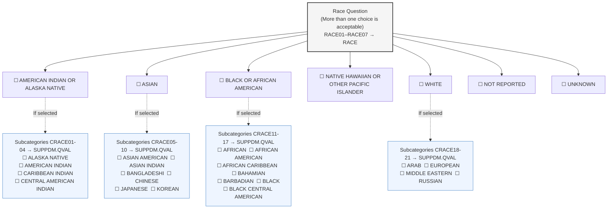
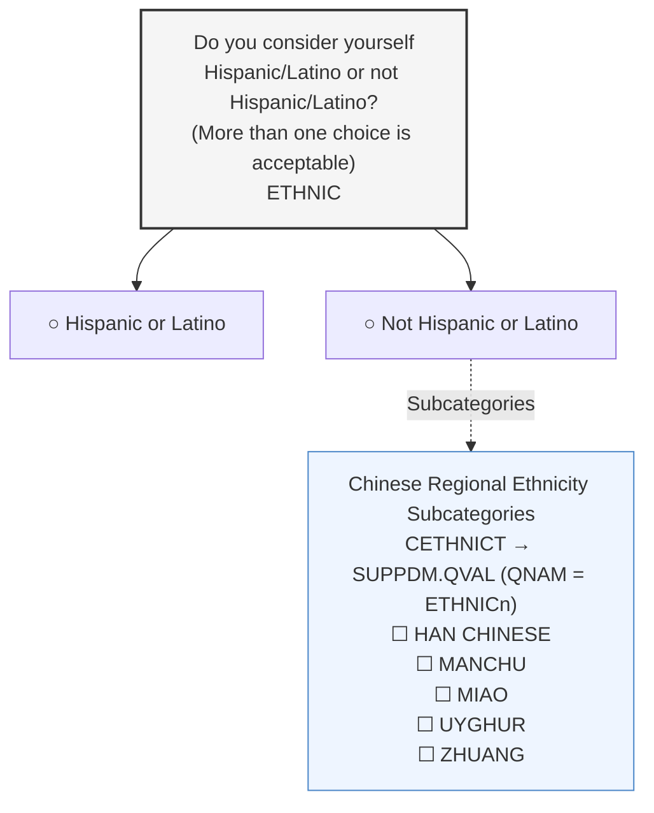
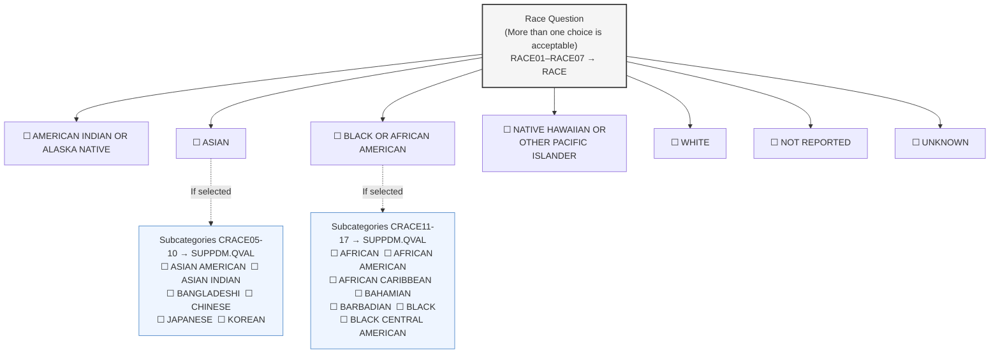
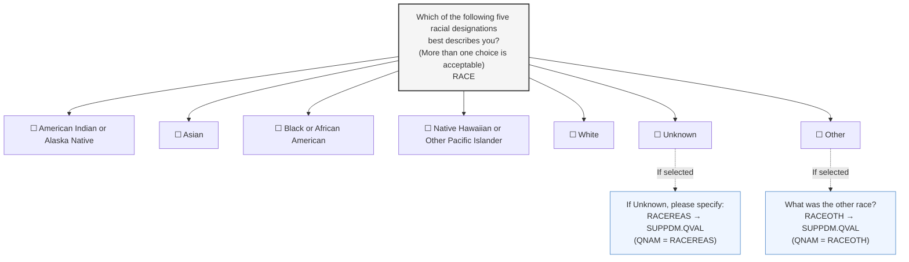

# 03_sp_demographics_subject

> **NotebookLM Source Metadata** (由 merge_sources.py 生成, 供 NotebookLM 索引 + citation 反查)
>
> - **Bucket ID**: `03`
> - **Concept**: DM (Special-Purpose) + SC (Findings, subject characteristics 归并)
> - **Merged files**: 6
> - **Words**: 10,619
> - **Chars**: 65,235
> - **Sources**:
>   - `domains/DM/spec.md`
>   - `domains/DM/assumptions.md`
>   - `domains/DM/examples.md`
>   - `domains/SC/spec.md`
>   - `domains/SC/assumptions.md`
>   - `domains/SC/examples.md`

---
## Source: `domains/DM/spec.md`

# DM — Demographics

> Class: Special-Purpose | Structure: One record per subject

### STUDYID
- **Order:** 1
- **Label:** Study Identifier
- **Type:** Char
- **Controlled Terms:** 
- **Role:** Identifier
- **Core:** Req
- **CDISC Notes:** Unique identifier for a study.

### DOMAIN
- **Order:** 2
- **Label:** Domain Abbreviation
- **Type:** Char
- **Controlled Terms:** 
- **Role:** Identifier
- **Core:** Req
- **CDISC Notes:** Two-character abbreviation for the domain.

### USUBJID
- **Order:** 3
- **Label:** Unique Subject Identifier
- **Type:** Char
- **Controlled Terms:** 
- **Role:** Identifier
- **Core:** Req
- **CDISC Notes:** Identifier used to uniquely identify a subject across all studies for all applications or submissions involving the product. This must be a unique value, and could be a compound identifier formed by concatenating STUDYID-SITEID-SUBJID.

### SUBJID
- **Order:** 4
- **Label:** Subject Identifier for the Study
- **Type:** Char
- **Controlled Terms:** 
- **Role:** Topic
- **Core:** Req
- **CDISC Notes:** Subject identifier, which must be unique within the study. Often the ID of the subject as recorded on a CRF.

### RFSTDTC
- **Order:** 5
- **Label:** Subject Reference Start Date/Time
- **Type:** DateTime
- **Controlled Terms:** ISO 8601 datetime or interval
- **Role:** Record Qualifier
- **Core:** Exp
- **CDISC Notes:** Reference start date/time for the subject in ISO 8601 character format. Usually equivalent to date/time when subject was first exposed to study treatment. See assumption 9 for additional detail on when RFSTDTC may be null.

### RFENDTC
- **Order:** 6
- **Label:** Subject Reference End Date/Time
- **Type:** DateTime
- **Controlled Terms:** ISO 8601 datetime or interval
- **Role:** Record Qualifier
- **Core:** Exp
- **CDISC Notes:** Reference end date/time for the subject in ISO 8601 character format. Usually equivalent to the date/time when subject was determined to have ended the trial, and often equivalent to date/time of last exposure to study treatment. Required for all randomized subjects; null for screen failures or unassigned subjects.

### RFXSTDTC
- **Order:** 7
- **Label:** Date/Time of First Study Treatment
- **Type:** Char
- **Controlled Terms:** ISO 8601 datetime or interval
- **Role:** Record Qualifier
- **Core:** Exp
- **CDISC Notes:** First date/time of exposure to any protocol-specified treatment or therapy, equal to the earliest value of EXSTDTC.

### RFXENDTC
- **Order:** 8
- **Label:** Date/Time of Last Study Treatment
- **Type:** Char
- **Controlled Terms:** ISO 8601 datetime or interval
- **Role:** Record Qualifier
- **Core:** Exp
- **CDISC Notes:** Last date/time of exposure to any protocol-specified treatment or therapy, equal to the latest value of EXENDTC (or the latest value of EXSTDTC if EXENDTC was not collected or is missing).

### RFCSTDTC
- **Order:** 9
- **Label:** Date/Time of First Challenge Agent Admin
- **Type:** Char
- **Controlled Terms:** ISO 8601 datetime or interval
- **Role:** Record Qualifier
- **Core:** Perm
- **CDISC Notes:** Used only when protocol specifies a challenge agent to induce a condition that the investigational treatment is intended to cure, mitigate, treat, or prevent. Equal to the earliest value of AGSTDTC for the challenge agent.

### RFCENDTC
- **Order:** 10
- **Label:** Date/Time of Last Challenge Agent Admin
- **Type:** Char
- **Controlled Terms:** ISO 8601 datetime or interval
- **Role:** Record Qualifier
- **Core:** Perm
- **CDISC Notes:** Used only when protocol specifies a challenge agent to induce a condition that the investigational treatment is intended to cure, mitigate, treat, or prevent. Equal to the latest value of AGENDTC for the challenge agent (or the latest value of AGSTDTC if AGENDTC was not collected or is missing).

### RFICDTC
- **Order:** 11
- **Label:** Date/Time of Informed Consent
- **Type:** Char
- **Controlled Terms:** ISO 8601 datetime or interval
- **Role:** Record Qualifier
- **Core:** Exp
- **CDISC Notes:** Date/time of informed consent in ISO 8601 character format. This will be the same as the date of informed consent in the Disposition domain, if that protocol milestone is documented. Would be null only in studies not collecting the date of informed consent.

### RFPENDTC
- **Order:** 12
- **Label:** Date/Time of End of Participation
- **Type:** Char
- **Controlled Terms:** ISO 8601 datetime or interval
- **Role:** Record Qualifier
- **Core:** Exp
- **CDISC Notes:** Date/time when subject ended participation or follow-up in a trial, as defined in the protocol, in ISO 8601 character format. Should correspond to the last known date of contact. Examples include completion date, withdrawal date, last follow-up, date recorded for lost to follow up, and death date.

### DTHDTC
- **Order:** 13
- **Label:** Date/Time of Death
- **Type:** Char
- **Controlled Terms:** ISO 8601 datetime or interval
- **Role:** Record Qualifier
- **Core:** Exp
- **CDISC Notes:** Date/time of death for any subject who died, in ISO 8601 format. Should represent the date/time that is captured in the clinical-trial database.

### DTHFL
- **Order:** 14
- **Label:** Subject Death Flag
- **Type:** Char
- **Controlled Terms:** C66742
- **Role:** Record Qualifier
- **Core:** Exp
- **CDISC Notes:** Indicates the subject died. Should be "Y" or null. Should be populated even when the death date is unknown.

### SITEID
- **Order:** 15
- **Label:** Study Site Identifier
- **Type:** Char
- **Controlled Terms:** 
- **Role:** Record Qualifier
- **Core:** Req
- **CDISC Notes:** Unique identifier for a site within a study.

### INVID
- **Order:** 16
- **Label:** Investigator Identifier
- **Type:** Char
- **Controlled Terms:** 
- **Role:** Record Qualifier
- **Core:** Perm
- **CDISC Notes:** An identifier to describe the Investigator for the study. May be used in addition to SITEID. Not needed if SITEID is equivalent to INVID.

### INVNAM
- **Order:** 17
- **Label:** Investigator Name
- **Type:** Char
- **Controlled Terms:** 
- **Role:** Synonym Qualifier
- **Core:** Perm
- **CDISC Notes:** Name of the investigator for a site.

### BRTHDTC
- **Order:** 18
- **Label:** Date/Time of Birth
- **Type:** Char
- **Controlled Terms:** ISO 8601 datetime or interval
- **Role:** Record Qualifier
- **Core:** Perm
- **CDISC Notes:** Date/time of birth of the subject.

### AGE
- **Order:** 19
- **Label:** Age
- **Type:** Num
- **Controlled Terms:** 
- **Role:** Record Qualifier
- **Core:** Exp
- **CDISC Notes:** Age expressed in AGEU. May be derived from RFSTDTC and BRTHDTC, but BRTHDTC may not be available in all cases (due to subject privacy concerns).

### AGEU
- **Order:** 20
- **Label:** Age Units
- **Type:** Char
- **Controlled Terms:** C66781
- **Role:** Variable Qualifier
- **Core:** Exp
- **CDISC Notes:** Units associated with AGE.

### SEX
- **Order:** 21
- **Label:** Sex
- **Type:** Char
- **Controlled Terms:** C66731
- **Role:** Record Qualifier
- **Core:** Req
- **CDISC Notes:** Sex of the subject.

### RACE
- **Order:** 22
- **Label:** Race
- **Type:** Char
- **Controlled Terms:** C74457
- **Role:** Record Qualifier
- **Core:** Exp
- **CDISC Notes:** Race of the subject. Sponsors should refer to the FDA guidance2 regarding the collection of race. See assumption below regarding RACE.

### ETHNIC
- **Order:** 23
- **Label:** Ethnicity
- **Type:** Char
- **Controlled Terms:** C66790
- **Role:** Record Qualifier
- **Core:** Perm
- **CDISC Notes:** The ethnicity of the subject. Sponsors should refer to the FDA guidance1 regarding the collection of ethnicity.

### ARMCD
- **Order:** 24
- **Label:** Planned Arm Code
- **Type:** Char
- **Controlled Terms:** 
- **Role:** Record Qualifier
- **Core:** Exp
- **CDISC Notes:** ARMCD is limited to 20 characters. It is not subject to the character restrictions that apply to TESTCD. The maximum length of ARMCD is longer than for other "short" variables to accommodate the kind of values that are likely to be needed for crossover trials. For example, if ARMCD values for a 7-period crossover were constructed using 2-character abbreviations for each treatment and separating hyphens, the length of ARMCD values would be 20. If the subject was not assigned to a trial arm, ARMCD is null and ARMNRS is populated.  With the exception of studies which use multistage arm assignments, must be a value of ARMCD in the Trial Arms dataset.

### ARM
- **Order:** 25
- **Label:** Description of Planned Arm
- **Type:** Char
- **Controlled Terms:** 
- **Role:** Synonym Qualifier
- **Core:** Exp
- **CDISC Notes:** Name of the arm to which the subject was assigned. If the subject was not assigned to an arm, ARM is null and ARMNRS is populated.  With the exception of studies which use multistage arm assignments, must be a value of ARM in the Trial Arms dataset.

### ACTARMCD
- **Order:** 26
- **Label:** Actual Arm Code
- **Type:** Char
- **Controlled Terms:** 
- **Role:** Record Qualifier
- **Core:** Exp
- **CDISC Notes:** Code of actual arm. ACTARMCD is limited to 20 characters. It is not subject to the character restrictions that apply to TESTCD. The maximum length of ACTARMCD is longer than for other short variables to accommodate the kind of values that are likely to be needed for crossover trials.  With the exception of studies which use multistage arm assignments, must be a value of ARMCD in the Trial Arms dataset.  If the subject was not assigned to an arm or followed a course not described by any planned arm, ACTARMCD is null and ARMNRS is populated.

### ACTARM
- **Order:** 27
- **Label:** Description of Actual Arm
- **Type:** Char
- **Controlled Terms:** 
- **Role:** Synonym Qualifier
- **Core:** Exp
- **CDISC Notes:** Description of actual arm.  With the exception of studies which use multistage arm assignments, must be a value of ARM in the Trial Arms dataset.  If the subject was not assigned to an arm or followed a course not described by any planned arm, ACTARM is null and ARMNRS is populated.

### ARMNRS
- **Order:** 28
- **Label:** Reason Arm and/or Actual Arm is Null
- **Type:** Char
- **Controlled Terms:** C142179
- **Role:** Record Qualifier
- **Core:** Exp
- **CDISC Notes:** A coded reason that arm variables (ARM and ARMCD) and/or actual arm variables (ACTARM and ACTARMCD) are null. Examples: "SCREEN FAILURE", "NOT ASSIGNED", "ASSIGNED, NOT TREATED", "UNPLANNED TREATMENT". It is assumed that if the arm and actual arm variables are null, the same reason applies to both arm and actual arm.

### ACTARMUD
- **Order:** 29
- **Label:** Description of Unplanned Actual Arm
- **Type:** Char
- **Controlled Terms:** 
- **Role:** Record Qualifier
- **Core:** Exp
- **CDISC Notes:** A description of actual treatment for a subject who did not receive treatment described in a planned trial arm.

### COUNTRY
- **Order:** 30
- **Label:** Country
- **Type:** Char
- **Controlled Terms:** 
- **Role:** Record Qualifier
- **Core:** Req
- **CDISC Notes:** Country of the investigational site in which the subject participated in the trial.   Generally represented using ISO 3166-1 Alpha-3. Note that regulatory agency specific requirements (e.g., US FDA) may require other terminologies; in such cases, follow regulatory requirements.

### DMDTC
- **Order:** 31
- **Label:** Date/Time of Collection
- **Type:** Char
- **Controlled Terms:** ISO 8601 datetime or interval
- **Role:** Timing
- **Core:** Perm
- **CDISC Notes:** Date/time of demographic data collection.

### DMDY
- **Order:** 32
- **Label:** Study Day of Collection
- **Type:** Num
- **Controlled Terms:** 
- **Role:** Timing
- **Core:** Perm
- **CDISC Notes:** Study day of collection measured as integer days.
---

## Cross References

### Controlled Terminology
- [Arm Null Reason (C142179)](../../terminology/core/dm.md) — ARMNRS
- [Sex (C66731)](../../terminology/core/dm.md) — SEX
- [No Yes Response (C66742)](../../terminology/core/general_part4.md) — DTHFL
- [Age Unit (C66781)](../../terminology/core/dm.md) — AGEU
- [Ethnic Group (C66790)](../../terminology/core/dm.md) — ETHNIC
- [Race (C74457)](../../terminology/core/dm.md) — RACE

### Related Domains
- **Same class (Special-Purpose):** CO, SE, SM, SV

### General References
- [General Assumptions (Ch4)](../../chapters/ch04_general_assumptions.md) — variable naming, coding, timing rules
- [Relationships (Ch8)](../../chapters/ch08_relationships.md) — RELREC, SUPPQUAL usage
- [Variable Index](../../VARIABLE_INDEX.md) — reverse lookup by variable name

### Model Definition
- [Special-Purpose class definition](../../model/03_special_purpose_domains.md)

## Source: `domains/DM/assumptions.md`

# DM — Assumptions

1. Investigator and site identification: Companies use different methods to distinguish sites and investigators. CDISC assumes that SITEID will always be present, with INVID and INVNAM used as necessary. This should be done consistently and the meaning of the variable made clear in the Define-XML document.

2. Every subject in a study must have a subject identifier (SUBJID). In some cases a subject may participate in more than 1 study. To identify a subject uniquely across all studies for all applications or submissions involving the product, a unique identifier (USUBJID) must be included in all datasets. Subjects occasionally change sites during the course of a clinical trial. Sponsors must decide how to populate variables such as USUBJID, SUBJID and SITEID based on their operational and analysis needs, but only 1 DM record should be submitted for each subject. The Supplemental Qualifiers dataset may be used if appropriate to provide additional information.

3. Concerns for subject privacy suggest caution regarding the collection of variables like BRTHDTC. This variable is included in the Demographics model in the event that a sponsor intends to submit it; however, sponsors should follow regulatory guidelines and guidance as appropriate.

4. With the exception of trials that use multistage processes to assign subjects to arms as described below, ARM and ACTARM must be populated with ARM values from the Trial Arms (TA) dataset and ARMCD and ACTARMCD must be populated with ARMCD values from the TA dataset or be null. The ARM and ARMCD values in the TA dataset have a one-to-one relationship, and that one-to-one relationship must be preserved in the values used to populate ARM and ARMCD in DM, and to populate the values of ACTARM and ACTARMCD in DM.
   a. Rules for the arm-related variables:
      i. If ARMCD is null, then ARM must be null and ARMNRS must be populated with the reason ARMCD is null.
      ii. If ACTARMCD is null, then ACTARM must be null and ARMNRS must be populated with the reason ACTARMCD is null. Both ARMCD and ACTARMCD will be null for subjects who were not assigned to treatment. The same reason will provide the reason that both are null.
      iii. ARMNRS may not be populated if both ARMCD and ACTARMCD are populated. ARMCD and ACTARMCD will be populated if the subject was assigned to an arm and received treatment consistent with 1 of the arms in the TA dataset. If ARMCD and ACTARMCD are not the same, that is sufficient to explain the situation; ARMNRS should not be populated.
      iv. If ARMNRS is populated with "UNPLANNED TREATMENT", ACTARMUD should be populated with a description of the unplanned treatment received.
   b. Multistage assignment to treatment: Some trials use a multistage process for assigning a subject to an arm (see Section 7.2.1, Trial Arms, Example Trial 3). In such a case, best practice is to create ARMCD values composed of codes representing the results of the multiple stages of the treatment assignment process. If a subject is partially assigned, then truncated codes representing the stages completed can be used in ARMCD, and similar truncated codes can be used in ACTARMCD. The descriptions used to populate ARM and ACTARM should be similarly truncated, and the one-to-one relationship between these truncated codes should be maintained for all affected subjects in the trial. Example 3 below provides an example of this situation; see also Section 5.3, Subject Elements, Example 2. Note that this use of values not in the TA dataset is allowable only for trials with multistage assignment to arms and to subjects in those trials who do not complete all stages of the assignment.
   c. Examples illustrating the arm-related variables
      i. Example 1 below shows how to handle a subject who was a screen failure and was never treated.
      ii. The Subject Elements (SE) dataset records the series of elements a subject passed through in the course of a trial, and these determine the value of ACTARMCD. The following examples include sample data for both datasets to illustrate this relationship.
         1. Example 2 below shows how subjects who started the trial but were never assigned to an arm would be handled.
         2. Section 5.3, Subject Elements, Example 1 illustrates a situation for a subject who received a treatment that was not the one to which they were assigned.
         3. Section 5.3, Subject Elements, Example 2 illustrates a situation in which a subject received a set of treatments different from that for any of the planned arms.

5. Study population flags should not be included in SDTM data. The standard supplemental qualifiers included in previous versions of the SDTMIG (COMPLT, FULLSET, ITT, PPROT, SAFETY) should not be used. Note: The ADaM Subject-level Analysis Dataset (ADSL) specifies standard variable names for the most common populations and requires the inclusion of these flags when necessary for analysis; consult the ADaMIG for more information about these variables.

6. Submission of multiple race responses should be represented in the Demographics (DM) domain and Supplemental Qualifiers (SUPPDM) dataset as described in Section 4.2.8.3, Multiple Values for a Non-result Qualifier Variable. If multiple races are collected, then the value of RACE should be "MULTIPLE" and the additional information will be included in the Supplemental Qualifiers dataset. Controlled terminology for RACE should be used in both DM and SUPPDM so that consistent values are available for summaries regardless of whether the data are found in a column or row. If multiple races were collected and 1 was designated as primary, RACE in DM should be the primary race and additional races should be reported in SUPPDM. When additional free-text information is reported about subject's race using "Other, Specify", sponsors should refer to Section 4.2.7.1, "Specify" Values for Non-Result Qualifier Variables. If race was collected via an "Other, Specify" field and the sponsor chooses not to map the value as described in the current FDA guidance (see CDISC Notes for RACE in the domain specification), then the value of RACE should be "OTHER". For subjects who refuse to provide or do not know their race information, the value of RACE could be "UNKNOWN". See DM Example 4, DM Example 5, DM Example 6, and DM Example 7.
   a. The Racec-Ethnicc Codetable (available at https://www.cdisc.org/standards/terminology/controlled-terminology) represents associations between collected race values and published race Controlled Terminology, as well as collected ethnicity values and published ethnicity Controlled Terminology.

7. RFSTDTC, RFENDTC, RFXSTDTC, RFXENDTC, RFCSTDTC, RFCENDTC, RFICDTC, RFPENDTC, DTHDTC, and BRTHDTC represent date/time values, but they are considered to have a record qualifier role in DM. They are not considered to be timing variables because they are not intended for use in the general observation classes.

8. Additional permissible identifier, qualifier, and timing variables:
   a. Only the following timing variables are permissible and may be added as appropriate: VISITNUM, VISIT, VISITDY. The record qualifier DMXFN (External File Name) is the only additional qualifier variable that may be added, which is adopted from the Findings general observation class, may also be used to refer to an external file, such as a patient narrative.
   b. The order of these additional variables within the domain should follow the rules as described in Section 4.1.4, Order of the Variables, and the order described in Section 4.2, General Variable Assumptions.

9. As described in Section 4.1.4, Order of the Variables, RFSTDTC is used to calculate study day variables. RFSTDTC is usually defined as the date/time when a subject was first exposed to study drug. This definition applies for most interventional studies, when the start of treatment is the natural and preferred starting point for study day variables and thus the logical value for RFSTDTC. In such studies, when data are submitted for subjects who are ineligible for treatment (e.g., screen failures with ARMNRS = "SCREEN FAILURE"), subjects who were enrolled but not assigned to an arm (e.g., ARMNRS = "NOT ASSIGNED"), or subjects who were randomized but not treated (e.g., ARMNRS = "NOT TREATED"), RFSTDTC will be null. For studies with designs that include a substantial portion of subjects who are not expected to be treated, a different protocol milestone may be chosen as the starting point for study day variables. Some examples include non-interventional or observational studies, studies with a no-treatment arm, and studies where there is a delay between randomization and treatment.

10. The DM domain contains several pairs of reference period variables: RFSTDTC and RFENDTC, RFXSTDTC and RFXENDTC, RFCSTDTC and RFCENDTC, and RFICDTC and RFPENDTC. There are 4 sets of reference variables to accommodate distinct reference-period definitions and there are instances when the values of the variables may be exactly the same, particularly with RFSTDTC-RFENDTC and RFXSTDTC-RFXENDTC.
    a. RFSTDTC and RFENDTC: This pair of variables is sponsor-defined, but usually represents the date/time of first and last study exposure. However, there are certain study designs where the start of the reference period is defined differently, such as studies that have a washout period before randomization or have a medical procedure required during screening (e.g., biopsy). In these cases, RFSTDTC may be the enrollment date, which is prior to first dose. Because study day values are calculated using RFSTDTC, in this case study days would not be based on the date of first dose.
    b. RFXSTDTC and RFXENDTC: This pair of variables defines a consistent reference period for all interventional studies and is not open to customization. RFXSTDTC and RFXENDTC always represent the date/time of first and last study exposure. The study reference period often duplicates the reference period defined in RFSTDTC and RFENDTC, but not always. Therefore, this pair of variables is important as they guarantee that a reviewer will always be able to reference the first and last study exposure reference period. RFXSTDTC should be the same as SESTDTC for the first treatment element described in the SE dataset. RFXENDTC may often be the same as the SEENDTC for the last treatment element described in the SE dataset.
    c. RFCSTDTC and RFCENDTC: This pair of variables is used only when the study uses a protocol-specified challenge agent to induce a condition that the investigational treatment is intended to cure, mitigate, treat, or prevent. RFCSTDTC and RFCENDTC always represent the date/time of first and last exposure to the challenge agent.
    d. RFICDTC and RFPENDTC: The definitions of this pair of variables are consistent in every study in which they are used: They represent the entire period of a subject's involvement in a study, from providing informed consent through the last participation event or activity. There may be times when this period coincides with other reference periods but that is unusual. An example of when these periods might coincide with the study reference period, RFSTDTC to RFENDTC, might be an observational trial where no study intervention is administered. RFICDTC should correspond to the date of the informed consent protocol milestone in Disposition (DS), if that protocol milestone is documented in DS. In the event that there are multiple informed consents, this will be the date of the first. RFPENDTC will be the last date of participation for a subject for data included in a submission. This should be the last date of any record for the subject in the database at the time it is locked for submission. As such, it may not be the last date of participation in the study if the submission includes interim data.

## Source: `domains/DM/examples.md`

# DM — Examples

## Example 1

**dm.xpt**

| Row | STUDYID | DOMAIN | USUBJID | SUBJID | RFSTDTC | RFENDTC | RFXSTDTC | RFXENDTC | RFICDTC | RFPENDTC | SITEID | INVNAM | BRTHDTC | AGE | AGEU | SEX | RACE | ETHNIC | ARMCD | ARM | ACTARMCD | ACTARM | ARMNRS | ACTARMUD | COUNTRY |
|-----|---------|--------|---------|--------|---------|---------|----------|----------|---------|----------|--------|--------|---------|-----|------|-----|------|--------|-------|-----|----------|--------|--------|----------|---------|
| 1 | ABC123 | DM | ABC12301001 | 01001 | 2006-01-12 | 2006-03-10 | 2006-01-12 | 2006-03-10 | 2006-01-03 | 2006-04-01 | 01 | JOHNSON, M | 1948-12-13 | 57 | YEARS | M | WHITE | HISPANIC OR LATINO | A | Drug A | A | Drug A | | | USA |
| 2 | ABC123 | DM | ABC12301002 | 01002 | 2006-01-15 | 2006-02-28 | 2006-01-15 | 2006-02-28 | 2006-01-04 | 2006-03-26 | 01 | JOHNSON, M | 1955-03-22 | 50 | YEARS | M | WHITE | NOT HISPANIC OR LATINO | P | Placebo | P | Placebo | | | USA |
| 3 | ABC123 | DM | ABC12301003 | 01003 | 2006-01-16 | 2006-03-19 | 2006-01-18 | 2006-03-19 | 2006-01-02 | 2006-03-19 | 01 | JOHNSON, M | 1938-01-19 | 68 | YEARS | F | BLACK OR AFRICAN AMERICAN | NOT HISPANIC OR LATINO | P | Placebo | P | Placebo | | | USA |
| 4 | ABC123 | DM | ABC12301004 | 01004 | | | | | 2006-01-07 | 2006-01-08 | 01 | JOHNSON, M | 1941-07-02 | | M | ASIAN | NOT HISPANIC OR LATINO | | | | | SCREEN FAILURE | | USA |
| 5 | ABC123 | DM | ABC12302001 | 02001 | 2006-02-02 | 2006-03-31 | 2006-02-02 | 2006-03-31 | 2006-01-15 | 2006-04-12 | 02 | GONZALEZ, E | 1950-06-23 | 55 | YEARS | F | AMERICAN INDIAN OR ALASKA NATIVE | NOT HISPANIC OR LATINO | P | Placebo | P | Placebo | | | USA |
| 6 | ABC123 | DM | ABC12302002 | 02002 | 2006-02-03 | 2006-04-05 | 2006-02-03 | 2006-04-05 | 2006-01-10 | 2006-04-25 | 02 | GONZALEZ, E | 1956-05-05 | 49 | YEARS | F | NATIVE HAWAIIAN OR OTHER PACIFIC ISLANDERS | NOT HISPANIC OR LATINO | A | Drug A | A | Drug A | | | USA |

## Example 2

This example Demographics dataset does not include all the DM required and expected variables, only those that illustrate the variables that represent arm information. The following example illustrates values of ARMCD for subjects in Example Trial 1, described in Section 7.2.1, Trial Arms. This study included 2 elements, screen and run-in, before subjects were randomized to treatment. For this study, the sponsor submitted data on all subjects, including screen-failure subjects.

**Row 1:** Subject 001 was randomized to arm "Drug A". As shown in the SE dataset, this subject completed the "Drug A" element, so their actual arm was also "Drug A".

**Row 2:** Subject 002 was randomized to arm "Drug B". As shown in the SE dataset, their actual arm was consistent with their randomization.

**Row 3:** Subject 003 was a screen failure, so they were not assigned to an arm or treated. The arm actual arm variables are null, and ARMNRS="SCREEN FAILURE".

**Row 4:** Subject 004 withdrew during the run-in element. Like subject 003, they were not assigned to an arm or treated. However, they were not considered a screen failure, and ARMNRS="NOT ASSIGNED".

**Row 5:** Subject 005 was randomized but dropped out before being treated. Thus, the actual arm variables are not populated and ARMNRS="ASSIGNED, NOT TREATED".

**dm.xpt**

| Row | STUDYID | DOMAIN | USUBJID | ARMCD | ARM | ACTARMCD | ACTARM | ARMNRS | ACTARMUD |
|-----|---------|--------|---------|-------|-----|----------|--------|--------|----------|
| 1 | ABC | DM | 001 | A | Drug A | A | Drug A | | |
| 2 | ABC | DM | 002 | B | Drug B | B | Drug B | | |
| 3 | ABC | DM | 003 | | | | | SCREEN FAILURE | |
| 4 | ABC | DM | 004 | | | | | NOT ASSIGNED | |
| 5 | ABC | DM | 005 | A | Drug A | | | ASSIGNED, NOT TREATED | |

**Rows 1-3:** Subject 001 completed all the elements for arm A.

**Rows 4-6:** Subject 002 completed all the elements for arm B.

**Row 7:** Subject 003 was a screen failure, who participated only in the "Screen" element.

**Rows 8-9:** Subject 004 withdrew during the "Run-in" element, before they could be randomized.

**Rows 10-11:** Subject 005 withdrew after they were randomized, but did not start treatment.

**se.xpt**

| Row | STUDYID | DOMAIN | USUBJID | SESEQ | ETCD | ELEMENT | SESTDTC | SEENDTC |
|-----|---------|--------|---------|-------|------|---------|---------|---------|
| 1 | ABC | SE | 001 | 1 | SCRN | Screen | 2006-06-01 | 2006-06-07 |
| 2 | ABC | SE | 001 | 2 | RI | Run-In | 2006-06-07 | 2006-06-21 |
| 3 | ABC | SE | 001 | 3 | A | Drug A | 2006-06-21 | 2006-07-05 |
| 4 | ABC | SE | 002 | 1 | SCRN | Screen | 2006-05-03 | 2006-05-10 |
| 5 | ABC | SE | 002 | 2 | RI | Run-In | 2006-05-10 | 2006-05-24 |
| 6 | ABC | SE | 002 | 3 | B | Drug B | 2006-05-24 | 2006-06-07 |
| 7 | ABC | SE | 003 | 1 | SCRN | Screen | 2006-06-27 | 2006-06-30 |
| 8 | ABC | SE | 004 | 1 | SCRN | Screen | 2006-05-14 | 2006-05-21 |
| 9 | ABC | SE | 004 | 2 | RI | Run-In | 2006-05-21 | 2006-05-26 |
| 10 | ABC | SE | 005 | 1 | SCRN | Screen | 2006-05-14 | 2006-05-21 |
| 11 | ABC | SE | 005 | 2 | RI | Run-In | 2006-05-21 | 2006-05-26 |

## Example 3

**Row 1:** Subject 001 was randomized to drug A. At the end of the double-blind treatment epoch, they were assigned to open label A; thus, their ARMCD is "AA". They received the treatment to which they were assigned, so ACTRMCD is also "AA".

**Row 2:** Subject 002 was randomized to drug A. They were lost to follow-up during the double-blind treatment epoch, so never reached the open label epoch, when they would have been assigned to either drug A or the rescue element. Their ARMCD is "A". This case illustrates the exception to the rule that ARMCD, ARM, ACTARMCD, and ACTARM must be populated with values from the TA dataset.

**Row 3:** Subject "003" was randomized to drug A, but received drug B. At the end of the double-blind treatment epoch, they were assigned to rescue treatment. ARMCD shows the result of their assignments, "AR"; ACTARMCD shows their actual treatment, "BR".

**dm.xpt**

| Row | STUDYID | DOMAIN | USUBJID | ARMCD | ARM | ACTARMCD | ACTARM | ARMNRS | ACTARMUD |
|-----|---------|--------|---------|-------|-----|----------|--------|--------|----------|
| 1 | DEF | DM | 001 | AA | A-OPEN A | AA | A-OPEN A | | |
| 2 | DEF | DM | 002 | A | A | A | A | | |
| 3 | DEF | DM | 003 | AR | A-RESCUE | BR | B-RESCUE | | |

The following example illustrates values of ARMCD for subjects in Example Trial 3, described in Section 7.2.1, Trial Arms.

**Rows 1-3:** Show that the subject passed through all 3 elements for the AA arm.

**Rows 4-5:** Show the 2 elements ("Screen" and "Treatment A") the subject passed through.

**Rows 6-8:** Show that the subject passed through the 3 elements associated with the "B-Rescue" arm.

**se.xpt**

| Row | STUDYID | DOMAIN | USUBJID | SESEQ | ETCD | ELEMENT | SESTDTC | SEENDTC |
|-----|---------|--------|---------|-------|------|---------|---------|---------|
| 1 | DEF | SE | 001 | 1 | SCRN | Screen | 2006-01-07 | 2006-01-12 |
| 2 | DEF | SE | 001 | 2 | DBA | Treatment A | 2006-01-12 | 2006-04-10 |
| 3 | DEF | SE | 001 | 3 | OA | Open Drug A | 2006-04-10 | 2006-07-05 |
| 4 | DEF | SE | 002 | 1 | SCRN | Screen | 2006-02-03 | 2006-02-10 |
| 5 | DEF | SE | 002 | 2 | DBA | Treatment A | 2006-02-10 | 2006-03-24 |
| 6 | DEF | SE | 003 | 1 | SCRN | Screen | 2006-02-22 | 2006-03-01 |
| 7 | DEF | SE | 003 | 2 | DBB | Treatment B | 2006-03-01 | 2006-06-27 |
| 8 | DEF | SE | 003 | 3 | RSC | Rescue | 2006-06-27 | 2006-09-24 |

## Example 4

The CRF in this example is annotated to show the CDASH variable name and the target SDTMIG variable. Data that are collected using the same variable name as defined in the SDTMIG are in RED. If the CDASHIG variable differs from the one defined in the SDTMIG, the CDASHIG variable is in GREY.

See the CDASH Model and Implementation Guide for additional information: https://www.cdisc.org/standards/foundational/cdash.

This example shows multiple race categories and subcategories. Only a subset of options is shown for this instrument due to space constraints.

**Demographics Sample aCRF for Race with Additional Granularity**

> Variable annotation: CDASHIG variables (RACE01–RACE07, CRACE01–CRACE21) in grey; SDTMIG target variable (RACE) in red.

The CRF presents 7 race questions (RACE01-RACE07) with checkbox options:
- RACE01: AMERICAN INDIAN OR ALASKA NATIVE
- RACE02: ASIAN
- RACE03: BLACK OR AFRICAN AMERICAN
- RACE04: NATIVE HAWAIIAN OR OTHER PACIFIC ISLANDER
- RACE05: WHITE
- RACE06: NOT REPORTED
- RACE07: UNKNOWN

If the study participant answered AMERICAN INDIAN OR ALASKA NATIVE, subcategories (CRACE01-CRACE04) from the RACEC codelist are presented: ALASKA NATIVE, AMERICAN INDIAN, CARIBBEAN INDIAN, CENTRAL AMERICAN INDIAN.

If the study participant answered ASIAN, subcategories (CRACE05-CRACE10) are presented: ASIAN AMERICAN, ASIAN INDIAN, BANGLADESHI, CHINESE, JAPANESE, KOREAN.

If the study participant answered BLACK OR AFRICAN AMERICAN, subcategories (CRACE11-CRACE17) are presented: AFRICAN, AFRICAN AMERICAN, AFRICAN CARIBBEAN, BAHAMIAN, BARBADIAN, BLACK, BLACK CENTRAL AMERICAN.

If the study participant answered WHITE, subcategories (CRACE18-CRACE21) are presented: ARAB, EUROPEAN, MIDDLE EASTERN, RUSSIAN.

**CRF Metadata**

| CDASH Variable | Order | Question Text | Prompt | CRF Completion Instructions | Type | SDTMIG Target Variable | SDTM Target Mapping | Controlled Terminology Code List Name | Permissible Values | Pre-specified Value | Query Display | List Style | Hidden |
|---|---|---|---|---|---|---|---|---|---|---|---|---|---|
| RACE01 | 1 | Which of the following racial designations best describes you? (More than one choice is acceptable.) | Race | Study participants should self-report race, with race being asked about after ethnicity. | Text | RACE | | (RACE) | AMERICAN INDIAN OR ALASKA NATIVE | | | checkbox | |
| RACE02 | 2 | (same) | Race | (same) | Text | RACE | | (RACE) | ASIAN | | | checkbox | |
| RACE03 | 3 | (same) | Race | (same) | Text | RACE | | (RACE) | BLACK OR AFRICAN AMERICAN | | | checkbox | |
| RACE04 | 4 | (same) | Race | (same) | Text | RACE | | (RACE) | NATIVE HAWAIIAN OR OTHER PACIFIC ISLANDER | | | checkbox | |
| RACE05 | 5 | (same) | Race | (same) | Text | RACE | | (RACE) | WHITE | | | checkbox | |
| RACE06 | 6 | (same) | Race | (same) | Text | RACE | | (RACE) | NOT REPORTED | | | checkbox | |
| RACE07 | 7 | (same) | Race | (same) | Text | RACE | | (RACE) | UNKNOWN | | | checkbox | |
| CRACE01-CRACE04 | 10 | (same) | Race | Select each value that applies if the subject answered "AMERICAN INDIAN OR ALASKA NATIVE". Check all that apply. | Text | SUPPDM.QVAL | For each value that applies, SUPPDM.QVAL where SUPPDM.QNAM ="CRACEn" and SUPPDM.QLABEL = "Collected Race n" where n is the choice value. | (RACEC) | ALASKA NATIVE; AMERICAN INDIAN; CARIBBEAN INDIAN; CENTRAL AMERICAN INDIAN | | | checkbox | |
| CRACE05-CRACE10 | 11 | (same) | Race | Select each value that applies if the subject answered "ASIAN". Check all that apply. | Text | SUPPDM.QVAL | For each value that applies, SUPPDM.QVAL where SUPPDM.QNAM ="CRACEn" and SUPPDM.QLABEL = "Collected Race n" where n is the choice value. | (RACEC) | ASIAN AMERICAN; ASIAN INDIAN; BANGLADESHI; CHINESE; JAPANESE; KOREAN | | | checkbox | CRACE05-CRACE10 |
| CRACE11-CRACE17 | 12 | (same) | Race | Select each value that applies if the subject answered "BLACK OR AFRICAN AMERICAN". Check all that apply. | Text | SUPPDM.QVAL | For each value that applies, SUPPDM.QVAL where SUPPDM.QNAM ="CRACEn" and SUPPDM.QLABEL = "Collected Race n" where n is the choice value. | (RACEC) | AFRICAN; AFRICAN AMERICAN; AFRICAN CARIBBEAN; BAHAMIAN; BARBADIAN; BLACK; BLACK CENTRAL AMERICAN | | | checkbox | |
| CRACE18-CRACE21 | 13 | (same) | Race | Select each value that applies if the subject answered "WHITE". Check all that apply. | Text | SUPPDM.QVAL | For each value that applies, SUPPDM.QVAL where SUPPDM.QNAM ="CRACEn" and SUPPDM.QLABEL = "Collected Race n" where n is the choice value. | (RACEC) | ARAB; EUROPEAN; MIDDLE EASTERN; RUSSIAN | | | checkbox | |

The value of RACE is used to represent the high-level racial designation as a single collected value per CDISC Controlled Terminology in dm.xpt. When more than 1 choice is selected, the value is represented with "MULTIPLE" as shown in this example. **Note:** Only those variables relevant to this example are shown.

**Row 1:** Shows that USUBJID ABC789-010-045 designated 1 race, "WHITE", as the value that best describes their race.

**Row 2:** Shows that USUBJID ABC789-010-046 designated 1 race, "ASIAN", as the value that best describes their race.

**Row 3:** Shows that USUBJID ABC789-010-047 designated multiple races as the values that best describe their race. "MULTIPLE" is assigned in RACE.

**dm.xpt**

| Row | STUDYID | DOMAIN | USUBJID | SUBJID | RACE |
|-----|---------|--------|---------|--------|------|
| 1 | ABC789 | DM | ABC789-010-045 | 010-045 | WHITE |
| 2 | ABC789 | DM | ABC789-010-046 | 010-046 | ASIAN |
| 3 | ABC789 | DM | ABC789-010-047 | 010-047 | MULTIPLE |

When a subject selects multiple race values, as USUBJID ABC789-010-047 did, the values selected are represented in SUPPDM. Collected race, which is the specific race subcategory (or subcategories) selected by each subject, is represented in SUPPDM to ensure subject self-identification and/or country-specific requirements are available for reference. CDASH recommended QNAM-QLABEL values have been provided.

**Rows 1, 2:** Show that USUBJID ABC789-010-047 selected 2 RACE values, "ASIAN" and "WHITE". CDASH recommended QNAM-QLABEL values have been provided.

**Rows 3-5:** Show that USUBJID ABC789-010-047 selected 3 collected race (CRACE) values, "CHINESE", "KOREAN", and "RUSSIAN". CDASH recommended QNAM-QLABEL values have been provided.

**suppdm.xpt**

| Row | STUDYID | RDOMAIN | USUBJID | IDVAR | IDVARVAL | QNAM | QLABEL | QVAL | QORIG | QEVAL |
|-----|---------|---------|---------|-------|----------|------|--------|------|-------|-------|
| 1 | ABC789 | DM | ABC789-010-047 | | | RACE2 | Race 2 | ASIAN | CRF | |
| 2 | ABC789 | DM | ABC789-010-047 | | | RACE5 | Race 5 | WHITE | CRF | |
| 3 | ABC789 | DM | ABC789-010-047 | | | CRACE8 | Collected Race 8 | CHINESE | CRF | |
| 4 | ABC789 | DM | ABC789-010-047 | | | CRACE10 | Collected Race 10 | KOREAN | CRF | |
| 5 | ABC789 | DM | ABC789-010-047 | | | CRACE21 | Collected Race 21 | RUSSIAN | CRF | |

## Example 5

This example shows different Chinese regional ethnicity subcategorizations (majority and minority).

**CRF Mock Example**

The CRF collects ETHNIC (Hispanic or Latino / Not Hispanic or Latino) with subcategories for Chinese regional ethnicity: HAN CHINESE, MANCHU, MIAO, UYGHUR, ZHUANG.

In this CRF example, subcategorizations of ethnicity are made available.

RACE is identified as "ASIAN" and ETHNIC as "NOT HISPANIC OR LATINO".

**dm.xpt**

| Row | STUDYID | DOMAIN | USUBJID | SUBJID | AGE | AGEU | SEX | RACE | ETHNIC |
|-----|---------|--------|---------|--------|-----|------|-----|------|--------|
| 1 | ABC789 | DM | ABC789-010-045 | 010-045 | 20 | YEARS | M | ASIAN | NOT HISPANIC OR LATINO |
| 2 | ABC789 | DM | ABC789-010-047 | 010-047 | 24 | YEARS | F | ASIAN | NOT HISPANIC OR LATINO |

**Row 1:** Ethnicity subcategorization of subject self-identification being "HAN CHINESE". CDASH recommended QNAM-QLABEL values have been provided.

**Rows 2-3:** Ethnicity subcategorization of subject self-identification being "MIAO" and "ZHUANG". CDASH recommended QNAM-QLABEL values have been provided.

**suppdm.xpt**

| Row | STUDYID | RDOMAIN | USUBJID | IDVAR | IDVARVAL | QNAM | QLABEL | QVAL | QORIG | QEVAL |
|-----|---------|---------|---------|-------|----------|------|--------|------|-------|-------|
| 1 | ABC789 | DM | ABC789-010-045 | | | ETHNIC1 | Collected Ethnicity 1 | HAN CHINESE | CRF | |
| 2 | ABC789 | DM | ABC789-010-047 | | | ETHNIC1 | Collected Ethnicity 1 | MIAO | CRF | |
| 3 | ABC789 | DM | ABC789-010-047 | | | ETHNIC2 | Collected Ethnicity 2 | ZHUANG | CRF | |

## Example 6

The CRF in this example is annotated to show the CDASH variable name and the target SDTMIG variable. Data that are collected using the same variable name as defined in the SDTMIG are in RED. If the CDASHIG variable differs from the one defined in the SDTMIG, the CDASHIG variable is in GREY.

See the CDASH Model and Implementation Guide for additional information: https://www.cdisc.org/standards/foundational/cdash.

This example shows race categories and subcategories. Only a subset of options are shown for this instrument due to space constraints. For a complete aCRF example see the CDASHIG v2.1, Section 7.3.

**Demographics Sample aCRF for Race with Additional Granularity**

> Variable annotation: CDASHIG variables (RACE01–RACE07, CRACE05–CRACE17) in grey; SDTMIG target variable (RACE) in red.

The CRF presents 7 race questions (RACE01-RACE07) with the same structure as Example 4, plus subcategory questions for ASIAN (CRACE05-CRACE10), BLACK OR AFRICAN AMERICAN (CRACE11-CRACE17), and other categories.

**CRF Metadata**

| CDASH Variable | Order | Question Text | Prompt | CRF Completion Instructions | Type | SDTMIG Target Variable | SDTM Target Mapping | Controlled Terminology Code List Name | Permissible Values | Pre-specified Value | Query Display | List Style | Hidden |
|---|---|---|---|---|---|---|---|---|---|---|---|---|---|
| RACE01 | 3 | Which of the following racial designations best describes you? (More than one choice is acceptable.) | Race | Study participants should self-report race, with race being asked about after ethnicity. | Text | RACE | | (RACE) | AMERICAN INDIAN OR ALASKA NATIVE | | | checkbox | |
| RACE02 | 4 | (same) | Race | (same) | Text | RACE | | (RACE) | ASIAN | | | checkbox | |
| RACE03 | 5 | (same) | Race | (same) | Text | RACE | | (RACE) | BLACK OR AFRICAN AMERICAN | | | checkbox | |
| RACE04 | 6 | (same) | Race | (same) | Text | RACE | | (RACE) | NATIVE HAWAIIAN OR OTHER PACIFIC ISLANDER | | | checkbox | |
| RACE05 | 7 | (same) | Race | (same) | Text | RACE | | (RACE) | WHITE | | | checkbox | |
| RACE06 | 8 | (same) | Race | (same) | Text | RACE | | (RACE) | NOT REPORTED | | | checkbox | |
| RACE07 | 9 | (same) | Race | (same) | Text | RACE | | (RACE) | UNKNOWN | | | checkbox | |
| CRACE05-CRACE10 | 11 | (same) | Race | Select each value that applies if the subject answered "ASIAN". Check all that apply. | Text | SUPPDM.QVAL | For each value that applies, SUPPDM.QVAL where SUPPDM.QNAM ="CRACEn" and SUPPDM.QLABEL = "Collected Race n" where n is the choice value. | (RACEC) | ASIAN AMERICAN; ASIAN INDIAN; BANGLADESHI; CHINESE; JAPANESE; KOREAN | | | checkbox | |
| CRACE11-CRACE17 | 12 | (same) | Race | Select each value that applies if the subject answered "BLACK OR AFRICAN AMERICAN". Check all that apply. | Text | SUPPDM.QVAL | For each value that applies, SUPPDM.QVAL where SUPPDM.QNAM ="CRACEn" and SUPPDM.QLABEL = "Collected Race n" where n is the choice value. | (RACEC) | AFRICAN; AFRICAN AMERICAN; AFRICAN CARIBBEAN; BAHAMIAN; BARBADIAN; BLACK; BLACK CENTRAL AMERICAN | | | checkbox | |

The value of RACE is used to represent the high-level racial designation as a single collected value per CDISC Controlled Terminology in dm.xpt. In this example, subjects chose to select 1 high-level racial designation.

**Note:** Only those variables relevant to this example are shown.

**Row 1:** Shows that USUBJID ABC789-010-001 designated 1 race, "ASIAN", as the value that best describes their race.

**Row 2:** Shows that USUBJID ABC789-010-002 designated 1 race, "BLACK OR AFRICAN AMERICAN", as the value that best describes their race.

**Row 3:** Shows that USUBJID ABC789-010-003 designated 1 race, "BLACK OR AFRICAN AMERICAN", as the value that best describes their race.

**dm.xpt**

| Row | STUDYID | DOMAIN | USUBJID | SUBJID | RACE |
|-----|---------|--------|---------|--------|------|
| 1 | ABC789 | DM | ABC789-010-001 | 010-001 | ASIAN |
| 2 | ABC789 | DM | ABC789-010-002 | 010-002 | BLACK OR AFRICAN AMERICAN |
| 3 | ABC789 | DM | ABC789-010-003 | 010-003 | BLACK OR AFRICAN AMERICAN |

Collected race, which is the specific race subcategory for each subject, is represented in SUPPDM to ensure subject self-identification and/or country-specific requirements are available for reference. In this example, each subject selected 1 race and 1 race subcategory. CDASH recommended QNAM-QLABEL values have been provided.

**Row 1:** Shows USUBJID ABC789-010-001 selected "JAPANESE" as the specific ASIAN race collected.

**Row 2:** Shows USUBJID ABC789-010-002 selected "AFRICAN AMERICAN" as the specific BLACK OR AFRICAN AMERICAN race collected.

**Row 3:** Shows USUBJID ABC789-010-003 selected "BLACK" as the specific BLACK OR AFRICAN AMERICAN race collected.

**suppdm.xpt**

| Row | STUDYID | RDOMAIN | USUBJID | IDVAR | IDVARVAL | QNAM | QLABEL | QVAL | QORIG | QEVAL |
|-----|---------|---------|---------|-------|----------|------|--------|------|-------|-------|
| 1 | ABC789 | DM | ABC789-010-001 | | | CRACE3 | Collected Race 3 | JAPANESE | CRF | |
| 2 | ABC789 | DM | ABC789-010-002 | | | CRACE5 | Collected Race 5 | AFRICAN AMERICAN | CRF | |
| 3 | ABC789 | DM | ABC789-010-003 | | | CRACE8 | Collected Race 8 | BLACK | CRF | |

## Example 7

**CRF Mock Example**

The CRF presents 5 racial designations plus "Unknown" and "Other" options:
- American Indian or Alaska Native
- Asian
- Black or African American
- Native Hawaiian or Other Pacific Islander
- White
- Unknown
- Other

Additional fields: "What was the other race?" (RACEOTH → SUPPDM.QVAL where SUPPDM.QNAM = "RACEOTH") and "If Unknown, please specify:" (RACEREAS → SUPPDM.QVAL where SUPPDM.QNAM = "RACEREAS").

**Rows 1-2:** Subjects self-identify to 1 of the first 5 race options on the CRF form.

**Row 3:** Subject did not self-identify to 1 of the existing race options and selected "Other". RACE was populated with "OTHER" in this case.

**Row 4:** Subject could not self-identify to any of the race options including identification of an "Other". RACE was populated with "UNKNOWN" in this case.

**Note:** Not all DM variables are shown.

**dm.xpt**

| Row | STUDYID | DOMAIN | USUBJID | SUBJID | AGE | AGEU | SEX | RACE | ETHNIC |
|-----|---------|--------|---------|--------|-----|------|-----|------|--------|
| 1 | ABC789 | DM | ABC789-010-045 | 010-045 | 20 | YEARS | M | WHITE | HISPANIC OR LATINO |
| 2 | ABC789 | DM | ABC789-010-046 | 010-046 | 21 | YEARS | F | ASIAN | NOT HISPANIC OR LATINO |
| 3 | ABC789 | DM | ABC789-010-047 | 010-047 | 24 | YEARS | F | OTHER | HISPANIC OR LATINO |
| 4 | ABC789 | DM | ABC789-010-048 | 010-048 | 33 | YEARS | M | UNKNOWN | HISPANIC OR LATINO |

**Row 1:** Sponsor allowed for an "Other" option to be collected, where its specify details are in SUPPDM.

**Row 2:** Sponsor allowed for an "Unknown" option to be collected, where its reason is collected in SUPPDM.

**Note:** Recommended QNAM-QLABEL values have been provided.

**suppdm.xpt**

| Row | STUDYID | RDOMAIN | USUBJID | IDVAR | IDVARVAL | QNAM | QLABEL | QVAL | QORIG | QEVAL |
|-----|---------|---------|---------|-------|----------|------|--------|------|-------|-------|
| 1 | ABC789 | DM | ABC789-010-047 | | | RACEOTH | Race, Other | BRAZILIAN | CRF | |
| 2 | ABC789 | DM | ABC789-010-048 | | | RACEREAS | Race, Reason Details | REFUGEE - DO NOT KNOW MY RACE | CRF | |

## Source: `domains/SC/spec.md`

# SC — Subject Characteristics

> Class: Findings | Structure: One record per characteristic per visit per subject.

### STUDYID
- **Order:** 1
- **Label:** Study Identifier
- **Type:** Char
- **Controlled Terms:** 
- **Role:** Identifier
- **Core:** Req
- **CDISC Notes:** Unique identifier for a study.

### DOMAIN
- **Order:** 2
- **Label:** Domain Abbreviation
- **Type:** Char
- **Controlled Terms:** 
- **Role:** Identifier
- **Core:** Req
- **CDISC Notes:** Two-character abbreviation for the domain.

### USUBJID
- **Order:** 3
- **Label:** Unique Subject Identifier
- **Type:** Char
- **Controlled Terms:** 
- **Role:** Identifier
- **Core:** Req
- **CDISC Notes:** Identifier used to uniquely identify a subject across all studies for all applications or submissions involving the product.

### SCSEQ
- **Order:** 4
- **Label:** Sequence Number
- **Type:** Num
- **Controlled Terms:** 
- **Role:** Identifier
- **Core:** Req
- **CDISC Notes:** Sequence number given to ensure uniqueness of subject records within a domain. May be any valid number.

### SCGRPID
- **Order:** 5
- **Label:** Group ID
- **Type:** Char
- **Controlled Terms:** 
- **Role:** Identifier
- **Core:** Perm
- **CDISC Notes:** Used to tie together a block of related records in a single domain for a subject.

### SCSPID
- **Order:** 6
- **Label:** Sponsor-Defined Identifier
- **Type:** Char
- **Controlled Terms:** 
- **Role:** Identifier
- **Core:** Perm
- **CDISC Notes:** Sponsor-defined reference number. May be preprinted on the CRF as an explicit line identifier or defined in the sponsor's operational database.

### SCTESTCD
- **Order:** 7
- **Label:** Subject Characteristic Short Name
- **Type:** Char
- **Controlled Terms:** C74559
- **Role:** Topic
- **Core:** Req
- **CDISC Notes:** Short name of the measurement, test, or examination described in SCTEST. It can be used as a column name when converting a dataset from a vertical to a horizontal format. The value in SCTESTCD cannot be longer than 8 characters, nor can it start with a number (e.g., "1TEST" is not valid). SCTESTCD cannot contain characters other than letters, numbers, or underscores. Examples: "MARISTAT", "NATORIG".

### SCTEST
- **Order:** 8
- **Label:** Subject Characteristic
- **Type:** Char
- **Controlled Terms:** C103330
- **Role:** Synonym Qualifier
- **Core:** Req
- **CDISC Notes:** Verbatim name of the test or examination used to obtain the measurement or finding. The value in SCTEST cannot be longer than 40 characters. Examples: "Marital Status", "National Origin".

### SCCAT
- **Order:** 9
- **Label:** Category for Subject Characteristic
- **Type:** Char
- **Controlled Terms:** 
- **Role:** Grouping Qualifier
- **Core:** Perm
- **CDISC Notes:** Used to define a category of related records.

### SCSCAT
- **Order:** 10
- **Label:** Subcategory for Subject Characteristic
- **Type:** Char
- **Controlled Terms:** 
- **Role:** Grouping Qualifier
- **Core:** Perm
- **CDISC Notes:** A further categorization of the subject characteristic.

### SCORRES
- **Order:** 11
- **Label:** Result or Finding in Original Units
- **Type:** Char
- **Controlled Terms:** 
- **Role:** Result Qualifier
- **Core:** Exp
- **CDISC Notes:** Result of the subject characteristic as originally received or collected.

### SCORRESU
- **Order:** 12
- **Label:** Original Units
- **Type:** Char
- **Controlled Terms:** C71620
- **Role:** Variable Qualifier
- **Core:** Perm
- **CDISC Notes:** Original unit in which the data were collected. The unit for SCORRES.

### SCSTRESC
- **Order:** 13
- **Label:** Character Result/Finding in Std Format
- **Type:** Char
- **Controlled Terms:** 
- **Role:** Result Qualifier
- **Core:** Exp
- **CDISC Notes:** Contains the result value for all findings copied or derived from SCORRES, in a standard format or standard units. SCSTRESC should store all results or findings in character format; if results are numeric, they should also be stored in numeric format in SCSTRESN. For example, if a test has results "NONE", "NEG", and "NEGATIVE" in SCORRES, and these results effectively have the same meaning, they could be represented in standard format in SCSTRESC as "NEGATIVE".

### SCSTRESN
- **Order:** 14
- **Label:** Numeric Result/Finding in Standard Units
- **Type:** Num
- **Controlled Terms:** 
- **Role:** Result Qualifier
- **Core:** Perm
- **CDISC Notes:** Used for continuous or numeric results or findings in standard format; copied in numeric format from SCSTRESC. SCSTRESN should store all numeric test results or findings.

### SCSTRESU
- **Order:** 15
- **Label:** Standard Units
- **Type:** Char
- **Controlled Terms:** C71620
- **Role:** Variable Qualifier
- **Core:** Perm
- **CDISC Notes:** Standardized unit used for SCSTRESC or SCSTRESN.

### SCSTAT
- **Order:** 16
- **Label:** Completion Status
- **Type:** Char
- **Controlled Terms:** C66789
- **Role:** Record Qualifier
- **Core:** Perm
- **CDISC Notes:** Used to indicate that the measurement was not done. Should be null if a result exists in SCORRES.

### SCREASND
- **Order:** 17
- **Label:** Reason Not Performed
- **Type:** Char
- **Controlled Terms:** 
- **Role:** Record Qualifier
- **Core:** Perm
- **CDISC Notes:** Describes why the observation has no result. Example: "Subject refused". Used in conjunction with SCSTAT when value is "NOT DONE".

### VISITNUM
- **Order:** 18
- **Label:** Visit Number
- **Type:** Num
- **Controlled Terms:** 
- **Role:** Timing
- **Core:** Perm
- **CDISC Notes:** Clinical encounter number. Numeric version of VISIT, used for sorting.

### VISIT
- **Order:** 19
- **Label:** Visit Name
- **Type:** Char
- **Controlled Terms:** 
- **Role:** Timing
- **Core:** Perm
- **CDISC Notes:** Protocol-defined description of a clinical encounter. May be used in addition to VISITNUM and/or VISITDY.

### VISITDY
- **Order:** 20
- **Label:** Planned Study Day of Visit
- **Type:** Num
- **Controlled Terms:** 
- **Role:** Timing
- **Core:** Perm
- **CDISC Notes:** Planned study day of the visit based upon RFSTDTC in Demographics.

### TAETORD
- **Order:** 21
- **Label:** Planned Order of Element within Arm
- **Type:** Num
- **Controlled Terms:** 
- **Role:** Timing
- **Core:** Perm
- **CDISC Notes:** Number that gives the planned order of the element within the arm.

### EPOCH
- **Order:** 22
- **Label:** Epoch
- **Type:** Char
- **Controlled Terms:** C99079
- **Role:** Timing
- **Core:** Perm
- **CDISC Notes:** Epoch associated with the start date/time at which the assessment was made.

### SCDTC
- **Order:** 23
- **Label:** Date/Time of Collection
- **Type:** Char
- **Controlled Terms:** ISO 8601 datetime or interval
- **Role:** Timing
- **Core:** Perm
- **CDISC Notes:** Collection date and time of the subject characteristic represented in ISO 8601 character format.

### SCDY
- **Order:** 24
- **Label:** Study Day of Examination
- **Type:** Num
- **Controlled Terms:** 
- **Role:** Timing
- **Core:** Perm
- **CDISC Notes:** Study day of collection, measured as integer days. Algorithm for calculations must be relative to the sponsor-defined RFSTDTC variable in Demographics.
---

## Cross References

### Controlled Terminology
- [Subject Characteristic Test Name (C103330)](../../terminology/core/other_part5.md) — SCTEST
- [Not Done (C66789)](../../terminology/core/general_part4.md) — SCSTAT
- [Unit (C71620)](../../terminology/core/general_part5.md) — SCORRESU, SCSTRESU
- [Subject Characteristic Test Code (C74559)](../../terminology/core/other_part5.md) — SCTESTCD
- [Epoch (C99079)](../../terminology/core/general_part2.md) — EPOCH

### Related Domains
- **Same class (Findings):** BS, CP, CV, DA, DD, EG, FT, GF, IE, IS, LB, MB, MI, MK, MS, NV, OE, PC, PE, PP, QS, RE, RP, RS, SS, TR, TU, UR, VS

### General References
- [General Assumptions (Ch4)](../../chapters/ch04_general_assumptions.md) — variable naming, coding, timing rules
- [Variable Index](../../VARIABLE_INDEX.md) — reverse lookup by variable name

### Model Definition
- [Findings class definition](../../model/02_observation_classes.md)

## Source: `domains/SC/assumptions.md`

# SC — Assumptions

1. The structure of subject characteristics is based on the Findings general observation class and is an extension of the demographics data, including socioeconomic or other broad characteristics. The structure for demographic data is fixed and includes date of birth, age, sex, race, ethnicity, and country. Subject characteristics may be collected periodically over time. Some examples of subject characteristics include education level, marital status, and national origin.

2. Associations between some subject characteristic tests and response codelists are described in the SC Codetable, available at https://www.cdisc.org/standards/terminology/controlled-terminology.

3. Any Identifiers, Timing variables, or Findings general observation class qualifiers may be added to the SC domain, but the following qualifiers would generally not be used in SC: --MODIFY, --POS, --BODSYS, --ORNRLO, --ORNRHI, --STNRLO, --STNRHI, --STNRC, --NRIND, --RESCAT, --XFN, --NAM, --LOINC, --SPEC, --SPCCND, --BLFL, --LOBXFL, --FAST, --DRVFL, --TOX, --TOXGR, --SEV.

## Source: `domains/SC/examples.md`

# SC — Examples

## Example 1

This example shows data collected once per subject that does not fit into the Demographics (DM) domain. For this example, national origin and marital status were collected.

**sc.xpt**

| Row | STUDYID | DOMAIN | USUBJID | SCSEQ | SCTESTCD | SCTEST | SCORRES | SCSTRESC | SCDTC |
|-----|---------|--------|---------|-------|----------|--------|---------|----------|-------|
| 1 | ABC | SC | ABC-001-001 | 1 | NATORIG | National Origin | UNITED STATES | USA | 1999-06-19 |
| 2 | ABC | SC | ABC-001-001 | 2 | MARISTAT | Marital Status | DIVORCED | DIVORCED | 1999-06-19 |
| 3 | ABC | SC | ABC-001-002 | 1 | NATORIG | National Origin | CANADA | CAN | 1999-03-19 |
| 4 | ABC | SC | ABC-001-002 | 2 | MARISTAT | Marital Status | MARRIED | MARRIED | 1999-03-19 |
| 5 | ABC | SC | ABC-001-003 | 1 | NATORIG | National Origin | USA | USA | 1999-05-03 |
| 6 | ABC | SC | ABC-001-003 | 2 | MARISTAT | Marital Status | NEVER MARRIED | NEVER MARRIED | 1999-05-03 |
| 7 | ABC | SC | ABC-001-201 | 1 | NATORIG | National Origin | JAPAN | JPN | 1999-06-14 |
| 8 | ABC | SC | ABC-002-001 | 2 | MARISTAT | Marital Status | WIDOWED | WIDOWED | 1999-06-14 |

## Example 2

In this example, only infants were study subjects. However, with the possible exception of USUBJID values, the example would be unchanged for a study in which mothers were study subjects. If these data were collected for an infant who was an associated person, they would be represented in the APSC domain and the dataset would include APID, RSUBJID, and SREL, rather than USUBJID.

Although there is a test for gestational age in the CDISC Controlled Terminology for Reproductive Findings, gestational age is an attribute of the fetus or infant, and is not a finding about their reproductive system; in this example, gestational age is represented in the Subject Characteristics (SC) domain. The structure of the SC domain formerly was 1 record per characteristic (test) per subject, but with this version of the SDTMIG the structure has changed to allow multiple records per test. This example shows multiple estimates of gestational age for the same subject. Not all of the values of METHOD shown in this example are currently in the METHOD codelist.

Gestational age is often expressed (and sometimes collected) in weeks and days. SDTM does not support the recording of an individual finding result with mixed units (e.g., "20 weeks and 5 days"), so the gestational age would be converted to days for representation in SDTM.

**sc.xpt**

| Row | STUDYID | DOMAIN | USUBJID | SCSEQ | SCTESTCD | SCTEST | SCCAT | SCORRES | SCORESU | SCSTRESC | SCSTRESN | SCSTRESU | SCMETHOD | VISITNUM | SCDTC | SCDY |
|-----|---------|--------|---------|-------|----------|--------|-------|---------|---------|----------|----------|----------|----------|----------|-------|------|
| 1 | ABC-123 | SC | 101 | 1 | EGESTAGE | Estimated Gestational Age | PREGNANCY-RELATED FINDINGS | 100 | DAYS | 100 | 100 | DAYS | MENSTRUAL HISTORY | 10 | 2017-03-02 | 196 |
| 2 | ABC-123 | SC | 101 | 2 | EGESTAGE | Estimated Gestational Age | PREGNANCY-RELATED FINDINGS | 135 | DAYS | 135 | 135 | DAYS | ULTRASOUND | 11 | 2017-04-01 | 226 |
| 3 | ABC-123 | SC | 101 | 3 | EGESTAGE | Estimated Gestational Age | PREGNANCY-RELATED FINDINGS | 265 | DAYS | 265 | 265 | DAYS | BALLARD | 13.1 | 2017-06-10 | 297 |

## Example 3

This example shows data from a multi-year study in which marital status and whether the subject was a student were collected annually.

**sc.xpt**

| Row | STUDYID | DOMAIN | USUBJID | SCSEQ | SCTESTCD | SCTEST | SCORRES | SCSTRESC | SCDTC | SCDY |
|-----|---------|--------|---------|-------|----------|--------|---------|----------|-------|------|
| 1 | ABC123 | SC | 305 | 1 | MARISTAT | Marital Status | NEVER MARRIED | NEVER MARRIED | 2012-01-14 | -2 |
| 2 | ABC123 | SC | 305 | 2 | STDNTIND | Student Indicator | Y | Y | 2012-01-14 | -2 |
| 3 | ABC123 | SC | 305 | 3 | MARISTAT | Marital Status | DOMESTIC PARTNER | DOMESTIC PARTNER | 2013-01-22 | 374 |
| 4 | ABC123 | SC | 305 | 4 | STDNTIND | Student Indicator | Y | Y | 2013-01-22 | 374 |
| 5 | ABC123 | SC | 305 | 5 | MARISTAT | Marital Status | MARRIED | MARRIED | 2014-01-16 | 734 |
| 6 | ABC123 | SC | 305 | 6 | STDNTIND | Student Indicator | N | N | 2014-01-16 | 734 |
