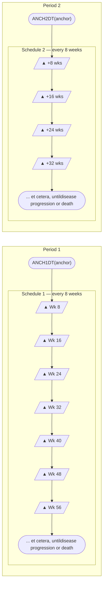
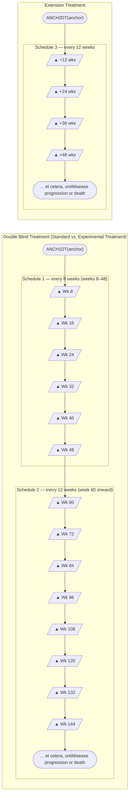

# 24_td_elements_te_tm_td

> **NotebookLM Source Metadata** (由 merge_sources.py 生成, 供 NotebookLM 索引 + citation 反查)
>
> - **Bucket ID**: `24`
> - **Concept**: Trial Design: TE + TM + TD (elements + milestones + durations)
> - **Merged files**: 9
> - **Words**: 5,656
> - **Chars**: 34,539
> - **Sources**:
>   - `domains/TE/spec.md`
>   - `domains/TE/assumptions.md`
>   - `domains/TE/examples.md`
>   - `domains/TM/spec.md`
>   - `domains/TM/assumptions.md`
>   - `domains/TM/examples.md`
>   - `domains/TD/spec.md`
>   - `domains/TD/assumptions.md`
>   - `domains/TD/examples.md`

---
## Source: `domains/TE/spec.md`

# TE — Trial Elements

> Class: Trial Design | Structure: One record per planned Element

### STUDYID
- **Order:** 1
- **Label:** Study Identifier
- **Type:** Char
- **Controlled Terms:** 
- **Role:** Identifier
- **Core:** Req
- **CDISC Notes:** Unique identifier for a study.

### DOMAIN
- **Order:** 2
- **Label:** Domain Abbreviation
- **Type:** Char
- **Controlled Terms:** 
- **Role:** Identifier
- **Core:** Req
- **CDISC Notes:** Two-character abbreviation for the domain.

### ETCD
- **Order:** 3
- **Label:** Element Code
- **Type:** Char
- **Controlled Terms:** 
- **Role:** Topic
- **Core:** Req
- **CDISC Notes:** ETCD (the companion to ELEMENT) is limited to 8 characters and does not have special character restrictions. These values should be short for ease of use in programming, but it is not expected that ETCD will need to serve as a variable name.

### ELEMENT
- **Order:** 4
- **Label:** Description of Element
- **Type:** Char
- **Controlled Terms:** 
- **Role:** Synonym Qualifier
- **Core:** Req
- **CDISC Notes:** The name of the element.

### TESTRL
- **Order:** 5
- **Label:** Rule for Start of Element
- **Type:** Char
- **Controlled Terms:** 
- **Role:** Rule
- **Core:** Req
- **CDISC Notes:** Describes condition for beginning element.

### TEENRL
- **Order:** 6
- **Label:** Rule for End of Element
- **Type:** Char
- **Controlled Terms:** 
- **Role:** Rule
- **Core:** Perm
- **CDISC Notes:** Describes condition for ending element. Either TEENRL or TEDUR must be present for each element.

### TEDUR
- **Order:** 7
- **Label:** Planned Duration of Element
- **Type:** Char
- **Controlled Terms:** ISO 8601 duration
- **Role:** Timing
- **Core:** Perm
- **CDISC Notes:** Planned duration of element in ISO 8601 format. Used when the rule for ending the element is applied after a fixed duration.
---

## Cross References

### Related Domains
- **Same class (Trial Design):** TA, TD, TI, TM, TS, TV
- **Trial Design:** [TA](../TA/) — elements compose arms

### General References
- [General Assumptions (Ch4)](../../chapters/ch04_general_assumptions.md) — variable naming, coding, timing rules
- [Variable Index](../../VARIABLE_INDEX.md) — reverse lookup by variable name

### Model Definition
- [Trial Design class definition](../../model/05_study_level_data.md)

## Source: `domains/TE/assumptions.md`

# TE — Assumptions

The Trial Elements (TE) dataset contains the definitions of the elements that appear in the Trial Arms (TA) dataset. An element may appear multiple times in the TA table because it appears either (1) in multiple arms, (2) multiple times within an arm, or (3) both. However, an element will appear only once in the TE table.

Each row in the TE dataset may be thought of as representing a "unique element" in the same sense of "unique" as a CRF template page for a collecting certain type of data referred to as "unique page."

An element is a building block for creating study cells, and an arm is composed of study cells. Trial elements represent an interval of time that serves a purpose in the trial and are associated with certain activities affecting the subject. "Week 2 to week 4" is not a valid trial element.

1. There are no gaps between elements. The instant one element ends, the next element begins. A subject spends no time "between" elements.

2. The ELEMENT (Description of the Element) variable usually indicates the treatment being administered during an element, or, if no treatment is being administered, the other activities that are the purpose of this period of time (e.g., "Screening", "Follow-up", "Washout"). In some cases, this time period may be quite passive (e.g., "Rest"; "Wait, for disease episode").

3. The TESTRL (Rule for Start of Element) variable identifies the event that marks the transition into this element. For elements that involve treatment, this is the start of treatment.

4. For elements that do not involve treatment, TESTRL can be more difficult to define. For washout and follow-up elements, which always follow treatment elements, the start of the element may be defined relative to the end of a preceding treatment. For example, a washout period might be defined as starting 24 or 48 hours after the last dose of drug for the preceding treatment element or epoch. This definition is not totally independent of the TA dataset, because it relies on knowing where in the trial design the element is used, and that it always follows a treatment element. Defining a clear starting point for the start of a non-treatment element that always follows another non-treatment element can be particularly difficult. The transition may be defined by a decision-making activity such as enrollment or randomization.

5. TESTRL for a treatment element may be thought of as "active" whereas the start rule for a non-treatment element—particularly a follow-up or washout element—may be "passive." The start of a treatment element will not occur until a dose is given, no matter how long that dose is delayed. Once the last dose is given, the start of a subsequent non-treatment element is inevitable, as long as another dose is not given.

6. Note that the date/time of the event described in TESTRL will be used to populate the date/times in the Subject Elements (SE) dataset, so the date/time of the event should be captured in the CRF.

7. Specifying TESTRL for an element that serves the first element of an arm in the TA dataset involves defining the start of the trial. In the examples in this document, obtaining informed consent has been used as "Trial Entry."

8. TESTRL should be expressed without referring to arm. If the element appears in more than 1 arm in the TA dataset, then the element description (ELEMENT) **must not** refer to any arms.

9. TESTRL should be expressed without referring to epoch. If the element appears in more than 1 epoch in the TA dataset, then the Element description (ELEMENT) **must not** refer to any epochs.

10. For a blinded trial, it is useful to describe TESTRL in terms that separate the properties of the event that are visible to blinded participants from the properties that are visible only to those who are unblinded. For treatment elements in blinded trials, wording such as the following is suitable: "First dose of study drug for a treatment epoch, where study drug is X."

11. Element end rules are rather different from element start rules. The actual end of one element is the beginning of the next element. Thus, the element end rule does not give the conditions under which an element does end, but the conditions under which it should end or is planned to end.

12. At least 1 of TEENRL and TEDUR must be populated. Both may be populated.

13. TEENRL describes the circumstances under which a subject should leave this element. Element end rules may depend on a variety of conditions. For instance, a typical criterion for ending a rest element between oncology chemotherapy-treatment element would be, "15 days after start of element and WBC counts have recovered." The TA dataset, not the TE dataset, describes where the subject moves next, so TEENRL must be expressed without referring to arm.

14. TEDUR serves the same purpose as TEENRL for the special (but very common) case of an element with a fixed duration. TEDUR is expressed in ISO 8601 format. For example, a TEDUR value of P6W is equivalent to a TEENRL of "6 weeks after the start of the element."

15. Note that elements that have different start and end rules are different elements and must have different values of ELEMENT and ETCD. For instance, elements that involve the same treatment but have different durations are different elements. The same applies to non-treatment elements.

## Source: `domains/TE/examples.md`

# TE — Examples

Both of the trials in TA Examples 1 and 2 (see Section 7.2.1, Trial Arms) are assumed to have fixed-duration elements. The wording in TESTRL is intended to separate the description of the event that starts the element into the part that would be visible to a blinded participant in the trial (e.g., "First dose of a treatment epoch") from the part that is revealed when the study is unblinded (e.g., "where dose is 5 mg"). Care must be taken in choosing these descriptions to be sure that they are arm- and epoch-neutral.

## Example 1

This example shows the TE dataset for TA Example Trial 1.

**te.xpt**

| Row | STUDYID | DOMAIN | ETCD | ELEMENT | TESTRL | TEENRL | TEDUR |
|-----|---------|--------|------|---------|--------|--------|-------|
| 1 | EX1 | TE | SCRN | Screen | Informed consent | 1 week after start of Element | P7D |
| 2 | EX1 | TE | RI | Run-In | Eligibility confirmed | 2 weeks after start of Element | P14D |
| 3 | EX1 | TE | P | Placebo | First dose of study drug, where drug is placebo | 2 weeks after start of Element | P14D |
| 4 | EX1 | TE | A | Drug A | First dose of study drug, where drug is Drug A | 2 weeks after start of Element | P14D |
| 5 | EX1 | TE | B | Drug B | First dose of study drug, where drug is Drug B | 2 weeks after start of Element | P14D |

## Example 2

This example shows the TE dataset for TA Example Trial 2.

**te.xpt**

| Row | STUDYID | DOMAIN | ETCD | ELEMENT | TESTRL | TEENRL | TEDUR |
|-----|---------|--------|------|---------|--------|--------|-------|
| 1 | EX2 | TE | SCRN | Screen | Informed consent | 2 weeks after start of Element | P14D |
| 2 | EX2 | TE | P | Placebo | First dose of a treatment Epoch, where dose is placebo | 2 weeks after start of Element | P14D |
| 3 | EX2 | TE | 5 | 5 mg | First dose of a treatment Epoch, where dose is 5 mg drug | 2 weeks after start of Element | P14D |
| 4 | EX2 | TE | 10 | 10 mg | First dose of a treatment Epoch, where dose is 10 mg drug | 2 weeks after start of Element | P14D |
| 5 | EX2 | TE | REST | Rest | 48 hrs after last dose of preceding treatment Epoch | 1 week after start of Element | P7D |
| 6 | EX2 | TE | FU | Follow-up | 48 hrs after last dose of third treatment Epoch | 3 weeks after start of Element | P21D |

## Example 3

The TE dataset for TA Example Trial 4 illustrates element end rules for elements that are not all of fixed duration. The screen element in this study can be up to 2 weeks long, but because it may end earlier it is not of fixed duration. The rest element has a variable length, depending on how quickly WBC recovers. Note that the start rules for the A and B elements have been written to be suitable for a blinded study.

**te.xpt**

| Row | STUDYID | DOMAIN | ETCD | ELEMENT | TESTRL | TEENRL | TEDUR |
|-----|---------|--------|------|---------|--------|--------|-------|
| 1 | EX4 | TE | SCRN | Screen | Informed Consent | Screening assessments are complete, up to 2 weeks after start of Element | |
| 2 | EX4 | TE | A | Trt A | First dose of treatment Element, where drug is Treatment A | 5 days after start of Element | P5D |
| 3 | EX4 | TE | B | Trt B | First dose of treatment Element, where drug is Treatment B | 5 days after start of Element | P5D |
| 4 | EX4 | TE | REST | Rest | Last dose of previous treatment cycle + 24 hrs | At least 16 days after start of Element and WBC recovered | |
| 5 | EX4 | TE | FU | Follow-up | Decision not to treat further | 4 weeks | P28D |

## Trial Elements Issues

### Granularity of Trial Elements

Deciding how finely to divide trial time when identifying trial elements is a matter of judgment, as illustrated by the following examples:

1. TA Example Trial 2 was represented using 3 treatment epochs separated by 2 washout epochs and followed by a follow-up epoch. This might have been modeled using 3 treatment epochs that included both the 2-week treatment period and the 1-week rest period. Because the first week after the third treatment period would be included in the third treatment epoch, the follow-up epoch would then have a duration of 2 weeks.

2. In TA Example Trials 4, 5, and 6, separate treatment and rest elements were identified. However, the combination of treatment and rest could be represented as a single element.

3. A trial might include a dose titration, with subjects receiving increasing doses on a weekly basis until certain conditions are met. The trial design could be modeled in any of the following ways:
    a. Using several 1-week elements at specific doses, followed by an element of variable length at the chosen dose
    b. As a titration element of variable length followed by a constant dosing element of variable length
    c. One element with dosing determined by titration

### Distinguishing Elements, Study Cells, and Epochs

It is easy to confuse elements, which are reusable trial building blocks, with study cells (which contain the elements for a particular epoch and Arm) and with epochs (which are time periods for the trial as a whole). In part, this is because many trials have epochs for which the same element appears in all arms, and in the trial design matrix for many trials, there are columns (Epochs) in which all the study cells have the same contents. It is also natural to use the same name (e.g., screen, follow-up) for both such an epoch and the single element that appears within it.

### Transitions Between Elements

The transition between one element and the next can be thought of as a 3-step process:

| Step | Step question | How step question is answered by information in the TA datasets |
|------|---|---|
| 1 | Should the subject leave the current element? | The criteria for ending the current element are in TEENRL in the TE dataset. |
| 2 | Which element should the subject enter next? | If there is a branch at this point in the trial, evaluate criteria described in TABRANCH (e.g., randomization results) in the TA dataset. Otherwise, if TATRANS in the TA dataset is populated in this arm at this point, follow those instructions. Otherwise, move to the next element in this arm as specified by TAETORD in the TA dataset. |
| 3 | What does the subject do to enter the next element? | The action or event that marks the start of the next element is specified in TESTRL in the TE dataset. |

Note that the subject is not "in limbo" during this process. The subject remains in the current element until step 3, at which point the subject transitions to the new element. There are no gaps between elements.

## Source: `domains/TM/spec.md`

# TM — Trial Disease Milestones

> Class: Trial Design | Structure: One record per Disease Milestone type

### STUDYID
- **Order:** 1
- **Label:** Study Identifier
- **Type:** Char
- **Controlled Terms:** 
- **Role:** Identifier
- **Core:** Req
- **CDISC Notes:** Unique identifier for a study.

### DOMAIN
- **Order:** 2
- **Label:** Domain Abbreviation
- **Type:** Char
- **Controlled Terms:** 
- **Role:** Identifier
- **Core:** Req
- **CDISC Notes:** Two-character abbreviation for the domain, which must be TM.

### MIDSTYPE
- **Order:** 3
- **Label:** Disease Milestone Type
- **Type:** Char
- **Controlled Terms:** 
- **Role:** Topic
- **Core:** Req
- **CDISC Notes:** The type of disease milestone. Example: "HYPOGLYCEMIC EVENT".

### TMDEF
- **Order:** 4
- **Label:** Disease Milestone Definition
- **Type:** Char
- **Controlled Terms:** 
- **Role:** Variable Qualifier
- **Core:** Req
- **CDISC Notes:** Definition of the disease milestone.

### TMRPT
- **Order:** 5
- **Label:** Disease Milestone Repetition Indicator
- **Type:** Char
- **Controlled Terms:** C66742
- **Role:** Record Qualifier
- **Core:** Req
- **CDISC Notes:** Indicates whether this is a disease milestone that can occur only once ("N") or a type of disease milestone that can occur multiple times ("Y").
---

## Cross References

### Controlled Terminology
- [No Yes Response (C66742)](../../terminology/core/general_part4.md) — TMRPT

### Related Domains
- **Same class (Trial Design):** TA, TD, TE, TI, TS, TV

### General References
- [General Assumptions (Ch4)](../../chapters/ch04_general_assumptions.md) — variable naming, coding, timing rules
- [Variable Index](../../VARIABLE_INDEX.md) — reverse lookup by variable name

### Model Definition
- [Trial Design class definition](../../model/05_study_level_data.md)

## Source: `domains/TM/assumptions.md`

# TM — Assumptions

A trial design domain that is used to describe disease milestones, which are observations or activities anticipated to occur in the course of the disease under study, and which trigger the collection of data.

1. Disease milestones may be things that would be expected to happen before the study, or things that are anticipated to happen during the study. The occurrence of disease milestones for particular subjects are represented in the Subject Disease Milestones (SM) dataset.

2. The Trial Disease Milestones (TM) dataset contains a record for each type of disease milestone. The disease milestone is defined in TMDEF.

## Source: `domains/TM/examples.md`

# TM — Examples

## Example 1

In this diabetes study, initial diagnosis of diabetes and the hypoglycemic events that occur during the trial have been identified as disease milestones of interest.

**Row 1:** Shows that the initial diagnosis is given the MIDSTYPE of "DIAGNOSIS" and is defined in TMDEF. It is not repeating (occurs only once).

**Row 2:** Shows that hypoglycemic events are given the MIDSTYPE of "HYPOGLYCEMIC EVENT", and a definition in TMDEF. (For an actual study, the definition would be expected to include a particular threshold level, rather than the text "threshold level" used in this example.) A subject may experience multiple hypoglycemic events, as indicated by TMRPT = "Y".

**tm.xpt**

| Row | STUDYID | DOMAIN | MIDSTYPE | TMDEF | TMRPT |
|-----|---------|--------|----------|-------|-------|
| 1 | XYZ | TM | DIAGNOSIS | Initial diagnosis of diabetes, the first time a physician told the subject they had diabetes | N |
| 2 | XYZ | TM | HYPOGLYCEMIC EVENT | Hypoglycemic Event, the occurrence of a glucose level below (threshold level) | Y |

## Source: `domains/TD/spec.md`

# TD — Trial Disease Assessments

> Class: Trial Design | Structure: One record per planned constant assessment period

### STUDYID
- **Order:** 1
- **Label:** Study Identifier
- **Type:** Char
- **Controlled Terms:** 
- **Role:** Identifier
- **Core:** Req
- **CDISC Notes:** Unique identifier for a study.

### DOMAIN
- **Order:** 2
- **Label:** Domain Abbreviation
- **Type:** Char
- **Controlled Terms:** 
- **Role:** Identifier
- **Core:** Req
- **CDISC Notes:** Two-character abbreviation for the domain.

### TDORDER
- **Order:** 3
- **Label:** Sequence of Planned Assessment Schedule
- **Type:** Num
- **Controlled Terms:** 
- **Role:** Timing
- **Core:** Req
- **CDISC Notes:** A number given to ensure ordinal sequencing of the planned assessment schedules within a trial.

### TDANCVAR
- **Order:** 4
- **Label:** Anchor Variable Name
- **Type:** Char
- **Controlled Terms:** 
- **Role:** Timing
- **Core:** Req
- **CDISC Notes:** A reference to the date variable name that provides the start point from which the planned disease assessment schedule is measured. This must be a referenced from the ADaM ADSL dataset (e.g., "ANCH1DT"). Note: TDANCVAR will contain the name of a reference date variable.

### TDSTOFF
- **Order:** 5
- **Label:** Offset from the Anchor
- **Type:** Char
- **Controlled Terms:** ISO 8601 duration
- **Role:** Timing
- **Core:** Req
- **CDISC Notes:** A fixed offset from the date provided by the variable referenced in TDANCVAR. This is used when the timing of planned cycles does not start on the exact day referenced in the variable indicated in TDANCVAR. The value of this variable will be either zero or a positive value and will be represented in ISO 8601 character format.

### TDTGTPAI
- **Order:** 6
- **Label:** Planned Assessment Interval
- **Type:** Char
- **Controlled Terms:** ISO 8601 duration
- **Role:** Timing
- **Core:** Req
- **CDISC Notes:** The planned interval between disease assessments represented in ISO 8601 character format.

### TDMINPAI
- **Order:** 7
- **Label:** Planned Assessment Interval Minimum
- **Type:** Char
- **Controlled Terms:** ISO 8601 duration
- **Role:** Timing
- **Core:** Req
- **CDISC Notes:** The lower limit of the allowed range for the planned interval between disease assessments represented in ISO 8601 character format.

### TDMAXPAI
- **Order:** 8
- **Label:** Planned Assessment Interval Maximum
- **Type:** Char
- **Controlled Terms:** ISO 8601 duration
- **Role:** Timing
- **Core:** Req
- **CDISC Notes:** The upper limit of the allowed range for the planned interval between disease assessments represented in ISO 8601 character format.

### TDNUMRPT
- **Order:** 9
- **Label:** Maximum Number of Actual Assessments
- **Type:** Num
- **Controlled Terms:** 
- **Role:** Record Qualifier
- **Core:** Req
- **CDISC Notes:** This variable must represent the maximum number of actual assessments for the analysis that this disease assessment schedule describes. In a trial where the maximum number of assessments is not defined explicitly in the protocol (e.g., assessments occur until death), TDNUMRPT should represent the maximum number of disease assessments that support the efficacy analysis encountered by any subject across the trial at that point in time.
---

## Cross References

### Related Domains
- **Same class (Trial Design):** TA, TE, TI, TM, TS, TV

### General References
- [General Assumptions (Ch4)](../../chapters/ch04_general_assumptions.md) — variable naming, coding, timing rules
- [Variable Index](../../VARIABLE_INDEX.md) — reverse lookup by variable name

### Model Definition
- [Trial Design class definition](../../model/05_study_level_data.md)

## Source: `domains/TD/assumptions.md`

# TD — Assumptions

The purpose of the Trial Disease Assessments (TD) domain is to provide information on planned scheduling of disease assessments when the scheduling of disease assessments is not necessarily tied to the scheduling of visits. In oncology studies, good compliance with the disease-assessment schedule is essential to reduce the risk of "assessment time bias." The TD domain makes possible an evaluation of assessment time bias from the SDTM, in particular for studies with progression-free survival (PFS) endpoints. TD has limited utility in oncology and was developed specifically with RECIST in mind and where an assessment-time bias analysis is appropriate. It is understood that extending this approach to Cheson and other criteria may not be appropriate or may pose difficulties. It is also understood that this approach may not be necessary in non-oncology studies, although it is available for use if appropriate.

1. The purpose of the Trial Disease Assessments (TD) domain is to provide information on planned scheduling of disease assessments when the scheduling of disease assessments is not necessarily tied to the scheduling of visits. In oncology studies, good compliance with the disease-assessment schedule is essential to reduce the risk of "assessment time bias." The TD domain makes possible an evaluation of assessment time bias from the SDTM, in particular for studies with progression-free survival (PFS) endpoints.

2. A planned schedule of assessments will have a defined start point; the TDANCVAR variable is used to identify the variable in the ADaM subject-level dataset (ADSL) that holds the "anchor" date. By default, the anchor variable for the first pattern is ANCH1DT. An anchor date must be provided for each pattern of assessments, and each anchor variable must exist in ADSL. TDANCVAR is therefore a Required variable. Anchor date variable names should adhere to ADaM variable naming conventions (e.g., ANCH1DT, ANCH2DT). One anchor date may be used to anchor more than 1 pattern of disease assessments. When that is the case, the appropriate offset for the start of a subsequent pattern, represented as an ISO 8601 duration value, should be provided in the TDSTOFF variable.

3. The TDSTOFF variable is used in conjunction with the anchor date value (from the anchor date variable identified in TDANCVAR). If the pattern of disease assessments does not start exactly on a date collected on the CRF, this variable will represent the offset between the anchor date value and the start date of the pattern of disease assessments. This may be a positive or zero interval value represented in an ISO 8601 format.

4. A pattern of assessments consists of a series of intervals of equal duration, each followed by an assessment. Thus, the first assessment in a pattern is planned to occur at the anchor date (given by the variable named in TDANCVAR) plus the offset (TDSTOFF) plus the target assessment interval (TDTGTPAI). A baseline evaluation is usually not preceded by an interval, and would therefore not be considered part of an assessment pattern.

5. This domain should not be created when the disease assessment schedule may vary for individual subjects (e.g., when completion of the first phase of a study is event-driven).

## Source: `domains/TD/examples.md`

# TD — Examples

## Example 1

**Timeline Diagram — Example 1: Three sequential assessment schedules from a single anchor**

```mermaid
graph LR
    ANCH1DT(["ANCH1DT(anchor)"])

    subgraph S1["Schedule 1 — every 8 weeks (weeks 8–48)"]
        W8[/"▲ Wk 8"/]
        W16[/"▲ Wk 16"/]
        W24[/"▲ Wk 24"/]
        W32[/"▲ Wk 32"/]
        W40[/"▲ Wk 40"/]
        W48[/"▲ Wk 48"/]
    end

    subgraph S2["Schedule 2 — every 12 weeks (weeks 60–96)"]
        W60[/"▲ Wk 60"/]
        W72[/"▲ Wk 72"/]
        W84[/"▲ Wk 84"/]
        W96[/"▲ Wk 96"/]
    end

    subgraph S3["Schedule 3 — every 24 weeks (week 120 onward)"]
        W120[/"▲ Wk 120"/]
        W144[/"▲ Wk 144"/]
        ETC(["... et cetera, untildisease progression or death"])
    end

    ANCH1DT --> W8 --> W16 --> W24 --> W32 --> W40 --> W48
    W48 --> W60 --> W72 --> W84 --> W96
    W96 --> W120 --> W144 --> ETC
```

This example shows a study where the disease assessment schedule changes over the course of the study. In this example, there are 3 distinct disease-assessment schedule patterns. A single anchor date variable (TDANCVAR) provides the anchor date for each pattern. The offset variable (TDSTOFF), used in conjunction with the anchor date variable, provides the start point of each pattern of assessments.

- The first disease-assessment schedule pattern starts at the reference start date (identified in the ADSL ANCH1DT variable) and repeats every 8 weeks for a total of 6 repeated assessments (i.e., week 8, week 16, week 24, week 32, week 40, week 48). Note that there is an upper and lower limit around the planned disease assessment target where the first assessment (8 weeks) could occur as early as day 53 and as late as week 9. This upper and lower limit (-3 days, +1 week) would be applied to all assessments during that pattern.

- The second disease assessment schedule starts from week 48 and repeats every 12 weeks for a total of 4 repeats (i.e., week 60, week 72, week 84, week 96), with respective upper and lower limits of -1 week and +1 week.

- The third disease assessment schedule starts from week 96 and repeats every 24 weeks (week 120, week 144, and so on), with respective upper and lower limits of -1 week and +1 week, for an indefinite length of time. The preceding schematic shows that, for the third pattern, assessments will occur until disease progression; this therefore leaves the pattern open-ended. However, when data is included in an analysis, the total number of repeats can be identified and the highest number of repeat assessments for any subject in that pattern must be recorded in the TDNUMRPT variable on the final pattern record.

**td.xpt**

| Row | STUDYID | DOMAIN | TDORDER | TDANCVAR | TDSTOFF | TDTGTPAI | TDMINPAI | TDMAXPAI | TDNUMRPT |
|-----|---------|--------|---------|----------|---------|----------|----------|----------|----------|
| 1 | ABC123 | TD | 1 | ANCH1DT | P0D | P8W | P53D | P9W | 6 |
| 2 | ABC123 | TD | 2 | ANCH1DT | P48W | P12W | P11W | P13W | 4 |
| 3 | ABC123 | TD | 3 | ANCH1DT | P96W | P24W | P23W | P25W | 12 |

## Example 2

**Timeline Diagram — Example 2: Two periods with separate anchor dates (crossover study)**

This example shows a crossover study, where subjects are given the period 1 treatment according to the first disease-assessment schedule until disease progression, then there is a rest period of 28 days prior to the start of the period 2 treatment (i.e., re-baseline for period 2). The subjects are then given the period 2 treatment according to the second disease assessment schedule until disease progression. This example also shows how two different reference/anchor dates can be used.

- The Rest element is not represented as a row in the TD dataset, since no disease assessments occur during the Rest. Note that although the Rest epoch in this example is not important for TD, it is important that it is represented in other trial design datasets.

**Row 1:** Shows the disease assessment schedule for the first treatment period. The diagram above shows that this schedule repeats until disease progression. After the trial ended, the maximum number of repeats in this schedule was determined to be 6, so that is the value in TDNUMRPT for this schedule.

**Row 2:** Shows the disease assessment schedule for the second period. The pattern starts on the date identified in the ADSL variable ANCH2DT and repeats every 8 weeks with respective upper and lower limits of -1 week and +1 week. The maximum number of repeats that occurred on this schedule was 4.

**td.xpt**

| Row | STUDYID | DOMAIN | TDORDER | TDANCVAR | TDSTOFF | TDTGTPAI | TDMINPAI | TDMAXPAI | TDNUMRPT |
|-----|---------|--------|---------|----------|---------|----------|----------|----------|----------|
| 1 | ABC123 | TD | 1 | ANCH1DT | P0D | P8W | P53D | P9W | 6 |
| 2 | ABC123 | TD | 2 | ANCH2DT | P0D | P8W | P53D | P9W | 4 |

## Example 3

**Timeline Diagram — Example 3: Double Blind Treatment (two schedules) + Extension Treatment**

This example shows a study where subjects are randomized to standard treatment or an experimental treatment. The subjects who are randomized to standard treatment are given the option to receive experimental treatment after they end the standard treatment (e.g., due to disease progression on standard treatment). In the randomized treatment epoch, the disease assessment schedule changes over the course of the study. At the start of the extension treatment epoch, subjects are re-baselined, i.e., an extension baseline disease assessment is performed and the disease assessment schedule is restarted.

In this example, there are 3 distinct disease-assessment schedule patterns:

- The first disease-assessment schedule pattern starts at the reference start date (identified in the ADSL ANCH1DT variable) and repeats every 8 weeks for a total of 6 repeats (i.e., week 8, week 16, week 24, week 32, week 40, week 48), with respective upper and lower limits of -3 days and +1 week.

- The second disease assessment schedule starts from week 48 and repeats every 12 weeks (week 60, week 72, etc.), with respective upper and lower limits of -1 week and +1 week, for an indefinite length of time. The preceding schematic shows that, for the second pattern, assessments will occur until disease progression; this therefore leaves the pattern open-ended.

- The third disease assessment schedule starts at the extension reference start date (identified in the ADSL ANCH2DT variable) from week 96 and repeats every 12 weeks (week 120, week 144, etc.), with respective upper and lower limits of -1 week and +1 week, for an indefinite length of time.

For open-ended patterns, the total number of repeats can be identified when the data analysis is performed; the highest number of repeat assessments for any subject in that pattern must be recorded in the TDNUMRPT variable on the final pattern record.

**td.xpt**

| Row | STUDYID | DOMAIN | TDORDER | TDANCVAR | TDSTOFF | TDTGTPAI | TDMINPAI | TDMAXPAI | TDNUMRPT |
|-----|---------|--------|---------|----------|---------|----------|----------|----------|----------|
| 1 | ABC123 | TD | 1 | ANCH1DT | P0D | P8W | P53D | P9W | 6 |
| 2 | ABC123 | TD | 2 | ANCH1DT | P48W | P12W | P11W | P13W | 17 |
| 3 | ABC123 | TD | 3 | ANCH2DT | P0D | P12W | P11W | P13W | 17 |
