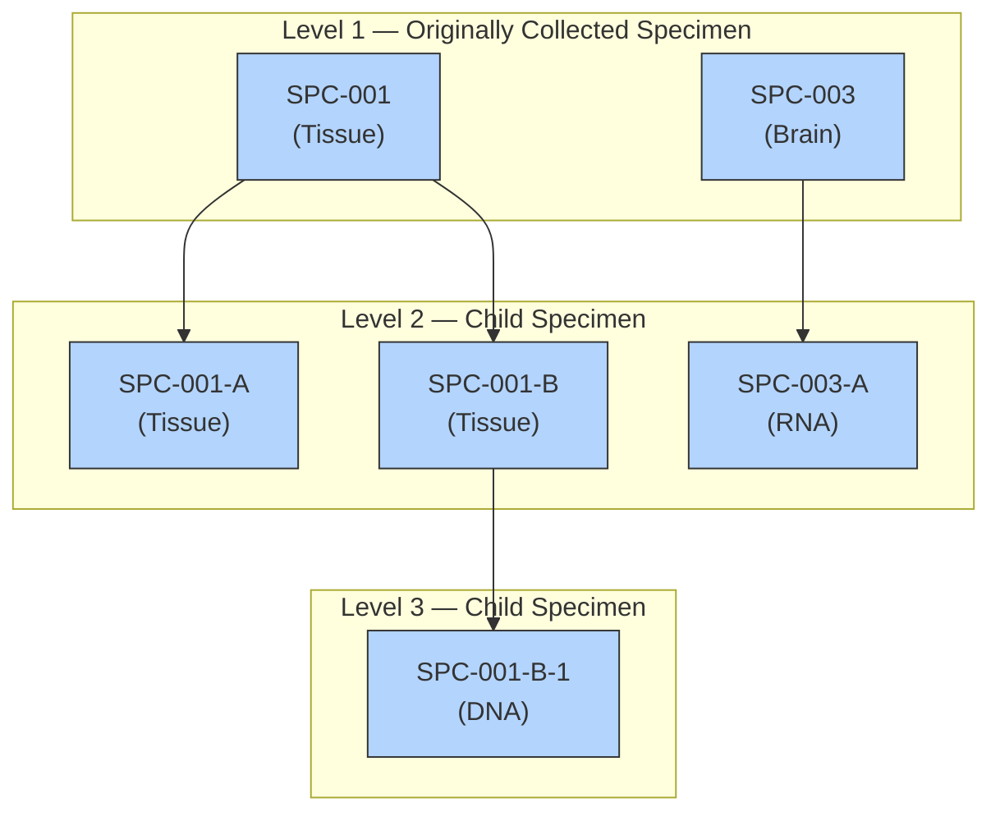

# 26_rel_relrec_relspec_relsub

> **NotebookLM Source Metadata** (由 merge_sources.py 生成, 供 NotebookLM 索引 + citation 反查)
>
> - **Bucket ID**: `26`
> - **Concept**: Relationships: RELREC + RELSPEC + RELSUB
> - **Merged files**: 9
> - **Words**: 3,627
> - **Chars**: 23,576
> - **Sources**:
>   - `domains/RELREC/spec.md`
>   - `domains/RELREC/assumptions.md`
>   - `domains/RELREC/examples.md`
>   - `domains/RELSPEC/spec.md`
>   - `domains/RELSPEC/assumptions.md`
>   - `domains/RELSPEC/examples.md`
>   - `domains/RELSUB/spec.md`
>   - `domains/RELSUB/assumptions.md`
>   - `domains/RELSUB/examples.md`

---
## Source: `domains/RELREC/spec.md`

# RELREC — Related Records

> Class: Relationship | Structure: One record per related record, group of records or dataset

### STUDYID
- **Order:** 1
- **Label:** Study Identifier
- **Type:** Char
- **Controlled Terms:** 
- **Role:** Identifier
- **Core:** Req
- **CDISC Notes:** Unique identifier for a study.

### RDOMAIN
- **Order:** 2
- **Label:** Related Domain Abbreviation
- **Type:** Char
- **Controlled Terms:** C66734
- **Role:** Identifier
- **Core:** Req
- **CDISC Notes:** Abbreviation for the domain of the parent record(s).

### USUBJID
- **Order:** 3
- **Label:** Unique Subject Identifier
- **Type:** Char
- **Controlled Terms:** 
- **Role:** Identifier
- **Core:** Exp
- **CDISC Notes:** Identifier used to uniquely identify a subject across all studies for all applications or submissions involving the product.

### IDVAR
- **Order:** 4
- **Label:** Identifying Variable
- **Type:** Char
- **Controlled Terms:** 
- **Role:** Identifier
- **Core:** Req
- **CDISC Notes:** Name of the identifying variable in the general-observation-class dataset that identifies the related record(s). Examples: --SEQ, --GRPID.

### IDVARVAL
- **Order:** 5
- **Label:** Identifying Variable Value
- **Type:** Char
- **Controlled Terms:** 
- **Role:** Identifier
- **Core:** Exp
- **CDISC Notes:** Value of identifying variable described in IDVAR. If --SEQ is the variable being used to describe this record, then the value of --SEQ would be entered here.

### RELTYPE
- **Order:** 6
- **Label:** Relationship Type
- **Type:** Char
- **Controlled Terms:** C78737
- **Role:** Record Qualifier
- **Core:** Exp
- **CDISC Notes:** Identifies the hierarchical level of the records in the relationship. Values should be either "ONE" or "MANY". Used only when identifying a relationship between datasets (as described in Section 8.3, Relating Datasets).

### RELID
- **Order:** 7
- **Label:** Relationship Identifier
- **Type:** Char
- **Controlled Terms:** 
- **Role:** Record Qualifier
- **Core:** Req
- **CDISC Notes:** Unique value within USUBJID that identifies the relationship. All records for the same USUBJID that have the same RELID are considered related/associated. RELID can be any value the sponsor chooses, and is only meaningful within the RELREC dataset to identify the related/associated domain records.
---

## Cross References

### Controlled Terminology
- [SDTM Domain Abbreviation (C66734)](../../terminology/core/general_part4.md) — RDOMAIN
- [Relationship Type (C78737)](../../terminology/core/other_part4.md) — RELTYPE

### Related Domains
- **Same class (Relationship):** RELSPEC, RELSUB, SUPPQUAL

### General References
- [General Assumptions (Ch4)](../../chapters/ch04_general_assumptions.md) — variable naming, coding, timing rules
- [Relationships (Ch8)](../../chapters/ch08_relationships.md) — RELREC, SUPPQUAL usage
- [Variable Index](../../VARIABLE_INDEX.md) — reverse lookup by variable name

### Model Definition
- [Relationship class definition](../../model/06_relationship_datasets.md)

## Source: `domains/RELREC/assumptions.md`

# RELREC — Assumptions

The Related Records (RELREC) special-purpose dataset is used to describe relationships between records for a subject (relating peer records) and relationships between datasets (relating datasets). In both cases, relationships represented in RELREC are collected relationships, either by explicit references or checkboxes on the CRF, or by design of the CRF (e.g., vital signs captured during an exercise stress test).

A relationship is defined by adding a record to RELREC for each record to be related and by assigning a unique character identifier value for the relationship. Each record in the RELREC special-purpose dataset contains keys that identify a record (or group of records) and the relationship identifier, which is stored in the RELID variable. The value of RELID is chosen by the sponsor, but must be identical for all related records within USUBJID. It is recommended that the sponsor use a standard system or naming convention for RELID (e.g., all letters, all numbers, capitalized).

## Relating Peer Records

Records expressing a relationship are specified using the key variables STUDYID, RDOMAIN (the domain code of the record in the relationship), and USUBJID, along with IDVAR and IDVARVAL. Single records can be related by using a unique-record-identifier variable such as --SEQ in IDVAR. Groups of records can be related by using grouping variables such as --GRPID in IDVAR. IDVARVAL would contain the value of the variable described in IDVAR. Using --GRPID can be a more efficient method of representing relationships in RELREC, such as when relating an adverse event (or events) to a group of concomitant medications taken to treat the adverse event(s).

The RELREC dataset should be used to represent either:
- explicit relationships, such as concomitant medications taken as a result of an adverse event; or
- information of a nature that necessitates using multiple datasets, as described in Section 8.3, Relating Datasets.

The following are examples of variables that could be used in IDVAR:
- The sequence number (--SEQ) variable uniquely identifies a record for a given USUBJID within a domain. The variable --SEQ is required in all domains except DM.
- The reference identifier (--REFID) variable can be used to capture a sponsor-defined or external identifier. Some examples are lab-specimen identifiers and ECG identifiers. --REFID is permissible in all general observation-class domains, but is never required. Values for --REFID are sponsor-defined.
- The grouping identifier (--GRPID) variable, used to link related records for a subject within a domain, is explained in Section 8.1, Relating Groups of Records Within a --GRPID Variable.

## Relating Datasets

The Related Records (RELREC) special-purpose dataset can also be used to identify relationships between datasets (e.g., a one-to-many or parent-child relationship). The relationship is defined by including a single record for each related dataset that identifies the key(s) of the dataset that can be used to relate the respective records.

Relationships between datasets should only be recorded in the RELREC dataset when the sponsor has found it necessary to split information between datasets that are related, and that may need to be examined together for analysis or proper interpretation. Note that it is not necessary to use the RELREC dataset to identify associations from data in the SUPP-- datasets or the Comments (CO) dataset to their parent general-observation class dataset records or special-purpose domain records, as both these datasets include the key variable identifiers of the parent record(s) that are necessary to make the association.

The variable RELTYPE identifies the type of relationship between the datasets. The allowable values are ONE and MANY (controlled terminology is expected). This information defines how a merge/join would be written, and what would be the result of the merge/join. The possible combinations are:

1. **ONE and ONE.** This combination indicates that there is **NO** hierarchical relationship between the datasets and the records in the datasets. Only 1 record from each dataset will potentially have the same value of the IDVAR within USUBJID.

2. **ONE and MANY.** This combination indicates that there **IS** a hierarchical (parent-child) relationship between the datasets. One record within USUBJID in the dataset identified by RELTYPE = "ONE" will potentially have the same value of the IDVAR with many (1 or more) records in the dataset identified by RELTYPE = "MANY".

3. **MANY and MANY.** This combination is unusual and challenging to manage in a merge/join, and may represent a relationship that was never intended to convey a usable merge/join, such as described in Section 6.3.5.9.3, Relating PP Records to PC Records.

## Source: `domains/RELREC/examples.md`

# RELREC — Examples

## Peer Record Examples

### Example 1

This example illustrates the use of the RELREC dataset to relate records stored in separate domains for USUBJID = "123456". This example represents a situation in which a single adverse event is part of 2 collected relationships, one with 2 concomitant medications and the other with 2 laboratory findings, but there is no collected relationship between the 2 laboratory findings and the 2 concomitant medications.

**Rows 1-3:** Show the representation of a relationship between an AE record and 2 concomitant medication records.

**Rows 4-6:** Show the representation of a relationship between the same AE record and 2 laboratory findings records.

**relrec.xpt**

| Row | STUDYID | RDOMAIN | USUBJID | IDVAR | IDVARVAL | RELTYPE | RELID |
|-----|---------|---------|---------|-------|----------|---------|-------|
| 1 | EFC1234 | AE | 123456 | AESEQ | 5 | | 1 |
| 2 | EFC1234 | CM | 123456 | CMSEQ | 11 | | 1 |
| 3 | EFC1234 | CM | 123456 | CMSEQ | 12 | | 1 |
| 4 | EFC1234 | AE | 123456 | AESEQ | 5 | | 2 |
| 5 | EFC1234 | LB | 123456 | LBSEQ | 47 | | 2 |
| 6 | EFC1234 | LB | 123456 | LBSEQ | 48 | | 2 |

### Example 2

Example 2 is the same scenario as Example 1. In this case, however, the way the data were collected indicated that the concomitant medications and laboratory findings were all in a single relationship to each other and the adverse event.

**relrec.xpt**

| Row | STUDYID | RDOMAIN | USUBJID | IDVAR | IDVARVAL | RELTYPE | RELID |
|-----|---------|---------|---------|-------|----------|---------|-------|
| 1 | EFC1234 | AE | 123456 | AESEQ | 5 | | 1 |
| 2 | EFC1234 | CM | 123456 | CMSEQ | 11 | | 1 |
| 3 | EFC1234 | CM | 123456 | CMSEQ | 12 | | 1 |
| 4 | EFC1234 | LB | 123456 | LBSEQ | 47 | | 1 |
| 5 | EFC1234 | LB | 123456 | LBSEQ | 48 | | 1 |

### Example 3

Example 3 is the same scenario as Example 2. However, the sponsor grouped the 2 concomitant medications in the CM domain using CMGRPID = "COMBO 1", allowing the relationship among these 5 records to be represented with 4, rather than 5, records in the RELREC dataset.

**relrec.xpt**

| Row | STUDYID | RDOMAIN | USUBJID | IDVAR | IDVARVAL | RELTYPE | RELID |
|-----|---------|---------|---------|-------|----------|---------|-------|
| 1 | EFC1234 | AE | 123456 | AESEQ | 5 | | 1 |
| 2 | EFC1234 | CM | 123456 | CMGRPID | COMBO1 | | 1 |
| 3 | EFC1234 | LB | 123456 | LBSEQ | 47 | | 1 |
| 4 | EFC1234 | LB | 123456 | LBSEQ | 48 | | 1 |

Additional examples may be found in the domain examples such as Section 6.2.4, Disposition, Example 4, and all of the Pharmacokinetics examples in Section 6.3.5.9.3, Relating PP Records to PC Records.

## Dataset Relationship Example

### Example 1

This example illustrates RELREC records used to represent the relationship between records in 2 datasets that have a one-to-many relationship. Note that because this is a dataset-to-dataset relationship, USUBJID and IDVARVAL are null.

**relrec.xpt**

| Row | STUDYID | RDOMAIN | USUBJID | IDVAR | IDVARVAL | RELTYPE | RELID |
|-----|---------|---------|---------|-------|----------|---------|-------|
| 1 | EFC1234 | TU | | TULNKID | | ONE | 1 |
| 2 | EFC1234 | TR | | TRLNKID | | MANY | 1 |

In the sponsor's operational database, these datasets may have existed as either separate datasets that were merged for analysis, or a single dataset that may have included observations from more than 1 general observation class (e.g., Events and Findings). The value in IDVAR must be the name of the key used to merge/join the 2 datasets. In this example, the --LNKID variable is used as the key to identify the related observations. The values for the --LNKID variable in the 2 datasets are sponsor-defined. Although other variables may also serve as a single merge key when the corresponding values for IDVAR are equal, --GRPID, --SPID, --REFID, --LNKID, or --LNKGRP are typically used for this purpose.

## Source: `domains/RELSPEC/spec.md`

# RELSPEC — Related Specimens

> Class: Relationship | Structure: One record per specimen identifier per subject

### STUDYID
- **Order:** 1
- **Label:** Study Identifier
- **Type:** Char
- **Controlled Terms:** 
- **Role:** Identifier
- **Core:** Req
- **CDISC Notes:** Unique identifier for a study.

### USUBJID
- **Order:** 2
- **Label:** Unique Subject Identifier
- **Type:** Char
- **Controlled Terms:** 
- **Role:** Identifier
- **Core:** Req
- **CDISC Notes:** Identifier used to uniquely identify a subject across all studies for all applications or submissions involving the product.

### REFID
- **Order:** 3
- **Label:** Specimen ID
- **Type:** Char
- **Controlled Terms:** 
- **Role:** Identifier
- **Core:** Req
- **CDISC Notes:** Specimen identifier, unique within USUBJID.

### SPEC
- **Order:** 4
- **Label:** Specimen Type
- **Type:** Char
- **Controlled Terms:** C78734; C111114
- **Role:** Variable Qualifier
- **Core:** Perm
- **CDISC Notes:** Defines the type of specimen used for a measurement. Examples: "SERUM", "PLASMA", "URINE", "SOFT TISSUE".

### PARENT
- **Order:** 5
- **Label:** Specimen Parent
- **Type:** Char
- **Controlled Terms:** 
- **Role:** Identifier
- **Core:** Exp
- **CDISC Notes:** Identifies the REFID of the parent of a specimen to support tracking its genealogy.

### LEVEL
- **Order:** 6
- **Label:** Specimen Level
- **Type:** Num
- **Controlled Terms:** 
- **Role:** Variable Qualifier
- **Core:** Req
- **CDISC Notes:** Identifies the generation number of the sample where the collected sample is considered the first generation.
---

## Cross References

### Controlled Terminology
- [Genetic Sample Type (C111114)](../../terminology/core/general_part2.md) — SPEC
- [Specimen Type (C78734)](../../terminology/core/general_part4.md) — SPEC

### Related Domains
- **Same class (Relationship):** RELREC, RELSUB, SUPPQUAL

### General References
- [General Assumptions (Ch4)](../../chapters/ch04_general_assumptions.md) — variable naming, coding, timing rules
- [Relationships (Ch8)](../../chapters/ch08_relationships.md) — RELREC, SUPPQUAL usage
- [Variable Index](../../VARIABLE_INDEX.md) — reverse lookup by variable name

### Model Definition
- [Relationship class definition](../../model/06_relationship_datasets.md)

## Source: `domains/RELSPEC/assumptions.md`

# RELSPEC — Assumptions

BE, BS, and RELSPEC domain specifications, assumptions, and examples were copied and minimally updated from the provisional SDTMIG-PGx, published 2015-05-26. This was done in preparation for the retirement of the SDTMIG-PGx upon publication of SDTMIG v3.4. These domains are currently under extensive revision for inclusion in a future SDTMIG.

A dataset used to represent relationships between specimens.

1. The RELSPEC dataset is not used to manage relationships between any other datasets or domains.

2. The RELSPEC dataset is only used to maintain relationships between specimens, therefore it does not require any additional variables such as those used in RELREC.

3. There are three CDISC controlled terminology codelists that may be applicable to SPEC: SPEC (C77529), SPECTYPE (C78734), and GENSMP (C111114). Sponsors are responsible for determining the most appropriate codelist(s) for their submission.

## Source: `domains/RELSPEC/examples.md`

# RELSPEC — Examples

## Example 1

This example uses the sample specimen lineage illustrated below.

**Specimen Relationship Diagram:**

A specimen with a LEVEL value of "1" and a blank value for PARENT indicates a collected sample. All other values represent a derived sample. SPEC reflects the specimen type for the sample regardless of whether it is collected or derived.

**relspec.xpt**

| Row | STUDYID | USUBJID | REFID | SPEC | PARENT | LEVEL |
|-----|---------|---------|-------|------|--------|-------|
| 1 | ABC-123 | 001-01 | SPC-001 | TISSUE | | 1 |
| 2 | ABC-123 | 001-01 | SPC-001-A | TISSUE | SPC-001 | 2 |
| 3 | ABC-123 | 001-01 | SPC-001-B | TISSUE | SPC-001 | 2 |
| 4 | ABC-123 | 001-01 | SPC-001-B-1 | DNA | SPC-001-B | 3 |
| 5 | ABC-123 | 001-01 | SPC-003 | TISSUE | | 1 |
| 6 | ABC-123 | 001-01 | SPC-003-A | RNA | SPC-003 | 2 |

## Source: `domains/RELSUB/spec.md`

# RELSUB — Related Subjects

> Class: Relationship | Structure: One record per relationship per related subject per subject

### STUDYID
- **Order:** 1
- **Label:** Study Identifier
- **Type:** Char
- **Controlled Terms:** 
- **Role:** Identifier
- **Core:** Req
- **CDISC Notes:** Unique identifier for a study.

### USUBJID
- **Order:** 2
- **Label:** Unique Subject Identifier
- **Type:** Char
- **Controlled Terms:** 
- **Role:** Identifier
- **Core:** Exp
- **CDISC Notes:** Identifier used to uniquely identify a subject across all studies for all applications or submissions involving the product. Either USUBJID or POOLID must be populated.

### POOLID
- **Order:** 3
- **Label:** Pool Identifier
- **Type:** Char
- **Controlled Terms:** 
- **Role:** Identifier
- **Core:** Perm
- **CDISC Notes:** Identifier used to identify a pool of subjects. If POOLID is entered, POOLDEF records must exist for each subject in the pool and USUBJID must be null. Either USUBJID or POOLID must be populated.

### RSUBJID
- **Order:** 4
- **Label:** Related Subject or Pool Identifier
- **Type:** Char
- **Controlled Terms:** 
- **Role:** Identifier
- **Core:** Req
- **CDISC Notes:** Identifier used to identify a related subject or pool of subjects. RSUBJID will be populated with either the USUBJID of the related subject or the POOLID of the related pool.

### SREL
- **Order:** 5
- **Label:** Subject Relationship
- **Type:** Char
- **Controlled Terms:** C100130
- **Role:** Record Qualifier
- **Core:** Req
- **CDISC Notes:** Describes the relationship of the subject identified in USUBJID or the pool identified in POOLID to the subject or pool identified in RSUBJID.
---

## Cross References

### Controlled Terminology
- [Relationship to Subject (C100130)](../../terminology/core/other_part4.md) — SREL

### Related Domains
- **Same class (Relationship):** RELREC, RELSPEC, SUPPQUAL

### General References
- [General Assumptions (Ch4)](../../chapters/ch04_general_assumptions.md) — variable naming, coding, timing rules
- [Relationships (Ch8)](../../chapters/ch08_relationships.md) — RELREC, SUPPQUAL usage
- [Variable Index](../../VARIABLE_INDEX.md) — reverse lookup by variable name

### Model Definition
- [Relationship class definition](../../model/06_relationship_datasets.md)

## Source: `domains/RELSUB/assumptions.md`

# RELSUB — Assumptions

A dataset used to represent relationships between study subjects.

Some studies include subjects who are related to each other, and in some cases it is important to record those relationships. A study in which pregnant women are treated and both the mother and her child(ren) are study subjects is the most common case in which relationships between subjects are collected. There are also studies of genetically based diseases where subjects who are related to each other are enrolled, and the relationships between subjects are recorded.

1. RELSUB is used to represent relationships between persons, both of whom are study subjects. A relationship between a study subject and a person who is not a study subject may not be represented in RELSUB; this may only be reported in APRELSUB. The existence of the RELSUB dataset should not affect whether relationships are collected; that should remain a decision based on the needs of the particular study.

2. The variable POOLID was developed for nonclinical studies, where assessments may be made for groups of animals, and identifiers are needed for those groups (pools). It is included here because POOLID can be used for human clinical trials, if necessary. If POOLID is submitted, the POOLDEF dataset must be submitted.

3. If POOLID is submitted, then in any record, 1 and only 1 of USUBJID and POOLID must be populated.

4. If a study does not include the use of POOLID, then USUBJID must be populated in every record.

5. RSUBJID must be a USUBJID value present in the Demographics (DM) domain. RSUBJID must be populated in every record.

6. Values of SREL should be taken from the CDISC Controlled Terminology codelist RELSUB wherever possible. However, if an appropriate term does not exist in the codelist, another term may be used. The SREL term should not be less specific than the verbatim term collected. For instance, it would be inappropriate to record a relationship using the term "RELATIVE, FIRST DEGREE" when the collected relationship was "brother".

7. Every relationship between 2 study subjects is represented in RELSUB as 2 directional relationships: (1) with the first subject's identifier in USUBJID and the second subject's identifier in RSUBJID, and (2) with the second subject's identifier in USUBJID and the first subject's identifier in RSUBJID. The SREL values in the 2 records will describe the same relationship, but from the viewpoint of each subject (e.g., "MOTHER, BIOLOGICAL"; "CHILD, BIOLOGICAL").

8. All collected relationships between subjects should be recorded in RELSUB. In some cases, 2 subjects may have more than 1 relationship. For instance, a woman might be both maternal aunt and wet nurse to an infant. When there are multiple relationships between 2 subjects, each relationship will be represented by 2 records in RELSUB.

## Source: `domains/RELSUB/examples.md`

# RELSUB — Examples

## Example 1

The following data are from a hemophilia study (HEM021) in which the study subjects are a pair of fraternal (dizygotic) twins and their mother.

Some expected and required variables not needed to illustrate the example are not shown.

**Row 1:** Subject is the mother.

**Rows 2-3:** Subjects are the children.

**dm.xpt**

| Row | STUDYID | DOMAIN | USUBJID | BRTHDTC | AGE | AGEU | SEX |
|-----|---------|--------|---------|---------|-----|------|-----|
| 1 | HEM021 | DM | HEM021-001 | 1941-05-16 | 60 | YEARS | F |
| 2 | HEM021 | DM | HEM021-002 | 1965-04-12 | 35 | YEARS | M |
| 3 | HEM021 | DM | HEM021-003 | 1965-04-12 | 35 | YEARS | M |

The RELSUB table is for the 3 subjects whose demography data is shown in the preceding table.

**Rows 1-2:** The relationships of the mother to the 2 children.

**Rows 3, 5:** The relationships of the children to the mother.

**Rows 4, 6:** The relationships of the children to each other.

**relsub.xpt**

| Row | STUDYID | USUBJID | RSUBJID | SREL |
|-----|---------|---------|---------|------|
| 1 | HEM021 | HEM021-001 | HEM021-002 | MOTHER, BIOLOGICAL |
| 2 | HEM021 | HEM021-001 | HEM021-003 | MOTHER, BIOLOGICAL |
| 3 | HEM021 | HEM021-002 | HEM021-001 | CHILD, BIOLOGICAL |
| 4 | HEM021 | HEM021-002 | HEM021-003 | TWIN, DIZYGOTIC |
| 5 | HEM021 | HEM021-003 | HEM021-001 | CHILD, BIOLOGICAL |
| 6 | HEM021 | HEM021-003 | HEM021-002 | TWIN, DIZYGOTIC |
