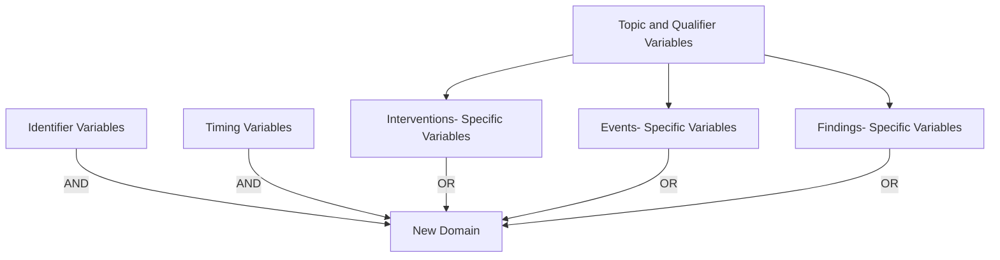

# 28_ig_ch01_ch02_ch03

> **NotebookLM Source Metadata** (由 merge_sources.py 生成, 供 NotebookLM 索引 + citation 反查)
>
> - **Bucket ID**: `28`
> - **Concept**: IG: ch01 intro + ch02 fundamentals + ch03 submitting data
> - **Merged files**: 3
> - **Words**: 6,751
> - **Chars**: 43,085
> - **Sources**:
>   - `chapters/ch01_introduction.md`
>   - `chapters/ch02_fundamentals.md`
>   - `chapters/ch03_submitting_data.md`

---
## Source: `chapters/ch01_introduction.md`

# SDTMIG v3.4 — Chapter 1: Introduction

Source: SDTMIG v3.4, Section 1 (Pages 7-12)

## 1.1 Purpose

The Study Data Tabulation Model Implementation Guide for Human Clinical Trials (SDTMIG) Version 3.4 has been prepared by the Submissions Data Standards (SDS) team of the Clinical Data Interchange Standards Consortium (CDISC). Like its predecessors, v3.4 is intended to guide the organization, structure, and format of standard clinical trial tabulation datasets submitted to a regulatory authority. Version 3.4 supersedes all prior versions of the SDTMIG.

The SDTMIG should be used in close concert with Version 2.0 of the CDISC Study Data Tabulation Model (SDTM), which describes the general conceptual model for representing clinical study data that is submitted to regulatory authorities and should be read prior to reading the SDTMIG. SDTMIG Version 3.4 provides specific domain models, assumptions, business rules, and examples for preparing standard tabulation datasets that are based on the SDTM.

This document is intended for companies and individuals involved in the collection, preparation, and analysis of clinical data that will be submitted to regulatory authorities.

## 1.2 Organization of this Document

| Section | Title | Description |
|---------|-------|-------------|
| 1 | Introduction | Overall introduction to v3.4 models; changes from prior versions |
| 2 | Fundamentals of the SDTM | Basic concepts of the SDTM; how to use SDTMIG with SDTM |
| 3 | Submitting Data in Standard Format | How to describe metadata for regulatory submissions; conformance assessment |
| 4 | Assumptions for Domain Models | Basic concepts, business rules, and assumptions before applying domain models |
| 5 | Models for Special-purpose Domains | Special-purpose domains: Demographics, Comments, Subject Visits, Subject Elements |
| 6 | Domain Models Based on the General Observation Classes | Specific metadata models based on the 3 GOC, with assumptions and examples |
| 7 | Trial Design Model Datasets | Domains for trial-level data, with assumptions and examples |
| 8 | Representing Relationships and Data | How to represent relationships between domains, datasets, and records |
| 9 | Study References | Structures for study-specific terminology used in subject data |
| 10 | Appendices | Additional background material and supplemental material |

## 1.3 Relationship to Prior CDISC Documents

This document, together with the SDTM, represents the most recent version of the CDISC submission data domain models. All updates are intended to be backward-compatible. A detailed list of changes between versions is provided in Appendix E, Revision History.

Version 3.1 was the first fully implementation-ready version of the CDISC submission data standards that was directly referenced by the US FDA for use in human clinical studies involving drug products. However, future improvements and enhancements will continue to be made as sponsors gain more experience submitting data in this format. Therefore, CDISC will be preparing regular updates to the implementation guide to provide corrections, clarifications, additional domain models, examples, business rules, and conventions for using the standard domain models. Because CDISC will produce further documentation for Controlled Terminology as separate publications, sponsors are encouraged to check the CDISC website (https://www.cdisc.org/standards/terminology/controlled-terminology) frequently for additional information. See Section 4.3, Coding and Controlled Terminology Assumptions, for the most up-to-date information on applying Controlled Terminology.

The most significant changes since SDTMIG v3.3 include:

- Expanded the scope of the DA domain to include study products in addition to study drugs
- Grouped specimen-based lab domains (e.g., CP, GF, LB) in Sections 6.3.5.1-6.3.5.9 and added a generic specification
- Expanded the scope of the IS domain for assessments of antigen-induced humoral or cell-mediated immune response; added 3 new variables (Binding Agent, Molecule Secreted by Cells, Test Operational Objective)
- Updated the LB domain specification to include 10 new variables (Test Condition, Binding Agent, Test Operational Objective, Result Scale, Result Type, Collected Summary Result Type, Lower Limit of Detection, Method Sensitivity, Point in Time Flag, and Planned Duration)
- Decommissioned the Morphology (MO) domain
- Added Cell Phenotyping Findings (CP) and Genomics Findings (GF) domains
- Copied in Biospecimen Events (BE), Biospecimen Findings (BS), and Related Specimens (RELSPEC) from the provisional SDTMIG-PGx v1.0
- Updated QRS specifications and assumptions; introduced subsections for RS Disease Response and RS Clinical Classifications use cases
- Updated Tumor/Lesion (TU and TR) domain assumptions to describe use of indicator questions, disease recurrence conventions, and modeling of location of interest
- Expanded the scope of the SC domain to support collection over time
- Updated guidance and examples for the FA domain
- Corrected Core values for: DSDY, DSSTDY, LBSTREFC, MILOBXFL, and MIBLFL
- Updated Controlled Terminology for applicable variables across all domains, if available
- Removed Appendix C1, Trial Summary Codes

### Related Implementation Guides

| Guide | Scope |
|-------|-------|
| SDTMIG-AP | Associated Persons — data about persons who are not study subjects |
| SDTMIG-MD | Medical Devices — data about devices |
| SDTMIG-PGx | Pharmacogenomics/Genetics — largely incorporated into/superseded by SDTMIG v3.4 |

## 1.4 How to Read this Implementation Guide

The SDTMIG is best read online, so the reader can benefit from the many hyperlinks to internal and external references.

Recommended reading order:

1. Read the SDTM to gain a general understanding of SDTM concepts
2. Read Sections 1-3 for key concepts about preparing domains and submitting data. Refer to Appendix B, Glossary and Abbreviations, as necessary
3. Read Section 4, Assumptions for Domain Models
4. Review Section 5 (Special-purpose Domains) and Section 6 (Domain Models Based on GOC), referring back to Section 4 as directed
5. Read Section 7, Trial Design Model Datasets
6. Review Section 8, Representing Relationships and Data
7. Review Section 9, Study References
8. Review the appendices as appropriate. Appendix C, Controlled Terminology, in particular, describes how CDISC Terminology is centrally managed by the CDISC Controlled Terminology Team. Efforts are made at publication time to ensure all SDTMIG domain/dataset specification tables and/or examples reflect the latest CDISC Terminology; users, however, should refer to https://www.cancer.gov/research/resources/terminology/cdisc as the authoritative source of controlled terminology, as CDISC Controlled Terminology is updated on a quarterly basis.

This implementation guide covers most data collected in human clinical trials, but separate implementation guides provide information about certain data. See the SDTMIG for Associated Persons (SDTMIG-AP) and the SDTMIG for Medical Devices (SDTMIG-MD). Historically, the SDTM Implementation Guide for Pharmacogenomics/Genetics (SDTMIG-PGx) has provided structures for pharmacogenetic/genomic data and for data about biospecimens. Much of the content of the SDTMIG-PGx has been incorporated into and/or superseded by the SDTMIG v3.4.

### 1.4.1 How to Read a Domain Specification

A domain specification table includes rows for all required and expected variables and for a set of permissible variables. The permissible variables do not include all the variables that are allowed for the domain; they are a set of variables that the SDS Team considered likely to be included. The columns of the table are:

| Column | Description |
|--------|-------------|
| **Variable Name** | Standard name; variables without domain prefix are taken from SDTM directly; `--` is replaced by 2-character domain code |
| **Variable Label** | Longer name; may be same as SDTM label or customized for the domain. Sponsors should create an appropriate label if they include in a dataset an allowable variable not in the domain specification. |
| **Type** | SAS datatypes: "Num" or "Char" |
| **Controlled Terms, Codelist, or Format** | Controlled terminology references: an asterisk (*) indicates the variable may be subject to controlled terminology. Specifically, the asterisk means one of the following: (1) the controlled terminology might be of a type that would inherently be sponsor-defined; (2) the controlled terminology might be of a type that could be standardized, but for which a codelist has not yet been developed; or (3) the controlled terminology might be terminology specified in value-level metadata. Codelist references follow these conventions: (a) a hyperlinked codelist name in parentheses indicates that the variable is subject to the CDISC Controlled Terminology in that named codelist; (b) multiple hyperlinked codelist names indicate that the variable is subject to 1 or more of those named codelists from CDISC Controlled Terminology (if multiple codelists are in use for a single domain, value-level metadata indicates where each codelist is applicable); (c) a hyperlinked codelist name AND an asterisk (*) together indicate that the variable is subject to either the named CDISC Controlled Terminology codelist or to an external dictionary (the specific dictionary is identified in the metadata). The name of an external code system (e.g., MedDRA) is listed as plain text. "ISO 8601 datetime or interval" or "ISO 8601 duration" in plain text indicates that the variable values should be formatted in conformance with that standard. |
| **Role** | From the SDTM; SDTM includes the qualified variable for Variable/Synonym Qualifiers, but SDTMIG does not |
| **CDISC Notes** | Variable description, relationship to other variables, population rules, and example values. Such examples are only examples, and although they may be CDISC Controlled Terminology values, their presence in a CDISC Note should not be construed as definitive. For authoritative information on CDISC Controlled Terminology, consult the NCI website (https://www.cancer.gov/research/resources/terminology/cdisc). |
| **Core** | "Req" (Required), "Exp" (Expected), or "Perm" (Permissible) |

## 1.5 Known Issues

### Derived Records and the use of --DRVFL

Although it is implicit in the general concept of a derived record that there is no collected result (--ORRES should be null), this is not an explicit requirement currently stated in published CDISC material. This is being evaluated for clarification in a future release.

### Use of --LNKID and --LNKGRP

The definition of --LNKID says it is "used to identify a record," and --LNKGRP says it is "used to identify a group of records." This implies:
- RELTYPE = ONE → IDVAR of --LNKID (not --LNKGRP)
- RELTYPE = MANY → IDVAR of --LNKID (not --LNKGRP)

The examples in SDTMIG v3.4 have not been systematically reviewed to implement this distinction. This will be clarified in a future release.

## Source: `chapters/ch02_fundamentals.md`

# SDTMIG v3.4 — Chapter 2: Fundamentals of the SDTM

Source: SDTMIG v3.4, Section 2 (Pages 13-20)

## 2.1 Observations and Variables

The SDTMIG for Human Clinical Trials is based on the SDTM's general framework for organizing clinical trial information that is to be submitted to regulatory authorities. The SDTM is built around the concept of **observations** collected about subjects who participated in a clinical study. Each observation can be described by a series of variables, corresponding to a row in a dataset. Each variable can be classified according to its **role**.

### Variable Roles (5 major roles)

1. **Identifier variables** — identify the study, subject, domain, and sequence number of the record
2. **Topic variables** — specify the focus of the observation (e.g., the name of a lab test)
3. **Timing variables** — describe the timing of an observation (e.g., start date and end date)
4. **Qualifier variables** — include additional illustrative text or numeric values that describe the results or additional traits
5. **Rule variables** — describe the condition to start, end, branch, or loop in the Trial Design Model

### Qualifier Variable Subclasses

| Subclass | Purpose | Examples |
|----------|---------|----------|
| **Grouping Qualifiers** | Group together a collection of observations within the same domain | --CAT, --SCAT |
| **Result Qualifiers** | Describe the specific results associated with the topic variable (Findings only) | --ORRES, --STRESC, --STRESN |
| **Synonym Qualifiers** | Specify an alternative name for a particular variable | --MODIFY, --DECOD (for --TRT/--TERM); --TEST, --LOINC (for --TESTCD) |
| **Record Qualifiers** | Define additional attributes of the observation record as a whole (rather than describing a particular variable within a record) | --REASND, AESLIFE and other SAE flags (AE domain); AGE, SEX, RACE (DM domain); --BLFL, --POS, --LOC, --SPEC, --NAM (Findings) |
| **Variable Qualifiers** | Modify or describe a specific variable within an observation; are only meaningful in the context of the variable they qualify | --ORRESU, --ORNRHI, --ORNRLO (Variable Qualifiers of --ORRES); --DOSU (Variable Qualifier of --DOSE) |

**Example:** In the observation "Subject 101 had mild nausea starting on study day 6":
- Topic variable value = "NAUSEA"
- Identifier variable: subject identifier "101"
- Timing variable: "starting on study day 6"
- Record Qualifier: severity = "MILD"

## 2.2 Datasets and Domains

A **domain** is a collection of logically related observations with a common topic. Each domain is represented by a single dataset.

Each domain dataset is distinguished by a unique, 2-character code (DOMAIN) used in 4 ways:
1. As the dataset name
2. As the value of the DOMAIN variable in that dataset
3. As a prefix for most variable names in that dataset
4. As a value in the RDOMAIN variable in relationship tables

All datasets are structured as flat files with rows representing observations and columns representing variables. Metadata are described in a Define-XML document that is submitted with the data.

The SDTM lists only the name, label, and type of each variable, with a brief set of CDISC guidelines for its use. The domain dataset models in Section 5, Models for Special-purpose Domains, and Section 6, Domain Models Based on the General Observation Classes, provide additional information about controlled terms or format, notes on proper usage, and examples. See also Section 1.4.1, How to Read a Domain Specification.

Data represented in SDTM datasets include:
- Data as originally collected or received
- Data from the protocol
- Assigned data
- Derived data

## 2.3 The General Observation Classes

Most subject-level observations should be represented according to 1 of the 3 SDTM general observation classes:

| Class | What it captures | Examples |
|-------|-----------------|----------|
| **Interventions** | Investigational, therapeutic, and other treatments administered to or used by a subject (with some actual or expected physiological effect), including treatments that are self-administered by the subject (i.e., use of alcohol, tobacco, or caffeine) | Exposure (EX), Concomitant Medications (CM), Procedures (PR) |
| **Events** | Planned protocol milestones and occurrences, conditions, or incidents independent of planned evaluations | Adverse Events (AE), Disposition (DS), Medical History (MH) |
| **Findings** | Observations from planned evaluations to address specific tests or questions, including questionnaires | Laboratory Tests (LB), Vital Signs (VS), ECG (EG) |

In most cases, the choice of observation class can be easily determined. The majority of data (measurements or responses at specific visits or time points) will fit the Findings class.

**Additional guidance** on choosing the appropriate GOC is in Section 8.6.1, Guidelines for Determining the General Observation Class.

General assumptions for use with all domain models and custom domains based on the general observation classes are described in Section 4, Assumptions for Domain Models; specific assumptions for individual domains are included with the domain models.

## 2.4 Datasets Other than General Observation Class Domains

The SDTM includes 4 types of datasets other than those based on the general observation classes:

| Type | Description | Examples | Section |
|------|-------------|----------|---------|
| **Special-purpose domains** | Subject-level data not conforming to a GOC | DM, CO, SE, SV | Section 5 |
| **Trial Design Model (TDM)** | Study design information, not subject data | TA, TE | Section 7 |
| **Relationship datasets** | Describe relationships among datasets/records | RELREC, SUPP-- | Section 8 |
| **Study Reference datasets** | Study-specific terminology | DI, OI | Section 9 |

## 2.5 The SDTM Standard Domain Models

A sponsor should only submit domain datasets that were actually collected (or directly derived from the collected data) for a given study. Decisions on what data to collect should be based on the scientific objectives of the study, rather than the SDTM. Note that any data collected that will be submitted in an analysis (ADaM) dataset must be traceable to a source in a tabulation (SDTM) dataset.

The number of domains submitted should be based on the specific requirements of the study. The collected data for a given study may use standard domains from this and other SDTM implementation guides as well as additional custom domains based on the 3 general observation classes. A list of standard domains is provided in Section 3.2.1, Dataset-level Metadata. Refer to the Define-XML standard (available at https://www.cdisc.org/standards/data-exchange/define-xml) for additional details on how to manage no data availability. Therapeutic-area standards projects and other projects may develop proposals for additional domains. Draft versions of these domains may be made available in the CDISC wiki in the SDTM Draft Domains space.

### General rules for determining which variables to include:

1. The Identifier variables **STUDYID, DOMAIN, USUBJID, and --SEQ** are required in all domains based on a general observation class
2. Any Timing variables are permissible for use in any submission dataset based on a GOC except where restricted by specific domain assumptions
3. Any additional Qualifier variables from the same GOC may be added to a domain model except where restricted
4. Sponsors may not add any variables other than those described above — use Supplemental Qualifiers (SUPP--) for non-standard variables
5. Standard variables must not be renamed or modified for novel usage
6. A Permissible variable should be used in an SDTM dataset wherever appropriate. If a study includes a data item that would be represented in a Permissible variable, then that variable must be included in the SDTM dataset, even if null
7. If a study did not include a data item that would be represented in a Permissible variable, then that variable should not be included in the SDTM dataset and should not be declared in the Define-XML document

## 2.6 Creating a New Domain

Process for creating a custom domain (must be based on 1 of the 3 GOC):

1. Confirm that none of the existing published domains will fit the need. A custom domain may only be created if the data are different in nature and do not fit into an existing published domain. Examples of distinct topics that warrant separate domains include microbiology, tumor measurements, pathology/histology, vital signs, and physical exam results.
   - Data should be grouped by topic and nature, not by collection method. --CAT, --SCAT, --METHOD, --SPEC, and --LOC can distinguish data within a domain.
   - Data that were collected on separate CRF modules or pages may fit into an existing domain (e.g., separate questionnaires into the QS domain, prior and concomitant medications in the CM domain).
2. Check the SDTM Draft Domains area of the CDISC wiki for proposed domains
3. Look for an existing, relevant domain model to serve as a prototype. Follow these steps:
   - a. Select required identifier variables (STUDYID, DOMAIN, USUBJID, --SEQ)
   - b. Include the topic variable from the identified GOC (e.g., --TESTCD for Findings)
   - c. Select relevant qualifier variables from the identified GOC. Variables belonging to other general observation classes must not be added
   - d. Select applicable timing variables
   - e. Determine the domain code (not in CDISC CT Domain Abbreviations codelist; AD, AX, AP, SQ, SA may not be used)
   - f. Apply the 2-character domain code to variable prefixes
   - g. Set variable order consistent with the SDTM
   - h. Adjust labels using title case
   - i. Ensure appropriate standard variables are properly applied
   - j. Describe the dataset in the Define-XML document
   - k. Place non-standard variables in a SUPP-- dataset

**Key rules for custom domains:**
- Do not create separate domains based on time (represent both prior and current in one domain; AE and MH are exceptions)
- Do not create "efficacy" domains — data collected for analysis must still go in standard domains
- For hierarchical data, establish domain pairs (e.g., MB/MS, PC/PP)
- Domain pairs use DOMAIN as an identifier to group parent records and enable dataset-level relationships via RELREC

## 2.7 SDTM Variables Not Allowed in the SDTMIG

### Must NEVER be used in human clinical trials (SEND-only):

| Variable | Class(es) |
|----------|-----------|
| --USCHFL | Interventions, Events, Findings |
| --METHOD | Interventions |
| --RSTIND | Interventions, Findings |
| --RSTMOD | Interventions, Findings |
| --IMPLBL | Findings |
| --RESLOC | Findings |
| --DTHREL | Findings |
| --EXCLFL | Findings |
| --REASEX | Findings |
| FETUSID | Identifiers |
| RPHASE | Timing Variables |
| RPPLDY, RPPLSTDY, RPPLENDY | Timing Variables |
| --NOMDY, --NOMLBL | Timing Variables |
| --RPDY, --RPSTDY, --RPENDY | Timing Variables |
| --DETECT | Timing Variables |

### Must NEVER be used in DM domain (SEND nonclinical only):

See Section 9.2, Non-host Organism Identifiers, for information about representing taxonomic information for non-host organisms such as bacteria and viruses.

- SPECIES, STRAIN, SBSTRAIN, RPATHCD

### Use with extreme caution (not fully evaluated for human clinical trials):

- --ANTREG (Findings)
- --CHRON (Findings)
- --DISTR (Findings)
- SETCD (Demographics) — additionally requires the Trial Sets domain

### May be used when appropriate:

- POOLID — additionally requires the Pool Definition dataset

Other variables defined in the SDTM are allowed for use as defined in this SDTMIG except when explicitly stated. Custom domains, created following the guidance in Section 2.6, Creating a New Domain, may utilize any appropriate qualifier variables from the selected general observation class.

## Source: `chapters/ch03_submitting_data.md`

# SDTMIG v3.4 — Chapter 3: Submitting Data in Standard Format

Source: SDTMIG v3.4, Section 3 (Pages 17-21)

## 3.1 Standard Metadata for Dataset Contents and Attributes

The SDTMIG provides standard descriptions of some of the most commonly used data domains, with metadata attributes. These include descriptive metadata attributes that should be included in a Define-XML document. In addition, the CDISC domain models include 2 shaded columns that are not sent to the FDA, but which assist sponsors:

- **CDISC Notes column** — information regarding the relevant use of each variable
- **Core column** — indicates how a variable is classified (see Section 4.1.5, SDTM Core Designations)

The domain models in Section 6, Domain Models Based on the General Observation Classes, illustrate how to apply the SDTM when creating a specific domain dataset. In particular, these models illustrate the selection of a subset of the variables offered in 1 of the general observation classes, along with applicable timing variables. The models also show how a standard variable from a general observation class should be adjusted to meet the specific content needs of a particular domain, including making the label more meaningful, specifying controlled terminology, and creating domain-specific notes and examples. Thus, the domain models not only demonstrate how to apply the model for the most common domains but also give insight on how to apply general model concepts to other domains not yet defined by CDISC.

## 3.2 Using the CDISC Domain Models in Regulatory Submissions — Dataset Metadata

The Define-XML document that accompanies a submission should also describe each dataset that is included in the submission and describe the natural key structure of each dataset. In addition, comments can also be provided where needed. Most studies will include Demographics (DM) and a set of safety domains based on the 3 general observation classes — typically including Exposure (EX), Concomitant and Prior Medications (CM), Adverse Events (AE), Disposition (DS), Medical History (MH), Laboratory Test Results (LB), and Vital Signs (VS). However, choosing which data to submit will depend on the protocol and the needs of the regulatory review division or agency.

Dataset definition metadata should include:
- Dataset filenames, descriptions, locations, structures, class, purpose, and keys

**Note:** "In the event that no records are present in a dataset (e.g., a small PK study where no subjects took concomitant medications), the empty dataset should not be submitted and should not be described in the Define-XML document."

### 3.2.1 Dataset-level Metadata

**Note:** The key variables shown in this table are examples only. A sponsor's actual key structure may be different. The order of classes and datasets in this table is not intended as a normative order of datasets in a submission.

The Dataset-level Metadata table provides examples of dataset structures:

| Dataset | Description | Class | Structure | Purpose | Keys | Location |
|---------|-------------|-------|-----------|---------|------|----------|
| CO | Comments | Special Purpose | One record per comment per subject | Tabulation | STUDYID, USUBJID, IDVAR, COREF, COOTC | co.xpt |
| DM | Demographics | Special Purpose | One record per subject | Tabulation | STUDYID, USUBJID | dm.xpt |
| SE | Subject Elements | Special Purpose | One record per actual Element per subject | Tabulation | STUDYID, USUBJID, ETCD, SESTDTC | se.xpt |
| SM | Subject Disease Milestones | Special Purpose | One record per Disease Milestone per subject | Tabulation | STUDYID, USUBJID, MIDS | sm.xpt |
| SV | Subject Visits | Special Purpose | One record per actual or planned visit per subject | Tabulation | STUDYID, USUBJID, SVTERM | sv.xpt |
| AG | Procedure Agents | Interventions | One record per recorded intervention occurrence per subject | Tabulation | STUDYID, USUBJID, AGTRT, AGSTDTC | ag.xpt |
| CM | Concomitant/Prior Medications | Interventions | One record per recorded intervention occurrence or constant-dosing interval per subject | Tabulation | STUDYID, USUBJID, CMTRT, CMSTDTC | cm.xpt |
| EC | Exposure as Collected | Interventions | One record per protocol-specified study treatment, collected-dosing interval, per subject, per mood | Tabulation | STUDYID, USUBJID, ECTRT, ECSTDTC, ECMOOD | ec.xpt |
| EX | Exposure | Interventions | One record per protocol-specified study treatment, constant-dosing interval, per subject | Tabulation | STUDYID, USUBJID, EXTRT, EXSTDTC | ex.xpt |
| ML | Meal Data | Interventions | One record per food product occurrence or constant intake interval per subject | Tabulation | STUDYID, USUBJID, MLTRT, MLSTDTC | ml.xpt |
| PR | Procedures | Interventions | One record per recorded procedure per occurrence per subject | Tabulation | STUDYID, USUBJID, PRTRT, PRSTDTC | pr.xpt |
| SU | Substance Use | Interventions | One record per substance type per reported occurrence per subject | Tabulation | STUDYID, USUBJID, SUTRT, SUSTDTC | su.xpt |
| AE | Adverse Events | Events | One record per adverse event per subject | Tabulation | STUDYID, USUBJID, AEDECOD, AESTDTC | ae.xpt |
| BE | Biospecimen Events | Events | One record per instance per biospecimen event per biospecimen identifier per subject | Tabulation | STUDYID, USUBJID, BEREFID, BETERM, BESTDTC | be.xpt |
| CE | Clinical Events | Events | One record per event per subject | Tabulation | STUDYID, USUBJID, CETERM, CESTDTC | ce.xpt |
| DS | Disposition | Events | One record per disposition status or protocol milestone per subject | Tabulation | STUDYID, USUBJID, DSDECOD, DSSTDTC | ds.xpt |
| DV | Protocol Deviations | Events | One record per protocol deviation per subject | Tabulation | STUDYID, USUBJID, DVTERM, DVSTDTC | dv.xpt |
| HO | Healthcare Encounters | Events | One record per healthcare encounter per subject | Tabulation | STUDYID, USUBJID, HOTERM, HOSTDTC | ho.xpt |
| MH | Medical History | Events | One record per medical history event per subject | Tabulation | STUDYID, USUBJID, MHDECOD | mh.xpt |
| BS | Biospecimen Findings | Findings | One record per measurement per biospecimen identifier per subject | Tabulation | STUDYID, USUBJID, BSREFID, BSTESTCD | bs.xpt |
| CP | Cell Phenotype Findings | Findings | One record per test per specimen per timepoint per visit per subject | Tabulation | STUDYID, USUBJID, CPTESTCD, CPSPEC, VISITNUM, CPTPTREF, CPTPTNUM | cp.xpt |
| CV | Cardiovascular System Findings | Findings | One record per finding or result per time point per visit per subject | Tabulation | STUDYID, USUBJID, VISITNUM, CVTESTCD, CVTPTREF, CVTPTNUM | cv.xpt |
| DA | Product Accountability | Findings | One record per product accountability finding per subject | Tabulation | STUDYID, USUBJID, DATESTCD, DADTC | da.xpt |
| DD | Death Details | Findings | One record per finding per subject | Tabulation | STUDYID, USUBJID, DDTESTCD, DDDTC | dd.xpt |
| EG | ECG Test Results | Findings | One record per ECG observation per replicate per time point or one record per ECG observation per beat per visit per subject | Tabulation | STUDYID, USUBJID, EGTESTCD, VISITNUM, EGTPTREF, EGTPTNUM, EGREPNUM | eg.xpt |
| FT | Functional Tests | Findings | One record per Functional Test finding per time point per visit per subject | Tabulation | STUDYID, USUBJID, FTTESTCD, VISITNUM, FTTPTREF, FTTPTNUM | ft.xpt |
| GF | Genomics Findings | Findings | One record per finding per observation per biospecimen per subject | Tabulation | STUDYID, USUBJID, GFTESTCD, GFSPEC, VISITNUM, GFTPTREF, GFTPTNUM | gf.xpt |
| IE | Inclusion/Exclusion Criteria Not Met | Findings | One record per inclusion/exclusion criterion not met per subject | Tabulation | STUDYID, USUBJID, IETESTCD | ie.xpt |
| IS | Immunogenicity Specimen Assessments | Findings | One record per test per visit per subject | Tabulation | STUDYID, USUBJID, ISTESTCD, ISBDAGNT, ISSCMBDL, ISSTOPO, VISITNUM | is.xpt |
| LB | Laboratory Test Results | Findings | One record per lab test per time point per visit per subject | Tabulation | STUDYID, USUBJID, LBTESTCD, LBSPEC, VISITNUM, LBTPTREF, LBTPTNUM | lb.xpt |
| MB | Microbiology Specimen | Findings | One record per microbiology specimen finding per time point per visit per subject | Tabulation | STUDYID, USUBJID, MBTESTCD, VISITNUM, MBTPTREF, MBTPTNUM | mb.xpt |
| MI | Microscopic Findings | Findings | One record per finding per specimen per subject | Tabulation | STUDYID, USUBJID, MISPEC, MITESTCD | mi.xpt |
| MK | Musculoskeletal System Findings | Findings | One record per assessment per visit per subject | Tabulation | STUDYID, USUBJID, VISITNUM, MKTESTCD, MKLOC, MKLAT | mk.xpt |
| MS | Microbiology Susceptibility | Findings | One record per microbiology susceptibility test (or other organism-related finding) per organism found in MB | Tabulation | STUDYID, USUBJID, MSTESTCD, VISITNUM, MSTPTREF, MSTPTNUM | ms.xpt |
| NV | Nervous System Findings | Findings | One record per finding per location per time point per visit per subject | Tabulation | STUDYID, USUBJID, VISITNUM, NVTPTNUM, NVLOC, NVTESTCD | nv.xpt |
| OE | Ophthalmic Examinations | Findings | One record per ophthalmic finding per method per location, per time point per visit per subject | Tabulation | STUDYID, USUBJID, FOCID, OETESTCD, OETSTDTL, OEMETHOD, OELOC, OELAT, OEDIR, VISITNUM, OEDTC, OETPTREF, OETPTNUM, OEREPNUM | oe.xpt |
| PC | Pharmacokinetics Concentrations | Findings | One record per sample characteristic or time-point concentration per reference time point or per analyte per subject | Tabulation | STUDYID, USUBJID, PCTESTCD, VISITNUM, PCTPTREF, PCTPTNUM | pc.xpt |
| PE | Physical Examination | Findings | One record per body system or abnormality per visit per subject | Tabulation | STUDYID, USUBJID, PETESTCD, VISITNUM | pe.xpt |
| PP | Pharmacokinetics Parameters | Findings | One record per PK parameter per time-concentration profile per modeling method per subject | Tabulation | STUDYID, USUBJID, PPTESTCD, PPCAT, VISITNUM, PPRFTDTC | pp.xpt |
| QS | Questionnaires | Findings | One record per questionnaire per question per time point per visit per subject | Tabulation | STUDYID, USUBJID, QSCAT, QSSCAT, VISITNUM, QSTESTCD | qs.xpt |
| RE | Respiratory System Findings | Findings | One record per finding or result per time point per visit per subject | Tabulation | STUDYID, USUBJID, VISITNUM, RETESTCD, RETPTNUM, REREPNUM | re.xpt |
| RP | Reproductive System Findings | Findings | One record per finding or result per time point per visit per subject | Tabulation | STUDYID, DOMAIN, USUBJID, RPTESTCD, VISITNUM | rp.xpt |
| RS | Disease Response and Clin Classification | Findings | One record per response assessment or clinical classification assessment per time point per visit per subject per assessor per medical evaluator | Tabulation | STUDYID, USUBJID, RSTESTCD, VISITNUM, RSTPTREF, RSEVAL, RSPTPNUM, RSEVALID | rs.xpt |
| SC | Subject Characteristics | Findings | One record per characteristic per visit per subject. | Tabulation | STUDYID, USUBJID, SCTESTCD, VISITNUM | sc.xpt |
| SS | Subject Status | Findings | One record per status per visit per subject | Tabulation | STUDYID, USUBJID, SSTESTCD, VISITNUM | ss.xpt |
| TR | Tumor/Lesion Results | Findings | One record per tumor measurement/assessment per visit per subject per assessor | Tabulation | STUDYID, USUBJID, TRTESTCD, TREVALID, VISITNUM | tr.xpt |
| TU | Tumor/Lesion Identification | Findings | One record per identified tumor per subject per assessor | Tabulation | STUDYID, USUBJID, TUEVALID, TULNKID | tu.xpt |
| UR | Urinary System Findings | Findings | One record per finding per location per visit per subject | Tabulation | STUDYID, USUBJID, VISITNUM, URTESTCD, URLOC, URLAT, URDIR | ur.xpt |
| VS | Vital Signs | Findings | One record per vital sign measurement per time point per visit per subject | Tabulation | STUDYID, USUBJID, VSTESTCD, VISITNUM, VSTPTREF, VSTPTNUM | vs.xpt |
| FA | Findings About Events or Interventions | Findings About | One record per finding, per object, per time point, per visit per subject | Tabulation | STUDYID, USUBJID, FATESTCD, FAOBJ, VISITNUM, FATPTREF, FATPTNUM | fa.xpt |
| SR | Skin Response | Findings About | One record per finding, per object, per time point, per visit per subject | Tabulation | STUDYID, USUBJID, SRTESTCD, SROBJ, VISITNUM, SRTPTREF, SRTPTNUM | sr.xpt |
| TA | Trial Arms | Trial Design | One record per planned Element per Arm | Tabulation | STUDYID, ARMCD, TAETORD | ta.xpt |
| TD | Trial Disease Assessments | Trial Design | One record per planned constant assessment period | Tabulation | STUDYID, TDORDER | td.xpt |
| TE | Trial Elements | Trial Design | One record per planned Element | Tabulation | STUDYID, ETCD | te.xpt |
| TI | Trial Inclusion/Exclusion Criteria | Trial Design | One record per I/E criterion | Tabulation | STUDYID, IETESTCD | ti.xpt |
| TM | Trial Disease Milestones | Trial Design | One record per Disease Milestone type | Tabulation | STUDYID, MIDSTYPE | tm.xpt |
| TS | Trial Summary | Trial Design | One record per trial summary parameter value | Tabulation | STUDYID, TSPARMCD, TSSEQ | ts.xpt |
| TV | Trial Visits | Trial Design | One record per planned Visit per Arm | Tabulation | STUDYID, ARM, VISIT | tv.xpt |
| RELREC | Related Records | Relationship | One record per related record, group of records or dataset | Tabulation | STUDYID, RDOMAIN, USUBJID, IDVAR, IDVARVAL, RELID | relrec.xpt |
| RELSPEC | Related Specimens | Relationship | One record per specimen identifier per subject | Tabulation | STUDYID, USUBJID, REFID | relspec.xpt |
| RELSUB | Related Subjects | Relationship | One record per relationship per related subject per subject | Tabulation | STUDYID, USUBJID, RSUBJID, SREL | relsub.xpt |
| SUPP-- | Supplemental Qualifiers for [domain name] | Relationship | One record per supplemental qualifier per related parent domain record(s) | Tabulation | STUDYID, RDOMAIN, USUBJID, IDVAR, IDVARVAL, QNAM | supp--.xpt |
| OI | Non-host Organism Identifiers | Study Reference | One record per taxon per non-host organism | Tabulation | NHOID, OISEQ | oi.xpt |

Separate Supplemental Qualifier datasets of the form supp--.xpt are required. See Section 8.4, Relating Non-standard Variable Values to a Parent Domain.

### 3.2.1.1 Primary Keys

The table in Section 3.2.1, Dataset-level Metadata, shows examples of what a sponsor might submit as variables that comprise the primary key for SDTM datasets. Because the purpose of the Keys column is to aid reviewers in understanding the structure of a dataset, sponsors should list all of the natural keys for the dataset. These keys should define uniqueness for records in a dataset, and may define a record sort order. The identified keys for each dataset should be consistent with the description of the dataset structure as described in the Define-XML document.

For all the general observation-class domains (and for some special-purpose domains), the --SEQ variable was created so that a unique record could be identified consistently across all of these domains via its use, along with STUDYID, USUBJID, and DOMAIN. In most domains, --SEQ will be a surrogate key for a set of variables that comprise the natural key. In certain instances, a supplemental qualifier (SUPP--) variable might also contribute to the natural key of a record for a particular domain. See Section 4.1.9, Assigning Natural Keys in the Metadata, for how this should be represented, and for additional information on keys.

**Definitions:**
- A **natural key** is a set of data (1 or more columns) that uniquely identifies an entity and distinguishes it from any other row in the table. The advantage of natural keys is that they exist already; one does not need to introduce a new, "unnatural" value to the data schema. One of the difficulties in choosing a natural key is that just about any natural key one can think of has the potential to change. Because they have business meaning, natural keys are effectively coupled to the business, and they may need to be reworked when business requirements change. An example of such a change in clinical trials data would be the addition of a position or location that becomes a key in a new study, but which was not collected in previous studies.
- A **surrogate key** is a single-part, artificially established identifier for a record. Surrogate key assignment is a special case of derived data, one where a portion of the primary key is derived. A surrogate key is immune to changes in business needs. In addition, the key depends on only 1 field, so it is compact. A common way of deriving surrogate key values is to assign integer values sequentially. The --SEQ variable in the SDTM datasets is an example of a surrogate key for most datasets; in some instances, however, --SEQ might be a part of a natural key as a replacement for what might have been a key (e.g., a repeat sequence number) in the sponsor's database.

### 3.2.1.2 CDISC Submission Value-level Metadata

In general, findings data models are closely related to normalized, relational data models in a vertical structure of 1 record per observation. Because general observation class data structures are fixed, sometimes information that might appear as columns in a more horizontal (denormalized) structure in presentations and reports will instead be represented as rows in an SDTM Findings structure. Because many different types of observations are all presented in the same structure, there is a need to provide additional metadata to describe expected properties that differentiate (e.g., hematology lab results from serum chemistry lab results in terms of data type, standard units, and other attributes).

**Example:** The Vital Signs (VS) data domain could contain subject records related to diastolic and systolic blood pressure, height, weight, and body mass index (BMI). These data are all submitted in the normalized SDTM Findings structure of 1 row per vital signs measurement. This means that there could be 5 records per subject (1 for each test or measurement) for a single visit or time point, with the parameter names stored in the Test Code/Name variables, and the parameter values stored in result variables. Because the unique test code/names could have different attributes (e.g., different origins, roles, definitions) there would be a need to provide value-level metadata for this information.

The value-level metadata should be provided as a separate section of the Define-XML document. For details on the CDISC Define-XML standard, see https://www.cdisc.org/standards/data-exchange/define-xml.

---

## 3.2.2 Conformance

Conformance with the SDTMIG domain models is minimally indicated by:

1. Following the complete metadata structure for data domains
2. Following SDTMIG domain models wherever applicable
3. Using SDTM-specified standard domain names and prefixes where applicable
4. Using SDTM-specified standard variable names
5. Using SDTM-specified data types for all variables
6. Following SDTM-specified controlled terminology and format guidelines for variables, when provided
7. Including all collected and relevant derived data in one of the standard domains, special-purpose datasets, or general observation class structures
8. Including all Required and Expected variables as columns in standard domains, and ensuring that all Required variables are populated
9. Ensuring that each record in a dataset includes the appropriate Identifier and Timing variables, as well as a Topic variable
10. Conforming to all business rules described in the CDISC Notes column and general and domain-specific assumptions
