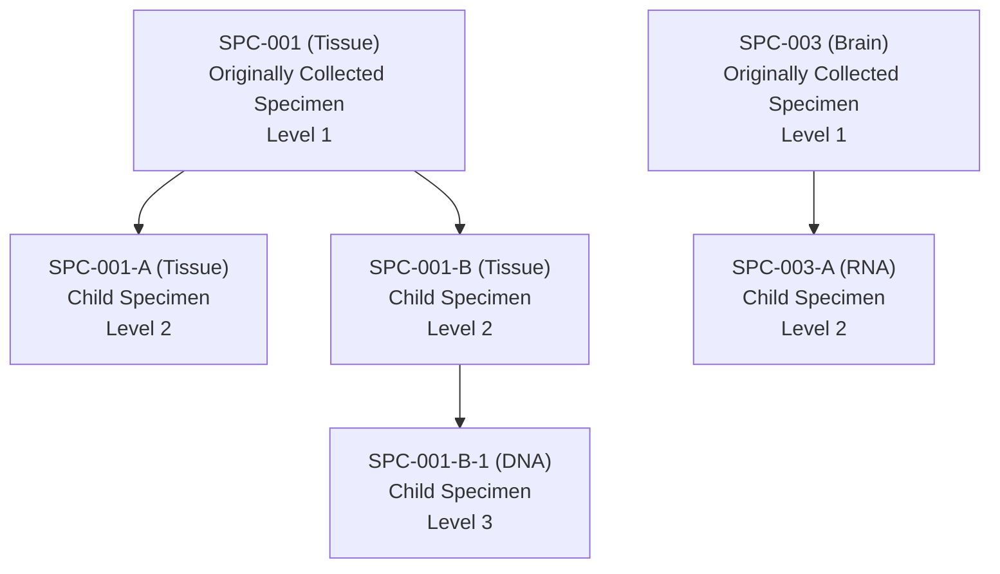

# 30_ig_ch08_ch10

> **NotebookLM Source Metadata** (由 merge_sources.py 生成, 供 NotebookLM 索引 + citation 反查)
>
> - **Bucket ID**: `30`
> - **Concept**: IG: ch08 relationships + ch10 appendices
> - **Merged files**: 2
> - **Words**: 12,933
> - **Chars**: 78,866
> - **Sources**:
>   - `chapters/ch08_relationships.md`
>   - `chapters/ch10_appendices.md`

---
## Source: `chapters/ch08_relationships.md`

# SDTMIG v3.4 — Chapter 8: Representing Relationships and Data

Source: SDTMIG v3.4, Section 8 (Pages 427-446)

## Overview

The defined variables of the SDTM general observation classes could restrict the ability of sponsors to represent all the data they wish to submit. Collected data that may not entirely fit includes relationships between records within a domain, records in separate domains, and sponsor-defined "variables." As a result, the SDTM has methods to represent distinct types of relationships, all of which are described in more detail in subsequent sections:

- **Section 8.1**, Relating Groups of Records Within a Domain Using the --GRPID Variable — representing a relationship between a group of records for a given subject within the same domain
- **Section 8.2**, Relating Peer Records — representing relationships between independent records (usually in separate domains) for a subject, such as a concomitant medication taken to treat an adverse event
- **Section 8.3**, Relating Datasets — representing a relationship between 2 (or more) datasets where records of 1 (or more) dataset(s) are related to record(s) in another dataset (or datasets)
- **Section 8.4**, Relating Non-standard Variable Values to a Parent Domain — the method for representing the dependent relationship where data that cannot be represented by a standard variable within DM or a GOC domain record can be related back to that record
- **Section 8.5**, Relating Comments to a Parent Domain — representing a dependent relationship between a comment in the CO domain and a parent record in other domains
- **Section 8.6**, How to Determine Where Data Belong in SDTM-Compliant Data Tabulations — the concept of related datasets and where to place additional data
- **Section 8.7**, Relating Subjects — representing collected relationships between persons, both of whom are study subjects (e.g., "MOTHER, BIOLOGICAL"; "CHILD, BIOLOGICAL"; "TWIN, DIZYGOTIC")
- **Section 8.8**, Related Specimens — a dataset used to represent relationships between specimens

All relationships make use of the standard domain identifiers STUDYID, DOMAIN, and USUBJID. In addition, the variables IDVAR and IDVARVAL are used for identifying the record-level merge/join keys. These keys are used to tie information together by linking records. The following are examples of variables that could be used in IDVAR:

- The sequence number (--SEQ) variable uniquely identifies a record for a given USUBJID within a domain. --SEQ is required in all domains except DM. Conventions for establishing and maintaining --SEQ values are sponsor-defined. Values may or may not be sequential depending on data processes and sources.
- The reference identifier (--REFID) variable can be used to capture a sponsor-defined or external identifier, such as lab-specimen identifiers and ECG identifiers. --REFID is permissible in all general observation-class domains, but is never required. Values are sponsor-defined.
- The grouping identifier (--GRPID) variable, used to link related records for a subject within a domain, is explained in Section 8.1.

---

## 8.1 Relating Groups of Records Within a Domain Using --GRPID

The optional grouping identifier variable --GRPID is Permissible in all domains that are based on the general observation classes. It is used to identify relationships between records within a USUBJID within a single domain (e.g., intervention records for a combination therapy where treatments in the combination varies from subject to subject). In such cases, the relationship is defined by assigning the same unique character value to the --GRPID variable. The values used for --GRPID can be any values the sponsor chooses; however, if the sponsor uses values with some embedded meaning (rather than arbitrary numbers), those values should be consistent across the submission to avoid confusion. It is important to note that --GRPID has no inherent meaning across subjects or across domains.

Using --GRPID in the general-observation class domains can reduce the number of records in the RELREC, SUPP--, and CO datasets, when those datasets are submitted to describe relationships/associations for records or values to a "group" of general observation class records.

### 8.1.1 --GRPID Example

The following table illustrates --GRPID used in the Concomitant Medications (CM) domain to identify a combination therapy. In this example, both subjects 1234 and 5678 have reported 2 combination therapies, each consisting of 3 separate medications. The components of a combination all have the same value for CMGRPID. This example illustrates how CMGRPID groups information only within a subject within a domain.

**Rows 1-3:** Show 3 medications taken by subject 1234. CMGRPID="COMBO THPY 1" has been used to group these medications.

**Rows 4-6:** Show 3 different medications taken by subject 1234, with CMGRPID="COMBO THPY 2".

**Rows 7-9:** Show 3 medications taken by subject 5678. CMGRPID="COMBO THPY 1" has been used to group these medications. Note that the medications with CMGRPID "COMBO THPY 1" are completely different for subjects 1234 and 5678.

**Rows 10-12:** Show 3 different medications taken by subject 5678, with CMGRPID="COMBO THPY 2". Again, the medications with "COMBO THPY 2" are completely different for subjects 1234 and 5678.

cm.xpt:

| Row | STUDYID | DOMAIN | USUBJID | CMSEQ | CMGRPID | CMTRT | CMDECOD | CMDOSE | CMDOSU | CMSTDTC | CMENDTC |
|-----|---------|--------|---------|-------|---------|-------|---------|--------|--------|---------|---------|
| 1 | 1234 | CM | 1234 | 1 | COMBO THPY 1 | Verbatim Med A | Generic Med | 100 | mg | 2004-01-17 | 2004-01-19 |
| 2 | 1234 | CM | 1234 | 2 | COMBO THPY 1 | Verbatim Med B | Generic Med | 50 | mg | 2004-01-17 | 2004-01-19 |
| 3 | 1234 | CM | 1234 | 3 | COMBO THPY 1 | Verbatim Med C | Generic Med | 200 | mg | 2004-01-17 | 2004-01-19 |
| 4 | 1234 | CM | 1234 | 4 | COMBO THPY 2 | Verbatim Med D | Generic Med | 150 | mg | 2004-01-21 | 2004-01-22 |
| 5 | 1234 | CM | 1234 | 5 | COMBO THPY 2 | Verbatim Med E | Generic Med | 100 | mg | 2004-01-21 | 2004-01-22 |
| 6 | 1234 | CM | 1234 | 6 | COMBO THPY 2 | Verbatim Med F | Generic Med | 75 | mg | 2004-01-21 | 2004-01-22 |
| 7 | 1234 | CM | 5678 | 1 | COMBO THPY 1 | Verbatim Med G | Generic Med | 37.5 | mg | 2004-03-17 | 2004-03-25 |
| 8 | 1234 | CM | 5678 | 2 | COMBO THPY 1 | Verbatim Med H | Generic Med | 60 | mg | 2004-03-17 | 2004-03-25 |
| 9 | 1234 | CM | 5678 | 3 | COMBO THPY 1 | Verbatim Med I | Generic Med I | 20 | mg | 2004-03-17 | 2004-03-25 |
| 10 | 1234 | CM | 5678 | 4 | COMBO THPY 2 | Verbatim Med J | Generic Med | 100 | mg | 2004-03-21 | 2004-03-22 |
| 11 | 1234 | CM | 5678 | 5 | COMBO THPY 2 | Verbatim Med K | Generic Med | 50 | mg | 2004-03-21 | 2004-03-22 |
| 12 | 1234 | CM | 5678 | 6 | COMBO THPY 2 | Verbatim Med L | Generic Med | 10 | mg | 2004-03-21 | 2004-03-22 |

---

## 8.2 Relating Peer Records

The Related Records (RELREC) special-purpose dataset is used to describe relationships between records for a subject (as described in this section), and relationships between datasets (as described in Section 8.3, Relating Datasets). In both cases, relationships represented in RELREC are collected relationships, either by explicit references or checkboxes on the CRF, or by design of the CRF (e.g., vital signs captured during an exercise stress test).

A relationship is defined by adding a record to RELREC for each record to be related and by assigning a unique character identifier value for the relationship. Each record in the RELREC special-purpose dataset contains keys that identify a record (or group of records) and the relationship identifier, which is stored in the RELID variable. The value of RELID is chosen by the sponsor, but must be identical for all related records within USUBJID. It is recommended that the sponsor use a standard system or naming convention for RELID (e.g., all letters, all numbers, capitalized).

Records expressing a relationship are specified using the key variables STUDYID, RDOMAIN (the domain code of the record in the relationship), and USUBJID, along with IDVAR and IDVARVAL. Single records can be related by using a unique-record-identifier variable such as --SEQ in IDVAR. Groups of records can be related by using grouping variables such as --GRPID in IDVAR. IDVARVAL would contain the value of the variable described in IDVAR. Using --GRPID can be a more efficient method of representing relationships in RELREC, such as when relating an adverse event (or events) to a group of concomitant medications taken to treat the adverse event(s).

The RELREC dataset should be used to represent either:

- explicit relationships, such as concomitant medications taken as a result of an adverse event; or
- information of a nature that necessitates using multiple datasets, as described in Section 8.3, Relating Datasets.

### 8.2.1 Related Records (RELREC)

**RELREC — Description/Overview**

A dataset used to describe relationships between records for a subject within or across domains, and relationships of records across datasets.

**RELREC — Specification**

relrec.xpt, Related Records — Relationship. One record per related record, group of records or dataset, Tabulation.

| Variable Name | Variable Label | Type | Controlled Terms, Codelist or Format | Role | CDISC Notes | Core |
|--------------|----------------|------|--------------------------------------|------|-------------|------|
| STUDYID | Study Identifier | Char | | Identifier | Unique identifier for a study. | Req |
| RDOMAIN | Related Domain Abbreviation | Char | (DOMAIN) | Identifier | Abbreviation for the domain of the parent record(s). | Req |
| USUBJID | Unique Subject Identifier | Char | | Identifier | Identifier used to uniquely identify a subject across all studies for all applications or submissions involving the product. | Exp |
| IDVAR | Identifying Variable | Char | * | Identifier | Name of the identifying variable in the general-observation-class dataset that identifies the related record(s). Examples: --SEQ, --GRPID. | Req |
| IDVARVAL | Identifying Variable Value | Char | | Identifier | Value of identifying variable described in IDVAR. If --SEQ is the variable being used to describe this record, then the value of --SEQ would be entered here. | Exp |
| RELTYPE | Relationship Type | Char | (RELTYPE) | Record Qualifier | Identifies the hierarchical level of the records in the relationship. Values should be either "ONE" or "MANY". Used only when identifying a relationship between datasets (as described in Section 8.3, Relating Datasets). | Exp |
| RELID | Relationship Identifier | Char | | Record Qualifier | Unique value within USUBJID that identifies the relationship. All records for the same USUBJID that have the same RELID are considered related/associated. RELID can be any value the sponsor chooses, and is only meaningful within the RELREC dataset to identify the related/associated domain records. | Req |

^1^ In this column, an asterisk (*) indicates that the variable may be subject to controlled terminology. CDISC/NCI codelist values are enclosed in parentheses.

### 8.2.2 RELREC Dataset Examples

**Example 1:** This example illustrates the use of the RELREC dataset to relate records stored in separate domains for USUBJID = "123456". This example represents a situation in which a single adverse event is part of 2 collected relationships, one with 2 concomitant medications and the other with 2 laboratory findings, but there is no collected relationship between the 2 laboratory findings and the 2 concomitant medications.

**Rows 1-3:** Show the representation of a relationship between an AE record and 2 concomitant medication records.

**Rows 4-6:** Show the representation of a relationship between the same AE record and 2 laboratory findings records.

relrec.xpt:

| Row | STUDYID | RDOMAIN | USUBJID | IDVAR | IDVARVAL | RELTYPE | RELID |
|-----|---------|---------|---------|-------|----------|---------|-------|
| 1 | EFC1234 | AE | 123456 | AESEQ | 5 | | 1 |
| 2 | EFC1234 | CM | 123456 | CMSEQ | 11 | | 1 |
| 3 | EFC1234 | CM | 123456 | CMSEQ | 12 | | 1 |
| 4 | EFC1234 | AE | 123456 | AESEQ | 5 | | 2 |
| 5 | EFC1234 | LB | 123456 | LBSEQ | 47 | | 2 |
| 6 | EFC1234 | LB | 123456 | LBSEQ | 48 | | 2 |

**Example 2:** Same scenario as Example 1, but in this case the way the data were collected indicated that the concomitant medications and laboratory findings were all in a single relationship to each other and the adverse event.

relrec.xpt:

| Row | STUDYID | RDOMAIN | USUBJID | IDVAR | IDVARVAL | RELTYPE | RELID |
|-----|---------|---------|---------|-------|----------|---------|-------|
| 1 | EFC1234 | AE | 123456 | AESEQ | 5 | | 1 |
| 2 | EFC1234 | CM | 123456 | CMSEQ | 11 | | 1 |
| 3 | EFC1234 | CM | 123456 | CMSEQ | 12 | | 1 |
| 4 | EFC1234 | LB | 123456 | LBSEQ | 47 | | 1 |
| 5 | EFC1234 | LB | 123456 | LBSEQ | 48 | | 1 |

**Example 3:** Same scenario as Example 2, but the sponsor grouped the 2 concomitant medications in the CM domain using CMGRPID = "COMBO 1", allowing the relationship among these 5 records to be represented with 4, rather than 5, records in the RELREC dataset.

relrec.xpt:

| Row | STUDYID | RDOMAIN | USUBJID | IDVAR | IDVARVAL | RELTYPE | RELID |
|-----|---------|---------|---------|-------|----------|---------|-------|
| 1 | EFC1234 | AE | 123456 | AESEQ | 5 | | 1 |
| 2 | EFC1234 | CM | 123456 | CMGRPID | COMBO1 | | 1 |
| 3 | EFC1234 | LB | 123456 | LBSEQ | 47 | | 1 |
| 4 | EFC1234 | LB | 123456 | LBSEQ | 48 | | 1 |

Additional examples may be found in the domain examples such as Section 6.2.4, Disposition, Example 4, and all of the Pharmacokinetics examples in Section 6.3.5.9.3, Relating PP Records to PC Records.

---

## 8.3 Relating Datasets Using RELREC

The Related Records (RELREC) special-purpose dataset can also be used to identify relationships between datasets (e.g., a one-to-many or parent-child relationship). The relationship is defined by including a single record for each related dataset that identifies the key(s) of the dataset that can be used to relate the respective records.

Relationships between datasets should only be recorded in the RELREC dataset when the sponsor has found it necessary to split information between datasets that are related, and that may need to be examined together for analysis or proper interpretation. Note that it is not necessary to use the RELREC dataset to identify associations from data in the SUPP-- datasets or the Comments (CO) dataset to their parent general-observation class dataset records or special-purpose domain records, as both these datasets include the key variable identifiers of the parent record(s) that are necessary to make the association.

### 8.3.1 RELREC Dataset Relationship Example

**Example 1:** This example illustrates RELREC records used to represent the relationship between records in 2 datasets that have a one-to-many relationship. Note that because this is a dataset-to-dataset relationship, USUBJID and IDVARVAL are null.

relrec.xpt:

| Row | STUDYID | RDOMAIN | USUBJID | IDVAR | IDVARVAL | RELTYPE | RELID |
|-----|---------|---------|---------|-------|----------|---------|-------|
| 1 | EFC1234 | TU | | TULNKID | | ONE | 1 |
| 2 | EFC1234 | TR | | TRLNKID | | MANY | 1 |

In the sponsor's operational database, these datasets may have existed as either separate datasets that were merged for analysis, or a single dataset that may have included observations from more than 1 general observation class (e.g., Events and Findings). The value in IDVAR must be the name of the key used to merge/join the 2 datasets. In this example, the --LNKID variable is used as the key to identify the related observations. The values for the --LNKID variable in the 2 datasets are sponsor-defined. Although other variables may also serve as a single merge key when the corresponding values for IDVAR are equal, --GRPID, --SPID, --REFID, --LNKID, or --LNKGRP are typically used for this purpose.

The variable RELTYPE identifies the type of relationship between the datasets. The allowable values are ONE and MANY (controlled terminology is expected). This information defines how a merge/join would be written, and what would be the result of the merge/join. The possible combinations are:

1. **ONE and ONE.** This combination indicates that there is NO hierarchical relationship between the datasets and the records in the datasets. Only 1 record from each dataset will potentially have the same value of the IDVAR within USUBJID.

2. **ONE and MANY.** This combination indicates that there IS a hierarchical (parent-child) relationship between the datasets. One record within USUBJID in the dataset identified by RELTYPE = "ONE" will potentially have the same value of the IDVAR with many (1 or more) records in the dataset identified by RELTYPE = "MANY".

3. **MANY and MANY.** This combination is unusual and challenging to manage in a merge/join, and may represent a relationship that was never intended to convey a usable merge/join, such as described in Section 6.3.5.9.3, Relating PP Records to PC Records.

Because IDVAR identifies the keys that can be used to merge/join records between the datasets, --SEQ cannot be used. --SEQ only has meaning within a subject within a dataset, not across datasets.

---

## 8.4 Relating Non-standard Variable Values to a Parent Domain

The SDTM does not allow the addition of new variables. Therefore, the Supplemental Qualifiers special-purpose dataset model is used to capture non-standard variables (NSVs) and their association to parent records in general-observation class datasets (Events, Findings, Interventions), Demographics (DM), and Subject Visits (SV). Supplemental qualifiers are represented as separate SUPP-- datasets for each dataset containing sponsor-defined variables (see Section 8.4.2, Submitting Supplemental Qualifiers in Separate Datasets).

SUPP-- represents the metadata and data for each NSV/value combination. As the name suggests, this dataset is intended to capture additional qualifiers for an observation. Data that represent separate observations should be treated as separate observations. The Supplemental Qualifiers dataset is structured similarly to the RELREC dataset, in that it uses the same set of keys to identify parent records. Each SUPP-- record also includes the name of the qualifier variable being added (QNAM), the label for the variable (QLABEL), the actual value for each instance or record (QVAL), the origin (QORIG) of the value (see Section 4.1.8, Origin Metadata), and the evaluator (QEVAL) to specify the role of the individual who assigned the value (e.g., "ADJUDICATION COMMITTEE", "SPONSOR"). Controlled terminology for certain expected values for QNAM and QLABEL is included in Appendix C1, Supplemental Qualifiers Name Codes.

SUPP-- datasets are also used to capture **attributions**. An attribution is typically an interpretation or subjective classification of 1 or more observations by a specific evaluator, such as a flag that indicates whether an observation was considered to be clinically significant. It is possible that different attributions may be necessary in some cases; SUPP-- provides a mechanism for incorporating as many attributions as are necessary. A SUPP-- dataset can contain both objective data (where values are collected or derived algorithmically) and subjective data (attributions where values are assigned by a person or committee). For objective data, the value in QEVAL will be null. For subjective data, the value in QEVAL should reflect the role of the person or institution assigning the value (e.g., "SPONSOR", "ADJUDICATION COMMITTEE").

The combined set of values for the first 6 columns (STUDYID...QNAM) should be unique for every record. That is, there should not be multiple records in a SUPP-- dataset for the same QNAM value, as it relates to IDVAR/IDVARVAL for a USUBJID in a domain. For example, if 2 individuals (e.g., the investigator and an independent adjudicator) provide a determination regarding whether an adverse event is treatment-emergent, then separate QNAM values should be used for each set of information (e.g., "AETRTEMI", "AETRTEMA"). This is necessary to ensure that reviewers can join/merge/transpose the information back with the records in the original domain without risk of losing information.

Just as use of the optional grouping identifier variable (--GRPID) can be a more efficient method of representing relationships in RELREC, it can also be used in a SUPP-- dataset to identify individual qualifier values (SUPP-- records) related to multiple general-observation class domain records that could be grouped, such as relating an attribution to a group of ECG measurements.

### 8.4.1 Supplemental Qualifiers (SUPP--)

supp--.xpt, Supplemental Qualifiers for [domain name] — Relationship. One record per supplemental qualifier per related parent domain record(s), Tabulation.

| Variable Name | Variable Label | Type | Controlled Terms, Codelist or Format | Role | CDISC Notes | Core |
|--------------|----------------|------|--------------------------------------|------|-------------|------|
| STUDYID | Study Identifier | Char | | Identifier | Study identifier of the parent record(s). | Req |
| RDOMAIN | Related Domain Abbreviation | Char | (DOMAIN) | Identifier | Two-character abbreviation for the domain of the parent record(s). | Req |
| USUBJID | Unique Subject Identifier | Char | | Identifier | Identifier used to uniquely identify a subject across all studies for all applications or submissions involving the product. This is the value of USUBJID in the parent record(s). | Req |
| IDVAR | Identifying Variable | Char | * | Identifier | Identifying variable in the dataset that identifies the related record(s). Examples: --SEQ, --GRPID. | Exp |
| IDVARVAL | Identifying Variable Value | Char | | Identifier | Value of identifying variable of the parent record(s). | Exp |
| QNAM | Qualifier Variable Name | Char | * | Topic | The short name of the qualifier variable, which is used as a column name in a domain view with data from the parent domain. The value in QNAM cannot be longer than 8 characters, nor can it start with a number (e.g., "1TEST" is not valid). QNAM cannot contain characters other than letters, numbers, or underscores. This will often be the column name in the sponsor's operational dataset. | Req |
| QLABEL | Qualifier Variable Label | Char | | Synonym Qualifier | This is the long name or label associated with QNAM. The value in QLABEL cannot be longer than 40 characters. This will often be the column label in the sponsor's original dataset. | Req |
| QVAL | Data Value | Char | | Result Qualifier | Result of, response to, or value associated with QNAM. A value for this column is required; no records can be in SUPP-- with a null value for QVAL. | Req |
| QORIG | Origin | Char | | Record Qualifier | Because QVAL can represent a mixture of collected (on a CRF), derived, or assigned items, QORIG is used to indicate the origin of this data. Examples: "CRF", "Assigned", "Derived". See Section 4.1.8, Origin Metadata. | Req |
| QEVAL | Evaluator | Char | (EVAL) | Record Qualifier | Used only for results that are subjective (e.g., assigned by a person or a group). Should be null for records that contain objectively collected or derived data. Examples: "ADJUDICATION COMMITTEE", "STATISTICIAN", "DATABASE ADMINISTRATOR", "CLINICAL COORDINATOR". | Exp |

^1^ In this column, an asterisk (*) indicates that the variable may be subject to controlled terminology. CDISC/NCI codelist values are enclosed in parentheses.

### Key Rules

- A record in a SUPP-- dataset relates back to its parent record(s) via the key identified by the STUDYID, RDOMAIN, USUBJID, and IDVAR/IDVARVAL variables. An exception is SUPP-- dataset records that are related to Demographics (DM) records, where both IDVAR and IDVARVAL will be null because STUDYID, RDOMAIN, and USUBJID are sufficient to identify the unique parent record in DM (DM has 1 record per USUBJID)
- All records in the SUPP-- datasets must have a value for QVAL. Transposing source variables with missing/null values may generate SUPP-- records with null values for QVAL, causing the SUPP-- datasets to be extremely large. When this happens, the sponsor must delete the records where QVAL is null prior to submission
- See Section 4.5.3, Text Strings that Exceed the Maximum Length for General Observation-class Domain Variables, for information on representing data values greater than 200 characters in length
- See Appendix C1, Supplemental Qualifiers Name Codes, for controlled terminology for QNAM and QLABEL for some of the most common supplemental qualifiers. Additional QNAM values may be created as needed, following the guidelines provided in the CDISC Notes for QVAL

### 8.4.2 Submitting Supplemental Qualifiers in Separate Datasets

There is a one-to-one correspondence between a domain dataset and its Supplemental Qualifier dataset. The single SUPPQUAL dataset option that was introduced in SDTMIGv3.1 was **deprecated**. The set of supplemental qualifiers for each domain is included in a separate dataset with the name SUPP-- (where "--" denotes the source domain which the supplemental qualifiers relate back to). For example, Demographics (DM) qualifiers would be submitted in suppdm.xpt. When data have been split into multiple datasets (see Section 4.1.7, Splitting Domains), longer names such as SUPPFAMH may be needed. In cases where data about associated persons have been collected, supplemental qualifiers for Findings About events or interventions for an associated person may need to be represented (see the SDTMIG for Associated Persons). A dataset name with the SUPP fragment (e.g., SUPPAPFAMH) would be too long. In this case only, the "SUPP" portion should be shortened to "SQ" (e.g., resulting in the dataset name SQAPFAMH).

See Section 4.5.3, Text Strings that Exceed the Maximum Length for General Observation-class Domain Variables, for information on representing data values greater than 200 characters in length.

### 8.4.3 Examples

These examples illustrate how a set of SUPP-- datasets could be used to relate non-standard information to a parent domain.

**Example 1:** The 2 rows of suppae.xpt add qualifying information to adverse event data (RDOMAIN = "AE"). IDVAR defines the key variable used to link this information to the AE data (AESEQ). IDVARVAL specifies the value of the key variable within the parent AE record to which the SUPPAE record applies. The remaining columns specify the supplemental variables' names (AESOSP and AETRTEM), labels, values, origin, and who made the evaluation.

suppae.xpt:

| Row | STUDYID | RDOMAIN | USUBJID | IDVAR | IDVARVAL | QNAM | QLABEL | QVAL | QORIG | QEVAL |
|-----|---------|---------|---------|-------|----------|------|--------|------|-------|-------|
| 1 | 1996001 | AE | 99-401 | AESEQ | 1 | AESOSP | Other Medically Important SAE | Spontaneous Abortion | CRF | |
| 2 | 1996001 | AE | 99-401 | AESEQ | 1 | AETRTEM | Treatment Emergent Flag | N | Derived | SPONSOR |

**Example 2:** This example illustrates how the language used for a questionnaire might be represented. The parent domain (RDOMAIN) is QS, and IDVAR is QSCAT. QNAM holds the name of the supplemental qualifier variable being defined (QSLANG). The language recorded in QVAL applies to all of the subject's records, where IDVAR (QSCAT) equals the value specified in IDVARVAL. In this case, IDVARVAL has values for 2 questionnaires — Brief Pain Inventory (BPI) and Alzheimer's Disease Assessment Scale-Cognitive Subscale (ADAS-Cog) — for 2 separate subjects. QVAL identifies the questionnaire language version (French or German) for each subject.

suppqs.xpt:

| Row | STUDYID | RDOMAIN | USUBJID | IDVAR | IDVARVAL | QNAM | QLABEL | QVAL | QORIG | QEVAL |
|-----|---------|---------|---------|-------|----------|------|--------|------|-------|-------|
| 1 | 1996001 | QS | 99-401 | QSCAT | BPI | QSLANG | Questionnaire Language | FRENCH | CRF | |
| 2 | 1996001 | QS | 99-401 | QSCAT | ADAS-COG | QSLANG | Questionnaire Language | FRENCH | CRF | |
| 3 | 1996001 | QS | 99-802 | QSCAT | BPI | QSLANG | Questionnaire Language | GERMAN | CRF | |
| 4 | 1996001 | QS | 99-802 | QSCAT | ADAS-COG | QSLANG | Questionnaire Language | GERMAN | CRF | |

Additional examples may be found in the domain examples such as Section 5.2 Demographics, Examples 3 and 4, in Section 6.3.3, ECG Test Results, Example 1, and in Section 6.3.5.6, Laboratory Test Results, Example 1.

### 8.4.4 When Not to Use Supplemental Qualifiers

The following are examples of data that should **not** be submitted as supplemental qualifiers:

- Subject-level objective data that fit in Subject Characteristics (SC; e.g., national origin, twin type)
- Findings interpretations that should be added as an additional test code and result. An example of this would be a record for electrocardiogram interpretation where EGTESTCD = "INTP", and the same EGGRPID or EGREFID value would be assigned for all records associated with that ECG (see Section 4.5.5, Clinical Significance for Findings Observation Class Data)
- Comments related to a record or records contained within a parent dataset. Although they may have been collected in the same record by the sponsor, comments should instead be captured in the CO special-purpose domain
- Data not directly related to records in a parent domain. Such records should instead be captured in either a separate general observation class domain or special-purpose domain

---

## 8.5 Relating Comments to a Parent Domain

The Comments (CO) special-purpose domain (see Section 5.1, Comments) is used to capture unstructured free-text comments. It allows for the submission of comments related to a particular domain (e.g., Adverse Events) or those collected on separate general-comment log-style pages not associated with a domain. Comments may be related to a subject, a domain for a subject, or to specific parent records in any domain. The CO special-purpose domain is structured similarly to the Supplemental Qualifiers (SUPP--) dataset, in that it uses the same set of keys (STUDYID, RDOMAIN, USUBJID, IDVAR, and IDVARVAL) to identify related records.

All comments except those collected on log-style pages not associated with a domain are considered child records of subject data captured in domains. STUDYID, USUBJID, and DOMAIN (with the value CO) must always be populated. RDOMAIN, IDVAR, and IDVARVAL should be populated as follows:

1. Comments related only to a subject in general (likely collected on a log-style CRF page/screen) would have RDOMAIN, IDVAR, IDVARVAL null, as the only key needed to identify the relationship/association to that subject is USUBJID.
2. Comments related only to a specific domain (and not to any specific records) for a subject would populate RDOMAIN with the domain code for the domain with which they are associated. IDVAR and IDVARVAL would be null.
3. Comments related to specific domain record(s) for a subject would populate the RDOMAIN, IDVAR, and IDVARVAL variables with values that identify the specific parent record(s).

For additional information collected further describing the comment relationship to a parent record(s) that cannot be represented using the relationship variables RDOMAIN, IDVAR and IDVARVAL:

1. Values (e.g., CRF page number or name) may be placed in COREF.
2. Timing variables (e.g., VISITNUM, VISIT) may be added to the CO special-purpose domain. See Section 5.1, Comments, assumption 5 for a complete list of identifier and timing variables that can be added to the CO special-purpose domain.

As with Supplemental Qualifiers (SUPP--) and Related Records (RELREC), --GRPID and other grouping variables can be used as the value in IDVAR to identify comments with relationships to multiple domain records. The limitation of this is that a single comment may only be related to a group of records in 1 domain (RDOMAIN can have only 1 value). If a single comment relates to records in multiple domains, the comment may need to be repeated in the CO special-purpose domain to facilitate the understanding of the relationships.

---

## 8.6 Where Data Belong

### 8.6.1 Guidelines for Determining the General Observation Class

Section 2.6, Creating a New Domain, discusses when to place data in an existing domain and how to create a new domain. A key part of the process of creating a new domain is determining whether an observation represents an event, an intervention, or a finding. Begin by considering the content of the information in the light of the definitions of the 3 general observation classes (see Section 2.3, The General Observation Classes), rather than by trying to deduce the class from the information's physical structure; physical structure can sometimes be misleading. For example, from a structural standpoint, one might expect events observations to include a start and stop date. However, medical history data (data about previous conditions or events) is events data regardless of whether dates were collected.

An intervention is something that is done to a subject (possibly by the subject) that is expected to have a physiological effect. This concept of intended effect makes interventions relatively easy to recognize, although there are gray areas around some testing procedures. For example, exercise stress tests are designed to produce and then measure certain physiological effects. The measurements from such a testing procedure are findings, although some aspects of the procedure might be modeled as interventions.

An event is something that happens to a subject spontaneously. Most, although not all, events data captured in clinical trials is about medical events. Because many medical events must, by regulation, be treated as adverse events, a new Events domain will be created only for events that are clearly not adverse events; the existing Medical History (MH) and Clinical Events (CE) domains are the appropriate places to store most medical events that are not adverse events. Many aspects of medical events — including tests performed to evaluate them, interventions that may have caused them, and interventions given to treat them — may be collected in clinical trials. Where to place data on assessments of events can be particularly challenging, and is discussed further in Section 8.6.3, Guidelines for Differentiating Between Interventions, Events, Findings, and Findings About Events or Interventions.

Findings general observation class data include measurements, tests, assessments, or examinations performed on a subject in the clinical trial. These may be performed on the subject as a whole (e.g., height, heart rate), or on a specimen taken from a subject (e.g., blood sample, ECG tracing, tissue sample). Sometimes the relationship between a subject and a finding is less direct; a finding may be about an event that happened to the subject or an intervention received. Findings about events and interventions are discussed further in Section 8.6.3, Guidelines for Differentiating Between Interventions, Events, Findings, and Findings About Events or Interventions.

### 8.6.2 Guidelines for Forming New Domains

When existing domains do not fit, follow the procedure in Section 2.6 (Creating a New Domain).

### 8.6.3 Guidelines for Differentiating Between Interventions, Events, Findings, and Findings About Events or Interventions

This section discusses events, findings, and findings about events. The relationship between interventions, findings, and findings about interventions would be handled similarly.

The Findings About (FA) domain was initially created to represent findings about events, but can also be used for findings about interventions. This section discusses events and findings generally, but it is particularly useful for understanding the distinction between the Clinical Events (CE) and FA domains.

There may be several sources of confusion about whether a particular piece of data belongs in an Event record or a Findings record. Although an "event" is generally perceived as something that happens spontaneously, and has a beginning and end, one should consider the following:

- Events of interest in a particular trial may be prespecified, rather than collected as free text.
- Some events may be so long-lasting that they are perceived as "conditions" rather than events, and their beginning and end dates are not of interest.
- Some variables or data items one generally expects to see in an Events record may not be present. For example, a post-marketing study might collect the occurrence of certain adverse events, but no dates.
- Properties of an event may be measured or assessed, and these are then treated as findings about events, rather than as events.
- Some assessments of events (e.g., severity, relationship to study treatment) have been built into the SDTM Events model as qualifiers, rather than being treated as findings about events.
- Sponsors may choose how they define an event. See Section 6.2.1, Adverse Events, assumption 7e.

The structure of the data being considered, although not definitive, will often help determine whether the data represent an event or a finding. The following table presents questions that may assist sponsors in deciding where data should be placed in SDTM.

| Question | Interpretation of Answers |
|----------|--------------------------|
| Is this a measurement, with units, etc.? | A "Yes" answer indicates a finding. If the measurement is of some aspect of an event, it may be represented as a finding about the event. A "No" answer is inconclusive. |
| Are the data collected in a CRF for each visit, or an overall CRF log form? | Log forms (forms that are completed over the course of the study rather than at a single visit) suggest Events or Interventions general observation class data. Dates collected are usually start and end dates of an event or intervention. Dates when the information was collected are generally not of interest and are usually not recorded by the investigator. Observations made at individual visits are usually planned findings. Data collected at an initial visit may include information about past events and interventions, as well as findings. |
| What date/times are collected? | If the dates collected are start and/or end dates, then data are probably about an event or intervention. If the dates collected are dates of assessments, then data probably represent a finding. If dates of collection are different from other dates collected, it suggests that data are historical or are about an event or intervention that happened independently of the study schedule for data collection. |
| Is verbatim text collected and then coded? | A "Yes" answer suggests that this is Events or Interventions general observation class data. However, Findings general observation class data from an examination (e.g., physical examination) that identifies abnormalities may also be coded. Note that for Events and Interventions general observation class data, the topic variable is coded, whereas for Findings general observation class data, the result is coded. |
| If this is data about an event, does it apply to the event as a whole? | A "Yes" answer suggests this is traditional Events general observation class data, and it should have a record in an Events domain. A "No" answer suggests that there are multiple time-based findings about an event, and that these data should be treated as Findings About data. |
| Does this data meet the criteria for representation in a Questionnaires, Ratings, and Scales (QRS) domain? | The criteria for QRS are available at: https://www.cdisc.org/foundational/qrs. There are many standard questionnaires and rating scales that collect information about symptoms. The fact that these data are findings about symptoms does not mean that the data should be represented in FA rather than a QRS domain (QS, FT, or RS). Data about symptoms may be collected in a format that is usually associated with questionnaires and rating scales (e.g., visual analog scale). This format alone does not mean that the data should be represented in a QRS domain. |

A record in the Events general observation class is intended to represent the event as a whole. (Note that sponsors may choose how they define the "event as a whole." See Section 6.2.1, Adverse Events, assumption 7e.) Such a record typically includes what the condition was (captured in --TERM, the topic variable) and when it happened (captured in its start and/or end dates). Other qualifier values (e.g., severity, seriousness) apply to the totality of the event.

Data that do not describe the event as a whole should not be stored in the record for that event or in a --SUPP record tied to that event. If there are multiple assessments of an event, then each should be stored in a separate FA record.

When data related to an event do not fit into one of the existing Event general observation class qualifiers, the first question to consider is whether the data represent information about the event itself, or about something (a finding or intervention) that is associated with the event.

- If the data consist of a finding or intervention that is associated with the event, it is likely that it can be stored in a relevant Findings or Intervention general observation class dataset, with the connection to the Event record being captured using RELREC. For example, if a subject had a fever of 102°F that was treated with aspirin, the fever would be stored in an AE record, the temperature could be stored in a Vital Signs record, and the aspirin could be stored in a Concomitant Medication record; RELREC might be used to link those records.
- If the data item contains information about the event, then the choices for representing it are a supplemental qualifier or in an FA record. The data should be represented as a supplemental qualifier unless circumstances rule out the use of a supplemental qualifier. If a supplemental qualifier is not appropriate, the data may be stored in FA. See Section 6.4.1, When to Use Findings About Events or Interventions.

---

## 8.7 Related Subjects (RELSUB)

### Specification

| Variable | Label | Type | Core |
|----------|-------|------|------|
| STUDYID | Study Identifier | Char | Req |
| USUBJID | Unique Subject Identifier | Char | Exp |
| POOLID | Pool Identifier | Char | Perm |
| RSUBJID | Related Subject or Pool Identifier | Char | Req |
| SREL | Subject Relationship to Related Subject/Pool | Char | Req |

### Assumptions

1. RELSUB is used to represent relationships between persons, both of whom are study subjects. A relationship between a study subject and a person who is not a study subject may not be represented in RELSUB; this may only be reported in APRELSUB. The existence of the RELSUB dataset should not affect whether relationships are collected; that should remain a decision based on the needs of the particular study.
2. The variable POOLID was developed for nonclinical studies, where assessments may be made for groups of animals, and identifiers are needed for those groups (pools). It is included here because POOLID can be used for human clinical trials, if necessary. If POOLID is submitted, the POOLDEF dataset must be submitted.
3. If POOLID is submitted, then in any record, 1 and only 1 of USUBJID and POOLID must be populated.
4. If the study does not include the use of POOLID, then USUBJID must be populated in every record.
5. RSUBJID must be a USUBJID value present in the Demographics (DM) domain. RSUBJID must be populated in every record.
6. Values of SREL should be taken from the CDISC Controlled Terminology codelist RELSUB wherever possible. However, if an appropriate term does not exist in the codelist, another term may be used. The SREL term should not be less specific than the verbatim term collected. For instance, it would be inappropriate to record a relationship using the term "RELATIVE, FIRST DEGREE" when the collected relationship was "brother".
7. Every relationship between 2 study subjects is represented in RELSUB as 2 directional representations: (1) with the first subject's identifier in USUBJID and the second subject's identifier in RSUBJID, and (2) with the second subject's identifier in USUBJID and the first subject's identifier in RSUBJID. The SREL values in the 2 records will describe the same relationship, but from the viewpoint of each subject (e.g., "MOTHER, BIOLOGICAL"; "CHILD, BIOLOGICAL").
8. All collected relationships between subjects should be recorded in RELSUB. In some cases, 2 subjects may have more than 1 relationship. For instance, a woman might be both maternal aunt and wet nurse to an infant. When there are multiple relationships between 2 subjects, each relationship will be represented by 2 records in RELSUB.

### Example

Example 1: The following data are from a hemophilia study (HEM021) in which the study subjects are a pair of fraternal (dizygotic) twins and their mother.

Some expected and required variables not needed to illustrate the example are not shown.

**Row 1:** Subject is the mother.
**Rows 2-3:** Subjects are the children.

dm.xpt:

| Row | STUDYID | DOMAIN | USUBJID | BRTHDTC | AGE | AGEU | SEX |
|-----|---------|--------|---------|---------|-----|------|-----|
| 1 | HEM021 | DM | HEM021-001 | 1941-05-16 | 60 | YEARS | F |
| 2 | HEM021 | DM | HEM021-002 | 1965-04-12 | 35 | YEARS | M |
| 3 | HEM021 | DM | HEM021-003 | 1965-04-12 | 35 | YEARS | M |

The RELSUB table is for the 3 subjects whose demography data is shown in the preceding table.

**Rows 1-2:** The relationship of the mother to the 2 children.
**Rows 3, 5:** The relationships of the children to the mother.
**Rows 4, 6:** The relationships of the children to each other.

relsub.xpt:

| Row | STUDYID | USUBJID | RSUBJID | SREL |
|-----|---------|---------|---------|------|
| 1 | HEM021 | HEM021-001 | HEM021-002 | MOTHER, BIOLOGICAL |
| 2 | HEM021 | HEM021-001 | HEM021-003 | MOTHER, BIOLOGICAL |
| 3 | HEM021 | HEM021-002 | HEM021-001 | CHILD, BIOLOGICAL |
| 4 | HEM021 | HEM021-002 | HEM021-003 | TWIN, DIZYGOTIC |
| 5 | HEM021 | HEM021-003 | HEM021-001 | CHILD, BIOLOGICAL |
| 6 | HEM021 | HEM021-003 | HEM021-002 | TWIN, DIZYGOTIC |

---

## 8.8 Related Specimens (RELSPEC)

> **Note:** BE, BS, and RELSPEC domain specifications, assumptions, and examples were copied and minimally updated from the provisional SDTMIG-PGx, published 2015-05-26. This was done in preparation for the retirement of the SDTMIG-PGx upon publication of SDTMIG v3.4. These domains are currently under extensive revision for inclusion in a future SDTMIG.

### RELSPEC — Description/Overview

A dataset used to represent relationships between specimens.

### Specification

relspec.xpt, Related Specimens — Relationship. One record per specimen identifier per subject, Tabulation.

| Variable Name | Variable Label | Type | Controlled Terms, Codelist or Format | Role | CDISC Notes | Core |
|--------------|----------------|------|--------------------------------------|------|-------------|------|
| STUDYID | Study Identifier | Char | | Identifier | Unique identifier for a study. | Req |
| USUBJID | Unique Subject Identifier | Char | | Identifier | Identifier used to uniquely identify a subject across all studies for all applications or submissions involving the product. | Req |
| REFID | Specimen ID | Char | | Identifier | Specimen identifier, unique within USUBJID. | Req |
| SPEC | Specimen Type | Char | (SPECTYPE)(GENSMP) | Variable Qualifier | Defines the type of specimen used for a measurement. Examples: "SERUM", "PLASMA", "URINE", "SOFT TISSUE". | Perm |
| PARENT | Specimen Parent | Char | | Identifier | Identifies the REFID of the parent of a specimen to support tracking its genealogy. | Exp |
| LEVEL | Specimen Level | Num | | Variable Qualifier | Identifies the generation number of the sample where the collected sample is considered the first generation. | Req |

### Assumptions

1. The RELSPEC dataset is not used to manage relationships between any other datasets or domains.
2. The RELSPEC dataset is only used to maintain relationships between specimens, therefore it does not require any additional variables such as those used in RELREC.
3. There are three CDISC controlled terminology codelists that may be applicable to SPEC: SPEC (C77529), SPECTYPE (C78734), and GENSMP (C111114). Sponsors are responsible for determining the most appropriate codelist(s) for their submission.

### Example

Example 1: This example uses the sample specimen lineage illustrated below.

**Figure. Sample Specimen Relationship**

A specimen with a LEVEL value of "1" and a blank value for PARENT indicates a collected sample. All other values represent a derived sample. SPEC reflects the specimen type for the sample regardless of whether it is collected or derived.

relspec.xpt:

| Row | STUDYID | USUBJID | REFID | SPEC | PARENT | LEVEL |
|-----|---------|---------|-------|------|--------|-------|
| 1 | ABC-123 | 001-01 | SPC-001 | TISSUE | | 1 |
| 2 | ABC-123 | 001-01 | SPC-001-A | TISSUE | SPC-001 | 2 |
| 3 | ABC-123 | 001-01 | SPC-001-B | TISSUE | SPC-001 | 2 |
| 4 | ABC-123 | 001-01 | SPC-001-B-1 | DNA | SPC-001-B | 3 |
| 5 | ABC-123 | 001-01 | SPC-003 | TISSUE | | 1 |
| 6 | ABC-123 | 001-01 | SPC-003-A | RNA | SPC-003 | 2 |

## Source: `chapters/ch10_appendices.md`

# SDTMIG v3.4 — Chapter 10: Appendices

Source: SDTMIG v3.4, Appendices A-F (Pages 444-461)

---

## Appendix A: CDISC SDS Team

The CDISC SDS Team would like to thank the many volunteers who contributed to the development, review, and publication of SDTMIG v3.4. Additionally, this publication would not have been possible without the support of the Foundational Team Leads, Global Governance Group, Regulatory Liaisons, and CDISC.

The contributor table lists approximately 70 individuals from pharmaceutical companies (e.g., Merck, GSK, Pfizer, Bayer, Boehringer Ingelheim, AstraZeneca, Biogen, Allergan, Eli Lilly), CROs (e.g., Charles River Laboratories, IQVIA, PRA Health Sciences, Emmes), regulatory and standards bodies (NCI-EVS), technology and data vendors (Quality Data Services, Clinical Solutions Group/IQVIA, Data Standards Consulting, Transendix LLC), and independent contractors. CDISC staff coordinated the project (Dana Booth, Project Manager). A full list of names and affiliations is available in the source PDF (SDTMIG v3.4, page 444).

---

## Appendix B: Glossary and Abbreviations

The following table lists some of the abbreviations and terms are used in this document. Additional definitions can be found in the individual sections of this document (see esp. Section 7.1.2, Definitions of Trial Design Concepts) and in the CDISC Glossary (available at https://www.cdisc.org/standards/glossary).

| Abbreviation | Full Term |
|-------------|-----------|
| ADaM | CDISC Analysis Dataset Model |
| ADSL | (ADaM) Subject-level Analysis Dataset |
| ATC | Anatomic Therapeutic Chemical (code; WHO) |
| CDASH | Clinical Data Acquisition Standards Harmonization |
| CDISC | Clinical Data Interchange Standards Consortium |
| CRF | Case report form (sometimes case record form) |
| CRO | Contract research organization |
| CTCAE | Common Terminology Criteria for Adverse Events |
| Dataset | A collection of structured data in a single file |
| Define-XML | CDISC standard for transmitting metadata that describes any tabular dataset structure |
| Domain | A collection of observations with a topic-specific commonality |
| eDT | Electronic data transfer |
| FDA | (US) Food and Drug Administration |
| HL7 | Health Level 7 |
| ICH | International Conference on Harmonisation of Technical Requirements for Registration of Pharmaceuticals for Human Use |
| ICH E2A | ICH guidelines on Clinical Safety Data Management: Definitions and Standards for Expedited Reporting |
| ICH E2B | ICH guidelines on Clinical Safety Data Management: Data Elements for Transmission of Individual Cases Safety Reports |
| ICH E3 | ICH guidelines on Structure and Content of Clinical Study Reports |
| ICH E9 | ICH guidelines on Statistical Principles for Clinical Trials |
| ISO | International Organization for Standardization |
| ISO 8601 | ISO character representation of dates, date/times, intervals, and durations of time. The SDTM uses the extended format |
| ISO 3166 | ISO codelist for representing countries; the Alpha-3 codelist uses 3-character codes |
| LOINC | Logical Observation, Identifiers, Names, and Codes |
| MedDRA | Medical Dictionary for Regulatory Activities |
| NCI | National Cancer Institute (NIH) |
| NSV | Non-standard variable |
| PRO | Patient-reported outcome |
| SAP | Statistical analysis plan |
| SDS | Submission Data Standards. Also the name of the team that created the SDTM and SDTMIG |
| SDTM | Study Data Tabulation Model |
| SDTMIG | Study Data Tabulation Model Implementation Guide: Human Clinical Trials |
| SDTMIG-AP | Study Data Tabulation Model Implementation Guide: Associated Persons |
| SDTMIG-MD | Study Data Tabulation Model Implementation Guide for Medical Devices |
| SDTMIG-PGx | Study Data Tabulation Model Implementation Guide: Pharmacogenomics/Genetics |
| SEND | Standard for Exchange of Non-Clinical Data |
| SNOMED | Systematized Nomenclature of Medicine (a dictionary) |
| SOC | System organ class |
| TDM | Trial Design Model |
| WHODRUG | World Health Organization Drug Dictionary |
| XML | eXtensible Markup Language |

---

## Appendix C: Controlled Terminology

CDISC Terminology is centrally managed by the CDISC Controlled Terminology Team, supporting the terminology needs of all CDISC foundational standards (SDTM, CDASH, ADaM, SEND) and all disease/therapeutic area standards.

### Key Points

- New/modified terms have a 3-month development period with quarterly public-review comment period followed by publication release
- Visit the CDISC Controlled Terminology page (https://www.cdisc.org/standards/terminology/controlled-terminology) for the most recently published terminology packages (final or under review)
- The NCI Enterprise Vocabulary Services CDISC Terminology website (https://www.cancer.gov/research/resources/terminology/cdisc) provides access to the full list of CDISC terminology
- SDTM terminology was previously provided separately for questionnaires and other domains; as of the 2015-12-18 release, these were merged into a single publication
- Earlier versions of the SDTMIG included several appendices regarding controlled terminology. Starting with SDTMIG 3.2, Appendix C was simplified. Appendix C1 will be considered for expansion in the next version, to contain a complete list of supplemental qualifiers used in the SDTMIG

### Appendix C1: Supplemental Qualifiers Name Codes

An initial set of standard name codes for use in supplemental qualifiers (SUPP--) datasets:

| QNAM | QLABEL | Applicable Domains |
|------|--------|--------------------|
| AESOSP | Other Medically Important SAE | AE |
| AETRTEM | Treatment Emergent Flag | AE |
| --REAS | Reason | Intervention domains where the reason is other than a medical indication. May be used in select Event domains (e.g., Healthcare Encounters) where the topic is not a medical condition |

---

## Appendix D: CDISC Variable-naming Fragments

The CDISC SDS group has defined a standard list of fragments to use as a guide when naming variables in SUPP-- datasets (as QNAM) or assigning --TESTCD values.

### Rules for Using Fragments

- The general rule is to use the fragment(s) that best conveys the meaning within the 8-character limit
- The longer fragment should be used when space allows
- If the combination still exceeds 8 characters, drop characters where most appropriate (avoiding naming conflicts)

### Fragment Reference Table

| Keyword(s) | Fragment | | Keyword(s) | Fragment |
|-----------|----------|-|-----------|----------|
| ACTION | ACN | | INDICATOR | IND |
| ADJUSTMENT | ADJ | | INTERPRETATION | INTP |
| ANALYSIS DATASET | AD | | INTERVAL | INT |
| ASSAY | AS | | INVESTIGATOR | INV |
| BASELINE | BL | | LIFE-THREATENING | LIFE |
| BIRTH | BRTH | | LOCATION | LOC |
| BODY | BOD | | LOINC CODE | LOINC |
| CANCER | CAN | | LOWER LIMIT | LO |
| CATEGORY | CAT | | NAME | NAM |
| CHARACTER | C | | NOT DONE | ND |
| CLASS | CLAS | | NUMBER | NUM |
| CLINICAL | CL | | NUMERIC | N |
| CODE | CD | | OBJECT | OBJ |
| COMMENT | COM | | ONGOING | ONGO |
| CONCOMITANT | CON | | ORDER | ORD |
| CONDITION | CND | | ORIGIN | ORIG |
| CONGENITAL | CONG | | ORIGINAL | OR |
| DATE TIME - CHARACTER | DTC | | OTHER | OTH, O |
| DAY | DY | | OUTCOME | OUT |
| DEATH | DTH | | OVERDOSE | OD |
| DECODE | DECOD | | PARAMETER | PARM |
| DERIVED | DRV | | PATTERN | PATT |
| DESCRIPTION | DESC | | POPULATION | POP |
| DISABILITY | DISAB | | POSITION | POS |
| DOSE, DOSAGE | DOS, DOSE | | QUALIFIER | QUAL |
| DURATION | DUR | | REASON | REAS |
| ELAPSED | EL | | REFERENCE | REF, RF |
| ELEMENT | ET | | REGIMEN | RGM |
| EMERGENT | EM | | RELATED | REL, R |
| END | END, EN | | RELATIONSHIP | REL |
| ETHNICITY | ETHNIC | | RESULT | RES |
| EVALUATION | EVL | | RULE | RL |
| EVALUATOR | EVAL | | SEQUENCE | SEQ |
| EXTERNAL | X | | SERIOUS | S, SER |
| FASTING | FAST | | SEVERITY | SEV |
| FILENAME | FN | | SIGNIFICANT | SIG |
| FLAG | FL | | SPECIMEN | SPEC, SPC |
| FORMULATION, FORM | FRM | | SPONSOR | SP |
| FREQUENCY | FRQ | | STANDARD | ST, STD |
| GRADE | GR | | START | ST |
| GROUP | GRP | | STATUS | STAT |
| HOSPITALIZATION | HOSP | | NORMAL RANGE | NR |
| IDENTIFIER | ID | | SUBJECT | SUBJ |
| INDICATION | INDC | | SUBCATEGORY | SCAT |
| MEDICALLY-IMPORTANT EVENT | MIE | | SUPPLEMENTAL | SUPP |
| NON-STUDY THERAPY | NST | | |
| | | | SYSTEM | SYS |
| | | | TEXT | TXT |
| | | | TIME | TM |
| | | | TIME POINT | TPT |
| | | | TOTAL | TOT |
| | | | TOXICITY | TOX |
| | | | TRANSITION | TRANS |
| | | | TREATMENT | TRT |
| | | | UNIQUE | U |
| | | | UNIT | U |
| | | | UNPLANNED | UP |
| | | | UPPER LIMIT | HI |
| | | | VALUE | VAL |
| | | | VARIABLE | VAR |
| | | | VEHICLE | V |

---

## Appendix E: Revision History

This appendix provides an overview only of revisions since the last production version, SDTMIG v3.3; not all revisions are included.

- A Diff file with details of changes to domain specification tables is available as a member benefit on the CDISC Library Archives page in the Members Only Area of the CDISC website (https://www.cdisc.org/members-only/cdisc-library-archives), and those changes are not repeated here.
- Public review comments and their dispositions will be available upon publication of the SDTMIG.

### General Changes Throughout

- Text and examples clarified as needed
- Text updated to reflect new table names in SDTM v2.0
- Values updated to current CDISC Controlled Terminology
- ISO formats made more granular
- New variables from SDTM v2.0 added
- Domain tables replaced with sectional table of contents
- Supplemental qualifier variable names updated to include 2-character domain abbreviations
- Assumptions providing domain definitions removed (now in Description/Overview)
- Numbered lists in CDISC Notes converted to text for consistency
- Links were updated as needed
- Typographical errors were corrected

### New Domains for SDTMIG v3.4

| Domain | Description |
|--------|-------------|
| BE | Biospecimen Events |
| BS | Biospecimen Findings |
| CP | Cell Phenotyping Findings |
| GF | Genomics Findings |
| RELSPEC | Related Specimens |

### Decommissioning of MO (Morphology)

The following domain was removed:

- Morphology (MO)

When the Morphology domain was introduced in SDTMIG v3.2, the SDS Team planned to represent morphology and physiology findings in separate domains: morphology findings in the MO domain and physiology findings in separate domains by body systems. Since then, the team found that separating morphology and physiology findings was more difficult than anticipated and provided little added value. This led to the decision to expand the body system-based domains to cover both morphology and physiology findings and to deprecate MO in SDTMIG v3.4. Submissions using that later SDTMIG version would represent morphology results in the appropriate body system-based physiology/morphology domain.

For data prepared using a version of the SDTMIG that includes both the MO domain and body system-based physiology/morphology domains, morphology findings may be represented in either the MO domain or in a body-system based physiology/morphology domain. Custom body system-based domains may be used if the appropriate body system-based domain is not included in the SDTMIG version being used.

### Key Section-by-Section Changes

In addition to the general changes described above, the following table provides an overview of changes by section.

| Section Number | Section Name | Change(s) |
|---------------|--------------|-----------|
| **Section 1. Introduction** | | |
| 1.3 | Relationship to Prior CDISC Documents | Rather than referring to all sections with significant changes, some of the more significant changes since SDTMIG v3.3 are highlighted in a bulleted list |
| **Section 2. Fundamentals of the SDTM** | | |
| 2.1 | Observations and Variables | Revised definition for Rule Variables |
| 2.5 | The SDTM Standard Domain Models | Domain-specific versioning (introduced in SDTMIG v3.3) removed; domain version numbers removed for each domain; removed sentence referring to FDA repository; added reference to Define-XML standard for details on no data availability |
| 2.6 | Creating a New Domain | SA added to bullet 3e to reserve the domain code for CDASH; SQ also added as it occurs in the SDTMIG-AP |
| 2.7 | SDTM Variables Not Allowed in the SDTMIG | Updated based on Usage Restrictions column of Study Data Tabulation Model 2.0; Moved --METHOD (Interventions) from not-evaluated list to list of variables not to be used; updated order of list to match order within the model |
| **Section 3. Submitting Data in a Standard Format** | | |
| 3.2 | Using the CDISC Domain Models in Regulatory Submissions — Dataset Metadata | Removed paragraph about empty datasets for small PK studies per MSG v2.0 and Define-XML v2.1 standard |
| 3.2.1 | Dataset-level Metadata | Changes to SDTMIG Content Control appear in this table; new domains added and MO removed |
| 3.2.1.2 | CDISC Submission Value-level Metadata | The phrase "the SDTMIG V3.x" removed from the first sentence |
| **Section 4. Assumptions for Domain Models** | | |
| 4.1 | General Domain Assumptions | QRS Examples for splitting questionnaires updated; Origin Metadata traceability clarified |
| 4.2 | General Variable Assumptions | Added CDISC note on acceptable USUBJID formats; 4.2.6 numbering reworked; new subsection 4.2.7.4 "Specify" Values for --OBJ added; added information about ASCII characters to Section 4.2.9 |
| 4.4 | Actual and Relative Time Assumptions | Updated unknown values from U to UNKNOWN; clarified reference time point; added note that --STDTC is not used in Findings class domains; clarified use of --DRVFL |
| 4.5 | Original and Standardized Results | Clarified description of --DRVFL; two QRS exceptions added to 4.5.1.2; corrected IDVARVAL in supppr.xpt Example 3; promoted --CLSIG to SDTM variable; clarified --REASPF, --REAS, and --REASOC usage; added text for pre-specified groups of interventions or events in --TRT or --TERM |
| **Section 5. Models for Special-purpose Domains** | | |
| 5 | Models for Special-purpose Domains | All SDTMIG v3.4 metadata specifications updated to reflect ISO 8601 granularity |
| 5.1 | Comments (CO) | Assumption 2 added; VISIT, VISITNUM, and VISITDY removed from list of generally not used variables; clarity added to Assumption 1 regarding adverse events and clinical events |
| 5.2 | Demographics (DM) | Revised DM.COUNTRY CDISC Notes; Assumption 6 updated for race self-identification; updated assumption 6a to reference Racec-Ethnicc Codetable; extensive DM example updates |
| 5.3 | Subject Elements (SE) | Added SESTDY and SEENDY |
| 5.4 | Subject Disease Milestones (SM) | Updated CDISC notes for USUBJID for consistency |
| 5.5 | Subject Visits (SV) | Domain considered for moving to Events but kept as Subject Visits; now contains visits that did not occur; new variables added: SVPRESP, SVOCCUR, SVREASOC, SVCNTMOD, SVEPCHGI |
| **Section 6. Domain Models Based on the General Observation Classes** | | |
| 6.1 | Models for Interventions Domains | Roles of --DOSFRQ and --DOSRGM changed where used in the Interventions Domains to Record Qualifier for consistency with the change for the role of --DOSFRQ and --DOSRGM in the SDTM |
| 6.1.2 | Concomitant/Prior Medications (CM) | Example 5 is new |
| 6.1.3 | Exposure Domains | EX assumptions updated to note that since EX includes only treatments received, --MOOD would generally not be used in EX; ECREASOC added (promoted from supplemental qualifier to standard variable); examples updated |
| 6.1.5 | Procedures (PR) | PRSEQ's CDISC Notes updated to reflect that Sequence Number is given to ensure uniqueness of subject records within a domain; added CT reference for PRDECOD variable; more explanations provided in examples for why values in PRTRT are in mixed case |
| 6.2 | Models for Events Domains | BE Domain specification and examples copied from SDTMIG-PGx (originally published 2015-05-26), to be deprecated with publication of SDTMIG v3.4 |
| 6.2.1 | Adverse Events (AE) | New AE variables for Medical Devices added: SPDEVID, AEACNDEV, AEUNANT, AERLPRC, AERLPRT, AERLDEV, AESINTV; new Examples 5 and 6; deleted AE Assumption 2e as superseded; Assumption 6 (Actions taken) added |
| 6.2.2 | Biospecimen Events (BE) | Specification, assumptions, and examples copied from SDTMIG-PGx (published 2015-05-26); BETERM and BEDECOD updated; PF updated to GF; to be deprecated with publication of SDTMIG v3.4 |
| 6.2.3 | Clinical Events (CE) | Added permissible variable CETOXGR; added fracture events example; Examples 1 and 2 revised for clarity |
| 6.2.4 | Disposition (DS) | DSDY's Core value updated to Perm (from Exp); DSSTDY's Core value updated to Exp (from Perm); added reference to DS Codetable; updated Example 9 |
| 6.2.5 | Healthcare Encounters (HO) | Example 5 and Assumption 5 corrected to refer to Events qualifiers |
| 6.2.6 | Medical History (MH) | Example 5 added to illustrate presence of prespecified events |
| 6.2.7 | Protocol Deviations (DV) | Revised label for DVENDY to 'Study Day of End of Deviation Event'; Assumption 3 corrected to refer to Events qualifiers |
| 6.3 | Models for Findings Domains | BS Domain specification and examples copied from SDTMIG-PGx (originally published 2015-05-26), to be deprecated; assumptions and examples updated where --CLSIG is promoted to standard variable |
| 6.3.1 | Product Accountability (DA) | Renamed from "Drug Accountability" to "Product Accountability"; added permissible variables DALNKID and DALNKGRP; revised assumptions to describe broadened product accountability scope; excluded devices |
| 6.3.2 | Death Details (DD) | Added assumption 4 referencing the domain codetable |
| 6.3.3 | ECG Test Results (EG) | Added EGCLSIG as permissible variable; updated EGBEATNO role from "Variable Qualifier" to "Identifier" to align with SDTM v2.0; added Assumption 2a referencing the ECG codetable |
| 6.3.5 | Specimen-based Findings Domains | Added Section 6.3.5 to group domains (e.g., IS, LB, MB/MS, MI, PC/PP) that represent laboratory measurements, tests, or examinations performed on collected biological specimens |
| 6.3.5.1 | Generic Specimen-based Lab Findings Domain Specification | Added generic metadata specification for commonly used variables in specimen-based laboratory domains |
| 6.3.5.2 | Biospecimen Findings (BS) | Newly copied from SDTMIG-PGx with only minor corrections; Row 5 removed as well as reference to the Maycox paper |
| 6.3.5.3 | Cell Phenotype Findings (CP) | This is a new domain |
| 6.3.5.4 | Genomics Findings (GF) | New domain replacing the PF domain from the provisional SDTMIG-PGx; to be deprecated with publication of SDTMIG v3.4 |
| 6.3.5.5 | Immunogenicity Specimen Assessments (IS) | Domain definition updated; 6 new variables added: ISBDAGNT, ISMSCBCE, ISTSTOPO, ISTSTCND, ISNCNDAGT, and NHOID; replaced assumptions from SDTMIG v3.3; Examples 1 and 2 replaced; Examples 3-11 added |
| 6.3.5.6 | Laboratory Test Results (LB) | Revised LBTESTCD variable label to Lab Test or Examination Short Name; revised Core value for LBSTREFC to Perm (from Exp); added new variables: LBTSTCND, LBDAGNT, LBTSTOPO, LBRSLSCL, LBRESTYP, LBCOLSRT, LBLLOD, LBTMTHSN, LBCLSIG, LBPTFL, and LBPDUR; added permissible variables: LBSPCUFL, LBANMETH, LBORREF, LBSTREFN; LBORREF, LBSTREFC, and LBSTREFN removed because there is no clear use case; updated several assumptions; added Assumption 8; revised Examples 1-3; added Examples 4 and 5 |
| 6.4 | Findings About Events or Interventions | Added "Events or Interventions" to the FA domain name; added assumption 4a referencing the CV codetable |
| 6.4.1 | When to Use Findings About Events or Interventions | Additional explanation and examples added for each criterion; new criterion added in version that underwent first public review was removed; new "Points to Consider" section added; third and fourth bullets dropped as criterion for representing data in FA |
| 6.4.3 | Variables Unique to Findings About | Added sentence clarifying that an FA record will not necessarily have a parent record |
| 6.4.4 | Findings About Events or Interventions (FA) | Core value for FADTC changed from "Perm" to "Exp"; updated FATEST and FATESTCD CDISC Notes to reference general codelists; added assumption 4a referencing CV Code table; extensive updates to examples for clarity |
| 6.4.5 | Skin Response (SR) | Updated CDISC Notes for USUBJID; revised representation of quadrants in Example 1; Example 3 updated per CDISC CT |
| **Section 7. Trial Design Model Datasets** | | |
| 7.2 | Experimental Design (TA and TE) | Text about executable code in Section 7.2.1.1 replaced to note that a mechanism to provide machine-readable rules will become available in the future; aligned wording for Rule variables on CDISC Notes between TA and TE; dataset name in Section 7.2.2.1 example changed from "ta.xpt" to "special.xpt" |
| 7.3.1 | Trial Visits (TV) | Made VISIT required and revised VISIT CDISC Notes |
| 7.3.2 | Trial Disease Assessments (TD) | Assumption 4 inserted to clarify that start of a schedule is the start of the interval preceding the first assessment; Examples 1 and 3 diagrams updated; values of TDSTOFF corrected |
| 7.3.3 | Trial Disease Milestones (TM) | Role of TMDEF changed from "Rule" to "Variable Qualifier" for consistency with clarification of the Rule role in SDTM |
| 7.4 | Trial Eligibility and Summary (TI and TS) | Order had been flipped here for TI and TS; has now been corrected and the section numbers updated |
| 7.4.1 | Trial Inclusion/Exclusion Criteria (TI) | The section describing the proposed removal of TIRL was added |
| 7.4.2 | Trial Summary (TS) | Changed the CDISC Notes for TSSEQ to reflect that the sequence number is to ensure uniqueness within a parameter; revisions to most TS assumptions to remove references to Appendix C1 Trial Summary Codes (as this appendix was removed); TS assumptions replaced with ones that note recipients may specify requirements and terminology; reference added for the TS Codetable on the CDISC website; revised TS Assumption 17 to clarify value expectations for TSPARMCD = "INDIC"; additional assumptions revised for clarity; information added about exploratory outcome measures; Examples 1-3 revised; new Example 4 added to show use of TSGRPID for study parts and treatments |
| **Section 8. Representing Relationships and Data** | | |
| 8 | Representing Relationships and Data | Section 8.8 (Related Specimens) added due to BE, BS, and RELSPEC being copied in from SDTMIG-PGx, originally published 2015-05-26, to be deprecated with the publication of SDTMIG v3.4 |
| 8.2.2 | RELREC Dataset Examples | Introductory text updated to more clearly describe how relationships are represented in RELREC |
| 8.4.1 | Supplemental Qualifiers (SUPP--) | Updated CDISC Notes for USUBJID to include description of the variable used in other domains; updated Appendix C2 reference to Appendix C1 |
| 8.6.2 | Guidelines for Forming New Domains | Updated section references and links |
| 8.6.3 | Guidelines for Differentiating Between Interventions, Events, Findings, and Findings About Events or Interventions | "Interventions" added to section title; some changes to text to correct typos and clarify wording; second column of second row of table revised to explain what a log form is and to clarify how the data collection format may help understand the general observation class of data collected; added a row to the table to help in deciding between QS and FA for data about symptoms; reordered sentences in paragraph after the table and reiterated reference to AE structure assumption |
| 8.8 | Related Specimens (RELSPEC) | This section was added to SDTMIG v3.4 in preparation for the eventual retirement of the SDTMIG-PGx, originally published 2015-05-26, to be deprecated with the publication of SDTMIG v3.4 |
| **Section 9. Study References** | | |
| 9 | Study References | Removed "Identifiers for pharmacogenomic/genetic biomarkers" from the list; deleted Section 9.3 PB as it was part of SDTMIG-PGx (originally published 2015-05-26, to be deprecated with the publication of SDTMIG v3.4) |
| **Appendices** | | |
| Appendix A | CDISC SDS Team | The team list has been updated |
| Appendix C | Controlled Terminology | Appendix C1 Trial Summary Codes has been removed from SDTMIG v3.4; TS Assumptions were updated to reference CDISC controlled terminology, CDISC TS codetable, and recipient (regulatory agency) implementation expectations; removed --CLSIG due to promotion as a Findings variable; added --REASOC; all references to Appendix C2 in the SDTMIG were changed to Appendix C1 |
| Appendix D | CDISC Variable-naming Fragments | "V3.x dataset" was replaced with "Findings dataset" because the V3.x terminology was somewhat confusing and is being phased out |
| Appendix E | This appendix | This appendix was updated to reflect an overview of changes from SDTMIG v3.3 to SDTMIG v3.4 |

---

## Appendix F: Representations and Warranties, Limitations of Liability, and Disclaimers

### CDISC Patent Disclaimers

It is possible that implementation of and compliance with this standard may require use of subject matter covered by patent rights. By publication of this standard, no position is taken with respect to the existence or validity of any claim or of any patent rights in connection therewith. CDISC, including the CDISC Board of Directors, shall not be responsible for identifying patents for which a license may be required in order to implement this standard or for conducting inquiries into the legal validity or scope of those patents or patent claims that are brought to its attention.

### Representations and Warranties

"CDISC grants open public use of this User Guide (or Final Standards) under CDISC's copyright."

Each Participant in the development of this standard shall be deemed to represent, warrant, and covenant, at the time of a Contribution by such Participant (or by its Representative), that to the best of its knowledge and ability: (a) it holds or has the right to grant all relevant licenses to any of its Contributions in all jurisdictions or territories in which it holds relevant intellectual property rights; (b) there are no limits to the Participant's ability to make the grants, acknowledgments, and agreements herein; and (c) the Contribution does not subject any Contribution, Draft Standard, Final Standard, or implementations thereof, in whole or in part, to licensing obligations with additional restrictions or requirements inconsistent with those set forth in the CDISC Intellectual Property Policy ("the Policy"), or that would require any such Contribution, Final Standard, or implementation, in whole or in part, to be either: (i) disclosed or distributed in source code form; (ii) licensed for the purpose of making derivative works (other than as set forth in Section 4.2 of the CDISC Intellectual Property Policy); or (iii) distributed at no charge, except as set forth in Sections 3, 5.1, and 4.2 of the Policy. If a Participant has knowledge that a Contribution made by any Participant or any other party may subject any Contribution, Draft Standard, Final Standard, or implementation, in whole or in part, to one or more of the licensing obligations listed in Section 9.3, such Participant shall give prompt notice of the same to the CDISC President who shall promptly notify all Participants.

### No Other Warranties/Disclaimers

ALL PARTICIPANTS ACKNOWLEDGE THAT, EXCEPT AS PROVIDED UNDER SECTION 9.3 OF THE CDISC INTELLECTUAL PROPERTY POLICY, ALL DRAFT STANDARDS AND FINAL STANDARDS, AND ALL CONTRIBUTIONS TO FINAL STANDARDS AND DRAFT STANDARDS, ARE PROVIDED "AS IS" WITH NO WARRANTIES WHATSOEVER, WHETHER EXPRESS, IMPLIED, STATUTORY, OR OTHERWISE, AND THE PARTICIPANTS, REPRESENTATIVES, THE CDISC PRESIDENT, THE CDISC BOARD OF DIRECTORS, AND CDISC EXPRESSLY DISCLAIM ANY WARRANTY OF MERCHANTABILITY, NONINFRINGEMENT, FITNESS FOR ANY PARTICULAR OR INTENDED PURPOSE, OR ANY OTHER WARRANTY OTHERWISE ARISING OUT OF ANY PROPOSAL, FINAL STANDARDS OR DRAFT STANDARDS, OR CONTRIBUTION.

### Limitation of Liability

IN NO EVENT WILL CDISC OR ANY OF ITS CONSTITUENT PARTS (INCLUDING, BUT NOT LIMITED TO, THE CDISC BOARD OF DIRECTORS, THE CDISC PRESIDENT, CDISC STAFF, AND CDISC MEMBERS) BE LIABLE TO ANY OTHER PERSON OR ENTITY FOR ANY LOSS OF PROFITS, LOSS OF USE, DIRECT, INDIRECT, INCIDENTAL, CONSEQUENTIAL, OR SPECIAL DAMAGES, WHETHER ARISING UNDER CONTRACT, TORT, WARRANTY, OR OTHERWISE, ARISING IN ANY WAY OUT OF THIS POLICY OR ANY RELATED AGREEMENT, WHETHER OR NOT SUCH PARTY HAD ADVANCE NOTICE OF THE POSSIBILITY OF SUCH DAMAGES.

Note: The CDISC Intellectual Property Policy can be found at http://www.cdisc.org/system/files/all/article/application/pdf/cdisc_20ip_20policy_final.pdf
