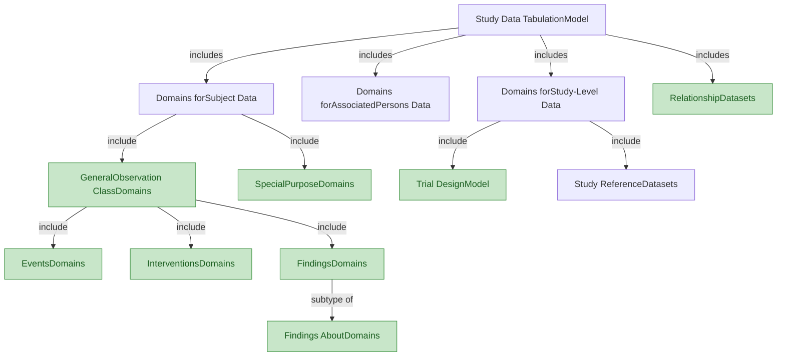
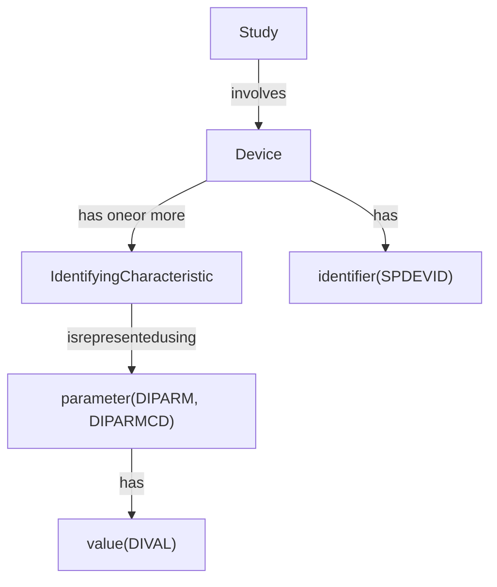
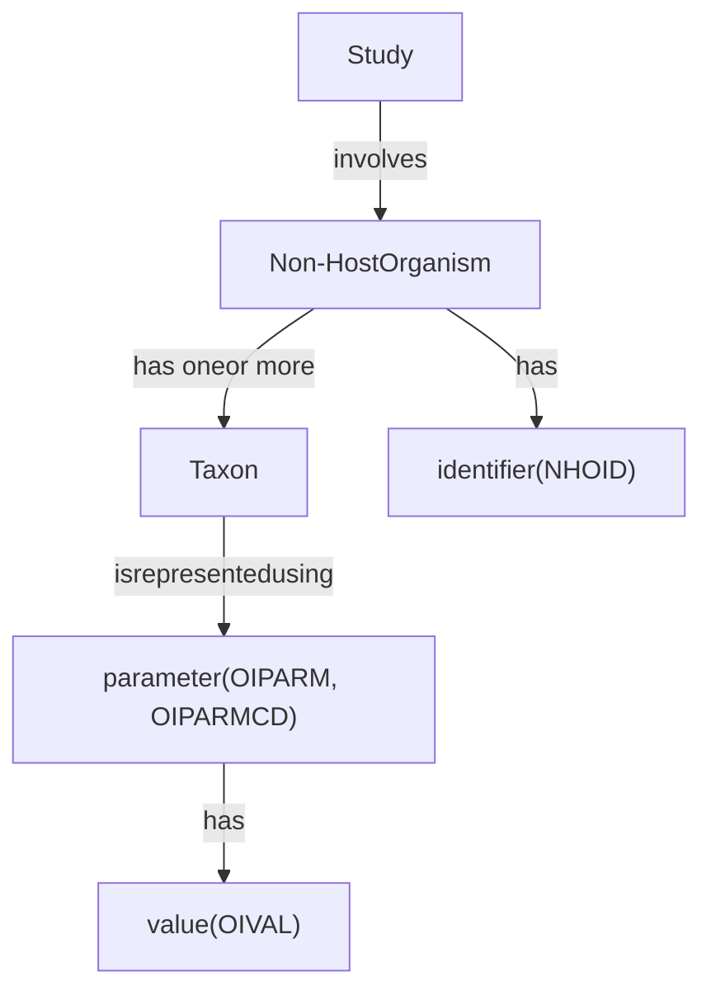

# 32_model_concepts_study_rel

> **NotebookLM Source Metadata** (由 merge_sources.py 生成, 供 NotebookLM 索引 + citation 反查)
>
> - **Bucket ID**: `32`
> - **Concept**: Model: concepts + associated persons + study-level + relationship datasets
> - **Merged files**: 4
> - **Words**: 5,801
> - **Chars**: 34,767
> - **Sources**:
>   - `model/01_concepts_and_terms.md`
>   - `model/04_associated_persons.md`
>   - `model/05_study_level_data.md`
>   - `model/06_relationship_datasets.md`

---
## Source: `model/01_concepts_and_terms.md`

# SDTM v2.0 — Chapter 2: Model Concepts and Terms

Source: SDTM v2.0, Section 2 (Pages 8-10)

## 2.1 Model Concepts and Terms — Variables

The SDTM provides a general framework for describing the organization of information collected during human and animal studies. The model is built around the concept of **observations**, which consist of discrete pieces of information collected during a study. Observations normally correspond to rows in a dataset. A **domain** is a collection of observations on a particular topic. For example, "Subject 101 had an adverse event of mild nausea starting on study day 6" is an observation belonging to the Adverse Events domain in a clinical trial.

The primary purpose of the SDTM is to represent data about study subjects — which may be humans or animals — or medical devices. The SDTM includes a general model for representing data in 3 "general observation" classes. Within those classes, data are grouped by topic into domains, represented in separate datasets.

### Concept Map: Relationships Between SDTM Domains

> **Key:** Plain box = Group of individually specified datasets. Green filled box = Extensible set of domains based on a common model.

### Variable Roles

All datasets are structured as flat files with rows representing observations and columns representing variables; each dataset is described by metadata definitions that provide information about the variables used in the dataset. Metadata are described in the CDISC Define-XML specification.

Each observation consists of a series of named variables. Each variable, which normally corresponds to a column in a dataset, can be classified according to its **role**. A role describes the type of information conveyed by the variable about each distinct observation and how it can be used. There are variables which play different roles in different datasets. This is most common for variables which appear in both trial design datasets and general observation class datasets. For example, ARMCD is the topic variable in Trial Arms (TA), but a record qualifier in Demographics (DM) and Trial Visits (TV). Variables which appear in multiple general observation classes have the same role, although the variable qualified by a variable qualifier or synonym qualifier can be different in different general observation classes. For example, --MODIFY qualifies --TRT in interventions, --TERM in events, and --ORRES in findings.

SDTM variables can be classified into 5 major roles:

1. **Identifier variables** — identify the study, subject, domain, and sequence number of the record
2. **Topic variables** — specify the focus of the observation (e.g., the name of a lab test)
3. **Timing variables** — describe the timing of an observation (e.g., start date, end date)
4. **Qualifier variables** — include additional illustrative text or numeric values that describe the results or additional traits of the observation (e.g., units, descriptive adjectives)
5. **Rule variables** — describe conditions for starting, ending, branching, or looping in the Trial Design Model

### Qualifier Variable Subclasses

The set of Qualifier variables can be further categorized into 5 subclasses:

| Subclass | Purpose | Examples |
|----------|---------|----------|
| **Grouping Qualifiers** | Group together a collection of observations within the same domain | --CAT, --SCAT |
| **Result Qualifiers** | Describe the specific results associated with the topic variable in a Findings dataset | --ORRES, --STRESC, --STRESN |
| **Synonym Qualifiers** | Specify an alternative name for a particular variable in an observation | --MODIFY, --DECOD (for --TRT or --TERM); --TEST, --LOINC (for --TESTCD) |
| **Record Qualifiers** | Define additional attributes of the observation record as a whole | --REASND, AESLIFE, --BLFL, --POS, --LOC, --SPEC, --NAM |
| **Variable Qualifiers** | Further modify or describe a specific set of variables within an observation | --ORRESU, --ORNRHI, --ORNRLO, --DOSU (Variable Qualifier of --DOSE) |

### Domain Codes

Each study subject domain dataset is distinguished by a unique 2-character code stored in the SDTM variable DOMAIN. This code is used:
- As the value of the DOMAIN variable in that dataset
- As a prefix for most variable names in that dataset
- In the RDOMAIN variable in relationship tables

The `--` prefix in variable names (e.g., --TRT) indicates the required use of a prefix based on the 2-character domain code.

**Domain-specific variables** are for use in a limited number of designated domains based on general observation classes. The variable names include the specific domain prefix. The Usage Restrictions column of the table indicates the domains in which the variable is allowed.

All datasets for data about individuals and for data about a study include the variable DOMAIN, a code that should be used in the dataset name. Some relationship datasets include the variable RDOMAIN, to describe a relationship to a domain for data about individuals. The Comments special-purpose domain includes the variable RDOMAIN, but other special-purpose domains do not. The Device-subject Relationships dataset includes the variable DOMAIN, but other study reference datasets do not.

The SDTM is structured so that data can be represented in SAS v5 transport files, the file format accepted by the US Food and Drug Administration (FDA) and other regulatory authorities. This imposes certain restrictions on variables. The SDTM type specified in this document is either character or numeric, as these are the only types supported by SAS v5 transport files. Define-XML provides more descriptive data types (e.g., integer, float, date, datetime).

## 2.2 Table Structure

Tables in the SDTM v2.0 document include the following variable metadata:

| Column | Description |
|--------|-------------|
| **Variable Name** | The standard name (with `--` prefix for domain-prefixed variables) |
| **Variable Label** | Human-readable label for the variable |
| **Type** | SAS data type: `Char` or `Num` |
| **Format** | ISO format standard or description (e.g., "number-number") |
| **Role** | As defined in Section 2.1 (Identifier, Topic, Timing, etc.) |
| **Variable(s) Qualified** | For variables with a role of Variable Qualifier or Synonym Qualifier |
| **Usage Restrictions** | Rules for when a variable can or cannot be used |
| **Variable C-code** | NCI-EVS concept code |
| **Definition** | Published as part of CDISC Controlled Terminology through NCI-EVS |
| **Notes** | Descriptive information not covered elsewhere |
| **Examples** | Sample values or descriptions of kinds of information |

**Note:** Information on usage restrictions and examples that were in the Description column in SDTM v1.x tables have been moved to the Usage Restrictions and Examples columns. Other content previously in the Description column has been moved to the Notes column, except that definition-like information has been removed for variables which have approved definitions.

## Source: `model/04_associated_persons.md`

# SDTM v2.0 — Chapter 4: Associated Persons Data

Source: SDTM v2.0, Section 4 (Page 50)

## Overview

Associated persons are individuals other than study subjects who can be associated with a study, a particular study subject, or a device used in the study. The structures of SDTM datasets that represent data about associated persons are based on the structures for data about study subjects, either general observation class structures or special-purpose domain structures. AP domains are created using SDTM variables, with the application of specific AP rules:

### AP Domain Rules

1. **Prefix convention:** AP domains use the domain code prefix `AP` followed by the relevant domain code. For example, associated persons demographics would use `APDM`.

2. **APID:** The variable APID is used as an identifier in AP domains (instead of USUBJID for subjects). APID was removed from Section 3.1.4 (Identifiers for All Classes) because APID is only allowed in AP domains. It is still listed in Section 3 as an identifier.

3. **Linking variables:**
   - **RSUBJID** — Related Subject or Pool Identifier: identifies a related subject or pool of subjects. RSUBJID may be populated with the USUBJID of the related subject or the POOLID of the related pool. RSUBJID will be null for data about associated persons who are related to the study but not to any study subjects.
   - **RDEVID** — Related Device Identifier: identifier for a related device. RDEVID will be populated with the SPDEVID of the related device.
   - **SREL** — Subject, Device, or Study Relationship: if RSUBJID is populated, describes the relationship of the associated person(s) to the subject or pool identified in RSUBJID. If RDEVID is populated, describes the relationship to the device identified in RDEVID. If RSUBJID and RDEVID are null, SREL describes the relationship to the study identified in STUDYID.

### Key Principles

- AP domains conform to the same general observation class models (Interventions, Events, Findings) used for subject data
- The same variables, roles, and controlled terminology apply
- Additional guidance for implementing AP domains is provided in the SDTM Implementation Guide: Associated Persons (SDTMIG-AP)
- AP domains are not part of the core SDTMIG for human clinical trials

### Variables Used in Associated Persons Data

The table of variables used in Associated Persons Data includes all variables from the general observation classes, with the addition of AP-specific identifiers:

| Variable | Label | Type | Role | Notes |
|----------|-------|------|------|-------|
| APID | Associated Persons Identifier | Char | Identifier | Identifier for a single associated person, a group of associated persons, or a pool of associated persons. If APID identifies a pool, POOLDEF records must exist for each associated person (see Section 6.3, Pool Definition Dataset, and Section 4, Associated Persons Data). |
| RSUBJID | Related Subject or Pool Identifier | Char | Identifier | Identifier for a related subject or pool of subjects. RSUBJID may be populated with the USUBJID of the related subject or the POOLID of the related pool. |
| RDEVID | Related Device Identifier | Char | Identifier | Identifier for a related device. RDEVID will be populated with the SPDEVID of the related device. |
| SREL | Subject, Device, or Study Relationship | Char | Identifier | If RSUBJID is populated, describes the relationship to the subject or pool. If RDEVID is populated, describes the relationship to the device. If both are null, describes the relationship to the study. |

Relationships of an associated person to study subjects may be represented in the Associated Persons Relationships dataset. When an individual has multiple collected relationships to a study subject or study subjects, those multiple relationships must be represented in that relationships dataset.

## Source: `model/05_study_level_data.md`

# SDTM v2.0 — Chapter 5: Study-level Data

Source: SDTM v2.0, Sections 5.1-5.2 (Pages 51-63)

## Overview

The SDTM includes 2 types of study-level data: trial design data and study reference data.

---

## 5.1 Trial Design Model

The Trial Design Model (TDM) defines a standard structure for representing the planned sequence of activities and the treatment plan for the trial. These include ways to represent:

- Planned treatment arms (Section 5.1.1, Trial Arms and Trial Elements)
- Planned groups of subjects (Section 5.1.2, Trial Sets)
- Planned sequences of reproductive stages (Section 5.1.3, Trial Repro Stages and Trial Repro Paths)
- Planned schedules for activities and data collection (Section 5.1.4, Trial Planned Data Collection)
- Study eligibility criteria (Section 5.1.5, Trial Inclusion/Exclusion Criteria)
- Other aspects of a study, expressed as parameters (Section 5.1.6, Trial Summary Information)
- Characteristics of a study challenge agent (Section 5.1.7, Challenge Agent Characterization)

Many Trial Design domains define study-specific terminology, and variables and variable values from these domains are used in subject-level domains.

### Trial Elements (TE)

**Structure:** One record per planned Element

Describes the basic building blocks of a trial design — discrete periods of time during which a specific type of treatment or activity is planned. The domain is identified by the domain code "TE".

| # | Variable | Label | Type | Role |
|---|----------|-------|------|------|
| 1 | STUDYID | Study Identifier | Char | Identifier |
| 2 | DOMAIN | Domain Abbreviation | Char | Identifier |
| 3 | ETCD | Element Code | Char | Topic |
| 4 | ELEMENT | Description of Element | Char | Synonym Qualifier |
| 5 | TESTRL | Rule for Start of Element | Char | Rule |
| 6 | TEENRL | Rule for End of Element | Char | Rule |
| 7 | TEDUR | Planned Duration of Element | Char | Timing |

### Trial Arms (TA)

**Structure:** One record per planned Element per Arm

Describes each planned arm in a trial. An arm is an ordered sequence of elements; the same element may occur more than once in a given arm. This dataset allows for rules for branching and transitions.

| # | Variable | Label | Type | Role |
|---|----------|-------|------|------|
| 1 | STUDYID | Study Identifier | Char | Identifier |
| 2 | DOMAIN | Domain Abbreviation | Char | Identifier |
| 3 | ARMCD | Planned Arm Code | Char | Topic |
| 4 | ARM | Description of Planned Arm | Char | Synonym Qualifier |
| 5 | TAETORD | Planned Order of Element within Arm | Num | Timing |
| 6 | ETCD | Element Code | Char | Record Qualifier |
| 7 | ELEMENT | Description of Element | Char | Synonym Qualifier |
| 8 | TABRANCH | Branch | Char | Rule |
| 9 | TATRANS | Transition Rule | Char | Rule |
| 10 | EPOCH | Epoch | Char | Timing |

### Trial Sets (TX)

**Structure:** One record per Trial Set parameter per Trial Set

Describes sets of subjects that share common characteristics (e.g., treatment groups, pooled analysis groups).

| # | Variable | Label | Type | Role |
|---|----------|-------|------|------|
| 1 | STUDYID | Study Identifier | Char | Identifier |
| 2 | DOMAIN | Domain Abbreviation | Char | Identifier |
| 3 | SETCD | Set Code | Char | Identifier |
| 4 | SET | Set Description | Char | Synonym Qualifier (SETCD) |
| 5 | TXSEQ | Sequence Number | Num | Identifier |
| 6 | TXPARMCD | Trial Set Parameter Short Name | Char | Topic |
| 7 | TXPARM | Trial Set Parameter Name | Char | Synonym Qualifier |
| 8 | TXVAL | Parameter Value | Char | Result Qualifier |

### Trial Reproductive Stages (TT)

**Structure:** One record per Planned Repro Stage

**Note:** Not for use with human clinical trials.

Describes the unique repro stages in a study, with repro stage description, code (short name), and rules for start and end.

| # | Variable | Label | Type | Role | Notes |
|---|----------|-------|------|------|-------|
| 1 | STUDYID | Study Identifier | Char | Identifier | |
| 2 | DOMAIN | Domain Abbreviation | Char | Identifier | "TT" |
| 3 | RSTGCD | Repro Stage Code | Char | Topic | Not in human clinical trials |
| 4 | RSTAGE | Description of Repro Stage | Char | Synonym Qualifier (RSTGCD) | Not in human clinical trials |
| 5 | TTSTRL | Rule for Start of Repro Stage | Char | Rule | Not in human clinical trials |
| 6 | TTENRL | Rule for End of Repro Stage | Char | Rule | Not in human clinical trials |
| 7 | TTDUR | Planned Duration of Repro Stage | Char | Timing | Not in human clinical trials |

### Trial Reproductive Paths (TP)

**Structure:** One record per Planned Repro Stage per Repro Path

**Note:** Not for use with human clinical trials.

Describes each planned repro path in a repro study, with the ordered sequence of repro stages that comprise each repro path, as well as specification of repro phase and reference start day of the repro phase applicable to the repro stage within the repro path.

| # | Variable | Label | Type | Role | Notes |
|---|----------|-------|------|------|-------|
| 1 | STUDYID | Study Identifier | Char | Identifier | |
| 2 | DOMAIN | Domain Abbreviation | Char | Identifier | "TP" |
| 3 | RPATHCD | Planned Repro Path Code | Char | Topic | Not in human clinical trials |
| 4 | RPATH | Description of Planned Repro Path | Char | Synonym Qualifier (RPATHCD) | Not in human clinical trials |
| 5 | TPSTGORD | Order of Repro Stage within Repro Path | Num | Timing | Not in human clinical trials |
| 6 | RSTGCD | Repro Stage Code | Char | Topic | Not in human clinical trials |
| 7 | RSTAGE | Description of Repro Stage | Char | Synonym Qualifier (RSTGCD) | Not in human clinical trials |
| 8 | TPBRANCH | Branch | Char | Rule | Not in human clinical trials |
| 9 | RPHASE | Repro Phase | Char | Timing | Not in human clinical trials |
| 10 | RPRFDY | Repro Phase Start Reference Day | Num | Timing | Not in human clinical trials |

### Trial Visits (TV)

**Structure:** One record per planned Visit per Arm

Describes the visits planned in the protocol, including the planned order and number of visits in the study.

| # | Variable | Label | Type | Role |
|---|----------|-------|------|------|
| 1 | STUDYID | Study Identifier | Char | Identifier |
| 2 | DOMAIN | Domain Abbreviation | Char | Identifier |
| 3 | VISITNUM | Visit Number | Num | Topic |
| 4 | VISIT | Visit Name | Char | Synonym Qualifier |
| 5 | VISITDY | Planned Study Day of Visit | Num | Timing |
| 6 | ARMCD | Planned Arm Code | Char | Record Qualifier |
| 7 | ARM | Description of Planned Arm | Char | Synonym Qualifier |
| 8 | TVSTRL | Visit Start Rule | Char | Rule |
| 9 | TVENRL | Visit End Rule | Char | Rule |

### Trial Disease Assessments (TD)

**Structure:** One record per planned constant assessment period

Provides information on the planned protocol-specified disease assessment schedule when those disease assessments cannot be expressed using Trial Visits.

| # | Variable | Label | Type | Role |
|---|----------|-------|------|------|
| 1 | STUDYID | Study Identifier | Char | Identifier |
| 2 | DOMAIN | Domain Abbreviation | Char | Identifier |
| 3 | TDORDER | Sequence of Planned Assessment Schedule | Num | Timing |
| 4 | TDANCVAR | Anchor Variable Name | Char | Timing |
| 5 | TDSTOFF | Offset from the Anchor | Char | Timing |
| 6 | TDTGTPAI | Planned Assessment Interval | Char | Timing |
| 7 | TDMINPAI | Planned Assessment Interval Minimum | Char | Timing |
| 8 | TDMAXPAI | Planned Assessment Interval Maximum | Char | Timing |
| 9 | TDNUMRPT | Maximum Number of Actual Assessments | Num | Record Qualifier |

### Trial Disease Milestones (TM)

**Structure:** One record per Disease Milestone type

Describes the types of disease milestones that may occur in a study.

| # | Variable | Label | Type | Role |
|---|----------|-------|------|------|
| 1 | STUDYID | Study Identifier | Char | Identifier |
| 2 | DOMAIN | Domain Abbreviation | Char | Identifier |
| 3 | MIDSTYPE | Disease Milestone Type | Char | Topic |
| 4 | TMDEF | Disease Milestone Definition | Char | Variable Qualifier (MIDSTYPE) |
| 5 | TMRPT | Disease Milestone Repetition Indicator | Char | Record Qualifier |

### Trial Inclusion/Exclusion Criteria (TI)

**Structure:** One record per I/E criterion

Describes the inclusion and exclusion criteria for the trial.

| # | Variable | Label | Type | Role |
|---|----------|-------|------|------|
| 1 | STUDYID | Study Identifier | Char | Identifier |
| 2 | DOMAIN | Domain Abbreviation | Char | Identifier |
| 3 | IETESTCD | Incl/Excl Criterion Short Name | Char | Topic |
| 4 | IETEST | Incl/Excl Criterion | Char | Synonym Qualifier |
| 5 | IECAT | Incl/Excl Category | Char | Grouping Qualifier |
| 6 | IESCAT | Incl/Excl Subcategory | Char | Grouping Qualifier |
| 7 | TIRL | Criterion Evaluation Rule | Char | Rule |
| 8 | TIVERS | Protocol Criteria Versions | Char | Record Qualifier |

### Trial Summary (TS)

**Structure:** One record per trial summary parameter value

Contains summary information about the trial (e.g., trial phase, objectives, design).

| # | Variable | Label | Type | Role |
|---|----------|-------|------|------|
| 1 | STUDYID | Study Identifier | Char | Identifier |
| 2 | DOMAIN | Domain Abbreviation | Char | Identifier |
| 3 | TSSEQ | Sequence Number | Num | Identifier |
| 4 | TSGRPID | Group ID | Char | Identifier |
| 5 | TSPARMCD | Trial Summary Parameter Short Name | Char | Topic |
| 6 | TSPARM | Trial Summary Parameter Name | Char | Synonym Qualifier |
| 7 | TSVAL | Parameter Value | Char | Result Qualifier |
| 8 | TSVALNF | Parameter Null Flavor | Char | Result Qualifier |
| 9 | TSVALCD | Parameter Value Code | Char | Result Qualifier |
| 10 | TSVCDREF | Name of Reference Terminology | Char | Result Qualifier |
| 11 | TSVCDVER | Version of Reference Terminology | Char | Result Qualifier |

### Challenge Agent Characterization (AC)

**Structure:** One record per Challenge Agent Characterization Parameter Instance

The Challenge Agent Characterization dataset allows the sponsor to provide information about challenge agents used in a trial in a structured format. Each record contains a parameter (a characteristic of the challenge agent) and its value.

| # | Variable | Label | Type | Role |
|---|----------|-------|------|------|
| 1 | STUDYID | Study Identifier | Char | Identifier |
| 2 | DOMAIN | Domain Abbreviation | Char | Identifier |
| 3 | ACSEQ | Sequence Number | Num | Identifier |
| 4 | ACGRPID | Group ID | Char | Identifier |
| 5 | ACPARMCD | Challenge Agent Parameter Short Name | Char | Topic |
| 6 | ACPARM | Challenge Agent Parameter | Char | Synonym Qualifier |
| 7 | ACVAL | Parameter Value | Char | Result Qualifier |
| 8 | ACVALU | Parameter Units | Char | Variable Qualifier (ACVAL) |
| 9 | ACVALNF | Parameter Null Flavor | Char | Result Qualifier |
| 10 | ACVALCD | Parameter Value Code | Char | Result Qualifier |
| 11 | ACVCDREF | Name of the Reference Terminology | Char | Result Qualifier |
| 12 | ACVCDVER | Version of the Reference Terminology | Char | Result Qualifier |

---

## 5.2 Study References

Study Reference datasets provide structures for representing study-specific identifiers that will be used in subject data. Two such situations have been identified thus far: identifiers for devices, and identifiers for non-host organisms.

### Device Identifiers (DI)

**Structure:** One record per device attribute per device

Used to identify the devices used in a study. The parameters used for identification of a device depend on the kind of device and the need of the study to distinguish among devices.

**Concept Map: Relationships Between Device Identifier Variables**

| # | Variable | Label | Type | Role |
|---|----------|-------|------|------|
| 1 | STUDYID | Study Identifier | Char | Identifier |
| 2 | DOMAIN | Domain Abbreviation | Char | Identifier |
| 3 | SPDEVID | Sponsor Device Identifier | Char | Identifier |
| 4 | DISEQ | Sequence Number | Num | Identifier |
| 5 | DIPARMCD | Device Identifier Element Short Name | Char | Topic |
| 6 | DIPARM | Device Identifier Element Name | Char | Synonym Qualifier (DIPARMCD) |
| 7 | DIVAL | Device Identifier Element Value | Char | Result Qualifier |

### Non-host Organism Identifiers (OI)

**Structure:** One record per taxon per non-host organism

Used to represent taxonomic information for non-host organisms such as bacteria and viruses. The taxa used for identification depend on the kind of organism and the needs of the study.

**Concept Map: Relationships Between Non-host Organism Identifier Variables**

| # | Variable | Label | Type | Role |
|---|----------|-------|------|------|
| 1 | STUDYID | Study Identifier | Char | Identifier |
| 2 | DOMAIN | Domain Abbreviation | Char | Identifier |
| 3 | NHOID | Non-host Organism Identifier | Char | Identifier |
| 4 | OISEQ | Sequence Number | Num | Identifier |
| 5 | OIPARMCD | Non-Host Organism ID Element Short Name | Char | Topic |
| 6 | OIPARM | Non-Host Organism ID Element Name | Char | Synonym Qualifier (OIPARMCD) |
| 7 | OIVAL | Non-Host Organism ID Element Value | Char | Result Qualifier |

## Source: `model/06_relationship_datasets.md`

# SDTM v2.0 — Chapter 6: Datasets for Representing Relationships

Source: SDTM v2.0, Sections 6.1-6.7 (Pages 64-69)

## Overview

There are many occasions when it is necessary or desirable to represent relationships among datasets or records. The SDTM includes the following relationship datasets:

- **Related Records Dataset** — represents 2 types of relationships: between independent records for a subject, and between records in 2 or more datasets
- **Supplemental Qualifiers Dataset** — represents dependent relationships where data cannot be represented by a standard variable
- **Pool Definition Dataset** — represents relationships between a subject and a pool of subjects
- **Related Subjects Dataset** — represents relationships between study subjects other than membership in a pool
- **Associated Persons Relationships Dataset** — represents relationships between associated person(s) and study subjects
- **Device-subject Relationships Dataset** — represents relationships between devices and study subjects
- **Related Specimens Dataset** — represents relationships between collected specimens and specimens derived from them

The implementation guides define specific details and examples for each of these relationships.

---

## 6.1 Related Records (RELREC)

**Structure:** One record per related record, group of records, or dataset

The Related Records dataset describes relationships between records within a domain, between records across domains, or between entire datasets.

### Variables (10 variables)

| # | Variable | Label | Type | Role | Notes |
|---|----------|-------|------|------|-------|
| 1 | STUDYID | Study Identifier | Char | Identifier | |
| 2 | RDOMAIN | Related Domain Abbreviation | Char | Identifier | 2-character abbreviation for the domain of the parent record(s) |
| 3 | USUBJID | Unique Subject Identifier | Char | Identifier | Null for dataset-level relationships |
| 4 | APID | Associated Persons Identifier | Char | Identifier | Identifier for a single associated person, a group, or a pool of associated persons |
| 5 | POOLID | Pool Identifier | Char | Identifier | For pooled subject data |
| 6 | SPDEVID | Sponsor Device Identifier | Char | Identifier | |
| 7 | IDVAR | Identifying Variable | Char | Identifier | Name of the identifying variable in the general-observation-class dataset that identifies the related record(s) |
| 8 | IDVARVAL | Identifying Variable Value | Char | Identifier | Value of identifying variable described in IDVAR |
| 9 | RELTYPE | Relationship Type | Char | Record Qualifier | Identifies the hierarchical level of the records in the relationship. Values should be either ONE or MANY. |
| 10 | RELID | Relationship Identifier | Char | Record Qualifier | RELID value should be unique within the ID variable (e.g., USUBJID, APID, POOLID, SPDEVID) that is the subject of the relationship |

### RELTYPE Combinations

| Source RELTYPE | Target RELTYPE | Meaning |
|---------------|----------------|---------|
| ONE | ONE | One record relates to one record |
| ONE | MANY | One record relates to many records |
| MANY | ONE | Many records relate to one record |
| MANY | MANY | Many records relate to many records |

---

## 6.2 Supplemental Qualifiers (SUPP--)

**Structure:** One record per supplemental qualifier per related parent domain record(s)

The Supplemental Qualifiers datasets provide a mechanism for including non-standard variables that cannot be accommodated in the standard domain datasets.

### Variables (13 variables)

| # | Variable | Label | Type | Role | Notes |
|---|----------|-------|------|------|-------|
| 1 | STUDYID | Study Identifier | Char | Identifier | |
| 2 | RDOMAIN | Related Domain Abbreviation | Char | Identifier | 2-character abbreviation for the domain of the parent record(s) |
| 3 | USUBJID | Unique Subject Identifier | Char | Identifier | |
| 4 | APID | Associated Persons Identifier | Char | Identifier | |
| 5 | POOLID | Pool Identifier | Char | Identifier | |
| 6 | SPDEVID | Sponsor Device Identifier | Char | Identifier | |
| 7 | IDVAR | Identifying Variable | Char | Identifier | Identifying variable in the parent dataset that identifies the related record(s) |
| 8 | IDVARVAL | Identifying Variable Value | Char | Identifier | Value of identifying variable of the parent record(s) |
| 9 | QNAM | Qualifier Variable Name | Char | Topic | 8-character name for the supplemental qualifier |
| 10 | QLABEL | Qualifier Variable Label | Char | Synonym Qualifier | Human-readable label associated with QNAM |
| 11 | QVAL | Data Value | Char | Result Qualifier | The actual data value |
| 12 | QORIG | Origin | Char | Record Qualifier | Source of the data: "CRF", "ASSIGNED", "DERIVED" |
| 13 | QEVAL | Evaluator | Char | Record Qualifier | Role of the evaluator |

### Naming Convention

Separate Supplemental Qualifier datasets of the form `supp--.xpt` are required (e.g., `suppae.xpt`, `suppcm.xpt`). The RDOMAIN variable identifies which parent domain the supplemental data belongs to.

---

## 6.3 Pool Definition (POOLDEF)

**Structure:** One record per pooled subject per pool

Defines which subjects belong to each pool (for nonclinical studies where subjects are pooled).

| # | Variable | Label | Type | Role |
|---|----------|-------|------|------|
| 1 | STUDYID | Study Identifier | Char | Identifier |
| 2 | POOLID | Pool Identifier | Char | Identifier |
| 3 | USUBJID | Unique Subject Identifier | Char | Identifier |
| 4 | APID | Associated Persons Identifier | Char | Identifier |

---

## 6.4 Related Subjects (RELSUB)

**Structure:** One record per relationship per subject

Describes relationships between subjects in a study (e.g., family relationships in genetic studies).

| # | Variable | Label | Type | Role |
|---|----------|-------|------|------|
| 1 | STUDYID | Study Identifier | Char | Identifier |
| 2 | USUBJID | Unique Subject Identifier | Char | Identifier |
| 3 | POOLID | Pool Identifier | Char | Identifier |
| 4 | RSUBJID | Related Subject or Pool Identifier | Char | Identifier |
| 5 | SREL | Subject, Device, or Study Relationship | Char | Record Qualifier |

---

## 6.5 Device-subject Relationships (DR)

**Structure:** One record per device-subject relationship

Links devices to subjects when the device is associated with a subject.

| # | Variable | Label | Type | Role |
|---|----------|-------|------|------|
| 1 | STUDYID | Study Identifier | Char | Identifier |
| 2 | DOMAIN | Domain Abbreviation | Char | Identifier |
| 3 | USUBJID | Unique Subject Identifier | Char | Identifier |
| 4 | SPDEVID | Sponsor Device Identifier | Char | Identifier |

---

## 6.6 Associated Persons Related Subjects (APRELSUB)

**Structure:** One record per associated person relationship

Links associated persons to subjects.

| # | Variable | Label | Type | Role |
|---|----------|-------|------|------|
| 1 | STUDYID | Study Identifier | Char | Identifier |
| 2 | APID | Associated Person Identifier | Char | Identifier |
| 3 | RSUBJID | Related Subject or Pool Identifier | Char | Identifier |
| 4 | RDEVID | Related Device Identifier | Char | Identifier |
| 5 | SREL | Subject, Device, or Study Relationship | Char | Record Qualifier |

---

## 6.7 Related Specimens (RELSPEC)

**Structure:** One record per specimen identifier per subject

Describes relationships between specimens, enabling representation of specimen lineage (e.g., parent specimen to derived aliquots or processed specimens).

| # | Variable | Label | Type | Role | Notes |
|---|----------|-------|------|------|-------|
| 1 | STUDYID | Study Identifier | Char | Identifier | |
| 2 | USUBJID | Unique Subject Identifier | Char | Identifier | |
| 3 | REFID | Reference ID | Char | Identifier | C82531 |
| 4 | SPEC | Specimen Type | Char | Variable Qualifier (REFID) | C70713 |
| 5 | PARENT | Specimen Parent | Char | Identifier | Identifies the REFID of the parent of a specimen to support tracking its genealogy |
| 6 | LEVEL | Specimen Level | Num | Variable Qualifier (REFID) | Identifies the generation number of the sample where the collected sample is considered the first generation |

**Note:** RELSPEC was added new in SDTM v2.0. This domain was first introduced in the provisional SDTMIG-PGx (now deprecated) and had not previously been a part of the SDTM. It was added because the domain was added to SDTMIG v3.4.

---

## Summary of Relationship Datasets

| Dataset | Code | Purpose | Subject-level? |
|---------|------|---------|----------------|
| Related Records | RELREC | Link records/datasets | Both |
| Supplemental Qualifiers | SUPP-- | Non-standard variables | Yes |
| Pool Definition | POOLDEF | Pool membership | Yes (nonclinical) |
| Related Subjects | RELSUB | Subject relationships | Yes |
| Device-subject Relationships | DR | Device-subject links | Yes |
| AP Related Subjects | APRELSUB | AP-subject links | AP |
| Related Specimens | RELSPEC | Specimen lineage | Yes |
