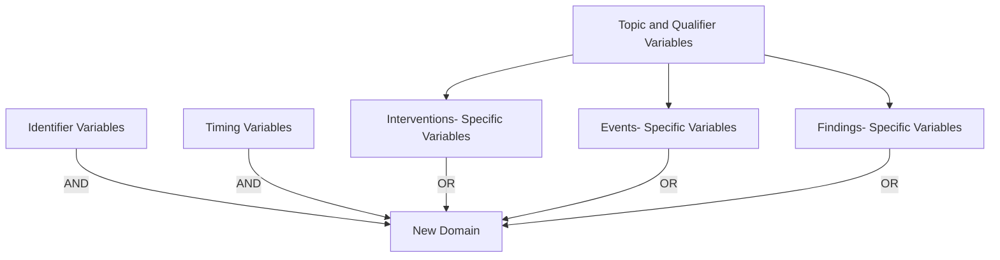

# SDTMIG v3.4 — Chapter 2: Fundamentals of the SDTM

Source: SDTMIG v3.4, Section 2 (Pages 13-20)

## 2.1 Observations and Variables

The SDTMIG for Human Clinical Trials is based on the SDTM's general framework for organizing clinical trial information that is to be submitted to regulatory authorities. The SDTM is built around the concept of **observations** collected about subjects who participated in a clinical study. Each observation can be described by a series of variables, corresponding to a row in a dataset. Each variable can be classified according to its **role**.

### Variable Roles (5 major roles)

1. **Identifier variables** — identify the study, subject, domain, and sequence number of the record
2. **Topic variables** — specify the focus of the observation (e.g., the name of a lab test)
3. **Timing variables** — describe the timing of an observation (e.g., start date and end date)
4. **Qualifier variables** — include additional illustrative text or numeric values that describe the results or additional traits
5. **Rule variables** — describe the condition to start, end, branch, or loop in the Trial Design Model

### Qualifier Variable Subclasses

| Subclass | Purpose | Examples |
|----------|---------|----------|
| **Grouping Qualifiers** | Group together a collection of observations within the same domain | --CAT, --SCAT |
| **Result Qualifiers** | Describe the specific results associated with the topic variable (Findings only) | --ORRES, --STRESC, --STRESN |
| **Synonym Qualifiers** | Specify an alternative name for a particular variable | --MODIFY, --DECOD (for --TRT/--TERM); --TEST, --LOINC (for --TESTCD) |
| **Record Qualifiers** | Define additional attributes of the observation record as a whole (rather than describing a particular variable within a record) | --REASND, AESLIFE and other SAE flags (AE domain); AGE, SEX, RACE (DM domain); --BLFL, --POS, --LOC, --SPEC, --NAM (Findings) |
| **Variable Qualifiers** | Modify or describe a specific variable within an observation | --ORRESU, --ORNRHI, --ORNRLO (Variable Qualifiers of --ORRES); --DOSU (Variable Qualifier of --DOSE) |

**Example:** In the observation "Subject 101 had mild nausea starting on study day 6":
- Topic variable value = "NAUSEA"
- Identifier variable: subject identifier "101"
- Timing variable: "starting on study day 6"
- Record Qualifier: severity = "MILD"

## 2.2 Datasets and Domains

A **domain** is a collection of logically related observations with a common topic. Each domain is represented by a single dataset.

Each domain dataset is distinguished by a unique, 2-character code (DOMAIN) used in 4 ways:
1. As the dataset name
2. As the value of the DOMAIN variable in that dataset
3. As a prefix for most variable names in that dataset
4. As a value in the RDOMAIN variable in relationship tables

All datasets are structured as flat files with rows representing observations and columns representing variables. Metadata are described in a Define-XML document that is submitted with the data.

The SDTM lists only the name, label, and type of each variable, with a brief set of CDISC guidelines for its use. The domain dataset models in Section 5, Models for Special-purpose Domains, and Section 6, Domain Models Based on the General Observation Classes, provide additional information about controlled terms or format, notes on proper usage, and examples. See also Section 1.4.1, How to Read a Domain Specification.

Data represented in SDTM datasets include:
- Data as originally collected or received
- Data from the protocol
- Assigned data
- Derived data

## 2.3 The General Observation Classes

Most subject-level observations should be represented according to 1 of the 3 SDTM general observation classes:

| Class | What it captures | Examples |
|-------|-----------------|----------|
| **Interventions** | Investigational, therapeutic, and other treatments administered to or used by a subject (with some actual or expected physiological effect), including treatments that are self-administered by the subject (i.e., use of alcohol, tobacco, or caffeine) | Exposure (EX), Concomitant Medications (CM), Procedures (PR) |
| **Events** | Planned protocol milestones and occurrences, conditions, or incidents independent of planned evaluations | Adverse Events (AE), Disposition (DS), Medical History (MH) |
| **Findings** | Observations from planned evaluations to address specific tests or questions, including questionnaires | Laboratory Tests (LB), Vital Signs (VS), ECG (EG) |

In most cases, the choice of observation class can be easily determined. The majority of data (measurements or responses at specific visits or time points) will fit the Findings class.

**Additional guidance** on choosing the appropriate GOC is in Section 8.6.1, Guidelines for Determining the General Observation Class.

General assumptions for use with all domain models and custom domains based on the general observation classes are described in Section 4, Assumptions for Domain Models; specific assumptions for individual domains are included with the domain models.

## 2.4 Datasets Other than General Observation Class Domains

The SDTM includes 4 types of datasets other than those based on the general observation classes:

| Type | Description | Examples | Section |
|------|-------------|----------|---------|
| **Special-purpose domains** | Subject-level data not conforming to a GOC | DM, CO, SE, SV | Section 5 |
| **Trial Design Model (TDM)** | Study design information, not subject data | TA, TE | Section 7 |
| **Relationship datasets** | Describe relationships among datasets/records | RELREC, SUPP-- | Section 8 |
| **Study Reference datasets** | Study-specific terminology | DI, OI | Section 9 |

## 2.5 The SDTM Standard Domain Models

A sponsor should only submit domain datasets that were actually collected (or directly derived from the collected data) for a given study. Decisions on what data to collect should be based on the scientific objectives of the study, rather than the SDTM. Note that any data collected that will be submitted in an analysis (ADaM) dataset must be traceable to a source in a tabulation (SDTM) dataset.

The collected data for a given study may use standard domains from this and other SDTM implementation guides as well as additional custom domains based on the 3 general observation classes. A list of standard domains is provided in Section 3.2.1, Dataset-level Metadata. Therapeutic-area standards projects and other projects may develop proposals for additional domains. Draft versions of these domains may be made available in the CDISC wiki in the SDTM Draft Domains space.

### General rules for determining which variables to include:

1. The Identifier variables **STUDYID, DOMAIN, USUBJID, and --SEQ** are required in all domains based on a general observation class
2. Any Timing variables are permissible for use in any submission dataset based on a GOC except where restricted by specific domain assumptions
3. Any additional Qualifier variables from the same GOC may be added to a domain model except where restricted
4. Sponsors may not add any variables other than those described above — use Supplemental Qualifiers (SUPP--) for non-standard variables
5. Standard variables must not be renamed or modified for novel usage
6. A Permissible variable should be used in an SDTM dataset wherever appropriate. If a study includes a data item that would be represented in a Permissible variable, then that variable must be included in the SDTM dataset, even if null
7. If a study did not include a data item that would be represented in a Permissible variable, then that variable should not be included in the SDTM dataset and should not be declared in the Define-XML document

## 2.6 Creating a New Domain

Process for creating a custom domain (must be based on 1 of the 3 GOC):

1. Confirm that none of the existing published domains will fit the need. A custom domain may only be created if the data are different in nature and do not fit into an existing published domain. Examples of distinct topics that warrant separate domains include microbiology, tumor measurements, pathology/histology, vital signs, and physical exam results.
   - Data should be grouped by topic and nature, not by collection method. --CAT, --SCAT, --METHOD, --SPEC, and --LOC can distinguish data within a domain.
   - Data that were collected on separate CRF modules or pages may fit into an existing domain (e.g., separate questionnaires into the QS domain, prior and concomitant medications in the CM domain).
2. Check the SDTM Draft Domains area of the CDISC wiki for proposed domains
3. Look for an existing, relevant domain model to serve as a prototype. Follow these steps:
   - a. Select required identifier variables (STUDYID, DOMAIN, USUBJID, --SEQ)
   - b. Include the topic variable from the identified GOC (e.g., --TESTCD for Findings)
   - c. Select relevant qualifier variables from the identified GOC. Variables belonging to other general observation classes must not be added
   - d. Select applicable timing variables
   - e. Determine the domain code (not in CDISC CT Domain Abbreviations codelist; AD, AX, AP, SQ, SA may not be used)
   - f. Apply the 2-character domain code to variable prefixes
   - g. Set variable order consistent with the SDTM
   - h. Adjust labels using title case
   - i. Ensure appropriate standard variables are properly applied
   - j. Describe the dataset in the Define-XML document
   - k. Place non-standard variables in a SUPP-- dataset

**Key rules for custom domains:**
- Do not create separate domains based on time (represent both prior and current in one domain; AE and MH are exceptions)
- Do not create "efficacy" domains — data collected for analysis must still go in standard domains
- For hierarchical data, establish domain pairs (e.g., MB/MS, PC/PP)
- Domain pairs use DOMAIN as an identifier to group parent records and enable dataset-level relationships via RELREC

## 2.7 SDTM Variables Not Allowed in the SDTMIG

### Must NEVER be used in human clinical trials (SEND-only):

| Variable | Class(es) |
|----------|-----------|
| --USCHFL | Interventions, Events, Findings |
| --METHOD | Interventions |
| --RSTIND | Interventions, Findings |
| --RSTMOD | Interventions, Findings |
| --IMPLBL | Findings |
| --RESLOC | Findings |
| --DTHREL | Findings |
| --EXCLFL | Findings |
| --REASEX | Findings |
| FETUSID | Identifiers |
| RPHASE | Timing Variables |
| RPPLDY, RPPLSTDY, RPPLENDY | Timing Variables |
| --NOMDY, --NOMLBL | Timing Variables |
| --RPDY, --RPSTDY, --RPENDY | Timing Variables |
| --DETECT | Timing Variables |

### Must NEVER be used in DM domain (SEND nonclinical only):

See Section 9.2, Non-host Organism Identifiers, for information about representing taxonomic information for non-host organisms such as bacteria and viruses.

- SPECIES, STRAIN, SBSTRAIN, RPATHCD

### Use with extreme caution (not fully evaluated for human clinical trials):

- --ANTREG (Findings)
- --CHRON (Findings)
- --DISTR (Findings)
- SETCD (Demographics) — additionally requires the Trial Sets domain

### May be used when appropriate:

- POOLID — additionally requires the Pool Definition dataset

Other variables defined in the SDTM are allowed for use as defined in this SDTMIG except when explicitly stated. Custom domains, created following the guidance in Section 2.6, Creating a New Domain, may utilize any appropriate qualifier variables from the selected general observation class.
