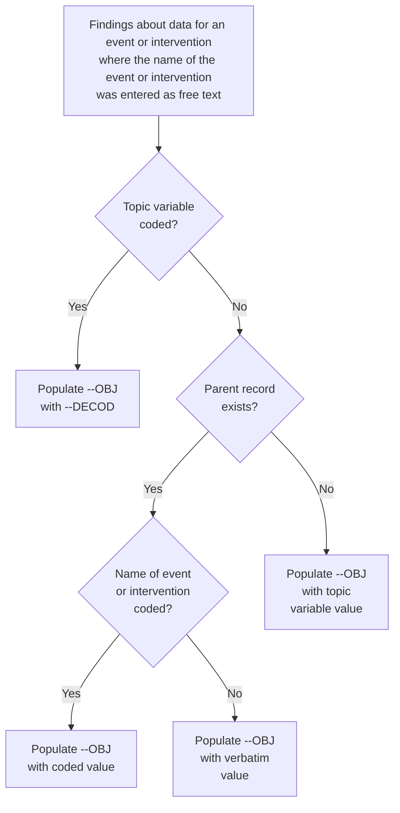
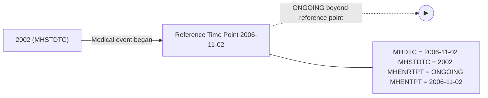
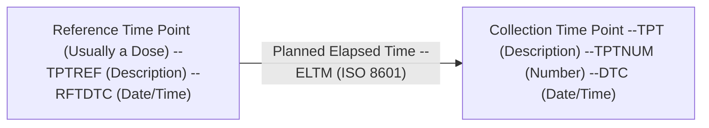
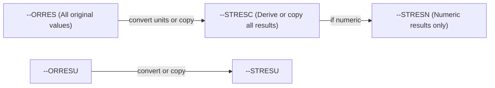

# SDTMIG v3.4 — Chapter 4: Assumptions for Domain Models

Source: SDTMIG v3.4, Section 4 (Pages 22-59)

## Overview

This section describes basic concepts, business rules, and assumptions that should be taken into consideration before applying the domain models. It covers general domain assumptions, general variable assumptions, coding and controlled terminology assumptions, actual and relative time assumptions, and other assumptions.

---

## 4.1 General Domain Assumptions

### 4.1.1 Review Study Data Tabulation Model and Implementation Guide

Review the SDTM as well as this complete implementation guide before attempting to use any of the individual domain models. The SDTM describes the general conceptual framework, including the general observation classes (Interventions, Events, Findings), special-purpose domains, trial design model datasets, relationship datasets, and study references.

### 4.1.2 Relationship to Analysis Datasets

Specific guidance on preparing analysis datasets can be found in the CDISC Analysis Data Model (ADaM) Implementation Guide and other ADaM documents, available at https://www.cdisc.org/standards/foundational/adam.

### 4.1.3 Additional Timing Variables

Additional Timing variables can be added as needed to a standard domain model based on the 3 general observation classes, except for the cases specified in Assumption 4.4.8, Date and Time Reported in a Domain Based on Findings. Timing variables can be added to special-purpose domains only where specified in the SDTMIG domain model assumptions. Timing variables cannot be added to SUPPQUAL datasets or to RELREC (described in Section 8, Representing Relationships and Data).

#### 4.1.3.1 EPOCH Variable Guidance

When EPOCH is included in a Findings class domain, it should be based on the --DTC variable, since this is the date/time of the test or, for tests performed on specimens, the date/time of specimen collection. For observations in Interventions or Events class domains, EPOCH should be based on the --STDTC variable, since this is the start of the intervention or event. A possible, though unlikely, exception would be a finding based on an interval specimen collection that started in one epoch but ended in another. --ENDTC might be a more appropriate basis for EPOCH in such a case.

Sponsors should not impute EPOCH values, but should, where possible, assign EPOCH values on the basis of CRF instructions and structure, even if EPOCH was not directly collected and date/time data was not collected with sufficient precision to permit assignment of an observation to an EPOCH on the basis of date/time data alone. If it is not possible to determine the epoch of an observation, then EPOCH should be null. Methods for assigning EPOCH values can be described in the Define-XML document.

Because EPOCH is a study-design construct, it is not applicable to interventions or events that started before the subject's participation in a study, nor to findings performed before participation in a study. For such records, EPOCH should be null. Note that a subject's participation in a study includes screening, which generally occurs before the reference start date (RFSTDTC) in the Demographics (DM) domain.

### 4.1.4 Order of the Variables

Standard datasets should follow the SDTM data structures. Variable order should match the order defined in the SDTM for the general observation class: Identifiers first, then Topic, then Qualifiers, then Timing variables. See SDTM Sections 3.1.1–3.1.5 for detailed ordering requirements.

### 4.1.5 SDTM Core Designations

| Core Value | Meaning | Rule |
|------------|---------|------|
| **Req** (Required) | Must be included in the dataset | Must always be populated; cannot be null for any record; dataset is non-conformant without it |
| **Exp** (Expected) | Must be included in the dataset | Value should be populated when available; null values allowed when data not collected/applicable; must still include the column and add a comment in the Define-XML document to state that the study does not include the data item |
| **Perm** (Permissible) | May be included in the dataset | If a study includes a data item that would be represented in a Permissible variable, then that variable must be included (even if null) and declared in Define-XML; if a study did not collect the data, do not include the variable and do not declare it in Define-XML |

### 4.1.6 Additional Guidance on Dataset Naming

SDTM datasets are normally named to be consistent with the domain code; for example, the Demographics dataset (DM) is named dm.xpt. (See the SDTM Domain Abbreviation codelist, C66734, in CDISC Controlled Terminology at https://www.cancer.gov/research/resources/terminology/cdisc for standard domain codes.) Exceptions to this rule are described in Section 4.1.7, Splitting Domains, for general observation class datasets and in Section 8, Representing Relationships and Data, for RELREC and SUPP-- datasets.

In some cases, sponsors may need to define new custom domains and may be concerned that CDISC domain codes defined in the future will conflict with those they choose to use. To eliminate any risk of a sponsor using a name that CDISC later determines to have a different meaning, domain codes beginning with the letters X, Y, and Z have been reserved for the creation of custom domains. Any letter or number may be used in the second position. Note the use of codes beginning with X, Y, or Z is optional, and not required for custom domains.

### 4.1.7 Splitting Domains

- The general rule is that data should **not** be split across multiple datasets based on when data were collected. For example, prior and concomitant medications should both be in CM.
- **Exceptions:** Adverse Events (AE) and Medical History (MH) are separate for regulatory reporting needs
- Questionnaires should be split into separate datasets when the questionnaires are independent instruments (e.g., separate datasets for BDI-II vs. HAM-D)
- Do not create separate domains based on how data were used (efficacy vs. safety)
- Do not create separate domains based on separate CRF modules

### 4.1.8 Origin Metadata

Origin metadata describes the source of data values. Origin metadata is provided at the variable level in the Define-XML document. Traceability is an important concept — data should be traceable from analysis datasets back to SDTM datasets and from SDTM datasets back to source data.

#### 4.1.8.1 Variables

Variable-level origin describes the source of a variable's values (e.g., CRF, Derived, Assigned, Protocol).

#### 4.1.8.2 Records

Record-level origin: if a record origin is "Derived", all values in the record are derived. For variables with both collected and derived values, value-level metadata should be used.

### 4.1.9 Assigning Natural Keys in the Metadata

Sponsors should assign natural keys that define uniqueness for records. Natural keys should be listed in the Define-XML. In some instances, a supplemental qualifier (SUPP--) variable might contribute to the natural key of a record.

---

## 4.2 General Variable Assumptions

### 4.2.1 Variable-Naming Conventions

- Variable names are limited to 8 characters (SAS v5 transport format)
- `--` prefix is replaced by 2-character domain code
- Variables without `--` prefix (e.g., STUDYID, USUBJID) are used as-is across all domains
- --TESTCD: up to 8 characters, cannot start with a number, cannot contain underscores
- --TEST: full descriptive name of the test
- ETCD, TSPARMC: limited to 8 characters
- ARMCD: limited to 20 characters
- Variable labels: limited to 40 characters

#### 4.2.1.1 --TEST and --TESTCD Conventions (Findings)

- --TESTCD: standardized or dictionary-derived short sequence, up to 8 characters
- --TEST: full descriptive name of the test
- Both are subject to controlled terminology where available

#### 4.2.1.2 --TRT Conventions (Interventions)

- Contains the verbatim name of the treatment, drug, procedure, or therapy
- Should represent the name as reported on the CRF

#### 4.2.1.3 --TERM Conventions (Events)

- Contains the verbatim or prespecified name of the event
- Should represent the term as reported on the CRF

### 4.2.2 Two-character Domain Identifier

In order to minimize the risk of difficulty when merging/joining domains for reporting purposes, the 2-character domain identifier is used as a prefix in most variable names.

Variables in domain specification tables (see Section 5, Models for Special-purpose Domains; Section 6, Domain Models Based on the General Observation Classes; Section 7, Trial Design Model Datasets; Section 8, Representing Relationships and Data; and Section 9, Study References) already specify the complete variable names. When adding variables from the SDTM to standard domains or creating custom domains based on the general observation classes, sponsors must replace the "--" prefix in the SDTM tables of General Observation Class, Timing, and Identifier variables with the 2-character domain identifier (DOMAIN) value for that domain/dataset. The 2-character domain code is limited to A-Z for the first character, and A-Z, 0-9 for the second character. No other characters are allowed. This is for compatibility with SAS v5 transport files and with file naming requirements as part of the Electronic Common Technical Document (eCTD).

The following variables are exceptions to the philosophy that all variable names are prefixed with the domain identifier:

- Required Identifiers (STUDYID, DOMAIN, USUBJID)
- Commonly used grouping and merge keys (e.g., VISIT, VISITNUM, VISITDY)
- All Demographics (DM) domain variables other than DMDTC and DMDY
- All variables in RELREC and SUPPQUAL, and some variables in the Comments and Trial Design datasets

Required identifiers are not prefixed because they are usually used as keys when merging/joining observations. The --SEQ and the optional Identifiers --GRPID and --REFID are prefixed because they may be used as keys when relating observations across domains.

### 4.2.3 Use of "Subject" and USUBJID

- USUBJID must be unique for each subject across all studies for the same compound
- CDISC does not recommend any specific format; only requires uniqueness across all subjects in the submission and across multiple submissions for the same compound
- Many sponsors concatenate Study, Site, and Subject into USUBJID, but this is not required
- USUBJID is Required in all datasets containing subject-level data

### 4.2.4 Text Case in Submitted Data

It is recommended that text data be submitted in text that is all upper case (e.g., NEGATIVE). Exceptions may include long text data (e.g., comment text) and values of --TEST in Findings datasets (which may be more readable in title case if used as labels in transposed views). Values from CDISC Controlled Terminology or external code systems (e.g., MedDRA, SNOMED) or response values for QRS instruments specified by the instrument documentation should be in the case specified by those sources, which may be mixed case. The case used in the text data must match the case used in the controlled terminology provided in the Define-XML document.

### 4.2.5 Convention for Missing Values

Missing values are represented as null. When a test is not performed, use --STAT = "NOT DONE" and --REASND for the reason. See Section 4.5.1.2 for details.

### 4.2.6 Grouping Variables and Categorization

- --GRPID: used to link related records within the same domain (e.g., linking multiple CM records for a combination therapy)
- --CAT/--SCAT: used to categorize observations within a domain
- --LNKID/--LNKGRP: used for linking across domains via RELREC

**Key distinctions:**
- --GRPID groups records that are part of the same event/intervention
- --CAT/--SCAT classify records by type or category
- --REFID: internal or external identifier (e.g., specimen ID, ECG trace ID)
- --SPID: sponsor-defined reference number (e.g., line number on a CRF page)

### 4.2.7 Submitting Free Text from the CRF

Sponsors often collect free-text data on a CRF to supplement a standard field. This often occurs as part of a list of choices accompanied by "Other, specify." The manner in which these data are submitted will vary based on their role.

#### 4.2.7.1 "Specify" Values for Non-Result Qualifier Variables

When free-text information is collected to supplement a standard non-result qualifier field, the free-text value should be placed in the SUPP-- dataset described in Section 8.4, Relating Non-standard Variable Values to a Parent Domain. When applicable, controlled terminology should be used for SUPP-- field names (QNAM) and their associated labels (QLABEL; see Section 8.4 and Appendix C1, Supplemental Qualifiers Name Codes).

For example, when a description of "Other Medically Important Serious Adverse Event" category is collected on a CRF, the free-text description should be stored in the SUPPAE dataset.

- AESMIE = "Y"
- SUPPAE QNAM = "AESOSP", QLABEL = "Other Medically Important SAE", QVAL = "HIGH RISK FOR ADDITIONAL THROMBOSIS"

Another example is a CRF that collects reason for dose adjustment with additional free-text description:

| Reason for Dose Adjustment (EXADJ) | Describe |
|------------------------------------|----------|
| [ ] Adverse Event                  |          |
| [ ] Insufficient Response          |          |
| [ ] Non-medical Reason             |          |

The free-text description should be stored in the SUPPEX dataset.

- EXADJ = "NONMEDICAL REASON"
- SUPPEX QNAM = "EXADJDSC", QLABEL = "Reason For Dose Adjustment Description", QVAL = "PATIENT MISUNDERSTOOD INSTRUCTIONS"

> **Note:** QNAM references the "parent" variable name with the addition of "DSC". Likewise, the label is a modification of the parent variable label.

When the CRF includes a list of values for a qualifier field that includes "Other" and the "Other" is supplemented with a "Specify" free-text field, then the manner in which the free-text "Specify" value is submitted will vary based on the sponsor's coding practice and analysis requirements.

For example, consider a CRF that collects the indication for an analgesic concomitant medication (CMINDC) using a list of prespecified values and an "Other, specify" field:

| Indication for analgesic | Options                        |
|--------------------------|--------------------------------|
|                          | [ ] Post-operative pain        |
|                          | [ ] Headache                   |
|                          | [ ] Menstrual pain             |
|                          | [ ] Myalgia                    |
|                          | [ ] Toothache                  |
|                          | [ ] Other, specify: _________  |

An investigator has selected "OTHER" and specified "Broken arm". Several options are available for submission of this data:

1. If the sponsor wishes to maintain controlled terminology for the CMINDC field and limit the terminology to the 5 prespecified choices, then the free text is placed in SUPPCM.

   - CMINDC = "OTHER"
   - SUPPCM QNAM = "CMINDOTH", QLABEL = "Other Indication", QVAL = "BROKEN ARM"

2. If the sponsor wishes to maintain controlled terminology for CMINDC but will expand the terminology based on values seen in the "Other, specify" field, then the value of CMINDC will reflect the sponsor's coding decision and SUPPCM could be used to store the verbatim text.

   - CMINDC = "FRACTURE"
   - SUPPCM QNAM = "CMINDOTH", QLABEL = "Other Indication", QVAL = "BROKEN ARM"

   Note that the sponsor might choose a different value for CMINDC (e.g., "BONE FRACTURE") depending on the sponsor's coding practice and analysis requirements.

3. If the sponsor does not require that controlled terminology be maintained and wishes for all responses to be stored in a single variable, then CMINDC will be used and SUPPCM is not required.

   - CMINDC = "BROKEN ARM"

#### 4.2.7.2 "Specify" Values for Result Qualifier Variables

When the CRF includes a list of values for a result field that includes "Other" and the "Other" is supplemented with a "Specify" free-text field, then the manner in which the free-text "Specify" value is submitted will vary based on the sponsor's coding practice and analysis requirements.

For example, consider a CRF where the sponsor requests the subject's eye color:

| Eye Color | Options                       |
|-----------|-------------------------------|
|           | [ ] Brown                     |
|           | [ ] Black                     |
|           | [ ] Blue                      |
|           | [ ] Green                     |
|           | [ ] Other, specify: _________ |

An investigator has selected "OTHER" and specified "BLUEISH GRAY". As in the preceding discussion for non-result qualifier values, the sponsor has several options for submission:

1. If the sponsor wishes to maintain controlled terminology in the standard result field and limit the terminology to the 5 prespecified choices, then the free text is placed in --ORRES and the controlled terminology in --STRESC.

   | SCTEST    | SCORRES     | SCSTRESC |
   |-----------|-------------|----------|
   | Eye Color | BLUEISH GRAY | OTHER    |

2. If the sponsor wishes to maintain controlled terminology in the standard result field, but will expand the terminology based on values seen in the "Other, specify" field, then the free text is placed in --ORRES and the value of --STRESC will reflect the sponsor's coding decision.

   | SCTEST    | SCORRES     | SCSTRESC |
   |-----------|-------------|----------|
   | Eye Color | BLUEISH GRAY | GRAY     |

3. If the sponsor does not require that controlled terminology be maintained, the verbatim value will be copied to --STRESC.

   | SCTEST    | SCORRES     | SCSTRESC     |
   |-----------|-------------|--------------|
   | Eye Color | BLUEISH GRAY | BLUEISH GRAY |

#### 4.2.7.3 "Specify" Values for Topic Variables

**Interventions**

If a list of specific treatments is provided along with "Other, Specify", --TRT should be populated with the name of the treatment found in the specified text. If the sponsor wishes to distinguish between the prespecified list of treatments and those recorded in "Other, Specify," the --PRESP variable could be used. For example:

| Indicate which of the following concomitant medications was used to treat the subject's headaches: | Options                       |
|----------------------------------------------------------------------------------------------------|-------------------------------|
|                                                                                                    | [ ] Acetaminophen             |
|                                                                                                    | [ ] Aspirin                   |
|                                                                                                    | [ ] Ibuprofen                 |
|                                                                                                    | [ ] Naproxen                  |
|                                                                                                    | [ ] Other, specify: _________ |

If ibuprofen and diclofenac were reported, the CM dataset would include the following:

| CMTRT       | CMPRESP |
|-------------|---------|
| IBUPROFEN   | Y       |
| DICLOFENAC  |         |

**Events**

"Other, Specify" for events may be handled similarly to Interventions. --TERM should be populated with the description of the event found in the specified text and --PRESP could be used to distinguish between prespecified and free-text responses.

**Findings**

"Other, Specify" for tests may be handled similarly to Interventions. --TESTCD and --TEST should be populated with the code and description of the test found in the specified text. If specific tests are not listed on the CRF and the investigator has the option of writing in tests, then the name of the test would have to be coded to ensure that all --TESTCD and --TEST values are consistent with the test controlled terminology. For example, a lab CRF collected values for hemoglobin, hematocrit, and "Other, specify". The value the investigator wrote for "Other, specify" was "Prothrombin time" with an associated result and units. The sponsor would submit the controlled terminology for this test: LBTESTCD would be "PT" and LBTEST would be "Prothrombin Time", rather than the verbatim term, "Prothrombin time" supplied by the investigator.

#### 4.2.7.4 "Specify" Values for --OBJ

As illustrated in the following figure, when findings are collected about an event or intervention, and the name of the event or intervention is collected in an "Other, specify" CRF field, the value in --OBJ variable depends on whether the Findings record has a parent record and whether the "Other, specify" value was coded. See also Section 6.4.3, Variables Unique to Findings About.

**Figure. Decision Tree for Populating --OBJ**

### 4.2.8 Multiple Values for a Variable

#### 4.2.8.1 Multiple Values for an Intervention or Event Topic Variable

If multiple values are reported for an intervention or event topic variable (e.g., --TRT in an Interventions general observation-class dataset or --TERM in an Events general observation-class dataset), it is expected that the sponsor will split the values into multiple records or otherwise resolve the multiplicity per the sponsor's data management standard operating procedures. For example, if an adverse event term of "Headache and nausea" or a concomitant medication of "Tylenol and Benadryl" is reported, sponsors will often split the original report into separate records and/or query the site for clarification. By the time of submission, datasets should be in conformance with the record structures described in the SDTMIG.

**Note:** The Disposition (DS) dataset is an exception to the general rule of splitting multiple topic values into separate records. For DS, 1 record for each disposition or protocol milestone is permitted according to the domain structure. For cases of multiple reasons for discontinuation see Section 6.2.4, Disposition, assumption 5 for additional information.

#### 4.2.8.2 Multiple Values for a Findings Result Variable

If multiple result values (--ORRES) are reported for a test in a Findings class dataset, multiple records should be submitted for that --TESTCD.

For example:
- EGTESTCD = "SPRTARRY", EGTEST = "Supraventricular Tachyarrhythmias", EGORRES = "ATRIAL FIBRILLATION"
- EGTESTCD = "SPRTARRY", EGTEST = "Supraventricular Tachyarrhythmias", EGORRES = "ATRIAL FLUTTER"

When a finding can have multiple results, the key structure for the findings dataset must be adequate to distinguish between the multiple results. See Section 4.1.9, Assigning Natural Keys in the Metadata.

#### 4.2.8.3 Multiple Values for a Non-result Qualifier Variable

The SDTM permits 1 value for each qualifier variable per record. If multiple values exist (e.g., due to a "Check all that apply" instruction on a CRF), then the value for the qualifier variable should be "MULTIPLE" and SUPP-- should be used to store the individual responses. It is recommended that the SUPP-- QNAM value reference the corresponding standard domain variable with an appended number or letter. In some cases, the standard variable name will be shortened to meet the 8-character variable name requirement, or it may be clearer to append a meaningful character string as shown in the second Adverse Events (AE) example below, where the first 3 characters of the drug name are appended. Likewise, the QLABEL value should be similar to the standard label. The values stored in QVAL should be consistent with the controlled terminology associated with the standard variable. See Section 8.4, Relating Non-standard Variable Values to a Parent Domain, for additional guidance on maintaining appropriately unique QNAM values.

**Example 1:** A rash with locations on the face, neck, and chest:

ae.xpt:

| AETERM | AELOC |
|--------|-------|
| RASH | MULTIPLE |

suppae.xpt:

| QNAM | QLABEL | QVAL |
|------|--------|------|
| AELOC1 | Location of the Reaction 1 | FACE |
| AELOC2 | Location of the Reaction 2 | NECK |
| AELOC3 | Location of the Reaction 3 | CHEST |

In some cases, values for QNAM and QLABEL more specific than these may be needed.

**Example 2:** A study with 2 study drugs (Abcicin + Xyzamin), requiring causality and action for each drug:

ae.xpt:

| AETERM | AEREL | AEACN |
|--------|-------|-------|
| RASH | MULTIPLE | MULTIPLE |

suppae.xpt:

| QNAM | QLABEL | QVAL |
|------|--------|------|
| AERELABC | Causality of Abcicin | POSSIBLY RELATED |
| AERELXYZ | Causality of Xyzamin | UNLIKELY RELATED |
| AEACNABC | Action Taken with Abcicin | DOSE REDUCED |
| AEACNXYZ | Action Taken with Xyzamin | DOSE NOT CHANGED |

In each of these examples, the use of SUPPAE should be documented in the Define-XML document and the annotated CRF. The controlled terminology used should be documented as part of value-level metadata.

If the sponsor has clearly documented that one response is of primary interest (e.g., in the CRF, protocol, or analysis plan), the standard domain variable may be populated with the primary response and SUPP-- may be used to store the secondary response(s).

**Example 3:** If Abcicin is designated as the primary study drug in the example above:

ae.xpt:

| AETERM | AEREL | AEACN |
|--------|-------|-------|
| RASH | POSSIBLY RELATED | DOSE REDUCED |

suppae.xpt:

| QNAM | QLABEL | QVAL |
|------|--------|------|
| AERELX | Causality of Xyzamin | UNLIKELY RELATED |
| AEACNX | Action Taken with Xyzamin | DOSE NOT CHANGED |

Note that in the latter case, the label for standard variables AEREL and AEACN will have no indication that they pertain to Abcicin. This association must be clearly documented in the metadata and annotated CRF.

#### 4.2.8.4 Multiple Values for a Parameter

If multiple values (--VAL) are reported for a parameter in a Trial Design or Study Reference dataset (e.g., TS, OI), multiple records should be submitted for that --PARMCD.

For example:
- TSPARMCD = "TTYPE", TSPARM = "Trial Type", TSVAL = "EFFICACY"
- TSPARMCD = "TTYPE", TSPARM = "Trial Type", TSVAL = "SAFETY"

When a parameter can have multiple values, the key structure for the dataset must be adequate to distinguish between the multiple records. See Section 4.1.9, Assigning Natural Keys in the Metadata.

### 4.2.9 Variable Lengths

- Variable lengths should not use the maximum 200 characters without reason
- Flag variables: length always 1
- --TESTCD and IDVAR: maximum 8 characters
- Controlled terminology variables: length should be set to the length of the longest term

---

## 4.3 Coding and Controlled Terminology Assumptions

### Overview

CDISC Controlled Terminology (CT) is centrally managed by the CDISC Controlled Terminology Team. Key principles:

- Variables subject to CT are indicated in domain specification tables
- An asterisk (*) next to a codelist name means the variable **may** be subject to CT (sponsor-defined values also acceptable)
- CT is updated quarterly; sponsors should check the CDISC CT website for the latest version
- The NCI Enterprise Vocabulary Services (NCI-EVS) website is the authoritative source

### MedDRA Coding (Events)

- MedDRA is the standard dictionary for coding adverse events, medical history, and other event terms
- Coded terms populate --DECOD (Preferred Term) and associated hierarchy variables

### WHODrug Coding (Interventions)

- WHODrug is the standard dictionary for coding concomitant medications
- Coded terms populate --DECOD (generic drug name) and associated classification variables

---

## 4.4 Actual and Relative Time Assumptions

### 4.4.1 Date/Time Variables

- All date/time variables use **ISO 8601** format
- Character type (not numeric) — makes data platform- and software-independent
- Partial dates are supported: `2003`, `2003-06`, `2003-06-15`, `2003-06-15T13:15:17`
- The precision of the date/time reflects the precision of the collected data
- Hyphens (-) may be used to represent missing intermediate components
- Appropriate right truncations are used for unknown precision

### 4.4.2 Study Reference Dates (DM Domain)

| Variable | Description |
|----------|-------------|
| RFSTDTC | Subject Reference Start Date/Time (basis for --DY) |
| RFENDTC | Subject Reference End Date/Time |
| RFXSTDTC | Date/Time of First Study Treatment |
| RFXENDTC | Date/Time of Last Study Treatment |
| RFCSTDTC | Date/Time of First Study Contact |
| RFCENDTC | Date/Time of Last Study Contact |
| RFICDTC | Date/Time of Informed Consent |
| RFPENDTC | Date/Time of End of Participation |
| DTHDTC | Date/Time of Death |

### 4.4.3 Intervals and Duration

- **Intervals** (--STDTC to --ENDTC): represented as 2 separate variables or a single ISO 8601 interval
- **Duration** (--DUR): ISO 8601 duration format `PnYnMnDTnHnMnS` or `PnW`
  - Examples: "P2D" = 2 days, "PT6H" = 6 hours, "P2Y" = 2 years, "P10W" = 10 weeks, "P5DT12.25H" = 5 days 12¼ hours
- Weeks cannot be combined with days or months
- The lowest-precision component may use decimal representation
- Duration should be collected directly, not derived from start/end dates (unless documented)

#### 4.4.3.1 Interval with Uncertainty

When start date/time and duration are known but end date/time is not (or vice versa), ISO 8601 interval notation may be used: `YYYY-MM-DDThh:mm:ss/PnYnMnDTnHnMnS`

### 4.4.4 Study Day Variables

- --DY is calculated as: `--DTC - RFSTDTC` (with no day 0)
- If --DTC is on or after RFSTDTC: DY = date portion of --DTC − date portion of RFSTDTC + 1
- If --DTC is before RFSTDTC: DY = date portion of --DTC − date portion of RFSTDTC
- Partial dates should not be used to derive study day
- Study Day is not suitable for mathematical calculations (e.g., computing durations); use original date values instead

### 4.4.5 Clinical Encounters and Visits

- **VISITNUM**: numeric version of VISIT used for sorting
- **VISIT**: character name of the visit from the protocol
- **VISITDY**: must be the planned study day (not the actual study day; do not use --DY)
- There must be a **one-to-one relationship** between VISIT and VISITNUM
- Unplanned visits should use VISITNUM values that sort between planned visits (e.g., 1.1 between VISITNUM 1 and 2)
- All domains based on the 3 GOCs should have at least 1 timing variable

### 4.4.6 Representing Additional Study Days

- --XSTDY and --CHSTDY may be used for study designs with multiple reference start dates (e.g., crossover studies)
- The reference date/time may use Subject Elements (SE) dataset element start date/time

### 4.4.7 Use of Relative Timing Variables

| Variable | Values | Purpose |
|----------|--------|---------|
| --STRF | BEFORE, DURING, DURING/AFTER, AFTER, UNKNOWN | Start relative to the sponsor-defined reference period |
| --ENRF | BEFORE, DURING, DURING/AFTER, AFTER, UNKNOWN | End relative to the sponsor-defined reference period |
| --STRTPT | BEFORE, COINCIDENT, AFTER, UNKNOWN | Start relative to a specific reference time point |
| --STTPT | (free text) | Description of the reference time point for --STRTPT |
| --ENRTPT | BEFORE, COINCIDENT, AFTER, ONGOING, UNKNOWN | End relative to a specific reference time point |
| --ENTPT | (free text) | Description of the reference time point for --ENRTPT |

**Example applications:**
- **Medical History:** --STRTPT = "BEFORE", --STTPT = "INFORMED CONSENT"
- **Concomitant Medications:** --STRF = "BEFORE", --ENRF = "DURING"
- **Adverse Events:** --ENRTPT = "ONGOING", --ENTPT = "DATE OF LAST DOSE"

*Medical event began in 2002 and was ongoing at the reference time point of 2006-11-02. The event may or may not have ended at any time after that.*

### 4.4.8 Date and Time in Findings

| Scenario | Variables Used |
|----------|---------------|
| Single point in time (e.g., lab draw) | --DTC |
| Assessment interval (e.g., time period) | --DTC, --ENDTC |

**Note:** --STDTC should not be used in the Findings general observation class for single-point-in-time observations; --DTC is the primary date variable.

### 4.4.9 Use of Dates as Result Variables

Dates should be used with caution as result values in --ORRES. When dates are the result of an observation (e.g., "Date of Last Menstrual Period"), they should be placed in --ORRES with the date in ISO 8601 format.

### 4.4.10 Representing Time Points

Time points are protocol-defined measurement times within a visit:

| Variable | Purpose |
|----------|---------|
| --TPT | Planned Time Point Name (e.g., "1 HOUR POST-DOSE") |
| --TPTNUM | Planned Time Point Number (for sorting) |
| --ELTM | Planned Elapsed Time from Reference (ISO 8601 duration) |
| --TPTREF | Time Point Reference description (e.g., "DOSE 1 OF TREATMENT A") |
| --RFTDTC | Date/Time of Reference Time Point |

**Note:** When time points are represented, both --TPT and --TPTNUM must be used together.

For crossover trials, 2 options are available:
- **Option 1:** Use VISITNUM to distinguish periods; --TPTREF to distinguish doses within same day; --TPTNUM for sequence relative to reference time point
- **Option 2:** Use unique --TPTNUM values across all periods

### 4.4.11 Disease Milestones

Disease Milestones (defined in TM, recorded in SM) provide a way to anchor observations to clinically significant time points:

| Variable | Purpose |
|----------|---------|
| MIDS | Disease Milestone Instance Name (e.g., EPISODE1, EPISODE2) |
| RELMIDS | Relationship to Disease Milestone Instance |
| MIDSDTC | Disease Milestone Instance Date |

**RELMIDS controlled terminology examples:** IMMEDIATELY BEFORE, AT START OF, DURING, AT END OF, SHORTLY AFTER, WEEK PRIOR, AT DISCHARGE, WEEK AFTER, BEFORE, AFTER

**Use with other timing variables:** Actual date/times, study-day variables, EPOCH/TAETORD, visit variables, time-point variables, and --STRF/--ENRF/--STRTPT can all be used alongside disease milestone variables.

**Linking:** MIDS links observations to disease milestones similarly to how VISITNUM links to visits. RELREC can only represent that a relationship exists, not the nature of the relationship.

---

## 4.5 Other Assumptions

### 4.5.1 Original and Standardized Results

The SDTM provides a 3-level result framework for Findings:

**Key rules:**
- --ORRES: always the originally collected/reported value
- --STRESC: standardized character result; must be populated whenever --ORRES is populated (regardless of whether data values are character or numeric)
- --STRESN: numeric version of --STRESC (null when result is non-numeric)
- --ORRESU / --STRESU: original and standard units
- Values with comparison operators (e.g., >10,000, <1): place in --STRESC; --STRESN should be null

**Tests Not Done (4.5.1.2):**
- When a test is not performed: --STAT = "NOT DONE", --REASND = reason
- --ORRES, --STRESC, --STRESN must all be null when --STAT = "NOT DONE"
- --ORRESU and --STRESU should also be null
- If CRF does not explicitly collect "Done/Not Done", do not create NOT DONE records (exception: QRS datasets)
- A single record can represent a group of tests not done: --TESTCD = "--ALL", --TEST = domain description, --CAT = name of group

### 4.5.2 Linking Multiple Observations

See Section 8, Representing Relationships and Data, for guidance on expressing relationships among multiple observations.

### 4.5.3 Text Strings that Exceed the Maximum Length

| Scenario | Solution |
|----------|----------|
| --TEST value > 40 characters | Use a shorter --TEST label; the full descriptive name goes in Define-XML |
| Text value > 200 characters | First 200 characters in parent domain variable; subsequent 200-character segments in SUPP-- with numbered QNAM suffixes (split at word boundaries) |
| Domain-specific long text | CO.COVAL, IE.IETEST, TS.TSVAL, TI.IETEST: variable lengths of 200 or 500+ characters may be supported |

### 4.5.4 Evaluators in Interventions and Events

When evaluator information needs to be captured for Interventions or Events domains (which do not have --EVAL), use SUPP-- datasets.

**Example:** SUPPAE with QNAM = "AEEVAL", QLABEL = "Evaluator", QVAL = "INVESTIGATOR"

### 4.5.5 Clinical Significance (--CLSIG)

- --CLSIG is a standard variable in Findings domains
- Used to indicate whether a finding is clinically significant
- Values are subject to controlled terminology

### 4.5.6 Supplemental Reason Variables

The SDTM provides multiple reason-related variables for different contexts:

| Variable | Applicable Classes | Purpose |
|----------|--------------------|---------|
| --REASND | Findings | Reason Not Done |
| --REASOC | Events, Interventions | Reason for Occurrence |
| --INDC | Interventions | Indication |
| --ADJ | Interventions | Adjustment Reason |
| --REASPF | Findings, Events | Reason for Pre-specified |

- --REASOC represents the reason for the value in --OCCUR
- --REASOC does not replace --INDC
- If multiple reasons are collected, see Section 4.2.8.3

### 4.5.7 Presence/Absence of Pre-specified Events and Interventions

| Variable | Purpose | Valid Values |
|----------|---------|-------------|
| --PRESP | Pre-Specified | "Y" (prespecified) or null (spontaneously reported) |
| --OCCUR | Occurrence Indicator | "Y" (occurred) or "N" (did not occur); Permissible variable |
| --STAT | Completion Status | "NOT DONE" or null |

**Rules:**
- If --PRESP = "Y" and --OCCUR = "N": the prespecified item did not occur
- If --PRESP = "Y" and --OCCUR = "Y": the prespecified item occurred
- If --PRESP is null: the observation was spontaneously reported (not prespecified)
- --OCCUR and --STAT should not both be populated on the same record
- For studies with both prespecified and spontaneous reports, --OCCUR should be "Y" or "N" for all prespecified items, and null for spontaneous items

### 4.5.8 Long-term Follow-up

For studies with long-term follow-up (e.g., oncology), the following storage guidance applies:

1. CM: store concomitant medications during follow-up
2. SS: store survival status assessments
3. DS: store disposition events (including long-term follow-up epoch and overall study conclusion)
4. DM: if survival status is "dead", DTHDTC and DTHDFL should be populated appropriately
5. TA/TE/TV: represent the long-term follow-up phase in trial design datasets
6. SV/SE: store subject visit and element data consistent with TV/TE

### 4.5.9 Baseline Values

| Variable | Structure | Requirement | Definition | Use |
|----------|-----------|-------------|------------|-----|
| --LOBXFL | SDTM (Findings) | Expected or Permissible (varies by domain) | Last non-missing value prior to RFXSTDTC (operationally derived) | Identifies the last non-null result before first exposure |
| --BLFL | SDTM (Findings) | Permissible | Baseline value flag | Proposed for future SDTM use; identifies the baseline value |
| ABLFL | ADaM (BDS) | — | Analysis Baseline Flag | ADaM analysis baseline indicator (not an SDTM variable) |

**Note:** --LOBXFL is the SDTM variable for flagging the last observation before first exposure. The actual baseline determination for analysis purposes should be done in ADaM using ABLFL.
