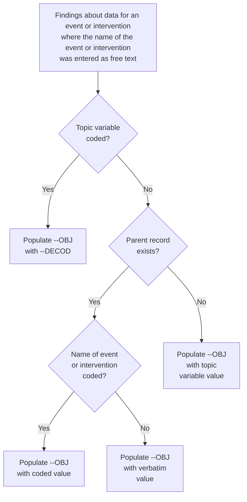
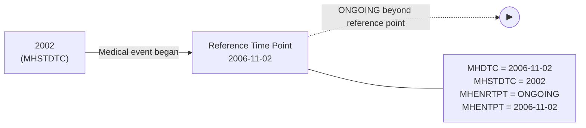
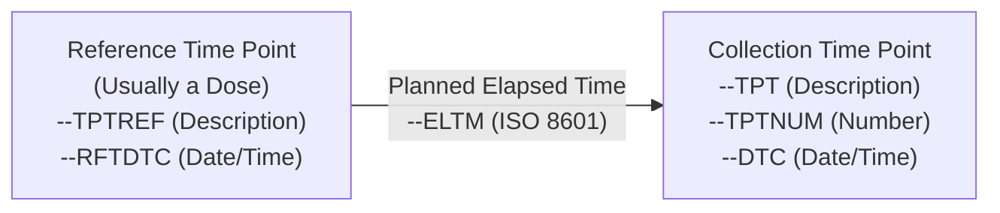
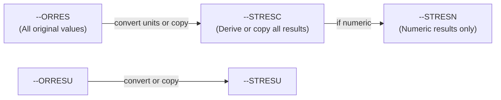

# SDTMIG v3.4 — Chapter 4: Assumptions for Domain Models

Source: SDTMIG v3.4, Section 4 (Pages 22-59)

## Overview

This section describes basic concepts, business rules, and assumptions that should be taken into consideration before applying the domain models. It covers general domain assumptions, general variable assumptions, coding and controlled terminology assumptions, actual and relative time assumptions, and other assumptions.

---

## 4.1 General Domain Assumptions

### 4.1.1 Review Study Data Tabulation Model and Implementation Guide

<!-- [验证注记] PDF 4.1.1: 建议先阅读 SDTM v2.0 再阅读 SDTMIG；了解 GOC 概念、特殊用途域、试验设计模型等。此节待补全。 -->

Sponsors should first read the SDTM to gain a general understanding of SDTM concepts before reading the SDTMIG. The SDTM describes the general conceptual framework, including the general observation classes (Interventions, Events, Findings), special-purpose domains, trial design model datasets, relationship datasets, and study references.

### 4.1.2 Relationship to Analysis Datasets

<!-- [验证注记] PDF 4.1.2: SDTM 与 ADaM 的关系。此节待补全。 -->

Data submitted in SDTM datasets should be traceable from analysis datasets (ADaM) back to SDTM datasets and from SDTM datasets back to source data. SDTM datasets are tabulation datasets; analysis-derived variables belong in ADaM datasets, not in SDTM.

### 4.1.3 Additional Timing Variables

<!-- [验证注记] PDF 4.1.3 含 4.1.3.1 EPOCH Variable Guidance。此节待补全。 -->

In addition to the core timing variables, SDTM provides additional timing variables (TAETORD, EPOCH) for representing study design elements. EPOCH is used to identify the portion of the trial in which an observation took place.

#### 4.1.3.1 EPOCH Variable Guidance

EPOCH identifies the period of the study (e.g., "SCREENING", "TREATMENT", "FOLLOW-UP"). EPOCH is a permissible timing variable in all general observation class domains.

### 4.1.4 Order of the Variables

Standard datasets should follow the SDTM data structures. Variable order should match the order defined in the SDTM for the general observation class: Identifiers first, then Topic, then Qualifiers, then Timing variables. See SDTM Sections 3.1.1–3.1.5 for detailed ordering requirements.

### 4.1.5 SDTM Core Designations

| Core Value | Meaning | Rule |
|------------|---------|------|
| **Req** (Required) | Must be included in the dataset | Must always be populated; cannot be null for any record; dataset is non-conformant without it |
| **Exp** (Expected) | Must be included in the dataset | Value should be populated when available; null values allowed when data not collected/applicable; must still include the column and add a comment in the Define-XML document to state that the study does not include the data item |
| **Perm** (Permissible) | May be included in the dataset | If a study includes a data item that would be represented in a Permissible variable, then that variable must be included (even if null) and declared in Define-XML; if a study did not collect the data, do not include the variable and do not declare it in Define-XML |

### 4.1.6 Additional Guidance on Dataset Naming

<!-- [验证注记] PDF 4.1.6: 自定义域名规则（X、Y、Z 字母保留），RELREC/SUPP-- 命名例外等。此节待补全。 -->

Sponsor-selected 2-character domain codes should be used consistently throughout the submission. Reserved codes (AD, AX, AP, SQ, SA) may not be used as custom domain codes.

### 4.1.7 Splitting Domains

- The general rule is that data should **not** be split across multiple datasets based on when data were collected. For example, prior and concomitant medications should both be in CM.
- **Exceptions:** Adverse Events (AE) and Medical History (MH) are separate for regulatory reporting needs
- Questionnaires should be split into separate datasets when the questionnaires are independent instruments (e.g., separate datasets for BDI-II vs. HAM-D)
- Do not create separate domains based on how data were used (efficacy vs. safety)
- Do not create separate domains based on separate CRF modules

### 4.1.8 Origin Metadata

Origin metadata describes the source of data values. Origin metadata is provided at the variable level in the Define-XML document. Traceability is an important concept — data should be traceable from analysis datasets back to SDTM datasets and from SDTM datasets back to source data.

#### 4.1.8.1 Variables

Variable-level origin describes the source of a variable's values (e.g., CRF, Derived, Assigned, Protocol).

#### 4.1.8.2 Records

Record-level origin: if a record origin is "Derived", all values in the record are derived. For variables with both collected and derived values, value-level metadata should be used.

### 4.1.9 Assigning Natural Keys in the Metadata

Sponsors should assign natural keys that define uniqueness for records. Natural keys should be listed in the Define-XML. In some instances, a supplemental qualifier (SUPP--) variable might contribute to the natural key of a record.

---

## 4.2 General Variable Assumptions

### 4.2.1 Variable-Naming Conventions

- Variable names are limited to 8 characters (SAS v5 transport format)
- `--` prefix is replaced by 2-character domain code
- Variables without `--` prefix (e.g., STUDYID, USUBJID) are used as-is across all domains
- --TESTCD: up to 8 characters, cannot start with a number, cannot contain underscores
- --TEST: full descriptive name of the test
- ETCD, TSPARMC: limited to 8 characters
- ARMCD: limited to 20 characters
- Variable labels: limited to 40 characters

#### 4.2.1.1 --TEST and --TESTCD Conventions (Findings)

- --TESTCD: standardized or dictionary-derived short sequence, up to 8 characters
- --TEST: full descriptive name of the test
- Both are subject to controlled terminology where available

#### 4.2.1.2 --TRT Conventions (Interventions)

- Contains the verbatim name of the treatment, drug, procedure, or therapy
- Should represent the name as reported on the CRF

#### 4.2.1.3 --TERM Conventions (Events)

- Contains the verbatim or prespecified name of the event
- Should represent the term as reported on the CRF

### 4.2.2 Two-character Domain Identifier

<!-- [验证注记] PDF 4.2.2: 2字符域标识符规则。此节待补全。 -->

The 2-character domain identifier: first character A-Z, second character A-Z or 0-9. Variables that do not carry the domain prefix include: Required Identifiers (STUDYID, DOMAIN, USUBJID), VISIT/VISITNUM/VISITDY, all DM domain variables (except DMDTC/DMDY), and RELREC/SUPPQUAL variables.

### 4.2.3 Use of "Subject" and USUBJID

- USUBJID must be unique for each subject across all studies for the same compound
- CDISC does not recommend any specific format; only requires uniqueness across all subjects in the submission and across multiple submissions for the same compound
- Many sponsors concatenate Study, Site, and Subject into USUBJID, but this is not required
- USUBJID is Required in all datasets containing subject-level data

### 4.2.4 Text Case in Submitted Data

<!-- [验证注记] PDF 4.2.4: 文本数据大小写规则。此节待补全。 -->

Text data should generally be uppercase (e.g., "NEGATIVE" not "Negative"). Exceptions: long text fields (comments), --TEST values (title case), values from external dictionaries (MedDRA, SNOMED, QRS). Case must match the controlled terminology declared in Define-XML.

### 4.2.5 Convention for Missing Values

Missing values are represented as null. When a test is not performed, use --STAT = "NOT DONE" and --REASND for the reason. See Section 4.5.1.2 for details.

### 4.2.6 Grouping Variables and Categorization

- --GRPID: used to link related records within the same domain (e.g., linking multiple CM records for a combination therapy)
- --CAT/--SCAT: used to categorize observations within a domain
- --LNKID/--LNKGRP: used for linking across domains via RELREC

**Key distinctions:**
- --GRPID groups records that are part of the same event/intervention
- --CAT/--SCAT classify records by type or category
- --REFID: internal or external identifier (e.g., specimen ID, ECG trace ID)
- --SPID: sponsor-defined reference number (e.g., line number on a CRF page)

### 4.2.7 Submitting Free Text from the CRF

<!-- [验证注记] PDF 4.2.7 含 4.2.7.1-4.2.7.4 四个子节。此处仅部分覆盖。 -->

#### 4.2.7.1 "Specify" Values for Non-Result Qualifiers

When a CRF includes an "Other, Specify" response, the specified text should populate the appropriate variable.

#### 4.2.7.2 "Specify" Values for Result Qualifiers

When a Findings result is a "Specify" value, the actual specified text should be placed in --ORRES.

#### 4.2.7.3 "Specify" Values for Topic Variables

--TERM should be populated with the description of the event found in the specified text, and --PRESP could be used to distinguish between prespecified and free-text responses.

#### 4.2.7.4 "Specify" Values for --OBJ

When FAOBJ represents a "Specify" value, the actual specified text should be used.

### 4.2.8 Multiple Values for a Variable

<!-- [验证注记] PDF 4.2.8 含 4.2.8.1-4.2.8.4 四个子节。此节待补全。 -->

When multiple values exist for a single variable, guidance is provided for handling: topic variables in Interventions/Events (4.2.8.1), result variables in Findings (4.2.8.2), non-result qualifier variables (4.2.8.3), and parameters with multiple values (4.2.8.4).

### 4.2.9 Variable Lengths

- Variable lengths should not use the maximum 200 characters without reason
- Flag variables: length always 1
- --TESTCD and IDVAR: maximum 8 characters
- Controlled terminology variables: length should be set to the length of the longest term

---

## 4.3 Coding and Controlled Terminology Assumptions

### Overview

CDISC Controlled Terminology (CT) is centrally managed by the CDISC Controlled Terminology Team. Key principles:

- Variables subject to CT are indicated in domain specification tables
- An asterisk (*) next to a codelist name means the variable **may** be subject to CT (sponsor-defined values also acceptable)
- CT is updated quarterly; sponsors should check the CDISC CT website for the latest version
- The NCI Enterprise Vocabulary Services (NCI-EVS) website is the authoritative source

### MedDRA Coding (Events)

- MedDRA is the standard dictionary for coding adverse events, medical history, and other event terms
- Coded terms populate --DECOD (Preferred Term) and associated hierarchy variables

### WHODrug Coding (Interventions)

- WHODrug is the standard dictionary for coding concomitant medications
- Coded terms populate --DECOD (generic drug name) and associated classification variables

---

## 4.4 Actual and Relative Time Assumptions

### 4.4.1 Date/Time Variables

- All date/time variables use **ISO 8601** format
- Character type (not numeric) — makes data platform- and software-independent
- Partial dates are supported: `2003`, `2003-06`, `2003-06-15`, `2003-06-15T13:15:17`
- The precision of the date/time reflects the precision of the collected data
- Hyphens (-) may be used to represent missing intermediate components
- Appropriate right truncations are used for unknown precision

### 4.4.2 Study Reference Dates (DM Domain)

| Variable | Description |
|----------|-------------|
| RFSTDTC | Subject Reference Start Date/Time (basis for --DY) |
| RFENDTC | Subject Reference End Date/Time |
| RFXSTDTC | Date/Time of First Study Treatment |
| RFXENDTC | Date/Time of Last Study Treatment |
| RFCSTDTC | Date/Time of First Study Contact |
| RFCENDTC | Date/Time of Last Study Contact |
| RFICDTC | Date/Time of Informed Consent |
| RFPENDTC | Date/Time of End of Participation |
| DTHDTC | Date/Time of Death |

### 4.4.3 Intervals and Duration

- **Intervals** (--STDTC to --ENDTC): represented as 2 separate variables or a single ISO 8601 interval
- **Duration** (--DUR): ISO 8601 duration format `PnYnMnDTnHnMnS` or `PnW`
  - Examples: "P2D" = 2 days, "PT6H" = 6 hours, "P2Y" = 2 years, "P10W" = 10 weeks, "P5DT12.25H" = 5 days 12¼ hours
- Weeks cannot be combined with days or months
- The lowest-precision component may use decimal representation
- Duration should be collected directly, not derived from start/end dates (unless documented)

#### 4.4.3.1 Interval with Uncertainty

When start date/time and duration are known but end date/time is not (or vice versa), ISO 8601 interval notation may be used: `YYYY-MM-DDThh:mm:ss/PnYnMnDTnHnMnS`

### 4.4.4 Study Day Variables

- --DY is calculated as: `--DTC - RFSTDTC` (with no day 0)
- If --DTC is on or after RFSTDTC: DY = date portion of --DTC − date portion of RFSTDTC + 1
- If --DTC is before RFSTDTC: DY = date portion of --DTC − date portion of RFSTDTC
- Partial dates should not be used to derive study day
- Study Day is not suitable for mathematical calculations (e.g., computing durations); use original date values instead

### 4.4.5 Clinical Encounters and Visits

- **VISITNUM**: numeric version of VISIT used for sorting
- **VISIT**: character name of the visit from the protocol
- **VISITDY**: must be the planned study day (not the actual study day; do not use --DY)
- There must be a **one-to-one relationship** between VISIT and VISITNUM
- Unplanned visits should use VISITNUM values that sort between planned visits (e.g., 1.1 between VISITNUM 1 and 2)
- All domains based on the 3 GOCs should have at least 1 timing variable

### 4.4.6 Representing Additional Study Days

- --XSTDY and --CHSTDY may be used for study designs with multiple reference start dates (e.g., crossover studies)
- The reference date/time may use Subject Elements (SE) dataset element start date/time

### 4.4.7 Use of Relative Timing Variables

| Variable | Values | Purpose |
|----------|--------|---------|
| --STRF | BEFORE, DURING, DURING/AFTER, AFTER, UNKNOWN | Start relative to the sponsor-defined reference period |
| --ENRF | BEFORE, DURING, DURING/AFTER, AFTER, UNKNOWN | End relative to the sponsor-defined reference period |
| --STRTPT | BEFORE, COINCIDENT, AFTER, UNKNOWN | Start relative to a specific reference time point |
| --STTPT | (free text) | Description of the reference time point for --STRTPT |
| --ENRTPT | BEFORE, COINCIDENT, AFTER, ONGOING, UNKNOWN | End relative to a specific reference time point |
| --ENTPT | (free text) | Description of the reference time point for --ENRTPT |

**Example applications:**
- **Medical History:** --STRTPT = "BEFORE", --STTPT = "INFORMED CONSENT"
- **Concomitant Medications:** --STRF = "BEFORE", --ENRF = "DURING"
- **Adverse Events:** --ENRTPT = "ONGOING", --ENTPT = "DATE OF LAST DOSE"

*Medical event began in 2002 and was ongoing at the reference time point of 2006-11-02. The event may or may not have ended at any time after that.*

### 4.4.8 Date and Time in Findings

| Scenario | Variables Used |
|----------|---------------|
| Single point in time (e.g., lab draw) | --DTC |
| Assessment interval (e.g., time period) | --DTC, --ENDTC |

**Note:** --STDTC should not be used in the Findings general observation class for single-point-in-time observations; --DTC is the primary date variable.

### 4.4.9 Use of Dates as Result Variables

Dates should be used with caution as result values in --ORRES. When dates are the result of an observation (e.g., "Date of Last Menstrual Period"), they should be placed in --ORRES with the date in ISO 8601 format.

### 4.4.10 Representing Time Points

Time points are protocol-defined measurement times within a visit:

| Variable | Purpose |
|----------|---------|
| --TPT | Planned Time Point Name (e.g., "1 HOUR POST-DOSE") |
| --TPTNUM | Planned Time Point Number (for sorting) |
| --ELTM | Planned Elapsed Time from Reference (ISO 8601 duration) |
| --TPTREF | Time Point Reference description (e.g., "DOSE 1 OF TREATMENT A") |
| --RFTDTC | Date/Time of Reference Time Point |

**Note:** When time points are represented, both --TPT and --TPTNUM must be used together.

For crossover trials, 2 options are available:
- **Option 1:** Use VISITNUM to distinguish periods; --TPTREF to distinguish doses within same day; --TPTNUM for sequence relative to reference time point
- **Option 2:** Use unique --TPTNUM values across all periods

### 4.4.11 Disease Milestones

Disease Milestones (defined in TM, recorded in SM) provide a way to anchor observations to clinically significant time points:

| Variable | Purpose |
|----------|---------|
| MIDS | Disease Milestone Instance Name (e.g., EPISODE1, EPISODE2) |
| RELMIDS | Relationship to Disease Milestone Instance |
| MIDSDTC | Disease Milestone Instance Date |

**RELMIDS controlled terminology examples:** IMMEDIATELY BEFORE, AT START OF, DURING, AT END OF, SHORTLY AFTER, WEEK PRIOR, AT DISCHARGE, WEEK AFTER, BEFORE, AFTER

**Use with other timing variables:** Actual date/times, study-day variables, EPOCH/TAETORD, visit variables, time-point variables, and --STRF/--ENRF/--STRTPT can all be used alongside disease milestone variables.

**Linking:** MIDS links observations to disease milestones similarly to how VISITNUM links to visits. RELREC can only represent that a relationship exists, not the nature of the relationship.

---

## 4.5 Other Assumptions

### 4.5.1 Original and Standardized Results

The SDTM provides a 3-level result framework for Findings:

**Key rules:**
- --ORRES: always the originally collected/reported value
- --STRESC: standardized character result; must be populated whenever --ORRES is populated (regardless of whether data values are character or numeric)
- --STRESN: numeric version of --STRESC (null when result is non-numeric)
- --ORRESU / --STRESU: original and standard units
- Values with comparison operators (e.g., >10,000, <1): place in --STRESC; --STRESN should be null

**Tests Not Done (4.5.1.2):**
- When a test is not performed: --STAT = "NOT DONE", --REASND = reason
- --ORRES, --STRESC, --STRESN must all be null when --STAT = "NOT DONE"
- --ORRESU and --STRESU should also be null
- If CRF does not explicitly collect "Done/Not Done", do not create NOT DONE records (exception: QRS datasets)
- A single record can represent a group of tests not done: --TESTCD = "--ALL", --TEST = domain description, --CAT = name of group

### 4.5.2 Linking Multiple Observations

See Section 8, Representing Relationships and Data, for guidance on expressing relationships among multiple observations.

### 4.5.3 Text Strings that Exceed the Maximum Length

| Scenario | Solution |
|----------|----------|
| --TEST value > 40 characters | Use a shorter --TEST label; the full descriptive name goes in Define-XML |
| Text value > 200 characters | First 200 characters in parent domain variable; subsequent 200-character segments in SUPP-- with numbered QNAM suffixes (split at word boundaries) |
| Domain-specific long text | CO.COVAL, IE.IETEST, TS.TSVAL, TI.IETEST: variable lengths of 200 or 500+ characters may be supported |

### 4.5.4 Evaluators in Interventions and Events

When evaluator information needs to be captured for Interventions or Events domains (which do not have --EVAL), use SUPP-- datasets.

**Example:** SUPPAE with QNAM = "AEEVAL", QLABEL = "Evaluator", QVAL = "INVESTIGATOR"

### 4.5.5 Clinical Significance (--CLSIG)

- --CLSIG is a standard variable in Findings domains
- Used to indicate whether a finding is clinically significant
- Values are subject to controlled terminology

### 4.5.6 Supplemental Reason Variables

The SDTM provides multiple reason-related variables for different contexts:

| Variable | Applicable Classes | Purpose |
|----------|--------------------|---------|
| --REASND | Findings | Reason Not Done |
| --REASOC | Events, Interventions | Reason for Occurrence |
| --INDC | Interventions | Indication |
| --ADJ | Interventions | Adjustment Reason |
| --REASPF | Findings, Events | Reason for Pre-specified |

- --REASOC represents the reason for the value in --OCCUR
- --REASOC does not replace --INDC
- If multiple reasons are collected, see Section 4.2.8.3

### 4.5.7 Presence/Absence of Pre-specified Events and Interventions

| Variable | Purpose | Valid Values |
|----------|---------|-------------|
| --PRESP | Pre-Specified | "Y" (prespecified) or null (spontaneously reported) |
| --OCCUR | Occurrence Indicator | "Y" (occurred) or "N" (did not occur); Permissible variable |
| --STAT | Completion Status | "NOT DONE" or null |

**Rules:**
- If --PRESP = "Y" and --OCCUR = "N": the prespecified item did not occur
- If --PRESP = "Y" and --OCCUR = "Y": the prespecified item occurred
- If --PRESP is null: the observation was spontaneously reported (not prespecified)
- --OCCUR and --STAT should not both be populated on the same record
- For studies with both prespecified and spontaneous reports, --OCCUR should be "Y" or "N" for all prespecified items, and null for spontaneous items

### 4.5.8 Long-term Follow-up

For studies with long-term follow-up (e.g., oncology), the following storage guidance applies:

1. CM: store concomitant medications during follow-up
2. SS: store survival status assessments
3. DS: store disposition events (including long-term follow-up epoch and overall study conclusion)
4. DM: if survival status is "dead", DTHDTC and DTHDFL should be populated appropriately
5. TA/TE/TV: represent the long-term follow-up phase in trial design datasets
6. SV/SE: store subject visit and element data consistent with TV/TE

### 4.5.9 Baseline Values

| Variable | Structure | Requirement | Definition | Use |
|----------|-----------|-------------|------------|-----|
| --LOBXFL | SDTM (Findings) | Expected or Permissible (varies by domain) | Last non-missing value prior to RFXSTDTC (operationally derived) | Identifies the last non-null result before first exposure |
| --BLFL | SDTM (Findings) | Permissible | Baseline value flag | Proposed for future SDTM use; identifies the baseline value |
| ABLFL | ADaM (BDS) | — | Analysis Baseline Flag | ADaM analysis baseline indicator (not an SDTM variable) |

**Note:** --LOBXFL is the SDTM variable for flagging the last observation before first exposure. The actual baseline determination for analysis purposes should be done in ADaM using ABLFL.
