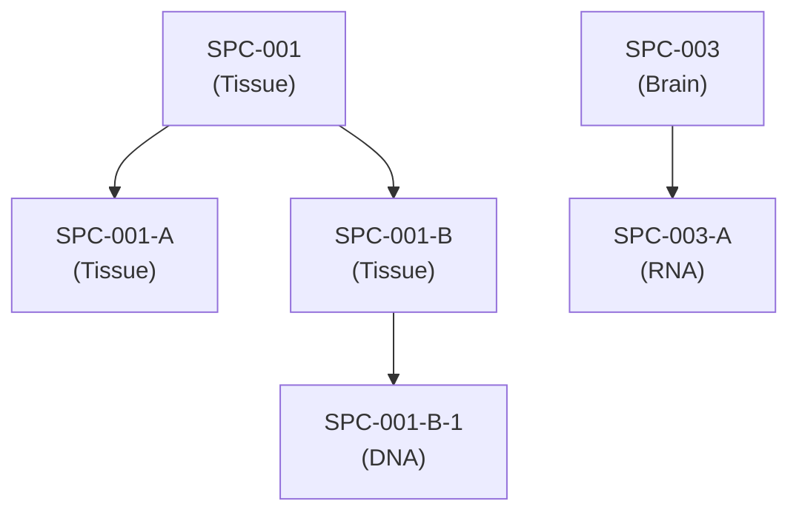

# SDTMIG v3.4 — Chapter 8: Representing Relationships and Data

Source: SDTMIG v3.4, Section 8 (Pages 427-446)

## Overview

This section describes how to represent relationships between separate domains, datasets, and/or records, and provides information to help sponsors determine where data belong in the SDTM.

---

## 8.1 Relating Records Within a Domain Using --GRPID

--GRPID is used to link related records within the same domain. All records sharing the same --GRPID value are considered a related group.

**Example:** Combination therapy in CM domain — a subject taking a combination of drugs as a single therapy:

| Row | CMTRT | CMGRPID | CMSTDTC | CMENDTC |
|-----|-------|---------|---------|---------|
| 1 | ASPIRIN | COMBO1 | 2005-01-01 | 2005-06-30 |
| 2 | DIPYRIDAMOLE | COMBO1 | 2005-01-01 | 2005-06-30 |
| ... | (up to 12 rows showing combination therapy grouping) | | | |

---

## 8.2 Relating Peer Records Across Domains Using RELREC

RELREC is used to describe relationships between records in different domains (peer records). Relationships are defined in pairs of rows in the RELREC dataset.

### RELREC Specification

| Variable | Label | Type | Core | Notes |
|----------|-------|------|------|-------|
| STUDYID | Study Identifier | Char | Req | |
| RDOMAIN | Related Domain Abbreviation | Char | Req | |
| USUBJID | Unique Subject Identifier | Char | Exp | Null for dataset-level relationships |
| IDVAR | Identifying Variable | Char | Req | e.g., --SEQ, --GRPID |
| IDVARVAL | Identifying Variable Value | Char | Exp | |
| RELTYPE | Relationship Type | Char | Exp | "ONE" or "MANY"; used only for dataset-level relationships (Section 8.3) |
| RELID | Relationship Identifier | Char | Req | Groups paired RELREC records |

### Relationship Type Combinations

| RELTYPE Pair | Meaning |
|-------------|---------|
| ONE-to-ONE | One record in domain A relates to exactly one record in domain B |
| ONE-to-MANY | One record relates to multiple records |
| MANY-to-ONE | Multiple records relate to one record |
| MANY-to-MANY | Multiple records relate to multiple records |

### Examples

**Example 1:** Linking an AE record to CM records (concomitant medications taken for the AE)
```
RELREC Row 1: RDOMAIN=AE, IDVAR=AESEQ, IDVARVAL=5, RELID=1
RELREC Row 2: RDOMAIN=CM, IDVAR=CMSEQ, IDVARVAL=11, RELID=1
RELREC Row 3: RDOMAIN=CM, IDVAR=CMSEQ, IDVARVAL=12, RELID=1
```

**Example 2:** Linking records across AE, CM, and LB domains (5 records sharing RELID=1)
```
RELREC Row 1: RDOMAIN=AE, IDVAR=AESEQ, IDVARVAL=3, RELID=1
RELREC Row 2: RDOMAIN=CM, IDVAR=CMGRPID, IDVARVAL=COMBO1, RELID=1
... (additional rows linking LB records)
```

---

## 8.3 Relating Datasets Using RELREC

For dataset-level relationships, USUBJID is null and IDVAR/IDVARVAL identify the linking variables.

**Example:** Linking TU and TR datasets (tumor identification and tumor results)
```
RELREC Row 1: RDOMAIN=TU, USUBJID=(null), IDVAR=TULNKID, IDVARVAL=(null), RELTYPE=ONE, RELID=1
RELREC Row 2: RDOMAIN=TR, USUBJID=(null), IDVAR=TRLNKID, IDVARVAL=(null), RELTYPE=MANY, RELID=1
```

---

## 8.4 Supplemental Qualifiers (SUPP--)

### Specification

| Variable | Label | Type | Core |
|----------|-------|------|------|
| STUDYID | Study Identifier | Char | Req |
| RDOMAIN | Related Domain Abbreviation | Char | Req |
| USUBJID | Unique Subject Identifier | Char | Req |
| POOLID | Pool Identifier | Char | Perm |
| IDVAR | Identifying Variable | Char | Exp |
| IDVARVAL | Identifying Variable Value | Char | Exp |
| QNAM | Qualifier Variable Name | Char | Req |
| QLABEL | Qualifier Variable Label | Char | Req |
| QVAL | Data Value | Char | Req |
| QORIG | Origin | Char | Req |
| QEVAL | Evaluator | Char | Exp |

### Key Rules

- Separate SUPP-- datasets are required for each parent domain (e.g., suppae.xpt, suppcm.xpt)
- QNAM must be a valid SAS variable name (1-8 characters, starting with a letter)
- QNAM should follow CDISC naming conventions (see Appendix D for naming fragments)
- QVAL is always character type (even for numeric values)
- IDVAR is typically --SEQ but can be --LNKID or other identifier

### When NOT to Use SUPP--

- Do not use SUPP-- for standard SDTM variables that belong in the parent domain
- Do not use SUPP-- for data that belongs in a different domain
- Do not use SUPP-- for analysis-derived variables (those belong in ADaM)

### Examples

**Example 1:** SUPPAE — additional AE qualifiers
```
RDOMAIN=AE, IDVAR=AESEQ, IDVARVAL=1, QNAM=AESOSP, QLABEL="Other Medically Important SAE", QVAL="Y"
```

**Example 2:** SUPPQS — supplemental questionnaire data
```
RDOMAIN=QS, IDVAR=QSSEQ, IDVARVAL=5, QNAM=QSREASND, QLABEL="Reason Not Done", QVAL="PATIENT REFUSED"
```

---

## 8.5 Relating Comments to a Parent Domain

Comments in the CO domain can be related to parent domain records in 3 ways:

1. **Direct relationship using RDOMAIN, IDVAR, IDVARVAL** — the CO record specifies which domain and record the comment relates to
2. **Using RELREC** — a RELREC record links the CO record to a parent domain record
3. **Standalone comments** — RDOMAIN is null; the comment is not related to any specific domain

---

## 8.6 Where Data Belong

### 8.6.1 Guidelines for Determining the General Observation Class

Use these questions to determine the appropriate GOC:

| Question | If Yes |
|----------|--------|
| Was it administered to or used by the subject? | → **Interventions** |
| Did it happen to the subject (planned or unplanned)? | → **Events** |
| Was it a measurement, test, or assessment? | → **Findings** |
| Is it about an event or intervention (not the subject directly)? | → **Findings About** |

### 8.6.2 Guidelines for Forming New Domains

When existing domains do not fit, follow the procedure in Section 2.6 (Creating a New Domain).

### 8.6.3 Guidelines for Differentiating Between Interventions, Events, Findings, and Findings About

A decision table with questions to help determine the appropriate observation class:

| Question | Interpretation |
|----------|---------------|
| Is this a measurement with units? | → Findings |
| Are the data collected in a CRF for each visit or an overall CRF log form? | Visit-based → Findings; Log form → Events or Interventions |
| What date/times are collected? | Single date → Findings; Start/End dates → Events or Interventions |
| Is verbatim text collected and then coded? | → Events (--TERM/--DECOD) or Interventions (--TRT/--DECOD) |
| If this is data about an event, does it apply to the event as a whole? | Yes → Event qualifier; No → Findings About (FA) |
| Does this data meet the criteria for representation in a QRS domain? | Yes → QS or FA domain |

**Note:** The FA domain was originally created for findings about events but may also be used for findings about interventions. If data does not fit the standard qualifiers of an Events GOC domain, first consider whether the data represents a Finding about the event itself.

---

## 8.7 Related Subjects (RELSUB)

### Specification

| Variable | Label | Type | Core |
|----------|-------|------|------|
| STUDYID | Study Identifier | Char | Req |
| USUBJID | Unique Subject Identifier | Char | Exp |
| POOLID | Pool Identifier | Char | Perm |
| RSUBJID | Related Subject or Pool Identifier | Char | Req |
| SREL | Subject Relationship to Related Subject/Pool | Char | Req |

### Assumptions

1. Each record in RELSUB describes 1 directional relationship from USUBJID to RSUBJID
2. SREL describes the relationship from the perspective of RSUBJID relative to USUBJID (e.g., SREL = "MOTHER, BIOLOGICAL" means RSUBJID is the biological mother of USUBJID)
3. Reciprocal relationships require 2 records
4. RSUBJID can reference subjects within or outside the current study
5. If RSUBJID references a subject in another study, a compound-level subject identifier should be used
6. Values of SREL should be taken from the CDISC Controlled Terminology codelist RELSUB wherever possible
7. Relationships to pools use POOLID in RSUBJID
8. Family relationships (genetic studies) are a primary use case
9. RELSUB can also be used to represent caregiver-patient relationships

### Example

Hemophilia study (HEM021) with family relationships:

**dm.xpt** (3 subjects):
| STUDYID | USUBJID | SEX | AGE |
|---------|---------|-----|-----|
| HEM021 | HEM021-001 | F | 60 |
| HEM021 | HEM021-002 | M | 35 |
| HEM021 | HEM021-003 | M | 35 |

**relsub.xpt** (relationship records):
| STUDYID | USUBJID | RSUBJID | SREL |
|---------|---------|---------|------|
| HEM021 | HEM021-002 | HEM021-001 | MOTHER, BIOLOGICAL |
| HEM021 | HEM021-003 | HEM021-001 | MOTHER, BIOLOGICAL |
| HEM021 | HEM021-001 | HEM021-002 | CHILD, BIOLOGICAL |
| HEM021 | HEM021-001 | HEM021-003 | CHILD, BIOLOGICAL |
| HEM021 | HEM021-002 | HEM021-003 | TWIN, DIZYGOTIC |
| HEM021 | HEM021-003 | HEM021-002 | TWIN, DIZYGOTIC |

---

## 8.8 Related Specimens (RELSPEC)

### Specification

| Variable | Label | Type | Core |
|----------|-------|------|------|
| STUDYID | Study Identifier | Char | Req |
| USUBJID | Unique Subject Identifier | Char | Req |
| REFID | Specimen Identifier | Char | Req |
| SPEC | Specimen Material Type | Char | Perm |
| PARENT | Specimen Parent | Char | Exp |
| LEVEL | Specimen Level | Char | Req |

### Assumptions

1. Each record describes a specimen and its relationship to a parent specimen
2. The root specimen (original collection) has PARENT = null
3. REFID must be unique within a subject across all domains that reference the specimen
4. The SPEC variable describes the type of material (e.g., "BLOOD", "SERUM", "PLASMA")

### Example

Specimen lineage diagram:



**relspec.xpt:**

| STUDYID | USUBJID | REFID | SPEC | PARENT | LEVEL |
|---------|---------|-------|------|--------|-------|
| STUDY1 | SUBJ-001 | SPC-001 | TISSUE | | 1 |
| STUDY1 | SUBJ-001 | SPC-001-A | TISSUE | SPC-001 | 2 |
| STUDY1 | SUBJ-001 | SPC-001-B | TISSUE | SPC-001 | 2 |
| STUDY1 | SUBJ-001 | SPC-001-B-1 | DNA | SPC-001-B | 3 |
| STUDY1 | SUBJ-001 | SPC-003 | BRAIN | | 1 |
| STUDY1 | SUBJ-001 | SPC-003-A | RNA | SPC-003 | 2 |
