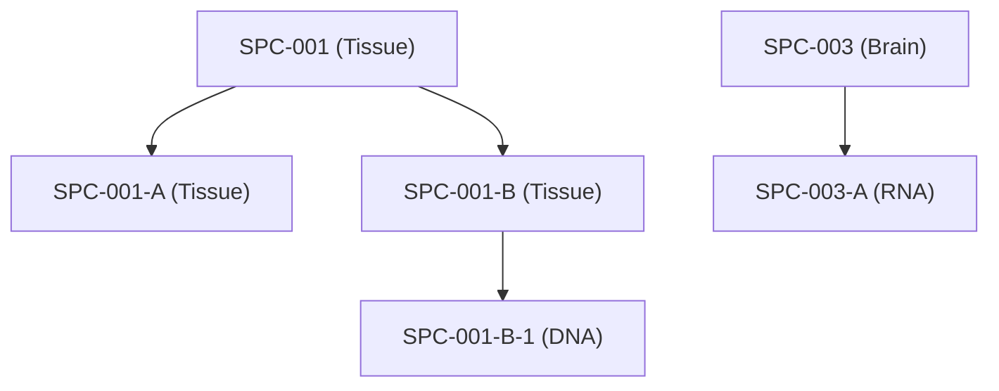

# SDTMIG v3.4 — Chapter 8: Representing Relationships and Data

Source: SDTMIG v3.4, Section 8 (Pages 427-446)

## Overview

The defined variables of the SDTM general observation classes could restrict the ability of sponsors to represent all the data they wish to submit. Collected data that may not entirely fit includes relationships between records within a domain, records in separate domains, and sponsor-defined "variables." As a result, the SDTM has methods to represent distinct types of relationships, all of which are described in more detail in subsequent sections:

- **Section 8.1**, Relating Groups of Records Within a Domain Using the --GRPID Variable — representing a relationship between a group of records for a given subject within the same domain
- **Section 8.2**, Relating Peer Records — representing relationships between independent records (usually in separate domains) for a subject, such as a concomitant medication taken to treat an adverse event
- **Section 8.3**, Relating Datasets — representing a relationship between 2 (or more) datasets where records of 1 (or more) dataset(s) are related to record(s) in another dataset (or datasets)
- **Section 8.4**, Relating Non-standard Variable Values to a Parent Domain — the method for representing the dependent relationship where data that cannot be represented by a standard variable within DM or a GOC domain record can be related back to that record
- **Section 8.5**, Relating Comments to a Parent Domain — representing a dependent relationship between a comment in the CO domain and a parent record in other domains
- **Section 8.6**, How to Determine Where Data Belong in SDTM-Compliant Data Tabulations — the concept of related datasets and where to place additional data
- **Section 8.7**, Relating Subjects — representing collected relationships between persons, both of whom are study subjects (e.g., "MOTHER, BIOLOGICAL"; "CHILD, BIOLOGICAL"; "TWIN, DIZYGOTIC")
- **Section 8.8**, Related Specimens — a dataset used to represent relationships between specimens

All relationships make use of the standard domain identifiers STUDYID, DOMAIN, and USUBJID. In addition, the variables IDVAR and IDVARVAL are used for identifying the record-level merge/join keys. These keys are used to tie information together by linking records. The following are examples of variables that could be used in IDVAR:

- The sequence number (--SEQ) variable uniquely identifies a record for a given USUBJID within a domain. --SEQ is required in all domains except DM. Conventions for establishing and maintaining --SEQ values are sponsor-defined. Values may or may not be sequential depending on data processes and sources.
- The reference identifier (--REFID) variable can be used to capture a sponsor-defined or external identifier, such as lab-specimen identifiers and ECG identifiers. --REFID is permissible in all general observation-class domains, but is never required. Values are sponsor-defined.
- The grouping identifier (--GRPID) variable, used to link related records for a subject within a domain, is explained in Section 8.1.

---

## 8.1 Relating Groups of Records Within a Domain Using --GRPID

The optional grouping identifier variable --GRPID is Permissible in all domains that are based on the general observation classes. It is used to identify relationships between records within a USUBJID within a single domain (e.g., intervention records for a combination therapy where treatments in the combination varies from subject to subject). In such cases, the relationship is defined by assigning the same unique character value to the --GRPID variable. The values used for --GRPID can be any values the sponsor chooses; however, if the sponsor uses values with some embedded meaning (rather than arbitrary numbers), those values should be consistent across the submission to avoid confusion. It is important to note that --GRPID has no inherent meaning across subjects or across domains.

Using --GRPID in the general-observation class domains can reduce the number of records in the RELREC, SUPP--, and CO datasets, when those datasets are submitted to describe relationships/associations for records or values to a "group" of general observation class records.

### 8.1.1 --GRPID Example

The following table illustrates --GRPID used in the Concomitant Medications (CM) domain to identify a combination therapy. In this example, both subjects 1234 and 5678 have reported 2 combination therapies, each consisting of 3 separate medications. The components of a combination all have the same value for CMGRPID. This example illustrates how CMGRPID groups information only within a subject within a domain.

**Rows 1-3:** Show 3 medications taken by subject 1234. CMGRPID="COMBO THPY 1" has been used to group these medications.

**Rows 4-6:** Show 3 different medications taken by subject 1234, with CMGRPID="COMBO THPY 2".

**Rows 7-9:** Show 3 medications taken by subject 5678. CMGRPID="COMBO THPY 1" has been used to group these medications. Note that the medications with CMGRPID "COMBO THPY 1" are completely different for subjects 1234 and 5678.

**Rows 10-12:** Show 3 different medications taken by subject 5678, with CMGRPID="COMBO THPY 2". Again, the medications with "COMBO THPY 2" are completely different for subjects 1234 and 5678.

cm.xpt:

| Row | STUDYID | DOMAIN | USUBJID | CMSEQ | CMGRPID | CMTRT | CMDECOD | CMDOSE | CMDOSU | CMSTDTC | CMENDTC |
|-----|---------|--------|---------|-------|---------|-------|---------|--------|--------|---------|---------|
| 1 | 1234 | CM | 1234 | 1 | COMBO THPY 1 | Verbatim Med A | Generic Med | 100 | mg | 2004-01-17 | 2004-01-19 |
| 2 | 1234 | CM | 1234 | 2 | COMBO THPY 1 | Verbatim Med B | Generic Med | 50 | mg | 2004-01-17 | 2004-01-19 |
| 3 | 1234 | CM | 1234 | 3 | COMBO THPY 1 | Verbatim Med C | Generic Med | 200 | mg | 2004-01-17 | 2004-01-19 |
| 4 | 1234 | CM | 1234 | 4 | COMBO THPY 2 | Verbatim Med D | Generic Med | 150 | mg | 2004-01-21 | 2004-01-22 |
| 5 | 1234 | CM | 1234 | 5 | COMBO THPY 2 | Verbatim Med E | Generic Med | 100 | mg | 2004-01-21 | 2004-01-22 |
| 6 | 1234 | CM | 1234 | 6 | COMBO THPY 2 | Verbatim Med F | Generic Med | 75 | mg | 2004-01-21 | 2004-01-22 |
| 7 | 1234 | CM | 5678 | 1 | COMBO THPY 1 | Verbatim Med G | Generic Med | 37.5 | mg | 2004-03-17 | 2004-03-25 |
| 8 | 1234 | CM | 5678 | 2 | COMBO THPY 1 | Verbatim Med H | Generic Med | 60 | mg | 2004-03-17 | 2004-03-25 |
| 9 | 1234 | CM | 5678 | 3 | COMBO THPY 1 | Verbatim Med I | Generic Med I | 20 | mg | 2004-03-17 | 2004-03-25 |
| 10 | 1234 | CM | 5678 | 4 | COMBO THPY 2 | Verbatim Med J | Generic Med | 100 | mg | 2004-03-21 | 2004-03-22 |
| 11 | 1234 | CM | 5678 | 5 | COMBO THPY 2 | Verbatim Med K | Generic Med | 50 | mg | 2004-03-21 | 2004-03-22 |
| 12 | 1234 | CM | 5678 | 6 | COMBO THPY 2 | Verbatim Med L | Generic Med | 10 | mg | 2004-03-21 | 2004-03-22 |

---

## 8.2 Relating Peer Records Across Domains Using RELREC

RELREC is used to describe relationships between records in different domains (peer records). Relationships are defined in pairs of rows in the RELREC dataset.

### RELREC Specification

| Variable | Label | Type | Core | Notes |
|----------|-------|------|------|-------|
| STUDYID | Study Identifier | Char | Req | |
| RDOMAIN | Related Domain Abbreviation | Char | Req | |
| USUBJID | Unique Subject Identifier | Char | Exp | Null for dataset-level relationships |
| IDVAR | Identifying Variable | Char | Req | e.g., --SEQ, --GRPID |
| IDVARVAL | Identifying Variable Value | Char | Exp | |
| RELTYPE | Relationship Type | Char | Exp | "ONE" or "MANY"; used only for dataset-level relationships (Section 8.3) |
| RELID | Relationship Identifier | Char | Req | Groups paired RELREC records |

### Relationship Type Combinations

| RELTYPE Pair | Meaning |
|-------------|---------|
| ONE-to-ONE | One record in domain A relates to exactly one record in domain B |
| ONE-to-MANY | One record relates to multiple records |
| MANY-to-ONE | Multiple records relate to one record |
| MANY-to-MANY | Multiple records relate to multiple records |

### 8.2.2 RELREC Dataset Examples

**Example 1:** This example illustrates the use of the RELREC dataset to relate records stored in separate domains for USUBJID = "123456". This example represents a situation in which a single adverse event is part of 2 collected relationships, one with 2 concomitant medications and the other with 2 laboratory findings, but there is no collected relationship between the 2 laboratory findings and the 2 concomitant medications.

**Rows 1-3:** Show the representation of a relationship between an AE record and 2 concomitant medication records.

**Rows 4-6:** Show the representation of a relationship between the same AE record and 2 laboratory findings records.

relrec.xpt:

| Row | STUDYID | RDOMAIN | USUBJID | IDVAR | IDVARVAL | RELTYPE | RELID |
|-----|---------|---------|---------|-------|----------|---------|-------|
| 1 | EFC1234 | AE | 123456 | AESEQ | 5 | | 1 |
| 2 | EFC1234 | CM | 123456 | CMSEQ | 11 | | 1 |
| 3 | EFC1234 | CM | 123456 | CMSEQ | 12 | | 1 |
| 4 | EFC1234 | AE | 123456 | AESEQ | 5 | | 2 |
| 5 | EFC1234 | LB | 123456 | LBSEQ | 47 | | 2 |
| 6 | EFC1234 | LB | 123456 | LBSEQ | 48 | | 2 |

**Example 2:** Same scenario as Example 1, but in this case the way the data were collected indicated that the concomitant medications and laboratory findings were all in a single relationship to each other and the adverse event.

relrec.xpt:

| Row | STUDYID | RDOMAIN | USUBJID | IDVAR | IDVARVAL | RELTYPE | RELID |
|-----|---------|---------|---------|-------|----------|---------|-------|
| 1 | EFC1234 | AE | 123456 | AESEQ | 5 | | 1 |
| 2 | EFC1234 | CM | 123456 | CMSEQ | 11 | | 1 |
| 3 | EFC1234 | CM | 123456 | CMSEQ | 12 | | 1 |
| 4 | EFC1234 | LB | 123456 | LBSEQ | 47 | | 1 |
| 5 | EFC1234 | LB | 123456 | LBSEQ | 48 | | 1 |

**Example 3:** Same scenario as Example 2, but the sponsor grouped the 2 concomitant medications in the CM domain using CMGRPID = "COMBO 1", allowing the relationship among these 5 records to be represented with 4, rather than 5, records in the RELREC dataset.

relrec.xpt:

| Row | STUDYID | RDOMAIN | USUBJID | IDVAR | IDVARVAL | RELTYPE | RELID |
|-----|---------|---------|---------|-------|----------|---------|-------|
| 1 | EFC1234 | AE | 123456 | AESEQ | 5 | | 1 |
| 2 | EFC1234 | CM | 123456 | CMGRPID | COMBO1 | | 1 |
| 3 | EFC1234 | LB | 123456 | LBSEQ | 47 | | 1 |
| 4 | EFC1234 | LB | 123456 | LBSEQ | 48 | | 1 |

Additional examples may be found in the domain examples such as Section 6.2.4, Disposition, Example 4, and all of the Pharmacokinetics examples in Section 6.3.5.9.3, Relating PP Records to PC Records.

---

## 8.3 Relating Datasets Using RELREC

The Related Records (RELREC) special-purpose dataset can also be used to identify relationships between datasets (e.g., a one-to-many or parent-child relationship). The relationship is defined by including a single record for each related dataset that identifies the key(s) of the dataset that can be used to relate the respective records.

Relationships between datasets should only be recorded in the RELREC dataset when the sponsor has found it necessary to split information between datasets that are related, and that may need to be examined together for analysis or proper interpretation. Note that it is not necessary to use the RELREC dataset to identify associations from data in the SUPP-- datasets or the Comments (CO) dataset to their parent general-observation class dataset records or special-purpose domain records, as both these datasets include the key variable identifiers of the parent record(s) that are necessary to make the association.

### 8.3.1 RELREC Dataset Relationship Example

**Example 1:** This example illustrates RELREC records used to represent the relationship between records in 2 datasets that have a one-to-many relationship. Note that because this is a dataset-to-dataset relationship, USUBJID and IDVARVAL are null.

relrec.xpt:

| Row | STUDYID | RDOMAIN | USUBJID | IDVAR | IDVARVAL | RELTYPE | RELID |
|-----|---------|---------|---------|-------|----------|---------|-------|
| 1 | EFC1234 | TU | | TULNKID | | ONE | 1 |
| 2 | EFC1234 | TR | | TRLNKID | | MANY | 1 |

In the sponsor's operational database, these datasets may have existed as either separate datasets that were merged for analysis, or a single dataset that may have included observations from more than 1 general observation class (e.g., Events and Findings). The value in IDVAR must be the name of the key used to merge/join the 2 datasets. In this example, the --LNKID variable is used as the key to identify the related observations. The values for the --LNKID variable in the 2 datasets are sponsor-defined. Although other variables may also serve as a single merge key when the corresponding values for IDVAR are equal, --GRPID, --SPID, --REFID, --LNKID, or --LNKGRP are typically used for this purpose.

The variable RELTYPE identifies the type of relationship between the datasets. The allowable values are ONE and MANY (controlled terminology is expected). This information defines how a merge/join would be written, and what would be the result of the merge/join. The possible combinations are:

1. **ONE and ONE.** This combination indicates that there is NO hierarchical relationship between the datasets and the records in the datasets. Only 1 record from each dataset will potentially have the same value of the IDVAR within USUBJID.

2. **ONE and MANY.** This combination indicates that there IS a hierarchical (parent-child) relationship between the datasets. One record within USUBJID in the dataset identified by RELTYPE = "ONE" will potentially have the same value of the IDVAR with many (1 or more) records in the dataset identified by RELTYPE = "MANY".

3. **MANY and MANY.** This combination is unusual and challenging to manage in a merge/join, and may represent a relationship that was never intended to convey a usable merge/join, such as described in Section 6.3.5.9.3, Relating PP Records to PC Records.

Because IDVAR identifies the keys that can be used to merge/join records between the datasets, --SEQ cannot be used. --SEQ only has meaning within a subject within a dataset, not across datasets.

---

## 8.4 Supplemental Qualifiers (SUPP--)

### Specification

| Variable | Label | Type | Core |
|----------|-------|------|------|
| STUDYID | Study Identifier | Char | Req |
| RDOMAIN | Related Domain Abbreviation | Char | Req |
| USUBJID | Unique Subject Identifier | Char | Req |
| POOLID | Pool Identifier | Char | Perm |
| IDVAR | Identifying Variable | Char | Exp |
| IDVARVAL | Identifying Variable Value | Char | Exp |
| QNAM | Qualifier Variable Name | Char | Req |
| QLABEL | Qualifier Variable Label | Char | Req |
| QVAL | Data Value | Char | Req |
| QORIG | Origin | Char | Req |
| QEVAL | Evaluator | Char | Exp |

### Key Rules

- SUPP-- represents the metadata and data for each NSV/value combination. Each SUPP-- record includes the name of the qualifier variable being added (QNAM), the label for the variable (QLABEL), the actual value for each instance or record (QVAL), the origin (QORIG) of the value, and the evaluator (QEVAL) to specify the role of the individual who assigned the value
- A record in a SUPP-- dataset relates back to its parent record(s) via the key identified by the STUDYID, RDOMAIN, USUBJID, and IDVAR/IDVARVAL variables. An exception is SUPP-- dataset records that are related to Demographics (DM) records, where both IDVAR and IDVARVAL will be null because STUDYID, RDOMAIN, and USUBJID are sufficient to identify the unique parent record in DM
- All records in the SUPP-- datasets must have a value for QVAL. The sponsor must delete the records where QVAL is null prior to submission
- The combined set of values for the first 6 columns (STUDYID…QNAM) should be unique for every record. There should not be multiple records in a SUPP-- dataset for the same QNAM value, as it relates to IDVAR/IDVARVAL for a USUBJID in a domain
- QNAM cannot be longer than 8 characters, nor can it start with a number. QNAM cannot contain characters other than letters, numbers, or underscores
- Controlled terminology for certain expected values for QNAM and QLABEL is included in Appendix C1, Supplemental Qualifiers Name Codes

### 8.4.2 Submitting Supplemental Qualifiers in Separate Datasets

There is a one-to-one correspondence between a domain dataset and its Supplemental Qualifier dataset. The set of supplemental qualifiers for each domain is included in a separate dataset with the name SUPP-- (where "--" denotes the source domain which the supplemental qualifiers relate back to). For example, Demographics (DM) qualifiers would be submitted in suppdm.xpt. When data have been split into multiple datasets (see Section 4.1.7, Splitting Domains), longer names such as SUPPFAMH may be needed.

### When NOT to Use SUPP--

The following are examples of data that should **not** be submitted as supplemental qualifiers:

- Subject-level objective data that fit in Subject Characteristics (SC; e.g., national origin, twin type)
- Findings interpretations that should be added as an additional test code and result. An example of this would be a record for electrocardiogram interpretation where EGTESTCD = "INTP", and the same EGGRPID or EGREFID value would be assigned for all records associated with that ECG
- Comments related to a record or records contained within a parent dataset. Although they may have been collected in the same record by the sponsor, comments should instead be captured in the CO special-purpose domain
- Data not directly related to records in a parent domain. Such records should instead be captured in either a separate general observation class domain or special-purpose domain

### Examples

**Example 1:** SUPPAE — additional AE qualifiers
```
RDOMAIN=AE, IDVAR=AESEQ, IDVARVAL=1, QNAM=AESOSP, QLABEL="Other Medically Important SAE", QVAL="Y"
```

**Example 2:** SUPPQS — supplemental questionnaire data
```
RDOMAIN=QS, IDVAR=QSSEQ, IDVARVAL=5, QNAM=QSREASND, QLABEL="Reason Not Done", QVAL="PATIENT REFUSED"
```

---

## 8.5 Relating Comments to a Parent Domain

The Comments (CO) special-purpose domain (see Section 5.1, Comments) is used to capture unstructured free-text comments. It allows for the submission of comments related to a particular domain (e.g., Adverse Events) or those collected on separate general-comment log-style pages not associated with a domain. Comments may be related to a subject, a domain for a subject, or to specific parent records in any domain. The CO special-purpose domain is structured similarly to the Supplemental Qualifiers (SUPP--) dataset, in that it uses the same set of keys (STUDYID, RDOMAIN, USUBJID, IDVAR, and IDVARVAL) to identify related records.

All comments except those collected on log-style pages not associated with a domain are considered child records of subject data captured in domains. STUDYID, USUBJID, and DOMAIN (with the value CO) must always be populated. RDOMAIN, IDVAR, and IDVARVAL should be populated as follows:

1. Comments related only to a subject in general (likely collected on a log-style CRF page/screen) would have RDOMAIN, IDVAR, IDVARVAL null, as the only key needed to identify the relationship/association to that subject is USUBJID.
2. Comments related only to a specific domain (and not to any specific records) for a subject would populate RDOMAIN with the domain code for the domain with which they are associated. IDVAR and IDVARVAL would be null.
3. Comments related to specific domain record(s) for a subject would populate the RDOMAIN, IDVAR, and IDVARVAL variables with values that identify the specific parent record(s).

For additional information collected further describing the comment relationship to a parent record(s) that cannot be represented using the relationship variables RDOMAIN, IDVAR and IDVARVAL:

1. Values (e.g., CRF page number or name) may be placed in COREF.
2. Timing variables (e.g., VISITNUM, VISIT) may be added to the CO special-purpose domain. See Section 5.1, Comments, assumption 5 for a complete list of identifier and timing variables that can be added to the CO special-purpose domain.

As with Supplemental Qualifiers (SUPP--) and Related Records (RELREC), --GRPID and other grouping variables can be used as the value in IDVAR to identify comments with relationships to multiple domain records. The limitation of this is that a single comment may only be related to a group of records in 1 domain (RDOMAIN can have only 1 value). If a single comment relates to records in multiple domains, the comment may need to be repeated in the CO special-purpose domain to facilitate the understanding of the relationships.

---

## 8.6 Where Data Belong

### 8.6.1 Guidelines for Determining the General Observation Class

Use these questions to determine the appropriate GOC:

| Question | If Yes |
|----------|--------|
| Was it administered to or used by the subject? | → **Interventions** |
| Did it happen to the subject (planned or unplanned)? | → **Events** |
| Was it a measurement, test, or assessment? | → **Findings** |
| Is it about an event or intervention (not the subject directly)? | → **Findings About** |

### 8.6.2 Guidelines for Forming New Domains

When existing domains do not fit, follow the procedure in Section 2.6 (Creating a New Domain).

### 8.6.3 Guidelines for Differentiating Between Interventions, Events, Findings, and Findings About

A decision table with questions to help determine the appropriate observation class:

| Question | Interpretation |
|----------|---------------|
| Is this a measurement with units? | → Findings |
| Are the data collected in a CRF for each visit or an overall CRF log form? | Visit-based → Findings; Log form → Events or Interventions |
| What date/times are collected? | Single date → Findings; Start/End dates → Events or Interventions |
| Is verbatim text collected and then coded? | → Events (--TERM/--DECOD) or Interventions (--TRT/--DECOD) |
| If this is data about an event, does it apply to the event as a whole? | Yes → Event qualifier; No → Findings About (FA) |
| Does this data meet the criteria for representation in a QRS domain? | Yes → QS or FA domain |

**Note:** The FA domain was originally created for findings about events but may also be used for findings about interventions. If data does not fit the standard qualifiers of an Events GOC domain, first consider whether the data represents a Finding about the event itself.

---

## 8.7 Related Subjects (RELSUB)

### Specification

| Variable | Label | Type | Core |
|----------|-------|------|------|
| STUDYID | Study Identifier | Char | Req |
| USUBJID | Unique Subject Identifier | Char | Exp |
| POOLID | Pool Identifier | Char | Perm |
| RSUBJID | Related Subject or Pool Identifier | Char | Req |
| SREL | Subject Relationship to Related Subject/Pool | Char | Req |

### Assumptions

1. Each record in RELSUB describes 1 directional relationship from USUBJID to RSUBJID
2. SREL describes the relationship from the perspective of RSUBJID relative to USUBJID (e.g., SREL = "MOTHER, BIOLOGICAL" means RSUBJID is the biological mother of USUBJID)
3. Reciprocal relationships require 2 records
4. RSUBJID can reference subjects within or outside the current study
5. If RSUBJID references a subject in another study, a compound-level subject identifier should be used
6. Values of SREL should be taken from the CDISC Controlled Terminology codelist RELSUB wherever possible
7. Relationships to pools use POOLID in RSUBJID
8. Family relationships (genetic studies) are a primary use case
9. RELSUB can also be used to represent caregiver-patient relationships

### Example

Hemophilia study (HEM021) with family relationships:

**dm.xpt** (3 subjects):
| STUDYID | USUBJID | SEX | AGE |
|---------|---------|-----|-----|
| HEM021 | HEM021-001 | F | 60 |
| HEM021 | HEM021-002 | M | 35 |
| HEM021 | HEM021-003 | M | 35 |

**relsub.xpt** (relationship records):
| STUDYID | USUBJID | RSUBJID | SREL |
|---------|---------|---------|------|
| HEM021 | HEM021-002 | HEM021-001 | MOTHER, BIOLOGICAL |
| HEM021 | HEM021-003 | HEM021-001 | MOTHER, BIOLOGICAL |
| HEM021 | HEM021-001 | HEM021-002 | CHILD, BIOLOGICAL |
| HEM021 | HEM021-001 | HEM021-003 | CHILD, BIOLOGICAL |
| HEM021 | HEM021-002 | HEM021-003 | TWIN, DIZYGOTIC |
| HEM021 | HEM021-003 | HEM021-002 | TWIN, DIZYGOTIC |

---

## 8.8 Related Specimens (RELSPEC)

### Specification

| Variable | Label | Type | Core |
|----------|-------|------|------|
| STUDYID | Study Identifier | Char | Req |
| USUBJID | Unique Subject Identifier | Char | Req |
| REFID | Specimen Identifier | Char | Req |
| SPEC | Specimen Material Type | Char | Perm |
| PARENT | Specimen Parent | Char | Exp |
| LEVEL | Specimen Level | Char | Req |

### Assumptions

1. Each record describes a specimen and its relationship to a parent specimen
2. The root specimen (original collection) has PARENT = null
3. REFID must be unique within a subject across all domains that reference the specimen
4. The SPEC variable describes the type of material (e.g., "BLOOD", "SERUM", "PLASMA")

### Example

Specimen lineage diagram:



**relspec.xpt:**

| STUDYID | USUBJID | REFID | SPEC | PARENT | LEVEL |
|---------|---------|-------|------|--------|-------|
| STUDY1 | SUBJ-001 | SPC-001 | TISSUE | | 1 |
| STUDY1 | SUBJ-001 | SPC-001-A | TISSUE | SPC-001 | 2 |
| STUDY1 | SUBJ-001 | SPC-001-B | TISSUE | SPC-001 | 2 |
| STUDY1 | SUBJ-001 | SPC-001-B-1 | DNA | SPC-001-B | 3 |
| STUDY1 | SUBJ-001 | SPC-003 | BRAIN | | 1 |
| STUDY1 | SUBJ-001 | SPC-003-A | RNA | SPC-003 | 2 |
