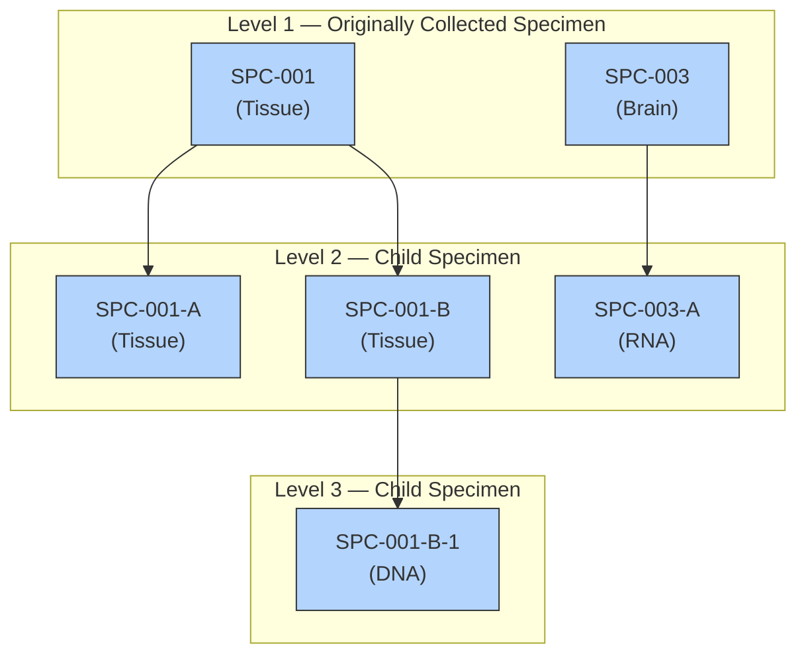

# RELSPEC — Examples

## Example 1

This example uses the sample specimen lineage illustrated below.

**Specimen Relationship Diagram:**

A specimen with a LEVEL value of "1" and a blank value for PARENT indicates a collected sample. All other values represent a derived sample. SPEC reflects the specimen type for the sample regardless of whether it is collected or derived.

**relspec.xpt**

| Row | STUDYID | USUBJID | REFID | SPEC | PARENT | LEVEL |
|-----|---------|---------|-------|------|--------|-------|
| 1 | ABC-123 | 001-01 | SPC-001 | TISSUE | | 1 |
| 2 | ABC-123 | 001-01 | SPC-001-A | TISSUE | SPC-001 | 2 |
| 3 | ABC-123 | 001-01 | SPC-001-B | TISSUE | SPC-001 | 2 |
| 4 | ABC-123 | 001-01 | SPC-001-B-1 | DNA | SPC-001-B | 3 |
| 5 | ABC-123 | 001-01 | SPC-003 | TISSUE | | 1 |
| 6 | ABC-123 | 001-01 | SPC-003-A | RNA | SPC-003 | 2 |
