# TA — Examples

The core of the Trial Design Model is the TA dataset. For each arm of the trial, the TA dataset contains 1 record for each occurrence of an element in the path of the arm.

Although the TA dataset has 1 record for each trial element traversed by subjects assigned to an arm, it is generally more useful to work out the overall design of the trial at the study cell level first, then to work out the elements within each study cell, and finally to develop the definitions of the elements that are contained in the Trial Elements (TE) table.

When working out the design of a trial, it is generally useful to draw diagrams such as those mentioned in ICH E3. The protocol may include a diagram that can serve as a starting point. Such a diagram can then be converted into a trial design matrix that displays the study cells and which in turn can be converted into the TA dataset.

This section uses example trials of increasing complexity to illustrate the concepts of trial design. For each example trial, the process of working out the TA table is illustrated by means of a series of diagrams and tables, including:

- A diagram showing the branching structure of the trial in a "study schema" format such as might appear in a protocol
- A diagram that shows the “prospective” view of the trial (i.e., the view of those participating in the trial). This is similar to the study schema view in that it usually shows a single pool of subjects at the beginning of the trial, with the pool of subjects being split into separate treatment groups at randomizations and other branches. Such diagrams include the epochs of the trial, and, for each group of subjects and each epoch, the sequence of elements within each epoch for that treatment group. The arms are also indicated on these diagrams.
- A diagram that shows the “retrospective” view of the trial (i.e., the view of the analyst reporting on the trial). This style of diagram looks more like a matrix; it is also more like the structure of the TA dataset. The retrospective view is arm-centered and shows, for each study cell (epoch/arm combination) the sequence of elements within that study cell. It can be thought of as showing, for each arm, the elements traversed by a subject who completed that arm as intended.
- If the trial is blinded, a diagram that shows the trial as it appears to a blinded participant
- A trial design matrix, an alternative format for representing most of the information in the diagram that shows arms and epochs, and which emphasizes the study cells
- The TA dataset

Example 1 should be reviewed before reading other examples, as it explains the conventions used for all diagrams and tables in the examples.

## Example 1

A simple parallel trial with 3 arms (Placebo, Drug A, Drug B), 3 epochs (Screening, Run-In, Treatment). Each study cell contains exactly 1 element. Randomization occurs at the end of the Run-In element.

Diagrams that represent study schemas generally conceive of time as moving from left to right, using horizontal lines to represent periods of time and slanting lines to represent branches into separate treatments, convergence into a common follow-up, or crossover to a different treatment.

In this type of document, diagrams are drawn using "blocks" corresponding to trial elements rather than horizontal lines. Trial elements are the various treatment and non-treatment time periods of the trial and we want to emphasize the separate trial elements might otherwise be "hidden" in a single horizontal line. See Section 7.2.2, Trial Elements (TE), for more information about defining trial elements. In general, the elements of a trial will be fairly clear. However, in the process of working out a trial design, alternative definitions of trial elements may be considered, in which case diagrams for each alternative may be constructed.

In the study schema diagrams in this example, the only slanting lines used are those that represent branches (i.e., decision points where subjects are divided into separate treatment groups). One advantage of this style of diagram, which does not show convergence of separate paths into a single block, is that the number of arms in the trial can be determined by counting the number of parallel paths at the right end of the diagram.

As illustrated in the study schema diagram for Example Trial 1, this simple parallel trial has 3 arms, corresponding to the 3 possible left-to-right "paths" through the trial. Each path corresponds to 1 of the 3 treatment elements at the right end of the diagram. Randomization is represented by the 3 red arrows leading from the Run-in block.

**Study Schema**

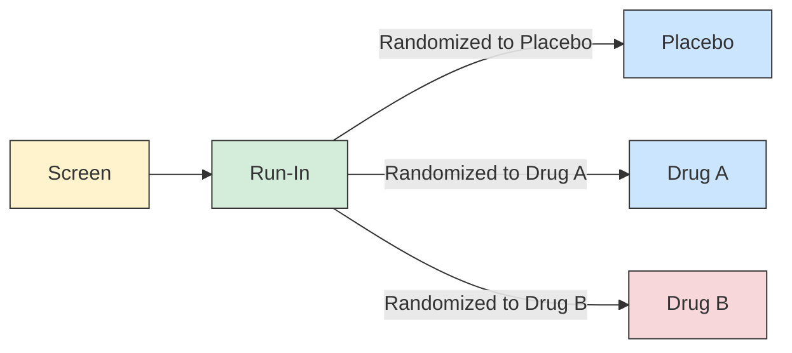

**Prospective View**

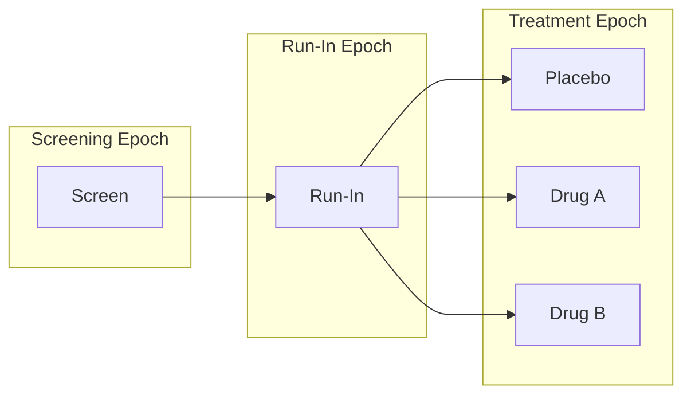

**Retrospective View**

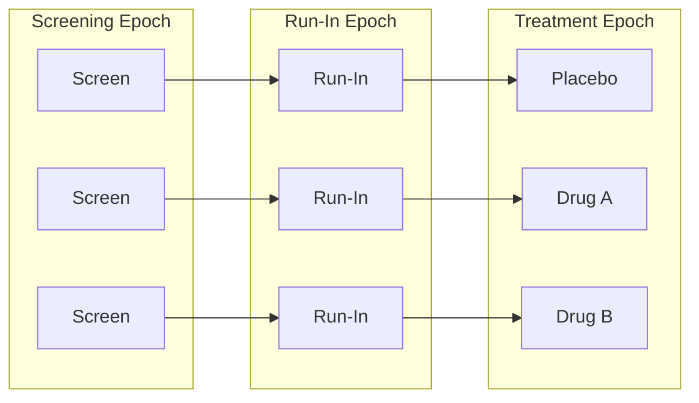

**Blinded View**

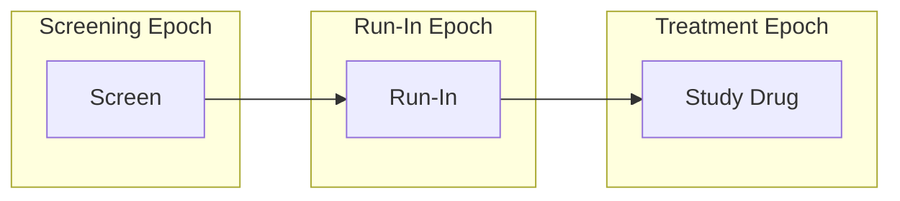

A trial design matrix is a table with a row for each arm in the trial and a column for each epoch in the trial. It is closely related to the retrospective view of the trial, and many users may find it easier to construct a table than to draw a diagram. The cells in the matrix represent the study cells, which are populated with trial elements. In this trial, each study cell contains exactly 1 element.

**Trial Design Matrix**

|  | Screen | Run-in | Treatment |
|---|---|---|---|
| **Placebo** | Screen | Run-in | PLACEBO |
| **A** | Screen | Run-in | DRUG A |
| **B** | Screen | Run-in | DRUG B |

**ta.xpt**

| Row | STUDYID | DOMAIN | ARMCD | ARM | TAETORD | ETCD | ELEMENT | TABRANCH | TATRANS | EPOCH |
|-----|---------|--------|-------|-----|---------|------|---------|----------|---------|-------|
| 1 | EX1 | TA | P | Placebo | 1 | SCRN | Screen | | | SCREENING |
| 2 | EX1 | TA | P | Placebo | 2 | RI | Run-In | Randomized to Placebo | | RUN-IN |
| 3 | EX1 | TA | P | Placebo | 3 | P | Placebo | | | TREATMENT |
| 4 | EX1 | TA | A | A | 1 | SCRN | Screen | | | SCREENING |
| 5 | EX1 | TA | A | A | 2 | RI | Run-In | Randomized to Drug A | | RUN-IN |
| 6 | EX1 | TA | A | A | 3 | A | Drug A | | | TREATMENT |
| 7 | EX1 | TA | B | B | 1 | SCRN | Screen | | | SCREENING |
| 8 | EX1 | TA | B | B | 2 | RI | Run-In | Randomized to Drug B | | RUN-IN |
| 9 | EX1 | TA | B | B | 3 | B | Drug B | | | TREATMENT |

## Example 2

A crossover trial comparing 3 treatments (Placebo, 5 mg, 10 mg) with 7 epochs: Screening, 3 Treatment Epochs with 3 Rest (washout) Epochs between them, and a Follow-up Epoch. Each arm represents a different order of treatments.

**Study Schema**

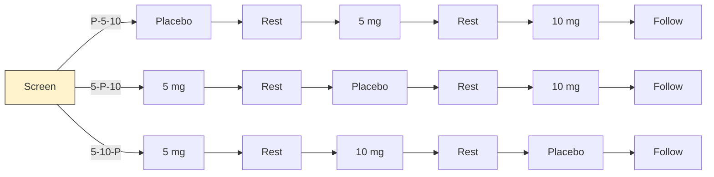

**Prospective View**

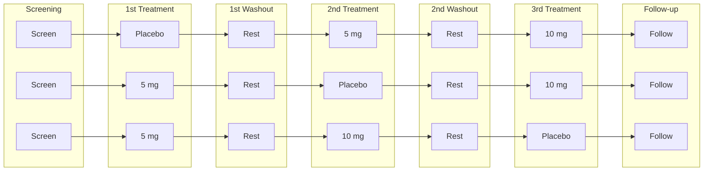

**Retrospective View**

Same structure as the Prospective View (one-to-one relationship between epochs and elements in each arm for this crossover design). Arm labels: P-L-H, L-P-H, L-H-P.

**Blinded View**

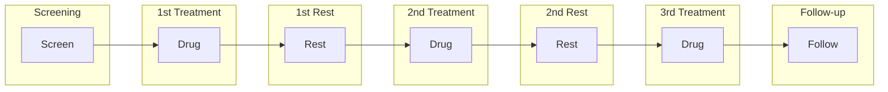

**Trial Design Matrix**

|  | Screen | First Treatment | First Rest | Second Treatment | Second Rest | Third Treatment | Follow-up |
|---|---|---|---|---|---|---|---|
| **P-5-10** | Screen | Placebo | Rest | 5 mg | Rest | 10 mg | Follow-up |
| **5-P-10** | Screen | 5 mg | Rest | Placebo | Rest | 10 mg | Follow-up |
| **5-10-P** | Screen | 5 mg | Rest | 10 mg | Rest | Placebo | Follow-up |

**ta.xpt**

| Row | STUDYID | DOMAIN | ARMCD | ARM | TAETORD | ETCD | ELEMENT | TABRANCH | TATRANS | EPOCH |
|-----|---------|--------|-------|-----|---------|------|---------|----------|---------|-------|
| 1 | EX2 | TA | P-5-10 | Placebo-5mg-10mg | 1 | SCRN | Screen | Randomized to Placebo - 5 mg - 10 mg | | SCREENING |
| 2 | EX2 | TA | P-5-10 | Placebo-5mg-10mg | 2 | P | Placebo | | | TREATMENT 1 |
| 3 | EX2 | TA | P-5-10 | Placebo-5mg-10mg | 3 | REST | Rest | | | WASHOUT 1 |
| 4 | EX2 | TA | P-5-10 | Placebo-5mg-10mg | 4 | 5 | 5 mg | | | TREATMENT 2 |
| 5 | EX2 | TA | P-5-10 | Placebo-5mg-10mg | 5 | REST | Rest | | | WASHOUT 2 |
| 6 | EX2 | TA | P-5-10 | Placebo-5mg-10mg | 6 | 10 | 10 mg | | | TREATMENT 3 |
| 7 | EX2 | TA | P-5-10 | Placebo-5mg-10mg | 7 | FU | Follow-up | | | FOLLOW-UP |
| 8 | EX2 | TA | 5-P-10 | 5mg-Placebo-10mg | 1 | SCRN | Screen | Randomized to 5 mg - Placebo - 10 mg | | SCREENING |
| 9 | EX2 | TA | 5-P-10 | 5mg-Placebo-10mg | 2 | 5 | 5 mg | | | TREATMENT 1 |
| 10 | EX2 | TA | 5-P-10 | 5mg-Placebo-10mg | 3 | REST | Rest | | | WASHOUT 1 |
| 11 | EX2 | TA | 5-P-10 | 5mg-Placebo-10mg | 4 | P | Placebo | | | TREATMENT 2 |
| 12 | EX2 | TA | 5-P-10 | 5mg-Placebo-10mg | 5 | REST | Rest | | | WASHOUT 2 |
| 13 | EX2 | TA | 5-P-10 | 5mg-Placebo-10mg | 6 | 10 | 10 mg | | | TREATMENT 3 |
| 14 | EX2 | TA | 5-P-10 | 5mg-Placebo-10mg | 7 | FU | Follow-up | | | FOLLOW-UP |
| 15 | EX2 | TA | 5-10-P | 5mg-10mg-Placebo | 1 | SCRN | Screen | Randomized to 5 mg - 10 mg - Placebo | | SCREENING |
| 16 | EX2 | TA | 5-10-P | 5mg-10mg-Placebo | 2 | 5 | 5 mg | | | TREATMENT 1 |
| 17 | EX2 | TA | 5-10-P | 5mg-10mg-Placebo | 3 | REST | Rest | | | WASHOUT 1 |
| 18 | EX2 | TA | 5-10-P | 5mg-10mg-Placebo | 4 | 10 | 10 mg | | | TREATMENT 2 |
| 19 | EX2 | TA | 5-10-P | 5mg-10mg-Placebo | 5 | REST | Rest | | | WASHOUT 2 |
| 20 | EX2 | TA | 5-10-P | 5mg-10mg-Placebo | 6 | P | Placebo | | | TREATMENT 3 |
| 21 | EX2 | TA | 5-10-P | 5mg-10mg-Placebo | 7 | FU | Follow-up | | | FOLLOW-UP |

## Example 3

A trial with multiple branches: randomization at screening plus response evaluation after blinded treatment. This results in 4 arms (A-Open A, A-Rescue, B-Open A, B-Rescue). TABRANCH is populated for 2 records in each arm reflecting the 2 branch points.

**Study Schema**

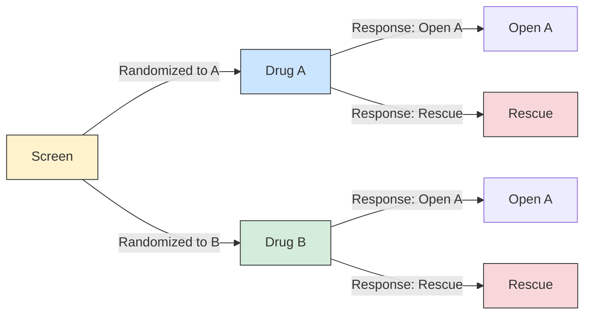

The next diagram for this trial is the prospective view. It shows the epochs of the trial and how the initial group of subjects is divided at the point of randomization.

**Prospective View**

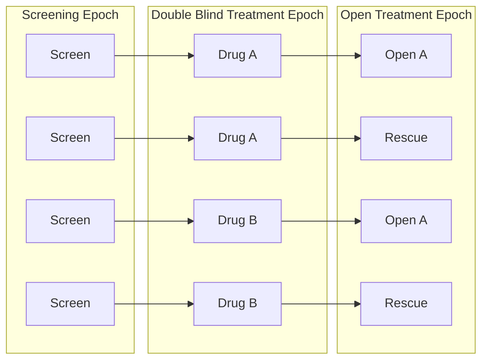

**Retrospective View**

Same epoch structure as Prospective View. 4 arms: A-Open (Screen→Drug A→Open A), A-Rescue (Screen→Drug A→Rescue), B-Open (Screen→Drug B→Open A), B-Rescue (Screen→Drug B→Rescue).

The trial design matrix for this trial can be constructed easily from the diagram showing arms and epochs.

**Blinded View**

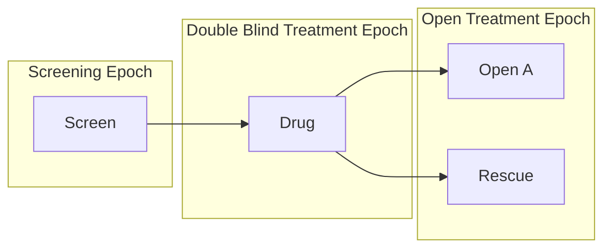

**Trial Design Matrix**

|  | Screen | Double Blind | Open Label |
|---|---|---|---|
| **A-Open A** | Screen | Treatment A | Open Drug A |
| **A-Rescue** | Screen | Treatment A | Rescue |
| **B-Open A** | Screen | Treatment B | Open Drug A |
| **B-Rescue** | Screen | Treatment B | Rescue |

**ta.xpt**

| Row | STUDYID | DOMAIN | ARMCD | ARM | TAETORD | ETCD | ELEMENT | TABRANCH | TATRANS | EPOCH |
|-----|---------|--------|-------|-----|---------|------|---------|----------|---------|-------|
| 1 | EX3 | TA | AA | A-Open A | 1 | SCRN | Screen | Randomized to Treatment A | | SCREENING |
| 2 | EX3 | TA | AA | A-Open A | 2 | DBA | Treatment A | Assigned to Open Drug A on basis of response evaluation | | BLINDED TREATMENT |
| 3 | EX3 | TA | AA | A-Open A | 3 | OA | Open Drug A | | | OPEN LABEL TREATMENT |
| 4 | EX3 | TA | AR | A-Rescue | 1 | SCRN | Screen | Randomized to Treatment A | | SCREENING |
| 5 | EX3 | TA | AR | A-Rescue | 2 | DBA | Treatment A | Assigned to Rescue on basis of response evaluation | | BLINDED TREATMENT |
| 6 | EX3 | TA | AR | A-Rescue | 3 | RSC | Rescue | | | OPEN LABEL TREATMENT |
| 7 | EX3 | TA | BA | B-Open A | 1 | SCRN | Screen | Randomized to Treatment B | | SCREENING |
| 8 | EX3 | TA | BA | B-Open A | 2 | DBB | Treatment B | Assigned to Open Drug A on basis of response evaluation | | BLINDED TREATMENT |
| 9 | EX3 | TA | BA | B-Open A | 3 | OA | Open Drug A | | | OPEN LABEL TREATMENT |
| 10 | EX3 | TA | BR | B-Rescue | 1 | SCRN | Screen | Randomized to Treatment B | | SCREENING |
| 11 | EX3 | TA | BR | B-Rescue | 2 | DBB | Treatment B | Assigned to Rescue on basis of response evaluation | | BLINDED TREATMENT |
| 12 | EX3 | TA | BR | B-Rescue | 3 | RSC | Rescue | | | OPEN LABEL TREATMENT |

See Section 7.2.1.1 Trial Arms Issues, Distinguishing Between Branches and Transitions, for additional discussion regarding when a decision point in a trial design should be considered to give rise to a new arm.

## Example 4

A cyclical chemotherapy oncology trial with repeating treatment/rest elements until disease progression. 2 arms (Drug A, Drug B), 3 epochs (Screening, Treatment, Follow-Up). The TATRANS variable represents the "repeat until disease progression" skip-forward rule.

Maximum of 4 cycles assumed in this example.

**Study Schema**

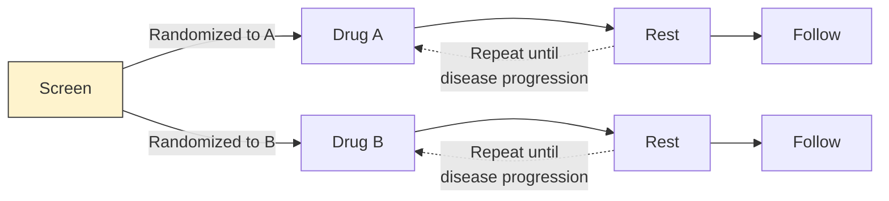

The next diagram shows the prospective view of this trial. Note that, in spite of the repeating element structure, this is, at its core, a 2-arm parallel study, and thus has 2 arms. In SDTMIG 3.1.1, there was an implicit assumption that each element must be in a separate epoch, and trials with cyclical chemotherapy were difficult to handle. The introduction of the concept of study cells and the dropping of the assumption that elements and epochs have a one-to-one relationship resolved these difficulties. This trial is best treated as having just 3 epochs, since the main objectives of the trial involve comparisons between the 2 treatments and do not require data to be considered cycle by cycle.

**Prospective View**

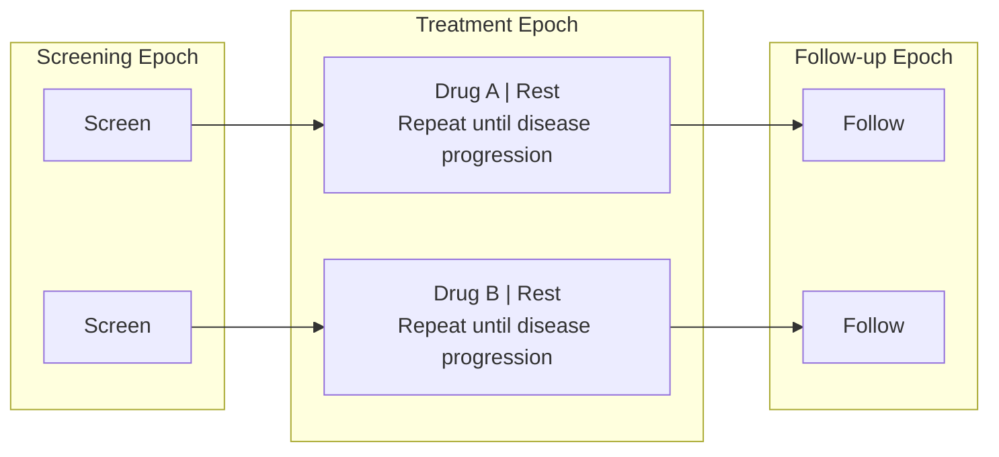

**Retrospective View**

Same epoch structure as the Prospective View: 2 arms (Drug A, Drug B), each cycling through Treatment Epoch until disease progression, then entering Follow-up.

**Retrospective View with Explicit Repeats**

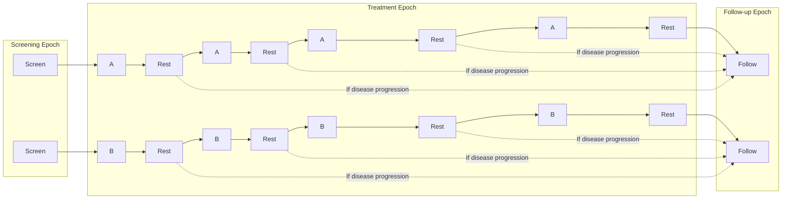

**Blinded View**

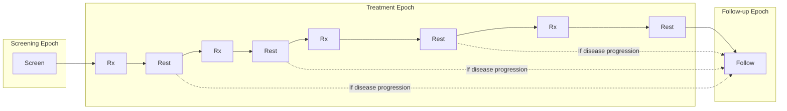

The trial design matrix for this example trial corresponds to the diagram showing the retrospective view, with explicit repeats of elements shown.

**Trial Design Matrix**

|  | Screen | Treatment | | | | | | | | Follow-up |
|---|---|---|---|---|---|---|---|---|---|---|
| **A** | Screen | Trt A | Rest | Trt A | Rest | Trt A | Rest | Trt A | Rest | Follow-up |
| **B** | Screen | Trt B | Rest | Trt B | Rest | Trt B | Rest | Trt B | Rest | Follow-up |

**ta.xpt**

| Row | STUDYID | DOMAIN | ARMCD | ARM | TAETORD | ETCD | ELEMENT | TABRANCH | TATRANS | EPOCH |
|-----|---------|--------|-------|-----|---------|------|---------|----------|---------|-------|
| 1 | EX4 | TA | A | A | 1 | SCRN | Screen | Randomized to A | | SCREENING |
| 2 | EX4 | TA | A | A | 2 | A | Trt A | | | TREATMENT |
| 3 | EX4 | TA | A | A | 3 | REST | Rest | | If disease progression, go to Follow-up Epoch | TREATMENT |
| 4 | EX4 | TA | A | A | 4 | A | Trt A | | | TREATMENT |
| 5 | EX4 | TA | A | A | 5 | REST | Rest | | If disease progression, go to Follow-up Epoch | TREATMENT |
| 6 | EX4 | TA | A | A | 6 | A | Trt A | | | TREATMENT |
| 7 | EX4 | TA | A | A | 7 | REST | Rest | | If disease progression, go to Follow-up Epoch | TREATMENT |
| 8 | EX4 | TA | A | A | 8 | A | Trt A | | | TREATMENT |
| 9 | EX4 | TA | A | A | 9 | REST | Rest | | | TREATMENT |
| 10 | EX4 | TA | A | A | 10 | FU | Follow-up | | | FOLLOW-UP |
| 11 | EX4 | TA | B | B | 1 | SCRN | Screen | Randomized to B | | SCREENING |
| 12 | EX4 | TA | B | B | 2 | B | Trt B | | | TREATMENT |
| 13 | EX4 | TA | B | B | 3 | REST | Rest | | If disease progression, go to Follow-up Epoch | TREATMENT |
| 14 | EX4 | TA | B | B | 4 | B | Trt B | | | TREATMENT |
| 15 | EX4 | TA | B | B | 5 | REST | Rest | | If disease progression, go to Follow-up Epoch | TREATMENT |
| 16 | EX4 | TA | B | B | 6 | B | Trt B | | | TREATMENT |
| 17 | EX4 | TA | B | B | 7 | REST | Rest | | If disease progression, go to Follow-up Epoch | TREATMENT |
| 18 | EX4 | TA | B | B | 8 | B | Trt B | | | TREATMENT |
| 19 | EX4 | TA | B | B | 9 | REST | Rest | | | TREATMENT |
| 20 | EX4 | TA | B | B | 10 | FU | Follow-up | | | FOLLOW-UP |

## Example 5

Similar to Example 4, but treatment A has longer duration than treatment B, so the trial cannot be blinded. Maximum of 3 cycles assumed. Different rest elements (RESTA, RESTB) are used for the 2 arms since cycle lengths differ.

**Study Schema**

**Retrospective View**

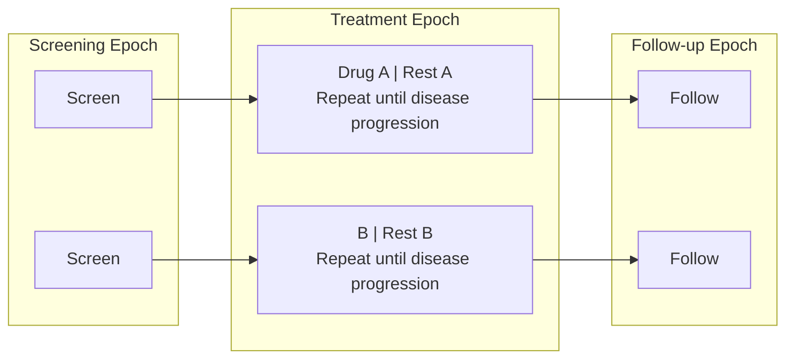

**Trial Design Matrix**

|  | Screen | Treatment | | | | | | Follow-up |
|---|---|---|---|---|---|---|---|---|
| **A** | Screen | Trt A | Rest A | Trt A | Rest A | Trt A | Rest A | Follow-up |
| **B** | Screen | Trt B | Rest B | Trt B | Rest B | Trt B | Rest B | Follow-up |

**ta.xpt**

| Row | STUDYID | DOMAIN | ARMCD | ARM | TAETORD | ETCD | ELEMENT | TABRANCH | TATRANS | EPOCH |
|-----|---------|--------|-------|-----|---------|------|---------|----------|---------|-------|
| 1 | EX5 | TA | A | A | 1 | SCRN | Screen | Randomized to A | | SCREENING |
| 2 | EX5 | TA | A | A | 2 | A | Trt A | | | TREATMENT |
| 3 | EX5 | TA | A | A | 3 | RESTA | Rest A | | If disease progression, go to Follow-up Epoch | TREATMENT |
| 4 | EX5 | TA | A | A | 4 | A | Trt A | | | TREATMENT |
| 5 | EX5 | TA | A | A | 5 | RESTA | Rest A | | If disease progression, go to Follow-up Epoch | TREATMENT |
| 6 | EX5 | TA | A | A | 6 | A | Trt A | | | TREATMENT |
| 7 | EX5 | TA | A | A | 7 | RESTA | Rest A | | | TREATMENT |
| 8 | EX5 | TA | A | A | 8 | FU | Follow-up | | | FOLLOW-UP |
| 9 | EX5 | TA | B | B | 1 | SCRN | Screen | Randomized to B | | SCREENING |
| 10 | EX5 | TA | B | B | 2 | B | Trt B | | | TREATMENT |
| 11 | EX5 | TA | B | B | 3 | RESTB | Rest B | | If disease progression, go to Follow-up Epoch | TREATMENT |
| 12 | EX5 | TA | B | B | 4 | B | Trt B | | | TREATMENT |
| 13 | EX5 | TA | B | B | 5 | RESTB | Rest B | | If disease progression, go to Follow-up Epoch | TREATMENT |
| 14 | EX5 | TA | B | B | 6 | B | Trt B | | | TREATMENT |
| 15 | EX5 | TA | B | B | 7 | RESTB | Rest B | | | TREATMENT |
| 16 | EX5 | TA | B | B | 8 | FU | Follow-up | | | FOLLOW-UP |

## Example 6

An oncology trial with cycles of different lengths: Drug A in 3-week cycles (longer treatment, short rest), Drug B in 4-week cycles (short treatment, long rest). Maximum 4 cycles of Drug A, 3 cycles of Drug B.

Because the treatment epoch for arm A has more elements than arm B, TAETORD is 10 for the follow-up element in arm A, but 8 for follow-up in arm B. Gaps in TAETORD values are acceptable.

**Study Schema**

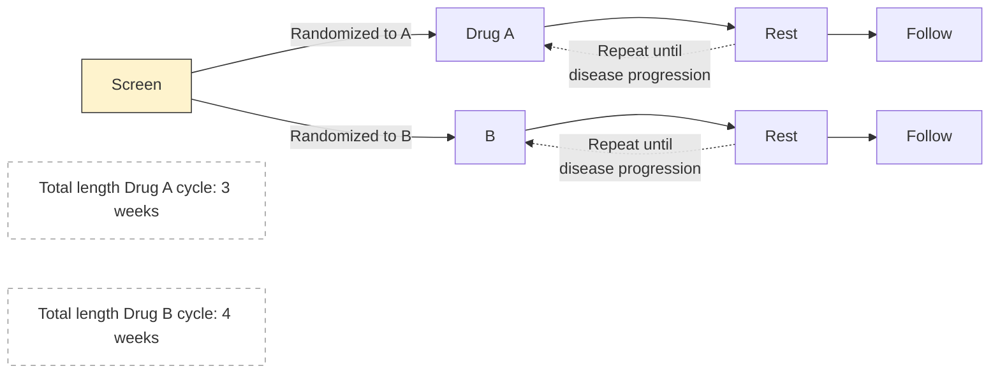

**Retrospective View**

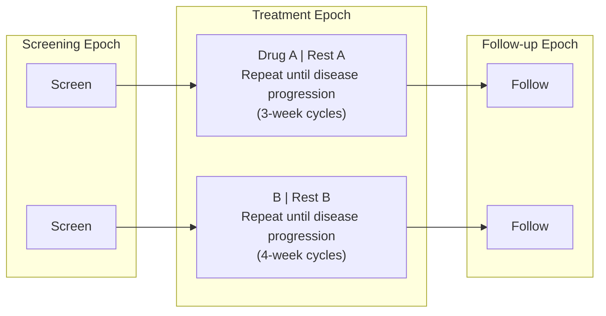

**Trial Design Matrix**

|  | Screen | Treatment | | | | | | | | Follow-up |
|---|---|---|---|---|---|---|---|---|---|---|
| **A** | Screen | Trt A | Rest A | Trt A | Rest A | Trt A | Rest A | Trt A | Rest A | Follow-up |
| **B** | Screen | Trt B | Rest B | Trt B | Rest B | Trt B | Rest B | | | Follow-up |

**ta.xpt**

| Row | STUDYID | DOMAIN | ARMCD | ARM | TAETORD | ETCD | ELEMENT | TABRANCH | TATRANS | EPOCH |
|-----|---------|--------|-------|-----|---------|------|---------|----------|---------|-------|
| 1 | EX6 | TA | A | A | 1 | SCRN | Screen | Randomized to A | | SCREENING |
| 2 | EX6 | TA | A | A | 2 | A | Trt A | | | TREATMENT |
| 3 | EX6 | TA | A | A | 3 | RESTA | Rest A | | If disease progression, go to Follow-up Epoch | TREATMENT |
| 4 | EX6 | TA | A | A | 4 | A | Trt A | | | TREATMENT |
| 5 | EX6 | TA | A | A | 5 | RESTA | Rest A | | If disease progression, go to Follow-up Epoch | TREATMENT |
| 6 | EX6 | TA | A | A | 6 | A | Trt A | | | TREATMENT |
| 7 | EX6 | TA | A | A | 7 | RESTA | Rest A | | If disease progression, go to Follow-up Epoch | TREATMENT |
| 8 | EX6 | TA | A | A | 8 | A | Trt A | | | TREATMENT |
| 9 | EX6 | TA | A | A | 9 | RESTA | Rest A | | | TREATMENT |
| 10 | EX6 | TA | A | A | 10 | FU | Follow-up | | | FOLLOW-UP |
| 11 | EX6 | TA | B | B | 1 | SCRN | Screen | Randomized to B | | SCREENING |
| 12 | EX6 | TA | B | B | 2 | B | Trt B | | | TREATMENT |
| 13 | EX6 | TA | B | B | 3 | RESTB | Rest B | | If disease progression, go to Follow-up Epoch | TREATMENT |
| 14 | EX6 | TA | B | B | 4 | B | Trt B | | | TREATMENT |
| 15 | EX6 | TA | B | B | 5 | RESTB | Rest B | | If disease progression, go to Follow-up Epoch | TREATMENT |
| 16 | EX6 | TA | B | B | 6 | B | Trt B | | | TREATMENT |
| 17 | EX6 | TA | B | B | 7 | RESTB | Rest B | | | TREATMENT |
| 18 | EX6 | TA | B | B | 8 | FU | Follow-up | | | FOLLOW-UP |

## Example 7

In open trials, there is no requirement to maintain a blind, and the arms of a trial may be quite different from each other. In such a case, changes in treatment in one arm may differ in number and timing from changes in treatment in another, so that there is no natural grouping of time periods across arms that corresponds to epochs as defined in Section 7.1.2, Definitions of Trial Design Concepts. In such a case, epochs are likely to be defined as broad intervals of time, spanning several elements, and chosen to correspond to the major clinical phases of the trial.

Example Trial 7, RTOG 93-09, involves treatment of lung cancer with chemotherapy and radiotherapy, with or without surgery. The protocol (RTOG-93-09), which was provided by the Radiation Oncology Therapy Group (RTOG), does not include a study schema diagram. All subjects go through the branch point at randomization, when they are assigned to either chemotherapy plus radiotherapy (CR) or radiotherapy only (R). Those randomized to the non-surgery arm are evaluated for disease somewhat earlier, to avoid delays in administering the radiation treatment. Not all subjects randomized to receive surgery who do not have disease progression will necessarily receive surgery. If they are poor candidates for surgery or do not wish to receive surgery, they will not receive surgery, but will receive further evaluation instead. The following diagram is based on the text "schema" in the protocol, with the 5 options it names. The diagram in this form might suggest that the trial has 5 arms.

Both the induction and additional chemotherapy are given in 2 cycles. The second induction cycle is different for the 2 arms, since radiation therapy for those assigned to the non-surgery arm includes a "boost" which those assigned to the surgery arm do not receive.

This diagram also shows more detail within the Induction Chemo + RT and Additional Chemo blocks than the preceding diagram.

**Study Schema (2-arm model)**

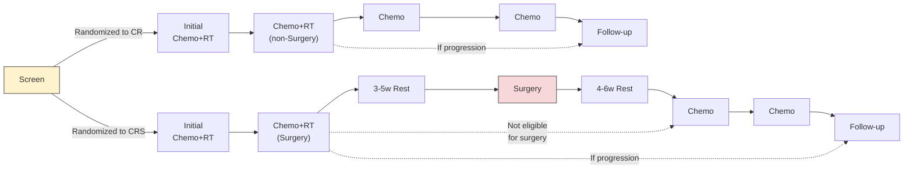

The protocol conceives of treatment as being divided into 2 parts, induction and continuation, so these have been treated as 2 different epochs. This is also an important point in the trial operationally, the point when subjects are "registered" a second time, and when subjects are evaluated for the possibility of surgery.

**Prospective View**

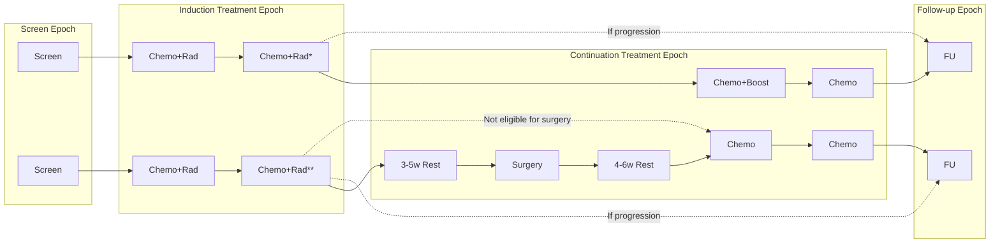

> *Disease evaluation earlier, **Disease evaluation later

The next diagram shows the retrospective view of this trial. Those subjects who do receive surgery will in fact spend a longer time completing treatment and moving into follow-up. Although it is tempting to think of the horizontal axis of these diagrams as a timeline, this can sometimes be misleading. The diagrams are not necessarily to scale in the sense that the length of the block representing an element represents its duration.

**Retrospective View**

Same epoch structure as the Prospective View. The elements in the Continuation Treatment Epoch for the CR arm do not fill the space compared to the CRS arm, reflecting different treatment durations between the 2 arms.

The following table shows the trial design matrix for this 2-arm example trial.

**Trial Design Matrix**

|  | Screen | Induction | Continuation | | | | Follow-up |
|---|---|---|---|---|---|---|---|
| **CR** | Screen | Initial Chemo + RT | Chemo + RT (non-Surgery) | Chemo | Chemo | | Off Treatment Follow-up |
| **CRS** | Screen | Initial Chemo + RT | Chemo + RT (Surgery) | 3-5 w Rest | Surgery | 4-6 w Rest | Chemo | Chemo | Off Treatment Follow-up |

The TA dataset reflects that this is a 2-arm trial.

**ta.xpt**

| Row | STUDYID | DOMAIN | ARMCD | ARM | TAETORD | ETCD | ELEMENT | TABRANCH | TATRANS | EPOCH |
|-----|---------|--------|-------|-----|---------|------|---------|----------|---------|-------|
| 1 | EX7 | TA | 1 | CR | 1 | SCRN | Screen | Randomized to CR | | SCREENING |
| 2 | EX7 | TA | 1 | CR | 2 | ICR | Initial Chemo + RT | | | INDUCTION TREATMENT |
| 3 | EX7 | TA | 1 | CR | 3 | CRNS | Chemo+RT (non-Surgery) | | If progression, skip to Follow-up. | INDUCTION TREATMENT |
| 4 | EX7 | TA | 1 | CR | 4 | C | Chemo | | | CONTINUATION TREATMENT |
| 5 | EX7 | TA | 1 | CR | 5 | C | Chemo | | | CONTINUATION TREATMENT |
| 6 | EX7 | TA | 1 | CR | 6 | FU | Off Treatment Follow-up | | | FOLLOW-UP |
| 7 | EX7 | TA | 2 | CRS | 1 | SCRN | Screen | Randomized to CRS | | SCREENING |
| 8 | EX7 | TA | 2 | CRS | 2 | ICR | Initial Chemo + RT | | | INDUCTION TREATMENT |
| 9 | EX7 | TA | 2 | CRS | 3 | CRS | Chemo+RT (Surgery) | | If progression, skip to Follow-up. If no progression, but subject is ineligible for or does not consent to surgery, skip to Chemo. | INDUCTION TREATMENT |
| 10 | EX7 | TA | 2 | CRS | 4 | R3 | 3-5 week rest | | | CONTINUATION TREATMENT |
| 11 | EX7 | TA | 2 | CRS | 5 | SURG | Surgery | | | CONTINUATION TREATMENT |
| 12 | EX7 | TA | 2 | CRS | 6 | R4 | 4-6 week rest | | | CONTINUATION TREATMENT |
| 13 | EX7 | TA | 2 | CRS | 7 | C | Chemo | | | CONTINUATION TREATMENT |
| 14 | EX7 | TA | 2 | CRS | 8 | C | Chemo | | | CONTINUATION TREATMENT |
| 15 | EX7 | TA | 2 | CRS | 9 | FU | Off Treatment Follow-up | | | FOLLOW-UP |

## Trial Arms Issues

### Distinguishing Between Branches and Transitions

Both the Branch and Transition columns contain rules, but the 2 columns represent 2 different types of rules. **Branch rules** represent forks in the trial flowchart, giving rise to separate arms. The rule underlying a branch appears in multiple records, once for each "fork" of the branch. **Transition rules** are used for choices within an arm. The value for TATRANS does contain a choice (an "if" clause). In Example Trial 4, subjects who receive 1, 2, 3, or 4 cycles of treatment A are all considered to belong to arm A.

### Subjects Not Assigned to an Arm

Some trial subjects may drop out of the study before they reach all of the branch points in the trial design. In the Demographics (DM) domain, the values of ARM and ARMCD must be supplied for such subjects, but the special values used for these subjects should not be included in the Trial Arms (TA) dataset; only complete arm paths should be described in the TA dataset. In Section 5.2, Demographics, assumption 4 describes special ARM and ARMCD values used for subjects who do not reach the first branch point of an adaptive trial design. When a trial design includes 2 or more branches, special values of ARM and ARMCD may be needed for subjects who pass through the first branch point, but drop out before the final branch point. See DM Example 3 for how to represent ARM and ARMCD values for such trials.

### Defining Epochs

The series of examples for the TA dataset provides a variety of scenarios and guidance about how to assign epoch in those scenarios. In general, assigning epochs for blinded trials is easier than for unblinded trials. The blinded view of the trial will generally make the possible choices clear. For unblinded trials, the comparisons that will be made between arms can guide the definition of epochs. For trials that include many variant paths within an arm, comparisons of arms will mean that subjects on a variety of paths will be in the same epoch, and this is likely to lead to definition of broader epochs.

### Rule Variables

The Branch and Transition columns shown in the example tables are variables with a Role of "Rule." The values of a Rule variable describe conditions under which something is planned to happen. At the moment, values of Rule variables are text. At some point in the future, it is expected that a mechanism to provide machine-readable rules will become available. Other Rule variables are present in the Trial Elements (TE) and Trial Visits (TV) datasets.
