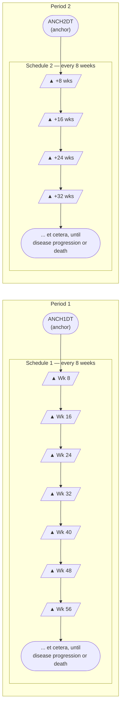
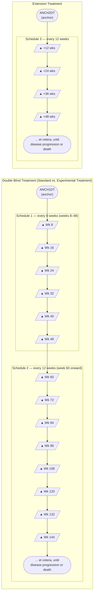

# TD — Examples

## Example 1

**Timeline Diagram — Example 1: Three sequential assessment schedules from a single anchor**

```mermaid
graph LR
    ANCH1DT(["ANCH1DT\n(anchor)"])

    subgraph S1["Schedule 1 — every 8 weeks (weeks 8–48)"]
        W8[/"▲ Wk 8"/]
        W16[/"▲ Wk 16"/]
        W24[/"▲ Wk 24"/]
        W32[/"▲ Wk 32"/]
        W40[/"▲ Wk 40"/]
        W48[/"▲ Wk 48"/]
    end

    subgraph S2["Schedule 2 — every 12 weeks (weeks 60–96)"]
        W60[/"▲ Wk 60"/]
        W72[/"▲ Wk 72"/]
        W84[/"▲ Wk 84"/]
        W96[/"▲ Wk 96"/]
    end

    subgraph S3["Schedule 3 — every 24 weeks (week 120 onward)"]
        W120[/"▲ Wk 120"/]
        W144[/"▲ Wk 144"/]
        ETC(["... et cetera, until\ndisease progression or death"])
    end

    ANCH1DT --> W8 --> W16 --> W24 --> W32 --> W40 --> W48
    W48 --> W60 --> W72 --> W84 --> W96
    W96 --> W120 --> W144 --> ETC
```

This example shows a study where the disease assessment schedule changes over the course of the study. In this example, there are 3 distinct disease-assessment schedule patterns. A single anchor date variable (TDANCVAR) provides the anchor date for each pattern. The offset variable (TDSTOFF), used in conjunction with the anchor date variable, provides the start point of each pattern of assessments.

- The first disease-assessment schedule pattern starts at the reference start date (identified in the ADSL ANCH1DT variable) and repeats every 8 weeks for a total of 6 repeated assessments (i.e., week 8, week 16, week 24, week 32, week 40, week 48). Note that there is an upper and lower limit around the planned disease assessment target where the first assessment (8 weeks) could occur as early as day 53 and as late as week 9. This upper and lower limit (-3 days, +1 week) would be applied to all assessments during that pattern.

- The second disease assessment schedule starts from week 48 and repeats every 12 weeks for a total of 4 repeats (i.e., week 60, week 72, week 84, week 96), with respective upper and lower limits of -1 week and +1 week.

- The third disease assessment schedule starts from week 96 and repeats every 24 weeks (week 120, week 144, and so on), with respective upper and lower limits of -1 week and +1 week, for an indefinite length of time. The preceding schematic shows that, for the third pattern, assessments will occur until disease progression; this therefore leaves the pattern open-ended. However, when data is included in an analysis, the total number of repeats can be identified and the highest number of repeat assessments for any subject in that pattern must be recorded in the TDNUMRPT variable on the final pattern record.

**td.xpt**

| Row | STUDYID | DOMAIN | TDORDER | TDANCVAR | TDSTOFF | TDTGTPAI | TDMINPAI | TDMAXPAI | TDNUMRPT |
|-----|---------|--------|---------|----------|---------|----------|----------|----------|----------|
| 1 | ABC123 | TD | 1 | ANCH1DT | P0D | P8W | P53D | P9W | 6 |
| 2 | ABC123 | TD | 2 | ANCH1DT | P48W | P12W | P11W | P13W | 4 |
| 3 | ABC123 | TD | 3 | ANCH1DT | P96W | P24W | P23W | P25W | 12 |

## Example 2

**Timeline Diagram — Example 2: Two periods with separate anchor dates (crossover study)**

This example shows a crossover study, where subjects are given the period 1 treatment according to the first disease-assessment schedule until disease progression, then there is a rest period of 28 days prior to the start of the period 2 treatment (i.e., re-baseline for period 2). The subjects are then given the period 2 treatment according to the second disease assessment schedule until disease progression. This example also shows how two different reference/anchor dates can be used.

- The Rest element is not represented as a row in the TD dataset, since no disease assessments occur during the Rest. Note that although the Rest epoch in this example is not important for TD, it is important that it is represented in other trial design datasets.

**Row 1:** Shows the disease assessment schedule for the first treatment period. The diagram above shows that this schedule repeats until disease progression. After the trial ended, the maximum number of repeats in this schedule was determined to be 6, so that is the value in TDNUMRPT for this schedule.

**Row 2:** Shows the disease assessment schedule for the second period. The pattern starts on the date identified in the ADSL variable ANCH2DT and repeats every 8 weeks with respective upper and lower limits of -1 week and +1 week. The maximum number of repeats that occurred on this schedule was 4.

**td.xpt**

| Row | STUDYID | DOMAIN | TDORDER | TDANCVAR | TDSTOFF | TDTGTPAI | TDMINPAI | TDMAXPAI | TDNUMRPT |
|-----|---------|--------|---------|----------|---------|----------|----------|----------|----------|
| 1 | ABC123 | TD | 1 | ANCH1DT | P0D | P8W | P53D | P9W | 6 |
| 2 | ABC123 | TD | 2 | ANCH2DT | P0D | P8W | P53D | P9W | 4 |

## Example 3

**Timeline Diagram — Example 3: Double Blind Treatment (two schedules) + Extension Treatment**

This example shows a study where subjects are randomized to standard treatment or an experimental treatment. The subjects who are randomized to standard treatment are given the option to receive experimental treatment after they end the standard treatment (e.g., due to disease progression on standard treatment). In the randomized treatment epoch, the disease assessment schedule changes over the course of the study. At the start of the extension treatment epoch, subjects are re-baselined, i.e., an extension baseline disease assessment is performed and the disease assessment schedule is restarted.

In this example, there are 3 distinct disease-assessment schedule patterns:

- The first disease-assessment schedule pattern starts at the reference start date (identified in the ADSL ANCH1DT variable) and repeats every 8 weeks for a total of 6 repeats (i.e., week 8, week 16, week 24, week 32, week 40, week 48), with respective upper and lower limits of -3 days and +1 week.

- The second disease assessment schedule starts from week 48 and repeats every 12 weeks (week 60, week 72, etc.), with respective upper and lower limits of -1 week and +1 week, for an indefinite length of time. The preceding schematic shows that, for the second pattern, assessments will occur until disease progression; this therefore leaves the pattern open-ended.

- The third disease assessment schedule starts at the extension reference start date (identified in the ADSL ANCH2DT variable) from week 96 and repeats every 12 weeks (week 120, week 144, etc.), with respective upper and lower limits of -1 week and +1 week, for an indefinite length of time.

For open-ended patterns, the total number of repeats can be identified when the data analysis is performed; the highest number of repeat assessments for any subject in that pattern must be recorded in the TDNUMRPT variable on the final pattern record.

**td.xpt**

| Row | STUDYID | DOMAIN | TDORDER | TDANCVAR | TDSTOFF | TDTGTPAI | TDMINPAI | TDMAXPAI | TDNUMRPT |
|-----|---------|--------|---------|----------|---------|----------|----------|----------|----------|
| 1 | ABC123 | TD | 1 | ANCH1DT | P0D | P8W | P53D | P9W | 6 |
| 2 | ABC123 | TD | 2 | ANCH1DT | P48W | P12W | P11W | P13W | 17 |
| 3 | ABC123 | TD | 3 | ANCH2DT | P0D | P12W | P11W | P13W | 17 |
