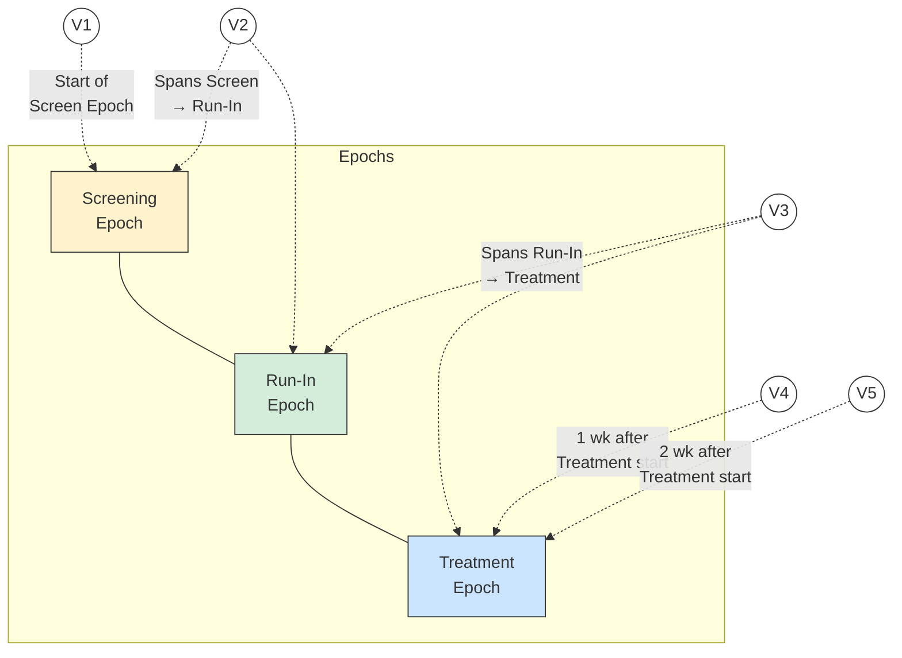

# TV — Examples

## Example 1

The following diagram represents visits as numbered "flags" with visit numbers. Each flag has 2 supports, one at the beginning of the visit and the other at the end of the visit. Note that visits 2 and 3 span epoch transitions. In other words, the transition event that marks the beginning of the run-in epoch (confirmation of eligibility) occurs during visit 2, and the transition event that marks the beginning of the treatment epoch (the first dose of study drug) occurs during visit 3.

This example is based on TA Example Trial 1, a Parallel Design with 3 arms (Placebo, Drug A, Drug B).

**Parallel Design Planned Visits**

> Visit 2 spans the Screen → Run-In epoch transition (confirmation of eligibility). Visit 3 spans the Run-In → Treatment epoch transition (first dose of study drug). Below the timeline, 3 arms (Placebo, Drug A, Drug B) share the same visit schedule.

Two TV datasets are shown for this trial. The first shows a somewhat idealized situation, where the protocol has provided specific timings for the visits. The second shows a more common situation, where the timings have been described only loosely.

**tv.xpt (specific timings)**

| Row | STUDYID | DOMAIN | VISITNUM | TVSTRL | TVENRL |
|-----|---------|--------|----------|--------|--------|
| 1 | EX1 | TV | 1 | Start of Screen Epoch | 1 hour after start of Visit |
| 2 | EX1 | TV | 2 | 30 minutes before end of Screen Epoch | 30 minutes after start of Run-in Epoch |
| 3 | EX1 | TV | 3 | 30 minutes before end of Run-in Epoch | 1 hour after start of Treatment Epoch |
| 4 | EX1 | TV | 4 | 1 week after start of Treatment Epoch | 1 hour after start of Visit |
| 5 | EX1 | TV | 5 | 2 weeks after start of Treatment Epoch | 1 hour after start of Visit |

**tv.xpt (loosely described timings)**

| Row | STUDYID | DOMAIN | VISITNUM | TVSTRL | TVENRL |
|-----|---------|--------|----------|--------|--------|
| 1 | EX1 | TV | 1 | Start of Screen Epoch | |
| 2 | EX1 | TV | 2 | On the same day as, but before, the end of the Screen Epoch | On the same day as, but after, the start of the Run-in Epoch |
| 3 | EX1 | TV | 3 | On the same day as, but before, the end of the Run-in Epoch | On the same day as, but after, the start of the Treatment Epoch |
| 4 | EX1 | TV | 4 | 1 week after start of Treatment Epoch | |
| 5 | EX1 | TV | 5 | 2 weeks after start of Treatment Epoch | At Trial Exit |

Although the start and end rules in this example reference the starts and ends of epochs, the start and end rules of some visits for trials with epochs that span multiple elements will need to reference elements rather than epochs. When an arm includes repetitions of the same element, it may be necessary to use TAETORD as well as an element name to specify when a visit is to occur.

## Trial Visits Issues

### Identifying Trial Visits

In general, a trial's visits are defined in its protocol. The term "visit" reflects the fact that data in outpatient studies is usually collected during a physical visit by the subject to a clinic. Sometimes a trial visit defined by the protocol may not correspond to a physical visit. It may span multiple physical visits, as when screening data is collected over several clinic visits but recorded under one TV name (VISIT) and number (VISITNUM). A trial visit may represent only a portion of an extended physical visit, as when a trial of in-patients collects data under multiple trial visits for a single hospital admission.

### Trial Visit Rules

Visit start rules are different from element start rules in that they usually describe when a visit should occur; element start rules describe the moment at which an element is considered to start. There are usually gaps between visits, periods of time that do not belong to any visit, so it is usually not necessary to identify the moment when one visit stops and another starts.

Visit start rules are usually expressed relative to the start or end of an element or epoch (e.g., "1-2 hours before end of First Wash-out", "8 weeks after end of 2nd Treatment Epoch"). Note that the visit may or may not occur during the element used as the reference for the visit start rule.

### Visit Schedules Expressed with Ranges

Ranges may be used to describe the planned timing of visits (e.g., 12-16 days after the start of 2nd Element), but this is different from the "windows" that may be used in selecting data points to be included in an analysis associated with that visit.

### Contingent Visits

Some data collection is contingent on the occurrence of a "trigger" event or disease milestone (see Section 7.3.3, Trial Disease Milestones (TM)). When such planned data collection involves an additional clinic visit, a "contingent" visit may be included in the TV table, with a rule that describes the circumstances under which it will take place. Because values of VISITNUM must be assigned to all records in the TV dataset, a contingent visit included in the TV dataset must have a VISITNUM, but the VISITNUM value might not be a "chronological" value. If contingent visits are not included in the TV dataset, then they would be treated as unplanned visits in the Subject Visits (SV) domain (see Section 6.2.8, Subject Visits).
