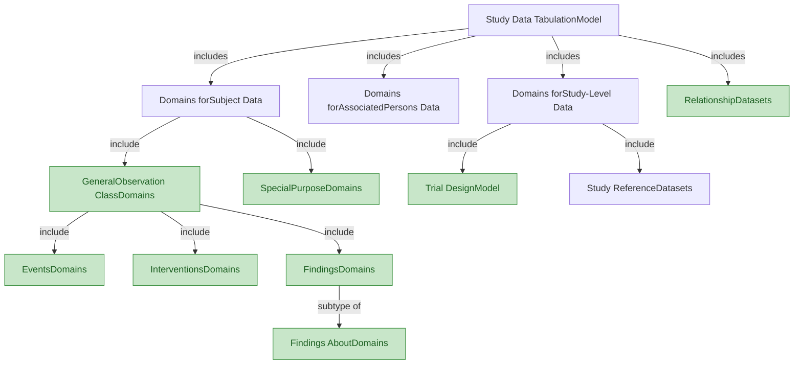

# SDTM v2.0 — Chapter 2: Model Concepts and Terms

Source: SDTM v2.0, Section 2 (Pages 8-10)

## 2.1 Model Concepts and Terms — Variables

The SDTM provides a general framework for describing the organization of information collected during human and animal studies. The model is built around the concept of **observations**, which consist of discrete pieces of information collected during a study. Observations normally correspond to rows in a dataset. A **domain** is a collection of observations on a particular topic. For example, "Subject 101 had an adverse event of mild nausea starting on study day 6" is an observation belonging to the Adverse Events domain in a clinical trial.

The primary purpose of the SDTM is to represent data about study subjects — which may be humans or animals — or medical devices. The SDTM includes a general model for representing data in 3 "general observation" classes. Within those classes, data are grouped by topic into domains, represented in separate datasets.

### Concept Map: Relationships Between SDTM Domains

> **Key:** Plain box = Group of individually specified datasets. Green filled box = Extensible set of domains based on a common model.

### Variable Roles

All datasets are structured as flat files with rows representing observations and columns representing variables; each dataset is described by metadata definitions that provide information about the variables used in the dataset. Metadata are described in the CDISC Define-XML specification.

Each observation consists of a series of named variables. Each variable, which normally corresponds to a column in a dataset, can be classified according to its **role**. A role describes the type of information conveyed by the variable about each distinct observation and how it can be used. There are variables which play different roles in different datasets. This is most common for variables which appear in both trial design datasets and general observation class datasets. For example, ARMCD is the topic variable in Trial Arms (TA), but a record qualifier in Demographics (DM) and Trial Visits (TV). Variables which appear in multiple general observation classes have the same role, although the variable qualified by a variable qualifier or synonym qualifier can be different in different general observation classes. For example, --MODIFY qualifies --TRT in interventions, --TERM in events, and --ORRES in findings.

SDTM variables can be classified into 5 major roles:

1. **Identifier variables** — identify the study, subject, domain, and sequence number of the record
2. **Topic variables** — specify the focus of the observation (e.g., the name of a lab test)
3. **Timing variables** — describe the timing of an observation (e.g., start date, end date)
4. **Qualifier variables** — include additional illustrative text or numeric values that describe the results or additional traits of the observation (e.g., units, descriptive adjectives)
5. **Rule variables** — describe conditions for starting, ending, branching, or looping in the Trial Design Model

### Qualifier Variable Subclasses

The set of Qualifier variables can be further categorized into 5 subclasses:

| Subclass | Purpose | Examples |
|----------|---------|----------|
| **Grouping Qualifiers** | Group together a collection of observations within the same domain | --CAT, --SCAT |
| **Result Qualifiers** | Describe the specific results associated with the topic variable in a Findings dataset | --ORRES, --STRESC, --STRESN |
| **Synonym Qualifiers** | Specify an alternative name for a particular variable in an observation | --MODIFY, --DECOD (for --TRT or --TERM); --TEST, --LOINC (for --TESTCD) |
| **Record Qualifiers** | Define additional attributes of the observation record as a whole | --REASND, AESLIFE, --BLFL, --POS, --LOC, --SPEC, --NAM |
| **Variable Qualifiers** | Further modify or describe a specific set of variables within an observation | --ORRESU, --ORNRHI, --ORNRLO, --DOSU (Variable Qualifier of --DOSE) |

### Domain Codes

Each study subject domain dataset is distinguished by a unique 2-character code stored in the SDTM variable DOMAIN. This code is used:
- As the value of the DOMAIN variable in that dataset
- As a prefix for most variable names in that dataset
- In the RDOMAIN variable in relationship tables

The `--` prefix in variable names (e.g., --TRT) indicates the required use of a prefix based on the 2-character domain code.

**Domain-specific variables** are for use in a limited number of designated domains based on general observation classes. The variable names include the specific domain prefix. The Usage Restrictions column of the table indicates the domains in which the variable is allowed.

All datasets for data about individuals and for data about a study include the variable DOMAIN, a code that should be used in the dataset name. Some relationship datasets include the variable RDOMAIN, to describe a relationship to a domain for data about individuals. The Comments special-purpose domain includes the variable RDOMAIN, but other special-purpose domains do not. The Device-subject Relationships dataset includes the variable DOMAIN, but other study reference datasets do not.

The SDTM is structured so that data can be represented in SAS v5 transport files, the file format accepted by the US Food and Drug Administration (FDA) and other regulatory authorities. This imposes certain restrictions on variables. The SDTM type specified in this document is either character or numeric, as these are the only types supported by SAS v5 transport files. Define-XML provides more descriptive data types (e.g., integer, float, date, datetime).

## 2.2 Table Structure

Tables in the SDTM v2.0 document include the following variable metadata:

| Column | Description |
|--------|-------------|
| **Variable Name** | The standard name (with `--` prefix for domain-prefixed variables) |
| **Variable Label** | Human-readable label for the variable |
| **Type** | SAS data type: `Char` or `Num` |
| **Format** | ISO format standard or description (e.g., "number-number") |
| **Role** | As defined in Section 2.1 (Identifier, Topic, Timing, etc.) |
| **Variable(s) Qualified** | For variables with a role of Variable Qualifier or Synonym Qualifier |
| **Usage Restrictions** | Rules for when a variable can or cannot be used |
| **Variable C-code** | NCI-EVS concept code |
| **Definition** | Published as part of CDISC Controlled Terminology through NCI-EVS |
| **Notes** | Descriptive information not covered elsewhere |
| **Examples** | Sample values or descriptions of kinds of information |

**Note:** Information on usage restrictions and examples that were in the Description column in SDTM v1.x tables have been moved to the Usage Restrictions and Examples columns. Other content previously in the Description column has been moved to the Notes column, except that definition-like information has been removed for variables which have approved definitions.
