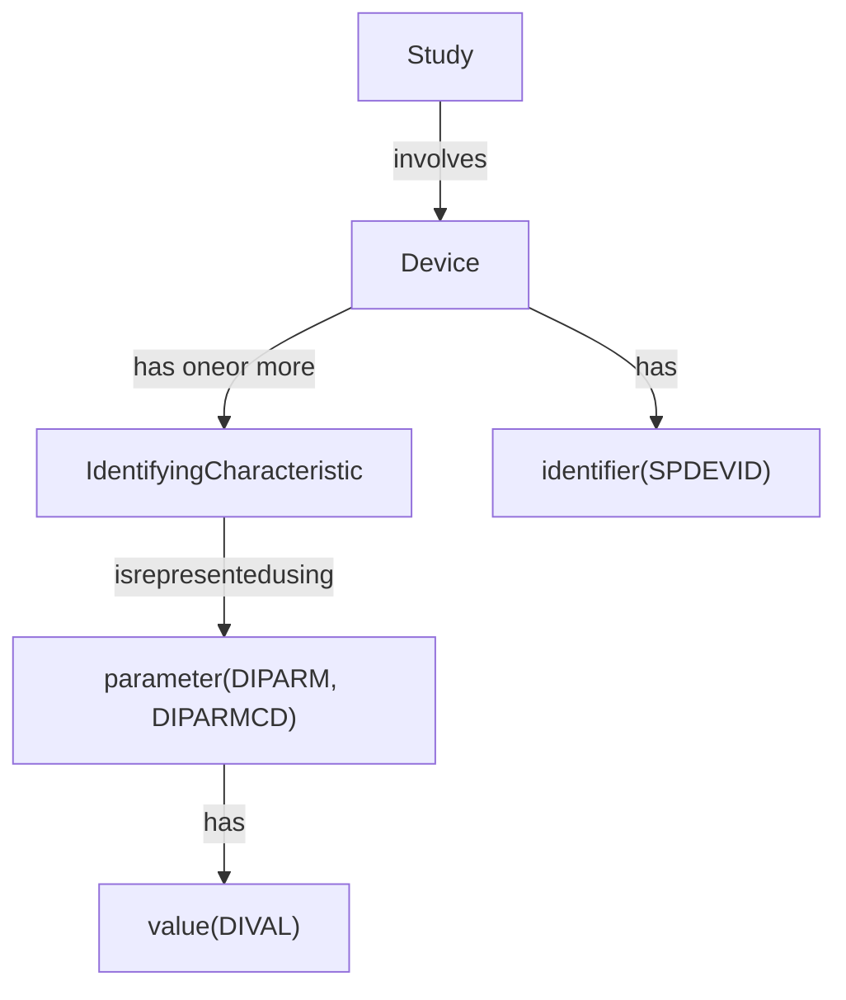
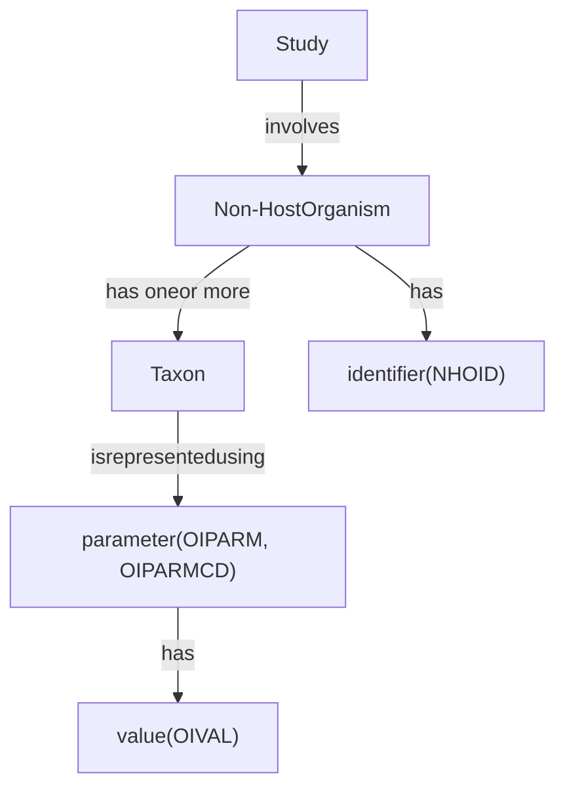

# SDTM v2.0 — Chapter 5: Study-level Data

Source: SDTM v2.0, Sections 5.1-5.2 (Pages 51-63)

## Overview

The SDTM includes 2 types of study-level data: trial design data and study reference data.

---

## 5.1 Trial Design Model

The Trial Design Model (TDM) defines a standard structure for representing the planned sequence of activities and the treatment plan for the trial. These include ways to represent:

- Planned treatment arms (Section 5.1.1, Trial Arms and Trial Elements)
- Planned groups of subjects (Section 5.1.2, Trial Sets)
- Planned sequences of reproductive stages (Section 5.1.3, Trial Repro Stages and Trial Repro Paths)
- Planned schedules for activities and data collection (Section 5.1.4, Trial Planned Data Collection)
- Study eligibility criteria (Section 5.1.5, Trial Inclusion/Exclusion Criteria)
- Other aspects of a study, expressed as parameters (Section 5.1.6, Trial Summary Information)
- Characteristics of a study challenge agent (Section 5.1.7, Challenge Agent Characterization)

Many Trial Design domains define study-specific terminology, and variables and variable values from these domains are used in subject-level domains.

### Trial Elements (TE)

**Structure:** One record per planned Element

Describes the basic building blocks of a trial design — discrete periods of time during which a specific type of treatment or activity is planned. The domain is identified by the domain code "TE".

| # | Variable | Label | Type | Role |
|---|----------|-------|------|------|
| 1 | STUDYID | Study Identifier | Char | Identifier |
| 2 | DOMAIN | Domain Abbreviation | Char | Identifier |
| 3 | ETCD | Element Code | Char | Topic |
| 4 | ELEMENT | Description of Element | Char | Synonym Qualifier |
| 5 | TESTRL | Rule for Start of Element | Char | Rule |
| 6 | TEENRL | Rule for End of Element | Char | Rule |
| 7 | TEDUR | Planned Duration of Element | Char | Timing |

### Trial Arms (TA)

**Structure:** One record per planned Element per Arm

Describes each planned arm in a trial. An arm is an ordered sequence of elements; the same element may occur more than once in a given arm. This dataset allows for rules for branching and transitions.

| # | Variable | Label | Type | Role |
|---|----------|-------|------|------|
| 1 | STUDYID | Study Identifier | Char | Identifier |
| 2 | DOMAIN | Domain Abbreviation | Char | Identifier |
| 3 | ARMCD | Planned Arm Code | Char | Topic |
| 4 | ARM | Description of Planned Arm | Char | Synonym Qualifier |
| 5 | TAETORD | Planned Order of Element within Arm | Num | Timing |
| 6 | ETCD | Element Code | Char | Record Qualifier |
| 7 | ELEMENT | Description of Element | Char | Synonym Qualifier |
| 8 | TABRANCH | Branch | Char | Rule |
| 9 | TATRANS | Transition Rule | Char | Rule |
| 10 | EPOCH | Epoch | Char | Timing |

### Trial Sets (TX)

**Structure:** One record per Trial Set parameter per Trial Set

Describes sets of subjects that share common characteristics (e.g., treatment groups, pooled analysis groups).

| # | Variable | Label | Type | Role |
|---|----------|-------|------|------|
| 1 | STUDYID | Study Identifier | Char | Identifier |
| 2 | DOMAIN | Domain Abbreviation | Char | Identifier |
| 3 | SETCD | Set Code | Char | Identifier |
| 4 | SET | Set Description | Char | Synonym Qualifier (SETCD) |
| 5 | TXSEQ | Sequence Number | Num | Identifier |
| 6 | TXPARMCD | Trial Set Parameter Short Name | Char | Topic |
| 7 | TXPARM | Trial Set Parameter Name | Char | Synonym Qualifier |
| 8 | TXVAL | Parameter Value | Char | Result Qualifier |

### Trial Reproductive Stages (TT)

**Structure:** One record per Planned Repro Stage

**Note:** Not for use with human clinical trials.

Describes the unique repro stages in a study, with repro stage description, code (short name), and rules for start and end.

| # | Variable | Label | Type | Role | Notes |
|---|----------|-------|------|------|-------|
| 1 | STUDYID | Study Identifier | Char | Identifier | |
| 2 | DOMAIN | Domain Abbreviation | Char | Identifier | "TT" |
| 3 | RSTGCD | Repro Stage Code | Char | Topic | Not in human clinical trials |
| 4 | RSTAGE | Description of Repro Stage | Char | Synonym Qualifier (RSTGCD) | Not in human clinical trials |
| 5 | TTSTRL | Rule for Start of Repro Stage | Char | Rule | Not in human clinical trials |
| 6 | TTENRL | Rule for End of Repro Stage | Char | Rule | Not in human clinical trials |
| 7 | TTDUR | Planned Duration of Repro Stage | Char | Timing | Not in human clinical trials |

### Trial Reproductive Paths (TP)

**Structure:** One record per Planned Repro Stage per Repro Path

**Note:** Not for use with human clinical trials.

Describes each planned repro path in a repro study, with the ordered sequence of repro stages that comprise each repro path, as well as specification of repro phase and reference start day of the repro phase applicable to the repro stage within the repro path.

| # | Variable | Label | Type | Role | Notes |
|---|----------|-------|------|------|-------|
| 1 | STUDYID | Study Identifier | Char | Identifier | |
| 2 | DOMAIN | Domain Abbreviation | Char | Identifier | "TP" |
| 3 | RPATHCD | Planned Repro Path Code | Char | Topic | Not in human clinical trials |
| 4 | RPATH | Description of Planned Repro Path | Char | Synonym Qualifier (RPATHCD) | Not in human clinical trials |
| 5 | TPSTGORD | Order of Repro Stage within Repro Path | Num | Timing | Not in human clinical trials |
| 6 | RSTGCD | Repro Stage Code | Char | Topic | Not in human clinical trials |
| 7 | RSTAGE | Description of Repro Stage | Char | Synonym Qualifier (RSTGCD) | Not in human clinical trials |
| 8 | TPBRANCH | Branch | Char | Rule | Not in human clinical trials |
| 9 | RPHASE | Repro Phase | Char | Timing | Not in human clinical trials |
| 10 | RPRFDY | Repro Phase Start Reference Day | Num | Timing | Not in human clinical trials |

### Trial Visits (TV)

**Structure:** One record per planned Visit per Arm

Describes the visits planned in the protocol, including the planned order and number of visits in the study.

| # | Variable | Label | Type | Role |
|---|----------|-------|------|------|
| 1 | STUDYID | Study Identifier | Char | Identifier |
| 2 | DOMAIN | Domain Abbreviation | Char | Identifier |
| 3 | VISITNUM | Visit Number | Num | Topic |
| 4 | VISIT | Visit Name | Char | Synonym Qualifier |
| 5 | VISITDY | Planned Study Day of Visit | Num | Timing |
| 6 | ARMCD | Planned Arm Code | Char | Record Qualifier |
| 7 | ARM | Description of Planned Arm | Char | Synonym Qualifier |
| 8 | TVSTRL | Visit Start Rule | Char | Rule |
| 9 | TVENRL | Visit End Rule | Char | Rule |

### Trial Disease Assessments (TD)

**Structure:** One record per planned constant assessment period

Provides information on the planned protocol-specified disease assessment schedule when those disease assessments cannot be expressed using Trial Visits.

| # | Variable | Label | Type | Role |
|---|----------|-------|------|------|
| 1 | STUDYID | Study Identifier | Char | Identifier |
| 2 | DOMAIN | Domain Abbreviation | Char | Identifier |
| 3 | TDORDER | Sequence of Planned Assessment Schedule | Num | Timing |
| 4 | TDANCVAR | Anchor Variable Name | Char | Timing |
| 5 | TDSTOFF | Offset from the Anchor | Char | Timing |
| 6 | TDTGTPAI | Planned Assessment Interval | Char | Timing |
| 7 | TDMINPAI | Planned Assessment Interval Minimum | Char | Timing |
| 8 | TDMAXPAI | Planned Assessment Interval Maximum | Char | Timing |
| 9 | TDNUMRPT | Maximum Number of Actual Assessments | Num | Record Qualifier |

### Trial Disease Milestones (TM)

**Structure:** One record per Disease Milestone type

Describes the types of disease milestones that may occur in a study.

| # | Variable | Label | Type | Role |
|---|----------|-------|------|------|
| 1 | STUDYID | Study Identifier | Char | Identifier |
| 2 | DOMAIN | Domain Abbreviation | Char | Identifier |
| 3 | MIDSTYPE | Disease Milestone Type | Char | Topic |
| 4 | TMDEF | Disease Milestone Definition | Char | Variable Qualifier (MIDSTYPE) |
| 5 | TMRPT | Disease Milestone Repetition Indicator | Char | Record Qualifier |

### Trial Inclusion/Exclusion Criteria (TI)

**Structure:** One record per I/E criterion

Describes the inclusion and exclusion criteria for the trial.

| # | Variable | Label | Type | Role |
|---|----------|-------|------|------|
| 1 | STUDYID | Study Identifier | Char | Identifier |
| 2 | DOMAIN | Domain Abbreviation | Char | Identifier |
| 3 | IETESTCD | Incl/Excl Criterion Short Name | Char | Topic |
| 4 | IETEST | Incl/Excl Criterion | Char | Synonym Qualifier |
| 5 | IECAT | Incl/Excl Category | Char | Grouping Qualifier |
| 6 | IESCAT | Incl/Excl Subcategory | Char | Grouping Qualifier |
| 7 | TIRL | Criterion Evaluation Rule | Char | Rule |
| 8 | TIVERS | Protocol Criteria Versions | Char | Record Qualifier |

### Trial Summary (TS)

**Structure:** One record per trial summary parameter value

Contains summary information about the trial (e.g., trial phase, objectives, design).

| # | Variable | Label | Type | Role |
|---|----------|-------|------|------|
| 1 | STUDYID | Study Identifier | Char | Identifier |
| 2 | DOMAIN | Domain Abbreviation | Char | Identifier |
| 3 | TSSEQ | Sequence Number | Num | Identifier |
| 4 | TSGRPID | Group ID | Char | Identifier |
| 5 | TSPARMCD | Trial Summary Parameter Short Name | Char | Topic |
| 6 | TSPARM | Trial Summary Parameter Name | Char | Synonym Qualifier |
| 7 | TSVAL | Parameter Value | Char | Result Qualifier |
| 8 | TSVALNF | Parameter Null Flavor | Char | Result Qualifier |
| 9 | TSVALCD | Parameter Value Code | Char | Result Qualifier |
| 10 | TSVCDREF | Name of Reference Terminology | Char | Result Qualifier |
| 11 | TSVCDVER | Version of Reference Terminology | Char | Result Qualifier |

### Challenge Agent Characterization (AC)

**Structure:** One record per Challenge Agent Characterization Parameter Instance

The Challenge Agent Characterization dataset allows the sponsor to provide information about challenge agents used in a trial in a structured format. Each record contains a parameter (a characteristic of the challenge agent) and its value.

| # | Variable | Label | Type | Role |
|---|----------|-------|------|------|
| 1 | STUDYID | Study Identifier | Char | Identifier |
| 2 | DOMAIN | Domain Abbreviation | Char | Identifier |
| 3 | ACSEQ | Sequence Number | Num | Identifier |
| 4 | ACGRPID | Group ID | Char | Identifier |
| 5 | ACPARMCD | Challenge Agent Parameter Short Name | Char | Topic |
| 6 | ACPARM | Challenge Agent Parameter | Char | Synonym Qualifier |
| 7 | ACVAL | Parameter Value | Char | Result Qualifier |
| 8 | ACVALU | Parameter Units | Char | Variable Qualifier (ACVAL) |
| 9 | ACVALNF | Parameter Null Flavor | Char | Result Qualifier |
| 10 | ACVALCD | Parameter Value Code | Char | Result Qualifier |
| 11 | ACVCDREF | Name of the Reference Terminology | Char | Result Qualifier |
| 12 | ACVCDVER | Version of the Reference Terminology | Char | Result Qualifier |

---

## 5.2 Study References

Study Reference datasets provide structures for representing study-specific identifiers that will be used in subject data. Two such situations have been identified thus far: identifiers for devices, and identifiers for non-host organisms.

### Device Identifiers (DI)

**Structure:** One record per device attribute per device

Used to identify the devices used in a study. The parameters used for identification of a device depend on the kind of device and the need of the study to distinguish among devices.

**Concept Map: Relationships Between Device Identifier Variables**

| # | Variable | Label | Type | Role |
|---|----------|-------|------|------|
| 1 | STUDYID | Study Identifier | Char | Identifier |
| 2 | DOMAIN | Domain Abbreviation | Char | Identifier |
| 3 | SPDEVID | Sponsor Device Identifier | Char | Identifier |
| 4 | DISEQ | Sequence Number | Num | Identifier |
| 5 | DIPARMCD | Device Identifier Element Short Name | Char | Topic |
| 6 | DIPARM | Device Identifier Element Name | Char | Synonym Qualifier (DIPARMCD) |
| 7 | DIVAL | Device Identifier Element Value | Char | Result Qualifier |

### Non-host Organism Identifiers (OI)

**Structure:** One record per taxon per non-host organism

Used to represent taxonomic information for non-host organisms such as bacteria and viruses. The taxa used for identification depend on the kind of organism and the needs of the study.

**Concept Map: Relationships Between Non-host Organism Identifier Variables**

| # | Variable | Label | Type | Role |
|---|----------|-------|------|------|
| 1 | STUDYID | Study Identifier | Char | Identifier |
| 2 | DOMAIN | Domain Abbreviation | Char | Identifier |
| 3 | NHOID | Non-host Organism Identifier | Char | Identifier |
| 4 | OISEQ | Sequence Number | Num | Identifier |
| 5 | OIPARMCD | Non-Host Organism ID Element Short Name | Char | Topic |
| 6 | OIPARM | Non-Host Organism ID Element Name | Char | Synonym Qualifier (OIPARMCD) |
| 7 | OIVAL | Non-Host Organism ID Element Value | Char | Result Qualifier |
